#  Hadoop

[TOC]

## 大数据入门

### 概念

- 大数据：海量数据的采集、存储、计算

- 特点：数据量大、高速计算、多样（结构化和非结构化）、低价值密度-提纯ETL

- 应用场景：抖音推荐、电商推荐、零食-购物习惯、物流存储

  

  几个问题

1. Hadoop是什么
   1. Hadoop是Apache下的分布式系统基础架构
   2. 海量数据的存储和分析计算
   3. 通常指Hadoop生态圈
2. Hadoop发展历史
   1. Doug Cutting -> Lucene基础上发展Nutch
3. 三大发型版本
   1. Apache
   2. Cloudera->CDH
   3. Hortonworks->HDP->CDP
4. Hdoop优势
   1. 高可靠->底层维护多个数据副本
   2. 高扩展性->动态增加服务器
   3. 高效能->并行计算
   4. 高容错->自动分配失败的任务

### Hadoop组成

- 1.x
  - MapReduce 计算+资源调度
  - HDFS 数据存储
  - Common 辅助工具
- 2.x 
  - MapReduce 计算
  - Yarn 资源调度
  - HDFS 数据存储
  - Common 辅助工具
- 3.x 

### HDFS 架构

- 架构概述
  - NameNode (nn) :存储文件的元数据,如文件名,文件目录结构,文件属性(生成时间、副本数、
    文件权限），以及每个文件的块列表和块所在的DataNode等。
  - DataNode(dn)：在本地文件系统存储文件块数据，以及块数据的校验和。
  
   - Secondary NameNode(2nn)：每隔一段时间对NameNode元数据备份。 

### Yarn架构

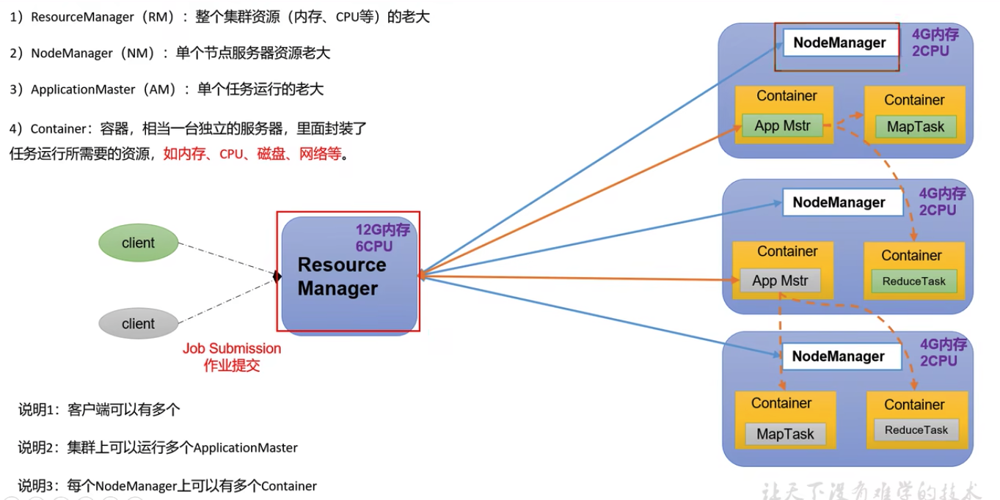

### MapReduce架构

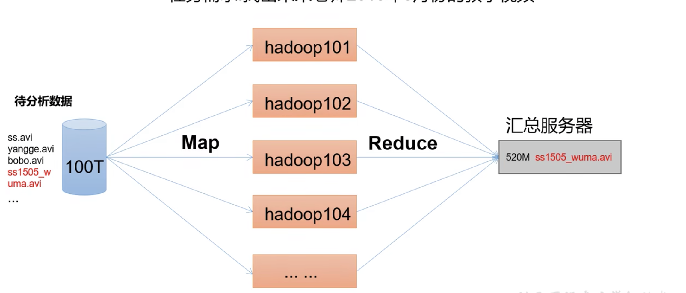

### 三者关系

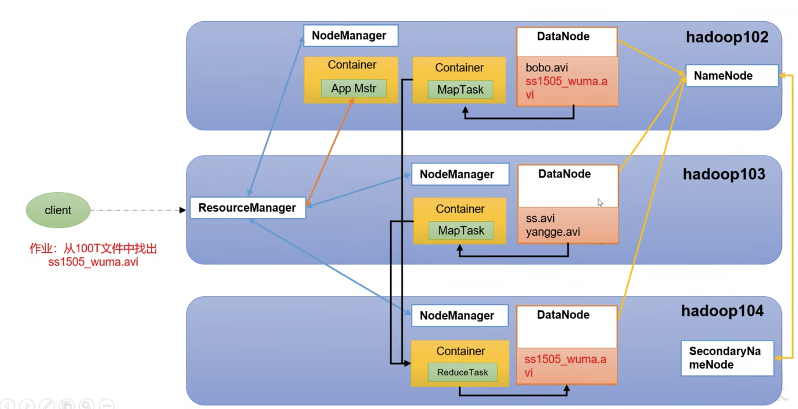

### 大数据生态体系

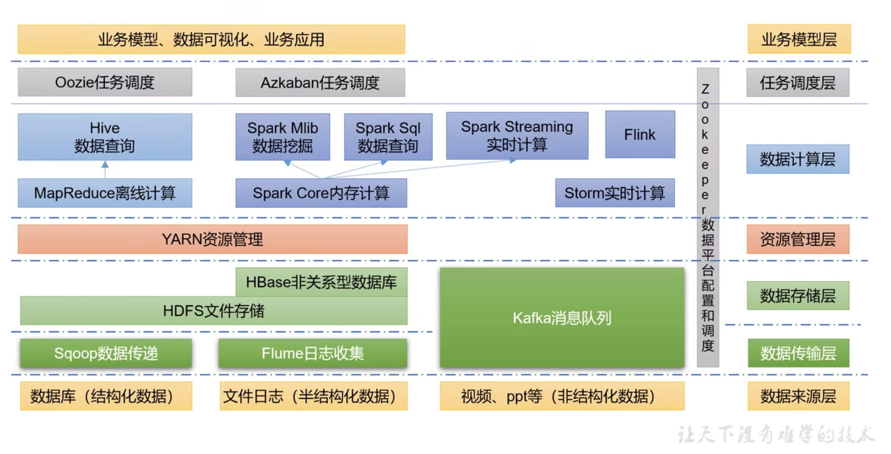

### 推荐系统项目框架

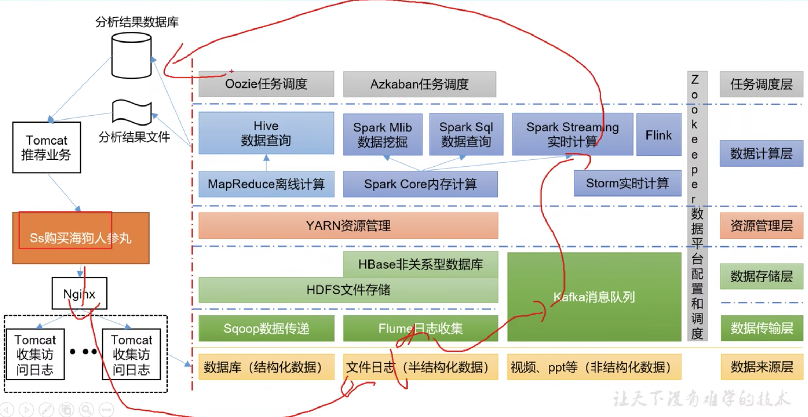 

### 环境搭建

```shell
JDK 1.8.0
Hadoop 3.1.3
```


#### 三种架构

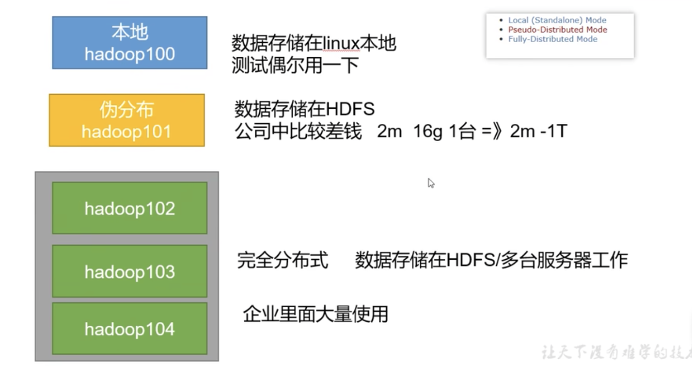

- rsync和 sep区别：用 rsync做文件的复制要比 sep的速度快， rsync 只对差异文件做更新.scp是把所有文件都复制过去。

#### 集群部署 样例

> 主要原则: 
>
> - NameNode 和 SecondaryNameNode 不要安装在同一台服务器
> - ResourceManager也很消耗内存,不要和NameNode、 SecondaryNameNode配置在

##### 1. 规划

##### 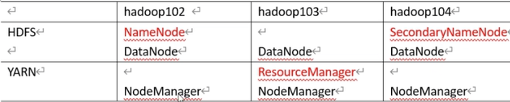

##### 2. 配置文件说明

- Hadoop 配置文件分两类：默认配置文件和自定义配置文件，只有用户想修改某一默认
  配置值时,才需要修改自定义配置文件,更改相应属性值。

- 默认配置文件文件存放在 Hadoop 的 jar 包中的位置

  -  [core-default.xml]  hadoop-common-3.1.3.jaf/core-default.xml
  -  [hdfs-default.xml]  hadoop-hdfs-3.1.3.jar/hdfs-default.xml
  -  [yarn-default.xml]  hadoop-yarn-common-3.1.3.jar/yarn-default.xml
  -  [mapred-default.xml] hadoop-mapreduce-client-core-3.1.3.jar/mapred-default.xml

- 自定义配置文件：

  - core-site.xml

    - ```xml
       <configuration>
       <!--指定NameNode 的地址-->
       <property>
       <name>fs.defaultES</name>
       <value>hdfs://hadoop102:8020</value>
       </property>
      <!-- 指定 hadoop 数据的存储目录 --> 
       <property>
       <name>hadoop.tmp.dir</name>
       <value>/opt/module/hadoop-3.1.3/data</value>
       </property>
      <!--配置 HDFS 网页登录使用的静态用户为 atguigu -->
       <property>
       <name>hadoop.http.staticuser.user</name>
       <value>atquiqu</value>
       </property>
       </configuration>
      ```

  - hdfs-site.xml

    - ```xml
       <?xml version="1.0" encoding="UTF-8"?>
       <?xml-stylesheet type="text/xsl" href="configuration.xsl"?>
       <configuration>
       <!-- nn web 端访问地址-->
       <property>
       <name>dfs.namenode.http-address</name>
       <value>hadoop102:9870</value>
       </property>
       <!--2nn web端访问地址-->
       <property>
       <name>dfs.namenode.secondary.http-address</name>
       <value>hadoop104:9868</value>
       </property>
       </confiquration>
      ```

  - yarn-site.xml

  - ```xml
     <configuration>
     <!--指定MR走shuffle-->
     <property>
     <name>yarn.nodemanager.aux-services</name>
     <value>mapreduce_shuffle</value>
     </property>
     <!--指定 ResourceManager_的地址-->
     <property>
     <name>yarn.resourcemanager.hostname</name>
     <value>hadoop103</value>
     </property>
    <!-- 环境变量的继承 -->
     <property>
     <name>yarn.nodemanager.env-whitelist</name>
     <value>JAVA_HOME,HADOOP_COMMON_HOME,HADOOP_HDFS_HOME,HADOOP_ CO
     NF_DIR, CLASSPATH_PREPEND_DISTCACHE, HADOOP_YARN_HOME, HADOOP_MAP
     RED_HOME</value>
     </property>
     </confiquration>
    ```

  - mapred-site.xml 

    - ```xml
       <?xml version-"1.0" encoding-"UTF-8"?>
       <?xml-stylesheet type="text/xsl" href="configuration.xsl"?>
       <configuration>
       <!-- 指定 MapReduce 程序运行在 Yarn 上 -->
       <property>
       <name>mapreduce.framework.name</name>
       <value>yarn</value>
       </property>
       </confiquration>
      ```

  - 四个配置文件存放在HADOOP_HOME/etc/hadoop 这个路径上，用户可以根据项目需求重新进行修改配置。

##### 3. 启动集群

1. 如果集群是第一次启动,需要在hadoop102节点格式化NameNode (注意:格式化NameNode,会产生新的集群id,导致NameNode和DataNode的集群id不一致,集群找不到已往数据。如果集群在运行过程中报错,需要重新格式化NameNode 的话,一定要先停止 namenode和 datanode进程,并且要删除所有机器的data和logs目录,然后再进行格式化。）

   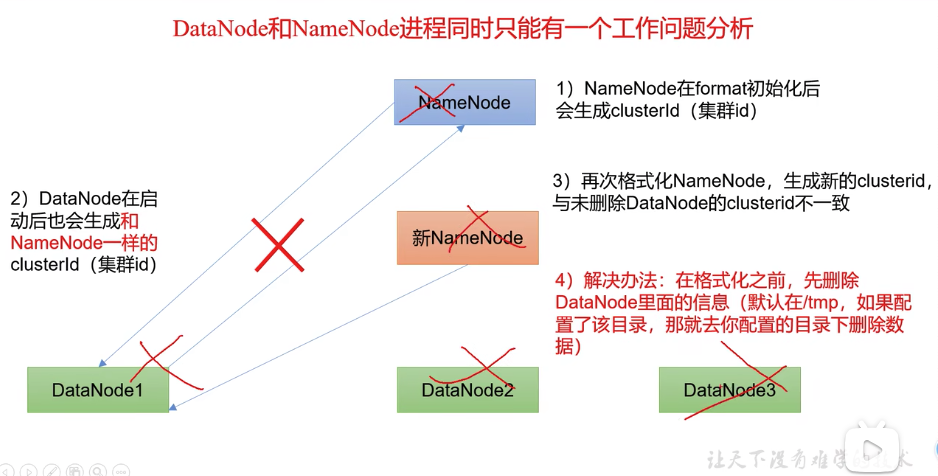

   - $ hdfs namenode -format

2. 启动HDFS
   - $ sbin/start-dfs.sh

3. 在配置了ResourceManager 的节点（hadoop103）启动 YARN
   -  $ sbin/start-yarn.sh

4. Web 端查看 HDFS 的 NameNode
   - (a)浏览器中输入: http://hadoop102:9870
   - (b)查看 HDFS 上存储的数据信息

5. Web 端查看 YARN 的ResourceManager
   - (a)浏览器中输入: http://hadoop103:8088
   -  (b)查看 YARN 上运行的 Job 信息


##### 4. 集群测试

1. 上传文件到集群
   - 上传小文件
     - $hadoop fs -mkdir /input
     - $hadoop fs -put /wcinput/word.txt  /wcinput
   - 上传大文件
     - $ hadoop fs -put /opt/software/jdk-8u212-linux-x64.tar.gz /

2. 上传文件后查看文件存放在什么位置
   - 查看 HDFS 文件存储路径
      $ pwd /opt/module/hadoop-3.1.3/data/dfs/data/current/BP-1436128598-
      192.168.10.102-1610603650062/current/finalized/subdir0/subdir0
   - 查看 HDFS 在磁盘存储文件内容
     - $ cat blk_10737418254 hadoop 

3. 下载
   - $ hadoop fs -get /jdk-8u212-linux-x64.tar.gz ./
4. 执行 wordcount 程序$hadoop  jar share/hadoop/mapreduce/hadoop-mapreduce-examples-3.1.3.jar wordcount /input /output

##### 5. 配置历史服务器

> 记录任务的历史运行记录

1. 配置mapred-site.xml
   $ vim mapred-site.xml
   在该文件里面增加如下配置。

   ``` xml
   <！-- 历史服务器端地址： --> 
   <property>
    <name>mapreduce,jobhistory.address</name>
    <value>hadoop102:10020</value>
    </property>
   <！-- 历史服务器 web 端地址 -->+
    <property>
    <name>mapreduce.jobhistory.webapp.address</name>
    <value>hadoop102:19888</value>
    </property>
   ```

   

2. 分发配置
    $xsync $HADOOP_HOME/etc/hadoop/mapred-site.xml
    hadoop

3. 在 hadoop102启动历史服务器
   $ mapred --daemon start historyserver

4. 查看历史服务器是否启动
   $ jps

##### 6. 配置日志的聚集

> 将各服务器节点上的log汇总成一个对外接口
>
>  注意：开启日志聚集功能，需要重新启动 NodeManager、ResourceManager、HistoryServer

1. 配置 yarn-site.xml
   $ vim yarn-site.xml

   ```xml
   <！-- 开启日志聚集功能 -->
    <property>
    <name>yart. log-aggregation-enable</name>
    <value>true</value><
    </property>
   <！-- 设置日志聚集服务器地址 -->
    <property>
    <name>yarn.log.server.url</name> 
    <value>http://hadoop102:19888/jobhistory/logs</value>
    </property>
   <！-- 设置日志保留时间为7天 --Y
    <property>
    <name>yarn.log-aggregation.retain-seconds</name>
    <value>604800</value>
    </property>
   ```

2. 分发配置
   $ xsync $HADOOP_HOME/etc/hadoop/yarn-site.xml

3. 关闭 NodeManager、ResourceManager 和 HistoryServer
   $ sbin/stop-yarn.she
   $ mapred --daemon stop historyserver
4. 启动NodeManager、 ResourceManage和HistoryServer
    $ start-yarn.she
    $ mapred --daemon start historyserver
5. 删除 HDFS 上已经存在的输出文件
   $ hadoop fs -rm -r /outpute
6. 执行 WordCount 程序
   $ hadoop jar share/hadoop/mapreduce/hadoop-mapreduce-examples-3.1.3.jar wordcount /input /outpu
7. 查看日志
   历史服务器地址 http://hadoop102:19888/jobhistory

##### 7. 集群启动/停止方式总结

1. 各个模块分开启动/停止（配置 ssh 是前提）常用
   （1）整体启动/停止 HDFS
    start-dfs.sh/stop-dfs.sh
   （2）整体启动/停止 YARN
    start-yarn.sh/stop-yarn.sh
2. 各个服务组件逐一启动/停止
   （1）分别启动/停止: HDFS 组件
    hdfs --daemon start/stop namenode/datanode/secondarynamenode
   （2）启动/停止YARN
    yarn --daemon start/stop resourcemanager/nodemanager

##### 8. 常用脚本

- 启动/关闭 集群

  ``` shell
   #!/bin/bash
   if [ $# -lt 1]
   then
   	echo "No Args Input...
   	exit ;
   fi
   
   case $1 in
   "start")
   				echo "启动 hadoop集群"
   				echo "启动 hdfs"
   				ssh hadoop102 "/opt/module/hadoop-		3.1.3/sbin/start-dfs.sh
   				echo "启动 yarn"
   				ssh hadoop103 "/opt/module/hadoop-3.1.3/sbin/start-yarn.sh
   				echo "启动 historyserver"
   				ssh hadoop102 "/opt/module/hadoop-3.1.3/bin/mapred --daemon start historyserver"
   ;; 
   stop")
    			echo "关闭 hadoop集群"
   				echo "关闭 historyserver"
   				ssh hadoop102 "/opt/module/hadoop-3.1.3/bin/mapred --daemon stop historyserver"
   				echo "关闭 yarn:"
   				ssh hadoop103 "/opt/module/hadoop-3.1.3/sbin/stop-yarn.sh"          ا
   				echo "关闭hdfs"
   				ssh hadoop102 "/opt/module/hadoop-3.1.3/sbin/stop-dfs.sh"
   ;;
   echo "Input Args Error..."
   ;;
   esac
  ```

- 查看三台服务器Java进程脚本: jpsall
   [atguigu@hadoop102 -1$ cd /home/atquiqu/bine
   [atguigu@hadoop102 bin]$ vim jpsall

  ``` shell
   #!/bin/bash
   for host in hadoop102 hadoop103 hadoop104
   do
   			echo ===============  $host  ===============
   			ssh $host	jps
   done
  ```


   [atguigu@hadoop102 bin]$ chmod +x jpsalle

### 面试题

#### 常用端口号

- hadoop3.x
  - HDFS NameNode 内部通常端口：8020/9000/9820
  - HDFS NameNode对用户的查询端口: 9870
  - Yarn查看任务运行情况的：8088
  - 历史服务器：19888
-  hadoop2.x
  - HDFS NameNode内部通常端口: 8020/9000
  - HDFS NameNode对用户的查询端口: 50070
  - Yarn查看任务运行情况的：8088
  - 历史服务器: 19888

#### 常用的配置文件
- 3.x 
  - core-site.xml 
  - hdfs-site.xml
  - yarn-site.xml
  - mapred-site.xml workers
- 2.x 
  - core-site.xml
  -  hdfs-site.xml
  -  yarn-site.xml
  -  mapred-site.xml slaves

### 集群时间同步

- 生产环境：如果服务器能连接外网，则不需要时间同步

- 生产环境：如果服务器不能连接外网，则需要设置一个服务器为时间服务器，其他服务器的时间以此服务器时间为准对齐

**具体实现**

- 时间服务器

（1）查看所有节点 ntpd 服务状态和开机自启动状态

``` shell
 sudo systemctl status ntpde
 sudo systemctl start ntpd
 sudo systemctl is-enabled ntpd
```

 (2)修改hadoop102的ntp.conf配置文件
 sudo vim /etc/ntp.confe
修改内容如下
（a）修改 1（授权 192.168.10.0-192.168.10.255 网段上的所有机器可以从这台机器上查询和同步时间）
 #restrict 192.168.10.0 mask 255.255.255.0 nomodify notrap
 为restrict 192.168.10.0 mask 255.255.255.0 nomodify notrap
（b）修改 2（集群在局域网中，不使用其他互联网上的时间）
 server 0.centos.pool.ntp.org iburst
 server 1.centos.pool.ntp.org iburst
 server 2.centos.pool.ntp.org iburst
 server 3.centos.pool.ntp.org iburst

（c） 添加 3（当该节点丢失网络连接，依然可以采用本地时间作为时间服务器为集群中的其他节点提供时间同步）
 server 127.127.1.0
 fudge 127.127.1.0 stratum 10
 （3）修改 hadoop102 的/ete/sysconfig/ntpd 文件
$ sudo vim /etc/sysconfig/ntpd
增加内容如下（让硬件时间与系统时间一起同步）
 SYNC HWCLOCK-yes
（4）重新启动 ntpd 服务
$ sudo systemctl start ntpd
(5)设置 ntpd 服务开机启动
$sudo systemctl enable ntpde

- 其他机器配置（必须root用户)
  （1）关闭所有节点上 ntp 服务和自启动
  	$ sudo systemctl stop ntpd
  $ sudo systemctldisable ntpd
  $ sudo systemctl stop ntpd
  $ sudo systemctl disable ntpde
  (2)在其他机器配置1分钟与时间服务器同步一次
  $ sudo crontab -e
  编写定时任务如下：
   */1 * * * * /usr/sbin/ntpdate hadoop1024
  （3）修改任意机器时间
   $ sudo date -s "2021-9-11 11:11:11"
  （4）1 分钟后查看机器是否与时间服务器同步
   $ sudo date

## HDFS

### 一、概述

#### 1.1 HDFS产生背景和定义

- 1）HDFS 产生背景
  随着数据量越来越大,在一个操作系统存不下所有的数据,那么就分配到更多的操作系统管理的磁盘中,但是不方便管理和维护,迫切需要一种系统来管理多台机器上的文件,这就是分布式文件管理系统。HDFS只是分布式文件管理系统中的一种。
-  2） HDFS 定义
   HDFS（Hadoop Distributed File System），它是一个文件系统，用于存储文件，通过目录树来定位文件；其次，它是分布式的，由很多服务器联合起来实现其功能，集群中的服务器有各自的角色。
  HDFS 的使用场景：适合一次写入，多次读出的场景。一个文件经过创建、写入和关闭之后就不需要改变。


#### 1.2 优缺点

优点

- 高容错：多副本；副本丢失可恢复
- 适合处理大数据：数据规模；文件规模
- 可构建在廉价机器上，通过多副本机制提高可靠性

缺点

- 不适合低时延数据访问，如毫秒级
- 无法高效对大量小文件存储
  - 会占用namenode大量内存
  - 寻址时间超过读取时间
- 不支持并发写入，文件随机修改
  - 一个文件只能有一个写，不允许多个线程同时写
  - 仅支持数据append，不支持随机修改

#### 1.3 组成

  1) NameNode (nn)：就是Master，它是一个主管、管理者。
  - 管理HDFS的名称空间；
  - 配置副本策略；
  - 管理数据块(Block)映射信息;
  - 处理客户端读写请求。
  2) DataNode:就是Slave。 NameNode下达命令, DataNode执行实际的操作。
  - 存储实际的数据块；
  - 执行数据块的读/写操作。
  3) Client：就是客户端。
  - 文件切分。文件上传HDFS的时候，Client将文件切分成一个一个的Block，然后进行上传；
  - 与NameNode交互，获取文件的位置信息；
  - 与DataNode交互，读取或者写入数据
  - Client提供一些命令来管理HDFS，比如NameNode格式化；
  - Clie nt可以通过一些命令来访问HDFS，比如对HDFS增删查改操作；
  4) Secondary NameNode：并非NameNode的热备。当NameNode挂掉的时候，它并不能马上替换NameNode并提供服务。
  - 辅助NameNode，分担其工作量，比如定期合并Fsimage和Edits，并推送给NameNode；
  - 在紧急情况下，可辅助恢复NameNode。

#### 1.4 文件块大小问题

HDFS中的文件在物理上是分块存储（Block),块的大小可以通过配置参数 (dfs.blocksize)来规定,默认大小在Hadoop2.x/3.x版本中是128M, 1.x版本中是64M.


- 如果寻址时间约为10ms,即查找到目标block的时间为 10ms.
- 寻址时间为传输时间的1%时，则为最佳状态。（专家）因此，传输时间=10ms/0.01=1000ms=1s


**思考：为什么块的大小不能设置太小，也不能设置太大？**

- HDFS的块设置太小，会增加寻址时间，程序一直在找块的开始位置；
- 如果块设置的太大，从磁盘传输数据的时间会明显大于定位这个块开始位置所需的时间。导致程序在处理这块数据时，会非常慢。
- 总结：HDFS块的大小设置主要取决于磁盘传输速率。

### 二、HDFS Shell操作 开发重点

- Hadoop fs =hdfs dds

#### 2.1 常用命令

- 上传
  - hadoop fs -moveFromLocal source target
  - hadoop fs -copyFromLocal source target
  - hadoop fs -put source target
  - hadoop fs -appendToFile source target

- 下载
  - hadoop fs -copyToLocal source target
  - hadoop fs -get source target

- HDFS 直接操作
  - hadoop fs -ls 
  - hadoop fs -cat
  - hadoop fs -chgrp | -chown | -chmod 
  - hadoop fs -mkdir
  - hadoop fs -cp : 从hdfs一个路径拷贝到另一个路径
  - hadoop fs -rm
  - hadoop fs -du -s -h
  - hadoop fs -setrep (上限是datanode的数量)
  - ...

### 三、HDFS客户端API

 配置文件到优先级：

**hdfs-default.xml => hdfs-site.xml=> 在项目资源目录下的配置文件 => 代码里面的配置**

``` java
public class HdfsClient{
 	@Test
 	public void testmkdir() throws URISyntaxException, IOException{
		// 连接的集群nn地址
 		URI uri = new URI( str: "hdfs://hadoop102:8020");
		// 创建一个配置文件
 		Configuration configuration = new Configuration();
		// 用户
 		String user = "atguigu";
		// 1 获取到了客户端对象
 		FileSystem fs = FileSystem.get(uri, configuration,user);
		// 2 创建一个文件夹
 		fs.mkdirs(new Path( pathString: "/xiyou/huaguoshan"));
		// 3 关闭资源
 		fs.close();
 	}
}
```


### 四、HDFS的读写流程 面试重点

#### 4.1 HDFS写数据

##### 4.1.1 文件写入

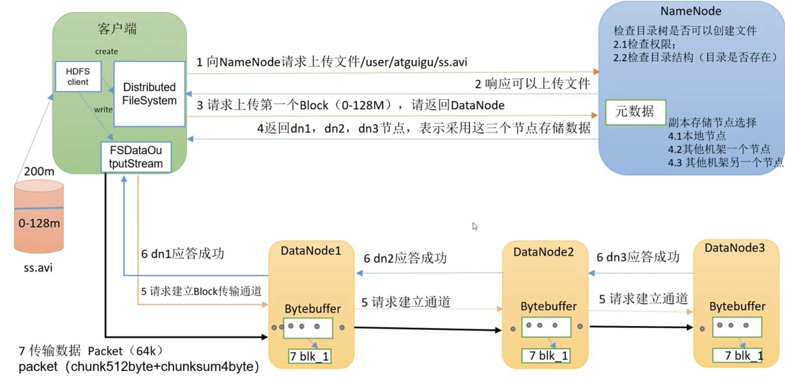

##### 4.1.2 网络拓扑-节点距离计算

> 在 HDFS 写数据的过程中,NameNode 会选择距离待上传数据最近距离的 DataNode 接收数据，那么这个最近距离怎么计算呢？=算到达共同祖先的路径之和

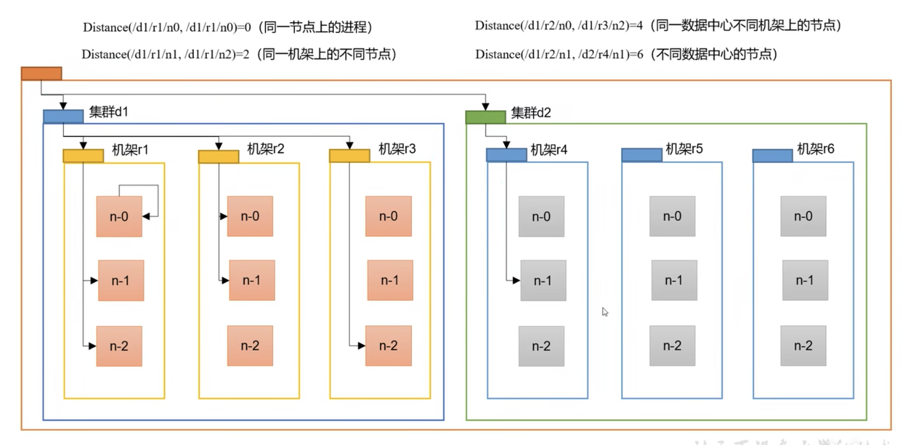

#### 4.1.3 副本节点选择

- 假如是3个副本
  - 第一个副本在Client所处的节点上。
    如果客户端在集群外，随机选一个。
  - 第二个副本在另一个机架的随机一个节点
  - 第三个副本在第二个副本所在机架的随机节点

#### HDFS的读数据流程

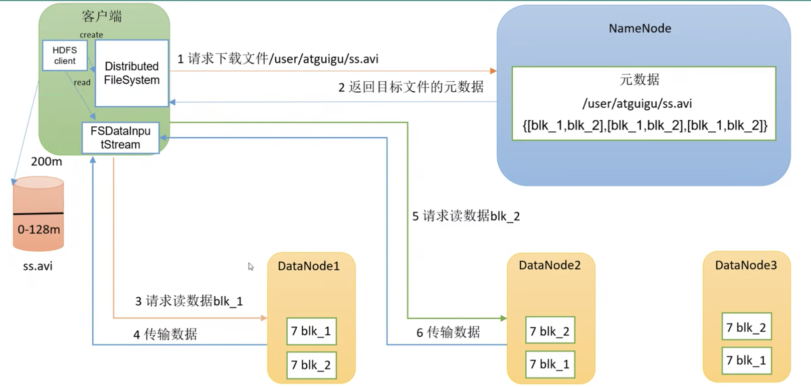

### 五、NN和2NN

#### 5.1 NN和2NN工作机制

>  思考：NameNode 中的元数据是存储在哪里的？

首先,我们做个假设,如果存储在NameNode节点的磁盘中,因为经常需要进行随机访问，还有响应客户请求，必然是效率过低。因此，元数据需要存放在内存中。但如果只存在内存中，一旦断电，元数据丢失，整个集群就无法工作了。因此产生在磁盘中备份元数据的 Fslmage.
这样又会带来新的问题，当在内存中的元数据更新时，如果同时更新 FsImage，就会导题致效率过低，但如果不更新,就会发生一致性问题,一旦NameNode节点断电，就会产生数据丢失。因此，引入 Edits文件（只进行追加操作，效率很高）。每当元数据有更新或者添加元数据时，修改内存中的元数据并追加到 Edits 中。这样，一旦 NameNode 节点断电，可以通过 FsImage 和 Edits 的合并，合成元数据。


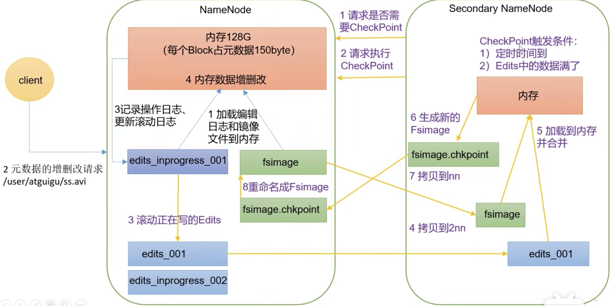

#### 5.2 FsImage 和Edits概念

##### 5.2.1 概念

NameNode被格式化之后，将在/opt/module/hadoop-3.1.3/data/tmp/dfs/name/current目录中产生如下文件

- fsimage_0000000000000000000
- fsimage_0000000000000000000.md5
- seen_txid
- VERSION

 (1) Fsimage文件：HDFS文件系统元数据的一个永久性的检查点，其中包含HDFS文件系统的所有目
录和文件inode的序列化信息。
(2 ) Edits文件：存放HDFS文件系统的所有更新操作的路径，文件系统客户端执行的所有写操作首先
会被记录到Edits文件中。
(3) seen_txid文件保存的是一个数字，就是最后一个edits_的数字

##### 5.2.2 命令

- oiv  apply the offline fsimage viewer to an fsimage
- oev  apply the offline edits viewer to an edits filee


hdfs oiv -p 文件类型 -i 镜像文件 -o 转换后文件输出路径


namenode并没有存储文件块存在哪个服务器上，这是datanode自己上线是向namenode同步的

#### 5.3 CheckPoint

> 通常不用，而是使用namenode的高可用

1.  通常情况下，SecondaryNameNode 每隔一小时执行一次。
    hdfs-default.xml

   ```  xml
    <name>dfs.namenode.checkpoint.period</name>
    <value>3600s</value>
   ```

2. 一分钟检查一次操作次数，当操作次数达到1 百万时， SecondaryNameNode执行一次。
   ``` xml
    <property>
    <name>dfs.namenode.checkpoint.txns</name>
    <value>1000000</value>
    <description>操作动作次数</description>
    </property>
    <property>
    <name>dfs.namenode.checkpoint.check.period</name>+
    <yalue>60s</value
    <description> 1分钟检查一次操作次数</description>
    </property>
   ```

### 六、Datanode

#### 6.1 datanode 工作机制

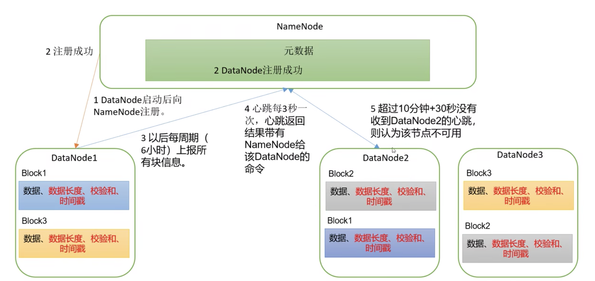


- DN 向 NN 汇报当前解读信息的时间间隔，默认 6 小时；

  ``` xml
   <property>
   <name>dfs.blockreport.intervalMsec</name>
   <value>21600000</value>
   <description>Determines block feporting interval in
   milliseconds.</description>
   </property>
  ```

  

- DN扫描自己节点块信息列表的时间,认6小时
   ``` xml
   <property>
    <name>dfs.datanode.directoryscan.interval</name>
    <value>21600s</value>
    <description>Interval in seconds for Datanode to scan data
    directories and reconcile the difference between blocks in memory and on
    the disk.
    Support multiple time unit suffix(case insensitive), as describede
    in dfs.heartbeat.interval.
    </description>
    </property>
   ```

  #### 6.2 数据完整性

  CRC校验

  #### 6.3 掉线参数时限设置

  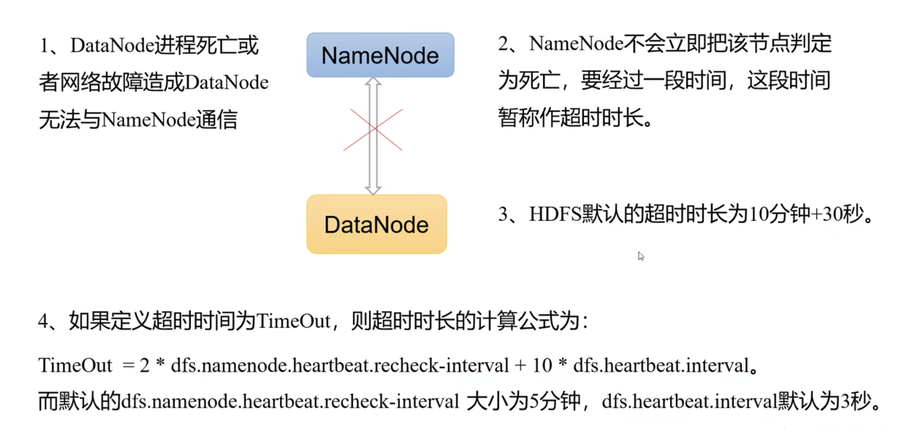

## MapReduce

 ### 一、MapReduce概述

**定义**

- MapReduce 是一个分布式运算程序的编程框架，是用户开发“基于 Hadoop 的数据分析应用”的核心框架。
- MapReduce 核心功能是将用户编写的业务逻辑代码和自带默认组件整合成一个完整的分布式运算程序，并发运行在一个 Hadoop 集群上。


**MapReduce：自己处理业务相关代码+ 自身的默认代码**

- 优点：
  1、易于编程。用户只关心，业务逻辑。 实现框架的接口。
  2、良好扩展性:可以动态增加服务器,解决计算资源不够问题
  3、高容错性。任何一台机器挂掉,可以将任务转移到其他节点。
  4、适合海量数据计算(TB/PB) 几千台服务器共同计算。
- 缺点：
  1、不擅长实时计算。Mysql
  2、不擅长流式计算。Sparkstreaming flink
  3、不擅长DAG有向无环图计算。spark


**核心思想**

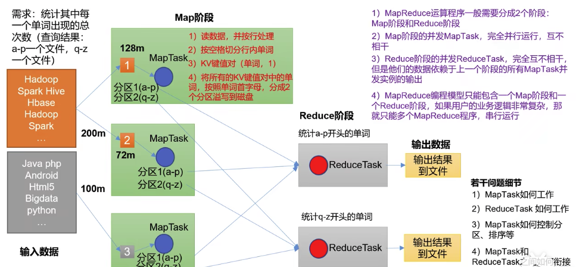


**MapReduce**

一个完整的 MapReduce 程序在分布式运行时有三类实例进程：

1. MrAppMaster:负责整个程序的过程调度及状态协调。
2. MapTask:负责 Map 阶段的整个数据处理流程。
3. ReduceTask:负责 Reduce 阶段的整个数据处理流程。


**MapReduce编程规范**

 用户编写的程序分成三个部分:Mapper、Reduger和Driver
  1. Mapper阶段
       1. 用户自定义的Mapper要继承自己的父类
       2. Mapper的输入数据是KV对的形式（KV的类型可自定义）
       3. Mapper中的业务逻辑写在map（)方法中
       4. Mapper的输出数据是KV对的形式(KV的类型可自定义)
       5. map()方法(MapTask进程)对每一个<K,V>调用一次

  2. Reducer阶段
       1. 用户自定义的Reducer要继承自己的父类
       2. Reducer的输入数据类型对应Mapper的输出数据类型，也是KV
       3. Reducer的业务逻辑写在reduce()方法中
       4. ReduceTask进程对每一组相同k的<k,v>组调用一次reduce()方法

  3. Driver阶段
      相当于YARN集群的客户端,用于提交我们整个程序到YARN集群,提交的是
        封装了MapReduce程序相关运行参数的job对象


**Wrodcount 案例**

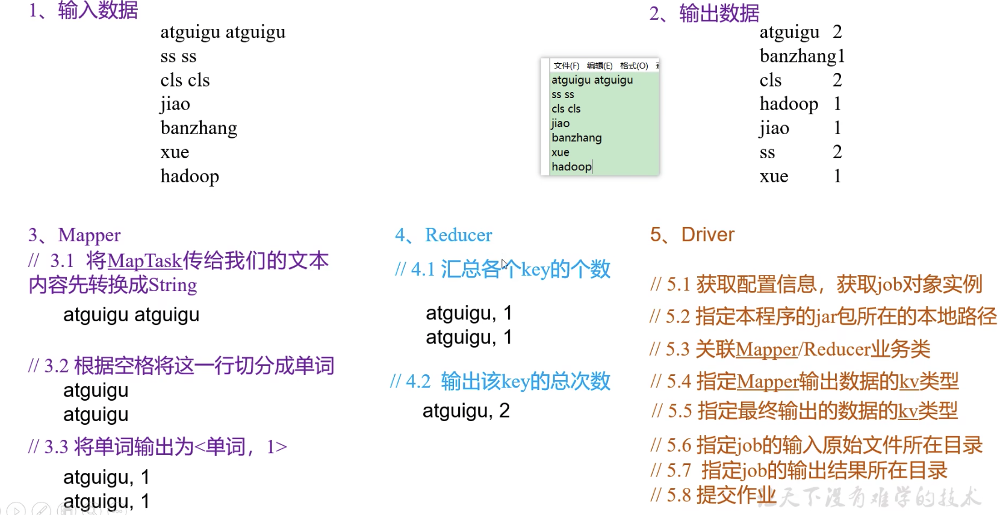


 ### 二、序列化

#### 2.1 Hadoop 序列化特点

- 紧凑：存储空间少，只需数据+简单校验
- 快速：传输速度快
- 互操作性：更通用

#### 2.2 自定义bean对象实现序列化接口

1. 必须实现Writable接口
2. 反序列化时，需要反射调用空参构造函数，所以必须有空参构造

``` java
public FlowBean() {
   super();
}
```


3. 重写序列化方法

``` java
public void write(Dataoutput out) throws IOException {
   out.writeLong(upFlow);
   out.writelong (downFlow);
   out.writelong (sumFlow) ;
 }
```

4. 重写反序列化方法

```java
public void readFields(DataInput in) throws IoException {
 upFlow= in.readlong();
 downFlow= in.readlong();
 sumFlow=in.readLong ();
}
```

5. 注意反序列化的顺序和序列化的顺序完全一致
6. 要想把结果显示在文件中，需要重写 toString()，可用"\t"分开，方便后续用
7. 如果需要将自定义的bean放在key中传输,则还需要实现Comparable接口,因为MapReduce 框中的 Shuffle 过程要求对 key 必须能排序。详见后面排序案例。

```java
public int compareTo(FlowBean o) {
// 例序排列，从大到小
 return this.sumFlow > o.getSumFlow() ? -1 : 1:0
  }
```

#### 2.3 序列化案例-统计手机号的流量数据

```java
/** 
1、定义类式汤eitmhla储行
2、重写序列化积反序列化方法
3、重写空参的法
4、toString方法
*/
 public class FlowBean implements Writable{
   private Long upFtow://上
   private Long dounFLou:/下行流
   private long sumFlow; // 总流量
   //空参构造
   public FlowBean(){}
   //省略 set get
   ...
    public void write(DataOutput out) throws 			IOException {
       out writel onafunElow);
       nut writel ona(downElow);
       out.writeLong(sumFlow);
   }
   
    public void readFields(DataInput in) throws IOException {
     this.upFLow = in.readLongO;
     this.downFlow in.readLongO;
     this,sunFlow = in.readLong();
    }
     public String toString{
        return upFlow +"\t" + downFlow +"\t"+ sumFlou;
     }

 }
```

- Mapper

```java
....
```

- Reducer

```java
....
```

 ###  三、核心框架原理

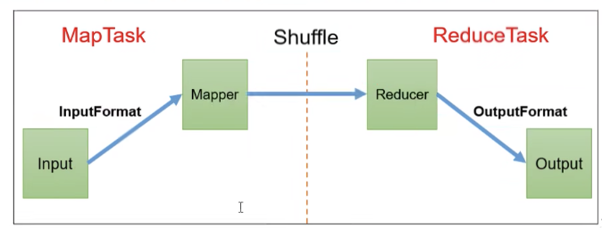

#### 3.1 InputFormat数据输入


##### 3.1.1切片与 MapTask 并行度决定机制

1. 问题引出
   MapTask 的并行度决定 Map阶段的任务处理并发度，进而影响到整个 Job 的处理速度。
   思考：IG 的数据，启动 8 个 MapTask，可以提高集群的并发处理能力。那么 1K 的数据，也启动 8 个 MapTask，会提高集群性能吗？ MapTask 并行任务是否越多越好呢？哪些因素影响了MapTask 并行度？

 2) MapTask 并行度决定机制
- 数据块：Block 是 HDFS 物理上把数据分成一块一块。数据块是 HDFS 存储数据单位。
- 数据切片：数据切片只是在逻辑上对输入进行分片，并不会在磁盘上将其切分成片进行存储。数据切片是 MapReduce 程序计算输入数据的单位，一个切片会对应启动一个 MapTask。

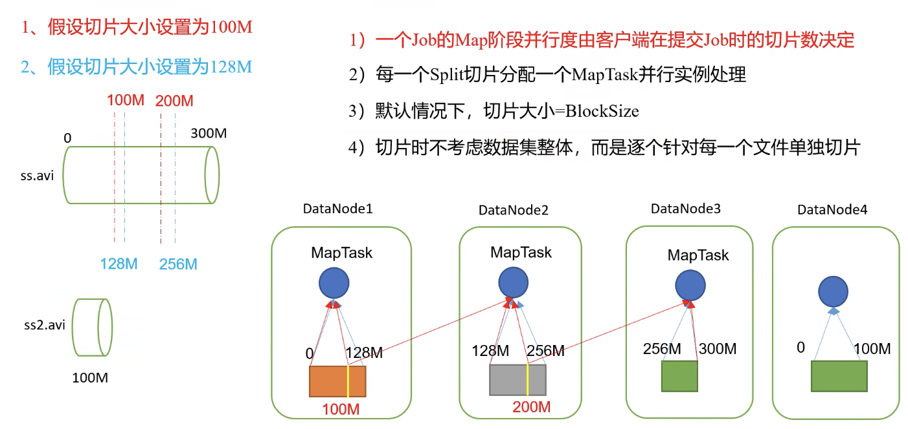


##### 3.1.2 Job提交流程源码和切片源码详解

1. Job提交流程：详细代码此处省略

```java
 waitForCompletion()
 submit ();
// 1 建立连接
 connect ();
//1）创建提交 Job 的代理
 new Cluster(getConfiguration);
//（1）判断是本地运行环境还是 yarn 集群运行环境
 initialize(jobTrackAddr, conf);
 
 
// 2 提交 job
 submitter.submitJobInternal(Job.this,cluster)
// 1）创建给集群提交数据的 Stag 路径
 Path jobstagingArea = JobSubmissionFiles.getStagingDir(cluster, conf);
// 2）获取 jobid，并创建 Job 路径
 JobID jobId = submitClient.getNewJobID();
// 3）拷员 jar 包到集群…
 copyAndConfigureFiles(job, submitJobDir);
 rUploader.uploadFiles(job, jobSubmitDir) ;
// 4)计算切片，生成切片规制文件
 writeSplits (job. submitJobDir):
 maps = writeNewsplits(Job,jobsubmitDir);
 input.getSplitsfiob):
// 5)白esa路径多yM配置文件
writeConf(conf,submitJobFile);
 conf.writeXml (out);
// 6）提交 Job，返回提交状态
 status= submitclient.submitJob(jobId,submitJobDir.toString(),job.getCredentials);ا

```


- 生成四个文件：job.split , job.xml ,job.splitmetainf , job jar包
- 提交成功后，上面四个文件删除

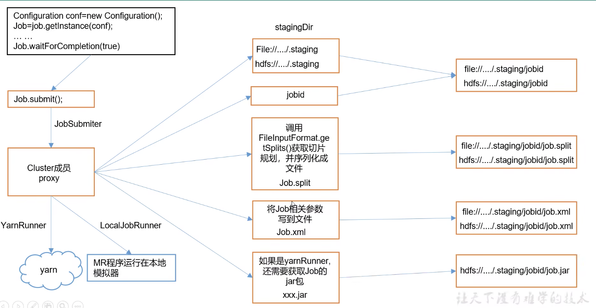

2. 切片逻辑

   - 某个文件单独切片
   -  Long splitsize = computeSplitsize(blockSize, minSize, maxSize); -------> Max(minSize, Min(maxSize,blockSize))

   - 通常：剩下的数据/切片大小>1.1才会切片

##### 3.1.3 FileInputFormat切片源码解析

1. 程序先找到你数据存储的目录。
2. 开始遍历处理（规划切片）目录下的每一个文件
3. 遍历第一个文件ss.txt
   1. 获取文件大小fs.sizeOf(ss.txt)
   2. 计算切片大小computeSplitsize(blockSize, minSize, maxSize); -------> Max(minSize, Min(maxSize,blockSize))
      - blockSize本地一般32M,服务器128/256M
   3. 默认情况下，切片大小=blocksize
   4. 开始切，形成第1个切片：ss.txt—0:128M 第2个切片ss.txt—128:256M 第3个切片ss.txt—256M:300M（每次切片时，都要判断切完剩下的部分是否大于块的1.1倍，不大于1.1倍就划分一块切片）
   5. 将切片信息写到一个切片规划文件中
   6. 整个切片的核心过程在getSplit()方法中完成
   7. InputSplit只记录了切片的元数据信息，比如起始位置、长度以及所在的节点列表等
4. 提交切片规划文件到YARN上，YARN上的MrAppMaster就可以根据切片规划文件计算开启MapTask个数


**FileInputFormat切片机制**

1. 切片机制
   （1）简单地按照文件的内容长度进行切片
   （2）切片大小，默认等于Block大小
   （3）切片时不考虑数据集整体，而是逐个针对每一个文件单独切片
2. 案例分析
   - 输入数据有两个文件：
     - filel.txt 320M
     - file2.txt 10M
   - 经过FileInputFormat的切片机制运算后，形成的切片信息如下：
     -  file1.txt.split1--  0~128
     -  file1.txt.split2-- 128~256
     -  file1.txt.split3--  256~320
     -  file2.txt.split1-- 0~10M


**FileInputFormat切片大小的参数配置**

1. 源码中计算切片大小的公式

   - Math.max(minSize, Math.min(maxSize, blockSize));
   - mapreduce.input.fileinputformat.split.minsize 默认值为1
   - mapreduce.input.fileinputformat.split.maxsize- Long.MAXValue 默认值Long.MAXValue
   - 因此，默认情况下，切片大小=blocksize。

2. 切片大小设置

   - maxsize（切片最大值）：参数如果调得比blockSize小，则会让切片变小，而且就等于配置的这个参数的值。
   - minsize （切片最小值）：参数调的比blockSize大，则可以让切片变得比blockSize还大。

3. 获取切片信息API
   ``` java
   //获取切片的文件名称
    String name = inputSplit.getPath() .getName();
   // 根据文件类型获取切片信息
    FileSplit inputSplit = (FileSplit) context.getInputSplit():
   ```

   

#### 3.1.4 TextInputFormat

  1) FilelnputFormat实现类

    思考：在运行 MapReduce程序时，输入的文件格式包括：基于行的日志文件、二进制格式文件、数据库表等。那么,针对不同的数据类型, MapReduce是如何读取这些数据的呢?
  - FilelnputFormat 常见的接口实现类包括：TextInputFormat、KeyValueTextInputFormat、NLineInputFormat、CombineTextInputFormat和自定义InputFormat 等。
  2) TextInputFormat
     - TextinputFormat是默认的FileInputFormat实现类。按行读取每条记录。键是存储该行在整个文件中的起始字节偏移量,LongWritable类型。值是这行的内容,不包括任何行终止符（换行符和回车符），Text 类型。
     - 关键函数：
       - RecorderReader:读取方式，按行读
       - isSplitable:是否可切片

##### 3.1.4 CombineTextInputFormat

框架默认的 TextinputFormat 切片机制是对任务按文件规划切片，不管文件多小，都会是一个单独的切片，都会交给一个 MapTask，这样如果有大量小文件，就会产生大量的MapTask，处理效率极其低下。

1. 应用场景
   CombineTextinputFormat 用于小文件过多的场景，它可以将多个小文件从逻辑上规划到一个切片中，这样，多个小文件就可以交给一个 MapTask 处理。
2. 虚拟存储切片最大值设置
    CombineTextlnputFormat.setMaxInputSplitSize(job, 4194304):// 4m
   注意：虚拟存储切片最大值设置最好根据实际的小文件大小情况来设置具体的值。
3. 切片机制
   生成切片过程包括：虚拟存储过程和切片过程二部分。


 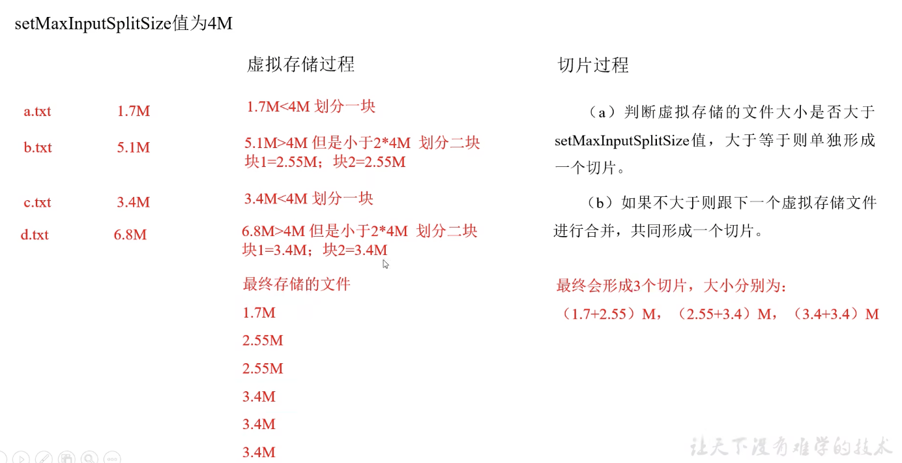


**关键代码**

```java
// 如果不设置 InputFormat，它默认用的是TextInputFormat.class
job,setInputFormatClass (CombineTextInputFormat.class) 
//虚拟存储切片最大值设置 4m
CombineTextInputFormat.setMaxInputSplitSize(job,4194304;
```

#### 3.2 MapReduce工作流程

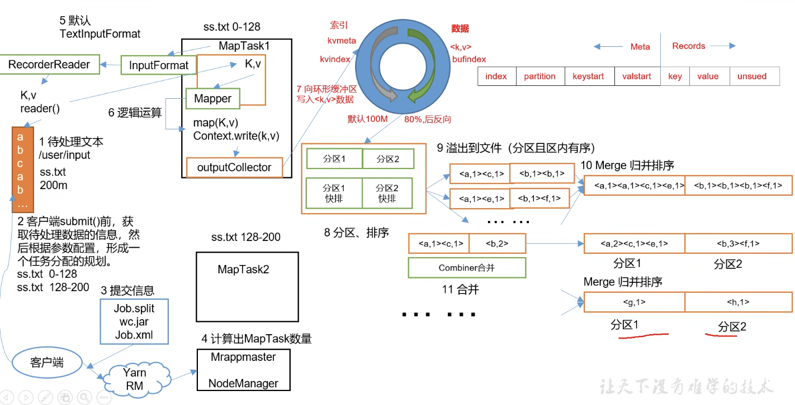


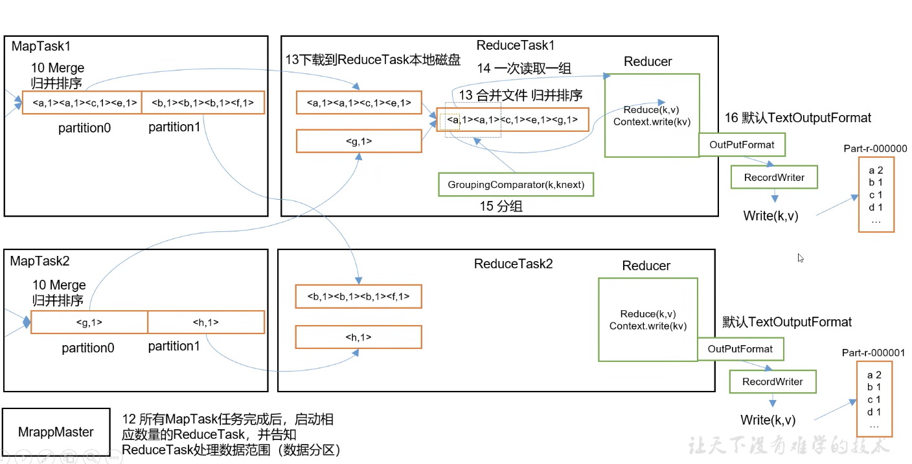

#### 3.3 Shuffle机制

##### 3.3.1 shuffle机制

**Map 方法之后，Reduce 方法之前的数据处理过程称之为 Shuffle**

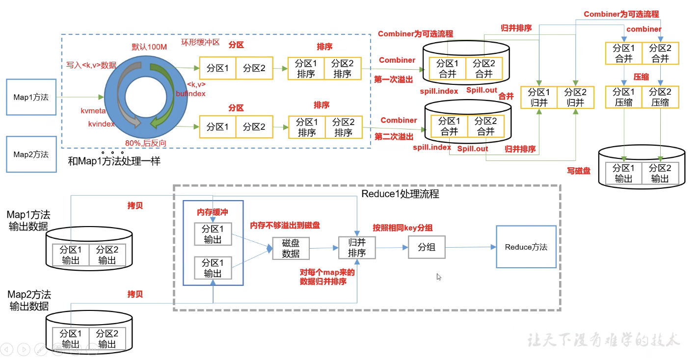

- 对key根据字典顺序进行快排

##### 3.3.2 patition分区

1. 问题引出
   要求将统计结果按照条件输出到不同文件中（分区）。比如：将统计结果按照手机归属地不同省份輸出到不同文件中(分区)
2. 默认Partitioner分区

```java
 public class HashPartitioner<K, V> extends Partitioner<K, V> {
 public int getPartition(K key, V value, int numReduceTasks) return (key.hashCode() & Integer.MAX_VALUE) %numReduceTasks;
 }
}
```

默认分区是根据key的hashCode对ReduceTasks个数取模得到的,用户没法控制哪个key存储到哪个分区。

3. 自定义Partitioner步骤

   1. 自定义类继承Partitioner，重写getPartition（）方法

   ``` java
    public class CustomPartitioner extends Partitioner<Text, FlowBean> {
    	public int getPartition(Text key, FlowBean value, int numPartitions) {
     // 控制分区代码逻辑
      return partition;
   	}
   }
   ```

   2. 在Job驱动中，设置自定义

      `Partitionerjob.setPartitionerClass(CustomPartitioner.class);` 

   3. 自定义Partition后，要根据自定义Partitioner的逻辑设置相应数量的ReduceTask `job.setNumReduceTasks(5);` 

4. 分区总结

   1. 如果ReduceTask的数量>getPartition的结果数，则会多产生几个空的输出文件part-r-000xx;
   2. 如果1<ReduceTask的数量<getPartition的结果数，则有一部分分区数据无处安放，会Exception;
   3. 如果ReduceTask的数量-1，则不管MapTask端输出多少个分区文件，最终结果都交给这一个ReduceTask，最终也就只会产生一个结果文件 part-r-00000;
   4. 分区号必须从零开始,逐一累加.

5. 案例分析
   例如：假设自定义分区数为5，则

   1.  job.setNumReduceTasks(1);
      会正常运行，只不过会产生一个输出文件
   2. job.setNumReduceTasks(2);
      会报错
   3.  job.setNumReduceTasks(6);
      大于5，程序会正常运行，会产生空文件

##### 3.3.3 WritableComparable排序

- **排序概述**

  - 排序是MapReduce框架中最重要的操作之一。

  - MapTask和ReduceTask均会对数据按照key进行排序。该操作属于Hadoop的默认行为。任何应用程序中的数据均会被排序，而不管逻辑上是否需要。

  - 默认排序是按照字典顺序排序，且实现该排序的方法是快速排序

- **两个步骤**

  - 对于MapTask,它会将处理的结果暂时放到环形缓冲区中,当环形缓冲区使用率达到一定阈值后，再对缓冲区中的数据进行一次快速排序，并将这些有序数据溢写到磁盘上，而当数据处理完毕后，它会对磁盘上所有文件进行归并排序。

  - 对于ReduceTask,它从每个MapTask上远程拷贝相应的数据文件,如果文件大小超过一定阈值，则溢写磁盘上，否则存储在内存中。如果磁盘上文件数目达到一定阈值，则进行一次归并排序以生成一个更大文件；如果内存中文件大小或者数目超过一定阈值，则进行一次合并后将数据溢写到磁盘上。当所有数据拷贝完毕后，ReduceTask统一对内存和磁盘上的所有数据进行一次归并排序。

- **排序分类**

  - 部分排序
    MapReduce根据输入记录的键对数据集排序。保证输出的每个文件内部有序。
  - 全排序
    最终输出结果只有一个文件,且文件内部有序。实现方式是只设置一个ReduceTask。但该方法在处理大型文件时效率极低，因为一台机器处理所有文件，完全丧失了MapReduce所提供的并行架构。

  - 辅助排序: (GroupingComparator分组)
    在Reduce端对key进行分组。应用于：在接收的key为bean对象时，想让一个或几个字段相同（全部字段比较不相同）的key进入到同一个reduce方法时，可以采用分组排序。
  - 二次排序
    在自定义排序过程中，如果compareTo中的判断条件为两个即为二次排序。

- **自定义排序原理分析**

  -  bean 对象做为key 传输，需要实现  WritableComparable 接口重写 compareTo 方法，就可以实现排序。

    ```java
     public int compareTo(FlowBean bean) {
     		int result;
    		//按照总流量大小,倒序排列
     		if (this.sumFlow >bean.getSumFlow()){result = -1;}
     		else if (this.sumFlow<bean.getSumFlow()) {
     result = 1;}
     		else{result = 0}
     		return result;
     }
    ```

    

##### 3.3.4 Combiner

1. Combiner是MR程序中Mapper和Reducer之外的一种组件。

2. Combiner组件的父类就是Reducer

3. Combiner和Reducer的区别在于运行的位置
    Combiner是在每一个MapTask所在的节点运行；
    Reducer是接收全局所有Mapper的输出结果;

4. Combiner的意义就是对每一个MapTask的输出进行局部汇总,以减小网络传输量。

5. Combiner能够应用的前提是不能影响最终的业务逻辑，而且，Combiner的输出kv应该跟Reducer的输入kv类型要对应起来。

   - 比如：求平均值  

   

   如果设置reduceTask=0,那么将不生效；因为整个shuffle都将取消

#### 3.4 OutputFormat

OutputFormat是MapReduce输出的基类,所有实现MapReduce输出都实现了OutputFormat接口。下面我们介绍几种常见的OutputFormat实现类。


**OutputFormat 实现类**

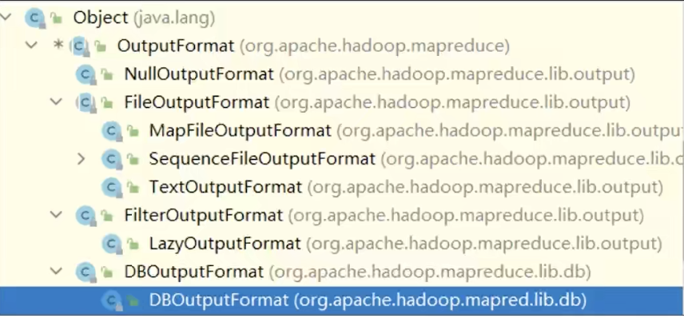


**自定义OutputFormat**

- 应用场景：
   例如：输出数据到MySQL/HBase/Elasticsearch等存储框架中。
- 自定义OutputFormat步骤
  - 自定义一个类继承FileOutputFormat。
  - 改写RecordWriter，具体改写输出数据的方法write（）


**自定义案例**

- 需求
  -  过滤输入的 log 日志，包含 atguigu 的网站输出到 e:/atguigu.log，不包含 atguigu 的网站输出到 e:/other.log

- 实现
  -  创建一个类LogRecordWriter继承RecordWriter
    - 创建两个文件的输出流：atguiguOut、 otherOut
    - 如果输入数据包含atguigu，输出到atguiguOut流，如果不包含atguigu，输出到otherOut流
  - 要将自定义的输出格式组件设置到job中
    job.setOutputFormatClass(LogO utputFormat.class);

#### 3.5 MapReduce内核源码解析

##### 3.5.1 MapTask工作机制

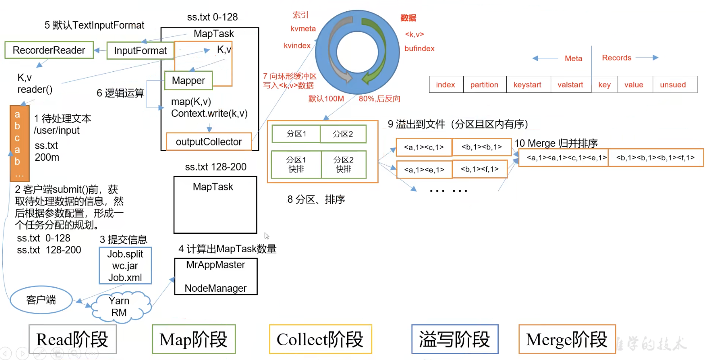

##### 3.5.2 ReduceTask工作机制

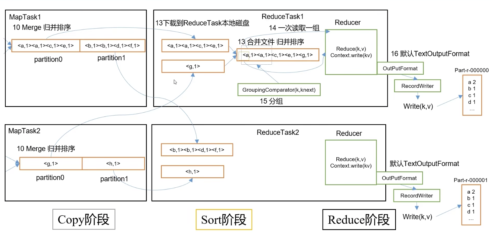


##### 3.5.3 ReduceTask并行度决定机制

- 回顾: MapTask并行度由切片个数决定,切片个数由输入文件和切片规则决定。
- 思考: ReduceTask并行度由谁决定

1. **设置ReduceTask并行度(个数)**
   ReduceTask 的并行度同样影响整个 Job 的执行并发度和执行效率，但与 MapTask 的并发数由切片数决定不同, ReduceTask数量的决定是可以直接手动设置: 
   // 默认值是 1，手动设置为 4
    `job.setNumReduceTasks (4) ;` 

2. **实验：测试 ReduceTask 多少合适**
    (1)实验环境: 1个Master节点, 16 个Slave节点: CPU:8GHZ,内存:2G
   （2）实验结论：

   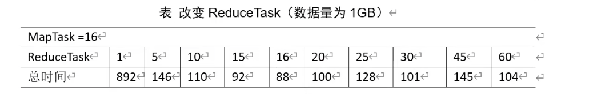

3. **注意事项**
   1. ReduceTask=0，表示没有Reduce阶段，输出文件个数和Map个数一致。
   2. ReduceTask默认值就是1,所以输出文件个数为一个。
   3. 如果数据分布不均匀,就有可能在Reduce阶段产生数据倾斜
   4. ReduceTask数量并不是任意设置，还要考虑业务逻辑需求，有些情况下，需要计算全局汇总结果，就只能有1个ReduceTask。
   5.  具体多少个ReduceTask，需要根据集群性能而定。
   6.  如果分区数不是1,但是ReduceTask为1,是否执行分区过程。答案是:不执行分区过程。因为在MapTask的源码中，执行分区的前提是先判断ReduceNum个数是否大于1。不大于1肯定不执行。


##### 3.5.4 源码解析

- MapTask

  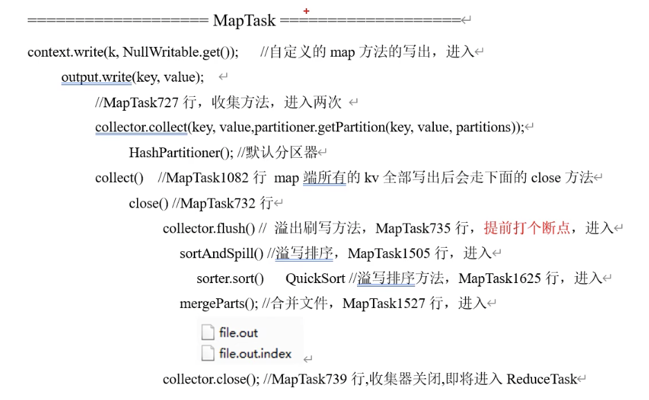

- ReduceTask

  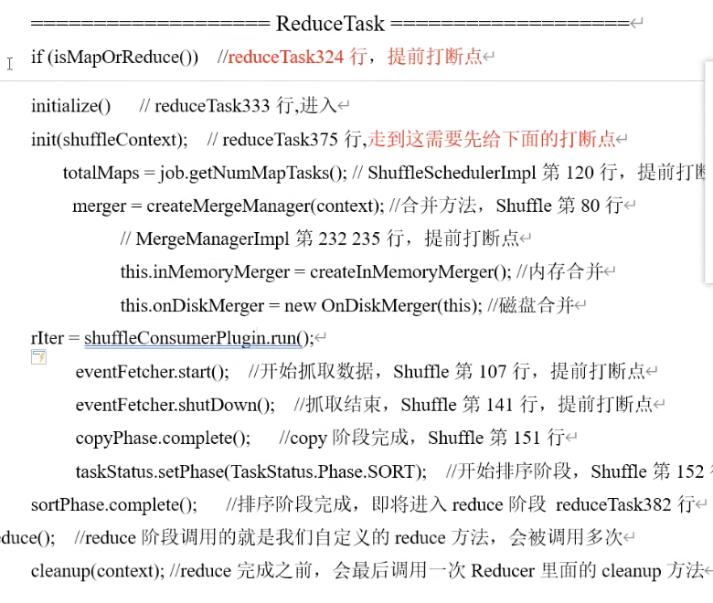

#### 3.6 Join 多种应用

##### 3.6.1 Reduce Join

- Map 端的主要工作：为来自不同表或文件的 key/value 对，打标签以区别不同来源的记录,然后用连接字段作为key,其余部分和新加的标志作为 value,最后进行输出。
- Reduce 端的主要工作：在 Reduce 端以连接字段作为 key的分组已经完成，我们只需要在每一个分组当中将那些来源于不同文件的记录（在 Map 阶段已经打标志）分开，最后进行合并就 ok 了。

Join做的是连表操作，在reduce方法里面进行处理，前提是在map阶段把同样的key提前放好，这样才可以进入同一个reduce进行处理

**总结**

- 缺点：这种方式中，合并的操作是在 Reduce 阶段完成，Reduce 端的处理压力太大，Map节点的运算负载则很低,资源利用率不高,且在Reduce阶段极易产生数据倾斜。
- 解决方案：Map 端实现数据合并。

##### 3.6.2 Map Join

1. 使用场景
   Map Join适用于一张表十分小、一张表很大的场景。
2. 优点
   思考：在 Reduce 端处理过多的表，非常容易产生数据倾斜。怎么办？
   在Map端缓存多张表,提前处理业务逻辑,这样增加Map端业务,减少Reduce端数
   据的压力，尽可能的减少数据倾斜。
3. 具体办法：采用 Distributed Cachee
   （1）在 Mapper 的 setup 阶段，将文件读取到缓存集合中。
   （2）在 Driver 驱动类中加载缓存。
   //缓存普通文件到 Task 运行节点。
   ` job.addCacheFile(new URI("file:///e:/cache/pd.txt")) ;`
   //如果是集群运行，需要设置 HDFS 路径
    `job.addCacheFile(new URI("hdfs://hadoop102:8020/cache/pd.txt")) ;`

**案例分析**

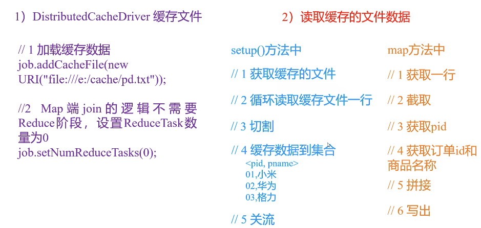

#### 3.7 数据清洗 ETL

 ETL，是英文 Extract-Transform-Load 的缩写，用来描述将数据从来源端经过抽取（Extract）、转换（Transform）、加载（Load）至目的端的过程。ETL一词较常用在数据仓库，但其对象并不限于数据仓库
在运行核心业务 MapReduce 程序之前，往往要先对数据进行清洗，清理掉不符合用户要求的数据,清理的过程往往只需要运行Mapper程序,不需要运行Reduce程序。

#### 3.8 MapReduce总结

1. InputFormat
   1. 默认的是TextInputformat ky kev偏移量. v :一行内容
   2. 处理小文件CombineTextInputFormat把多个文件合并到一起统一切片
2. Mapper
   1. setup()初始化
   2. map（）用户的业务逻辑
   3. clearup(）关闭资源
3. 分区
   - 默认分区HashPartitioner ,默认按照key的hash值%numreducetask个数
   - 自定义分区
4. 排序
   1. 部分排序
   2. 全排序
   3. 二次排序
5. Combiner: 在不影响业务逻辑下才可以使用，好处是提前聚合
6.  Reduaor
   1. 用户的业务逻辑：setup（）
   2. 初始化；reduce（）
   3. 用户的业务逻辑； clearup（ 关闭资源：
7.  OutputFormat
   1. 默认TextOutputFormat 按行输出到文件
   2. 自定义

 ### 四、压缩

#### 4.1 概述

- 压缩的好处和坏处
  - 压缩的优点：以减少磁盘 10、减少磁盘存储空间。
  - 压缩的缺点：增加 CPU 开销。
- 压缩原则
  （1）运算密集型的 Job，少用压缩
  （2）IO 密集型的 Job，多用压缩

#### 4.2 MR支持的压缩编码

- 压缩算法对比介绍

| 压缩格式 | Hadoop自带   | 算法    | 文件扩展名 | 是否可切片 | 换成压缩格式后，后来的程序是否需要修改 |
| -------- | ------------ | ------- | ---------- | ---------- | -------------------------------------- |
| DEFALTE  | 是，直接使用 | DEFALTE | .defalte   | 否         | 和文本处理一样，不需要修改             |
| Gzip     | 是，直接使用 | Gz      | .gz        | 否         | 和文本处理一样，不需要修改             |
| Bzip2    | 是，直接使用 | Bz2     | .gz2       | 是         | 和文本处理一样，不需要修改             |
| LZO      | 否，需要安装 | Lzo     | .lzo       | 是         | 需要建索引，还需要指定输入格式         |
| Snappy   | 是，直接使用 | Snappy  | .snappy    | 否         | 和文本处理一样，不需要修改             |

- 压缩性能的比较

| 压缩算法 | 原始文件大小 | 压缩文件大小 | 压缩速度 | 解压速度 |
| -------- | ------------ | ------------ | -------- | -------- |
| Gzip     | 8.3GB        | 1.8GB        | 17.5MB/s | 58MB/s   |
| Bzip2    | 8.3GB        | 1.1GB        | 2.4MB/s  | 9.5MB/s  |
| LZO      | 8.3GB        | 2.9GB        | 49.3MB/s | 74.6MB/s |
| Snappy   |              |              | 250MB/s  | 500MB/s  |

#### 4.3 压缩方式选择

**压缩方式选择时重点考虑；压缩/解压缩速度、压缩率（压缩后存储大小）、压缩后是否可以支持切片。**

##### 4.3.1 Gzip 压缩

- 优点：压缩率比较高；
- 缺点：不支持 Split；压缩/解压速度一般；

##### 4.3.2 Bzip2 压缩

- 优点：压缩率高：支持 Split
- 缺点：压缩/解压速度慢。

##### 4.3.3 Lzo 压缩
- 优点：压缩/解压速度比较快；支持 Split
- 缺点：压缩率一般；想支持切片需要额外创建索引。

##### 4.3.4 Snappy 压缩
- 优点：压缩和解压缩速度快；
- 缺点：不支持 Split；压缩率一般；


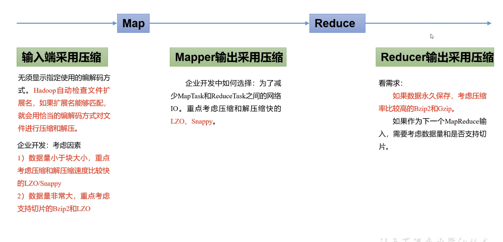


#### 4.4 压缩参数配置

1. 为了支持多种压缩/解压缩算法，Hadoop 引入了编码/解码器
   - snappy需要linux环境

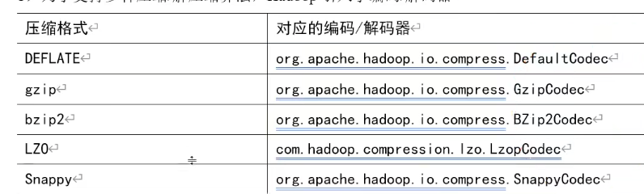

2. 要在 Hadoop中启用压缩，可以配置如下参数

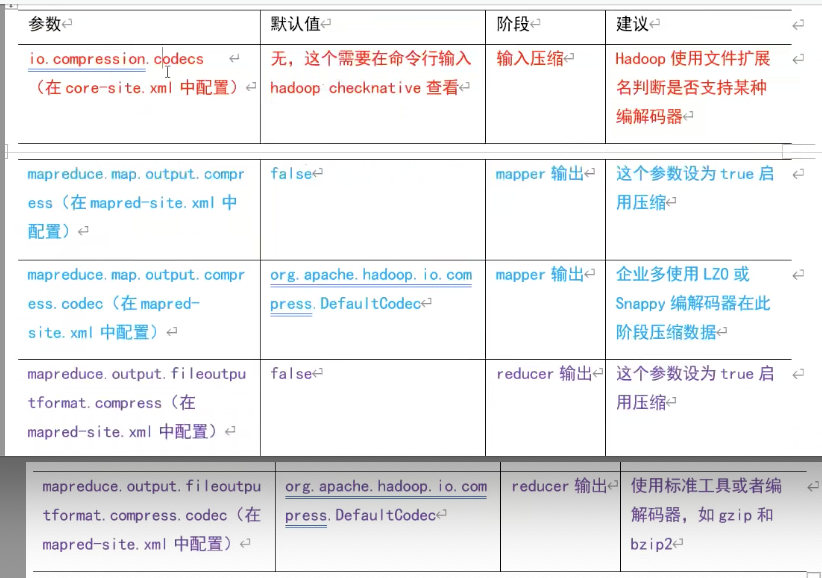

#### 4.5 压缩案例

##### 4.5.1 map输出端采用压缩

``` java
//开启map输出端压缩
 conf.setBoolean("mapreduce.map.output.compress", true)¡
//设置map端输出压缩方式
 conf.setclass("mapreduce.map.output.conpress.codec",
 Bzip2Codec.class,CompressionCodec.class)

```

##### 4.5.1 reduce输出端采用压缩

```java
//设置reduce输出端压缩
 FileoutputFormat.setCompressOutput(job, true);
// 设置输出压缩方式
 FileOutputFormat.setoutputCompressorClass(job, BZip2Codec.class);
 //FiledutputFormat.setOutputCompressorClass(job, GzipCodec.class);
 //FileOutputFormat.setOutputCompressorClass(job, DefaultCodec.class);

```


## Yarn

### 一、理论

 **Yarn资源调度器**

- Yam 是一个资源调度平台，负责为运算程序提供服务器运算资源，相当于一个分布式的操作系统平台，而 MapReduce 等运算程序则相当于运行于操作系统之上的应用程序。


#### 1.1 Yarn基础架构

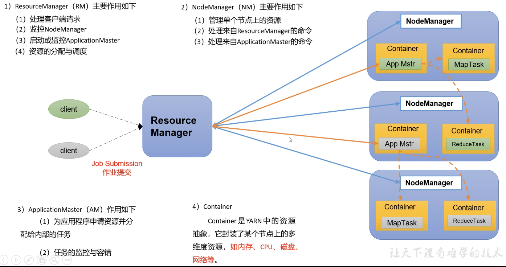


#### 1.2 Yarn工作机制

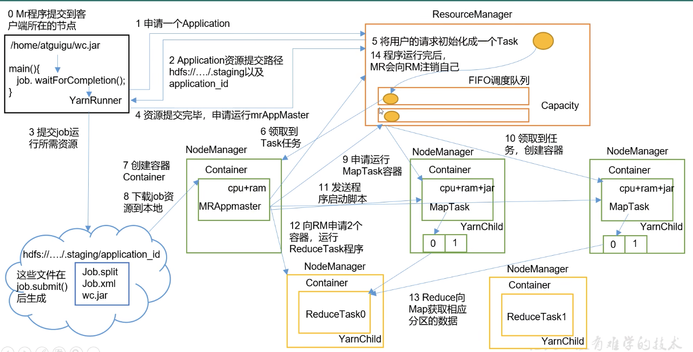


#### 1.3 作业提交过程

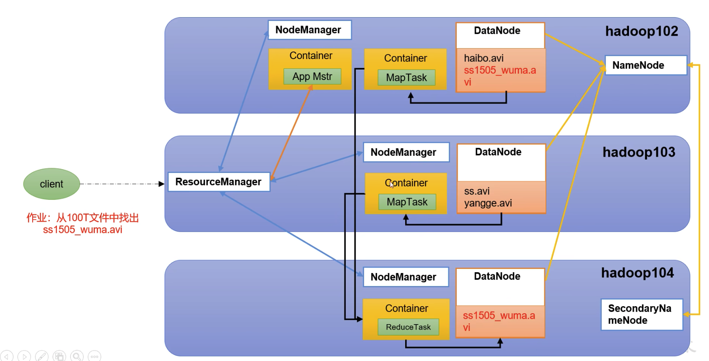


- 作业提交过程之HDFS&MapReduce

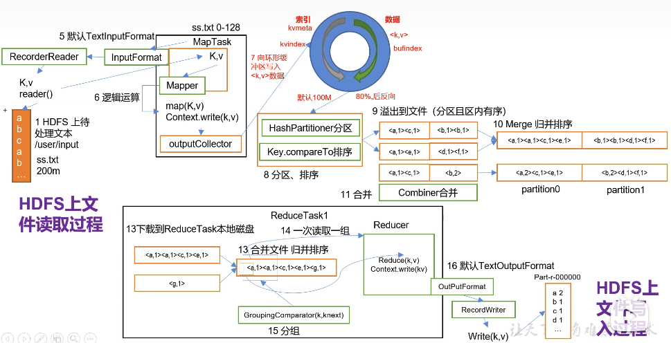


#### 1.4 Yarn 调度器和调度算法

 目前，Hadoop 作业调度器主要有三种：FIFO、容量（Capacity Scheduler）和公平（Fair Scheduler）。

- Apache Iadoop3.1.3 默认的资源调度器是 Capacity Scheduler.

- CDH框架默认调度器是 Fair Scheduler。

- 具体设置详见: yarn-default.xml文件

  ```java
  <proporty>
   	<description>The class to use as the resource scheduler.</description>
   	<name>yarn.resourcemanager.scheduler.class</name <value>org.apacho.hadoop.yarn.sorver.rosourcomanagor.schodulor.capacity.Capacityscheduler</value>
  </property>
  ```


##### 1.4.1 先进先出调度器(FIFO)

FIFO 调度器(First In First Out）：单队列，根据提交作业的先后顺序，先米先服务。

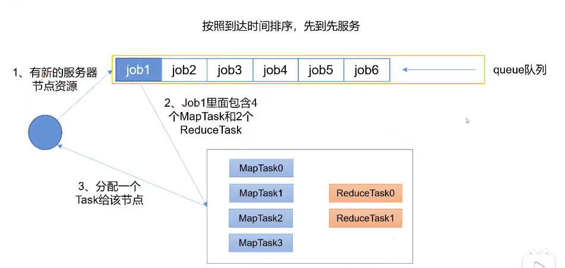

##### 1.4.2 容量调度器(Capacity Scheduler)

 Capacity Scheduler 是 Yahoo 开发的多用户调度器。

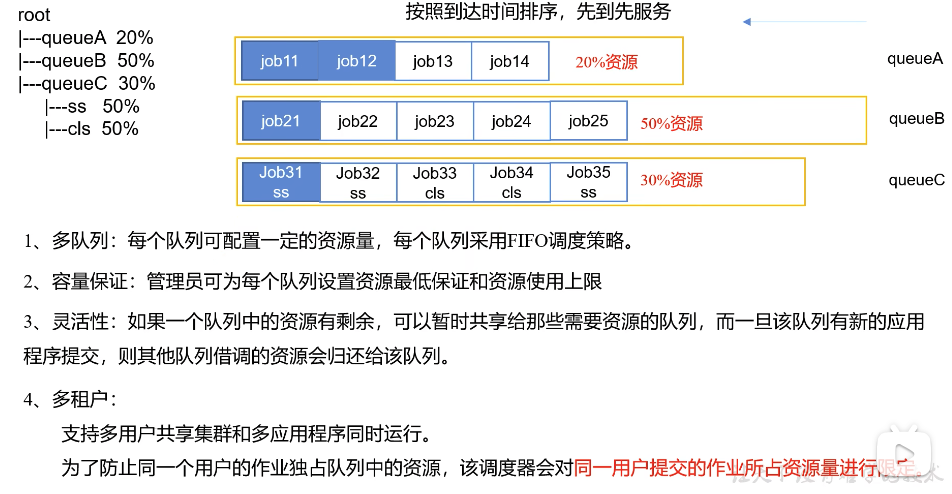

- 容器调度器资源分配算法

  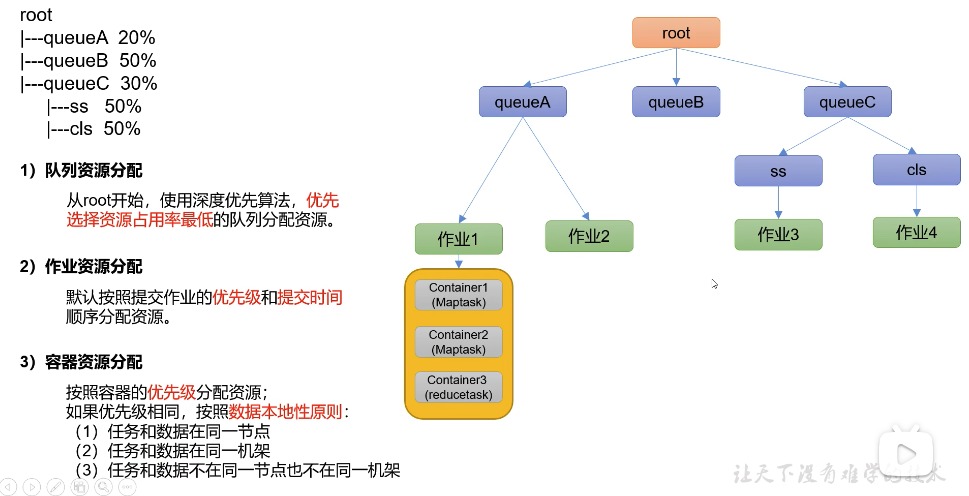


##### 1.4.3公平调度器（Fair Scheduler)

Fair Schedulere 是 Facebook 开发的多用户调度器。

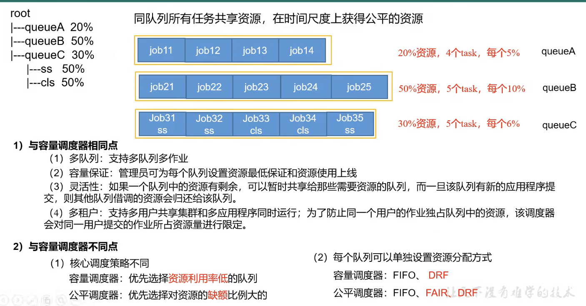


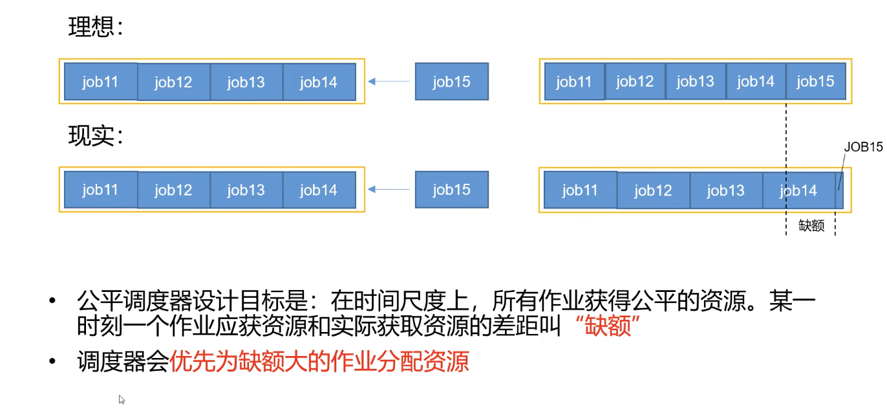

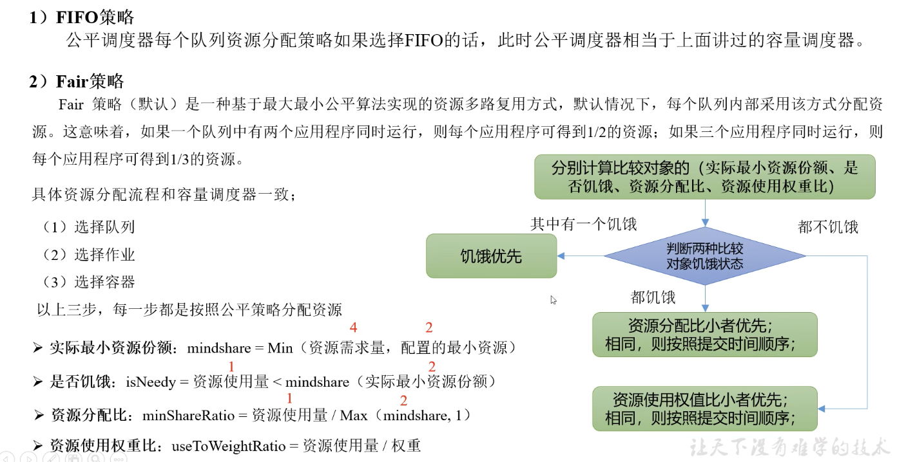

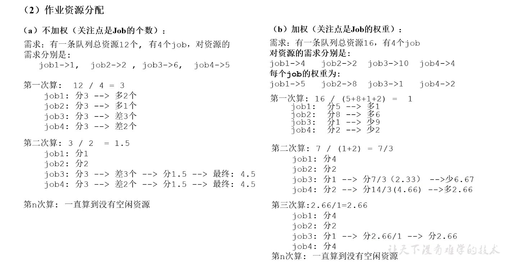

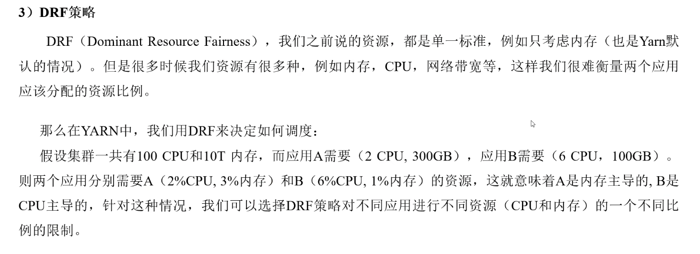

#### 1.5 Yarn常用工作命令

 Yam状态的查询,除了可以在hadoop见的命令操作如下所示:

需求,执行WondCount案例,并用Yarn查看任务运行情况

##### 1.5.1 yarn application 查看任务

1. 列出所有的application:   yarn application -list
2.  根据 Application状态过滤: yarm application-list-appStates (所有状态: ALL, NEW,NEW_SAVING, SUBMITTED, ACCEPTED, RUNNING, FINISHED, FAILED, KILLED)
3. Kill 掉application : yarn application -kill xxxxid


##### 1.5.2 yarn logs

1. 查询application 日志：  yarn logs -applicationld <Applicationld>
2.  查询 Container 日志：yarn logs -applicationld <Applicationld> -containerld <Containerld>

##### 1.5.3  yarn applicationattempt查看尝试运行的任务

1.  列出所有Application尝试的列表: yarn applicationattempt -list <Applicationld>
2.  打印 ApplicationAttemp 状态: yarn applicationattempt-status <ApplicationAttemptld>

##### 1.5.4  yarn container 查看容器

1.  列出所 Container: yarn container-list <ApplicationAttemptld>
2.  打印Container 状态: yarn container-status <Containerld>
   - 只能在任务运行时才能查看

##### 1.5.4 yarn node 查看节点状态

- 列出所有节点：yarn node -list -all

##### 1.5.6 yarn rmadmin 更新配置

- 加载队列配置：yarn rmadmin -refreshQueues
  - 修改队列时，重新刷新配置

##### 1.5.7 yarn queue 查看队列

-  打印队列信息： yarn queue status QueueNa me

#### 1.6 Yarn 生产环境核心配置参数

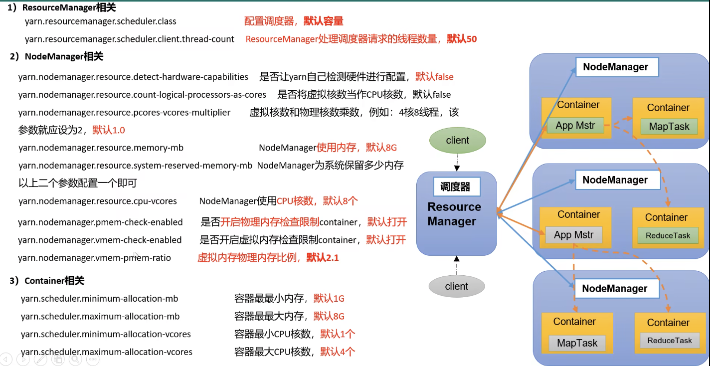

### 二、案例实践

调整下列参数之前尽量拍摄 Linux 快照，否则后续的案例，还需要重写准备集群。

#### 2.1 yarn生产环境核心参数配置案例

**修改 yarn-site.xml 配置参数如下：**

```xml
<!--选择调度器，默认容量-->
 <property>
   <description>The class to use as the resource scheduler </description>
 <name>yarn.resourcemanager.scheduler.class</nane>      <value>org.apache.hadoop.varn.server.resourcemanager.scheduler.capacity.CapacitvScheduler</valne>
  </property>
 
<property>
<!--ResourceMananer处理调度器请求的线经数量默i50, 如果提交的任务数大于50, 可以增加该值，但是不能超过3台*4线程=12线程(去除其他应出程序实际不能超过8) -->
    <descrintion>Number of  threads handle scheduler interface.</descrintion>
   <name>yarn.resourcemanager.scheduler.client.thread-count</name>
 <value>8</value>
</property>

<!--是否将虚拟核数当作 CPU 核数，默认是 false，采用物理 CPU 核数 -->
<property>
 <name>yarn.nodemanager.resource.count-logical-processors-as-cores</name>
 <value>false</value>
 </property>

<!--虚拟核数和物理核数乘数，默认是 1.0 -->
 <property>
 <name>yarn.nodemanager.resource.pcores-vcores-multiplier</name>
 <value>1.0</value >
 </property>
<!--NodeManager 使用内存数，默认 8G，修改为 4G 内存-->
 <property>
 <name>yarn.nodemanager.resource.memory-mb</name>
 <value>4096</value>
 </property>

<!-- nodemanager 的 CPU 核数，不按照硬件环境自动设定时默认是 8 个，修改为 4 个-->
 <property>
 <name>yarn.nodemanager.resource.cpu-vcores</nane>
 <value>4</value>
 </property>

<!--容器最小内存，默认 1G-->
<property>
 <name>yarn.scheduler.minimum-allocation-mb</name>
 <value>1024</value>
 </property>
  
<!--容器最大内存 默认 8G，整改为 2G-->
<property>
 <name>yarn.scheduler.maximum-allocation-mb</name>e <value>2048</value>
 </property>

<!--容器最小CPU核数，默认1个-->
<property>
 <name>yarn,acheduler.minimum-allocation-vcores</name>
 <vatue>1</vatue>
 </property>

<!--容器最大 CPU核数，默认4 个，修改为 2个-->
<property>
  <name>yarn.scheduler.maximum-allocation-vcores</name>
 <value>2</value>
 </property>

<!--虚拟内存检查，默认打开，修改为关闭-->
 <name>yarn.nodemanager.vmem-check-enabled</name>
 <value>false</value>

<!--虚拟内存和物理内存设置比例，默认 2.1-->
 <name>yarn.nodemanager,vmem-pmem-ratio</name>
 <value>2.1</value>

```

- 为什么设置虚拟内存校验false

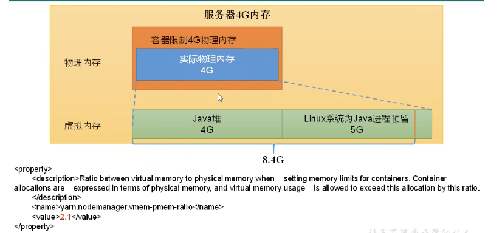


#### 2.2 容量调度器多队列提交案例

1. 在生产环境怎么创建队列？
   - 调度器默认就1个 default队列，不能满足生产要求。
   - 按照框架：hive/spark/flink 每个框架的任务放入指定的队列（企业用的不是特别多）
   - 按照业务模块；登录注册、购物车、下单、业务部门 1、业务部门 2
2. 创建多队列的好处？
   - 因为担心员工不小心，写递归死循环代码，把所有资源全部耗尽。
   - 实现任务的降级使用，特殊时期保证重要的任务队列资源充足。
     业务部门 1（重要）-》业务部门 2（比较重要）->下单（一般）->购物车（一般）->登录注册（次要）

##### 2.2.1 需求

- 需求 1：default 队列占总内存的 40%，最大资源容量占总资源 60%，hive 队列占总内存的 60%，最大资源容量占总资源 80%
- 需求 2： 配置队列优先级 


##### 2.2.2 配置多队列的容量调度器

1.  在 capacity-scheduler.xml 中配置如下：

   - 修改如下配置

     ```xml
     <!--指定多队列，增加 hive 队列 -->
      <property>
      <name>yarn.scheduler.capacity.root.queues</name>
      <description>
      The queues at the this level (root is the root queue) .
      </description>
      </property>
     <!--降低 default 队列资源额定容量为 40%，默认 100% -->
      <property>
     <name>yarn.scheduler.capacity.root.default.capacity</name>
      <value>40</value>
      </property>
     <!--降低 default 队列资源最大容量为 60%，默认 100% -->
      <property>
     <name>yarn.scheduler.capacity.root.default.maximum-capacity</name>
      <value>60</value>
      </property>
     
     <!--hive 队列以此类推 -->
     其它配置项详见该文件
     ```

2. 分发配置文件
3. 重启 Yarn 或者执行 yarn rmadmin -refreshQueues 刷新队列，就可以看到两条队列

##### 2.2.3 向hive队列提交数据

- 方式一：Hadoop jar

  - shell命令： Hadoop jar xxx.jar -D mapreduce.job.queuename=hive 

- 打包jar的方式，在driver中声明

  - ``` java
     Configuration conf = new Configuration();
     conf.set ("mapreduce.job.queuenamo", "hive") ;
    Job job = Job.getInstance(conf);
    //1.获取一个Job实例
    ......
     //6.提交 Jobe
     boolcan b= job.waitForCompletion(true) ;;
     System.exit(b ? 0 1);
    ```

##### 2.2.4 设置任务的优先级

容量调度器,支持任务优先级的配置,在资源紧张时,优先级高的任务将优先获取资源。默认情况，Yarn将所有任务的优先级限制为0，若想使用任务的优先级功能，须开放该限制。

1.  修改 yarn-site.xml 文件，增加以下参数

   ```  xml
   <property>
   <name>yarn.clustor.max-application-priority</name>
     <value>5</value>
    </property>
   ```


2. 分发配置，重启yarn
   1. 分发
   2. sbin/stop-yarn.sh
   3. sbin/start-yarn/sh
3. 模拟资源紧张环境，可连续提交以下任务，直到新提交的任务申请不到资源为止。
4. 提交一个优先级高的任务：hadoop jar xxx.jar -D mapreduce.job.priority=5
5. 也可以通过该设置： yarn application -appID <ApplicationID>-updatePriority 优先级

#### 2.3 公平调度器案例

##### 2.3.1 需求

创建两个队列，分别是test 和 atguigu （以用户所属组命名）。期望实现以下效果：若用
户提交任务时指定队列,则任务提交到指定队列运行;若未指定队列, test用户提交的任务 到root.group.test队列运行, atguigu提交的任务到root.group.atguigu队列运行(注: group为
用户所属组）。

公平调度器的配置涉及到两个文件，一个是 yarn-site.xml，另一个是公平调度器队列分
 配文件fair-scheduler.xml （文件名可自定义) 。
（1）配置文件参考资料：
 https://hadoop.apache.org/docs/r3.1.3/hadoop-yarn/hadoop-yarn-site/FairScheduler.html
(2）任务队列放置规则参考资料：
 https://blog.cloudera.com/untangling-apache-hadoop-yarn-part-4-fair-scheduler-queue-basics/e

##### 2.3.2 配置多队列的公平调度器

1. 修改 yarn-site.xml 文件，加入以下参数

   ```xml
    <property>
    <name>yarn.rosourcemanager.scheduler.class</name>
    <value>org.apache.hadoop.yarn.server.resourcemanager.scheduler.fair.FairScheduler</value>
    <description>配置使用公平调度器</description>
    </property>
    <property>
    <name>yarn.scheduler.fair.allocation.file</name>
    <value>/opt/modulo/hadoop-3.1.3/etc/hadoop/fair-schoduler.xml</value>
    <description>指明公平過度器队列分配配置文件</descriptton
    </property>
    <property>
    <namo>yarn.schodulor.fair.preemption</namo>
    <value>false</value>
    <description>禁止队列间资源抢占</description>
    </property>
   ```

2. 配置fair-scheduler.xml

   ```xml
    <allocations>
   <!-- 单个队列中 Application Master占用资源的最大比例，取值 0-1 ，企业一般配置 0.1-->
    <queueMaxAMShareDefault>0.5</queueMaxAMShareDefault>e
    <queueMaxResourcesDefault>4096mb, 4vcores</queueMaxResourcesDefault>
    <!--单个队列最大资源的默认伍 test atguigu defaull. -->
    <!--增加一个队列 tost-->
    <queue name="test">
   <!-- 队列最小资源 -->
    <minResources>2048mb, 2vcores</minResources>
   <!-- 队列最大资源 -->
    <maxResources>4096mb, 4vcores</maxResources>
   <!--队列中最多同时运行的应用数,默认50,根据线程数配置 -->
    <maxRunningApps>4</maxRunningApps>
    <!-- 队列中 Application Master 占用资源的最大比例 -->
    <maxAMShare>0.5</maxAMShare>
   <!-- 该队列资源权重,默认值为1.0-->
    <weight>1.0</weight>
   <!-- 队列内部的资源分配策略 -->
    <schedulingPolicy>fair</schedulingPolicy>
      </queue>
      ......
   <!--任务队列分配策略，可配置多层规则，从第一个规则开始匹配，直到匹配成功 --> <queuePlacementPolicy>
   <!-- 提交任务时指定队列，如未指定提交队列，则继续匹配下一个规则；false 表示：如果指定队列不存在，不允许白动创建-->
    <rule name="specified" create="false"/>
    <!--提交到root.group.username队列,若root.group不存在,不允许自动创建;若 root.group.user 不存在，允许自动创建 -->
    <rule name "nestodUserQueue" create="true">
    <rule name="primaryGroup" creale="false"/>
    </rule>
   <!-- 最后一个规则必须为reject 或者 default。Reject 表示拒绝创建提交失败，
    default 表示把任务提交到 default 队列 -->
    <rule name ="rejoct" />
    </queuePlacementPolicy>
    </allocations>e
   
   ```

3. 分发配置并重启yarn

   1. 分发
   2. sbin/stop-yarn.sh
   3. sbin/start-yarn/sh

##### 2.3.3 测试提交任务

1. 提交任务时指定队列，按照配置规则，任务会到指定的 root.test队列
   - Hadoop jar xxx.jar -D mapreduce.job.queuename=root.test
2. 提交任务时不指定队列,按照配置规则,任务会到root.atguigu队列

#### 2.4 yarn 的tool接口

1. 背景

   1. Hadoop jar wc.jar xxxdriver /input /output
   2. Hadoop jar wc.jar xxxdriver -D 设置相关参数 /input /output

2. 自己写的程序要实现动态参数运行，需要编写yarn的tool接口

3. 具体步骤如下

   1. 引入相关依赖，maven
   2. 继承并实现Tool接口，包含静态内部类mapper和reducer，以及configuration参数的传入
   3. 编写driver类，大致如下

    ```java
    // 创建配置
     Configuration conf = new Configuration();
     switch (args[0]){
     case "wordcount":
     tool = new WordCount();
     break;
     default:
     throw new RuntimeException("no such tool "+ args[0]);
     }
    // 执行程序
     int run = ToolRunner.run(conf, tool, Arrays.copyOfRange(args,1, args.length));
    
    ```

   

### 三、Yarn 面试重点-总结

1. Yarn的工作机制（面试题）
2. Yarn的调度器
   1. FIFO/容量/公平
   2. apache默认调度器 容量; CDH默认调度器 公平
   3. 公平/容量默认一个detault,需要创建多队列
   4. 中小企业：hive spark flink mr
   5. 中大企业：业务模块：登录/注册/购物车/营销
   6. 好处：解耦 降低风险 11.11 6.18 降级使用
   7. 每个调度器特点：
      相同点:支持多队列,可以借资源,支持多用户
      不同点：容量调度器：优先满足先进来的任务执行
   8. 生产环境怎么选：
      公平调度器，在队列里面的任务公平享有队列资源
      - 中小企业，对并发度要求不高，选择容量
      - 中大企业,对并发度要求比较高,选择公平。
3. 开发需要重点掌握：
   1. 队列运行原理
   2. Yarn常用命令
   3. 核心参数配置
   4. 配置容量调度器和公平调度器
   5. tool接口使用


## Hadoop生产调优

### 一、HDFS 核心参数

####  1.1 NameNode内存生产配置

  1) NameNode内存计算

    每个文件块大概占用 150byte，一台服务器 128G 内存为例，能存储多少文件块呢？ 
      128 * 1024 * 1024 * 1024 /150Byte = 9.1 亿
      G          MB       KB       Byte
  2) lladoop2.x 系列，配置 NameNode 内存
     NameNode内存默认2000m,如果服务器内存 4G, NameNode 内存可以配置3g。在
     hadoop-env.sh 文件中配置如下。
     HADOOP NAMENODE OPTS=-Xmx3072m
  3) Hadoop3.x 系列，配置 NameNode 内存
     1. hadoop-env.sh 中描述 Hadoop 的内存是动态分配
     2. 查看NameNode占用内存：jmap -heap namenode进程号
     3. 查看DataNode占用内存：jmap -heap datanode进程号

查看发现 hadoop102 上的 NameNode 和 DataNode 占用内存都是自动分配的，且相等。不是很合理。

**经验参考：**
 https://docs.cloudera.com/documentation/enterprise/6/release-notes/topics


-  namenode最小值1G，每增加1000000个block，增加1G内存
-  datanode最小值4G, block数，或者副本数升高，都应该调大
   datanode的值。一个datanode上的副本总数低于4000000调为4G,超过4000000
  每增加1000000，增加1G
- 具体修改： hadoop-env.sh
   export HDFS_NAMENODE_OPTS="-Dhadoop.security.loqqer=INFO,RFAS
    **-Xmx1024m**"
   export HDFS_DATANODE_OPTS ="-Dhadoop.sccurity.Loqger=ERROR,RFAS
    **-Xmx1024m**"

#### 1.2 NameNode心跳并发配置

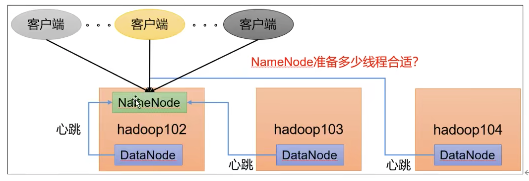

1. Hdfs-site.xml

   - NameNode 有一个工作线程池,用来处理不同 DataNode 的并发心跳以及客户端并发的元数据操作。

   - 对于大集群或者有大量客户端的集群来说,通常需要增大该参数。默认值是10。

     ``` xml
      <proporty>
      <name>drs.namenode.handler.count</name>
      <value>21</value>
      </property>
     ```

   - 企业经验: dfs.namenode.handler.count=20 × loge (Cluster size),比如集群规模（DataNode 台数)为3 台时,此参数设置为21。

#### 1.3 开启回收站配置

开启回收站功能,可以将删除的文件在丕超时的情况下,恢复原数据,起到防止误删除、
备份等作用。

1. 回收站工作机制

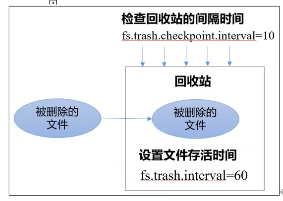

2. 开启回收站功能参数说明

   1. 默认 fs.trash.interval 0，0表示禁用回收站；其他值表示设置文件的存活时间
   2. 默认值fs.trash.checkpoint.interval=0,检查回收站的间隔时间。如果该值为0,则该值设置和fs.trash.interval的参数值相等。
   3. 要求 fs.trash.checkpoint.interval <= fs.trash.interval

3. 启用回收站
   修改 core-site.xml，配置垃圾回收时间为 1 分钟。

   ``` xml
    <property>
    <name>fs.trash.interval</name>
    <value>1</value>
    </property>
   ```

4. 查看回收站

​	回收站目录在HDFS集群中的路径: /user/atguigu/.Trash/....

5. 注意:通过网页上直接删除的文件也不会走回收站。
6. 通过程序删除的文件不会经过回收站,需要调用moveToTrash()才进入回收站
    Trash trash = New Trash(conf);
    trash.moveToTrash (path) ;
7. 只有在命令行利用hadoop fs-rm命令删除的文件才会走回收站。
   $ hadoop fs -rm /a.txt
8. 恢复回收站数据 $hadoop fs -mv 

经验：**回收站适合经常写操作的集群**

### 二、HDFS 集群压测

在企业中非常关心每天从Java后台拉取过来的数据,需要多久能上传到集群?消费者
关心多久能从HDFS 上拉圾需要的数据？为了搞清楚 HDFS 的读写性能，生产环境上非常需要对集群进行压测。


HDFS 的读写性能主要受**网络和磁盘**影响比较大。为了方便测试，将 hadoop102、 hadoop103、hadoop104 虚拟机网络都设置为 100mbps

例如： 100Mbps 单位是 bit; 10M/s 单位是 byte；1byte=8bit, 100Mbps/8=12.5M/s

#### 2.1 测试HDFS写性能

1. 写测试底层原理

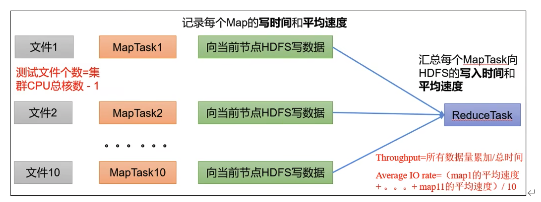

2. 测试内容：向HDFS集群写10个128M的文件
   -  $hadoop jar /opt/modile/hadoop-3.1.3/share/hadoop/mapreduce/hadoop-mapreduce-client-jobclient-3.1.3-tests.jar
      TestDFSIO -write -nrFiles 10
   - 注意：nrFilesn为生成mapTask的数量,生产环境一般可通过hadoop103:8088查看CPU核数,设置为(CPU核数-1)
3. 结果分析

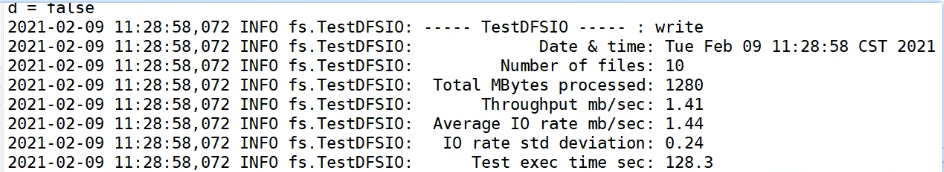

- 由于副本 1 就在本地，所以该副本不参与测试
- 一共参与测试的文件： 10个文件*2个副本=20个*
- *压测后的速度：1.61
- *实测速度：1.61M/s*20 个文件 =32M/s
- 三台服务器的带宽：12.5+12.5+12.5=30m/sc
- 所有网络资源都已经用满。
- **如果实测速度远远小于网络，并且实测速度不能满足工作需求，可以考虑采用因态硬盘或者增加磁盘个数。**

如果客户端不在集群节点，那就三个副本都参与计算

#### 2.2 测试HDFS读性能

- 测试内容：向HDFS集群读10个128M的文件
  -  $hadoop jar /opt/modile/hadoop-3.1.3/share/hadoop/mapreduce/hadoop-mapreduce-client-jobclient-3.1.3-tests.jar
     TestDFSIO -read -nrFiles 3 -fileSize 128MB
- 如果是从本地读的话，只会受到磁盘限制；若从其它服务器读取，会受到网络限制

### HDFS -多目录

####  3.1 NameNode 多目录配置
1. NameNode 的本地目录可以配置成多个，且每个目录存放内容相同，增加了可靠性
2. 具体配置如下
   - 在 hdfs-site.xml 文件中添加如下内容。
      <property>
      <name>dfs.namenode.name.dir</name>
     <value>file://$(hadoop.tmp.dir)/dfs/namel,file://${hadoop.tmp.
      diri/dts/name24/valuese
      </property>
   - 注意:因为每台服务器节点的磁盘情况不同,所以这个配置配完之后,可以选择不分发
   - 停止集群，删除三台节点的 data 和 logs 中所有数据。
      rm -rf data/ logs
   - 格式化集群并启动。
     - bin/hdfs namenode -format- 
     - sbin/start-dfs.sh
3. 查看结果

#### 3.2 DataNode 多目录配置

1) DataNode 可以配置成多个目录，每个目录存储的数据不一样（数据不是副本）

    - 每个目录存储的数据不一种

2) 具体配置如下

    - 在 hdfs-site.xml 文件中添加如下内容

    - ```xml
       <property>
       <name>dfs.datanode.data.dir</name>
       <value>file://$(hadoop.tmp.dir)/dfs/datal,file://$(hadoop.tmp.
       dir)/dfs/data2</value>
       </property>
      ```

3. 查看结果

#### 3.3 集群数据均衡之磁盘间数据均衡

生产环境,由于硬盘空间不足,往往需要增加一块硬盘。刚加载的硬盘没有数据时,可以执行磁盘数据均衡命令。（Hadoop3.x 新特性）

1. 生成均衡计划（我们只有一块磁盘，不会生成计划）hdfs diskbalancer -plan hadoop103
2. 执行均衡计划 hdfs diskbalancer -execute hadoop103.plan.json
3. 查看当前均衡任务的执行情况。
    hdfs diskbalancer -query hadoop1034
4. 取消均衡任务
    hdfs diskbalancer -cancel hadoop103.plan.json

### 第4章HDFS-集群扩容及缩容
#### 4.1 添加白名单

白名单：表示在自名单的主机IP 地址可以，用来存储数据。企业中,配置白名单,可以尽量防止黑客恶意访问攻击。 (不在白名单，可以访问但是不可以存储数据)

**配置白名单步骤如下：**

1. 在NameNode节点的/opt/module/hadoop-3.1.3/etc/hadoop目录下分別创建 whitelist和
    blacklist文件

   - 创建白名单 vim whitelist
     在whitelist中添加如下主机名称,假如集群正常工作的节点为102 103
      hadoop103
      hadoop102
   -  创建黑名单touch blacklist
     保持空的就可以

2. 在 hdfs-site.xml 配置文件中增加 dfs.hosts 配置参数

   ```xml
   <property>
    <value>/opt/module/hadoop-3.1.3/etc/hadoop/whitelist</value>
    </property>
   <!—- 黑名单 -->
   <property>
    <name>dfa,honta.exclude</name>
    <value>/opt/module/hadoop-3.1.3/etc/hadoop/blacklistc/value> </property>
   ```

3. 分发配置文件whitelist, hdfs-site.xml
   xsync hdfs-site.xml whitelist
4. 第一次添加白名单必须重启集群，不是第一次，只需要刷新 NameNode 节点即可
   $ myhadoop.sh stop
   $ myhadoop.sh start

 5) 在 web 浏览器上查看 DN，http://hadoop102:9870/dfshealth.html#tab-datanod

#### 4.2 服役新数据节点

1. 需求
   随着公司业务的增长，数据量越来越大，原有的数据节点的容量已经不能满足存储数据的需求，需要在原有集群基础上动态添加新的数据节点。
2. 环境准备
   - 在 hadoop100 主机上再克隆一台 hadoop105 主机
   - 修改IP地址和主机名称
     vim /etc/sysconfig/network-scripts/ifcfg-
     ens33
     vim /etc/hostname
   - 拷贝 hadoop102 的/opt/module 目录和/etc/profile.d/my_env.sh 到 hadoop105
     -  scp module/*
     - sudo scp /etc/profile.d/my env.sh root@hadoop105:/etc/profile.d/my_env.sh
     -  [atguigu@hadoop105 hadoop-3.1.31$ source /etc/profile
   - 删除 hadoop105 上 Hadoop 的历史数据，data 和 log 数据
      [atguigu@hadoop105 hadoop-3.1.3]$ rm -rf data/ logs/
   - 配置 hadoop102和hadoop103 到hadoop105的ssh无密登录.
      [atguigu@hadoop102 .ssh]$ ssh-copy-id hadoop105

#### 4.3节点间数据均衡
1. 企业经验：
   在企业开发中，如果经常在 hadoop102 和 hadoop104 上提交任务，且副本数为2.由于数据本地性原则，就会导致 hadoop102和 hadoop104 数据过多，hadoop103存储的数据量小。另一种情况,就是新服役的服务器数据量比较少,需要执行集群均衡命令。
2. 开启数据均衡命令
    [atguigu@hadoop105 hadoop-3.1.31$ sbin/start-balancer.sh  threshold 10
   对于参数10,代表的是集群中各个节点的磁盘空间利用率相差不超过10%,可根据实际情况进行调整。
3. 停止数据均衡命令：
    [atguigu@hadoop105 hadoop-3.1.3]$ sbin/stop-balancer.sh
    注意：由于 HDFS 需要启动单独的 Rebalance Server 来执行 Rebalance 操作，所以尽量
   不要在 NameNode 上执行 start-balancer.sh，而是找一台比较空闲的机器


#### 4.4 黑名单退役旧节点

黑名单：表示在黑名单的主机 IP 地址不可以，用来存储数据。
企业中:配置黑名单,用来退役服务器。


**黑名单配置步骤如下：**

1. 编辑/opt/module/hadoop-3.1.3/ete/hadoop 11录下的blacklist文作.

   - [atguiguehadoop102 hadoop] vim blacklist
     添加如下主机名称（要退役的节点）
      hadoop105
     注意：如果白名单中没有配置，需要在 hdfs-site.xml 配置文件中增加 dfs.hosts 配置参数

     ```xml
     <!--黑名单-->
      <property>
      <name>dfa.hosta-excludec </name>
      <value>/opt/module/hadoop-3.1.3/etc/hadoop/blacklist</value>
      </property>
     ```

2. 分发配置文件 blacklist，hdfs-site.xml
    [atguiguθhadoop104 hadoop]$ xsync hdfs-site.xml blackliste

3) 第一次添加黑名单必须重启集群，不是第一次，只需要刷新 NameNode 节点即可
    $ hdfs dfsadmin -refreshNodes Refresh nodes successful
4) 检查 Web 浏览器，退役 节点的状态为 decommission in progress（退役中），说明数据节点正在复制块到其他节点
5) 等待退役节点状态为decommissioned (所有块已经复制完成),停止该节点及节点资源管理器，注意：如果副本数是 3， 服役的节点小于等于 3，是不能退役成功的，需要修改副本数后才能退役$ hdfs --daemon stop datanode
     $yarn --daemon stop nodemanager
6) 如果数据不均衡，可以用命令实现集群的再平衡
    $ sbin/start-balancer.sh threshold 10

### 第 5 章 HDFS—存储优化
注：演示纠删码和异构存储需要一共 5 台虚拟机。尽量拿另外一套集群。提前准备 5 台服务器的集群。
#### 5.1 纠删码
##### 5.1.1纠删码原理

HDFS 默认情况下，一个文件有 3 个副本，这样提高了数据的可靠性，但也带来了 2 倍的冗余开销。Hadoop3.x 引入了纠删码，采用计算的方式，可以节省约 50%左右的存储空间。

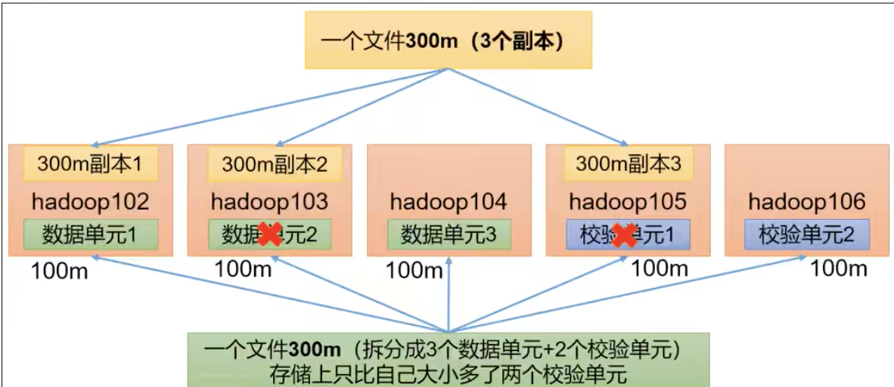

1. 纠删码操作相关的命令

 [atguigu@hadoop102 hadoop-3.1.31$ hdfs ec

``` shell
bin/hdfs ec [COMMAND]
 [-listPolicies]
 [-addPolicies -policyFile <file>]
 [-getPolicy -path <path>]
 [-removePolicy -policy <policy>]
 [-setPolicy -path <path> [-policy <policy>] [-replicate]]4
 [-unsetPolicy -path <path>]
 [-listCodecs]
 [-enablePolicy -policy <policy>]
 [-dísablePolicy -policy <policy>]
 [-help <command-name>]
```

2. 查看当前支持的纠删码策略

   ```shell
    [atguigu@hadoop102 hadoop-3.1.3] hdfs ec -listPolicies
    Erasure Coding Policies:
    ErasureCodingPolicy=[Name=RS-10-4-1024k, Schema=[ECSchema=[Codec=rs,
    numDataUnits=10, numParityUnits=4]], CellSize=1048576, Id=5],
    State=DISABLED
    ErasureCodingPolicy=[Name=RS-3-2-1024k, Schema=[ECSchema=[Codec=rs,
    numDataUnits=3, numParityUnits=2]], CellSize=1048576, Id=2],
    State=DISABLED
   ```

3. 纠删码策略解释：

   - RS-3-2-1024k：使用 RS 编码，每 3 个数据单元，生成 2 个校验单元，共 5 个单元，也就是说:这5个单元中,只要有任意的3个单元存在(不管是数据单元还是校验单元,只要
     总数=3) ，就可以得到原始数据。每个单元的大小是 1024k=1024*1024=1048576.

   - RS-10-4-1024k：使用 RS 编码，每 10 个数据单元（cell），生成 4 个校验单元，共 14个单元，也就是说：这 14 个单元中，只要有任意的 10 个单元存在(不管是数据单元还是校验单元,只要总数=10),就可以得到原始数据。每个单元的大小是1024k-1024*1024=1048576.*
   - RS-6-3-1024k|使用 RS 编码，每 6 个数据单元，生成 3 个校验单元，共 9 个单元，也就是说：这 9个单元中,只要有任意的 6个单元存在(不管是数据单元还是校验单元,只要总数=6) ，就可以得到原始数据。每个单元的大小1024k=1024*1024=1048576。
   - RS-LEGACY-6-3-1024k： 策略和上面的 RS-6-3-1024k 一样，只是编码的算法用的是 rs-legacy。
   - XOR-2-1-1024k：使用 XOR 编码（速度比 RS 编码快），每 2 个数据单元，生成 1 个校验单元，共 3 个单元，也就是说：这 3 个单元中，只要有任意的 2 个单元存在（不管是数据单元还是校验单元，只要总数= 2)，就可以得到原始数据。每个单元的大小是1024k=1024*1024=1048576。
   - 1mb为分割的基本单位

##### 5.1.2 纠删码案例实操

纠删码策略是给具体一个路径设置。所有往此路径下存储的文件，都会执行此策略。
默认只开启对 RS-6-3-1024k 策略的支持，如要使用别的策略需要提前启用。

1. 需求：将/input 目录设置为 RS-3-2-1024k 策略

2. 具体步骤

   - 开启对 RS-3-2-1024k 策略的支持
      [atguigu@hadoop102 hadoop-3.1.3]$ hdfs ec -enablePolicy policy RS-3-2-1024k
     - Erasure coding policy RS-3-2-1024k is enablede

   -  Hadoop fe mkedir tinnut
   - hdfs ec -setPolicy -path /input -policy RS-3-2-1024k

3. 上传文件，并查看文件编码后的存储情况

   - $ hdfs dfs -put web.log /inpute
   - $ hdfs fsck /input/web.log -files -blocks -locationse

4. 结果

   - hadoop102 校验单元
   - 103 数据单元
   - 104 数据单元
   - 105 数据单元
   - 106 校验单元

5. 适合cpu资源多

####  5.2 异构存储（冷热数据分离）

异构存储主要解决，不同的数据，存储在不同类型的硬盘中，达到最佳性能的问题。

- 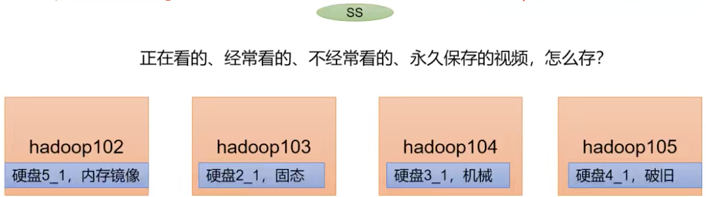

 

1. 关于存储类型
   - RAM_DISK：（内存镜像文件系统）
   - SSD: （SSD固态硬盘）
   - DISK：（普通磁盘，在HDFS中，如果没有主动声明数据目录存储类型默认都是DISK）
   - ARCHIVE: (没有特指哪种存储介质,主要的指的是计算能力比较弱而存储密度比较高的存储介质,用来解决数据量的容量扩增的问题,一般用于归档)
2. 关于存储策略
   - 说明：从Lazy_Persist到Cold，分别代表了设备的访问速度从快到慢
   - 

##### 5.2.1 异构存储shell操作

1. 查看当前有哪些存储策略可以用
   hdfs storagepolicies - listPolicies
2. 为指定路径（数据存储目录）设置指定的存储策略
   hdfs storagepolicies -setStoragePolicy -path xxx -policy xxx
3. 获取指定路径（数据存储目录或文件）的存储策略
    hdfs storagepolicies -getStoragePolicy -path xxx
4. 取消存储策略；执行改命令之后该目录或者文件，以其上级的目录为准，如果是根目录，那么就是 HOT
    hdfs storagepolicies -unsetStoragePolicy -path xxx
5. 查看文件块的分布
    bin/hdfs fsck xxx -files -blocks -locations
6. 查看集群节点
    hadoop dfsadmin -report

##### 5.2.2 环境准备

1. 假设集群配置如下：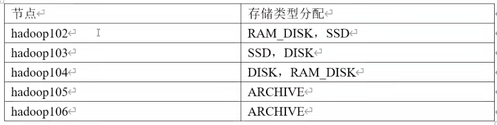

2.  配置文件信息

   - 为 hadoop102 节点的 hdfs-site.xml 添加如下信息

     ```xml
      <property>
      <name>dfs.replication</name>
      <value>2</value>
      </property>
      <property>
      <name>dfs.storage.policy.enabled</name>
      <value>true</value>
      </property>
      <property>
      <name>dfs.datanode.data.dir</name> 
      <value>[SSD]file:///opt/module/hadoop-
      3.1.3/hdfsdata/ssd,[RAM DISK]file:///opt/module/hadoop-
      3.1.3/hdfsdata/ram disk</value>
      </property>
     ```

   - 其他集群节点配置类似

3. 数据准备  

   - 启动集群
     hdfs namenode -format
     myhadoop.sh start
   - 并在 HDFS 上创建文件目录
     hadoop fs -mkdir /hdfsdata
   - 并将文件资料上传
     hadoop fs -put /opt/module/hadoop-3.1.3/NOTICE.txt /hdfsdata

##### 5.2.3 HOT存储策略案例

1. 最开始我们未设置存储策略的情况下，我们获取该目录的存储策略
    hdfs storagepolicies -getstoragePolicy -path /hdfsdata
2. 我们查看上传的文件块分布
   hdfs fsck /hdfsdata -files -blocks - locations
    [DatanodeInfowithstorage[192.168.10.104:9866, DS-0b133854-7f9e-48df-939b- 5ca6482c5afb,DISK], DatanodeInfoWithstorage[192.168.10.103:9866,DS- calbd3b9-d9a5-4101-9f92-3da5flbaa28b, DISK]]
3. 未设置存储策略，所有文件块都存储在 DISK 下。所以，默认存储策略为 HOT。


##### 5.2.4 WARM 存储策略测试

1. 接下来我们为数据降温
   $hdfs storagepolicies -setStoragePolicy path /hdfsdata -policy WARM
2. 再次查看文件块分布,我们可以看到文件块依然放在原处。
   $ hdfs fsck /hdfsdata -files -blocks - locations
3. 我们需要让他 HDFS 按照存储策略自行移动文件块
    $ hdfs mover /hdfsdata
4. 再次查看文件块分布
   $ hdfs fsck /hdfsdata -files -blocks -locations
    [DatanodeInfowithstorage[192.168.10.105:9866, DS-d46d08e1-80c6-4fca-b0a2- 4a3dd7ec7459,ARCHIVE], DatanodeInfowithStorage[192.168.10.103:9866,DS-
    calbd3b9-d9a5-4101–9192-3da5f1baa28b, DISK]]
5. 文件块一半在 DISK，一半在 ARCHIVE，符合我们设置的 WARM 策略

 ##### 5.2.5 COLD 策略测试

1. 我们继续将数据降温为 cold
   $ hdfs storagepolicies -setStoragePolicy -path /hdfsdata -policy COLD

   - 注意：当我们将目录设置为 COLD 并且我们未配置 ARCHIVE 存储目录的情况下，不可以向该目录直接上传文件，会报出异常。

2. 手动转移
   $ hdfs mover /hdfsdata

3. 检查文件块的分布
   $ bin/hdfs fsck /hdfsdata -files -blocks -locations

    [DatanodeInfowithStorage[192.168.10.105:9866.DS-d46d08e1-80c6-4fca-b0a2-4a3dd7ec7459,ARCHIVE), DatanodeInfoWithstorage[192.168.10.106:9866,DS- 827b3f8b-84d7-47c6-8a14-0166096f919d, ARCHIVE]]

4. 所有文件块都在 ARCHIVE，符合 COLD 存储策略。

   

##### 5.2.6 ONE_SSD 策略测试

1. 接下来我们将存储策略从默认的 HOT 更改为 One_SSD
   $ hdfs storagepolicies -setstoragePolicy path /hdfsdata -policy One_SSD
2. 手动转移文件块
   $ hdfs mover /hdfsdataw
3. 转移完成后，我们查看文件块分布
   $ bin/hdfs fsck /hdfsdata -files -blocks -locations
    [DatanodeInfowithstorage[192.168.10.104:9866, DS-0b133854-7f9e-48df-939b5ca6482c5afb,DISK],DatanodeInfowithstorage(192.168.10.103:9866,DS- 2481a204-59dd-46c0-9f87-ec4647ad429a, SSD]]

##### 5.2.7 ALL_SSD 策略测试

- $ hdfs storagepolicies -setstoragePolicy path /hdfsdata -policy ALL_SSD
- 所有的文件块都存储在 SSD，符合 All_SSD 存储策略。

##### 5.2.8 LAZY_PERSIST 策略测试

- $ hdfs storagepolicies -setstoragePolicy path /hdfsdata -policy lazy_persist
- 这里我们发现所有的文件块都是存储在 DISK,按照理论一个副本存储在RAM_DISK,其他副本存储在 DISK 中，这是因为，我们还需要配置“dfs.datanode.maxt.locked.memory”， “dfs.block.size”参数。
  那么出现存储策略为LAZY_PERSIST时,文件块副本都存储在DISK上的原因有如下两点：
  - 当客户端所在的DataNode节点没有RAM_DISK时，则会写入客户端所在的DataNode 节点的 DISK 磁盘，其余副本会写入其他节点的 DISK 磁盘。
  - 当客户端所在的DataNode有RAM_DISK,但"dfs.datanode.max.locked.memory"参数值未设置或者设置过小（小于“dfs.block.size”参数值）时，则会写入客户端所在的DataNode 节点的 DISK 磁盘，其余副本会写入其他节点的 DISK 磁盘。
- 但是由于虚拟机的"max locked memory"为64KB,所以,如果参数配置过大,还会报出错误：ERROR org.apache.hadoop.hdfs.server.datanode.DataNode: Exception in
   secureMain
   java.lang.RuntimeException: Cannot start datanode because the configured max locked memory size (dfs.datanode.max.locked.memory) of 209715200 bytes is more than the datanode's available RLIMIT MEMLoCK ulimit of 65536 bytes.
- 我们可以通过该命令查询此参数的内存$ ulimit -a
   max locked memory (kbytes, -1) 64 **(可以调，但是不推荐存内存，容易丢失，且耗费资源)**


### 第6章 HDFS故障排除

>  注意：采用三台服务器即可，恢复到 Yam 开始的服务器快照。


#### 6.1 NameNode 故障处理


1. 需求：
   NameNode 进程挂了并且存储的数据也丢失了，如何恢复 NameNode
2. 故障模拟
   - kill-9 NameNode 进程
   - 删除NameNode存储的数据(/opt/module/hadoop-3.1.3/data/tmp/dfs/name) 
3. 问题解决
   - 拷贝 SecondaryNameNode 中数据到原 NameNode 存储数据目录
   - 重新启动NameNode
   - 向集群上传一个文件


**一般不会用2NN，而是用两个namenode来保持高可用**


#### 6.2 集群安全模式&磁盘修复

1. 安全模式：文件系统只接受读数据请求，而不接受删除、修改等变更请求
2. 进入安全模式场景

- NameNode 在加载镜像文件和编辑日志期间处于安全模式：
- NameNode 在接收 DataNode注册时，处于安全模式

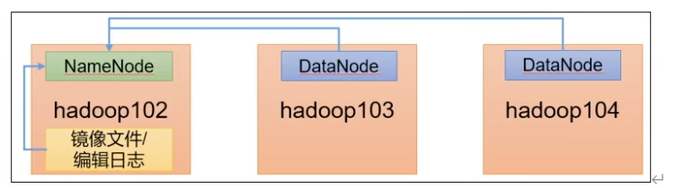

3. 退出安全模式条件
   - dfs.namenode.safe mode.min.datanodes：最小可用 datanode 数量，默认 0
   - dfs.namenode.safemode.threshold-pct:副本数达到最小要求的 block 占系统总 block 数的百分比,默认0.999f. (只允许丢一个块)
   -   dfs.namenode.safemode.extension:稳定时间，默认值 30000 毫秒，即 30 秒

4. 基本语法
   集群处于安全模式，不能执行重要操作（写操作）。集群启动完成后，自动退出安全模
   式。
   - bin/hdfs dfsadmin -safemode get  （功能描述：查看安全模式状态）
   - bin/hdfs dfsadmin -safemode enter （功能描述：进入安全模式状态)
   -  bin/hdfs dfsadmin -safemode leave （功能描述：离开安全模式状态）
   - bin/hdfs dfsadmin -safemode wait （功能描述：等待安全模式状态)
5. 案例 1：启动集群进入安全模式
   1. 重新启动集群
       [atguigu@hadoop102 subdir0]$ myhadoop.sh stop
       [atguigu@hadoop102 subdir0]$ myhadoop.sh start
   2. 集群启动后，立即来到集群上删除数据，提示集群处于安全模式
6. 案例 2： 磁盘修复
   1. 需求：数据块损坏，进入安全模式，如何处理
   2. 分别进入 hadoop102、 hadoop103、 hadoop104 的/opt/module/hadoop-3.1.3/data/dfs/data/current/BP-1015489500-192.168.10.102-1611909480872/current/finalized/subdir0/subdir0目录，统一删除某2个块信息
   3. 重新启动集群,安全模式已经打开，块的数量没有达到要求。
   4. 离开安全模式
      -  hdfs dfsadmin -safemode get
      -  hdfs dfsadmin -safemode leave

7. 案例3：模拟等待安全模式

   1. 查看当前模式
       hdfs dfsadmin -safemode get
       Safe mode is OFF

   2. 先进入安全模式
      bin/hdfs dfsadmin -safemode enter

   3. 创建并执行下面的脚本
       在/opt/module/hadoop-3.1.3 路径上,编辑一个脚本 safemode.sh

      ```shell
      $ vim safemode.sh
       !/bin/bash
       hdfs dfsadmin -safemode wait
       hdfs dfs -put /opt/module/hadoop-3.1.3/README.txt 
      $ chmod 777 safemode.sh
      $ ./safemode.sh 
      
      ```

   	4. 再打开一个窗口，执行
       bin/hdfs dfsadmin -safemode leave

   5. 再观察上一个窗口
       Safe mode is OFF

#### 6.3 慢磁盘监控

“慢磁盘”指的时写入数据非常慢的一类磁盘。其实慢性磁盘并不少见,当机器运行时间长了,上面跑的任务多了,磁盘的读写性能自然会退化,严重时就会出现写入数据延时的问题。

- 如何发现慢磁盘？
  正常在 HDFS 上创建一个目录，只需要不到 1s 的时间。如果你发现创建目录超过 1 分钟及以上，而且这个现象并不是每次都有。只是偶尔慢了一下，就很有可能存在慢磁盘。可以采用如下方法找出是哪块磁盘慢：

  - 通过心跳未联系时间。
    一般出现慢磁盘现象，会影响到DataNode与 NameNode之间的心跳。正常情况心跳时间间隔是 3s。超过 3s 说明有异常。

  - fio 命令，测试磁盘的读写性能

    - 顺序读测试
      **sudo yum install -y fio**
      **sudo fio -filename=/home/atguigu/test.log -direct=1 -iodepth 1 -thread -rw=read -ioengine=psync -bs=16k -size=2G -numjobs-10 -runtime=60 -group_reporting -name=test_r**
       Run status group 0 (all jobs):
       READ: bw=360MiB/s (378MB/s), 360MiB/s-360MiB/s (378MB/s-378MB/s),
       io=20.OGiB (21.5GB), run=56885-56885msec
      结果显示，磁盘的总体顺序读速度为 360MiB/s。

    - 顺序写测试
      **sudo fio -filename=/home/atguigu/test.log -direct=1 -iodepth 1 -thread rw=write -ioengine=psync -bs=16k -size=2G -numjobs=10 -runtime=60 -group_reporting -name=test_w**

       Run status group 0 (all jobs):
       WRITE: bw=341MiB/s (357MB/s), 341MiB/s-341MiB/s (357MB/s-357MB/s), io=19.0GiB (21.4GB), run=60001-60001msec
      结果显示,磁盘的总体顺序写速度为341MiB/s。+

    - 随机写测试：rw =randwrite 一般会慢一点 309MB/s

    - 混合随机读写测试：rw=randwr 最慢 220MB/s  94.6MB/s

#### 6.4 小文件归档

1. HDFS 存储小文件弊端


​	每个文件均按块存储,每个块的元数据存储在NameNode的内存中,因此HDFS存储小文件会非常低效。因为大量的小文件会耗尽 NameNode 中的大部分内存。但注意，存储小文件所需要的磁盘容量和数据块的大小无关。例如,一个 1MB 的文件设置为 128MB 的块存储，实际使用的是 1MB 的磁盘空间，而不是 128MB。

2. 解决存储小文件办法之一
   HDFS 存档文件或 HAR 文件，是一个更高效的文件存档工具，它将文件存入 HDFS 块，在减少NameNode内存使用的同时,允许对文件进行透明的访问。具体说来, HDFS存档文件对内还是一个一个独立文件,对NameNode而言却是一个整体,减少了NameNode的内存。
3. 案例实操
   1. 需要启动 YARN 进程start-yarn.sh
   2. 归档文件:把/input 目录里面的所有文件归档成一个叫 input.har 的归档文件,并把归档后文件存储到/output 路径下。
      hadoop archive -archiveName input.har -p /input /output
   3. 查看归档
      hadoop fs -ls /output/input.har
      hadoop fs -ls
   4. 解归档文件
      hadoop fs -cp har:///output/input.har/* / 

### 第 7 章 HDFS—集群迁移
####  7.1 Apache 和 Apache 集群间数据拷贝

1. scp 实现两个远程主机之间的文件复制
   - scp -r hello.txt root@ hadoop103:/user/atguigu/hello.txt
      //推 push
   - scp-r root@hadoop103:/user/atguigu/hello.txt hello.txt
      // 拉 pull
   - scp-r root@ hadoop103:/user/atguigu/hello.txt root@hadoop104:/user/atguigu //是通过本
     地主机中转实现两个远程主机的文件复制；如果在两个远程主机之间 ssh 没有配置的情况下可以使用该方式。
2. 采用 distep 命令实现两个 Hadoop 集群之间的递归数据复制
   $ bin/hadoop distcp hdfs://hadoop102:8020/user/atguigu/hello.txt （原数据）
    hdfs://hadoop105:8020/user/atguigu/hello.txt （目标）

 #### 7.2 Apache 和 CDH 集群间数据拷贝


### 第8章MapReduce生产经验

#### 8.1 MapReduce 跑的慢的原因

**MapReduce 程序效率的瓶颈在于两点：**

1. 计算机性能
   CPU、内存、磁盘、网络
2. 1/0 操作优化
   - 数据倾斜
   - Map运行时间太长，导致 Reduce 等待过久
   - 小文件过多

 #### 8.2 MapReduce常用调优参数 

- Map阶段

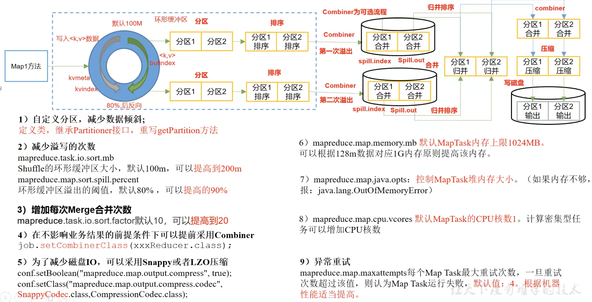

- Reduce阶段

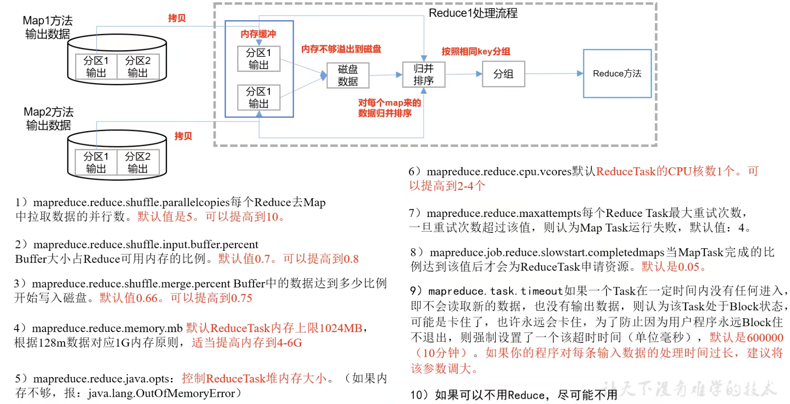

#### 8.3 MapReduce 数据倾斜问题
1. 数据倾斜现象
   数据频率倾斜——某一个区域的数据量要远远大于其他区域。
   数据大小倾斜-部分记录的大小远远平均值。

2. 减少数据倾斜的方法
   1. 首先检查是否空值过多造成的数据倾斜
      生产环境,可以直接过滤掉空值;如果想保留空值,就自定义分区,将空值加随机数打散。最后再二次聚合。
   2. 能在 map 阶段提前处理，最好先在 Map 阶段处理。如: Combiner、MapJoin
   3. 设置多个reduce个数

### 第9章Hadoop-Yarn生产经验

#### 9.1 常用的调优参数

1. 调优参数列表
   - Resource manager 相关
     -  yarn.resourcemanager.scheduler.client.thread-count ResourceManager处理调度器请求的线程数量
     - yarn. resourcemanager.scheduler.class 配置调度器
   - Node manager 相关
     -  yarn.nodemanager.resource.memory-mb
        NodeManager 使用内存数
     - yarn.nodemanager.resource.system-reserved-memory-mb NodeManager 为系统保留多少内存，和上一个参数二者取一即可
     - yarn.nodemanager.resource.cpu-vcores NodeManager使用cpu核数
     - yarn.nodemanager.resource.count-logical-processors-as-cores 是否将虛拟核数当作 CPU 核数
     - yarn.nodemanager.resource.pcores-vcores-multiplier 虚拟核数和物理核数乘数，例如：4 核 8 线程，该参数就应设为 24
     - yarn.nodemanager.resource.detect-hardware-capabilities是否让yarn自己检测硬件进行配置
     -  yarn.nodemanager.pmem-check-enabled 是否开启物理内存检查限制 container
     - yarn.nodemanager.vmem-check-enabled  是否开启虚拟内存检查限制 container
     - yarn.nodemanager.vemem-ratio 虚拟内存物理内存比例
     
   - Container 容器相关
     - 最小内存yarn.scheduler.minimum-allocation-mb 
     - 最大内存yarn.scheduler.maximum-allocation-mb 
     - 最小核数yarn.scheduler.minimum-allocation-vcores 
     - 最大核数yarn.scheduler.maximum-allocation-vcores
       

2. 参数使用案例，详见yarn部分

#### 9.2 容量调度器使用

详见yarn部分

#### 9.3 公平调度器使用

详见yarn部分

###  第10章Hadoop 综合调优
#### 10.1 Hadoop小文件优化方法

##### 10.1.1 Hadoop 小文件弊端

- HDFS上每个文件都要在NameNode上创建对应的元数据,这个元数据的大小约为150byte，这样当小文件比较多的时候，就会产生很多的元数据文件，一方面会大量占用NameNode的内存空间,另一方面就是元数据文件过多,使得寻址索引速度变慢。
- 小文件过多，在进行 MR 计算时，会生成过多切片，需要启动过多的 MapTask。每个MapTask处理的数据量小,导致MapTask的处理时间比启动时间还小,白白消耗资源。

##### 10.1.2 Hadoop 小文件解决方案
1. 在数据采集的时候,就将小文件或小批数据合成大文件再上传 HDFS (数据源头)

 2) Hadoop Archive (存储方向)
    是一个高效的将小文件放入 HDFS 块中的文件存档工具，能够将多个小文件打包成一个HAR文件,从而达到减少NameNode的内存使用

 3) CombineTextInputFormat (计算方向)

    CombineTextinputFormat 用于将多个小文件在切片过程中生成一个单独的切片或者少量的切片。

 4) 开启uber 模式，实现JVM 重用（计算方向）
    默认情况下，每个 Task 任务都需要启动一个 JVM 来运行，如果 Task 任务计算的数据量很小，我们可以让同一个 Job 的多个 Task 运行在一个 JVM 中，不必为每个 Task 都开启 一个 JVM.

    1. 未开启 uber 模式，在/input 路径上上传多个小文件并执行 wordcount 程序$ hadoop jar
        share/hadoop/mapreduce/hadoop-mapreduce-examples-3.1.3.jar wordcount /input /output24
    2. 观察控制台
       INFO mapreduce.Job: Job job_1613281510851_0002
        running in uber mode: false
    3. 观察http://hadoop103:8088/cluster

5. 开启uber 模式,在 mapred-site.xml中添加如下配置

   ```xml
   <!--开启 uber 模式，默认关闭 -->
    <property>
    <name>mapreduce.job.ubertask.enable</name>
    <value>true</value>
    </property>
   <!--uber 模式中最大的 mapTask 数量，可向下修改 --> 
    <property>
    <name>mapreduce.job.ubertask.maxmaps</name>
    <value>9</value>
    </property>
   <!--uber 模式中最大的 reduce 数量，可向下修改 -->
    <property>
    <name>mapreduce.job.ubertask.maxreduces</name>
    <value>1</value>
    </property>
   <!-- uber 模式中最大的输入数据量，默认使用 dfs.blocksize 的值，可向下修改-->
    <property>
    <name>mapreduce.job.ubertask.maxbytes</name>
    <value></value>
    </property>
   ```

6. 优点：减少开关jvm的时间


 #### 10.2测试MapReduce计算性能

使用 Sort 程序评测 MapReduce

** **

**注：一个虚拟机不超过 150G 磁盘尽量不要执行这段代码**

1. 使用RandomWriter 来产生随机数，每个节点运行 10个Map 任务，每个Map 产生大约 1G 大小的二进制随机数
   $hadoop jar /opt/module/hadoop-3.1.3/share/hadoop/mapreduce/hadoop-mapreduce-examples-
   3.1.3.jar randomwriter random-data
2. 执行 Sort 程序
   $ hadoop jar /opt/module/hadoop-
   3.1.3/share/hadoop/mapreduce/hadoop-mapreduce-examples-
   3.1.3.jar sort random-data sorted-data-
3. 验证数据是否真正排好序了
   $ hadoop jar
    /opt/module/hadoop-
   3.1.3/share/hadoop/mapreduce/hadoop-mapreduce-client- jobclient-3.1.3-tests.jar testmapredsort -sortInput random-data
    -sortOutput sorted-data

#### 10.3企业开发场景案例
##### 10.3.1 需求

1. 需求：从 1G 数据中，统计每个单词出现次数。服务器 3 台，每台配置 4G 内存，4 核 CPU,4 线程。
2. 需求分析：
   - 1G/128m-8 个 MapTask; 1 个 ReduceTask; 1 个 mrAppMastere
   - 平均每个节点运行 10 个/3 台 ≈3 个任务（4 3 3 

##### 10.3.2 HDFS 参数调优

1. 修改: hadoop-env.sh

   ```shell
   export HDFS_NAMENODE_OPTS-"-Dhadoop.security.loqqer-INFO,RFAS-Xmx1024m"
   export HDFS DATANODE OPTS="-Dhadoop.security.loqqer-ERROR,RFAS-Xmx1024m"
   ```

   

2. 修改hdfs-site.xml

   ```xml
   <!--NameNode 有一个工作线程池，默认值是 10 -->
    <property>
    <name>dfs.namenode.handler.count</name>
    <value>21</value>
    </property>
   ```

3.  修改 core-site.xml

   ```xml
   <!-- 配置垃圾回收时间为 60 分钟 --> 
   <property>
    <name>fs.trash.interval</name>
    <value>60</value>
    </property>
   ```

4. 分发配置


 ##### 10.3.3 MapReduce 参数调优

1. 修改mapred-site xml

   ```xml
   <!-- 环形缓冲区大小，默认 100m -->
    <property>
    <name>mapreduce.task.io.sort.mb</name><
    <value>100</value>
    </property>
   <!--环形缓冲区溢写阈值，默认 0.8 -->
    <property>
    <name>mapreduce.map.sort.spill.percent</name>
    <value>0.80</value>
    </property>
   <!-- merge 合并次数，默认 10 个 -->
    <property>
    <name>mapreduce.task.io.sort.factor</name>
    <value>10</value>
    </property>
   <!--maptask 内存，默认 1g； maptask 堆内存大小默认和该值大小一致-->
    <property>
    <name>mapreduce.map.memory.mb</name>
    <value>-1</value
    </property>
      
    <!-- matask 的 CPU 核数，默认 1 个 -->
    <property><
    <name>mapreduce.map.cpu.vcores</name>+
    <value>1</value>
    </property>
   <!-- matask异常重试次数，默认 4 次 -->
    <property>
    <name>mapreduce.map.maxattempts</name>
    <value>4</value>
    </property>
   <!-- 每个 Reduce 去 Map 中拉取数据的并行数。默认值是 5 -->
    <property>
    <name>mapreduce.reduce.shuffle.parallelcopies</name>
    <value>5</value>
    </property>
   <!-- Buffer 大小占 Reduce 可用内存的比例，默认值 0.7-->
    <property>
   <name>mapreduce.reduce.shuffle.input.buffer.percent</name>
    <value>0.70</value>
    </property>
   <--Buffer 中的数据达到多少比例开始写入磁盘，默认值 0.66。
    <property>
    <name>mapreduce.reduce.shuffle.merge.percent</name>
    <value>0.66</value>
    </property>
    <!-- reducetask 内存，默认 1g； reducetask 堆内存大小默认和该值大小一致-->
    <property>
    mapreduce.reduce.java.opts
    <name>mapreduce.reduce.memory.mb</name>
    <value>-1</value>
    <!-- reducetask 的 CPU 核数，默认 1 个 -->
    <property><
    <name>mapreduce.reduce.cpu.vcores</name>
    <value>2</value>
    </property>
    <!-- reducetask 失败重试次数，默认 4 次 -->
    <property>
    <name>mapreduce.reduce.maxattempts</name>
    <value>4</value>
    </property>
   <!-- 当 MapTask 完成的比例达到该值后才会为 ReduceTask 申请资源。默认是 0.05-->
    <property>
   <name>mapreduce.job.reduce.slowstart.completedmaps</name>
    <value>0.05</value>
    </property>
   <!-- 如果程序在规定的默认 10 分钟内没有读到数据，将强制超时退出 -->
    <property>
    <name>mapreduce.task.timeout</name>
    <value>600000</value>
    </property><
   
   ```

2. 分发配置


##### 10.3.4 Yarn参数调优

1.  修改 yarn-site.xml 配置参数如下
   1.  yarn.resourcemanager.scheduler.class ：选择调度器，默认容量
   2.  yarn.resourcemanager.scheduler.client.thread-count：ResourceManager处理调度器请求的线程数量,默认50;如果提交的任务数大于50,可以增加该值，但是不能超过 3 台 * 4 线程 = 12 线程（去除其他应用程序实际不能超过 8) 
   3.  yarn.nodemanager.resource.detect-hardware-capabilities：是否让 yarn 自动检测硬件进行配置,默认是 false,如果该节点有很多其他应用程序,建议手动配置。如果该节点没有其他应用程序，可以采用自动。 
   4.  yarn.nodemanager.resource.count-logical-processors-as-cores:是否将虚拟核数当作 CPU 核数，默认是 false，采用物理 CPU 核数
   5.  yarn.nodemanager.resource.pcores-vcores-multiplier:虚拟核数和物理核数乘数，默认是 1.0
   6.  yarn.nodemanager.resource.memory-mb:NodeManager 使用内存数，默认 8G，修改为 4G 内存
   7.  yarn.nodemanager.resource.cpu-vcores:nodemanager 的 CPU 核数，不按照硬件环境自动设定时默认是 8 个，修改为 4 个
   8.  yarn.scheduler.minimum-allocation-mb:容器最小内存，默认 1G
   9.  yarn.scheduler.maximum-allocation-mb:容器最大内存，默认 8G，修改为 2G
   10.  yarn.scheduler.minimum-allocation-vcores:容器最小 CPU 核数，默认 1 个
   11.  yarn.scheduler.maximum-allocation-vcores:容器最大 CPU 核数，默认 4 个，修改为 2 个
   12.  yarn.nodemanager.vmem-check-enabled:虚拟内存检查，默认打开，修改为关闭
   13.  yarn.nodemanager.vmem-pmem-ratio:虚拟内存和物理内存设置比例，默认 2.1
2. 分发配置

## Hadoop源码解析

### 第0章RPC通信原理解析

#### 0.0 回顾


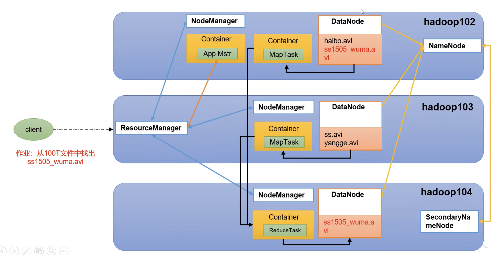

#### 0.1 需求

>  模拟 RPC 的客户端、服务端、通信协议三者如何工作的

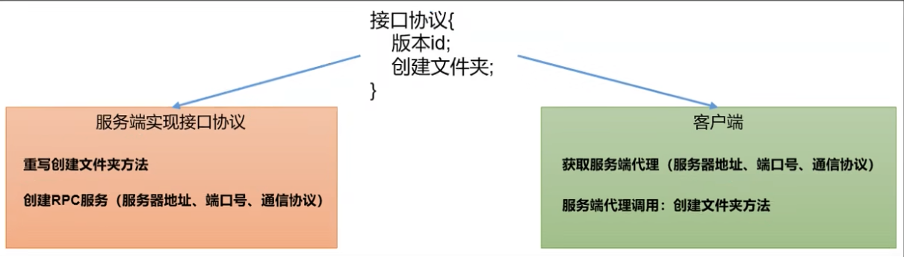

#### 0.2 代码编写

- 协议

  ```java
   package com.atguigu.rpc;
   public interface RPCProtocol {
   long versionID = 666;
   void mkdirs(String path);
   }
  ```

  

- 服务端

  ```java
  import java.10.IOException;
  //实现通信按口
   public class NNServer implements RPCProtocol{
   public static void main(String[] args) throws IOException{
  // 启动服务
   RPC.Server server new RPC.Builder(new ConfiqurationO)
   setBindAddress("localhost")
   .setPort(8888)
   .setProtocol(RPCProtocol.class)
   .setInstance(new NNServer())
   .build();
   System.out.println("服务器器开始工作");
   server.start();
   }
   @override
   public void mkdirs(String path){
   System.out.println("服务器接收到了客户端请求" + path);
   }
   }
  ```

  

- 客户端

  ```java
   package com.atguigu.rpc;
   import org.apache.hadoop.ipc.RPC;
   import java.net.InetSocketAddress;
   public class HDFSClient throws IOException
   {
   public static void main(String[] args) {
   RPCProtocol client=RPC.getProxy(RPCProtocol.class,RPCProtocol.versionID,new InetSocketAddress( "localhost" port: 8888),
   new  Configuration);
    Systen.out.println("客户端开始工作");
   client.mkdirs("/input");
  
  }
  }
  ```

  

###  第1章 NameNode 启动源码解析

#### NameNode 工作机制

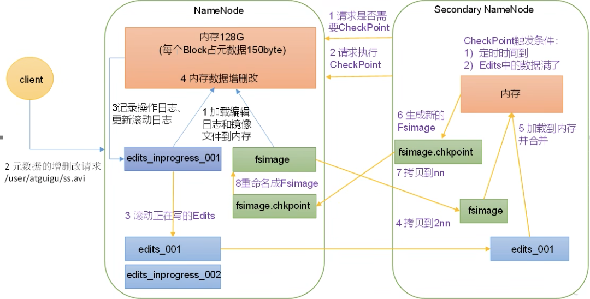


#### NameNode 启动流程

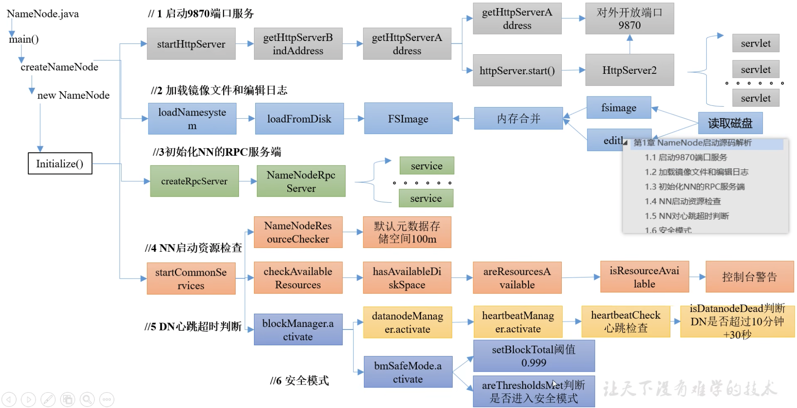


### 第2章 DataNode 启动源码解析

#### DataNode 工作机制

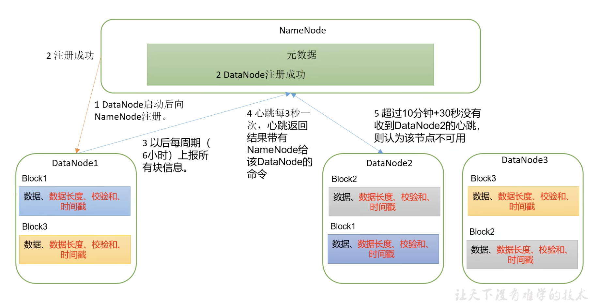

#### DataNode 启动流程

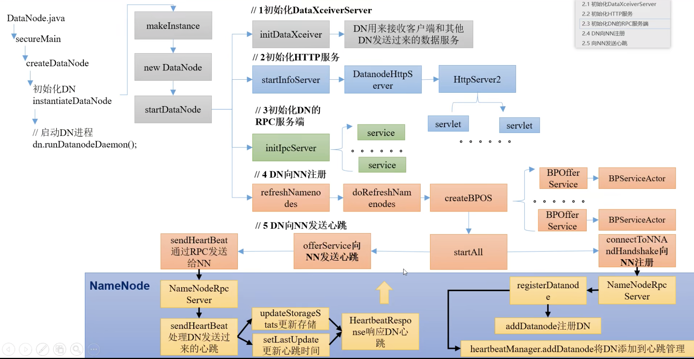


### 第3章 HDFS 上传源码解析

#### 3.1 HDFS 写数据机制

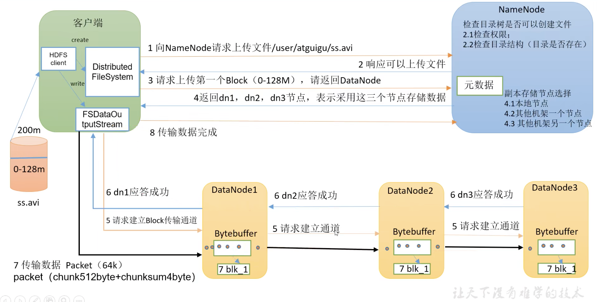

#### 3.2 HDFS 上传流程

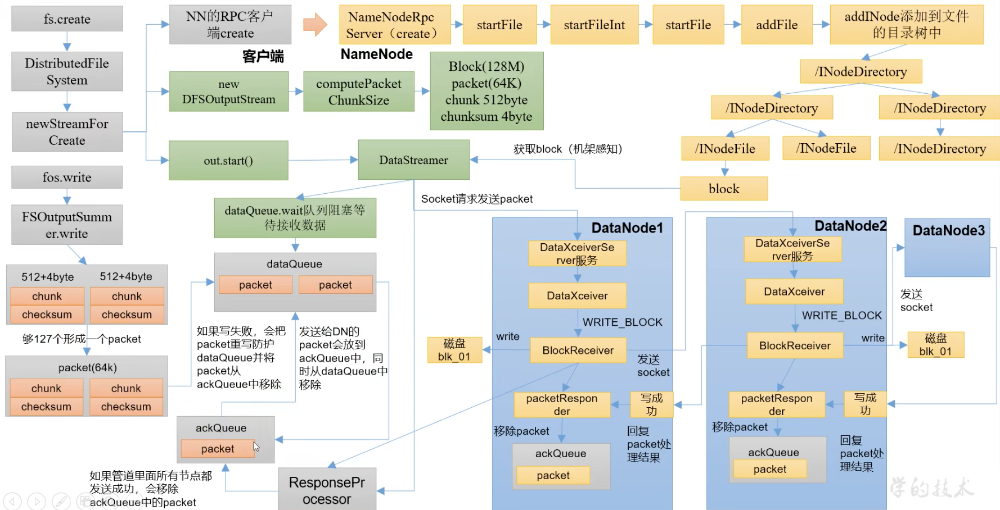


### 第4章 Yarn源码解析

#### 3.1 Yarn工作机制


#### 3.2 Yarn 工作流程

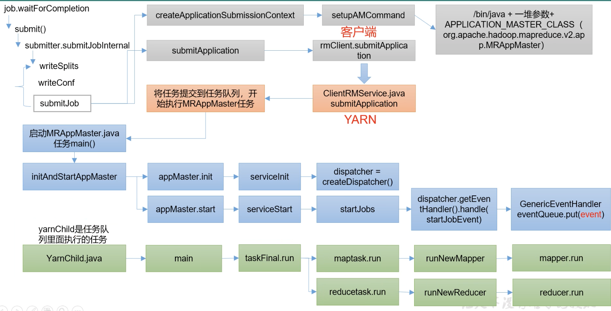


注意：

```java
 if (isMapTask)
 // If there are no reducers then there won't be any sort, Hence the map // phase will govern the entire attempt's progress.
 if (conf.getNumReduceTasks() == 0)
 mapPhase = getProgressC).addPhase( status: "map", weightage: 1.0f);
 เใs
 / If there are cedurers then the entire atteaot's arearess wili be
 // split between the map phase (67%) and the sort phase (33%).
 mapPhase = getProgress().addPhase( status: "map", weightage: 0.667f);
 sortPhasd getProgress().addPhase( statu: "sort". weightage: 0.333f):

```


### 第5章 MapReduce源码解析


### 第6章 Hadoop源码编译

#### 6.1 前期准备工作

1. 官网下载源码
    https://hadoop.apache.org/release/3.1.3.html
2. 修改源码中的 HDFS 副本数的设置
3. CentOS 虚拟机准备
   - CentOS 联网
      配置CentOS能连接外网。 Linux虚拟机ping www.baidu.com是畅通的e注意：采用 root 角色编译，减少文件夹权限出现问题
   -  Jar包准备(Hadoop源码、JDK8、 Maven, Ant 、 Protobuf
      hadoop-3.1.3-src.tar.gz
      jdk-8u212-linux-x64.tar.gz
      apache-maven-3.6.3-bin.tar.gz
      protobuf-2.5.0.tar.gz（序列化的框架）
      cmake-3.17.0.tar.gz

#### 6.1 安装相关工具

。。。

#### 6.3 编译源码

- 开始编译
  $mvn clean  package -DskipTests -Pdist,native -Dtar
- 注意：第一次编译需要下载很多依赖 jar 包，编译时间会很久，预计 1 小时左右，最终成功是全部SUCCESS,爽!!!
-  2)成功的64位 hadoop包在/opt/module/hadoop source/hadoop-3. 1.3-src/hadoop- dist/target 下 /opt/module/hadoop source/hadoop-3.1.3-src/hadoop-dist/target
