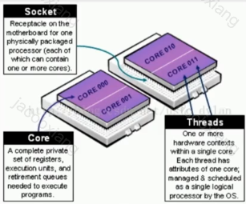

# 前言

> https://leetcode.cn/leetbook/read/da-han-hou-duan-gang-ti-mu-he-ji-shang/nlfox5/
>
> C++引力计划-腾讯学堂


**多编程范式，能直接操作系统内存**

1. 直接面向硬件
2. 零开销的抽象

# 编译过程


## 文件类别

首先了解`C++`编程中相关文件以及它们的含义。

| 后缀名                       | 描述                                  |
| ---------------------------- | ------------------------------------- |
| .a                           | 打包目标文件的库文件                  |
| .c/.C/.cc/.cp/.cpp/.cxx/.c++ | 源代码文件，函数和变量的**定义/实现** |
| .h                           | 头文件，函数和变量的**声明**          |
| .ii                          | 编译预处理产生的文件                  |
| .o (.obj in Windows)         | 编译产生的中间目标文件                |
| .s                           | 编译产生的汇编语言文件                |
| .so                          | 编译产生的动态库文件                  |
| .out (.exe in Windows)       | 链接目标文件产生的可执行文件          |


## 程序的编译和链接

**编译**(Compile)和**链接**(Link)是把源代码转换成可执行文件的过程。无论是C还是C++，源文件都要被编译为中间代码文件（目标文件Object file），在Windows系统中为`.obj`文件，在UNIX下则为`.o`文件。编译完成后，将目标文件和成为可执行文件的过程叫做链接。为了方便，以下名词均按UNIX系统来说。

### 编译

编译只需要满足语法正确，函数与变量声明的正确。为了找到声明(declaration)的位置，与定义(definition)联系起来，编译器需要被告知头文件的位置，只要语法正确，编译器就可以编译出**每个**`.cpp`源文件对应的中间目标文件。如果没有声明，编译器会给出警告，但是依然可以生成`.o`文件。

在Linux系统中，[gcc](https://gcc.gnu.org/)组件是最流行的C/C++编译器组合(GNU Compiler Collections)，但是原本的gcc是设计在GNU系统使用的(GNU C Compiler)，现在的gcc组件包含很多中编译器，比如gcc和`g++`，前者用来编译C程序而后者用于编译`C++`程序，但后者实际也可以编译C程序，因为`C++`从C语言扩展而来。而对于Windows系统，gcc组件移植为MinGW。

### 链接

链接主要是链接函数和全局变量，不管函数的源文件，只管它们的目标文件。要是在指明的目标文件中，链接器找不到函数的实现语句，就会报出链接错误(linker error)。当源文件太多时，中间目标文件也会很多，管理起来非常麻烦。这时候可以给中间目标文件打包，Windows下为库文件(Library file: `.lib`)，UNIX系统下为Archive file (`.a`)。

### 工程方法

在编译`C++`源文件时，我们有两类主要的方法：

- 在终端中通过命令编译。按照需要编译的文件量的多少，又可以分为使用`gcc/g++`对少量源文件编译和使用makefile/cmake对大量的多文件编译。**使用命令行方法的优点是能够在命令行中展示出生成可执行文件的过程中发生了什么，这也是写这篇文章的首要原因**。
- 使用集成开发环境（IDE）进行管理。比如说Visual Studio，方便进行工程管理。注意VSCode不是IDE，而是纯文本编辑器（editor），所以在使用VSCode的时候需要手动装好编译器（compiler）。

而另一个常见的操作名词：**调试**，实际上是一种特殊的运行程序的操作。在IDE或者VSCode中，我以前经常的调试方法最好的习惯也只是`断点调试(F9|F5)+单步执行(F10/F11)`，虽然说好于`无调试运行(Ctrl+F5)`，但是都看不到编译和链接的过程，毕竟很多bug只会产生警告，编译会照常进行生成目标文件，写程序初期需要有`编译(Ctrl+Shift+B)`的步骤。

## 例子

### 单个源文件生成可执行程序

从头开始，在合适的文件夹中创建名为hello的文件夹，进入hello，创建hello.cpp，打开编辑加入代码。

```c++
$ vi hello.cpp
$ more hello.cpp 
#include <iostream>
int main(int argc,char *argv[]) {
  std::cout << "hello, world" << std::endl;
  return(0);
}
```

```
$ g++ hello.cpp
```

编译器 `g++` 通过检查命令行中指定的文件的后缀名可识别其为 C++ 源代码文件。**编译器默认的动作：编译源代码文件生成对象文件(object file)，链接对象文件和 libstdc++ 库中的函数得到可执行程序, 然后删除对象文件。**

由于命令行中未指定可执行程序的文件名，编译器采用默认的 a.out。程序可以这样来运行：

```shell
$ ./a.out
hello, world
```


更普遍的做法是通过 `-o` 选项指定可执行程序的文件名。下面的命令将产生名为 helloworld 的可执行文件：

```shell
$ g++ hello.cpp -o hello
```


在命令行中输入程序名可使之运行：

```shell
$ ./hello
hello, world
```


### 多个源文件生成可执行程序

定义一个名为ask.h的头文件，包含类的定义和成员函数的声明：

```c++
$ vi ask.h
$ more ask.h 
#include <iostream>
class Ask{
	public:
		void askAge(const char *);
};
```


定义名为ask.cpp的文件，包含此成员函数的定义：

```c++
$ vi ask.cpp
$ more ask.cpp 
#include "ask.h"
using namespace std;
void Ask::askAge(const char *str){
	cout << str << ", how old are you?" << endl;
}
```


主函数放在askme.cpp文件中：

```c++
$ vi askme.cpp
$ more askme.cpp 
#include "ask.h"
using namespace std;

int main(int argc, char *argv[])
{
	Ask ask;
	ask.askAge("Soldier");
	return(0);
}
```


组合单一的可执行程序：

```c++
$ g++ askme.cpp ask.cpp -o askme
$ ls
ask.cpp  ask.h  askme  askme.cpp  hello.cpp  hello.ii  hello.o  hello.s
$ askme
askme: command not found
$ ./askme
Soldier, how old are you?
```


我们来看看如果不声明成员函数会发生什么。发现只有预编译不会报错也不会警告，生成汇编文件或者目标文件都会报错，和之前说的仅产生警告不太一样，不确定发生了什么，**留作疑问**。

```c++
(base) jinhang:~/Documents/hello$ more ask.h
#include <iostream>
class Ask{
//	public:
//		void askAge(const char *);
};
$ g++ -E ask.cpp -o temp.ii
$ ls
ask.cpp  askme      ask.s      hello.ii  hello.s
ask.h    askme.cpp  hello.cpp  hello.o   temp.ii
$ g++ -S ask.cpp
ask.cpp:3:33: error: no ‘void Ask::askAge(const char*)’ member function declared in class ‘Ask’
 void Ask::askAge(const char *str){
                                 ^
$ g++ -c ask.cpp
ask.cpp:3:33: error: no ‘void Ask::askAge(const char*)’ member function declared in class ‘Ask’
 void Ask::askAge(const char *str){
```


### 预处理阶段

使用选项`-E`指明预处理：

```shell
$ g++ -E helloworld.cpp
```

此时不会生成预处理文件，只会在终端中打印预处理文件内容，数不清的行数，但是基本上是**清除了无关代码**。指明输出文件选项`-o`保存看看：

```shell
$ g++ -E hello.cpp -o hello.ii
$ ls
hello.cpp  hello.ii
```

### 生成汇编代码

指明选项`-S`:

```shell
$ g++ -S hello.cpp 
$ ls
hello.cpp  hello.ii  hello.s
(base) jinhang:~/Documents/hello$ more hello.s
	.file	"hello.cpp"
	.text
	.section	.rodata
	.type	_ZStL19piecewise_construct, @object
	.size	_ZStL19piecewise_construct, 1
_ZStL19piecewise_construct:
	.zero	1
	.local	_ZStL8__ioinit
	.comm	_ZStL8__ioinit,1,1
.LC0:
	.string	"hello, world"
	.text
	.globl	main
	.type	main, @function
main:
.LFB1493:
	.cfi_startproc
	pushq	%rbp
	.cfi_def_cfa_offset 16
	.cfi_offset 6, -16
	movq	%rsp, %rbp
	.cfi_def_cfa_register 6
	subq	$16, %rsp
--More--(19%)
```


### 生成目标文件

选项`-c`告诉编译器编辑代码但是不执行链接，输出目标文件`.o`。

```shell
$ g++ -c hello.cpp 
$ ls
hello.cpp  hello.ii  hello.o  hello.s
```


### 链接

g++可以直接利用生成的目标文件来进行链接，把多个目标文件转换为单个可执行程序。

```shell
$ g++ -c ask.cpp
$ g++ -c askme.cpp
$ g++ ask.o askme.o -o askmeagain
$ ./askmeagain 
Soldier, how old are you?
```


### 创建静态库

我们可以把多个目标文件打包为一个库（归档文件），库中的成员包括普通函数，雷定义，雷德对象实例等等。管理这种归档文件的工具叫做ar。

首先创建两个对象模块，然后利用其生成静态库。头文件ask.h包含函数askAge()的圆形和类Ask的定义：

```c++
/* ask.h */
#include <iostream>
using namespace std;

void askme(void);

class Ask{
	private:
		string thestring;
	public:
		Ask(string str){	// Constructor
			thestring = str;
		}
		void askThis(const char *str){
			cout << str << " from a static library\n";
		}
		void askString(void);
};
```


下面是文件 ask.cpp 是我们要加入到静态库中的两个目标文件之一的源码。它包含 Ask 类中 askString() 函数的定义体；类 Ask 的一个实例 libraryask 的声明也包含在内：

```c++
/* ask.cpp */
#include "ask.h"
using namespace std;

void Ask::askString(){
	cout << thestring << "?"  << endl;
}

Ask libraryask("Library instance of Ask");
```


源码文件 askme.cpp 是我们要加入到静态库中的第二个目标文件的源码。它包含函数 askme() 的定义：

```c++
/* askme.cpp */
#include "ask.h"
using namespace std;

void askme()
{
	cout << "me from a static library" << endl;
}
```


将源码编译为目标文件，命令ar将它们存入库中：

```shell
$ g++ -c askme.cpp
$ g++ -c ask.cpp
ask.cpp:9:41: warning: ISO C++ forbids converting a string constant to ‘char*’ [-Wwrite-strings]
 Ask libraryask("Library instance of Ask");
                                         ^
$ ls
ask.cpp  askme       askme.cpp  ask.o  hello.cpp  hello.o  temp.ii
ask.h    askmeagain  askme.o    ask.s  hello.ii   hello.s
$ ar -r libask.a askme.o ask.o
ar: creating libask.a
```


程序 ar 配合参数 `-r` 创建一个新库 `libask.a` 并将命令行中列出的对象文件插入。采用这种方法，如果库不存在的话，参数 -r 将创建一个新的库，而如果库存在的话，将用新的模块替换原来的模块。

下面是主程序 askmain.cpp，它调用库 libask.a 中的代码：

```c++
/* askmain.cpp */
#include "ask.h"

int main(int argc, char *argv[]){
  extern Ask libraryask; // 使用库的对象
  Ask localask = Ask("Local instance of Ask"); //使用库的类定义
  askme(); // 使用库的普通该函数
  libraryask.askThis("howdy");
  libraryask.askString();
  localask.askString();
  return(0);
}
```


该程序可以下面的命令来编译和链接，**只需要对主函数源文件和归档文件进行链接**：

```shell
$ g++ askmain.cpp libask.a -o askmain
```


程序运行时，产生以下输出：

```shell
$ ./askmain 
me from a static library
howdy from a static library
Library instance of Ask?
Local instance of Ask?
```


# 基本语法

## 命名空间


智能指针是 C++ 中的一种特殊指针类型，用于自动管理动态分配的内存。它们通过封装原始指针，提供了更安全和方便的内存管理方式，帮助防止内存泄漏和悬空指针等问题。

## 智能指针

- 智能指针的优点
  - **自动内存管理**：智能指针会在超出作用域时自动释放内存，减少了手动管理内存的负担。
  - **防止内存泄漏**：由于智能指针会自动释放内存，减少了内存泄漏的风险。
  - **安全性**：智能指针提供了更安全的内存管理，避免了悬空指针和双重释放等问题。

C++ 标准库提供了几种智能指针，主要包括：

1. **`std::unique_ptr`**：
   - 表示对动态分配对象的独占所有权。
   - 不能被复制，只能移动（move），确保同一时间只有一个 `unique_ptr` 拥有该对象。
   - 当 `unique_ptr` 被销毁时，它所管理的对象也会被自动释放。

   ```cpp
   std::unique_ptr<MyClass> ptr(new MyClass());
   ```

2. **`std::shared_ptr`**：
   - 表示对动态分配对象的共享所有权。
   - 可以被多个 `shared_ptr` 实例共享，内部使用引用计数来管理对象的生命周期。
   - 当最后一个 `shared_ptr` 被销毁时，所管理的对象才会被释放。

   ```cpp
   std::shared_ptr<MyClass> ptr1(new MyClass());
   std::shared_ptr<MyClass> ptr2 = ptr1; // 共享所有权
   ```

3. **`std::weak_ptr`**：
   - 用于解决 `shared_ptr` 可能导致的循环引用问题。
   - 不增加引用计数，因此不会阻止所管理对象的销毁。
   - 可以通过 `shared_ptr` 来访问对象，但需要先检查对象是否仍然存在。

   ```cpp
   std::weak_ptr<MyClass> weakPtr = ptr1; // 不增加引用计数
   ```
---

**使用示例**

```cpp
#include <iostream>
#include <memory>

class MyClass {
public:
    MyClass() { std::cout << "MyClass created\n"; }
    ~MyClass() { std::cout << "MyClass destroyed\n"; }
};

int main() {
    {
        std::unique_ptr<MyClass> ptr1(new MyClass()); // 创建 unique_ptr
        // std::unique_ptr<MyClass> ptr2 = ptr1; // 错误：不能复制
        std::unique_ptr<MyClass> ptr2 = std::move(ptr1); // 移动所有权
    } // ptr2 超出作用域，MyClass 被销毁

    {
        std::shared_ptr<MyClass> ptr1(new MyClass()); // 创建 shared_ptr
        std::shared_ptr<MyClass> ptr2 = ptr1; // 共享所有权
    } // ptr1 和 ptr2 超出作用域，MyClass 被销毁

    return 0;
}
```

## Lambda
C++11 引入了 lambda 表达式，这是一种可以在代码中定义匿名函数的方式。Lambda 表达式使得在需要函数对象的地方（如 STL 算法、线程等）能够更方便地使用函数。下面将详细介绍 C++ lambda 表达式的语法、特性和使用示例。

### 1. Lambda 表达式的基本语法

C++ 中的 lambda 表达式的基本语法如下：

```cpp
[capture](parameters) -> return_type {
    // function body
}
```

- **capture**：捕获列表，用于指定 lambda 表达式可以访问的外部变量。
- **parameters**：参数列表，类似于普通函数的参数。
- **return_type**：返回类型，可以省略，编译器会根据函数体推导。
- **function body**：函数体，包含要执行的代码。

### 2. 捕获列表

捕获列表用于指定 lambda 表达式可以访问的外部变量。捕获方式有以下几种：

- **按值捕获**：使用 `=`，表示按值捕获外部变量的副本。
- **按引用捕获**：使用 `&`，表示按引用捕获外部变量。
- **混合捕获**：可以同时使用按值和按引用捕获。
- **捕获所有变量**：使用 `=` 捕获所有变量的副本，使用 `&` 捕获所有变量的引用。

**示例**

```cpp
int x = 10;
int y = 20;

// 按值捕获
auto lambda1 = [x]() {
    return x + 5; // 这里 x 是按值捕获的
};

// 按引用捕获
auto lambda2 = [&y]() {
    return y + 5; // 这里 y 是按引用捕获的
};

// 混合捕获
auto lambda3 = [x, &y]() {
    return x + y; // x 按值捕获，y 按引用捕获
};
```

### 3. 参数和返回类型

参数和返回类型的定义与普通函数相似。可以省略返回类型，编译器会根据函数体推导。

**示例**

```cpp
auto lambda = [](int a, int b) -> int {
    return a + b;
};

// 使用 lambda
int result = lambda(5, 3); // result = 8
```

### 4. 使用示例

#### 4.1 在 STL 算法中使用

Lambda 表达式常用于 STL 算法，如 `std::sort`、`std::for_each` 等。

```cpp
#include <iostream>
#include <vector>
#include <algorithm>

int main() {
    std::vector<int> vec = {1, 2, 3, 4, 5};

    // 使用 lambda 表达式打印每个元素
    std::for_each(vec.begin(), vec.end(), [](int n) {
        std::cout << n << " ";
    });
    std::cout << std::endl;

    // 使用 lambda 表达式进行排序
    std::sort(vec.begin(), vec.end(), [](int a, int b) {
        return a > b; // 降序排序
    });

    // 打印排序后的结果
    std::for_each(vec.begin(), vec.end(), [](int n) {
        std::cout << n << " ";
    });
    std::cout << std::endl;

    return 0;
}
```

### 5. Lambda 表达式的特性

- **类型**：Lambda 表达式的类型是一个唯一的、不可命名的类型。可以通过 `auto` 关键字来声明 lambda。
- **可调用性**：Lambda 表达式可以像普通函数一样被调用。
- **状态**：Lambda 表达式可以捕获外部变量的状态，这使得它们在某些情况下非常灵活。
- **内联**：Lambda 表达式可以在需要函数的地方直接定义，避免了额外的函数定义。

### 6. 递归 Lambda

C++14 引入了支持递归的 lambda 表达式。可以通过使用 `std::function` 来实现递归。

```cpp
#include <iostream>
#include <functional>

int main() {
    std::function<int(int)> factorial = [&](int n) {
        return (n <= 1) ? 1 : n * factorial(n - 1);
    };

    std::cout << "Factorial of 5: " << factorial(5) << std::endl; // 输出 120

    return 0;
}
```

### 7. 总结

C++ 的 lambda 表达式提供了一种简洁的方式来定义匿名函数，支持捕获外部变量，适用于 STL 算法和多线程编程等场景。通过灵活的捕获方式和可调用性，lambda 表达式使得代码更加简洁和易于维护。


## mutable
在 C++ 中，`mutable` 关键字用于 lambda 表达式和类的成员函数，主要用于允许在特定上下文中修改被捕获的变量。以下是 `mutable` 的具体作用和用法：

### 1. **在 Lambda 表达式中的作用**

当您在 lambda 表达式中使用 `mutable` 关键字时，它允许您修改捕获的变量，即使这些变量是按值捕获的。默认情况下，lambda 表达式捕获的变量是只读的，不能在 lambda 的主体中被修改。

#### 示例

```cpp
#include <iostream>

int main() {
    int x = 10;

    // 默认情况下，捕获的变量是只读的
    auto lambda1 = [x]() {
        // x = x + 1; // 这会导致编译错误
        std::cout << "x in lambda1: " << x << std::endl;
    };
    lambda1();

    // 使用 mutable 关键字
    auto lambda2 = [x]() mutable {
        x = x + 1; // 现在可以修改 x
        std::cout << "x in lambda2: " << x << std::endl;
    };
    lambda2();
    std::cout << "x after lambda2: " << x << std::endl; // x 仍然是 10

    return 0;
}
```

在这个示例中：

- `lambda1` 捕获 `x`，但不能修改它。
- `lambda2` 使用 `mutable`，允许在 lambda 内部修改 `x`。但是，注意到 `x` 的原始值在 lambda 外部仍然保持不变，因为 `x` 是按值捕获的。

### 2. **在类的成员函数中的作用**

在类的成员函数中，`mutable` 关键字允许您修改类的成员变量，即使该成员函数被声明为 `const`。这在某些情况下非常有用，例如，当您希望在 `const` 成员函数中缓存计算结果。

#### 示例

```cpp
#include <iostream>

class Example {
public:
    mutable int cache; // 可变成员变量

    Example() : cache(0) {}

    void compute() const {
        // 可以修改 mutable 成员变量
        cache++;
        std::cout << "Cache: " << cache << std::endl;
    }
};

int main() {
    Example ex;
    ex.compute(); // Cache: 1
    ex.compute(); // Cache: 2

    return 0;
}
```

在这个示例中，`cache` 是一个 `mutable` 成员变量，允许在 `const` 成员函数 `compute` 中被修改。

### 3. **总结**

- **在 lambda 表达式中**：`mutable` 允许修改按值捕获的变量。
- **在类的成员函数中**：`mutable` 允许在 `const` 成员函数中修改可变成员变量。

使用 `mutable` 可以在某些情况下提供更大的灵活性，但也要谨慎使用，以避免引入不必要的复杂性或错误。


## 协程

C++ 的协程（Coroutines）是一种用于简化异步编程和并发编程的语言特性。协程允许函数在执行过程中暂停和恢复，从而使得编写异步代码变得更加直观和易于管理。C++20 标准引入了协程的正式支持，使得 C++ 开发者能够更方便地使用这一特性。

### 协程的基本概念

1. **暂停与恢复**: 协程可以在执行过程中暂停（yield），并在稍后恢复执行。这种特性使得协程能够在处理 I/O 操作或其他耗时任务时，不会阻塞主线程。

2. **状态机**: 协程可以被视为一种状态机，能够在多个状态之间切换。每次暂停时，协程的状态会被保存，恢复时会从上次暂停的地方继续执行。

3. **异步编程**: 协程使得异步编程更加自然，开发者可以使用同步的方式编写代码，而不需要显式地使用回调函数或状态机。

### C++ 中的协程实现

在 C++20 中，协程的实现依赖于以下几个关键概念：

1. **协程句柄（Coroutine Handle）**: 协程的执行上下文，允许开发者控制协程的生命周期。

2. **协程返回类型**: 协程的返回类型通常是一个自定义的类型，必须实现特定的接口（如 `promise_type`），以支持协程的暂停和恢复。

3. **关键字**:
   - `co_await`: 用于等待一个异步操作的结果，协程在此处会暂停，直到操作完成。
   - `co_return`: 用于返回值并结束协程的执行。
   - `co_yield`: 用于返回一个值并暂停协程的执行，允许协程在后续恢复时继续执行。

### 示例代码

以下是一个简单的 C++ 协程示例，演示了如何使用协程来生成一个序列的数字：

```cpp
#include <iostream>
#include <coroutine>
#include <optional>

struct Generator {
    struct promise_type {
        int current_value;
        std::optional<int> next_value;

        auto get_return_object() {
            return Generator{std::coroutine_handle<promise_type>::from_promise(*this)};
        }

        auto yield_value(int value) {
            current_value = value;
            return std::suspend_always{};
        }

        auto return_void() {
            return std::suspend_always{};
        }

        auto await_transform(std::optional<int> value) {
            next_value = value;
            return std::suspend_always{};
        }
    };

    std::coroutine_handle<promise_type> handle;

    ~Generator() {
        if (handle) handle.destroy();
    }

    int next() {
        handle.resume();
        return handle.promise().current_value;
    }
};

Generator generate_numbers() {
    for (int i = 0; i < 5; ++i) {
        co_yield i;  // 暂停并返回当前值
    }
}

int main() {
    auto gen = generate_numbers();
    for (int i = 0; i < 5; ++i) {
        std::cout << gen.next() << std::endl;  // 输出 0 到 4
    }
    return 0;
}
```

### 协程的优点

1. **简化异步代码**: 协程使得异步编程的代码更易读，避免了回调地狱的问题。

2. **高效的资源管理**: 协程在等待 I/O 操作时不会占用线程资源，可以提高程序的并发性能。

3. **灵活性**: 协程可以轻松地实现复杂的控制流，如生成器、状态机等。

### 总结

C++ 的协程特性为异步编程和并发编程提供了一种新的方式，使得代码更加简洁和易于理解。通过使用协程，开发者可以更高效地处理 I/O 操作和其他耗时任务，提升程序的性能和可维护性。随着 C++20 的普及，协程将成为 C++ 开发中的一个重要工具。


# C++特性

C++ 语言自其首次发布以来经历了多个版本的演进。以下是 C++ 的主要版本及其关键特性：

| 版本   | 发布年份 | 关键特性                                                                                     |
|--------|----------|----------------------------------------------------------------------------------------------|
| C++98  | 1998     | - 引入标准模板库（STL）<br>- 支持命名空间（namespace）<br>- 异常处理（try, catch, throw）<br>- 模板（template） |
| C++03  | 2003     | - 对 C++98 的小幅修订，主要是修复缺陷和不一致性                                             |
| C++11  | 2011     | - 自动类型推导（auto）<br>- 范围基于的 for 循环<br>- Lambda 表达式<br>- 智能指针（如 `std::shared_ptr`）<br>- 线程库支持<br>- 右值引用和移动语义<br>- `nullptr` |
| C++14  | 2014     | - 泛型 lambda<br>- `std::make_unique`<br>- 二进制字面量（如 `0b1010`）<br>- 增强的 constexpr |
| C++17  | 2017     | - 结构化绑定<br>- `std::optional`<br>- `std::variant`<br>- 增强的并行算法<br>- 文件系统库（`<filesystem>`） |
| C++20  | 2020     | - 概念（concepts）<br>- 范围（ranges）<br>- 协程（coroutines）<br>- 增强的 constexpr<br>- `std::format` |
| C++23  | 2023（预计） | - 计划引入更多语言特性和库功能，如 `std::expected` 和 `std::flat_map`（尚未完全确定） |

## 1. C++98
- **发布年份**：1998
- **关键特性**：
  - 引入了标准模板库（STL），提供了常用的数据结构和算法。
  - 支持命名空间（namespace），解决了名称冲突的问题。
  - 引入了异常处理机制（try, catch, throw）。
  - 支持模板（template），允许编写泛型代码。

## 2. C++03
- **发布年份**：2003
- **关键特性**：
  - C++03 是对 C++98 的小幅修订，主要是修复了一些缺陷和不一致性，没有引入新的特性。

## 3. C++11
- **发布年份**：2011
- **关键特性**：
  - 引入了自动类型推导（auto）。
  - 支持范围基于的 for 循环（range-based for loop）。
  - 引入了 lambda 表达式，支持更简洁的函数对象。
  - 引入了智能指针（如 `std::shared_ptr` 和 `std::unique_ptr`）。
  - 支持线程库（`<thread>`），引入了多线程编程的支持。
  - 引入了右值引用（rvalue references）和移动语义（move semantics），提高了性能。
  - 引入了 `nullptr`，替代了 `NULL`。

### std::move
`std::move` 是 C++11 引入的一个标准库函数，位于 `<utility>` 头文件中。它的主要作用是将一个对象的值转换为一个右值引用，从而支持移动语义（move semantics）。移动语义允许资源（如动态分配的内存、文件句柄等）在对象之间高效地转移，而不是进行昂贵的复制操作。

#### 1. **基本概念**

- **右值和左值**：
  - **左值**（lvalue）：表示一个持久的对象，可以取地址的表达式。
  - **右值**（rvalue）：表示一个临时的对象，通常是一个表达式的结果，不能取地址。

- **移动语义**：通过移动语义，可以将资源的所有权从一个对象转移到另一个对象，而不需要复制资源。这在处理大型对象时可以显著提高性能。

#### 2. **`std::move` 的作用**

`std::move` 的作用是将一个左值转换为右值引用。它本身并不执行任何移动操作，而是提供了一种将对象标记为可以被移动的方式。

```cpp
#include <iostream>
#include <utility> // for std::move
#include <vector>

class MyClass {
public:
    MyClass() { std::cout << "Constructor\n"; }
    MyClass(const MyClass&) { std::cout << "Copy Constructor\n"; }
    MyClass(MyClass&&) noexcept { std::cout << "Move Constructor\n"; }
    ~MyClass() { std::cout << "Destructor\n"; }
};

int main() {
    MyClass obj1; // Constructor
    MyClass obj2 = std::move(obj1); // Move Constructor
    return 0;
}
```

在上面的例子中，`std::move(obj1)` 将 `obj1` 转换为右值引用，从而调用了移动构造函数，而不是复制构造函数。

#### 3. **使用场景**

- **容器类**：在 STL 容器（如 `std::vector`、`std::string` 等）中，使用 `std::move` 可以在插入或返回对象时避免不必要的复制。
  
- **自定义类**：在自定义类中实现移动构造函数和移动赋值运算符，以便在对象之间高效地转移资源。

#### 4. **注意事项**

- **使用后状态**：使用 `std::move` 后，原对象的状态是未定义的。虽然它仍然可以被使用，但不应依赖于其值。
  
- **避免误用**：不要对临时对象使用 `std::move`，因为临时对象本身就是右值，使用 `std::move` 只会增加不必要的复杂性。

#### 5. **示例**

以下是一个更复杂的示例，展示了如何在自定义类中使用 `std::move`：

```cpp
#include <iostream>
#include <utility>
#include <vector>

class Resource {
public:
    Resource(size_t size) : data(new int[size]), size(size) {
        std::cout << "Resource acquired\n";
    }
    
    // 移动构造函数
    Resource(Resource&& other) noexcept : data(other.data), size(other.size) {
        other.data = nullptr; // 使原对象失去对资源的控制
        other.size = 0;
        std::cout << "Resource moved\n";
    }
    
    ~Resource() {
        delete[] data;
        std::cout << "Resource released\n";
    }

private:
    int* data;
    size_t size;
};

int main() {
    Resource res1(10); // Resource acquired
    Resource res2 = std::move(res1); // Resource moved
    return 0; // Resource released
}
```

在这个示例中，`Resource` 类实现了移动构造函数，使用 `std::move` 将资源从 `res1` 移动到 `res2`，避免了不必要的复制。

#### 总结

`std::move` 是 C++11 中一个非常重要的工具，它使得移动语义成为可能，从而提高了程序的性能。通过合理使用 `std::move`，可以在对象之间高效地转移资源，减少不必要的复制开销。
## 4. C++14
- **发布年份**：2014
- **关键特性**：
  - 增强了 lambda 表达式，支持泛型 lambda。
  - 引入了 `std::make_unique`，简化了智能指针的创建。
  - 支持二进制字面量（如 `0b1010`）。
  - 增强了 constexpr，允许在编译时进行更多的计算。

## 5. C++17
- **发布年份**：2017
- **关键特性**：
  - 引入了结构化绑定（structured bindings），简化了元组和数组的解构。
  - 支持 `std::optional`，表示可能缺失的值。
  - 引入了 `std::variant`，支持类型安全的联合体。
  - 增强了并行算法，提供了并行执行的 STL 算法。
  - 引入了文件系统库（`<filesystem>`），提供了对文件系统的操作支持。

## 6. C++20
- **发布年份**：2020
- **关键特性**：
  - 引入了概念（concepts），提供了对模板参数的约束。
  - 支持范围（ranges），提供了更强大的序列操作。
  - 引入了协程（coroutines），支持异步编程。
  - 增强了 constexpr，允许在编译时执行更多的代码。
  - 引入了 `std::format`，提供了格式化字符串的功能。

## 7. C++23（正在进行中）
- **预计发布年份**：2023（或稍后）
- **关键特性**（尚未完全确定）：
  - 计划引入更多的语言特性和库功能，例如更好的支持范围、改进的元编程功能等。
  - 可能会引入新的标准库组件，如 `std::expected` 和 `std::flat_map`。

# 高性能并发编程

## 为什么需要并发和并行

- 单核cpu:
  - CPU运算速度远远大于数据输入速度
  - 多进程和多线程可以提升CPU的利用率
  - 浏览器 + 音乐 +下载等
  - 逻辑并行，物理串行
- 当进程输入数据量特别大，单cpu处理不过来，怎么办？
- 多核cpu:
  - 物理上提供更多的计算资源
  - 提升任务处理的并发度 -> 提高任务的处理能力
- 在多核cpu上，并行是否一定带来处理能力的线性提升？
  - 算法/逻辑的并行度
  - 竞争共享资源
    - 共享数据：是否必须共享？是否一定要加锁？
    - 硬件：多核cpu，硬件能力是否是线性提升的？


- 原子操作
  - 单核cpu一般不会出问题
  - 多核cpu存在并发问题
  - GCC支持的原子操作指令
    - _sync_add_adn_fetch, _sync_sub_and_fetch
    - _sync_or_and_fetch
    - Lock
  - 应用场景
    - 无锁队列
    - 自旋锁

## 无锁数据结构设计

### 一写一读环形队列

- 读线程操作：
  - 先判断是否有数据
  - 读取数据
  - 操作指针

- 写线程操作：
  - 先判断空间是否足够
  - 写入数据
  - 操作指针


### 多读多写环形队列

- 多个线程如何竞争操作一个指针？
  - 思路：Compare & swap 确保只有一个线程能把指针从当前位置指向下一个位置
- 先操作指针还是先读/写数据？
  - 先操作指针,有可能导致数据还没读,就被写入方覆盖
  - 先读/写数据，可能无法竞争到指针导致错误
  - 解决方案：标记法，已读取的数据置为NULL，未读数据为实际数据的指针，读写前先判断标记

- 可能存在的极端问题：
  - CAS的ABA指令
  - 两个线程读取同一个位置，第一个成功，第二个线程被挂起。指针有可能转一圈回到原位置，导致第二个线程CAS成功。极端情况会导致读指针越过写指针
  - 解决：用Seq替换指针，Seq为64位整数，自增且永不重复。指针=队列首地址+Seq%队列长度


## 基于原子操作实现的自旋锁


- 注意事项
  - 不建议使用在多进程场景
    - 指定pshared参数为PTHREAD-PROCESS SHARED也不行
    - pthread_spin_init只简单跳转到pthread_spin_unlock， pshared参数被忽略
  - 不建议长时间持有自旋锁
    - CPU资源浪费，反而影响整体性能

- 自旋锁扩展版
  - 带超时的自旋锁：
    - 锁变量用来记录持有时间戳.
    - 解锁/初始化：写入0
    - 加锁：判断是否为0或者是否超时，用cmp&swap原子操作写入当前时间戳，成功即为加锁成功。
  - 带sleep的自旋锁：
    - 轮训N个周期后，开始逐步sleep
    - 读写锁（共享-独占锁）
    - 锁变量：写锁 <0，读锁>0，无锁=0
    - 加读锁： lock >=0 &&_sync_add_and_fetch(lock, 1)
    - 加写锁:sync_bool_compare_and_swap(lock, 0, INT_MIN);写入极小值
    - 释放读锁: sync sub and fetch(lock. 1)
    - 释放写锁：*lock =0
    - 思考：加写锁可否写入-1?

### 锁的合理使用

- 极小化原则-减少锁冲突
  - 举例：链表式Hash表操作
  - 锁整表 VS 锁一条链表

- 读写锁分离 -- 允许多个只读操作同时进行
  - 读锁：可共享获取，允许多线程同时读，读的过程中不允许写
  - 写锁：排他锁，只允许一个线程写，且写入过程不允许读
  - 典型场景：STL的使用
    - 对同一个STL对象的并发读是安全的
    - 对不同STL对象的并发写是安全的
    - 对同一个STL对象的并发读写是不安全的

### 思考

- 某个程序,有3个线程作为生产者产生数据,1个线程作为消费者消费数据,设计一套队列
  - 用来在生产者和消费者之间传递数据。如果有2个线程作为消费者呢？
- 多线程程序，如何统计和周期性输出系统的某一个统计变量？

```cpp
uint64_t·ulstatcnt [MAX_THREAD_CNT];
 ulStatcnt[uiThreadID]++;
 for(uint32_t·i·=·0; ·i·<·MAX_THREAD_CNT; ·++i)
 uloutstat +=·ulStatcnt[i];
```


## CPU Cache对并发的影响


## 读写顺序对性能的影响

- 意义1:更充分的提高Cache使用率
- 意义2:充分利用CPU的数据预读
  - 案例：逐字节计算异或，每次计算一个Cache Line，对比对Cache Line的顺序访问与随机访问

- 一定要随机读怎么优化？
  -  _mm_prefetch 指令
  - 异步预读指令
  - 不适合马上访问该地址


## 地址对齐对Cache的影响

- 案例
  - 2GB内存,以int64为单元进行26亿次异或
  - 分别测试：地址对齐与非地址对齐 在顺序访问与随机访问下的耗时
- 分析
  - 在顺序访问的情况下,Cache命中率高，且有CPU预读，此时差别不大
  - 在随机访问的情况下, Cache命中率几乎为0,有1/8的概率横跨2个CacheLine,此时需要读2次内存
  - 此时耗时比大概为：7/8*1 +1/8*2 = 1.125
- 结论
  - CacheLine内部访问非字节对齐变量差别不大
  - 跨CacheLine访问代价主要为额外的内存读取开销
  - 良好的设计
  - 除网络通信协议外,避免使用#pragma pack(1)
  - 可通过调整成员顺序来缩小内存开销


## Numa技术

### 从认识CPU开始

- 认识CPU
  - Socket:主板上的CPU插槽,对应一颗完整的CPU
  - Core:CPU上的物理核心，包含完整的计算单元、寄存器、缓存等。
  - Threads:超线程,逻辑执行单元,有独立的执行上下文、寄存器，共享core上的缓存。CMT、FMT、SMT技术。




### 测试案例：Numa架构对并发性能的影响

- 环境： 20个线程,分布于两个CPU的各10个物理核。
- 测试方法：2GB内存,以int64为单元进行26亿次随机读写测试
- 分别测试：默认访问、Node内访问、跨Node访问的所有线程累计耗时与平均速度
- 结论：Node内访问性能比默认提示一倍左右，且在Node数量变多后效果更加明显


### Numa架构


### 超线程原理


### 超线程优化

- 原理1:同一物理核的超线程共享各级缓存
  - 优化1 :同一物理核的超线程尽可能做相同的事情,比如运行相同的代码,访问相同的数据区域
- 原理2:使用pause指令时,硬件将切换到另一个超线程计算
  - 优化2:忙等待时使用-mm-pause() ,例如等待自旋锁或者等待无锁队列中的数据


## 总结

- 锁
  - 尽可能不用（无锁编程）或少用（极小化原则&读写分离）
  - 轻量级锁：自旋锁
- CPU Cache
  - 避免多线程读写相同Cache Line
  - 线程访问对象尽可能与CacheLine地址对齐
  - 尽可能对内存做顺序读写，否则可使用CPU预读指令
  - 保持地址对齐
- Numa技术
  - 架构上进行Node分组
  - 设置CPU亲和性、内存分配策略，确保Node内访问内存
- 超线程
  - 超线程的原理，共享数据缓存
  - 做相同的事，访问相同的数据
  - 忙等时加上pause指令
