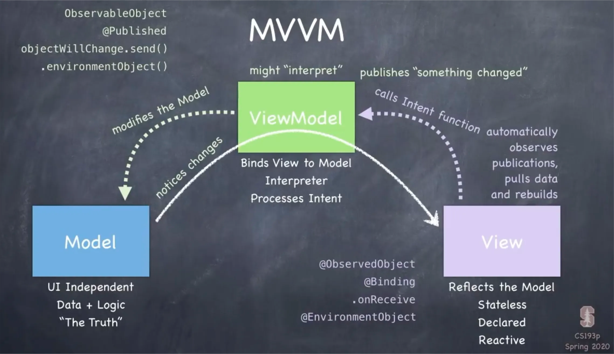

# 架构经验
## MVVM

MVVM（Model-View-ViewModel）是一种软件架构模式，主要用于构建用户界面（UI）应用程序，特别是在 WPF（Windows Presentation Foundation）、Xamarin、UWP（Universal Windows Platform）和其他基于 XAML 的技术中。MVVM 模式的主要目的是将用户界面（View）与业务逻辑（Model）和数据（ViewModel）分离，从而提高代码的可维护性、可测试性和可重用性。

### MVVM 的组成部分

1. **Model（模型）**：
   - Model 是应用程序的核心部分，负责处理数据和业务逻辑。它通常包含数据结构、数据库访问、网络请求等。
   - Model 不应该直接与 View 交互，它只负责提供数据和业务逻辑。

2. **View（视图）**：
   - View 是用户界面部分，负责显示数据并与用户进行交互。它通常由 XAML 文件定义（在 WPF 和其他 XAML 技术中）。
   - View 通过数据绑定（Data Binding）与 ViewModel 进行交互，接收数据并响应用户输入。

3. **ViewModel（视图模型）**：
   - ViewModel 是连接 View 和 Model 的桥梁。它负责处理 View 的状态和行为，并将 Model 中的数据转换为 View 所需的格式。
   - ViewModel 通常实现 `INotifyPropertyChanged` 接口，以便在数据发生变化时通知 View 更新界面。
   - ViewModel 还可以包含命令（Commands），用于处理用户的操作（如按钮点击）。

### MVVM 的工作流程

1. **数据绑定**：
   - View 通过数据绑定将 UI 元素与 ViewModel 的属性连接起来。当 ViewModel 的属性值发生变化时，View 会自动更新。

2. **命令**：
   - ViewModel 中定义的命令可以绑定到 View 中的按钮或其他交互元素。当用户与 UI 交互时，命令会被触发，执行相应的逻辑。

3. **双向绑定**：
   - MVVM 支持双向数据绑定，这意味着 View 中的输入可以直接更新 ViewModel 中的属性，反之亦然。

### MVVM 的优点

1. **分离关注点**：
   - MVVM 将 UI 逻辑与业务逻辑分离，使得代码更易于维护和测试。

2. **可测试性**：
   - ViewModel 可以独立于 View 进行单元测试，因为它不依赖于 UI 组件。

3. **可重用性**：
   - ViewModel 可以在不同的 View 中重用，减少代码重复。

4. **简化的设计**：
   - 使用数据绑定和命令，开发者可以更专注于业务逻辑，而不必过多关注 UI 的实现细节。

### MVVM 的缺点

1. **学习曲线**：
   - 对于初学者来说，MVVM 的概念和实现可能会有一定的学习曲线，特别是在理解数据绑定和命令的使用时。

2. **复杂性**：
   - 对于简单的应用程序，MVVM 可能会引入不必要的复杂性，导致代码过于冗长。

### 总结

MVVM 是一种强大的架构模式，特别适用于需要复杂用户界面的应用程序。通过将 View、ViewModel 和 Model 分离，MVVM 提高了代码的可维护性和可测试性，使得开发者能够更高效地构建和管理应用程序。虽然它有一些缺点，但在许多情况下，MVVM 的优点远远超过了这些缺点。

# 易错经验
## 1. 不要把 if 条件语句的初始化部分当做条件判断
> 容易误解的地方: 容易将 init 语句当做初始化+条件判断来使用
- C++17 新特性：if 语句初始化 -- if (init; condition)
- C++17 前 if 语句需要这样写代码
```
int a = GetValue();
if (a < 101) {
    cout << a;
}
```

C++17之后可以这样写：
```
// if (init; condition)

if (int a = GetValue()); a < 101) {
    cout << a;
}
```

使用这种方式可以尽可能约束作用域，让代码更简洁

- DON'T DO：
```
// 此写法中，auto self = weak_self.lock() 仅为初始化语句，不具备条件判断能力
// 之后若直接使用 self，可能出现空指针问题
if (auto self = weak_self.lock(); self->IsValid()) {
  ...
}
 ```

- DO：
```
if (auto self = weak_self.lock(); self && self->IsValid()) {
  ...
}
 ```

## 2.不要在 if 条件语句中初始化变量的同时使用 &&

- DON'T DO：
```
// 此写法中，&& 的优先级要高于 =，params 最终是一个 bool 变量
// 传递给 DoSomething 函数的是一个 bool 的 Variant，导致异常
if (auto params = Variant(variant) && is_valid) {
  DoSomething(params);
  ...
}
```

- DO：
```
if (auto params = weak_params.lock(); params && is_valid) {
  DoSomething(params);
  ...
}
```