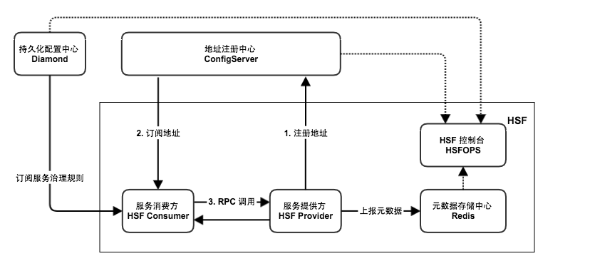
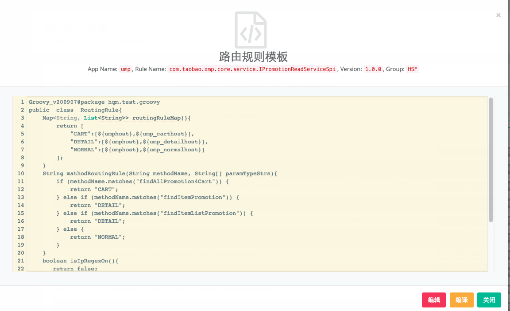
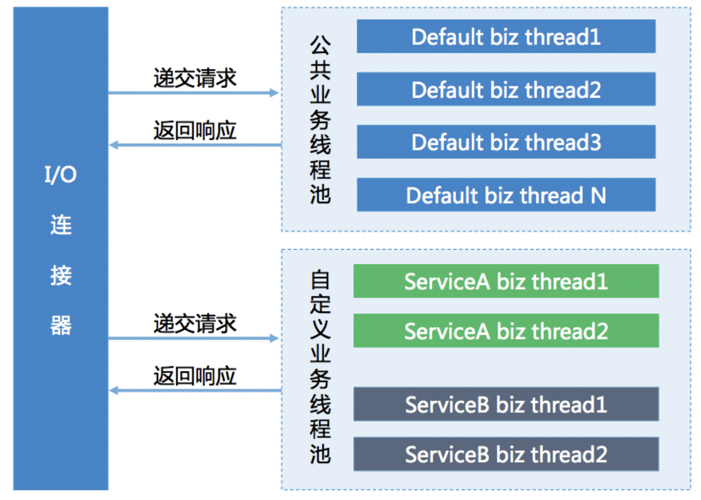

# 产品概述

HSF（High-speed Service Framework，高速服务框架）是一款在阿里巴巴内部广泛使用的分布式 RPC 服务框架。HSF 作为阿里巴巴的基础中间件，能够联通不同的业务系统，解耦系统间的实现依赖。该框架统一了分布式应用层面的服务发布和调用方式，从而帮助用户便捷地开发和使用分布式应用与公共功能模块。同时，HSF 还屏蔽了诸如远程通讯、序列化实现、性能损耗、同步/异步调用方式实现等分布式领域中的复杂技术细节。

## 架构

作为一个纯客户端架构的 RPC 框架，HSF 本身没有服务端集群。所有 HSF 服务调用均是服务消费方（Consumer）与服务提供方（Provider）点对点进行的。为了实现整套分布式服务体系，HSF 还需要依赖一些外部系统来提供额外的功能。



### 地址注册中心

地址注册中心用于服务发现功能。没有注册中心的话，HSF 只能完成简单的点对点调用。注册中心的存在使得服务提供端可以将自己的服务信息发布出去，服务消费端也可以从中获取需要调用的服务的机器信息。在阿里巴巴内部，地址注册中心是由 ConfigServer 承担的。

### 持久化配置中心

持久化配置中心用于存储 HSF 服务的治理规则。HSF 客户端在启动时会从配置中心订阅各种服务治理规则（如路由规则、归组规则、权重规则等），并根据这些规则对调用过程进行干预。在阿里巴巴内部，持久化配置中心的角色是由 Diamond 承担的。

### 元数据存储中心

元数据包含了 HSF 服务对应的方法列表和参数结构等信息。虽然元数据不会对 HSF 的调用过程产生直接影响，但为提高运维便捷性，HSF 客户端在启动时会将元数据上报到元数据存储中心，供运维使用。在阿里巴巴内部，元数据存储中心由 Redis 承担。

### HSF 控制台

[HSF 控制台](https://hsf.alibaba-inc.com/hsfops/v2)提供了一系列服务运维功能，包括服务查询、服务治理规则管理、服务测试、服务 Mock 及单机运维等，旨在提高 HSF 服务的研发效率和运维便捷性。

- 服务查询：提供多种维度的服务查询功能，展示服务的实时状态。
- 服务治理：提供管理路由规则、归组规则、同机房规则、权重规则等多种服务治理规则，帮助用户完成服务集群的管理与流量划分。
- 服务测试：提供快速测试和调用服务的能力，通过页面输入参数即可完成一次 HSF 服务调用，提高研发效率。
- 服务 Mock：提供 HSF 服务的 Mock 能力，无需关注服务端是否存在，只需在 HSFOPS 上配置好 Mock 规则，即可通过 hsf-mock 插件获取配置的 Mock 数据，无需修改代码。

## 应用场景

HSF 适用于希望进行服务化改造的应用，将单个巨型应用拆分成多个职责分明的基础服务应用，并将其提供给更多上层应用使用。如果你的应用希望实现这一目标，HSF 将会是最佳选择。

# 基于 API 方式部署 HSF 服务

## 快速入门

本文将向初次使用 HSF 的用户介绍如何快速的发布一个服务，以及如何通过远程调用消费这个服务。全文共包含以下内容：

1. 运行环境
2. 服务的定义与实现
3. 发布 HSF 服务
4. 消费 HSF 服务

## 1. 运行环境

- JDK >= 8
- Maven >= 3

## 2. 添加 Maven 依赖

HSF 最新版本请在 [artlab](https://artlab.alibaba-inc.com/GAResult?GroupId=com.taobao.hsf&Artifact=hsf-all) 中查看。

```xml
<dependency>
    <groupId>com.taobao.hsf</groupId>
    <artifactId>hsf-all</artifactId>
    <version>3.1.20</version>
</dependency>
```


## 3. 服务的定义与实现

**“服务” 始于接口的定义，首先需要根据业务逻辑定义好服务接口。**

在日常开发中，一般会将服务的接口定义在一个工程中，它会被打成一个 jar 包，发布到 maven 仓库中。服务端实现 jar 包中的接口，通过 HSF 发布对应的服务；而消费端通过依赖这个 jar 包，透过 HSF 远程调用消费到服务端的接口实现。

> 本文中的代码工程范例，可以在 [hsf-guide](http://gitlab.alibaba-inc.com/middleware-container/hsf-guide/tree/develop) 中获取。

### 3.1 定义服务接口

本文目的在于快速的展示 HSF 的使用方法，因此仅定义一个非常简单的 `HelloWorldService` 用于演示，并将它放在 `hsf-guide-api` 这个工程中。

```java
public interface HelloWorldService {

    /**
     * 根据参数中指定的名字，生成问候语
     *
     * @param name 被问候的姓名
     * @return 问候语
     */
    String sayHi(String name);
}
```


### 3.2 编写服务实现

在完成服务接口的定义后，服务提供方需根据业务逻辑实现接口。添加服务 `HelloWorldService` 的实现类 `HelloWorldServiceImpl` 。

```java
public class HelloWorldServiceImpl implements HelloWorldService {

    @Override
    public String sayHi(String name) {
        if (name == null || name.length() == 0) {
            return null;
        }
        return "Hi, " + name + "! Welcome to the HSF world.";
    }
}
```


在范例中，`HelloWorldService` 的业务逻辑很简单：若 name 不为空，则使用 name 生成问候语并返回；否则，返回 `null`。

至此，服务提供方实现代码编写完成。

## 4. 发布 HSF 服务

根据服务接口定义 `HelloWorldService` 完成本地服务 `HelloWorldServiceImpl` 的实现后，只需要将这个服务通过 HSF 发布出去，就可以让其他 HSF 客户端通过远程调用消费到当前机器的服务了。

在 main 函数中通过装配 `HSFApiProviderBean` 将发布服务 `HelloWorldService` ：

```java
HSFApiProviderBean hsfApiProviderBean = new HSFApiProviderBean();

// [设置] 发布服务的接口
hsfApiProviderBean.setServiceInterface("com.alibaba.middleware.hsf.guide.api.service.HelloWorldService");
// [设置] 服务的实现对象，target 为 HelloWorldServiceImpl 的实例
hsfApiProviderBean.setTarget(target);
// [设置] 服务的版本
hsfApiProviderBean.setServiceVersion("1.0.0");
// [设置] 服务的组别
hsfApiProviderBean.setServiceGroup("HSF");
// [设置] 服务的响应时间
hsfApiProviderBean.setClientTimeout(5000);
// [设置] 服务传输业务对象时的序列化类型
hsfApiProviderBean.setPreferSerializeType("hessian2");

// [发布] HSF服务
hsfApiProviderBean.init();
```


以上配置中，`serviceInterface`, `version`, `serviceGroup` 三者构成了 HSF 中最为关键概念：

- **服务名：** 即 `serviceInterface`:`version`
- **组别：** 即 `serviceGroup`

**服务名和组别唯一决定了服务的发布、订阅关系。**

> 除了 API 的方式外，HSF 还支持 SpringBoot 注解方式配置、发布服务，具体请参考 [用户指南 - 发布服务](https://mw.alibaba-inc.com/hsf/quick-start/qs-api) 这一小节。

启动 main 函数后，可在 [日常 HSFOPS 控制台](https://hsf.alibaba.net/hsfops/v2/service/query?dataId=com.alibaba.hsf.demo.DemoService*) 查询到发布的服务和机器。


## 4. 消费 HSF 服务

现在，服务接口定义的 jar 包已经 deploy 到 maven 仓库，HSF 服务也已经发布成功了，接下来服务的客户端只需要依赖接口定义，并引入 HSF 就可以消费远程的 `HelloWorldService` 服务了。

### 4.1 添加服务接口依赖

创建 `hsf-guide-client` 工程，作为客户端消费服务的工程。

客户端在消费服务前，首先需要向服务提供方咨询服务接口定义 jar 包的 maven 坐标，在本文中，即 `hsf-guide-api` 的坐标：

```xml
<dependency>
    <groupId>com.alibaba.middleware</groupId>
    <artifactId>hsf-guide-api</artifactId>
    <version>1.0.0-SNAPSHOT</version>
</dependency>
```


### 4.3 配置并消费 HSF 服务

在 main 函数中通过装配 `HSFApiConsumerBean` 订阅服务 `HelloWorldService`，并在初始化完成后，像调用本地代码一样，通过代理调用远程的 HSF 服务：

```java
HSFApiConsumerBean hsfApiConsumerBean = new HSFApiConsumerBean();

// [设置] 订阅服务的接口
hsfApiConsumerBean.setInterfaceName("com.alibaba.middleware.hsf.guide.api.service.HelloWorldService");
// [设置] 服务的版本
hsfApiConsumerBean.setVersion("1.0.0");
// [设置] 服务的组别
hsfApiConsumerBean.setGroup("HSF");

// [订阅] HSF 服务，同步等待地址推送，默认 false (异步)，同步默认超时时间 3000 毫秒
hsfApiConsumerBean.init(true);

// [代理] 获取 HSF 代理
HelloWorldService helloWorldService = (HelloWorldService) hsfApiConsumerBean.getObject();

// [调用] 像调用本地接口一样，发起 HSF 调用
String hi = helloWorldService.sayHi("BingYuan");
System.out.println(hi);
```


> 除了 API 的方式外，HSF 还支持 SpringBoot 注解方式配置、消费服务，具体请参考 [用户指南 - 编写调用端](https://mw.alibaba-inc.com/hsf/quick-start/qs-api) 这一小节。

`HSFApiConsumerBean` 构建完成后，HSF 就会根据代码中设置的服务名（interfaceName: version）和组别（group）订阅服务的地址，并在发起调用时，随机选取其中的一个服务提供方执行远程调用。

在服务提供方启动的状态下，运行上述代码，将会输出：

```jsx
Hi,BingYuan ! Welcome to the HSF world.
```


至此，`HelloWorldService` 这个服务的发布与消费过程，就全部完成了。

## 5. 总结

本文以 `HelloWorldService` 服务为例，介绍了如何定义、编写、发布、消费 HSF 服务的完整过程，所有源码都可以在 [hsf-guide](http://gitlab.alibaba-inc.com/middleware-container/hsf-guide/tree/develop) 工程中下载。

# 基于 SpringBoot 部署 HSF 服务

本文介绍如何在不接入 Pandora 的情况下使用 SpringBoot 部署 HSF 服务。

推荐优先参考 [基于 PandoraBoot 部署 HSF 服务](https://mw.alibaba-inc.com/hsf/quick-start/qs-pandora)，接入 Pandora 部署 HSF 服务。

## 1. 添加 Maven 依赖

```xml
<dependencies>
    <dependency>
        <groupId>org.slf4j</groupId>
        <artifactId>jcl-over-slf4j</artifactId>
    </dependency>

    <dependency>
        <groupId>org.springframework.boot</groupId>
        <artifactId>spring-boot-starter</artifactId>
    </dependency>

    <dependency>
        <groupId>org.springframework.boot</groupId>
        <artifactId>spring-boot-starter-web</artifactId>
    </dependency>

    <dependency>
        <groupId>org.springframework.boot</groupId>
        <artifactId>spring-boot-test</artifactId>
        <scope>test</scope>
    </dependency>

    <!-- hsf -->
    <dependency>
        <groupId>com.taobao.hsf</groupId>
        <artifactId>hsf-all</artifactId>
        <version>3.1.20</version>
    </dependency>
</dependencies>
```


## 2. 代码实现

### 2.1 SpringBoot 启动类

```java
package com.taobao.hsf;

import org.springframework.boot.SpringApplication;
import org.springframework.boot.autoconfigure.SpringBootApplication;

@SpringBootApplication(scanBasePackages = {"com.taobao.hsf"})
public class Application {

    public static void main(String[] args) {
        SpringApplication.run(Application.class, args);
    }
}
```


### 2.2 服务接口与实现

```java
package com.taobao.hsf.api;

public interface HelloWorldService {

    String sayHi(String name);
}
```


直接在服务实现类上添加 `@HSFProvider` 注解，指定服务接口、版本号和分组，即可发布服务。不指定 BeanName 的情况下，HSFProviderBean 在 Spring 中默认的 BeanName 为 HSFProvider-helloWorldServiceImpl。

```java
package com.taobao.hsf.api;

import com.taobao.hsf.app.spring.util.annotation.HSFProvider;

@HSFProvider(serviceInterface = HelloWorldService.class, serviceVersion = "1.0.0", serviceGroup = "HSF")
public class HelloWorldServiceImpl implements HelloWorldService{

    @Override
    public String sayHi(String name) {
        if (name == null || name.length() == 0) {
            return null;
        }
        return "Hi, " + name + "! Welcome to the HSF world.";
    }
}
```


SpringBoot 应用要直接使用 `com.taobao.hsf.app.spring.util.annotation.HSFProvider` 注解需要配置 HSF 的 BeanFactoryPostProcessor

```java
package com.taobao.hsf.config;

import com.taobao.hsf.app.spring.util.consumer.HSFConsumerSpringPostProcessor;
import com.taobao.hsf.app.spring.util.provider.HSFProviderSpringPostProcessor;
import org.springframework.beans.factory.config.BeanFactoryPostProcessor;
import org.springframework.context.annotation.Bean;
import org.springframework.context.annotation.Configuration;

@Configuration
public class HSFConfig {

    @Bean
    public BeanFactoryPostProcessor hsfProviderBeanFactoryPostProcessor() {
        return new HSFProviderSpringPostProcessor();
    }

    @Bean
    public BeanFactoryPostProcessor hsfConsumerBeanFactoryPostProcessor() {
        return new HSFConsumerSpringPostProcessor();
    }
}
```


### 2.3 消费端代码

通常一个 HSF Consumer 需要在多个地方使用，但并不需要在每次使用的地方都用 @HSFConsumer 来标记。

只需要写一个统一个 Config 类来注册到 Spring 容器，然后在其它需要使用的地方，直接@Autowired 注入即可。

HSFConsumerBean 在 Spring 中默认的 BeanName 为 HSFConsumer-helloWorldService，为了便于注入，这里指定 BeanName 为 helloWorldService。

```java
package com.taobao.hsf.consumer;

import com.taobao.hsf.api.HelloWorldService;
import com.taobao.hsf.app.spring.util.annotation.HSFConsumer;
import org.springframework.context.annotation.Configuration;

@Configuration
public class HSFConsumerConfig {

    @HSFConsumer(consumerBeanName = "helloWorldService", serviceVersion = "1.0.0", serviceGroup = "HSF")
    private HelloWorldService helloWorldService;
}
```


## 3. 发起调用

本地启动 Demo 成功后，可以在 [HSFops 控制台](https://hsf.alibaba.net/hsfops/v2/service/query) 日常环境中查询到服务，可以通过控制台服务测试功能对服务进行调用。

本文通过本地 Spring 单测的形式来执行一次调用。

```java
import com.taobao.hsf.Application;
import com.taobao.hsf.api.HelloWorldService;

import junit.framework.TestCase;
import org.junit.Test;
import org.junit.runner.RunWith;
import org.springframework.beans.factory.annotation.Autowired;
import org.springframework.boot.test.context.SpringBootTest;
import org.springframework.test.context.junit4.SpringJUnit4ClassRunner;

@RunWith(SpringJUnit4ClassRunner.class)
@SpringBootTest(classes = { Application.class })
public class HsfTest {

    @Autowired
    private HelloWorldService helloWorldService;

    @Test
    public void testInvoke() {
        TestCase.assertEquals("Hi, pandora boot! Welcome to the HSF world.", helloWorldService.sayHi("pandora boot"));
    }

}
```


## 4. 示例目录结构

```shell
.
├── pom.xml
└── src
    ├── main
    │   ├── java
    │   │   └── com
    │   │       └── taobao
    │   │           └── hsf
    │   │               ├── Application.java
    │   │               ├── api
    │   │               │   ├── HelloWorldService.java
    │   │               │   └── HelloWorldServiceImpl.java
    │   │               ├── config
    │   │               │   └── HSFConfig.java
    │   │               └── consumer
    │   │                   └── HSFConsumerConfig.java
    │   └── resources
    └── test
        └── java
            └── HsfTest.java
```


在实际项目中，消费方需要通过二方包的形式引入服务提供方的服务接口，以便在消费方中调用服务。


# 高级特性

## 异步调用

HSF 支持 Consumer 异步调用和 Provider 异步执行。

- Consumer 异步调用是指客户端发起调用后，不阻塞客户端线程立即返回，实际调用结果通过 ThreadLocal 或 Callback 方式获取。
- Provider 异步执行是指将服务端执行线程从 HSF 线程切换到业务自定义线程中，避免慢方法过度占用 HSF 线程池。

> Consumer 异步调用和 Provider 异步执行是相互独立的，可以单独使用，也可以同时使用。

### Consumer 异步调用

Consumer 异步调用可以通过 Future 或 Callback 的方式获取返回结果。

#### Future 异步调用

```java
HSFApiConsumerBean hsfApiConsumerBean = new HSFApiConsumerBean();
hsfApiConsumerBean.setInterfaceName("com.alibaba.middleware.hsf.guide.api.service.OrderService");
hsfApiConsumerBean.setVersion("1.0.0");
hsfApiConsumerBean.setGroup("HSF");

// [设置] 异步future调用，格式：name:{methodName};type:future
List<String> asyncallMethods = new ArrayList<String>();
asyncallMethods.add("name:queryOrder;type:future");
hsfApiConsumerBean.setAsyncallMethods(asyncallMethods);

hsfApiConsumerBean.init(true);

OrderService orderService = (OrderService) hsfApiConsumerBean.getObject();

// ---------------------- 调用 -----------------------//
// [调用] 发起HSF异步调用, 返回null
OrderModel orderModel = orderService.queryOrder(1L);
// 及时在当前调用上下文中，获取future对象；因为该对象是放在`ThreadLocal`中，同一线程中后续调用会覆盖future对象，所以要及时取出。
HSFFuture hsfFuture = HSFResponseFuture.getFuture();

// do something else
// 这里才真正地获取结果，如果调用还未完成，将阻塞等待结果，5000ms是等待结果的最大时间
try {
    System.out.println(hsfFuture.getResponse(5000));
} catch (InterruptedException e) {
    e.printStackTrace();
}
```

#### Callback 异步调用

**接口 Callback 方法配置**

```java
HSFApiConsumerBean hsfApiConsumerBean = new HSFApiConsumerBean();
hsfApiConsumerBean.setInterfaceName("com.alibaba.middleware.hsf.guide.api.service.OrderService");
hsfApiConsumerBean.setVersion("1.0.0");
hsfApiConsumerBean.setGroup("HSF");

List<String> asyncallMethods = new ArrayList<String>();
// 配置异步方法和回调方法
asyncallMethods.add("name:queryOrder;type:callback;listener:com.alibaba.middleware.hsf.CallbackHandler");
hsfApiConsumerBean.setAsyncallMethods(asyncallMethods);
hsfApiConsumerBean.init(true);

OrderService orderService = (OrderService) hsfApiConsumerBean.getObject();

 // 可选步骤，设置上下文。在此处设置的上下文，可以在回调方法中获取到。
CallbackInvocationContext.setContext("in callback");
orderService.queryOrder(1L);
// 清理上下文
CallbackInvocationContext.setContext(null);
```

**回调函数实现**

```java
public class CallbackHandler implements HSFResponseCallback {

    //业务异常时会触发
    @Override
    public void onAppException(Throwable t) {
        t.printStackTrace();
    }

    //业务返回结果
    @Override
    public void onAppResponse(Object result) {
        // 取callback调用时设置的上下文
        Object context = CallbackInvocationContext.getContext();

        System.out.println(result.toString() + context);
    }
    //HSF异常
    @Override
    public void onHSFException(HSFException e) {
        e.printStackTrace();
    }
}
```

也可以通过注解方式注入回调函数，可以在不使用 API 初始化的方式来配置回调函数。

```java
@AsyncOn(interfaceName = OrderService.class, methodName = "queryOrder")
public class CallbackHandler implements HSFResponseCallback {

...
}
```


#### 配置项和注意事项

回调函数是由单独的线程池（`LinkedBlockingQueue`无限队列）来调用的，不要做太费时间的操作，避免影响其他请求的 onAppResponse 回调。

callback 线程默认的 corePoolSize, maxPoolSize 是机器 cpu 数目。 下面的-D 参数可以去自定义配置。

CALLBACK 线程池最小配置： -Dhsf.callback.min.poolsize

CALLBACK 线程池最大的配置 -Dhsf.callback.max.poolsize

### Provider 异步执行

服务端异步执行是指将服务端执行线程从 HSF 线程切换到业务自定义线程中，并可在业务自定义线程中将获取 RPCContext 并将结果写回。

**定义服务端异步方法**

```java
public class DemoServiceFutureImpl implements DemoService {

    Executor executor = new ThreadPoolExecutor(1, 1,
            0L, TimeUnit.MILLISECONDS,
            new LinkedBlockingQueue<Runnable>());

    @Override
    public String sayHello(long userId, String name) {
        // 获取异步执行的 RPCContext，用于在异步线程中还原上下文并写回结果
        AsyncContext asyncContext = AsyncContext.startAsync();
        executor.execute(() -> {
            // 还原上下文
            asyncContext.signalContextSwitch();
            String result = "Hello " + name + ", response from provider: ";
            // 写回结果
            asyncContext.write(result);
            // 清空上下文
            asyncContext.resetContext();
        });
        return null;
    }
}
```


**服务端发布该服务**

服务端按正常流程发布该服务即可

```java
HSFApiProviderBean hsfApiProviderBean = new HSFApiProviderBean();
hsfApiProviderBean.setServiceInterface("com.alibaba.hsf.demo.DemoService");
hsfApiProviderBean.setTarget(new DemoServiceFutureImpl()); // target 为 serviceInterface 指定接口的实现对象
hsfApiProviderBean.setServiceVersion("1.0.0.halo1");
hsfApiProviderBean.setServiceGroup("HSF");
hsfApiProviderBean.init();
```


> 应用消费自己发布的服务，这个时候会走本地调用，不能进行异步处理，可以通过-Dhsf.client.localcall=false，关闭本地调用优先就好了


## 泛化调用

泛化调用是指在调用方没有服务方提供的 API（SDK）的情况下，不依赖服务发布方的代码和类型，对服务方进行调用，并且可以正常拿到调用结果。

### 适用场景

泛化调用主要用于实现一个通用的远程服务 Mock 框架，可通过实现 GenericService 接口处理所有服务请求。比如如下场景：

- 网关服务：如果要搭建一个网关服务，那么服务网关要作为所有 RPC 服务的调用端。但是网关本身不应该依赖于服务提供方的接口 API（这样会导致每有一个新的服务发布，就需要修改网关的代码以及重新部署），所以需要泛化调用的支持。
- 测试平台：如果要搭建一个可以测试 RPC 调用的平台，用户输入分组名、接口、方法名等信息，就可以测试对应的 RPC 服务。那么由于同样的原因（即会导致每有一个新的服务发布，就需要修改网关的代码以及重新部署），所以平台本身不应该依赖于服务提供方的接口 API。所以需要泛化调用的支持。

### API 形式配置 HSF 服务

将`HSFConsumerBean`, 配置`generic`为`true`，标识 HSF 客户端忽略加载不到接口的异常。

```java
HSFApiConsumerBean hsfApiConsumerBean = new HSFApiConsumerBean();
hsfApiConsumerBean.setInterfaceName("com.alibaba.middleware.hsf.guide.api.service.OrderService");
hsfApiConsumerBean.setVersion("1.0.0");
hsfApiConsumerBean.setGroup("HSF");
// [设置] 泛化配置
hsfApiConsumerBean.setGeneric("true");
hsfApiConsumerBean.init(true);

//使用泛化接口获取代理
GenericService genericOrderService = (GenericService) hsfApiConsumerBean.getObject();
// ---------------------- 调用 -----------------------//
// [调用] 发起HSF泛化调用, 返回map类型的result。
Map orderModelMap = (Map) genericOrderService.$invoke("queryOrder",
                            // 方法入参类型数组（xxx.getClass().getName())
                            new String[] { Long.class.getName() },
                            //参数，如果是pojo，则需要转成Map
                            new Object[] { 1L });
```


`GenericService`提供的`$invoke`方法包含了真实调用的方法名、入参类型和参数，以便服务端找到改方法。由于没有依赖服务端的 API jar 包，传入的参数如果是自定义的 DTO，需要转成客户端可以序列化的`Map`类型。

### 调用传参说明

- 方法没有入参，可以只传 methodName: `service.$invoke("sayHello", null, null)`

- 方法类型有泛型的，比如`List<String>`，只需要传`java.util.List`，即`List.class.getName()`的值，不要传成`java.util.List<String>`，否则会出现方法找不到的错误。

- 调用方在不确定格式的情况下，可以通过本地执行单测的方式来生成一个 POJO Bean 的 Map 描述格式。

  > Map pojoMap = (Map) PojoUtils.generalize(new OrderModel())

- 传递参数为 pojo 的 demo:

```java
class User {
    private String name;
    private int age;
    //需要是标准的pojo格式，这里省略getter setter
}

 //直接使用map去构造pojo对应的泛化参数
Map param = new HashMap<String, Object>();
param.put("age", 11);
param.put("name","Miles");
//当传递的参数是声明参数类型的子类时，需要传入class字段，标明该pojo的真实类型（服务端需要有该类型）
param.put("class", "com.taobao.User");
```


#### 注意事项

- 泛化调用，路由规则默认不生效

- 泛化调用性能会比正常调用差

- 配置抛出业务异常

  ```
  Dhsf.generic.throw.exception=true
  ```

  - 本地存在异常类，由于`com.taobao.hsf.remoting.service.GenericService` 上没有声明该异常，如果不是 RuntimeException 类型或其子类，则会抛出 UndeclaredThrowableException，可以通过 getCause 获取真实异常
  - 本地没有该异常类，则抛出`com.taobao.hsf.util.GenericInvocationException`


## 超时配置

有关网络调用的请求，都需要配置超时，HSF 的默认超时时间是 3000ms 。客户端和服务端都可以设置超时，默认 **优先采用客户端** 的配置，如果客户端没有配置，使用服务端的超时配置。 在服务端设置超时时，需要考虑到业务本身的执行耗时，加上序列化和网络通讯的时间。所以推荐服务端给每个服务都配置个默认的时间。当然客户端也可以根据自己的业务场景配置 超时时间，比如一些前端应用，需要用户快速看到结果，可以把超时时间设置小一些。

配置的作用范围、作用域，按照优先级由高到低如下表所示:

> 客户端配置优先于服务端，方法优先于接口

| 优先级 | API                                                    | 范围   | 作用域   |
| :----- | :----------------------------------------------------- | :----- | :------- |
| 0      | `com.taobao.hsf.util.RequestCtxUtil#setRequestTimeout` | 客户端 | 单次调用 |
| 1      | `HSFApiConsumerBean#setMethodSpecials`                 | 客户端 | 方法     |
| 2      | `HSFApiConsumerBean#setClientTimeout`                  | 客户端 | 接口     |
| 3      | `-DdefaultHsfClientTimeout`                            | 客户端 | 所有接口 |
| 4      | `HSFApiProviderBean#setMethodSpecials`                 | 服务端 | 方法     |
| 5      | `HSFApiProviderBean#setClientTimeout`                  | 服务端 | 接口     |

### 客户端超时配置

#### 客户端全局接口超时配置

- 在启动参数中添加`-DdefaultHsfClientTimeout=100`
- 在代码中添加`System.setProperty("defaultHsfClientTimeout", “100”)`

#### API 配置 HSF 客户端单接口、指定方法的超时

配置`HSFApiConsumerBean`的`clientTimeout`属性，单位是 ms，我们把接口的超时配置为 1000ms，方法`queryOrder`配置为 100ms,代码如下：

```java
HSFApiConsumerBean consumerBean = new HSFApiConsumerBean();
//接口级别超时配置
consumerBean.setClientTimeout(1000);
//xxx
MethodSpecial methodSpecial = new MethodSpecial();
methodSpecial.setMethodName("queryOrder");
//方法级别超时配置，优先于接口超时配置
methodSpecial.setClientTimeout(100);
consumerBean.setMethodSpecials(new MethodSpecial[]{methodSpecial});
```


#### 注解配置客户端单接口的超时

通过注解配置 method 超时、client 超时

```java
    @HSFConsumer(clientTimeout = 1000, methodSpecials = 	@HSFConsumer.ConsumerMethodSpecial(methodName = "queryOrder", clientTimeout = "100"))
    private OderService orderService;
```

#### Spring property 配置单个接口的超时

配置规则，注意复数

```jsx
spring.hsf.timeouts.${接口名}=xxx
```


例子：

```jsx
spring.hsf.timeouts.com.acme.DemoService = 2000
```


- 配置覆盖关系

参考 [spring-boot-hsf 配置覆盖关系](https://mw.alibaba-inc.com/pandora-boot/develop/spring/spring-boot-hsf#配置的覆盖关系)

### 服务端方法超时配置

#### API 配置 HSF 服务端超时

配置`HSFApiProviderBean`的`clientTimeout`属性，单位是 ms，代码如下：

```java
HSFApiProviderBean providerBean = new HSFApiProviderBean();
//接口级别超时配置
providerBean.setClientTimeout(1000);
//xxx
MethodSpecial methodSpecial = new MethodSpecial();
methodSpecial.setMethodName("queryOrder");
//方法级别超时配置，优先于接口超时配置
methodSpecial.setClientTimeout(100);
providerBean.setMethodSpecials(new MethodSpecial[]{methodSpecial});
```


#### 注解配置 HSF 服务超时

注入即可, 上述例子中的 API 配置等同于如下注解配置：

```java
@HSFProvider(serviceInterface = OrderService.class, clientTimeout = 3000)
public class OrderServiceImpl implements OrderService {
    @Autowired
    private OrderDAO orderDAO;

    @Override
    public OrderModel queryOrder(Long id) {
        return orderDAO.queryOrder(id);
    }
}
```


### 序列化方式配置

序列化的过程是将 java 对象转成 byte 数组在网络中传输，反序列化会将 byte 数组转成 java 对象。序列化的选择需要考虑兼容性，性能等因素，HSF 的序列化方式支持 `hessian2`、`java` ，默认是`hessian2`。这些序列化方式的对比和配置（只在服务端配置`HSFApiProviderBean`）如下表所示：

| 序列化方式 | MAVEN 依赖                                           | 配置                               |
| :--------- | :--------------------------------------------------- | :--------------------------------- |
| hessian2   | `<artifactId>hsf-io-serialize-hessian2</artifactId>` | setPreferSerializeType("hessian2") |
| java       | `<artifactId>hsf-io-serialize-java</artifactId>`     | setPreferSerializeType("java")     |

#### API 形式配置 HSF 服务序列化方式

```java
HSFApiProviderBean hsfApiProviderBean = new HSFApiProviderBean();
hsfApiProviderBean.setPreferSerializeType("hessian2");
```

默认为 hessian2

#### Spring 注解方式配置

暂未透出注解 api，默认为 hessian2。


## 路由规则

路由规则作用于 Consumer，支持在调用阶段根据自定义策略决定路由至 Provider 指定机器分组。

用途：

- 单一接口灰度
- 按照上游应用业务域隔离流量到不同分组
- 服务在应用间迁移

### 添加路由规则

1. 进入 https://hsf.alibaba-inc.com/hsfops/v2/governance/service/route/rule
2. 点击 “新建路由规则”
3. 配置新规则
   - DataId: 服务名.ROUTINGRULE
   - Group ID: 服务组别
   - content

```groovy
package hqm.test.groovy
public class RoutingRule {

  // define address list
  Map<String, List<String>> routingRuleMap(){
    return [
        // value 是应用分组列表，需要放在 `{}` 里
      "interface_level_address_filter_Key":["{machine-group1}","{machine-group2}"]
    ]
  }

  // 接口级别规则, 返回值是上方 `routingRuleMap` 的 key
  String interfaceRoutingRule(){
    return "interface_level_address_filter_Key";
  }

  // 是否开启空保护：当路由结果为空时， failover 至上级规则筛选出的地址
  boolean isEmptyProtection(){
    return true;
  }

  // 是否开启 IP 正则: 非常影响性能，不要开启
  boolean isIpRegexOn(){
    return false;
  }

  // 回退至老路由规则：兼容逻辑，不要开启
  boolean isSwitchToOldRouteRule(){
    return false;
  }
}
```


### 规则示例

#### 接口路由

如果想对服务 A 做接口级别路由，其中提供 A 服务的机器分组有：{host_a,host_b,host_c}，希望服务 A 的消费者全部路由到 {host_c}，那么可以创建下述路由规则：

```java
Groovy_v200907@package hqm.test.groovy
public class RoutingRule{

  // define address list
  Map<String, List<String>> routingRuleMap(){
    return [
      "G1":["{host_c}"]
    ]
  }

  // define routing rule at interface level
  String interfaceRoutingRule(){
    return "G1";
  }

  // turn off regular match of address defined in routingRuleMap()
  boolean isIpRegexOn(){
    return false;
  }
}
```


#### 方法路由

方法路由是服务调用按照方法控制其路由到固定机器分组。

- 是的，你没有看错，方法路由的名称就是

  ```
   mathodRoutingRule 
  ```

```java
Groovy_v200907@package hqm.test.groovy
public class RoutingRule{

  // define address list
  Map<String, List<String>> routingRuleMap(){
    return [
      "read_method_address_filter_Key":["{host_r}"],
      "write_method_address_filter_Key":["{host_w}"]
    ]
  }

  // define routing rule at method level
  String mathodRoutingRule(String methodName, String[] paramTypeStrs){
    if(methodName.matches("get.*"))
      return "read_method_address_filter_Key";
    else if (methodName.matches("put.*"))
      return "write_method_address_filter_Key";
    else
      return null; // it will go on to process interfaceRoutingRule() if it is configured
  }

  // turn off regular match of address defined in routingRuleMap()
  boolean isIpRegexOn(){
    return false;
  }
}
```


#### 参数路由

参数路由是服务调用按照参数传入的实际值，路由至对应机器。 需要注意，参数路由每次调用都会触发，因此是一个[闭包](https://en.wikipedia.org/wiki/Closure_(computer_programming))

示例如下：

```groovy
Groovy_v200907@package hqm.test.groovy
public class RoutingRule{

  // define address list
  Map<String, List<String>> routingRuleMap(){
    return [
      "BSeller_address_filter_Key":["{host_a}"],
      "ASeller_address_filter_Key":["{host_b}"]
    ]
  }

  // define routing rule at argument level
  Object argsRoutingRule(String methodName, String[] paramTypeStrs){
    if (methodName.startsWith("routeBySeller")) {
      return {
        Object[] args->
          if(args[0] > 10)
            return "BSeller_address_filter_Key";
          else
            return "ASeller_address_filter_Key";
      }
    } else {
      return null; // it will go on to process mathodRoutingRule(), interfaceRoutingRule() if they are configured
    }
  }

  // turn off regular match of address defined in routingRuleMap()
  boolean isIpRegexOn(){
    return false;
  }
}
```


#### 客户端验证

在客户端执行命令：

> {yourservice}:{version} 要替换成上面配置的服务名称和版本号

```sh
telnet localhost 12201
cd hsf
getServiceRule {yourservice}:{version}
```


```json
[
  {
    "isLocalSiteEnabled": false,
    "FlowControlRule": "FlowControlRule [localPreferredSwitch=on, threshold=0.1, isNewRule=true]",
    "VirtualCmRule": "[VirtualCmRule]",
    "TPSRule": "empty",
    "MethodRouteRule": {},
    "oldRouteRuleSubsribed": false,
    "newRouteRuleApplied": true,
    "ArgsRouteRule": {},
    "serviceName": "com.alibaba.middleware.hsf.guide.api.service.HelloWorldService:1.0.0.routerule",
    "RawRouteRule": "package hqm.test.groovy\r\npublic class RoutingRule{\r\n\r\n  // define address list\r\n  Map<String, List<String>> routingRuleMap(){\r\n    return [\r\n      \"G1\":[\"192.168.1.3:*\",\"{unknown}\"]\r\n    ]\r\n  }\r\n\r\n  // define routing rule at interface level\r\n  String interfaceRoutingRule(){\r\n    return \"G1\";\r\n  }\r\n\r\n  // turn off regular match of address defined in routingRuleMap()\r\n  boolean isIpRegexOn(){\r\n    return false;\r\n  }\r\n  \r\n  boolean isSwitchToOldRouteRule() {\r\n    return false;\r\n  }\r\n}\r\n",
    "InterfaceRouteRule": "G1"
  }
]
```


返回结果中，存在 `"newRouteRuleApplied":true` 说明路由规则已生效

### FAQ

Q: 本地调用、泛化调用路由规则不生效，是我哪里配置的不对吗？

A: 本地调用和泛化调用不支持路由规则

Q: 上面说的 `isEmptyProtection` 开启后会有什么作用？

A: 路由规则分为接口级-->方法级-->参数级，若某一级的路由规则不存在，即其返回的 key 为 `null` ，或在 `routingRuleMap` 中找不到相应值，则认为这一级对路由地址不做限制，地址取上一级的全部地址。

计算过程如下：

- 接口级路由规则最终地址列表会和同机房规则结果地址列表作交集
- 方法级路由规则最终地址列表会和接口级地址列表作交集
- 参数级路由规则最终地址列表会和方法级地址列表作交集

Q: 路由规则配置支持请求参数是对象取其中的字段？下面这个参数数组是方法里的多个参数是么？支持对象里面枚举类型么

A: 支持

Q: 我是否需要开启 `isIpRegexOn` ? A: 由于客户端计算路由规则采用正则表达式太消耗 CPU，如果规则发布者，确定自己的 IP 规则中都是完整的 IP（xxx.xxx.xxx.xxx:*），关闭该配置可保证地址可以更快的匹配，同时降低 CPU 的消耗。 即，将 `isIpRegexOn` 配置为 `false`，表示 IP 没有使用正则表达式，这样 HSF 客户端就可以不使用正则表达式而更快地匹配。

Q: 空路由保护是什么？我需要开启吗？ A：默认开启保护。

- 当 isEmptyProtection 返回 false 时（默认值），如果路由规则结果为空，会报找不到地址错误。
- 当 isEmptyProtection 返回 true 时，如果路由规则结果为空，会使用 configserver 推送的全量地址进项调用。


## 路由模板

`高危操作，需要全面了解后才能在线上操作`


### HSF 规则

HSF 的服务治理的方式是 **路由规则**，所达到的效果都是将流量引到一部分机器上去。

- **路由规则作用在客户端**，通过读取配置在 Diamond 上的规则，解析后生效在每一次调用中。
- 对于调用不同的接口、不同的方法甚至不同的参数都有不同的引流策略。
- 这个规则相对安全，因为在 2.1 开始的 HSF 客户端中，如果路由规则计算的地址结果为空会调用全量地址，进行一次算空保护。
- 路由规则的缺点是无法对客户端透明，比如对于同一个接口逻辑，如果你希望将来源 A 和来源 B 的流量分割开，那么最优解是提供两个接口 interfaceForA & interfaceForB，或者提供两个方法 methodForA 和 methodForB。
- 具体关于路由规则的文档请参考：
- [路由规则](https://mw.alibaba-inc.com/hsf/features-usage/governance/route-rule)

### 模板解决的问题

对于旧路由规则，其规则体里都有很多 IP，在应用多单元部署、扩缩容频繁的时候，手工去维护这份 IP 是不太现实的，所以 hsfops 做了“模板” 这个概念。用户 **不再需要维护 IP 列表，而是维护 host 分组**，通过运维流程的标准化，扩容缩容都走 PSP 系统，由 PSP 系统回调 hsfops 来做到规则的更新和推送。

***对于新路由规则来说，由于天生支持机器分组，可以不使用模板的方式\***，可以通过升级旧版本规则的方式，去掉对模板的依赖

### 模板的使用

#### 1. 上传

先在本地按照 hsfops 的提示，编辑一份模板文件，文件按照 hsfops 规定的文件名来命名，文件内容是对应的规则，上传的 hsfops 即可。

#### 2. 编译

这里的“编译”是指将 armory 分组名转换成 ip 列表，我们来看一个具体的例子，参考一下 ump 的一个路由规则模板。



这份模板的语义是，对于 “接口：com.taobao.xmp.core.service.IPromotionReadServiceSpi，版本号：1.0.0，分组：HSF” 的客户端：

- 调用 findAllPromotion4Cart 方法的客户端，流量引入到 CART 分组。
- 调用 findItemPromotion 方法的客户端，流量引入到 DETAIL 分组。
- 调用 findItemListPromotion 方法的客户端，流量引入到 DETAIL 分组。
- 调用其余方法的客户端，流量引入到 NORMAL 分组。

其中，

- CART 分组是由 armory 分组 umphost 和 ump_carthost 构成
- DETAIL 分组是由 armory 分组 umphost 和 ump_detailhost 构成
- NORMAL 分组是由 armory 分组 umphost 和 ump_normalhost 构成。

“编译后的结果” 就是将这些 armory 分组 转换成 ip ，生成可以直接推送到 diamond 上的规则体。

***特别注意\***，旧版本路由规则中，机器分组替换的方式为 `${机器分组名}`，而新版本路由规则为`"{机器分组名}"`，同时进行新版本的路由规则模板，不会进行展开 IP 列表结果的展开。

#### 3. 发布

在 hsfops 上可以勾选到发布到对应的环境，但需要注意都是，**所有通过 PSP 系统操作的、`会导致机器变更` 的动作，都会触发 hsfops 推送这份模板到 `所有的环境`**。

#### 4. 回滚

只要在 hsfops 上操作的 上传、修改、发布 模板的动作，都会被 hsfops 记录，如果你操作模板后，发现和预期的结果不一致，可以在 hsfops 上直接操作将模板回滚到上一份结果，然后执行推送。

### 需要注意的事

1. **模板在[线上](http://hsf.alibaba-inc.com/hsfops/governance/routingTemplate.htm?spm=a1zdd.8412096.0.0.wXRVWI&envType=online)只有一份，在任何环境上传、编辑的模板都 `只有一份`**，不要认为不同环境对应不同的模板。这是个设计问题，因为模板要解决的就是 多环境、多分组的问题。验证可以切到 [hsfops 预发](https://hsf-pre.alibaba-inc.com/hsfops/governance/routingTemplate.htm?envType=pre),这里的模板是存在 diamond 预发上。
2. **模板会被 PSP 推送到 `所有的线上环境（不包含预发，如果模板里有预发分组，需要开发手动推送）`**，所以对于归组规则这种应用单例的规则，如果有 US\SH 两个分组，那么在模板里需要将 2 个分组都写上，因为这个模板会推送到所有的环境。
3. 对于多环境部署的应用，**尽量用逻辑域来切分 host**。举个例子，如果你有个接口需要将分组切为 CORE 分组，那么你会有个 corehost 的 armory 分组，里面包含中国、美国的机器。这样无论在中美环境任何一个环境做变更，都不用做模板的修改，主需要在 corehost 中加减机器。如果你想维护多个 armory 分组，那么参考第 2 点。


## 同机房规则

### 同机房规则介绍

HSF 机房流量控制规则用于对跨机房间的 HSF 调用流量进行规划控制，能够保证 HSF 服务消费者在请求 HSF 服务时，优先选择与服务消费者同机房的服务提供者。**同机房规则默认是关闭的**

同机房规则分为服务同机房规则和应用同机房规则。

### 版本说明

应用同机房功能：需要客户端升级到 >= 2019-04-release 的版本

服务同机房功能：需要客户端升级到 >= 2018-06-stable

应用级别的规则体和服务级别的规则十分类似，首先介绍的是服务级别同机房规则的规则体

### 服务级别同机房规则

#### 使用 hsfops 发布

使用 HSFOPS 对应的 [同机房规则管理](http://hsf.alibaba-inc.com/hsfops/governance/flowControlRule.htm?&envType=online) 来发布

#### 新版服务级别同机房规则

- dataId: 服务名.SAMESITERULE
- group: 服务的 group

```json
{
  "localPreferredSwitch": "on",
  "threshold": 0.2,
  "excludedIps": ["1.2.3.4"],
  "virtualSameSites": [
    ["sh", "sz"],
    ["hz", "bj"]
  ]
}
```


*服务级别同机房规则约定*

1. localPreferredSwitch： on|off
2. threshold： float 值
3. excludedIps：如果期望该规则只对一部分机器生效，可以使用这一属性配置需要排除的 IP，比如：172.24.*,将表示该规则不会应用于所有 172.24 打头的 IP

生效阀值的计算方法：服务可用比例=服务提供方本机房可用机器数量/服务提供方所有机房的机器总量（所有的机房是指一个单元中的所有机房，比如中心的所有机房是 eu13+et2+eu6）

当服务可用比例 >=threshold 时，启用本地机房优先策略

当服务可用比例小于 threshold 时，本地机房优先策略关闭，服务仍然采用随机调用的方式

#### 新版应用级别同机房规则

> 请注意：在使用应用同机房规则时，请确保不存在服务级别同机房规则，否则应用同机房规则将不会作用于存在服务同机房规则的服务。

- dataId: ${appName}.SITEAPPRULE
- group: DEFAULT_GROUP

具体规则内容：

```json
{
  "localPreferredSwitch": "on",
  "threshold": 0.4,
  "excludes": ["com.alibaba.buy.*"],
  "virtualSameSites": [["sh", "sz"]],
  "flowControlRules": {
    "com.alibaba.order.OrderService:1.0.0": {
      "localPreferredSwitch": "on",
      "threshold": 0.2,
      "excludedIps": ["1.2.3.4"],
      "virtualSameSites": [
        ["sh", "sz"],
        ["hz", "bj"]
      ]
    }
  }
}
```


#### 规则描述

| 字段                 | 作用           | 描述                                                         | 必填                                      |
| :------------------- | :------------- | :----------------------------------------------------------- | :---------------------------------------- |
| localPreferredSwitch | 开启同机房规则 | on/off 开关                                                  | 是                                        |
| threshold            | 阈值           | 当同机房机器比例大于该值时开启同机房规则                     | 当 localPreferredSwitch=on 时，此项为必填 |
| excludes             | 排除指定的服务 | 内容形式为数组，每个 item 代表一种类型的服务名称的正则表达式 | 否                                        |
| virtualSameSites     | 虚拟同机房规则 | 内容为数组，每个 item 代表一个 Set，Set 内的机房标互相认定为同一个机房 | 否                                        |
| flowControlRules     | 服务级别规则   | 内容为服务名到服务级别同机房规则的映射，如果没有指定某个服务的同机房规则，则认为该服务使用的是应用同机房的配置；反之，如果配备了服务同机房规则，则对于该服务而言，细粒度覆盖粗粒度的规则。 | 否                                        |

#### 使用 -D 参数指定同机房规则

-D 参数指定同机房规则的优先级低于 Diamond 中设置的应用级别同机房规则，且允许设置的参数项很少。

```jsx
-Dhsf.siterule.app.name=buy2,ump,tp -Dhsf.siterule.app.threshold=0.2
```


### 同机房 FAQ

[问题排查](https://mw.alibaba-inc.com/hsf/troubleshooting/machineroom)


## DPath 打标规则

使用 DPath 打标规则前需要了解 DPath 方案背景和使用方法：

- DPath 文档： http://gitlab.alibaba-inc.com/middleware/dpath/wikis/home

### 背景

dpath 生效时依赖 eagleeye 里的 env tag，如果没有会取本机所属环境，并一直往后传递。

目前的场景 tag 的设置都是

- 入口应用 http 识别好，然后设置好 tag
- 链路中间节点，业务代码识别好流量对应的环境之后，通过 eagleeye api 手动设置

问题是服务端应用想根据参数等信息做隔离时，设置 tag 的代码需要在客户端应用里执行。所以协调起来很麻烦。希望做到业务代码无侵入，然后根据动态配置，自动设置 tag。

### 方案

- 客户端增加一个 clientfilter 拦截用户请求，拿到服务名，方法，参数信息，结合 diamond 配置的规则，映射得到环境 tag 并塞到 eagleeye 里
- diamond 规则因为需要表达业务逻辑，所以考虑使用 groovy 实现
- 另外为了防止一条链路上 env 值因为误用被多次覆盖，规则里增加一个属性表示是否覆盖已有标记

### 服务规则

作用于一个服务，所有订阅这个服务的 consumer 都会接收到打标规则

- **dataId:** {interfaceName}:{version}.DPATH_TAG_RULE
- **GROUP:** {serviceGroup}

### 应用规则

作用于一个应用，所有订阅这个应用下服务的 consumer 都会接收到打标规则

- **dataId:** com.ali.dpath.tag.app.{appName}
- **GROUP:** DEFAULT_GROUP

### 优先级

- 服务规则>应用规则
- 参数规则>接口/方法签名规则

### 规则内容示例

```java
package com.taobao.hsf.groovy

class DPathTagRule {

    boolean isOverwriteOn() {
        // 当EagleEye中已经有标记时，是否使用当前规则进行覆盖，默认为True
        return true
    }

    // 接口/方法级别规则
    String methodTagRule(String serviceName, String methodName, String[] paramTypeStrs) {
        if("com.hsf.test.DemoService:1.0.0"==serviceName){
            return "ENV3"
        }else if ("hello" == methodName) {
            return "ENV2"
        }else if ("java.lang.String"==paramTypeStrs[0]){
            return "ENV1"
        }
        return null
    }

    // args level
    Object argsTagRule(String servicenName, String methodName, String[] paramTypeStrs) {
        if (methodName.startsWith("hello2")) {
            return {
                Object[] args ->
                    if (((String) args[0]).length() > 1) {
                        return "ENV3"
                    } else {
                        return "ENV4"
                    }
            }
        } else {
            return null
            // it will go on to process methodTagRule() if they are configured
        }
    }
}
```


### 说明

#### 泛化调用

当前的打标方式支持泛化调用，但是需要在编写规则时增加对 DO 泛化后参数的相关处理代码，保证普通调用和泛化调用一致。

#### 用户自定义 DO

脚本中使用了 DO 判断时，需要在 import 相关类才可以使用。

```java
package com.taobao.hsf.groovy
import com.foo.Bar;
class DPathTagRule {
  ...
}
```


## 跨单元调用

### 多注册、多订阅

在单元隔离的背景下，我们提供了多注册多订阅方案。能够满足跨单元调用的诉求：

多注册是将当前服务信息发布至多个单元的注册中心。

多订阅是从多个单元的注册中心订阅服务提供者 URL，以供选择调用。

#### 多订阅配置方法

- API

```jsx
    com.taobao.hsf.app.api.util.HSFApiConsumerBean#setConfigserverCenter
    com.taobao.hsf.app.spring.util.HSFSpringConsumerBean#setConfigserverCenter
```


- 注解

```jsx
    @HSFConsumer(configServerCenters = "unsz")
    private OderService orderService;
```


#### 多注册配置方法

- API

```jsx
    com.taobao.hsf.app.api.util.HSFApiProviderBean#setConfigserverCenter
    com.taobao.hsf.app.spring.util.HSFSpringProviderBean#setConfigserverCenter
```


- 注解

```jsx
    @HSFProvider(serviceInterface = HelloService.class, configServerCenters = "unsz")
    public class HelloServiceImpl implements HelloService {}
```


传入参数为 []String ，指定多注册、多订阅的多个单元。

#### 指定单元调用

默认调用本单元，如果需要指定跨单元调用，则需要进行如下步骤：

- 确保服务端在需要调用的已经部署或多发布

- 配置多订阅

  ```jsx
  hsfApiConsumerBean.setConfigserverCenter(Arrays.asList("unsz", "sh"));
  ```

  

- 添加 Filter `HSFSpringConsumerBean/HSFConsumerBean#setIncludeFilters` 参数为包含 `cluster-filter`的 List

  ```jsx
  hsfApiConsumerBean.setIncludeFilters(Collections.singletonList("cluster-filter"));
  ```

  

- 添加 Router `HSFSpringConsumerBean/HSFConsumerBean#includeRouters` 参数为包含 `cluster-router` 的 List

  ```jsx
  hsfApiConsumerBean.setIncludeRouters(Collections.singletonList("cluster-router"));
  ```

  

- 进行上述配置后，在 RPC 接口的调用之前，指定调用单元：

  ```jsx
  RequestCtxUtil.setTargetCluster("sh")
  ```

  

### FAQ

- 如果本机也提供对应的服务，需要配置 `-Dhsf.client.localcall=false` 来禁用本地调用，否则无法跨单元调用

- target cluster not found 报错 去 `/user.home/logs/hsf/hsf-address.log` 中搜： `target cluster not found` 比如下面日志，设置的 cluster 是 `liyun-region-vpc-ap-southeast-1-pre`，但当前 consumer 只订阅了`lazada-sg-pre`的地址：

  ```jsx
  01 2019-04-12 19:31:11.816 ERROR [HSFBizProcessor-DEFAULT-8-thread-42:t.h.address] [oic-monitor CLUSTER] [] [HSF-0001] target cluster not found, target cluster: [aliyun-region-vpc-ap-southeast-1-pre], service [com.alibaba.oic.inventory.common.api.OicChannelInventoryReadService:1.0.0] subscribed clusters: [lazada-sg-pre]
  ```

  

  解决方法： 在 consumer 的 `configserverCenter` 配置里添加找不到 cluster

### 线上单元名称

[CS 集群文档](https://mw.alibaba-inc.com/cs/manual/clusters)


## 单元化路由

### 单元化概念

请查阅：[单元化文档](https://mw.alibaba-inc.com/unitrouter/introduction/introduction-principle-analysis)

#### 单元化路由概念

HSF 的单元化，就是提供一种机制，能够根据 uid 来对请求进行路由。

### Provider 单元化逻辑：

应用通过配置 ProviderBean 的 writeMode 属性告知 HSF 某个服务是：

- 中心服务（center）

设置为 center 模式时，服务端只需要在 center 部署，全部单元可发现该服务。

如果一台单元机器提供了一个 writeMode=center 的服务，则这个服务不会被发布出去。

- 单元服务（unit，需要根据 uid 路由）。

还需要配置属性 route，属性值表示调用函数的第几个参数是 uid（基本都会将 uid 作为第一个参数，所以 route 一般都是 0）

当将服务设置成 unit 模式时，**要求服务端在所有的单元全量部署**，客户端调用时需要传入 userId，否则会在客户端报错。

### Consumer 单元化逻辑

- 确定服务单元化模式（writeMode）

  - 收到地址时解析单元化类型，并做地址切分。如果收到的地址 List 中有多个 writeMode 类型，以 HSF 解析到的第一个为准。（由于 writeMode 由静态业务配置决定，一个集群中业务配置一定是相同的，所以不存在多个 writeMode 的情况）。
  - 如果解析时没有"WRITE_MODE"字段，则继续解析"DUBBO_WRITE_MODE"字段，均没有则认为无单元化配置，当做普通服务调用。因为服务提供者如果是用 Dubbo 标签配置的服务，会将"WRITE_MODE"替换成"DUBBO_WRITE_MODE"。

- 调用时选址

  - 如果此服务的 writeMode 为 null（没有配置），优先本单元调用（尝试 UNSH 调用 UNSH，CENTER 调用 CENTER），如果本单元地址筛空，则全量选址（UNSH 调用 CENTER）

    ```java
    targetUnit = getCurrentUnit()
    ```

    

  - 如果此服务端 writeMode 为 unit，会根据 buyerId 来选出对应单元（根据 userId 规则）。

    ```java
    targetUnit = getUnitByUserId()
    ```

    

  - 如果此服务端的 writeMode 为 center，直接路由到 center 单元（在 center 可用地址列表里选址）。

    ```java
    targetUnit = "CENTER"
    ```

    

  - 单元化关闭时 targetUnit 为 null

    ```java
    targetUnit = null
    ```

    

  - 确定目标单元后的选址逻辑如下

    | writeMode | targetUnit | 选址方式                                   |
    | --------- | ---------- | ------------------------------------------ |
    | null      | null       | 根据全量可用地址列表选址                   |
    | null      | 非null     | 优先本单元调用，选址为空则在全量地址中选址 |
    | 非null    | null       | 根据全量地址列表选址                       |
    | 非null    | 非null     | 根据对应单元可用地址列表选址               |


## RPCContext 调用上下文

请求上下文包括一次调用相关的属性。如调用地址，调用方应用名，超时时间等。并支持用户在接口定义的参数之外传递自定义数据。

### 设置和获取本次调用上下文

`com.taobao.hsf.util.RequestCtxUtil`提供设置和获取调用上下文的静态方法，基于`ThreadLocal`工作， `getXXX`操作会从当前`ThreadLocal`中移除该属性对应的值，仅作用于当前线程的单次调用。具体属性的设置和获取如下：

### 客户端

| 方法                | 说明                                                         |
| :------------------ | :----------------------------------------------------------- |
| setRequestTimeout() | 设置单次调用的超时时间                                       |
| setUserId()         | 设置本次调用的单元化服务的 userId（泛化调用中需要通过此方法配置） |
| getProviderIp()     | 获取客户端上次调用的服务端 IP                                |

### 服务端

| 方法                 | 说明                     |
| :------------------- | :----------------------- |
| getClientIp()        | 服务端获取调用方 IP      |
| getAppNameOfClient() | 服务端获取调用方的应用名 |

### 传递自定义请求上下文

`RpcContext`提供一种不修改接口，向服务端额外传递数据的方式。

> 为保证兼容性，请使用基础类型(int,string...), 不要传递自定义 DTO

### 范例

客户端发起调用前，设置上下文

```java
// 在调用前设置上下文
RPCContext rpcContext = RPCContext.getClientContext();
rpcContext.putAttachment("tetantId", "123");

// 执行 RPC 调用，上下文会自动传递给对端
 orderService.queryOrder(1L);
```


服务端业务方法内，获取上下文

```java
// 获取上下文对象
RPCContext rpcContext = RPCContext.getServerContext();
String myContext = (String)rpcContext.getAttachment("tetantId");
```


### FAQ

Q: 上下文是否会**级联传递**，如调用链路为 A->B->C,我在 A 中传递的上下文 C 能否获取到?

A：**不能**，上下文的传递是单跳的


## 调用链路 Filter 扩展

HSF 支持通过实现 Filter 在请求链路上进行扩展，扩展点可作用于调用链路的四个位置：

- 客户端发起请求前
- 客户端接收响应后
- 服务端处理请求前
- 服务端处理请求后

### 扩展接口

Server 扩展接口 : `com.taobao.hsf.invocation.filter.ServerFilter`

Client 扩展接口 : `com.taobao.hsf.invocation.filter.ClientFilter`

### 扩展示例

Maven 项目结构：

```directory
src
 |-main
    |-java
        |-com
            |-xxx
                |-XxxFilter.java (实现Filter接口)
    |-resources
        |-META-INF
            |-services
                |-com.taobao.hsf.invocation.filter.RPCFilter (纯文本文件，内容为：com.xxx.XxxFilter)
```

XxxServerFilter.java：

```java
package com.alibaba.example.hsf.filter;

import com.taobao.hsf.invocation.Invocation;
import com.taobao.hsf.invocation.InvocationHandler;
import com.taobao.hsf.invocation.RPCResult;
import com.taobao.hsf.invocation.filter.ServerFilter;
import com.taobao.hsf.util.concurrent.ListenableFuture;

public class TestServerFilter implements ServerFilter {

    private static final Logger log = LoggerFactory.getLogger(XxxFilter.class);

    @Override
    public ListenableFuture<RPCResult> invoke(InvocationHandler invocationHandler, Invocation invocation)
            throws Throwable {
        // 服务端处理请求前，可通过 invocation 获取调用参数...
        log.info("before filter...");
        return invocationHandler.invoke(invocation);
    }

    @Override
    public void onResponse(Invocation invocation, RPCResult rpcResult) {
        // 服务端处理完成后，处理结果在 rpcResult
        ...
    }
}
```


XxxClientFilter.java：

```java
package com.alibaba.example.hsf.filter;

import com.taobao.hsf.invocation.Invocation;
import com.taobao.hsf.invocation.InvocationHandler;
import com.taobao.hsf.invocation.RPCResult;
import com.taobao.hsf.invocation.filter.ClientFilter;
import com.taobao.hsf.util.concurrent.ListenableFuture;

public class TestClientFilter implements ClientFilter {

    private static final Logger log = LoggerFactory.getLogger(XxxFilter.class);

    @Override
    public ListenableFuture<RPCResult> invoke(InvocationHandler invocationHandler, Invocation invocation)
            throws Throwable {
        // 客户端发起请求前，可通过 invocation 获取调用参数...
        log.info("before filter...");
        return invocationHandler.invoke(invocation);
    }

    @Override
    public void onResponse(Invocation invocation, RPCResult rpcResult) {
        // 客户端获得响应后，请求结果在 rpcResult
        ...
    }
}
```


META-INF/services/com.taobao.hsf.invocation.filter.RPCFilter：

```text
com.alibaba.example.hsf.filter.TestServerFilter
com.alibaba.example.hsf.filter.TestClientFilter
```


### 部分框架内 Filter 扩展

HSF 框架的部分基础能力也是通过 Filter 来实现的，以下列举部分常用功能的 Filter：

#### RPC 上下文

用于支持 RPCContext 上下文功能，在请求方请求前注入 RPCContext，并在提供方恢复 RPCContext，以此来将上下文信息传递到服务提供方。

```
com.taobao.hsf.context.RPCContextServerFilter
com.taobao.hsf.context.RPCContextClientFilter
```

#### 异常

用于在 HSF 响应异常时，打印 Invocation 信息，以便排查问题。

```
com.taobao.hsf.invocation.HSFExceptionFilter
```

#### 泛化调用

用于支持泛化调用能力。

```
com.taobao.hsf.rpc.generic.HSFGenericInvocationAfterClientFilter
com.taobao.hsf.rpc.generic.GenericInvocationServerFilter
```


## HSF HTTP 方式使用

### Server 发布 HTTP 服务

添加 JVM 属性开启 HTTP

```txt
-Dhsf.http.enable=true
```


> 默认会在 12220 端口暴露 HTTP，可通过 `-Dhsf.http.port` 修改

### Client 调用 HTTP 服务

#### URL

格式： `http://host:port/service/version/method`

示例:

> http:// 30.10.162.148:12220/com.taobao.service.HelloWorldService/1.0.daily/getTeacher

#### Header

必选：

- `"Http-Rpc-Type" : "JsonContent"` 指定 RPC 类型
- `"Content-Type" : "application/json"` 指定 payload 类型

`POSTMAN`截图：


可选:

- `"Http-Rpc-Timeout" : 3000` 设置超时时间
- `"app-name" ： "your-app-name"` 设置请求方应用名
- `EagleEyeX-{header-name}` 添加鹰眼上下文, 如`EagleEyeX-traceid`,`EagleEyeX-rpcid`

#### BODY

- 编码：UTF-8
- 无参调用, body 为空

```json
{
  "argsTypes": ["参数类型"],
  "argsObjs": ["json 对象或数组"]
}
```


示例：

```json
{
  "argsTypes": [
    "java.lang.String",
    "com.taobao.hsf.order.OrderDO"
  ],
  "argsObjs": [
    "abc",
    {
      "key": "val"
    }
  ]
}
```


#### curl demo:

```sh
curl -v http://xx.xx.xx.xx:12220/com.taobao.wmpevent.client.service.SaleOrderEventQueryService/1.0.0/queryEventLog -X POST -H "Content-Type:application/json" -H "Http-Rpc-Type:JsonContent" -d '{"argsTypes":["java.lang.Long","java.lang.Long"],"argsObjs":[1415320460,8]}'
```


#### 响应

- http 状态码
  - 200 OK
  - 400 Bad Request
  - 500 Server Error
- http 响应主体

```json
{
  "code": 20,
  //hsf自定义的状态码
  "message": "ok",
  // hsf状态码对应的提示
  "success": true,
  //业务是否处理成功
  "data": {}
  //业务成功时，`data`是业务正确响应，否则是错误信息。
}
```


**返回失败样例**

http status code: 404

```json
{
  "code": 40,
  "data": "URL format error.Please check the url you call.Http rpc's url is like service/version/method",
  "success": false,
  "message": "bad request"
}
```


**返回成功样例**


### HSF-HTTP 相关 JVM 参数

- `-Dhsf.http.body.max.size=123456` HTTP 服务端接收到 body 的最大长度,单位字节
- `-Dhsf.http.header.max.size=123456` HTTP 服务端的头最大长度,单位字节
- `-Dhsf.http.gzip=true/false` 是否开启 HTTP Gzip
- `-Dhsf.http.compress.level=6` Gzip 压缩等级
- `-Dhsf.http.min.compress.size=123456789` 启用 Gzip 压缩的返回值最小 byte 数，低于这个数值则不做压缩
- `-Dhsf.http.enable=true` 是否开启 http 功能
- `-Dhsf.http.port=12220` http 端口绑定


## 优雅上下线

解决应用停机阶段流量持续进入或启动阶段提前进入导致请求有损的问题。

> 基于 bootstrap 创建的应用已经默认包含优雅上下线逻辑，无需手动接入。 [appctl 模板](https://code.alibaba-inc.com/middleware-container/bootstrap/blob/develop/APP-META/docker-config/environment/common/bin/appctl.sh)

### 优雅下线

在关闭 server 时候，脚本中先基于 HTTP 协议发送 `curl localhost:12201/hsf/offline?k=hsf` 命令来下线服务，这个动作是通过`ConfigServer` 异步注销地址， 完成后再执行 `kill jvm` 。

可以在`/home/admin/{app}/bin/appctl.sh`里面将`kill`进程前的等待时间调大：

```sh
offline() {
    rm -f $STATUSROOT_HOME/status.taobao || exit 1
    offline_hsf
    echo "wait app offline..."
    # 这里将15s 可以调大等待40s
    for e in $(seq 15); do
        echo -n " $e"
        sleep 1
    done
    echo
}
```


### 优雅上线

1. 在启动参数里加入`-Dhsf.publish.delayed=true` 关闭服务自动注册
2. 应用自检成功后，脚本会执行`curl localhost:12201/hsf/online?k=hsf` 注册服务


## 服务端线程池配置

HSF 服务端线程池主要分为 IO 线程和业务线程，其中 IO 线程模型就是 netty reactor 网络模型中使用的。业务线程池分为 **默认公共线程池** 和 **自定义业务线程池**，用于处理 RPC 业务调用。



### 默认公共线程池配置

服务端线程池是用来执行业务逻辑的线程池，线程池默认的 core size 是 50，max size 是 720, keepAliveTime 500s。队列使用的是`SynchronousQueue`，没有缓存队列，不会堆积用户请求。 当服务端线程池所有线程（720）都在处理请求时，对于新的请求，会立即拒绝，返回`Thread pool is full`异常，详情查看 [线程池满异常处理](https://mw.alibaba-inc.com/hsf/troubleshooting/executor-full) 。可以使用下面方式进行配置

#### VM 参数（-D 参数）进行配置

- 线程池最小配置: `-Dhsf.server.min.poolsize20`
- 线程池最大的配置: `-Dhsf.server.max.poolsize=700`
- 线程收敛的存活时间，单位 s: `-Dhsf.server.thread.keepalive=300`

#### Spring property 配置

可以通过 Spring properties 的形式进行全局超时配置，上述例子中的 -D 参数 配置等同于如下 properties 配置：

```xml
spring.hsf.serverMinPoolSize=20
spring.hsf.serverMaxPoolSize=700
存活时间暂未开放
```


### 自定义线程池配置

对于一些并发高的慢服务，可以为其单独配置线程池，以免占用过多的业务线程，影响应用的其他服务的调用。

#### API 形式配置单个 HSF 服务的线程池

```java
HSFApiProviderBean hsfApiProviderBean = new HSFApiProviderBean();
//...
hsfApiProviderBean.setCorePoolSize("50");
hsfApiProviderBean.setMaxPoolSize("200");
```


#### 注解配置单个 HSF 服务的线程池

SpringBoot 广泛使用的今天，使用注解装配 SpringBean 也成为一种选择，HSF 也支持使用注解进行配置，用来发布服务。

首先是在项目中增加依赖 starter。

```xml
<dependency>
    <groupId>com.alibaba.boot</groupId>
    <artifactId>pandora-hsf-spring-boot-starter</artifactId>
</dependency>
```

然后将`@HSFProvider`配置到实现的类型上，上述例子中的 API 配置等同于如下注解配置：

```java
@HSFProvider(serviceInterface = OrderService.class, corePoolSize = 50, maxPoolSize = 200)
public class OrderServiceImpl implements OrderService {
    @Autowired
    private OrderDAO orderDAO;

    @Override
    public OrderModel queryOrder(Long id) {
        return orderDAO.queryOrder(id);
    }
}
```


#### Spring property 配置单个 HSF 服务的线程池

配置规则，注意复数

```jsx
spring.hsf.serverMinPoolSizes.${接口名}=xxx
spring.hsf.serverMaxPoolSizes.${接口名}=xxx
```

例子：

```jsx
spring.hsf.serverMinPoolSizes.com.alibaba.hsf.demo.OrderService=20
spring.hsf.serverMaxPoolSizes.com.alibaba.hsf.demo.OrderService=700
```


- 配置覆盖关系

参考 [spring-boot-hsf 配置覆盖关系](https://mw.alibaba-inc.com/pandora-boot/develop/spring/spring-boot-hsf#配置的覆盖关系)

#### 附：常见线程名前缀

- HSFBizProcessor-DEFAULT-${poolNumber}-thread-${threadNumber}

  默认执行业务逻辑的线程

- HSF-CallBack-

  执行 callback 逻辑的线程

- HSF-Boss-

  Netty TCP 服务的 IO 线程

- HSF-Worker-

  Netty TCP 服务的 Worker 线程

- HSF-Remoting-Tcp-Timer-

  用于 consumer 和 provider 的 connection 检测,以及 consumer 端的周期性发送心跳包

- HSF-HTTP-Notifier-

  通知业务线程池满的线程


## 服务端异步

### 同步处理流程

- IO 线程将请求递交给 HSF 业务线程
- HSF 业务线程反射调用业务方法，将返回结果写回客户端

### 异步处理流程

- IO 线程将请求递交给 HSF 业务线程
- HSF 线程反射调用业务方法,业务方法中，应用通过 AsyncConext.startAsync()获取 AsyncContext 实例（应用将通过 AsyncContext 写响应），并启动自定义线程执行业务
- HSF 线程得知应用启动异步处理（startAsync 中会记录），会忽略业务方法的返回值，不会写响应（方法抛异常的情况除外）
- 在业务自定义线程(很多情况下是用 callback，所以这个线程可能就是执行 callback 的线程，无需用户自己创建)中，通过 AsyncContext.write(Object response)写响应

#### maven 依赖

```xml
<dependency>
  <groupId>com.taobao.hsf</groupId>
  <artifactId>hsf-all</artifactId>
  <version>3.1.19</version>
  <scope>provided</scope>
</dependency>
```


#### 范例代码

```java
@Override
 public String asyncProcess(final String name) {
 //获取context
       final AsyncContext ac = AsyncContext.startAsync();
        executor.execute(new Runnable(){
           @Override
           public void run() {
            //线程切换标识，HSF帮助恢复EagleEye上下文
             ac.signalContextSwitch()
            //执行业务
            String result = name+" : hi, beauty";
            //写响应
            ac.write(result);
            }
        });
      //该返回值会被忽略
     return null;
 }
```


#### 需要关注的问题

- 由于应用新开了一个线程(上面例子是用户自建一个线程，实际中是如果是基于 HSF 的 callback 调用，线程是不需要自建的，只需要把 AsyncContext 作为构造参数或者其他手段传递给 callback)，EagleEye 的 Context 需要应用在切到自定义线程前保存下来，并在自定义线程中恢复，不然 EagleEye 链路就断了(详情咨询 姬风）.HSF 2.1.1.2.2 后，提供了一个 signalContextSwitch()的 api 帮助恢复上下文。
- 同步处理时，HSF 反射调用业务方法时会 catch 所有异常，如果出错会将异常写回客户端，并在客户端抛出异样。异步处理时，需要应用自己 catch 异常，并通过 write 方法写回（其实很多应用都倾向于不抛异常，而是用错误码），如果应用有未 catch 的异常导致线程退出，那么客户端不会收到任何响应。
- 在 HSF 反射调用的应用方法中，启动异步线程之后，如果抛出了异常，HSF 线程会尝试将错误写回给客户端.这就导致 HSF 线程和异步业务线程竞争写响应，只有一个会成功，如果 HSF 线程成功了，则业务线程调用 write 方法时会有 IllegalStateException 抛出
- 应用消费自己发布的服务，这个时候会走本地调用，不能进行异步处理，可以通过-Dhsf.client.localcall=false，关闭本地调用优先就好了