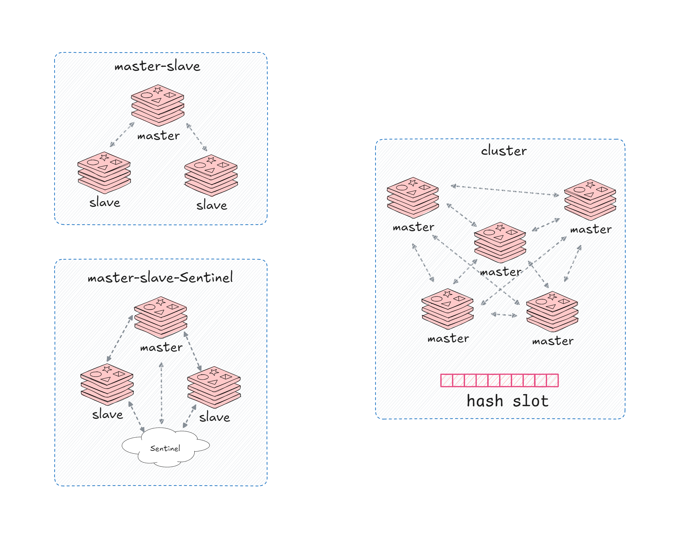
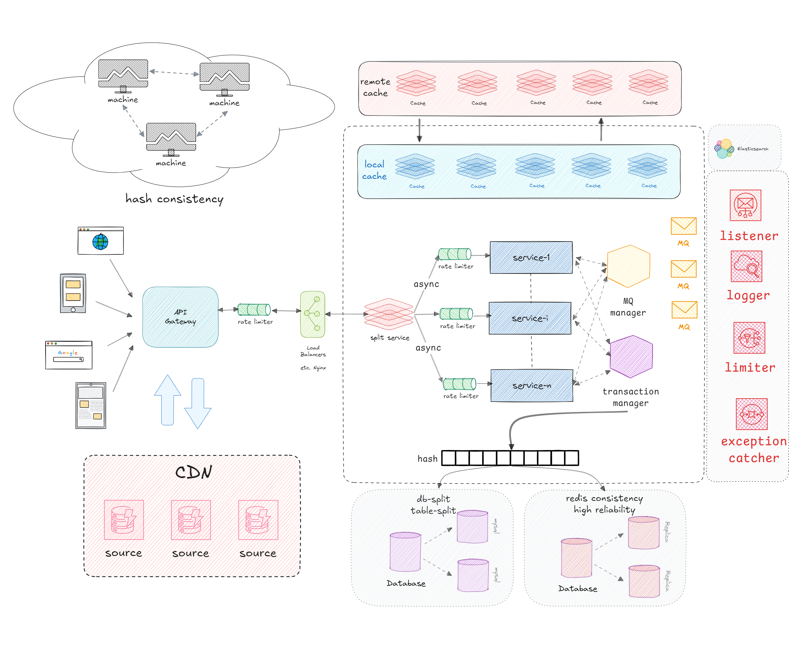
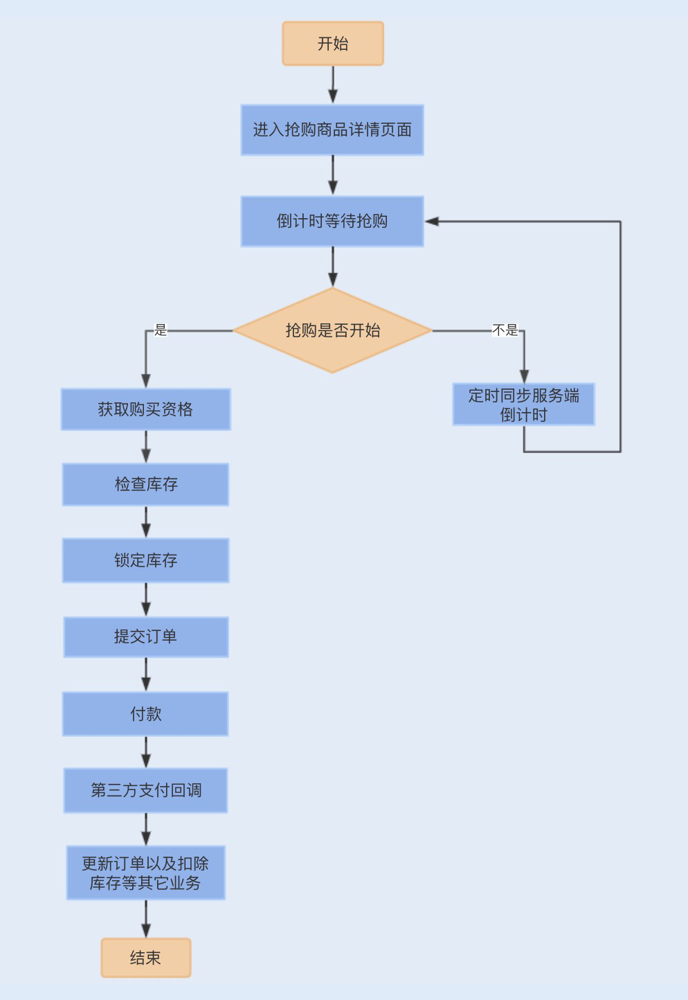

# 前言知识点

## redis 集群模式

# 实际案例

## 通用设计

### 高并发架构设计的关键要素
1. 分布式架构：通过将系统分解为多个模块和组件，实现请求的并行处理。

2. 缓存机制：利用缓存技术来减轻数据库的压力，并提高数据的访问效率。

3. 负载均衡：将请求分发到不同的服务器上，确保系统的负载平衡，避免单点故障。

4. 异步处理：将一些耗时较长且不需要实时响应的任务，通过消息队列等方式异步处理，提高系统的并发处理能力。

5. 水平扩展：通过增加服务器数量，实现系统的水平扩展，提高系统的容量和性能。

### 高并发架构设计的常用技术
1. 分布式缓存：如Redis、Memcached等，用于加速数据访问。

2. 分布式文件系统：如Hadoop、GFS等，用于存储和处理大规模数据。

3. 反向代理服务器：如Nginx、HAProxy等，用于负载均衡和请求分发。

4. 分布式数据库：如MySQL Cluster等，用于提高数据库的容量和性能。

5. 消息队列：如Kafka、RabbitMQ等，用于实现异步处理和解耦系统模块。

### 高并发架构设计的最佳实践
1. 预估并发压力：在系统设计之初，要充分考虑预期的并发压力，并进行合理的容量规划。

2. 优化数据库设计：使用合适的数据库模型和索引，以提高查询性能。

3. 合理使用缓存：选择合适的缓存策略和缓存失效机制，避免缓存数据的过期和不一致。

4. 异步处理和消息队列：将一些非关键业务和耗时任务异步处理，以减轻系统压力。

5. 监控和调优：通过监控系统性能指标和日志，及时发现和解决系统瓶颈。

6. 容灾和故障恢复：设计容灾和故障恢复机制，保障系统的高可用性。

## 双十一抢购性能瓶颈调优

### 抢购业务流程

- 用户登录后会进入到商品详情页面，此时商品购买处于倒计时状态，购买按钮处于置灰状态。
- 当购买倒计时间结束后，用户点击购买商品，此时用户需要排队等待获取购买资格，如果没有获取到购买资格，抢购活动结束，反之，则进入提交页面。
- 用户完善订单信息，点击提交订单，此时校验库存，并创建订单，进入锁定库存状态，之后，用户支付订单款。
- 当用户支付成功后，第三方支付平台将产生支付回调，系统通过回调更新订单状态，并扣除数据库的实际库存，通知用户购买成功。

### 方案

- 商品详情页面
  - 本地离线缓存
  - CND静态资源加载
- 抢购倒计时
  - 客户端时间初始化来自服务端
  - 客户端时间定期同步
- 获取购买资格
  - 防止用户直接大量并发操作库存，减少退货和取消订单的影响
  - 通过redis分布式锁来控制购买资格
- 提交订单
  - 将提交订单和抢购服务拆分到不同的域名，绑定到不同网络服务器上
  - 提交订单时，先校验库存，库存足够再生成订单
  - 校验库存和扣除库存通过分布式锁来操作缓存，减少数据库压力
- 支付回调业务操作
  - 用户订单支付完成后，通过第三方回调更新订单状态，同步缓存中的订单库存和数据库里的库存
  - 基于MQ实现业务的异步提交，例如库存扣减、积分累计以及短信通知等
- 性能优化
  - nginx限流
  - 服务接口限流
  - 通过分布式锁获取购买资格，并在分布式锁前面加一个消息等待队列来实现流量削峰
  - 在业务进行回调的时候，同时在数据库写入一条异步消息状态，防止服务重启时数据丢失
## 抖音粉丝系统的设计