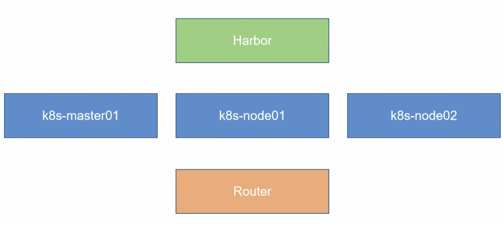
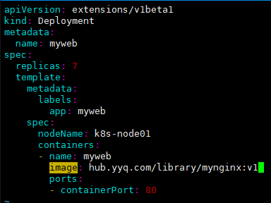

# K8S

[TOC]

## 一、背景

### 1.1 发展经历

- Iaas=Infrastructure as a Service 阿里云
- PaaS=platform as a service 新浪云 
- SaaS=Software as a Service Office 365. 

**Docker= 新一代Paas代表**

- 资源管理平台
  - MESOS(Apache) 分布式资源管理框架 2019-5 Twitter -> Kubernetes
  - SWARM (绑定Docker,复杂功能实用可能,如滚动刷新)  2019-07 阿里云宣布 Docker Swarm 剔除
  - Kubernetes(Google) 10年容器化基础架构 borg Go语言翻写Borg
    - 轻量级,消耗资源少(Go语言直接与进程交互)
    - 开源
    - 弹性伸缩：资源扩容/缩小等，过程要平缓；
    - 负载均衡：IPVS

### 1.2 K8S组件说明

#### 1.2.1 Borg


- 高可用集群机器数量：3,5,7,9... (防止平票)


#### 1.2.2 Kubernetes


- **etcd定义：**etcd的官方将它定位成一个可信赖的分布式键值存储服务，它能够为整个分布式集群存储一些关键数据,协助分布式集群的正常运转
  -  推荐在 Kubernetes 集群中使用 Etcd v3, v2 版本已在 Kubernetes v1.11 中弃用
  - 

- APISERVER:所有服务访问统一入口
- CrontrollerManager:维持副本期望数目
- Scheduleri…负责介绍任务，选择合适的节点进行分配任务
- ETCD:键值对数据库 储存K8S集群所有重要信息(持久化)
- Kubelet:直接跟容器引擎交互实现容器的生命周期管理
- Kube-proxy:负责写入规则至IPTABLES、 IPVS 实现服务映射访问的
- COREDNS：可以为集群中的sVC创建一个域名IP的对应关系解析
- DASHBOARD：给 K8S 集群提供一个 B/S 结构访问体系
- INGRESS CONTROLLER:官方只能实现四层代理， INGRESS可以实现七层代理
- FEDERATION：提供一个可以跨集群中心多K8S统一管理功能
- PROMETHEUS:提供K8S集群的监控能力
- ELK：提供 K8S 集群日志统一分析介入平台


### 1.3 基本概念

#### 1.3.1 Pod概念

> pod分为自主Pod和控制器控制的Pod


- **Pod Controller类型**
  - ReplicationController用来确保容器应用的副本数始终保持在用户定义的副本数,即如果有容器异常退出,会自动创建新的Pod来替代;而如果异常多出来的容器也会自动回收。在新版本的Kubernetes中建议使用ReplicaSet来取代ReplicationController
  - ReplicaSet跟ReplicationController没有本质的不同,只是名字不一样,并且ReplicaSet支持集合式的 selector
  - 虽然ReplicaSet可以独立使用,但一般还是建议使用Deployment来自动管理ReplicaSet ,这样就无需担心跟其他机制的不兼容问题(比如ReplicaSet不支持rolling-update但Deployment支持)
- Horizontal Pod Autoscaling仅适用于Deployment 和ReplicaSet ,在 V1 版本中仅支持根据 Pod的CPU利用率扩所容,在vlalpha版本中,支持根据内存和用户自定义的metric扩缩容
- StatefulSet是为了解决有状态服务的问题(对应Deployments和ReplicaSets是为无状态服务而设计），其应用场景包括：
  - 稳定的持久化存储，即 Pod 重新调度后还是能访问到相同的持久化数据，基于 PVC 来实现
  - 稳定的网络标志，即 Pod 重新调度后其 PodName 和 HostName 不变，基于 Headless Service
     (即没有Cluster IP的Service )来实现
  - 有序部署
    - 有序扩展，即 Pod 是有顺序的，在部署或者扩展的时候要依据定义的顺序依次依次进行（即从 0 到 N-1，在下一个 Pod 运行之前所有之前的 Pod 必须都是 Running 和 Ready 状态） ， 基于 init containers 来实现
    - 有序收缩,有序删除(即从N-1到0)

- DaemonSet 确保全部（或者一些）Node 上运行一个 Pod 的副本。当有 Node 加入集群时，也会为他们新增一个Pod 。当有Node从集群移除时,这些Pod也会被回收。删除DaemonSet将会删除它创建的所有 Pod
   使用DaemonSet的一些典型用法:
  - 运行集群存储daemon,例如在每个Node上运行glusterd、ceph。
  - 在每个 Node 上运行日志收集 daemon，例如fluentd、 logstash。
  - 在每个 Node 上运行监控 daemon，例如 Prometheus Node Exporter

- Job负责批处理任务,即仅执行一次的任务,它保证批处理任务的一个或多个Pod成功结束
  - Cron Job 管理基于时间的 Job，即：
    - 在给定时间点只运行一次
    - 周期性地在给定时间点运行

#### 1.3.2 服务发现


- Client通过IP:PORT选择service

- service通过标签选择某组pod进行轮询

#### 1.3.3 网络通讯模型

Kubernetes的网络模型假定了所有Pod都在一个可以直接连通的扁平的网络空间中,这在 GCE (Google Compute Engine)里面是现成的网络模型, Kubernetes假定这个网络已经存在。而在私有云里搭建Kubernetes集群,就不能假定这个网络已经存在了。我们需要自己实现这个网络假设,将不同节点上的Docker容器之间的互相访问先打通,然后运行Kubernetes。 


- 同一个Pod内的多个容器之间:  通过内部的Pause机制，用IO直接通讯
- 各Pod之间的通讯: Overlay Network
- Pod与Service之间的通讯：各节点的Iptables 规则


**常用网络架构**

Flannel是CoreOS团队针对Kubernetes设计的一个网络规划服务,简单来说,它的功能是让集群中的不同节点主机创建的Docker容器都具有全集群唯一的虚拟IP地址。而且它还能在这些IP地址之间建立一个覆盖网络(Overlay Network) ,通过这个覆盖网络,将数据包原封不动地传递到目标容器内


- ETCD 之 Flannel 提供说明:
  - 存储管理 Flannel 可分配的 IP 地址段资源
  - 监控ETCD中每个Pod 的实际地址,并在内存中建立维护Pod节点路由表

**总结**

- 同一个 Pod 内部通讯：同一个 Pod 共享同一个网络命名空间，共享同一个 Linux 协议栈
- Pod1 至 Pod2
  - Pod1 与 Pod2 不在同一台主机，Pod的地址是与docker0在同一个网段的，但docker0网段与宿主机网卡是两个完全不同的IP网段,并且不同Node之间的通信只能通过宿主机的物理网卡进行。将Pod的IP和所在Node的IP关联起来,通过这个关联让Pod可以互相访问
  - Pod1与Pod2在同一台机器,由Docker0网桥直接转发请求至Pod2,不需要经过Flannel
    演示
- Pod 至 Service 的网络：目前基于性能考虑，全部为 iptables （最新IVS）维护和转发
- Pod 到外网：Pod 向外网发送请求，查找路由表，转发数据包到宿主机的网卡，宿主网卡完成路由选择后，iptables执行Masquerade，把源 IP 更改为宿主网卡的 IP，然后向外网服务器发送请求
- 外网访问Pod: Service


**注意：****节点网络是真实物理网络（需要网卡），其余是虚拟网络**

## 二、集群准备



linux环境：Centos7

内核：4.4以上


## 三、核心概念

### 3.1 资源清单

#### 3.1.1 K8S 资源类型

> K8s 中所有的内容都抽象为资源，资源实例化之后，叫做对象

**名称空间级别**

- 工作负载型资源( workload ): Pod、ReplicaSet、 Deployment、 StatefulSet、 DaemonSet、 Job、
  CronJob ( ReplicationController在v1.1r版本被废弃）

- 服务发现及负载均衡型资源（ServiceDiscovery LoadBalance ）: Service、Ingress、...
- 配置与存储型资源： Volume（ 存储卷 ）、CSI（容器存储接口，可以扩展各种各样的第三方存储卷 ）
- 特殊类型的存储卷: ConfigMap(当配置中心来使用的资源类型)、Secret(保存敏感数据)、
  DownwardAPI (把外部环境中的信息输出给容器)


**集群级资源**

Namespace、Node、Role、ClusterRole、RoleBinding、ClusterRoleBinding


**元数据型资源**

 HPA、PodTemplate、LimitRange

#### 3.1.2 YAML格式

**简单说明**
是一个可读性高，用来表达数据序列的格式。YAML 的意思其实是：仍是一种标记语言，但为了强调这种语言
以数据做为中心，而不是以标记语言为重点

**基本语法**

- 缩进时不允许使用Tab键,只允许使用空格
- 缩进的空格数目不重要，只要相同层级的元素左侧对齐即可
- #标识注释,从这个字符一直到行尾,都会被解释器忽略

**YAML 支持的数据结构**

- 对象：键值对的集合，又称为映射（mapping）/哈希（hashes）/字典（dictionary）

- 数组：一组按次序排列的值，又称为序列（sequence）/列表（list）

- 纯量（scalars）：单个的、不可再分的值

  

对象类型:对象的一组键值对,使用冒号结构表示
```yaml
 name: Steve
 age: 18
 
 # 或者 hash: { name: Steve, age: 18 }
```


数组类型：一组连词线开头的行，构成一个数组

```yaml
animal
 - Cat
 - Dog
 #  animal: [Cat, Dog]
```

复合结构:对象和数组可以结合使用,形成复合结构

```yaml
 languages:
 - Ruby
 - Perl
 - Python
 websites:
 YAML: yaml.org
 Ruby: ruby-lang.org
 Python: python.org
 Perl: use.perl.org

```

纯量：纯量是最基本的、不可再分的值。以下数据类型都属于纯量

```yaml
1 字符串 布尔值 整数 浮点数 Null
2 时间 日期
数值直接以字面量的形式表示
number: 12.30
布尔值用true和false表示
isSet: true
null用 ~
表示
parent: ~
时间采用 IS08601 格式
iso8601: 2001-12-14t21:59:43.10-05:00
日期采用复合iso8601 格式的年、月、日表示
date: 1976-07-31
YAML 允许使用两个感叹号，强制转换数据类型
e: !!str 123
f: !!str true

```

字符串

- 字符串默认不使用引号表示
- 如果字符串之中包含空格或特殊字符，需要放在引号之中
- 单引号和双引号都可以使用，双引号不会对特殊字符转义
- 单引号之中如果还有单引号，必须连续使用两个单引号转义
- 宇符串可以写成多行，从第二行开始，必须有一个单空格缩进。换行符会被转为 空格
- 多行字符串可以使用|保留换行符，也可以使用>折叠换行
- 表示保留文字块末尾的换行，-表示删除字符串末尾的换行

#### 3.1.3 常用字段解释

- 必须存在的属性

|         参数名          | 字段 <br> 类型 |                             说明                             |
| :---------------------: | :------------: | :----------------------------------------------------------: |
|         version         |     String     | 这里是指的是K8S API的版本，目前基本上是v1，可以用kubectl api-  versions命令查询 |
|          kind           |     String     |      这里指的是yaml文件定义的资源类型和角色，比如：Pod       |
|        metadata         |     Object     |                元数据对象，固定值就写metadata                |
|      metadata.name      |     String     |     元数据对象的名字，这里由我们編写，比如命名Pod的名字      |
|   metadata. namespace   |     String     |             元数据对象的命名空间，由我们自身定义             |
|          Spec           |     Object     |                 详细定义对象，固定值就写Spec                 |
|    spec.containers[]    |      list      |            这里是Spec对象的穴器列表定义，是个列表            |
| spec.containers[].name  |     String     |                      这里定义容器的名字                      |
| spec.containers[].image |     String     |                   这里定义要用到的镜像名称                   |

- 主要对象

|               参数名               | 字段 <br> 类型 |                             说明                             |
| :--------------------------------: | :------------: | :----------------------------------------------------------: |
|      spec. containers[].name       |     String     |                        定义言器的名字                        |
|     spec. containers[]. image      |     String     |                     定义要用到的镜像名称                     |
| spec. containers[].imagePullPolicy |     String     | 定义镜像拉取策略，有Always、Never、 <br> IfNotPresent三个值可选 (1) Always: 意思是 <br> 每次都尝试重新拉取镜像 (2) Never: 表示仅 <br> 使用本地镜像 (3) IfNotPresent: 如果本地有 <br> 镜像就使用本地镜像，没有就拉取在线镜像。 <br> 上面三个值都没设置的话，默认是Always。 |
|    spec.containers[].command]]     |      List      | 指定容器启动命令，因为是数组可以指定多 <br> 个，不指定则使用镜像打包时使用的启动命 <br> 令。 |
|      spec.containers[].args[]      |      List      |     指定容器启动命令参数，因为是数组可以指定 <br> 多个。     |
|   spec. containers[]. workingDir   |     String     |                      指定容器的工作目录                      |

|      spec.containers[].volumeMounts[]      |  List  |                   指定容器内部的存储卷配置                   |
| :----------------------------------------: | :----: | :----------------------------------------------------------: |
|   spec.containers[] volumeMounts[] name    | String |               指定可以被容器挂载的存储卷的名称               |
| spec.containers[].volumeMounts[].mountPath | String |               指定可以被率器挂载的存储卷的路径               |
| spec.containers[]. volumeMounts[] readOnly | String | 设置存储卷路径的读写模式， ture 或者false， <br> 默认为读写模式 |
|         spec.containers[] ports[]          |  List  |                  指定夋器需要用到的端口列表                  |
|       spec.containers[] ports[].name       | String |                         指定端口名称                         |
|  spec.containers[]. ports[].containerPort  | String |                   指定穴器需要监听的端口号                   |
|    spec. containers[] ports[].hostPort     | String | 指定容蹋所在主机需要监听的端口号，默认跟 <br> 上面containerPort相同，注意设置了hostPort <br> 同一台主机无法启动该容器的相同副本 (因为 <br> 主机的端口号不能相同，这样会冲实) |
|     spec.containers[].ports[].protocol     | String |        指定端口协议，支持TCP和UDP，默认值为 <br> TCP         |
|          spec.containers[].env[]           |  List  |              指定容器运行前需设置的环境变量列表              |

|        spec. containers[].env[].name        | String |                       指定环境变量名称                       |
| :-----------------------------------------: | :----: | :----------------------------------------------------------: |
|        spec.containers[].env[].value        | String |                        指定环境变量值                        |
|         spec containers[].resources         | Object | 指定资源限制和资源请求的值（这里开始就是 <br> 设置容器的资源上限） |
|     spec containers[].resources. limits     | Object |               指定设置容器运行时资源的运行上限               |
|   spec.containers[].resources.limits.cpu    | String | 指定CPU的限制，单位为core数，将用于 <br> docker run --cpu-shares参数（这里前面文章 <br> Pod资源限制有讲过） |
| spec. containers[].resources.limits.memory  | String |              指定MEM内存的限制，单位为MIB、GiB               |
|    spec.containers[].resources.requests     | Object |                指定容器启动和调度时的限制设置                |
|  spec.containers[].resources.requests.cpu   | String |    CPU请求，单位为core数，容器启动时初始化 <br> 可用数量     |
| spec.containers[].resources.requests.memory | String |   内存请求，单位为MIB、GiB，容器启动的初始 <br> 化可用数量   |


|        参数名         | 字段类 <br> 型 |                             说明                             |
| :-------------------: | :------------: | :----------------------------------------------------------: |
|  spec. restartPolicy  |     String     | 定义Pod的重启策略，可选值为Always、OnFailure，默认值为 <br> Always. <br> 1.Always: Pod一旦终止运 <br> 行，则无论容器是如何终止的，kubelet服务都将重启它。 <br> 2.OnFailure: 只有Pod以非零退出码终止时，kubelet才会重启该容 <br> 器. 如果容器正常结束 (退出码为 0)，则kubelet将不会重启它。 <br> 3. Never: Pod终止后，kubelet将退出码报告给Master，不会重启该 <br> Pod. |
|   spec.nodeSelector   |     Object     |         定义Node的Label过滤标签，以key:value格式指定         |
| spec.imagePullSecrets |     Object     |    定义pull镜像时使用secret名称，以name:secretkey格式指定    |
|   spec.hostNetwork    |    Boolean     | 定义是否使用主机网络模式，默认值为false。设置true表示使用宿主 <br> 机网络，不使用docker网桥，同时设置了true将无法在同一台宿主机 <br> 上启动第二个副本。 |

|        参数名         | 字段类 <br> 型 |                             说明                             |
| :-------------------: | :------------: | :----------------------------------------------------------: |
|  spec. restartPolicy  |     String     | 定义Pod的重启策略，可选值为Always、OnFailure，默认值为 <br> Always. <br> 1.Always: Pod一旦终止运 <br> 行，则无论容器是如何终止的，kubelet服务都将重启它。 <br> 2.OnFailure: 只有Pod以非零退出码终止时，kubelet才会重启该容 <br> 器. 如果容器正常结束 (退出码为 0)，则kubelet将不会重启它。 <br> 3. Never: Pod终止后，kubelet将退出码报告给Master，不会重启该 <br> Pod. |
|   spec.nodeSelector   |     Object     |         定义Node的Label过滤标签，以key:value格式指定         |
| spec.imagePullSecrets |     Object     |    定义pull镜像时使用secret名称，以name:secretkey格式指定    |
|   spec.hostNetwork    |    Boolean     | 定义是否使用主机网络模式，默认值为false。设置true表示使用宿主 <br> 机网络，不使用docker网桥，同时设置了true将无法在同一台宿主机 <br> 上启动第二个副本。 |


- 当出现pod出错时怎么处理
  1. kubectl get pod 获取pod信息
  2. kubectl describe pod myapp-pod
  3. kubectl log myapp-pod -c test

- pod常用命令
  -  kubectl get pod -o wide 查看详细信息
  -  kubectl delete pod myapp-pod
  -  kubectl create -f pod.yaml

#### 3.1.4 Pod生命周期


- 先初始化pause
- 再初始化容器运行必备的文件，由init C程序准备
- Main C是容器
  - readness是就绪检测，检测是否准备就绪可以提供给外部使用；虽然是running但是没准备好
  - Liveness是活着检测，检测容器是否是僵尸进程，名存实亡；虽然是running但是无法提供服务


##### 3.1.4.1 Init 容器

Pod 能够具有多个容器，应用运行在容器里而，但是它也可能有一个或多个先于应用容器启动的 Init
容器。Init 容器与普通的容器非常像，除了如下两点：

- Init 容器总是运行到成功完成为止
- 每个 Init 容器都必须在下一个 Init 容器启动之前成功完成

如果 Pod 的 Init 容器失败，Kubernetes 会不断地重启该 Pod，直到 Init 容器成功为止。然而，如果 Pod 对应的 restartPolicy 为 Never，它不会重新启动


因为 Init 容器具有与应用程序容器分离的单独镜像，所以它们的启动相关代码具有如下优势：

- 它们可以包含并运行实用工具，但是出于安全考虑，是不建议在应用程序容器镜像中包含这些实用工具的
- 它们可以包含使用工具和定制化代码来安装，但是不能出现在应用程序镜像中。例如，创建镜像没必要 FROM 另一个镜像，只需要在安装过程中使用类似 sed、 awk、 python 或 dig这样的工具。
- 应用程序镜像可以分离出创建和部署的角色，而没有必要联合它们构建一个单独的镜像。
- Init容器使用Linux Namespace,所以相对应用程序容器来说具有不同的文件系统视图。因此,它们能够具有访问Secret的权限,而应用程序容器则不能。
- 它们必须在应用程序容器启动之前运行完成，而应用程序容器是并行运行的，所以 Init 容器能够提供了一种简单的阻塞或延迟应用容器的启动的方法，直到满足了一组先决条件。


代码示例

```yaml
 apiversion: v1
 kind: Pod
 metadata:
 	name: myapp-pod
 	labels:
 		app: myapp
   	version:v1
 spec:
   containers:
   - name: myapp-container
     image: busybox
     command: ['sh', '-c', 'echo The app is running! && sleep 3600']
   initContainers:
     name: init-myservice
     image: busybox
     command: ['sh', '-c', 'until nslookup myservice; do echo waiting for myservice; sleep 2;
   done;']
   - name: init-mydb
     image: busybox
     command: ['sh', '-c', 'until nslookup mydb; do echo waiting for mydb; sleep 2; done;']

```

```yaml
kind: Service
apiversion: v1
metadata:
name: myseryice
spec:
ports:
 - protocol: TCP
   port: 80
   targetPort: 9376
---
kind: Service
apiversion: v1
metadata:
 name: mydb
spec:
ports:
  - protocol: TCP
    port: 80
    targetPort: 9377
```

##### 3.1.4.2 init特殊说明

- 在 Pod 启动过程中，Init 容器会按顺序在网络和数据卷初始化之后启动， 每个容器必须在下一个容器启动之前成功退出
- 如果由于运行时或失败退出，将导致容器启动失败，它会根据 Pod 的 restartPolicy 指定的策略 进行重试。然而,如果Pod 的 restartPolicy设置为Always, Init 容器失败时会使用RestartPolicy 策略
- 在所有的 Init 容器没有成功之前，Pod 将不会变成 Ready 状态。Init 容器的端口将不会在 Service 中进行聚集。 正在初始化中的 Pod 处于 Pending 状态，但应该会将 Initializing 状态设置为 true
- 如果 Pod 重启，所有 Init 容器必须重新执行
- #对 Init 容器 spec的修改被限制在容器 image 字段,修改其他字段都不会生效。更改 Init容器的 image字段,等价于重启该Pod
- Init 容器具有应用容器的所有字段。除了 readinessProbe，因为 Init 容器无法定义不同于完成
  （completion）的就绪（readiness）之外的其他状态。这会在验证过程中强制执行
- 在 Pod 中的每个 app 和 Init 容器的名称必须唯一；与任何其它容器共享同一个名称，公在验证
  时抛出错误

##### 3.1.4.3 容器探针

探针是由kubelet对容器执行的定期诊断。要执行诊断, kubelet调用由容器实现的Handler.有三种类型的处理程序：

- ExecAction：在容器内执行指定命令。如果命令退出时返回码为 0 则认为诊断成功。
- TCPSocketAction：对指定端口上的容器的 IP 地址进行 TCP 检查。如果端口打开，则诊断
  被认为是成功的
- HTTPGetAction：对指定的端口和路径上的容器的 IP 地址执行 HTTP Get 请求。如果响应的
  状态码大于等于200 且小于 400，则诊断被认为是成功的

每次探测都将获得以下三种结果之一：

- 成功：容器通过了诊断。
- 失败：容器未通过诊断。
- 未知：诊断失败，因此不会采取任何行动


**检测探针 - 就绪检测**

readinessProbe：指示容器是否准备好服务请求。如果就绪探测失败，端点控制器将从与 Pod 匹配的所有Service 的端点中删除该 Pod 的 IP 地址。初始延迟之前的就绪状态默认为 Failure。如果容器不提供就绪探针，则默认状态为Success

- readinessProbe-httpget

```yaml
apiVersion: v1
kind: Pod
metadata:
  name: readiness-httpget-pod
  namespace: default
spec:
  containers:
  - name: readiness-httpget-container
    image: wangyanglinux/myapp:v1
    imagePullPolicy: IfNotPresent
    readinessProbe:
      httpGet:
        port: 80
        path: /index1.html
      initialDelaySeconds: 1
      periodSeconds: 3
```


**检测探针-存活检测**

livenessProbe:指示容器是否正在运行。如果存活探测失败,则kubelet会杀死容器,并且容器将受到其 重启策略 的影响。如果容器不提供存活探针，则默认状态为 Success

- livenessProbe-exec

```yaml
 apiversion: v1
 kind: Pod
 metadata:
   name: liveness-exec-pod
   namespace: default
 spec:
   containers:
   - name: liveness-exec-container
     image: hub.atguigu.com/library/busybox
     imagePullPolicy: IfNotPresent
     command: ["/bin/sh","-c","touch /tmp/live ; sleep 60; rm -rf /tmp/live; sleep
     3600"]
     livenessProbe:
       exeс:
         command: ["test","-e","/tmp/live"]
       initialDelaySeconds: 1
       periodSeconds: 3
```

-  livenessProbe-httpget

```yaml
 apiversion: v1
 kind: Pod
 metadata:
   name: liveness-httpget-pod
   namespace: default
 spec:
   containers:
   - name: liveness-httpget-container
     image: hub.atguigu.com/library/busybox
     imagePullPolicy: IfNotPresent
     ports:
     - name: http
     	containerPort: 80
     livenessProbe:
       httpGet:
         port: http
         path: /index.html
       initialDelaySeconds: 1
       periodSeconds: 3
       timeoutSeconds: 10

```

- llivenessProbe-tcp

```yaml
 apiversion: v1
 kind: Pod
 metadata:
   name: liveness-tcp
 spec:
   containers:
   - name: nginx
     image: hub.atguigu.com/library/busybox
     imagePullPolicy: IfNotPresent
     livenessProbe:
       initialDelaySeconds: 5
       timeoutSeconds: 1
       tcpSocket:
       	port: 80
```


- Readness,liveness,initc,stop,start都可以合作使用


##### 3.1.4.4 启动、推出动作


```yaml
 apiVersion: v1
 kind: Pod
 metadata:
 	name: lifecycle-demo
 spec:
   containers:
     - name: lifecycle-demo-container
     image: nginx
     lifecycle:
       postStart:
         exeс:
         /usr/share/message"]
         	 command: ["/bin/sh", "-c", "echo Hello from the postStart handler > /usr/share/message"]
       preStop:
       	exeс:
       		 command: ["/bin/sh", "-c", "echo Hello from the preStop handler > /usr/share/message"]
```


##### 3.1.4.5 pod status

- 挂起(Pending) : Pod已被Kubernetes系统接受,但有一个或者多个容器镜像尚未创建。等待时间包括调度Pod的时间和通过网络下载镜像的时间,这可能需要花点时间
- 运行中(Running) :该Pod已经绑定到了一个节点上, Pod中所有的容器都已被创建。至少有一个容器正在运行，或者正处于启动或重启状态
- 成功(Succeeded) : Pod 中的所有容器都被成功终止,并且不会再重启
- 失败（Failed): Pod中的所有容器都已终止了,并且至少有一个容器是因为失败终止。也就是说,容器以非 0 状态退出或者被系统终止
- 未知(Unknown) :因为某些原因无法取得Pod的状态,通常是因为与Pod所在主机通信失败


### 3.2 资源控制器

> Pod 的分类
> 自主式 Pod：Pod 退出了，此类型的 Pod 不会被创建
> 控制器管理的 Pod:在控制器的生命周期里,始终要维持 Pod 的副本数目 （常用选择）


- **什么是控制器**

  - Kubernetes 中内建了很多 controller（控制器），这些相当于一个状态机，用来控制 Pod 的具体状态和行为

- **控制器类型**

  - ReplicationController和ReplicaSet
  - Deployment
  - DaemonSet
  - StateFulSet
  - Job/Cronjob
  - Horizontal Pod Autoscaling

  

#### 3.2.1 ReplicationController和ReplicaSet

- ReplicationController (RC)用来确保容器应用的副本数始终保持在用户定义的副本数,即如果有容器异常退出，会自动创建新的 Pod 来替代；而如果异常多出来的容器也会自动回收;
- 在新版本的 Kubernetes 中建议使用 ReplicaSet 来取代 ReplicationController 。ReplicaSet 跟 ReplicationController 没有本质的不同，只是名字不一样，并且 ReplicaSet 支持集合式的 selector;标签选择

```yaml
 apiVersion: extensions/v1beta1
 kind: ReplicaSet
 metadata:
	 name: frontend
 spec:
   replicas: 3
   selector:
     matchLabels:
     	tier: frontend
   template:
     metadata:
       labels:
       	tier: frontend
     spec:
       containers:
       - name: php-redis
         image: gcr.io/google_samples/gb-frontend:v3
         env:
         - name: GET_HOSTS_FROM
         	 value: dns
         ports:
         - containerPort: 8e
```


#### 3.2.2  Deployment
Deployment 为 Pod 和 ReplicaSet 提供了一个声明式定义(declarative） 方法，用来替代以前的
ReplicationController 来方便的管理应用。典型的应用场景包括

- 定义 Deployment 来创建 Pod 和 ReplicaSet
- 滚动升级和回滚应用
- 扩容和缩容
- 暂停和继续 Deployment

**注意：**

- **申明式编程 (Deployment)  apply（优） create**
- **命令式 (rs)  create（优)  apply**


**和RS的关系**


```yaml
 apiVersion: extensions/v1beta1
 kind: Deployment
 metadata:
 	name: nginx-deployment
 spec:
   replicas: 3
   template:
     metadata:
       labels:
       	app: nginx
     spec:
       containers:
       - name: nginx
         image: nginx:1.7.9
         ports:
         - containerPort: 80
```


``` shell
 kubectl create -f https://kubernetes.io/docs/user-guide/nginx-deployment.yaml --record
 ##--record参数可以记录命令，我们可以很方便的查看每次 revision 的变化
```


**扩容**
 `kubectl scale deployment iginx-deployment --replicas 10`

**如果集群支持 horizontal pod autoscaling 的话，还可以为Deployment设置自动扩展**
` kubectl autoscale deployment nginx-deployment --min=10 --max=15 --cpu-percent=80`
**更新镜像也比较简单**
`kubectl set image deployment/nginx-deployment nginx-nginx:1.9.1`
**回滚**
 `kubectl rollout undo deployment/nginx-deployment`


- Deployment更新策略

  - Deployment可以保证在升级时只有一定数量的 Pod 是 down的。默认的,它会确保至少有比期望的Pod数量少一个是up状态（最多一个不可用)
  - Deployment同时也可以确保只创建出超过期望数量的一定数量的Pod。默认的,它会确保最多比期望的Pod数量多一个的 Pod 是 up 的（最多1个 surge）
  - 未来的Kuberentes 版本中，将从1-1变成25%-25%
     $ kubectl describe deployments

- Rollover (多个rollout并行)

  - 假如您创建了一个有5个 niginx:1.7.9 replica的 Deployment，但是当还只有3个 nginx:1.7.9 的 replica 创建出来的时候您就开始更新含有5个 nginx:1.9.1 replica 的 Deployment。在这种情况 下, Deployment会立即杀掉已创建的3个 nginx:1.7.9 的Pod,并开始创建 nginx:1.9.1 的Pod它不会等到所有的5个nginx:1.7.9 的Pod都创建完成后才开始改变航道

-  回退Deployment

  - 只要Deployment的rollout被触发就会创建一个revision,也就是说当且仅当
     Deployment 的 Pod template (如 `.spec.template`) 被更改，例如更新template 中的
    label 和容器镜像时,就会创建出一个新的 revision,其他的更新,比如扩容Deployment不
    会创建 revision-因此我们可以很方便的手动或者自动扩容。这意味着当您回退到历史
     revision 时，只有 Deployment 中的 Pod template 部分才会回退

   ```shell
    kubectl set image deployment/nginx-deployment nginx-nginx:1.91
    kubectl rollout statuy deployments nginx-deployment
    kubectl get pods
    kubectl rollout history deployment/nginx-deployment
    kubectl rollout undo deployment/nginx-deployment 
    kubectl rollout undo deployment/nginx-deployment --to-revision-2 ##可以使用 revision参数指定某个历史版本
    kubectl rollout pause deployment/nginx-deployment暂停 deployment 的更新
   ```

  - 您可以用kubectl rollout status命令查看Deployment是否完成。如果rollout成功完成,
     kubectl rollout status 将返回一个0值的 Exit Code 

    ```shell
    $kubectl rollout status deploy/nginx
    Waiting for rollout to finish: 2 of 3 updated replicas are available...
    deployment "nginx" successfully rolled out
    $ echo $?
     0
    ```

-  清理 Policy

  - 您可以通过设置 .spec.revisonHistoryLihit项来指定deployment最多保留多少revision历
    史记录。默认的会保留所有的 revision；如 果将该项设置为0，Deployment 就不允许回退了


####  3.2.3 DaemonSet
DaemonSet 确保全部（或者一些）Node 上运行一个 Pod 的副本。当有 Node 加入集群时，也会为他们新增一个Pod。当有 Node 从集群移除时，这些 Pod 也会被回收。删除 DaemonSet 将会删除它创建的所有 Pod
使用 DaemonSet 的一些典型用法:

- 运行集群存储 daemon，例如在每个 Node 上运行 glusterd、ceph
- 在每个Node上运行日志收集daemon,例如fluentd、logstash
- 在每个Node上运行监控daemon,例如Prometheus Node Exporter, collectd、 Datadog代理、
  New Relic 代理，或 Ganglia gmond


```yaml
apiVersion: apps/v1
kind: DaemonSet
metadata:
  name: deamonset-example
  labels:
  	app: daemonset
spec:
  selector:
    matchLabels:
    -	name: deamonset-example
  template:
    metadata:
      labels:
      name: deamonset-example
    spec:
      containers:
      - name: daemonset-example
      	image: wangyanglinux/myapp:vi 
```


#### 3.2.4  Job
Job 负责批处理任务，即仅执行一次的任务，它保证批处理任务的一个或多个 Pod 成功结束

**特殊说明**

- spec.template格式同Pod
- RestartPolicy仅支持Never或OnFailure
- 单个Pod时，默认Pod成功运行后Job即结束
- `spec.completions` 标志Job结束需要成功运行的Pod个数，默认为1
-  `spec.parallelism` 标志并行运行的Pod的个数，默认为1
- `spec，activeDeadlineSeconds` 标志失败Pod的重试最大时间，超过这个时间不会继续重试

 Example

```yaml
apiversion: batch/v1
kind: Job
	name: pi
spec:
  template:
   	metadata:
   		name: pi
    spec:
      containers:
      - name: pi
        image: perl
        command: ["perl", "-Mbignum-bpi", "-wle", "print bpi(2000)"]
      restartPolicy: Never
```

​    <--查看日志，可以显示出答应的 2000 位 n 值-->

#### 3.2.5 Cronjob

Cron Job 管理基于时间的Job，即：

- 在给定时间点只运行一次
- 周期性地在给定时间点运行
  使用前提条件: **当前使用的Kubernetes集群,版本>=1.8 (对Cronjob) .对于先前版本的集群,版本< 1.8,启动API Server时,通过传递选项--runtime-config-batch/v2alpha1=true可以开启batch/v2alpha1 API**

**使用条件**：当前使用的 Kubernetes 集群，版本 >=1.8（对 Cronjob）

**典型的用法如下所示**：

- 在给定的时间点调度 Job 运行
- 创建周期性运行的Job，例如：数据库备份、发送邮件

**特殊说明：**

- .spec.schedule：调度，必需宇段，指定任务运行周期，格式同 Cron
- .spec.jobTemplate：Job 樱板，必需字段，指定需要运行的任务，格式同 Job
- .spec.startingDeadlineSeconds：启动Job 的期限（秒级别），该字段是
- 可选的，如果因为任何原因而错过了被调度的时间，那么错过执行时间的 Job 将被认为是失败的。如果没有指定，则没有期限
-  ·spec.concurrencyPolicy：并发策略，该字段也是可选的，它指定了如何处理被 Cron Job 创建的 Job 的并发执行，只允许指定下面策略中的一种：
  - Allow （默认）：允许并发运行Job
  - Forbid：禁止并发运行，如果前一个还没有完成，则直接跳过下一个
  - Replace：取消当前正在运行的 Job，用一个新的来替换注意，当前策略只能应用于同一个 Cron Job 创建的 Job，如果存在多个 Cron Job，它们创建的 Job之间总是允许并发运行。
- .spec.suspend：挂起，该字段也是可选的，如果设置为 true，后续所有执行都会被挂起，它对已经开始执行的 Job 不起作用。默认值为 false。
-  .spec.successfulJobsHistorylimit 和 .spec.failedJobsHistorylimit：历史限制，是可选的字段，它们指定了可以保留多少完成和失败的 Job，默认情况下，它们分别设置为 3 和 1。设置限制的值为 '0'，则相关类型的Job 完成后将不会被保留。

 **Example**

```yaml
apiversion: batch/vibetal
kind: CronJob
metadata:
	name: hello
spec:
  schedule: "*/1 * * * *"
  jobTemplate:
    spec:
      template:
        spec:
          containers:
          - name: hello
            image: busybox
            args:
            - /bin/sh
            - -c
            - date; echo Hello from the Kubernetes cluster
          restartPolicy: OnFailure
```

```shell
 $ kubectl get cronjob
 $ kubectl get jobs
 $ pods-$(kubectl get pods --selector-job-name-hello-1202039034 --output-jsonpath-{.items..metadata.name))
 $ kubectl logs Spods
 $ kubectl delete cronjob hello
```

**CrondJob 本身的一些限制**

- 创建 Job 操作应该是幂等的
- cronjob无法知道job的操作


#### 3.2.6 StatefulSet

StatefulSet 作为 Controller 为 Pod 提供唯一的标识。它可以保证部署和 scale 的顺序
StatefulSet是为了解决有状态服务的问题（对应Deployments和ReplicaSets是为无状态服务而设计) ,其应用场景包括：

- 稳定的持久化存储，即Pod重新调度后还是能访问到相同的持久化数据，基于PVC来实现
- 稳定的网络标志,即Pod重新调度后其PodName和HostName不变,基于Headless Service （即没有 Cluster IP的Service）来实现
- 有序部署，有序扩展，即Pod是有顺序的，在部署或者扩展的时候要依据定义的顺序依次依次进行（即从0到 N-1，在下一个Pod运行之前所有之前的Pod必须都是Running和Ready状态），基于init containers来实现
- 有序收缩，有序删除（即从N-1到0）


#### 3.2.7 Horizontal Pod Autoscaling

应用的资源使用率通常都有高峰和低谷的时候,如何削峰填谷,提高集群的整体资源利用率,让service中的Pod 个数自动调整呢？这就有赖于Horizontal Pod Autoscaling了，顾名思义，使Pod水平自动缩放


#### 3.2.8 RS,RC与Deployment关联 


### 3.3 Service

Kubernetes `service` 定义了这样一种抽象： 一个 Pod 的逻辑分组，一种可以访问它们的策略 ——通常称为微 服务。这一组Pod能够被Service访问到,通常是通过`Label Selector`


**Service能够提供负载均衡的能力，但是在使用上有以下限制：**

- 只提供 4 层负载均衡能力，而没有7 层功能，但有时我们可能需要更多的匹配规则来转发请求，这点上 4层负载均衡是不支持的（通过附加方案）


#### 3.3.1 Service类型

Service 在 K8s 中有以下四种类型

- ClusterIp：默认类型，自动分配一个仅 Cluster 内部可以访问的虚拟 IP
- NodePort: 在ClusterIP 基础上为Service在每台机器上绑定一个端口，这样就可以通过<NodelP>:NodePort 来访问该服务
- LoadBalancer：在 NodePort 的基础上，借助 cloud provider 创建一个外部负载均衡器，并将请求转发到<NodelP>: NodePort
- ExternalName:把集群外部的服务引入到集群内部来,在集群内部直接使用,没有任何类型代理被创建。这只有 kubernetes 1.7 或更高版本的 kube-dns 才支持


#### 3.3.2  VIP 和 Service 代理

在 Kubernetes 集群中，每个 Node 运行一个 kube-proxy 进程. kube-proxy 负责为 service 实 现了一种 VIP（虚拟IP）的形式，而不是 ExternalName 的形式。

- 在 Kubernetes v1.0 版本，代理 完全在 userspace，
- 在 Kubernetes v1.1 版本，新增了 iptables 代理，但并不是默认的运行模式。 
- 从 Kubernetes v1.2 起，默认就是 iptables 代理。
- 在 Kubernetes v1.8.0-beta.0 中，添加了 ipvs代理
- 在Kubernetes 1.14 版本开始默认使用 ipvs 代理
- 在Kubernetes v1.0 版本, Service是"4层" (TCP/UDP over IP)概念,在Kubernetes v1.1 版本，新增了 Ingress API (beta 版)，用来表示“7层"(HTTP)服务


**为何不使用 round-robin DNS?**

- IP DNS是动态变化的，缓存容易无效

##### 3.3.2.1 userspace代理模式


##### 3.3.2.2  iptables 代理模式


##### 3.3.2.3 ipvs 代理模式

这种模式, kube-proxy会监视Kubernetes Service对象和Endpoints ,调用netlink接口以 相应地创建ipvs规则并定期与Kubernetes Service对象和Endpoints对象同步ipvs规则,以确保 ipvs 状态与期望一致。访问服务时，流量将被重定向到其中一个后端 Pod与iptables类似, ipvs于netfilter的hook功能,但使用哈希表作为底层数据结构并在内核空间中工作,这意味着 ipvs可以更快地重定向流量,并且在同步代理规则时具有更好的性能。此外,ipvs为负载均衡算法提供了更多选项，例如：

- rr：轮询调度

- lc ：最小连接数

- dh：目标哈希

- sh：源哈希

- sed：最短期望延迟

- nq： 不排队调度

  <--注意: ipvs 模式假定在运行 kube-proxy 之前在节点上都已经安装了 Ipvs 内核模块.当kube-proxy以 ipvs代理模式启动时, kube-proxy培验证节点上是否安装了ipvs模块，如果未安装，则 kube-proxy 将回遇到 iptables 代理模式-->


 

#### 3.4.3 ClusterIP

clusterIP主要在每个node节点使用iptables将发向clusteriP对应端口的数据,转发到kube-proxy中,然后kube-proxy自己内部实现有负载均衡的方法,并可以查询到这个service下对应 pod的地址和端口，进而把数据转发给对应的 pod 的地址和端口


为了实现图上的功能，主要需要以下几个组件的协同工作：

- apiserver 用户通过kubectl命令向apiserver发送创建service的命令，apiserver接收到请求后将数据存储到etcd中
- kube-proxy kubernetes的每个节点中都有一个叫做kube-porxy的进程，这个进程负责感知service， pod的变化，并将变化的信息写入本地的iptables规则中
- iptables 使用NAT等技术将virtuallP的流量转至endpoint中


**创建 myapp-deploy.yaml 文件**

```yaml
apiversion: apps/v1
kind: Deployment
metadata:
  name: myapp-deploy
  namespace: default
spec:
  replicas: 3
  selector:
    matchLabels:
      app: myapp
      release: stabel
  template:
    metadata:
      labels:
        app: myapp
        release: stabel
        env: test
    spec:
      containers:
      - name: myapp
        image: angyanglinux/myapp:v2
        imagePullPolicy: IfNotPresent
        ports:
        - name: http
        	containerPort: 80
```

**创建Service文件**

```yaml
apiversion: vi
kind: Service
metadata:
  name: myapp
  namespace: default
spec:
  type: ClusterIP
  selector:
    app: myapp
    release: stabel
  ports:
  - name: http
    port: 80
    targetPort: se
```

#### 3.3.4 Headless Service
有时不需要或不想要负载均衡,以及单独的Service IP,遇到这种情况,可以通过指定Cluster IP(spec.clusterIP)的值为"None"来创建Headless Service,这类Service并不会分配ClusterIP, kube-proxy不会处理它们,而且平台也不会为它们进行负载均衡和路由

```yaml
[root@k8s-master mainfests]# vim myapp-svc-headless.yaml
apiversion: v1
kind: Service
  metadata:
    name: myapp-headlesi
    namespace: default
  spec:
    selector:
    	app: myapp
    clusterIP: "None"
    - port: 80
    	targetPort: 80
[root@k8s-master mainfests]# dig -t A myapp-headless.default.svc.cluster.local.@10.96.0.10

```

#### 3.3.5  NodePort


nodePort 的原理在于在 node 上开了一个端口，将向该端口的流量导入到 kube-proxy， 然后由 kube-proxy 进一步到给对应的 pod

```yaml
apiVersion: vi
	kind: Service
metadata:
  name: myapp
namespace: default
spec:
  type: NodePort
  selector:
    app: myapp
    release: stabel
  ports:
  - name: http
    port: 88
    targetPort: 80
```


**查询流程**
` iptables -t nat -nvL KUBE-NODEPORTS` 


#### 3.3.6  LoadBalancer

loadBalancer 和 nodePort 其实是同一种方式.区别在于 loadBalancer 比 nodePort 多了一步，就是可以调用cloud provider 去创建 LB 来向节点导流


#### 3.3.7  ExternalName

这种类型的 Service 通过返回 CNAME 和它的值，可以将服务映射到 externalName 宁段的内容（例如: hub.atguigu.com ), ExternalName Service是Service的特例,它没有selector,也没有定义任何的端口和Endpoint,相反的,对于运行在集群外部的服务,它通过返回该外部服务的别名这种方式来提供服务

```yaml
kind: Service
apiversion: v1
metadata:
  nane: my-service-1
  namespace: default
spec:
  type: ExternalName
  externalName: my.database.example.com
```

当查询主机my-service.defalut.svc.cluster.local (SVC_NAME.NAMESPACE.svc.cluster.local )时,集群的DNS服务将返回一个值my.database.example.com的CNAME记录,访问这个服务的工作方式和其他的相同，唯一不同的是重定向发生在 DNS 层，而且不会进行代理或转发

#### 3.3.8 Ingress

> 域名代理

 Ingress-Nginx github 地址:https://github.com/kubernetes/ingress-nginx


 **Nginx 进行 BasicAuth**

```
 yum-y install httpd
 htpassud -c auth foo
 kubectl create secret generic basic-auth --from-file-auth
```

```yaml
apiVersion: extensions/vibeta1
kind: Ingress
metadata:
  name: ingress-with-auth
  annotations:
    nginx.ingress.kubernetes.io/auth-type: basic
    nginx.ingress.kubernetes.io/auth-secret: basic-auth
    nginx.ingress.kubernetes.io/auth-realn: "Authentication Required- foc"
spec:
  rules:
  - host: foo2.bar.com
    http:
      paths:
      - path: /
        backend:
          serviceName: nginx-svc
          servicePort: 80
```


**Nginx进行重写**


| 名称                                                 | 描述                                                         | 值   |
| :--------------------------------------------------- | :----------------------------------------------------------- | :--- |
| nginx.ingress.kubernetes.io/rewrite- <br> target     | 必须重定向流量的目标URI                                      | 串   |
| nginx.ingress.kubernetes.io/ssl- <br> redirect       | 指示位置部分是否仅可访问SSL（当Ingress包含证书时 <br> 默认为True) | 布尔 |
| nginx.ingress.kubernetes.io/force- <br> ssl-redirect | 即使Ingress末启用TLS，也强制重定向到HTTPS I                  | 布尔 |
| nginx.ingress.kubernetes.io/app- <br> root           | 定义Controller必须重定向的应用程序根，如果它 <br> 在'/上下文中 | 串   |
| nginx.ingress.kubernetes.io/use- <br> regex          | 指示Ingress上定义的路径是否使用正则表达式                    | 布尔 |


```
apiVersion: extensions/vibetai
kind: Ingress
metadata:
  name: nginx-test
  annotations:
  	nginx.ingress.kubernetes.io/rewrite-target: http://foo.bar.com:31795/hostname.html
spec:
  rules:
  -host: foo10.bar.com
  	http:
      paths:
      - path: /
        backend:
          servicelame: nginx-svc
          servicePort: 80
```

### 3.4 存储对象

#### 3.4.1 configMap

- configMap 描述信息

  - ConfigMap功能在Kubernetes1.2版本中引入，许多应用程序会从配置文件，命令行参数或环境查量中读取配置信息, ConfigMap API给我们提供了向容器中注入配置信息的机制, ConfigMap可以被用来保存单个属性.也可以用来保存整个配置文件或者JSON 二进制大对象

  

##### 3.4.1.1 **ConfigMap 的创建**

1. 使用目录创建：`-from-file` 指定在目录下的所有文件都会被用在 ConfigMap 里面创建一个健值对，键的名宁就是文件名，值
   就是文件的内容

   ```shell
   $ ls docs/user-guide/configmap/kubectl/
   game.properties
   ul.properties
   $ cat docs/user-guide/configmap/kubectl/gume.properties
   enenies-aliens
   enenies.cheat=true
   enemies.cheat.level-noGoodRotten
   secret.code.passphrase-UUCCLRLRBABAS
   secret.code.allowed-trur
   secret.code.11ves-30
   $ cat docs/user-guide/configmap/kubectl/ui.properties
   color.good-purple
   color,bad=yellou
   allow.textmode=true
   how.nice.to.look-fairlysice
   $kubectl create configmap gane-config--from-file-docs/user-guide/configmap/kubectl
   ```

   

2. 使用文件创建:只要指定为一个文件就可以从单个文件中创建 ConfigMap;`from-file` 这个参数可以使用多次，你可以使用两次分别期定上个实例中的那两个配置文件，效果以就跟指定整个日录是—样的

   ```shell
   $ kubectl create configmap game-config-2 --from-file-docs/user-guide/configmap/kubectl/game.properties
   $ kubectl get configmaps game-config-2 -o yaml
   ```

   

3. 使用字面值创建:使用文字值创建，利用 -from-literal 参数传递配置信息，该参数可以使用多次，格式如下
   ```shell
   $ kubectl create configmap special-config --from-literal=special.how=very --from-literal=special.type=charm
   $ kubectl get configmaps special-config -o yaml
   ```

   

##### 3.4.1.2 Pod使用ConfigMap

1. 使用 ConfigMap 来替代环境变量

```yaml
apiVersion: v1
kind: ConfigMap
metadata:
  name: special-config
  namespace: default
data:
  special.how: very
  special.type: charm
```

```shell
mkdir mkdir /root/configmap/env/
cd mkdir /root/configmap/env/
vim env.yaml　
kubectl get cm
vim pod.yaml
kubectl get pod
```

```yaml
apiVersion: vl
kind: Pod
metadata:
	name: dapi-test-pod
spec:
  containers:
    - name: test-container
      Image: hub.yyq.com/library/mynginx:vl
      command: ["/bin/sh". "-c". "env"]
      env:
      - name: SPECIAL_LEVEL_KEY
        valueFrom:
          configMapKeyRef:
            name: special-config
            key: special.how
      - name: SPECIAL_TYPE_KEY
        valueFrom:
          configMapKeyRef:
            name: special-config
            key: special.type
      envFrom:
        configMapRef:
          name: env-config
  restartPolicy: Never
```


2. 用 ConfigMap 设置命令行参数:command 中的$(SPECIAL_LEVEL_KEY) 对应的 special-config中的special.how设置的的very charm

```yaml
apiVersion: v1
kind: ConfigMap
metadata:
  name: special-config
  namespace: default
data:
  special.how: very
  special.type: charm
```

```yaml
apiVersion: v1
kind:Pod
name: dapi-test-pod66
spec:
  containers:
    - name: test-container
    Image: hub.yyq.com/library/mynginx:v1
    Command: ["/bin/sh","-C". "echo $(SPECIAL LEVEL KEY) $(SPECIAL TYPE KEY)"]
    env:
      - name: SPECIAL_LEVEL_KEY
        valueFrom:
          configMapKeyRef:
            key: special.how
      - name: SPECIAL TYPE KEY
      	valueFrom:
          configMapKeyRef:
            name: special-config
            key: special.type
  restartPolicy: Never
```


3. 通过数据卷插件使用ConfigMap

```yaml
apiVersion: v1
kind: ConfigMap
metadata:
  name: special-config
  namespace: default
data:
  special.how: very
  special.type: charm
```

```yaml
apiVersion: vl
kind: Pod
metadata:
	name: dapi-test-podll
spec:
  containers:
  - name: test-container
    image: hub.yyq.com/library/mynginx:vl
    command: command: [ "/bin/sh", "-c", "sleep 600s" ]
    volumeMounts:
      - name: config-volume
      mountPath: /etc/config
  volumes:
  - name: config-volume
    configMap:
    name: special-config
  restartPolicy: Never
```


##### 3.4.1.3 ConfigMap的热更新

```yaml
apiversion: v1
kind: ConfigMap
metadata:
  name: log-config
  namespace: default
data:
	log_level: INFO
---
apiVersion: extensions/vibeta1
kind: Deployment
metadata:
	name: my-nginx
spec:
  replicas: 1
  template:
    labels:
    	run: my-nginx
  spec:
    containers:
    - name: my-nginx
      image: hub.atguigu.com/library/myapp:vi
      ports:
      - containerPort: 80
      volumeMounts:
      - name: config-volume
       mountPath: /etc/config
     volumes:
       - name: config-volume 
       configMap:
       	name: log-config
```

```shell
kubectl apply -f 111.yaml
kubectl get pod
kubectl exec my-nginx-64b66b49d8-rz6bc -it -- cat /etc/config/log_level

# 修改 ConfigMap
kubectl edit configmap log-config

kubectl exec my-nginx-64b66b49d8-rz6bc -it -- cat /etc/config/log_level

```

##### 3.4.1.4 ConfigMap 更新后滚动更新 Pod

更新 ConfigMap 目前并不会触发相关 Pod 的滚动更新,可以通过修改 pod annotations 的方式强制触发滚动更新

```shell
kubectl patch deployment my-nginx --patch '{"spec": {"template": {"metadata": {"annotations":{"version/config": "20190411" }}}}}'
```

这个例子里我们在 `.spec.template.metadata.annotations` 中添加 version/config ,每次通过修改version/config 来触发滚动更新

**!!! 更新 ConfigMap 后:**
　　**使用该 ConfigMap 挂载的 Env 不会同步更新**
　　**使用该 ConfigMap 挂载的 Volume 中的数据需要一段时间(实测大概10秒)才能同步更新**


```
ConfigMap的热更新和pod热更新是两种不同的概念。

ConfigMap的热更新是指在Kubernetes中，可以通过更新ConfigMap对象来动态更新应用程序的配置信息，而无需重启应用程序。这意味着应用程序可以在运行时获取最新的配置信息，从而实现配置的动态更新，而不影响应用程序的运行状态。

而pod热更新是指在Kubernetes中，可以通过更新pod的定义文件来实现对应用程序的更新，而无需停止或重启pod。这意味着可以在不中断服务的情况下，对应用程序进行更新，从而实现无缝的应用程序更新。

因此，ConfigMap的热更新和pod热更新是针对不同的方面进行更新的，一个是针对配置信息的更新，另一个是针对应用程序的更新。它们的区别在于更新的对象和更新的方式不同。
```


#### 3.4.2 Secret（加密信息）

**Secret存在的意义**
　Secret 解决了密码、token、密钥等敏感数据的配置问题,而不需要把这些敏感数据暴露到镜像或者 Pod Spec中。Secret 可以以 Volume 或者环境变量的方式使用.
　

**Secret 有三种类型:**

- Service Account :用来访问 Kubernetes API,由 Kubernetes 自动创建,并且会自动挂载到 Pod 的/run/secrets/kubernetes.io/serviceaccount 目录中
- Opaque :base64编码格式的Secret,用来存储密码、密钥等　
- kubernetes.io/dockerconfigjson :用来存储私有 docker registry 的认证信息


##### 3.4.2.1 **Service Account(不常用)**
　Service Account 用来访问 Kubernetes API,由 Kubernetes 自动创建,并且会自动2.1挂载到 Pod的/run/secrets/kubernetes.io/serviceaccount 目录中

```shell
kubectl get pod
kubectl exec my-nginx-64b66b49d8-rz6bc -it -- /bin/sh
cd /run/secrets/kubernetes.io/serviceaccount 
ls　　
ca.crt
 
namespace #pod所在namespace
 
token #认证信息
```


##### 3.4.2.2 **Opaque Secret**

**创建**

Opaque 类型的数据是一个 map 类型,要求 value 是 base64 编码格式:

```shell
echo -n "admin" | base64
YWRtaW4=
echo -n "1f2d1e2e67df" | base64
MWYyZDFlMmU2N2Rm

kubectl apply -f secrets.yml
kubectl get secrets
```


```yaml
apiVersion: vl
kind: Secret
metadata:
	name: mysecret
type: Opaque
data:
  password: MWYyZDFlMmU2N2R
  username: YWRtaW4=
```

已创建，并且每个名称空间下都会有一个默认的token，用于pod的挂载。

**使用**

**将 Secret 挂载到 Volume 中**

```yaml
apiVersion: vl
kind: Pod
metadata:
  labels:
  	name: seret-test
  name: seret-test
spec:
  volumes:
  - name: secrets
    secret:
    	secretName: mysecret
  containers:
  - image: hub.yyq.com/library/mynginx:vl
    name: db
    volumeMounts:
    - name: secrets
      MountPath: "/erc/secrets"
      readonly: true
```

**将 Secret 导出到环境变量中**

```yaml
apiVersion: extensions/vlbetal
kind: Deployment
metadata:
	name: pod-deployment
spec:
  replicas: 2
  template:
    metadata:
      labels:
      	app: pod-deployment
    spec:
      containers:
      - name: pod-1
        image: hub.yyq.com/library/mynginx:vl
        ports:
        	containerPort: 80
      	env:
        - name: TEST_USER
        valueFrom:
          secretKeyRef:
            name: mysecret
            key: username
        - name: TEST PASSWORD
          valueFrom:
            secretKeyRef:
            	name: mysecret
      				key: password
```


##### 3.4.2.3 kubernetes.io/dockerconfigjson


**使用 Kuberctl 创建 docker registry 认证的 secret** 

模拟K8s启动时候提示无法pull镜像的场景，然后用认证解决，首先把仓库设置成私有。

```shell
kubectl create secret docker-registry myregistrykey --docker-server=hub.yyq.com --docker-username=admin --docker-password=Harbor12345 --docker-email=13439629295@139.com
```

```yaml
apiVersion: vl
kind: Pod
metadata:
	name: foo
spec:
  containers:
  	- name: foo
  		image: hub.yyq.com/library/mynginx:v1
  imagePullSecrets:
  	- name: myregistrykey
```

#### 3.4.3 Volume

容器磁盘上的文件的生命周期是短暂的,这就使得在容器中运行重要应用时会出现一些问题。首先,当容器崩溃时,kubelet 会重启它,但是容器中的文件将丢失——容器以干净的状态(镜像最初的状态)重新启动。其次,在Pod 中同时运行多个容器时,这些容器之间通常需要共享文件。Kubernetes 中的 Volume 抽象就很好的解决了这些问题

**背景**

Kubernetes 中的有明确的寿命 —— 与封装它的 Pod 相同。所f以,卷的生命比 Pod 中的所有容器都长,当这个容器重启时数据仍然得以保存。当然,当 Pod 不再存在时,卷也将不复存在。也许更重要的是,Kubernetes支持多种类型的卷,Pod 可以同时使用任意数量的卷

 

**Kubernetes 支持以下类型的卷:**

```
awsElasticBlockStore
azureDisk
azureFile
cephfs
csi
downwardAPI
emptyDir
fc
flocker
gcePersistentDisk
gitRepo
glusterfs
hostPath
iscsi
local
nfs
persistentVolumeClaim
projected
portworxVolume
quobyte
rbd
scaleIO
secret
storageos
vsphereVolume
```

##### 3.4.3.1 emptyDir

当 Pod 被分配给节点时,首先创建 emptyDir 卷,并且只要该 Pod 在该节点上运行,该卷就会存在。正如卷的名字所述,它最初是空的。Pod 中的容器可以读取和写入 emptyDir 卷中的相同文件,尽管该卷可以挂载到每个容器中的相同或不同路径上。当出于任何原因从节点中删除 Pod 时, emptyDir 中的数据将被永久删除

<--注意：容器崩溃不会从节点中移除 pod，因此 emptyDir· 卷中的数据在容器崩溃时是安全的-->

- emptyDir 的用法有:
  - 暂存空间,例如用于基于磁盘的合并排序
  - 用作长时间计算崩溃恢复时的检查点
  - Web服务器容器提供数据时,保存内容管理器容器提取的文件


```yaml
apiVersion: v1
kind: Pod
metadata:
	ame: test-pdl
spec:
  containers:
  - image: hub.yyq.com/library/mynginx:vl
    name: test-container
    volumeMounts:
    - mountPath: /cache
    	name: cache-volume
  - name: liveness-exec-container
    image: busybox
    imagePullPolicy: IfNotPresent
    volumeMounts:
    - mountPath: /test
    	name: cache-volume
    command:  ["/bin/sh","-c", "sleep 6000s"]
  volumes:
  - name: cache-volume
  	emptyDir:{}
```

##### 3.4.3.2 hostPath

hostPath 卷将主机节点的文件系统中的文件或目录挂载到集群中
hostPath 的用途如下:

　　- 运行需要访问 Docker 内部的容器;使用 /var/lib/docker 的 hostPath，**本机需要访问容器内部使用**
　　- 在容器中运行 cAdvisor;使用 /dev/cgroups 的 hostPath
　　- 允许 pod 指定给定的 hostPath 是否应该在 pod 运行之前存在,是否应该创建,以及它应该以什么形式存在

除了所需的 path 属性之外,用户还可以为 hostPath 卷指定 type


使用这种卷类型是请注意,因为:
　　- 由于每个节点上的文件都不同,具有相同配置(例如从 podTemplate 创建的)的 pod 在不同节点上的行为可能会有所不同
　　- 当 Kubernetes 按照计划添加资源感知调度时,将无法考虑 hostPath 使用的资源
　　- 在底层主机上创建的文件或目录只能由 root 写入。您需要在特权容器中以 root 身份运行进程,或修改主机上的文件权限以便写入 hostPath 卷

```yaml
apiVersion: vl
kind: Pod
metadata:
	name: test-pd
spec:
  containers:
  - image: hub.yyq.com/library/mynginx:vl
    name: test-container
    volumeMounts:
    - mountPath: /test-pd
    	name: test-volume
  volumes:
  - name: test-volume
    hostPath:
    	path: /data
    	type: Directory
```

##### 3.4.3.3 Persistent Volume

**概念**

**PersistentVolume (PV)**

　　是由管理员设置的存储,它是群集的一部分。就像节点是集群中的资源一样,PV 也是集群中的资源。 PV 是Volume 之类的卷插件,但具有独立于使用 PV 的 Pod 的生命周期。此 API 对象包含存储实现的细节,即 NFS、iSCSI 或特定于云供应商的存储系统

**PersistentVolumeClaim (PVC)**

　　是用户存储的请求。它与 Pod 相似。Pod 消耗节点资源,PVC 消耗 PV 资源。Pod 可以请求特定级别的资源(CPU 和内存)。声明可以请求特定的大小和访问模式(例如,可以以读/写一次或 只读多次模式挂载)

**静态 pv**
　　集群管理员创建一些 PV。它们带有可供群集用户使用的实际存储的细节。它们存在于 Kubernetes API 中,可用于消费

**动态**
　　当管理员创建的静态 PV 都不匹配用户的 PersistentVolumeClaim 时,集群可能会尝试动态地为 PVC 创建卷。此配置基于 StorageClasses :PVC 必须请求 [存储类],并且管理员必须创建并配置该类才能进行动态创建。声明该类为 "" 可以有效地禁用其动态配置
　　要启用基于存储级别的动态存储配置,集群管理员需要启用 API server 上的 DefaultStorageClass [准入控制器]。例如,通过确保 DefaultStorageClass 位于 API server 组件的 --admission-control 标志,使用逗号分隔的有序值列表中,可以完成此操作

**绑定**
　　master 中的控制环路监视新的 PVC,寻找匹配的 PV(如果可能),并将它们绑定在一起。如果为新的 PVC 动态调配 PV,则该环路将始终将该 PV 绑定到 PVC。否则,用户总会得到他们所请求的存储,但是容量可能超出要求的数量。一旦 PV 和 PVC 绑定后, PersistentVolumeClaim 绑定是排他性的,不管它们是如何绑定的。 PVC 跟PV 绑定是一对一的映射

**持久化卷声明的保护**
　　PVC 保护的目的是确保由 pod 正在使用的 PVC 不会从系统中移除,因为如果被移除的话可能会导致数据丢失

　<!--注意：当 pod 状态为 'Pending' 并且 pod 已经分配给节点或 pod 为 'Runing' 状态时，PVC处于活动状态-->
　　当启用PVC 保护 alpha 功能时,如果用户删除了一个 pod 正在使用的 PVC,则该 PVC 不会被立即删除。PVC 的删除将被推迟,直到 PVC 不再被任何 pod 使用

**持久化卷类型**
PersistentVolume 类型以插件形式实现。Kubernetes 目前支持以下插件类型:

```
GCEPersistentDisk AWSElasticBlockStore AzureFile AzureDisk FC (Fibre Channel)
FlexVolume Flocker NFS iSCSI RBD (Ceph Block Device) CephFS
Cinder (OpenStack block storage) Glusterfs VsphereVolume Quobyte Volumes
HostPath VMware Photon Portworx Volumes ScaleIO Volumes StorageOS
```


**持久卷演示代码**

```
apiVersion: v1
kind: PersistentVolume
metadata:
  name: pv0003
spec:
  capacity:
    storage: 5Gi
  volumeMode: Filesystem
  accessModes:
    - ReadWriteOnce
  persistentVolumeReclaimPolicy: Recycle  storageClassName: slow
  mountOptions:
    - hard
    - nfsvers=4.1
  nfs:
    path: /tmp
    server: 172.17.0.2
```


**PV 访问模式**

　　PersistentVolume 可以以资源提供者支持的任何方式挂载到主机上。如下表所示,供应商具有不同的功能,每个PV 的访问模式都将被设置为该卷支持的特定模式。例如,NFS 可以支持多个读/写客户端,但特定的 NFS PV 可能以只读方式导出到服务器上。每个 PV 都有一套自己的用来描述特定功能的访问模式
　　ReadWriteOnce——该卷可以被单个节点以读/写模式挂载
　　ReadOnlyMany——该卷可以被多个节点以只读模式挂载
　　ReadWriteMany——该卷可以被多个节点以读/写模式挂载
在命令行中,访问模式缩写为:
　　RWO - ReadWriteOnce
　　ROX - ReadOnlyMany
　　RWX - ReadWriteMany
Volume 插件


**回收策略**
　　Retain(保留)——手动回收
　　Recycle(回收)——基本擦除( rm -rf /thevolume/* )
　　Delete(删除)——关联的存储资产(例如 AWS EBS、GCE PD、Azure Disk 和 OpenStack Cinder 卷)
　　将被删除
　当前,只有 NFS 和 HostPath 支持回收策略。AWS EBS、GCE PD、Azure Disk 和 Cinder 卷支持删除策略

**状态**
　　卷可以处于以下的某种状态:
　　Available(可用)——一块空闲资源还没有被任何声明绑定
　　Bound(已绑定)——卷已经被声明绑定
　　Released(已释放)——声明被删除,但是资源还未被集群重新声明
　　Failed(失败)——该卷的自动回收失败
　命令行会显示绑定到 PV 的 PVC 的名称


**持久化演示说明 - NFS**


结果：

- yaml匹配要求类是nfs，访问控制列表要求是RWO，同时满足这两个条件的只有nfspv1，并且RWO只能绑定一个，所以第二个pod一直等待了，副本数定义的3个，但是由于有序部署，第二个状态不是ready或者running，第三个pod还没出来。
- yaml定义的大小只要>=storage即可，满足条件后优先选择小资源的（最低要求）进行绑定。

****

**关于 StatefulSet**

　　匹配 Pod name ( 网络标识 ) 的模式为:$(statefulset名称)-$(序号),比如上面的示例:web-0,web-1,web-2
　　StatefulSet 为每个 Pod 副本创建了一个 DNS 域名,这个域名的格式为: $(podname).(headless servername),也就意味着服务间是通过Pod域名来通信而非 Pod IP,因为当Pod所在Node发生故障时, Pod 会被飘移到其它 Node 上,Pod IP 会发生变化,但是 Pod 域名不会有变化
　　StatefulSet 使用 Headless 服务来控制 Pod 的域名,这个域名的 FQDN 为:$(servicename).$(namespace).svc.cluster.local,其中,“cluster.local” 指的是集群的域名
　　根据 volumeClaimTemplates,为每个 Pod 创建一个 pvc,pvc 的命名规则匹配模式:(volumeClaimTemplates.name)-(pod_name),比如上面的 volumeMounts.name=www, Podname=web-[0-2],因此创建出来的 PVC 是 www-web-0、www-web-1、www-web-2
　　**删除 Pod 不会删除其 pvc,手动删除 pvc 将自动释放 pv**

**Statefulset的启停顺序:**
　　有序部署:部署StatefulSet时,如果有多个Pod副本,它们会被顺序地创建(从0到N-1)并且,在下一个Pod运行之前所有之前的Pod必须都是Running和Ready状态。
　　有序删除:当Pod被删除时,它们被终止的顺序是从N-1到0。
　　有序扩展:当对Pod执行扩展操作时,与部署一样,它前面的Pod必须都处于Running和Ready状态。

**StatefulSet使用场景：**

　　稳定的持久化存储,即Pod重新调度后还是能访问到相同的持久化数据,基于 PVC 来实现。
　　稳定的网络标识符,即 Pod 重新调度后其 PodName 和 HostName 不变。
　　有序部署,有序扩展,基于 init containers 来实现。
　　有序收缩。

****

### 3.5 集群调度

#### 3.5.1 调度说明

**简介**
Scheduler 是 kubernetes 的调度器,主要的任务是把定义的 pod 分配到集群的节点上。听起来非常简单,但有很多要考虑的问题:
　　公平:如何保证每个节点都能被分配资源
　　资源高效利用:集群所有资源最大化被使用
　　效率:调度的性能要好,能够尽快地对大批量的 pod 完成调度工作
　　灵活:允许用户根据自己的需求控制调度的逻辑
　Sheduler 是作为单独的程序运行的,启动之后会一直坚挺 API Server,获取 PodSpec.NodeName 为空的 pod,对每个 pod 都会创建一个 binding,表明该 pod 应该放到哪个节点上

**调度过程**
　　调度分为几个部分:首先是过滤掉不满足条件的节点,这个过程称为 predicate ;然后对通过的节点按照优先级排序,这个是 priority ;最后从中选择优先级最高的节点。如果中间任何一步骤有错误,就直接返回错误
　Predicate 有一系列的算法可以使用:
　　PodFitsResources :节点上剩余的资源是否大于 pod 请求的资源
　　PodFitsHost :如果 pod 指定了 NodeName,检查节点名称是否和 NodeName 匹配
　　PodFitsHostPorts :节点上已经使用的 port 是否和 pod 申请的 port 冲突
　　PodSelectorMatches :过滤掉和 pod 指定的 label 不匹配的节点
　　NoDiskConflict :已经 mount 的 volume 和 pod 指定的 volume 不冲突,除非它们都是只读
　如果在 predicate 过程中没有合适的节点,pod 会一直在 pending 状态,不断重试调度,直到有节点满足条件。经过这个步骤,如果有多个节点满足条件,就继续 priorities 过程: 按照优先级大小对节点排序

　优先级由一系列键值对组成,键是该优先级项的名称,值是它的权重(该项的重要性)。这些优先级选项包括:
　　LeastRequestedPriority :通过计算 CPU 和 Memory 的使用率来决定权重,使用率越低权重越高。换句话说,这个优先级指标倾向于资源使用比例更低的节点
　　BalancedResourceAllocation :节点上 CPU 和 Memory 使用率越接近,权重越高。这个应该和上面的一起使用,不应该单独使用
　　ImageLocalityPriority :倾向于已经有要使用镜像的节点,镜像总大小值越大,权重越高通过算法对所有的优先级项目和权重进行计算,得出最终的结果

**自定义调度器**
　　除了 kubernetes 自带的调度器,你也可以编写自己的调度器。通过 spec:schedulername 参数指定调度器的名字,可以为 pod 选择某个调度器进行调度。比如下面的 pod 选择 my-scheduler 进行调度,而不是默认的
　　default-scheduler :

```yaml
apiVersion: v1
kind: Pod
metadata:
  name: annotation-second-scheduler
  labels:
    name: multischeduler-example
spec:
  schedulername: my-scheduler
  containers:
  - name: pod-with-second-annotation-container
    image: gcr.io/google_containers/pause:2.0
```

#### 3.5.2 调度亲和性

##### 3.5.2.1 节点亲和性

pod.spec.nodeAffinity

- **preferred**DuringSchedulingIgnoredDuringExecution:软策略
- **required**DuringSchedulingIgnoredDuringExecution:硬策略

**键值运算关系**
　　In:label 的值在某个列表中
　　NotIn:label 的值不在某个列表中
　　Gt:label 的值大于某个值
　　Lt:label 的值小于某个值
　　Exists:某个 label 存在
　　DoesNotExist:某个 label 不存在

 


##### 3.5.2.2 Pod亲和性

pod.spec.affinity.podAffinity/podAntiAffinity

- preferredDuringSchedulingIgnoredDuringExecution:软策略
- requiredDuringSchedulingIgnoredDuringExecution:硬策略

**不亲和：podAntiAffinity**


|    调度策略     | 匹配 <br> 标签 |                    操作符                    | 拓扑域 <br> 支持 |             调度目标             |
| :-------------: | :------------: | :------------------------------------------: | :--------------: | :------------------------------: |
|  nodeAffinity   |      主机      | In, NotIn, Exists, <br> DoesNotExist, Gt, Lt |        否        |             指定主机             |
|   podAffinity   |      POD       |     In, NotIn, Exists, <br> DoesNotExist     |        是        |   POD与指定POD同一拓 <br> 扑域   |
| podAnitAffinity |      POD       |     In, NotIn, Exists, <br> DoesNotExist     |        是        | POD与指定POD不在同 <br> 一拓扑域 |


#### 3.5.3 污点和容忍

##### 3.5.3.1 Taint

**Taint 和 Toleration**　节点亲和性,是 pod 的一种属性(偏好或硬性要求),它使 pod 被吸引到一类特定的节点。Taint 则**相反**,它使节点 能够 排斥 一类特定的 pod

　Taint 和 toleration 相互配合,可以用来避免 pod 被分配到不合适的节点上。每个节点上都可以应用一个或多个taint ,这表示对于那些不能容忍这些Taint 的 pod,是不会被该节点接受的。如果将 toleration 应用于 pod上,则表示这些 pod 可以(但不要求)被调度到具有匹配 taint 的节点上


**污点(Taint)**


**I、 污点 ( Taint ) 的组成**
　使用 kubectl taint 命令可以给某个 Node 节点设置污点,Node 被设置上污点之后就和 Pod 之间存在了一种相斥的关系,可以让 Node 拒绝 Pod 的调度执行,甚至将 Node 已经存在的 Pod 驱逐出去
　每个污点的组成如下:

```
key=value:effect
```


　每个污点有一个 key 和 value 作为污点的标签,其中 value 可以为空,effect 描述污点的作用。当前 tainteffect 支持如下三个选项:
　　NoSchedule :表示 k8s 将不会将 Pod 调度到具有该污点的 Node 上
　　PreferNoSchedule :表示 k8s 将尽量避免将 Pod 调度到具有该污点的 Node 上
　　NoExecute :表示 k8s 将不会将 Pod 调度到具有该污点的 Node 上,同时会将 Node 上已经存在的 Pod 驱逐出去

 

```
kubectl  get node
```

查看mster的污点配置

```
kubectl describe node k8s-master01
```


**II、污点的设置、查看和去除**

 污点查看

```
kubectl  get pod -o wide
```

PS: MASTER 默认有noschedule的污点

设置污点

```
kubectl taint nodes k8s-node01 check=yyq:NoExecute 
（kubectl taint nodes node1 key1=value1:NoSchedule）
```


去除污点

```
kubectl taint nodes k8s-node01 check=yyq:NoExecute-
```


##### 3.5.3.2 Toleration

设置了污点的 Node 将根据 taint 的 effect:NoSchedule、PreferNoSchedule、NoExecute 和 Pod 之间产生互斥的关系,Pod 将在一定程度上不会被调度到 Node 上。 但我们可以在 Pod 上设置容忍 ( Toleration ) ,意思是设置了容忍的 Pod 将可以容忍污点的存在,可以被调度到存在污点的 Node 上

pod.spec.tolerations


```
tolerations:
- key: "key1"
operator: "Equal"
value: "value1"
effect: "NoSchedule"
tolerationSeconds: 3600
```

　　

```
- key: "key1"
operator: "Equal"
value: "value1"
effect: "NoExecute"
```

 

```
- key: "key2"
operator: "Exists"
effect: "NoSchedule"
```

- 其中 key, vaule, effect 要与 Node 上设置的 taint 保持一致
- operator 的值为 Exists 将会忽略 value 值
- tolerationSeconds 用于描述当 Pod 需要被驱逐时可以在 Pod 上继续保留运行的时间

I、当不指定 key 值时,表示容忍所有的污点 key:

```
tolerations:
- operator: "Exists"
```

II、当不指定 effect 值时,表示容忍所有的污点作用

```
tolerations:
- key: "key"
  operator: "Exists"
```


III、有多个 Master 存在时,防止资源浪费,可以如下设置

```
kubectl taint nodes Node-Name node-role.kubernetes.io/master=:PreferNoSchedule
```


#### 3.5.4 固定节点

>  指定节点名称或者label来进行强制选择。

 

**指定调度节点**

**I、Pod.spec.nodeName 将 Pod 直接调度到指定的 Node 节点上,会跳过 Scheduler 的调度策略,该匹配规则是强制匹配**




**II、Pod.spec.nodeSelector:通过 kubernetes 的 label-selector 机制选择节点,由调度器调度策略匹配 label,而后调度 Pod 到目标节点,该匹配规则属于强制约束**


```shell
kubectl delete deployment --all
kubectl delete pod --all
kubectl apply -f pod2.yaml
kubectl get pod
```

