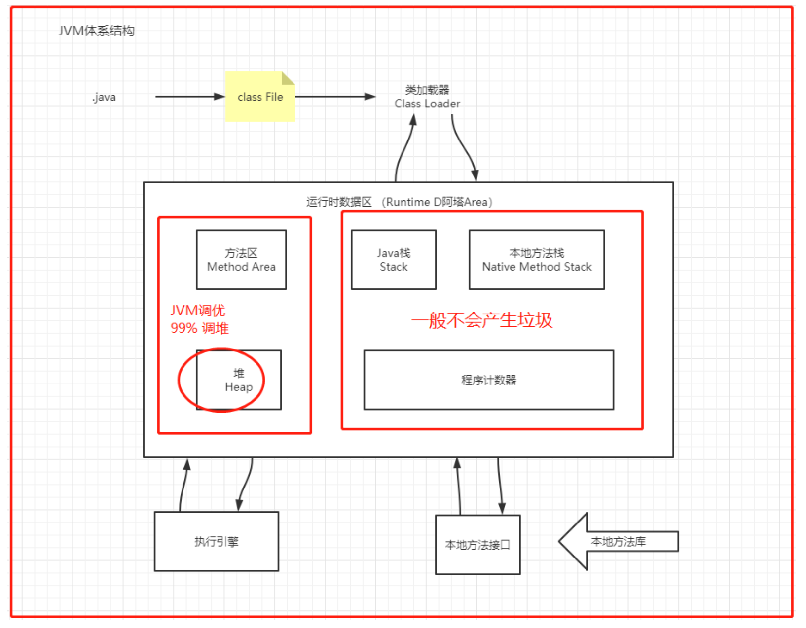
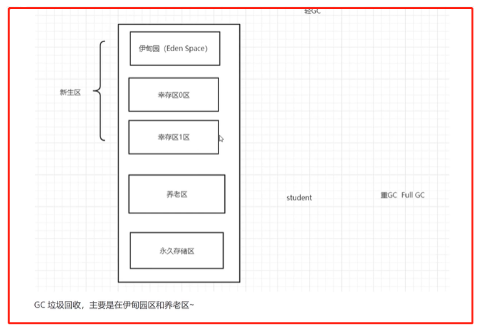
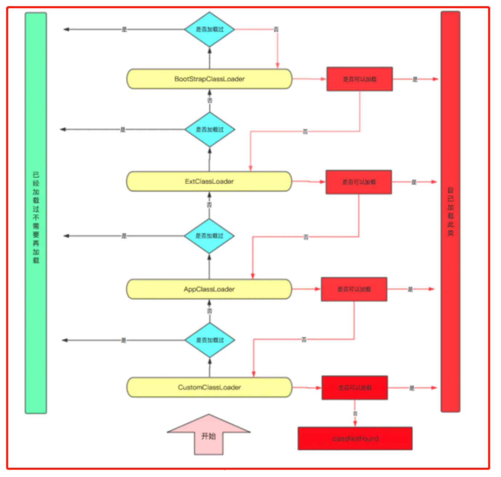

[TOC]

# JVM

参考资料

- https://pdai.tech/md/java/jvm/java-jvm-gc.html
- GPT-4o
- 狂神说-JVM

# 一、 JVM 体系结构



# 二、存储结构

## 2.1 方法区

1. 放了些什么：每个类的结构信息（字段、方法数据、普通方法、构造方法），运行时常量池，静态变量内容。（这是规范，不同虚拟机的实现是不同的 最典型的就是永久代PermGen space和元空间Metaspace）实例变量在堆内存中，和方法区无关。

2. 绝对不是用来放方法的

3. 这块区域所有线程共享，存在垃圾回收。


## 2.2 栈

每个线程都有自己的栈，栈中的数据都是以栈帧的格式存在；在这个线程上正在执行的每一个方法都各自对应一个栈帧；栈帧是一个内存区块，是一个数据集维系着方法执行过程中的各种数据信息

- 栈：8大基本类型+对象引用+实例的方法

栈是运行时的单位，Java 虚拟机栈，线程私有，生命周期和线程一致。描述的是 Java 方法执行的内存模型：每个方法在执行时都会创建一个栈帧(Stack Frame)用于存储局部变量表、操作数栈、动态链接、方法出口等信息。每一个方法从调用直至执行结束，就对应着一个栈帧从虚拟机栈中入栈到出栈的过程。（方法头开始入栈，结束出栈，方法里面调用别的方法 新的方法就会把旧的压在底下，最上面永远是正在执行的方法，也对应先入后出。）

- 局部变量表：存放了编译期可知的各种基本类型(boolean、byte、char、short、int、float、long、double)、对象引用(reference 类型)和 returnAddress 类型(指向了一条字节码指令的地址)


## 2.3 堆

Heap，一个jvm只有一个堆内存，堆内存的大小是可以调节的。类加载器读取了类文件后，一般会把类、方法、常量、变量，保存我们所有引用类型的真实对象。

（下图为jdk8之前的，jdk8以后永久存储区的名字改为“元空间”）





## 2.4 永久区

这个区域常驻内存的。用来存放JDK自身携带的class对象，interface元数据，储存的是java运行时的一些环境或类信息，这个区域不存在垃圾回收，关闭VM虚拟机就会释放这个区域的内存


Jdk1.6之前：永久代，常量池在方法区

Jdk1.7：永久代，慢慢退化，去永久代，常量池在堆中

Jdk1.8之后：无永久代，常量池在元空间

## 2.5 OOM

发生**OOM**内存溢出，解决方法

### 2.5.1 术语

**1**、内存溢出：（**Out Of Memory—-OOM**）

系统已经不能再分配出你所需要的空间，比如系统现在只有1G的空间，但是你偏偏要2个G空间，这就叫内存溢出

- 例子：一个盘子用尽各种方法只能装4个果子，你装了5个，结果掉倒地上不能吃了。这就是溢出。比方说栈，栈满时再做进栈必定产生空间溢出，叫上溢，栈空时再做退栈也产生空间溢出，称为下溢。就是分配的内存不足以放下数据项序列,称为内存溢出。说白了就是我承受不了那么多，那就报错。

**2**、内存泄漏： **(Memory Leak)**

强引用所指向的对象不会被回收，可能导致内存泄漏，虚拟机宁愿抛出OOM也不会去回收他指向的对象，意思就是你用资源的时候为他开辟了一段空间，当你用完时忘记释放资源了，这时内存还被占用着，一次没关系，但是内存泄漏次数多了就会导致内存溢出

### 2.5.2 尝试扩大堆内存

1. **修改 JVM 参数**
   - 通过调整 Java 虚拟机的启动参数来修改堆内存的大小。常用参数包括：
     - `-Xms` 设置初始堆大小。例如：`-Xms512m` 表示初始堆大小为 512MB。
     - `-Xmx` 设置最大堆大小。例如：`-Xmx2g` 表示最大堆大小为 2GB。
2. **监控性能**
   - 在扩大堆内存后，使用监控工具（如 JConsole、VisualVM）观察应用程序的性能，检查是否仍然有 OOM 错误发生。
3. **硬件资源评估**
   - 检查服务器的硬件配置，确保服务器有足够的物理内存支持新的堆设置。

### 2.5.3 使用专业工具分析内存

1. **JProfiler**
   - 在代码中嵌入 JProfiler 代理，启动应用程序，实时监控内存使用情况。
   - 使用其内存泄漏检测功能，可以从调用栈中查找未释放的对象，从而找出泄露的资源。
2. **VisualVM**
   - 直接从 JDK 捆绑包中获得，支持内存和 CPU 性能分析。
   - 可对堆转储进行分析，查找内存泄漏、过大的对象。
3. **YourKit**
   - 通过对比不同时间的内存快照，直观展示对象的变化和内存使用情况。
4. **Heap Dump**
   - 当发生 OOM 错误时，可以生成 heap dump 文件，通过分析此文件查看内存中存储了哪些对象以及它们的引用关系。

### 2.5.4 代码优化建议

1. **避免使用静态集合**
   - 对于静态集合（如 Map 和 List），合理管理其生命周期，避免不必要的扩展和数据积累。
2. **优化数据结构**
   - 根据实际需求选择合适的数据结构。如使用 `ArrayList` 代替 `LinkedList` 或者使用更高效的集合框架。
3. **资源管理**
   - 在使用完毕后，确保显式地释放资源，例如关闭数据库连接和文件流，以防资源长期占用内存。
4. **弱引用和软引用**
   - 使用弱引用（`WeakReference`）和软引用（`SoftReference`）来缓存数据。当内存不足时，可以被垃圾回收机制回收，降低内存泄漏的风险。
5. **内存监控**
   - 定期添加内存使用监控机制，以及时发现异常内存占用并进行预警。
6. **内存审计**
   - 定期进行代码审计，检测哪些代码可能导致内存泄漏，并对其进行优化。

### 2.5.5 系统设计调整

1. **微服务架构**
   - 考虑将大型 monolithic 应用切分为微服务，以减少单一服务对内存的需求，增加可扩展性和弹性。
2. **负载均衡**
   - 使用负载均衡器分散流量，减少单台服务器的内存负担。
3. **异步处理**
   - 对于高内存消耗的操作（如文件上传和数据处理），考虑使用异步处理和消息队列，减轻实时处理时的内存压力。
4. **定期重启服务**
   - 对于长时间运行的服务，定期重启可以清理内存，避免由于内存泄漏导致的 OOM。

# 三、垃圾回收机制GC

## 3.1 判断一个对象是否可被回收

### 1. 引用计数算法

给对象添加一个引用计数器，当对象增加一个引用时计数器加 1，引用失效时计数器减 1。引用计数为 0 的对象可被回收。

两个对象出现循环引用的情况下，此时引用计数器永远不为 0，导致无法对它们进行回收。

正因为循环引用的存在，因此 Java 虚拟机不使用引用计数算法。

```java
public class ReferenceCountingGC {

    public Object instance = null;

    public static void main(String[] args) {
        ReferenceCountingGC objectA = new ReferenceCountingGC();
        ReferenceCountingGC objectB = new ReferenceCountingGC();
        objectA.instance = objectB;
        objectB.instance = objectA;
    }
}
```

### 2. 可达性分析算法

通过 GC Roots 作为起始点进行搜索，能够到达到的对象都是存活的，不可达的对象可被回收。


Java 虚拟机使用该算法来判断对象是否可被回收，在 Java 中 GC Roots 一般包含以下内容:

- 虚拟机栈中引用的对象
- 本地方法栈中引用的对象
- 方法区中类静态属性引用的对象
- 方法区中的常量引用的对象

### 3. 方法区的回收

因为方法区主要存放永久代对象，而永久代对象的回收率比新生代低很多，因此在方法区上进行回收性价比不高。主要是对常量池的回收和对类的卸载。

在大量使用反射、动态代理、CGLib 等 ByteCode 框架、动态生成 JSP 以及 OSGi 这类频繁自定义 ClassLoader 的场景都需要虚拟机具备类卸载功能，以保证不会出现内存溢出。

类的卸载条件很多，需要满足以下三个条件，并且满足了也不一定会被卸载:

- 该类所有的实例都已经被回收，也就是堆中不存在该类的任何实例。
- 加载该类的 ClassLoader 已经被回收。
- 该类对应的 Class 对象没有在任何地方被引用，也就无法在任何地方通过反射访问该类方法。

可以通过 -Xnoclassgc 参数来控制是否对类进行卸载。

### 4. finalize()

finalize() 类似 C++ 的析构函数，用来做关闭外部资源等工作。但是 try-finally 等方式可以做的更好，并且该方法运行代价高昂，不确定性大，无法保证各个对象的调用顺序，因此最好不要使用。

当一个对象可被回收时，如果需要执行该对象的 finalize() 方法，那么就有可能通过在该方法中让对象重新被引用，从而实现自救。自救只能进行一次，如果回收的对象之前调用了 finalize() 方法自救，后面回收时不会调用 finalize() 方法。


- `finalize()` 的功能

`finalize()` 方法是定义在 `java.lang.Object` 类中的一个方法。在对象即将被垃圾回收（Garbage Collection，GC）之前，垃圾回收器会调用这个方法。这个方法允许对象在被销毁之前进行清理工作，比如释放资源（文件句柄、数据库连接等）。

- `finalize()` 的声明

```
protected void finalize() throws Throwable {
    // 清理代码
}
```

- 缺点

  - **不可预测性**：
    - `finalize()` 的调用时间是不确定的，因为垃圾回收器何时运行是不确定的。在一些情况下，可能永远不会调用。

  - **性能开销**：
    - `finalize()` 的存在会增加对象的生命周期，因为垃圾回收器需要保持这些对象直到进入`finalize()` 阶段，导致内存无法及时释放。

  - **异常处理**：
    - 若 `finalize()` 方法抛出异常，且未被捕获，异常会被垃圾回收器忽略，不会向上抛出。

  - **替代方案更优**：
    - `finalize()` 已经被更好的清理机制取代，如`try-with-resources` 和 `java.lang.AutoCloseable` 接口。

---


为什么`finalize()`不再推荐使用？

1. **不确定性**：`finalize()` 方法的调用时间和顺序是不确定的，可能会导致资源释放不及时。
2. **性能问题**：对象的垃圾回收需要更多的时间，使用`finalize()` 会导致性能下降。
3. **资源泄露**：如果`finalize()` 中的代码抛出异常，可能会导致对象无法被正确清理。


推荐的替代方案

1. **`try-with-resources`**：这个语法使得自动管理资源变得容易。在`try` 块中声明实现了 `AutoCloseable` 接口的对象，当块结束时，系统会自动调用`close()` 方法，确保资源被正确释放。

   ```java
   try (BufferedReader br = new BufferedReader(new FileReader("file.txt"))) {
       // 使用 br 进行读取操作
   } catch (IOException e) {
       e.printStackTrace();
   } // br 会在此处自动关闭
   ```

2. **实现 `AutoCloseable` 接口**：如果你有自己的资源管理类，可以实现 `AutoCloseable` 接口，并提供一个`close()` 方法来清理资源。

   ```java
   public class MyResource implements AutoCloseable {
       public void doSomething() {
           // 资源操作
       }
   
       @Override
       public void close() {
           // 释放资源
       }
   }
   
   try (MyResource resource = new MyResource()) {
       resource.doSomething();
   }
   ```


## 3.2 引用类型

无论是通过引用计算算法判断对象的引用数量，还是通过可达性分析算法判断对象是否可达，判定对象是否可被回收都与引用有关。

Java 具有四种强度不同的引用类型。

### 1. 强引用

被强引用关联的对象不会被回收。

使用 new 一个新对象的方式来创建强引用。

```java
Object obj = new Object();
```

### 2. 软引用

被软引用关联的对象只有在内存不够的情况下才会被回收。

使用 SoftReference 类来创建软引用。

```java
Object obj = new Object();
SoftReference<Object> sf = new SoftReference<Object>(obj);
obj = null;  // 使对象只被软引用关联
```

### 3. 弱引用

被弱引用关联的对象一定会被回收，也就是说它只能存活到下一次垃圾回收发生之前。

使用 WeakReference 类来实现弱引用。

```java
Object obj = new Object();
WeakReference<Object> wf = new WeakReference<Object>(obj);
obj = null;
```

### 4. 虚引用

又称为幽灵引用或者幻影引用。一个对象是否有虚引用的存在，完全不会对其生存时间构成影响，也无法通过虚引用取得一个对象。

为一个对象设置虚引用关联的唯一目的就是能在这个对象被回收时收到一个系统通知。使用 PhantomReference 来实现虚引用。

```java
Object obj = new Object();
PhantomReference<Object> pf = new PhantomReference<Object>(obj);
obj = null;
```

1. 创建 PhantomReference 和 ReferenceQueue

`PhantomReference` 必须与 `ReferenceQueue` 一起使用。一个对象是否有虚引用的存在，完全不会对其生存时间构成影响，也无法通过虚引用直接取得一个对象。然而，当对象被垃圾回收时，如果该对象的虚引用被加入到与之关联的 `ReferenceQueue` 中，那么就可以通过 `ReferenceQueue` 来检测到这个事件。

2. 收到通知的机制

- 当垃圾回收器发现一个对象仅被虚引用引用时，会在该对象被回收后，将这个虚引用加入到与之关联的 `ReferenceQueue` 中。这种机制保证了在回收对象之后，但在对象内存被实际释放之前，我们可以通过 `ReferenceQueue` 接收到此对象已被回收的通知，并可以执行一些额外的清理操作。

---

代码示例

以下是一个使用 `PhantomReference` 和 `ReferenceQueue` 的示例，展示如何捕捉对象被垃圾回收的通知：

```java
import java.lang.ref.PhantomReference;
import java.lang.ref.ReferenceQueue;

class MyObject {
    @Override
    protected void finalize() throws Throwable {
        super.finalize();
        System.out.println("MyObject's finalize() method called");
    }
}

public class PhantomReferenceDemo {
    public static void main(String[] args) throws InterruptedException {
        // 创建一个ReferenceQueue
        ReferenceQueue<MyObject> referenceQueue = new ReferenceQueue<>();

        // 创建一个对象
        MyObject obj = new MyObject();

        // 创建一个PhantomReference，将obj和referenceQueue关联起来
        PhantomReference<MyObject> phantomReference = new PhantomReference<>(obj, referenceQueue);

        // 使obj不再强引用指向MyObject对象
        obj = null;

        // 强制进行垃圾回收（注意：在真实环境中不一定立刻进行回收）
        System.gc();
        System.runFinalization();

        // 检查是否有PhantomReference对象入队
        while (true) {
            PhantomReference<? extends MyObject> refFromQueue = (PhantomReference<? extends MyObject>) referenceQueue.poll();
            if (refFromQueue != null) {
                // 收到了对象被回收的通知
                System.out.println("PhantomReference is enqueued, MyObject is collected.");
                break;
            }
            // 休眠一段时间以防止CPU占用过高
            Thread.sleep(100);
        }
    }
}
```

**解释**

1. **创建ReferenceQueue**：
   - `ReferenceQueue<MyObject> referenceQueue = new ReferenceQueue<>();`
   - 创建一个`ReferenceQueue`对象。
2. **创建对象与PhantomReference**：
   - `MyObject obj = new MyObject();`
   - `PhantomReference<MyObject> phantomReference = new PhantomReference<>(obj, referenceQueue);`
   - 创建一个`MyObject`对象，并将其与一个`PhantomReference`以及`ReferenceQueue`关联。
3. **清除强引用**：
   - `obj = null;`
   - 将`obj`置为`null`，以便这个`MyObject`对象只有虚引用指向它。
4. **触发垃圾回收**：
   - `System.gc();` 和 `System.runFinalization();`
   - 触发垃圾回收器。这在真实的环境中不一定会立即尝试回收，但是为了演示的目的，我们强制执行垃圾回收和终结操作。
5. **收到通知**：
   - 通过`referenceQueue.poll();`方法检查是否有`PhantomReference`入队列。
   - 如果有则表示`MyObject`对象已被垃圾回收器回收，然后打印通知。

**注意事项**

- **不可直接访问对象**：通过虚引用无法直接访问所指向的对象。
- **垃圾回收时机不可控**：`System.gc()` 只是建议JVM进行垃圾回收，并不保证立即执行。而且对象的回收时机依赖于垃圾回收算法和JVM的实现，可能不会立即触发。
- **finalize方法**：由于`PhantomReference` 应该是在 `finalize` 方法执行之后才会通知我们，因此在实际编程中尽量避免依赖 `finalize` 方法进行关键业务逻辑。


## 3.3垃圾回收算法

### 1. 标记 - 清除


**将存活的对象进行标记，然后清理掉未被标记的对象。**

- 不足:

  - 标记和清除过程效率都不高；

  - 会产生大量不连续的内存碎片，导致无法给大对象分配内存。

### 2. 标记 - 整理


让所有存活的对象都向一端移动，然后直接清理掉端边界以外的内存。

### 3. 复制


- 将内存划分为大小相等的两块，每次只使用其中一块，当这一块内存用完了就将还存活的对象复制到另一块上面，然后再把使用过的内存空间进行一次清理。主要不足是只使用了内存的一半。

- 现在的商业虚拟机都采用这种收集算法来回收新生代，但是并不是将新生代划分为大小相等的两块，而是分为一块较大的 Eden 空间和两块较小的 Survivor 空间，每次使用 Eden 空间和其中一块 Survivor。在回收时，将 Eden 和 Survivor 中还存活着的对象一次性复制到另一块 Survivor 空间上，最后清理 Eden 和使用过的那一块 Survivor。

- HotSpot 虚拟机的 Eden 和 Survivor 的大小比例默认为 8:1，保证了内存的利用率达到 90%。如果每次回收有多于 10% 的对象存活，那么一块 Survivor 空间就不够用了，此时需要依赖于老年代进行分配担保，也就是借用老年代的空间存储放不下的对象。

### 4. 分代收集

现在的商业虚拟机采用分代收集算法，它根据对象存活周期将内存划分为几块，不同块采用适当的收集算法。

一般将堆分为新生代和老年代。

- 新生代使用: 复制算法
- 老年代使用: 标记 - 清除 或者 标记 - 整理 算法

## 3.4 垃圾收集器


以上是 HotSpot 虚拟机中的 7 个垃圾收集器，连线表示垃圾收集器可以配合使用。

- 单线程与多线程: 单线程指的是垃圾收集器只使用一个线程进行收集，而多线程使用多个线程；
- 串行与并行: 串行指的是垃圾收集器与用户程序交替执行，这意味着在执行垃圾收集的时候需要停顿用户程序；并形指的是垃圾收集器和用户程序同时执行。除了 CMS 和 G1 之外，其它垃圾收集器都是以串行的方式执行。


### 1. Serial 收集器


Serial 翻译为串行，也就是说它以串行的方式执行。

它是单线程的收集器，只会使用一个线程进行垃圾收集工作。

它的优点是简单高效，对于单个 CPU 环境来说，由于没有线程交互的开销，因此拥有最高的单线程收集效率。

它是 Client 模式下的默认新生代收集器，因为在用户的桌面应用场景下，分配给虚拟机管理的内存一般来说不会很大。Serial 收集器收集几十兆甚至一两百兆的新生代停顿时间可以控制在一百多毫秒以内，只要不是太频繁，这点停顿是可以接受的。

### 2. ParNew 收集器


它是 Serial 收集器的多线程版本。

是 Server 模式下的虚拟机首选新生代收集器，除了性能原因外，主要是因为除了 Serial 收集器，只有它能与 CMS 收集器配合工作。

默认开启的线程数量与 CPU 数量相同，可以使用 -XX:ParallelGCThreads 参数来设置线程数。

### 3. Parallel Scavenge 收集器

与 ParNew 一样是多线程收集器。

其它收集器关注点是尽可能缩短垃圾收集时用户线程的停顿时间，而它的目标是达到一个可控制的吞吐量，它被称为“吞吐量优先”收集器。这里的吞吐量指 CPU 用于运行用户代码的时间占总时间的比值。

停顿时间越短就越适合需要与用户交互的程序，良好的响应速度能提升用户体验。而高吞吐量则可以高效率地利用 CPU 时间，尽快完成程序的运算任务，主要适合在后台运算而不需要太多交互的任务。

缩短停顿时间是以牺牲吞吐量和新生代空间来换取的: 新生代空间变小，垃圾回收变得频繁，导致吞吐量下降。

可以通过一个开关参数打开 GC 自适应的调节策略(GC Ergonomics)，就不需要手动指定新生代的大小(-Xmn)、Eden 和 Survivor 区的比例、晋升老年代对象年龄等细节参数了。虚拟机会根据当前系统的运行情况收集性能监控信息，动态调整这些参数以提供最合适的停顿时间或者最大的吞吐量。

### 4. Serial Old 收集器

------


是 Serial 收集器的老年代版本，也是给 Client 模式下的虚拟机使用。如果用在 Server 模式下，它有两大用途:

- 在 JDK 1.5 以及之前版本(Parallel Old 诞生以前)中与 Parallel Scavenge 收集器搭配使用。
- 作为 CMS 收集器的后备预案，在并发收集发生 Concurrent Mode Failure 时使用。

### 5. Parallel Old 收集器


是 Parallel Scavenge 收集器的老年代版本。

在注重吞吐量以及 CPU 资源敏感的场合，都可以优先考虑 Parallel Scavenge 加 Parallel Old 收集器。

### 6. CMS 收集器


CMS(Concurrent Mark Sweep)，Mark Sweep 指的是标记 - 清除算法。

分为以下四个流程:

- 初始标记: 仅仅只是标记一下 GC Roots 能直接关联到的对象，速度很快，需要停顿。
- 并发标记: 进行 GC Roots Tracing 的过程，它在整个回收过程中耗时最长，不需要停顿。
- 重新标记: 为了修正并发标记期间因用户程序继续运作而导致标记产生变动的那一部分对象的标记记录，需要停顿。
- 并发清除: 不需要停顿。

在整个过程中耗时最长的并发标记和并发清除过程中，收集器线程都可以与用户线程一起工作，不需要进行停顿。

具有以下缺点:

- 吞吐量低: 低停顿时间是以牺牲吞吐量为代价的，导致 CPU 利用率不够高。
- 无法处理浮动垃圾，可能出现 Concurrent Mode Failure。浮动垃圾是指并发清除阶段由于用户线程继续运行而产生的垃圾，这部分垃圾只能到下一次 GC 时才能进行回收。由于浮动垃圾的存在，因此需要预留出一部分内存，意味着 CMS 收集不能像其它收集器那样等待老年代快满的时候再回收。如果预留的内存不够存放浮动垃圾，就会出现 Concurrent Mode Failure，这时虚拟机将临时启用 Serial Old 来替代 CMS。
- 标记 - 清除算法导致的空间碎片，往往出现老年代空间剩余，但无法找到足够大连续空间来分配当前对象，不得不提前触发一次 Full GC。

### 7. G1 收集器

G1(Garbage-First)，它是一款面向服务端应用的垃圾收集器，在多 CPU 和大内存的场景下有很好的性能。HotSpot 开发团队赋予它的使命是未来可以替换掉 CMS 收集器。

堆被分为新生代和老年代，其它收集器进行收集的范围都是整个新生代或者老年代，而 G1 可以直接对新生代和老年代一起回收。


G1 把堆划分成多个大小相等的独立区域(Region)，新生代和老年代不再物理隔离。


通过引入 Region 的概念，从而将原来的一整块内存空间划分成多个的小空间，使得每个小空间可以单独进行垃圾回收。这种划分方法带来了很大的灵活性，使得可预测的停顿时间模型成为可能。通过记录每个 Region 垃圾回收时间以及回收所获得的空间(这两个值是通过过去回收的经验获得)，并维护一个优先列表，每次根据允许的收集时间，优先回收价值最大的 Region。

每个 Region 都有一个 Remembered Set，用来记录该 Region 对象的引用对象所在的 Region。通过使用 Remembered Set，在做可达性分析的时候就可以避免全堆扫描。


如果不计算维护 Remembered Set 的操作，G1 收集器的运作大致可划分为以下几个步骤:

- 初始标记
- 并发标记
- 最终标记: 为了修正在并发标记期间因用户程序继续运作而导致标记产生变动的那一部分标记记录，虚拟机将这段时间对象变化记录在线程的 Remembered Set Logs 里面，最终标记阶段需要把 Remembered Set Logs 的数据合并到 Remembered Set 中。这阶段需要停顿线程，但是可并行执行。
- 筛选回收: 首先对各个 Region 中的回收价值和成本进行排序，根据用户所期望的 GC 停顿时间来制定回收计划。此阶段其实也可以做到与用户程序一起并发执行，但是因为只回收一部分 Region，时间是用户可控制的，而且停顿用户线程将大幅度提高收集效率。

具备如下特点:

- 空间整合: 整体来看是基于“标记 - 整理”算法实现的收集器，从局部(两个 Region 之间)上来看是基于“复制”算法实现的，这意味着运行期间不会产生内存空间碎片。
- 可预测的停顿: 能让使用者明确指定在一个长度为 M 毫秒的时间片段内，消耗在 GC 上的时间不得超过 N 毫秒。


## 3.5 内存分配与回收策略

### 3.5.1 Minor GC、Major GC、Full GC

JVM 在进行 GC 时，并非每次都对堆内存（新生代、老年代；方法区）区域一起回收的，大部分时候回收的都是指新生代。

针对 HotSpot VM 的实现，它里面的 GC 按照回收区域又分为两大类：部分收集（Partial GC），整堆收集（Full GC）

- 部分收集：不是完整收集整个 Java 堆的垃圾收集。其中又分为： 
  - 新生代收集（Minor GC/Young GC）：只是新生代的垃圾收集
  - 老年代收集（Major GC/Old GC）：只是老年代的垃圾收集 
    - 目前，只有 CMS GC 会有单独收集老年代的行为
    - 很多时候 Major GC 会和 Full GC 混合使用，需要具体分辨是老年代回收还是整堆回收
  - 混合收集（Mixed GC）：收集整个新生代以及部分老年代的垃圾收集 
    - 目前只有 G1 GC 会有这种行为
- 整堆收集（Full GC）：收集整个 Java 堆和方法区的垃圾

### 3.5.2 内存分配策略

#### 1. 对象优先在 Eden 分配

大多数情况下，对象在新生代 Eden 区分配，当 Eden 区空间不够时，发起 Minor GC。

#### 2. 大对象直接进入老年代

大对象是指需要连续内存空间的对象，最典型的大对象是那种很长的字符串以及数组。

经常出现大对象会提前触发垃圾收集以获取足够的连续空间分配给大对象。

-XX:PretenureSizeThreshold，大于此值的对象直接在老年代分配，避免在 Eden 区和 Survivor 区之间的大量内存复制。

#### 3. 长期存活的对象进入老年代

为对象定义年龄计数器，对象在 Eden 出生并经过 Minor GC 依然存活，将移动到 Survivor 中，年龄就增加 1 岁，增加到一定年龄则移动到老年代中。

-XX:MaxTenuringThreshold 用来定义年龄的阈值。

#### 4. 动态对象年龄判定

虚拟机并不是永远地要求对象的年龄必须达到 MaxTenuringThreshold 才能晋升老年代，如果在 Survivor 中相同年龄所有对象大小的总和大于 Survivor 空间的一半，则年龄大于或等于该年龄的对象可以直接进入老年代，无需等到 MaxTenuringThreshold 中要求的年龄。

#### 5. 空间分配担保

在发生 Minor GC 之前，虚拟机先检查老年代最大可用的连续空间是否大于新生代所有对象总空间，如果条件成立的话，那么 Minor GC 可以确认是安全的。

如果不成立的话虚拟机会查看 HandlePromotionFailure 设置值是否允许担保失败，如果允许那么就会继续检查老年代最大可用的连续空间是否大于历次晋升到老年代对象的平均大小，如果大于，将尝试着进行一次 Minor GC；如果小于，或者 HandlePromotionFailure 设置不允许冒险，那么就要进行一次 Full GC。

### 3.5.3 Full GC 的触发条件

对于 Minor GC，其触发条件非常简单，当 Eden 空间满时，就将触发一次 Minor GC。而 Full GC 则相对复杂，有以下条件:

#### 1. 调用 System.gc()

只是建议虚拟机执行 Full GC，但是虚拟机不一定真正去执行。不建议使用这种方式，而是让虚拟机管理内存。

#### 2. 老年代空间不足

老年代空间不足的常见场景为前文所讲的大对象直接进入老年代、长期存活的对象进入老年代等。

为了避免以上原因引起的 Full GC，应当尽量不要创建过大的对象以及数组。除此之外，可以通过 -Xmn 虚拟机参数调大新生代的大小，让对象尽量在新生代被回收掉，不进入老年代。还可以通过 -XX:MaxTenuringThreshold 调大对象进入老年代的年龄，让对象在新生代多存活一段时间。

#### 3. 空间分配担保失败

使用复制算法的 Minor GC 需要老年代的内存空间作担保，如果担保失败会执行一次 Full GC。具体内容请参考上面的第五小节。

#### 4. JDK 1.7 及以前的永久代空间不足

在 JDK 1.7 及以前，HotSpot 虚拟机中的方法区是用永久代实现的，永久代中存放的为一些 Class 的信息、常量、静态变量等数据。

当系统中要加载的类、反射的类和调用的方法较多时，永久代可能会被占满，在未配置为采用 CMS GC 的情况下也会执行 Full GC。如果经过 Full GC 仍然回收不了，那么虚拟机会抛出 java.lang.OutOfMemoryError。

为避免以上原因引起的 Full GC，可采用的方法为增大永久代空间或转为使用 CMS GC。

#### 5. Concurrent Mode Failure

执行 CMS GC 的过程中同时有对象要放入老年代，而此时老年代空间不足(可能是 GC 过程中浮动垃圾过多导致暂时性的空间不足)，便会报 Concurrent Mode Failure 错误，并触发 Full GC。

## 3.6 GC - Java 垃圾回收器之G1详解

> G1垃圾回收器是在Java7 update 4之后引入的一个新的垃圾回收器。同优秀的CMS垃圾回收器一样，G1也是关注最小时延的垃圾回收器，也同样适合大尺寸堆内存的垃圾收集，官方在ZGC还没有出现时也推荐使用G1来代替选择CMS。G1最大的特点是引入分区的思路，弱化了分代的概念，合理利用垃圾收集各个周期的资源，解决了其他收集器甚至CMS的众多缺陷。


### 1. 概述

G1垃圾回收器是在Java7 update 4之后引入的一个新的垃圾回收器。G1是一个分代的，增量的，并行与并发的标记-复制垃圾回收器。它的设计目标是为了适应现在不断扩大的内存和不断增加的处理器数量，进一步降低暂停时间（pause time），同时兼顾良好的吞吐量。G1回收器和CMS比起来，有以下不同：

- G1垃圾回收器是**compacting**的，因此其回收得到的空间是连续的。这避免了CMS回收器因为不连续空间所造成的问题。如需要更大的堆空间，更多的floating garbage。连续空间意味着G1垃圾回收器可以不必采用空闲链表的内存分配方式，而可以直接采用bump-the-pointer的方式；
- G1回收器的内存与CMS回收器要求的内存模型有极大的不同。G1将内存划分一个个固定大小的region，每个region可以是年轻代、老年代的一个。**内存的回收是以region作为基本单位的**；
- G1还有一个及其重要的特性：**软实时**（soft real-time）。所谓的实时垃圾回收，是指在要求的时间内完成垃圾回收。“软实时”则是指，用户可以指定垃圾回收时间的限时，G1会努力在这个时限内完成垃圾回收，但是G1并不担保每次都能在这个时限内完成垃圾回收。通过设定一个合理的目标，可以让达到90%以上的垃圾回收时间都在这个时限内。

### 2. G1的内存模型

#### 2.1 分区概念

- G1分区示意图


##### 2.1.1 分区Region

G1采用了分区(Region)的思路，将整个堆空间分成若干个大小相等的内存区域，每次分配对象空间将逐段地使用内存。因此，在堆的使用上，G1并不要求对象的存储一定是物理上连续的，只要逻辑上连续即可；每个分区也不会确定地为某个代服务，可以按需在年轻代和老年代之间切换。启动时可以通过参数-XX:G1HeapRegionSize=n可指定分区大小(1MB~32MB，且必须是2的幂)，默认将整堆划分为2048个分区。

##### 2.1.2 卡片Card

在每个分区内部又被分成了若干个大小为512 Byte卡片(Card)，标识堆内存最小可用粒度所有分区的卡片将会记录在全局卡片表(Global Card Table)中，分配的对象会占用物理上连续的若干个卡片，当查找对分区内对象的引用时便可通过记录卡片来查找该引用对象(见RSet)。每次对内存的回收，都是对指定分区的卡片进行处理。

##### 2.1.3 堆Heap

G1同样可以通过-Xms/-Xmx来指定堆空间大小。当发生年轻代收集或混合收集时，通过计算GC与应用的耗费时间比，自动调整堆空间大小。如果GC频率太高，则通过增加堆尺寸，来减少GC频率，相应地GC占用的时间也随之降低；目标参数-XX:GCTimeRatio即为GC与应用的耗费时间比，G1默认为9，而CMS默认为99，因为CMS的设计原则是耗费在GC上的时间尽可能的少。另外，当空间不足，如对象空间分配或转移失败时，G1会首先尝试增加堆空间，如果扩容失败，则发起担保的Full GC。Full GC后，堆尺寸计算结果也会调整堆空间。

#### 2.2 分代模型


##### 2.2.1 分代垃圾收集

分代垃圾收集可以将关注点集中在最近被分配的对象上，而无需整堆扫描，避免长命对象的拷贝，同时独立收集有助于降低响应时间。虽然分区使得内存分配不再要求紧凑的内存空间，但G1依然使用了分代的思想。与其他垃圾收集器类似，G1将内存在逻辑上划分为年轻代和老年代，其中年轻代又划分为Eden空间和Survivor空间。但年轻代空间并不是固定不变的，当现有年轻代分区占满时，JVM会分配新的空闲分区加入到年轻代空间。

整个年轻代内存会在初始空间`-XX:G1NewSizePercent`(默认整堆5%)与最大空间(默认60%)之间动态变化，且由参数目标暂停时间`-XX:MaxGCPauseMillis`(默认200ms)、需要扩缩容的大小以`-XX:G1MaxNewSizePercent`及分区的已记忆集合(RSet)计算得到。当然，G1依然可以设置固定的年轻代大小(参数-XX:NewRatio、-Xmn)，但同时暂停目标将失去意义。

##### 2.2.2 本地分配缓冲 Local allocation buffer (Lab)

值得注意的是，由于分区的思想，每个线程均可以"认领"某个分区用于线程本地的内存分配，而不需要顾及分区是否连续。因此，每个应用线程和GC线程都会独立的使用分区，进而减少同步时间，提升GC效率，这个分区称为本地分配缓冲区(Lab)。

其中，应用线程可以独占一个本地缓冲区(TLAB)来创建的对象，而大部分都会落入Eden区域(巨型对象或分配失败除外)，因此TLAB的分区属于Eden空间；而每次垃圾收集时，每个GC线程同样可以独占一个本地缓冲区(GCLAB)用来转移对象，每次回收会将对象复制到Suvivor空间或老年代空间；对于从Eden/Survivor空间晋升(Promotion)到Survivor/老年代空间的对象，同样有GC独占的本地缓冲区进行操作，该部分称为晋升本地缓冲区(PLAB)。

#### 2.3 分区模型


G1对内存的使用以分区(Region)为单位，而对对象的分配则以卡片(Card)为单位。

##### 2.3.1 巨形对象Humongous Region

一个大小达到甚至超过分区大小一半的对象称为巨型对象(Humongous Object)。当线程为巨型分配空间时，不能简单在TLAB进行分配，因为巨型对象的移动成本很高，而且有可能一个分区不能容纳巨型对象。因此，巨型对象会直接在老年代分配，所占用的连续空间称为巨型分区(Humongous Region)。G1内部做了一个优化，一旦发现没有引用指向巨型对象，则可直接在年轻代收集周期中被回收。

巨型对象会独占一个、或多个连续分区，其中第一个分区被标记为开始巨型(StartsHumongous)，相邻连续分区被标记为连续巨型(ContinuesHumongous)。由于无法享受Lab带来的优化，并且确定一片连续的内存空间需要扫描整堆，因此确定巨型对象开始位置的成本非常高，如果可以，应用程序应避免生成巨型对象。

##### 2.3.2 已记忆集合Remember Set (RSet)

在串行和并行收集器中，GC通过整堆扫描，来确定对象是否处于可达路径中。然而G1为了避免STW式的整堆扫描，在每个分区记录了一个已记忆集合(RSet)，内部类似一个反向指针，记录引用分区内对象的卡片索引。当要回收该分区时，通过扫描分区的RSet，来确定引用本分区内的对象是否存活，进而确定本分区内的对象存活情况。

事实上，并非所有的引用都需要记录在RSet中，如果一个分区确定需要扫描，那么无需RSet也可以无遗漏的得到引用关系。那么引用源自本分区的对象，当然不用落入RSet中；同时，G1 GC每次都会对年轻代进行整体收集，因此引用源自年轻代的对象，也不需要在RSet中记录。最后只有老年代的分区可能会有RSet记录，这些分区称为拥有RSet分区(an RSet’s owning region)。

##### 2.3.3 Per Region Table (PRT)

RSet在内部使用Per Region Table(PRT)记录分区的引用情况。由于RSet的记录要占用分区的空间，如果一个分区非常"受欢迎"，那么RSet占用的空间会上升，从而降低分区的可用空间。G1应对这个问题采用了改变RSet的密度的方式，在PRT中将会以三种模式记录引用：

- 稀少：直接记录引用对象的卡片索引
- 细粒度：记录引用对象的分区索引
- 粗粒度：只记录引用情况，每个分区对应一个比特位

由上可知，粗粒度的PRT只是记录了引用数量，需要通过整堆扫描才能找出所有引用，因此扫描速度也是最慢的。

#### 2.4 收集集合 (CSet)

CSet收集示意图


收集集合(CSet)代表每次GC暂停时回收的一系列目标分区。在任意一次收集暂停中，CSet所有分区都会被释放，内部存活的对象都会被转移到分配的空闲分区中。因此无论是年轻代收集，还是混合收集，工作的机制都是一致的。年轻代收集CSet只容纳年轻代分区，而混合收集会通过启发式算法，在老年代候选回收分区中，筛选出回收收益最高的分区添加到CSet中。

候选老年代分区的CSet准入条件，可以通过活跃度阈值-XX:G1MixedGCLiveThresholdPercent(默认85%)进行设置，从而拦截那些回收开销巨大的对象；同时，每次混合收集可以包含候选老年代分区，可根据CSet对堆的总大小占比-XX:G1OldCSetRegionThresholdPercent(默认10%)设置数量上限。

由上述可知，G1的收集都是根据CSet进行操作的，年轻代收集与混合收集没有明显的不同，最大的区别在于两种收集的触发条件。

##### 2.4.1 年轻代收集集合 CSet of Young Collection

应用线程不断活动后，年轻代空间会被逐渐填满。当JVM分配对象到Eden区域失败(Eden区已满)时，便会触发一次STW式的年轻代收集。在年轻代收集中，Eden分区存活的对象将被拷贝到Survivor分区；原有Survivor分区存活的对象，将根据任期阈值(tenuring threshold)分别晋升到PLAB中，新的survivor分区和老年代分区。而原有的年轻代分区将被整体回收掉。

同时，年轻代收集还负责维护对象的年龄(存活次数)，辅助判断老化(tenuring)对象晋升的时候是到Survivor分区还是到老年代分区。年轻代收集首先先将晋升对象尺寸总和、对象年龄信息维护到年龄表中，再根据年龄表、Survivor尺寸、Survivor填充容量-XX:TargetSurvivorRatio(默认50%)、最大任期阈值-XX:MaxTenuringThreshold(默认15)，计算出一个恰当的任期阈值，凡是超过任期阈值的对象都会被晋升到老年代。

##### 2.4.2 混合收集集合 CSet of Mixed Collection

年轻代收集不断活动后，老年代的空间也会被逐渐填充。当老年代占用空间超过整堆比IHOP阈值-XX:InitiatingHeapOccupancyPercent(默认45%)时，G1就会启动一次混合垃圾收集周期。为了满足暂停目标，G1可能不能一口气将所有的候选分区收集掉，因此G1可能会产生连续多次的混合收集与应用线程交替执行，每次STW的混合收集与年轻代收集过程相类似。

为了确定包含到年轻代收集集合CSet的老年代分区，JVM通过参数混合周期的最大总次数-XX:G1MixedGCCountTarget(默认8)、堆废物百分比-XX:G1HeapWastePercent(默认5%)。通过候选老年代分区总数与混合周期最大总次数，确定每次包含到CSet的最小分区数量；根据堆废物百分比，当收集达到参数时，不再启动新的混合收集。而每次添加到CSet的分区，则通过计算得到的GC效率进行安排。

##### 2.4.3 并发标记算法（三色标记法）

CMS和G1在并发标记时使用的是同一个算法：三色标记法，使用白灰黑三种颜色标记对象。白色是未标记；灰色自身被标记，引用的对象未标记；黑色自身与引用对象都已标记。


GC 开始前所有对象都是白色，GC 一开始所有根能够直达的对象被压到栈中，待搜索，此时颜色是灰色。然后灰色对象依次从栈中取出搜索子对象，子对象也会被涂为灰色，入栈。当其所有的子对象都涂为灰色之后该对象被涂为黑色。当 GC 结束之后灰色对象将全部没了，剩下黑色的为存活对象，白色的为垃圾。


##### 2.4.4 漏标问题

在remark过程中，黑色指向了白色，如果不对黑色重新扫描，则会漏标。会把白色D对象当作没有新引用指向从而回收掉。


并发标记过程中，Mutator删除了所有从灰色到白色的引用，会产生漏标。此时白色对象应该被回收

产生漏标问题的条件有两个：

- 黑色对象指向了白色对象
- 灰色对象指向白色对象的引用消失

所以要解决漏标问题，打破两个条件之一即可：

- **跟踪黑指向白的增加** incremental update：增量更新，关注引用的增加，把黑色重新标记为灰色，下次重新扫描属性。CMS采用该方法。
- **记录灰指向白的消失** SATB snapshot at the beginning：关注引用的删除，当灰–>白消失时，要把这个 引用 推到GC的堆栈，保证白还能被GC扫描到。G1采用该方法。

**为什么G1采用SATB而不用incremental update**？

因为采用incremental update把黑色重新标记为灰色后，之前扫描过的还要再扫描一遍，效率太低。G1有RSet与SATB相配合。Card Table里记录了RSet，RSet里记录了其他对象指向自己的引用，这样就不需要再扫描其他区域，只要扫描RSet就可以了。

也就是说 灰色–>白色 引用消失时，如果没有 黑色–>白色，引用会被push到堆栈，下次扫描时拿到这个引用，由于有RSet的存在，不需要扫描整个堆去查找指向白色的引用，效率比较高。SATB配合RSet浑然天成。

### 3. G1的活动周期

#### 3.1 G1垃圾收集活动汇总

G1垃圾收集活动周期图


#### 3.2 RSet的维护

由于不能整堆扫描，又需要计算分区确切的活跃度，因此，G1需要一个增量式的完全标记并发算法，通过维护RSet，得到准确的分区引用信息。在G1中，RSet的维护主要来源两个方面：写栅栏(Write Barrier)和并发优化线程(Concurrence Refinement Threads)

##### 3.2.1 栅栏Barrier

栅栏代码示意

我们首先介绍一下栅栏(Barrier)的概念。栅栏是指在原生代码片段中，当某些语句被执行时，栅栏代码也会被执行。而G1主要在赋值语句中，使用写前栅栏(Pre-Write Barrrier)和写后栅栏(Post-Write Barrrier)。事实上，写栅栏的指令序列开销非常昂贵，应用吞吐量也会根据栅栏复杂度而降低。

**写前栅栏 Pre-Write Barrrier**

即将执行一段赋值语句时，等式左侧对象将修改引用到另一个对象，那么等式左侧对象原先引用的对象所在分区将因此丧失一个引用，那么JVM就需要在赋值语句生效之前，记录丧失引用的对象。JVM并不会立即维护RSet，而是通过批量处理，在将来RSet更新(见SATB)。

**写后栅栏 Post-Write Barrrier**

当执行一段赋值语句后，等式右侧对象获取了左侧对象的引用，那么等式右侧对象所在分区的RSet也应该得到更新。同样为了降低开销，写后栅栏发生后，RSet也不会立即更新，同样只是记录此次更新日志，在将来批量处理(见Concurrence Refinement Threads)。

##### 3.2.2 起始快照算法Snapshot at the beginning (SATB)

Taiichi Tuasa贡献的增量式完全并发标记算法起始快照算法(SATB)，主要针对标记-清除垃圾收集器的并发标记阶段，非常适合G1的分区块的堆结构，同时解决了CMS的主要烦恼：重新标记暂停时间长带来的潜在风险。

SATB会创建一个对象图，相当于堆的逻辑快照，从而确保并发标记阶段所有的垃圾对象都能通过快照被鉴别出来。当赋值语句发生时，应用将会改变了它的对象图，那么JVM需要记录被覆盖的对象。因此写前栅栏会在引用变更前，将值记录在SATB日志或缓冲区中。每个线程都会独占一个SATB缓冲区，初始有256条记录空间。当空间用尽时，线程会分配新的SATB缓冲区继续使用，而原有的缓冲去则加入全局列表中。最终在并发标记阶段，并发标记线程(Concurrent Marking Threads)在标记的同时，还会定期检查和处理全局缓冲区列表的记录，然后根据标记位图分片的标记位，扫描引用字段来更新RSet。此过程又称为并发标记/SATB写前栅栏。

##### 3.2.3 并发优化线程Concurrence Refinement Threads

G1中使用基于Urs Hölzle的快速写栅栏，将栅栏开销缩减到2个额外的指令。栅栏将会更新一个card table type的结构来跟踪代间引用。

当赋值语句发生后，写后栅栏会先通过G1的过滤技术判断是否是跨分区的引用更新，并将跨分区更新对象的卡片加入缓冲区序列，即更新日志缓冲区或脏卡片队列。与SATB类似，一旦日志缓冲区用尽，则分配一个新的日志缓冲区，并将原来的缓冲区加入全局列表中。

并发优化线程(Concurrence Refinement Threads)，只专注扫描日志缓冲区记录的卡片来维护更新RSet，线程最大数目可通过`-XX:G1ConcRefinementThreads`(默认等于`-XX:ParellelGCThreads`)设置。并发优化线程永远是活跃的，一旦发现全局列表有记录存在，就开始并发处理。如果记录增长很快或者来不及处理，那么通过阈值`-X:G1ConcRefinementGreenZone/-XX:G1ConcRefinementYellowZone/-XX:G1ConcRefinementRedZone`，G1会用分层的方式调度，使更多的线程处理全局列表。如果并发优化线程也不能跟上缓冲区数量，则Mutator线程(Java应用线程)会挂起应用并被加进来帮助处理，直到全部处理完。因此，必须避免此类场景出现。

#### 3.3 并发标记周期 Concurrent Marking Cycle

并发标记周期是G1中非常重要的阶段，这个阶段将会为混合收集周期识别垃圾最多的老年代分区。整个周期完成根标记、识别所有(可能)存活对象，并计算每个分区的活跃度，从而确定GC效率等级。

当达到IHOP阈值`-XX:InitiatingHeapOccupancyPercent`(老年代占整堆比，默认45%)时，便会触发并发标记周期。整个并发标记周期将由初始标记(Initial Mark)、根分区扫描(Root Region Scanning)、并发标记(Concurrent Marking)、重新标记(Remark)、清除(Cleanup)几个阶段组成。其中，初始标记(随年轻代收集一起活动)、重新标记、清除是STW的，而并发标记如果来不及标记存活对象，则可能在并发标记过程中，G1又触发了几次年轻代收集。

##### 3.3.1 并发标记线程 Concurrent Marking Threads

并发标记位图过程


要标记存活的对象，每个分区都需要创建位图(Bitmap)信息来存储标记数据，来确定标记周期内被分配的对象。G1采用了两个位图Previous Bitmap、Next Bitmap，来存储标记数据，Previous位图存储上次的标记数据，Next位图在标记周期内不断变化更新，同时Previous位图的标记数据也越来越过时，当标记周期结束后Next位图便替换Previous位图，成为上次标记的位图。同时，每个分区通过顶部开始标记(TAMS)，来记录已标记过的内存范围。同样的，G1使用了两个顶部开始标记Previous TAMS(PTAMS)、Next TAMS(NTAMS)，记录已标记的范围。

在并发标记阶段，G1会根据参数`-XX:ConcGCThreads`(默认GC线程数的1/4，即`-XX:ParallelGCThreads/4`)，分配并发标记线程(Concurrent Marking Threads)，进行标记活动。每个并发线程一次只扫描一个分区，并通过"手指"指针的方式优化获取分区。并发标记线程是爆发式的，在给定的时间段拼命干活，然后休息一段时间，再拼命干活。

每个并发标记周期，在初始标记STW的最后，G1会分配一个空的Next位图和一个指向分区顶部(Top)的NTAMS标记。Previous位图记录的上次标记数据，上次的标记位置，即PTAMS，在PTAMS与分区底部(Bottom)的范围内，所有的存活对象都已被标记。那么，在PTAMS与Top之间的对象都将是隐式存活(Implicitly Live)对象。在并发标记阶段，Next位图吸收了Previous位图的标记数据，同时每个分区都会有新的对象分配，则Top与NTAMS分离，前往更高的地址空间。在并发标记的一次标记中，并发标记线程将找出NTAMS与PTAMS之间的所有存活对象，将标记数据存储在Next位图中。同时，在NTAMS与Top之间的对象即成为已标记对象。如此不断地更新Next位图信息，并在清除阶段与Previous位图交换角色。

##### 3.3.2 初始标记 Initial Mark

初始标记(Initial Mark)负责标记所有能被直接可达的根对象(原生栈对象、全局对象、JNI对象)，根是对象图的起点，因此初始标记需要将Mutator线程(Java应用线程)暂停掉，也就是需要一个STW的时间段。事实上，当达到IHOP阈值时，G1并不会立即发起并发标记周期，而是等待下一次年轻代收集，利用年轻代收集的STW时间段，完成初始标记，这种方式称为借道(Piggybacking)。在初始标记暂停中，分区的NTAMS都被设置到分区顶部Top，初始标记是并发执行，直到所有的分区处理完。

##### 3.3.3 根分区扫描 Root Region Scanning

在初始标记暂停结束后，年轻代收集也完成的对象复制到Survivor的工作，应用线程开始活跃起来。此时为了保证标记算法的正确性，所有新复制到Survivor分区的对象，都需要被扫描并标记成根，这个过程称为根分区扫描(Root Region Scanning)，同时扫描的Suvivor分区也被称为根分区(Root Region)。根分区扫描必须在下一次年轻代垃圾收集启动前完成(并发标记的过程中，可能会被若干次年轻代垃圾收集打断)，因为每次GC会产生新的存活对象集合。

##### 3.3.4 并发标记 Concurrent Marking

和应用线程并发执行，并发标记线程在并发标记阶段启动，由参数`-XX:ConcGCThreads`(默认GC线程数的1/4，即`-XX:ParallelGCThreads/4`)控制启动数量，每个线程每次只扫描一个分区，从而标记出存活对象图。在这一阶段会处理Previous/Next标记位图，扫描标记对象的引用字段。同时，并发标记线程还会定期检查和处理STAB全局缓冲区列表的记录，更新对象引用信息。参数`-XX:+ClassUnloadingWithConcurrentMark`会开启一个优化，如果一个类不可达(不是对象不可达)，则在重新标记阶段，这个类就会被直接卸载。所有的标记任务必须在堆满前就完成扫描，如果并发标记耗时很长，那么有可能在并发标记过程中，又经历了几次年轻代收集。如果堆满前没有完成标记任务，则会触发担保机制，经历一次长时间的串行Full GC。

##### 3.3.5 存活数据计算 Live Data Accounting

存活数据计算(Live Data Accounting)是标记操作的附加产物，只要一个对象被标记，同时会被计算字节数，并计入分区空间。只有NTAMS以下的对象会被标记和计算，在标记周期的最后，Next位图将被清空，等待下次标记周期。

##### 3.3.6 重新标记 Remark

重新标记(Remark)是最后一个标记阶段。在该阶段中，G1需要一个暂停的时间，去处理剩下的SATB日志缓冲区和所有更新，找出所有未被访问的存活对象，同时安全完成存活数据计算。这个阶段也是并行执行的，通过参数-XX:ParallelGCThread可设置GC暂停时可用的GC线程数。同时，引用处理也是重新标记阶段的一部分，所有重度使用引用对象(弱引用、软引用、虚引用、最终引用)的应用都会在引用处理上产生开销。

##### 3.3.7 清除 Cleanup

紧挨着重新标记阶段的清除(Clean)阶段也是STW的。Previous/Next标记位图、以及PTAMS/NTAMS，都会在清除阶段交换角色。清除阶段主要执行以下操作：

- **RSet梳理**，启发式算法会根据活跃度和RSet尺寸对分区定义不同等级，同时RSet数理也有助于发现无用的引用。参数`-XX:+PrintAdaptiveSizePolicy`可以开启打印启发式算法决策细节；
- **整理堆分区**，为混合收集周期识别回收收益高(基于释放空间和暂停目标)的老年代分区集合；
- **识别所有空闲分区**，即发现无存活对象的分区。该分区可在清除阶段直接回收，无需等待下次收集周期。

##### 3.4 年轻代收集/混合收集周期

年轻代收集和混合收集周期，是G1回收空间的主要活动。当应用运行开始时，堆内存可用空间还比较大，只会在年轻代满时，触发年轻代收集；随着老年代内存增长，当到达IHOP阈值`-XX:InitiatingHeapOccupancyPercent`(老年代占整堆比，默认45%)时，G1开始着手准备收集老年代空间。首先经历并发标记周期，识别出高收益的老年代分区，前文已述。但随后G1并不会马上开始一次混合收集，而是让应用线程先运行一段时间，等待触发一次年轻代收集。在这次STW中，G1将保准整理混合收集周期。接着再次让应用线程运行，当接下来的几次年轻代收集时，将会有老年代分区加入到CSet中，即触发混合收集，这些连续多次的混合收集称为混合收集周期(Mixed Collection Cycle)。

##### 3.4.1 GC工作线程数

GC工作线程数 `-XX:ParallelGCThreads`

JVM可以通过参数`-XX:ParallelGCThreads`进行指定GC工作的线程数量。参数`-XX:ParallelGCThreads`默认值并不是固定的，而是根据当前的CPU资源进行计算。如果用户没有指定，且CPU小于等于8，则默认与CPU核数相等；若CPU大于8，则默认JVM会经过计算得到一个小于CPU核数的线程数；当然也可以人工指定与CPU核数相等。

##### 3.4.2 年轻代收集 Young Collection

每次收集过程中，既有并行执行的活动，也有串行执行的活动，但都可以是多线程的。在并行执行的任务中，如果某个任务过重，会导致其他线程在等待某项任务的处理，需要对这些地方进行优化。

**并行活动**

- `外部根分区扫描 Ext Root Scanning`：此活动对堆外的根(JVM系统目录、VM数据结构、JNI线程句柄、硬件寄存器、全局变量、线程对栈根)进行扫描，发现那些没有加入到暂停收集集合CSet中的对象。如果系统目录(单根)拥有大量加载的类，最终可能其他并行活动结束后，该活动依然没有结束而带来的等待时间。
- `更新已记忆集合 Update RS`：并发优化线程会对脏卡片的分区进行扫描更新日志缓冲区来更新RSet，但只会处理全局缓冲列表。作为补充，所有被记录但是还没有被优化线程处理的剩余缓冲区，会在该阶段处理，变成已处理缓冲区(Processed Buffers)。为了限制花在更新RSet的时间，可以设置暂停占用百分比-XX:G1RSetUpdatingPauseTimePercent(默认10%，即-XX:MaxGCPauseMills/10)。值得注意的是，如果更新日志缓冲区更新的任务不降低，单纯地减少RSet的更新时间，会导致暂停中被处理的缓冲区减少，将日志缓冲区更新工作推到并发优化线程上，从而增加对Java应用线程资源的争夺。
- `RSet扫描 Scan RS`：在收集当前CSet之前，考虑到分区外的引用，必须扫描CSet分区的RSet。如果RSet发生粗化，则会增加RSet的扫描时间。开启诊断模式-XX:UnlockDiagnosticVMOptions后，通过参数-XX:+G1SummarizeRSetStats可以确定并发优化线程是否能够及时处理更新日志缓冲区，并提供更多的信息，来帮助为RSet粗化总数提供窗口。参数-XX：G1SummarizeRSetStatsPeriod=n可设置RSet的统计周期，即经历多少此GC后进行一次统计
- `代码根扫描 Code Root Scanning`：对代码根集合进行扫描，扫描JVM编译后代码Native Method的引用信息(nmethod扫描)，进行RSet扫描。事实上，只有CSet分区中的RSet有强代码根时，才会做nmethod扫描，查找对CSet的引用。
- `转移和回收 Object Copy`：通过选定的CSet以及CSet分区完整的引用集，将执行暂停时间的主要部分：CSet分区存活对象的转移、CSet分区空间的回收。通过工作窃取机制来负载均衡地选定复制对象的线程，并且复制和扫描对象被转移的存活对象将拷贝到每个GC线程分配缓冲区GCLAB。G1会通过计算，预测分区复制所花费的时间，从而调整年轻代的尺寸。
- `终止 Termination`：完成上述任务后，如果任务队列已空，则工作线程会发起终止要求。如果还有其他线程继续工作，空闲的线程会通过工作窃取机制尝试帮助其他线程处理。而单独执行根分区扫描的线程，如果任务过重，最终会晚于终止。
- `GC外部的并行活动 GC Worker Other`：该部分并非GC的活动，而是JVM的活动导致占用了GC暂停时间(例如JNI编译)。

**串行活动**

- `代码根更新 Code Root Fixup`：根据转移对象更新代码根。
- `代码根清理 Code Root Purge`：清理代码根集合表。
- `清除全局卡片标记 Clear CT`：在任意收集周期会扫描CSet与RSet记录的PRT，扫描时会在全局卡片表中进行标记，防止重复扫描。在收集周期的最后将会清除全局卡片表中的已扫描标志。
- `选择下次收集集合 Choose CSet`：该部分主要用于并发标记周期后的年轻代收集、以及混合收集中，在这些收集过程中，由于有老年代候选分区的加入，往往需要对下次收集的范围做出界定；但单纯的年轻代收集中，所有收集的分区都会被收集，不存在选择。
- `引用处理 Ref Proc`：主要针对软引用、弱引用、虚引用、final引用、JNI引用。当Ref Proc占用时间过多时，可选择使用参数`-XX:ParallelRefProcEnabled`激活多线程引用处理。G1希望应用能小心使用软引用，因为软引用会一直占据内存空间直到空间耗尽时被Full GC回收掉；即使未发生Full GC，软引用对内存的占用，也会导致GC次数的增加。
- `引用排队 Ref Enq`：此项活动可能会导致RSet的更新，此时会通过记录日志，将关联的卡片标记为脏卡片。
- `卡片重新脏化 Redirty Cards`：重新脏化卡片。
- `回收空闲巨型分区 Humongous Reclaim`：G1做了一个优化：通过查看所有根对象以及年轻代分区的RSet，如果确定RSet中巨型对象没有任何引用，则说明G1发现了一个不可达的巨型对象，该对象分区会被回收。
- `释放分区 Free CSet`：回收CSet分区的所有空间，并加入到空闲分区中。
- `其他活动 Other`：GC中可能还会经历其他耗时很小的活动，如修复JNI句柄等。

#### 3.5 并发标记周期后的年轻代收集 Young Collection Following Concurrent Marking Cycle

当G1发起并发标记周期之后，并不会马上开始混合收集。G1会先等待下一次年轻代收集，然后在该收集阶段中，确定下次混合收集的CSet(Choose CSet)。

##### 3.5.1 混合收集周期 Mixed Collection Cycle

单次的混合收集与年轻代收集并无二致。根据暂停目标，老年代的分区可能不能一次暂停收集中被处理完，G1会发起连续多次的混合收集，称为混合收集周期(Mixed Collection Cycle)。G1会计算每次加入到CSet中的分区数量、混合收集进行次数，并且在上次的年轻代收集、以及接下来的混合收集中，G1会确定下次加入CSet的分区集(Choose CSet)，并且确定是否结束混合收集周期。

##### 3.5.2 转移失败的担保机制 Full GC

转移失败(Evacuation Failure)是指当G1无法在堆空间中申请新的分区时，G1便会触发担保机制，执行一次STW式的、单线程的Full GC。Full GC会对整堆做标记清除和压缩，最后将只包含纯粹的存活对象。参数-XX:G1ReservePercent(默认10%)可以保留空间，来应对晋升模式下的异常情况，最大占用整堆50%，更大也无意义。

G1在以下场景中会触发Full GC，同时会在日志中记录to-space-exhausted以及Evacuation Failure：

- 从年轻代分区拷贝存活对象时，无法找到可用的空闲分区
- 从老年代分区转移存活对象时，无法找到可用的空闲分区
- 分配巨型对象时在老年代无法找到足够的连续分区

由于G1的应用场合往往堆内存都比较大，所以Full GC的收集代价非常昂贵，应该避免Full GC的发生。

### 4. 总结

G1是一款非常优秀的垃圾收集器，不仅适合堆内存大的应用，同时也简化了调优的工作。通过主要的参数初始和最大堆空间、以及最大容忍的GC暂停目标，就能得到不错的性能；同时，我们也看到G1对内存空间的浪费较高，但通过**首先收集尽可能多的垃圾**(Garbage First)的设计原则，可以及时发现过期对象，从而让内存占用处于合理的水平。

虽然G1也有类似CMS的收集动作：初始标记、并发标记、重新标记、清除、转移回收，并且也以一个串行收集器做担保机制，但单纯地以类似前三种的过程描述显得并不是很妥当。

- G1的设计原则是"**首先收集尽可能多的垃圾**(Garbage First)"。因此，G1并不会等内存耗尽(串行、并行)或者快耗尽(CMS)的时候开始垃圾收集，而是在内部采用了启发式算法，在老年代找出具有高收集收益的分区进行收集。同时G1可以根据用户设置的暂停时间目标自动调整年轻代和总堆大小，暂停目标越短年轻代空间越小、总空间就越大；
- G1采用内存分区(Region)的思路，将内存划分为一个个相等大小的内存分区，回收时则以分区为单位进行回收，存活的对象复制到另一个空闲分区中。由于都是以相等大小的分区为单位进行操作，因此G1天然就是一种压缩方案(局部压缩)；
- G1虽然也是分代收集器，但整个内存分区不存在物理上的年轻代与老年代的区别，也不需要完全独立的survivor(to space)堆做复制准备。G1只有逻辑上的分代概念，或者说每个分区都可能随G1的运行在不同代之间前后切换；
- G1的收集都是STW的，但年轻代和老年代的收集界限比较模糊，采用了混合(mixed)收集的方式。即每次收集既可能只收集年轻代分区(年轻代收集)，也可能在收集年轻代的同时，包含部分老年代分区(混合收集)，这样即使堆内存很大时，也可以限制收集范围，从而降低停顿。


# 四、 类加载机制

## 4.1 术语

Java 的类加载机制是 Java 虚拟机（JVM）将类的字节码读入内存的过程，它使得 Java 具有跨平台的特性。类加载过程主要包括以下几个步骤：

1. **加载（Loading）**
   - 在这一阶段，JVM 根据类名查找类的字节码文件（`.class` 文件），并通过类路径（CLASSPATH）读取字节流。
   - 类加载会生成一个 `Class` 对象，并记录在方法区中。
2. **链接（Linking）**
   - 链接分为三部分：
     - **验证（Verification）**：确保加载的类字节码文件符合 JVM 的规范，不会造成系统安全问题。
     - **准备（Preparation）**：为类变量分配内存并设置默认值，将其存储在方法区中。
     - **解析（Resolution）**：将常量池中的符号引用转化为直接引用，解析为内存地址。
3. **初始化（Initialization）**
   - 为类的静态变量赋值，执行 static 块中的代码。这一阶段是要求 Java 虚拟机真正执行类的代码。

## 4.2 类加载的继承关系

类加载机制本身不是继承关系，而是按照特定的父子关系（Parent Delegation Model）来构建的。具体而言，当某个类被请求加载时，JVM 会首先尝试通过其父加载器（Parent ClassLoader）进行加载，直到找到该类或者到达顶级加载器（Bootstrap ClassLoader）。如果父类加载器没有找到该类，才会使用当前加载器来尝试加载。这意味着：

- Java 按照从顶层到底层的顺序查找类，这样可以避免系统类和用户自定义类之间的冲突。
- 加载器之间具有严格的父子关系。

- 说明：当某个类加载器需要加载某个.class文件时，它首先把这个任务委托给他的上级类加载器，递归这个操作，如果上级的类加载器没有加载，自己才会去加载这个类。

- 作用：

  1. 防止重复加载同一个.class。通过委托去向上面问一问，加载过了，就不用再加载一遍。保证数据安全。

  2. 保证核心.class不能被篡改。通过委托方式，不会去篡改核心.class，即使篡改也不会去加载，即使加载也不会是同一个.class对象了。不同的加载器加载同一个.class也不是同一个Class对象。这样保证了Class执行安全。

- 类加载器类别：（由上至下）

  - BootstrapClassLoader（启动类加载器）-> ExtClassLoader （标准扩展类加载器）-> AppClassLoader（系统类加载器）->CustomClassLoader（用户自定义类加载器）

- 流程图（理解，向上委托，向下加载）

  

## 4.3 例子-自定义类加载器

**代码解释**

1. **构造方法**：接收一个类路径参数，指定要加载的 `.class` 文件的位置。
2. **`findClass` 方法**：重写此方法以查找特定类的字节码，并使用 `defineClass` 方法将字节码转换为 `Class` 对象。
3. **`main` 方法**：演示如何使用自定义类加载器加载并实例化一个类。

```java
import java.io.File;
import java.io.FileInputStream;
import java.io.IOException;
import java.io.InputStream;

public class MyClassLoader extends ClassLoader {
    
    private String classPath;
    
    public MyClassLoader(String classPath) {
        this.classPath = classPath;
    }

    @Override
    protected Class<?> findClass(String name) throws ClassNotFoundException {
        // 将类名转换为路径
        String filePath = classPath + File.separator + name.replace('.', File.separatorChar) + ".class";
        try (InputStream inputStream = new FileInputStream(filePath)) {
            byte[] classData = new byte[inputStream.available()];
            inputStream.read(classData);
            return defineClass(name, classData, 0, classData.length);
        } catch (IOException e) {
            throw new ClassNotFoundException("Could not load class: " + name, e);
        }
    }

    public static void main(String[] args) {
        try {
            String classPath = "path/to/your/classes"; // 替换为你的类文件所在路径
            
            // 创建自定义类加载器
            MyClassLoader myClassLoader = new MyClassLoader(classPath);
            
            // 加载类
            Class<?> clazz = myClassLoader.loadClass("com.example.MyClass");
            System.out.println("Class " + clazz.getName() + " has been loaded successfully!");
            
            // 可以创建类的实例
            Object instance = clazz.getDeclaredConstructor().newInstance();
            System.out.println("Instance created: " + instance);
            
        } catch (Exception e) {
            e.printStackTrace();
        }
    }
}
```


#  五、native本地方法

## 5.1 定义

`native` 关键字是 Java 中的一种修饰符。它用于指示一个方法的实现是在本地代码环境中，即通常是用 C、C++ 或其他语言编写的。这意味着该方法不是用 Java 编写，而是直接通过与操作系统或硬件的接口进行实现。此功能使得 Java 语言能够利用底层平台的功能，弥补 Java 的一些局限性。

- 什么是 `native` 方法？
  - 一个 `native` 方法是 Java 中的一个接口，用于调用用非 Java 语言（如 C 或 C++）实现的代码。这使得 Java 能够直接访问低级功能，例如操作系统 API 和硬件交互等。

- 关键点：

  - **跨语言调用**：`native` 方法使 Java 能够调用其他语言编写的代码，扩大了 Java 的功能和应用领域。

  - **系统级调用**：有些操作只能通过底层访问实现，例如直接操作网络、图形、音频、或其他操作系统资源。

- 定义 `native` 方法的特点

  - 在定义一个 `native` 方法时，通常不提供实现体。您只是声明了方法，这类似于定义一个 Java 接口。实现由非 Java 语言提供，以此实现对底层功能的访问。而 Java 语言由于设计哲学和跨平台的需求，无法直接进行这样的底层操作。

- 主要原因：

  - **对底层的访问**：Java 本身的安全模型限制了对底层资源的直接操作。通过使用 `JNI`（Java Native Interface），Java 应用可以利用其他语言访问这些资源。

  - **实现分离**：不提供实现体使得公共 API 保持简单，具体实现被封装在本地库中，使得 Java 应用逻辑与底层实现解耦

### 5.1.1 基本语法

在 Java 中，声明一个 `native` 方法的语法如下：

```java
public native returnType methodName(parameters);
```

- **修饰符**：`public`、`protected` 等（可选）。
- **返回类型**：与要返回的值的类型相匹配。
- **方法名**：自定义的方法名称。
- **参数**：可以传递任意类型的参数，注意 JNI 的参数处理。

### 5.1.2 实例代码

以下是一个使用 `native` 关键字的示例，包括 Java 代码和对应的 C 实现。

Java 代码

```java
public class NativeExample {
    // 声明一个 native 方法
    public native void sayHello();

    // 加载本机库
    static {
        System.loadLibrary("NativeLib"); // 与库文件名相对应的动态链接库
    }

    public static void main(String[] args) {
        new NativeExample().sayHello();
    }
}
```

C 实现

```c
#include <jni.h>
#include <stdio.h>
#include "NativeExample.h"

JNIEXPORT void JNICALL Java_NativeExample_sayHello(JNIEnv *env, jobject obj) {
    printf("Hello from native code!\n");
}
```

- **加载本机库**：`System.loadLibrary` 方法用于加载 `.dll`（Windows）或 `.so`（Linux）库。在 Java 代码中，必须在 static 块中调用它，以确保库在调用 `native` 方法之前已被加载。

## 5.2 JNI（Java Native Interface）

1. **JNI 的作用**
   - JNI 是 Java 的一部分，允许 Java 代码与本地 C/C++ 代码进行交互。它提供了一种标准的方法来编写本地方法，使其能够与 Java 对象和方法进行通信。

2. **基本流程**
   - 编写 Java 类并声明 `native` 方法。
   - 使用 `javac` 编译 Java 类，生成 `.class` 文件。
   - 使用 `javah` 生成 JNI 头文件，为 C/C++ 提供接口说明。
   - 在 C/C++ 中实现本地方法，并编译为共享库（如 `.dll` 或 `.so`）。
   - 在 Java 中使用 `System.loadLibrary` 加载共享库。

## 5.3 原理

1. **本地方法的加载**
   - JVM 在启动时加载通过 `System.loadLibrary` 指定的本地库，每当 Java 调用 `native` 方法时，JVM 会找到相应的实现并运行。

2. **参数和返回值的转换**
   - JNI 提供了一整套 API，用于将 Java 数据类型（如 `int`、`String`、`Object` 等）转换为 C/C++ 数据类型。常用的 JNI 函数有：
     - `GetStringUTFChars`：将 Java 字符串转换为 C 字符数组。
     - `CallVoidMethod`：调用 Java 对象的方法。
     - `NewGlobalRef`：创建全局引用，以便在本地代码中使用 Java 对象。

3. **性能考虑**
   - 尽管 `native` 方法可以提高性能，但频繁地在 Java 和本地代码之间切换可能导致性能下降。因此，应谨慎地使用 `native` 方法，并尽量使其成为应用程序中的少数几个关键部分。

## 5.4 使用场景

### 5.4.1 通用

1. **性能优化**
   - 当某些关键操作的执行效率对应用程序的整体性能至关重要时，可以使用 `native` 方法来优化性能。例如，进行复杂的数学计算或图像处理，直接调用本地实现能显著提高处理速度。
2. **访问系统资源**
   - `native` 方法可以访问 Java 无法直接操作的系统资源，比如操控操作系统级别的 API、设备驱动程序、外部硬件或特定的网络协议。许多低级操作（如内存管理、文件处理）更适合在 C/C++ 级别进行。
3. **与现有 C/C++ 库集成**
   - 在已有的 C/C++ 代码库中重用现有的实现，而无需完全重写。这对于大型系统迁移或集成旧系统非常有用。例如，金融、游戏或图形处理领域经常发现有大量有效的 C/C++ 库可供使用。
4. **实现特定的平台功能**
   - Java 是跨平台的，但有些情况需要调用特定平台的功能（如 Windows API、UNIX 系统调用）。在这种情况下，您可以使用 `native` 方法来实现这一功能。

### 5.4.2 例子

1. `java.lang.String`

- **方法**：`String.getBytes()`、`String.intern()`
- **描述**：这些方法的底层实现利用了 C 编写的本地代码来处理字符串的字节转换和对象生命周期管理。`getBytes()` 用于获取字符串的字节数组，而 `intern()` 方法则是用于优化内存中的字符串存储。

2. `java.lang.System`

- **方法**：`System.arraycopy()`、`System.nanoTime()`、`System.loadLibrary()`
- **描述**：`arraycopy()` 被用来高效地复制数组，`nanoTime()` 提供高精度的时间戳。这些方法的实现依赖于本地方法，以提高性能和增强功能。`loadLibrary()` 用于加载动态链接库，是使用 `native` 方法的关键。

3. `java.lang.Math`

- **方法**：`Math.sin()`, `Math.cos()`, `Math.tan()` 等
- **描述**：这些基本的三角函数和数学运算通常在其内部以更高效的方式实现为本地方法，利用本地编译优化进行计算，从而提供更快的执行速度。

4. `java.nio.Buffer`

- **方法**：`Buffer.flip()`、`Buffer.position()`、`Buffer.limit()`
- **描述**：这些方法在处理 I/O 操作以及与内存映射文件的交互时，提升了性能。这使得可以直接响应系统的内存缓冲区，从而减少不必要的数据副本和内存分配。

5. `java.util.zip`

- **类**：`Inflater` 和 `Deflater`
- **描述**：这两个类用于处理数据压缩和解压缩，其底层实现常常使用 C/C++ 代码达到高性能的目标。它们可以为文件压缩、网络传输等场景提供优化的解决方案。

6. `java.awt`

- **类**：`Graphics`、`Toolkit`
- **描述**：在实现图形用户界面时，`Graphics` 用于绘制图形，而 `Toolkit` 提供了本地接口访问系统资源（如鼠标、键盘和系统剪贴板）的方法。这些类的许多方法都依赖于底层的系统 API。

7. `java.lang.Thread`

- **方法**：`Thread.sleep(long millis)`、`Thread.yield()`
- **描述**：这些方法在操作系统层面上进行线程控制，`sleep` 方法使当前线程挂起，而 `yield` 方法则建议调度器让出 CPU 资源，底层实现依賴于操作系统的线程调度支持。

8. `java.lang.Runtime`

- **方法**：`Runtime.exec()`
- **描述**：这个方法用于执行指定的命令，通过本地接口让 Java 应用程序与操作系统交互。可用于启动本地进程，根本上使 Java 能够执行本地的 shell 命令。

9. `java.security`

- **类**：`MessageDigest`
- **描述**：`MessageDigest` 采用本地方法实现不同的哈希算法，例如 SHA-1、SHA-256 等。由于这些算法涉及复杂的数学计算，使用本地实现能够提高计算效率。


**小结**

- **性能**：许多 `native` 方法的实现是为了提高 Java 应用程序的性能，尤其是在需要频繁操作底层资源或执行高度优化的任务时。

- **跨平台性**：通过使用 `native` 方法，Java 仍然能够保持其跨平台特性，尽管引入了非 Java 的实现，但这些实现也会被包含在平台特定的库中。

- **安全性**：使用 `native` 方法可能引入安全风险，因此在编写和调用这些方法时，需谨慎处理用户输入和资源管理。

## 5.5 注意事项

1. **异常处理**
   - JNI 不会自动处理异常，您需要在本地代码中检查和处理可能发生的异常，确保其正常运行。例如可以使用 `env->ExceptionCheck` 和 `env->ExceptionDescribe` 等函数来处理 Java 中抛出的异常。

2. **跨平台性**
   - 使用本地代码会增加程序的兼容性问题。不同的操作系统可能需要不同的本地库版本，因此要充分测试在不同环境下的表现。

3. **调试困难**
   - 本地代码通常比 Java 代码难调试，需要使用 C/C++ 的调试工具（如 GDB 或 Visual Studio调试器）。调试信息与 Java 的堆栈跟踪可能不容易关联。

4. **内存管理**
   - 在 C/C++ 中，您需要手动管理内存，而在 Java 中则由垃圾回收管理。这要求您在本地代码中进行仔细的内存分配和释放，以防止内存泄漏或崩溃。

5. **安全性**
   - 使用 `native` 方法可能会带来安全隐患，比如缓冲区溢出、数据篡改等。因此在实现本地方法时应十分小心，以确保接口的安全性和稳健性。

6. **兼容性**
   - 由于不同的 JVM 实现、版本和本机库可能不同，确保你的 `native` 方法在不同的 JVM 上兼容运行是很重要的。


#  六、🌟JVM 调优

对JVM内存的系统级的调优主要的目的是减少GC的频率和Full GC的次数。

JVM性能调优方法和步骤：

1.监控GC的状态；

2.生成堆的dump文件；

3.分析dump文件；

4.分析结果，判断是否需要优化；

5.调整GC类型和内存分配；

6.不断的分析和调整


# 七、常见面试问题

### GC root有哪些

在Java中，GC（Garbage Collection）Roots是指一组对象，它们被认为是存活的对象，不会被垃圾回收器回收。GC Roots主要包括以下几种类型：

1. **虚拟机栈中引用的对象**：虚拟机栈中保存着每个线程的栈帧，栈帧中包含了局部变量表。如果局部变量表中引用了对象，这些对象被认为是GC Roots。

2. **方法区中静态变量引用的对象**：方法区存储了类的信息、常量、静态变量等。如果静态变量引用了对象，这些对象被认为是GC Roots。

3. **方法区中常量引用的对象**：方法区中的常量池保存了字符串常量、类名、方法名等信息。如果常量池中引用了对象，这些对象被认为是GC Roots。

4. **本地方法栈中JNI（Java Native Interface）引用的对象**：JNI是Java调用本地方法的接口，本地方法中引用的对象被认为是GC Roots。

5. **活动线程**：正在执行的线程被认为是GC Roots，因为它们持有虚拟机栈中的引用。

6. **JNI引用的全局变量**：JNI中使用的全局变量引用的对象被认为是GC Roots。

这些GC Roots对象被认为是存活的对象，它们可以直接或间接引用其他对象，形成对象之间的引用链。垃圾回收器通过扫描GC Roots对象，找到所有可达的对象，将不可达的对象标记为垃圾并进行回收。GC Roots的存在保证了内存中的对象之间的引用关系，防止出现内存泄漏和不可达对象无法被回收的情况。


### 栈会溢出吗？什么时候溢出？方法区会溢出吗？

- 栈是线程私有的，它的生命周期与线程相同，每个方法在执行的时候都会创建一个栈帧，用来存储局部变量表，操作数栈，动态链接，方法出口等信息。局部变量表又包含基本数据类型，对象引用类型。
- 如果线程请求的栈深度大于虚拟机所允许的最大深度，将抛出 StackOverflowError 异常，方法递归调用产生这种结果。如果Java虚拟机栈可以动态扩展，并且扩展的动作已经尝试过，但是无法申请到足够的内存去完成扩展，或者在新建立线程的时候没有足够的内存去创建对应的虚拟机栈，那么Java虚拟机将抛出一个OutOfMemory异常。(线程启动过多)。
- 方法区会发生溢出。方法区用于存放 Class 的相关信息，如类名、访问修饰符、常量池、字段描述、方法描述等，如果动态生成大量的 Class 文件，也会产生内存溢出。常见的场景还有：大量 JSP 或动态产生 JSP 文件的应用（JSP 第一次运行时需要编译为 java 类）、基于 OSGi 的应用（即使是同一个类文件，被不同的类加载器加载也会视为不同的类）


### 哪些情况下的对象会被垃圾回收机制处理掉？

利用可达性分析算法，虚拟机会将一些对象定义为 GCRoots，从 GCRoots 出发沿着引用链向下寻找，如果某个对象不能通过 GCRoots 寻找到，虚拟机就认为该对象可以被回收掉。

- 哪些对象可以被看做是 GCRoots 呢？
  1）虚拟机栈（栈帧中的本地变量表）中引用的对象；
  2）方法区中的类静态属性引用的对象，常量引用的对象；
  3）本地方法栈中 JNI(Native 方法）引用的对象；

- 对象不可达，一定会被垃圾收集器回收么？
  即使不可达，对象也不一定会被垃圾收集器回收

  1）先判断对象是否有必要执行 finalize() 方法，对象必须重写 finalize() 方法且没有被运行过。

  2）若有必要执行，会把对象放到一个队列中，JVM 会开一个线程去回收它们，这是对象最后一次可以逃逸清理的机会。

---

垃圾回收机制主要处理以下情况下的对象：
1. **不再被引用的对象**：当一个对象没有任何引用指向它时，即没有任何变量指向该对象，这个对象就成为垃圾对象，会被垃圾回收机制处理掉。
2. **循环引用的对象**：如果一组对象之间相互引用形成了循环，即使这组对象互相引用，但与程序的根对象之间没有引用链，这些对象也会被当作垃圾对象处理。
3. **弱引用、软引用、虚引用对象**：当对象只有弱引用、软引用或虚引用指向时，垃圾回收机制可能会回收这些对象，根据引用的强度来决定对象的生命周期。
4. **过期的对象**：某些对象可能会根据一定的规则被标记为过期对象，例如缓存中的对象超过一定时间没有被访问就可以被回收。
5. **堆内存不足时**：当堆内存不足时，垃圾回收机制会根据不同的算法来回收一些不再被使用的对象，以释放内存空间。

总的来说，垃圾回收机制主要处理那些不再被程序使用的对象，以释放内存空间并提高程序的性能和效率。通过自动回收这些不再需要的对象，垃圾回收机制可以减少内存泄漏和提高内存利用率。

---

`finalize()` 方法是Java中的一个方法，定义在`Object`类中，用于在对象被垃圾收集器回收之前执行一些清理操作。当一个对象即将被回收时，垃圾收集器会首先调用该对象的`finalize()`方法，然后再将其回收。

在对象的生命周期中，`finalize()` 方法可以被重写，以实现一些清理操作，比如关闭文件、释放资源、断开网络连接等。开发人员可以在`finalize()`方法中编写需要在对象被回收前执行的清理代码。

需要注意的是，虽然`finalize()`方法提供了一种机制来执行清理操作，但它并不保证一定会被及时执行，也不建议过度依赖它。因为垃圾收集器的回收行为是不确定的，`finalize()`方法的执行时机也是不确定的，可能会导致一些不可预测的问题。

从Java 9 开始，`finalize()`方法被标记为`@Deprecated`，意味着不建议继续使用它。推荐使用更可靠的资源管理方式，比如使用`try-with-resources`语句来确保资源的及时释放。

---

`try-with-resources` 是 Java 7 引入的一个特性，用于简化资源管理的代码编写，并确保在代码块结束时自动关闭资源。这个特性可以自动关闭实现了 `AutoCloseable` 接口的资源，比如文件流、网络连接等，无需手动编写 `finally` 块来释放资源。

**原理**：

`try-with-resources` 使用了 Java 中的自动关闭资源的机制，通过在 `try` 关键字后面的括号中声明资源，这些资源会在代码块执行结束后自动关闭。在 `try` 块结束时，会调用资源的 `close()` 方法来释放资源。

**代码实现**：

下面是一个简单的示例，演示如何使用 `try-with-resources` 来自动关闭文件流：

```java
import java.io.BufferedReader;
import java.io.FileReader;
import java.io.IOException;

public class TryWithResourcesExample {
    public static void main(String[] args) {
        String filePath = "example.txt";

        try (BufferedReader reader = new BufferedReader(new FileReader(filePath))) {
            String line;
            while ((line = reader.readLine()) != null) {
                System.out.println(line);
            }
        } catch (IOException e) {
            e.printStackTrace();
        }
    }
}
```

在上面的代码中，我们使用 `try-with-resources` 语句来创建一个 `BufferedReader` 对象，并读取文件内容。在 `try` 块结束时，会自动调用 `BufferedReader` 对象的 `close()` 方法来关闭文件流。

使用 `try-with-resources` 可以减少代码量，提高代码的可读性，同时确保资源的及时释放，避免资源泄漏的问题。


### G1 收集器有哪些特点？

- G1 的全称是 Garbage-First，意为垃圾优先，哪一块的垃圾最多就优先清理它。
- G1 GC 最主要的设计目标是：将 STW 停顿的时间和分布，变成可预期且可配置的。被视为 JDK1.7 中 HotSpot 虚拟机的一个重要进化特征。它具备一下特点：
- 并行与并发：G1 能充分利用 CPU、多核环境下的硬件优势，使用多个 CPU（CPU 或者 CPU 核心）来缩短 Stop-The-World 停顿时间。部分其他收集器原本需要停顿 Java 线程执行的 GC 动作，G1 收集器仍然可以通过并发的方式让 java 程序继续执行。
- 分代收集：虽然 G1 可以不需要其他收集器配合就能独立管理整个 GC 堆，但是还是保留了分代的概念。
- 空间整合：与 CMS 的“标记-清理”算法不同，G1 从整体来看是基于“标记-整理”算法实现的收集器；从局部上来看是基于“标记-复制”算法实现的。
- 可预测的停顿：这是 G1 相对于 CMS 的另一个大优势，降低停顿时间是 G1 和 CMS 共同的关注点，但 G1 除了追求低停顿外，还能建立可预测的停顿时间模型，能让使用者明确指定在一个长度为 M 毫秒的时间片段内。G1 收集器在后台维护了一个优先列表，每次根据允许的收集时间，优先选择回收价值最大的 Region（这也就是它的名字 Garbage-First 的由来）

### 有哪些手段来排查 OOM 的问题？

- 增加两个参数
  -  -XX:+HeapDumpOnOutOfMemoryError
  - -XX:HeapDumpPath=/tmp/heapdump.hprof，当 OOM 发生时自动 dump 堆内存信息到指定目录。

- 同时 jstat 查看监控 JVM 的内存和 GC 情况，先观察问题大概出在什么区域。
- 使用 MAT 工具载入到 dump 文件，分析大对象的占用情况，比如 HashMap 做缓存未清理，时间长了就会内存溢出，可以把改为弱引用

---

排查 OutOfMemoryError（OOM）问题是一个常见的任务，以下是一些常用的手段来排查 OOM 问题：

1. **查看堆内存使用情况**：通过监控工具（如VisualVM、JConsole、JMC等）来查看应用程序的堆内存使用情况，包括堆内存大小、已使用内存、垃圾回收情况等。

2. **查看堆内存快照**：通过工具（如MAT、YourKit等）获取堆内存快照，分析哪些对象占用了大量内存，是否存在内存泄漏。

3. **分析代码逻辑**：检查代码中是否存在内存泄漏的情况，比如未关闭资源、静态集合持有大量对象、缓存对象过多等。

4. **查看日志**：查看应用程序的日志文件，寻找是否有内存相关的异常信息或警告。

5. **调整 JVM 参数**：根据应用程序的需求和性能表现，调整 JVM 参数，如堆内存大小、GC 算法、GC 垃圾回收器等。

6. **分析 GC 日志**：通过启用 GC 日志并分析日志内容，了解垃圾回收的情况和频率，是否存在频繁的 Full GC 情况。

7. **使用内存分析工具**：结合内存分析工具（如Eclipse Memory Analyzer、VisualVM、MAT等）来分析内存使用情况，找出内存占用较高的对象和代码路径。

8. **代码 Review**：进行代码审查，检查是否存在不当的内存使用方式或者设计问题。

通过以上手段的结合使用，可以帮助定位并解决应用程序中的 OutOfMemoryError 问题。


### String的intern()方法

`String.intern()` 是 `java.lang.String` 类中的一个方法。它的作用是返回一个字符串的标准化表示（即字符串池中的引用）。具体来说，当调用该方法时，如果符号中有相同的字符串已经存在于字符串常量池中，`intern()` 将返回这个池中字符串的引用；否则，该字符串将被添加到池中，并返回这个新字符串的引用。

**作用**

- **节约内存**：通过确保相同文本的字符串只在内存中存在一份，可以显著降低内存使用量，特别是在存在大量重复字符串的场景中。
- **提高性能**：使用 `intern()` 可以加速字符串比较，因为可以直接比较对象的引用，而不必逐字符比较。

**实际使用**

- **代码示例**：

```java
public class InternExample {
    public static void main(String[] args) {
        String s1 = new String("Hello");
        String s2 = new String("Hello");

        // 在这里，s1 和 s2 是不同的对象
        System.out.println(s1 == s2); // 输出 false

        // 使用 intern() 方法
        String s3 = s1.intern();
        String s4 = s2.intern();

        // 在这里，s3 和 s4 引用的是同一对象
        System.out.println(s3 == s4); // 输出 true
    }
}
```

- **常量池位置**：在堆内存中，字符串常量池通常在方法区（Java 8 之前），而在 Java 8 及之后的版本中，它被移到了堆中，但仍然保持字符串的共享机制。


**性能考虑**

- **开销**：使用 `intern()` 会带来一定的性能开销，因为每次调用 `intern()` 都需要查找字符串池。因此在性能非常敏感的环境中，应谨慎使用。
- **内存使用**：虽然 `intern()` 可以节省内存，但如果字符串池过大，可能导致周期性地进行垃圾收集，反而增加内存的总体使用。

### 不同 JDK 版本中 `String` 及其存储位置

Java 7 及之前版本

- **字符串常量池位置**：
   在 Java 7 及之前，字符串常量池位于 **方法区** 的一部分。方法区用于存放类的结构，包括常量池、字段和方法数据、方法的字节码等信息。
- **内存管理**：
   当字符串被创建为字面量时（如 `String s = "example";`），会首先检查常量池中是否已有相同内容的字符串。如果存在，返回该字符串的引用；如果不存在，则将其添加到常量池中。
- **优点**：
  - 由于所有类的常量和定义都存储在方法区，因此可以有效管理内存，特别是在多次使用相同字符串的情况下。
  - 减少了内存使用，因为相同的字面量可以共用一个实例。
- **缺点**：
  - 方法区的大小是有限的，如果字符串常量池变得过大，可能导致 `java.lang.OutOfMemoryError`。
  - 进行垃圾回收时可能无法有效清理方法区的内容。

---

Java 8 及之后版本

- **字符串常量池位置**：
   从 Java 8 开始，字符串常量池被移动到了 **堆内存** 中。这一改革旨在改善管理和性能，特别是对于需要大量字符串对象的应用。
- **内存管理**：
  - 在 Java 8 及新的版本中，字符串常量池仍然支持自动的内存管理，但字符串对象现在被创建在堆的年轻代（Young Generation）中，这使得垃圾收集变得高效。
  - 采用了新策略，`intern()` 方法会将字符串放入年轻代，且在 GC 时，年轻代的字符串会得到适当的管理。
- **原理**：
  - 字符串的创建逻辑未变：当使用字面量创建字符串时，JVM 会查看字符串池，如果对此字符串的引用存在，则返回引用；如果不存在，JVM 会将其放入堆内存中的字符串常量池。
- **优点**：
  - 避免了方法区的大小限制，减少了 `OutOfMemoryError` 的发生频率。
  - 垃圾回收机制的优化使得字符串的管理更为高效。
- **缺点**：
  - 由于字符串常量池如今位于堆内，过大的字符串常量池还是有可能导致内存压力，尽管策略上做了优化。

---

字符串对象的创建

- **字面量创建**：
  - 使用双引号 `"` 创建字符串时，例如 `String s = "hello";`，JVM 会首先在字符串常量池中查找名为 "hello" 的字符串。如果找到了，它会返回这个现有字符串的引用；如果没有，它会创建一个新的字符串，将其放入字符串池，并返回引用。
- **使用 `new` 关键字**：
  - 当通过 `new` 创建字符串，例如 `String s = new String("hello");`，这将始终创建一个新的字符串对象，不会使用常量池中的字符串。这是因为 `new` 关键字强制分配内存，且不管内容如何，都会在堆内存中创建一个新对象。

---

`intern()` 方法

- 调用String.intern()方法时，JVM 会检查字符串常量池：
  - 如果常量池中已经有这个字符串，则返回池中字符串的引用。
  - 如果没有，则将该字符串添加到池中并返回这个新的引用。
