# Java 性能调优实战

那这个专栏具体是怎么设计的呢？结合 Java 应用开发的知识点，我将内容分为七大模块，从上到下依次详解 Java 应用服务的每一层优化实战。

模块一，概述。为你建立两个标准。一个是性能调优标准，告诉你可以通过哪些参数去衡量系统性能；另一个是调优过程标准，带你了解通过哪些严格的调优策略，我们可以排查性能问题，从而解决问题。

模块二，Java 编程性能调优。JDK 是 Java 语言的基础库，熟悉 JDK 中各个包中的工具类，可以帮助你编写出高性能代码。这里我会从基础的数据类型讲起，涉及容器在实际应用场景中的调优，还有现在互联网系统架构中比较重要的网络通信调优。

模块三，多线程性能调优。目前大部分服务器都是多核处理器，多线程编程的应用广泛。为了保证线程的安全性，通常会用到同步锁，这会为系统埋下很多隐患；除此之外，还有多线程高并发带来的性能问题，这些都会在这个模块重点讲解。

模块四，JVM 性能监测及调优。Java 应用程序是运行在 JVM 之上的，对 JVM 进行调优可以提升系统性能。这里重点讲解 Java 对象的创建和回收、内存分配等。

模块五，设计模式调优。在架构设计中，我们经常会用到一些设计模式来优化架构设计。这里我将结合一些复杂的应用场景，分享设计优化案例。

模块六，数据库性能调优。数据库最容易成为整个系统的性能瓶颈，这里我会重点解析一些数据库的常用调优方法。

模块七，实战演练场。以上六个模块的内容，都是基于某个点的调优，现在是时候把你前面所学都调动起来了，这里我将带你进入综合性能问题高频出现的应用场景，学习整体调优方法。

---

**学习方法：**

1.扎实的计算机基础

我们调优的对象不是单一的应用服务，而是错综复杂的系统。应用服务的性能可能与操作系统、网络、数据库等组件相关，所以我们需要储备计算机组成原理、操作系统、网络协议以及数据库等基础知识。具体的性能问题往往还与传输、计算、存储数据等相关，那我们还需要储备数据结构、算法以及数学等基础知识。

2.习惯透过源码了解技术本质

我身边有很多好学的同学，他们经常和我分享在一些技术论坛或者公众号上学到的技术。这个方式很好，因为论坛上边的大部分内容，都是生产者自己吸收消化后总结的知识点，能帮助我们快速获取、快速理解。但是只做到这个程度还不够，因为你缺失了自己的判断。怎么办呢？我们需要深入源码，通过分析来学习、总结一项技术的实现原理和优缺点，这样我们就能更客观地去学习一项技术，还能透过源码来学习牛人的思维方式，收获更好的编码实现方式。

3.善于追问和总结

很多同学在使用一项技术时，只是因为这项技术好用就用了，从来不问自己：为什么这项技术可以提升系统性能？对比其他技术它好在哪儿？实现的原理又是什么呢？事实上，“知其然且知所以然”才是我们积累经验的关键。知道了一项技术背后的实现原理，我们才能在遇到性能问题时，做到触类旁通。

# 一、概述

我有一个朋友，有一次他跟我说，他们公司的系统从来没有经过性能调优，功能测试完成后就上线了，线上也没有出现过什么性能问题呀，那为什么很多系统都要去做性能调优呢？当时我就回答了他一句，如果你们公司做的是 12306 网站，不做系统性能优化就上线，试试看会是什么情况。如果是你，你会怎么回答呢？今天，我们就从这个话题聊起，希望能跟你一起弄明白这几个问题：我们为什么要做性能调优？什么时候开始做？做性能调优是不是有标准可参考？

## 1.1 如何制定性能调优标准？

### 1.1.1 为什么要做性能调优？

一款线上产品如果没有经过性能测试，那它就好比是一颗定时炸弹，你不知道它什么时候会出现问题，你也不清楚它能承受的极限在哪儿。

有些性能问题是时间累积慢慢产生的，到了一定时间自然就爆炸了；而更多的性能问题是由访问量的波动导致的，例如，活动或者公司产品用户量上升；当然也有可能是一款产品上线后就半死不活，一直没有大访问量，所以还没有引发这颗定时炸弹。

现在假设你的系统要做一次活动，产品经理或者老板告诉你预计有几十万的用户访问量，询问系统能否承受得住这次活动的压力。如果你不清楚自己系统的性能情况，也只能战战兢兢地回答老板，有可能大概没问题吧。

所以，要不要做性能调优，这个问题其实很好回答。所有的系统在开发完之后，多多少少都会有性能问题，我们首先要做的就是想办法把问题暴露出来，例如进行压力测试、模拟可能的操作场景等等，再通过性能调优去解决这些问题。

比如，当你在用某一款 App 查询某一条信息时，需要等待十几秒钟；在抢购活动中，无法进入活动页面等等。你看，系统响应就是体现系统性能最直接的一个参考因素。那如果系统在线上没有出现响应问题，我们是不是就不用去做性能优化了呢？再给你讲一个故事吧。

曾经我的前前东家系统研发部门来了一位大神，为什么叫他大神，因为在他来公司的一年时间里，他只做了一件事情，就是把服务器的数量缩减到了原来的一半，系统的性能指标，反而还提升了。好的系统性能调优不仅仅可以提高系统的性能，还能为公司节省资源。这也是我们做性能调优的最直接的目的。

---

### 1.1.2 什么时候开始介入调优？

解决了为什么要做性能优化的问题，那么新的问题就来了：如果需要对系统做一次全面的性能监测和优化，我们从什么时候开始介入性能调优呢？是不是越早介入越好？

其实，在项目开发的初期，我们没有必要过于在意性能优化，这样反而会让我们疲于性能优化，不仅不会给系统性能带来提升，还会影响到开发进度，甚至获得相反的效果，给系统带来新的问题。

- 我们只需要在代码层面保证有效的编码，比如，减少磁盘 I/O 操作、降低竞争锁的使用以及使用高效的算法等等。遇到比较复杂的业务，我们可以充分利用设计模式来优化业务代码。例如，设计商品价格的时候，往往会有很多折扣活动、红包活动，我们可以用装饰模式去设计这个业务。
- 在系统编码完成之后，我们就可以对系统进行性能测试了。这时候，产品经理一般会提供线上预期数据，我们在提供的参考平台上进行压测，通过性能分析、统计工具来统计各项性能指标，看是否在预期范围之内。
- 在项目成功上线后，我们还需要根据线上的实际情况，依照日志监控以及性能统计日志，来观测系统性能问题，一旦发现问题，就要对日志进行分析并及时修复问题。

---

### 1.1.3 有哪些参考因素可以体现系统的性能？

上面我们讲到了在项目研发的各个阶段性能调优是如何介入的，其中多次讲到了性能指标，那么性能指标到底有哪些呢？在我们了解性能指标之前，我们先来了解下哪些计算机资源会成为系统的性能瓶颈。

- CPU：有的应用需要大量计算，他们会长时间、不间断地占用 CPU 资源，导致其他资源无法争夺到 CPU 而响应缓慢，从而带来系统性能问题。例如，代码递归导致的无限循环，正则表达式引起的回溯，JVM频繁的 FULL GC，以及多线程编程造成的大量上下文切换等，这些都有可能导致 CPU 资源繁忙。
- 内存：Java 程序一般通过 JVM 对内存进行分配管理，主要是用 JVM 中的堆内存来存储 Java 创建的对象。系统堆内存的读写速度非常快，所以基本不存在读写性能瓶颈。但是由于内存成本要比磁盘高，相比磁盘，内存的存储空间又非常有限。所以当内存空间被占满，对象无法回收时，就会导致内存溢出、内存泄露等问题。
- 磁盘I/O：磁盘相比内存来说，存储空间要大很多，但磁盘 I/O 读写的速度要比内存慢，虽然目前引入的 SSD 固态硬盘已经有所优化，但仍然无法与内存的读写速度相提并论。
- 网络：网络对于系统性能来说，也起着至关重要的作用。如果你购买过云服务，一定经历过，选择网络带宽大小这一环节。带宽过低的话，对于传输数据比较大，或者是并发量比较大的系统，网络就很容易成为性能瓶颈。
- 异常：Java 应用中，抛出异常需要构建异常栈，对异常进行捕获和处理，这个过程非常消耗系统性能。如果在高并发的情况下引发异常，持续地进行异常处理，那么系统的性能就会明显地受到影响。
- 数据库：大部分系统都会用到数据库，而数据库的操作往往是涉及到磁盘 I/O 的读写。大量的数据库读写操作，会导致磁盘 I/O 性能瓶颈，进而导致数据库操作的延迟性。对于有大量数据库读写操作的系统来说，数据库的性能优化是整个系统的核心。
- 锁竞争：在并发编程中，我们经常会需要多个线程，共享读写操作同一个资源，这个时候为了保持数据的原子性（即保证这个共享资源在一个线程写的时候，不被另一个线程修改），我们就会用到锁。锁的使用可能会带来上下文切换，从而给系统带来性能开销。JDK1.6 之后，Java 为了降低锁竞争带来的上下文切换，对 JVM 内部锁已经做了多次优化，例如，新增了偏向锁、自旋锁、轻量级锁、锁粗化、锁消除等。而如何合理地使用锁资源，优化锁资源，就需要你了解更多的操作系统知识、Java 多线程编程基础，积累项目经验，并结合实际场景去处理相关问题。

了解了上面这些基本内容，我们可以得到下面几个指标，来衡量一般系统的性能。

---

## 1.1.4 性能指标

### 1.1.4.1 响应时间

响应时间是衡量系统性能的重要指标之一，响应时间越短，性能越好，一般一个接口的响应时间是在毫秒级。在系统中，我们可以把响应时间自下而上细分为以下几种：
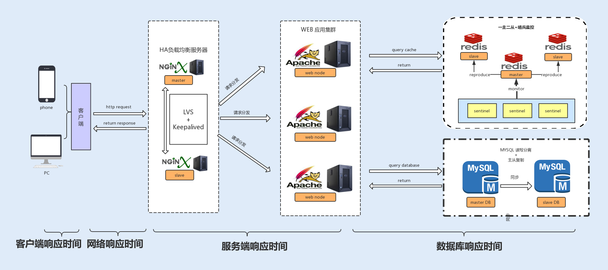

- 数据库响应时间：数据库操作所消耗的时间，往往是整个请求链中最耗时的；
- 服务端响应时间：服务端包括 Nginx 分发的请求所消耗的时间以及服务端程序执行所消耗的时间；
- 网络响应时间：这是网络传输时，网络硬件需要对传输的请求进行解析等操作所消耗的时间；
- 客户端响应时间：对于普通的 Web、App 客户端来说，消耗时间是可以忽略不计的，但如果你的客户端嵌入了大量的逻辑处理，消耗的时间就有可能变长，从而成为系统的瓶颈。

### 1.1.4.2 吞吐量

在测试中，我们往往会比较注重系统接口的 TPS（每秒事务处理量），因为 TPS 体现了接口的性能，TPS 越大，性能越好。在系统中，我们也可以把吞吐量自下而上地分为两种：磁盘吞吐量和网络吞吐量。

我们先来看磁盘吞吐量，磁盘性能有两个关键衡量指标。

- 一种是 IOPS（Input/Output Per Second），即每秒的输入输出量（或读写次数），这种是指单位时间内系统能处理的 I/O 请求数量，I/O 请求通常为读或写数据操作请求，关注的是随机读写性能。适应于随机读写频繁的应用，如小文件存储（图片）、OLTP 数据库、邮件服务器。
- 另一种是数据吞吐量，这种是指单位时间内可以成功传输的数据量。对于大量顺序读写频繁的应用，传输大量连续数据，例如，电视台的视频编辑、视频点播 VOD（Video On Demand），数据吞吐量则是关键衡量指标。

接下来看网络吞吐量，这个是指网络传输时没有帧丢失的情况下，设备能够接受的最大数据速率。网络吞吐量不仅仅跟带宽有关系，还跟 CPU 的处理能力、网卡、防火墙、外部接口以及 I/O 等紧密关联。而吞吐量的大小主要由网卡的处理能力、内部程序算法以及带宽大小决定。

### 1.1.4.3 计算机资源分配使用率

通常由 CPU 占用率、内存使用率、磁盘 I/O、网络 I/O 来表示资源使用率。这几个参数好比一个木桶，如果其中任何一块木板出现短板，任何一项分配不合理，对整个系统性能的影响都是毁灭性的。

### 1.1.4.4 负载承受能力

当系统压力上升时，你可以观察，系统响应时间的上升曲线是否平缓。这项指标能直观地反馈给你，系统所能承受的负载压力极限。例如，当你对系统进行压测时，系统的响应时间会随着系统并发数的增加而延长，直到系统无法处理这么多请求，抛出大量错误时，就到了极限。

---

## 1.1.5 总结

通过今天的学习，我们知道性能调优可以使系统稳定，用户体验更佳，甚至在比较大的系统中，还能帮公司节约资源。但是在项目的开始阶段，我们没有必要过早地介入性能优化，只需在编码的时候保证其优秀、高效，以及良好的程序设计。

在完成项目后，我们就可以进行系统测试了，我们可以将以下性能指标，作为性能调优的标准，响应时间、吞吐量、计算机资源分配使用率、负载承受能力。

回顾我自己的项目经验，有电商系统、支付系统以及游戏充值计费系统，用户级都是千万级别，且要承受各种大型抢购活动，所以我对系统的性能要求非常苛刻。除了通过观察以上指标来确定系统性能的好坏，还需要在更新迭代中，充分保障系统的稳定性。

这里，给你延伸一个方法，就是将迭代之前版本的系统性能指标作为参考标准，通过自动化性能测试，校验迭代发版之后的系统性能是否出现异常，这里就不仅仅是比较吞吐量、响应时间、负载能力等直接指标了，还需要比较系统资源的 CPU 占用率、内存使用率、磁盘 I/O、网络 I/O 等几项间接指标的变化。

---

## 1.2 如何制定性能调优策略？

> 面对日渐复杂的系统，制定合理的性能测试，可以提前发现性能瓶颈，然后有针对性地制定调优策略。总结一下就是“测试-分析-调优”三步走。

### 1.2.1 性能测试攻略

性能测试是提前发现性能瓶颈，保障系统性能稳定的必要措施。下面我先给你介绍两种常用的测试方法，帮助你从点到面地测试系统性能。

**1.微基准性能测试**
微基准性能测试可以精准定位到某个模块或者某个方法的性能问题，特别适合做一个功能模块或者一个方法在不同实现方式下的性能对比。例如，对比一个方法使用同步实现和非同步实现的性能。

**2.宏基准性能测试**
宏基准性能测试是一个综合测试，需要考虑到测试环境、测试场景和测试目标。

- 首先看测试环境，我们需要模拟线上的真实环境。
- 然后看测试场景。我们需要确定在测试某个接口时，是否有其他业务接口同时也在平行运行，造成干扰。如果有，请重视，因为你一旦忽视了这种干扰，测试结果就会出现偏差。
- 最后看测试目标。我们的性能测试是要有目标的，这里可以通过吞吐量以及响应时间来衡量系统是否达标。不达标，就进行优化；达标，就继续加大测试的并发数，探底接口的 TPS（最大每秒事务处理量），这样做，可以深入了解到接口的性能。除了测试接口的吞吐量和响应时间以外，我们还需要循环测试可能导致性能问题的接口，观察各个服务器的 CPU、内存以及 I/O 使用率的变化。

以上就是两种测试方法的详解。其中值得注意的是，性能测试存在干扰因子，会使测试结果不准确。所以，我们在做性能测试时，还要注意一些问题。

---

### 1.2.2 常见问题

**1.热身问题**
当我们做性能测试时，我们的系统会运行得越来越快，后面的访问速度要比我们第一次访问的速度快上几倍。这是怎么回事呢？在 Java 编程语言和环境中，.java 文件编译成为 .class 文件后，机器还是无法直接运行 .class 文件中的字节码，需要通过解释器将字节码转换成本地机器码才能运行。为了节约内存和执行效率，代码最初被执行时，解释器会率先解释执行这段代码。

随着代码被执行的次数增多，当虚拟机发现某个方法或代码块运行得特别频繁时，就会把这些代码认定为热点代码（Hot Spot Code）。为了提高热点代码的执行效率，在运行时，虚拟机将会通过即时编译器（JIT compiler，just-in-time compiler）把这些代码编译成与本地平台相关的机器码，并进行各层次的优化，然后存储在内存中，之后每次运行代码时，直接从内存中获取即可。

所以在刚开始运行的阶段，虚拟机会花费很长的时间来全面优化代码，后面就能以最高性能执行了。

这就是热身过程，如果在进行性能测试时，热身时间过长，就会导致第一次访问速度过慢，你就可以考虑先优化，再进行测试。

**2.性能测试结果不稳定**
我们在做性能测试时发现，每次测试处理的数据集都是一样的，但测试结果却有差异。这是因为测试时，伴随着很多不稳定因素，比如机器其他进程的影响、网络波动以及每个阶段 JVM 垃圾回收的不同等等。

我们可以通过多次测试，将测试结果求平均，或者统计一个曲线图，只要保证我们的平均值是在合理范围之内，而且波动不是很大，这种情况下，性能测试就是通过的。

**3.多JVM情况下的影响**
如果我们的服务器有多个 Java 应用服务，部署在不同的 Tomcat 下，这就意味着我们的服务器会有多个 JVM。任意一个 JVM 都拥有整个系统的资源使用权。如果一台机器上只部署单独的一个 JVM，在做性能测试时，测试结果很好，或者你调优的效果很好，但在一台机器多个 JVM 的情况下就不一定了。所以我们应该尽量避免线上环境中一台机器部署多个 JVM 的情况。

---

### 1.2.3 合理分析结果，制定调优策略

这里我将“三步走”中的分析和调优结合在一起讲。

我们在完成性能测试之后，需要输出一份性能测试报告，帮我们分析系统性能测试的情况。其中测试结果需要包含测试接口的平均、最大和最小吞吐量，响应时间，服务器的 CPU、内存、I/O、网络 IO 使用率，JVM 的 GC 频率等。

通过观察这些调优标准，可以发现性能瓶颈，我们再通过自下而上的方式分析查找问题。首先从操作系统层面，查看系统的 CPU、内存、I/O、网络的使用率是否存在异常，再通过命令查找异常日志，最后通过分析日志，找到导致瓶颈的原因；还可以从 Java 应用的 JVM 层面，查看 JVM 的垃圾回收频率以及内存分配情况是否存在异常，分析日志，找到导致瓶颈的原因。如果系统和 JVM 层面都没有出现异常情况，我们可以查看应用服务业务层是否存在性能瓶颈，例如 Java 编程的问题、读写数据瓶颈等等。

分析查找问题是一个复杂而又细致的过程，某个性能问题可能是一个原因导致的，也可能是几个原因共同导致的结果。我们分析查找问题可以采用自下而上的方式，而我们解决系统性能问题，则可以采用自上而下的方式逐级优化。下面我来介绍下从应用层到操作系统层的几种调优策略。

**1.优化代码**
应用层的问题代码往往会因为耗尽系统资源而暴露出来。例如，我们某段代码导致内存溢出，往往是将 JVM 中的内存用完了，这个时候系统的内存资源消耗殆尽了，同时也会引发 JVM 频繁地发生垃圾回收，导致 CPU 100% 以上居高不下，这个时候又消耗了系统的 CPU 资源。

还有一些是非问题代码导致的性能问题，这种往往是比较难发现的，需要依靠我们的经验来优化。例如，我们经常使用的 LinkedList 集合，如果使用 for 循环遍历该容器，将大大降低读的效率，但这种效率的降低很难导致系统性能参数异常。这时有经验的同学，就会改用 Iterator （迭代器）迭代循环该集合，这是因为 LinkedList 是链表实现的，如果使用 for 循环获取元素，在每次循环获取元素时，都会去遍历一次 List，这样会降低读的效率。

**2.优化设计**
面向对象有很多设计模式，可以帮助我们优化业务层以及中间件层的代码设计。优化后，不仅可以精简代码，还能提高整体性能。例如，单例模式在频繁调用创建对象的场景中，可以共享一个创建对象，这样可以减少频繁地创建和销毁对象所带来的性能消耗。

**3.优化算法**
好的算法可以帮助我们大大地提升系统性能。例如，在不同的场景中，使用合适的查找算法可以降低时间复杂度。

**4.时间换空间**
有时候系统对查询时的速度并没有很高的要求，反而对存储空间要求苛刻，这个时候我们可以考虑用时间来换取空间。例如，我在 03 讲就会详解的用 String 对象的 intern 方法，可以将重复率比较高的数据集存储在常量池，重复使用一个相同的对象，这样可以大大节省内存存储空间。但由于常量池使用的是HashMap数据结构类型，如果我们存储数据过多，查询的性能就会下降。所以在这种对存储容量要求比较苛刻，而对查询速度不作要求的场景，我们就可以考虑用时间换空间。

**5.空间换时间**
这种方法是使用存储空间来提升访问速度。现在很多系统都是使用的 MySQL 数据库，较为常见的分表分库是典型的使用空间换时间的案例。因为 MySQL 单表在存储千万数据以上时，读写性能会明显下降，这个时候我们需要将表数据通过某个字段 Hash 值或者其他方式分拆，系统查询数据时，会根据条件的 Hash 值判断找到对应的表，因为表数据量减小了，查询性能也就提升了。

**6.参数调优**
以上都是业务层代码的优化，除此之外，JVM、Web 容器以及操作系统的优化也是非常关键的。根据自己的业务场景，合理地设置 JVM 的内存空间以及垃圾回收算法可以提升系统性能。例如，如果我们业务中会创建大量的大对象，我们可以通过设置，将这些大对象直接放进老年代。这样可以减少年轻代频繁发生小的垃圾回收（Minor GC），减少 CPU 占用时间，提升系统性能。Web 容器线程池的设置以及 Linux 操作系统的内核参数设置不合理也有可能导致系统性能瓶颈，根据自己的业务场景优化这两部分，可以提升系统性能。

---

### 1.2.4 兜底策略，确保系统稳定性

上边讲到的所有的性能调优策略，都是提高系统性能的手段，但在互联网飞速发展的时代，产品的用户量是瞬息万变的，无论我们的系统优化得有多好，还是会存在承受极限，所以为了保证系统的稳定性，我们还需要采用一些兜底策略。什么是兜底策略？

第一，限流，对系统的入口设置最大访问限制。这里可以参考性能测试中探底接口的 TPS 。同时采取熔断措施，友好地返回没有成功的请求。

第二，实现智能化横向扩容。智能化横向扩容可以保证当访问量超过某一个阈值时，系统可以根据需求自动横向新增服务。

第三，提前扩容。这种方法通常应用于高并发系统，例如，瞬时抢购业务系统。这是因为横向扩容无法满足大量发生在瞬间的请求，即使成功了，抢购也结束了。

目前很多公司使用 Docker 容器来部署应用服务。这是因为 Docker 容器是使用 Kubernetes 作为容器管理系统，而 Kubernetes 可以实现智能化横向扩容和提前扩容 Docker 服务。

---

### 1.2.5 总结

学完这讲，你应该对性能测试以及性能调优有所认识了。我们再通过一张图来回顾下今天的内容。


我们将性能测试分为微基准性能测试和宏基准性能测试，前者可以精准地调优小单元的业务功能，后者可以结合内外因素，综合模拟线上环境来测试系统性能。两种方法结合，可以更立体地测试系统性能。

测试结果可以帮助我们制定性能调优策略，调优方法很多，这里就不一一赘述了。但有一个共同点就是，调优策略千变万化，但思路和核心都是一样的，都是从业务调优到编程调优，再到系统调优。

最后，给你提个醒，任何调优都需要结合场景明确已知问题和性能目标，不能为了调优而调优，以免引入新的Bug，带来风险和弊端。

---

### 1.2.5 思考题

假设你现在负责一个电商系统，马上就有新品上线了，还要有抢购活动，那么你会将哪些功能做微基准性能测试，哪些功能做宏基准性能测试呢？

# 二、Java 编程性能调优

## 2.1 字符串性能优化不容小觑，百M内存轻松存储几十G数据

今天我们就从最基础的String字符串优化讲起。String对象是我们使用最频繁的一个对象类型，但它的性能问题却是最容易被忽略的。String对象作为Java语言中重要的数据类型，是内存中占据空间最大的一个对象。高效地使用字符串，可以提升系统的整体性能。接下来我们就从String对象的实现、特性以及实际使用中的优化这三个方面入手，深入了解。

在开始之前，我想先问你一个小问题，也是我在招聘时，经常会问到面试者的一道题。虽是老生常谈了，但错误率依然很高，当然也有一些面试者答对了，但能解释清楚答案背后原理的人少之又少。问题如下：

通过三种不同的方式创建了三个对象，再依次两两匹配，每组被匹配的两个对象是否相等？代码如下：

```
String str1= "abc";
String str2= new String("abc");
String str3= str2.intern();
assertSame(str1==str2);
assertSame(str2==str3);
assertSame(str1==str3)
```

### 2.1.1 String对象是如何实现的？

在Java语言中，Sun公司的工程师们对String对象做了大量的优化，来节约内存空间，提升String对象在系统中的性能。一起来看看优化过程，如下图所示：
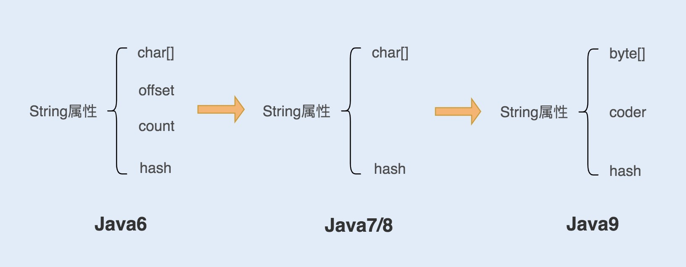

1. 在Java6以及之前的版本中，String对象是对char数组进行了封装实现的对象，主要有四个成员变量：char数组、偏移量offset、字符数量count、哈希值hash。String对象是通过offset和count两个属性来定位char[]数组，获取字符串。这么做可以高效、快速地共享数组对象，同时节省内存空间，但这种方式很有可能会导致内存泄漏。
2. 从Java7版本开始到Java8版本，Java对String类做了一些改变。String类中不再有offset和count两个变量了。这样的好处是String对象占用的内存稍微少了些，同时，String.substring方法也不再共享char[]，从而解决了使用该方法可能导致的内存泄漏问题。
3. 从Java9版本开始，工程师将char[]字段改为了byte[]字段，又维护了一个新的属性coder，它是一个编码格式的标识。工程师为什么这样修改呢？我们知道一个char字符占16位，2个字节。这个情况下，存储单字节编码内的字符（占一个字节的字符）就显得非常浪费。JDK1.9的String类为了节约内存空间，于是使用了占8位，1个字节的byte数组来存放字符串。而新属性coder的作用是，在计算字符串长度或者使用indexOf（）函数时，我们需要根据这个字段，判断如何计算字符串长度。coder属性默认有0和1两个值，0代表Latin-1（单字节编码），1代表UTF-16。如果String判断字符串只包含了Latin-1，则coder属性值为0，反之则为1。

---

### 2.1.2 String对象的不可变性

了解了String对象的实现后，你有没有发现在实现代码中String类被final关键字修饰了，而且变量char数组也被final修饰了。我们知道类被final修饰代表该类不可继承，而char[]被final+private修饰，代表了String对象不可被更改。Java实现的这个特性叫作String对象的不可变性，即String对象一旦创建成功，就不能再对它进行改变。

#### Java这样做的好处在哪里呢？

第一，保证String对象的安全性。假设String对象是可变的，那么String对象将可能被恶意修改。

第二，保证hash属性值不会频繁变更，确保了唯一性，使得类似HashMap容器才能实现相应的key-value缓存功能。

第三，可以实现字符串常量池。在Java中，通常有两种创建字符串对象的方式，一种是通过字符串常量的方式创建，如String str=“abc”；另一种是字符串变量通过new形式的创建，如String str = new String(“abc”)。

当代码中使用第一种方式创建字符串对象时，JVM首先会检查该对象是否在字符串常量池中，如果在，就返回该对象引用，否则新的字符串将在常量池中被创建。这种方式可以减少同一个值的字符串对象的重复创建，节约内存。

String str = new String(“abc”)这种方式，首先在编译类文件时，"abc"常量字符串将会放入到常量结构中，在类加载时，“abc"将会在常量池中创建；其次，在调用new时，JVM命令将会调用String的构造函数，同时引用常量池中的"abc” 字符串，在堆内存中创建一个String对象；最后，str将引用String对象。

**这里附上一个你可能会想到的经典反例。**

平常编程时，对一个String对象str赋值“hello”，然后又让str值为“world”，这个时候str的值变成了“world”。那么str值确实改变了，为什么我还说String对象不可变呢？

首先，我来解释下什么是对象和对象引用。Java初学者往往对此存在误区，特别是一些从PHP转Java的同学。在Java中要比较两个对象是否相等，往往是用==，而要判断两个对象的值是否相等，则需要用equals方法来判断。这是因为str只是String对象的引用，并不是对象本身。对象在内存中是一块内存地址，str则是一个指向该内存地址的引用。所以在刚刚我们说的这个例子中，第一次赋值的时候，创建了一个“hello”对象，str引用指向“hello”地址；第二次赋值的时候，又重新创建了一个对象“world”，str引用指向了“world”，但“hello”对象依然存在于内存中。也就是说str并不是对象，而只是一个对象引用。真正的对象依然还在内存中，没有被改变。

### 2.1.3 String对象的优化

了解了String对象的实现原理和特性，接下来我们就结合实际场景，看看如何优化String对象的使用，优化的过程中又有哪些需要注意的地方。

#### 1. 如何构建超大字符串？

编程过程中，字符串的拼接很常见。前面我讲过String对象是不可变的，如果我们使用String对象相加，拼接我们想要的字符串，是不是就会产生多个对象呢？例如以下代码：

```
String str= "ab" + "cd" + "ef";
```

分析代码可知：首先会生成ab对象，再生成abcd对象，最后生成abcdef对象，从理论上来说，这段代码是低效的。但实际运行中，我们发现只有一个对象生成，这是为什么呢？难道我们的理论判断错了？我们再来看编译后的代码，你会发现编译器自动优化了这行代码，如下：

```
String str= "abcdef";
```

上面我介绍的是字符串常量的累计，我们再来看看字符串变量的累计又是怎样的呢？

```
String str = "abcdef";

for(int i=0; i<1000; i++) {
      str = str + i;
}
```

上面的代码编译后，你可以看到编译器同样对这段代码进行了优化。不难发现，Java在进行字符串的拼接时，偏向使用StringBuilder，这样可以提高程序的效率。

```
String str = "abcdef";

for(int i=0; i<1000; i++) {
              str = (new StringBuilder(String.valueOf(str))).append(i).toString();
}
```

综上已知：即使使用+号作为字符串的拼接，也一样可以被编译器优化成StringBuilder的方式。但再细致些，你会发现在编译器优化的代码中，每次循环都会生成一个新的StringBuilder实例，同样也会降低系统的性能。所以平时做字符串拼接的时候，我建议你还是要显示地使用String Builder来提升系统性能。

如果在多线程编程中，String对象的拼接涉及到线程安全，你可以使用StringBuffer。但是要注意，由于StringBuffer是线程安全的，涉及到锁竞争，所以从性能上来说，要比StringBuilder差一些。

#### 2. 如何使用String.intern节省内存？

讲完了构建字符串，我们再来讨论下String对象的存储问题。先看一个案例。Twitter每次发布消息状态的时候，都会产生一个地址信息，以当时Twitter用户的规模预估，服务器需要32G的内存来存储地址信息。

```
public class Location {
    private String city;
    private String region;
    private String countryCode;
    private double longitude;
    private double latitude;
}
```

考虑到其中有很多用户在地址信息上是有重合的，比如，国家、省份、城市等，这时就可以将这部分信息单独列出一个类，以减少重复，代码如下：

```
public class SharedLocation {

	private String city;
	private String region;
	private String countryCode;
}

public class Location {

	private SharedLocation sharedLocation;
	double longitude;
	double latitude;
}
```

通过优化，数据存储大小减到了20G左右。但对于内存存储这个数据来说，依然很大，怎么办呢？这个案例来自一位Twitter工程师在QCon全球软件开发大会上的演讲，他们想到的解决方法，就是使用String.intern来节省内存空间，从而优化String对象的存储。

具体做法就是，在每次赋值的时候使用String的intern方法，如果常量池中有相同值，就会重复使用该对象，返回对象引用，这样一开始的对象就可以被回收掉。这种方式可以使重复性非常高的地址信息存储大小从20G降到几百兆。

```
SharedLocation sharedLocation = new SharedLocation();

sharedLocation.setCity(messageInfo.getCity().intern());		sharedLocation.setCountryCode(messageInfo.getRegion().intern());
sharedLocation.setRegion(messageInfo.getCountryCode().intern());

Location location = new Location();
location.set(sharedLocation);
location.set(messageInfo.getLongitude());
location.set(messageInfo.getLatitude());
```

为了更好地理解，我们再来通过一个简单的例子，回顾下其中的原理：

```
String a =new String("abc").intern();
String b = new String("abc").intern();
  
if(a==b) {
    System.out.print("a==b");
}

输出结果：

a==b
```

在字符串常量中，默认会将对象放入常量池；在字符串变量中，对象是会创建在堆内存中，同时也会在常量池中创建一个字符串对象，String对象中的char数组将会引用常量池中的char数组，并返回堆内存对象引用。

如果调用intern方法，会去查看字符串常量池中是否有等于该对象的字符串的引用，如果没有，在JDK1.6版本中会复制堆中的字符串到常量池中，并返回该字符串引用，堆内存中原有的字符串由于没有引用指向它，将会通过垃圾回收器回收。

在JDK1.7版本以后，由于常量池已经合并到了堆中，所以不会再复制具体字符串了，只是会把首次遇到的字符串的引用添加到常量池中；如果有，就返回常量池中的字符串引用。
以一张图来总结String字符串的创建分配内存地址情况：
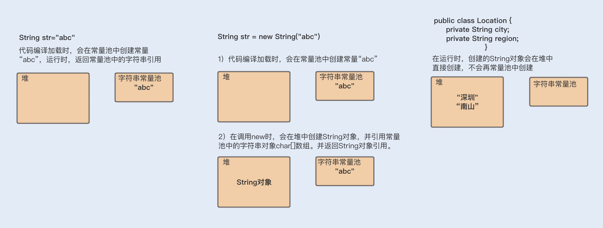

使用intern方法需要注意的一点是，一定要结合实际场景。因为常量池的实现是类似于一个HashTable的实现方式，HashTable存储的数据越大，遍历的时间复杂度就会增加。如果数据过大，会增加整个字符串常量池的负担。

#### 3.如何使用字符串的分割方法？

最后我想跟你聊聊字符串的分割，这种方法在编码中也很最常见。Split()方法使用了正则表达式实现了其强大的分割功能，而正则表达式的性能是非常不稳定的，使用不恰当会引起回溯问题，很可能导致CPU居高不下。

所以我们应该慎重使用Split()方法，我们可以用String.indexOf()方法代替Split()方法完成字符串的分割。如果实在无法满足需求，你就在使用Split()方法时，对回溯问题加以重视就可以了。

---

### 2.1.4 总结

这一讲中，我们认识到做好String字符串性能优化，可以提高系统的整体性能。在这个理论基础上，Java版本在迭代中通过不断地更改成员变量，节约内存空间，对String对象进行优化。我们还特别提到了String对象的不可变性，正是这个特性实现了字符串常量池，通过减少同一个值的字符串对象的重复创建，进一步节约内存。

但也是因为这个特性，我们在做长字符串拼接时，需要显示使用StringBuilder，以提高字符串的拼接性能。最后，在优化方面，我们还可以使用intern方法，让变量字符串对象重复使用常量池中相同值的对象，进而节约内存。

最后再分享一个个人观点。那就是千里之堤，溃于蚁穴。日常编程中，我们往往可能就是对一个小小的字符串了解不够深入，使用不够恰当，从而引发线上事故。

比如，在我之前的工作经历中，就曾因为使用正则表达式对字符串进行匹配，导致并发瓶颈，这里也可以将其归纳为字符串使用的性能问题。具体实战分析，我将在04讲中为你详解。

**思考题**
通过今天的学习，你知道文章开头那道面试题的答案了吗？背后的原理是什么？

**补充**
[string的存储](https://blog.csdn.net/mkfka/article/details/108047023)

---

## 2.2 慎重使用正则表达式

上一讲，我在讲String对象优化时，提到了Split()方法，该方法使用的正则表达式可能引起回溯问题，今天我们就来深入了解下，这究竟是怎么回事？开始之前，我们先来看一个案例，可以帮助你更好地理解内容。

在一次小型项目开发中，我遇到过这样一个问题。为了宣传新品，我们开发了一个小程序，按照之前评估的访问量，这次活动预计参与用户量30W+，TPS（每秒事务处理量）最高3000左右。

这个结果来自我对接口做的微基准性能测试。我习惯使用ab工具（通过yum -y install httpd-tools可以快速安装）在另一台机器上对http请求接口进行测试。

我可以通过设置-n请求数/-c并发用户数来模拟线上的峰值请求，再通过TPS、RT（每秒响应时间）以及每秒请求时间分布情况这三个指标来衡量接口的性能，如下图所示（图中隐藏部分为我的服务器地址）：
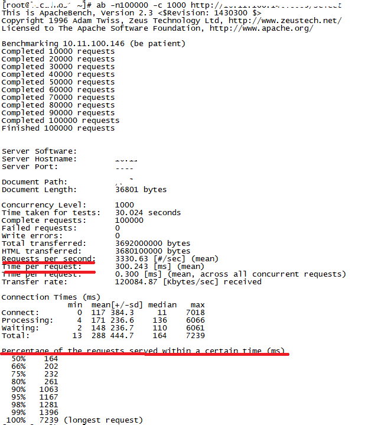
就在做性能测试的时候，我发现有一个提交接口的TPS一直上不去，按理说这个业务非常简单，存在性能瓶颈的可能性并不大。我迅速使用了排除法查找问题。首先将方法里面的业务代码全部注释，留一个空方法在这里，再看性能如何。这种方式能够很好地区分是框架性能问题，还是业务代码性能问题。

我快速定位到了是业务代码问题，就马上逐一查看代码查找原因。我将插入数据库操作代码加上之后，TPS稍微下降了，但还是没有找到原因。最后，就只剩下Split() 方法操作了，果然，我将Split()方法加入之后，TPS明显下降了。

可是一个Split()方法为什么会影响到TPS呢？下面我们就来了解下正则表达式的相关内容，学完了答案也就出来了。

### 2.2.1 什么是正则表达式？

很基础，这里带你简单回顾一下。正则表达式是计算机科学的一个概念，很多语言都实现了它。正则表达式使用一些特定的元字符来检索、匹配以及替换符合规则的字符串。构造正则表达式语法的元字符，由普通字符、标准字符、限定字符（量词）、定位字符（边界字符）组成。详情可见下图：
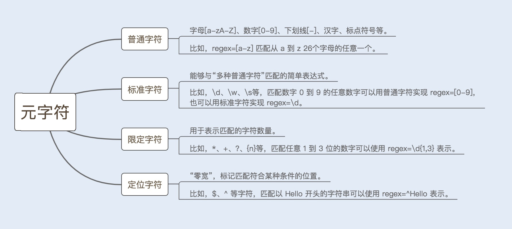

---

### 2.2.2 正则表达式引擎

正则表达式是一个用正则符号写出的公式，程序对这个公式进行语法分析，建立一个语法分析树，再根据这个分析树结合正则表达式的引擎生成执行程序（这个执行程序我们把它称作状态机，也叫状态自动机），用于字符匹配。而这里的正则表达式引擎就是一套核心算法，用于建立状态机。

目前实现正则表达式引擎的方式有两种：DFA自动机（Deterministic Final Automaton 确定有限状态自动机）和NFA自动机（Non deterministic Finite Automaton 非确定有限状态自动机）。对比来看，构造DFA自动机的代价远大于NFA自动机，但DFA自动机的执行效率高于NFA自动机。

假设一个字符串的长度是n，如果用DFA自动机作为正则表达式引擎，则匹配的时间复杂度为O(n)；如果用NFA自动机作为正则表达式引擎，由于NFA自动机在匹配过程中存在大量的分支和回溯，假设NFA的状态数为s，则该匹配算法的时间复杂度为O（ns）。

NFA自动机的优势是支持更多功能。例如，捕获group、环视、占有优先量词等高级功能。这些功能都是基于子表达式独立进行匹配，因此在编程语言里，使用的正则表达式库都是基于NFA实现的。那么NFA自动机到底是怎么进行匹配的呢？我以下面的字符和表达式来举例说明。

```
text=“aabcab”
regex=“bc”
```

NFA自动机会读取正则表达式的每一个字符，拿去和目标字符串匹配，匹配成功就换正则表达式的下一个字符，反之就继续和目标字符串的下一个字符进行匹配。分解一下过程。

首先，读取正则表达式的第一个匹配符和字符串的第一个字符进行比较，b对a，不匹配；继续换字符串的下一个字符，也是a，不匹配；继续换下一个，是b，匹配。然后，同理，读取正则表达式的第二个匹配符和字符串的第四个字符进行比较，c对c，匹配；继续读取正则表达式的下一个字符，然而后面已经没有可匹配的字符了，结束。这就是NFA自动机的匹配过程，虽然在实际应用中，碰到的正则表达式都要比这复杂，但匹配方法是一样的。

---

### 2.2.3 NFA自动机的回溯

用NFA自动机实现的比较复杂的正则表达式，在匹配过程中经常会引起回溯问题。大量的回溯会长时间地占用CPU，从而带来系统性能开销。我来举例说明。

```
text=“abbc”
regex=“ab{1,3}c”
```

这个例子，匹配目的比较简单。匹配以a开头，以c结尾，中间有1-3个b字符的字符串。NFA自动机对其解析的过程是这样的：

首先，读取正则表达式第一个匹配符a和字符串第一个字符a进行比较，a对a，匹配。

然后，读取正则表达式第二个匹配符b{1,3} 和字符串的第二个字符b进行比较，匹配。但因为 b{1,3} 表示1-3个b字符串，NFA自动机又具有贪婪特性，所以此时不会继续读取正则表达式的下一个匹配符，而是依旧使用 b{1,3} 和字符串的第三个字符b进行比较，结果还是匹配。

那么发生回溯以后，匹配过程怎么继续呢？程序会读取正则表达式的下一个匹配符c，和字符串中的第四个字符c进行比较，结果匹配，结束。

---

### 2.2.4 如何减少回溯问题？

既然回溯会给系统带来性能开销，那我们如何应对呢？如果你有仔细看上面那个案例的话，你会发现NFA自动机的贪婪特性就是导火索，这和正则表达式的匹配模式息息相关，一起来了解一下。

#### 1.贪婪模式（Greedy）

顾名思义，就是在数量匹配中，如果单独使用+、 ? 、* 或{min,max} 等量词，正则表达式会匹配尽可能多的内容。例如，上边那个例子：

```
text=“abbc”
regex=“ab{1,3}c”
```

就是在贪婪模式下，NFA自动机读取了最大的匹配范围，即匹配3个b字符。匹配发生了一次失败，就引起了一次回溯。如果匹配结果是“abbbc”，就会匹配成功。

```
text=“abbbc”
regex=“ab{1,3}c”
```

#### 2.懒惰模式（Reluctant）

在该模式下，正则表达式会尽可能少地重复匹配字符。如果匹配成功，它会继续匹配剩余的字符串。例如，在上面例子的字符后面加一个“？”，就可以开启懒惰模式。

```
text=“abc”
regex=“ab{1,3}?c”
```

匹配结果是“abc”，该模式下NFA自动机首先选择最小的匹配范围，即匹配1个b字符，因此就避免了回溯问题。懒惰模式是无法完全避免回溯的，我们再通过一个例子来了解下懒惰模式在什么情况下会发生回溯问题。

```
text=“abbc”
regex=“ab{1,3}?c”
```

以上匹配结果依然是成功的，这又是为什么呢？我们可以通过懒惰模式的匹配过程来了解下原因。

首先，读取正则表达式第一个匹配符a和字符串第一个字符a进行比较，a对a，匹配。然后，读取正则表达式第二个匹配符 b{1,3} 和字符串的第二个字符b进行比较，匹配。

其次，由于懒惰模式下，正则表达式会尽可能少地重复匹配字符，匹配字符串中的下一个匹配字符b不会继续与b{1,3}进行匹配，从而选择放弃最大匹配b字符，转而匹配正则表达式中的下一个字符c。

此时你会发现匹配字符c与正则表达式中的字符c是不匹配的，这个时候会发生一次回溯，这次的回溯与贪婪模式中的回溯刚好相反，懒惰模式的回溯是回溯正则表达式中一个匹配字符，与上一个字符再进行匹配。如果匹配，则将匹配字符串的下一个字符和正则表达式的下一个字符。

#### 3.独占模式（Possessive）

同贪婪模式一样，独占模式一样会最大限度地匹配更多内容；不同的是，在独占模式下，匹配失败就会结束匹配，不会发生回溯问题。还是上边的例子，在字符后面加一个“+”，就可以开启独占模式。

```
text=“abbc”
regex=“ab{1,3}+bc”
```

结果是不匹配，结束匹配，不会发生回溯问题。同样，独占模式也不能避免回溯的发生，我们再拿最开始的这个例子来分析下：

```
text=“abbc”
regex=“ab{1,3}+c”
```

结果是匹配的，这是因为与贪婪模式一样，独占模式一样会最大限度地匹配更多内容，即匹配完所有的b之后，再去匹配c，则匹配成功了。讲到这里，你应该非常清楚了，在很多情况下使用懒惰模式和独占模式可以减少回溯的发生。还有开头那道“一个split()方法为什么会影响到TPS”的存疑，你应该也清楚了吧？我使用了split()方法提取域名，并检查请求参数是否符合规定。split()在匹配分组时遇到特殊字符产生了大量回溯，我当时是在正则表达式后加了一个需要匹配的字符和“+”，解决了这个问题。

```
\\?(([A-Za-z0-9-~_=%]++\\&{0,1})+)
```

### 2.2.5 正则表达式的优化

正则表达式带来的性能问题，给我敲了个警钟，在这里我也希望分享给你一些心得。任何一个细节问题，都有可能导致性能问题，而这背后折射出来的是我们对这项技术的了解不够透彻。所以我鼓励你学习性能调优，要掌握方法论，学会透过现象看本质。下面我就总结几种正则表达式的优化方法给你。

#### 1.少用贪婪模式，多用独占模式

贪婪模式会引起回溯问题，我们可以使用独占模式来避免回溯。前面详解过了，这里我就不再解释了。

#### 2.减少分支选择

分支选择类型“(X|Y|Z)”的正则表达式会降低性能，我们在开发的时候要尽量减少使用。如果一定要用，我们可以通过以下几种方式来优化：

首先，我们需要考虑选择的顺序，将比较常用的选择项放在前面，使它们可以较快地被匹配；

其次，我们可以尝试提取共用模式，例如，将“(abcd|abef)”替换为“ab(cd|ef)”，后者匹配速度较快，因为NFA自动机会尝试匹配ab，如果没有找到，就不会再尝试任何选项；

最后，如果是简单的分支选择类型，我们可以用三次index代替“(X|Y|Z)”，如果测试的话，你就会发现三次index的效率要比“(X|Y|Z)”高出一些。

#### 3.减少捕获嵌套

在讲这个方法之前，我先简单介绍下什么是捕获组和非捕获组。捕获组是指把正则表达式中，子表达式匹配的内容保存到以数字编号或显式命名的数组中，方便后面引用。一般一个()就是一个捕获组，捕获组可以进行嵌套。非捕获组则是指参与匹配却不进行分组编号的捕获组，其表达式一般由（?:exp）组成。

在正则表达式中，每个捕获组都有一个编号，编号0代表整个匹配到的内容。我们可以看下面的例子：

```
public static void main( String[] args )
{
    String text = "<input high=\"20\" weight=\"70\">test</input>";
    String reg="(<input.*?>)(.*?)(</input>)";
    Pattern p = Pattern.compile(reg);
    Matcher m = p.matcher(text);
    while(m.find()) {
    System.out.println(m.group(0));//整个匹配到的内容
    System.out.println(m.group(1));//(<input.*?>)
    System.out.println(m.group(2));//(.*?)
    System.out.println(m.group(3));//(</input>)
    }
}
```

运行结果：

```
<input high=\"20\" weight=\"70\">test</input>
<input high=\"20\" weight=\"70\">
test
</input>
```

如果你并不需要获取某一个分组内的文本，那么就使用非捕获分组。例如，使用“(?:X)”代替“(X)”，我们再看下面的例子：

```
public static void main( String[] args )
{
    String text = "<input high=\"20\" weight=\"70\">test</input>";
    String reg="(?:<input.*?>)(.*?)(?:</input>)";
    Pattern p = Pattern.compile(reg);
    Matcher m = p.matcher(text);
    while(m.find()) {
    System.out.println(m.group(0));//整个匹配到的内容
    System.out.println(m.group(1));//(.*?)
    }
}
```

运行结果：

```
<input high=\"20\" weight=\"70\">test</input>
test
```

综上可知：减少不需要获取的分组，可以提高正则表达式的性能。

---

### 2.2.6 总结

正则表达式虽然小，却有着强大的匹配功能。我们经常用到它，比如，注册页面手机号或邮箱的校验。但很多时候，我们又会因为它小而忽略它的使用规则，测试用例中又没有覆盖到一些特殊用例，不乏上线就中招的情况发生。

综合我以往的经验来看，如果使用正则表达式能使你的代码简洁方便，那么在做好性能排查的前提下，可以去使用；如果不能，那么正则表达式能不用就不用，以此避免造成更多的性能问题。

**思考题**
除了Split()方法使用到正则表达式，其实Java还有一些方法也使用了正则表达式去实现一些功能，使我们很容易掉入陷阱。现在就请你想一想JDK里面，还有哪些工具方法用到了正则表达式？

1. 排查性能热点不至于用注释大法，可以用arthas的trace
2. 字符串默认的split方法是接受正则的，如果简单的split功能可以使用stringutils的split，这个是不用正则的，还能顺便避免npe了
3. 啥业务场景连个小小的split都成性能热点了，瑟瑟发抖

---

## 2.3  ArrayList还是LinkedList? 使用不当性能差千倍

集合作为一种存储数据的容器，是我们日常开发中使用最频繁的对象类型之一。JDK为开发者提供了一系列的集合类型，这些集合类型使用不同的数据结构来实现。因此，不同的集合类型，使用场景也不同。很多同学在面试的时候，经常会被问到集合的相关问题，比较常见的有ArrayList和LinkedList的区别。相信大部分同学都能回答上：“ArrayList是基于数组实现，LinkedList是基于链表实现。”

而在回答使用场景的时候，我发现大部分同学的答案是：“ArrayList和LinkedList在新增、删除元素时，LinkedList的效率要高于 ArrayList，而在遍历的时候，ArrayList的效率要高于LinkedList。”这个回答是否准确呢？今天这一讲就带你验证。

### 2.3.1 初识List接口

在学习List集合类之前，我们先来通过这张图，看下List集合类的接口和类的实现关系：
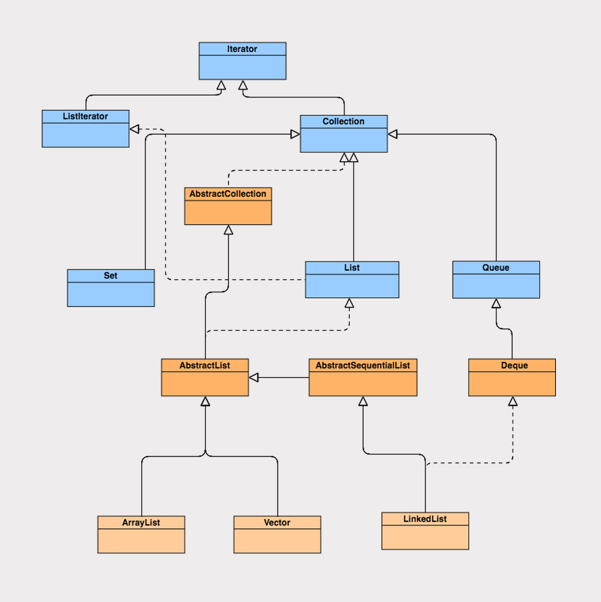

我们可以看到ArrayList、Vector、LinkedList集合类继承了AbstractList抽象类，而AbstractList实现了List接口，同时也继承了AbstractCollection抽象类。ArrayList、Vector、LinkedList又根据自我定位，分别实现了各自的功能。

ArrayList和Vector使用了数组实现，这两者的实现原理差不多，LinkedList使用了双向链表实现。基础铺垫就到这里，接下来，我们就详细地分析下ArrayList和LinkedList的源码实现。

---

### 2.3.2 ArrayList是如何实现的？

ArrayList很常用，先来几道测试题，自检下你对ArrayList的了解程度。

问题1：我们在查看ArrayList的实现类源码时，你会发现对象数组elementData使用了transient修饰，我们知道transient关键字修饰该属性，则表示该属性不会被序列化，然而我们并没有看到文档中说明ArrayList不能被序列化，这是为什么？

问题2：我们在使用ArrayList进行新增、删除时，经常被提醒“使用ArrayList做新增删除操作会影响效率”。那是不是ArrayList在大量新增元素的场景下效率就一定会变慢呢？

问题3：如果让你使用for循环以及迭代循环遍历一个ArrayList，你会使用哪种方式呢？原因是什么？

如果你对这几道测试都没有一个全面的了解，那就跟我一起从数据结构、实现原理以及源码角度重新认识下ArrayList吧。

#### 1.ArrayList实现类

ArrayList实现了List接口，继承了AbstractList抽象类，底层是数组实现的，并且实现了自增扩容数组大小。ArrayList还实现了Cloneable接口和Serializable接口，所以他可以实现克隆和序列化。

ArrayList还实现了RandomAccess接口。你可能对这个接口比较陌生，不知道具体的用处。通过代码我们可以发现，这个接口其实是一个空接口，什么也没有实现，那ArrayList为什么要去实现它呢？其实RandomAccess接口是一个标志接口，他标志着“只要实现该接口的List类，都能实现快速随机访问”。

```
public class ArrayList<E> extends AbstractList<E>
        implements List<E>, RandomAccess, Cloneable, java.io.Serializable
```

#### 2.ArrayList属性

ArrayList属性主要由数组长度size、对象数组elementData、初始化容量default_capacity等组成， 其中初始化容量默认大小为10。

```
//默认初始化容量
    private static final int DEFAULT_CAPACITY = 10;
    //对象数组
    transient Object[] elementData; 
    //数组长度
    private int size;
```

从ArrayList属性来看，它没有被任何的多线程关键字修饰，但elementData被关键字transient修饰了。这就是我在上面提到的第一道测试题：transient关键字修饰该字段则表示该属性不会被序列化，但ArrayList其实是实现了序列化接口，这到底是怎么回事呢？

这还得从“ArrayList是基于数组实现“开始说起，由于ArrayList的数组是基于动态扩增的，所以并不是所有被分配的内存空间都存储了数据。如果采用外部序列化法实现数组的序列化，会序列化整个数组。ArrayList为了避免这些没有存储数据的内存空间被序列化，内部提供了两个私有方法writeObject以及readObject来自我完成序列化与反序列化，从而在序列化与反序列化数组时节省了空间和时间。因此使用transient修饰数组，是防止对象数组被其他外部方法序列化。

#### 3.ArrayList构造函数

ArrayList类实现了三个构造函数，第一个是创建ArrayList对象时，传入一个初始化值；第二个是默认创建一个空数组对象；第三个是传入一个集合类型进行初始化。

当ArrayList新增元素时，如果所存储的元素已经超过其已有大小，它会计算元素大小后再进行动态扩容，数组的扩容会导致整个数组进行一次内存复制。因此，我们在初始化ArrayList时，可以通过第一个构造函数合理指定数组初始大小，这样有助于减少数组的扩容次数，从而提高系统性能。

```
public ArrayList(int initialCapacity) {
        //初始化容量不为零时，将根据初始化值创建数组大小
        if (initialCapacity > 0) {
            this.elementData = new Object[initialCapacity];
        } else if (initialCapacity == 0) {//初始化容量为零时，使用默认的空数组
            this.elementData = EMPTY_ELEMENTDATA;
        } else {
            throw new IllegalArgumentException("Illegal Capacity: "+
                                               initialCapacity);
        }
    }

    public ArrayList() {
        //初始化默认为空数组
        this.elementData = DEFAULTCAPACITY_EMPTY_ELEMENTDATA;
    }
```

#### 4.ArrayList新增元素

ArrayList新增元素的方法有两种，一种是直接将元素加到数组的末尾，另外一种是添加元素到任意位置。

```
public boolean add(E e) {
        ensureCapacityInternal(size + 1);  // Increments modCount!!
        elementData[size++] = e;
        return true;
    }

    public void add(int index, E element) {
        rangeCheckForAdd(index);

        ensureCapacityInternal(size + 1);  // Increments modCount!!
        System.arraycopy(elementData, index, elementData, index + 1,
                         size - index);
        elementData[index] = element;
        size++;
    }
```

两个方法的相同之处是在添加元素之前，都会先确认容量大小，如果容量够大，就不用进行扩容；如果容量不够大，就会按照原来数组的1.5倍大小进行扩容，在扩容之后需要将数组复制到新分配的内存地址。

```
private void ensureExplicitCapacity(int minCapacity) {
        modCount++;

        // overflow-conscious code
        if (minCapacity - elementData.length > 0)
            grow(minCapacity);
    }
    private static final int MAX_ARRAY_SIZE = Integer.MAX_VALUE - 8;

    private void grow(int minCapacity) {
        // overflow-conscious code
        int oldCapacity = elementData.length;
        int newCapacity = oldCapacity + (oldCapacity >> 1);
        if (newCapacity - minCapacity < 0)
            newCapacity = minCapacity;
        if (newCapacity - MAX_ARRAY_SIZE > 0)
            newCapacity = hugeCapacity(minCapacity);
        // minCapacity is usually close to size, so this is a win:
        elementData = Arrays.copyOf(elementData, newCapacity);
    }
```

当然，两个方法也有不同之处，添加元素到任意位置，会导致在该位置后的所有元素都需要重新排列，而将元素添加到数组的末尾，在没有发生扩容的前提下，是不会有元素复制排序过程的。

这里你就可以找到第二道测试题的答案了。如果我们在初始化时就比较清楚存储数据的大小，就可以在ArrayList初始化时指定数组容量大小，并且在添加元素时，只在数组末尾添加元素，那么ArrayList在大量新增元素的场景下，性能并不会变差，反而比其他List集合的性能要好。

#### 5.ArrayList删除元素

ArrayList的删除方法和添加任意位置元素的方法是有些相同的。ArrayList在每一次有效的删除元素操作之后，都要进行数组的重组，并且删除的元素位置越靠前，数组重组的开销就越大。

```
public E remove(int index) {
        rangeCheck(index);

        modCount++;
        E oldValue = elementData(index);

        int numMoved = size - index - 1;
        if (numMoved > 0)
            System.arraycopy(elementData, index+1, elementData, index,
                             numMoved);
        elementData[--size] = null; // clear to let GC do its work

        return oldValue;
    }
```

#### 6.ArrayList遍历元素

由于ArrayList是基于数组实现的，所以在获取元素的时候是非常快捷的。

```
public E get(int index) {
        rangeCheck(index);

        return elementData(index);
    }

    E elementData(int index) {
        return (E) elementData[index];
    }
```

---

### 2.3.3 LinkedList是如何实现的？

虽然LinkedList与ArrayList都是List类型的集合，但LinkedList的实现原理却和ArrayList大相径庭，使用场景也不太一样。LinkedList是基于双向链表数据结构实现的，LinkedList定义了一个Node结构，Node结构中包含了3个部分：元素内容item、前指针prev以及后指针next，代码如下。

```
private static class Node<E> {
        E item;
        Node<E> next;
        Node<E> prev;

        Node(Node<E> prev, E element, Node<E> next) {
            this.item = element;
            this.next = next;
            this.prev = prev;
        }
    }
```

总结一下，LinkedList就是由Node结构对象连接而成的一个双向链表。在JDK1.7之前，LinkedList中只包含了一个Entry结构的header属性，并在初始化的时候默认创建一个空的Entry，用来做header，前后指针指向自己，形成一个循环双向链表。

在JDK1.7之后，LinkedList做了很大的改动，对链表进行了优化。链表的Entry结构换成了Node，内部组成基本没有改变，但LinkedList里面的header属性去掉了，新增了一个Node结构的first属性和一个Node结构的last属性。这样做有以下几点好处：

- first/last属性能更清晰地表达链表的链头和链尾概念；
- first/last方式可以在初始化LinkedList的时候节省new一个Entry；
- first/last方式最重要的性能优化是链头和链尾的插入删除操作更加快捷了。
  这里同ArrayList的讲解一样，我将从数据结构、实现原理以及源码分析等几个角度带你深入了解LinkedList。

#### 1.LinkedList实现类

LinkedList类实现了List接口、Deque接口，同时继承了AbstractSequentialList抽象类，LinkedList既实现了List类型又有Queue类型的特点；LinkedList也实现了Cloneable和Serializable接口，同ArrayList一样，可以实现克隆和序列化。

由于LinkedList存储数据的内存地址是不连续的，而是通过指针来定位不连续地址，因此，LinkedList不支持随机快速访问，LinkedList也就不能实现RandomAccess接口。

```
public class LinkedList<E>
    extends AbstractSequentialList<E>
    implements List<E>, Deque<E>, Cloneable, java.io.Serializable
```

#### 2.LinkedList属性

我们前面讲到了LinkedList的两个重要属性first/last属性，其实还有一个size属性。我们可以看到这三个属性都被transient修饰了，原因很简单，我们在序列化的时候不会只对头尾进行序列化，所以LinkedList也是自行实现readObject和writeObject进行序列化与反序列化。

```
transient int size = 0;
    transient Node<E> first;
    transient Node<E> last;
```

#### 3.LinkedList新增元素

LinkedList添加元素的实现很简洁，但添加的方式却有很多种。默认的add (Ee)方法是将添加的元素加到队尾，首先是将last元素置换到临时变量中，生成一个新的Node节点对象，然后将last引用指向新节点对象，之前的last对象的前指针指向新节点对象。

```
public boolean add(E e) {
        linkLast(e);
        return true;
    }

    void linkLast(E e) {
        final Node<E> l = last;
        final Node<E> newNode = new Node<>(l, e, null);
        last = newNode;
        if (l == null)
            first = newNode;
        else
            l.next = newNode;
        size++;
        modCount++;
    }
```

LinkedList也有添加元素到任意位置的方法，如果我们是将元素添加到任意两个元素的中间位置，添加元素操作只会改变前后元素的前后指针，指针将会指向添加的新元素，所以相比ArrayList的添加操作来说，LinkedList的性能优势明显。

```
public void add(int index, E element) {
        checkPositionIndex(index);

        if (index == size)
            linkLast(element);
        else
            linkBefore(element, node(index));
    }

    void linkBefore(E e, Node<E> succ) {
        // assert succ != null;
        final Node<E> pred = succ.prev;
        final Node<E> newNode = new Node<>(pred, e, succ);
        succ.prev = newNode;
        if (pred == null)
            first = newNode;
        else
            pred.next = newNode;
        size++;
        modCount++;
    }
```

#### 4.LinkedList删除元素

在LinkedList删除元素的操作中，我们首先要通过循环找到要删除的元素，如果要删除的位置处于List的前半段，就从前往后找；若其位置处于后半段，就从后往前找。这样做的话，无论要删除较为靠前或较为靠后的元素都是非常高效的，但如果List拥有大量元素，移除的元素又在List的中间段，那效率相对来说会很低。

#### 5.LinkedList遍历元素

LinkedList的获取元素操作实现跟LinkedList的删除元素操作基本类似，通过分前后半段来循环查找到对应的元素。但是通过这种方式来查询元素是非常低效的，特别是在for循环遍历的情况下，每一次循环都会去遍历半个List。所以在LinkedList循环遍历时，我们可以使用iterator方式迭代循环，直接拿到我们的元素，而不需要通过循环查找List。

---

### 2.3.4 总结

前面我们已经从源码的实现角度深入了解了ArrayList和LinkedList的实现原理以及各自的特点。如果你能充分理解这些内容，很多实际应用中的相关性能问题也就迎刃而解了。就像如果现在还有人跟你说，“ArrayList和LinkedList在新增、删除元素时，LinkedList的效率要高于ArrayList，而在遍历的时候，ArrayList的效率要高于LinkedList”，你还会表示赞同吗？

现在我们不妨通过几组测试来验证一下。这里因为篇幅限制，所以我就直接给出测试结果了，对应的测试代码你可以访问[Github](https://github.com/nickliuchao/collection)查看和下载。

#### 1.ArrayList和LinkedList新增元素操作测试

- 从集合头部位置新增元素
- 从集合中间位置新增元素
- 从集合尾部位置新增元素

测试结果(花费时间)：

- ArrayList>LinkedList
- ArrayList<LinkedList
- ArrayList<LinkedList

通过这组测试，我们可以知道LinkedList添加元素的效率未必要高于ArrayList。

由于ArrayList是数组实现的，而数组是一块连续的内存空间，在添加元素到数组头部的时候，需要对头部以后的数据进行复制重排，所以效率很低；而LinkedList是基于链表实现，在添加元素的时候，首先会通过循环查找到添加元素的位置，如果要添加的位置处于List的前半段，就从前往后找；若其位置处于后半段，就从后往前找。因此LinkedList添加元素到头部是非常高效的。同上可知，ArrayList在添加元素到数组中间时，同样有部分数据需要复制重排，效率也不是很高；LinkedList将元素添加到中间位置，是添加元素最低效率的，因为靠近中间位置，在添加元素之前的循环查找是遍历元素最多的操作。

而在添加元素到尾部的操作中，我们发现，在没有扩容的情况下，ArrayList的效率要高于LinkedList。这是因为ArrayList在添加元素到尾部的时候，不需要复制重排数据，效率非常高。而LinkedList虽然也不用循环查找元素，但LinkedList中多了new对象以及变换指针指向对象的过程，所以效率要低于ArrayList。说明一下，这里我是基于ArrayList初始化容量足够，排除动态扩容数组容量的情况下进行的测试，如果有动态扩容的情况，ArrayList的效率也会降低。

#### 2.ArrayList和LinkedList删除元素操作测试

- 从集合头部位置删除元素
- 从集合中间位置删除元素
- 从集合尾部位置删除元素

测试结果(花费时间)：

- ArrayList>LinkedList
- ArrayList<LinkedList
- ArrayList<LinkedList
  ArrayList和LinkedList删除元素操作测试的结果和添加元素操作测试的结果很接近，这是一样的原理，我在这里就不重复讲解了。

#### 3.ArrayList和LinkedList遍历元素操作测试

- for(;;)循环
- 迭代器迭代循环
  测试结果(花费时间)：
- ArrayList<LinkedList
- ArrayList≈LinkedList
  我们可以看到，LinkedList的for循环性能是最差的，而ArrayList的for循环性能是最好的。

这是因为LinkedList基于链表实现的，在使用for循环的时候，每一次for循环都会去遍历半个List，所以严重影响了遍历的效率；ArrayList则是基于数组实现的，并且实现了RandomAccess接口标志，意味着ArrayList可以实现快速随机访问，所以for循环效率非常高。LinkedList的迭代循环遍历和ArrayList的迭代循环遍历性能相当，也不会太差，所以在遍历LinkedList时，我们要切忌使用for循环遍历。

**思考题**

我们通过一个使用for循环遍历删除操作ArrayList数组的例子，思考下ArrayList数组的删除操作应该注意的一些问题。

```
public static void main(String[] args)
    {
        ArrayList<String> list = new ArrayList<String>();
        list.add("a");
        list.add("a");
        list.add("b");
        list.add("b");
        list.add("c");
        list.add("c");
        remove(list);//删除指定的“b”元素

        for(int i=0; i<list.size(); i++)("c")()()(s : list) 
        {
            System.out.println("element : " + s)list.get(i)
        }
    }
```

从上面的代码来看，我定义了一个ArrayList数组，里面添加了一些元素，然后我通过remove删除指定的元素。请问以下两种写法，哪种是正确的？

写法1：

```
public static void remove(ArrayList<String> list) 
    {
        Iterator<String> it = list.iterator();
  
        while (it.hasNext()) {
            String str = it.next();
  
            if (str.equals("b")) {
                it.remove();
            }
        }

    }
```

写法2：

```
public static void remove(ArrayList<String> list) 
    {
        for (String s : list)
        {
            if (s.equals("b")) 
            {
                list.remove(s);
            }
        }
    }
```

**解答**：写法1 ，写法2会抛ConcurrentModificationException，写法2用了foreach循环，checkForComodification检查不通过

## 2.4 常用的性能测试工具

常用的性能测试工具有很多，在这里我将列举几个比较实用的。

对于开发人员来说，首选是一些开源免费的性能（压力）测试软件，例如ab（ApacheBench）、JMeter等；对于专业的测试团队来说，付费版的LoadRunner是首选。当然，也有很多公司是自行开发了一套量身定做的性能测试软件，优点是定制化强，缺点则是通用性差。

接下来，我会为你重点介绍ab和JMeter两款测试工具的特点以及常规的使用方法。

### 2.4.1 ab

ab测试工具是Apache提供的一款测试工具，具有简单易上手的特点，在测试Web服务时非常实用。

ab可以在Windows系统中使用，也可以在Linux系统中使用。这里我说下在Linux系统中的安装方法，非常简单，只需要在Linux系统中输入yum-y install httpd-tools命令，就可以了。

安装成功后，输入ab命令，可以看到以下提示：
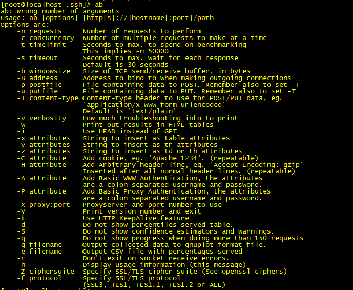

ab工具用来测试post get接口请求非常便捷，可以通过参数指定请求数、并发数、请求参数等。例如，一个测试并发用户数为10、请求数量为100的的post请求输入如下：

```
ab -n 100  -c 10 -p 'post.txt' -T 'application/x-www-form-urlencoded' 'http://test.api.com/test/register'
```

post.txt为存放post参数的文档，存储格式如下：

```
usernanme=test&password=test&sex=1
```

附上几个常用参数的含义：

- -n：总请求次数（最小默认为1）；
- -c：并发次数（最小默认为1且不能大于总请求次数，例如：10个请求，10个并发，实际就是1人请求1次）；
- -p：post参数文档路径（-p和-T参数要配合使用）；
- -T：header头内容类型（此处切记是大写英文字母T）。
  当我们测试一个get请求接口时，可以直接在链接的后面带上请求的参数：

```
ab -c 10 -n 100 http://www.test.api.com/test/login?userName=test&password=test
```

输出结果如下：
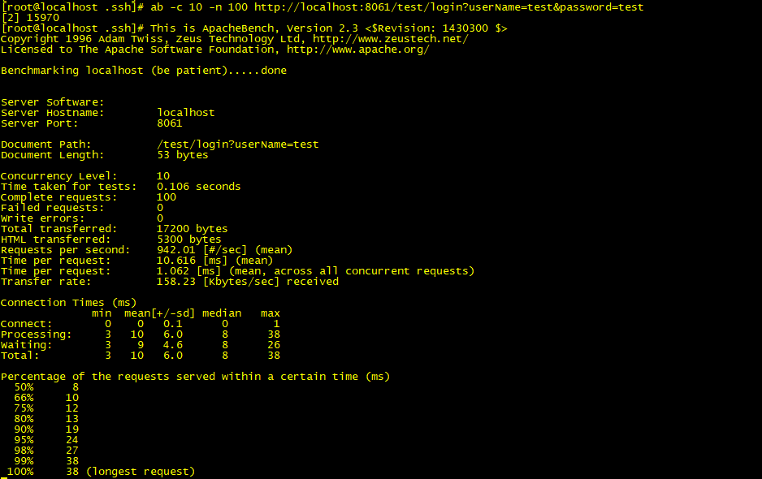
以上输出中，有几项性能指标可以提供给你参考使用：

- Requests per second：吞吐率，指某个并发用户数下单位时间内处理的请求数；
- Time per request：上面的是用户平均请求等待时间，指处理完成所有请求数所花费的时间/（总请求数/并发用户数）；
- Time per request：下面的是服务器平均请求处理时间，指处理完成所有请求数所花费的时间/总请求数；
- Percentage of the requests served within a certain time：每秒请求时间分布情况，指在整个请求中，每个请求的时间长度的分布情况，例如有50%的请求响应在8ms内，66%的请求响应在10ms内，说明有16%的请求在8ms~10ms之间。

---

### 2.4.2.JMeter

JMeter是Apache提供的一款功能性比较全的性能测试工具，同样可以在Windows和Linux环境下安装使用。JMeter在Windows环境下使用了图形界面，可以通过图形界面来编写测试用例，具有易学和易操作的特点。

JMeter不仅可以实现简单的并发性能测试，还可以实现复杂的宏基准测试。我们可以通过录制脚本的方式，在JMeter实现整个业务流程的测试。JMeter也支持通过csv文件导入参数变量，实现用多样化的参数测试系统性能。Windows下的JMeter安装非常简单，在官网下载安装包，解压后即可使用。如果你需要打开图形化界面，那就进入到bin目录下，找到jmeter.bat文件，双击运行该文件就可以了。

JMeter的功能非常全面，我在这里简单介绍下如何录制测试脚本，并使用JMeter测试业务的性能。录制JMeter脚本的方法有很多，一种是使用Jmeter自身的代理录制，另一种是使用Badboy这款软件录制，还有一种是我下面要讲的，通过安装浏览器插件的方式实现脚本的录制，这种方式非常简单，不用做任何设置。

首先我们安装一个录制测试脚本的插件，叫做BlazeMeter插件。你可以在Chrome应用商店中找到它，然后点击安装， 然后使用谷歌账号登录这款插件，如果不登录，我们将无法生成JMeter文件，安装以及登录成功后的界面如下图所示：
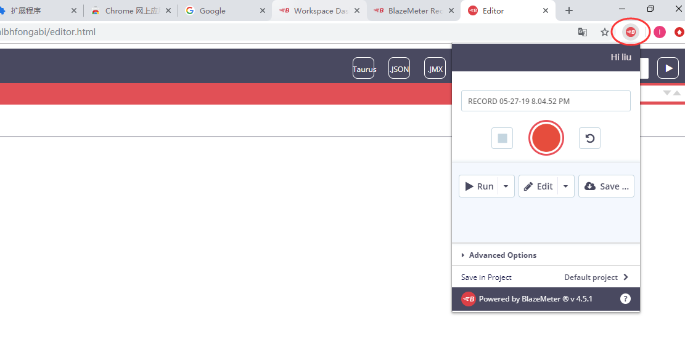
最后点击开始，就可以录制脚本了。录制成功后，点击保存为JMX文件，我们就可以通过JMeter打开这个文件，看到录制的脚本了，如下图所示：
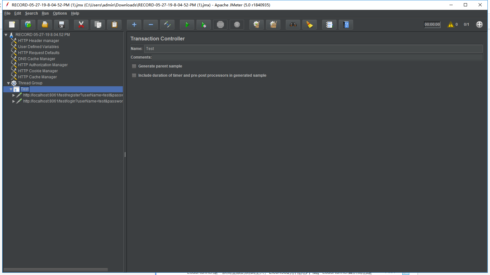
这个时候，我们还需要创建一个查看结果树，用来可视化查看运行的性能结果集合：
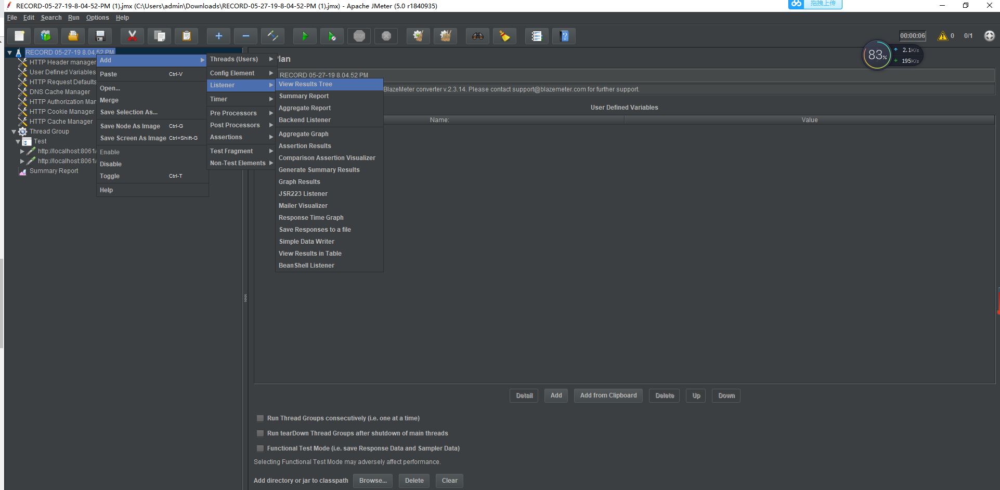
设置好结果树之后，我们可以对线程组的并发用户数以及循环调用次数进行设置：
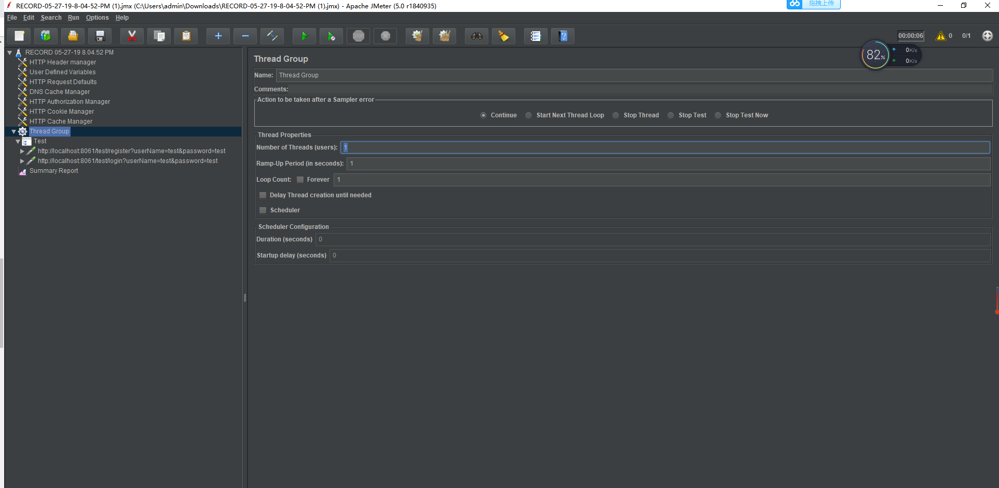
设置成功之后，点击运行，我们可以看到运行的结果：


---

### 2.4.3 LoadRunner

LoadRunner是一款商业版的测试工具，并且License的售价不低。

作为一款专业的性能测试工具，LoadRunner在性能压测时，表现得非常稳定和高效。相比JMeter，LoadRunner可以模拟出不同的内网IP地址，通过分配不同的IP地址给测试的用户，模拟真实环境下的用户。这里我就不展开详述了。

---

### 2.4.4 总结

三种常用的性能测试工具就介绍完了，最后我把今天的主要内容为你总结了一张图。
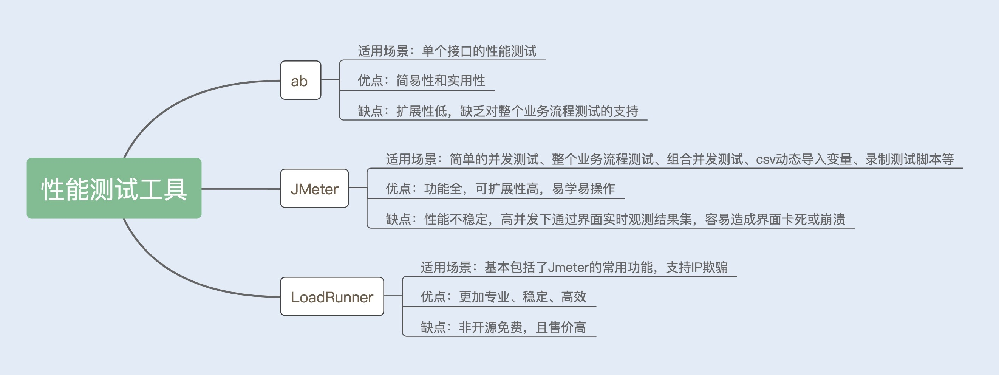

现在测试工具非常多，包括阿里云的PTS测试工具也很好用，但每款测试工具其实都有自己的优缺点。个人建议，还是在熟练掌握其中一款测试工具的前提下，再去探索其他测试工具的使用方法会更好。

## 2.5 Stream如何提高遍历集合效率？

上一讲中，我在讲List集合类，那我想你一定也知道集合的顶端接口Collection。在Java8中，Collection新增了两个流方法，分别是Stream()和parallelStream()。

通过英文名不难猜测，这两个方法肯定和Stream有关，那进一步猜测，是不是和我们熟悉的InputStream和OutputStream也有关系呢？集合类中新增的两个Stream方法到底有什么作用？今天，我们就来深入了解下Stream。

### 2.5.1 什么是Stream？

现在很多大数据量系统中都存在分表分库的情况。例如，电商系统中的订单表，常常使用用户ID的Hash值来实现分表分库，这样是为了减少单个表的数据量，优化用户查询订单的速度。但在后台管理员审核订单时，他们需要将各个数据源的数据查询到应用层之后进行合并操作。

例如，当我们需要查询出过滤条件下的所有订单，并按照订单的某个条件进行排序，单个数据源查询出来的数据是可以按照某个条件进行排序的，但多个数据源查询出来已经排序好的数据，并不代表合并后是正确的排序，所以我们需要在应用层对合并数据集合重新进行排序。

在Java8之前，我们通常是通过for循环或者Iterator迭代来重新排序合并数据，又或者通过重新定义Collections.sorts的Comparator方法来实现，这两种方式对于大数据量系统来说，效率并不是很理想。Java8中添加了一个新的接口类Stream，他和我们之前接触的字节流概念不太一样，Java8集合中的Stream相当于高级版的Iterator，他可以通过Lambda 表达式对集合进行各种非常便利、高效的聚合操作（Aggregate Operation），或者大批量数据操作 (Bulk Data Operation)。

Stream的聚合操作与数据库SQL的聚合操作sorted、filter、map等类似。我们在应用层就可以高效地实现类似数据库SQL的聚合操作了，而在数据操作方面，Stream不仅可以通过串行的方式实现数据操作，还可以通过并行的方式处理大批量数据，提高数据的处理效率。接下来我们就用一个简单的例子来体验下Stream的简洁与强大。

这个Demo的需求是过滤分组一所中学里身高在160cm以上的男女同学，我们先用传统的迭代方式来实现，代码如下：

```
Map<String, List<Student>> stuMap = new HashMap<String, List<Student>>();
        for (Student stu: studentsList) {
            if (stu.getHeight() > 160) { //如果身高大于160
                if (stuMap.get(stu.getSex()) == null) { //该性别还没分类
                    List<Student> list = new ArrayList<Student>(); //新建该性别学生的列表
                    list.add(stu);//将学生放进去列表
                    stuMap.put(stu.getSex(), list);//将列表放到map中
                } else { //该性别分类已存在
                    stuMap.get(stu.getSex()).add(stu);//该性别分类已存在，则直接放进去即可
                }
            }
        }
```

我们再使用Java8中的Stream API进行实现：

1.串行实现

```
Map<String, List<Student>> stuMap = stuList.stream().filter((Student s) -> s.getHeight() > 160) .collect(Collectors.groupingBy(Student ::getSex));
```

2.并行实现

```
Map<String, List<Student>> stuMap = stuList.parallelStream().filter((Student s) -> s.getHeight() > 160) .collect(Collectors.groupingBy(Student ::getSex));
```

通过上面两个简单的例子，我们可以发现，Stream结合Lambda表达式实现遍历筛选功能非常得简洁和便捷。

---

### 2.5.2 Stream如何优化遍历？

上面我们初步了解了Java8中的Stream API，那Stream是如何做到优化迭代的呢？并行又是如何实现的？下面我们就透过Stream源码剖析Stream的实现原理。

#### 1.Stream操作分类

在了解Stream的实现原理之前，我们先来了解下Stream的操作分类，因为他的操作分类其实是实现高效迭代大数据集合的重要原因之一。为什么这样说，分析完你就清楚了。

官方将Stream中的操作分为两大类：中间操作（Intermediate operations）和终结操作（Terminal operations）。中间操作只对操作进行了记录，即只会返回一个流，不会进行计算操作，而终结操作是实现了计算操作。

- 中间操作又可以分为无状态（Stateless）与有状态（Stateful）操作，前者是指元素的处理不受之前元素的影响，后者是指该操作只有拿到所有元素之后才能继续下去。
- 终结操作又可以分为短路（Short-circuiting）与非短路（Unshort-circuiting）操作，前者是指遇到某些符合条件的元素就可以得到最终结果，后者是指必须处理完所有元素才能得到最终结果。操作分类详情如下图所示：
  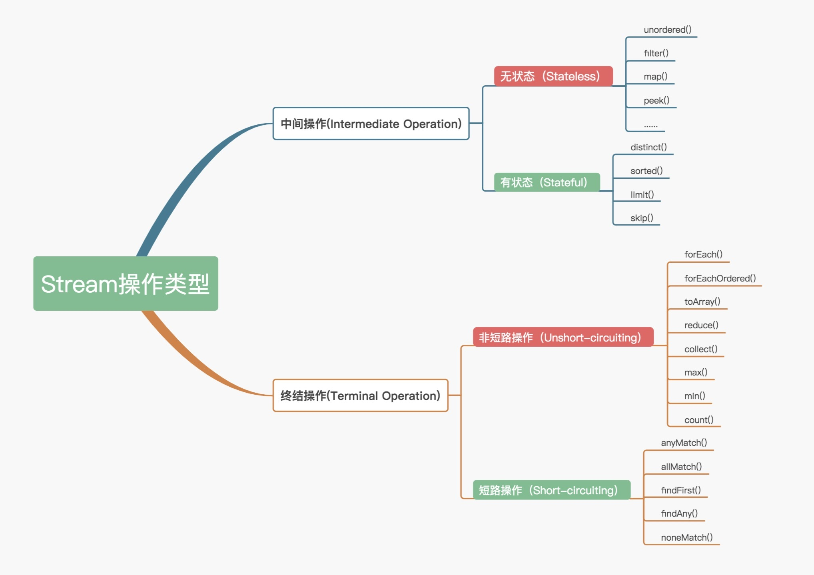

我们通常还会将中间操作称为懒操作，也正是由这种懒操作结合终结操作、数据源构成的处理管道（Pipeline），实现了Stream的高效。

#### 2.Stream源码实现

在了解Stream如何工作之前，我们先来了解下Stream包是由哪些主要结构类组合而成的，各个类的职责是什么。参照下图：
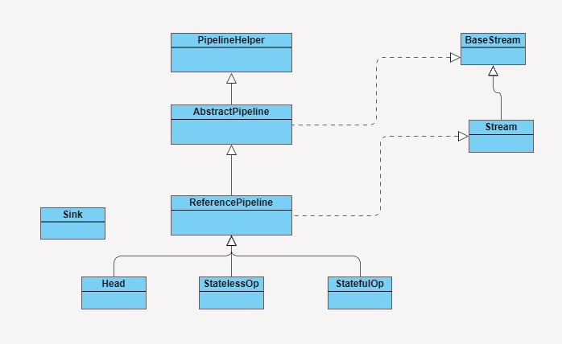

- BaseStream和Stream为最顶端的接口类。BaseStream主要定义了流的基本接口方法，例如，spliterator、isParallel等；Stream则定义了一些流的常用操作方法，例如，map、filter等。
- ReferencePipeline是一个结构类，他通过定义内部类组装了各种操作流。他定义了Head、StatelessOp、StatefulOp三个内部类，实现了BaseStream与Stream的接口方法。
- Sink接口是定义每个Stream操作之间关系的协议，他包含begin()、end()、cancellationRequested()、accpt()四个方法。ReferencePipeline最终会将整个Stream流操作组装成一个调用链，而这条调用链上的各个Stream操作的上下关系就是通过Sink接口协议来定义实现的。

#### 3.Stream操作叠加

我们知道，一个Stream的各个操作是由处理管道组装，并统一完成数据处理的。在JDK中每次的中断操作会以使用阶段（Stage）命名。

管道结构通常是由ReferencePipeline类实现的，前面讲解Stream包结构时，我提到过ReferencePipeline包含了Head、StatelessOp、StatefulOp三种内部类。

Head类主要用来定义数据源操作，在我们初次调用names.stream()方法时，会初次加载Head对象，此时为加载数据源操作；接着加载的是中间操作，分别为无状态中间操作StatelessOp对象和有状态操作StatefulOp对象，此时的Stage并没有执行，而是通过AbstractPipeline生成了一个中间操作Stage链表；当我们调用终结操作时，会生成一个最终的Stage，通过这个Stage触发之前的中间操作，从最后一个Stage开始，递归产生一个Sink链。如下图所示：
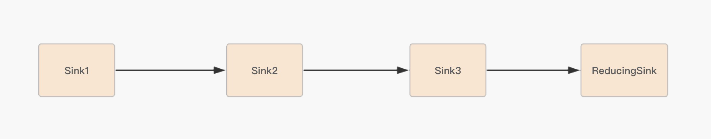

下面我们再通过一个例子来感受下Stream的操作分类是如何实现高效迭代大数据集合的。

```
List<String> names = Arrays.asList("张三", "李四", "王老五", "李三", "刘老四", "王小二", "张四", "张五六七");

String maxLenStartWithZ = names.stream()
                    .filter(name -> name.startsWith("张"))
                    .mapToInt(String::length)
                    .max()
                    .toString();
```

这个例子的需求是查找出一个长度最长，并且以张为姓氏的名字。从代码角度来看，你可能会认为是这样的操作流程：首先遍历一次集合，得到以“张”开头的所有名字；然后遍历一次filter得到的集合，将名字转换成数字长度；最后再从长度集合中找到最长的那个名字并且返回。这里我要很明确地告诉你，实际情况并非如此。我们来逐步分析下这个方法里所有的操作是如何执行的。

首先 ，因为names是ArrayList集合，所以names.stream()方法将会调用集合类基础接口Collection的Stream方法：

```
default Stream<E> stream() {
        return StreamSupport.stream(spliterator(), false);
    }
```

然后，Stream方法就会调用StreamSupport类的Stream方法，方法中初始化了一个ReferencePipeline的Head内部类对象：

```
public static <T> Stream<T> stream(Spliterator<T> spliterator, boolean parallel) {
        Objects.requireNonNull(spliterator);
        return new ReferencePipeline.Head<>(spliterator,
                                            StreamOpFlag.fromCharacteristics(spliterator),
                                            parallel);
    }
```

再调用filter和map方法，这两个方法都是无状态的中间操作，所以执行filter和map操作时，并没有进行任何的操作，而是分别创建了一个Stage来标识用户的每一次操作。而通常情况下Stream的操作又需要一个回调函数，所以一个完整的Stage是由数据来源、操作、回调函数组成的三元组来表示。如下图所示，分别是ReferencePipeline的filter方法和map方法：

```
@Override
    public final Stream<P_OUT> filter(Predicate<? super P_OUT> predicate) {
        Objects.requireNonNull(predicate);
        return new StatelessOp<P_OUT, P_OUT>(this, StreamShape.REFERENCE,StreamOpFlag.NOT_SIZED) {
            @Override
            Sink<P_OUT> opWrapSink(int flags, Sink<P_OUT> sink) {
                return new Sink.ChainedReference<P_OUT, P_OUT>(sink) {
                    @Override
                    public void begin(long size) {
                        downstream.begin(-1);
                    }

                    @Override
                    public void accept(P_OUT u) {
                        if (predicate.test(u))
                            downstream.accept(u);
                    }
                };
            }
        };
    }

   @Override
    @SuppressWarnings("unchecked")
    public final <R> Stream<R> map(Function<? super P_OUT, ? extends R> mapper) {
        Objects.requireNonNull(mapper);
        return new StatelessOp<P_OUT, R>(this, StreamShape.REFERENCE,
                                     StreamOpFlag.NOT_SORTED | StreamOpFlag.NOT_DISTINCT) {
            @Override
            Sink<P_OUT> opWrapSink(int flags, Sink<R> sink) {
                return new Sink.ChainedReference<P_OUT, R>(sink) {
                    @Override
                    public void accept(P_OUT u) {
                        downstream.accept(mapper.apply(u));
                    }
                };
            }
        };
    }
```

new StatelessOp将会调用父类AbstractPipeline的构造函数，这个构造函数将前后的Stage联系起来，生成一个Stage链表：

```
AbstractPipeline(AbstractPipeline<?, E_IN, ?> previousStage, int opFlags) {
        if (previousStage.linkedOrConsumed)
            throw new IllegalStateException(MSG_STREAM_LINKED);
        previousStage.linkedOrConsumed = true;
        previousStage.nextStage = this;//将当前的stage的next指针指向之前的stage

        this.previousStage = previousStage;//赋值当前stage当全局变量previousStage 
        this.sourceOrOpFlags = opFlags & StreamOpFlag.OP_MASK;
        this.combinedFlags = StreamOpFlag.combineOpFlags(opFlags, previousStage.combinedFlags);
        this.sourceStage = previousStage.sourceStage;
        if (opIsStateful())
            sourceStage.sourceAnyStateful = true;
        this.depth = previousStage.depth + 1;
    }
```

因为在创建每一个Stage时，都会包含一个opWrapSink()方法，该方法会把一个操作的具体实现封装在Sink类中，Sink采用（处理->转发）的模式来叠加操作。当执行max方法时，会调用ReferencePipeline的max方法，此时由于max方法是终结操作，所以会创建一个TerminalOp操作，同时创建一个ReducingSink，并且将操作封装在Sink类中。

```
@Override
    public final Optional<P_OUT> max(Comparator<? super P_OUT> comparator) {
        return reduce(BinaryOperator.maxBy(comparator));
    }
```

最后，调用AbstractPipeline的wrapSink方法，该方法会调用opWrapSink生成一个Sink链表，Sink链表中的每一个Sink都封装了一个操作的具体实现。

```
@Override
    @SuppressWarnings("unchecked")
    final <P_IN> Sink<P_IN> wrapSink(Sink<E_OUT> sink) {
        Objects.requireNonNull(sink);

        for ( @SuppressWarnings("rawtypes") AbstractPipeline p=AbstractPipeline.this; p.depth > 0; p=p.previousStage) {
            sink = p.opWrapSink(p.previousStage.combinedFlags, sink);
        }
        return (Sink<P_IN>) sink;
    }
```

当Sink链表生成完成后，Stream开始执行，通过spliterator迭代集合，执行Sink链表中的具体操作。

```
@Override
    final <P_IN> void copyInto(Sink<P_IN> wrappedSink, Spliterator<P_IN> spliterator) {
        Objects.requireNonNull(wrappedSink);

        if (!StreamOpFlag.SHORT_CIRCUIT.isKnown(getStreamAndOpFlags())) {
            wrappedSink.begin(spliterator.getExactSizeIfKnown());
            spliterator.forEachRemaining(wrappedSink);
            wrappedSink.end();
        }
        else {
            copyIntoWithCancel(wrappedSink, spliterator);
        }
    }
```

Java8中的Spliterator的forEachRemaining会迭代集合，每迭代一次，都会执行一次filter操作，如果filter操作通过，就会触发map操作，然后将结果放入到临时数组object中，再进行下一次的迭代。完成中间操作后，就会触发终结操作max。
这就是串行处理方式了，那么Stream的另一种处理数据的方式又是怎么操作的呢？

#### 4.Stream并行处理

Stream处理数据的方式有两种，串行处理和并行处理。要实现并行处理，我们只需要在例子的代码中新增一个Parallel()方法，代码如下所示：

```
List<String> names = Arrays.asList("张三", "李四", "王老五", "李三", "刘老四", "王小二", "张四", "张五六七");

String maxLenStartWithZ = names.stream()
                    .parallel()
    	            .filter(name -> name.startsWith("张"))
    	            .mapToInt(String::length)
    	            .max()
    	            .toString();
```

Stream的并行处理在执行终结操作之前，跟串行处理的实现是一样的。而在调用终结方法之后，实现的方式就有点不太一样，会调用TerminalOp的evaluateParallel方法进行并行处理。

```
final <R> R evaluate(TerminalOp<E_OUT, R> terminalOp) {
        assert getOutputShape() == terminalOp.inputShape();
        if (linkedOrConsumed)
            throw new IllegalStateException(MSG_STREAM_LINKED);
        linkedOrConsumed = true;

        return isParallel()
               ? terminalOp.evaluateParallel(this, sourceSpliterator(terminalOp.getOpFlags()))
               : terminalOp.evaluateSequential(this, sourceSpliterator(terminalOp.getOpFlags()));
    }
```

这里的并行处理指的是，Stream结合了ForkJoin框架，对Stream 处理进行了分片，Splititerator中的estimateSize方法会估算出分片的数据量。ForkJoin框架和估算算法，在这里我就不具体讲解了，如果感兴趣，你可以深入源码分析下该算法的实现。

通过预估的数据量获取最小处理单元的阈值，如果当前分片大小大于最小处理单元的阈值，就继续切分集合。每个分片将会生成一个Sink链表，当所有的分片操作完成后，ForkJoin框架将会合并分片任何结果集。

---

### 2.5.3 合理使用Stream

看到这里，你应该对Stream API是如何优化集合遍历有个清晰的认知了。Stream API用起来简洁，还能并行处理，那是不是使用Stream API，系统性能就更好呢？通过一组测试，我们一探究竟。我们将对常规的迭代、Stream串行迭代以及Stream并行迭代进行性能测试对比，迭代循环中，我们将对数据进行过滤、分组等操作。分别进行以下几组测试：

- 多核CPU服务器配置环境下，对比长度100的int数组的性能；
- 多核CPU服务器配置环境下，对比长度1.00E+8的int数组的性能；
- 多核CPU服务器配置环境下，对比长度1.00E+8对象数组过滤分组的性能；
- 单核CPU服务器配置环境下，对比长度1.00E+8对象数组过滤分组的性能。
  由于篇幅有限，我这里直接给出统计结果，你也可以自己去验证一下，具体的测试代码可以在[Github](https://github.com/nickliuchao/stream)上查看。通过以上测试，我统计出的测试结果如下（迭代使用时间）：
- 常规的迭代<Stream并行迭代<Stream串行迭代
- Stream并行迭代<常规的迭代<Stream串行迭代
- Stream并行迭代<常规的迭代<Stream串行迭代
- 常规的迭代<Stream串行迭代<Stream并行迭代

通过以上测试结果，我们可以看到：在循环迭代次数较少的情况下，常规的迭代方式性能反而更好；在单核CPU服务器配置环境中，也是常规迭代方式更有优势；而在大数据循环迭代中，如果服务器是多核CPU的情况下，Stream的并行迭代优势明显。所以我们在平时处理大数据的集合时，应该尽量考虑将应用部署在多核CPU环境下，并且使用Stream的并行迭代方式进行处理。

用事实说话，我们看到其实使用Stream未必可以使系统性能更佳，还是要结合应用场景进行选择，也就是合理地使用Stream。

---

### 2.5.4 总结

纵观Stream的设计实现，非常值得我们学习。从大的设计方向上来说，Stream将整个操作分解为了链式结构，不仅简化了遍历操作，还为实现了并行计算打下了基础。从小的分类方向上来说，Stream将遍历元素的操作和对元素的计算分为中间操作和终结操作，而中间操作又根据元素之间状态有无干扰分为有状态和无状态操作，实现了链结构中的不同阶段。

在串行处理操作中，Stream在执行每一步中间操作时，并不会做实际的数据操作处理，而是将这些中间操作串联起来，最终由终结操作触发，生成一个数据处理链表，通过Java8中的Spliterator迭代器进行数据处理；此时，每执行一次迭代，就对所有的无状态的中间操作进行数据处理，而对有状态的中间操作，就需要迭代处理完所有的数据，再进行处理操作；最后就是进行终结操作的数据处理。

在并行处理操作中，Stream对中间操作基本跟串行处理方式是一样的，但在终结操作中，Stream将结合ForkJoin框架对集合进行切片处理，ForkJoin框架将每个切片的处理结果Join合并起来。最后就是要注意Stream的使用场景。

**思考题：**
这里有一个简单的并行处理案例，请你找出其中存在的问题。

```
//使用一个容器装载100个数字，通过Stream并行处理的方式将容器中为单数的数字转移到容器parallelList
List<Integer> integerList= new ArrayList<Integer>();

for (int i = 0; i <100; i++) {
      integerList.add(i);
}

List<Integer> parallelList = new ArrayList<Integer>() ;
integerList.stream()
           .parallel()
           .filter(i->i%2==1)
           .forEach(i->parallelList.add(i));
```

**解答：**
并行流中的 `forEach` 操作可能由不同的线程同时执行，因此会有多个线程并发调用 `parallelList.add(i)` 方法。

`ArrayList` 是非线程安全的，这意味着它的方法在多线程环境下并发执行时，不保证操作的原子性、可见性和有序性。这样的并发修改可能会导致如下的问题：

1. 并发修改异常（`ConcurrentModificationException`）：尽管这个异常更常见于迭代期间的并发修改，有写操作的多线程环境下也可能抛出这个异常。
2. 数据一致性问题：由于并行执行，可能导致部分元素丢失，不被添加到 `parallelList` 中。
3. 数据竞争和内存一致性问题：不同线程对共享数据的修改可能互相覆盖，导致 `parallelList` 的状态不确定且最终结果不正确。

为了避免这些问题，你可以使用线程安全的容器替换 `ArrayList`，例如 `Vector` 或 `Collections.synchronizedList` 包装的 `ArrayList`。但是，一个更符合流（stream）处理的解决方案是使用线程安全的数据结构来收集并行流的结果，比如使用 `collect` 方法搭配线程安全的 `Collector`。例如：

```java
List<Integer> parallelList = integerList.stream()
                                        .parallel()
                                        .filter(i -> i % 2 == 1)
                                        .collect(Collectors.toList());
```

**补充：**

1. 日常业务开发中不用纠结stream相比普通遍历的性能损耗，stream的优势是把复杂啰嗦的for循环写法给简化了。
2. 慎用parallelstream，会默认使用内置的forkjoinpool。如果涉及到io并行，一定是要自己弄一个线程池的。如果是纯cpu计算，大部分场景适用普通stream性能也不会差太多

## 2.6 深入浅出HashMap的设计与优化

在上一讲中我提到过Collection接口，那么在Java容器类中，除了这个接口之外，还定义了一个很重要的Map接口，主要用来存储键值对数据。HashMap作为我们日常使用最频繁的容器之一，相信你一定不陌生了。今天我们就从HashMap的底层实现讲起，深度了解下它的设计与优化。

### 2.6.1 常用的数据结构

我在05讲分享List集合类的时候，讲过ArrayList是基于数组的数据结构实现的，LinkedList是基于链表的数据结构实现的，而我今天要讲的HashMap是基于哈希表的数据结构实现的。我们不妨一起来温习下常用的数据结构，这样也有助于你更好地理解后面地内容。

- 数组：采用一段连续的存储单元来存储数据。对于指定下标的查找，时间复杂度为O(1)，但在数组中间以及头部插入数据时，需要复制移动后面的元素。
- 链表：一种在物理存储单元上非连续、非顺序的存储结构，数据元素的逻辑顺序是通过链表中的指针链接次序实现的。
- 链表由一系列结点（链表中每一个元素）组成，结点可以在运行时动态生成。每个结点都包含“存储数据单元的数据域”和“存储下一个结点地址的指针域”这两个部分。由于链表不用必须按顺序存储，所以链表在插入的时候可以达到O(1)的复杂度，但查找一个结点或者访问特定编号的结点需要O(n)的时间。
- 哈希表：根据关键码值（Key value）直接进行访问的数据结构。通过把关键码值映射到表中一个位置来访问记录，以加快查找的速度。这个映射函数叫做哈希函数，存放记录的数组就叫做哈希表。
- 树：由n（n≥1）个有限结点组成的一个具有层次关系的集合，就像是一棵倒挂的树。

---

### 2.6.2 HashMap的实现结构

了解完数据结构后，我们再来看下HashMap的实现结构。作为最常用的Map类，它是基于哈希表实现的，继承了AbstractMap并且实现了Map接口。哈希表将键的Hash值映射到内存地址，即根据键获取对应的值，并将其存储到内存地址。也就是说HashMap是根据键的Hash值来决定对应值的存储位置。通过这种索引方式，HashMap获取数据的速度会非常快。

例如，存储键值对（x，“aa”）时，哈希表会通过哈希函数f(x)得到"aa"的实现存储位置。但也会有新的问题。如果再来一个(y，“bb”)，哈希函数f(y)的哈希值跟之前f(x)是一样的，这样两个对象的存储地址就冲突了，这种现象就被称为哈希冲突。那么哈希表是怎么解决的呢？方式有很多，比如，开放定址法、再哈希函数法和链地址法。

- 开放定址法很简单，当发生哈希冲突时，如果哈希表未被装满，说明在哈希表中必然还有空位置，那么可以把key存放到冲突位置后面的空位置上去。这种方法存在着很多缺点，例如，查找、扩容等，所以我不建议你作为解决哈希冲突的首选。
- 再哈希法顾名思义就是在同义词产生地址冲突时再计算另一个哈希函数地址，直到冲突不再发生，这种方法不易产生“聚集”，但却增加了计算时间。如果我们不考虑添加元素的时间成本，且对查询元素的要求极高，就可以考虑使用这种算法设计。
- HashMap则是综合考虑了所有因素，采用链地址法解决哈希冲突问题。这种方法是采用了数组（哈希表）+ 链表的数据结构，当发生哈希冲突时，就用一个链表结构存储相同Hash值的数据。

---

### 2.6.3 HashMap的重要属性

从HashMap的源码中，我们可以发现，HashMap是由一个Node数组构成，每个Node包含了一个key-value键值对。

```
transient Node<K,V>[] table;
```

Node类作为HashMap中的一个内部类，除了key、value两个属性外，还定义了一个next指针。当有哈希冲突时，HashMap会用之前数组当中相同哈希值对应存储的Node对象，通过指针指向新增的相同哈希值的Node对象的引用。

```
static class Node<K,V> implements Map.Entry<K,V> {
        final int hash;
        final K key;
        V value;
        Node<K,V> next;

        Node(int hash, K key, V value, Node<K,V> next) {
            this.hash = hash;
            this.key = key;
            this.value = value;
            this.next = next;
        }
}
```

HashMap还有两个重要的属性：加载因子（loadFactor）和边界值（threshold）。在初始化HashMap时，就会涉及到这两个关键初始化参数。

```
int threshold;
final float loadFactor;
```

LoadFactor属性是用来间接设置Entry数组（哈希表）的内存空间大小，在初始HashMap不设置参数的情况下，默认LoadFactor值为0.75。为什么是0.75这个值呢？这是因为对于使用链表法的哈希表来说，查找一个元素的平均时间是O(1+n)，这里的n指的是遍历链表的长度，因此加载因子越大，对空间的利用就越充分，这就意味着链表的长度越长，查找效率也就越低。如果设置的加载因子太小，那么哈希表的数据将过于稀疏，对空间造成严重浪费。

那有没有什么办法来解决这个因链表过长而导致的查询时间复杂度高的问题呢？你可以先想想，我将在后面的内容中讲到。Entry数组的Threshold是通过初始容量和LoadFactor计算所得，在初始HashMap不设置参数的情况下，默认边界值为12。如果我们在初始化时，设置的初始化容量较小，HashMap中Node的数量超过边界值，HashMap就会调用resize()方法重新分配table数组。这将会导致HashMap的数组复制，迁移到另一块内存中去，从而影响HashMap的效率。

---

### 2.6.4 HashMap添加元素优化

初始化完成后，HashMap就可以使用put()方法添加键值对了。从下面源码可以看出，当程序将一个key-value对添加到HashMap中，程序首先会根据该key的hashCode()返回值，再通过hash()方法计算出hash值，再通过putVal方法中的(n - 1) & hash决定该Node的存储位置。

```
public V put(K key, V value) {
        return putVal(hash(key), key, value, false, true);
    }

 static final int hash(Object key) {
        int h;
        return (key == null) ? 0 : (h = key.hashCode()) ^ (h >>> 16);
    }

  if ((tab = table) == null || (n = tab.length) == 0)
            n = (tab = resize()).length;
        //通过putVal方法中的(n - 1) & hash决定该Node的存储位置
        if ((p = tab[i = (n - 1) & hash]) == null)
            tab[i] = newNode(hash, key, value, null);
```

如果你不太清楚hash()以及(n-1)&hash的算法，就请你看下面的详述。我们先来了解下hash()方法中的算法。如果我们没有使用hash()方法计算hashCode，而是直接使用对象的hashCode值，会出现什么问题呢？

假设要添加两个对象a和b，如果数组长度是16，这时对象a和b通过公式(n - 1) & hash运算，也就是(16-1)＆a.hashCode和(16-1)＆b.hashCode，15的二进制为0000000000000000000000000001111，假设对象 A 的 hashCode 为 1000010001110001000001111000000，对象 B 的 hashCode 为 0111011100111000101000010100000，你会发现上述与运算结果都是0。这样的哈希结果就太让人失望了，很明显不是一个好的哈希算法。

但如果我们将 hashCode 值右移 16 位（h >>> 16代表无符号右移16位），也就是取 int 类型的一半，刚好可以将该二进制数对半切开，并且使用位异或运算（如果两个数对应的位置相反，则结果为1，反之为0），这样的话，就能避免上面的情况发生。这就是hash()方法的具体实现方式。简而言之，就是尽量打乱hashCode真正参与运算的低16位。

我再来解释下(n - 1) & hash是怎么设计的，这里的n代表哈希表的长度，哈希表习惯将长度设置为2的n次方，这样恰好可以保证(n - 1) & hash的计算得到的索引值总是位于table数组的索引之内。例如：hash=15，n=16时，结果为15；hash=17，n=16时，结果为1。在获得Node的存储位置后，如果判断Node不在哈希表中，就新增一个Node，并添加到哈希表中，整个流程我将用一张图来说明：
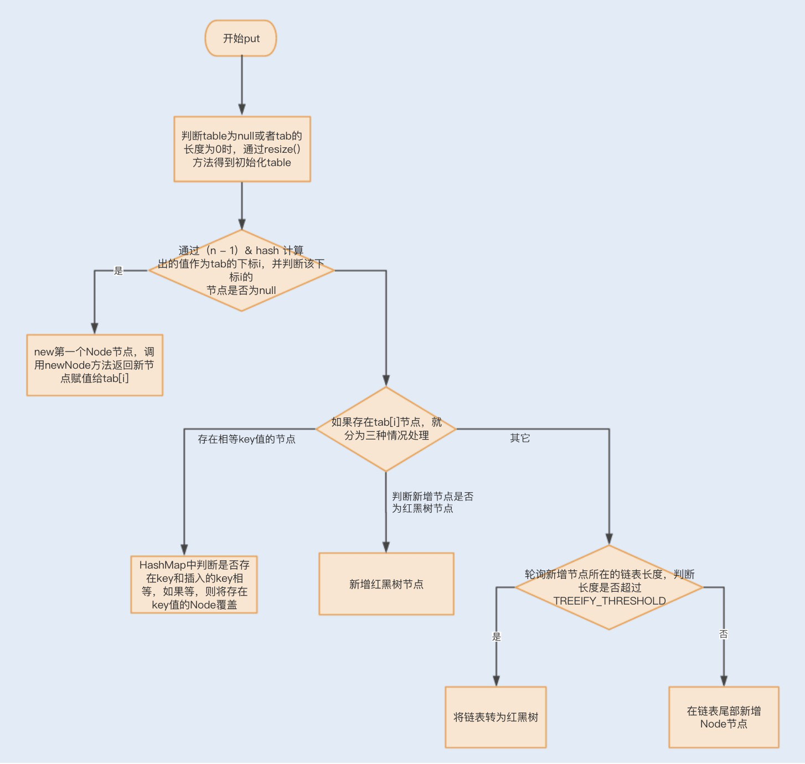
从图中我们可以看出：在JDK1.8中，HashMap引入了红黑树数据结构来提升链表的查询效率。

这是因为链表的长度超过8后，红黑树的查询效率要比链表高，所以当链表超过8时，HashMap就会将链表转换为红黑树，这里值得注意的一点是，这时的新增由于存在左旋、右旋效率会降低。讲到这里，我前面我提到的“因链表过长而导致的查询时间复杂度高”的问题，也就迎刃而解了。以下就是put的实现源码:

```
final V putVal(int hash, K key, V value, boolean onlyIfAbsent,
                   boolean evict) {
        Node<K,V>[] tab; Node<K,V> p; int n, i;
        if ((tab = table) == null || (n = tab.length) == 0)
//1、判断当table为null或者tab的长度为0时，即table尚未初始化，此时通过resize()方法得到初始化的table
            n = (tab = resize()).length;
        if ((p = tab[i = (n - 1) & hash]) == null)
//1.1、此处通过（n - 1） & hash 计算出的值作为tab的下标i，并另p表示tab[i]，也就是该链表第一个节点的位置。并判断p是否为null
            tab[i] = newNode(hash, key, value, null);
//1.1.1、当p为null时，表明tab[i]上没有任何元素，那么接下来就new第一个Node节点，调用newNode方法返回新节点赋值给tab[i]
        else {
//2.1下面进入p不为null的情况，有三种情况：p为链表节点；p为红黑树节点；p是链表节点但长度为临界长度TREEIFY_THRESHOLD，再插入任何元素就要变成红黑树了。
            Node<K,V> e; K k;
            if (p.hash == hash &&
                ((k = p.key) == key || (key != null && key.equals(k))))
//2.1.1HashMap中判断key相同的条件是key的hash相同，并且符合equals方法。这里判断了p.key是否和插入的key相等，如果相等，则将p的引用赋给e

                e = p;
            else if (p instanceof TreeNode)
//2.1.2现在开始了第一种情况，p是红黑树节点，那么肯定插入后仍然是红黑树节点，所以我们直接强制转型p后调用TreeNode.putTreeVal方法，返回的引用赋给e
                e = ((TreeNode<K,V>)p).putTreeVal(this, tab, hash, key, value);
            else {
//2.1.3接下里就是p为链表节点的情形，也就是上述说的另外两类情况：插入后还是链表/插入后转红黑树。另外，上行转型代码也说明了TreeNode是Node的一个子类
                for (int binCount = 0; ; ++binCount) {
//我们需要一个计数器来计算当前链表的元素个数，并遍历链表，binCount就是这个计数器

                    if ((e = p.next) == null) {
                        p.next = newNode(hash, key, value, null);
                        if (binCount >= TREEIFY_THRESHOLD - 1) 
// 插入成功后，要判断是否需要转换为红黑树，因为插入后链表长度加1，而binCount并不包含新节点，所以判断时要将临界阈值减1
                            treeifyBin(tab, hash);
//当新长度满足转换条件时，调用treeifyBin方法，将该链表转换为红黑树
                        break;
                    }
                    if (e.hash == hash &&
                        ((k = e.key) == key || (key != null && key.equals(k))))
                        break;
                    p = e;
                }
            }
            if (e != null) { // existing mapping for key
                V oldValue = e.value;
                if (!onlyIfAbsent || oldValue == null)
                    e.value = value;
                afterNodeAccess(e);
                return oldValue;
            }
        }
        ++modCount;
        if (++size > threshold)
            resize();
        afterNodeInsertion(evict);
        return null;
    }
```

---

### 2.6.5 HashMap获取元素优化

当HashMap中只存在数组，而数组中没有Node链表时，是HashMap查询数据性能最好的时候。一旦发生大量的哈希冲突，就会产生Node链表，这个时候每次查询元素都可能遍历Node链表，从而降低查询数据的性能。

特别是在链表长度过长的情况下，性能将明显降低，红黑树的使用很好地解决了这个问题，使得查询的平均复杂度降低到了O(log(n))，链表越长，使用黑红树替换后的查询效率提升就越明显。

我们在编码中也可以优化HashMap的性能，例如，重写key值的hashCode()方法，降低哈希冲突，从而减少链表的产生，高效利用哈希表，达到提高性能的效果。

---

### 2.6.6 HashMap扩容优化

HashMap也是数组类型的数据结构，所以一样存在扩容的情况。在JDK1.7 中，HashMap整个扩容过程就是分别取出数组元素，一般该元素是最后一个放入链表中的元素，然后遍历以该元素为头的单向链表元素，依据每个被遍历元素的 hash 值计算其在新数组中的下标，然后进行交换。这样的扩容方式会将原来哈希冲突的单向链表尾部变成扩容后单向链表的头部。

而在 JDK 1.8 中，HashMap对扩容操作做了优化。由于扩容数组的长度是 2 倍关系，所以对于假设初始 tableSize = 4 要扩容到 8 来说就是 0100 到 1000 的变化（左移一位就是 2 倍），在扩容中只用判断原来的 hash 值和左移动的一位（newtable 的值）按位与操作是 0 或 1 就行，0 的话索引不变，1 的话索引变成原索引加上扩容前数组。

之所以能通过这种“与运算“来重新分配索引，是因为 hash 值本来就是随机的，而hash 按位与上 newTable 得到的 0（扩容前的索引位置）和 1（扩容前索引位置加上扩容前数组长度的数值索引处）就是随机的，所以扩容的过程就能把之前哈希冲突的元素再随机分布到不同的索引中去。

---

### 2.6.7 总结

HashMap通过哈希表数据结构的形式来存储键值对，这种设计的好处就是查询键值对的效率高。我们在使用HashMap时，可以结合自己的场景来设置初始容量和加载因子两个参数。当查询操作较为频繁时，我们可以适当地减少加载因子；如果对内存利用率要求比较高，我可以适当的增加加载因子。

我们还可以在预知存储数据量的情况下，提前设置初始容量（初始容量=预知数据量/加载因子）。这样做的好处是可以减少resize()操作，提高HashMap的效率。

HashMap还使用了数组+链表这两种数据结构相结合的方式实现了链地址法，当有哈希值冲突时，就可以将冲突的键值对链成一个链表。

但这种方式又存在一个性能问题，如果链表过长，查询数据的时间复杂度就会增加。HashMap就在Java8中使用了红黑树来解决链表过长导致的查询性能下降问题。以下是HashMap的数据结构图：
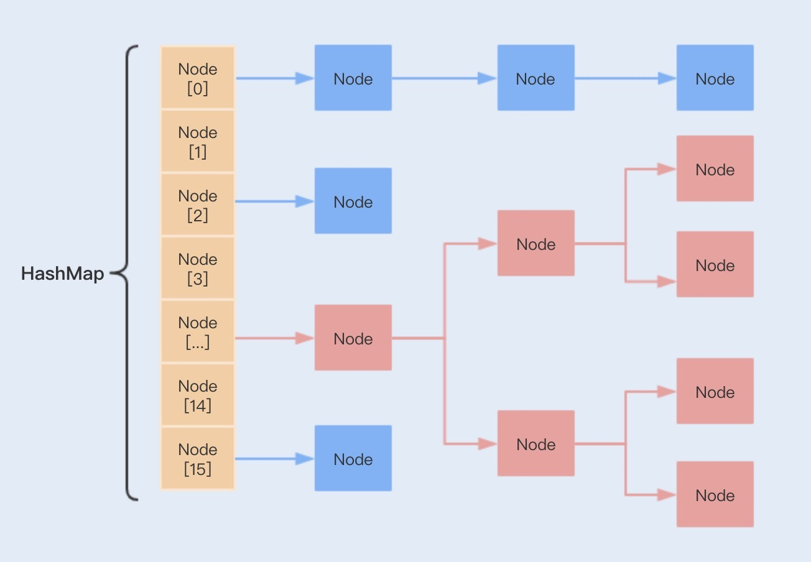

**思考题:**
实际应用中，我们设置初始容量，一般得是2的整数次幂。你知道原因吗？

**解答：**
初始容量设为 2 的整数次幂的目的：

1. 计算索引时（hash & (capacity - 1)）会保证任何哈希码的低位都被考虑到，减少了相同桶中的碰撞。
2. 计算键应该位于桶数组中哪个位置的索引时，取模（hash % capacity）可以被替换为位运算（hash & (capacity - 1)），位运算在处理器上的执行速度比取模快。

## 2.7 网络通信优化之/O模型:如何解决高并发下1/0瓶颈?

提到Java I/O，相信你一定不陌生。你可能使用I/O操作读写文件，也可能使用它实现Socket的信息传输…这些都是我们在系统中最常遇到的和I/O有关的操作。

我们都知道，I/O的速度要比内存速度慢，尤其是在现在这个大数据时代背景下，I/O的性能问题更是尤为突出，I/O读写已经成为很多应用场景下的系统性能瓶颈，不容我们忽视。今天，我们就来深入了解下Java I/O在高并发、大数据业务场景下暴露出的性能问题，从源头入手，学习优化方法。

### 2.7.1 什么是I/O

I/O是机器获取和交换信息的主要渠道，而流是完成I/O操作的主要方式。

在计算机中，流是一种信息的转换。流是有序的，因此相对于某一机器或者应用程序而言，我们通常把机器或者应用程序接收外界的信息称为输入流（InputStream），从机器或者应用程序向外输出的信息称为输出流（OutputStream），合称为输入/输出流（I/O Streams）。

机器间或程序间在进行信息交换或者数据交换时，总是先将对象或数据转换为某种形式的流，再通过流的传输，到达指定机器或程序后，再将流转换为对象数据。因此，流就可以被看作是一种数据的载体，通过它可以实现数据交换和传输。Java的I/O操作类在包java.io下，其中InputStream、OutputStream以及Reader、Writer类是I/O包中的4个基本类，它们分别处理字节流和字符流。如下图所示：
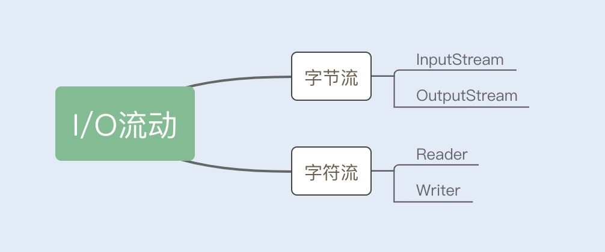

#### 1.字节流

InputStream/OutputStream是字节流的抽象类，这两个抽象类又派生出了若干子类，不同的子类分别处理不同的操作类型。如果是文件的读写操作，就使用FileInputStream/FileOutputStream；如果是数组的读写操作，就使用ByteArrayInputStream/ByteArrayOutputStream；如果是普通字符串的读写操作，就使用BufferedInputStream/BufferedOutputStream。具体内容如下图所示：
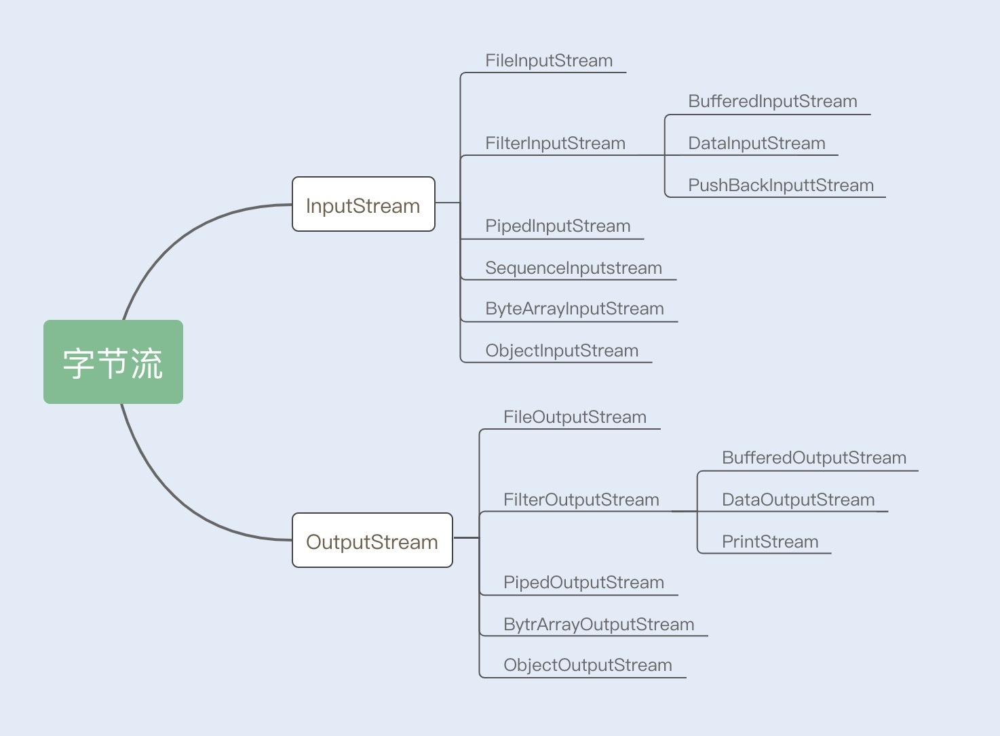

#### 2.字符流

Reader/Writer是字符流的抽象类，这两个抽象类也派生出了若干子类，不同的子类分别处理不同的操作类型，具体内容如下图所示：
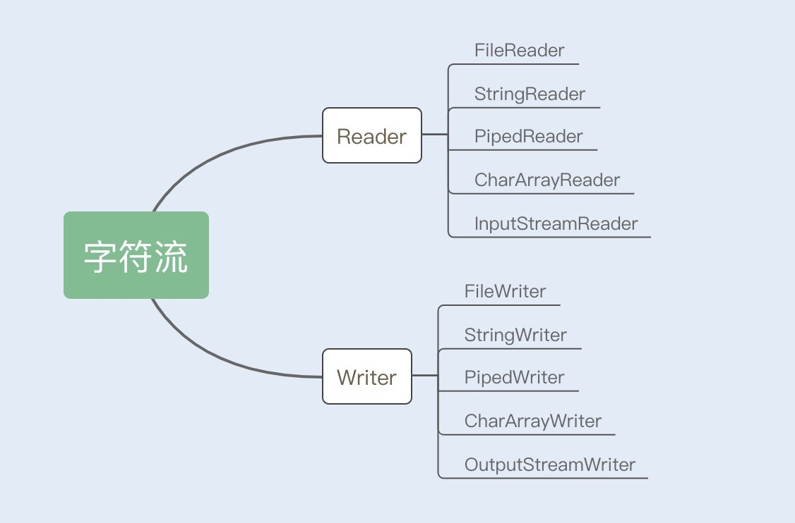

### 2.7.2 传统I/O的性能问题

我们知道，I/O操作分为磁盘I/O操作和网络I/O操作。前者是从磁盘中读取数据源输入到内存中，之后将读取的信息持久化输出在物理磁盘上；后者是从网络中读取信息输入到内存，最终将信息输出到网络中。但不管是磁盘I/O还是网络I/O，在传统I/O中都存在严重的性能问题。

#### 1.多次内存复制

在传统I/O中，我们可以通过InputStream从源数据中读取数据流输入到缓冲区里，通过OutputStream将数据输出到外部设备（包括磁盘、网络）。你可以先看下输入操作在操作系统中的具体流程，如下图所示：
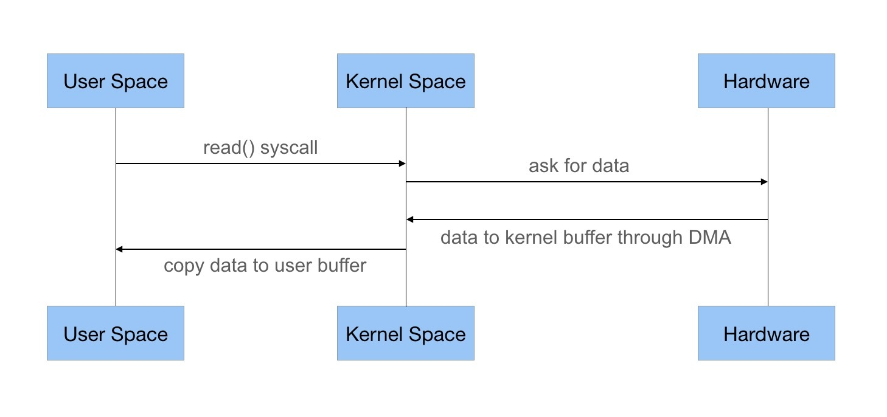

- JVM会发出read()系统调用，并通过read系统调用向内核发起读请求；
- 内核向硬件发送读指令，并等待读就绪；
- 内核把将要读取的数据复制到指向的内核缓存中；
- 操作系统内核将数据复制到用户空间缓冲区，然后read系统调用返回。
  在这个过程中，数据先从外部设备复制到内核空间，再从内核空间复制到用户空间，这就发生了两次内存复制操作。这种操作会导致不必要的数据拷贝和上下文切换，从而降低I/O的性能。

#### 2.阻塞

在传统I/O中，InputStream的read()是一个while循环操作，它会一直等待数据读取，直到数据就绪才会返回。这就意味着如果没有数据就绪，这个读取操作将会一直被挂起，用户线程将会处于阻塞状态。

在少量连接请求的情况下，使用这种方式没有问题，响应速度也很高。但在发生大量连接请求时，就需要创建大量监听线程，这时如果线程没有数据就绪就会被挂起，然后进入阻塞状态。一旦发生线程阻塞，这些线程将会不断地抢夺CPU资源，从而导致大量的CPU上下文切换，增加系统的性能开销。

---

### 2.7.2 如何优化I/O操作

面对以上两个性能问题，不仅编程语言对此做了优化，各个操作系统也进一步优化了I/O。JDK1.4发布了java.nio包（new I/O的缩写），NIO的发布优化了内存复制以及阻塞导致的严重性能问题。JDK1.7又发布了NIO2，提出了从操作系统层面实现的异步I/O。下面我们就来了解下具体的优化实现。

#### 1.使用缓冲区优化读写流操作

在传统I/O中，提供了基于流的I/O实现，即InputStream和OutputStream，这种基于流的实现以字节为单位处理数据。

NIO与传统 I/O 不同，它是基于块（Block）的，它以块为基本单位处理数据。在NIO中，最为重要的两个组件是缓冲区（Buffer）和通道（Channel）。Buffer是一块连续的内存块，是 NIO 读写数据的中转地。Channel表示缓冲数据的源头或者目的地，它用于读取缓冲或者写入数据，是访问缓冲的接口。

传统I/O和NIO的最大区别就是传统I/O是面向流，NIO是面向Buffer。Buffer可以将文件一次性读入内存再做后续处理，而传统的方式是边读文件边处理数据。虽然传统I/O后面也使用了缓冲块，例如BufferedInputStream，但仍然不能和NIO相媲美。使用NIO替代传统I/O操作，可以提升系统的整体性能，效果立竿见影。

#### 2. 使用DirectBuffer减少内存复制

NIO的Buffer除了做了缓冲块优化之外，还提供了一个可以直接访问物理内存的类DirectBuffer。普通的Buffer分配的是JVM堆内存，而DirectBuffer是直接分配物理内存(非堆内存)。

我们知道数据要输出到外部设备，必须先从用户空间复制到内核空间，再复制到输出设备，而在Java中，在用户空间中又存在一个拷贝，那就是从Java堆内存中拷贝到临时的直接内存中，通过临时的直接内存拷贝到内存空间中去。此时的直接内存和堆内存都是属于用户空间。
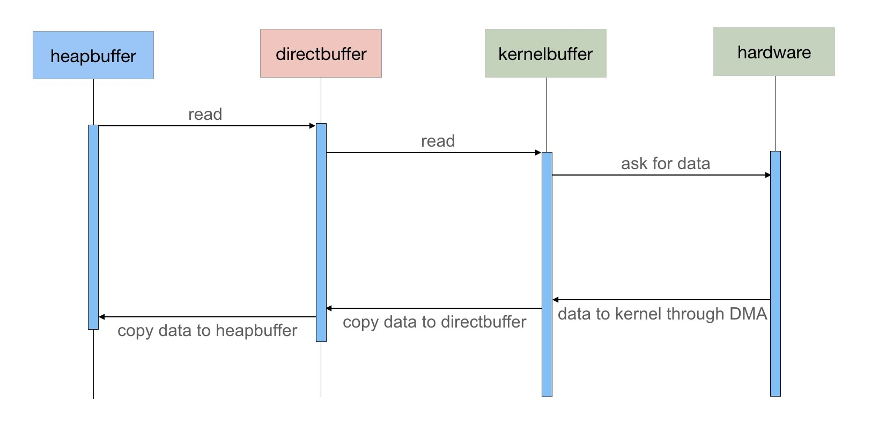
你肯定会在想，为什么Java需要通过一个临时的非堆内存来复制数据呢？如果单纯使用Java堆内存进行数据拷贝，当拷贝的数据量比较大的情况下，Java堆的GC压力会比较大，而使用非堆内存可以减低GC的压力。

DirectBuffer则是直接将步骤简化为数据直接保存到非堆内存，从而减少了一次数据拷贝。以下是JDK源码中IOUtil.java类中的write方法：

```
if (src instanceof DirectBuffer)
            return writeFromNativeBuffer(fd, src, position, nd);

        // Substitute a native buffer
        int pos = src.position();
        int lim = src.limit();
        assert (pos <= lim);
        int rem = (pos <= lim ? lim - pos : 0); 
        ByteBuffer bb = Util.getTemporaryDirectBuffer(rem);
        try {
            bb.put(src);
            bb.flip();
        // ...............
```

这里拓展一点，由于DirectBuffer申请的是非JVM的物理内存，所以创建和销毁的代价很高。DirectBuffer申请的内存并不是直接由JVM负责垃圾回收，但在DirectBuffer包装类被回收时，会通过Java Reference机制来释放该内存块。

DirectBuffer只优化了用户空间内部的拷贝，而之前我们是说优化用户空间和内核空间的拷贝，那Java的NIO中是否能做到减少用户空间和内核空间的拷贝优化呢？

答案是可以的，DirectBuffer是通过unsafe.allocateMemory(size)方法分配内存，也就是基于本地类Unsafe类调用native方法进行内存分配的。而在NIO中，还存在另外一个Buffer类：MappedByteBuffer，跟DirectBuffer不同的是，MappedByteBuffer是通过本地类调用mmap进行文件内存映射的，map()系统调用方法会直接将文件从硬盘拷贝到用户空间，只进行一次数据拷贝，从而减少了传统的read()方法从硬盘拷贝到内核空间这一步。

#### 3.避免阻塞，优化I/O操作

NIO很多人也称之为Non-block I/O，即非阻塞I/O，因为这样叫，更能体现它的特点。为什么这么说呢？传统的I/O即使使用了缓冲块，依然存在阻塞问题。由于线程池线程数量有限，一旦发生大量并发请求，超过最大数量的线程就只能等待，直到线程池中有空闲的线程可以被复用。而对Socket的输入流进行读取时，读取流会一直阻塞，直到发生以下三种情况的任意一种才会解除阻塞：

- 有数据可读；
- 连接释放；
- 空指针或I/O异常。

阻塞问题，就是传统I/O最大的弊端。NIO发布后，通道和多路复用器这两个基本组件实现了NIO的非阻塞，下面我们就一起来了解下这两个组件的优化原理。

##### 通道（Channel）

前面我们讨论过，传统I/O的数据读取和写入是从用户空间到内核空间来回复制，而内核空间的数据是通过操作系统层面的I/O接口从磁盘读取或写入。最开始，在应用程序调用操作系统I/O接口时，是由CPU完成分配，这种方式最大的问题是“发生大量I/O请求时，非常消耗CPU“；之后，操作系统引入了DMA（直接存储器存储），内核空间与磁盘之间的存取完全由DMA负责，但这种方式依然需要向CPU申请权限，且需要借助DMA总线来完成数据的复制操作，如果DMA总线过多，就会造成总线冲突。

通道的出现解决了以上问题，Channel有自己的处理器，可以完成内核空间和磁盘之间的I/O操作。在NIO中，我们读取和写入数据都要通过Channel，由于Channel是双向的，所以读、写可以同时进行。

##### 多路复用器（Selector）

Selector是Java NIO编程的基础。用于检查一个或多个NIO Channel的状态是否处于可读、可写。Selector是基于事件驱动实现的，我们可以在Selector中注册accpet、read监听事件，Selector会不断轮询注册在其上的Channel，如果某个Channel上面发生监听事件，这个Channel就处于就绪状态，然后进行I/O操作。

一个线程使用一个Selector，通过轮询的方式，可以监听多个Channel上的事件。我们可以在注册Channel时设置该通道为非阻塞，当Channel上没有I/O操作时，该线程就不会一直等待了，而是会不断轮询所有Channel，从而避免发生阻塞。

目前操作系统的I/O多路复用机制都使用了epoll，相比传统的select机制，epoll没有最大连接句柄1024的限制。所以Selector在理论上可以轮询成千上万的客户端。下面我用一个生活化的场景来举例，看完你就更清楚Channel和Selector在非阻塞I/O中承担什么角色，发挥什么作用了。

- 我们可以把监听多个I/O连接请求比作一个火车站的进站口。以前检票只能让搭乘就近一趟发车的旅客提前进站，而且只有一个检票员，这时如果有其他车次的旅客要进站，就只能在站口排队。这就相当于最早没有实现线程池的I/O操作。
- 后来火车站升级了，多了几个检票入口，允许不同车次的旅客从各自对应的检票入口进站。这就相当于用多线程创建了多个监听线程，同时监听各个客户端的I/O请求。
- 最后火车站进行了升级改造，可以容纳更多旅客了，每个车次载客更多了，而且车次也安排合理，乘客不再扎堆排队，可以从一个大的统一的检票口进站了，这一个检票口可以同时检票多个车次。这个大的检票口就相当于Selector，车次就相当于Channel，旅客就相当于I/O流。

### 2.7.3 总结

Java的传统I/O开始是基于InputStream和OutputStream两个操作流实现的，这种流操作是以字节为单位，如果在高并发、大数据场景中，很容易导致阻塞，因此这种操作的性能是非常差的。还有，输出数据从用户空间复制到内核空间，再复制到输出设备，这样的操作会增加系统的性能开销。

传统I/O后来使用了Buffer优化了“阻塞”这个性能问题，以缓冲块作为最小单位，但相比整体性能来说依然不尽人意。于是NIO发布，它是基于缓冲块为单位的流操作，在Buffer的基础上，新增了两个组件“管道和多路复用器”，实现了非阻塞I/O，NIO适用于发生大量I/O连接请求的场景，这三个组件共同提升了I/O的整体性能。你可以在[Github](https://github.com/nickliuchao/io)上通过几个简单的例子来实践下传统IO、NIO。

**思考题:**
在JDK1.7版本中，Java发布了NIO的升级包NIO2，也就是AIO。AIO实现了真正意义上的异步I/O，它是直接将I/O操作交给操作系统进行异步处理。这也是对I/O操作的一种优化，那为什么现在很多容器的通信框架都还是使用NIO呢？

**解答：**

1. 成熟度和稳定性
   NIO 更成熟：NIO 已经存在很长时间，广泛应用于各种项目，成熟且稳定。
   AIO 相对较新：AIO 相对较新，生产环境中使用较少，相对不够成熟稳定。
2. 生态系统和兼容性
   NIO 生态系统广泛：许多成熟的框架（如 Netty、Tomcat）都基于 NIO 实现，有丰富的第三方库支持。
   兼容性好：广泛的支持和验证使得 NIO 更容易与现有系统和库兼容。
3. 性能和复杂性
   性能足够：NIO 在大多数高并发场景下已经足够高效。
   开发复杂性较低：NIO 编程模型相对简单，易于掌握和应用，而 AIO 编程模型相对复杂。
4. 平台支持
   跨平台性好：NIO 对各类操作系统有更好的支持和一致性。
   AIO 支持不一致：AIO 在不同操作系统上的实现和性能可能存在差异。

## 2.8 网络通信优化之序列化:避免使用Java序列化

当前大部分后端服务都是基于微服务架构实现的。服务按照业务划分被拆分，实现了服务的解耦，但同时也带来了新的问题，不同业务之间通信需要通过接口实现调用。两个服务之间要共享一个数据对象，就需要从对象转换成二进制流，通过网络传输，传送到对方服务，再转换回对象，供服务方法调用。这个编码和解码过程我们称之为序列化与反序列化。

在大量并发请求的情况下，如果序列化的速度慢，会导致请求响应时间增加；而序列化后的传输数据体积大，会导致网络吞吐量下降。所以一个优秀的序列化框架可以提高系统的整体性能。

我们知道，Java提供了RMI框架可以实现服务与服务之间的接口暴露和调用，RMI中对数据对象的序列化采用的是Java序列化。而目前主流的微服务框架却几乎没有用到Java序列化，SpringCloud用的是Json序列化，Dubbo虽然兼容了Java序列化，但默认使用的是Hessian序列化。这是为什么呢？今天我们就来深入了解下Java序列化，再对比近两年比较火的Protobuf序列化，看看Protobuf是如何实现最优序列化的。

### 2.8.1 Java序列化

在说缺陷之前，你先得知道什么是Java序列化以及它的实现原理。Java提供了一种序列化机制，这种机制能够将一个对象序列化为二进制形式（字节数组），用于写入磁盘或输出到网络，同时也能从网络或磁盘中读取字节数组，反序列化成对象，在程序中使用。
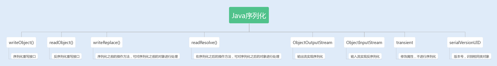

JDK提供的两个输入、输出流对象ObjectInputStream和ObjectOutputStream，它们只能对实现了Serializable接口的类的对象进行反序列化和序列化。ObjectOutputStream的默认序列化方式，仅对对象的非transient的实例变量进行序列化，而不会序列化对象的transient的实例变量，也不会序列化静态变量。

在实现了Serializable接口的类的对象中，会生成一个serialVersionUID的版本号，这个版本号有什么用呢？它会在反序列化过程中来验证序列化对象是否加载了反序列化的类，如果是具有相同类名的不同版本号的类，在反序列化中是无法获取对象的。

具体实现序列化的是writeObject和readObject，通常这两个方法是默认的，当然我们也可以在实现Serializable接口的类中对其进行重写，定制一套属于自己的序列化与反序列化机制。另外，Java序列化的类中还定义了两个重写方法：writeReplace()和readResolve()，前者是用来在序列化之前替换序列化对象的，后者是用来在反序列化之后对返回对象进行处理的。

---

### 2.8.2 Java序列化的缺陷

如果你用过一些RPC通信框架，你就会发现这些框架很少使用JDK提供的序列化。其实不用和不好用多半是挂钩的，下面我们就一起来看看JDK默认的序列化到底存在着哪些缺陷。

#### 1.无法跨语言

现在的系统设计越来越多元化，很多系统都使用了多种语言来编写应用程序。比如，我们公司开发的一些大型游戏就使用了多种语言，C++写游戏服务，Java/Go写周边服务，Python写一些监控应用。而Java序列化目前只适用基于Java语言实现的框架，其它语言大部分都没有使用Java的序列化框架，也没有实现Java序列化这套协议。因此，如果是两个基于不同语言编写的应用程序相互通信，则无法实现两个应用服务之间传输对象的序列化与反序列化。

#### 2.易被攻击

Java官网安全编码指导方针中说明：“对不信任数据的反序列化，从本质上来说是危险的，应该予以避免”。可见Java序列化是不安全的。我们知道对象是通过在ObjectInputStream上调用readObject()方法进行反序列化的，这个方法其实是一个神奇的构造器，它可以将类路径上几乎所有实现了Serializable接口的对象都实例化。这也就意味着，在反序列化字节流的过程中，该方法可以执行任意类型的代码，这是非常危险的。

对于需要长时间进行反序列化的对象，不需要执行任何代码，也可以发起一次攻击。攻击者可以创建循环对象链，然后将序列化后的对象传输到程序中反序列化，这种情况会导致hashCode方法被调用次数呈次方爆发式增长, 从而引发栈溢出异常。例如下面这个案例就可以很好地说明。

```
Set root = new HashSet();  
Set s1 = root;  
Set s2 = new HashSet();  
for (int i = 0; i < 100; i++) {  
   Set t1 = new HashSet();  
   Set t2 = new HashSet();  
   t1.add("foo"); //使t2不等于t1  
   s1.add(t1);  
   s1.add(t2);  
   s2.add(t1);  
   s2.add(t2);  
   s1 = t1;  
   s2 = t2;   
}
```

2015年FoxGlove Security安全团队的breenmachine发布过一篇长博客，主要内容是：通过Apache Commons Collections，Java反序列化漏洞可以实现攻击。一度横扫了WebLogic、WebSphere、JBoss、Jenkins、OpenNMS的最新版，各大Java Web Server纷纷躺枪。其实，Apache Commons Collections就是一个第三方基础库，它扩展了Java标准库里的Collection结构，提供了很多强有力的数据结构类型，并且实现了各种集合工具类。

实现攻击的原理就是：Apache Commons Collections允许链式的任意的类函数反射调用，攻击者通过“实现了Java序列化协议”的端口，把攻击代码上传到服务器上，再由Apache Commons Collections里的TransformedMap来执行。

**那么后来是如何解决这个漏洞的呢？**

很多序列化协议都制定了一套数据结构来保存和获取对象。例如，JSON序列化、ProtocolBuf等，它们只支持一些基本类型和数组数据类型，这样可以避免反序列化创建一些不确定的实例。虽然它们的设计简单，但足以满足当前大部分系统的数据传输需求。我们也可以通过反序列化对象白名单来控制反序列化对象，可以重写resolveClass方法，并在该方法中校验对象名字。代码如下所示：

```
@Override
protected Class resolveClass(ObjectStreamClass desc) throws IOException,ClassNotFoundException {
if (!desc.getName().equals(Bicycle.class.getName())) {

throw new InvalidClassException(
"Unauthorized deserialization attempt", desc.getName());
}
return super.resolveClass(desc);
}
```

#### 3.序列化后的流太大

序列化后的二进制流大小能体现序列化的性能。序列化后的二进制数组越大，占用的存储空间就越多，存储硬件的成本就越高。如果我们是进行网络传输，则占用的带宽就更多，这时就会影响到系统的吞吐量。

Java序列化中使用了ObjectOutputStream来实现对象转二进制编码，那么这种序列化机制实现的二进制编码完成的二进制数组大小，相比于NIO中的ByteBuffer实现的二进制编码完成的数组大小，有没有区别呢？

我们可以通过一个简单的例子来验证下：

```
User user = new User();
        user.setUserName("test");
        user.setPassword("test");
  
        ByteArrayOutputStream os =new ByteArrayOutputStream();
        ObjectOutputStream out = new ObjectOutputStream(os);
        out.writeObject(user);
  
        byte[] testByte = os.toByteArray();
        System.out.print("ObjectOutputStream 字节编码长度：" + testByte.length + "\n");

  ByteBuffer byteBuffer = ByteBuffer.allocate( 2048);

        byte[] userName = user.getUserName().getBytes();
        byte[] password = user.getPassword().getBytes();
        byteBuffer.putInt(userName.length);
        byteBuffer.put(userName);
        byteBuffer.putInt(password.length);
        byteBuffer.put(password);
  
        byteBuffer.flip();
        byte[] bytes = new byte[byteBuffer.remaining()];
        System.out.print("ByteBuffer 字节编码长度：" + bytes.length+ "\n");
```

运行结果：

```
ObjectOutputStream 字节编码长度：99
ByteBuffer 字节编码长度：16
```

这里我们可以清楚地看到：Java序列化实现的二进制编码完成的二进制数组大小，比ByteBuffer实现的二进制编码完成的二进制数组大小要大上几倍。因此，Java序列后的流会变大，最终会影响到系统的吞吐量。

#### 4.序列化性能太差

序列化的速度也是体现序列化性能的重要指标，如果序列化的速度慢，就会影响网络通信的效率，从而增加系统的响应时间。我们再来通过上面这个例子，来对比下Java序列化与NIO中的ByteBuffer编码的性能：

```
User user = new User();
        user.setUserName("test");
        user.setPassword("test");
  
        long startTime = System.currentTimeMillis();
  
        for(int i=0; i<1000; i++) {
        ByteArrayOutputStream os =new ByteArrayOutputStream();
            ObjectOutputStream out = new ObjectOutputStream(os);
            out.writeObject(user);
            out.flush();
            out.close();
            byte[] testByte = os.toByteArray();
            os.close();
        }
  
  
        long endTime = System.currentTimeMillis();
        System.out.print("ObjectOutputStream 序列化时间：" + (endTime - startTime) + "\n");

long startTime1 = System.currentTimeMillis();
        for(int i=0; i<1000; i++) {
        ByteBuffer byteBuffer = ByteBuffer.allocate( 2048);

            byte[] userName = user.getUserName().getBytes();
            byte[] password = user.getPassword().getBytes();
            byteBuffer.putInt(userName.length);
            byteBuffer.put(userName);
            byteBuffer.putInt(password.length);
            byteBuffer.put(password);
  
            byteBuffer.flip();
            byte[] bytes = new byte[byteBuffer.remaining()];
        }
        long endTime1 = System.currentTimeMillis();
        System.out.print("ByteBuffer 序列化时间：" + (endTime1 - startTime1)+ "\n");
```

运行结果：

```
ObjectOutputStream 序列化时间：29
ByteBuffer 序列化时间：6
```

通过以上案例，我们可以清楚地看到：Java序列化中的编码耗时要比ByteBuffer长很多。

---

### 2.8.3 使用Protobuf序列化替换Java序列化

目前业内优秀的序列化框架有很多，而且大部分都避免了Java默认序列化的一些缺陷。例如，最近几年比较流行的**FastJson**、Kryo、Protobuf、Hessian等。我们完全可以找一种替换掉Java序列化，这里我推荐使用Protobuf序列化框架。Protobuf是由Google推出且支持多语言的序列化框架，目前在主流网站上的序列化框架性能对比测试报告中，Protobuf无论是编解码耗时，还是二进制流压缩大小，都名列前茅。

Protobuf以一个 .proto 后缀的文件为基础，这个文件描述了字段以及字段类型，通过工具可以生成不同语言的数据结构文件。在序列化该数据对象的时候，Protobuf通过.proto文件描述来生成Protocol Buffers格式的编码。这里拓展一点，我来讲下什么是Protocol Buffers存储格式以及它的实现原理。

Protocol Buffers 是一种轻便高效的结构化数据存储格式。它使用T-L-V（标识 - 长度 - 字段值）的数据格式来存储数据，T代表字段的正数序列(tag)，Protocol Buffers 将对象中的每个字段和正数序列对应起来，对应关系的信息是由生成的代码来保证的。在序列化的时候用整数值来代替字段名称，于是传输流量就可以大幅缩减；L代表Value的字节长度，一般也只占一个字节；V则代表字段值经过编码后的值。这种数据格式不需要分隔符，也不需要空格，同时减少了冗余字段名。

Protobuf定义了一套自己的编码方式，几乎可以映射Java/Python等语言的所有基础数据类型。不同的编码方式对应不同的数据类型，还能采用不同的存储格式。如下图所示：
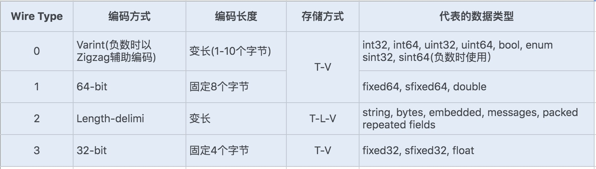
对于存储Varint编码数据，由于数据占用的存储空间是固定的，就不需要存储字节长度 Length，所以实际上Protocol Buffers的存储方式是 T - V，这样就又减少了一个字节的存储空间。Protobuf定义的Varint编码方式是一种变长的编码方式，每个字节的最后一位(即最高位)是一个标志位(msb)，用0和1来表示，0表示当前字节已经是最后一个字节，1表示这个数字后面还有一个字节。

对于int32类型数字，一般需要4个字节表示，若采用Varint编码方式，对于很小的int32类型数字，就可以用1个字节来表示。对于大部分整数类型数据来说，一般都是小于256，所以这种操作可以起到很好地压缩数据的效果。我们知道int32代表正负数，所以一般最后一位是用来表示正负值，现在Varint编码方式将最后一位用作了标志位，那还如何去表示正负整数呢？如果使用int32/int64表示负数就需要多个字节来表示，在Varint编码类型中，通过Zigzag编码进行转换，将负数转换成无符号数，再采用sint32/sint64来表示负数，这样就可以大大地减少编码后的字节数。

Protobuf的这种数据存储格式，不仅压缩存储数据的效果好， 在编码和解码的性能方面也很高效。Protobuf的编码和解码过程结合.proto文件格式，加上Protocol Buffer独特的编码格式，只需要简单的数据运算以及位移等操作就可以完成编码与解码。可以说Protobuf的整体性能非常优秀。

---

### 2.8.4 总结

无论是网路传输还是磁盘持久化数据，我们都需要将数据编码成字节码，而我们平时在程序中使用的数据都是基于内存的数据类型或者对象，我们需要通过编码将这些数据转化成二进制字节流；如果需要接收或者再使用时，又需要通过解码将二进制字节流转换成内存数据。我们通常将这两个过程称为序列化与反序列化。

Java默认的序列化是通过Serializable接口实现的，只要类实现了该接口，同时生成一个默认的版本号，我们无需手动设置，该类就会自动实现序列化与反序列化。Java默认的序列化虽然实现方便，但却存在安全漏洞、不跨语言以及性能差等缺陷，所以我强烈建议你避免使用Java序列化。

纵观主流序列化框架，FastJson、Protobuf、Kryo是比较有特点的，而且性能以及安全方面都得到了业界的认可，我们可以结合自身业务来选择一种适合的序列化框架，来优化系统的序列化性能。

**思考题：**
这是一个使用单例模式实现的类，如果我们将该类实现Java的Serializable接口，它还是单例吗？如果要你来写一个实现了Java的Serializable接口的单例，你会怎么写呢？

```
public class Singleton implements Serializable{

    private final static Singleton singleInstance = new Singleton();

    private Singleton(){}

    public static Singleton getInstance(){
       return singleInstance; 
    }
}
```

**解答：**
在 Java 中，实现 Serializable 接口的单例类在反序列化过程中可能会破坏单例模式。具体来说，当反序列化一个对象时，会创建一个新的对象实例，即使原来的实例已经存在。这就违背了单例模式的设计意图。为了解决这个问题，我们需要通过实现自定义的反序列化机制，确保在反序列化时返回同一个实例。我们可以通过实现 readResolve 方法来实现这一点。

- 反射攻击防护：构造函数中加入检查 if (INSTANCE != null)，防止使用反射创建新的实例。
- readResolve 方法：eadResolve 方法被定义在反序列化之后自动调用，用来替换反序列化出来的对象。在这个方法中返回实际的单例实例 INSTANCE，保证反序列化不会创建新的实例。

```
import java.io.ObjectStreamException;
import java.io.Serializable;

public class Singleton implements Serializable {
    private static final long serialVersionUID = 1L; // 推荐添加 serialVersionUID 用于版本控制
  
    private static final Singleton INSTANCE = new Singleton();
  
    private Singleton() {
        // 通过反射来阻止创建新的实例
        if (INSTANCE != null) {
            throw new IllegalStateException("Singleton already initialized");
        }
    }
  
    public static Singleton getInstance() {
        return INSTANCE;
    }
  
    // 防止创建新的实例，在反序列化时返回已有实例
    private Object readResolve() throws ObjectStreamException {
        return INSTANCE;
    }
}
```

## 2.9 网络通信优化之通信协议:如何优化RPC网络通信?

上一讲中，我提到了微服务框架，其中SpringCloud和Dubbo的使用最为广泛，行业内也一直存在着对两者的比较，很多技术人会为这两个框架哪个更好而争辩。

我记得我们部门在搭建微服务框架时，也在技术选型上纠结良久，还曾一度有过激烈的讨论。当前SpringCloud炙手可热，具备完整的微服务生态，得到了很多同事的票选，但我们最终的选择却是Dubbo，这是为什么呢？

### 2.9.1 RPC通信是大型服务框架的核心

我们经常讨论微服务，首要应该了解的就是微服务的核心到底是什么，这样我们在做技术选型时，才能更准确地把握需求。就我个人理解，我认为微服务的核心是远程通信和服务治理。远程通信提供了服务之间通信的桥梁，服务治理则提供了服务的后勤保障。所以，我们在做技术选型时，更多要考虑的是这两个核心的需求。

我们知道服务的拆分增加了通信的成本，特别是在一些抢购或者促销的业务场景中，如果服务之间存在方法调用，比如，抢购成功之后需要调用订单系统、支付系统、券包系统等，这种远程通信就很容易成为系统的瓶颈。所以，在满足一定的服务治理需求的前提下，对远程通信的性能需求就是技术选型的主要影响因素。目前，很多微服务框架中的服务通信是基于RPC通信实现的，在没有进行组件扩展的前提下，SpringCloud是基于Feign组件实现的RPC通信（基于Http+Json序列化实现），Dubbo是基于SPI扩展了很多RPC通信框架，包括RMI、Dubbo、Hessian等RPC通信框架（默认是Dubbo+Hessian序列化）。不同的业务场景下，RPC通信的选择和优化标准也不同。

例如，开头我提到的我们部门在选择微服务框架时，选择了Dubbo。当时的选择标准就是RPC通信可以支持抢购类的高并发，在这个业务场景中，请求的特点是瞬时高峰、请求量大和传入、传出参数数据包较小。而Dubbo中的Dubbo协议就很好地支持了这个请求。以下是基于Dubbo:2.6.4版本进行的简单的性能测试。分别测试Dubbo+Protobuf序列化以及Http+Json序列化的通信性能（这里主要模拟单一TCP长连接+Protobuf序列化和短连接的Http+Json序列化的性能对比）。为了验证在数据量不同的情况下二者的性能表现，我分别准备了小对象和大对象的性能压测，通过这样的方式我们也可以间接地了解下二者在RPC通信方面的水平。

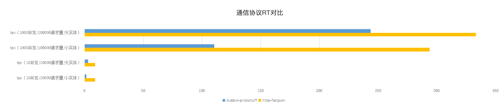

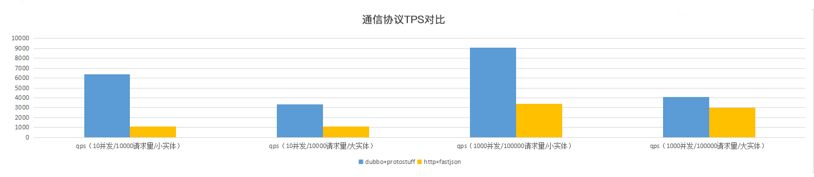

这个测试是我之前的积累，基于测试环境比较复杂，这里我就直接给出结果了，如果你感兴趣的话，可以留言和我讨论。通过以上测试结果可以发现：无论从响应时间还是吞吐量上来看，单一TCP长连接+Protobuf序列化实现的RPC通信框架都有着非常明显的优势。

在高并发场景下，我们选择后端服务框架或者中间件部门自行设计服务框架时，RPC通信是重点优化的对象。其实，目前成熟的RPC通信框架非常多，如果你们公司没有自己的中间件团队，也可以基于开源的RPC通信框架做扩展。在正式进行优化之前，我们不妨简单回顾下RPC。

### 2.9.2 什么是RPC通信

一提到RPC，你是否还想到MVC、SOA这些概念呢？如果你没有经历过这些架构的演变，这些概念就很容易混淆。你可以通过下面这张图来了解下这些架构的演变史。


无论是微服务、SOA、还是RPC架构，它们都是分布式服务架构，都需要实现服务之间的互相通信，我们通常把这种通信统称为RPC通信。

- RPC（Remote Process Call），即远程服务调用，是通过网络请求远程计算机程序服务的通信技术。RPC框架封装好了底层网络通信、序列化等技术，我们只需要在项目中引入各个服务的接口包，就可以实现在代码中调用RPC服务同调用本地方法一样。正因为这种方便、透明的远程调用，RPC被广泛应用于当下企业级以及互联网项目中，是实现分布式系统的核心。
- RMI（Remote Method Invocation）是JDK中最先实现了RPC通信的框架之一，RMI的实现对建立分布式Java应用程序至关重要，是Java体系非常重要的底层技术，很多开源的RPC通信框架也是基于RMI实现原理设计出来的，包括Dubbo框架中也接入了RMI框架。接下来我们就一起了解下RMI的实现原理，看看它存在哪些性能瓶颈有待优化。

### 2.9.3 RMI：JDK自带的RPC通信框架

目前RMI已经很成熟地应用在了EJB以及Spring框架中，是纯Java网络分布式应用系统的核心解决方案。RMI实现了一台虚拟机应用对远程方法的调用可以同对本地方法的调用一样，RMI帮我们封装好了其中关于远程通信的内容。

#### RMI的实现原理

RMI远程代理对象是RMI中最核心的组件，除了对象本身所在的虚拟机，其它虚拟机也可以调用此对象的方法。而且这些虚拟机可以不在同一个主机上，通过远程代理对象，远程应用可以用网络协议与服务进行通信。我们可以通过一张图来详细地了解下整个RMI的通信过程：

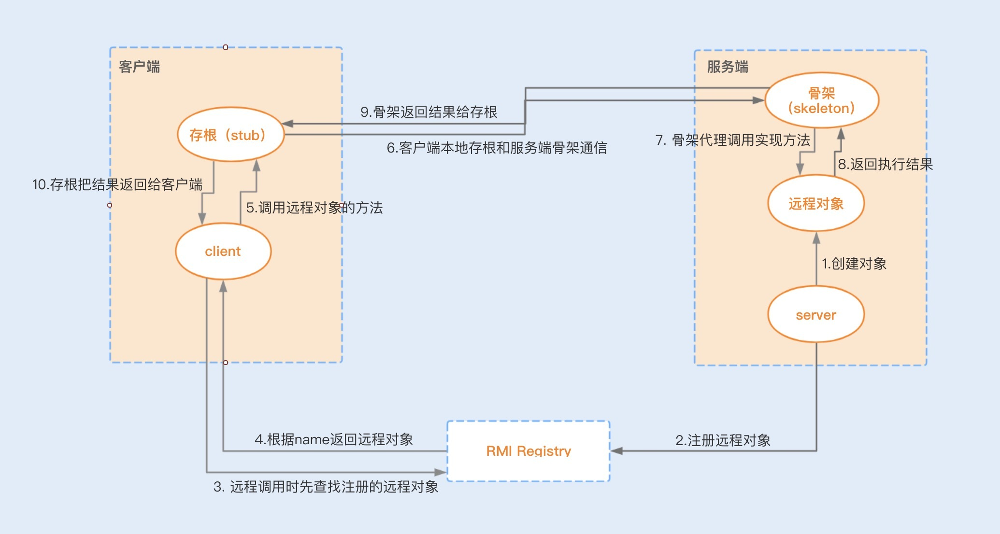

#### RMI在高并发场景下的性能瓶颈

- Java默认序列化

RMI的序列化采用的是Java默认的序列化方式，我在09讲中详细地介绍过Java序列化，我们深知它的性能并不是很好，而且其它语言框架也暂时不支持Java序列化。

* TCP短连接

由于RMI是基于TCP短连接实现，在高并发情况下，大量请求会带来大量连接的创建和销毁，这对于系统来说无疑是非常消耗性能的。

* 阻塞式网络I/O

在08讲中，我提到了网络通信存在I/O瓶颈，如果在Socket编程中使用传统的I/O模型，在高并发场景下基于短连接实现的网络通信就很容易产生I/O阻塞，性能将会大打折扣。

### 2.9.4一个高并发场景下的RPC通信优化路径

SpringCloud的RPC通信和RMI通信的性能瓶颈就非常相似。SpringCloud是基于Http通信协议（短连接）和Json序列化实现的，在高并发场景下并没有优势。 那么，在瞬时高并发的场景下，我们又该如何去优化一个RPC通信呢？RPC通信包括了建立通信、实现报文、传输协议以及传输数据编解码等操作，接下来我们就从每一层的优化出发，逐步实现整体的性能优化。

#### 1.选择合适的通信协议

要实现不同机器间的网络通信，我们先要了解计算机系统网络通信的基本原理。网络通信是两台设备之间实现数据流交换的过程，是基于网络传输协议和传输数据的编解码来实现的。其中网络传输协议有TCP、UDP协议，这两个协议都是基于Socket编程接口之上，为某类应用场景而扩展出的传输协议。通过以下两张图，我们可以大概了解到基于TCP和UDP协议实现的Socket网络通信是怎样的一个流程。

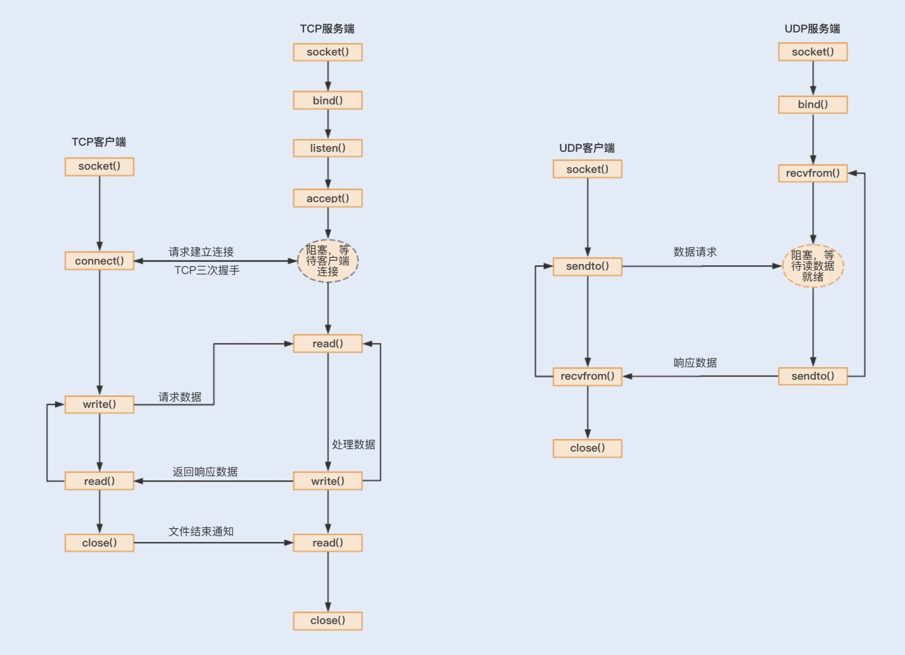

基于TCP协议实现的Socket通信是有连接的，而传输数据是要通过三次握手来实现数据传输的可靠性，且传输数据是没有边界的，采用的是字节流模式。基于UDP协议实现的Socket通信，客户端不需要建立连接，只需要创建一个套接字发送数据报给服务端，这样就不能保证数据报一定会达到服务端，所以在传输数据方面，基于UDP协议实现的Socket通信具有不可靠性。UDP发送的数据采用的是数据报模式，每个UDP的数据报都有一个长度，该长度将与数据一起发送到服务端。

通过对比，我们可以得出优化方法：为了保证数据传输的可靠性，通常情况下我们会采用TCP协议。如果在局域网且对数据传输的可靠性没有要求的情况下，我们也可以考虑使用UDP协议，毕竟这种协议的效率要比TCP协议高。

#### 2.使用单一长连接

如果是基于TCP协议实现Socket通信，我们还能做哪些优化呢？服务之间的通信不同于客户端与服务端之间的通信。客户端与服务端由于客户端数量多，基于短连接实现请求可以避免长时间地占用连接，导致系统资源浪费。

但服务之间的通信，连接的消费端不会像客户端那么多，但消费端向服务端请求的数量却一样多，我们基于长连接实现，就可以省去大量的TCP建立和关闭连接的操作，从而减少系统的性能消耗，节省时间。

#### 3.优化Socket通信

建立两台机器的网络通信，我们一般使用Java的Socket编程实现一个TCP连接。传统的Socket通信主要存在I/O阻塞、线程模型缺陷以及内存拷贝等问题。我们可以使用比较成熟的通信框架，比如Netty。Netty4对Socket通信编程做了很多方面的优化，具体见下方。实现非阻塞I/O：在08讲中，我们提到了多路复用器Selector实现了非阻塞I/O通信。

- 高效的Reactor线程模型：Netty使用了主从Reactor多线程模型，服务端接收客户端请求连接是用了一个主线程，这个主线程用于客户端的连接请求操作，一旦连接建立成功，将会监听I/O事件，监听到事件后会创建一个链路请求。链路请求将会注册到负责I/O操作的I/O工作线程上，由I/O工作线程负责后续的I/O操作。利用这种线程模型，可以解决在高负载、高并发的情况下，由于单个NIO线程无法监听海量客户端和满足大量I/O操作造成的问题。
- 串行设计：服务端在接收消息之后，存在着编码、解码、读取和发送等链路操作。如果这些操作都是基于并行去实现，无疑会导致严重的锁竞争，进而导致系统的性能下降。为了提升性能，Netty采用了串行无锁化完成链路操作，Netty提供了Pipeline实现链路的各个操作在运行期间不进行线程切换。
- 零拷贝：在08讲中，我们提到了一个数据从内存发送到网络中，存在着两次拷贝动作，先是从用户空间拷贝到内核空间，再是从内核空间拷贝到网络I/O中。而NIO提供的ByteBuffer可以使用Direct Buffers模式，直接开辟一个非堆物理内存，不需要进行字节缓冲区的二次拷贝，可以直接将数据写入到内核空间。

除了以上这些优化，我们还可以针对套接字编程提供的一些TCP参数配置项，提高网络吞吐量，Netty可以基于ChannelOption来设置这些参数。

- TCP\_NODELAY：TCP\_NODELAY选项是用来控制是否开启Nagle算法。Nagle算法通过缓存的方式将小的数据包组成一个大的数据包，从而避免大量的小数据包发送阻塞网络，提高网络传输的效率。我们可以关闭该算法，优化对于时延敏感的应用场景。
- SO\_RCVBUF和SO\_SNDBUF：可以根据场景调整套接字发送缓冲区和接收缓冲区的大小。
- SO\_BACKLOG：backlog参数指定了客户端连接请求缓冲队列的大小。服务端处理客户端连接请求是按顺序处理的，所以同一时间只能处理一个客户端连接，当有多个客户端进来的时候，服务端就会将不能处理的客户端连接请求放在队列中等待处理。
- SO\_KEEPALIVE：当设置该选项以后，连接会检查长时间没有发送数据的客户端的连接状态，检测到客户端断开连接后，服务端将回收该连接。我们可以将该时间设置得短一些，来提高回收连接的效率。

#### 4.量身定做报文格式

接下来就是实现报文，我们需要设计一套报文，用于描述具体的校验、操作、传输数据等内容。为了提高传输的效率，我们可以根据自己的业务和架构来考虑设计，尽量实现报体小、满足功能、易解析等特性。我们可以参考下面的数据格式：


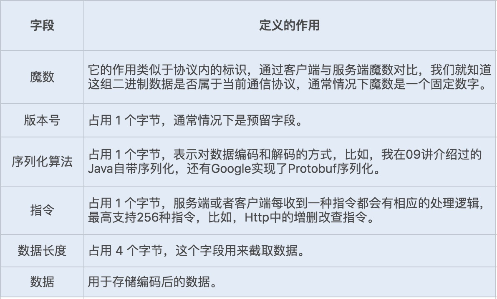

#### 5.编码、解码

在09讲中，我们分析过序列化编码和解码的过程，对于实现一个好的网络通信协议来说，兼容优秀的序列化框架是非常重要的。如果只是单纯的数据对象传输，我们可以选择性能相对较好的Protobuf序列化，有利于提高网络通信的性能。

#### 6.调整Linux的TCP参数设置选项

如果RPC是基于TCP短连接实现的，我们可以通过修改Linux TCP配置项来优化网络通信。开始TCP配置项的优化之前，我们先来了解下建立TCP连接的三次握手和关闭TCP连接的四次握手，这样有助后面内容的理解。

* 三次握手 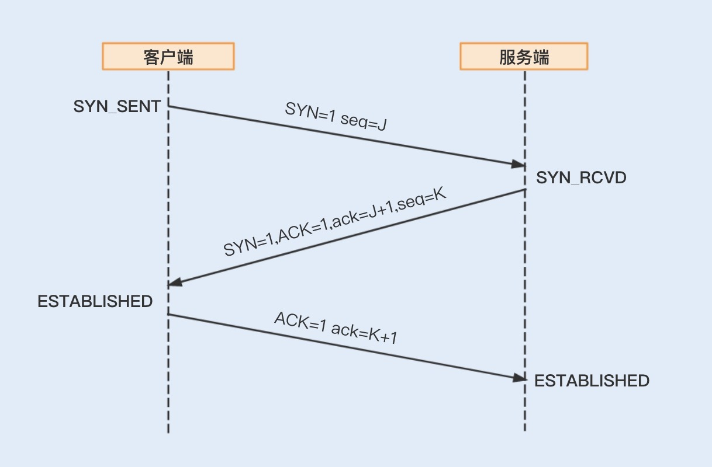
* 四次握手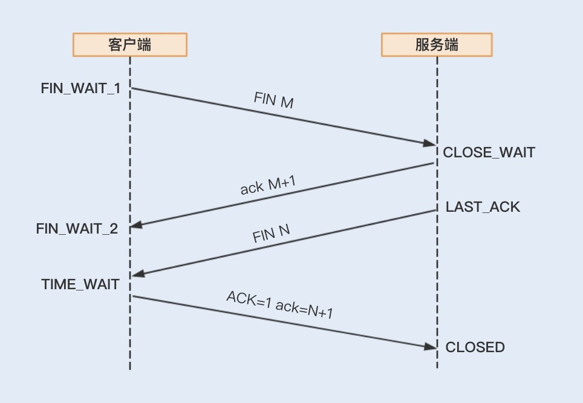

我们可以通过sysctl -a | grep net.xxx命令运行查看Linux系统默认的的TCP参数设置，如果需要修改某项配置，可以通过编辑 vim/etc/sysctl.conf，加入需要修改的配置项， 并通过sysctl -p命令运行生效修改后的配置项设置。通常我们会通过修改以下几个配置项来提高网络吞吐量和降低延时。

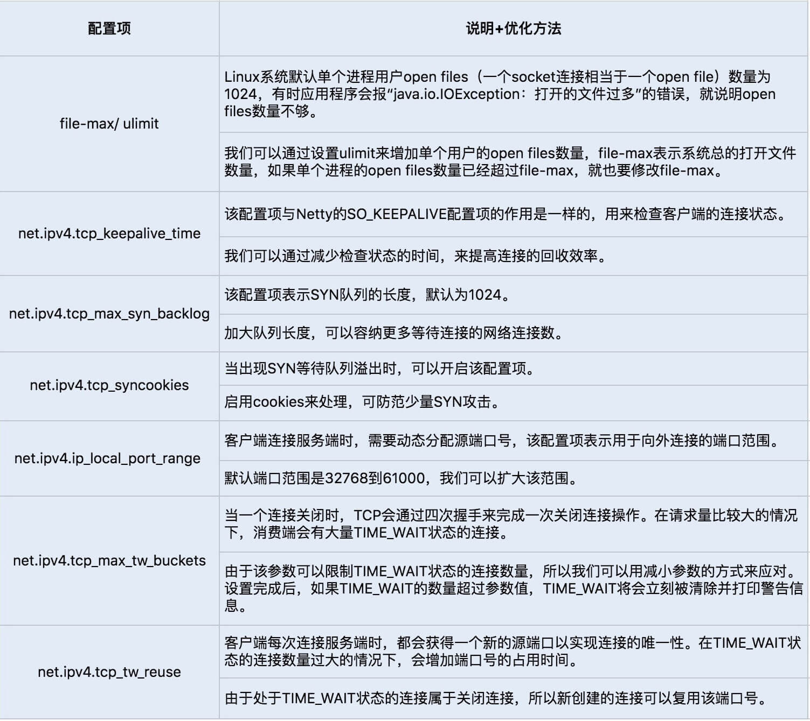

以上就是我们从不同层次对RPC优化的详解，除了最后的Linux系统中TCP的配置项设置调优，其它的调优更多是从代码编程优化的角度出发，最终实现了一套RPC通信框架的优化路径。弄懂了这些，你就可以根据自己的业务场景去做技术选型了，还能很好地解决过程中出现的一些性能问题。

### 2.9.5 总结

在现在的分布式系统中，特别是系统走向微服务化的今天，服务间的通信就显得尤为频繁，掌握服务间的通信原理和通信协议优化，是你的一项的必备技能。在一些并发场景比较多的系统中，我更偏向使用Dubbo实现的这一套RPC通信协议。Dubbo协议是建立的单一长连接通信，网络I/O为NIO非阻塞读写操作，更兼容了Kryo、FST、Protobuf等性能出众的序列化框架，在高并发、小对象传输的业务场景中非常实用。

在企业级系统中，业务往往要比普通的互联网产品复杂，服务与服务之间可能不仅仅是数据传输，还有图片以及文件的传输，所以RPC的通信协议设计考虑更多是功能性需求，在性能方面不追求极致。其它通信框架在功能性、生态以及易用、易入门等方面更具有优势。

**思考题**

目前实现Java RPC通信的框架有很多，实现RPC通信的协议也有很多，除了Dubbo协议以外，你还使用过其它RPC通信协议吗？通过这讲的学习，你能对比谈谈各自的优缺点了吗？


| 特性           | Dubbo                          | gRPC                            | Thrift                         | Hessian                    |
| -------------- | ------------------------------ | ------------------------------- | ------------------------------ | -------------------------- |
| **协议**       | 多种协议（Dubbo、HTTP 等）     | HTTP/2                          | 多种协议（可选择）             | 自定义二进制协议           |
| **序列化**     | 多种（Hessian、Protobuf）      | Protobuf                        | 多种（Binary 等）              | 自定义二进制协议           |
| **服务发现**   | 支持多种注册中心               | 常与其他服务发现工具组合使用    | 常与其他服务发现工具组合使用   | 手动或与其他工具组合使用   |
| **负载均衡**   | 内置多种策略                   | 需要自行实现或结合其他工具      | 需要自行实现或结合其他工具     | 需要自行实现或结合其他工具 |
| **跨语言支持** | 主要在 Java 中                 | 支持多种语言                    | 支持多种语言                   | 支持一些其他语言           |
| **优点**       | 功能丰富，生态系统完善         | 高性能，多语言支持，HTTP/2 特性 | 多语言支持，高吞吐量，可选协议 | 轻量级，易于使用，高效     |
| **缺点**       | 配置复杂，主要在阿里生态中流行 | 学习曲线较高，复杂性较高        | 工具链复杂，社区活跃度较低     | 功能有限，跨语言支持较少   |
| **使用场景**   | 企业级应用，大型分布式系统     | 高性能，多语言的微服务架构      | 异构系统，大量语言之间通信     | 轻量级应用，Java 环境      |

## 2.10 答疑课堂：深入了解NIO的优化实现原理

综合查看完近期的留言以后，我的第一篇答疑课堂就顺势诞生了。我将继续讲解I/O优化，对大家在08讲中提到的内容做重点补充，并延伸一些有关I/O的知识点，更多结合实际场景进行分享。话不多说，我们马上切入正题。

Tomcat中经常被提到的一个调优就是修改线程的I/O模型。Tomcat 8.5版本之前，默认情况下使用的是BIO线程模型，如果在高负载、高并发的场景下，可以通过设置NIO线程模型，来提高系统的网络通信性能。我们可以通过一个性能对比测试来看看在高负载或高并发的情况下，BIO和NIO通信性能（这里用页面请求模拟多I/O读写操作的请求）：

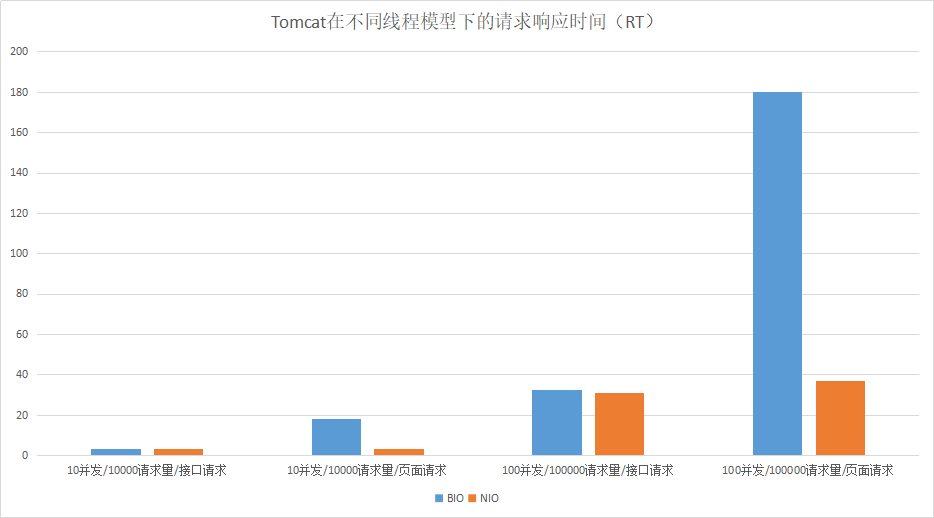

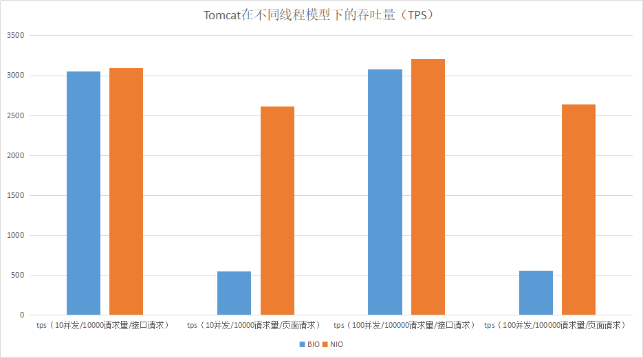

测试结果：Tomcat在I/O读写操作比较多的情况下，使用NIO线程模型有明显的优势。Tomcat中看似一个简单的配置，其中却包含了大量的优化升级知识点。下面我们就从底层的网络I/O模型优化出发，再到内存拷贝优化和线程模型优化，深入分析下Tomcat、Netty等通信框架是如何通过优化I/O来提高系统性能的。

### 2.10.1网络I/O模型优化

网络通信中，最底层的就是内核中的网络I/O模型了。随着技术的发展，操作系统内核的网络模型衍生出了五种I/O模型，《UNIX网络编程》一书将这五种I/O模型分为阻塞式I/O、非阻塞式I/O、I/O复用、信号驱动式I/O和异步I/O。每一种I/O模型的出现，都是基于前一种I/O模型的优化升级。最开始的阻塞式I/O，它在每一个连接创建时，都需要一个用户线程来处理，并且在I/O操作没有就绪或结束时，线程会被挂起，进入阻塞等待状态，阻塞式I/O就成为了导致性能瓶颈的根本原因。那阻塞到底发生在套接字（socket）通信的哪些环节呢？

在《Unix网络编程》中，套接字通信可以分为流式套接字（TCP）和数据报套接字（UDP）。其中TCP连接是我们最常用的，一起来了解下TCP服务端的工作流程（由于TCP的数据传输比较复杂，存在拆包和装包的可能，这里我只假设一次最简单的TCP数据传输）：

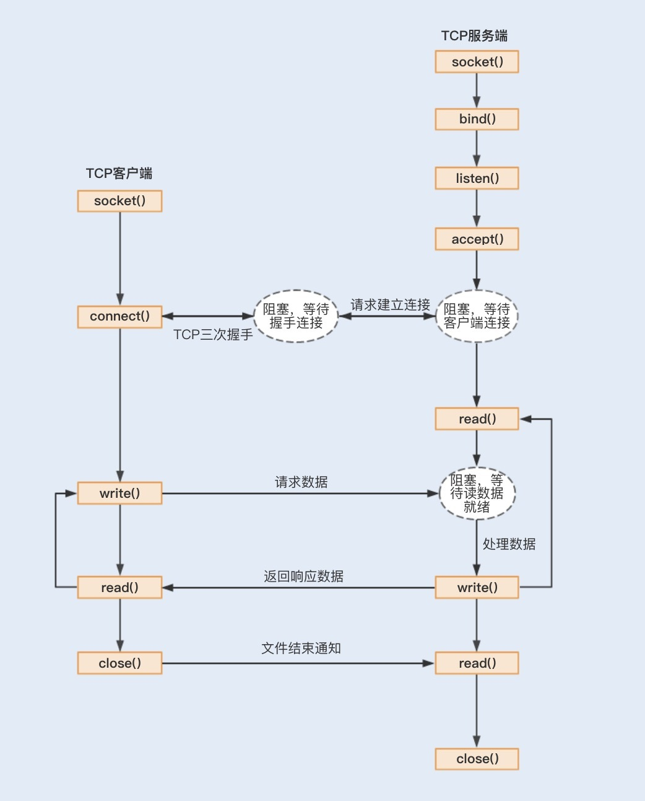

* 首先，应用程序通过系统调用socket创建一个套接字，它是系统分配给应用程序的一个文件描述符；
* 其次，应用程序会通过系统调用bind，绑定地址和端口号，给套接字命名一个名称；
* 然后，系统会调用listen创建一个队列用于存放客户端进来的连接；
* 最后，应用服务会通过系统调用accept来监听客户端的连接请求。

当有一个客户端连接到服务端之后，服务端就会调用fork创建一个子进程，通过系统调用read监听客户端发来的消息，再通过write向客户端返回信息。

#### 1.阻塞式I/O

在整个socket通信工作流程中，socket的默认状态是阻塞的。也就是说，当发出一个不能立即完成的套接字调用时，其进程将被阻塞，被系统挂起，进入睡眠状态，一直等待相应的操作响应。从上图中，我们可以发现，可能存在的阻塞主要包括以下三种。

- connect阻塞：当客户端发起TCP连接请求，通过系统调用connect函数，TCP连接的建立需要完成三次握手过程，客户端需要等待服务端发送回来的ACK以及SYN信号，同样服务端也需要阻塞等待客户端确认连接的ACK信号，这就意味着TCP的每个connect都会阻塞等待，直到确认连接。
- accept阻塞：一个阻塞的socket通信的服务端接收外来连接，会调用accept函数，如果没有新的连接到达，调用进程将被挂起，进入阻塞状态。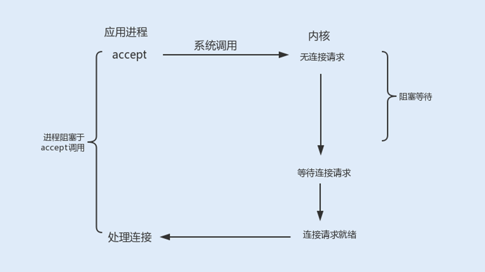
- read、write阻塞：当一个socket连接创建成功之后，服务端用fork函数创建一个子进程， 调用read函数等待客户端的数据写入，如果没有数据写入，调用子进程将被挂起，进入阻塞状态。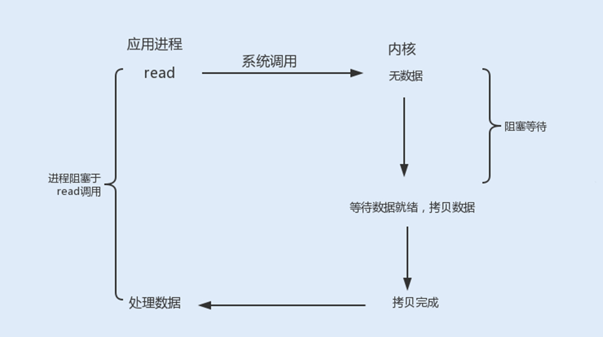

#### 2.非阻塞式I/O

使用fcntl可以把以上三种操作都设置为非阻塞操作。如果没有数据返回，就会直接返回一个EWOULDBLOCK或EAGAIN错误，此时进程就不会一直被阻塞。

当我们把以上操作设置为了非阻塞状态，我们需要设置一个线程对该操作进行轮询检查，这也是最传统的非阻塞I/O模型。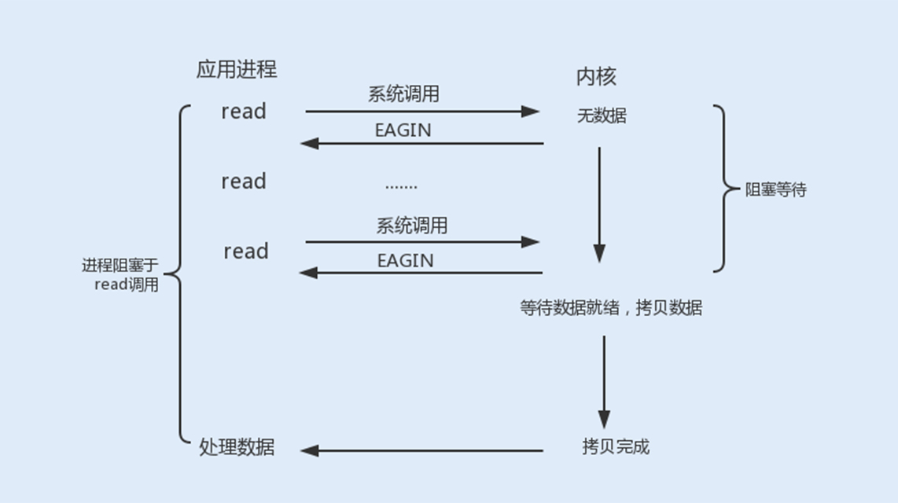

#### 3. I/O复用

如果使用用户线程轮询查看一个I/O操作的状态，在大量请求的情况下，这对于CPU的使用率无疑是种灾难。 那么除了这种方式，还有其它方式可以实现非阻塞I/O套接字吗？Linux提供了I/O复用函数select/poll/epoll，进程将一个或多个读操作通过系统调用函数，阻塞在函数操作上。这样，系统内核就可以帮我们侦测多个读操作是否处于就绪状态。

- select()函数：它的用途是，在超时时间内，监听用户感兴趣的文件描述符上的可读可写和异常事件的发生。Linux 操作系统的内核将所有外部设备都看做一个文件来操作，对一个文件的读写操作会调用内核提供的系统命令，返回一个文件描述符（fd）。
  - 查看以上代码，select() 函数监视的文件描述符分3类，分别是writefds（写文件描述符）、readfds（读文件描述符）以及exceptfds（异常事件文件描述符）。调用后select() 函数会阻塞，直到有描述符就绪或者超时，函数返回。当select函数返回后，可以通过函数FD\_ISSET遍历fdset，来找到就绪的描述符。fd\_set可以理解为一个集合，这个集合中存放的是文件描述符，可通过以下四个宏进行设置：
  - 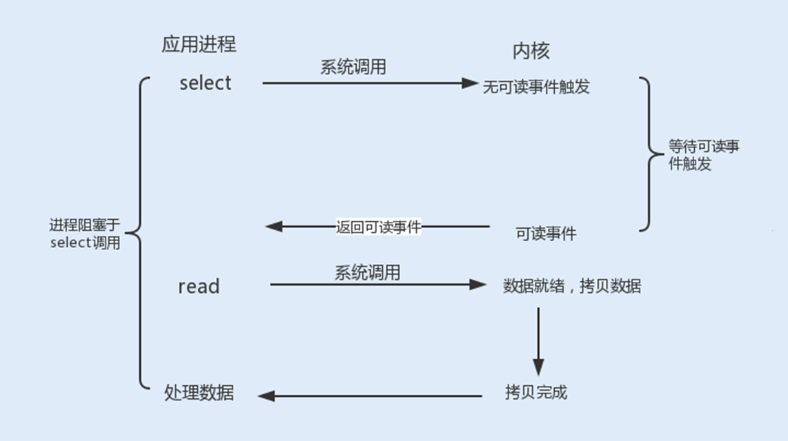

```
int select(int maxfdp1,fd_set *readset,fd_set *writeset,fd_set *exceptset,const struct timeval *timeout)
```

```
void FD_ZERO(fd_set *fdset);           //清空集合
          void FD_SET(int fd, fd_set *fdset);   //将一个给定的文件描述符加入集合之中
          void FD_CLR(int fd, fd_set *fdset);   //将一个给定的文件描述符从集合中删除
          int FD_ISSET(int fd, fd_set *fdset);   // 检查集合中指定的文件描述符是否可以读写
```

- poll()函数：在每次调用select()函数之前，系统需要把一个fd从用户态拷贝到内核态，这样就给系统带来了一定的性能开销。再有单个进程监视的fd数量默认是1024，我们可以通过修改宏定义甚至重新编译内核的方式打破这一限制。但由于fd\_set是基于数组实现的，在新增和删除fd时，数量过大会导致效率降低。
  - poll() 的机制与 select() 类似，二者在本质上差别不大。poll() 管理多个描述符也是通过轮询，根据描述符的状态进行处理，但 poll() 没有最大文件描述符数量的限制。
  - poll() 和 select() 存在一个相同的缺点，那就是包含大量文件描述符的数组被整体复制到用户态和内核的地址空间之间，而无论这些文件描述符是否就绪，他们的开销都会随着文件描述符数量的增加而线性增大。
  - 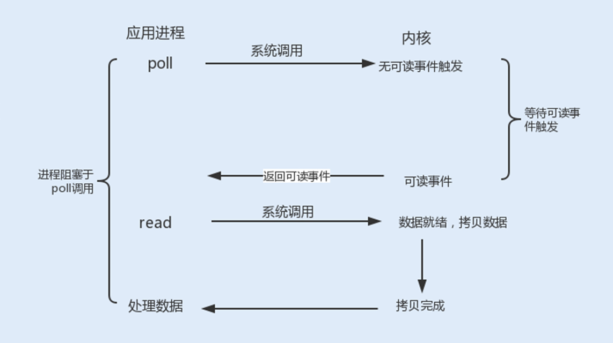
- **epoll()函数：**select/poll是顺序扫描fd是否就绪，而且支持的fd数量不宜过大，因此它的使用受到了一些制约。Linux在2.6内核版本中提供了一个epoll调用，epoll使用事件驱动的方式代替轮询扫描fd。epoll事先通过epoll\_ctl()来注册一个文件描述符，将文件描述符存放到内核的一个事件表中，这个事件表是基于红黑树实现的，所以在大量I/O请求的场景下，插入和删除的性能比select/poll的数组fd\_set要好，因此epoll的性能更胜一筹，而且不会受到fd数量的限制。
  - 通过下面代码，我们可以看到：epoll\_ctl()函数中的epfd是由 epoll\_create()函数生成的一个epoll专用文件描述符。op代表操作事件类型，fd表示关联文件描述符，event表示指定监听的事件类型。一旦某个文件描述符就绪时，内核会采用类似callback的回调机制，迅速激活这个文件描述符，当进程调用epoll\_wait()时便得到通知，之后进程将完成相关I/O操作。
  - 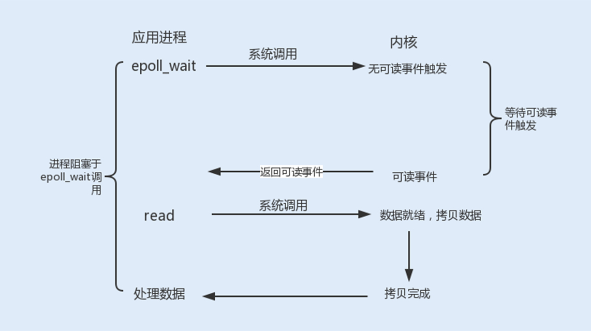

```
int epoll_ctl(int epfd, int op, int fd, struct epoll_event event)
```

```
int epoll_wait(int epfd, struct epoll_event events,int maxevents,int timeout)
```

#### 4.信号驱动式I/O

信号驱动式I/O类似观察者模式，内核就是一个观察者，信号回调则是通知。用户进程发起一个I/O请求操作，会通过系统调用sigaction函数，给对应的套接字注册一个信号回调，此时不阻塞用户进程，进程会继续工作。当内核数据就绪时，内核就为该进程生成一个SIGIO信号，通过信号回调通知进程进行相关I/O操作。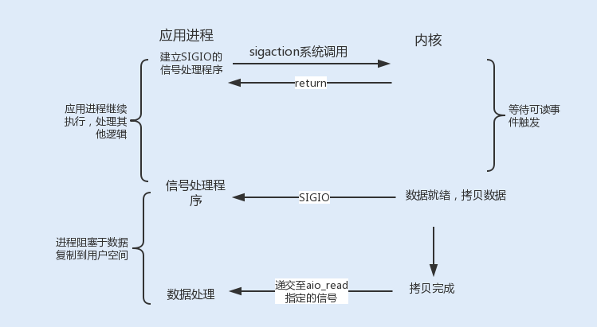

信号驱动式I/O相比于前三种I/O模式，实现了在等待数据就绪时，进程不被阻塞，主循环可以继续工作，所以性能更佳。而由于TCP来说，信号驱动式I/O几乎没有被使用，这是因为SIGIO信号是一种Unix信号，信号没有附加信息，如果一个信号源有多种产生信号的原因，信号接收者就无法确定究竟发生了什么。而 TCP socket生产的信号事件有七种之多，这样应用程序收到 SIGIO，根本无从区分处理。

但信号驱动式I/O现在被用在了UDP通信上，我们从10讲中的UDP通信流程图中可以发现，UDP只有一个数据请求事件，这也就意味着在正常情况下UDP进程只要捕获SIGIO信号，就调用recvfrom读取到达的数据报。如果出现异常，就返回一个异常错误。比如，NTP服务器就应用了这种模型。

#### 5.异步I/O

信号驱动式I/O虽然在等待数据就绪时，没有阻塞进程，但在被通知后进行的I/O操作还是阻塞的，进程会等待数据从内核空间复制到用户空间中。而异步I/O则是实现了真正的非阻塞I/O。

当用户进程发起一个I/O请求操作，系统会告知内核启动某个操作，并让内核在整个操作完成后通知进程。这个操作包括等待数据就绪和数据从内核复制到用户空间。由于程序的代码复杂度高，调试难度大，且支持异步I/O的操作系统比较少见（目前Linux暂不支持，而Windows已经实现了异步I/O），所以在实际生产环境中很少用到异步I/O模型。

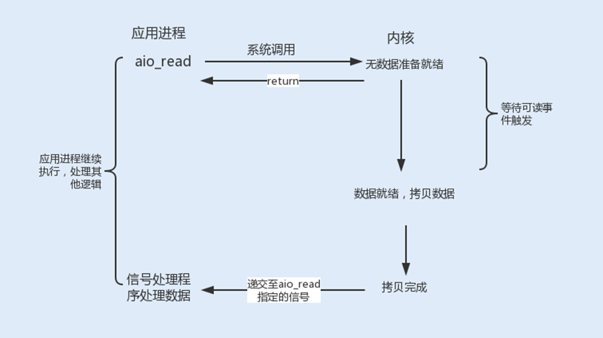

在08讲中，我讲到了NIO使用I/O复用器Selector实现非阻塞I/O，Selector就是使用了这五种类型中的I/O复用模型。Java中的Selector其实就是select/poll/epoll的外包类。我们在上面的TCP通信流程中讲到，Socket通信中的conect、accept、read以及write为阻塞操作，在Selector中分别对应SelectionKey的四个监听事件OP\_ACCEPT、OP\_CONNECT、OP\_READ以及OP\_WRITE。

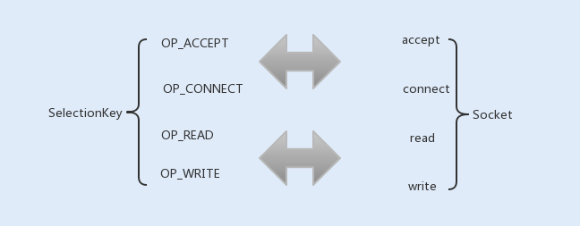

在NIO服务端通信编程中，首先会创建一个Channel，用于监听客户端连接；接着，创建多路复用器Selector，并将Channel注册到Selector，程序会通过Selector来轮询注册在其上的Channel，当发现一个或多个Channel处于就绪状态时，返回就绪的监听事件，最后程序匹配到监听事件，进行相关的I/O操作。

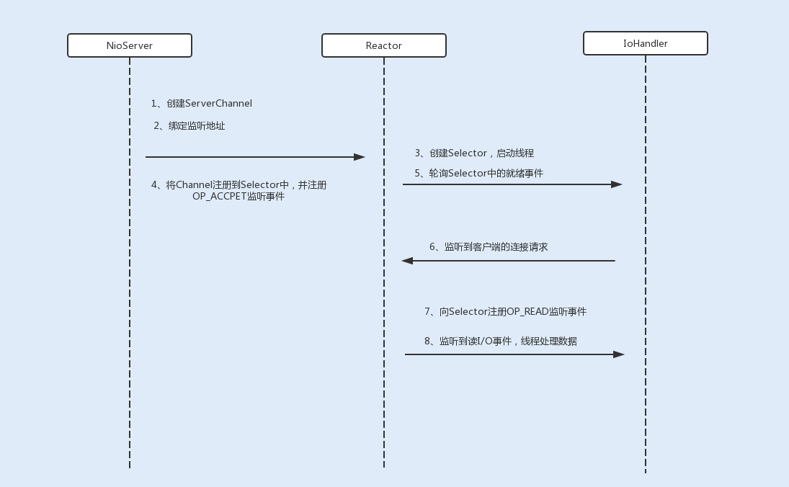

在创建Selector时，程序会根据操作系统版本选择使用哪种I/O复用函数。在JDK1.5版本中，如果程序运行在Linux操作系统，且内核版本在2.6以上，NIO中会选择epoll来替代传统的select/poll，这也极大地提升了NIO通信的性能。由于信号驱动式I/O对TCP通信的不支持，以及异步I/O在Linux操作系统内核中的应用还不大成熟，大部分框架都还是基于I/O复用模型实现的网络通信。

### 2.10.2 零拷贝

在I/O复用模型中，执行读写I/O操作依然是阻塞的，在执行读写I/O操作时，存在着多次内存拷贝和上下文切换，给系统增加了性能开销。零拷贝是一种避免多次内存复制的技术，用来优化读写I/O操作。在网络编程中，通常由read、write来完成一次I/O读写操作。每一次I/O读写操作都需要完成四次内存拷贝，路径是I/O设备->内核空间->用户空间->内核空间->其它I/O设备。

- **Linux内核中的mmap函数可以代替read、write的I/O读写操作**，实现用户空间和内核空间共享一个缓存数据。mmap将用户空间的一块地址和内核空间的一块地址同时映射到相同的一块物理内存地址，不管是用户空间还是内核空间都是虚拟地址，最终要通过地址映射映射到物理内存地址。这种方式避免了内核空间与用户空间的数据交换。I/O复用中的epoll函数中就是使用了mmap减少了内存拷贝。
- 在Java的NIO编程中，则是使用到了Direct Buffer来实现内存的零拷贝。Java直接在JVM内存空间之外开辟了一个物理内存空间，这样内核和用户进程都能共享一份缓存数据。这是在08讲中已经详细讲解过的内容，你可以再去回顾下。(这里好像不太对，Direct Buffer不是只实现了堆外内存吗，还是要拷贝到内核内存吧)

```
Direct Buffer（直接缓冲区）
Java 的直接缓冲区（Direct Buffer）是一种存储在堆外内存中的缓冲区，由 ByteBuffer.allocateDirect 方法创建。与堆内存缓冲区不同，直接缓冲区不受 JVM 垃圾收集的管理，直接缓冲区的优点如下：
1. 减少堆内存占用：因为缓冲区在堆外内存中分配，不会占用 JVM 的堆空间，从而减少了堆内存的压力。
2. 更快的 I/O 操作：直接内存缓冲区减少了从 JVM 内存到本地操作系统内存的数据复制步骤，提升了 I/O 操作性能。

零拷贝概念
零拷贝（Zero-Copy）技术是一种优化 I/O 操作的手段，目的是在内核和用户空间之间尽量减少数据复制。下面是一些实现零拷贝的技术：
1. sendfile：允许数据在操作系统内核中直接从一个文件描述符传递到另一个文件描述符，而不经过用户空间。
2. mmap：通过内存映射文件，直接在内存中操作文件内容，减少 I/O 操作次数。
3. splice：在 Linux 上，通过内核中的管道缓冲区传输数据，可以避免数据复制到用户空间。
4. 在 Java 中，NIO 提供了 FileChannel 的 transferTo() 和 transferFrom() 方法来借助底层操作系统的零拷贝特性。
```

### 2.10.3 线程模型优化

除了内核对网络I/O模型的优化，NIO在用户层也做了优化升级。NIO是基于事件驱动模型来实现的I/O操作。Reactor模型是同步I/O事件处理的一种常见模型，其核心思想是将I/O事件注册到多路复用器上，一旦有I/O事件触发，多路复用器就会将事件分发到事件处理器中，执行就绪的I/O事件操作。该模型有以下三个主要组件：

* 事件接收器Acceptor：主要负责接收请求连接；
* 事件分离器Reactor：接收请求后，会将建立的连接注册到分离器中，依赖于循环监听多路复用器Selector，一旦监听到事件，就会将事件dispatch到事件处理器；
* 事件处理器Handlers：事件处理器主要是完成相关的事件处理，比如读写I/O操作。

#### 1.单线程Reactor线程模型

最开始NIO是基于单线程实现的，所有的I/O操作都是在一个NIO线程上完成。由于NIO是非阻塞I/O，理论上一个线程可以完成所有的I/O操作。但NIO其实还不算真正地实现了非阻塞I/O操作，因为读写I/O操作时用户进程还是处于阻塞状态，这种方式在高负载、高并发的场景下会存在性能瓶颈，一个NIO线程如果同时处理上万连接的I/O操作，系统是无法支撑这种量级的请求的。

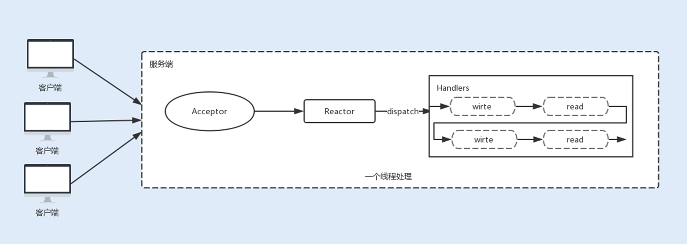

#### 2.多线程Reactor线程模型

为了解决这种单线程的NIO在高负载、高并发场景下的性能瓶颈，后来使用了线程池。在Tomcat和Netty中都使用了一个Acceptor线程来监听连接请求事件，当连接成功之后，会将建立的连接注册到多路复用器中，一旦监听到事件，将交给Worker线程池来负责处理。大多数情况下，这种线程模型可以满足性能要求，但如果连接的客户端再上一个量级，一个Acceptor线程可能会存在性能瓶颈。

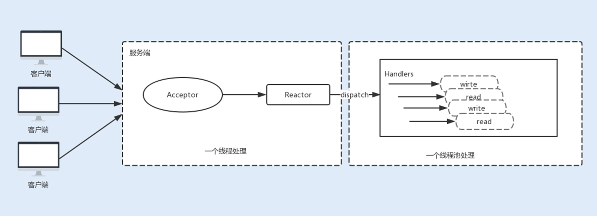

#### 3.主从Reactor线程模型

现在主流通信框架中的NIO通信框架都是基于主从Reactor线程模型来实现的。在这个模型中，Acceptor不再是一个单独的NIO线程，而是一个线程池。Acceptor接收到客户端的TCP连接请求，建立连接之后，后续的I/O操作将交给Worker I/O线程。

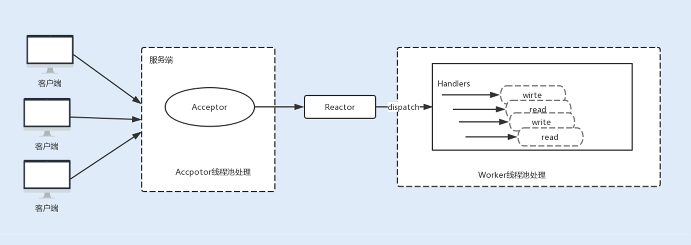

#### 4.基于线程模型的Tomcat参数调优

Tomcat中，BIO、NIO是基于主从Reactor线程模型实现的。在BIO中，Tomcat中的Acceptor只负责监听新的连接，一旦连接建立监听到I/O操作，将会交给Worker线程中，Worker线程专门负责I/O读写操作。

- **连接数受限**：每个连接都是由一个独立的线程处理，如果有大量连接，就需要大量线程，这会导致高内存使用和线程上下文切换的开销。
- **资源利用率**：阻塞 I/O 的线程在等待 I/O 操作完成期间不能做其他工作，资源利用率较低。

在NIO中，Tomcat新增了一个Poller线程池，Acceptor监听到连接后，不是直接使用Worker中的线程处理请求，而是先将请求发送给了Poller缓冲队列。在Poller中，维护了一个Selector对象，当Poller从队列中取出连接后，注册到该Selector中；然后通过遍历Selector，找出其中就绪的I/O操作，并使用Worker中的线程处理相应的请求。

- **Acceptor线程**：监听新的连接，并将新连接注册到 Poller 线程。
- **Poller线程**：维护一个 `Selector` 对象，它会监视多个注册的通道，并在其中任意一个通道准备好 I/O 操作时通知 Poller。
- **Worker线程**：实际执行 I/O 操作（读、写）的业务逻辑处理。

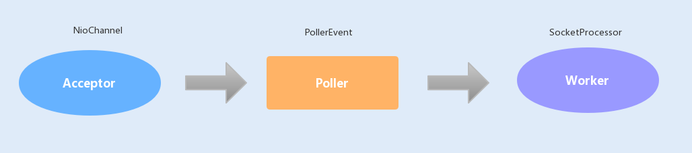

你可以通过以下几个参数来设置Acceptor线程池和Worker线程池的配置项。

- acceptorThreadCount：该参数代表Acceptor的线程数量，在请求客户端的数据量非常巨大的情况下，可以适当地调大该线程数量来提高处理请求连接的能力，默认值为1。
- maxThreads：专门处理I/O操作的Worker线程数量，默认是200，可以根据实际的环境来调整该参数，但不一定越大越好。
- acceptCount：Tomcat的Acceptor线程是负责从accept队列中取出该connection，然后交给工作线程去执行相关操作，这里的acceptCount指的是accept队列的大小。当Http关闭keep alive，在并发量比较大时，可以适当地调大这个值。而在Http开启keep alive时，因为Worker线程数量有限，Worker线程就可能因长时间被占用，而连接在accept队列中等待超时。如果accept队列过大，就容易浪费连接。
- maxConnections：表示有多少个socket连接到Tomcat上。在BIO模式中，一个线程只能处理一个连接，一般maxConnections与maxThreads的值大小相同；在NIO模式中，一个线程同时处理多个连接，maxConnections应该设置得比maxThreads要大的多，默认是10000。

# 三、多线程性能调优

## 3.1 多线程之锁优化（上）：深入了解Synchronized同步锁的优化方法

在并发编程中，多个线程访问同一个共享资源时，我们必须考虑如何维护数据的原子性。在JDK1.5之前，Java是依靠Synchronized关键字实现锁功能来做到这点的。Synchronized是JVM实现的一种内置锁，锁的获取和释放是由JVM隐式实现。到了JDK1.5版本，并发包中新增了Lock接口来实现锁功能，它提供了与Synchronized关键字类似的同步功能，只是在使用时需要显式获取和释放锁。

Lock同步锁是基于Java实现的，而Synchronized是基于底层操作系统的Mutex Lock实现的，每次获取和释放锁操作都会带来用户态和内核态的切换，从而增加系统性能开销。因此，在锁竞争激烈的情况下，Synchronized同步锁在性能上就表现得非常糟糕，它也常被大家称为重量级锁。

特别是在单个线程重复申请锁的情况下，JDK1.5版本的Synchronized锁性能要比Lock的性能差很多。例如，在Dubbo基于Netty实现的通信中，消费端向服务端通信之后，由于接收返回消息是异步，所以需要一个线程轮询监听返回信息。而在接收消息时，就需要用到锁来确保request session的原子性。如果我们这里使用Synchronized同步锁，那么每当同一个线程请求锁资源时，都会发生一次用户态和内核态的切换。

到了JDK1.6版本之后，Java对Synchronized同步锁做了充分的优化，甚至在某些场景下，它的性能已经超越了Lock同步锁。这一讲我们就来看看Synchronized同步锁究竟是通过了哪些优化，实现了性能地提升。

### 3.1.1 Synchronized同步锁实现原理

了解Synchronized同步锁优化之前，我们先来看看它的底层实现原理，这样可以帮助我们更好地理解后面的内容。通常Synchronized实现同步锁的方式有两种，一种是修饰方法，一种是修饰方法块。以下就是通过Synchronized实现的两种同步方法加锁的方式：

```
// 关键字在实例方法上，锁为当前实例
    public synchronized void method1() {
        // code
    }
  
    // 关键字在代码块上，锁为括号里面的对象
    public void method2() {
        Object o = new Object();
        synchronized (o) {
            // code
        }
    }
```

下面我们可以通过反编译看下具体字节码的实现，运行以下反编译命令，就可以输出我们想要的字节码：

```
javac -encoding UTF-8 SyncTest.java  //先运行编译class文件命令
javap -v SyncTest.class //再通过javap打印出字节文件
```

通过输出的字节码，你会发现：Synchronized在修饰同步代码块时，是由 monitorenter和monitorexit指令来实现同步的。进入monitorenter 指令后，线程将持有Monitor对象，退出monitorenter指令后，线程将释放该Monitor对象。

```
public void method2();
    descriptor: ()V
    flags: ACC_PUBLIC
    Code:
      stack=2, locals=4, args_size=1
         0: new           #2    
         3: dup
         4: invokespecial #1    
         7: astore_1
         8: aload_1
         9: dup
        10: astore_2
        11: monitorenter //monitorenter 指令
        12: aload_2
        13: monitorexit  //monitorexit  指令
        14: goto          22
        17: astore_3
        18: aload_2
        19: monitorexit
        20: aload_3
        21: athrow
        22: return
      Exception table:
         from    to  target type
            12    14    17   any
            17    20    17   any
      LineNumberTable:
        line 18: 0
        line 19: 8
        line 21: 12
        line 22: 22
      StackMapTable: number_of_entries = 2
        frame_type = 255 /* full_frame */
          offset_delta = 17
          locals = [ class com/demo/io/SyncTest, class java/lang/Object, class java/lang/Object ]
          stack = [ class java/lang/Throwable ]
        frame_type = 250 /* chop */
          offset_delta = 4
```

再来看以下同步方法的字节码，你会发现：当Synchronized修饰同步方法时，并没有发现monitorenter和monitorexit指令，而是出现了一个ACC_SYNCHRONIZED标志。这是因为JVM使用了ACC_SYNCHRONIZED访问标志来区分一个方法是否是同步方法。当方法调用时，调用指令将会检查该方法是否被设置ACC_SYNCHRONIZED访问标志。如果设置了该标志，执行线程将先持有Monitor对象，然后再执行方法。在该方法运行期间，其它线程将无法获取到该Mointor对象，当方法执行完成后，再释放该Monitor对象。

```
public synchronized void method1();
    descriptor: ()V
    flags: ACC_PUBLIC, ACC_SYNCHRONIZED // ACC_SYNCHRONIZED 标志
    Code:
      stack=0, locals=1, args_size=1
         0: return
      LineNumberTable:
        line 8: 0
```

通过以上的源码，我们再来看看Synchronized修饰方法是怎么实现锁原理的。JVM中的同步是基于进入和退出管程（Monitor）对象实现的。每个对象实例都会有一个Monitor，Monitor可以和对象一起创建、销毁。Monitor是由ObjectMonitor实现，而ObjectMonitor是由C++的ObjectMonitor.hpp文件实现，如下所示：

```
ObjectMonitor() {
   _header = NULL;
   _count = 0; //记录个数
   _waiters = 0,
   _recursions = 0;
   _object = NULL;
   _owner = NULL;
   _WaitSet = NULL; //处于wait状态的线程，会被加入到_WaitSet
   _WaitSetLock = 0 ;
   _Responsible = NULL ;
   _succ = NULL ;
   _cxq = NULL ;
   FreeNext = NULL ;
   _EntryList = NULL ; //处于等待锁block状态的线程，会被加入到该列表
   _SpinFreq = 0 ;
   _SpinClock = 0 ;
   OwnerIsThread = 0 ;
}
```

当多个线程同时访问一段同步代码时，多个线程会先被存放在ContentionList和_EntryList 集合中，处于block状态的线程，都会被加入到该列表。接下来当线程获取到对象的Monitor时，Monitor是依靠底层操作系统的Mutex Lock来实现互斥的，线程申请Mutex成功，则持有该Mutex，其它线程将无法获取到该Mutex，竞争失败的线程会再次进入ContentionList被挂起。

如果线程调用wait() 方法，就会释放当前持有的Mutex，并且该线程会进入WaitSet集合中，等待下一次被唤醒。如果当前线程顺利执行完方法，也将释放Mutex。
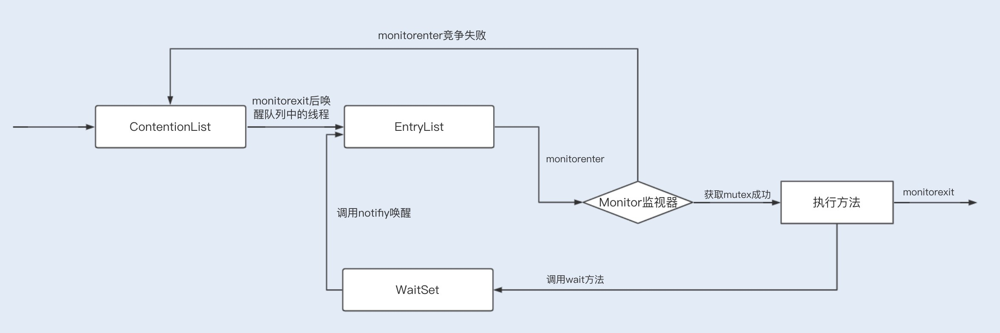
看完上面的讲解，相信你对同步锁的实现原理已经有个深入的了解了。总结来说就是，同步锁在这种实现方式中，因Monitor是依赖于底层的操作系统实现，存在用户态与内核态之间的切换，所以增加了性能开销。

```
ContentionList
ContentionList是一个内部的列表，用于存放那些试图获取某个对象的监视器锁但是当前不能获取因为锁被其他线程持有的线程。这些线程因为无法立即进入同步块或方法，所以被放入了ContentionList，表明它们正在争用（contention）该监视器锁。

当一个线程尝试进入一个被synchronized关键字修饰的方法或代码块，但是发现该锁已被另一个线程持有，它就会被挂起并加入到争用列表中。等到持有锁的线程释放锁之后，JVM中的调度器会选择ContentionList中的线程之一（根据具体的线程调度算法），尝试让它获得锁。

_EntryList
与ContentionList相辅相成的另一个概念是_EntryList，它是另一个用于存放线程的列表。不过，_EntryList通常用于保存那些已经到达同步块或方法的入口等待获取监视器锁的线程，但与ContentionList中的线程在争用状态和调度策略上可能有所不同。

区别和联系
ContentionList侧重于管理那些因为锁竞争而无法进入同步区域的线程，它反应了系统中锁争用的状态。
_EntryList可能包含了更直接等待进入同步块或方法的线程，这些线程可能是之前在ContentionList中但现在锁竞争状况有所变化，有望近期内获得锁。
```

---

### 3.1.2 锁升级优化

为了提升性能，JDK1.6引入了偏向锁、轻量级锁、重量级锁概念，来减少锁竞争带来的上下文切换，而正是新增的Java对象头实现了锁升级功能。当Java对象被Synchronized关键字修饰成为同步锁后，围绕这个锁的一系列升级操作都将和Java对象头有关。

#### Java对象头

在JDK1.6 JVM中，对象实例在堆内存中被分为了三个部分：对象头、实例数据和对齐填充。其中Java对象头由Mark Word、指向类的指针以及数组长度三部分组成。Mark Word记录了对象和锁有关的信息。Mark Word在64位JVM中的长度是64bit，我们可以一起看下64位JVM的存储结构是怎么样的。如下图所示：


锁升级功能主要依赖于Mark Word中的锁标志位和释放偏向锁标志位，Synchronized同步锁就是从偏向锁开始的，随着竞争越来越激烈，偏向锁升级到轻量级锁，最终升级到重量级锁。下面我们就沿着这条优化路径去看下具体的内容。

#### 1.偏向锁

偏向锁主要用来优化同一线程多次申请同一个锁的竞争。在某些情况下，大部分时间是同一个线程竞争锁资源，例如，在创建一个线程并在线程中执行循环监听的场景下，或单线程操作一个线程安全集合时，同一线程每次都需要获取和释放锁，每次操作都会发生用户态与内核态的切换。

偏向锁的作用就是，当一个线程再次访问这个同步代码或方法时，该线程只需去对象头的Mark Word中去判断一下是否有偏向锁指向它的ID，无需再进入Monitor去竞争对象了。当对象被当做同步锁并有一个线程抢到了锁时，锁标志位还是01，“是否偏向锁”标志位设置为1，并且记录抢到锁的线程ID，表示进入偏向锁状态。一旦出现其它线程竞争锁资源时，偏向锁就会被撤销。偏向锁的撤销需要等待全局安全点，暂停持有该锁的线程，同时检查该线程是否还在执行该方法，如果是，则升级锁，反之则被其它线程抢占。

下图中红线流程部分为偏向锁获取和撤销流程：

因此，在高并发场景下，当大量线程同时竞争同一个锁资源时，偏向锁就会被撤销，发生stop the word后， 开启偏向锁无疑会带来更大的性能开销，这时我们可以通过添加JVM参数关闭偏向锁来调优系统性能，示例代码如下：

```
-XX:-UseBiasedLocking //关闭偏向锁（默认打开）
```

或

```
-XX:+UseHeavyMonitors  //设置重量级锁
```

#### 2.轻量级锁

当有另外一个线程竞争获取这个锁时，由于该锁已经是偏向锁，当发现对象头Mark Word中的线程ID不是自己的线程ID，就会进行CAS操作获取锁，如果获取成功，直接替换Mark Word中的线程ID为自己的ID，该锁会保持偏向锁状态；如果获取锁失败，代表当前锁有一定的竞争，偏向锁将升级为轻量级锁。轻量级锁适用于线程交替执行同步块的场景，绝大部分的锁在整个同步周期内都不存在长时间的竞争。

下图中红线流程部分为升级轻量级锁及操作流程：
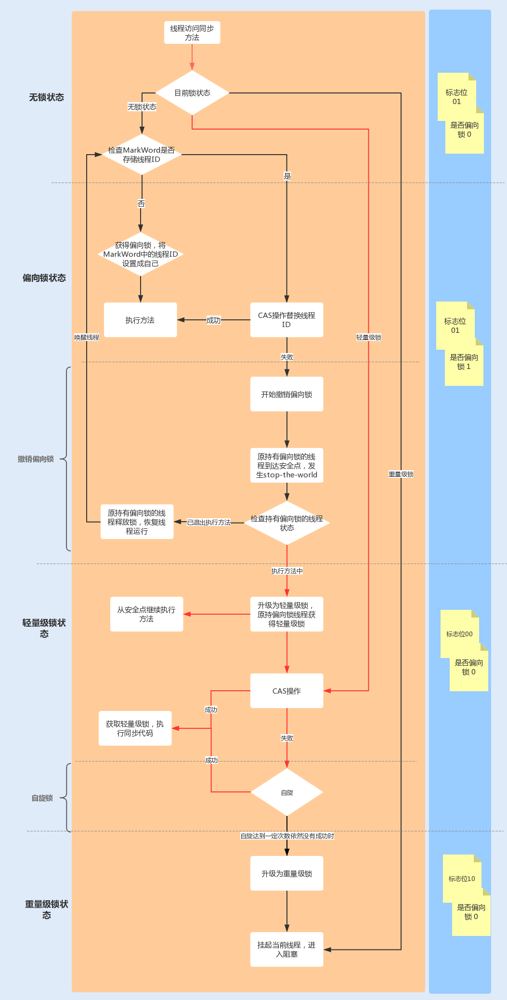

#### 3.自旋锁与重量级锁

轻量级锁CAS抢锁失败，线程将会被挂起进入阻塞状态。如果正在持有锁的线程在很短的时间内释放资源，那么进入阻塞状态的线程无疑又要申请锁资源。JVM提供了一种自旋锁，可以通过自旋方式不断尝试获取锁，从而避免线程被挂起阻塞。这是基于大多数情况下，线程持有锁的时间都不会太长，毕竟线程被挂起阻塞可能会得不偿失。

从JDK1.7开始，自旋锁默认启用，自旋次数由JVM设置决定，这里我不建议设置的重试次数过多，因为CAS重试操作意味着长时间地占用CPU。自旋锁重试之后如果抢锁依然失败，同步锁就会升级至重量级锁，锁标志位改为10。在这个状态下，未抢到锁的线程都会进入Monitor，之后会被阻塞在_WaitSet队列中。

下图中红线流程部分为自旋后升级为重量级锁的流程：


在锁竞争不激烈且锁占用时间非常短的场景下，自旋锁可以提高系统性能。一旦锁竞争激烈或锁占用的时间过长，自旋锁将会导致大量的线程一直处于CAS重试状态，占用CPU资源，反而会增加系统性能开销。所以自旋锁和重量级锁的使用都要结合实际场景。在高负载、高并发的场景下，我们可以通过设置JVM参数来关闭自旋锁，优化系统性能，示例代码如下：

```
-XX:-UseSpinning //参数关闭自旋锁优化(默认打开) 
-XX:PreBlockSpin //参数修改默认的自旋次数。JDK1.7后，去掉此参数，由jvm控制
```

#### 动态编译实现锁消除/锁粗化

除了锁升级优化，Java还使用了编译器对锁进行优化。JIT 编译器在动态编译同步块的时候，借助了一种被称为逃逸分析的技术，来判断同步块使用的锁对象是否只能够被一个线程访问，而没有被发布到其它线程。

确认是的话，那么 JIT 编译器在编译这个同步块的时候不会生成 synchronized 所表示的锁的申请与释放的机器码，即消除了锁的使用。在 Java7 之后的版本就不需要手动配置了，该操作可以自动实现。

锁粗化同理，就是在 JIT 编译器动态编译时，如果发现几个相邻的同步块使用的是同一个锁实例，那么 JIT 编译器将会把这几个同步块合并为一个大的同步块，从而避免一个线程“反复申请、释放同一个锁”所带来的性能开销。

#### 减小锁粒度

除了锁内部优化和编译器优化之外，我们还可以通过代码层来实现锁优化，减小锁粒度就是一种惯用的方法。当我们的锁对象是一个数组或队列时，集中竞争一个对象的话会非常激烈，锁也会升级为重量级锁。我们可以考虑将一个数组和队列对象拆成多个小对象，来降低锁竞争，提升并行度。

最经典的减小锁粒度的案例就是JDK1.8之前实现的ConcurrentHashMap版本。我们知道，HashTable是基于一个数组+链表实现的，所以在并发读写操作集合时，存在激烈的锁资源竞争，也因此性能会存在瓶颈。而ConcurrentHashMap就很很巧妙地使用了分段锁Segment来降低锁资源竞争，如下图所示：
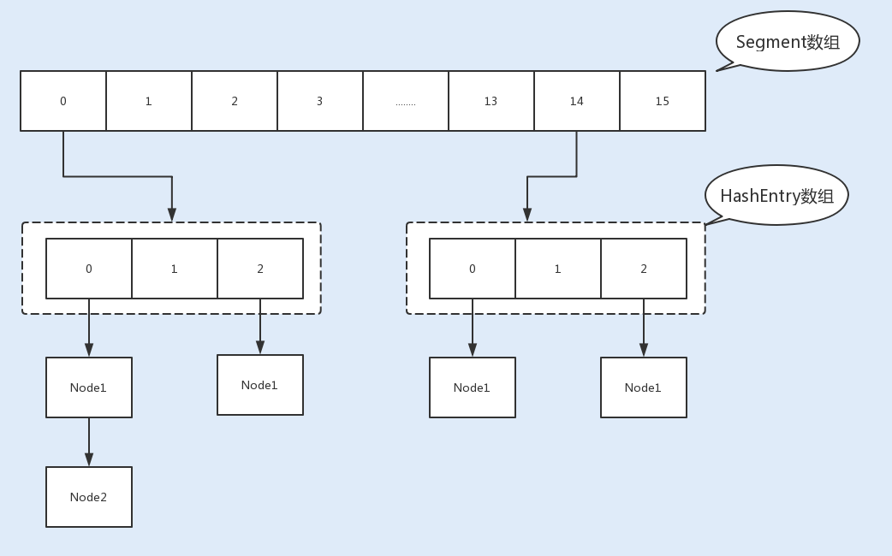

```
Java 8及之后版本中的改进
在Java 8及之后的版本中，ConcurrentHashMap的实现做了重大改进，放弃了原有的Segment结构，转而采用了一种更为细粒度的锁机制：只对哈希桶中链表的首节点进行加锁（或在长链表转换成红黑树后，对树的根节点加锁）。这种改变进一步减少了锁的竞争，允许更高的并发度。在新的实现中，通过使用CAS（比较并交换）操作来实现元素的添加和更新，以及将链表转换为平衡树，ConcurrentHashMap进一步提高了并发修改操作和迭代访问的效率，同时保持了非常好的线程安全性。
```

---

### 3.1.3 总结

JVM在JDK1.6中引入了分级锁机制来优化Synchronized，当一个线程获取锁时，首先对象锁将成为一个偏向锁，这样做是为了优化同一线程重复获取导致的用户态与内核态的切换问题；其次如果有多个线程竞争锁资源，锁将会升级为轻量级锁，它适用于在短时间内持有锁，且分锁有交替切换的场景；轻量级锁还使用了自旋锁来避免线程用户态与内核态的频繁切换，大大地提高了系统性能；但如果锁竞争太激烈了，那么同步锁将会升级为重量级锁。

减少锁竞争，是优化Synchronized同步锁的关键。我们应该尽量使Synchronized同步锁处于轻量级锁或偏向锁，这样才能提高Synchronized同步锁的性能；通过减小锁粒度来降低锁竞争也是一种最常用的优化方法；另外我们还可以通过减少锁的持有时间来提高Synchronized同步锁在自旋时获取锁资源的成功率，避免Synchronized同步锁升级为重量级锁。

这一讲我们重点了解了Synchronized同步锁优化，这里由于字数限制，也为了你能更好地理解内容，目录中12讲的内容我拆成了两讲，在下一讲中，我会重点讲解Lock同步锁的优化方法。

- 思考题
  请问以下Synchronized同步锁对普通方法和静态方法的修饰有什么区别？
  ```
  // 修饰普通方法
      public synchronized void method1() {
          // code
      }
  
      // 修饰静态方法
      public  synchronized static void method2() {
          // code
      }
  ``
  ```
- 解答
  - 普通方法锁的是对象,静态方法锁的是Class对象,是全局的

---

## 3.2 多线程之锁优化（中）：深入了解Lock同步锁的优化方法

今天这讲我们继续来聊聊锁优化。上一讲我重点介绍了在JVM层实现的Synchronized同步锁的优化方法，除此之外，在JDK1.5之后，Java还提供了Lock同步锁。那么它有什么优势呢？

相对于需要JVM隐式获取和释放锁的Synchronized同步锁，Lock同步锁（以下简称Lock锁）需要的是显示获取和释放锁，这就为获取和释放锁提供了更多的灵活性。Lock锁的基本操作是通过乐观锁来实现的，但由于Lock锁也会在阻塞时被挂起，因此它依然属于悲观锁。我们可以通过一张图来简单对比下两个同步锁，了解下各自的特点：

从性能方面上来说，在并发量不高、竞争不激烈的情况下，Synchronized同步锁由于具有分级锁的优势，性能上与Lock锁差不多；但在高负载、高并发的情况下，Synchronized同步锁由于竞争激烈会升级到重量级锁，性能则没有Lock锁稳定。

我们可以通过一组简单的性能测试，直观地对比下两种锁的性能，结果见下方，代码可以在Github上下载查看。
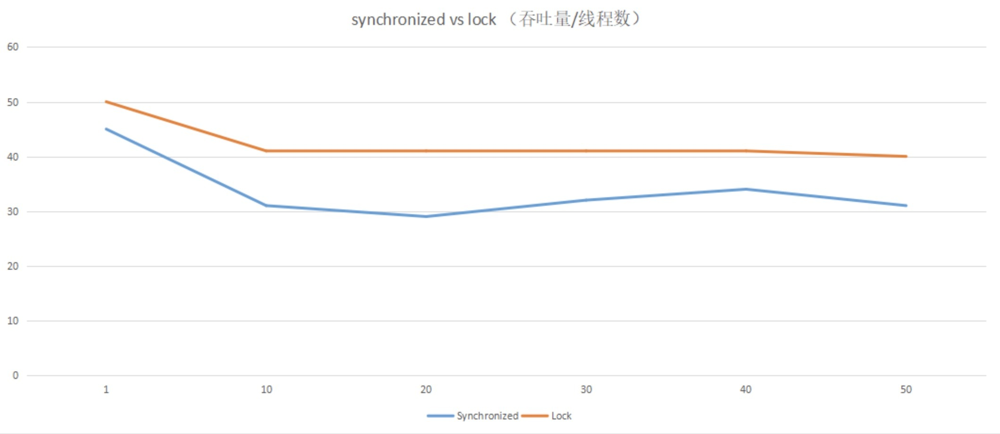
通过以上数据，我们可以发现：Lock锁的性能相对来说更加稳定。那它与上一讲的Synchronized同步锁相比，实现原理又是怎样的呢？

### 3.2.1 Lock锁的实现原理

Lock锁是基于Java实现的锁，Lock是一个接口类，常用的实现类有ReentrantLock、ReentrantReadWriteLock（RRW），它们都是依赖AbstractQueuedSynchronizer（AQS）类实现的。

AQS类结构中包含一个基于链表实现的等待队列（CLH队列），用于存储所有阻塞的线程，AQS中还有一个state变量，该变量对ReentrantLock来说表示加锁状态。该队列的操作均通过CAS操作实现，我们可以通过一张图来看下整个获取锁的流程。


---

### 3.2.2 锁分离优化Lock同步锁

虽然Lock锁的性能稳定，但也并不是所有的场景下都默认使用ReentrantLock独占锁来实现线程同步。我们知道，对于同一份数据进行读写，如果一个线程在读数据，而另一个线程在写数据，那么读到的数据和最终的数据就会不一致；如果一个线程在写数据，而另一个线程也在写数据，那么线程前后看到的数据也会不一致。这个时候我们可以在读写方法中加入互斥锁，来保证任何时候只能有一个线程进行读或写操作。

在大部分业务场景中，读业务操作要远远大于写业务操作。而在多线程编程中，读操作并不会修改共享资源的数据，如果多个线程仅仅是读取共享资源，那么这种情况下其实没有必要对资源进行加锁。如果使用互斥锁，反倒会影响业务的并发性能，那么在这种场景下，有没有什么办法可以优化下锁的实现方式呢？

#### 1.读写锁ReentrantReadWriteLock

针对这种读多写少的场景，Java提供了另外一个实现Lock接口的读写锁RRW。我们已知ReentrantLock是一个独占锁，同一时间只允许一个线程访问，而RRW允许多个读线程同时访问，但不允许写线程和读线程、写线程和写线程同时访问。读写锁内部维护了两个锁，一个是用于读操作的ReadLock，一个是用于写操作的WriteLock。

那读写锁又是如何实现锁分离来保证共享资源的原子性呢？RRW也是基于AQS实现的，它的自定义同步器（继承AQS）需要在同步状态state上维护多个读线程和一个写线程的状态，该状态的设计成为实现读写锁的关键。RRW很好地使用了高低位，来实现一个整型控制两种状态的功能，读写锁将变量切分成了两个部分，高16位表示读，低16位表示写。

一个线程尝试获取写锁时，会先判断同步状态state是否为0。如果state等于0，说明暂时没有其它线程获取锁；如果state不等于0，则说明有其它线程获取了锁。此时再判断同步状态state的低16位（w）是否为0，如果w为0，则说明其它线程获取了读锁，此时进入CLH队列进行阻塞等待；如果w不为0，则说明其它线程获取了写锁，此时要判断获取了写锁的是不是当前线程，若不是就进入CLH队列进行阻塞等待；若是，就应该判断当前线程获取写锁是否超过了最大次数，若超过，抛异常，反之更新同步状态。
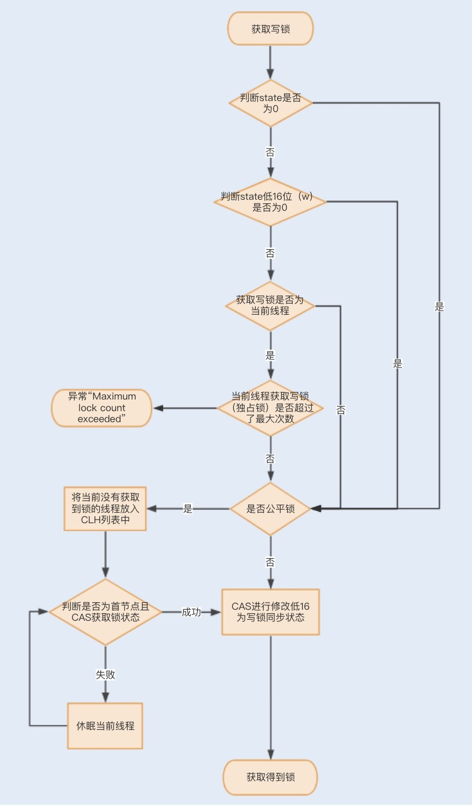

一个线程尝试获取读锁时，同样会先判断同步状态state是否为0。如果state等于0，说明暂时没有其它线程获取锁，此时判断是否需要阻塞，如果需要阻塞，则进入CLH队列进行阻塞等待；如果不需要阻塞，则CAS更新同步状态为读状态。如果state不等于0，会判断同步状态低16位，如果存在写锁，则获取读锁失败，进入CLH阻塞队列；反之，判断当前线程是否应该被阻塞，如果不应该阻塞则尝试CAS同步状态，获取成功更新同步锁为读状态。
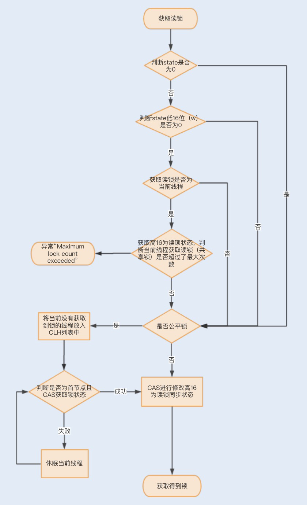

下面我们通过一个求平方的例子，来感受下RRW的实现，代码如下：

```java
public class TestRTTLock {

	private double x, y;
	private ReentrantReadWriteLock lock = new ReentrantReadWriteLock();
	// 读锁
	private Lock readLock = lock.readLock();
	// 写锁
	private Lock writeLock = lock.writeLock();
	public double read() {
		//获取读锁
		readLock.lock();
		try {
			return Math.sqrt(x * x + y * y);
		} finally {
			//释放读锁
			readLock.unlock();
		}
	}

	public void move(double deltaX, double deltaY) {
		//获取写锁
		writeLock.lock();
		try {
			x += deltaX;
			y += deltaY;
		} finally {
			//释放写锁
			writeLock.unlock();
		}
	}

}
```

#### 2.读写锁再优化之StampedLock

RRW被很好地应用在了读大于写的并发场景中，然而RRW在性能上还有可提升的空间。在读取很多、写入很少的情况下，RRW会使写入线程遭遇饥饿（Starvation）问题，也就是说写入线程会因迟迟无法竞争到锁而一直处于等待状态。

在JDK1.8中，Java提供了StampedLock类解决了这个问题。StampedLock不是基于AQS实现的，但实现的原理和AQS是一样的，都是基于队列和锁状态实现的。与RRW不一样的是，StampedLock控制锁有三种模式: 写、悲观读以及乐观读，并且StampedLock在获取锁时会返回一个票据stamp，获取的stamp除了在释放锁时需要校验，在乐观读模式下，stamp还会作为读取共享资源后的二次校验，后面我会讲解stamp的工作原理。

我们先通过一个官方的例子来了解下StampedLock是如何使用的，代码如下：

```java
public class Point {
    private double x, y;
    private final StampedLock s1 = new StampedLock();
    void move(double deltaX, double deltaY) {
        //获取写锁
        long stamp = s1.writeLock();
        try {
            x += deltaX;
            y += deltaY;
        } finally {
            //释放写锁
            s1.unlockWrite(stamp);
        }
    }

    double distanceFormOrigin() {
        //乐观读操作
        long stamp = s1.tryOptimisticRead();  
        //拷贝变量
        double currentX = x, currentY = y;
        //判断读期间是否有写操作
        if (!s1.validate(stamp)) {
            //升级为悲观读
            stamp = s1.readLock();
            try {
                currentX = x;
                currentY = y;
            } finally {
                s1.unlockRead(stamp);
            }
        }
        return Math.sqrt(currentX * currentX + currentY * currentY);
    }
}
```

我们可以发现：一个写线程获取写锁的过程中，首先是通过WriteLock获取一个票据stamp，WriteLock是一个独占锁，同时只有一个线程可以获取该锁，当一个线程获取该锁后，其它请求的线程必须等待，当没有线程持有读锁或者写锁的时候才可以获取到该锁。请求该锁成功后会返回一个stamp票据变量，用来表示该锁的版本，当释放该锁的时候，需要unlockWrite并传递参数stamp。

接下来就是一个读线程获取锁的过程。首先线程会通过乐观锁tryOptimisticRead操作获取票据stamp ，如果当前没有线程持有写锁，则返回一个非0的stamp版本信息。线程获取该stamp后，将会拷贝一份共享资源到方法栈，在这之前具体的操作都是基于方法栈的拷贝数据。

之后方法还需要调用validate，验证之前调用tryOptimisticRead返回的stamp在当前是否有其它线程持有了写锁，如果是，那么validate会返回0，升级为悲观锁；否则就可以使用该stamp版本的锁对数据进行操作。

相比于RRW，StampedLock获取读锁只是使用与或操作进行检验，不涉及CAS操作，即使第一次乐观锁获取失败，也会马上升级至悲观锁，这样就可以避免一直进行CAS操作带来的CPU占用性能的问题，因此StampedLock的效率更高。

#### 公平锁和非公平锁的简单比较

- 公平锁和非公平锁的比较：
  - 响应时间：公平锁由于要严格按照等待队列中的顺序来分配锁，可能会导致整体的响应时间变长，因为新请求的线程必须等待队列中所有老线程都获取一次锁之后才能获得锁。
  - 吞吐量：非公平锁往往能提供更好的吞吐量。这是因为当一个锁被释放时，如果有线程正好请求这个锁，它可能直接获取锁而无需加入等待队列，减少了上下文切换和队列排队的开销。

---

### 3.2.3 总结

不管使用Synchronized同步锁还是Lock同步锁，只要存在锁竞争就会产生线程阻塞，从而导致线程之间的频繁切换，最终增加性能消耗。因此，如何降低锁竞争，就成为了优化锁的关键。在Synchronized同步锁中，我们了解了可以通过减小锁粒度、减少锁占用时间来降低锁的竞争。在这一讲中，我们知道可以利用Lock锁的灵活性，通过锁分离的方式来降低锁竞争。

Lock锁实现了读写锁分离来优化读大于写的场景，从普通的RRW实现到读锁和写锁，到StampedLock实现了乐观读锁、悲观读锁和写锁，都是为了降低锁的竞争，促使系统的并发性能达到最佳。

- 思考题
  StampedLock同RRW一样，都适用于读大于写操作的场景，StampedLock青出于蓝结果却不好说，毕竟RRW还在被广泛应用，就说明它还有StampedLock无法替代的优势。你知道StampedLock没有被广泛应用的原因吗？或者说它还存在哪些缺陷导致没有被广泛应用。
- StampedLock 在某些方面优于传统的 ReadWriteLock，但它并没有被广泛应用，主要原因包括以下几点：
  - 复杂性:StampedLock 的API比 ReadWriteLock 更复杂。StampedLock 提供了三种模式的锁：读锁、写锁和乐观读锁，每种模式的锁都通过获取一个戳（stamp）来控制和访问。开发人员需要手动检查戳的值来确保锁的正确释放和转换，这增加了使用的复杂性。
  - 不支持Reentrant特性:与 ReentrantReadWriteLock 不同，StampedLock 不支持重入。如果一个线程已经持有写锁，它再次尝试获取写锁，或者尝试获取读锁时，会导致死锁。这一限制使得 StampedLock 在某些需要重入锁的场景下不适用。
  - 阻塞行为导致的中断问题:当线程阻塞在 StampedLock 的读锁或写锁上时，如果尝试中断这个线程，它会导致CPU的高负荷。这是因为 StampedLock 设计中阻塞线程的唤醒方式会导致中断线程在某些情况下持续消耗CPU资源，这是一个已知的问题。
  - 缺乏条件变量:ReadWriteLock 允许和 Condition 一起使用，这样可以在锁释放时进行条件等待。StampedLock 没有内置的条件变量支持，限制了它在某些场景下的应用。
  - 风险:由于 StampedLock 的API使用起来较为复杂，且存在一些坑点（如不支持重入、容易导致死锁等），不正确的使用 StampedLock 的风险相比 ReentrantReadWriteLock 更高。这使得它成为了一个更适合在性能敏感且线程模型简单的场景下使用的工具。

## 3.3 多线程之锁优化（下）：使用乐观锁优化并行操作

前两讲我们讨论了Synchronized和Lock实现的同步锁机制，这两种同步锁都属于悲观锁，是保护线程安全最直观的方式。我们知道悲观锁在高并发的场景下，激烈的锁竞争会造成线程阻塞，大量阻塞线程会导致系统的上下文切换，增加系统的性能开销。那有没有可能实现一种非阻塞型的锁机制来保证线程的安全呢？答案是肯定的。今天我就带你学习下乐观锁的优化方法，看看怎么使用才能发挥它最大的价值。

### 3.3.1 什么是乐观锁

开始优化前，我们先来简单回顾下乐观锁的定义。乐观锁，顾名思义，就是说在操作共享资源时，它总是抱着乐观的态度进行，它认为自己可以成功地完成操作。但实际上，当多个线程同时操作一个共享资源时，只有一个线程会成功，那么失败的线程呢？它们不会像悲观锁一样在操作系统中挂起，而仅仅是返回，并且系统允许失败的线程重试，也允许自动放弃退出操作。

所以，乐观锁相比悲观锁来说，不会带来死锁、饥饿等活性故障问题，线程间的相互影响也远远比悲观锁要小。更为重要的是，乐观锁没有因竞争造成的系统开销，所以在性能上也是更胜一筹。

---

### 3.3.2乐观锁的实现原理

相信你对上面的内容是有一定的了解的，下面我们来看看乐观锁的实现原理，有助于我们从根本上总结优化方法。CAS是实现乐观锁的核心算法，它包含了3个参数：V（需要更新的变量）、E（预期值）和N（最新值）。

只有当需要更新的变量等于预期值时，需要更新的变量才会被设置为最新值，如果更新值和预期值不同，则说明已经有其它线程更新了需要更新的变量，此时当前线程不做操作，返回V的真实值。

#### 1.CAS如何实现原子操作

在JDK中的concurrent包中，atomic路径下的类都是基于CAS实现的。AtomicInteger就是基于CAS实现的一个线程安全的整型类。下面我们通过源码来了解下如何使用CAS实现原子操作。

我们可以看到AtomicInteger的自增方法getAndIncrement是用了Unsafe的getAndAddInt方法，显然AtomicInteger依赖于本地方法Unsafe类，Unsafe类中的操作方法会调用CPU底层指令实现原子操作。

```java
//基于CAS操作更新值
    public final boolean compareAndSet(int expect, int update) {
        return unsafe.compareAndSwapInt(this, valueOffset, expect, update);
    }
    //基于CAS操作增1
    public final int getAndIncrement() {
        return unsafe.getAndAddInt(this, valueOffset, 1);
    }
  
    //基于CAS操作减1
    public final int getAndDecrement() {
        return unsafe.getAndAddInt(this, valueOffset, -1);
```

#### 2.处理器如何实现原子操作

CAS是调用处理器底层指令来实现原子操作，那么处理器底层又是如何实现原子操作的呢？处理器和物理内存之间的通信速度要远慢于处理器间的处理速度，所以处理器有自己的内部缓存。如下图所示，在执行操作时，频繁使用的内存数据会缓存在处理器的L1、L2和L3高速缓存中，以加快频繁读取的速度。

一般情况下，一个单核处理器能自我保证基本的内存操作是原子性的，当一个线程读取一个字节时，所有进程和线程看到的字节都是同一个缓存里的字节，其它线程不能访问这个字节的内存地址。但现在的服务器通常是多处理器，并且每个处理器都是多核的。每个处理器维护了一块字节的内存，每个内核维护了一块字节的缓存，这时候多线程并发就会存在缓存不一致的问题，从而导致数据不一致。

**这个时候，处理器提供了总线锁定和缓存锁定两个机制来保证复杂内存操作的原子性。**

当处理器要操作一个共享变量的时候，其在总线上会发出一个Lock信号，这时其它处理器就不能操作共享变量了，该处理器会独享此共享内存中的变量。但总线锁定在阻塞其它处理器获取该共享变量的操作请求时，也可能会导致大量阻塞，从而增加系统的性能开销。于是，后来的处理器都提供了缓存锁定机制，也就说当某个处理器对缓存中的共享变量进行了操作，就会通知其它处理器放弃存储该共享资源或者重新读取该共享资源。目前最新的处理器都支持缓存锁定机制。

---

### 3.3.3 优化CAS乐观锁

虽然乐观锁在并发性能上要比悲观锁优越，但是在写大于读的操作场景下，CAS失败的可能性会增大，如果不放弃此次CAS操作，就需要循环做CAS重试，这无疑会长时间地占用CPU。

在Java7中，通过以下代码我们可以看到：AtomicInteger的getAndSet方法中使用了for循环不断重试CAS操作，如果长时间不成功，就会给CPU带来非常大的执行开销。到了Java8，for循环虽然被去掉了，但我们反编译Unsafe类时就可以发现该循环其实是被封装在了Unsafe类中，CPU的执行开销依然存在。

```
public final int getAndSet(int newValue) {
        for (;;) {
            int current = get();
            if (compareAndSet(current, newValue))
                return current;
        }
    }
```

在JDK1.8中，Java提供了一个新的原子类LongAdder。LongAdder在高并发场景下会比AtomicInteger和AtomicLong的性能更好，代价就是会消耗更多的内存空间。

LongAdder的原理就是降低操作共享变量的并发数，也就是将对单一共享变量的操作压力分散到多个变量值上，将竞争的每个写线程的value值分散到一个数组中，不同线程会命中到数组的不同槽中，各个线程只对自己槽中的value值进行CAS操作，最后在读取值的时候会将原子操作的共享变量与各个分散在数组的value值相加，返回一个近似准确的数值。

LongAdder内部由一个base变量和一个cell[]数组组成。当只有一个写线程，没有竞争的情况下，LongAdder会直接使用base变量作为原子操作变量，通过CAS操作修改变量；当有多个写线程竞争的情况下，除了占用base变量的一个写线程之外，其它各个线程会将修改的变量写入到自己的槽cell[]数组中，最终结果可通过以下公式计算得出：value $=$ base $+\sum_{i=0}^n$ Cell $[i]$

我们可以发现，LongAdder在操作后的返回值只是一个近似准确的数值，但是LongAdder最终返回的是一个准确的数值， 所以在一些对实时性要求比较高的场景下，LongAdder并不能取代AtomicInteger或AtomicLong。

### 3.3.4 总结

---

在日常开发中，使用乐观锁最常见的场景就是数据库的更新操作了。为了保证操作数据库的原子性，我们常常会为每一条数据定义一个版本号，并在更新前获取到它，到了更新数据库的时候，还要判断下已经获取的版本号是否被更新过，如果没有，则执行该操作。CAS乐观锁在平常使用时比较受限，它只能保证单个变量操作的原子性，当涉及到多个变量时，CAS就无能为力了，但前两讲讲到的悲观锁可以通过对整个代码块加锁来做到这点。

CAS乐观锁在高并发写大于读的场景下，大部分线程的原子操作会失败，失败后的线程将会不断重试CAS原子操作，这样就会导致大量线程长时间地占用CPU资源，给系统带来很大的性能开销。在JDK1.8中，Java新增了一个原子类LongAdder，它使用了空间换时间的方法，解决了上述问题。

11～13讲的内容，我详细地讲解了基于JVM实现的同步锁Synchronized，AQS实现的同步锁Lock以及CAS实现的乐观锁。相信你也很好奇，这三种锁，到底哪一种的性能最好，现在我们来对比下三种不同实现方式下的锁的性能。

鉴于脱离实际业务场景的性能对比测试没有意义，我们可以分别在“读多写少”“读少写多”“读写差不多”这三种场景下进行测试。又因为锁的性能还与竞争的激烈程度有关，所以除此之外，我们还将做三种锁在不同竞争级别下的性能测试。综合上述条件，我将对四种模式下的五个锁Synchronized、ReentrantLock、ReentrantReadWriteLock、StampedLock以及乐观锁LongAdder进行压测。

这里简要说明一下：我是在不同竞争级别的情况下，用不同的读写线程数组合出了四组测试，测试代码使用了计算并发计数器，读线程会去读取计数器的值，而写线程会操作变更计数器值，运行环境是4核的i7处理器。结果已给出，具体的测试代码可以点击[github](https://github.com/nickliuchao/lockTest)查看下载。

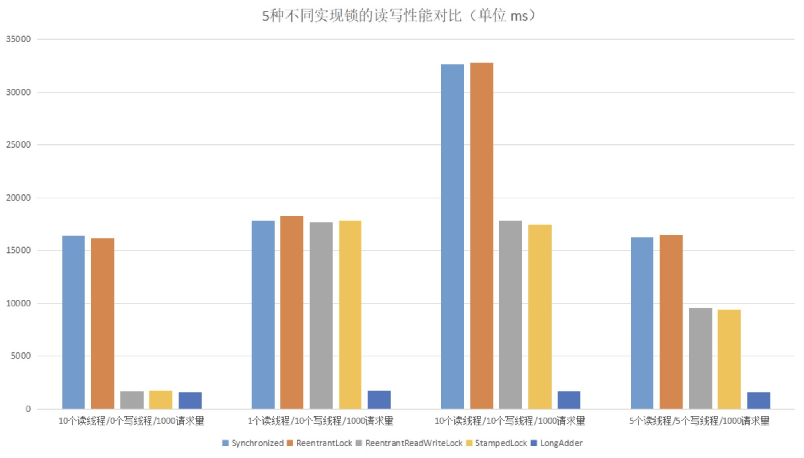
通过以上结果，我们可以发现：在读大于写的场景下，读写锁ReentrantReadWriteLock、StampedLock以及乐观锁的读写性能是最好的；在写大于读的场景下，乐观锁的性能是最好的，其它4种锁的性能则相差不多；在读和写差不多的场景下，两种读写锁以及乐观锁的性能要优于Synchronized和ReentrantLock。

- 思考题
  - 我们在使用CAS操作的时候要注意的ABA问题指的是什么呢？

## 3.4 多线程调优（上）：哪些操作导致了上下文切换？

我们常说“实践是检验真理的唯一标准”，这句话不光在社会发展中可行，在技术学习中也同样适用。记得我刚入职上家公司的时候，恰好赶上了一次抢购活动。这是系统重构上线后经历的第一次高并发考验，如期出现了大量超时报警，不过比我预料的要好一点，起码没有挂掉重启。

通过工具分析，我发现 cs（上下文切换每秒次数）指标已经接近了 60w ，平时的话最高5w。再通过日志分析，我发现了大量带有 wait() 的 Exception，由此初步怀疑是大量线程处理不及时导致的，进一步锁定问题是连接池大小设置不合理。后来我就模拟了生产环境配置，对连接数压测进行调节，降低最大线程数，最后系统的性能就上去了。

从实践中总结经验，我知道了在并发程序中，并不是启动更多的线程就能让程序最大限度地并发执行。线程数量设置太小，会导致程序不能充分地利用系统资源；线程数量设置太大，又可能带来资源的过度竞争，导致上下文切换带来额外的系统开销。

你看，其实很多经验就是这么一点点积累的。那么今天，我就想和你分享下“上下文切换”的相关内容，希望也能让你有所收获。

---

### 3.4.1 初识上下文切换

我们首先得明白，上下文切换到底是什么。其实在单个处理器的时期，操作系统就能处理多线程并发任务。处理器给每个线程分配 CPU 时间片（Time Slice），线程在分配获得的时间片内执行任务。

CPU 时间片是 CPU 分配给每个线程执行的时间段，一般为几十毫秒。在这么短的时间内线程互相切换，我们根本感觉不到，所以看上去就好像是同时进行的一样。时间片决定了一个线程可以连续占用处理器运行的时长。当一个线程的时间片用完了，或者因自身原因被迫暂停运行了，这个时候，另外一个线程（可以是同一个线程或者其它进程的线程）就会被操作系统选中，来占用处理器。这种一个线程被暂停剥夺使用权，另外一个线程被选中开始或者继续运行的过程就叫做上下文切换（Context Switch）。

具体来说，一个线程被剥夺处理器的使用权而被暂停运行，就是“切出”；一个线程被选中占用处理器开始或者继续运行，就是“切入”。在这种切出切入的过程中，操作系统需要保存和恢复相应的进度信息，这个进度信息就是“上下文”了。

那上下文都包括哪些内容呢？具体来说，它包括了寄存器的存储内容以及程序计数器存储的指令内容。CPU 寄存器负责存储已经、正在和将要执行的任务，程序计数器负责存储CPU 正在执行的指令位置以及即将执行的下一条指令的位置。在当前 CPU 数量远远不止一个的情况下，操作系统将 CPU 轮流分配给线程任务，此时的上下文切换就变得更加频繁了，并且存在跨 CPU 上下文切换，比起单核上下文切换，跨核切换更加昂贵。

---

### 3.4.2 多线程上下文切换诱因

在操作系统中，上下文切换的类型还可以分为进程间的上下文切换和线程间的上下文切换。而在多线程编程中，我们主要面对的就是线程间的上下文切换导致的性能问题，下面我们就重点看看究竟是什么原因导致了多线程的上下文切换。开始之前，先看下系统线程的生命周期状态。
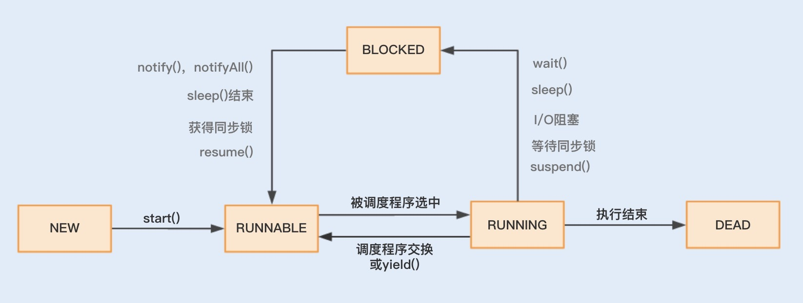

结合图示可知，线程主要有“新建”（NEW）、“就绪”（RUNNABLE）、“运行”（RUNNING）、“阻塞”（BLOCKED）、“死亡”（DEAD）五种状态。到了Java层面它们都被映射为了NEW、RUNABLE、BLOCKED、WAITING、TIMED_WAITING、TERMINADTED等6种状态。

- 在这个运行过程中，线程由RUNNABLE转为非RUNNABLE的过程就是线程上下文切换。一个线程的状态由 RUNNING 转为 BLOCKED ，再由 BLOCKED 转为 RUNNABLE ，然后再被调度器选中执行，这就是一个上下文切换的过程。
- 当一个线程从 RUNNING 状态转为 BLOCKED 状态时，我们称为一个线程的暂停，线程暂停被切出之后，操作系统会保存相应的上下文，以便这个线程稍后再次进入 RUNNABLE 状态时能够在之前执行进度的基础上继续执行。
- 当一个线程从 BLOCKED 状态进入到 RUNNABLE 状态时，我们称为一个线程的唤醒，此时线程将获取上次保存的上下文继续完成执行。

通过线程的运行状态以及状态间的相互切换，我们可以了解到，多线程的上下文切换实际上就是由多线程两个运行状态的互相切换导致的。那么在线程运行时，线程状态由 RUNNING 转为 BLOCKED 或者由 BLOCKED 转为 RUNNABLE，这又是什么诱发的呢？

我们可以分两种情况来分析，一种是程序本身触发的切换，这种我们称为自发性上下文切换，另一种是由系统或者虚拟机诱发的非自发性上下文切换。自发性上下文切换指线程由 Java 程序调用导致切出，在多线程编程中，执行调用以下方法或关键字，常常就会引发自发性上下文切换。

- sleep()
- wait()
- yield()
- join()
- park()
- synchronized
- lock

非自发性上下文切换指线程由于调度器的原因被迫切出。常见的有：线程被分配的时间片用完，虚拟机垃圾回收导致或者执行优先级的问题导致。这里重点说下“虚拟机垃圾回收为什么会导致上下文切换”。在 Java 虚拟机中，对象的内存都是由虚拟机中的堆分配的，在程序运行过程中，新的对象将不断被创建，如果旧的对象使用后不进行回收，堆内存将很快被耗尽。Java 虚拟机提供了一种回收机制，对创建后不再使用的对象进行回收，从而保证堆内存的可持续性分配。而这种垃圾回收机制的使用有可能会导致 stop-the-world 事件的发生，这其实就是一种线程暂停行为。

```
"Stop-the-World"（STW）是垃圾收集（Garbage Collection，简称GC）领域中的一个术语，指的是GC进行时，应用程序中的所有其他线程或进程必须停止运行，以等待GC完成的过程。在这个阶段，应用程序无法响应任何外部请求，导致程序暂时挂起。

STW事件发生的原因主要是GC需要在安全的状态下执行，确保在清理不再被引用的对象时，不会出现应用程序正在使用这些即将被回收的对象的情况。因此，STW是一种保证GC能够安全进行的机制。不同的GC策略和算法，比如标记-清除（Mark-Sweep）、标记-整理（Mark-Compact）以及分代收集器（Generational Collectors），在进行垃圾回收时引发的STW时间长度也会有所不同。

尽管STW确保了内存回收的安全性，但过长的STW时间会严重影响应用程序的响应时间和吞吐量。因此，在选择和调优垃圾收集算法时，减少STW的持续时间是一个重要的考虑因素。例如，在Java虚拟机（JVM）中，不同的垃圾收集器（如G1 GC、CMS、ZGC、Shenandoah等）都在努力通过不同的方法减少STW的影响，以提高应用程序的性能和响应能力。
```

---

### 3.4.3 发现上下文切换

我们总说上下文切换会带来系统开销，那它带来的性能问题是不是真有这么糟糕呢？我们又该怎么去监测到上下文切换？上下文切换到底开销在哪些环节？接下来我将给出一段代码，来对比串联执行和并发执行的速度，然后一一解答这些问题。

```java
public class DemoApplication {
       public static void main(String[] args) {
              //运行多线程
              MultiThreadTester test1 = new MultiThreadTester();
              test1.Start();
              //运行单线程
              SerialTester test2 = new SerialTester();
              test2.Start();
       }
       static class MultiThreadTester extends ThreadContextSwitchTester {
              @Override
              public void Start() {
                     long start = System.currentTimeMillis();
                     MyRunnable myRunnable1 = new MyRunnable();
                     Thread[] threads = new Thread[4];
                     //创建多个线程
                     for (int i = 0; i < 4; i++) {
                           threads[i] = new Thread(myRunnable1);
                           threads[i].start();
                     }
                     for (int i = 0; i < 4; i++) {
                           try {
                                  //等待一起运行完
                                  threads[i].join();
                           } catch (InterruptedException e) {
                                  // TODO Auto-generated catch block
                                  e.printStackTrace();
                           }
                     }
                     long end = System.currentTimeMillis();
                     System.out.println("multi thread exce time: " + (end - start) + "s");
                     System.out.println("counter: " + counter);
              }
              // 创建一个实现Runnable的类
              class MyRunnable implements Runnable {
                     public void run() {
                           while (counter < 100000000) {
                                  synchronized (this) {
                                         if(counter < 100000000) {
                                                increaseCounter();
                                         }
                           
                                  }
                           }
                     }
              }
       }
      //创建一个单线程
       static class SerialTester extends ThreadContextSwitchTester{
              @Override
              public void Start() {
                     long start = System.currentTimeMillis();
                     for (long i = 0; i < count; i++) {
                           increaseCounter();
                     }
                     long end = System.currentTimeMillis();
                     System.out.println("serial exec time: " + (end - start) + "s");
                     System.out.println("counter: " + counter);
              }
       }
       //父类
       static abstract class ThreadContextSwitchTester {
              public static final int count = 100000000;
              public volatile int counter = 0;
              public int getCount() {
                     return this.counter;
              }
              public void increaseCounter() {   
                     this.counter += 1;
              }
              public abstract void Start();
       }
}
```

执行之后，看一下两者的时间测试结果：


通过数据对比我们可以看到：串联的执行速度比并发的执行速度要快。这就是因为线程的上下文切换导致了额外的开销，使用 Synchronized 锁关键字，导致了资源竞争，从而引起了上下文切换，但即使不使用 Synchronized 锁关键字，并发的执行速度也无法超越串联的执行速度，这是因为多线程同样存在着上下文切换。Redis、NodeJS的设计就很好地体现了单线程串行的优势。

在 Linux 系统下，可以使用 Linux 内核提供的 vmstat[vmstat参考](https://www.cnblogs.com/ggjucheng/archive/2012/01/05/2312625.html) 命令，来监视 Java 程序运行过程中系统的上下文切换频率，cs如下图所示：
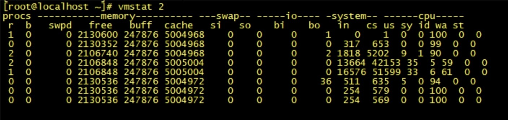
如果是监视某个应用的上下文切换，就可以使用 pidstat [pidstat参考](https://www.jianshu.com/p/3991c0dba094)命令监控指定进程的 Context Switch 上下文切换。
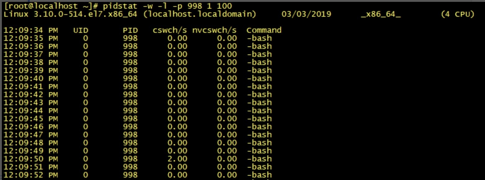

由于 Windows 没有像 vmstat 这样的工具，在 Windows 下，我们可以使用 Process Explorer，来查看程序执行时，线程间上下文切换的次数。至于系统开销具体发生在切换过程中的哪些具体环节，总结如下：

- 操作系统保存和恢复上下文；
- 调度器进行线程调度；
- 处理器高速缓存重新加载；
- 上下文切换也可能导致整个高速缓存区被冲刷，从而带来时间开销。

---

### 3.4.4 总结

上下文切换就是一个工作的线程被另外一个线程暂停，另外一个线程占用了处理器开始执行任务的过程。系统和 Java 程序自发性以及非自发性的调用操作，就会导致上下文切换，从而带来系统开销。

线程越多，系统的运行速度不一定越快。那么我们平时在并发量比较大的情况下，什么时候用单线程，什么时候用多线程呢？一般在单个逻辑比较简单，而且速度相对来非常快的情况下，我们可以使用单线程。例如，我们前面讲到的 Redis，从内存中快速读取值，不用考虑 I/O 瓶颈带来的阻塞问题。而在逻辑相对来说很复杂的场景，等待时间相对较长又或者是需要大量计算的场景，我建议使用多线程来提高系统的整体性能。例如，NIO 时期的文件读写操作、图像处理以及大数据分析等。

**思考题:**
以上我们主要讨论的是多线程的上下文切换，前面我讲分类的时候还曾提到了进程间的上下文切换。那么你知道在多线程中使用Synchronized还会发生进程间的上下文切换吗？具体又会发生在哪些环节呢？

**解答：**
当锁竞争过于频繁，会触发锁的升级到重量级锁。未能成功获取锁的线程则会被置入 monitor 状态。这一过程依赖于操作系统底层的互斥锁（mutex lock），在尝试获取锁的过程中，需要在用户态与内核态之间进行切换，导致线程之间发生上下文切换。

---

## 3.5 多线程调优（下）：如何优化多线程上下文切换？

通过上一讲的讲解，相信你对上下文切换已经有了一定的了解了。如果是单个线程，在 CPU 调用之后，那么它基本上是不会被调度出去的。如果可运行的线程数远大于 CPU 数量，那么操作系统最终会将某个正在运行的线程调度出来，从而使其它线程能够使用 CPU ，这就会导致上下文切换。

还有，在多线程中如果使用了竞争锁，当线程由于等待竞争锁而被阻塞时，JVM 通常会将这个线程挂起，并允许它被交换出去。如果频繁地发生阻塞，CPU 密集型的程序就会发生更多的上下文切换。

那么问题来了，我们知道在某些场景下使用多线程是非常必要的，但多线程编程给系统带来了上下文切换，从而增加的性能开销也是实打实存在的。那么我们该如何优化多线程上下文切换呢？这就是我今天要和你分享的话题，我将重点介绍几种常见的优化方法。

---

### 3.5.1 竞争锁优化

大多数人在多线程编程中碰到性能问题，第一反应多是想到了锁。多线程对锁资源的竞争会引起上下文切换，还有锁竞争导致的线程阻塞越多，上下文切换就越频繁，系统的性能开销也就越大。由此可见，在多线程编程中，锁其实不是性能开销的根源，竞争锁才是。

第11～13讲中我曾集中讲过锁优化，我们知道锁的优化归根结底就是减少竞争。这讲中我们就再来总结下锁优化的一些方式。

#### 1.减少锁的持有时间

我们知道，锁的持有时间越长，就意味着有越多的线程在等待该竞争资源释放。如果是Synchronized同步锁资源，就不仅是带来线程间的上下文切换，还有可能会增加进程间的上下文切换。

在第12讲中，我曾分享过一些更具体的方法，例如，可以将一些与锁无关的代码移出同步代码块，尤其是那些开销较大的操作以及可能被阻塞的操作。

- 优化前

```
public synchronized void mySyncMethod(){  
        businesscode1();  
        mutextMethod();  
        businesscode2();
    }
```

- 优化后

```
public void mySyncMethod(){  
        businesscode1();  
        synchronized(this)
        {
            mutextMethod();  
        }
        businesscode2();
    }
```

#### 2.降低锁的粒度

同步锁可以保证对象的原子性，我们可以考虑将锁粒度拆分得更小一些，以此避免所有线程对一个锁资源的竞争过于激烈。具体方式有以下两种：

- 锁分离
  与传统锁不同的是，读写锁实现了锁分离，也就是说读写锁是由“读锁”和“写锁”两个锁实现的，其规则是可以共享读，但只有一个写。这样做的好处是，在多线程读的时候，读读是不互斥的，读写是互斥的，写写是互斥的。而传统的独占锁在没有区分读写锁的时候，读写操作一般是：读读互斥、读写互斥、写写互斥。所以在读远大于写的多线程场景中，锁分离避免了在高并发读情况下的资源竞争，从而避免了上下文切换。
- 锁分段 我们在使用锁来保证集合或者大对象原子性时，可以考虑将锁对象进一步分解。例如，我之前讲过的 Java1.8 之前版本的 ConcurrentHashMap 就使用了锁分段。

#### 3.非阻塞乐观锁替代竞争锁

volatile关键字的作用是保障可见性及有序性，volatile的读写操作不会导致上下文切换，因此开销比较小。 但是，volatile不能保证操作变量的原子性，因为没有锁的排他性。

而 CAS 是一个原子的 if-then-act 操作，CAS 是一个无锁算法实现，保障了对一个共享变量读写操作的一致性。CAS 操作中有 3 个操作数，内存值 V、旧的预期值 A和要修改的新值 B，当且仅当 A 和 V 相同时，将 V 修改为 B，否则什么都不做，CAS 算法将不会导致上下文切换。Java 的 Atomic 包就使用了 CAS 算法来更新数据，就不需要额外加锁。

上面我们了解了如何从编码层面去优化竞争锁，那么除此之外，JVM内部其实也对Synchronized同步锁做了优化，我在12讲中有详细地讲解过，这里简单回顾一下。

在JDK1.6中，JVM将Synchronized同步锁分为了偏向锁、轻量级锁、自旋锁以及重量级锁，优化路径也是按照以上顺序进行。JIT 编译器在动态编译同步块的时候，也会通过锁消除、锁粗化的方式来优化该同步锁。

---

### 3.5.2 wait/notify优化

在 Java 中，我们可以通过配合调用 Object 对象的 wait()方法和 notify()方法或 notifyAll() 方法来实现线程间的通信。在线程中调用 wait()方法，将阻塞等待其它线程的通知（其它线程调用notify()方法或notifyAll()方法），在线程中调用 notify()方法或 notifyAll()方法，将通知其它线程从 wait()方法处返回。

下面我们通过wait() / notify()来实现一个简单的生产者和消费者的案例，代码如下：

```
public class WaitNotifyTest {
    public static void main(String[] args) {
        Vector<Integer> pool=new Vector<Integer>();
        Producer producer=new Producer(pool, 10);
        Consumer consumer=new Consumer(pool);
        new Thread(producer).start();
        new Thread(consumer).start();
    }
}
    /**
     * 生产者
     * @author admin
     *
     */
    class Producer implements Runnable{
        private Vector<Integer> pool;
        private Integer size;
  
        public Producer(Vector<Integer>  pool, Integer size) {
            this.pool = pool;
            this.size = size;
        }
  
        public void run() {
            for(;;){
                try {
                    System.out.println("生产一个商品 ");
                    produce(1);
                } catch (InterruptedException e) {
                    // TODO Auto-generated catch block
                    e.printStackTrace();
                }
            }
        }
        private void produce(int i) throws InterruptedException{
            while(pool.size()==size){
                synchronized (pool) {
                    System.out.println("生产者等待消费者消费商品,当前商品数量为"+pool.size());
                    pool.wait();//等待消费者消费
                }
            }
            synchronized (pool) {
                pool.add(i);
                pool.notifyAll();//生产成功，通知消费者消费
            }
        }
    }


    /**
     * 消费者
     * @author admin
     *
     */
    class Consumer implements Runnable{
        private Vector<Integer>  pool;
        public Consumer(Vector<Integer>  pool) {
            this.pool = pool;
        }
  
        public void run() {
            for(;;){
                try {
                    System.out.println("消费一个商品");
                    consume();
                } catch (InterruptedException e) {
                    // TODO Auto-generated catch block
                    e.printStackTrace();
                }
            }
        }
  
        private void consume() throws InterruptedException{
            synchronized (pool) {
                while(pool.isEmpty()) {
                    System.out.println("消费者等待生产者生产商品,当前商品数量为"+pool.size());
                    pool.wait();//等待生产者生产商品
                }
            }
            synchronized (pool) {
                pool.remove(0);
                pool.notifyAll();//通知生产者生产商品
  
            }
        }

}
```

#### wait/notify的使用导致了较多的上下文切换

结合以下图片，我们可以看到，在消费者第一次申请到锁之前，发现没有商品消费，此时会执行 Object.wait() 方法，这里会导致线程挂起，进入阻塞状态，这里为一次上下文切换。

当生产者获取到锁并执行notifyAll()之后，会唤醒处于阻塞状态的消费者线程，此时这里又发生了一次上下文切换。被唤醒的等待线程在继续运行时，需要再次申请相应对象的内部锁，此时等待线程可能需要和其它新来的活跃线程争用内部锁，这也可能会导致上下文切换。

如果有多个消费者线程同时被阻塞，用notifyAll()方法，将会唤醒所有阻塞的线程。而某些商品依然没有库存，过早地唤醒这些没有库存的商品的消费线程，可能会导致线程再次进入阻塞状态，从而引起不必要的上下文切换。

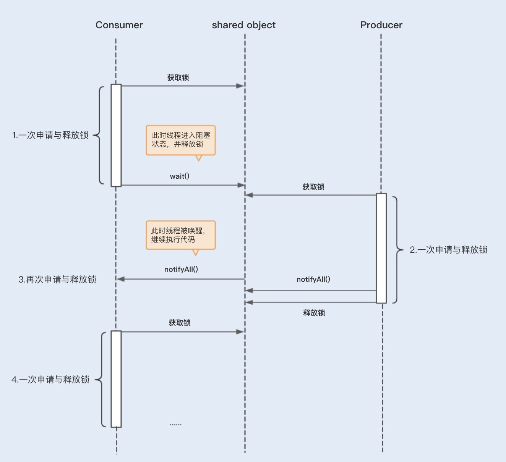

#### 优化wait/notify的使用，减少上下文切换

首先，我们在多个不同消费场景中，可以使用 Object.notify() 替代 Object.notifyAll()。 因为Object.notify() 只会唤醒指定线程，不会过早地唤醒其它未满足需求的阻塞线程，所以可以减少相应的上下文切换。

其次，在生产者执行完 Object.notify() / notifyAll()唤醒其它线程之后，应该尽快地释放内部锁，以避免其它线程在唤醒之后长时间地持有锁处理业务操作，这样可以避免被唤醒的线程再次申请相应内部锁的时候等待锁的释放。

最后，为了避免长时间等待，我们常会使用Object.wait (long）设置等待超时时间，但线程无法区分其返回是由于等待超时还是被通知线程唤醒，从而导致线程再次尝试获取锁操作，增加了上下文切换。这里我建议使用Lock锁结合Condition 接口替代Synchronized内部锁中的 wait / notify，实现等待／通知。这样做不仅可以解决上述的Object.wait(long) 无法区分的问题，还可以解决线程被过早唤醒的问题。

Condition 接口定义的 await 方法 、signal 方法和 signalAll 方法分别相当于 Object.wait()、 Object.notify()和 Object.notifyAll()。

---

### 3.5.3 合理地设置线程池大小，避免创建过多线程

线程池的线程数量设置不宜过大，因为一旦线程池的工作线程总数超过系统所拥有的处理器数量，就会导致过多的上下文切换。更多关于如何合理设置线程池数量的内容，我将在第18讲中详解。

还有一种情况就是，在有些创建线程池的方法里，线程数量设置不会直接暴露给我们。比如，用 Executors.newCachedThreadPool() 创建的线程池，该线程池会复用其内部空闲的线程来处理新提交的任务，如果没有，再创建新的线程（不受 MAX_VALUE 限制），这样的线程池如果碰到大量且耗时长的任务场景，就会创建非常多的工作线程，从而导致频繁的上下文切换。因此，这类线程池就只适合处理大量且耗时短的非阻塞任务。

---

### 3.5.4 使用协程实现非阻塞等待

相信很多人一听到协程（Coroutines），马上想到的就是Go语言。协程对于大部分 Java 程序员来说可能还有点陌生，但其在 Go 中的使用相对来说已经很成熟了。

协程是一种比线程更加轻量级的东西，相比于由操作系统内核来管理的进程和线程，协程则完全由程序本身所控制，也就是在用户态执行。协程避免了像线程切换那样产生的上下文切换，在性能方面得到了很大的提升。协程在多线程业务上的运用，我会在第18讲中详述。

---

### 3.5.5 减少Java虚拟机的垃圾回收

我们在上一讲讲上下文切换的诱因时，曾提到过“垃圾回收会导致上下文切换”。

很多 JVM 垃圾回收器（serial收集器、ParNew收集器）在回收旧对象时，会产生内存碎片，从而需要进行内存整理，在这个过程中就需要移动存活的对象。而移动内存对象就意味着这些对象所在的内存地址会发生变化，因此在移动对象前需要暂停线程，在移动完成后需要再次唤醒该线程。因此减少 JVM 垃圾回收的频率可以有效地减少上下文切换。

---

### 3.5.6 总结

上下文切换是多线程编程性能消耗的原因之一，而竞争锁、线程间的通信以及过多地创建线程等多线程编程操作，都会给系统带来上下文切换。除此之外，I/O阻塞以及JVM的垃圾回收也会增加上下文切换。

总的来说，过于频繁的上下文切换会影响系统的性能，所以我们应该避免它。另外，我们还可以将上下文切换也作为系统的性能参考指标，并将该指标纳入到服务性能监控，防患于未然。

---

## 3.6 并发容器的使用：识别不同场景下最优容器

在并发编程中，我们经常会用到容器。今天我要和你分享的话题就是：在不同场景下我们该如何选择最优容器。

### 3.6.1 并发场景下的Map容器

假设我们现在要给一个电商系统设计一个简单的统计商品销量TOP 10的功能。常规情况下，我们是用一个哈希表来存储商品和销量键值对，然后使用排序获得销量前十的商品。在这里，哈希表是实现该功能的关键。那么请思考一下，如果要你设计这个功能，你会使用哪个容器呢？在07讲中，我曾详细讲过HashMap的实现原理，以及HashMap结构的各个优化细节。我说过HashMap的性能优越，经常被用来存储键值对。那么这里我们可以使用HashMap吗？

答案是不可以，我们切忌在并发场景下使用HashMap。因为在JDK1.7之前，在并发场景下使用HashMap会出现死循环，从而导致CPU使用率居高不下，而扩容是导致死循环的主要原因。虽然Java在JDK1.8中修复了HashMap扩容导致的死循环问题，但在高并发场景下，依然会有数据丢失以及不准确的情况出现。

这时为了保证容器的线程安全，Java实现了Hashtable、ConcurrentHashMap以及ConcurrentSkipListMap等Map容器。

Hashtable、ConcurrentHashMap是基于HashMap实现的，对于小数据量的存取比较有优势。
ConcurrentSkipListMap是基于TreeMap的设计原理实现的，略有不同的是前者基于跳表实现，后者基于红黑树实现，ConcurrentSkipListMap的特点是存取平均时间复杂度是O（log（n）），适用于大数据量存取的场景，最常见的是基于跳跃表实现的数据量比较大的缓存。

回归到开始的案例再看一下，如果这个电商系统的商品总量不是特别大的话，我们可以用Hashtable或ConcurrentHashMap来实现哈希表的功能。

---

### 3.6.2 Hashtable 🆚 ConcurrentHashMap

更精准的话，我们可以进一步对比看看以上两种容器。

在数据不断地写入和删除，且不存在数据量累积以及数据排序的场景下，我们可以选用Hashtable或ConcurrentHashMap。Hashtable使用Synchronized同步锁修饰了put、get、remove等方法，因此在高并发场景下，读写操作都会存在大量锁竞争，给系统带来性能开销。

相比Hashtable，ConcurrentHashMap在保证线程安全的基础上兼具了更好的并发性能。在JDK1.7中，ConcurrentHashMap就使用了分段锁Segment减小了锁粒度，最终优化了锁的并发操作。

到了JDK1.8，ConcurrentHashMap做了大量的改动，摒弃了Segment的概念。由于Synchronized锁在Java6之后的性能已经得到了很大的提升，所以在JDK1.8中，Java重新启用了Synchronized同步锁，通过Synchronized实现HashEntry作为锁粒度。这种改动将数据结构变得更加简单了，操作也更加清晰流畅。

与JDK1.7的put方法一样，JDK1.8在添加元素时，在没有哈希冲突的情况下，会使用CAS进行添加元素操作；如果有冲突，则通过Synchronized将链表锁定，再执行接下来的操作。


综上所述，我们在设计销量TOP10功能时，首选ConcurrentHashMap。但要注意一点，虽然ConcurrentHashMap的整体性能要优于Hashtable，但在某些场景中，ConcurrentHashMap依然不能代替Hashtable。例如，在强一致的场景中ConcurrentHashMap就不适用，原因是ConcurrentHashMap中的get、size等方法没有用到锁，ConcurrentHashMap是弱一致性的，因此有可能会导致某次读无法马上获取到写入的数据。

---

### 3.6.3 ConcurrentHashMap 🆚 ConcurrentSkipListMap

我们再看一个案例，我上家公司的操作系统中有这样一个功能，提醒用户手机卡实时流量不足。主要的流程是服务端先通过虚拟运营商同步用户实时流量，再通过手机端定时触发查询功能，如果流量不足，就弹出系统通知。

该功能的特点是用户量大，并发量高，写入多于查询操作。这时我们就需要设计一个缓存，用来存放这些用户以及对应的流量键值对信息。那么假设让你来实现一个简单的缓存，你会怎么设计呢？

你可能会考虑使用ConcurrentHashMap容器，但我在07讲中说过，该容器在数据量比较大的时候，链表会转换为红黑树。红黑树在并发情况下，删除和插入过程中有个平衡的过程，会牵涉到大量节点，因此竞争锁资源的代价相对比较高。而跳跃表的操作针对局部，需要锁住的节点少，因此在并发场景下的性能会更好一些。你可能会问了，在非线程安全的Map容器中，我并没有看到基于跳跃表实现的SkipListMap呀？这是因为在非线程安全的Map容器中，基于红黑树实现的TreeMap在单线程中的性能表现得并不比跳跃表差。

因此就实现了在非线程安全的Map容器中，用TreeMap容器来存取大数据；在线程安全的Map容器中，用SkipListMap容器来存取大数据。那么ConcurrentSkipListMap是如何使用跳跃表来提升容器存取大数据的性能呢？我们先来了解下跳跃表的实现原理。

#### 什么是跳跃表

跳跃表是基于链表扩展实现的一种特殊链表，类似于树的实现，跳跃表不仅实现了横向链表，还实现了垂直方向的分层索引。

一个跳跃表由若干层链表组成，每一层都实现了一个有序链表索引，只有最底层包含了所有数据，每一层由下往上依次通过一个指针指向上层相同值的元素，每层数据依次减少，等到了最顶层就只会保留部分数据了。跳跃表的这种结构，是利用了空间换时间的方法来提高了查询效率。程序总是从最顶层开始查询访问，通过判断元素值来缩小查询范围。我们可以通过以下几张图来了解下跳跃表的具体实现原理。首先是一个初始化的跳跃表：

当查询key值为9的节点时，此时查询路径为：
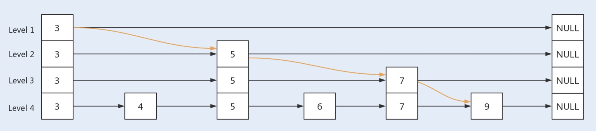
当新增一个key值为8的节点时，首先新增一个节点到最底层的链表中，根据概率算出level值，再根据level值新建索引层，最后链接索引层的新节点。新增节点和链接索引都是基于CAS操作实现。
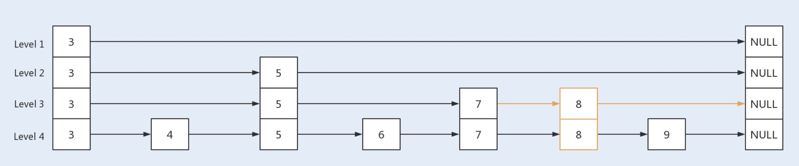
当删除一个key值为7的结点时，首先找到待删除结点，将其value值设置为null；之后再向待删除结点的next位置新增一个标记结点，以便减少并发冲突；然后让待删结点的前驱节点直接越过本身指向的待删结点，直接指向后继结点，中间要被删除的结点最终将会被JVM垃圾回收处理掉；最后判断此次删除后是否导致某一索引层没有其它节点了，并视情况删除该层索引 。
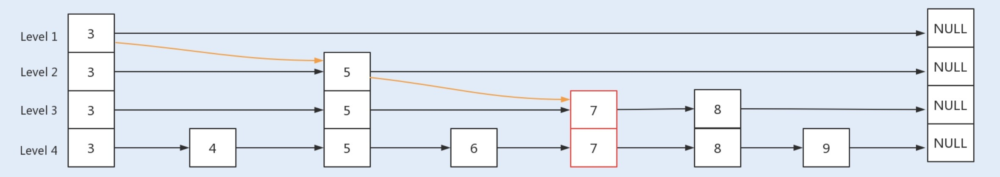
通过以上两个案例，我想你应该清楚了Hashtable、ConcurrentHashMap以及ConcurrentSkipListMap这三种容器的适用场景了。如果对数据有强一致要求，则需使用Hashtable；在大部分场景通常都是弱一致性的情况下，使用ConcurrentHashMap即可；如果数据量在千万级别，且存在大量增删改操作，则可以考虑使用ConcurrentSkipListMap。

---

### 3.6.4 并发场景下的List容器

下面我们再来看一个实际生产环境中的案例。在大部分互联网产品中，都会设置一份黑名单。例如，在电商系统中，系统可能会将一些频繁参与抢购却放弃付款的用户放入到黑名单列表。想想这个时候你又会使用哪个容器呢？首先用户黑名单的数据量并不会很大，但在抢购中需要查询该容器，快速获取到该用户是否存在于黑名单中。其次用户ID是整数类型，因此我们可以考虑使用数组来存储。那么ArrayList是否是你第一时间想到的呢？

我讲过ArrayList是非线程安全容器，在并发场景下使用很可能会导致线程安全问题。这时，我们就可以考虑使用Java在并发编程中提供的线程安全数组，包括Vector和CopyOnWriteArrayList。Vector也是基于Synchronized同步锁实现的线程安全，Synchronized关键字几乎修饰了所有对外暴露的方法，所以在读远大于写的操作场景中，Vector将会发生大量锁竞争，从而给系统带来性能开销。

相比之下，CopyOnWriteArrayList是java.util.concurrent包提供的方法，它实现了读操作无锁，写操作则通过操作底层数组的新副本来实现，是一种读写分离的并发策略。我们可以通过以下图示来了解下CopyOnWriteArrayList的具体实现原理。


回到案例中，我们知道黑名单是一个读远大于写的操作业务，我们可以固定在某一个业务比较空闲的时间点来更新名单。这种场景对写入数据的实时获取并没有要求，因此我们只需要保证最终能获取到写入数组中的用户ID就可以了，而CopyOnWriteArrayList这种并发数组容器无疑是最适合这类场景的了。

---

### 3.6.5 总结

在并发编程中，我们经常会使用容器来存储数据或对象。Java在JDK1.1到JDK1.8这个漫长的发展过程中，依据场景的变化实现了同类型的多种容器。我将今天的主要内容为你总结了一张表格，希望能对你有所帮助，也欢迎留言补充。


**思考题：**
在抢购类系统中，我们经常会使用队列来实现抢购的排队等待，如果要你来选择或者设计一个队列，你会怎么考虑呢？

---

## 3.7 如何设置线程池大小？

还记得我在16讲中说过“线程池的线程数量设置过多会导致线程竞争激烈”吗？今天再补一句，如果线程数量设置过少的话，还会导致系统无法充分利用计算机资源。那么如何设置才不会影响系统性能呢？其实线程池的设置是有方法的，不是凭借简单的估算来决定的。今天我们就来看看究竟有哪些计算方法可以复用，线程池中各个参数之间又存在怎样的关系。

### 3.7.1 线程池原理

开始优化之前，我们先来看看线程池的实现原理，有助于你更好地理解后面的内容。在HotSpot VM的线程模型中，Java线程被一对一映射为内核线程。Java在使用线程执行程序时，需要创建一个内核线程；当该Java线程被终止时，这个内核线程也会被回收。因此Java线程的创建与销毁将会消耗一定的计算机资源，从而增加系统的性能开销。除此之外，大量创建线程同样会给系统带来性能问题，因为内存和CPU资源都将被线程抢占，如果处理不当，就会发生内存溢出、CPU使用率超负荷等问题。

为了解决上述两类问题，Java提供了线程池概念，对于频繁创建线程的业务场景，线程池可以创建固定的线程数量，并且在操作系统底层，轻量级进程将会把这些线程映射到内核。

线程池可以提高线程复用，又可以固定最大线程使用量，防止无限制地创建线程。当程序提交一个任务需要一个线程时，会去线程池中查找是否有空闲的线程，若有，则直接使用线程池中的线程工作，若没有，会去判断当前已创建的线程数量是否超过最大线程数量，如未超过，则创建新线程，如已超过，则进行排队等待或者直接抛出异常。

### 3.7.2 线程池框架Executor

Java最开始提供了ThreadPool实现了线程池，为了更好地实现用户级的线程调度，更有效地帮助开发人员进行多线程开发，Java提供了一套Executor框架。

这个框架中包括了ScheduledThreadPoolExecutor和ThreadPoolExecutor两个核心线程池。前者是用来定时执行任务，后者是用来执行被提交的任务。鉴于这两个线程池的核心原理是一样的，下面我们就重点看看ThreadPoolExecutor类是如何实现线程池的。Executors实现了以下四种类型的ThreadPoolExecutor：
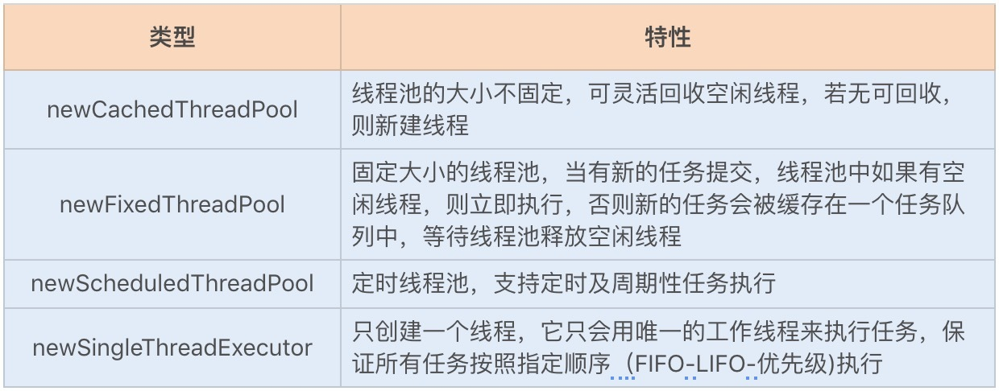

Executors利用工厂模式实现的四种线程池，我们在使用的时候需要结合生产环境下的实际场景。不过我不太推荐使用它们，因为选择使用Executors提供的工厂类，将会忽略很多线程池的参数设置，工厂类一旦选择设置默认参数，就很容易导致无法调优参数设置，从而产生性能问题或者资源浪费。

这里我建议你使用ThreadPoolExecutor自我定制一套线程池。进入四种工厂类后，我们可以发现除了newScheduledThreadPool类，其它类均使用了ThreadPoolExecutor类进行实现，你可以通过以下代码简单看下该方法：

```
public ThreadPoolExecutor
    (int corePoolSize,//线程池的核心线程数量
    int maximumPoolSize,//线程池的最大线程数
    long keepAliveTime,//当线程数大于核心线程数时，多余的空闲线程存活的最长时间
    TimeUnit unit,//时间单位
    BlockingQueue<Runnable> workQueue,//任务队列，用来储存等待执行任务的队列
    ThreadFactory threadFactory,//线程工厂，用来创建线程，一般默认即可
    RejectedExecutionHandler handler) //拒绝策略，当提交的任务过多而不能及时处理时，我们可以定制策略来处理任务
```

我们还可以通过下面这张图来了解下线程池中各个参数的相互关系：
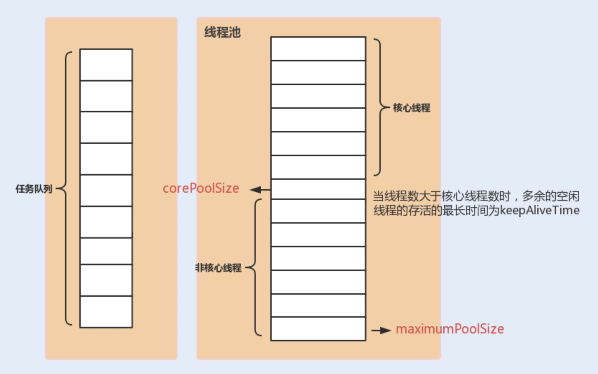

- 通过上图，我们发现线程池有两个线程数的设置，一个为核心线程数，一个为最大线程数。在创建完线程池之后，默认情况下，线程池中并没有任何线程，等到有任务来才创建线程去执行任务。
- 但有一种情况排除在外，就是调用prestartAllCoreThreads()或者prestartCoreThread()方法的话，可以提前创建等于核心线程数的线程数量，这种方式被称为预热，在抢购系统中就经常被用到。
- 当创建的线程数等于 corePoolSize 时，提交的任务会被加入到设置的阻塞队列中。当队列满了，会创建线程执行任务，直到线程池中的数量等于maximumPoolSize。
- 当线程数量已经等于maximumPoolSize时， 新提交的任务无法加入到等待队列，也无法创建非核心线程直接执行，我们又没有为线程池设置拒绝策略，这时线程池就会抛出RejectedExecutionException异常，即线程池拒绝接受这个任务。
- 当线程池中创建的线程数量超过设置的corePoolSize，在某些线程处理完任务后，如果等待keepAliveTime时间后仍然没有新的任务分配给它，那么这个线程将会被回收。线程池回收线程时，会对所谓的“核心线程”和“非核心线程”一视同仁，直到线程池中线程的数量等于设置的corePoolSize参数，回收过程才会停止。
- 即使是corePoolSize线程，在一些非核心业务的线程池中，如果长时间地占用线程数量，也可能会影响到核心业务的线程池，这个时候就需要把没有分配任务的线程回收掉。
- 我们可以通过allowCoreThreadTimeOut设置项要求线程池：将包括“核心线程”在内的，没有任务分配的所有线程，在等待keepAliveTime时间后全部回收掉。

我们可以通过下面这张图来了解下线程池的线程分配流程：


---

### 3.7.3 计算线程数量

了解完线程池的实现原理和框架，我们就可以动手实践优化线程池的设置了。我们知道，环境具有多变性，设置一个绝对精准的线程数其实是不大可能的，但我们可以通过一些实际操作因素来计算出一个合理的线程数，避免由于线程池设置不合理而导致的性能问题。下面我们就来看看具体的计算方法。

- 一般多线程执行的任务类型可以分为CPU密集型和I/O密集型，根据不同的任务类型，我们计算线程数的方法也不一样。
- CPU密集型任务：这种任务消耗的主要是CPU资源，可以将线程数设置为N（CPU核心数）+1，比CPU核心数多出来的一个线程是为了防止线程偶发的缺页中断，或者其它原因导致的任务暂停而带来的影响。一旦任务暂停，CPU就会处于空闲状态，而在这种情况下多出来的一个线程就可以充分利用CPU的空闲时间。下面我们用一个例子来验证下这个方法的可行性，通过观察CPU密集型任务在不同线程数下的性能情况就可以得出结果，你可以点击Github下载到本地运行测试：

```
public class CPUTypeTest implements Runnable {

	//整体执行时间，包括在队列中等待的时间
	List<Long> wholeTimeList;
	//真正执行时间
	List<Long> runTimeList;

	private long initStartTime = 0;

	/**
	 * 构造函数
	 * @param runTimeList
	 * @param wholeTimeList
	 */
	public CPUTypeTest(List<Long> runTimeList, List<Long> wholeTimeList) {
		initStartTime = System.currentTimeMillis();
		this.runTimeList = runTimeList;
		this.wholeTimeList = wholeTimeList;
	}

	/**
	 * 判断素数
	 * @param number
	 * @return
	 */
	public boolean isPrime(final int number) {
		if (number <= 1)
			return false;


		for (int i = 2; i <= Math.sqrt(number); i++) {
			if (number % i == 0)
				return false;
		}
		return true;
	}

	/**
	 * 計算素数
	 * @param number
	 * @return
	 */
	public int countPrimes(final int lower, final int upper) {
		int total = 0;
		for (int i = lower; i <= upper; i++) {
			if (isPrime(i))
				total++;
		}
		return total;
	}

	public void run() {
		long start = System.currentTimeMillis();
		countPrimes(1, 1000000);
		long end = System.currentTimeMillis();


		long wholeTime = end - initStartTime;
		long runTime = end - start;
		wholeTimeList.add(wholeTime);
		runTimeList.add(runTime);
		System.out.println("单个线程花费时间：" + (end - start));
	}
}
```

测试代码在4核 intel i5 CPU机器上的运行时间变化如下：


综上可知：当线程数量太小，同一时间大量请求将被阻塞在线程队列中排队等待执行线程，此时CPU没有得到充分利用；当线程数量太大，被创建的执行线程同时在争取CPU资源，又会导致大量的上下文切换，从而增加线程的执行时间，影响了整体执行效率。通过测试可知，4~6个线程数是最合适的。

- I/O密集型任务：这种任务应用起来，系统会用大部分的时间来处理I/O交互，而线程在处理I/O的时间段内不会占用CPU来处理，这时就可以将CPU交出给其它线程使用。因此在I/O密集型任务的应用中，我们可以多配置一些线程，具体的计算方法是2N。这里我们还是通过一个例子来验证下这个公式是否可以标准化：

```
public class IOTypeTest implements Runnable {

    //整体执行时间，包括在队列中等待的时间
    Vector<Long> wholeTimeList;
    //真正执行时间
    Vector<Long> runTimeList;
  
    private long initStartTime = 0;
  
    /**
     * 构造函数
     * @param runTimeList
     * @param wholeTimeList
     */
    public IOTypeTest(Vector<Long> runTimeList, Vector<Long> wholeTimeList) {
    initStartTime = System.currentTimeMillis();
    this.runTimeList = runTimeList;
    this.wholeTimeList = wholeTimeList;
    }
  
    /**
     *IO操作
     * @param number
     * @return
     * @throws IOException 
     */
    public void readAndWrite() throws IOException {
    File sourceFile = new File("D:/test.txt");
        //创建输入流
        BufferedReader input = new BufferedReader(new FileReader(sourceFile));
        //读取源文件,写入到新的文件
        String line = null;
        while((line = input.readLine()) != null){
            //System.out.println(line);
        }
        //关闭输入输出流
        input.close();
    }

    public void run() {
    long start = System.currentTimeMillis();
    try {
    readAndWrite();
    } catch (IOException e) {
    // TODO Auto-generated catch block
    e.printStackTrace();
    }
    long end = System.currentTimeMillis();


    long wholeTime = end - initStartTime;
    long runTime = end - start;
    wholeTimeList.add(wholeTime);
    runTimeList.add(runTime);
    System.out.println("单个线程花费时间：" + (end - start));
    }
}
```

备注：由于测试代码读取2MB大小的文件，涉及到大内存，所以在运行之前，我们需要调整JVM的堆内存空间：-Xms4g -Xmx4g，避免发生频繁的FullGC，影响测试结果。
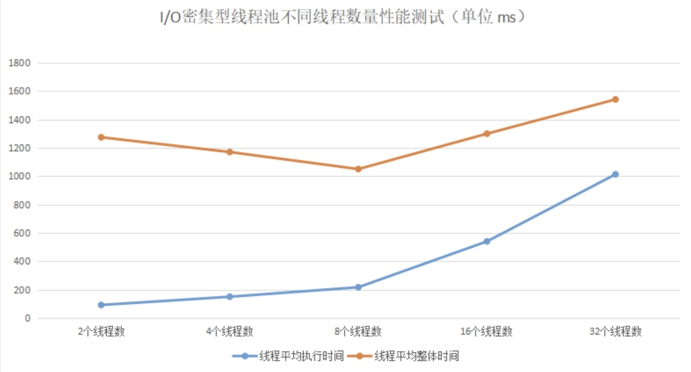

- 通过测试结果，我们可以看到每个线程所花费的时间。当线程数量在8时，线程平均执行时间是最佳的，这个线程数量和我们的计算公式所得的结果就差不多。看完以上两种情况下的线程计算方法，你可能还想说，在平常的应用场景中，我们常常遇不到这两种极端情况，那么碰上一些常规的业务操作，比如，通过一个线程池实现向用户定时推送消息的业务，我们又该如何设置线程池的数量呢？此时我们可以参考以下公式来计算线程数：

```
线程数=N（CPU核数）*（1+WT（线程等待时间）/ST（线程时间运行时间））
```

我们可以通过JDK自带的工具VisualVM来查看WT/ST比例，以下例子是基于运行纯CPU运算的例子，我们可以看到：

WT（线程等待时间）= 36788ms [线程运行总时间] - 36788ms[ST（线程时间运行时间）]= 0
线程数=N（CPU核数）*（1+ 0 [WT（线程等待时间）]/36788ms[ST（线程时间运行时间）]）= N（CPU核数）

这跟我们之前通过CPU密集型的计算公式N+1所得出的结果差不多。
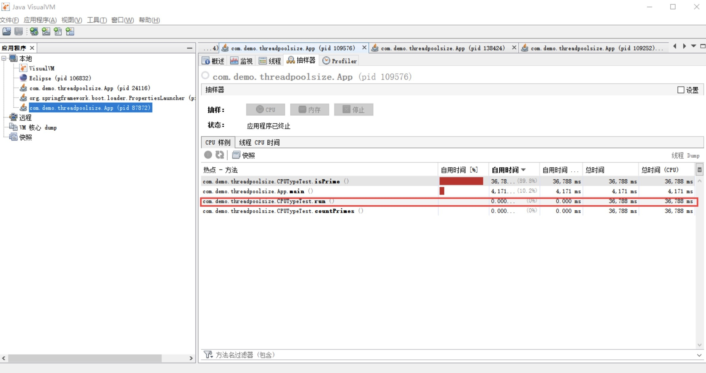

综合来看，我们可以根据自己的业务场景，从“N+1”和“2N”两个公式中选出一个适合的，计算出一个大概的线程数量，之后通过实际压测，逐渐往“增大线程数量”和“减小线程数量”这两个方向调整，然后观察整体的处理时间变化，最终确定一个具体的线程数量。

---

### 3.7.4 总结

今天我们主要学习了线程池的实现原理，Java线程的创建和消耗会给系统带来性能开销，因此Java提供了线程池来复用线程，提高程序的并发效率。

Java通过用户线程与内核线程结合的1:1线程模型来实现，Java将线程的调度和管理设置在了用户态，提供了一套Executor框架来帮助开发人员提高效率。Executor框架不仅包括了线程池的管理，还提供了线程工厂、队列以及拒绝策略等，可以说Executor框架为并发编程提供了一个完善的架构体系。

在不同的业务场景以及不同配置的部署机器中，线程池的线程数量设置是不一样的。其设置不宜过大，也不宜过小，要根据具体情况，计算出一个大概的数值，再通过实际的性能测试，计算出一个合理的线程数量。

我们要提高线程池的处理能力，一定要先保证一个合理的线程数量，也就是保证CPU处理线程的最大化。在此前提下，我们再增大线程池队列，通过队列将来不及处理的线程缓存起来。在设置缓存队列时，我们要尽量使用一个有界队列，以防因队列过大而导致的内存溢出问题。

**思考题:** 在程序中，除了并行段代码，还有串行段代码。那么当程序同时存在串行和并行操作时，优化并行操作是不是优化系统的关键呢？

**解答：**

- 关键因素
  - 程序中的串行部分：无论并行部分优化得多好，串行部分的存在都会限制程序的整体性能提升。如果程序有较大比例的串行部分，即使并行部分显著优化，整体性能提高仍有限。
  - 程序中的并行部分：如果并行部分在程序中占据较大比例，通过提升并行部分的性能可以大幅提升整体性能，这时并行优化是关键。

---

## 3.8 如何用协程来优化多线程业务？

近一两年，国内很多互联网公司开始使用或转型Go语言，其中一个很重要的原因就是Go语言优越的性能表现，而这个优势与Go实现的轻量级线程Goroutines（协程Coroutine）不无关系。那么Go协程的实现与Java线程的实现有什么区别呢？

### 3.8.1 线程实现模型

了解协程和线程的区别之前，我们不妨先来了解下底层实现线程几种方式，为后面的学习打个基础。实现线程主要有三种方式：轻量级进程和内核线程一对一相互映射实现的1:1线程模型、用户线程和内核线程实现的N:1线程模型以及用户线程和轻量级进程混合实现的N:M线程模型。

#### 1:1线程模型

以上我提到的内核线程（Kernel-Level Thread, KLT）是由操作系统内核支持的线程，内核通过调度器对线程进行调度，并负责完成线程的切换。

我们知道在Linux操作系统编程中，往往都是通过fork()函数创建一个子进程来代表一个内核中的线程。一个进程调用fork()函数后，系统会先给新的进程分配资源，例如，存储数据和代码的空间。然后把原来进程的所有值都复制到新的进程中，只有少数值与原来进程的值（比如PID）不同，这相当于复制了一个主进程。

采用fork()创建子进程的方式来实现并行运行，会产生大量冗余数据，即占用大量内存空间，又消耗大量CPU时间用来初始化内存空间以及复制数据。如果是一份一样的数据，为什么不共享主进程的这一份数据呢？这时候轻量级进程（Light Weight Process，即LWP）出现了。

相对于fork()系统调用创建的线程来说，LWP使用clone()系统调用创建线程，该函数是将部分父进程的资源的数据结构进行复制，复制内容可选，且没有被复制的资源可以通过指针共享给子进程。因此，轻量级进程的运行单元更小，运行速度更快。LWP是跟内核线程一对一映射的，每个LWP都是由一个内核线程支持。

#### N:1线程模型

1:1线程模型由于跟内核是一对一映射，所以在线程创建、切换上都存在用户态和内核态的切换，性能开销比较大。除此之外，它还存在局限性，主要就是指系统的资源有限，不能支持创建大量的LWP。N:1线程模型就可以很好地解决1:1线程模型的这两个问题。

该线程模型是在用户空间完成了线程的创建、同步、销毁和调度，已经不需要内核的帮助了，也就是说在线程创建、同步、销毁的过程中不会产生用户态和内核态的空间切换，因此线程的操作非常快速且低消耗。

#### N:M线程模型

N:1线程模型的缺点在于操作系统不能感知用户态的线程，因此容易造成某一个线程进行系统调用内核线程时被阻塞，从而导致整个进程被阻塞。

N:M线程模型是基于上述两种线程模型实现的一种混合线程管理模型，即支持用户态线程通过LWP与内核线程连接，用户态的线程数量和内核态的LWP数量是N:M的映射关系。

---

了解完这三个线程模型，你就可以清楚地了解到Go协程的实现与Java线程的实现有什么区别了。JDK 1.8 Thread.java 中 Thread#start 方法的实现，实际上是通过Native调用start0方法实现的；在Linux下， JVM Thread的实现是基于pthread_create实现的，而pthread_create实际上是调用了clone()完成系统调用创建线程的。

所以，目前Java在Linux操作系统下采用的是用户线程加轻量级线程，一个用户线程映射到一个内核线程，即1:1线程模型。由于线程是通过内核调度，从一个线程切换到另一个线程就涉及到了上下文切换。

而Go语言是使用了N:M线程模型实现了自己的调度器，它在N个内核线程上多路复用（或调度）M个协程，协程的上下文切换是在用户态由协程调度器完成的，因此不需要陷入内核，相比之下，这个代价就很小了。

---

### 3.8.2 协程的实现原理

协程不只在Go语言中实现了，其实目前大部分语言都实现了自己的一套协程，包括C#、erlang、python、lua、javascript、ruby等。

- 相对于协程，你可能对进程和线程更为熟悉。进程一般代表一个应用服务，在一个应用服务中可以创建多个线程，而协程与进程、线程的概念不一样，我们可以将协程看作是一个类函数或者一块函数中的代码，我们可以在一个主线程里面轻松创建多个协程。
- 程序调用协程与调用函数不一样的是，协程可以通过暂停或者阻塞的方式将协程的执行挂起，而其它协程可以继续执行。这里的挂起只是在程序中（用户态）的挂起，同时将代码执行权转让给其它协程使用，待获取执行权的协程执行完成之后，将从挂起点唤醒挂起的协程。 协程的挂起和唤醒是通过一个调度器来完成的。

结合下图，你可以更清楚地了解到基于N:M线程模型实现的协程是如何工作的。假设程序中默认创建两个线程为协程使用，在主线程中创建协程ABCD…，分别存储在就绪队列中，调度器首先会分配一个工作线程A执行协程A，另外一个工作线程B执行协程B，其它创建的协程将会放在队列中进行排队等待。


当协程A调用暂停方法或被阻塞时，协程A会进入到挂起队列，调度器会调用等待队列中的其它协程抢占线程A执行。当协程A被唤醒时，它需要重新进入到就绪队列中，通过调度器抢占线程，如果抢占成功，就继续执行协程A，失败则继续等待抢占线程。
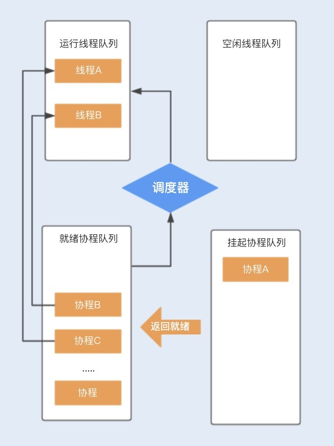
相比线程，协程少了由于同步资源竞争带来的CPU上下文切换，I/O密集型的应用比较适合使用，特别是在网络请求中，有较多的时间在等待后端响应，协程可以保证线程不会阻塞在等待网络响应中，充分利用了多核多线程的能力。而对于CPU密集型的应用，由于在多数情况下CPU都比较繁忙，协程的优势就不是特别明显了。

---

### 3.8.3 Kilim协程框架

虽然这么多的语言都实现了协程，但目前Java原生语言暂时还不支持协程。不过你也不用泄气，我们可以通过协程框架在Java中使用协程。目前Kilim协程框架在Java中应用得比较多，通过这个框架，开发人员就可以低成本地在Java中使用协程了。

在Java中引入 Kilim，和我们平时引入第三方组件不太一样，除了引入jar包之外，还需要通过Kilim提供的织入（Weaver）工具对Java代码编译生成的字节码进行增强处理，比如，识别哪些方式是可暂停的，对相关的方法添加上下文处理。通常有以下四种方式可以实现这种织入操作：

- 在编译时使用maven插件；
- 在运行时调用kilim.tools.Weaver工具；
- 在运行时使用kilim.tools.Kilim invoking调用Kilim的类文件；
- 在main函数添加 if (kilim.tools.Kilim.trampoline(false,args)) return。

Kilim框架包含了四个核心组件，分别为：任务载体（Task）、任务上下文（Fiber）、任务调度器（Scheduler）以及通信载体（Mailbox）。


- Task对象主要用来执行业务逻辑，我们可以把这个比作多线程的Thread，与Thread类似，Task中也有一个run方法，不过在Task中方法名为execute，我们可以将协程里面要做的业务逻辑操作写在execute方法中。与Thread实现的线程一样，Task实现的协程也有状态，包括：Ready、Running、Pausing、Paused以及Done总共五种。Task对象被创建后，处于Ready状态，在调用execute()方法后，协程处于Running状态，在运行期间，协程可以被暂停，暂停中的状态为Pausing，暂停后的状态为Paused，暂停后的协程可以被再次唤醒。协程正常结束后的状态为Done。
- Fiber对象与Java的线程栈类似，主要用来维护Task的执行堆栈，Fiber是实现N:M线程映射的关键。
- Scheduler是Kilim实现协程的核心调度器，Scheduler负责分派Task给指定的工作者线程WorkerThread执行，工作者线程WorkerThread默认初始化个数为机器的CPU个数。
- Mailbox对象类似一个邮箱，协程之间可以依靠邮箱来进行通信和数据共享。协程与线程最大的不同就是，线程是通过共享内存来实现数据共享，而协程是使用了通信的方式来实现了数据共享，主要就是为了避免内存共享数据而带来的线程安全问题。

---

### 3.8.4 协程与线程的性能比较

接下来，我们通过一个简单的生产者和消费者的案例，来对比下协程和线程的性能。可通过[Github](https://github.com/nickliuchao/coroutine)下载本地运行代码。Java多线程实现源码：

```
public class MyThread {
	private static Integer count = 0;//
	private static final Integer FULL = 10; //最大生产数量
	private static String LOCK = "lock"; //资源锁

	public static void main(String[] args) {
		MyThread test1 = new MyThread();

		long start = System.currentTimeMillis();

		List<Thread> list = new ArrayList<Thread>();
		for (int i = 0; i < 1000; i++) {//创建五个生产者线程
			Thread thread = new Thread(test1.new Producer());
			thread.start();
			list.add(thread);
		}

		for (int i = 0; i < 1000; i++) {//创建五个消费者线程
			Thread thread = new Thread(test1.new Consumer());
			thread.start();
			list.add(thread);
		}

		try {
			for (Thread thread : list) {
				thread.join();//等待所有线程执行完
			}
		} catch (InterruptedException e) {
			e.printStackTrace();
		}

		long end = System.currentTimeMillis();
		System.out.println("子线程执行时长：" + (end - start));
	}
    //生产者
	class Producer implements Runnable {
		public void run() {
			for (int i = 0; i < 10; i++) {
				synchronized (LOCK) {
					while (count == FULL) {//当数量满了时
						try {
							LOCK.wait();
						} catch (Exception e) {
							e.printStackTrace();
						}
					}
					count++;
					System.out.println(Thread.currentThread().getName() + "生产者生产，目前总共有" + count);
					LOCK.notifyAll();
				}
			}
		}
	}
    //消费者
	class Consumer implements Runnable {
		public void run() {
			for (int i = 0; i < 10; i++) {
				synchronized (LOCK) {
					while (count == 0) {//当数量为零时   
						try {
							LOCK.wait();
						} catch (Exception e) {
						}
					}
					count--;
					System.out.println(Thread.currentThread().getName() + "消费者消费，目前总共有" + count);
					LOCK.notifyAll();
				}
			}
		}
	}
}
```

**Kilim协程框架实现源码：**

```
public class Coroutine  {

    static Map<Integer, Mailbox<Integer>> mailMap = new HashMap<Integer, Mailbox<Integer>>();//为每个协程创建一个信箱，由于协程中不能多个消费者共用一个信箱，需要为每个消费者提供一个信箱，这也是协程通过通信来保证共享变量的线程安全的一种方式

	public static void main(String[] args) {

		if (kilim.tools.Kilim.trampoline(false,args)) return;
		Properties propes = new Properties();
		propes.setProperty("kilim.Scheduler.numThreads", "1");//设置一个线程
		System.setProperties(propes);
		long startTime = System.currentTimeMillis();
		for (int i = 0; i < 1000; i++) {//创建一千生产者
			Mailbox<Integer> mb = new Mailbox<Integer>(1, 10);
			new Producer(i, mb).start();
			mailMap.put(i, mb);
		}

		for (int i = 0; i < 1000; i++) {//创建一千个消费者
			new Consumer(mailMap.get(i)).start();
		}

		Task.idledown();//开始运行

		 long endTime = System.currentTimeMillis();
	  
	     System.out.println( Thread.currentThread().getName()  + "总计花费时长：" + (endTime- startTime));
	}

}

//生产者
public class Producer extends Task<Object> {

	Integer count = null;
	Mailbox<Integer> mb = null;

	public Producer(Integer count, Mailbox<Integer> mb) {
		this.count = count;
		this.mb = mb;
	}

	public void execute() throws Pausable {
		count = count*10;
		for (int i = 0; i < 10; i++) {
			mb.put(count);//当空间不足时，阻塞协程线程
			System.out.println(Thread.currentThread().getName() + "生产者生产，目前总共有" + mb.size() + "生产了：" + count);
			count++;
		}
	}
}

//消费者
public class Consumer extends Task<Object> {

	Mailbox<Integer> mb = null;

	public Consumer(Mailbox<Integer> mb) {
		this.mb = mb;
	}

	/**
	 * 执行
	 */
	public void execute() throws Pausable {
		Integer c = null;
		for (int i = 0; i < 10000; i++)  {
			c = mb.get();//获取消息，阻塞协程线程

			if (c == null) {
				System.out.println("计数");
			}else {
				System.out.println(Thread.currentThread().getName() + "消费者消费，目前总共有" + mb.size() + "消费了：" + c);
				c = null;
			}
		}
	}
}
```

在这个案例中，我创建了1000个生产者和1000个消费者，每个生产者生产10个产品，1000个消费者同时消费产品。我们可以看到两个例子运行的结果如下：

```
多线程执行时长：2761
```

```
协程执行时长：1050
```

通过上述性能对比，我们可以发现：在有严重阻塞的场景下，协程的性能更胜一筹。其实，I/O阻塞型场景也就是协程在Java中的主要应用。

---

### 3.8.5 总结

协程和线程密切相关，协程可以认为是运行在线程上的代码块，协程提供的挂起操作会使协程暂停执行，而不会导致线程阻塞。协程又是一种轻量级资源，即使创建了上千个协程，对于系统来说也不是很大的负担，但如果在程序中创建上千个线程，那系统可真就压力山大了。可以说，协程的设计方式极大地提高了线程的使用率。

通过今天的学习，当其他人侃侃而谈Go语言在网络编程中的优势时，相信你不会一头雾水。学习Java的我们也不要觉得，协程离我们很遥远了。协程是一种设计思想，不仅仅局限于某一门语言，况且Java已经可以借助协程框架实现协程了。

但话说回来，协程还是在Go语言中的应用较为成熟，在Java中的协程目前还不是很稳定，重点是缺乏大型项目的验证，可以说Java的协程设计还有很长的路要走。

**思考题:** 在Java中，除了Kilim框架，你知道还有其它协程框架也可以帮助Java实现协程吗？你使用过吗？

---

## 3.9 什么是数据的强、弱一致性？

说到一致性，其实在系统的很多地方都存在数据一致性的相关问题。除了在并发编程中保证共享变量数据的一致性之外，还有数据库的ACID中的C（Consistency 一致性）、分布式系统的CAP理论中的C（Consistency 一致性）。下面我们主要讨论的就是“并发编程中共享变量的一致性”。

在并发编程中，Java是通过共享内存来实现共享变量操作的，所以在多线程编程中就会涉及到数据一致性的问题。我先通过一个经典的案例来说明下多线程操作共享变量可能出现的问题，假设我们有两个线程（线程1和线程2）分别执行下面的方法，x是共享变量：

```
//代码1
public class Example {
    int x = 0;
    public void count() {
        x++;                     //1
        System.out.println(x)//2
    }
}
```


如果两个线程同时运行，两个线程的变量的值可能会出现以下三种结果：


### 3.9.1 Java存储模型

2,1和1,2的结果我们很好理解，那为什么会出现以上1,1的结果呢？

我们知道，Java采用共享内存模型来实现多线程之间的信息交换和数据同步。在解释为什么会出现这样的结果之前，我们先通过下图来简单了解下Java的内存模型（第21讲还会详解），程序在运行时，局部变量将会存放在虚拟机栈中，而共享变量将会被保存在堆内存中。


由于局部变量是跟随线程的创建而创建，线程的销毁而销毁，所以存放在栈中，由上图我们可知，Java栈数据不是所有线程共享的，所以不需要关心其数据的一致性。共享变量存储在堆内存或方法区中，由上图可知，堆内存和方法区的数据是线程共享的。而堆内存中的共享变量在被不同线程操作时，会被加载到自己的工作内存中，也就是CPU中的高速缓存。

CPU 缓存可以分为一级缓存（L1）、二级缓存（L2）和三级缓存（L3），每一级缓存中所储存的全部数据都是下一级缓存的一部分。当 CPU 要读取一个缓存数据时，首先会从一级缓存中查找；如果没有找到，再从二级缓存中查找；如果还是没有找到，就从三级缓存或内存中查找。

如果是单核CPU运行多线程，多个线程同时访问进程中的共享数据，CPU 将共享变量加载到高速缓存后，不同线程在访问缓存数据的时候，都会映射到相同的缓存位置，这样即使发生线程的切换，缓存仍然不会失效。如果是多核CPU运行多线程，每个核都有一个 L1缓存，如果多个线程运行在不同的内核上访问共享变量时，每个内核的L1缓存将会缓存一份共享变量。

假设线程A操作CPU从堆内存中获取一个缓存数据，此时堆内存中的缓存数据值为0，该缓存数据会被加载到L1缓存中，在操作后，缓存数据的值变为1，然后刷新到堆内存中。在正好刷新到堆内存中之前，又有另外一个线程B将堆内存中为0的缓存数据加载到了另外一个内核的L1缓存中，此时线程A将堆内存中的数据刷新到了1，而线程B实际拿到的缓存数据的值为0。

此时，内核缓存中的数据和堆内存中的数据就不一致了，且线程B在刷新缓存到堆内存中的时候也将覆盖线程A中修改的数据。这时就产生了数据不一致的问题。

了解完内存模型之后，结合以上解释，我们就可以回过头来看看第一段代码中的运行结果是如何产生的了。看到这里，相信你可以理解图中1,1的运行结果了。
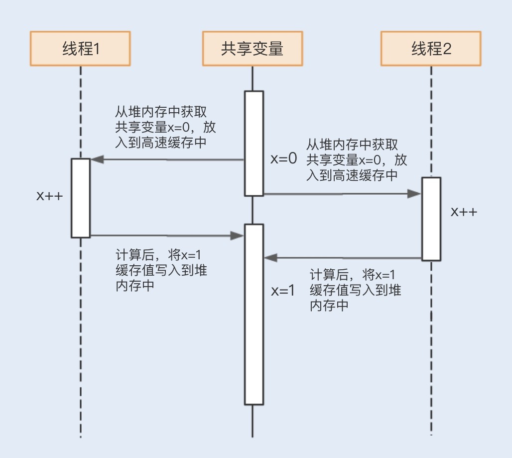

重排序
除此之外，在Java内存模型中，还存在重排序的问题。请看以下代码：

```
//代码1
public class Example {
    int x = 0;
    boolean flag = false;
    public void writer() {
        x = 1;                //1
        flag = true;          //2
    }

    public void reader() {
        if (flag) {           //3
             int r1 = x;      //4
             System.out.println(r1==x)
        }
    }
}
```


如果两个线程同时运行，线程2中的变量的值可能会出现以下两种可能：

现在一起来看看 r1=1 的运行结果，如下图所示：

那r1=0又是怎么获取的呢？我们再来看一个时序图：


在不影响运算结果的前提下，编译器有可能会改变顺序代码的指令执行顺序，特别是在一些可以优化的场景。例如，在以下案例中，编译器为了尽可能地减少寄存器的读取、存储次数，会充分复用寄存器的存储值。如果没有进行重排序优化，正常的执行顺序是步骤1\2\3，而在编译期间进行了重排序优化之后，执行的步骤有可能就变成了步骤1/3/2或者2/1/3，这样就能减少一次寄存器的存取次数。

```
int x = 1;//步骤1：加载x变量的内存地址到寄存器中，加载1到寄存器中，CPU通过mov指令把1写入到寄存器指定的内存中
boolean flag = true; //步骤2 加载flag变量的内存地址到寄存器中，加载true到寄存器中，CPU通过mov指令把1写入到寄存器指定的内存中
int y = x + 1;//步骤3 重新加载x变量的内存地址到寄存器中，加载1到寄存器中，CPU通过mov指令把1写入到寄存器指定的内存中
```

在 JVM 中，重排序是十分重要的一环，特别是在并发编程中。可 JVM 要是能对它们进行任意排序的话，也可能会给并发编程带来一系列的问题，其中就包括了一致性的问题。

---

### 3.9.2 Happens-before规则

为了解决这个问题，Java提出了Happens-before规则来规范线程的执行顺序：

- 程序次序规则：在单线程中，代码的执行是有序的，虽然可能会存在运行指令的重排序，但最终执行的结果和顺序执行的结果是一致的；
- 锁定规则：一个锁处于被一个线程锁定占用状态，那么只有当这个线程释放锁之后，其它线程才能再次获取锁操作；
- volatile变量规则：如果一个线程正在写volatile变量，其它线程读取该变量会发生在写入之后；
- 线程启动规则：Thread对象的start()方法先行发生于此线程的其它每一个动作；
- 线程终结规则：线程中的所有操作都先行发生于对此线程的终止检测；
- 对象终结规则：一个对象的初始化完成先行发生于它的finalize()方法的开始；
- 传递性：如果操作A happens-before 操作B，操作B happens-before操作C，那么操作A happens-before 操作C；
- 线程中断规则：对线程interrupt()方法的调用先行发生于被中断线程的代码检测到中断事件的发生。

结合这些规则，我们可以将一致性分为以下几个级别：

- 严格一致性（强一致性）：所有的读写操作都按照全局时钟下的顺序执行，且任何时刻线程读取到的缓存数据都是一样的，Hashtable就是严格一致性；
- 顺序一致性：多个线程的整体执行可能是无序的，但对于单个线程而言执行是有序的，要保证任何一次读都能读到最近一次写入的数据，volatile可以阻止指令重排序，所以修饰的变量的程序属于顺序一致性；
  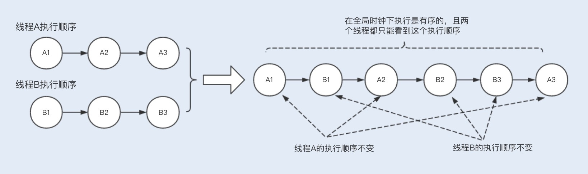
- 弱一致性：不能保证任何一次读都能读到最近一次写入的数据，但能保证最终可以读到写入的数据，单个写锁+无锁读，就是弱一致性的一种实现。

# 四、JVM性能调优和检测

## 4.1 磨刀不误砍柴工:欲知JVM调优先了解JVM内存模型

从今天开始，我将和你一起探讨Java虚拟机（JVM）的性能调优。JVM算是面试中的高频问题了，通常情况下总会有人问到：请你讲解下JVM的内存模型，JVM的性能调优做过吗？

### 4.1.1 为什么JVM在Java中如此重要？

首先你应该知道，运行一个Java应用程序，我们必须要先安装JDK或者JRE包。这是因为Java应用在编译后会变成字节码，然后通过字节码运行在JVM中，而JVM是JRE的核心组成部分。

JVM不仅承担了Java字节码的分析（JIT compiler）和执行（Runtime），同时也内置了自动内存分配管理机制。这个机制可以大大降低手动分配回收机制可能带来的内存泄露和内存溢出风险，使Java开发人员不需要关注每个对象的内存分配以及回收，从而更专注于业务本身。

### 4.1.2 从了解内存模型开始

JVM自动内存分配管理机制的好处很多，但实则是把双刃剑。这个机制在提升Java开发效率的同时，也容易使Java开发人员过度依赖于自动化，弱化对内存的管理能力，这样系统就很容易发生JVM的堆内存异常，垃圾回收（GC）的方式不合适以及GC次数过于频繁等问题，这些都将直接影响到应用服务的性能。

因此，要进行JVM层面的调优，就需要深入了解JVM内存分配和回收原理，这样在遇到问题时，我们才能通过日志分析快速地定位问题；也能在系统遇到性能瓶颈时，通过分析JVM调优来优化系统性能。这也是整个模块四的重点内容，今天我们就从JVM的内存模型学起，为后续的学习打下一个坚实的基础。

### 4.1.3 JVM内存模型的具体设计

我们先通过一张JVM内存模型图，来熟悉下其具体设计。在Java中，JVM内存模型主要分为堆、程序计数器、方法区、虚拟机栈和本地方法栈。


JVM的5个分区具体是怎么实现的呢？我们一一分析。

#### 1. 堆（Heap）

堆是JVM内存中最大的一块内存空间，该内存被所有线程共享，几乎所有对象和数组都被分配到了堆内存中。堆被划分为新生代和老年代，新生代又被进一步划分为Eden和Survivor区，最后Survivor由From Survivor和To Survivor组成。

在Java6版本中，永久代在非堆内存区；到了Java7版本，永久代的静态变量和运行时常量池被合并到了堆中；而到了Java8，永久代被元空间取代了。 结构如下图所示：

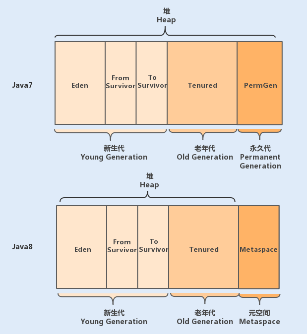

#### 2. 程序计数器（Program Counter Register）

程序计数器是一块很小的内存空间，主要用来记录各个线程执行的字节码的地址，例如，分支、循环、跳转、异常、线程恢复等都依赖于计数器。由于Java是多线程语言，当执行的线程数量超过CPU核数时，线程之间会根据时间片轮询争夺CPU资源。如果一个线程的时间片用完了，或者是其它原因导致这个线程的CPU资源被提前抢夺，那么这个退出的线程就需要单独的一个程序计数器，来记录下一条运行的指令。

#### 3. 方法区（Method Area）

很多开发者都习惯将方法区称为“永久代”，其实这两者并不是等价的。HotSpot虚拟机使用永久代来实现方法区，但在其它虚拟机中，例如，Oracle的JRockit、IBM的J9就不存在永久代一说。因此，方法区只是JVM中规范的一部分，可以说，在HotSpot虚拟机中，设计人员使用了永久代来实现了JVM规范的方法区。

方法区主要是用来存放已被虚拟机加载的类相关信息，包括类信息、运行时常量池、字符串常量池。类信息又包括了类的版本、字段、方法、接口和父类等信息。JVM在执行某个类的时候，必须经过加载、连接、初始化，而连接又包括验证、准备、解析三个阶段。在加载类的时候，JVM会先加载class文件，而在class文件中除了有类的版本、字段、方法和接口等描述信息外，还有一项信息是常量池(Constant Pool Table)，用于存放编译期间生成的各种字面量和符号引用。

字面量包括字符串（String a=“b”）、基本类型的常量（final修饰的变量），符号引用则包括类和方法的全限定名（例如String这个类，它的全限定名就是Java/lang/String）、字段的名称和描述符以及方法的名称和描述符。而当类加载到内存中后，JVM就会将class文件常量池中的内容存放到运行时的常量池中；在解析阶段，JVM会把符号引用替换为直接引用（对象的索引值）。

例如，类中的一个字符串常量在class文件中时，存放在class文件常量池中的；在JVM加载完类之后，JVM会将这个字符串常量放到运行时常量池中，并在解析阶段，指定该字符串对象的索引值。运行时常量池是全局共享的，多个类共用一个运行时常量池，class文件中常量池多个相同的字符串在运行时常量池只会存在一份。

方法区与堆空间类似，也是一个共享内存区，所以方法区是线程共享的。假如两个线程都试图访问方法区中的同一个类信息，而这个类还没有装入JVM，那么此时就只允许一个线程去加载它，另一个线程必须等待。

在HotSpot虚拟机、Java7版本中已经将永久代的静态变量和运行时常量池转移到了堆中，其余部分则存储在JVM的非堆内存中，而Java8版本已经将方法区中实现的永久代去掉了，并用元空间（class metadata）代替了之前的永久代，并且元空间的存储位置是本地内存。之前永久代的类的元数据存储在了元空间，永久代的静态变量（class static variables）以及运行时常量池（runtime constant pool）则跟Java7一样，转移到了堆中。那你可能又有疑问了，Java8为什么使用元空间替代永久代，这样做有什么好处呢？官方给出的解释是：

* 移除永久代是为了融合 HotSpot JVM 与 JRockit VM 而做出的努力，因为JRockit没有永久代，所以不需要配置永久代。
* 永久代内存经常不够用或发生内存溢出，爆出异常java.lang.OutOfMemoryError: PermGen。这是因为在JDK1.7版本中，指定的PermGen区大小为8M，由于PermGen中类的元数据信息在每次FullGC的时候都可能被收集，回收率都偏低，成绩很难令人满意；还有，为PermGen分配多大的空间很难确定，PermSize的大小依赖于很多因素，比如，JVM加载的class总数、常量池的大小和方法的大小等。

#### 4.虚拟机栈（VM stack）

Java虚拟机栈是线程私有的内存空间，它和Java线程一起创建。当创建一个线程时，会在虚拟机栈中申请一个线程栈，用来保存方法的局部变量、操作数栈、动态链接方法和返回地址等信息，并参与方法的调用和返回。每一个方法的调用都伴随着栈帧的入栈操作，方法的返回则是栈帧的出栈操作。

#### 5.本地方法栈（Native Method Stack）

本地方法栈跟Java虚拟机栈的功能类似，Java虚拟机栈用于管理Java函数的调用，而本地方法栈则用于管理本地方法的调用。但本地方法并不是用Java实现的，而是由C语言实现的。

### 4.1.3 JVM的运行原理

看到这里，相信你对JVM内存模型已经有个充分的了解了。接下来，我们通过一个案例来了解下代码和对象是如何分配存储的，Java代码又是如何在JVM中运行的。

```java
public class JVMCase {

	// 常量
	public final static String MAN_SEX_TYPE = "man";

	// 静态变量
	public static String WOMAN_SEX_TYPE = "woman";

	public static void main(String[] args) {

		Student stu = new Student();
		stu.setName("nick");
		stu.setSexType(MAN_SEX_TYPE);
		stu.setAge(20);

		JVMCase jvmcase = new JVMCase();

		// 调用静态方法
		print(stu);
		// 调用非静态方法
		jvmcase.sayHello(stu);
	}


	// 常规静态方法
	public static void print(Student stu) {
		System.out.println("name: " + stu.getName() + "; sex:" + stu.getSexType() + "; age:" + stu.getAge()); 
	}


	// 非静态方法
	public void sayHello(Student stu) {
		System.out.println(stu.getName() + "say: hello"); 
	}
}

class Student{
	String name;
	String sexType;
	int age;

	public String getName() {
		return name;
	}
	public void setName(String name) {
		this.name = name;
	}

	public String getSexType() {
		return sexType;
	}
	public void setSexType(String sexType) {
		this.sexType = sexType;
	}
	public int getAge() {
		return age;
	}
	public void setAge(int age) {
		this.age = age;
	}
}
```

当我们通过Java运行以上代码时，JVM的整个处理过程如下：

1.JVM向操作系统申请内存，JVM第一步就是通过配置参数或者默认配置参数向操作系统申请内存空间，根据内存大小找到具体的内存分配表，然后把内存段的起始地址和终止地址分配给JVM，接下来JVM就进行内部分配。

2.JVM获得内存空间后，会根据配置参数分配堆、栈以及方法区的内存大小。

3.class文件加载、验证、准备以及解析，其中准备阶段会为类的静态变量分配内存，初始化为系统的初始值（这部分我在第21讲还会详细介绍）。

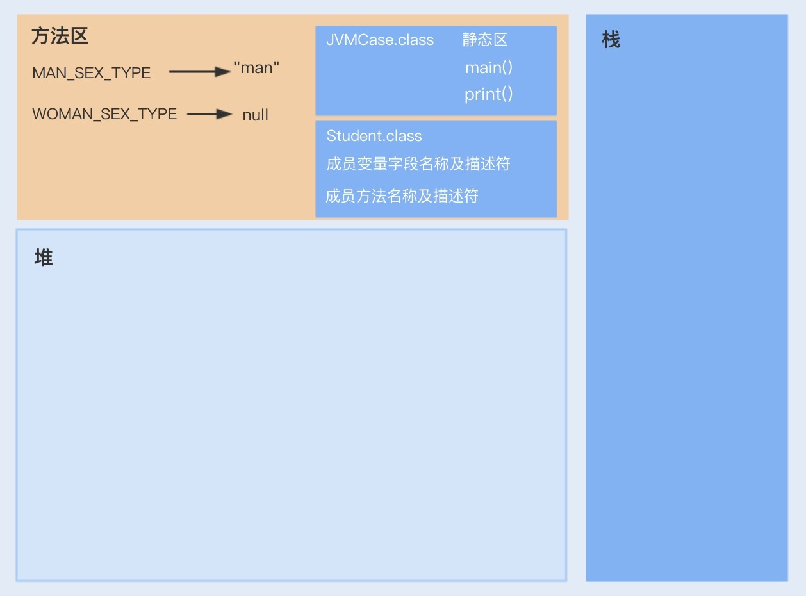

4.完成上一个步骤后，将会进行最后一个初始化阶段。在这个阶段中，JVM首先会执行构造器<clinit>方法，编译器会在.java 文件被编译成.class 文件时，收集所有类的初始化代码，包括静态变量赋值语句、静态代码块、静态方法，收集在一起成为 \<clinit>() 方法。

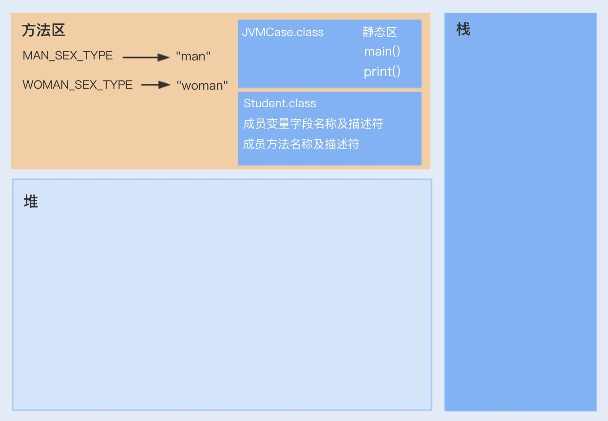

5.执行方法。启动main线程，执行main方法，开始执行第一行代码。此时堆内存中会创建一个student对象，对象引用student就存放在栈中。

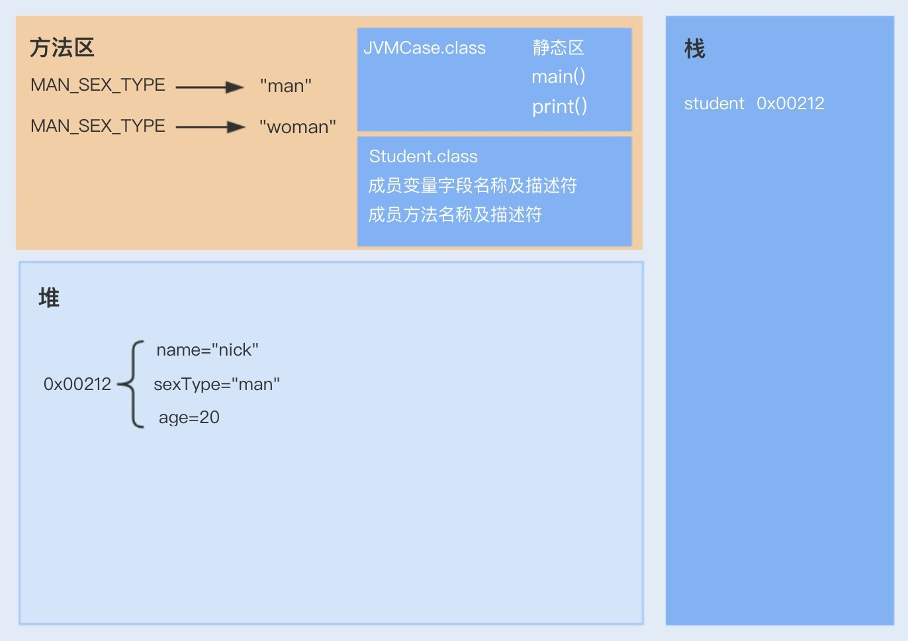

6.此时再次创建一个JVMCase对象，调用sayHello非静态方法，sayHello方法属于对象JVMCase，此时sayHello方法入栈，并通过栈中的student引用调用堆中的Student对象；之后，调用静态方法print，print静态方法属于JVMCase类，是从静态方法中获取，之后放入到栈中，也是通过student引用调用堆中的student对象。

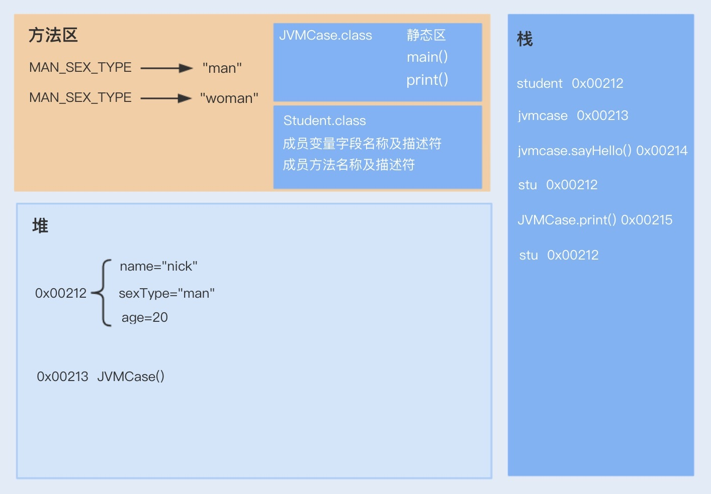

了解完实际代码在JVM中分配的内存空间以及运行原理，相信你会更加清楚内存模型中各个区域的职责分工。

### 4.1.4 总结

这讲我们主要深入学习了最基础的内存模型设计，了解其各个分区的作用及实现原理。如今，JVM在很大程度上减轻了Java开发人员投入到对象生命周期的管理精力。在使用对象的时候，JVM会自动分配内存给对象，在不使用的时候，垃圾回收器会自动回收对象，释放占用的内存。

但在某些情况下，正常的生命周期不是最优的选择，有些对象按照JVM默认的方式，创建成本会很高。比如，我在[第03讲](https://time.geekbang.org/column/article/97215)讲到的String对象，在特定的场景使用String.intern可以很大程度地节约内存成本。我们可以使用不同的引用类型，改变一个对象的正常生命周期，从而提高JVM的回收效率，这也是JVM性能调优的一种方式。

**思考题:**

这讲我只提到了堆内存中对象分配内存空间的过程，那如果有一个类中定义了String a="b"和String c = new String(“b”)，请问这两个对象会分别创建在JVM内存模型中的哪块区域呢？

## 4.2 深入JVM即时编译器JIT,优化Java编译

说到编译，我猜你一定会想到 .java文件被编译成 .class文件的过程，这个编译我们一般称为前端编译。Java的编译和运行过程非常复杂，除了前端编译，还有运行时编译。由于机器无法直接运行Java生成的字节码，所以在运行时，JIT或解释器会将字节码转换成机器码，这个过程就叫运行时编译。

类文件在运行时被进一步编译，它们可以变成高度优化的机器代码，由于C/C++编译器的所有优化都是在编译期间完成的，运行期间的性能监控仅作为基础的优化措施则无法进行，例如，调用频率预测、分支频率预测、裁剪未被选择的分支等，而Java在运行时的再次编译，就可以进行基础的优化措施。因此，JIT编译器可以说是JVM中运行时编译最重要的部分之一。

然而许多Java开发人员对JIT编译器的了解并不多，不深挖其工作原理，也不深究如何检测应用程序的即时编译情况，线上发生问题后很难做到从容应对。今天我们就来学习运行时编译如何实现对Java代码的优化。

### 4.2.1 类编译加载执行过程

在这之前，我们先了解下Java从编译到运行的整个过程，为后面的学习打下基础。请看下图：

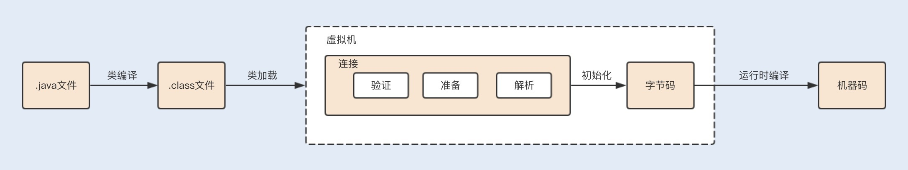

#### 类编译

在编写好代码之后，我们需要将 .java文件编译成 .class文件，才能在虚拟机上正常运行代码。文件的编译通常是由JDK中自带的Javac工具完成，一个简单的 .java文件，我们可以通过javac命令来生成 .class文件。下面我们通过javap（ [第12讲](https://time.geekbang.org/column/article/101244)讲过如何使用javap反编译命令行）反编译来看看一个class文件结构中主要包含了哪些信息：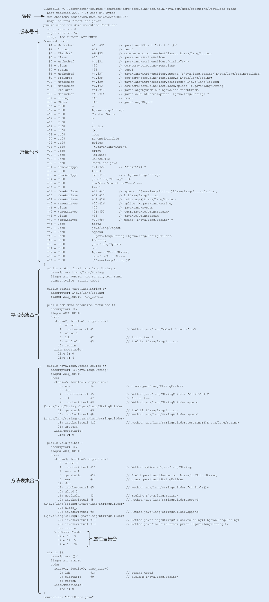

看似一个简单的命令执行，前期编译的过程其实是非常复杂的，包括词法分析、填充符号表、注解处理、语义分析以及生成class文件，这个过程我们不用过多关注。只要从上图中知道，编译后的字节码文件主要包括常量池和方法表集合这两部分就可以了。常量池主要记录的是类文件中出现的字面量以及符号引用。字面常量包括字符串常量（例如String str=“abc”，其中"abc"就是常量），声明为final的属性以及一些基本类型（例如，范围在-127-128之间的整型）的属性。符号引用包括类和接口的全限定名、类引用、方法引用以及成员变量引用（例如String str=“abc”，其中str就是成员变量引用）等。方法表集合中主要包含一些方法的字节码、方法访问权限（public、protect、prviate等）、方法名索引（与常量池中的方法引用对应）、描述符索引、JVM执行指令以及属性集合等。

#### 类加载

当一个类被创建实例或者被其它对象引用时，虚拟机在没有加载过该类的情况下，会通过类加载器将字节码文件加载到内存中。

不同的实现类由不同的类加载器加载，JDK中的本地方法类一般由根加载器（Bootstrp loader）加载进来，JDK中内部实现的扩展类一般由扩展加载器（ExtClassLoader ）实现加载，而程序中的类文件则由系统加载器（AppClassLoader ）实现加载。

在类加载后，class类文件中的常量池信息以及其它数据会被保存到JVM内存的方法区中。

#### 类连接

类在加载进来之后，会进行连接、初始化，最后才会被使用。在连接过程中，又包括验证、准备和解析三个部分。

- 验证：验证类符合Java规范和JVM规范，在保证符合规范的前提下，避免危害虚拟机安全。
- 准备：为类的静态变量分配内存，初始化为系统的初始值。对于final static修饰的变量，直接赋值为用户的定义值。例如，private final static int value=123，会在准备阶段分配内存，并初始化值为123，而如果是 private static int value=123，这个阶段value的值仍然为0。
- 解析：将符号引用转为直接引用的过程。我们知道，在编译时，Java类并不知道所引用的类的实际地址，因此只能使用符号引用来代替。类结构文件的常量池中存储了符号引用，包括类和接口的全限定名、类引用、方法引用以及成员变量引用等。如果要使用这些类和方法，就需要把它们转化为JVM可以直接获取的内存地址或指针，即直接引用。

#### 类初始化

类初始化阶段是类加载过程的最后阶段，在这个阶段中，JVM首先将执行构造器<clinit>方法，编译器会在将 .java 文件编译成 .class 文件时，收集所有类初始化代码，包括静态变量赋值语句、静态代码块、静态方法，收集在一起成为 <clinit>() 方法。初始化类的静态变量和静态代码块为用户自定义的值，初始化的顺序和Java源码从上到下的顺序一致。例如：

```java
private static int i=1；
static{
  i=0;
}
public static void main(String [] args){
  System.out.println(i);
}
```

此时运行结果为：0

再来看看以下代码：

```
static{
  i=0;
}
private static int i=1；
public static void main(String [] args){
  System.out.println(i);
}
```

此时运行结果为：

```
1
```

子类初始化时会首先调用父类的 <clinit>() 方法，再执行子类的<clinit>() 方法，运行以下代码：

```
public class Parent{
  public static String parentStr= "parent static string";
  static{
    System.out.println("parent static fields");
    System.out.println(parentStr);
  }
  public Parent(){
    System.out.println("parent instance initialization");
 }
}

public class Sub extends Parent{
  public static String subStr= "sub static string";
  static{
    System.out.println("sub static fields");
    System.out.println(subStr);
  }

  public Sub(){
    System.out.println("sub instance initialization");
  }
 
  public static void main(String[] args){
    System.out.println("sub main");
    new Sub();
 }
}
```

运行结果：

```java
parent static fields
parent static string
sub static fields
sub static string
sub main
parent instance initialization
sub instance initialization
```

JVM 会保证 <clinit>() 方法的线程安全，保证同一时间只有一个线程执行。

JVM在初始化执行代码时，如果实例化一个新对象，会调用<init>方法对实例变量进行初始化，并执行对应的构造方法内的代码。

### 4.2.2 即时编译

初始化完成后，类在调用执行过程中，执行引擎会把字节码转为机器码，然后在操作系统中才能执行。在字节码转换为机器码的过程中，虚拟机中还存在着一道编译，那就是即时编译。

最初，虚拟机中的字节码是由解释器（ Interpreter ）完成编译的，当虚拟机发现某个方法或代码块的运行特别频繁的时候，就会把这些代码认定为“热点代码”。

为了提高热点代码的执行效率，在运行时，即时编译器（JIT）会把这些代码编译成与本地平台相关的机器码，并进行各层次的优化，然后保存到内存中。

#### 即时编译器类型

在HotSpot虚拟机中，内置了两个JIT，分别为C1编译器和C2编译器，这两个编译器的编译过程是不一样的。

C1编译器是一个简单快速的编译器，主要的关注点在于局部性的优化，适用于执行时间较短或对启动性能有要求的程序，例如，GUI应用对界面启动速度就有一定要求。

C2编译器是为长期运行的服务器端应用程序做性能调优的编译器，适用于执行时间较长或对峰值性能有要求的程序。根据各自的适配性，这两种即时编译也被称为Client Compiler和Server Compiler。

在Java7之前，需要根据程序的特性来选择对应的JIT，虚拟机默认采用解释器和其中一个编译器配合工作。

Java7引入了分层编译，这种方式综合了C1的启动性能优势和C2的峰值性能优势，我们也可以通过参数 “-client”“-server” 强制指定虚拟机的即时编译模式。分层编译将JVM的执行状态分为了5个层次：

* 第0层：程序解释执行，默认开启性能监控功能（Profiling），如果不开启，可触发第二层编译；
* 第1层：可称为C1编译，将字节码编译为本地代码，进行简单、可靠的优化，不开启Profiling；
* 第2层：也称为C1编译，开启Profiling，仅执行带方法调用次数和循环回边执行次数profiling的C1编译；
* 第3层：也称为C1编译，执行所有带Profiling的C1编译；
* 第4层：可称为C2编译，也是将字节码编译为本地代码，但是会启用一些编译耗时较长的优化，甚至会根据性能监控信息进行一些不可靠的激进优化。

在Java8中，默认开启分层编译，-client和-server的设置已经是无效的了。如果只想开启C2，可以关闭分层编译（-XX:-TieredCompilation），如果只想用C1，可以在打开分层编译的同时，使用参数：-XX:TieredStopAtLevel=1。

除了这种默认的混合编译模式，我们还可以使用“-Xint”参数强制虚拟机运行于只有解释器的编译模式下，这时JIT完全不介入工作；我们还可以使用参数“-Xcomp”强制虚拟机运行于只有JIT的编译模式下。

通过 java -version 命令行可以直接查看到当前系统使用的编译模式。如下图所示：

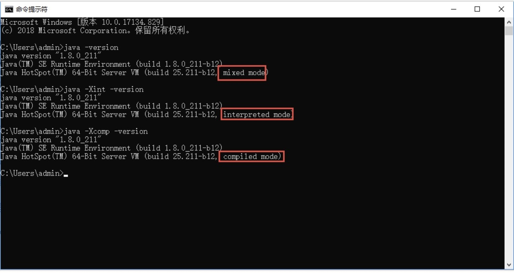

#### 热点探测

在HotSpot虚拟机中的热点探测是JIT优化的条件，热点探测是基于计数器的热点探测，采用这种方法的虚拟机会为每个方法建立计数器统计方法的执行次数，如果执行次数超过一定的阈值就认为它是“热点方法” 。

虚拟机为每个方法准备了两类计数器：方法调用计数器（Invocation Counter）和回边计数器（Back Edge Counter）。在确定虚拟机运行参数的前提下，这两个计数器都有一个确定的阈值，当计数器超过阈值溢出了，就会触发JIT编译。

方法调用计数器：用于统计方法被调用的次数，方法调用计数器的默认阈值在C1模式下是1500次，在C2模式在是10000次，可通过-XX: CompileThreshold来设定；而在分层编译的情况下，-XX: CompileThreshold指定的阈值将失效，此时将会根据当前待编译的方法数以及编译线程数来动态调整。当方法计数器和回边计数器之和超过方法计数器阈值时，就会触发JIT编译器。

回边计数器：用于统计一个方法中循环体代码执行的次数，在字节码中遇到控制流向后跳转的指令称为“回边”（Back Edge），该值用于计算是否触发C1编译的阈值，在不开启分层编译的情况下，C1默认为13995，C2默认为10700，可通过-XX: OnStackReplacePercentage=N来设置；而在分层编译的情况下，-XX: OnStackReplacePercentage指定的阈值同样会失效，此时将根据当前待编译的方法数以及编译线程数来动态调整。

建立回边计数器的主要目的是为了触发OSR（On StackReplacement）编译，即栈上编译。在一些循环周期比较长的代码段中，当循环达到回边计数器阈值时，JVM会认为这段是热点代码，JIT编译器就会将这段代码编译成机器语言并缓存，在该循环时间段内，会直接将执行代码替换，执行缓存的机器语言。

#### 编译优化技术

JIT编译运用了一些经典的编译优化技术来实现代码的优化，即通过一些例行检查优化，可以智能地编译出运行时的最优性能代码。今天我们主要来学习以下两种优化手段：

##### 方法内联

调用一个方法通常要经历压栈和出栈。调用方法是将程序执行顺序转移到存储该方法的内存地址，将方法的内容执行完后，再返回到执行该方法前的位置。

这种执行操作要求在执行前保护现场并记忆执行的地址，执行后要恢复现场，并按原来保存的地址继续执行。 因此，方法调用会产生一定的时间和空间方面的开销。

那么对于那些方法体代码不是很大，又频繁调用的方法来说，这个时间和空间的消耗会很大。方法内联的优化行为就是把目标方法的代码复制到发起调用的方法之中，避免发生真实的方法调用。

例如以下方法：

```
private int add1(int x1, int x2, int x3, int x4) {
    return add2(x1, x2) + add2(x3, x4);
}
private int add2(int x1, int x2) {
    return x1 + x2;
}
```

最终会被优化为：

```
private int add1(int x1, int x2, int x3, int x4) {
    return x1 + x2+ x3 + x4;
}
```

JVM会自动识别热点方法，并对它们使用方法内联进行优化。我们可以通过-XX:CompileThreshold来设置热点方法的阈值。但要强调一点，热点方法不一定会被JVM做内联优化，如果这个方法体太大了，JVM将不执行内联操作。而方法体的大小阈值，我们也可以通过参数设置来优化：

* 经常执行的方法，默认情况下，方法体大小小于325字节的都会进行内联，我们可以通过-XX:MaxFreqInlineSize=N来设置大小值；
* 不是经常执行的方法，默认情况下，方法大小小于35字节才会进行内联，我们也可以通过-XX:MaxInlineSize=N来重置大小值。

之后我们就可以通过配置JVM参数来查看到方法被内联的情况：

```
-XX:+PrintCompilation //在控制台打印编译过程信息
-XX:+UnlockDiagnosticVMOptions //解锁对JVM进行诊断的选项参数。默认是关闭的，开启后支持一些特定参数对JVM进行诊断
-XX:+PrintInlining //将内联方法打印出来
```

当我们设置VM参数：-XX:+PrintCompilation -XX:+UnlockDiagnosticVMOptions -XX:+PrintInlining之后，运行以下代码：

```
	public static void main(String[] args) {
		for(int i=0; i<1000000; i++) {//方法调用计数器的默认阈值在C1模式下是1500次，在C2模式在是10000次，我们循环遍历超过需要阈值
			add1(1,2,3,4);
		}
	}
```

我们可以看到运行结果中，显示了方法内联的日志：


热点方法的优化可以有效提高系统性能，一般我们可以通过以下几种方式来提高方法内联：

* 通过设置JVM参数来减小热点阈值或增加方法体阈值，以便更多的方法可以进行内联，但这种方法意味着需要占用更多地内存；
* 在编程中，避免在一个方法中写大量代码，习惯使用小方法体；
* 尽量使用final、private、static关键字修饰方法，编码方法因为继承，会需要额外的类型检查。

##### 逃逸分析

逃逸分析（Escape Analysis）是判断一个对象是否被外部方法引用或外部线程访问的分析技术，编译器会根据逃逸分析的结果对代码进行优化。

**栈上分配**

我们知道，在Java中默认创建一个对象是在堆中分配内存的，而当堆内存中的对象不再使用时，则需要通过垃圾回收机制回收，这个过程相对分配在栈中的对象的创建和销毁来说，更消耗时间和性能。这个时候，逃逸分析如果发现一个对象只在方法中使用，就会将对象分配在栈上。

以下是通过循环获取学生年龄的案例，方法中创建一个学生对象，我们现在通过案例来看看打开逃逸分析和关闭逃逸分析后，堆内存对象创建的数量对比。

```
public static void main(String[] args) {
    for (int i = 0; i < 200000 ; i++) {
    	getAge();
    }
}

public static int getAge(){
	Student person = new Student("小明",18,30);   
    return person.getAge();
}

static class Student {
    private String name;
    private int age;
   
    public Student(String name, int age) {
        this.name = name;
        this.age = age;
    }

    public String getName() {
        return name;
    }

    public void setName(String name) {
        this.name = name;
    }

    public int getAge() {
        return age;
    }

    public void setAge(int age) {
        this.age = age;
    }
}
```

然后，我们分别设置VM参数：Xmx1000m -Xms1000m -XX:-DoEscapeAnalysis -XX:+PrintGC以及 -Xmx1000m -Xms1000m -XX:+DoEscapeAnalysis -XX:+PrintGC，通过之前讲过的VisualVM工具，查看堆中创建的对象数量。

然而，运行结果却没有达到我们想要的优化效果，也许你怀疑是JDK版本的问题，然而我分别在1.6\~1.8版本都测试过了，效果还是一样的：（-server -Xmx1000m -Xms1000m -XX:-DoEscapeAnalysis -XX:+PrintGC）

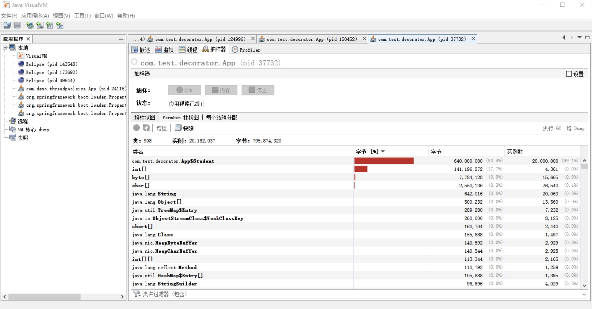

（-server -Xmx1000m -Xms1000m -XX:+DoEscapeAnalysis -XX:+PrintGC）

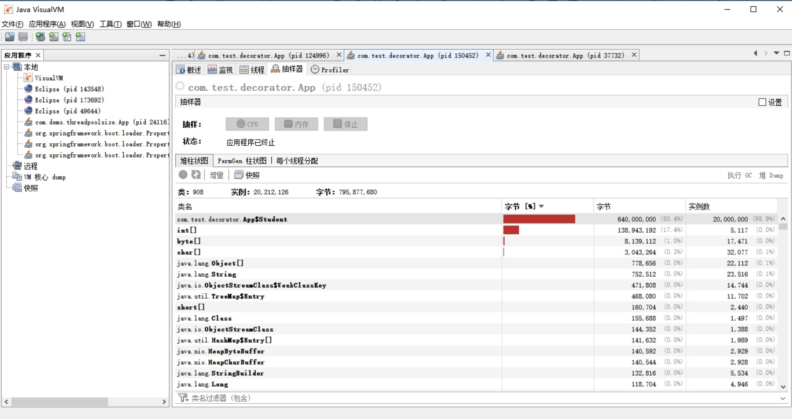

这其实是因为HotSpot虚拟机目前的实现导致栈上分配实现比较复杂，可以说，在HotSpot中暂时没有实现这项优化。随着即时编译器的发展与逃逸分析技术的逐渐成熟，相信不久的将来HotSpot也会实现这项优化功能。

##### 锁消除

在非线程安全的情况下，尽量不要使用线程安全容器，比如StringBuffer。由于StringBuffer中的append方法被Synchronized关键字修饰，会使用到锁，从而导致性能下降。

但实际上，在以下代码测试中，StringBuffer和StringBuilder的性能基本没什么区别。这是因为在局部方法中创建的对象只能被当前线程访问，无法被其它线程访问，这个变量的读写肯定不会有竞争，这个时候JIT编译会对这个对象的方法锁进行锁消除。

```
     public static String getString(String s1, String s2) {
        StringBuffer sb = new StringBuffer();
        sb.append(s1);
        sb.append(s2);
        return sb.toString();
    }
```

##### 标量替换

逃逸分析证明一个对象不会被外部访问，如果这个对象可以被拆分的话，当程序真正执行的时候可能不创建这个对象，而直接创建它的成员变量来代替。将对象拆分后，可以分配对象的成员变量在栈或寄存器上，原本的对象就无需分配内存空间了。这种编译优化就叫做标量替换。

我们用以下代码验证：

```
   public void foo() {
        TestInfo info = new TestInfo();
        info.id = 1;
        info.count = 99;
          ...//to do something
    }
```

逃逸分析后，代码会被优化为：

```
   
   public void foo() {
        id = 1;
        count = 99;
        ...//to do something
    }
```

我们可以通过设置JVM参数来开关逃逸分析，还可以单独开关同步消除和标量替换，在JDK1.8中JVM是默认开启这些操作的。

```
-XX:+DoEscapeAnalysis开启逃逸分析（jdk1.8默认开启，其它版本未测试）
-XX:-DoEscapeAnalysis 关闭逃逸分析

-XX:+EliminateLocks开启锁消除（jdk1.8默认开启，其它版本未测试）
-XX:-EliminateLocks 关闭锁消除

-XX:+EliminateAllocations开启标量替换（jdk1.8默认开启，其它版本未测试）
-XX:-EliminateAllocations 关闭就可以了
```

### 4.2.3总结

今天我们主要了解了JKD1.8以及之前的类的编译和加载过程，Java源程序是通过Javac编译器编译成 .class文件，其中文件中包含的代码格式我们称之为Java字节码（bytecode）。

这种代码格式无法直接运行，但可以被不同平台JVM中的Interpreter解释执行。由于Interpreter的效率低下，JVM中的JIT会在运行时有选择性地将运行次数较多的方法编译成二进制代码，直接运行在底层硬件上。

在Java8之前，HotSpot集成了两个JIT，用C1和C2来完成JVM中的即时编译。虽然JIT优化了代码，但收集监控信息会消耗运行时的性能，且编译过程会占用程序的运行时间。

到了Java9，AOT编译器被引入。和JIT不同，AOT是在程序运行前进行的静态编译，这样就可以避免运行时的编译消耗和内存消耗，且 .class文件通过AOT编译器是可以编译成 .so的二进制文件的。

到了Java10，一个新的JIT编译器Graal被引入。Graal 是一个以 Java 为主要编程语言、面向 Java bytecode 的编译器。与用 C++ 实现的 C1 和 C2 相比，它的模块化更加明显，也更容易维护。Graal 既可以作为动态编译器，在运行时编译热点方法；也可以作为静态编译器，实现 AOT 编译。

**思考题:**

我们知道Class.forName和ClassLoader.loadClass都能加载类，你知道这两者在加载类时的区别吗？

1. **类的初始化**：
   * `Class.forName`：不仅会加载类，还会**初始化**该类（例如执行静态块和静态变量赋值）。
   * `ClassLoader.loadClass`：只是加载类，不会初始化类（除非显示调用 `Class.forName` 或者其他需要初始化的操作）。
2. **类加载器**：
   * `Class.forName`：默认使用调用者的类加载器（即当前线程的上下文类加载器）来加载类。
   * `ClassLoader.loadClass`：需要手动指定类加载器来加载类。
3. **用法和参数**：
   * `Class.forName` 有两个常见的重载方法：
   * ```
     // 加载并初始化类
     public static Class<?> forName(String className) throws ClassNotFoundException;
     
     // 使用指定的类加载器加载类，并确定是否初始化
     public static Class<?> forName(String name, boolean initialize, ClassLoader loader) throws ClassNotFoundException;
     
     ```
   * `ClassLoader.loadClass` 主要方法：
   * ```
     // 仅加载类，不会初始化
     public Class<?> loadClass(String name) throws ClassNotFoundException;
     
     ```

## 4.3 如何优化垃圾回收机制？

我们知道，在Java开发中，开发人员是无需过度关注对象的回收与释放的，JVM的垃圾回收机制可以减轻不少工作量。但完全交由JVM回收对象，也会增加回收性能的不确定性。在一些特殊的业务场景下，不合适的垃圾回收算法以及策略，都有可能导致系统性能下降。

面对不同的业务场景，垃圾回收的调优策略也不一样。例如，在对内存要求苛刻的情况下，需要提高对象的回收效率；在CPU使用率高的情况下，需要降低高并发时垃圾回收的频率。可以说，垃圾回收的调优是一项必备技能。

这讲我们就把这项技能的学习进行拆分，看看回收（后面简称GC）的算法有哪些，体现GC算法好坏的指标有哪些，又如何根据自己的业务场景对GC策略进行调优？

### 4.3.1 垃圾回收机制

掌握GC算法之前，我们需要先弄清楚3个问题。第一，回收发生在哪里？第二，对象在什么时候可以被回收？第三，如何回收这些对象？

#### 1. 回收发生在哪里？

JVM的内存区域中，程序计数器、虚拟机栈和本地方法栈这3个区域是线程私有的，随着线程的创建而创建，销毁而销毁；栈中的栈帧随着方法的进入和退出进行入栈和出栈操作，每个栈帧中分配多少内存基本是在类结构确定下来的时候就已知的，因此这三个区域的内存分配和回收都具有确定性。那么垃圾回收的重点就是关注堆和方法区中的内存了，堆中的回收主要是对象的回收，方法区的回收主要是废弃常量和无用的类的回收。

#### 2. 对象在什么时候可以被回收？

那JVM又是怎样判断一个对象是可以被回收的呢？一般一个对象不再被引用，就代表该对象可以被回收。目前有以下两种算法可以判断该对象是否可以被回收。

- 引用计数算法：这种算法是通过一个对象的引用计数器来判断该对象是否被引用了。每当对象被引用，引用计数器就会加1；每当引用失效，计数器就会减1。当对象的引用计数器的值为0时，就说明该对象不再被引用，可以被回收了。这里强调一点，虽然引用计数算法的实现简单，判断效率也很高，但它存在着对象之间相互循环引用的问题。
- 可达性分析算法：GC  Roots  是该算法的基础，GC Roots是所有对象的根对象，在JVM加载时，会创建一些普通对象引用正常对象。这些对象作为正常对象的起始点，在垃圾回收时，会从这些GC Roots开始向下搜索，当一个对象到 GC Roots 没有任何引用链相连时，就证明此对象是不可用的。目前HotSpot虚拟机采用的就是这种算法。

以上两种算法都是通过引用来判断对象是否可以被回收。在 JDK 1.2 之后，Java 对引用的概念进行了扩充，将引用分为了以下四种：

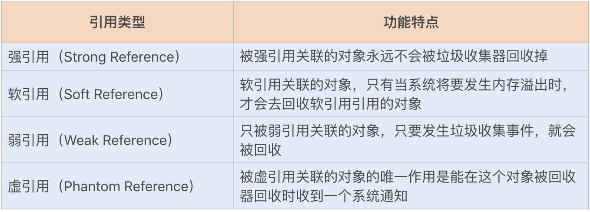

#### 3. 如何回收这些对象？

了解完Java程序中对象的回收条件，那么垃圾回收线程又是如何回收这些对象的呢？JVM垃圾回收遵循以下两个特性。

- 自动性：Java提供了一个系统级的线程来跟踪每一块分配出去的内存空间，当JVM处于空闲循环时，垃圾收集器线程会自动检查每一块分配出去的内存空间，然后自动回收每一块空闲的内存块。
- 不可预期性：一旦一个对象没有被引用了，该对象是否立刻被回收呢？答案是不可预期的。我们很难确定一个没有被引用的对象是不是会被立刻回收掉，因为有可能当程序结束后，这个对象仍在内存中。

垃圾回收线程在JVM中是自动执行的，Java程序无法强制执行。我们唯一能做的就是通过调用System.gc方法来"建议"执行垃圾收集器，但是否可执行，什么时候执行？仍然不可预期。

### 4.3.2 GC算法

JVM提供了不同的回收算法来实现这一套回收机制，通常垃圾收集器的回收算法可以分为以下几种：

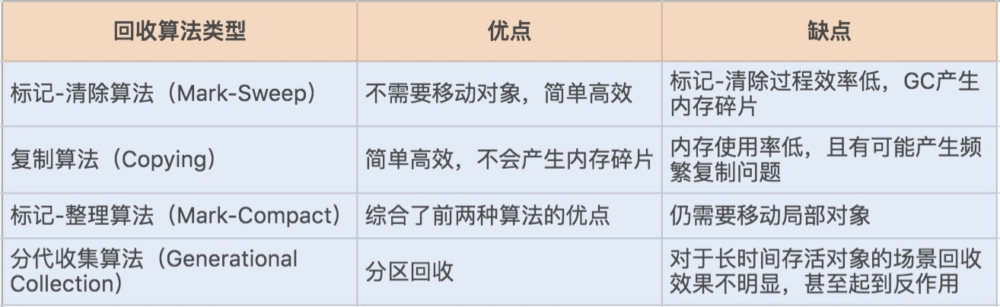

如果说收集算法是内存回收的方法论，那么垃圾收集器就是内存回收的具体实现，JDK1.7 update14 之后Hotspot虚拟机所有的回收器整理如下（以下为服务端垃圾收集器）：

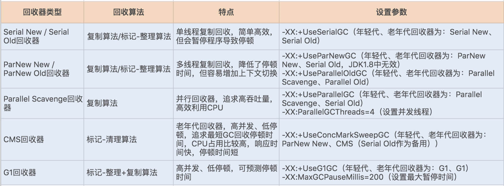

其实在JVM规范中并没有明确GC的运作方式，各个厂商可以采用不同的方式实现垃圾收集器。我们可以通过JVM工具查询当前JVM使用的垃圾收集器类型，首先通过ps命令查询出进程ID，再通过jmap -heap ID查询出JVM的配置信息，其中就包括垃圾收集器的设置类型。

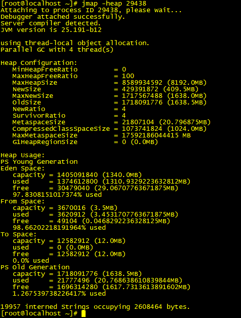

### 4.3.3 GC性能衡量指标

一个垃圾收集器在不同场景下表现出的性能也不一样，那么如何评价一个垃圾收集器的性能好坏呢？我们可以借助一些指标。

- 吞吐量：这里的吞吐量是指应用程序所花费的时间和系统总运行时间的比值。我们可以按照这个公式来计算GC的吞吐量：系统总运行时间=应用程序耗时+GC耗时。如果系统运行了100分钟，GC耗时1分钟，则系统吞吐量为99%。GC的吞吐量一般不能低于95%。
- 停顿时间：指垃圾收集器正在运行时，应用程序的暂停时间。对于串行回收器而言，停顿时间可能会比较长；而使用并发回收器，由于垃圾收集器和应用程序交替运行，程序的停顿时间就会变短，但其效率很可能不如独占垃圾收集器，系统的吞吐量也很可能会降低。
- 垃圾回收频率：多久发生一次指垃圾回收呢？通常垃圾回收的频率越低越好，增大堆内存空间可以有效降低垃圾回收发生的频率，但同时也意味着堆积的回收对象越多，最终也会增加回收时的停顿时间。所以我们只要适当地增大堆内存空间，保证正常的垃圾回收频率即可。

### 4.3.4 查看&分析GC日志

已知了性能衡量指标，现在我们需要通过工具查询GC相关日志，统计各项指标的信息。首先，我们需要通过JVM参数预先设置GC日志，通常有以下几种JVM参数设置：

```
-XX:+PrintGC 输出GC日志
-XX:+PrintGCDetails 输出GC的详细日志
-XX:+PrintGCTimeStamps 输出GC的时间戳（以基准时间的形式）
-XX:+PrintGCDateStamps 输出GC的时间戳（以日期的形式，如 2013-05-04T21:53:59.234+0800）
-XX:+PrintHeapAtGC 在进行GC的前后打印出堆的信息
-Xloggc:../logs/gc.log 日志文件的输出路径
```

这里使用如下参数来打印日志：

```
-XX:+PrintGCDateStamps -XX:+PrintGCDetails -Xloggc:./gclogs
```

打印后的日志为：

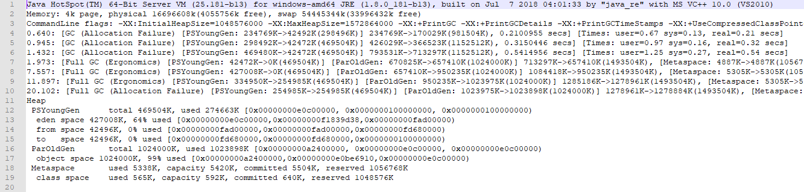

上图是运行很短时间的GC日志，如果是长时间的GC日志，我们很难通过文本形式去查看整体的GC性能。此时，我们可以通过[GCViewer](https://sourceforge.net/projects/gcviewer/)工具打开日志文件，图形化界面查看整体的GC性能，如下图所示：

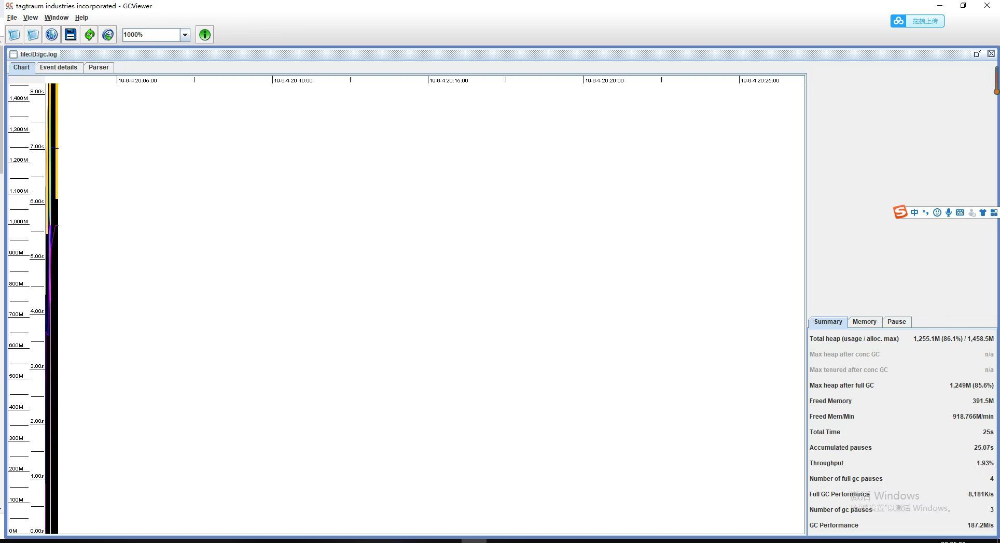

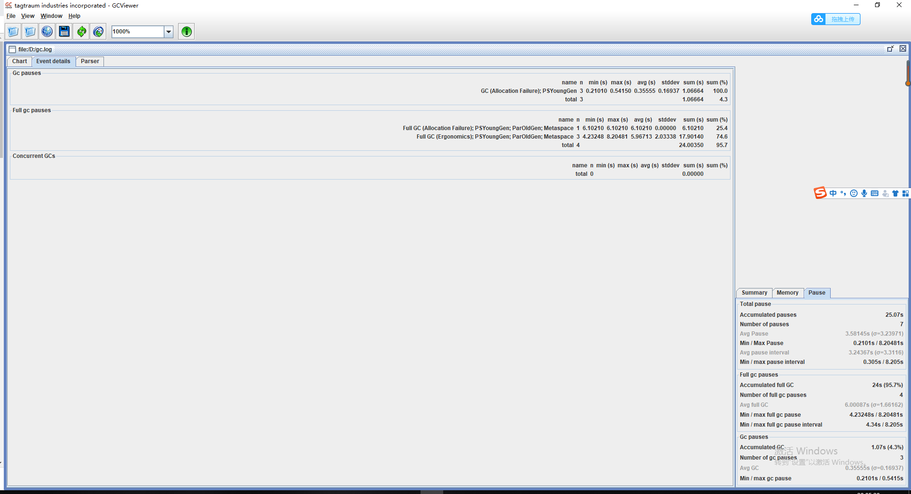

通过工具，我们可以看到吞吐量、停顿时间以及GC的频率，从而可以非常直观地了解到GC的性能情况。这里我再推荐一个比较好用的GC日志分析工具，[GCeasy](https://www.gceasy.io/index.jsp)是一款非常直观的GC日志分析工具，我们可以将日志文件压缩之后，上传到GCeasy官网即可看到非常清楚的GC日志分析结果：

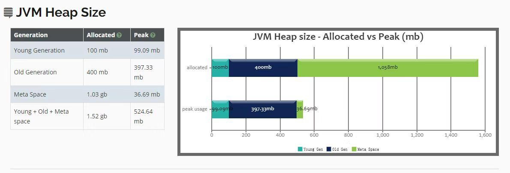

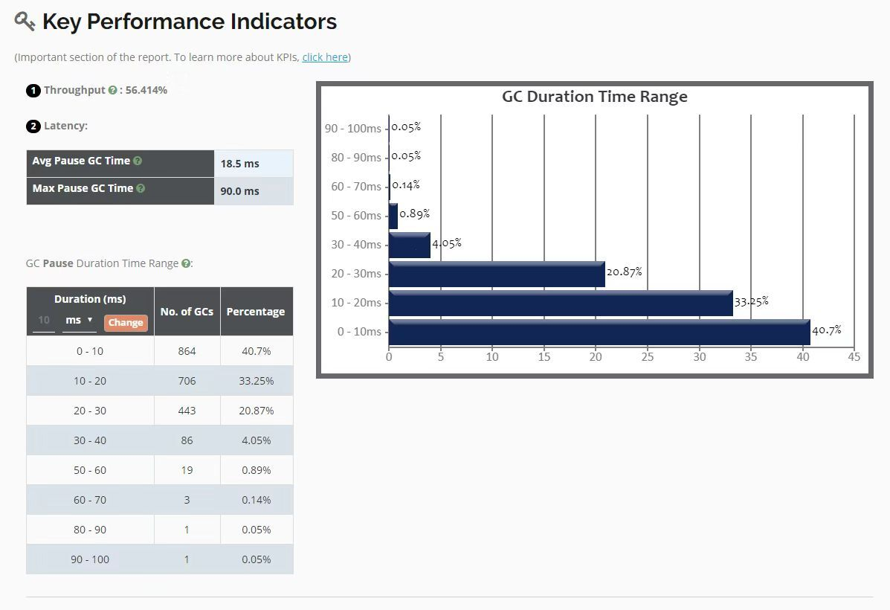

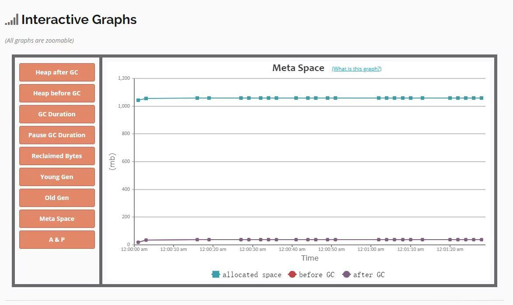

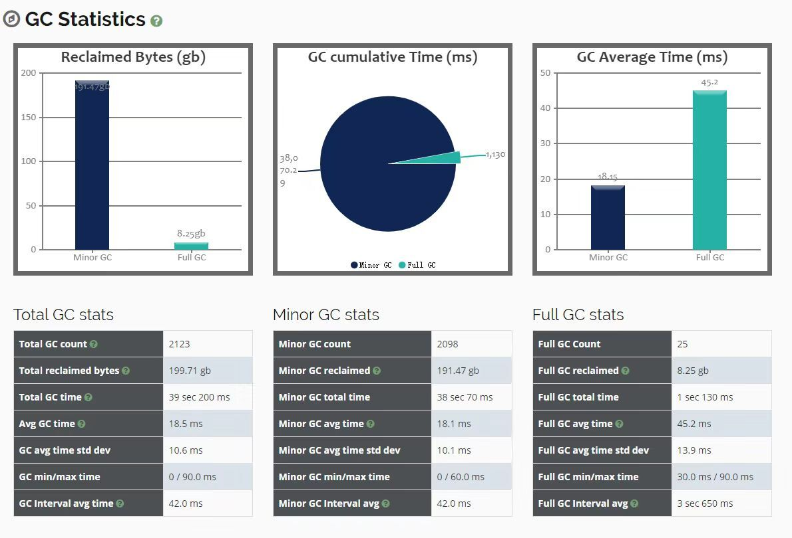

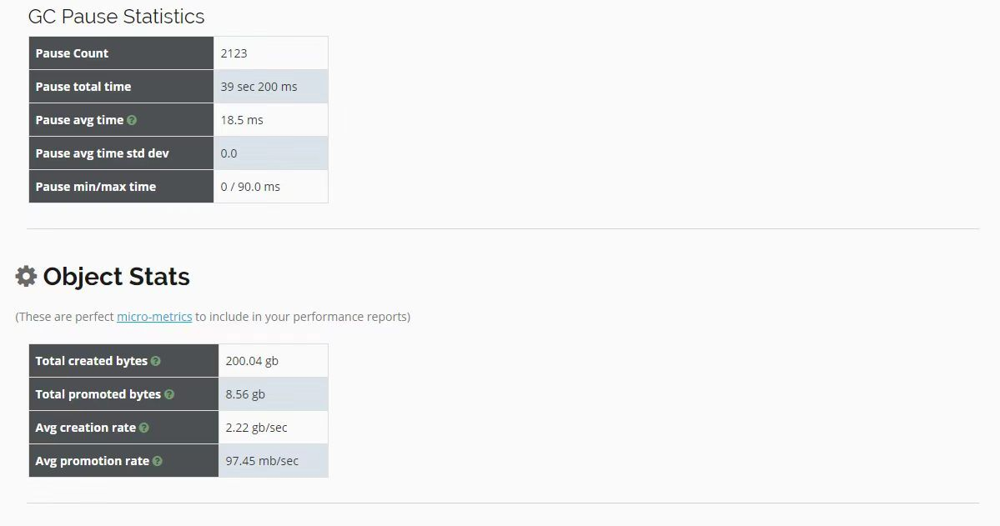

### 4.3.5 GC调优策略

找出问题后，就可以进行调优了，下面介绍几种常用的GC调优策略。

#### 1. 降低Minor GC频率

通常情况下，由于新生代空间较小，Eden区很快被填满，就会导致频繁Minor GC，因此我们可以通过增大新生代空间来降低Minor GC的频率。可能你会有这样的疑问，扩容Eden区虽然可以减少Minor GC的次数，但不会增加单次Minor GC的时间吗？如果单次Minor GC的时间增加，那也很难达到我们期待的优化效果呀。

我们知道，单次Minor GC时间是由两部分组成：T1（扫描新生代）和T2（复制存活对象）。假设一个对象在Eden区的存活时间为500ms，Minor GC的时间间隔是300ms，那么正常情况下，Minor GC的时间为 ：T1+T2。当我们增大新生代空间，Minor GC的时间间隔可能会扩大到600ms，此时一个存活500ms的对象就会在Eden区中被回收掉，此时就不存在复制存活对象了，所以再发生Minor GC的时间为：两次扫描新生代，即2T1。可见，扩容后，Minor GC时增加了T1，但省去了T2的时间。通常在虚拟机中，复制对象的成本要远高于扫描成本。

如果在堆内存中存在较多的长期存活的对象，此时增加年轻代空间，反而会增加Minor GC的时间。如果堆中的短期对象很多，那么扩容新生代，单次Minor GC时间不会显著增加。因此，单次Minor GC时间更多取决于GC后存活对象的数量，而非Eden区的大小。

#### 2. 降低Full GC的频率

通常情况下，由于堆内存空间不足或老年代对象太多，会触发Full GC，频繁的Full GC会带来上下文切换，增加系统的性能开销。我们可以使用哪些方法来降低Full GC的频率呢？

减少创建大对象：在平常的业务场景中，我们习惯一次性从数据库中查询出一个大对象用于web端显示。例如，我之前碰到过一个一次性查询出60个字段的业务操作，这种大对象如果超过年轻代最大对象阈值，会被直接创建在老年代；即使被创建在了年轻代，由于年轻代的内存空间有限，通过Minor GC之后也会进入到老年代。这种大对象很容易产生较多的Full GC。

我们可以将这种大对象拆解出来，首次只查询一些比较重要的字段，如果还需要其它字段辅助查看，再通过第二次查询显示剩余的字段。增大堆内存空间：在堆内存不足的情况下，增大堆内存空间，且设置初始化堆内存为最大堆内存，也可以降低Full GC的频率。

#### 3. 选择合适的GC回收器

假设我们有这样一个需求，要求每次操作的响应时间必须在500ms以内。这个时候我们一般会选择响应速度较快的GC回收器，CMS（Concurrent Mark Sweep）回收器和G1回收器都是不错的选择。而当我们的需求对系统吞吐量有要求时，就可以选择Parallel Scavenge回收器来提高系统的吞吐量。

### 4.3.6 总结

今天的内容比较多，最后再强调几个重点。

- 垃圾收集器的种类很多，我们可以将其分成两种类型，一种是响应速度快，一种是吞吐量高。通常情况下，CMS和G1回收器的响应速度快，Parallel Scavenge回收器的吞吐量高。
- 在JDK1.8环境下，默认使用的是Parallel Scavenge（年轻代）+Serial Old（老年代）垃圾收集器，你可以通过文中介绍的查询JVM的GC默认配置方法进行查看。
- 通常情况，JVM是默认垃圾回收优化的，在没有性能衡量标准的前提下，尽量避免修改GC的一些性能配置参数。如果一定要改，那就必须基于大量的测试结果或线上的具体性能来进行调整。

**思考题:**以上我们讲到了CMS和G1回收器，你知道G1是如何实现更好的GC性能的吗？

```
1. 分区化堆结构（Region-Based Heap Structure）
G1将堆内存分成若干个相等大小的独立区域（region），每个region可以在Eden区、Survivor区或老年代内动态分配。这种结构提供了灵活的内存管理，有助于提高GC的效率和性能。
● 小而独立的区域：G1中的每个Region是一个小的独立单位，有助于更精细地控制和优化内存分配和回收过程。
● 动态划分：Region可以动态地在新生代和老年代之间划分，根据实际内存使用情况灵活调整。
2. 混合回收（Mixed Collection）
G1的混合回收机制在进行新生代GC时，同时回收部分老年代的内存。这种机制有助于避免老年代内存过度增长，从而减少Full GC带来的长时间停顿。
● 并行和并发回收：混合回收可以利用多线程并行处理，减少垃圾收集对应用程序的影响。
● 效率更高：同时回收新生代和老年代的部分内存，有助于维持整体堆内存的均衡，避免频繁触发Full GC。
3. 垃圾优先（Garbage-First）策略
G1的名称“Garbage-First”来源于其垃圾优先的回收策略。G1会首先回收垃圾最多的Region，这样可以最大限度地回收内存并提高效率。
● 垃圾优先算法：G1会根据各个Region的垃圾量排列回收优先级，优先回收垃圾最多的区域，以此最大化回收收益。
● 成本效益分析：回收成本和回收收益的分析使得G1能够选择最佳的回收策略，实现高效的内存回收。
4. 预测性暂停时间控制
G1允许用户通过设置参数来控制GC暂停时间，提供了一种可预测的暂停时间模型。通过调整参数，用户可以在GC性能和应用响应性之间找到最佳平衡。
● 参数调整：通过设置 -XX:MaxGCPauseMillis 参数，用户可以指定期望的最大GC暂停时间，G1会尽量满足这个时间目标。
● 暂停时间预测：基于历史暂停时间和当前内存使用情况，G1能够预测下次GC的暂停时间并调整回收策略，以达到指定的暂停时间目标。
5. 并发标记和回收
G1通过并发标记和回收技术，在应用程序运行时对老年代进行标记和整理，减少了STW（stop-the-world）时间。
● 并发标记：在应用程序执行的同时，G1使用后台线程对老年代进行标记，识别可回收对象和不可回收对象。
● 并发回收：在混合回收阶段，G1在应用程序执行的同时，使用后台线程对部分老年代进行整理和回收，减少对应用程序响应时间的影响。
```

## 4.4 如何优化JVM内存分配？

JVM调优是一个系统而又复杂的过程，但我们知道，在大多数情况下，我们基本不用去调整JVM内存分配，因为一些初始化的参数已经可以保证应用服务正常稳定地工作了。但所有的调优都是有目标性的，JVM内存分配调优也一样。没有性能问题的时候，我们自然不会随意改变JVM内存分配的参数。那有了问题呢？有了什么样的性能问题我们需要对其进行调优呢？又该如何调优呢？这就是我今天要分享的内容。

### 4.4.1 JVM内存分配性能问题

谈到JVM内存表现出的性能问题时，你可能会想到一些线上的JVM内存溢出事故。但这方面的事故往往是应用程序创建对象导致的内存回收对象难，一般属于代码编程问题。

但其实很多时候，在应用服务的特定场景下，JVM内存分配不合理带来的性能表现并不会像内存溢出问题这么突出。可以说如果你没有深入到各项性能指标中去，是很难发现其中隐藏的性能损耗。

JVM内存分配不合理最直接的表现就是频繁的GC，这会导致上下文切换等性能问题，从而降低系统的吞吐量、增加系统的响应时间。因此，如果你在线上环境或性能测试时，发现频繁的GC，且是正常的对象创建和回收，这个时候就需要考虑调整JVM内存分配了，从而减少GC所带来的性能开销。

### 4.4.2 对象在堆中的生存周期

了解了性能问题，那需要做的势必就是调优了。但先别急，在了解JVM内存分配的调优过程之前，我们先来看看一个新创建的对象在堆内存中的生存周期，为后面的学习打下基础。在[第20讲](https://time.geekbang.org/column/article/106203)中，我讲过JVM内存模型。我们知道，在JVM内存模型的堆中，堆被划分为新生代和老年代，新生代又被进一步划分为Eden区和Survivor区，最后Survivor由From Survivor和To Survivor组成。

当我们新建一个对象时，对象会被优先分配到新生代的Eden区中，这时虚拟机会给对象定义一个对象年龄计数器（通过参数-XX:MaxTenuringThreshold设置）。同时，也有另外一种情况，当Eden空间不足时，虚拟机将会执行一个新生代的垃圾回收（Minor GC）。这时JVM会把存活的对象转移到Survivor中，并给对象的年龄+1。对象在Survivor中同样也会经历MinorGC，每经过一次MinorGC，对象的年龄将会+1。

当然了，内存空间也是有设置阈值的，可以通过参数-XX:PetenureSizeThreshold设置直接被分配到老年代的最大对象，这时如果分配的对象超过了设置的阀值，对象就会直接被分配到老年代，这样做的好处就是可以减少新生代的垃圾回收。

### 4.4.3 查看JVM堆内存分配

我们知道了一个对象从创建至回收到堆中的过程，接下来我们再来了解下JVM堆内存是如何分配的。在默认不配置JVM堆内存大小的情况下，JVM根据默认值来配置当前内存大小。我们可以通过以下命令来查看堆内存配置的默认值：

```plaintext
java -XX:+PrintFlagsFinal -version | grep HeapSize
jmap -heap 17284
```

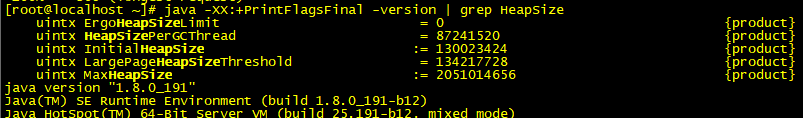

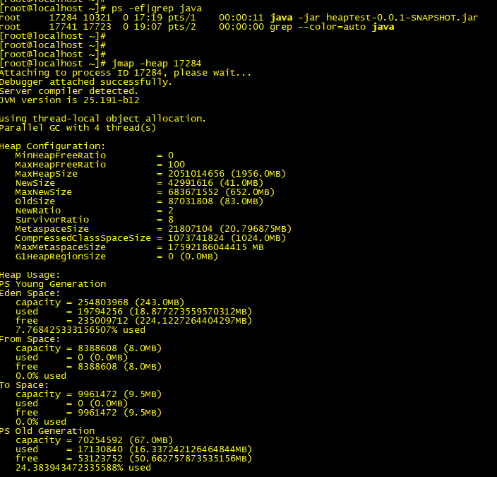

通过命令，我们可以获得在这台机器上启动的JVM默认最大堆内存为1953MB，初始化大小为124MB。在JDK1.7中，默认情况下年轻代和老年代的比例是1:2，我们可以通过–XX:NewRatio重置该配置项。年轻代中的Eden和To Survivor、From Survivor的比例是8:1:1，我们可以通过-XX:SurvivorRatio重置该配置项。在JDK1.7中如果开启了-XX:+UseAdaptiveSizePolicy配置项，JVM将会动态调整Java堆中各个区域的大小以及进入老年代的年龄，–XX:NewRatio和-XX:SurvivorRatio将会失效，而JDK1.8是默认开启-XX:+UseAdaptiveSizePolicy配置项的。

还有，在JDK1.8中，不要随便关闭UseAdaptiveSizePolicy配置项，除非你已经对初始化堆内存/最大堆内存、年轻代/老年代以及Eden区/Survivor区有非常明确的规划了。否则JVM将会分配最小堆内存，年轻代和老年代按照默认比例1:2进行分配，年轻代中的Eden和Survivor则按照默认比例8:2进行分配。这个内存分配未必是应用服务的最佳配置，因此可能会给应用服务带来严重的性能问题。

### 4.4.4 JVM内存分配的调优过程

我们先使用JVM的默认配置，观察应用服务的运行情况，下面我将结合一个实际案例来讲述。现模拟一个抢购接口，假设需要满足一个5W的并发请求，且每次请求会产生20KB对象，我们可以通过千级并发创建一个1MB对象的接口来模拟万级并发请求产生大量对象的场景，具体代码如下：

```java
	@RequestMapping(value = "/test1")
	public String test1(HttpServletRequest request) {
		List<Byte[]> temp = new ArrayList<Byte[]>();

		Byte[] b = new Byte[1024*1024];
		temp.add(b);

		return "success";
	}
```

#### AB压测

分别对应用服务进行压力测试，以下是请求接口的吞吐量和响应时间在不同并发用户数下的变化情况：

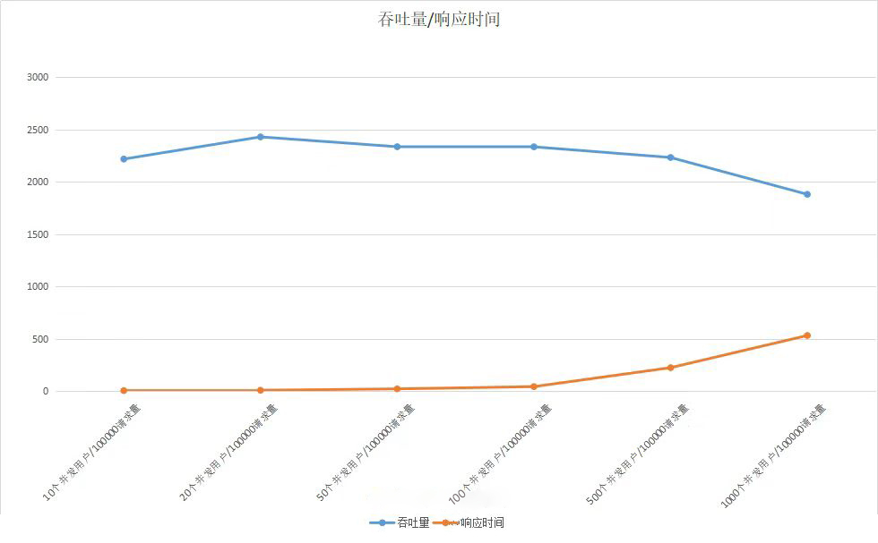

可以看到，当并发数量到了一定值时，吞吐量就上不去了，响应时间也迅速增加。那么，在JVM内部运行又是怎样的呢？

#### 分析GC日志

此时我们可以通过GC日志查看具体的回收日志。我们可以通过设置VM配置参数，将运行期间的GC日志 dump下来，具体配置参数如下：

```java
 -XX:+PrintGCTimeStamps -XX:+PrintGCDetails -Xloggc:/log/heapTest.log
```

以下是各个配置项的说明：

* -XX:PrintGCTimeStamps：打印GC具体时间；
* -XX:PrintGCDetails ：打印出GC详细日志；
* -Xloggc: path：GC日志生成路径。

收集到GC日志后，我们就可以使用[第22讲](https://time.geekbang.org/column/article/107396)中介绍过的GCViewer工具打开它，进而查看到具体的GC日志如下：

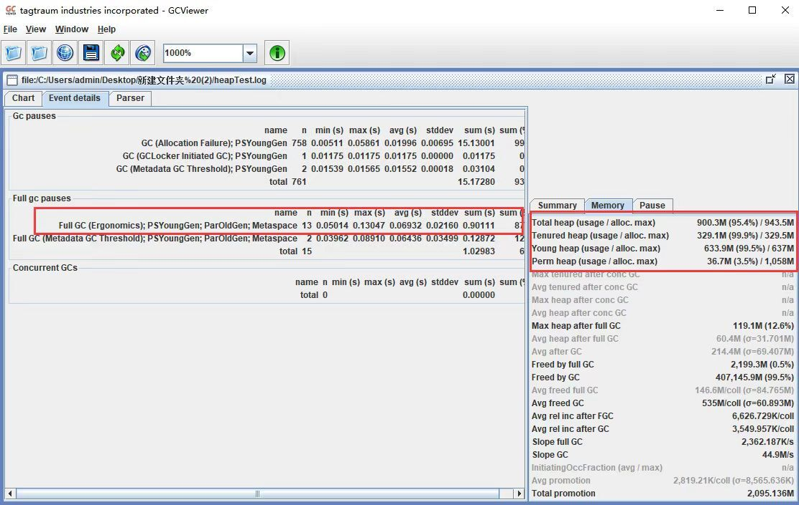

主页面显示FullGC发生了13次，右下角显示年轻代和老年代的内存使用率几乎达到了100%。而FullGC会导致stop-the-world的发生，从而严重影响到应用服务的性能。此时，我们需要调整堆内存的大小来减少FullGC的发生。

#### 参考指标

我们可以将某些指标的预期值作为参考指标，上面的GC频率就是其中之一，那么还有哪些指标可以为我们提供一些具体的调优方向呢？

- GC频率：高频的FullGC会给系统带来非常大的性能消耗，虽然MinorGC相对FullGC来说好了许多，但过多的MinorGC仍会给系统带来压力。
- 内存：这里的内存指的是堆内存大小，堆内存又分为年轻代内存和老年代内存。首先我们要分析堆内存大小是否合适，其实是分析年轻代和老年代的比例是否合适。如果内存不足或分配不均匀，会增加FullGC，严重的将导致CPU持续爆满，影响系统性能。
- 吞吐量：频繁的FullGC将会引起线程的上下文切换，增加系统的性能开销，从而影响每次处理的线程请求，最终导致系统的吞吐量下降。
- 延时：JVM的GC持续时间也会影响到每次请求的响应时间。

#### 具体调优方法

调整堆内存空间减少FullGC：通过日志分析，堆内存基本被用完了，而且存在大量FullGC，这意味着我们的堆内存严重不足，这个时候我们需要调大堆内存空间。

```java
java -jar -Xms4g -Xmx4g heapTest-0.0.1-SNAPSHOT.jar
```

以下是各个配置项的说明：

* -Xms：堆初始大小；
* -Xmx：堆最大值。

调大堆内存之后，我们再来测试下性能情况，发现吞吐量提高了40%左右，响应时间也降低了将近50%。

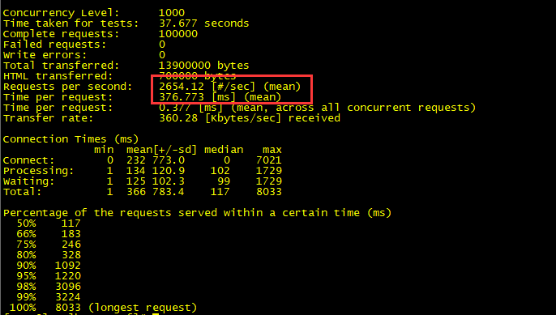

再查看GC日志，发现FullGC频率降低了，老年代的使用率只有16%了。

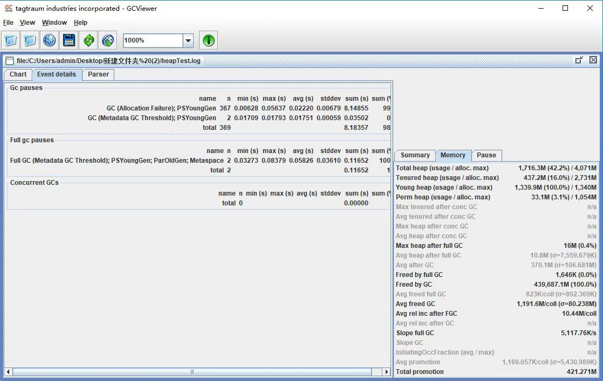

调整年轻代减少MinorGC：通过调整堆内存大小，我们已经提升了整体的吞吐量，降低了响应时间。那还有优化空间吗？我们还可以将年轻代设置得大一些，从而减少一些MinorGC（[第22讲](https://time.geekbang.org/column/article/107396)有通过降低Minor GC频率来提高系统性能的详解）。

```java
java -jar -Xms4g -Xmx4g -Xmn3g heapTest-0.0.1-SNAPSHOT.jar
```

再进行AB压测，发现吞吐量上去了

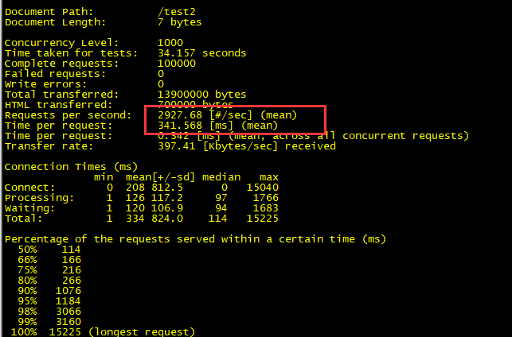

再查看GC日志，发现MinorGC也明显降低了，GC花费的总时间也减少了。

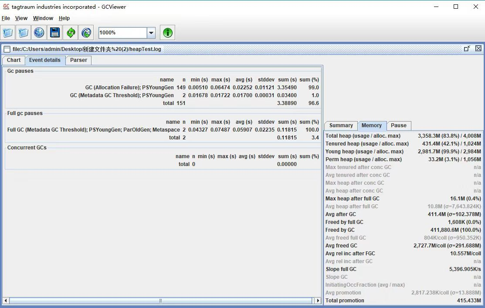

设置Eden、Survivor区比例：在JVM中，如果开启 AdaptiveSizePolicy，则每次 GC 后都会重新计算 Eden、From Survivor和 To Survivor区的大小，计算依据是 GC 过程中统计的 GC 时间、吞吐量、内存占用量。这个时候SurvivorRatio默认设置的比例会失效。

在JDK1.8中，默认是开启AdaptiveSizePolicy的，我们可以通过-XX:-UseAdaptiveSizePolicy关闭该项配置，或显示运行-XX:SurvivorRatio=8将Eden、Survivor的比例设置为8:2。大部分新对象都是在Eden区创建的，我们可以固定Eden区的占用比例，来调优JVM的内存分配性能。再进行AB性能测试，我们可以看到吞吐量提升了，响应时间降低了。

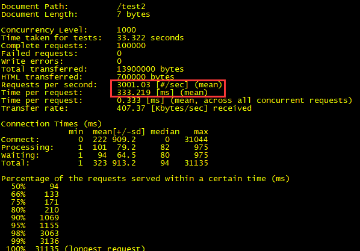

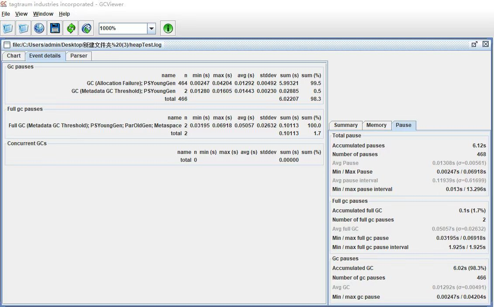

### 4.4.5 总结

JVM内存调优通常和GC调优是互补的，基于以上调优，我们可以继续对年轻代和堆内存的垃圾回收算法进行调优。这里可以结合上一讲的内容，一起完成JVM调优。虽然分享了一些JVM内存分配调优的常用方法，但我还是建议你在进行性能压测后如果没有发现突出的性能瓶颈，就继续使用JVM默认参数，起码在大部分的场景下，默认配置已经可以满足我们的需求了。但满足不了也不要慌张，结合今天所学的内容去实践一下，相信你会有新的收获。

**思考题:** 以上我们都是基于堆内存分配来优化系统性能的，但在NIO的Socket通信中，其实还使用到了堆外内存来减少内存拷贝，实现Socket通信优化。你知道堆外内存是如何创建和回收的吗？

## 4.5 内存持续上升,我该如何排查问题?

我想你肯定遇到过内存溢出，或是内存使用率过高的问题。碰到内存持续上升的情况，其实我们很难从业务日志中查看到具体的问题，那么面对多个进程以及大量业务线程，我们该如何精准地找到背后的原因呢？

### 4.5.1 常用的监控和诊断内存工具

工欲善其事，必先利其器。平时排查内存性能瓶颈时，我们往往需要用到一些Linux命令行或者JDK工具来辅助我们监测系统或者虚拟机内存的使用情况，下面我就来介绍几种好用且常用的工具。

#### Linux命令行工具之top命令

top命令是我们在Linux下最常用的命令之一，它可以实时显示正在执行进程的CPU使用率、内存使用率以及系统负载等信息。其中上半部分显示的是系统的统计信息，下半部分显示的是进程的使用率统计信息。

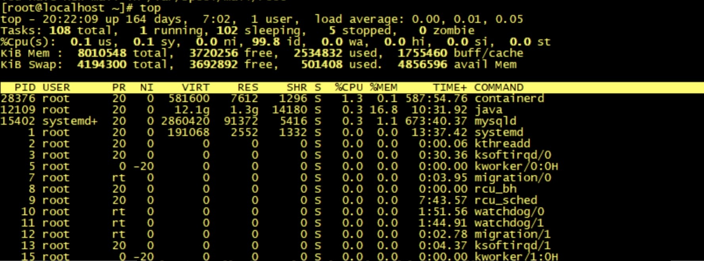

除了简单的top之外，我们还可以通过top -Hp pid查看具体线程使用系统资源情况：

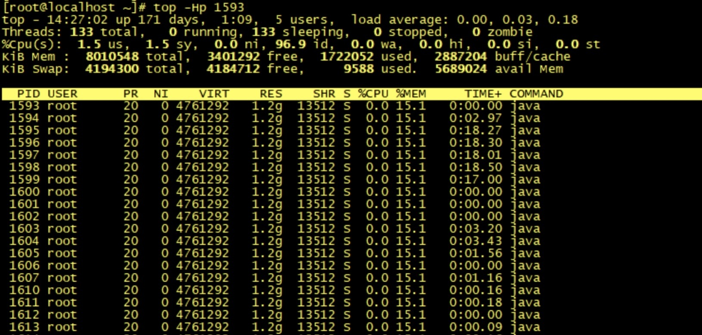

#### Linux命令行工具之vmstat命令

vmstat是一款指定采样周期和次数的功能性监测工具，我们可以看到，它不仅可以统计内存的使用情况，还可以观测到CPU的使用率、swap的使用情况。但vmstat一般很少用来查看内存的使用情况，而是经常被用来观察进程的上下文切换。

* r：等待运行的进程数；
* b：处于非中断睡眠状态的进程数；
* swpd：虚拟内存使用情况；
* free：空闲的内存；
* buff：用来作为缓冲的内存数；
* si：从磁盘交换到内存的交换页数量；
* so：从内存交换到磁盘的交换页数量；
* bi：发送到块设备的块数；
* bo：从块设备接收到的块数；
* in：每秒中断数；
* cs：每秒上下文切换次数；
* us：用户CPU使用时间；
* sy：内核CPU系统使用时间；
* id：空闲时间；
* wa：等待I/O时间；
* st：运行虚拟机窃取的时间。

#### Linux命令行工具之pidstat命令

pidstat是Sysstat中的一个组件，也是一款功能强大的性能监测工具，我们可以通过命令：yum install sysstat安装该监控组件。之前的top和vmstat两个命令都是监测进程的内存、CPU以及I/O使用情况，而pidstat命令则是深入到线程级别。通过pidstat -help命令，我们可以查看到有以下几个常用的参数来监测线程的性能：

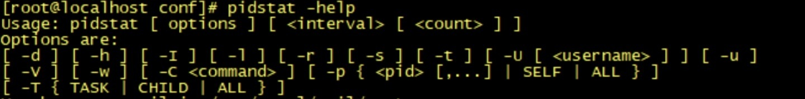

常用参数：

* -u：默认的参数，显示各个进程的cpu使用情况；
* -r：显示各个进程的内存使用情况；
* -d：显示各个进程的I/O使用情况；
* -w：显示每个进程的上下文切换情况；
* -p：指定进程号；
* -t：显示进程中线程的统计信息。

我们可以通过相关命令（例如ps或jps）查询到相关进程ID，再运行以下命令来监测该进程的内存使用情况：

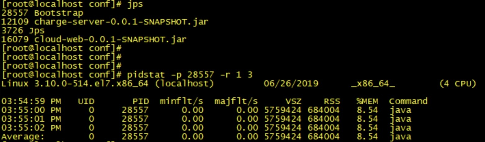

其中pidstat的参数-p用于指定进程ID，-r表示监控内存的使用情况，1表示每秒的意思，3则表示采样次数。其中显示的几个关键指标的含义是：

* Minflt/s：任务每秒发生的次要错误，不需要从磁盘中加载页；
* Majflt/s：任务每秒发生的主要错误，需要从磁盘中加载页；
* VSZ：虚拟地址大小，虚拟内存使用KB；
* RSS：常驻集合大小，非交换区内存使用KB。

如果我们需要继续查看该进程下的线程内存使用率，则在后面添加-t指令即可：

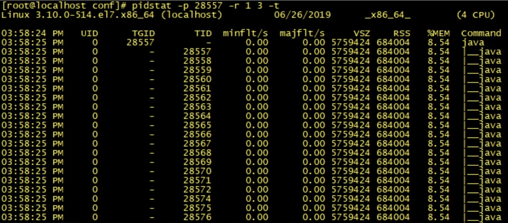

我们知道，Java是基于JVM上运行的，大部分内存都是在JVM的用户内存中创建的，所以除了通过以上Linux命令来监控整个服务器内存的使用情况之外，我们更需要知道JVM中的内存使用情况。JDK中就自带了很多命令工具可以监测到JVM的内存分配以及使用情况。

#### JDK工具之jstat命令

jstat可以监测Java应用程序的实时运行情况，包括堆内存信息以及垃圾回收信息。我们可以运行jstat -help查看一些关键参数信息：

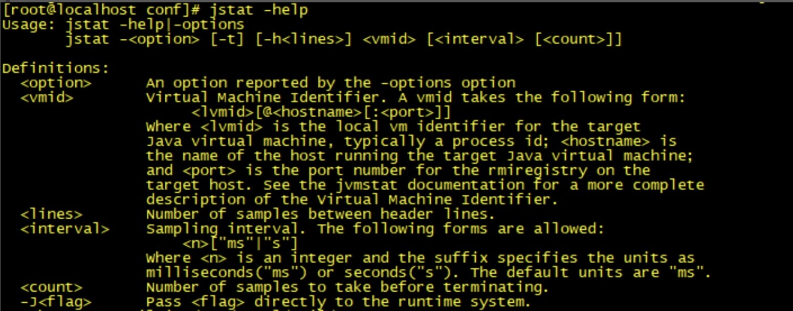

再通过jstat -option查看jstat有哪些操作：

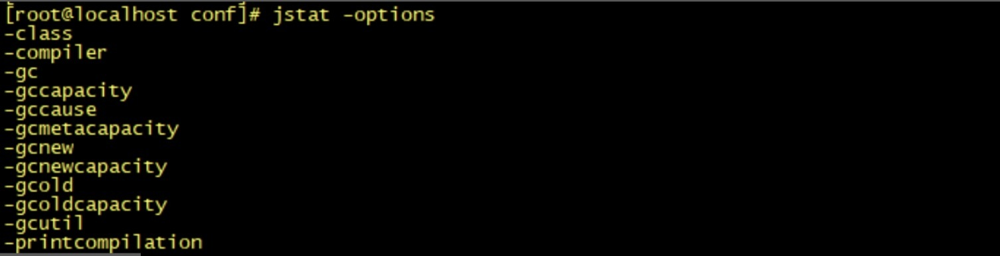

* -class：显示ClassLoad的相关信息；
* -compiler：显示JIT编译的相关信息；
* -gc：显示和gc相关的堆信息；
* -gccapacity：显示各个代的容量以及使用情况；
* -gcmetacapacity：显示Metaspace的大小；
* -gcnew：显示新生代信息；
* -gcnewcapacity：显示新生代大小和使用情况；
* -gcold：显示老年代和永久代的信息；
* -gcoldcapacity ：显示老年代的大小；
* -gcutil：显示垃圾收集信息；
* -gccause：显示垃圾回收的相关信息（通-gcutil），同时显示最后一次或当前正在发生的垃圾回收的诱因；
* -printcompilation：输出JIT编译的方法信息。

它的功能比较多，在这里我例举一个常用功能，如何使用jstat查看堆内存的使用情况。我们可以用jstat -gc pid查看：

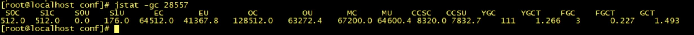

* S0C：年轻代中To Survivor的容量（单位KB）；
* S1C：年轻代中From Survivor的容量（单位KB）；
* S0U：年轻代中To Survivor目前已使用空间（单位KB）；
* S1U：年轻代中From Survivor目前已使用空间（单位KB）；
* EC：年轻代中Eden的容量（单位KB）；
* EU：年轻代中Eden目前已使用空间（单位KB）；
* OC：Old代的容量（单位KB）；
* OU：Old代目前已使用空间（单位KB）；
* MC：Metaspace的容量（单位KB）；
* MU：Metaspace目前已使用空间（单位KB）；
* YGC：从应用程序启动到采样时年轻代中gc次数；
* YGCT：从应用程序启动到采样时年轻代中gc所用时间(s)；
* FGC：从应用程序启动到采样时old代（全gc）gc次数；
* FGCT：从应用程序启动到采样时old代（全gc）gc所用时间(s)；
* GCT：从应用程序启动到采样时gc用的总时间(s)。

#### JDK工具之jstack命令

这个工具在模块三的[答疑课堂](https://time.geekbang.org/column/article/105234)中介绍过，它是一种线程堆栈分析工具，最常用的功能就是使用 jstack pid 命令查看线程的堆栈信息，通常会结合top -Hp pid 或 pidstat -p pid -t一起查看具体线程的状态，也经常用来排查一些死锁的异常。

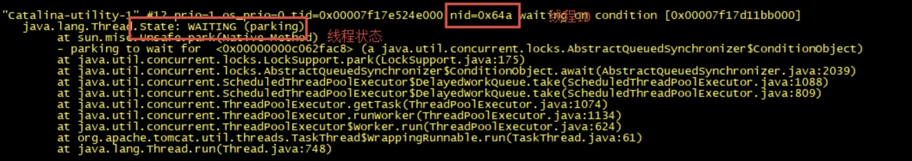

每个线程堆栈的信息中，都可以查看到线程ID、线程的状态（wait、sleep、running 等状态）以及是否持有锁等。

#### JDK工具之jmap命令

在[第23讲](https://time.geekbang.org/column/article/108139)中我们使用过jmap查看堆内存初始化配置信息以及堆内存的使用情况。那么除了这个功能，我们其实还可以使用jmap输出堆内存中的对象信息，包括产生了哪些对象，对象数量多少等。我们可以用jmap来查看堆内存初始化配置信息以及堆内存的使用情况：

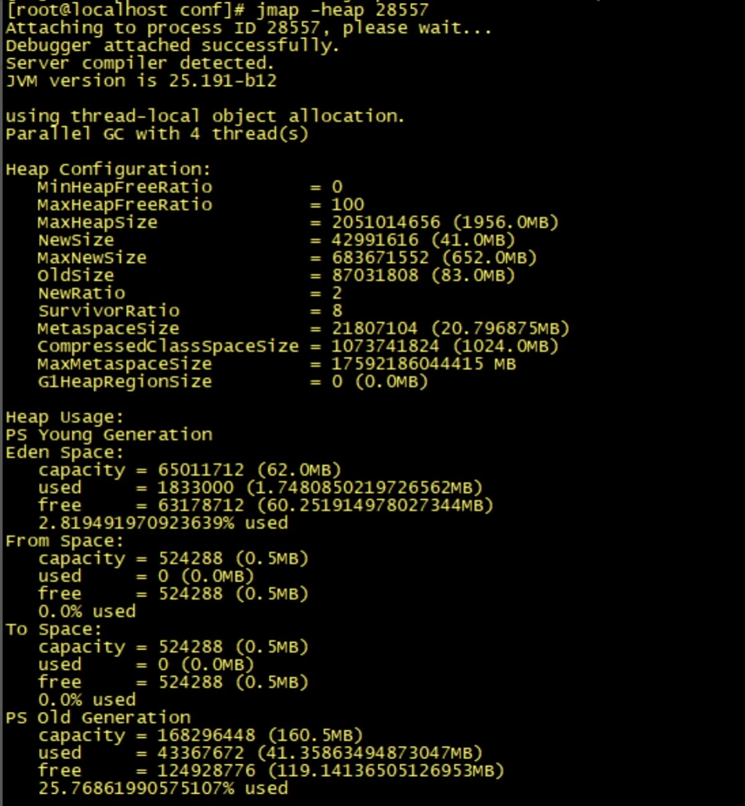

我们可以使用jmap -histo[:live] pid查看堆内存中的对象数目、大小统计直方图，如果带上live则只统计活对象：


我们可以通过jmap命令把堆内存的使用情况dump到文件中：

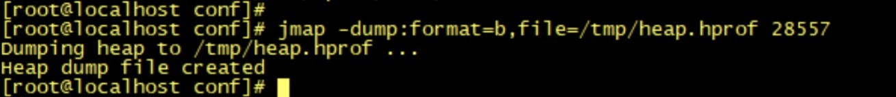

我们可以将文件下载下来，使用 [MAT](http://www.eclipse.org/mat/)工具打开文件进行分析：

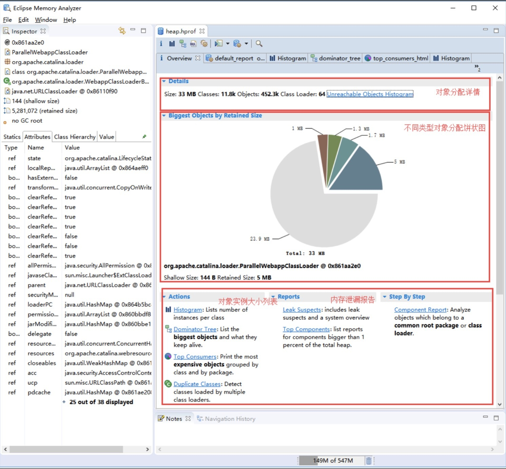

下面我们用一个实战案例来综合使用下刚刚介绍的几种工具，具体操作一下如何分析一个内存泄漏问题。

### 4.5.2 实战演练

我们平时遇到的内存溢出问题一般分为两种，一种是由于大峰值下没有限流，瞬间创建大量对象而导致的内存溢出；另一种则是由于内存泄漏而导致的内存溢出。使用限流，我们一般就可以解决第一种内存溢出问题，但其实很多时候，内存溢出往往是内存泄漏导致的，这种问题就是程序的BUG，我们需要及时找到问题代码。下面我模拟了一个内存泄漏导致的内存溢出案例，我们来实践一下。

我们知道，ThreadLocal的作用是提供线程的私有变量，这种变量可以在一个线程的整个生命周期中传递，可以减少一个线程在多个函数或类中创建公共变量来传递信息，避免了复杂度。但在使用时，如果ThreadLocal使用不恰当，就可能导致内存泄漏。

这个案例的场景就是ThreadLocal，下面我们模拟对每个线程设置一个本地变量。运行以下代码，系统一会儿就发送了内存溢出异常：

```java
@RequestMapping(value = "/test0")
    public String test0(HttpServletRequest request) {
        ThreadLocal<Byte[]> localVariable = new ThreadLocal<Byte[]>();
        localVariable.set(new Byte[4096*1024]);// 为线程添加变量
        return "success";
    }
```

在启动应用程序之前，我们可以通过HeapDumpOnOutOfMemoryError和HeapDumpPath这两个参数开启堆内存异常日志，通过以下命令启动应用程序：

```java
java -jar -Xms1000m -Xmx4000m -XX:+HeapDumpOnOutOfMemoryError -XX:HeapDumpPath=/tmp/heapdump.hprof  -XX:+PrintGCTimeStamps -XX:+PrintGCDetails -Xloggc:/tmp/heapTest.log heapTest-0.0.1-SNAPSHOT.jar
```

首先，请求test0链接10000次，这个时候我们请求test0的接口报异常了。

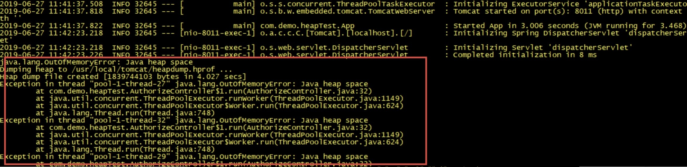

通过日志，我们很好分辨这是一个内存溢出异常。我们首先通过Linux系统命令查看进程在整个系统中内存的使用率是多少，最简单就是top命令了。

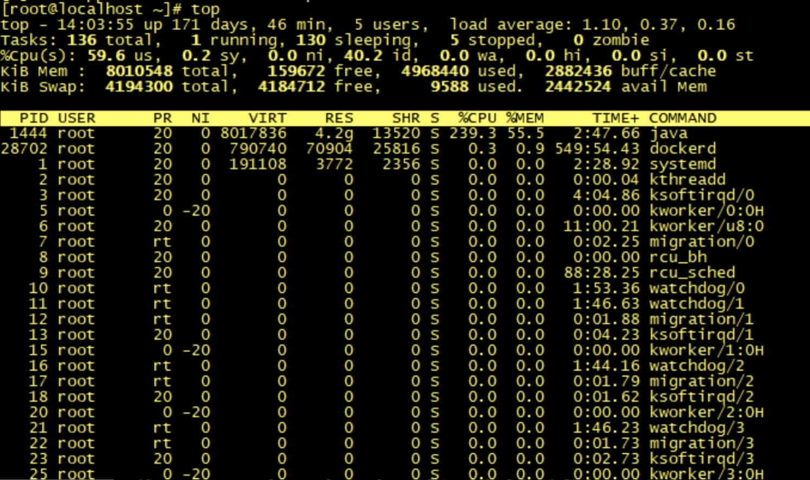

从top命令查看进程的内存使用情况，可以发现在机器只有8G内存且只分配了4G内存给Java进程的情况下，Java进程内存使用率已经达到了55%，再通过top -Hp pid查看具体线程占用系统资源情况。

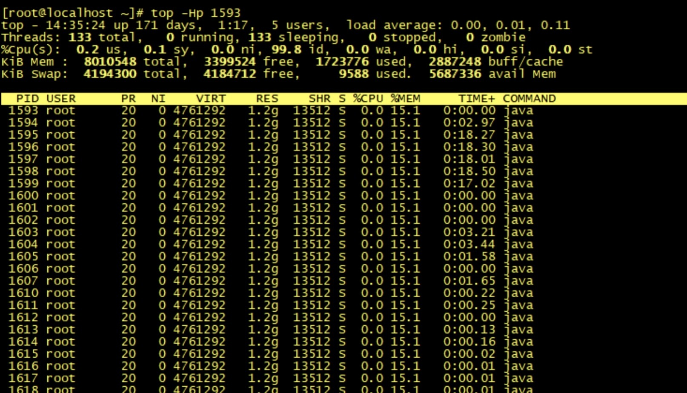

再通过jstack pid查看具体线程的堆栈信息，可以发现该线程一直处于 TIMED\_WAITING 状态，此时CPU使用率和负载并没有出现异常，我们可以排除死锁或I/O阻塞的异常问题了。

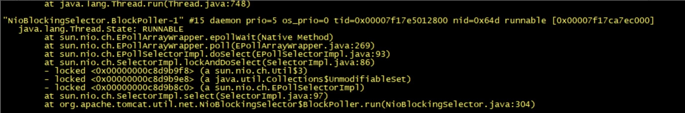

我们再通过jmap查看堆内存的使用情况，可以发现，老年代的使用率几乎快占满了，而且内存一直得不到释放：

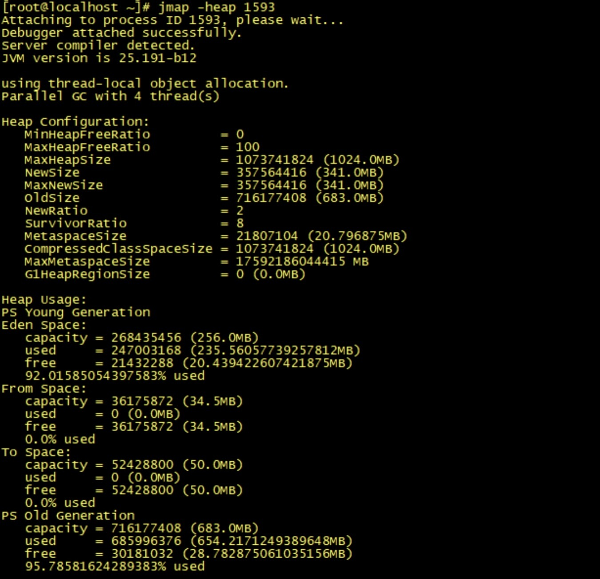

通过以上堆内存的情况，我们基本可以判断系统发生了内存泄漏。下面我们就需要找到具体是什么对象一直无法回收，什么原因导致了内存泄漏。我们需要查看具体的堆内存对象，看看是哪个对象占用了堆内存，可以通过jmap查看存活对象的数量：

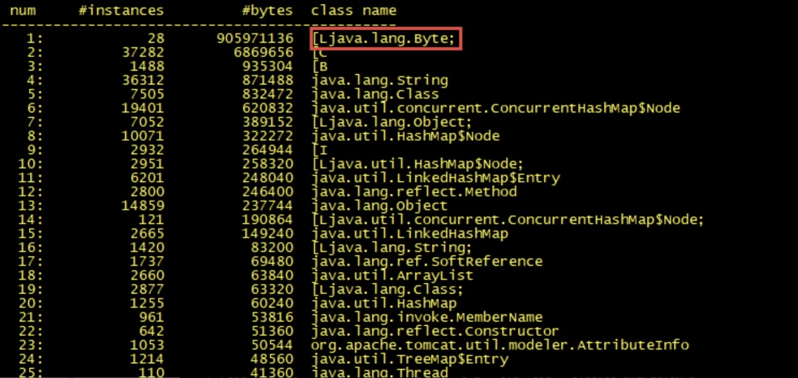

Byte对象占用内存明显异常，说明代码中Byte对象存在内存泄漏，我们在启动时，已经设置了dump文件，通过MAT打开dump的内存日志文件，我们可以发现MAT已经提示了byte内存异常：

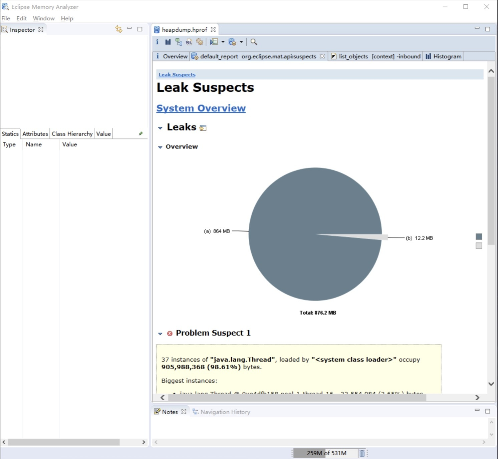

再点击进入到Histogram页面，可以查看到对象数量排序，我们可以看到Byte[]数组排在了第一位，选中对象后右击选择with incomming reference功能，可以查看到具体哪个对象引用了这个对象。

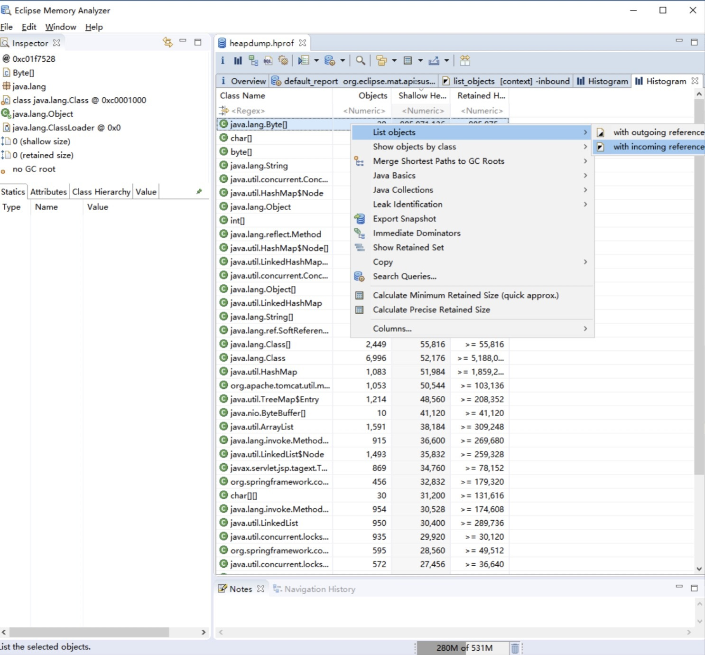

在这里我们就可以很明显地查看到是ThreadLocal这块的代码出现了问题。

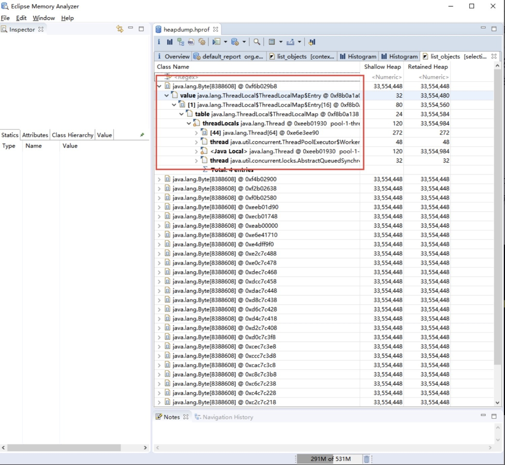

### 4.5.3 总结

在一些比较简单的业务场景下，排查系统性能问题相对来说简单，且容易找到具体原因。但在一些复杂的业务场景下，或是一些开源框架下的源码问题，相对来说就很难排查了，有时候通过工具只能猜测到可能是某些地方出现了问题，而实际排查则要结合源码做具体分析。可以说没有捷径，排查线上的性能问题本身就不是一件很简单的事情，除了将今天介绍的这些工具融会贯通，还需要我们不断地去累积经验，真正做到性能调优。

**思考题:** 除了以上我讲到的那些排查内存性能瓶颈的工具之外，你知道要在代码中对JVM的内存进行监控，常用的方法是什么？

### 4.5.4 补充

在 macOS 上，有多种工具可以帮助你查看和分析垃圾回收（GC）行为。这些工具可以是 JVM 提供的内置工具、独立的分析工具，甚至是一些第三方监控和分析平台。

#### JVM 内置工具

1. **jconsole**：

   - Java 自带的监控工具，用于连接到 JVM 并监控其性能，包括内存使用、线程状态和 GC 活动。
   - 启动方法：
     ```bash
     jconsole
     ```
   - 接下来通过选择本地或远程 JVM 进行连接，然后可以查看内存使用情况和 GC 活动。
2. **VisualVM**：

   - 图形化的性能监控和分析工具，可以用于监控 CPU、内存、线程和 GC 活动。
   - 下载地址：[VisualVM](https://visualvm.github.io/)
   - 启动后，选择你想监控的 JVM 实例，并查看 GC 活动以及其他详细信息。
3. **jstat**：

   - Java 提供的一个命令行工具，用于监控 JVM 性能，包括 GC 行为。
   - 常用命令：
     ```bash
     jstat -gc <pid> 1000  # 每秒钟显示一次 GC 数据
     ```

#### 独立分析工具

1. **Eclipse MAT (Memory Analyzer Tool)**：

   - 专业的 Java 堆分析工具，主要用于分析内存泄漏和查看对象的内存占用情况。
   - 下载地址：[Eclipse MAT](http://www.eclipse.org/mat/)
   - 可以分析 `.hprof` 文件，帮助识别 GC 活动频繁的原因。
2. **YourKit Java Profiler**：

   - 强大的性能剖析工具，提供深入的 CPU 和内存分析，包括 GC 分析。
   - 下载地址：[YourKit Java Profiler](https://www.yourkit.com/)
   - 提供详细的 GC 活动、内存分配和线程分析视图。
3. **JProfiler**：

   - 一款集成化的性能剖析工具，支持线程分布、内存分配、GC 分析等功能。
   - 下载地址：[JProfiler](https://www.ej-technologies.com/products/jprofiler/overview.html)
   - 提供了有关 GC 的详细可视化信息，并与各种 IDE 兼容。

#### 第三方监控和分析平台

1. **Prometheus + Grafana**：

   - Prometheus 可以收集 JVM 的 GC 指标数据，Grafana 可以用来可视化这些数据。
   - 使用 [jmx_exporter](https://github.com/prometheus/jmx_exporter) 来从 JVM 中提取数据。
   - 配置好 jmx_exporter 之后，你可以创建自定义的 Grafana 仪表板来监控 GC 活动。
2. **AppDynamics**：

   - 强大的应用性能管理工具，提供全面的 GC 数据监控功能。
   - 下载地址：[AppDynamics](https://www.appdynamics.com/)
   - 支持自动探测 GC 活动并提供详细的性能分析报告。
3. **New Relic**：

   - 另一款流行的应用性能管理工具，提供 JVM 的性能监控和 GC 活动分析。
   - 下载地址：[New Relic](https://newrelic.com/)
   - 提供实时 GC 活动监控和历史数据分析功能。

#### 命令行工具

1. **gcutil**：

   - Google 提供的用于分析 Java GC 日志的工具，可以生成 HTML 报告。
   - 下载地址：[GCViewer](https://github.com/chewiebug/GCViewer)
2. **GCEasy**：

   - 在线 GC 日志分析工具，可以将 GC 日志文件上传后获得详细的分析报告。
   - 访问地址：[GCEasy.io](https://gceasy.io/)

#### 示例：使用 `jstat` 监控 GC

```bash
# 首先找到 JVM 进程 ID
jps -l

# 然后使用 `jstat` 监控 GC 活动
jstat -gc <pid> 1000  # 每秒钟刷新一次 GC 数据
```

```plaintext
 S0C    S1C    S0U    S1U      EC       EU        OC         OU        MC     MU      CCSC   CCSU   YGC   YGCT   FGC    FGCT     GCT   
1024.0 1024.0  0.0    0.0     8192.0   8192.0    20480.0    10240.0    4480.0 4169.5  550.0  489.4   20    0.104   3      0.042    0.146
```

- `S0C`, `S1C`：新生代的两个 Survivor 空间大小。
- `S0U`, `S1U`：新生代的两个 Survivor 空间使用量。
- `EC`：Eden 空间大小。
- `EU`：Eden 空间使用量。
- `OC`：老年代空间大小。
- `OU`：老年代空间使用量。
- `MC`：方法区空间大小。
- `MU`：方法区空间使用量。
- `CCSC`：压缩类空间大小。
- `CCSU`：压缩类空间使用量。
- `YGC`：年轻代 GC 次数。
- `YGCT`：年轻代 GC 时间。
- `FGC`：完全 GC 次数。
- `FGCT`：完全 GC 时间。
- `GCT`：GC 总时间。


## 4.6 答疑课堂:模块四热点问题解答

- 字符串常量不是在 java8 中已经被放入到堆中了吗,应该不在方法区中了,但是看到老师的图中还在方法区中

  - 很多同学都问到了类似“黑夜里的猫"问到的问题，所以我来集中回复一下。JVM的内存模型只是一个规范，方法区也是一个规范，一个逻辑分区，并不是一个物理空间，我们这里说的字符串常量放在堆内存空间中，是指实际的物理空间
- 请教一下, 1.8中类的元数据是放在元数据区还是方法区呢？看得有点晕

  - 元空间是属于方法区的，方法区只是一个逻辑分区，而元空间是具体实现。所以类的元数据是存放在元空间，逻辑上属于方法区。
- 栈上分配这里,对局部变量对象的大小是否有要求,毕竟栈的内存比较小

  - 这其实是因为由于 HotSpot 虚拟机目前的实现导致栈上分配实现比较复杂。
    栈上分配影响：
  - 1.java只有值传递,跨方法的局部变量在栈上分配的话,在现有栈实现上会影响栈的回收。
  - 2.栈属于线程所有,实现栈上分配,会消耗更多的内存。让java的多线程更吃内存。
  - 3.如果实现栈上分配,还需要GC作用会弱化很多吧。
  - 4.基类型栈上分配+引用类型堆分配-> 全栈上分配。这么实现的话
    hotspot 感觉全推翻了。


- 1.7及前的都还好说,毕竟大部分开发都拜读过 < 深入理解 jvm>。回归整体，记得有点模糊了，如果有错误还请老师指正。首先 cms 在 1.9 已经被标记为废弃，主要原因在于标记清除下的悬浮内存，导致内存空间碎片化,进而导致fullGC的发生。不过其并行执行垃圾回收的性能还是值得认可的，至少 1.9 后主推的G1在常规情况下也是不如它的效率好的。接下来，说下G1,拼G1的堆内存结构比较特殊,虽然也有年代划分,但从物理角度上却不一样。G1 将整块内存分配成若干个同等大小的reg。新生代(两个sub 区加 ed区)和老年代各自由不同数量的reg组成。垃圾回收的算法应该算是标记整理。所以其规避了cms内存碎片化的问题,大大降低了fullGC 的频率。所以它虽然常态性能略输于 cms 但却没有 cms 特殊情况下的极端性能问题,总体更稳定。值得一提的是G1中各代的内存区域里reg间不一定是连续的,所以对于cpu缓存加载机制并不是特别友好,而且大对象占据超过一个 reg时还带来内存浪费的问题。所以总的来说1.8 可以用 G1 但得考虑场景，首先这个内存空间要大,保证每个 reg 尽量大,以减少内存浪费,保守估计8g以上用g1。实际公司很少会去升级jdk版本,大部分都是1.8, 好在oracle一些1.91011 12 的特性都有以补丁的方式落到1.8。所以1.8还是比较安全实用的,虽然我们公司还是 1.7，推不动哈。

  - 非常赞，Region这块，Jxin同学讲解得很到位。这里我再总结下CMS和G1的一些知识点。  CMS垃圾收集器是基于标记清除算法实现的，目前主要用于老年代垃圾回收。CMS收集器的GC周期主要由7个阶段组成，其中有两个阶段会发生stop-the-world，其它阶段都是并发执行的。
  - 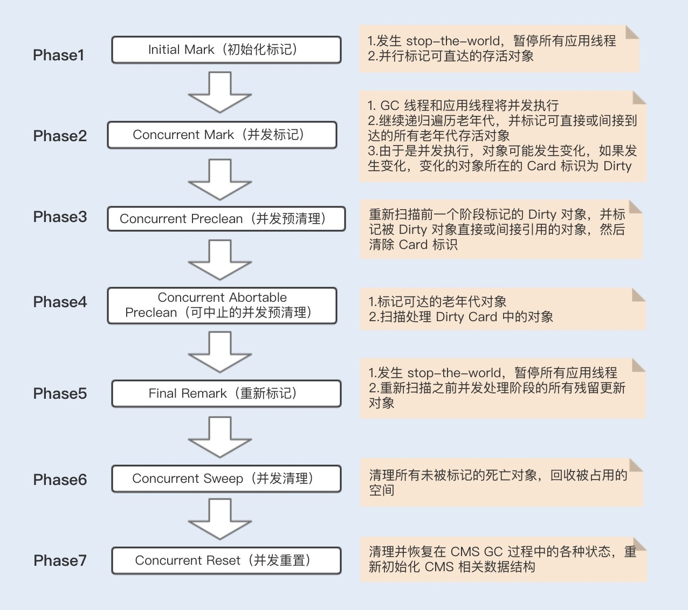
  - G1垃圾收集器是基于标记整理算法实现的，是一个分代垃圾收集器，既负责年轻代，也负责老年代的垃圾回收。跟之前各个分代使用连续的虚拟内存地址不一样，G1使用了一种 Region 方式对堆内存进行了划分，同样也分年轻代、老年代，但每一代使用的是N个不连续的Region内存块，每个Region占用一块连续的虚拟内存地址。在G1中，还有一种叫 Humongous 区域，用于存储特别大的对象。G1内部做了一个优化，一旦发现没有引用指向巨型对象，则可直接在年轻代的YoungGC中被回收掉。
  - 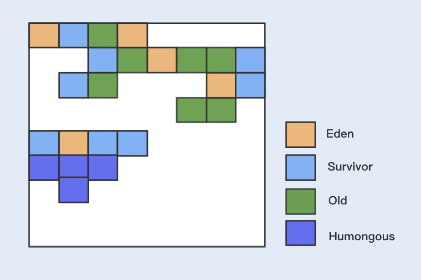
  - G1分为Young GC、Mix GC以及Full GC。G1 Young GC主要是在Eden区进行，当Eden区空间不足时，则会触发一次Young GC。将Eden区数据移到Survivor空间时，如果Survivor空间不足，则会直接晋升到老年代。此时Survivor的数据也会晋升到老年代。Young GC的执行是并行的，期间会发生STW。当堆空间的占用率达到一定阈值后会触发G1 Mix GC（阈值由命令参数-XX:InitiatingHeapOccupancyPercent设定，默认值45），Mix GC主要包括了四个阶段，其中只有并发标记阶段不会发生STW，其它阶段均会发生STW。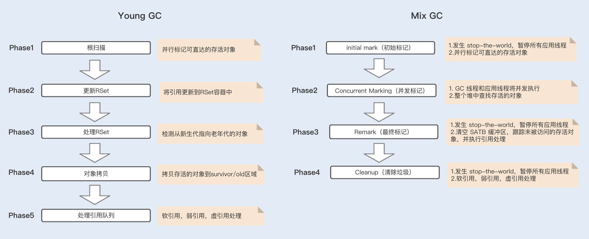
  - G1和CMS主要的区别在于：
    - CMS主要集中在老年代的回收，而G1集中在分代回收，包括了年轻代的Young GC以及老年代的Mix GC；
    - G1使用了Region方式对堆内存进行了划分，且基于标记整理算法实现，整体减少了垃圾碎片的产生；
    - 在初始化标记阶段，搜索可达对象使用到的Card Table，其实现方式不一样。
  - 这里我简单解释下Card Table，在垃圾回收的时候都是从Root开始搜索，这会先经过年轻代再到老年代，也有可能老年代引用到年轻代对象，如果发生Young GC，除了从年轻代扫描根对象之外，还需要再从老年代扫描根对象，确认引用年轻代对象的情况。
  - 这种属于跨代处理，非常消耗性能。为了避免在回收年轻代时跨代扫描整个老年代，CMS和G1都用到了Card Table来记录这些引用关系。只是G1在Card Table的基础上引入了RSet，每个Region初始化时，都会初始化一个RSet，RSet记录了其它Region中的对象引用本Region对象的关系。
  - 除此之外，CMS和G1在解决并发标记时漏标的方式也不一样，CMS使用的是Incremental Update算法，而G1使用的是SATB算法。首先，我们要了解在并发标记中，G1和CMS都是基于三色标记算法来实现的：
    - 黑色：根对象，或者对象和对象中的子对象都被扫描；
    - 灰色：对象本身被扫描，但还没扫描对象中的子对象；
    - 白色：不可达对象。
  - 基于这种标记有一个漏标的问题，也就是说，当一个白色标记对象，在垃圾回收被清理掉时，正好有一个对象引用了该白色标记对象，此时由于被回收掉了，就会出现对象丢失的问题。为了避免上述问题，CMS采用了Incremental Update算法，只要在写屏障（write barrier）里发现一个白对象的引用被赋值到一个黑对象的字段里，那就把这个白对象变成灰色的。而在G1中，采用的是SATB算法，该算法认为开始时所有能遍历到的对象都是需要标记的，即认为都是活的。G1具备Pause Prediction Model ，即停顿预测模型。用户可以设定整个GC过程中期望的停顿时间，用参数-XX:MaxGCPauseMillis可以指定一个G1收集过程的目标停顿时间，默认值200ms。G1会根据这个模型统计出来的历史数据，来预测一次垃圾回收所需要的Region数量，通过控制Region数来控制目标停顿时间的实现。


- minor gc是否会导致stop theworld?major gc什么时候会发生，它和full gc 的区别是什么？

  - 不管什么GC，都会发送stop-the-world，区别是发生的时间长短。而这个时间跟垃圾收集器又有关系，Serial、PartNew、Parallel Scavenge收集器无论是串行还是并行，都会挂起用户线程，而CMS和G1在并发标记时，是不会挂起用户线程的，但其它时候一样会挂起用户线程，stop the world 的时间相对来说就小很多了。
  - Major Gc 在很多参考资料中是等价于 Full GC的，我们也可以发现很多性能监测工具中只有Minor GC 和 Full GC。一般情况下，一次Full GC将会对年轻代、老年代、元空间以及堆外内存进行垃圾回收。触发Full GC的原因有很多：
    - 当年轻代晋升到老年代的对象大小，并比目前老年代剩余的空间大小还要大时，会触发Full GC；
    - 当老年代的空间使用率超过某阈值时，会触发Full GC；
    - 当元空间不足时（JDK1.7永久代不足），也会触发Full GC；
    - 当调用System.gc()也会安排一次Full GC。
- 老师看完有两个疑问,第一怎么查看 minor gc回收之后eden区存活对象 的多少,第二jmap-heap pid在图中只能看年轻代parallel gc看不到老年代的是什么垃圾回收器。对于提问cms垃圾回收器还是分老年代和年轻代回收分多个阶段有和程序并行的阶 段也有 stop the world 阶段 回收一整块老年代时间比较久,而gc把年轻代和老年代也有划分,不过拆成一个 region了,对region的回收成本低,而且会判断那些region回收的对象更多,而且cms要经过多次full gc才可能把不用的内存归还给操作系统，而g1只需要一次full gc就可以

  - 接下来解答 ninghtmare 的提问。我们可以通过 jstat -gc pid interval 查看每次GC之后，具体每一个分区的内存使用率变化情况。我们可以通过JVM的设置参数，来查看垃圾收集器的具体设置参数，使用的方式有很多，例如 jcmd pid VM.flags 就可以查看到相关的设置参数。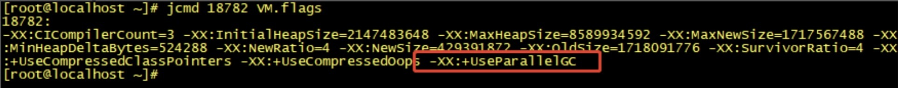
  - 这里附上第22讲中，我总结的各个设置参数对应的垃圾收集器图表。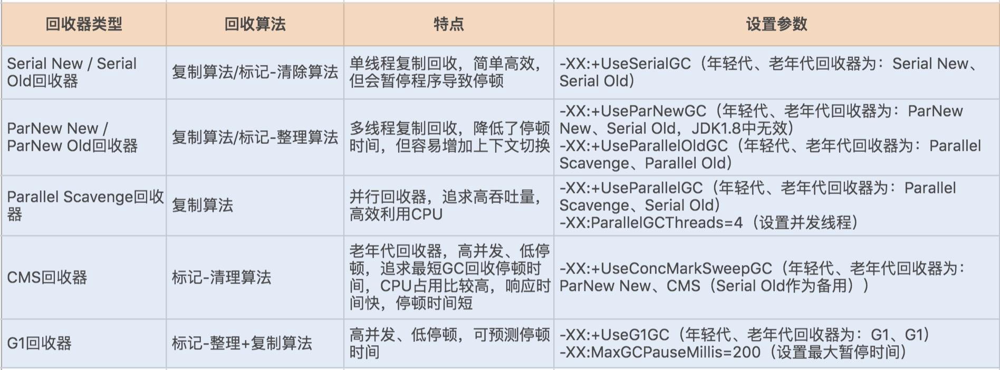
  - 当第一次创建对象的时候eden空间不足会进行一次minor gc把存活的对象放到from s区。如果这个时候from s 放不下。会发生一次担保进入老年代吗？当一次创建对象的时候eden空间不足进入 from s 区。当第二次创建对象的时候 eden 空间又不足了，这个时候 会把, eden和第一次存在from s区的对象进行gc存活的放在to s区,to s 区空间不足，进行担保放入老年代？这样的理解对吗。

    - 对的。前提是老年代有足够接受这些对象的空间，才会进行分配担保。如果老年代剩余空间小于每次Minor GC晋升到老年代的平均值，则会发起一次 Full GC。
  - AdaptiveSizePolicy这个参数是不是不太智能啊?我项目4G内存默认开 启的AdaptiveSizePolicy,发现只给年轻代分配了136M内存。平时运行到没啥问题,没到定时任务的点就频繁FGC,每次定时任务执行完,都会往老年代推40多M,一天会堆300多M到老年代,也不见它把年轻代调大。用的parNew+CMS。后来把年轻代调整到1G(单次YGC耗时从20ms增加到了40ms),每天老年代内存涨20M 左右。

    - 这个会根据我们创建对象占用的内存使用率，合理分配内存，并不仅仅考虑对象晋升的问题，还会综合考虑回收停顿时间等因素。针对某些特殊场景，我们可以手动来调优配置。
  - 老师是否可以讲下如何避免 threadLocal 内存泄漏呢

    - 我们知道，ThreadLocal是基于ThreadLocalMap实现的，这个Map的Entry继承了WeakReference，而Entry对象中的key使用了WeakReference封装，也就是说Entry中的key是一个弱引用类型，而弱引用类型只能存活在下次GC之前。
    - 如果一个线程调用ThreadLocal的set设置变量，当前ThreadLocalMap则会新增一条记录，但由于发生了一次垃圾回收，此时的key值就会被回收，而value值依然存在内存中，由于当前线程一直存在，所以value值将一直被引用。
    - 这些被垃圾回收掉的key就会一直存在一条引用链的关系：Thread --> ThreadLocalMap–>Entry–>Value。这条引用链会导致Entry不会被回收，Value也不会被回收，但Entry中的key却已经被回收的情况发生，从而造成内存泄漏。我们只需要在使用完该key值之后，将value值通过remove方法remove掉，就可以防止内存泄漏了。
  - 请问一下老师内存泄露和内存溢出具体有啥区别,有点不太理解内存泄露的概念。
  - 内存泄漏是指不再使用的对象无法得到及时的回收，持续占用内存空间，从而造成内存空间的浪费。例如，我在[第03讲](https://time.geekbang.org/column/article/97215)中说到的，Java6中substring方法就可能会导致内存泄漏。当调用substring方法时会调用new string构造函数，此时会复用原来字符串的char数组，而如果我们仅仅是用substring获取一小段字符，而在原本string字符串非常大的情况下，substring的对象如果一直被引用，由于substring里的char数组仍然指向原字符串，此时string字符串也无法回收，从而导致内存泄露。内存溢出则是发生了OutOfMemoryException，内存溢出的情况有很多，例如堆内存空间不足，栈空间不足，还有方法区空间不足等都会导致内存溢出。内存泄漏与内存溢出的关系：内存泄漏很容易导致内存溢出，但内存溢出不一定是内存泄漏导致的。


# 五、设计模式调优

## 5.1 单例模式:如何创建单一对象优化系统性能?

从这一讲开始，我们将一起探讨设计模式的性能调优。在《Design Patterns: Elements of Reusable Object-Oriented Software》一书中，有23种设计模式的描述，其中，单例设计模式是最常用的设计模式之一。无论是在开源框架，还是在我们的日常开发中，单例模式几乎无处不在。

### 5.1.1 什么是单例模式？

它的核心在于，单例模式可以保证一个类仅创建一个实例，并提供一个访问它的全局访问点。该模式有三个基本要点：一是这个类只能有一个实例；二是它必须自行创建这个实例；三是它必须自行向整个系统提供这个实例。

结合这三点，我们来实现一个简单的单例：

```
//饿汉模式
public final class Singleton {
    private static Singleton instance=new Singleton();//自行创建实例
    private Singleton(){}//构造函数
    public static Singleton getInstance(){//通过该函数向整个系统提供实例
        return instance;
    }
}
```

由于在一个系统中，一个类经常会被使用在不同的地方，通过单例模式，我们可以避免多次创建多个实例，从而节约系统资源。

### 5.1.2 饿汉模式

我们可以发现，以上第一种实现单例的代码中，使用了static修饰了成员变量instance，所以该变量会在类初始化的过程中被收集进类构造器即<clinit>方法中。在多线程场景下，JVM会保证只有一个线程能执行该类的<clinit>方法，其它线程将会被阻塞等待。等到唯一的一次<clinit>方法执行完成，其它线程将不会再执行<clinit>方法，转而执行自己的代码。也就是说，static修饰了成员变量instance，在多线程的情况下能保证只实例化一次。

这种方式实现的单例模式，在类初始化阶段就已经在堆内存中开辟了一块内存，用于存放实例化对象，所以也称为饿汉模式。饿汉模式实现的单例的优点是，可以保证多线程情况下实例的唯一性，而且getInstance直接返回唯一实例，性能非常高。然而，在类成员变量比较多，或变量比较大的情况下，这种模式可能会在没有使用类对象的情况下，一直占用堆内存。试想下，如果一个第三方开源框架中的类都是基于饿汉模式实现的单例，这将会初始化所有单例类，无疑是灾难性的。

### 5.1.3 懒汉模式

懒汉模式就是为了避免直接加载类对象时提前创建对象的一种单例设计模式。该模式使用懒加载方式，只有当系统使用到类对象时，才会将实例加载到堆内存中。通过以下代码，我们可以简单地了解下懒加载的实现方式：

```
//懒汉模式
public final class Singleton {
    private static Singleton instance= null;//不实例化
    private Singleton(){}//构造函数
    public static Singleton getInstance(){//通过该函数向整个系统提供实例
        if(null == instance){//当instance为null时，则实例化对象，否则直接返回对象
            instance = new Singleton();//实例化对象
        }
        return instance;//返回已存在的对象
    }
}
```

以上代码在单线程下运行是没有问题的，但要运行在多线程下，就会出现实例化多个类对象的情况。这是怎么回事呢？当线程A进入到if判断条件后，开始实例化对象，此时instance依然为null；又有线程B进入到if判断条件中，之后也会通过条件判断，进入到方法里面创建一个实例对象。所以我们需要对该方法进行加锁，保证多线程情况下仅创建一个实例。这里我们使用Synchronized同步锁来修饰getInstance方法：

```
//懒汉模式 + synchronized同步锁
public final class Singleton {
    private static Singleton instance= null;//不实例化
    private Singleton(){}//构造函数
    public static synchronized Singleton getInstance(){//加同步锁，通过该函数向整个系统提供实例
        if(null == instance){//当instance为null时，则实例化对象，否则直接返回对象
            instance = new Singleton();//实例化对象
        }
        return instance;//返回已存在的对象
    }
}
```

但我们前面讲过，同步锁会增加锁竞争，带来系统性能开销，从而导致系统性能下降，因此这种方式也会降低单例模式的性能。还有，每次请求获取类对象时，都会通过getInstance()方法获取，除了第一次为null，其它每次请求基本都是不为null的。在没有加同步锁之前，是因为if判断条件为null时，才导致创建了多个实例。基于以上两点，我们可以考虑将同步锁放在if条件里面，这样就可以减少同步锁资源竞争。

```
//懒汉模式 + synchronized同步锁
public final class Singleton {
    private static Singleton instance= null;//不实例化
    private Singleton(){}//构造函数
    public static Singleton getInstance(){//加同步锁，通过该函数向整个系统提供实例
        if(null == instance){//当instance为null时，则实例化对象，否则直接返回对象
          synchronized (Singleton.class){
              instance = new Singleton();//实例化对象
          } 
        }
        return instance;//返回已存在的对象
    }
}
```

看到这里，你是不是觉得这样就可以了呢？答案是依然会创建多个实例。这是因为当多个线程进入到if判断条件里，虽然有同步锁，但是进入到判断条件里面的线程依然会依次获取到锁创建对象，然后再释放同步锁。所以我们还需要在同步锁里面再加一个判断条件：

```
//懒汉模式 + synchronized同步锁 + double-check
public final class Singleton {
    private static Singleton instance= null;//不实例化
    private Singleton(){}//构造函数
    public static Singleton getInstance(){//加同步锁，通过该函数向整个系统提供实例
        if(null == instance){//第一次判断，当instance为null时，则实例化对象，否则直接返回对象
          synchronized (Singleton.class){//同步锁
             if(null == instance){//第二次判断
                instance = new Singleton();//实例化对象
             }
          } 
        }
        return instance;//返回已存在的对象
    }
}

```

以上这种方式，通常被称为Double-Check，它可以大大提高支持多线程的懒汉模式的运行性能。那这样做是不是就能保证万无一失了呢？还会有什么问题吗？其实这里又跟Happens-Before规则和重排序扯上关系了，这里我们先来简单了解下Happens-Before规则和重排序。

我们在第二期[加餐](https://time.geekbang.org/column/article/105756)中分享过，编译器为了尽可能地减少寄存器的读取、存储次数，会充分复用寄存器的存储值，比如以下代码，如果没有进行重排序优化，正常的执行顺序是步骤1/2/3，而在编译期间进行了重排序优化之后，执行的步骤有可能就变成了步骤1/3/2，这样就能减少一次寄存器的存取次数。

```
int a = 1;//步骤1：加载a变量的内存地址到寄存器中，加载1到寄存器中，CPU通过mov指令把1写入到寄存器指定的内存中
int b = 2;//步骤2 加载b变量的内存地址到寄存器中，加载2到寄存器中，CPU通过mov指令把2写入到寄存器指定的内存中
a = a + 1;//步骤3 重新加载a变量的内存地址到寄存器中，加载1到寄存器中，CPU通过mov指令把1写入到寄存器指定的内存中
```

在 JMM 中，重排序是十分重要的一环，特别是在并发编程中。如果JVM可以对它们进行任意排序以提高程序性能，也可能会给并发编程带来一系列的问题。例如，我上面讲到的Double-Check的单例问题，假设类中有其它的属性也需要实例化，这个时候，除了要实例化单例类本身，还需要对其它属性也进行实例化：

```
//懒汉模式 + synchronized同步锁 + double-check
public final class Singleton {
    private static Singleton instance= null;//不实例化
    public List<String> list = null;//list属性
    private Singleton(){
      list = new ArrayList<String>();
    }//构造函数
    public static Singleton getInstance(){//加同步锁，通过该函数向整个系统提供实例
        if(null == instance){//第一次判断，当instance为null时，则实例化对象，否则直接返回对象
          synchronized (Singleton.class){//同步锁
             if(null == instance){//第二次判断
                instance = new Singleton();//实例化对象
             }
          } 
        }
        return instance;//返回已存在的对象
    }
}
```

在执行instance = new Singleton();代码时，正常情况下，实例过程这样的：

* 给 Singleton 分配内存；
* 调用 Singleton 的构造函数来初始化成员变量；
* 将 Singleton 对象指向分配的内存空间（执行完这步 singleton 就为非 null 了）。

如果虚拟机发生了重排序优化，这个时候步骤3可能发生在步骤2之前。如果初始化线程刚好完成步骤3，而步骤2没有进行时，则刚好有另一个线程到了第一次判断，这个时候判断为非null，并返回对象使用，这个时候实际没有完成其它属性的构造，因此使用这个属性就很可能会导致异常。在这里，Synchronized只能保证可见性、原子性，无法保证执行的顺序。这个时候，就体现出Happens-Before规则的重要性了。通过字面意思，你可能会误以为是前一个操作发生在后一个操作之前。然而真正的意思是，前一个操作的结果可以被后续的操作获取。这条规则规范了编译器对程序的重排序优化。我们知道volatile关键字可以保证线程间变量的可见性，简单地说就是当线程A对变量X进行修改后，在线程A后面执行的其它线程就能看到变量X的变动。除此之外，volatile在JDK1.5之后还有一个作用就是阻止局部重排序的发生，也就是说，volatile变量的操作指令都不会被重排序。所以使用volatile修饰instance之后，Double-Check懒汉单例模式就万无一失了。

```
//懒汉模式 + synchronized同步锁 + double-check
public final class Singleton {
    private volatile static Singleton instance= null;//不实例化
    public List<String> list = null;//list属性
    private Singleton(){
      list = new ArrayList<String>();
    }//构造函数
    public static Singleton getInstance(){//加同步锁，通过该函数向整个系统提供实例
        if(null == instance){//第一次判断，当instance为null时，则实例化对象，否则直接返回对象
          synchronized (Singleton.class){//同步锁
             if(null == instance){//第二次判断
                instance = new Singleton();//实例化对象
             }
          } 
        }
        return instance;//返回已存在的对象
    }
}
```

### 5.1.4 通过内部类实现

以上这种同步锁+Double-Check的实现方式相对来说，复杂且加了同步锁，那有没有稍微简单一点儿的可以实现线程安全的懒加载方式呢？我们知道，在饿汉模式中，我们使用了static修饰了成员变量instance，所以该变量会在类初始化的过程中被收集进类构造器即\<clinit>方法中。在多线程场景下，JVM会保证只有一个线程能执行该类的\<clinit>方法，其它线程将会被阻塞等待。这种方式可以保证内存的可见性、顺序性以及原子性。

如果我们在Singleton类中创建一个内部类来实现成员变量的初始化，则可以避免多线程下重复创建对象的情况发生。这种方式，只有在第一次调用getInstance()方法时，才会加载InnerSingleton类，而只有在加载InnerSingleton类之后，才会实例化创建对象。具体实现如下：

```
//懒汉模式 内部类实现
public final class Singleton {
	public List<String> list = null;// list属性

	private Singleton() {//构造函数
		list = new ArrayList<String>();
	}

	// 内部类实现
	public static class InnerSingleton {
		private static Singleton instance=new Singleton();//自行创建实例
	}

	public static Singleton getInstance() {
		return InnerSingleton.instance;// 返回内部类中的静态变量
	}
}
```

### 5.1.5 总结

单例的实现方式其实有很多，但总结起来就两种：饿汉模式和懒汉模式，我们可以根据自己的需求来做选择。如果我们在程序启动后，一定会加载到类，那么用饿汉模式实现的单例简单又实用；如果我们是写一些工具类，则优先考虑使用懒汉模式，因为很多项目可能会引用到jar包，但未必会使用到这个工具类，懒汉模式实现的单例可以避免提前被加载到内存中，占用系统资源。

**思考题:**除了以上那些实现单例的方式，你还知道其它实现方式吗？

## 5.2 原型模式与享元模式:提升系统性能的利器

原型模式和享元模式，前者是在创建多个实例时，对创建过程的性能进行调优；后者是用减少创建实例的方式，来调优系统性能。这么看，你会不会觉得两个模式有点相互矛盾呢？其实不然，它们的使用是分场景的。在有些场景下，我们需要重复创建多个实例，例如在循环体中赋值一个对象，此时我们就可以采用原型模式来优化对象的创建过程；而在有些场景下，我们则可以避免重复创建多个实例，在内存中共享对象就好了。今天我们就来看看这两种模式的适用场景，了解了这些你就可以更高效地使用它们提升系统性能了。

### 5.2.1 原型模式

我们先来了解下原型模式的实现。原型模式是通过给出一个原型对象来指明所创建的对象的类型，然后使用自身实现的克隆接口来复制这个原型对象，该模式就是用这种方式来创建出更多同类型的对象。使用这种方式创建新的对象的话，就无需再通过new实例化来创建对象了。这是因为Object类的clone方法是一个本地方法，它可以直接操作内存中的二进制流，所以性能相对new实例化来说，更佳。

#### 实现原型模式

我们现在通过一个简单的例子来实现一个原型模式：

```
//实现Cloneable 接口的原型抽象类Prototype 
   class Prototype implements Cloneable {
        //重写clone方法
        public Prototype clone(){
            Prototype prototype = null;
            try{
                prototype = (Prototype)super.clone();
            }catch(CloneNotSupportedException e){
                e.printStackTrace();
            }
            return prototype;
        }
    }
    //实现原型类
    class ConcretePrototype extends Prototype{
        public void show(){
            System.out.println("原型模式实现类");
        }
    }

    public class Client {
        public static void main(String[] args){
            ConcretePrototype cp = new ConcretePrototype();
            for(int i=0; i< 10; i++){
                ConcretePrototype clonecp = (ConcretePrototype)cp.clone();
                clonecp.show();
            }
        }
    }
```

要实现一个原型类，需要具备三个条件：

* 实现Cloneable接口：Cloneable接口与序列化接口的作用类似，它只是告诉虚拟机可以安全地在实现了这个接口的类上使用clone方法。在JVM中，只有实现了Cloneable接口的类才可以被拷贝，否则会抛出CloneNotSupportedException异常。
* 重写Object类中的clone方法：在Java中，所有类的父类都是Object类，而Object类中有一个clone方法，作用是返回对象的一个拷贝。
* 在重写的clone方法中调用super.clone()：默认情况下，类不具备复制对象的能力，需要调用super.clone()来实现。

从上面我们可以看出，原型模式的主要特征就是使用clone方法复制一个对象。通常，有些人会误以为 Object a=new Object();Object b=a; 这种形式就是一种对象复制的过程，然而这种复制只是对象引用的复制，也就是a和b对象指向了同一个内存地址，如果b修改了，a的值也就跟着被修改了。我们可以通过一个简单的例子来看看普通的对象复制问题：

```java
class Student {  
    private String name;  
  
    public String getName() {  
        return name;  
    }  
  
    public void setName(String name) {  
        this.name= name;  
    }  
  
}  
public class Test {  
  
    public static void main(String args[]) {  
        Student stu1 = new Student();  
        stu1.setName("test1");  

        Student stu2 = stu1;  
        stu2.setName("test2");  
 
        System.out.println("学生1:" + stu1.getName());  
        System.out.println("学生2:" + stu2.getName());  
    }  
}
```

如果是复制对象，此时打印的日志应该为：

```
学生1:test1
学生2:test2
```

然而，实际上是：

```
学生1:test2
学生2:test2
```

通过clone方法复制的对象才是真正的对象复制，clone方法赋值的对象完全是一个独立的对象。刚刚讲过了，Object类的clone方法是一个本地方法，它直接操作内存中的二进制流，特别是复制大对象时，性能的差别非常明显。我们可以用 clone 方法再实现一遍以上例子。

```java
//学生类实现Cloneable接口
class Student implements Cloneable{  
    private String name;  //姓名
  
    public String getName() {  
        return name;  
    }  
  
    public void setName(String name) {  
        this.name= name;  
    } 
   //重写clone方法
   public Student clone() { 
        Student student = null; 
        try { 
            student = (Student) super.clone(); 
            } catch (CloneNotSupportedException e) { 
            e.printStackTrace(); 
            } 
            return student; 
   } 
  
}  
public class Test {  
  
    public static void main(String args[]) {  
        Student stu1 = new Student();  //创建学生1
        stu1.setName("test1");  

        Student stu2 = stu1.clone();  //通过克隆创建学生2
        stu2.setName("test2");  
 
        System.out.println("学生1:" + stu1.getName());  
        System.out.println("学生2:" + stu2.getName());  
    }  
}
```

运行结果：

```
学生1:test1
学生2:test2
```

#### 深拷贝和浅拷贝

在调用super.clone()方法之后，首先会检查当前对象所属的类是否支持clone，也就是看该类是否实现了Cloneable接口。如果支持，则创建当前对象所属类的一个新对象，并对该对象进行初始化，使得新对象的成员变量的值与当前对象的成员变量的值一模一样，但对于其它对象的引用以及List等类型的成员属性，则只能复制这些对象的引用了。所以简单调用super.clone()这种克隆对象方式，就是一种浅拷贝。所以，当我们在使用clone()方法实现对象的克隆时，就需要注意浅拷贝带来的问题。我们再通过一个例子来看看浅拷贝。

```
//定义学生类
class Student implements Cloneable{  
    private String name; //学生姓名
    private Teacher teacher; //定义老师类
  
    public String getName() {  
        return name;  
    }  
  
    public void setName(String name) {  
        this.name = name;  
    } 

    public Teacher getTeacher() {  
        return teacher;  
    }  
  
    public void setTeacher(Teacher teacher) {  
        this.teacher = teacher;  
    } 
   //重写克隆方法
   public Student clone() { 
        Student student = null; 
        try { 
            student = (Student) super.clone(); 
            } catch (CloneNotSupportedException e) { 
            e.printStackTrace(); 
            } 
            return student; 
   } 
      
}  

//定义老师类
class Teacher implements Cloneable{  
    private String name;  //老师姓名
  
    public String getName() {  
        return name;  
    }  
  
    public void setName(String name) {  
        this.name= name;  
    } 

   //重写克隆方法，堆老师类进行克隆
   public Teacher clone() { 
        Teacher teacher= null; 
        try { 
            teacher= (Teacher) super.clone(); 
            } catch (CloneNotSupportedException e) { 
            e.printStackTrace(); 
            } 
            return student; 
   } 
      
}
public class Test {  
      
    public static void main(String args[]) {
        Teacher teacher = new Teacher (); //定义老师1
        teacher.setName("刘老师");
        Student stu1 = new Student();  //定义学生1
        stu1.setName("test1");           
        stu1.setTeacher(teacher);
        
        Student stu2 = stu1.clone(); //定义学生2
        stu2.setName("test2");  
        stu2.getTeacher().setName("王老师");//修改老师
        System.out.println("学生" + stu1.getName + "的老师是:" + stu1.getTeacher().getName);  
        System.out.println("学生" + stu1.getName + "的老师是:" + stu2.getTeacher().getName);  
    }  
}
```

运行结果：

```
学生test1的老师是：王老师
学生test2的老师是：王老师
```

观察以上运行结果，我们可以发现：在我们给学生2修改老师的时候，学生1的老师也跟着被修改了。这就是浅拷贝带来的问题。

我们可以通过深拷贝来解决这种问题，其实深拷贝就是基于浅拷贝来递归实现具体的每个对象，代码如下：

```
   public Student clone() { 
        Student student = null; 
        try { 
            student = (Student) super.clone(); 
            Teacher teacher = this.teacher.clone();//克隆teacher对象
            student.setTeacher(teacher);
            } catch (CloneNotSupportedException e) { 
            e.printStackTrace(); 
            } 
            return student; 
   } 
```

#### 适用场景

前面我详述了原型模式的实现原理，那到底什么时候我们要用它呢？在一些重复创建对象的场景下，我们就可以使用原型模式来提高对象的创建性能。例如，我在开头提到的，循环体内创建对象时，我们就可以考虑用clone的方式来实现。

例如：

```
for(int i=0; i<list.size(); i++){
  Student stu = new Student(); 
  ...
}

```

我们可以优化为：

```
Student stu = new Student(); 
for(int i=0; i<list.size(); i++){
 Student stu1 = (Student)stu.clone();
  ...
}
```

除此之外，原型模式在开源框架中的应用也非常广泛。例如Spring中，@Service默认都是单例的。用了私有全局变量，若不想影响下次注入或每次上下文获取bean，就需要用到原型模式，我们可以通过以下注解来实现，@Scope(“prototype”)。

### 5.2.2 享元模式

享元模式是运用共享技术有效地最大限度地复用细粒度对象的一种模式。该模式中，以对象的信息状态划分，可以分为内部数据和外部数据。内部数据是对象可以共享出来的信息，这些信息不会随着系统的运行而改变；外部数据则是在不同运行时被标记了不同的值。

享元模式一般可以分为三个角色，分别为 Flyweight（抽象享元类）、ConcreteFlyweight（具体享元类）和 FlyweightFactory（享元工厂类）。抽象享元类通常是一个接口或抽象类，向外界提供享元对象的内部数据或外部数据；具体享元类是指具体实现内部数据共享的类；享元工厂类则是主要用于创建和管理享元对象的工厂类。

#### 实现享元模式

我们还是通过一个简单的例子来实现一个享元模式：

```
//抽象享元类
interface Flyweight {
    //对外状态对象
    void operation(String name);
    //对内对象
    String getType();
}
```

```
//具体享元类
class ConcreteFlyweight implements Flyweight {
    private String type;

    public ConcreteFlyweight(String type) {
        this.type = type;
    }

    @Override
    public void operation(String name) {
        System.out.printf("[类型(内在状态)] - [%s] - [名字(外在状态)] - [%s]\n", type, name);
    }

    @Override
    public String getType() {
        return type;
    }
}
```

```
//享元工厂类
class FlyweightFactory {
    private static final Map<String, Flyweight> FLYWEIGHT_MAP = new HashMap<>();//享元池，用来存储享元对象

    public static Flyweight getFlyweight(String type) {
        if (FLYWEIGHT_MAP.containsKey(type)) {//如果在享元池中存在对象，则直接获取
            return FLYWEIGHT_MAP.get(type);
        } else {//在响应池不存在，则新创建对象，并放入到享元池
            ConcreteFlyweight flyweight = new ConcreteFlyweight(type);
            FLYWEIGHT_MAP.put(type, flyweight);
            return flyweight;
        }
    }
}
```

```
public class Client {

    public static void main(String[] args) {
        Flyweight fw0 = FlyweightFactory.getFlyweight("a");
        Flyweight fw1 = FlyweightFactory.getFlyweight("b");
        Flyweight fw2 = FlyweightFactory.getFlyweight("a");
        Flyweight fw3 = FlyweightFactory.getFlyweight("b");
        fw1.operation("abc");
        System.out.printf("[结果(对象对比)] - [%s]\n", fw0 == fw2);
        System.out.printf("[结果(内在状态)] - [%s]\n", fw1.getType());
    }
}
```

输出结果：

```
[类型(内在状态)] - [b] - [名字(外在状态)] - [abc]
[结果(对象对比)] - [true]
[结果(内在状态)] - [b]
```

观察以上代码运行结果，我们可以发现：如果对象已经存在于享元池中，则不会再创建该对象了，而是共用享元池中内部数据一致的对象。这样就减少了对象的创建，同时也节省了同样内部数据的对象所占用的内存空间。

#### 适用场景

享元模式在实际开发中的应用也非常广泛。例如Java的String字符串，在一些字符串常量中，会共享常量池中字符串对象，从而减少重复创建相同值对象，占用内存空间。代码如下：

```
 String s1 = "hello";
 String s2 = "hello";
 System.out.println(s1==s2);//true
```

还有，在日常开发中的应用。例如，线程池就是享元模式的一种实现；将商品存储在应用服务的缓存中，那么每当用户获取商品信息时，则不需要每次都从redis缓存或者数据库中获取商品信息，并在内存中重复创建商品信息了。

### 5.2.3 总结

通过以上讲解，相信你对原型模式和享元模式已经有了更清楚的了解了。两种模式无论是在开源框架，还是在实际开发中，应用都十分广泛。在不得已需要重复创建大量同一对象时，我们可以使用原型模式，通过clone方法复制对象，这种方式比用new和序列化创建对象的效率要高；在创建对象时，如果我们可以共用对象的内部数据，那么通过享元模式共享相同的内部数据的对象，就可以减少对象的创建，实现系统调优。

**思考题:**

上一讲的单例模式和这一讲的享元模式都是为了避免重复创建对象，你知道这两者的区别在哪儿吗？

**解答：**

* 单例模式：确保一个类在程序中只有一个实例，提供全局访问点。
* 享元模式：通过共享技术有效支持大量细粒度对象的复用，优化内存使用。

两者的核心区别在于意图和实现方式，单例模式关注于单一实例的全局性，而享元模式关注于共享对象的复用性和内存优化。

## 5.3 如何使用设计模式优化并发编程？

在我们使用多线程编程时，很多时候需要根据业务场景设计一套业务功能。其实，在多线程编程中，本身就存在很多成熟的功能设计模式，学好它们，用好它们，那就是如虎添翼了。今天我就带你了解几种并发编程中常用的设计模式。

### 5.3.1 线程上下文设计模式

线程上下文是指贯穿线程整个生命周期的对象中的一些全局信息。例如，我们比较熟悉的Spring中的ApplicationContext就是一个关于上下文的类，它在整个系统的生命周期中保存了配置信息、用户信息以及注册的bean等上下文信息。这样的解释可能有点抽象，我们不妨通过一个具体的案例，来看看到底在什么的场景下才需要上下文呢？

在执行一个比较长的请求任务时，这个请求可能会经历很多层的方法调用，假设我们需要将最开始的方法的中间结果传递到末尾的方法中进行计算，一个简单的实现方式就是在每个函数中新增这个中间结果的参数，依次传递下去。代码如下：

```java
public class ContextTest {

	// 上下文类
	public class Context {
		private String name;
		private long id

		public long getId() {
			return id;
		}

		public void setId(long id) {
			this.id = id;
		}

		public String getName() {
			return this.name;
		}

		public void setName(String name) {
			this.name = name;
		}
	}

	// 设置上下文名字
	public class QueryNameAction {
		public void execute(Context context) {
			try {
				Thread.sleep(1000L);
				String name = Thread.currentThread().getName();
				context.setName(name);
			} catch (InterruptedException e) {
				e.printStackTrace();
			}
		}
	}

	// 设置上下文ID
	public class QueryIdAction {
		public void execute(Context context) {
			try {
				Thread.sleep(1000L);
				long id = Thread.currentThread().getId();
				context.setId(id);
			} catch (InterruptedException e) {
				e.printStackTrace();
			}
		}
	}

	// 执行方法
	public class ExecutionTask implements Runnable {

		private QueryNameAction queryNameAction = new QueryNameAction();
		private QueryIdAction queryIdAction = new QueryIdAction();

		@Override
		public void run() {
			final Context context = new Context();
			queryNameAction.execute(context);
			System.out.println("The name query successful");
			queryIdAction.execute(context);
			System.out.println("The id query successful");

			System.out.println("The Name is " + context.getName() + " and id " + context.getId());
		}
	}

	public static void main(String[] args) {
		IntStream.range(1, 5).forEach(i -> new Thread(new ContextTest().new ExecutionTask()).start());
	}
}
```

执行结果：

```
The name query successful
The name query successful
The name query successful
The name query successful
The id query successful
The id query successful
The id query successful
The id query successful
The Name is Thread-1 and id 11
The Name is Thread-2 and id 12
The Name is Thread-3 and id 13
The Name is Thread-0 and id 10
```

然而这种方式太笨拙了，每次调用方法时，都需要传入Context作为参数，而且影响一些中间公共方法的封装。那能不能设置一个全局变量呢？如果是在多线程情况下，需要考虑线程安全，这样的话就又涉及到了锁竞争。

除了以上这些方法，其实我们还可以使用ThreadLocal实现上下文。ThreadLocal是线程本地变量，可以实现多线程的数据隔离。ThreadLocal为每一个使用该变量的线程都提供一份独立的副本，线程间的数据是隔离的，每一个线程只能访问各自内部的副本变量。ThreadLocal中有三个常用的方法：set、get、initialValue，我们可以通过以下一个简单的例子来看看ThreadLocal的使用：

```
private void testThreadLocal() {
    Thread t = new Thread() {
        ThreadLocal<String> mStringThreadLocal = new ThreadLocal<String>();

        @Override
        public void run() {
            super.run();
            mStringThreadLocal.set("test");
            mStringThreadLocal.get();
        }
    };

    t.start();
}
```

接下来，我们使用ThreadLocal来重新实现最开始的上下文设计。你会发现，我们在两个方法中并没有通过变量来传递上下文，只是通过ThreadLocal获取了当前线程的上下文信息：

```java
public class ContextTest {
	// 上下文类
	public static class Context {
		private String name;
		private long id;

		public long getId() {
			return id;
		}

		public void setId(long id) {
			this.id = id;
		}

		public String getName() {
			return this.name;
		}

		public void setName(String name) {
			this.name = name;
		}
	}

	// 复制上下文到ThreadLocal中
	public final static class ActionContext {

		private static final ThreadLocal<Context> threadLocal = new ThreadLocal<Context>() {
			@Override
			protected Context initialValue() {
				return new Context();
			}
		};

		public static ActionContext getActionContext() {
			return ContextHolder.actionContext;
		}

		public Context getContext() {
			return threadLocal.get();
		}

		// 获取ActionContext单例
		public static class ContextHolder {
			private final static ActionContext actionContext = new ActionContext();
		}
	}

	// 设置上下文名字
	public class QueryNameAction {
		public void execute() {
			try {
				Thread.sleep(1000L);
				String name = Thread.currentThread().getName();
				ActionContext.getActionContext().getContext().setName(name);
			} catch (InterruptedException e) {
				e.printStackTrace();
			}
		} 
	}

	// 设置上下文ID
	public class QueryIdAction {
		public void execute() {
			try {
				Thread.sleep(1000L);
				long id = Thread.currentThread().getId();
				ActionContext.getActionContext().getContext().setId(id);
			} catch (InterruptedException e) {
				e.printStackTrace();
			}
		}
	}

	// 执行方法
	public class ExecutionTask implements Runnable {
		private QueryNameAction queryNameAction = new QueryNameAction();
		private QueryIdAction queryIdAction = new QueryIdAction();

		@Override
		public void run() {
			queryNameAction.execute();//设置线程名
			System.out.println("The name query successful");
			queryIdAction.execute();//设置线程ID
			System.out.println("The id query successful");

			System.out.println("The Name is " + ActionContext.getActionContext().getContext().getName() + " and id " + ActionContext.getActionContext().getContext().getId())
		}
	}

	public static void main(String[] args) {
		IntStream.range(1, 5).forEach(i -> new Thread(new ContextTest().new ExecutionTask()).start());
	}
}
```

**运行结果：**

```java
The name query successful
The name query successful
The name query successful
The name query successful
The id query successful
The id query successful
The id query successful
The id query successful
The Name is Thread-2 and id 12
The Name is Thread-0 and id 10
The Name is Thread-1 and id 11
The Name is Thread-3 and id 13
```

### 5.3.2 Thread-Per-Message设计模式

Thread-Per-Message设计模式翻译过来的意思就是每个消息一个线程的意思。例如，我们在处理Socket通信的时候，通常是一个线程处理事件监听以及I/O读写，如果I/O读写操作非常耗时，这个时候便会影响到事件监听处理事件。这个时候Thread-Per-Message模式就可以很好地解决这个问题，一个线程监听I/O事件，每当监听到一个I/O事件，则交给另一个处理线程执行I/O操作。下面，我们还是通过一个例子来学习下该设计模式的实现。

```java
//IO处理
public class ServerHandler implements Runnable{
	private Socket socket;
	 
    public ServerHandler(Socket socket) {
        this.socket = socket;
    }
  
    public void run() {
        BufferedReader in = null;
        PrintWriter out = null;
        String msg = null;
        try {
            in = new BufferedReader(new InputStreamReader(socket.getInputStream()));
            out = new PrintWriter(socket.getOutputStream(),true);
            while ((msg = in.readLine()) != null && msg.length()!=0) {//当连接成功后在此等待接收消息（挂起，进入阻塞状态）
                System.out.println("server received : " + msg);
                out.print("received~\n");
                out.flush();
            }
        } catch (Exception e) {
            e.printStackTrace();
        } finally {
        	try {
                in.close();
            } catch (IOException e) {
                e.printStackTrace();
            }
            try {
                out.close();
            } catch (Exception e) {
                e.printStackTrace();
            }
            try {
                socket.close();
            } catch (IOException e) {
                e.printStackTrace();
            }
        }
    }
}

```

```java
//Socket启动服务
public class Server {

	private static int DEFAULT_PORT = 12345;
	private static ServerSocket server;

	public static void start() throws IOException {
		start(DEFAULT_PORT);
	}

	public static void start(int port) throws IOException {
		if (server != null) {
			return;
		}

		try {
			//启动服务
			server = new ServerSocket(port);
			// 通过无线循环监听客户端连接
			while (true) {

				Socket socket = server.accept();
				// 当有新的客户端接入时，会执行下面的代码
				long start = System.currentTimeMillis();
				new Thread(new ServerHandler(socket)).start();

				long end = System.currentTimeMillis();

				System.out.println("Spend time is " + (end - start));
			}
		} finally {
			if (server != null) {
				System.out.println("服务器已关闭。");
				server.close();
			}

		}

	}

	public static void main(String[] args) throws InterruptedException{

		// 运行服务端
		new Thread(new Runnable() {
			public void run() {
				try {
					Server.start();
				} catch (IOException e) {
					e.printStackTrace();
				}
			}
		}).start();

	}
}

```

以上，我们是完成了一个使用Thread-Per-Message设计模式实现的Socket服务端的代码。但这里是有一个问题的，你发现了吗？使用这种设计模式，如果遇到大的高并发，就会出现严重的性能问题。如果针对每个I/O请求都创建一个线程来处理，在有大量请求同时进来时，就会创建大量线程，而此时JVM有可能会因为无法处理这么多线程，而出现内存溢出的问题。

退一步讲，即使是不会有大量线程的场景，每次请求过来也都需要创建和销毁线程，这对系统来说，也是一笔不小的性能开销。面对这种情况，我们可以使用线程池来代替线程的创建和销毁，这样就可以避免创建大量线程而带来的性能问题，是一种很好的调优方法。

### 5.3.3 Worker-Thread设计模式

这里的Worker是工人的意思，代表在Worker Thread设计模式中，会有一些工人（线程）不断轮流处理过来的工作，当没有工作时，工人则会处于等待状态，直到有新的工作进来。除了工人角色，Worker Thread设计模式中还包括了流水线和产品。这种设计模式相比Thread-Per-Message设计模式，可以减少频繁创建、销毁线程所带来的性能开销，还有无限制地创建线程所带来的内存溢出风险。

我们可以假设一个场景来看下该模式的实现，通过Worker Thread设计模式来完成一个物流分拣的作业。假设一个物流仓库的物流分拣流水线上有8个机器人，它们不断从流水线上获取包裹并对其进行包装，送其上车。当仓库中的商品被打包好后，会投放到物流分拣流水线上，而不是直接交给机器人，机器人会再从流水线中随机分拣包裹。代码如下：

```java
//包裹类
public class Package {
	private String name;
	private String address;

	public String getName() {
		return name;
	}

	public void setName(String name) {
		this.name = name;
	}

	public String getAddress() {
		return address;
	}

	public void setAddress(String address) {
		this.address = address;
	}

	public void execute() {
		System.out.println(Thread.currentThread().getName()+" executed "+this);
	}
}

```

```java
//流水线
public class PackageChannel {
	private final static int MAX_PACKAGE_NUM = 100;

	private final Package[] packageQueue;
	private final Worker[] workerPool;
	private int head;
	private int tail;
	private int count;

	public PackageChannel(int workers) {
		this.packageQueue = new Package[MAX_PACKAGE_NUM];
		this.head = 0;
		this.tail = 0;
		this.count = 0;
		this.workerPool = new Worker[workers];
		this.init();
	}

	private void init() {
		for (int i = 0; i < workerPool.length; i++) {
			workerPool[i] = new Worker("Worker-" + i, this);
		}
	}

	/**
	 * push switch to start all of worker to work
	 */
	public void startWorker() {
		Arrays.asList(workerPool).forEach(Worker::start);
	}

	public synchronized void put(Package packagereq) {
		while (count >= packageQueue.length) {
			try {
				this.wait();
			} catch (InterruptedException e) {
				e.printStackTrace();
			}
		}
		this.packageQueue[tail] = packagereq;
		this.tail = (tail + 1) % packageQueue.length;
		this.count++;
		this.notifyAll();
	}

	public synchronized Package take() {
		while (count <= 0) {
			try {
				this.wait();
			} catch (InterruptedException e) {
				e.printStackTrace();
			}
		}
		Package request = this.packageQueue[head];
		this.head = (this.head + 1) % this.packageQueue.length;
		this.count--;
		this.notifyAll();
		return request;
	}

}

```

```java
//机器人
public class Worker extends Thread{
	 private static final Random random = new Random(System.currentTimeMillis());
	 private final PackageChannel channel;

	    public Worker(String name, PackageChannel channel) {
	        super(name);
	        this.channel = channel;
	    }

	    @Override
	    public void run() {
	        while (true) {
	            channel.take().execute();

	            try {
	                Thread.sleep(random.nextInt(1000));
	            } catch (InterruptedException e) {
	                e.printStackTrace();
	            }
	        }
	    }

}

```

```java
public class Test {
	   public static void main(String[] args) {
            //新建8个工人
	        final PackageChannel channel = new PackageChannel(8);
            //开始工作
	        channel.startWorker();
            //为流水线添加包裹
	        for(int i=0; i<100; i++) {
	        	 Package packagereq = new Package();
	 	        packagereq.setAddress("test");
	 	        packagereq.setName("test");
	 	        channel.put(packagereq);
	        }
	    }
}
```

我们可以看到，这里有8个工人在不断地分拣仓库中已经包装好的商品。

### 5.3.4 总结

平时，如果需要传递或隔离一些线程变量时，我们可以考虑使用上下文设计模式。在数据库读写分离的业务场景中，则经常会用到ThreadLocal实现动态切换数据源操作。但在使用ThreadLocal时，我们需要注意内存泄漏问题，在之前的[第25讲](https://time.geekbang.org/column/article/109201)中，我们已经讨论过这个问题了。

当主线程处理每次请求都非常耗时时，就可能出现阻塞问题，这时候我们可以考虑将主线程业务分工到新的业务线程中，从而提高系统的并行处理能力。而 Thread-Per-Message 设计模式以及 Worker-Thread 设计模式则都是通过多线程分工来提高系统并行处理能力的设计模式。

**思考题:**

除了以上这些多线程的设计模式，平时你还使用过其它的设计模式来优化多线程业务吗？

## 5.4 生产者消费者模式：电商库存设计优化

生产者消费者模式，在之前的一些案例中，我们是有使用过的，相信你有一定的了解。这个模式是一个十分经典的多线程并发协作模式，生产者与消费者是通过一个中间容器来解决强耦合关系，并以此来实现不同的生产与消费速度，从而达到缓冲的效果。使用生产者消费者模式，可以提高系统的性能和吞吐量，今天我们就来看看该模式的几种实现方式，还有其在电商库存中的应用。

### 5.4.1 Object的wait/notify/notifyAll实现生产者消费者

在[第16讲](https://time.geekbang.org/column/article/102974)中，我就曾介绍过使用Object的wait/notify/notifyAll实现生产者消费者模式，这种方式是基于Object的wait/notify/notifyAll与对象监视器（Monitor）实现线程间的等待和通知。还有，在[第12讲](https://time.geekbang.org/column/article/101244)中我也详细讲解过Monitor的工作原理，借此我们可以得知，这种方式实现的生产者消费者模式是基于内核来实现的，有可能会导致大量的上下文切换，所以性能并不是最理想的。

### 5.4.2 Lock中Condition的await/signal/signalAll实现生产者消费者

相对Object类提供的wait/notify/notifyAll方法实现的生产者消费者模式，我更推荐使用java.util.concurrent包提供的Lock && Condition实现的生产者消费者模式。在接口Condition类中定义了await/signal/signalAll 方法，其作用与Object的wait/notify/notifyAll方法类似，该接口类与显示锁Lock配合，实现对线程的阻塞和唤醒操作。

我在[第13讲](https://time.geekbang.org/column/article/101651)中详细讲到了显示锁，显示锁ReentrantLock或ReentrantReadWriteLock都是基于AQS实现的，而在AQS中有一个内部类ConditionObject实现了Condition接口。我们知道AQS中存在一个同步队列（CLH队列），当一个线程没有获取到锁时就会进入到同步队列中进行阻塞，如果被唤醒后获取到锁，则移除同步队列。除此之外，AQS中还存在一个条件队列，通过addWaiter方法，可以将await()方法调用的线程放入到条件队列中，线程进入等待状态。当调用signal以及signalAll 方法后，线程将会被唤醒，并从条件队列中删除，之后进入到同步队列中。条件队列是通过一个单向链表实现的，所以Condition支持多个等待队列。由上可知，Lock中Condition的await/signal/signalAll实现的生产者消费者模式，是基于Java代码层实现的，所以在性能和扩展性方面都更有优势。

下面来看一个案例，我们通过一段代码来实现一个商品库存的生产和消费。

```
public class LockConditionTest {

	private LinkedList<String> product = new LinkedList<String>();

	private int maxInventory = 10; // 最大库存

	private Lock lock = new ReentrantLock();// 资源锁

	private Condition condition = lock.newCondition();// 库存非满和非空条件

	/**
	 * 新增商品库存
	 * @param e
	 */
	public void produce(String e) {
		lock.lock();
		try {
			while (product.size() == maxInventory) {
				condition.await();
			}

			product.add(e);
			System.out.println("放入一个商品库存，总库存为：" + product.size());
			condition.signalAll();

		} catch (Exception ex) {
			ex.printStackTrace();
		} finally {
			lock.unlock();
		}
	}

	/**
	 * 消费商品
	 * @return
	 */
	public String consume() {
		String result = null;
		lock.lock();
		try {
			while (product.size() == 0) {
				condition.await();
			}

			result = product.removeLast();
			System.out.println("消费一个商品，总库存为：" + product.size());
			condition.signalAll();

		} catch (Exception e) {
			e.printStackTrace();
		} finally {
			lock.unlock();
		}

		return result;
	}

	/**
	 * 生产者
	 * @author admin
	 *
	 */
	private class Producer implements Runnable {

		public void run() {
			for (int i = 0; i < 20; i++) {
				produce("商品" + i);
			}
		}

	}

	/**
	 * 消费者
	 * @author admin
	 *
	 */
	private class Customer implements Runnable {

		public void run() {
			for (int i = 0; i < 20; i++) {
				consume();
			}
		}
	}

	public static void main(String[] args) {

		LockConditionTest lc = new LockConditionTest();
		new Thread(lc.new Producer()).start();
		new Thread(lc.new Customer()).start();
		new Thread(lc.new Producer()).start();
		new Thread(lc.new Customer()).start();

	}
}
```

看完案例，请你思考下，我们对此还有优化的空间吗？从代码中应该不难发现，生产者和消费者都在竞争同一把锁，而实际上两者没有同步关系，由于Condition能够支持多个等待队列以及不响应中断， 所以我们可以将生产者和消费者的等待条件和锁资源分离，从而进一步优化系统并发性能，代码如下：

```
	private LinkedList<String> product = new LinkedList<String>();
	private AtomicInteger inventory = new AtomicInteger(0);//实时库存

	private int maxInventory = 10; // 最大库存

	private Lock consumerLock = new ReentrantLock();// 资源锁
	private Lock productLock = new ReentrantLock();// 资源锁

	private Condition notEmptyCondition = consumerLock.newCondition();// 库存满和空条件
	private Condition notFullCondition = productLock.newCondition();// 库存满和空条件

	/**
	 * 新增商品库存
	 * @param e
	 */
	public void produce(String e) {
		productLock.lock();
		try {
			while (inventory.get() == maxInventory) {
				notFullCondition.await();
			}

			product.add(e);

			System.out.println("放入一个商品库存，总库存为：" + inventory.incrementAndGet());

			if(inventory.get()<maxInventory) {
				notFullCondition.signalAll();
			}

		} catch (Exception ex) {
			ex.printStackTrace();
		} finally {
			productLock.unlock();
		}

		if(inventory.get()>0) {
			try {
				consumerLock.lockInterruptibly();
				notEmptyCondition.signalAll();
			} catch (InterruptedException e1) {
				// TODO Auto-generated catch block
				e1.printStackTrace();
			}finally {
				consumerLock.unlock();
			}
		}

	}

	/**
	 * 消费商品
	 * @return
	 */
	public String consume() {
		String result = null;
		consumerLock.lock();
		try {
			while (inventory.get() == 0) {
				notEmptyCondition.await();
			}

			result = product.removeLast();
			System.out.println("消费一个商品，总库存为：" + inventory.decrementAndGet());

			if(inventory.get()>0) {
				notEmptyCondition.signalAll();
			}
		} catch (Exception e) {
			e.printStackTrace();
		} finally {
			consumerLock.unlock();
		}

		if(inventory.get()<maxInventory) {

			try {
				productLock.lockInterruptibly();
				notFullCondition.signalAll();
			} catch (InterruptedException e1) {
				// TODO Auto-generated catch block
				e1.printStackTrace();
			}finally {
				productLock.unlock();
			}
		}
		return result;
	}
	/**
	 * 生产者
	 * @author admin
	 *
	 */
	private class Producer implements Runnable {

		public void run() {
			for (int i = 0; i < 20; i++) {
				produce("商品" + i);
			}
		}
	}

	/**
	 * 消费者
	 * @author admin
	 *
	 */
	private class Customer implements Runnable {

		public void run() {
			for (int i = 0; i < 20; i++) {
				consume();
			}
		}
	}

	public static void main(String[] args) {

		LockConditionTest2 lc = new LockConditionTest2();
		new Thread(lc.new Producer()).start();
		new Thread(lc.new Customer()).start();

	}
}
```

我们分别创建 productLock 以及 consumerLock 两个锁资源，前者控制生产者线程并行操作，后者控制消费者线程并发运行；同时也设置两个条件变量，一个是notEmptyCondition，负责控制消费者线程状态，一个是notFullCondition，负责控制生产者线程状态。这样优化后，可以减少消费者与生产者的竞争，实现两者并发执行。我们这里是基于LinkedList来存取库存的，虽然LinkedList是非线程安全，但我们新增是操作头部，而消费是操作队列的尾部，理论上来说没有线程安全问题。而库存的实际数量inventory是基于AtomicInteger（CAS锁）线程安全类实现的，既可以保证原子性，也可以保证消费者和生产者之间是可见的。

### 5.4.3 BlockingQueue实现生产者消费者

相对前两种实现方式，BlockingQueue实现是最简单明了的，也是最容易理解的。因为BlockingQueue是线程安全的，且从队列中获取或者移除元素时，如果队列为空，获取或移除操作则需要等待，直到队列不为空；同时，如果向队列中添加元素，假设此时队列无可用空间，添加操作也需要等待。所以BlockingQueue非常适合用来实现生产者消费者模式。还是以一个案例来看下它的优化，代码如下：

```java
public class BlockingQueueTest {

	private int maxInventory = 10; // 最大库存

	private BlockingQueue<String> product = new LinkedBlockingQueue<>(maxInventory);//缓存队列

	/**
	 * 新增商品库存
	 * @param e
	 */
	public void produce(String e) {
		try {
			product.put(e);
			System.out.println("放入一个商品库存，总库存为：" + product.size());
		} catch (InterruptedException e1) {
			// TODO Auto-generated catch block
			e1.printStackTrace();
		}
	}

	/**
	 * 消费商品
	 * @return
	 */
	public String consume() {
		String result = null;
		try {
			result = product.take();
			System.out.println("消费一个商品，总库存为：" + product.size());
		} catch (InterruptedException e) {
			// TODO Auto-generated catch block
			e.printStackTrace();
		}

		return result;
	}

	/**
	 * 生产者
	 * @author admin
	 *
	 */
	private class Producer implements Runnable {

		public void run() {
			for (int i = 0; i < 20; i++) {
				produce("商品" + i);
			}
		}

	}

	/**
	 * 消费者
	 * @author admin
	 *
	 */
	private class Customer implements Runnable {

		public void run() {
			for (int i = 0; i < 20; i++) {
				consume();
			}
		}
	}

	public static void main(String[] args) {

		BlockingQueueTest lc = new BlockingQueueTest();
		new Thread(lc.new Producer()).start();
		new Thread(lc.new Customer()).start();
		new Thread(lc.new Producer()).start();
		new Thread(lc.new Customer()).start();

	}
}
```

在这个案例中，我们创建了一个LinkedBlockingQueue，并设置队列大小。之后我们创建一个消费方法consume()，方法里面调用LinkedBlockingQueue中的take()方法，消费者通过该方法获取商品，当队列中商品数量为零时，消费者将进入等待状态；我们再创建一个生产方法produce()，方法里面调用LinkedBlockingQueue中的put()方法，生产方通过该方法往队列中放商品，如果队列满了，生产者就将进入等待状态。

### 5.4.4 生产者消费者优化电商库存设计

> 了解完生产者消费者模式的几种常见实现方式，接下来我们就具体看看该模式是如何优化电商库存设计的。

电商系统中经常会有抢购活动，在这类促销活动中，抢购商品的库存实际是存在库存表中的。为了提高抢购性能，我们通常会将库存存放在缓存中，通过缓存中的库存来实现库存的精确扣减。在提交订单并付款之后，我们还需要再去扣除数据库中的库存。如果遇到瞬时高并发，我们还都去操作数据库的话，那么在单表单库的情况下，数据库就很可能会出现性能瓶颈。

而我们库存表如果要实现分库分表，势必会增加业务的复杂度。试想一个商品的库存分别在不同库的表中，我们在扣除库存时，又该如何判断去哪个库中扣除呢？如果随意扣除表中库存，那么就会出现有些表已经扣完了，有些表中还有库存的情况，这样的操作显然是不合理的，此时就需要额外增加逻辑判断来解决问题。

在不分库分表的情况下，为了提高订单中扣除库存业务的性能以及吞吐量，我们就可以采用生产者消费者模式来实现系统的性能优化。创建订单等于生产者，存放订单的队列则是缓冲容器，而从队列中消费订单则是数据库扣除库存操作。其中存放订单的队列可以极大限度地缓冲高并发给数据库带来的压力。

我们还可以基于消息队列来实现生产者消费者模式，如今RabbitMQ、RocketMQ都实现了事务，我们只需要将订单通过事务提交到MQ中，扣除库存的消费方只需要通过消费MQ来逐步操作数据库即可。

### 5.4.5 总结

使用生产者消费者模式来缓冲高并发数据库扣除库存压力，类似这样的例子其实还有很多。例如，我们平时使用消息队列来做高并发流量削峰，也是基于这个原理。抢购商品时，如果所有的抢购请求都直接进入判断是否有库存和冻结缓存库存等逻辑业务中，由于这些逻辑业务操作会增加资源消耗，就可能会压垮应用服务。此时，为了保证系统资源使用的合理性，我们可以通过一个消息队列来缓冲瞬时的高并发请求。

生产者消费者模式除了可以做缓冲优化系统性能之外，它还可以应用在处理一些执行任务时间比较长的场景中。例如导出报表业务，用户在导出一种比较大的报表时，通常需要等待很长时间，这样的用户体验是非常差的。通常我们可以固定一些报表内容，比如用户经常需要在今天导出昨天的销量报表，或者在月初导出上个月的报表，我们就可以提前将报表导出到本地或内存中，这样用户就可以在很短的时间内直接下载报表了。

**思考题：**

我们可以用生产者消费者模式来实现瞬时高并发的流量削峰，然而这样做虽然缓解了消费方的压力，但生产方则会因为瞬时高并发，而发生大量线程阻塞。面对这样的情况，你知道有什么方式可以优化线程阻塞所带来的性能问题吗？

**解答：**

- **使用无锁的数据结构**，减小线程的阻塞时间。
- **分级限流**，避免瞬时高并发对系统的冲击。
  - **应用层限流**：限制应用层的请求速率。
  - **队列层限流**：限制进入队列的生产速率，避免队列过度堆积导致内存问题。
  - 自定义使用RateLimiter等
- **提前拆分任务**，分散请求压力。
- **动态调整线程池大小**，提高资源的利用率。
- **使用异步非阻塞 I/O 操作**，减少I/O密集型任务的阻塞时间。
- **使用消息队列进行流量削峰**，通过异步消息处理进一步提升系统的并发处理能力。

## 5.5 装饰器模式:如何优化电商系统中复杂的商品价格策略?

开始今天的学习之前，我想先请你思考一个问题。假设现在有这样一个需求，让你设计一个装修功能，用户可以动态选择不同的装修功能来装饰自己的房子。例如，水电装修、天花板以及粉刷墙等属于基本功能，而设计窗帘装饰窗户、设计吊顶装饰房顶等未必是所有用户都需要的，这些功能则需要实现动态添加。还有就是一旦有新的装修功能，我们也可以实现动态添加。如果要你来负责，你会怎么设计呢？此时你可能会想了，通常给一个对象添加功能，要么直接修改代码，在对象中添加相应的功能，要么派生对应的子类来扩展。然而，前者每次都需要修改对象的代码，这显然不是理想的面向对象设计，即便后者是通过派生对应的子类来扩展，也很难满足复杂的随意组合功能需求。

面对这种情况，使用装饰器模式应该再合适不过了。它的优势我想你多少知道一点，我在这里总结一下。装饰器模式能够实现为对象动态添加装修功能，它是从一个对象的外部来给对象添加功能，所以有非常灵活的扩展性，我们可以在对原来的代码毫无修改的前提下，为对象添加新功能。除此之外，装饰器模式还能够实现对象的动态组合，借此我们可以很灵活地给动态组合的对象，匹配所需要的功能。下面我们就通过实践，具体看看该模式的优势。

### 5.5.1 什么是装饰器模式？

在这之前，我先简单介绍下什么是装饰器模式。装饰器模式包括了以下几个角色：

- 接口、具体对象、装饰类、具体装饰类。

接口定义了具体对象的一些实现方法；具体对象定义了一些初始化操作，比如开头设计装修功能的案例中，水电装修、天花板以及粉刷墙等都是初始化操作；装饰类则是一个抽象类，主要用来初始化具体对象的一个类；其它的具体装饰类都继承了该抽象类。下面我们就通过装饰器模式来实现下装修功能，代码如下：

```
/**
 * 定义一个基本装修接口
 * @author admin
 *
 */
public interface IDecorator {

	/**
	 * 装修方法
	 */
	void decorate();

}
```

```
/**
 * 装修基本类
 * @author admin
 *
 */
public class Decorator implements IDecorator{

	/**
	 * 基本实现方法
	 */
	public void decorate() {
		System.out.println("水电装修、天花板以及粉刷墙。。。");
	}

}
```

```
/**
 * 基本装饰类
 * @author admin
 *
 */
public abstract class BaseDecorator implements IDecorator{

	private IDecorator decorator;

	public BaseDecorator(IDecorator decorator) {
		this.decorator = decorator;
	}

	/**
	 * 调用装饰方法
	 */
	public void decorate() {
		if(decorator != null) {
			decorator.decorate();
		}
	}
}
```

```
/**
 * 窗帘装饰类
 * @author admin
 *
 */
public class CurtainDecorator extends BaseDecorator{

	public CurtainDecorator(IDecorator decorator) {
		super(decorator);
	}

	/**
	 * 窗帘具体装饰方法
	 */
	@Override
	public void decorate() {
		System.out.println("窗帘装饰。。。");
		super.decorate();
	}

}
```

```
    public static void main( String[] args )
    {
    	IDecorator decorator = new Decorator();
    	IDecorator curtainDecorator = new CurtainDecorator(decorator);
    	curtainDecorator.decorate();
        
    }
```

运行结果：

```
窗帘装饰。。。
水电装修、天花板以及粉刷墙。。。
```

通过这个案例，我们可以了解到：如果我们想要在基础类上添加新的装修功能，只需要基于抽象类BaseDecorator去实现继承类，通过构造函数调用父类，以及重写装修方法实现装修窗帘的功能即可。在main函数中，我们通过实例化装饰类，调用装修方法，即可在基础装修的前提下，获得窗帘装修功能。基于装饰器模式实现的装修功能的代码结构简洁易读，业务逻辑也非常清晰，并且如果我们需要扩展新的装修功能，只需要新增一个继承了抽象装饰类的子类即可。

在这个案例中，我们仅实现了业务扩展功能，接下来，我将通过装饰器模式优化电商系统中的商品价格策略，实现不同促销活动的灵活组合。

### 5.5.2 优化电商系统中的商品价格策略

相信你一定不陌生，购买商品时经常会用到的限时折扣、红包、抵扣券以及特殊抵扣金等，种类很多，如果换到开发视角，实现起来就更复杂了。例如，每逢双十一，为了加大商城的优惠力度，开发往往要设计红包+限时折扣或红包+抵扣券等组合来实现多重优惠。而在平时，由于某些特殊原因，商家还会赠送特殊抵扣券给购买用户，而特殊抵扣券+各种优惠又是另一种组合方式。

要实现以上这类组合优惠的功能，最快、最普遍的实现方式就是通过大量if-else的方式来实现。但这种方式包含了大量的逻辑判断，致使其他开发人员很难读懂业务， 并且一旦有新的优惠策略或者价格组合策略出现，就需要修改代码逻辑。这时，刚刚介绍的装饰器模式就很适合用在这里，其相互独立、自由组合以及方便动态扩展功能的特性，可以很好地解决if-else方式的弊端。下面我们就用装饰器模式动手实现一套商品价格策略的优化方案。

首先，我们先建立订单和商品的属性类，在本次案例中，为了保证简洁性，我只建立了几个关键字段。以下几个重要属性关系为，主订单包含若干详细订单，详细订单中记录了商品信息，商品信息中包含了促销类型信息，一个商品可以包含多个促销类型（本案例只讨论单个促销和组合促销）：

```
/**
 * 主订单
 * @author admin
 *
 */
public class Order {

	private int id; //订单ID
	private String orderNo; //订单号
	private BigDecimal totalPayMoney; //总支付金额
	private List<OrderDetail> list; //详细订单列表
}
```

```
/**
 * 详细订单
 * @author admin
 *
 */
public class OrderDetail {
	private int id; //详细订单ID
	private int orderId;//主订单ID
	private Merchandise merchandise; //商品详情
	private BigDecimal payMoney; //支付单价
}
```

```
/**
 * 商品
 * @author admin
 *
 */
public class Merchandise {

	private String sku;//商品SKU
	private String name; //商品名称
	private BigDecimal price; //商品单价
	private Map<PromotionType, SupportPromotions> supportPromotions; //支持促销类型
}
```

```
/**
 * 促销类型
 * @author admin
 *
 */
public class SupportPromotions implements Cloneable{

	private int id;//该商品促销的ID
	private PromotionType promotionType;//促销类型 1\优惠券 2\红包
	private int priority; //优先级
	private UserCoupon userCoupon; //用户领取该商品的优惠券
	private UserRedPacket userRedPacket; //用户领取该商品的红包

	//重写clone方法
    public SupportPromotions clone(){
    	SupportPromotions supportPromotions = null;
        try{
        	supportPromotions = (SupportPromotions)super.clone();
        }catch(CloneNotSupportedException e){
            e.printStackTrace();
        }
        return supportPromotions;
    }
}
```

```
/**
 * 优惠券
 * @author admin
 *
 */
public class UserCoupon {

	private int id; //优惠券ID
	private int userId; //领取优惠券用户ID
	private String sku; //商品SKU
	private BigDecimal coupon; //优惠金额
}
```

```
/**
 * 红包
 * @author admin
 *
 */
public class UserRedPacket {

	private int id; //红包ID
	private int userId; //领取用户ID
	private String sku; //商品SKU
	private BigDecimal redPacket; //领取红包金额
}
```

接下来，我们再建立一个计算支付金额的接口类以及基本类：

```
/**
 * 计算支付金额接口类
 * @author admin
 *
 */
public interface IBaseCount {

	BigDecimal countPayMoney(OrderDetail orderDetail);

}
```

```
/**
 * 支付基本类
 * @author admin
 *
 */
public class BaseCount implements IBaseCount{

	public BigDecimal countPayMoney(OrderDetail orderDetail) {
orderDetail.setPayMoney(orderDetail.getMerchandise().getPrice());
		System.out.println("商品原单价金额为：" +  orderDetail.getPayMoney());

		return orderDetail.getPayMoney();
	}

}
```

然后，我们再建立一个计算支付金额的抽象类，由抽象类调用基本类：

```
/**
 * 计算支付金额的抽象类
 * @author admin
 *
 */
public abstract class BaseCountDecorator implements IBaseCount{

	private IBaseCount count;

	public BaseCountDecorator(IBaseCount count) {
		this.count = count;
	}

	public BigDecimal countPayMoney(OrderDetail orderDetail) {
		BigDecimal payTotalMoney = new BigDecimal(0);
		if(count!=null) {
			payTotalMoney = count.countPayMoney(orderDetail);
		}
		return payTotalMoney;
	}
}
```

然后，我们再通过继承抽象类来实现我们所需要的修饰类（优惠券计算类、红包计算类）：

```
/**
 * 计算使用优惠券后的金额
 * @author admin
 *
 */
public class CouponDecorator extends BaseCountDecorator{

	public CouponDecorator(IBaseCount count) {
		super(count);
	}

	public BigDecimal countPayMoney(OrderDetail orderDetail) {
		BigDecimal payTotalMoney = new BigDecimal(0);
		payTotalMoney = super.countPayMoney(orderDetail);
		payTotalMoney = countCouponPayMoney(orderDetail);
		return payTotalMoney;
	}

	private BigDecimal countCouponPayMoney(OrderDetail orderDetail) {

		BigDecimal coupon =  orderDetail.getMerchandise().getSupportPromotions().get(PromotionType.COUPON).getUserCoupon().getCoupon();
		System.out.println("优惠券金额：" + coupon);

		orderDetail.setPayMoney(orderDetail.getPayMoney().subtract(coupon));
		return orderDetail.getPayMoney();
	}
}
```

```
/**
 * 计算使用红包后的金额
 * @author admin
 *
 */
public class RedPacketDecorator extends BaseCountDecorator{

	public RedPacketDecorator(IBaseCount count) {
		super(count);
	}

	public BigDecimal countPayMoney(OrderDetail orderDetail) {
		BigDecimal payTotalMoney = new BigDecimal(0);
		payTotalMoney = super.countPayMoney(orderDetail);
		payTotalMoney = countCouponPayMoney(orderDetail);
		return payTotalMoney;
	}

	private BigDecimal countCouponPayMoney(OrderDetail orderDetail) {

		BigDecimal redPacket = orderDetail.getMerchandise().getSupportPromotions().get(PromotionType.REDPACKED).getUserRedPacket().getRedPacket();
		System.out.println("红包优惠金额：" + redPacket);

		orderDetail.setPayMoney(orderDetail.getPayMoney().subtract(redPacket));
		return orderDetail.getPayMoney();
	}
}
```

最后，我们通过一个工厂类来组合商品的促销类型：

```
/**
 * 计算促销后的支付价格
 * @author admin
 *
 */
public class PromotionFactory {

	public static BigDecimal getPayMoney(OrderDetail orderDetail) {

		//获取给商品设定的促销类型
		Map<PromotionType, SupportPromotions> supportPromotionslist = orderDetail.getMerchandise().getSupportPromotions();

		//初始化计算类
		IBaseCount baseCount = new BaseCount();
		if(supportPromotionslist!=null && supportPromotionslist.size()>0) {
			for(PromotionType promotionType: supportPromotionslist.keySet()) {//遍历设置的促销类型，通过装饰器组合促销类型
				baseCount = protmotion(supportPromotionslist.get(promotionType), baseCount);
			}
		}
		return baseCount.countPayMoney(orderDetail);
	}

	/**
	 * 组合促销类型
	 * @param supportPromotions
	 * @param baseCount
	 * @return
	 */
	private static IBaseCount protmotion(SupportPromotions supportPromotions, IBaseCount baseCount) {
		if(supportPromotions.getPromotionType()==PromotionType.COUPON) {
			baseCount = new CouponDecorator(baseCount);
		}else if(supportPromotions.getPromotionType()==PromotionType.REDPACKED) {
			baseCount = new RedPacketDecorator(baseCount);
		}
		return baseCount;
	}

}
```

```
    public static void main( String[] args ) throws InterruptedException, IOException
    {
    	Order order = new Order();
    	init(order);
    
    	for(OrderDetail orderDetail: order.getList()) {
    		BigDecimal payMoney = PromotionFactory.getPayMoney(orderDetail);
    		orderDetail.setPayMoney(payMoney);
    		System.out.println("最终支付金额：" + orderDetail.getPayMoney());
    	}
    }
```

运行结果：

```
商品原单价金额为：20
优惠券金额：3
红包优惠金额：10
最终支付金额：7
```

以上源码可以通过 [Github](https://github.com/nickliuchao/decorator.git)下载运行。通过以上案例可知：使用装饰器模式设计的价格优惠策略，实现各个促销类型的计算功能都是相互独立的类，并且可以通过工厂类自由组合各种促销类型。

### 5.5.3 总结

这讲介绍的装饰器模式主要用来优化业务的复杂度，它不仅简化了我们的业务代码，还优化了业务代码的结构设计，使得整个业务逻辑清晰、易读易懂。通常，装饰器模式用于扩展一个类的功能，且支持动态添加和删除类的功能。在装饰器模式中，装饰类和被装饰类都只关心自身的业务，不相互干扰，真正实现了解耦。

**思考题:**

责任链模式、策略模式与装饰器模式有很多相似之处。平时，这些设计模式除了在业务中被用到以外，在架构设计中也经常被用到，你是否在源码中见过这几种设计模式的使用场景呢？

**解答：**

- 责任链模式
  - 案例：Servlet Filter链（Java Servlet）：在Java Servlet API中，责任链模式被用在过滤器（Filter）的设计中。Filte能够对请求和响应进行预处理或后处理，并且可以形成一个处理链。
- 策略模式
  - 案例：Java集合框架中的Comparator：在Java的集合框架中，策略模式被用来定义元素的比较行为。`Comparator`接口定义了一个策略接口，而具体的比较算法则通过多个实现类来定义。
- 装饰器模式
  - 案例：Java I/O中的装饰者模式：在Java I/O库中，装饰者模式被广泛应用在 `InputStream` 和 `OutputStream` 的设计中。使用装饰器模式可以动态地为对象添加职责，而无需修改类的定义。

## 5.6 答疑课堂:模块五思考题集锦

模块五我们都在讨论设计模式，在我看来，设计模式不仅可以优化我们的代码结构，使代码可扩展性、可读性强，同时也起到了优化系统性能的作用，这是我设置这个模块的初衷。特别是在一些高并发场景中，线程协作相关的设计模式可以大大提高程序的运行性能。这一讲的答疑课堂我就来为你总结下课后思考题，希望我的答案能让你有新的收获。

[第 26 讲](https://time.geekbang.org/column/article/109564)

除了以上那些实现单例的方式，你还知道其它实现方式吗？

在[第9讲](https://time.geekbang.org/column/article/99774)中，我曾提到过一个单例序列化问题，其答案就是使用枚举来实现单例，这样可以避免Java序列化破坏一个类的单例。枚举生来就是单例，枚举类的域（field）其实是相应的enum类型的一个实例对象，因为在Java中枚举是一种语法糖，所以在编译后，枚举类中的枚举域会被声明为static属性。

在[第26讲](https://time.geekbang.org/column/article/109564)中，我已经详细解释了JVM是如何保证static成员变量只被实例化一次的，我们不妨再来回顾下。使用了static修饰的成员变量，会在类初始化的过程中被收集进类构造器即<clinit>方法中，在多线程场景下，JVM会保证只有一个线程能执行该类的<clinit>方法，其它线程将会被阻塞等待。等到唯一的一次<clinit>方法执行完成，其它线程将不会再执行<clinit>方法，转而执行自己的代码。也就是说，static修饰了成员变量，在多线程的情况下能保证只实例化一次。我们可以通过代码简单了解下使用枚举实现的饿汉单例模式：

```
//饿汉模式 枚举实现
public enum Singleton {
    INSTANCE;//不实例化
    public List<String> list = null;// list属性

	private Singleton() {//构造函数
		list = new ArrayList<String>();
	}
    public static Singleton getInstance(){
        return INSTANCE;//返回已存在的对象
    }
}
```

该方式实现的单例没有实现懒加载功能，那如果我们要使用到懒加载功能呢？此时，我们就可以基于内部类来实现：

```
//懒汉模式 枚举实现
public class Singleton {
    //不实例化
    public List<String> list = null;// list属性

	private Singleton(){//构造函数
		list = new ArrayList<String>();
	}
    //使用枚举作为内部类
    private enum EnumSingleton {
        INSTANCE;//不实例化
        private Singleton instance = null;

        private EnumSingleton(){//构造函数
		    instance = new Singleton();
     	}
        public Singleton getSingleton(){
            return instance;//返回已存在的对象
        }
    }

    public static Singleton getInstance(){
        return EnumSingleton.INSTANCE.getSingleton();//返回已存在的对象
    }
}
```

[第27讲](https://time.geekbang.org/column/article/109980)

上一讲的单例模式和这一讲的享元模式都是为了避免重复创建对象，你知道这两者的区别在哪儿吗？首先，这两种设计模式的实现方式是不同的。我们使用单例模式是避免每次调用一个类实例时，都要重复实例化该实例，目的是在类本身获取实例化对象的唯一性；而享元模式则是通过一个共享容器来实现一系列对象的共享。

其次，两者在使用场景上也是有区别的。单例模式更多的是强调减少实例化提升性能，因此它一般是使用在一些需要频繁创建和销毁实例化对象，或创建和销毁实例化对象非常消耗资源的类中。

例如，连接池和线程池中的连接就是使用单例模式实现的，数据库操作是非常频繁的，每次操作都需要创建和销毁连接，如果使用单例，可以节省不断新建和关闭数据库连接所引起的性能消耗。而享元模式更多的是强调共享相同对象或对象属性，以此节约内存使用空间。除了区别，这两种设计模式也有共性，单例模式可以避免重复创建对象，节约内存空间，享元模式也可以避免一个类的重复实例化。总之，两者很相似，但侧重点不一样，假如碰到一些要在两种设计模式中做选择的场景，我们就可以根据侧重点来选择。

[第28讲](https://time.geekbang.org/column/article/110862)

除了以上这些多线程的设计模式（线程上下文设计模式、Thread-Per-Message设计模式、Worker-Thread设计模式），平时你还使用过其它的设计模式来优化多线程业务吗？在这一讲的留言区，undifined同学问到了，如果我们使用Worker-Thread设计模式，worker线程如果是异步请求处理，当我们监听到有请求进来之后，将任务交给工作线程，怎么拿到返回结果，并返回给主线程呢？回答这个问题的过程中就会用到一些别的设计模式，可以一起看看。

如果要获取到异步线程的执行结果，我们可以使用Future设计模式来解决这个问题。假设我们有一个任务，需要一台机器执行，但是该任务需要一个工人分配给机器执行，当机器执行完成之后，需要通知工人任务的具体完成结果。这个时候我们就可以设计一个Future模式来实现这个业务。

首先，我们申明一个任务接口，主要提供给任务设计：

```
public interface Task<T, P> {
	T doTask(P param);//完成任务
}
```

其次，我们申明一个提交任务接口类，TaskService主要用于提交任务，提交任务可以分为需要返回结果和不需要返回结果两种：

```
public interface TaskService<T, P> {
	Future<?> submit(Runnable  runnable);//提交任务，不返回结果
    Future<?> submit(Task<T,P> task, P param);//提交任务，并返回结果
}
```

接着，我们再申明一个查询执行结果的接口类，用于提交任务之后，在主线程中查询执行结果：

```
public interface Future<T> {

	T get(); //获取返回结果
	boolean done(); //判断是否完成
}
```

然后，我们先实现这个任务接口类，当需要返回结果时，我们通过调用获取结果类的finish方法将结果传回给查询执行结果类：

```
public class TaskServiceImpl<T, P> implements TaskService<T, P> {

	/**
	 * 提交任务实现方法，不需要返回执行结果
	 */
	@Override
	public Future<?> submit(Runnable runnable) {
		final FutureTask<Void> future = new FutureTask<Void>();
		new Thread(() -> {
			runnable.run();
		}, Thread.currentThread().getName()).start();
		return future;
	}

	/**
	 * 提交任务实现方法，需要返回执行结果
	 */
	@Override
	public Future<?> submit(Task<T, P> task, P param) {
		final FutureTask<T> future = new FutureTask<T>();
		new Thread(() -> {
			T result = task.doTask(param);
			future.finish(result);
		}, Thread.currentThread().getName()).start();
		return future;
	}
}
```

最后，我们再实现这个查询执行结果接口类，FutureTask中，get 和 finish 方法利用了线程间的通信wait和notifyAll实现了线程的阻塞和唤醒。当任务没有完成之前通过get方法获取结果，主线程将会进入阻塞状态，直到任务完成，再由任务线程调用finish方法将结果传回给主线程，并唤醒该阻塞线程：

```
public class FutureTask<T> implements Future<T> {

	private T result;
	private boolean isDone = false;
	private final Object LOCK = new Object();

	@Override
	public T get() {
		synchronized (LOCK) {
			while (!isDone) {
				try {
					LOCK.wait();//阻塞等待
				} catch (InterruptedException e) {
					// TODO Auto-generated catch block
					e.printStackTrace();
				}
			}
		}
		return result;
	}

	/**
	 * 获取到结果，并唤醒阻塞线程
	 * @param result
	 */
	public void finish(T result) {
		synchronized (LOCK) {
			if (isDone) {
				return;
			}
			this.result = result;
			this.isDone = true;
			LOCK.notifyAll();
		}
	}

	@Override
	public boolean done() {
		return isDone;
	}
}
```

我们可以实现一个造车任务，然后用任务提交类提交该造车任务：

```
public class MakeCarTask<T, P> implements Task<T, P> {

	@SuppressWarnings("unchecked")
	@Override
	public T doTask(P param) {

		String car = param + " is created success";

		try {
			Thread.sleep(2000);
		} catch (InterruptedException e) {
			// TODO Auto-generated catch block
			e.printStackTrace();
		}

		return (T) car;
	}
}
```

最后运行该任务：

```
public class App {

	public static void main(String[] args) {
		// TODO Auto-generated method stub

		TaskServiceImpl<String, String> taskService = new TaskServiceImpl<String, String>();//创建任务提交类
		 MakeCarTask<String, String> task = new MakeCarTask<String, String>();//创建任务
		 
		 Future<?> future = taskService.submit(task, "car1");//提交任务
		 String result = (String) future.get();//获取结果
		 
		 System.out.print(result);
	}

}
```

运行结果：

```
car1 is created success
```

从JDK1.5起，Java就提供了一个Future类，它可以通过get()方法阻塞等待获取异步执行的返回结果，然而这种方式在性能方面会比较糟糕。在JDK1.8中，Java提供了CompletableFuture类，它是基于异步函数式编程。相对阻塞式等待返回结果，CompletableFuture可以通过回调的方式来处理计算结果，所以实现了异步非阻塞，从性能上来说它更加优越了。在Dubbo2.7.0版本中，Dubbo也是基于CompletableFuture实现了异步通信，基于回调方式实现了异步非阻塞通信，操作非常简单方便。

[第29讲](https://time.geekbang.org/column/article/111288)

我们可以用生产者消费者模式来实现瞬时高并发的流量削峰，然而这样做虽然缓解了消费方的压力，但生产方则会因为瞬时高并发，而发生大量线程阻塞。面对这样的情况，你知道有什么方式可以优化线程阻塞所带来的性能问题吗？无论我们的程序优化得有多么出色，只要并发上来，依然会出现瓶颈。虽然生产者消费者模式可以帮我们实现流量削峰，但是当并发量上来之后，依然有可能导致生产方大量线程阻塞等待，引起上下文切换，增加系统性能开销。这时，我们可以考虑在接入层做限流。

- 限流的实现方式有很多，例如，使用线程池、使用Guava的RateLimiter等。但归根结底，它们都是基于这两种限流算法来实现的：漏桶算法和令牌桶算法。
- 漏桶算法是基于一个漏桶来实现的，我们的请求如果要进入到业务层，必须经过漏桶，漏桶出口的请求速率是均衡的，当入口的请求量比较大的时候，如果漏桶已经满了，请求将会溢出（被拒绝），这样我们就可以保证从漏桶出来的请求量永远是均衡的，不会因为入口的请求量突然增大，致使进入业务层的并发量过大而导致系统崩溃。
- 令牌桶算法是指系统会以一个恒定的速度在一个桶中放入令牌，一个请求如果要进来，它需要拿到一个令牌才能进入到业务层，当桶里没有令牌可以取时，则请求会被拒绝。Google的Guava包中的RateLimiter就是基于令牌桶算法实现的。
- 我们可以发现，漏桶算法可以通过限制容量池大小来控制流量，而令牌算法则可以通过限制发放令牌的速率来控制流量。

[第30讲](https://time.geekbang.org/column/article/111600)

责任链模式、策略模式与装饰器模式有很多相似之处。在平时，这些设计模式除了在业务中被用到之外，在架构设计中也经常被用到，你是否在源码中见过这几种设计模式的使用场景呢？欢迎你与大家分享。

- 责任链模式经常被用在一个处理需要经历多个事件处理的场景。为了避免一个处理跟多个事件耦合在一起，该模式会将多个事件连成一条链，通过这条链路将每个事件的处理结果传递给下一个处理事件。责任链模式由两个主要实现类组成：抽象处理类和具体处理类。
- 另外，很多开源框架也用到了责任链模式，例如Dubbo中的Filter就是基于该模式实现的。而Dubbo的许多功能都是通过Filter扩展实现的，比如缓存、日志、监控、安全、telnet以及RPC本身，责任链中的每个节点实现了Filter接口，然后由ProtocolFilterWrapper将所有的Filter串连起来。
- 策略模式与装饰器模式则更为相似，策略模式主要由一个策略基类、具体策略类以及一个工厂环境类组成，与装饰器模式不同的是，策略模式是指某个对象在不同的场景中，选择的实现策略不一样。例如，同样是价格策略，在一些场景中，我们就可以使用策略模式实现。基于红包的促销活动商品，只能使用红包策略，而基于折扣券的促销活动商品，也只能使用折扣券。

# 六、数据库性能调优

## 6.1 MySQL调优之SQL语句:如何写出高性能SQL语句？

从今天开始，我将带你一起学习MySQL的性能调优。MySQL数据库是互联网公司使用最为频繁的数据库之一，不仅仅因为它开源免费，MySQL卓越的性能、稳定的服务以及活跃的社区都成就了它的核心竞争力。我们知道，应用服务与数据库的交互主要是通过SQL语句来实现的。在开发初期，我们更加关注的是使用SQL实现业务功能，然而系统上线后，随着生产环境数据的快速增长，之前写的很多SQL语句就开始暴露出性能问题。

在这个阶段中，我们应该尽量避免一些慢SQL语句的实现。但话说回来，SQL语句慢的原因千千万，除了一些常规的慢SQL语句可以直接规避，其它的一味去规避也不是办法，我们还要学会如何去分析、定位到其根本原因，并总结一些常用的SQL调优方法，以备不时之需。那么今天我们就重点看看慢SQL语句的几种常见诱因，从这点出发，找到最佳方法，开启高性能SQL语句的大门。

### 6.1.1 慢SQL语句的几种常见诱因

#### 1. 无索引、索引失效导致慢查询

如果在一张几千万数据的表中以一个没有索引的列作为查询条件，大部分情况下查询会非常耗时，这种查询毫无疑问是一个慢SQL查询。所以对于大数据量的查询，我们需要建立适合的索引来优化查询。虽然我们很多时候建立了索引，但在一些特定的场景下，索引还有可能会失效，所以索引失效也是导致慢查询的主要原因之一。针对这点的调优，我会在第34讲中详解。

#### 2. 锁等待

我们常用的存储引擎有 InnoDB 和 MyISAM，前者支持行锁和表锁，后者只支持表锁。如果数据库操作是基于表锁实现的，试想下，如果一张订单表在更新时，需要锁住整张表，那么其它大量数据库操作（包括查询）都将处于等待状态，这将严重影响到系统的并发性能。这时，InnoDB 存储引擎支持的行锁更适合高并发场景。但在使用 InnoDB 存储引擎时，我们要特别注意行锁升级为表锁的可能。在批量更新操作时，行锁就很可能会升级为表锁。

MySQL认为如果对一张表使用大量行锁，会导致事务执行效率下降，从而可能造成其它事务长时间锁等待和更多的锁冲突问题发生，致使性能严重下降，所以MySQL会将行锁升级为表锁。还有，行锁是基于索引加的锁，如果我们在更新操作时，条件索引失效，那么行锁也会升级为表锁。

因此，基于表锁的数据库操作，会导致SQL阻塞等待，从而影响执行速度。在一些更新操作（insert\\update\\delete）大于或等于读操作的情况下，MySQL不建议使用MyISAM存储引擎。除了锁升级之外，行锁相对表锁来说，虽然粒度更细，并发能力提升了，但也带来了新的问题，那就是死锁。因此，在使用行锁时，我们要注意避免死锁。关于死锁，我还会在第35讲中详解。

### 3. 不恰当的SQL语句

使用不恰当的SQL语句也是慢SQL最常见的诱因之一。例如，习惯使用<SELECT \*>，<SELECT COUNT(\*)> SQL语句，在大数据表中使用<LIMIT M,N>分页查询，以及对非索引字段进行排序等等。

### 6.1.2 优化SQL语句的步骤

通常，我们在执行一条SQL语句时，要想知道这个SQL先后查询了哪些表，是否使用了索引，这些数据从哪里获取到，获取到数据遍历了多少行数据等等，我们可以通过EXPLAIN命令来查看这些执行信息。这些执行信息被统称为执行计划。

#### 1. 通过EXPLAIN分析SQL执行计划

假设现在我们使用EXPLAIN命令查看当前SQL是否使用了索引，先通过SQL EXPLAIN导出相应的执行计划如下：

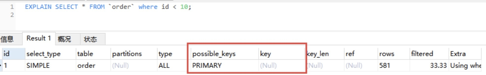

下面对图示中的每一个字段进行一个说明，从中你也能收获到很多零散的知识点。

* id：每个执行计划都有一个id，如果是一个联合查询，这里还将有多个id。
* select\_type：表示SELECT查询类型，常见的有SIMPLE（普通查询，即没有联合查询、子查询）、PRIMARY（主查询）、UNION（UNION中后面的查询）、SUBQUERY（子查询）等。
* table：当前执行计划查询的表，如果给表起别名了，则显示别名信息。
* partitions：访问的分区表信息。
* type：表示从表中查询到行所执行的方式，查询方式是SQL优化中一个很重要的指标，结果值从好到差依次是：system > const > eq\_ref > ref > range > index > ALL。


* system/const：表中只有一行数据匹配，此时根据索引查询一次就能找到对应的数据。

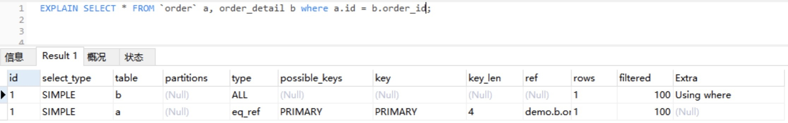

* eq\_ref：使用唯一索引扫描，常见于多表连接中使用主键和唯一索引作为关联条件。

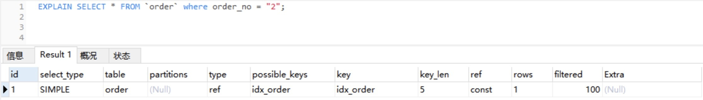

* ref：非唯一索引扫描，还可见于唯一索引最左原则匹配扫描。

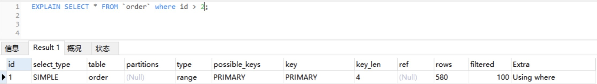

* range：索引范围扫描，比如，<，>，between等操作。

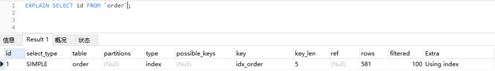

* index：索引全表扫描，此时遍历整个索引树。

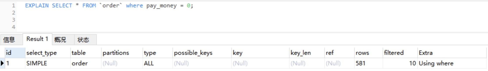

* ALL：表示全表扫描，需要遍历全表来找到对应的行。
* possible\_keys：可能使用到的索引。
* key：实际使用到的索引。
* key\_len：当前使用的索引的长度。
* ref：关联id等信息。
* rows：查找到记录所扫描的行数。
* filtered：查找到所需记录占总扫描记录数的比例。
* Extra：额外的信息。

#### 2. 通过Show Profile分析SQL执行性能

上述通过 EXPLAIN 分析执行计划，仅仅是停留在分析SQL的外部的执行情况，如果我们想要深入到MySQL内核中，从执行线程的状态和时间来分析的话，这个时候我们就可以选择Profile。Profile除了可以分析执行线程的状态和时间，还支持进一步选择ALL、CPU、MEMORY、BLOCK IO、CONTEXT SWITCHES等类型来查询SQL语句在不同系统资源上所消耗的时间。以下是相关命令的注释：

```
SHOW PROFILE [type [, type] ... ]
[FOR QUERY n]
[LIMIT row_count [OFFSET offset]]

type参数：
| ALL：显示所有开销信息
| BLOCK IO：阻塞的输入输出次数
| CONTEXT SWITCHES：上下文切换相关开销信息
| CPU：显示CPU的相关开销信息 
| IPC：接收和发送消息的相关开销信息
| MEMORY ：显示内存相关的开销，目前无用
| PAGE FAULTS ：显示页面错误相关开销信息
| SOURCE ：列出相应操作对应的函数名及其在源码中的调用位置(行数) 
| SWAPS：显示swap交换次数的相关开销信息
```

值得注意的是，MySQL是在5.0.37版本之后才支持Show Profile功能的，如果你不太确定的话，可以通过select @@have\_profiling查询是否支持该功能，如下图所示：

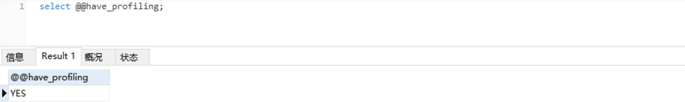

最新的MySQL版本是默认开启Show Profile功能的，但在之前的旧版本中是默认关闭该功能的，你可以通过set语句在Session级别开启该功能：

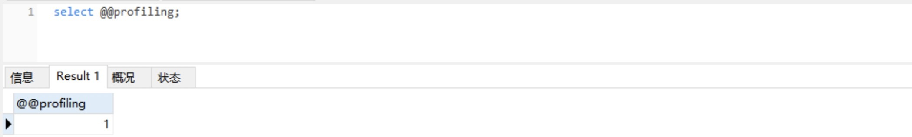

Show Profiles只显示最近发给服务器的SQL语句，默认情况下是记录最近已执行的15条记录，我们可以重新设置profiling\_history\_size增大该存储记录，最大值为100。

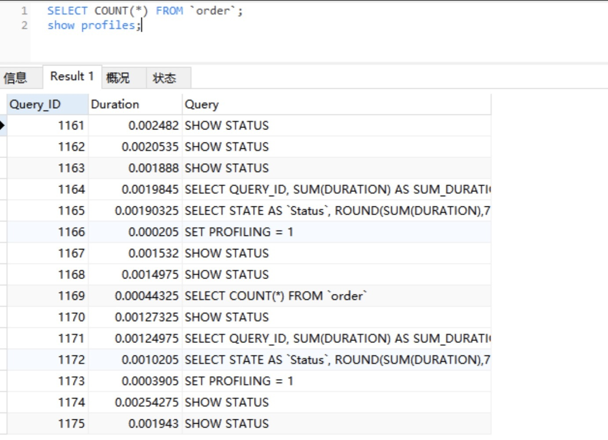

获取到Query\_ID之后，我们再通过Show Profile for Query ID语句，就能够查看到对应Query\_ID的SQL语句在执行过程中线程的每个状态所消耗的时间了：

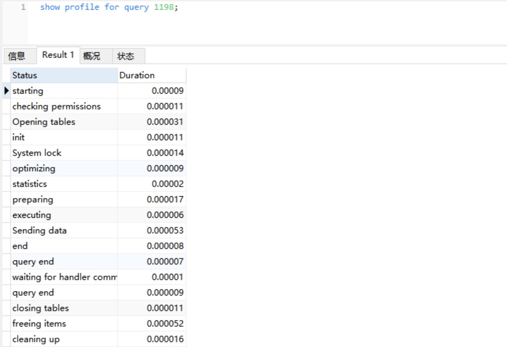

通过以上分析可知：SELECT COUNT(\*) FROM \`order\`; SQL语句在Sending data状态所消耗的时间最长，这是因为在该状态下，MySQL线程开始读取数据并返回到客户端，此时有大量磁盘I/O操作。

### 6.1.3 常用的SQL优化

在使用一些常规的SQL时，如果我们通过一些方法和技巧来优化这些SQL的实现，在性能上就会比使用常规通用的实现方式更加优越，甚至可以将SQL语句的性能提升到另一个数量级。

#### 1. 优化分页查询

通常我们是使用<LIMIT M,N> +合适的order by来实现分页查询，这种实现方式在没有任何索引条件支持的情况下，需要做大量的文件排序操作（file sort），性能将会非常得糟糕。如果有对应的索引，通常刚开始的分页查询效率会比较理想，但越往后，分页查询的性能就越差。

这是因为我们在使用LIMIT的时候，偏移量M在分页越靠后的时候，值就越大，数据库检索的数据也就越多。例如 LIMIT 10000,10这样的查询，数据库需要查询10010条记录，最后返回10条记录。也就是说将会有10000条记录被查询出来没有被使用到。我们模拟一张10万数量级的order表，进行以下分页查询：

```
select * from `demo`.`order` order by order_no limit 10000, 20;
```

通过EXPLAIN分析可知：该查询使用到了索引，扫描行数为10020行，但所用查询时间为0.018s，相对来说时间偏长了。

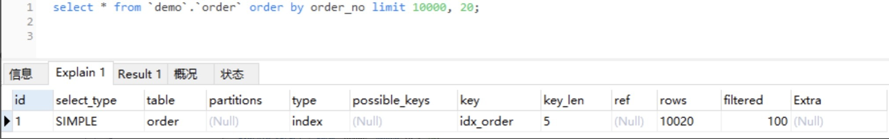

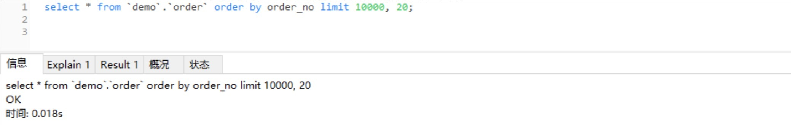

* 利用子查询优化分页查询

以上分页查询的问题在于，我们查询获取的10020行数据结果都返回给我们了，我们能否先查询出所需要的20行数据中的最小ID值，然后通过偏移量返回所需要的20行数据给我们呢？我们可以通过索引覆盖扫描，使用子查询的方式来实现分页查询：

```
select * from `demo`.`order` where id> (select id from `demo`.`order` order by order_no limit 10000, 1)  limit 20;
```

通过EXPLAIN分析可知：子查询遍历索引的范围跟上一个查询差不多，而主查询扫描了更多的行数，但执行时间却减少了，只有0.004s。这就是因为返回行数只有20行了，执行效率得到了明显的提升。

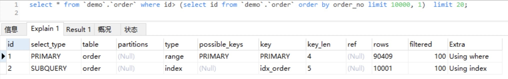

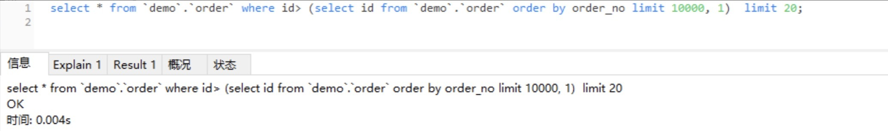

#### 2. 优化SELECT COUNT(\*)

COUNT()是一个聚合函数，主要用来统计行数，有时候也用来统计某一列的行数量（不统计NULL值的行）。我们平时最常用的就是COUNT(\*)和COUNT(1)这两种方式了，其实两者没有明显的区别，在拥有主键的情况下，它们都是利用主键列实现了行数的统计。

但COUNT()函数在MyISAM和InnoDB存储引擎所执行的原理是不一样的，通常在没有任何查询条件下的COUNT(\*)，MyISAM的查询速度要明显快于InnoDB。这是因为MyISAM存储引擎记录的是整个表的行数，在COUNT(\*)查询操作时无需遍历表计算，直接获取该值即可。而在InnoDB存储引擎中就需要扫描表来统计具体的行数。而当带上where条件语句之后，MyISAM跟InnoDB就没有区别了，它们都需要扫描表来进行行数的统计。

如果对一张大表经常做SELECT COUNT(\*)操作，这肯定是不明智的。那么我们该如何对大表的COUNT()进行优化呢？

* 使用近似值：有时候某些业务场景并不需要返回一个精确的COUNT值，此时我们可以使用近似值来代替。我们可以使用EXPLAIN对表进行估算，要知道，执行EXPLAIN并不会真正去执行查询，而是返回一个估算的近似值。
* 增加汇总统计：如果需要一个精确的COUNT值，我们可以额外新增一个汇总统计表或者缓存字段来统计需要的COUNT值，这种方式在新增和删除时有一定的成本，但却可以大大提升COUNT()的性能。

#### 3. 优化SELECT \*

我曾经看过很多同事习惯在只查询一两个字段时，都使用select \* from table where xxx这样的SQL语句，这种写法在特定的环境下会存在一定的性能损耗。

MySQL常用的存储引擎有MyISAM和InnoDB，其中InnoDB在默认创建主键时会创建主键索引，而主键索引属于聚簇索引，即在存储数据时，索引是基于B +树构成的，具体的行数据则存储在叶子节点。

而MyISAM默认创建的主键索引、二级索引以及InnoDB的二级索引都属于非聚簇索引，即在存储数据时，索引是基于B +树构成的，而叶子节点存储的是主键值。

假设我们的订单表是基于InnoDB存储引擎创建的，且存在order\_no、status两列组成的组合索引。此时，我们需要根据订单号查询一张订单表的status，如果我们使用select \* from order where order\_no='xxx’来查询，则先会查询组合索引，通过组合索引获取到主键ID，再通过主键ID去主键索引中获取对应行所有列的值。

如果我们使用select order\_no, status from order where order\_no='xxx’来查询，则只会查询组合索引，通过组合索引获取到对应的order\_no和status的值。如果你对这些索引还不够熟悉，请重点关注之后的第34讲，那一讲会详述数据库索引的相关内容。

### 6.1.4总结

在开发中，我们要尽量写出高性能的SQL语句，但也无法避免一些慢SQL语句的出现，或因为疏漏，或因为实际生产环境与开发环境有所区别，这些都是诱因。面对这种情况，我们可以打开慢SQL配置项，记录下都有哪些SQL超过了预期的最大执行时间。首先，我们可以通过以下命令行查询是否开启了记录慢SQL的功能，以及最大的执行时间是多少：

```
Show variables like 'slow_query%';
Show variables like 'long_query_time';
```

如果没有开启，我们可以通过以下设置来开启：

```
set global slow_query_log='ON'; //开启慢SQL日志
set global slow_query_log_file='/var/lib/mysql/test-slow.log';//记录日志地址
set global long_query_time=1;//最大执行时间
```

除此之外，很多数据库连接池中间件也有分析慢SQL的功能。总之，我们要在编程中避免低性能的SQL操作出现，除了要具备一些常用的SQL优化技巧之外，还要充分利用一些SQL工具，实现SQL性能分析与监控。

**思考题:**

假设有一张订单表order，主要包含了主键订单编码order\_no、订单状态status、提交时间create\_time等列，并且创建了status列索引和create\_time列索引。此时通过创建时间降序获取状态为1的订单编码，以下是具体实现代码：

```
select order_no from order where status =1 order by create_time desc
```

你知道其中的问题所在吗？我们又该如何优化？

**解答：**

SQL 查询的执行顺序

标准的 SQL 查询执行顺序如下：

1. **FROM**：首先识别数据源表。
2. **JOIN**：执行任何连接操作，将多张表合并在一起。
3. **WHERE**：过滤不符合条件的行。
4. **GROUP BY**：对选择的行进行分组。
5. **HAVING**：过滤分组后的行。
6. **SELECT**：选择和处理要返回的列。
7. **DISTINCT**：去除重复的行。
8. **ORDER BY**：对结果进行排序。
9. **LIMIT**：限制返回的行数。

## 6.2 MySQL调优之事务:高并发场景下的数据库事务调优

数据库事务是数据库系统执行过程中的一个逻辑处理单元，保证一个数据库操作要么成功，要么失败。谈到他，就不得不提ACID属性了。数据库事务具有以下四个基本属性：原子性（Atomicity）、一致性（Consistent）、隔离性（Isolation）以及持久性（Durable）。正是这些特性，才保证了数据库事务的安全性。而在MySQL中，鉴于MyISAM存储引擎不支持事务，所以接下来的内容都是在InnoDB存储引擎的基础上进行讲解的。

我们知道，在Java并发编程中，可以多线程并发执行程序，然而并发虽然提高了程序的执行效率，却给程序带来了线程安全问题。事务跟多线程一样，为了提高数据库处理事务的吞吐量，数据库同样支持并发事务，而在并发运行中，同样也存在着安全性问题，例如，修改数据丢失，读取数据不一致等。

在数据库事务中，事务的隔离是解决并发事务问题的关键， 今天我们就重点了解下事务隔离的实现原理，以及如何优化事务隔离带来的性能问题。

### 6.2.1 并发事务带来的问题

我们可以通过以下几个例子来了解下并发事务带来的几个问题：

1.数据丢失

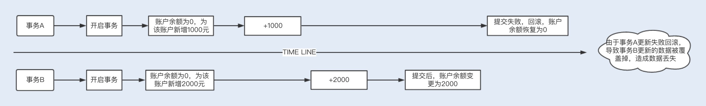

2.脏读

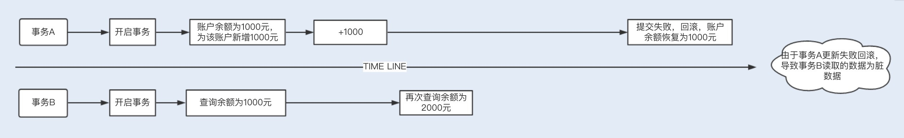

3.不可重复读

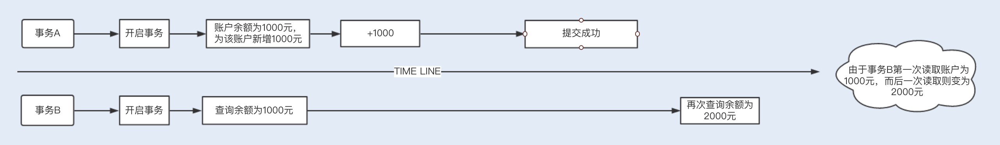

4.幻读


### 6.2.2 事务隔离解决并发问题

以上 4 个并发事务带来的问题，其中，数据丢失可以基于数据库中的悲观锁来避免发生，即在查询时通过在事务中使用 select xx for update 语句来实现一个排他锁，保证在该事务结束之前其他事务无法更新该数据。当然，我们也可以基于乐观锁来避免，即将某一字段作为版本号，如果更新时的版本号跟之前的版本一致，则更新，否则更新失败。剩下 3 个问题，其实是数据库读一致性造成的，需要数据库提供一定的事务隔离机制来解决。

我们通过加锁的方式，可以实现不同的事务隔离机制。在了解事务隔离机制之前，我们不妨先来了解下MySQL都有哪些锁机制。nnoDB实现了两种类型的锁机制：共享锁（S）和排他锁（X）。共享锁允许一个事务读数据，不允许修改数据，如果其他事务要再对该行加锁，只能加共享锁；排他锁是修改数据时加的锁，可以读取和修改数据，一旦一个事务对该行数据加锁，其他事务将不能再对该数据加任务锁。熟悉了以上InnoDB行锁的实现原理，我们就可以更清楚地理解下面的内容。

在操作数据的事务中，不同的锁机制会产生以下几种不同的事务隔离级别，不同的隔离级别分别可以解决并发事务产生的几个问题，对应如下：

- 未提交读（Read Uncommitted）：在事务A读取数据时，事务B读取数据加了共享锁，修改数据时加了排它锁。这种隔离级别，会导致脏读、不可重复读以及幻读。
- 已提交读（Read Committed）：在事务A读取数据时增加了共享锁，一旦读取，立即释放锁，事务B读取修改数据时增加了行级排他锁，直到事务结束才释放锁。也就是说，事务A在读取数据时，事务B只能读取数据，不能修改。当事务A读取到数据后，事务B才能修改。这种隔离级别，可以避免脏读，但依然存在不可重复读以及幻读的问题。
- 可重复读（Repeatable Read）：在事务A读取数据时增加了共享锁，事务结束，才释放锁，事务B读取修改数据时增加了行级排他锁，直到事务结束才释放锁。也就是说，事务A在没有结束事务时，事务B只能读取数据，不能修改。当事务A结束事务，事务B才能修改。这种隔离级别，可以避免脏读、不可重复读，但依然存在幻读的问题。
- 可序列化（Serializable）：在事务A读取数据时增加了共享锁，事务结束，才释放锁，事务B读取修改数据时增加了表级排他锁，直到事务结束才释放锁。可序列化解决了脏读、不可重复读、幻读等问题，但隔离级别越来越高的同时，并发性会越来越低。

InnoDB中的RC和RR隔离事务是基于多版本并发控制（MVCC）实现高性能事务。一旦数据被加上排他锁，其他事务将无法加入共享锁，且处于阻塞等待状态，如果一张表有大量的请求，这样的性能将是无法支持的。

MVCC对普通的 Select 不加锁，如果读取的数据正在执行Delete或Update操作，这时读取操作不会等待排它锁的释放，而是直接利用MVCC读取该行的数据快照（数据快照是指在该行的之前版本的数据，而数据快照的版本是基于undo实现的，undo是用来做事务回滚的，记录了回滚的不同版本的行记录）。MVCC避免了对数据重复加锁的过程，大大提高了读操作的性能。

### 6.2.3 锁具体实现算法

我们知道，InnoDB既实现了行锁，也实现了表锁。行锁是通过索引实现的，如果不通过索引条件检索数据，那么InnoDB将对表中所有的记录进行加锁，其实就是升级为表锁了。

行锁的具体实现算法有三种：record lock、gap lock以及next-key lock。record lock是专门对索引项加锁；gap lock是对索引项之间的间隙加锁；next-key lock则是前面两种的组合，对索引项以其之间的间隙加锁。

只在可重复读或以上隔离级别下的特定操作才会取得gap lock或next-key lock，在Select 、Update和Delete时，除了基于唯一索引的查询之外，其他索引查询时都会获取gap lock或next-key lock，即锁住其扫描的范围。

### 6.2.4 优化高并发事务

通过以上讲解，相信你对事务、锁以及隔离级别已经有了一个透彻的了解了。清楚了问题，我们就可以聊聊高并发场景下的事务到底该如何调优了。

#### 1. 结合业务场景，使用低级别事务隔离

在高并发业务中，为了保证业务数据的一致性，操作数据库时往往会使用到不同级别的事务隔离。隔离级别越高，并发性能就越低。那换到业务场景中，我们如何判断用哪种隔离级别更合适呢？我们可以通过两个简单的业务来说下其中的选择方法。

我们在修改用户最后登录时间的业务场景中，这里对查询用户的登录时间没有特别严格的准确性要求，而修改用户登录信息只有用户自己登录时才会修改，不存在一个事务提交的信息被覆盖的可能。所以我们允许该业务使用最低隔离级别。

而如果是账户中的余额或积分的消费，就存在多个客户端同时消费一个账户的情况，此时我们应该选择RR级别来保证一旦有一个客户端在对账户进行消费，其他客户端就不可能对该账户同时进行消费了。

#### 2. 避免行锁升级表锁

前面讲了，在InnoDB中，行锁是通过索引实现的，如果不通过索引条件检索数据，行锁将会升级到表锁。我们知道，表锁是会严重影响到整张表的操作性能的，所以我们应该避免他。

#### 3. 控制事务的大小，减少锁定的资源量和锁定时间长度

你是否遇到过以下SQL异常呢？在抢购系统的日志中，在活动区间，我们经常可以看到这种异常日志：

```
MySQLQueryInterruptedException: Query execution was interrupted
```

由于在抢购提交订单中开启了事务，在高并发时对一条记录进行更新的情况下，由于更新记录所在的事务还可能存在其他操作，导致一个事务比较长，当有大量请求进入时，就可能导致一些请求同时进入到事务中。又因为锁的竞争是不公平的，当多个事务同时对一条记录进行更新时，极端情况下，一个更新操作进去排队系统后，可能会一直拿不到锁，最后因超时被系统打断踢出。在用户购买商品时，首先我们需要查询库存余额，再新建一个订单，并扣除相应的库存。这一系列操作是处于同一个事务的。以上业务若是在两种不同的执行顺序下，其结果都是一样的，但在事务性能方面却不一样：

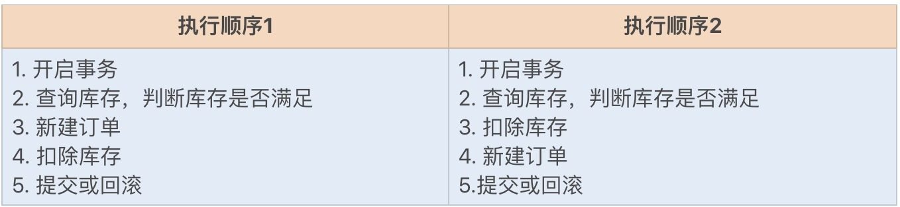

这是因为，虽然这些操作在同一个事务，但锁的申请在不同时间，只有当其他操作都执行完，才会释放所有锁。因为扣除库存是更新操作，属于行锁，这将会影响到其他操作该数据的事务，所以我们应该尽量避免长时间地持有该锁，尽快释放该锁。又因为先新建订单和先扣除库存都不会影响业务，所以我们可以将扣除库存操作放到最后，也就是使用执行顺序1，以此尽量减小锁的持有时间。

### 6.2.5 总结

其实MySQL的并发事务调优和Java的多线程编程调优非常类似，都是可以通过减小锁粒度和减少锁的持有时间进行调优。在MySQL的并发事务调优中，我们尽量在可以使用低事务隔离级别的业务场景中，避免使用高事务隔离级别。

在功能业务开发时，开发人员往往会为了追求开发速度，习惯使用默认的参数设置来实现业务功能。例如，在service方法中，你可能习惯默认使用transaction，很少再手动变更事务隔离级别。但要知道，transaction默认是RR事务隔离级别，在某些业务场景下，可能并不合适。因此，我们还是要结合具体的业务场景，进行考虑。

**思考题:**

以上我们主要了解了锁实现事务的隔离性，你知道InnoDB是如何实现原子性、一致性和持久性的吗？

## 6.3 MySQL调优之索引:索引的失效与优化

不知道你是否跟我有过同样的经历，那就是作为一个开发工程师，经常被DBA叫过去“批评”，而最常见的就是申请创建新的索引或发现慢SQL日志了。

记得之前有一次迭代一个业务模块的开发，涉及到了一个新的查询业务，需要根据商品类型、订单状态筛选出需要的订单，并以订单时间进行排序。由于sku的索引已经存在了，我在完成业务开发之后，提交了一个创建status的索引的需求，理由是SQL查询需要使用到这两个索引：

```
select \* from order where status =1 and sku=10001 order by create\_time asc
```

然而，DBA很快就将这个需求驳回了，并给出了重建一个sku、status以及create\_time组合索引的建议，查询顺序也改成了 sku=10001 and status=1。当时我是知道为什么要重建组合索引，但却无法理解为什么要添加create\_time这列进行组合。

从执行计划中，我们可以发现使用到了索引，那为什么DBA还要求将create\_time这一列加入到组合索引中呢？这个问题我们在[第33讲](https://time.geekbang.org/column/article/113440)中提到过，相信你也已经知道答案了。通过故事我们可以发现索引知识在平时开发时的重要性，然而它又很容易被我们忽略，所以今天我们就来详细聊一聊索引。

### 6.3.1 MySQL索引存储结构

索引是优化数据库查询最重要的方式之一，它是在MySQL的存储引擎层中实现的，所以每一种存储引擎对应的索引不一定相同。我们可以通过下面这张表格，看看不同的存储引擎分别支持哪种索引类型：

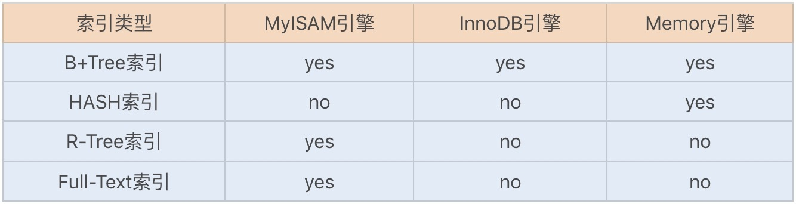

- B+Tree索引和Hash索引是我们比较常用的两个索引数据存储结构，B+Tree索引是通过B+树实现的，是有序排列存储，所以在排序和范围查找方面都比较有优势。如果你对B+Tree索引不够了解，可以通过该[链接](https://zhuanlan.zhihu.com/p/27700617)了解下它的数据结构原理。
- Hash索引相对简单些，只有Memory存储引擎支持Hash索引。Hash索引适合key-value键值对查询，无论表数据多大，查询数据的复杂度都是O(1)，且直接通过Hash索引查询的性能比其它索引都要优越。

在创建表时，无论使用InnoDB还是MyISAM存储引擎，默认都会创建一个主键索引，而创建的主键索引默认使用的是B+Tree索引。不过虽然这两个存储引擎都支持B+Tree索引，但它们在具体的数据存储结构方面却有所不同。InnoDB默认创建的主键索引是聚簇索引（Clustered Index），其它索引都属于辅助索引（Secondary Index），也被称为二级索引或非聚簇索引。接下来我们通过一个简单的例子，说明下这两种索引在存储数据中的具体实现。首先创建一张商品表，如下：

```
CREATE TABLE `merchandise`  (
  `id` int(11) NOT NULL,
  `serial_no` varchar(20)  DEFAULT NULL,
  `name` varchar(255) DEFAULT NULL,
  `unit_price` decimal(10, 2) DEFAULT NULL,
  PRIMARY KEY (`id`) USING BTREE
) CHARACTER SET = utf8 COLLATE = utf8_general_ci ROW_FORMAT = Dynamic;
```

然后新增了以下几行数据，如下：

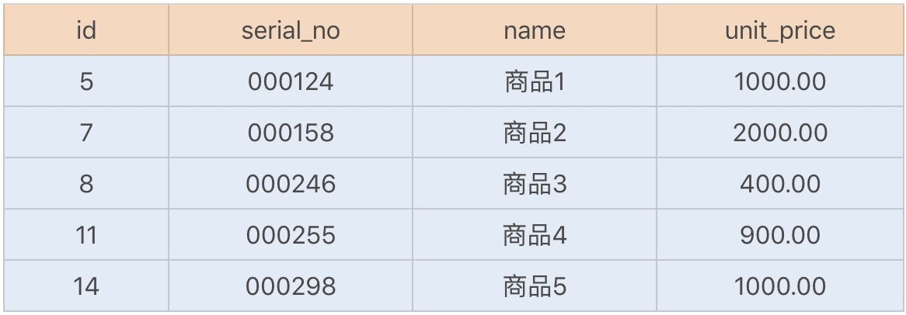

如果我们使用的是MyISAM存储引擎，由于MyISAM使用的是辅助索引，索引中每一个叶子节点仅仅记录的是每行数据的物理地址，即行指针，如下图所示：

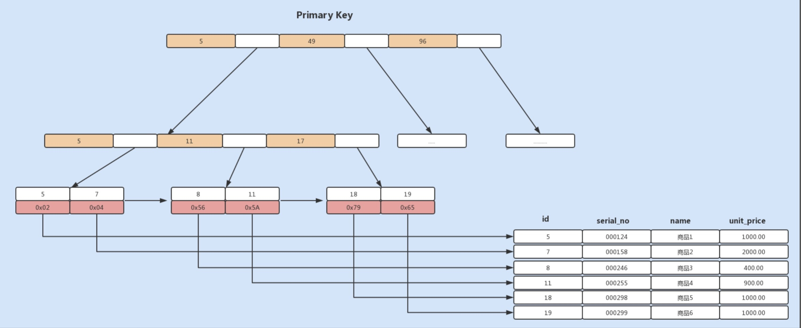

如果我们使用的是InnoDB存储引擎，由于InnoDB使用的是聚簇索引，聚簇索引中的叶子节点则记录了主键值、事务id、用于事务和MVCC的回流指针以及所有的剩余列，如下图所示：

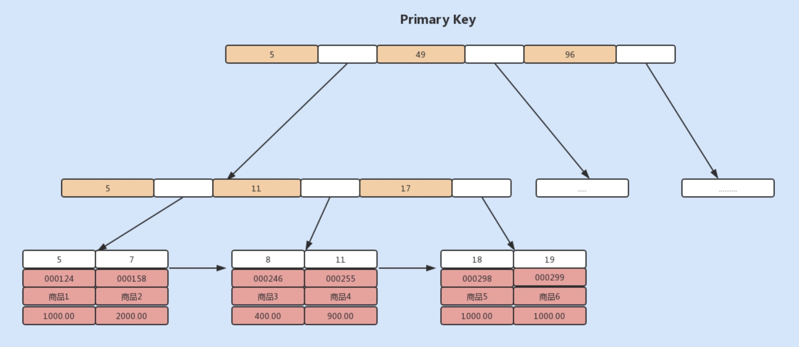

基于上面的图示，如果我们需要根据商品编码查询商品，我们就需要将商品编码serial\_no列作为一个索引列。此时创建的索引是一个辅助索引，与MyISAM存储引擎的主键索引的存储方式是一致的，但叶子节点存储的就不是行指针了，而是主键值，并以此来作为指向行的指针。这样的好处就是当行发生移动或者数据分裂时，不用再维护索引的变更。如果我们使用主键索引查询商品，则会按照B+树的索引找到对应的叶子节点，直接获取到行数据：

```
select \* from merchandise where id=7
```

如果我们使用商品编码查询商品，即使用辅助索引进行查询，则会先检索辅助索引中的B+树的serial\_no，找到对应的叶子节点，获取主键值，然后再通过聚簇索引中的B+树检索到对应的叶子节点，然后获取整行数据。这个过程叫做回表。在了解了索引的实现原理后，我们再来详细了解下平时建立和使用索引时，都有哪些调优方法呢？

#### 1.覆盖索引优化查询

假设我们只需要查询商品的名称、价格信息，我们有什么方式来避免回表呢？我们可以建立一个组合索引，即商品编码、名称、价格作为一个组合索引。如果索引中存在这些数据，查询将不会再次检索主键索引，从而避免回表。从辅助索引中查询得到记录，而不需要通过聚簇索引查询获得，MySQL中将其称为覆盖索引。使用覆盖索引的好处很明显，我们不需要查询出包含整行记录的所有信息，因此可以减少大量的I/O操作。

通常在InnoDB中，除了查询部分字段可以使用覆盖索引来优化查询性能之外，统计数量也会用到。例如，在[第32讲](https://time.geekbang.org/column/article/113440)我们讲 SELECT COUNT(\*)时，如果不存在辅助索引，此时会通过查询聚簇索引来统计行数，如果此时正好存在一个辅助索引，则会通过查询辅助索引来统计行数，减少I/O操作。通过EXPLAIN，我们可以看到 InnoDB 存储引擎使用了idx\_order索引列来统计行数，如下图所示：

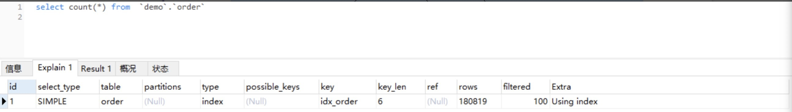

#### 2.自增字段作主键优化查询

上面我们讲了 InnoDB 创建主键索引默认为聚簇索引，数据被存放在了B+树的叶子节点上。也就是说，同一个叶子节点内的各个数据是按主键顺序存放的，因此，每当有一条新的数据插入时，数据库会根据主键将其插入到对应的叶子节点中。

如果我们使用自增主键，那么每次插入的新数据就会按顺序添加到当前索引节点的位置，不需要移动已有的数据，当页面写满，就会自动开辟一个新页面。因为不需要重新移动数据，因此这种插入数据的方法效率非常高。

如果我们使用非自增主键，由于每次插入主键的索引值都是随机的，因此每次插入新的数据时，就可能会插入到现有数据页中间的某个位置，这将不得不移动其它数据来满足新数据的插入，甚至需要从一个页面复制数据到另外一个页面，我们通常将这种情况称为页分裂。页分裂还有可能会造成大量的内存碎片，导致索引结构不紧凑，从而影响查询效率。

因此，在使用InnoDB存储引擎时，如果没有特别的业务需求，建议使用自增字段作为主键。

#### 3.前缀索引优化

前缀索引顾名思义就是使用某个字段中字符串的前几个字符建立索引，那我们为什么需要使用前缀来建立索引呢？

我们知道，索引文件是存储在磁盘中的，而磁盘中最小分配单元是页，通常一个页的默认大小为16KB，假设我们建立的索引的每个索引值大小为2KB，则在一个页中，我们能记录8个索引值，假设我们有8000行记录，则需要1000个页来存储索引。如果我们使用该索引查询数据，可能需要遍历大量页，这显然会降低查询效率。减小索引字段大小，可以增加一个页中存储的索引项，有效提高索引的查询速度。在一些大字符串的字段作为索引时，使用前缀索引可以帮助我们减小索引项的大小。

不过，前缀索引是有一定的局限性的，例如order by就无法使用前缀索引，无法把前缀索引用作覆盖索引。

#### 4.防止索引失效

当我们习惯建立索引来实现查询SQL的性能优化后，是不是就万事大吉了呢？当然不是，有时候我们看似使用到了索引，但实际上并没有被优化器选择使用。

- 对于Hash索引实现的列，如果使用到范围查询，那么该索引将无法被优化器使用到。也就是说Memory引擎实现的Hash索引只有在“=”的查询条件下，索引才会生效。我们将order表设置为Memory存储引擎，分析查询条件为id<10的SQL，可以发现没有使用到索引。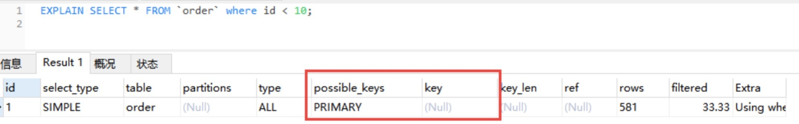
- 如果是以%开头的LIKE查询将无法利用节点查询数据：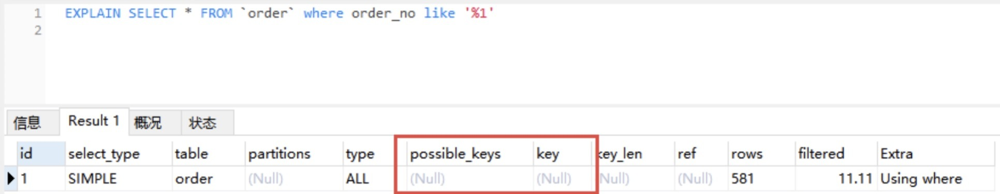
- 当我们在使用复合索引时，需要使用索引中的最左边的列进行查询，才能使用到复合索引。例如我们在order表中建立一个复合索引idx\_user\_order\_status(order\_no, status, user\_id)，如果我们使用order\_no、order\_no+status、order\_no+status+user\_id以及order\_no+user\_id组合查询，则能利用到索引；而如果我们用status、status+user\_id查询，将无法使用到索引，这也是我们经常听过的最左匹配原则。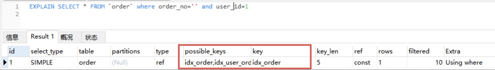
- 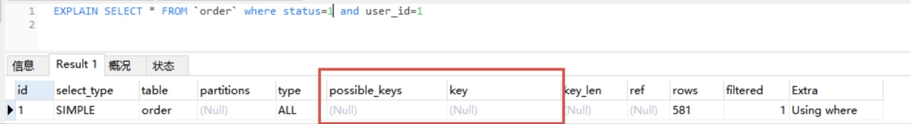
- 如果查询条件中使用or，且or的前后条件中有一个列没有索引，那么涉及的索引都不会被使用到。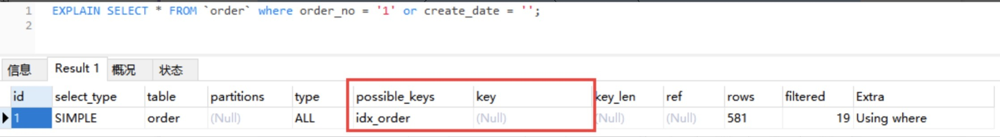

所以，你懂了吗？作为一名开发人员，如果没有熟悉MySQL，特别是MySQL索引的基础知识，很多时候都将被DBA批评到怀疑人生。

### 6.3.2 总结

在大多数情况下，我们习惯使用默认的 InnoDB 作为表存储引擎。在使用InnoDB作为存储引擎时，创建的索引默认为B+树数据结构，如果是主键索引，则属于聚簇索引，非主键索引则属于辅助索引。基于主键查询可以直接获取到行信息，而基于辅助索引作为查询条件，则需要进行回表，然后再通过主键索引获取到数据。

如果只是查询一列或少部分列的信息，我们可以基于覆盖索引来避免回表。覆盖索引只需要读取索引，且由于索引是顺序存储，对于范围或排序查询来说，可以极大地极少磁盘I/O操作。

除了了解索引的具体实现和一些特性，我们还需要注意索引失效的情况发生。如果觉得这些规则太多，难以记住，我们就要养成经常检查SQL执行计划的习惯。

**思考题:**

假设我们有一个订单表order\_detail，其中有主键id、主订单order\_id、商品sku等字段，其中该表有主键索引、主订单id索引。现在有一个查询订单详情的SQL如下，查询订单号范围在5000\~10000，请问该查询选择的索引是什么？有什么方式可以强制使用我们期望的索引呢？

```
select * from order_detail where order_id between 5000 and 10000；
```

## 6.4 记一次线上SQL死锁事故：如何避免死锁？

之前我参与过一个项目，在项目初期，我们是没有将读写表分离的，而是基于一个主库完成读写操作。在业务量逐渐增大的时候，我们偶尔会收到系统的异常报警信息，DBA通知我们数据库出现了死锁异常。

按理说业务开始是比较简单的，就是新增订单、修改订单、查询订单等操作，那为什么会出现死锁呢？经过日志分析，我们发现是作为幂等性校验的一张表经常出现死锁异常。我们和DBA讨论之后，初步怀疑是索引导致的死锁问题。后来我们在开发环境中模拟了相关操作，果然重现了该死锁异常。接下来我们就通过实战来重现下该业务死锁异常。首先，创建一张订单记录表，该表主要用于校验订单重复创建：

```
CREATE TABLE `order_record`  (
  `id` int(11) NOT NULL AUTO_INCREMENT,
  `order_no` int(11) DEFAULT NULL,
  `status` int(4) DEFAULT NULL,
  `create_date` datetime(0) DEFAULT NULL,
  PRIMARY KEY (`id`) USING BTREE,
  INDEX `idx_order_status`(`order_no`,`status`) USING BTREE
) ENGINE = InnoDB

```

为了能重现该问题，我们先将事务设置为手动提交。这里要注意一下，MySQL数据库和Oracle提交事务不太一样，MySQL数据库默认情况下是自动提交事务，我们可以通过以下命令行查看自动提交事务是否开启：

```
mysql> show variables like 'autocommit';
+---------------+-------+
| Variable_name | Value |
+---------------+-------+
| autocommit    | ON    |
+---------------+-------+
1 row in set (0.01 sec)
```

下面就操作吧，先将MySQL数据库的事务提交设置为手动提交，通过以下命令行可以关闭自动提交事务：

```
mysql> set autocommit = 0;
Query OK, 0 rows affected (0.00 sec)
```

订单在做幂等性校验时，先是通过订单号检查订单是否存在，如果不存在则新增订单记录。知道具体的逻辑之后，我们再来模拟创建产生死锁的运行SQL语句。首先，我们模拟新建两个订单，并按照以下顺序执行幂等性校验SQL语句（垂直方向代表执行的时间顺序）：

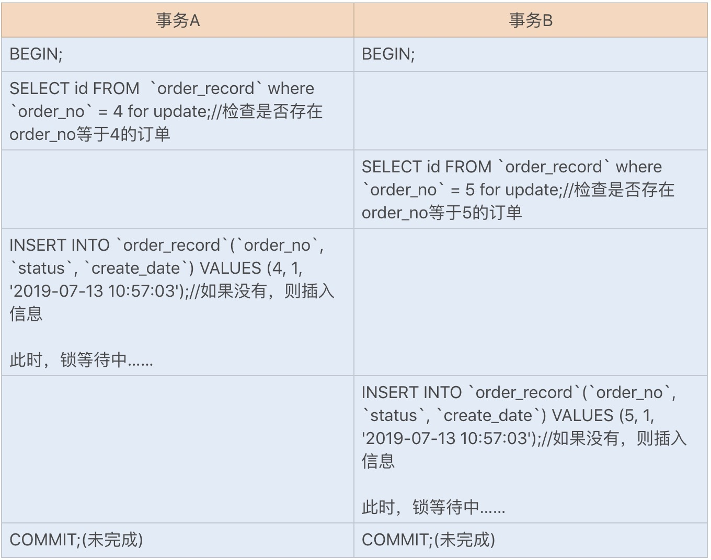

此时，我们会发现两个事务已经进入死锁状态。我们可以在information\_schema数据库中查询到具体的死锁情况，如下图所示：

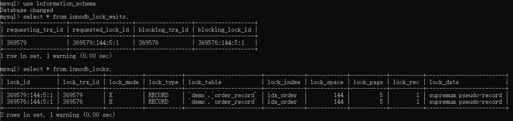

看到这，你可能会想，为什么SELECT要加for update排他锁，而不是使用共享锁呢？试想下，如果是两个订单号一样的请求同时进来，就有可能出现幻读。也就是说，一开始事务A中的查询没有该订单号，后来事务B新增了一个该订单号的记录，此时事务A再新增一条该订单号记录，就会创建重复的订单记录。面对这种情况，我们可以使用锁间隙算法来防止幻读。

### 6.4.1 死锁是如何产生的？

上面我们说到了锁间隙，在[第33讲](https://time.geekbang.org/column/article/114194)中，我已经讲过了并发事务中的锁机制以及行锁的具体实现算法，不妨回顾一下。行锁的具体实现算法有三种：record lock、gap lock以及next-key lock。record lock是专门对索引项加锁；gap lock是对索引项之间的间隙加锁；next-key lock则是前面两种的组合，对索引项以其之间的间隙加锁。

只在可重复读或以上隔离级别下的特定操作才会取得gap lock或next-key lock，在Select、Update和Delete时，除了基于唯一索引的查询之外，其它索引查询时都会获取gap lock或next-key lock，即锁住其扫描的范围。主键索引也属于唯一索引，所以主键索引是不会使用gap lock或next-key lock。

在MySQL中，gap lock默认是开启的，即innodb\_locks\_unsafe\_for\_binlog参数值是disable的，且MySQL中默认的是RR事务隔离级别。当我们执行以下查询SQL时，由于order\_no列为非唯一索引，此时又是RR事务隔离级别，所以SELECT的加锁类型为gap lock，这里的gap范围是(4,+∞）。

```
SELECT id FROM demo.order_record where order_no = 4 for update;
```

执行查询SQL语句获取的gap lock并不会导致阻塞，而当我们执行以下插入SQL时，会在插入间隙上再次获取插入意向锁。插入意向锁其实也是一种gap锁，它与gap lock是冲突的，所以当其它事务持有该间隙的gap lock时，需要等待其它事务释放gap lock之后，才能获取到插入意向锁。以上事务A和事务B都持有间隙(4,+∞）的gap锁，而接下来的插入操作为了获取到插入意向锁，都在等待对方事务的gap锁释放，于是就造成了循环等待，导致死锁。

```
INSERT INTO demo.order_record(order_no, status, create_date) VALUES (5, 1, ‘2019-07-13 10:57:03’);
```

我们可以通过以下锁的兼容矩阵图，来查看锁的兼容性：

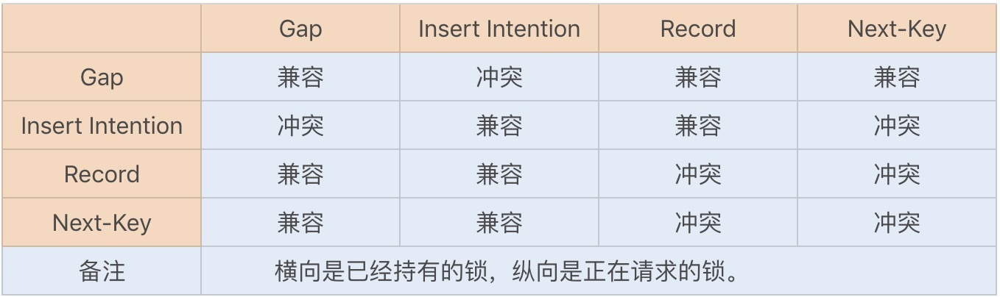

### 6.4.2 避免死锁的措施

知道了死锁问题源自哪儿，就可以找到合适的方法来避免它了。避免死锁最直观的方法就是在两个事务相互等待时，当一个事务的等待时间超过设置的某一阈值，就对这个事务进行回滚，另一个事务就可以继续执行了。这种方法简单有效，在InnoDB中，参数innodb\_lock\_wait\_timeout是用来设置超时时间的。

另外，我们还可以将order\_no列设置为唯一索引列。虽然不能防止幻读，但我们可以利用它的唯一性来保证订单记录不重复创建，这种方式唯一的缺点就是当遇到重复创建订单时会抛出异常。我们还可以使用其它的方式来代替数据库实现幂等性校验。例如，使用Redis以及ZooKeeper来实现，运行效率比数据库更佳。

### 6.4.3 其它常见的SQL死锁问题

这里再补充一些常见的SQL死锁问题，以便你遇到时也能知道其原因，从而顺利解决。我们知道死锁的四个必要条件：互斥、占有且等待、不可强占用、循环等待。只要系统发生死锁，这些条件必然成立。所以在一些经常需要使用互斥共用一些资源，且有可能循环等待的业务场景中，要特别注意死锁问题。接下来，我们再来了解一个出现死锁的场景。

我们讲过，InnoDB存储引擎的主键索引为聚簇索引，其它索引为辅助索引。如果我们之前使用辅助索引来更新数据库，就需要修改为使用聚簇索引来更新数据库。如果两个更新事务使用了不同的辅助索引，或一个使用了辅助索引，一个使用了聚簇索引，就都有可能导致锁资源的循环等待。由于本身两个事务是互斥，也就构成了以上死锁的四个必要条件了。我们还是以上面的这个订单记录表来重现下聚簇索引和辅助索引更新时，循环等待锁资源导致的死锁问题：

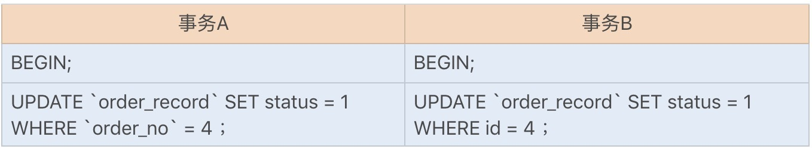

出现死锁的步骤:

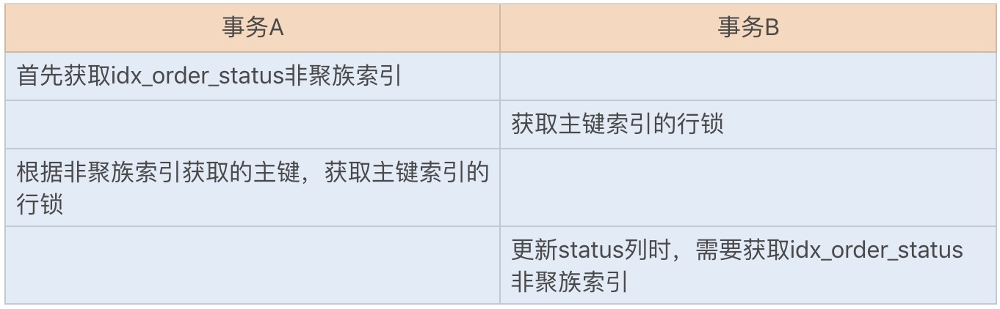

综上可知，在更新操作时，我们应该尽量使用主键来更新表字段，这样可以有效避免一些不必要的死锁发生。

### 6.4.3 总结

数据库发生死锁的概率并不是很大，一旦遇到了，就一定要彻查具体原因，尽快找出解决方案，老实说，过程不简单。我们只有先对MySQL的InnoDB存储引擎有足够的了解，才能剖析出造成死锁的具体原因。例如，以上我例举的两种发生死锁的场景，一个考验的是我们对锁算法的了解，另外一个考验则是我们对聚簇索引和辅助索引的熟悉程度。解决死锁的最佳方式当然就是预防死锁的发生了，我们平时编程中，可以通过以下一些常规手段来预防死锁的发生：

1.在编程中尽量按照固定的顺序来处理数据库记录，假设有两个更新操作，分别更新两条相同的记录，但更新顺序不一样，有可能导致死锁；

2.在允许幻读和不可重复读的情况下，尽量使用RC事务隔离级别，可以避免gap lock导致的死锁问题；

3.更新表时，尽量使用主键更新；

4.避免长事务，尽量将长事务拆解，可以降低与其它事务发生冲突的概率；

5.设置锁等待超时参数，我们可以通过innodb\_lock\_wait\_timeout设置合理的等待超时阈值，特别是在一些高并发的业务中，我们可以尽量将该值设置得小一些，避免大量事务等待，占用系统资源，造成严重的性能开销。

**思考题:**

除了设置 innodb\_lock\_wait\_timeout 参数来避免已经产生死锁的SQL长时间等待，你还知道其它方法来解决类似问题吗？

## 6.5 什么时候需要分表分库？

在当今互联网时代，海量数据基本上是每一个成熟产品的共性，特别是在移动互联网产品中，几乎每天都在产生数据，例如，商城的订单表、支付系统的交易明细以及游戏中的战报等等。对于一个日活用户在百万数量级的商城来说，每天产生的订单数量可能在百万级，特别在一些活动促销期间，甚至上千万。

假设我们基于单表来实现，每天产生上百万的数据量，不到一个月的时间就要承受上亿的数据，这时单表的性能将会严重下降。因为MySQL在InnoDB存储引擎下创建的索引都是基于B+树实现的，所以查询时的I/O次数很大程度取决于树的高度，随着B+树的树高增高，I/O次数增加，查询性能也就越差。

当我们面对一张海量数据的表时，通常有分区、NoSQL存储、分表分库等优化方案。分区的底层虽然也是基于分表的原理实现的，即有多个底层表实现，但分区依然是在单库下进行的，在一些需要提高并发的场景中的优化空间非常有限，且一个表最多只能支持1024个分区。面对日益增长的海量数据，优化存储能力有限。不过在一些非海量数据的大表中，我们可以考虑使用分区来优化表性能。

分区表是由多个相关的底层表实现的，这些底层表也是由句柄对象表示，所以我们也可以直接访问各个分区，存储引擎管理分区的各个底层表和管理普通表一样（所有的底层表都必须使用相同的存储引擎），分区表的索引只是在各个底层表上各自加上一个相同的索引，从存储引擎的角度来看，底层表和一个普通表没有任何不同，存储引擎也无须知道这是一个普通表，还是一个分区表的一部分。

而NoSQL存储是基于键值对存储，虽然查询性能非常高，但在一些方面仍然存在短板。例如，不是关系型数据库，不支持事务以及稳定性方面相对RDBMS差一些。虽然有些NoSQL数据库也实现了事务，宣传具有可靠的稳定性，但目前NoSQL还是主要用作辅助存储。

### 6.5.1 什么时候要分表分库？

分析完了分区、NoSQL存储优化的应用，接下来我们就看看这讲的重头戏——分表分库。在我看来，能不分表分库就不要分表分库。在单表的情况下，当业务正常时，我们使用单表即可，而当业务出现了性能瓶颈时，我们首先考虑用分区的方式来优化，如果分区优化之后仍然存在后遗症，此时我们再来考虑分表分库。

我们知道，如果在单表单库的情况下，**当数据库表的数据量逐渐累积到一定的数量时（5000W行或100G以上）**，操作数据库的性能会出现明显下降，即使我们使用索引优化或读写库分离，性能依然存在瓶颈。此时，如果每日数据增长量非常大，我们就应该考虑分表，避免单表数据量过大，造成数据库操作性能下降。

面对海量数据，除了单表的性能比较差以外，我们在单表单库的情况下，数据库连接数、磁盘I/O以及网络吞吐等资源都是有限的，并发能力也是有限的。所以，在一些大数据量且高并发的业务场景中，我们就需要考虑分表分库来提升数据库的并发处理能力，从而提升应用的整体性能。

### 6.5.2 如何分表分库？

通常，分表分库分为垂直切分和水平切分两种。

- 垂直分库是指根据业务来分库，不同的业务使用不同的数据库。例如，订单和消费券在抢购业务中都存在着高并发，如果同时使用一个库，会占用一定的连接数，所以我们可以将数据库分为订单库和促销活动库。
- 而垂直分表则是指根据一张表中的字段，将一张表划分为两张表，其规则就是将一些不经常使用的字段拆分到另一张表中。例如，一张订单详情表有一百多个字段，显然这张表的字段太多了，一方面不方便我们开发维护，另一方面还可能引起跨页问题。这时我们就可以拆分该表字段，解决上述两个问题。
- 水平分表则是将表中的某一列作为切分的条件，按照某种规则（Range或Hash取模）来切分为更小的表。水平分表只是在一个库中，如果存在连接数、I/O读写以及网络吞吐等瓶颈，我们就需要考虑将水平切换的表分布到不同机器的库中，这就是水平分库分表了。

结合以上垂直切分和水平切分，我们一般可以将数据库分为：单库单表-单库多表-多库多表。在平时的业务开发中，我们应该优先考虑单库单表；如果数据量比较大，且热点数据比较集中、历史数据很少访问，我们可以考虑表分区；如果访问热点数据分散，基本上所有的数据都会访问到，我们可以考虑单库多表；如果并发量比较高、海量数据以及每日新增数据量巨大，我们可以考虑多库多表。

这里还需要注意一点，我刚刚强调过，能不分表分库，就不要分表分库。这是因为一旦分表，我们可能会涉及到多表的分页查询、多表的JOIN查询，从而增加业务的复杂度。而一旦分库了，除了跨库分页查询、跨库JOIN查询，还会存在跨库事务的问题。这些问题无疑会增加我们系统开发的复杂度。

### 6.5.3 分表分库之后面临的问题

然而，分表分库虽然存在着各种各样的问题，但在一些海量数据、高并发的业务中，分表分库仍是最常用的优化手段。所以，我们应该充分考虑分表分库操作后所面临的一些问题，接下我们就一起看看都有哪些应对之策。为了更容易理解这些问题，我们将对一个订单表进行分库分表，通过详细的业务来分析这些问题。

假设我们有一张订单表以及一张订单详情表，每天的数据增长量在60W单，平时还会有一些促销类活动，订单增长量在千万单。为了提高系统的并发能力，我们考虑将订单表和订单详情表做分库分表。除了分表，因为用户一般查询的是最近的订单信息，所以热点数据比较集中，我们还可以考虑用表分区来优化单表查询。

通常订单的分库分表要么基于订单号Hash取模实现，要么根据用户 ID Hash 取模实现。订单号Hash取模的好处是数据能均匀分布到各个表中，而缺陷则是一个用户查询所有订单时，需要去多个表中查询。由于订单表用户查询比较多，此时我们应该考虑使用用户ID字段做Hash取模，对订单表进行水平分表。如果需要考虑高并发时的订单处理能力，我们可以考虑基于用户ID字段Hash取模实现分库分表。这也是大部分公司对订单表分库分表的处理方式。

#### 1.分布式事务问题

在提交订单时，除了创建订单之外，我们还需要扣除相应的库存。而订单表和库存表由于垂直分库，位于不同的库中，这时我们需要通过分布式事务来保证提交订单时的事务完整性。

- 通常，我们解决分布式事务有两种通用的方式：两阶事务提交（2PC）以及补偿事务提交（TCC）。有关分布式事务的内容，我将在第41讲中详细介绍。
- 通常有一些中间件已经帮我们封装好了这两种方式的实现，例如Spring实现的JTA，目前阿里开源的分布式事务中间件Fescar，就很好地实现了与Dubbo的兼容。

#### 2.跨节点JOIN查询问题

用户在查询订单时，我们往往需要通过表连接获取到商品信息，而商品信息表可能在另外一个库中，这就涉及到了跨库JOIN查询。通常，我们会冗余表或冗余字段来优化跨库JOIN查询。对于一些基础表，例如商品信息表，我们可以在每一个订单分库中复制一张基础表，避免跨库JOIN查询。而对于一两个字段的查询，我们也可以将少量字段冗余在表中，从而避免JOIN查询，也就避免了跨库JOIN查询。

#### 3.跨节点分页查询问题

我们知道，当用户在订单列表中查询所有订单时，可以通过用户ID的Hash值来快速查询到订单信息，而运营人员在后台对订单表进行查询时，则是通过订单付款时间来进行查询的，这些数据都分布在不同的库以及表中，此时就存在一个跨节点分页查询的问题了。通常一些中间件是通过在每个表中先查询出一定的数据，然后在缓存中排序后，获取到对应的分页数据。这种方式在越往后面的查询，就越消耗性能。

通常我们建议使用两套数据来解决跨节点分页查询问题，一套是基于分库分表的用户单条或多条查询数据，一套则是基于Elasticsearch、Solr存储的订单数据，主要用于运营人员根据其它字段进行分页查询。为了不影响提交订单的业务性能，我们一般使用异步消息来实现Elasticsearch、Solr订单数据的新增和修改。

#### 4.全局主键ID问题

在分库分表后，主键将无法使用自增长来实现了，在不同的表中我们需要统一全局主键ID。因此，我们需要单独设计全局主键，避免不同表和库中的主键重复问题。

使用UUID实现全局ID是最方便快捷的方式，即随机生成一个32位16进制数字，这种方式可以保证一个UUID的唯一性，水平扩展能力以及性能都比较高。但使用UUID最大的缺陷就是，它是一个比较长的字符串，连续性差，如果作为主键使用，性能相对来说会比较差。

我们也可以基于Redis分布式锁实现一个递增的主键ID，这种方式可以保证主键是一个整数且有一定的连续性，但分布式锁存在一定的性能消耗。我们还可以基于Twitter开源的分布式ID生产算法——snowflake解决全局主键ID问题，snowflake是通过分别截取时间、机器标识、顺序计数的位数组成一个long类型的主键ID。这种算法可以满足每秒上万个全局ID生成，不仅性能好，而且低延时。

#### 5.扩容问题

随着用户的订单量增加，根据用户 ID Hash 取模的分表中，数据量也在逐渐累积。此时，我们需要考虑动态增加表，一旦动态增加表了，就会涉及到数据迁移问题。我们在最开始设计表数据量时，尽量使用2的倍数来设置表数量。当我们需要扩容时，也同样按照2的倍数来扩容，这种方式可以减少数据的迁移量。

### 6.5.4 总结

在业务开发之前，我们首先要根据自己的业务需求来设计表。考虑到一开始的业务发展比较平缓，且开发周期比较短，因此在开发时间比较紧的情况下，我们尽量不要考虑分表分库。但是我们可以将分表分库的业务接口预留，提前考虑后期分表分库的切分规则，把该冗余的字段提前冗余出来，避免后期分表分库的JOIN查询等。

当业务发展比较迅速的时候，我们就要评估分表分库的必要性了。一旦需要分表分库，就要结合业务提前规划切分规则，尽量避免消耗性能的跨表跨库JOIN查询、分页查询以及跨库事务等操作。

**思考题:**

你使用过哪些分库分表中间件呢？欢迎分享其中的实现原理以及优缺点。

## 6.6 电商系统表设计优化案例分析

如果在业务架构设计初期，表结构没有设计好，那么后期随着业务以及数据量的增多，系统就很容易出现瓶颈。如果表结构扩展性差，业务耦合度将会越来越高，系统的复杂度也将随之增加。这一讲我将以电商系统中的表结构设计为例，为你详讲解在设计表时，我们都需要考虑哪些因素，又是如何通过表设计来优化系统性能。

### 6.6.1 核心业务

要懂得一个电商系统的表结构设计，我们必须先得熟悉一个电商系统中都有哪些基本核心业务。这部分的内容，只要你有过网购经历，就很好理解。

一般电商系统分为平台型和自营型电商系统。平台型电商系统是指有第三方商家入驻的电商平台，第三方商家自己开设店铺来维护商品信息、库存信息、促销活动、客服售后等，典型的代表有淘宝、天猫等。而自营型电商系统则是指没有第三方商家入驻，而是公司自己运营的电商平台，常见的有京东自营、苹果商城等。

两种类型的电商系统比较明显的区别是卖家是C端还是B端，很显然，平台型电商系统的复杂度要远远高于自营型电商系统。为了更容易理解商城的业务，我们将基于自营型电商系统来讨论表结构设计优化，这里以苹果商城为例。

一个电商系统的核心业务肯定就是销售商品了，围绕销售商品，我们可以将核心业务分为以下几个主要模块：

#### 1. 商品模块

商品模块主要包括商品分类以及商品信息管理，商品分类则是我们常见的大分类了，有人喜欢将分类细化为多个层级，例如，第一个大类是手机、电视、配件等，配件的第二个大类又分为耳机、充电宝等。为了降低用户学习系统操作的成本，我们应该尽量将层级减少。

当我们通过了分类查询之后，就到了商品页面，一个商品Item包含了若干商品SKU。商品Item是指一种商品，例如IPhone9，就是一个Item，商品SKU则是指具体属性的商品，例如金色128G内存的IPhone9。

#### 2. 购物车模块

购物车主要是用于用户临时存放欲购买的商品，并可以在购物车中统一下单结算。购物车一般分为离线购物车和在线购物车。离线购物车则是用户选择放入到购物车的商品只保存在本地缓存中，在线购物车则是会同步这些商品信息到服务端。

目前大部分商城都是支持两种状态的购物车，当用户没有登录商城时，主要是离线购物车在记录用户的商品信息，当用户登录商城之后，用户放入到购物车中的商品都会同步到服务端，以后在手机和电脑等不同平台以及不同时间都能查看到自己放入购物车的商品。

#### 3. 订单模块

订单是盘活整个商城的核心功能模块，如果没有订单的产出，平台将难以维持下去。订单模块管理着用户在平台的交易记录，是用户和商家交流购买商品状态的渠道，用户可以随时更改一个订单的状态，商家则必须按照业务流程及时更新订单，以告知用户已购买商品的具体状态。

通常一个订单分为以下几个状态：待付款、待发货、待收货、待评价、交易完成、用户取消、仅退款、退货退款状态。一个订单的流程见下图：

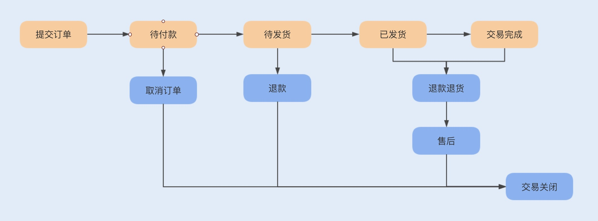

#### 4. 库存模块

这里主要记录的是商品SKU的具体库存信息，主要功能包括库存交易、库存管理。

- 库存交易是指用户购买商品时实时消费库存
- 库存管理主要包括运营人员对商品的生产或采购入库、调拨。

**一般库存信息分为商品SKU、仓区、实时库存、锁定库存、待退货库存、活动库存。**现在大部分电商都实现了华南华北的库存分区，所以可能存在同一个商品SKU在华北没有库存，而在华南存在库存的情况，所以我们需要有仓区这个字段，用来区分不同地区仓库的同一个商品SKU。

- 实时库存则是指商品的实时库存
- 锁定库存则表示用户已经提交订单到实际扣除库存或订单失效的这段时间里锁定的库存
- 待退货库存、活动库存则分别表表示订单退款时的库存数量以及每次活动时的库存数量。

除了这些库存信息，我们还可以为商品设置库存状态，例如**虚拟库存状态、实物库存状态**。如果一个商品不需要设定库存，可以任由用户购买，我们则不需要在每次用户购买商品时都去查询库存、扣除库存，只需要设定商品的库存状态为虚拟库存即可。

#### 5. 促销活动模块

促销活动模块是指消费券、红包以及满减等促销功能，这里主要包括了活动管理和交易管理。前者主要负责管理每次发放的消费券及红包有效期、金额、满足条件、数量等信息，后者则主要负责管理用户领取红包、消费券等信息。

### 6.6.2 业务难点

了解了以上那些主要模块的具体业务之后，我们就可以更深入地去评估从业务落地到系统实现，可能存在的难点以及性能瓶颈了。

#### 1. 不同商品类别存在差异，如何设计商品表结构？

我们知道，一个手机商品的详细信息跟一件衣服的详细信息差别很大，手机的SKU包括了颜色、运行内存、存储内存等，而一件衣服则包含了尺码、颜色。

- 如果我们需要将这些商品都存放在一张表中，要么就使用相同字段来存储不同的信息，要么就新增字段来维护各自的信息。前者会导致程序设计复杂化、表宽度大，从而减少磁盘单页存储行数，影响查询性能，且维护成本高；后者则会导致一张表中字段过多，如果有新的商品类型出现，又需要动态添加字段。
- 比较好的方式是通过一个公共表字段来存储一些具有共性的字段，创建单独的商品类型表，例如手机商品一个表、服饰商品一个表。但这种方式也有缺点，那就是可能会导致表非常多，查询商品信息的时候不够灵活，不好实现全文搜索。

这时候，我们可以基于一个公共表来存储商品的公共信息，同时结合搜索引擎，将商品详细信息存储到键值对数据库，例如ElasticSearch、Solr中。

#### 2. 双十一购物车商品数量大增，购物车系统出现性能瓶颈怎么办？

在用户没有登录系统的情况下，我们是通过cookie来保存购物车的商品信息，而在用户登录系统之后，购物车的信息会保存到数据库中。

在双十一期间，大部分用户都会提前将商品加入到购物车中，在加入商品到购物车的这段操作中，由于时间比较长，操作会比较分散，所以对数据库的写入并不会造成太大的压力。但在购买时，由于多数属于抢购商品，用户对购物车的访问则会比较集中了，如果都去数据库中读取，那么数据库的压力就可想而知了。

此时我们应该考虑冷热数据方案来存储购物车的商品信息，用户一般都会首选最近放入购物车的商品，这些商品信息则是热数据，而较久之前放入购物车中的商品信息则是冷数据，我们需要提前将热数据存放在Redis缓存中，以便提高系统在活动期间的并发性能。例如，可以将购物车中近一个月的商品信息都存放到Redis中，且至少为一个分页的信息。

当在缓存中没有查找到购物车信息时，再去数据库中查询，这样就可以大大降低数据库的压力。

#### 3. 订单表海量数据，如何设计订单表结构？

通常我们的订单表是系统数据累计最快的一张表，无论订单是否真正付款，只要订单提交了就会在订单表中创建订单。如果公司的业务发展非常迅速，那么订单表的分表分库就只是迟早的事儿了。在没有分表之前，订单的主键ID都是自增的，并且关联了一些其它业务表。一旦要进行分表分库，就会存在主键ID与业务耦合的情况，而且分表后新自增ID与之前的ID也可能会发生冲突，后期做表升级的时候我们将会面临巨大的工作量。如果我们确定后期做表升级，建议提前使用snowflake来生成主键ID。

如果订单表要实现水平分表，那我们基于哪个字段来实现分表呢？通常我们是通过计算用户ID字段的Hash值来实现订单的分表，这种方式可以优化用户购买端对订单的操作性能。如果我们需要对订单表进行水平分库，那就还是基于用户ID字段来实现。

在分表分库之后，对于我们的后台订单管理系统来说，查询订单就是一个挑战了。通常后台都是根据订单状态、创建订单时间进行查询的，且需要支持分页查询以及部分字段的JOIN查询，如果需要在分表分库的情况下进行这些操作，无疑是一个巨大的挑战了。

- 对于JOIN查询，我们一般可以通过冗余一些不常修改的配置表来实现。例如，商品的基础信息，我们录入之后很少修改，可以在每个分库中冗余该表，如果字段信息比较少，我们可以直接在订单表中冗余这些字段。
- 而对于分页查询，通常我们建议冗余订单信息到大数据中。后台管理系统通过大数据来查询订单信息，用户在提交订单并且付款之后，后台将会同步这条订单到大数据。用户在C端修改或运营人员在后台修改订单时，会通过异步方式通知大数据更新该订单数据，这种方式可以解决分表分库后带来的分页查询问题。

#### 4. 抢购业务，如何解决库存表的性能瓶颈？

在平时购买商品时，我们一般是直接去数据库检查、锁定库存，但如果是在促销活动期间抢购商品，我们还是直接去数据库检查、更新库存的话，面对高并发，系统无疑会产生性能瓶颈。

一般我们会将促销活动的库存更新到缓存中，通过缓存来查询商品的实时库存，并且通过分布式锁来实现库存扣减、锁定库存。分布式锁的具体实现，我会在第41讲中详讲。

#### 5. 促销活动也存在抢购场景，如何设计表？

促销活动中的优惠券和红包交易，很多时候跟抢购活动有些类似。

在一些大型促销活动之前，我们一般都会定时发放各种商品的优惠券和红包，用户需要点击领取才能使用。所以在一定数量的优惠券和红包放出的同时，也会存在同一时间抢购这些优惠券和红包的情况，特别是一些热销商品。我们可以参考库存的优化设计方式，使用缓存和分布式锁来查询、更新优惠券和红包的数量，通过缓存获取数量成功以后，再通过异步方式更新数据库中优惠券和红包的数量。

### 6.6.3 使用ES搜索引擎的优缺点

#### 1.优点

1. **强大的搜索能力**：
   * 搜索引擎提供了强大的全文检索功能、复杂查询能力和聚合分析能力。
   * 支持多字段、多条件、模糊搜索等，查询非常灵活和高效。
2. **灵活的数据模型**：
   * 搜索引擎采用文档模型，允许文档有不同的字段结构而无需预先定义固定的表结构。
   * 适合存储结构化和非结构化数据。
3. **高扩展性**：
   * 搜索引擎设计初衷就是为了解决大规模数据的快速检索问题，具有良好的水平扩展能力。
   * 通过扩展集群节点，可以方便地处理大量数据和高并发查询。

#### 2.缺点

1. **事务性支持不足**：
   * 搜索引擎缺乏关系数据库中的强事务支持（如 ACID 属性），难以处理需要严格一致性和事务的场景。
   * 数据写入和更新操作的原子性、隔离性和一致性不如关系数据库。
2. **数据一致性和可靠性**：
   * 搜索引擎更倾向于最终一致性，而关系数据库通常提供强一致性保证。
   * 高可靠性和一致性要求较高的业务场景下，搜索引擎可能不能完全满足需求。
3. **运维复杂性**：
   * 维护搜索引擎集群所需的技能和工具与关系数据库有所不同，可能需要额外学习和配置。
   * 需要监控、备份和管理数据索引，确保系统稳定运行。
4. **数据建模和管理**：
   * 搜索引擎的数据模型非常自由，可能导致难以管理的数据结构，特别是在数据量大且结构多变的情况下。
   * 细粒度权限管理、复杂数据关系处理上不如关系数据库强大。
5. **性能考虑**：
   * 虽然搜索引擎查询性能优越，但写入性能可能不如关系数据库。
   * 高频率的数据修改和插入操作下，搜索引擎可能会出现性能瓶颈。

#### 3.场景分析

完全使用搜索引擎进行数据存储适合以下场景：

* **全文检索和分析场景**：如日志分析、文本搜索、高级数据分析等，搜索引擎的全文检索和聚合分析功能非常强大。
* **数据结构灵活或变化频繁的场景**：如电商推荐系统、产品分类搜索等，数据模型灵活性要求高。
* **高查询性能需求**：需要快速响应用户复杂查询请求的场景。

不适合以下场景：

* **高事务性要求**：如金融交易系统、库存管理系统等，对数据一致性和事务性有强要求的场景。
* **高可靠性数据存储**：如用户数据存储、配置管理等要求高可靠性和数据完整性的场景。
* **复杂关联关系处理**：需要复杂的多表关联查询、数据一致性维护等场景。

#### 4.结合方案

在实际系统设计中，通常会采用混合方案，以充分利用不同技术的优势：

* **核心数据存储使用关系数据库**：核心业务数据，如用户信息、交易数据等，使用 MySQL 等关系数据库存储，确保一致性和可靠性。
* **搜索和分析使用搜索引擎**：对于需要复杂查询和分析的数据，如日志、商品信息等，使用 Elasticsearch 等搜索引擎存储和查询。

### 6.6.4 总结

这一讲，我们结合电商系统实战练习了如何进行表设计，可以总结为以下几个要点：

* 在字段比较复杂、易变动、不方便统一的情况下，建议使用键值对来代替关系数据库表存储；
* 在高并发情况下的查询操作，可以使用缓存代替数据库操作，提高并发性能；
* 数据量叠加比较快的表，需要考虑水平分表或分库，避免单表操作的性能瓶颈；
* 除此之外，我们应该通过一些优化，尽量避免比较复杂的JOIN查询操作，例如冗余一些字段，减少JOIN查询；创建一些中间表，减少JOIN查询。

**思考题:**你在设计表时，是否使用过外键来关联各个表呢？目前互联网公司一般建议逻辑上实现各个表之间的关联，而不建议使用外键来实现实际的表关联，你知道这为什么吗？

## 6.7 数据库参数设置优化,失之毫厘差之千里

MySQL是一个灵活性比较强的数据库系统，提供了很多可配置参数，便于我们根据应用和服务器硬件来做定制化数据库服务。如果现在让你回想，你可能觉得在开发的过程中很少去调整MySQL的配置参数，但我今天想说的是我们很有必要去深入了解它们。

我们知道，数据库主要是用来存取数据的，而存取数据涉及到了磁盘I/O的读写操作，所以数据库系统主要的性能瓶颈就是I/O读写的瓶颈了。MySQL数据库为了减少磁盘I/O的读写操作，应用了大量内存管理来优化数据库操作，包括内存优化查询、排序以及写入操作。也许你会想，我们把内存设置得越大越好，数据刷新到磁盘越快越好，不就对了吗？其实不然，内存设置过大，同样会带来新的问题。例如，InnoDB中的数据和索引缓存，如果设置过大，就会引发SWAP页交换。还有数据写入到磁盘也不是越快越好，我们期望的是在高并发时，数据能均匀地写入到磁盘中，从而避免I/O性能瓶颈。

- SWAP页交换：SWAP分区在系统的物理内存不够用的时候，就会把物理内存中的一部分空间释放出来，以供当前运行的程序使用。被释放的空间可能来自一些很长时间没有什么操作的程序，这些被释放的空间的数据被临时保存到SWAP分区中，等到那些程序要运行时，再从SWAP分区中恢复保存的数据到内存中。

所以，这些参数的设置跟我们的应用服务特性以及服务器硬件有很大的关系。MySQL是一个高定制化的数据库，我们可以根据需求来调整参数，定制性能最优的数据库。不过想要了解这些参数的具体作用，我们先得了解数据库的结构以及不同存储引擎的工作原理。

### 6.7.1 MySQL体系结构

我们一般可以将MySQL的结构分为四层

- 最上层为客户端连接器，主要包括了数据库连接、授权认证、安全管理等，该层引用了线程池，为接入的连接请求提高线程处理效率。
- 第二层是Server层，主要实现SQL的一些基础功能，包括SQL解析、优化、执行以及缓存等，其中与我们这一讲主要相关的就是缓存。
- 第三层包括了各种存储引擎，主要负责数据的存取，这一层涉及到的Buffer缓存，也和这一讲密切相关。
- 最下面一层是数据存储层，主要负责将数据存储在文件系统中，并完成与存储引擎的交互。

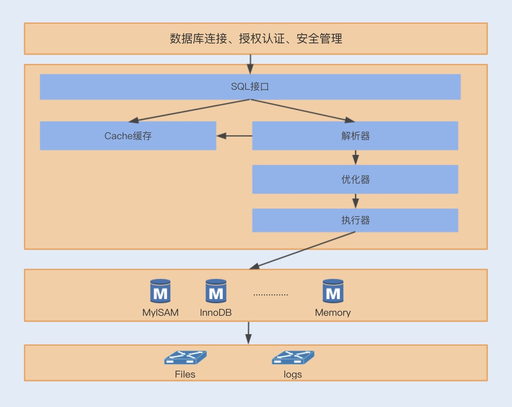

接下来我们再来了解下，当数据接收到一个SQL语句时，是如何处理的。

#### 1. 查询语句

一个应用服务需要通过第一层的连接和授权认证，再将SQL请求发送至SQL接口。

- SQL接口接收到请求之后，会先检查查询SQL是否命中Cache缓存中的数据，如果命中，则直接返回缓存中的结果；否则，需要进入解析器。
- 解析器主要对SQL进行语法以及词法分析，之后，便会进入到优化器中，优化器会生成多种执行计划方案，并选择最优方案执行。
- 确定了最优执行计划方案之后，执行器会检查连接用户是否有该表的执行权限，有则查看Buffer中是否存在该缓存，存在则获取锁，查询表数据；否则重新打开表文件，通过接口调用相应的存储引擎处理，这时存储引擎就会进入到存储文件系统中获取相应的数据，并返回结果集。

#### 2. 更新语句

数据库更新SQL的执行流程其实跟查询SQL差不多，只不过执行更新操作的时候多了记录日志的步骤。在执行更新操作时MySQL会将操作的日志记录到 binlog（归档日志）中，这个步骤所有的存储引擎都有。而InnoDB除了要记录 binlog 之外，还需要多记录一个 redo log（重做日志）。

- redo log 主要是为了解决 crash-safe 问题而引入的。我们知道，当数据库在存储数据时发生异常重启，我们需要保证存储的数据要么存储成功，要么存储失败，也就是不会出现数据丢失的情况，这就是crash-safe了。
- 我们在执行更新操作时，首先会查询相关的数据，之后通过执行器执行更新操作，并将执行结果写入到内存中，同时记录更新操作到redo log的缓存中，此时redo log中的记录状态为prepare，并通知执行器更新完成，随时可以提交事务。
- 执行器收到通知后会执行binlog的写入操作，此时的binlog是记录在缓存中的，写入成功后会调用引擎的提交事务接口，更新记录状态为commit。之后，内存中的redo log以及binlog都会刷新到磁盘文件中。

### 6.7.2 内存调优

基于以上两个SQL执行过程，我们可以发现，在执行查询SQL语句时，会涉及到两个缓存。第一个缓存是刚进来时的Query Cache，它缓存的是SQL语句和对应的结果集。这里的缓存是以查询SQL的Hash值为key，返回结果集为value的键值对，判断一条SQL是否命中缓存，是通过匹配查询SQL的Hash值来实现的。

很明显，Query Cache可以优化查询SQL语句，减少大量工作，特别是减少了I/O读取操作。我们可以通过以下几个主要的设置参数来优化查询操作：


我们可以通过设置合适的 query\_cache\_min\_res\_unit 来减少碎片，这个参数最合适的大小和应用程序查询结果的平均大小直接相关，可以通过以下公式计算所得：

```
（query\_cache\_size - Qcache\_free\_memory）/ Qcache\_queries\_in\_cache
```

Qcache\_free\_memory 和 Qcache\_queries\_in\_cache 的值可以通过以下命令查询：

```
show status like 'Qcache%'
```

Query Cache虽然可以优化查询操作，但也仅限于不常修改的数据，如果一张表数据经常进行新增、更新和删除操作，则会造成Query Cache的失效率非常高，从而导致频繁地清除Cache中的数据，给系统增加额外的性能开销。这也会导致缓存命中率非常低，我们可以通过以上查询状态的命令查看 Qcache_hits，该值表示缓存命中率。如果缓存命中率特别低的话，我们还可以通过query_cache_size = 0或者query_cache_type来关闭查询缓存。

经过了Query Cache缓存之后，还会使用到存储引擎中的Buffer缓存。不同的存储引擎，使用的Buffer也是不一样的。这里我们主要讲解两种常用的存储引擎。

#### 1. MyISAM存储引擎参数设置调优

MyISAM存储引擎使用key buffer缓存索引块，MyISAM表的数据块则没有缓存，它是直接存储在磁盘文件中的。

我们可以通过key\_buffer\_size设置key buffer缓存的大小，而它的大小并不是越大越好。正如我前面所讲的，key buffer缓存设置过大，实际应用却不大的话，就容易造成内存浪费，而且系统也容易发生SWAP页交换，一般我是建议将服务器内存中可用内存的1/4分配给key buffer。

如果要更准确地评估key buffer的设置是否合理，我们还可以通过缓存使用率公式来计算：

```plaintext
1-((key_blocks_unused*key_cache_block_size)/key_buffer_size)
```

key\_blocks\_unused表示未使用的缓存簇（blocks）数  key\_cache\_block\_size表示key\_buffer\_size被分割的区域大小key\_blocks\_unused\*key\_cache\_block\_size则表示剩余的可用缓存空间（一般来说，缓存使用率在80%作用比较合适）。

#### 2. InnoDB存储引擎参数设置调优

InnoDB Buffer Pool（简称IBP）是InnoDB存储引擎的一个缓冲池，与MyISAM存储引擎使用key buffer缓存不同，它不仅存储了表索引块，还存储了表数据。查询数据时，IBP允许快速返回频繁访问的数据，而无需访问磁盘文件。InnoDB表空间缓存越多，MySQL访问物理磁盘的频率就越低，这表示查询响应时间更快，系统的整体性能也有所提高。

我们一般可以通过多个设置参数来调整IBP，优化InnoDB表性能。

* innodb\_buffer\_pool\_size

  * IBP默认的内存大小是128M，我们可以通过参数innodb\_buffer\_pool\_size来设置IBP的大小，IBP设置得越大，InnoDB表性能就越好。但是，将IBP大小设置得过大也不好，可能会导致系统发生SWAP页交换。所以我们需要在IBP大小和其它系统服务所需内存大小之间取得平衡。MySQL推荐配置IBP的大小为服务器物理内存的80%。
  * 我们也可以通过计算InnoDB缓冲池的命中率来调整IBP大小：
  * ```plaintext
    (1-innodb_buffer_pool_reads/innodb_buffer_pool_read_request)*100
    ```
* innodb\_buffer\_pool\_instances

  * InnoDB中的IBP缓冲池被划分为了多个实例，对于具有数千兆字节的缓冲池的系统来说，将缓冲池划分为单独的实例可以减少不同线程读取和写入缓存页面时的争用，从而提高系统的并发性。该参数项仅在将innodb\_buffer\_pool\_size设置为1GB或更大时才会生效。
  * 在windows 32位操作系统中，如果innodb\_buffer\_pool\_size的大小超过1.3GB，innodb\_buffer\_pool\_instances默认大小就为innodb\_buffer\_pool\_size/128MB；否则，默认为1。
  * 而在其它操作系统中，如果innodb\_buffer\_pool\_size大小超过1GB，innodb\_buffer\_pool\_instances值就默认为8；否则，默认为1。
  * 为了获取最佳效率，建议指定innodb\_buffer\_pool\_instances的大小，并保证每个缓冲池实例至少有1GB内存。通常，建议innodb\_buffer\_pool\_instances的大小不超过innodb\_read\_io\_threads + innodb\_write\_io\_threads之和，建议实例和线程数量比例为1:1。
* innodb\_read\_io\_threads / innodb\_write\_io\_threads

  * 在默认情况下，MySQL后台线程包括了主线程、IO线程、锁线程以及监控线程等，其中读写线程属于IO线程，主要负责数据库的读取和写入操作，这些线程分别读取和写入innodb\_buffer\_pool\_instances创建的各个内存页面。MySQL支持配置多个读写线程，即通过innodb\_read\_io\_threads和innodb\_write\_io\_threads设置读写线程数量。
  * 读写线程数量值默认为4，也就是总共有8个线程同时在后台运行。innodb\_read\_io\_threads和innodb\_write\_io\_threads设置的读写线程数量，与innodb\_buffer\_pool\_instances的大小有关，两者的协同优化是提高系统性能的一个关键因素。
  * 在一些内存以及CPU内核超大型的数据库服务器上，我们可以在保证足够大的IBP内存的前提下，通过以下公式，协同增加缓存实例数量以及读写线程。```( innodb_read_io_threads + innodb_write_io_threads ) = innodb_buffe_pool_instances```
  * 如果我们仅仅是将读写线程根据缓存实例数量对半来分，即读线程和写线程各为实例大小的一半，肯定是不合理的。例如我们的应用服务读取数据库的数据多于写入数据库的数据，那么增加写入线程反而没有优化效果。我们一般可以通过MySQL服务器保存的全局统计信息，来确定系统的读取和写入比率。我们可以通过以下查询来确定读写比率：如果读大于写，我们应该考虑将读线程的数量设置得大一些，写线程数量小一些；否则，反之。
  * ```plaintext
    SHOW GLOBAL STATUS LIKE 'Com_select';//读取数量
    SHOW GLOBAL STATUS WHERE Variable_name IN ('Com_insert', 'Com_update', 'Com_replace', 'Com_delete');//写入数量
    
    ```
* innodb\_log\_file\_size

  * 除了以上InnoDB缓存等因素之外，InnoDB的日志缓存大小、日志文件大小以及日志文件持久化到磁盘的策略都影响着InnnoDB的性能。 InnoDB中有一个redo log文件，InnoDB用它来存储服务器处理的每个写请求的重做活动。执行的每个写入查询都会在日志文件中获得重做条目，以便在发生崩溃时可以恢复更改。
  * 当日志文件大小已经超过我们参数设置的日志文件大小时，InnoDB会自动切换到另外一个日志文件，由于重做日志是一个循环使用的环，在切换时，就需要将新的日志文件脏页的缓存数据刷新到磁盘中（触发检查点）。
  * 理论上来说，innodb\_log\_file\_size设置得越大，缓冲池中需要的检查点刷新活动就越少，从而节省磁盘I/O。那是不是将这个日志文件设置得越大越好呢？如果日志文件设置得太大，恢复时间就会变长，这样不便于DBA管理。在大多数情况下，我们将日志文件大小设置为1GB就足够了。
* innodb\_log\_buffer\_size

  * 这个参数决定了InnoDB重做日志缓冲池的大小，默认值为8MB。如果高并发中存在大量的事务，该值设置得太小，就会增加写入磁盘的I/O操作。我们可以通过增大该参数来减少写入磁盘操作，从而提高并发时的事务性能。
* innodb\_flush\_log\_at\_trx\_commit

  * 这个参数可以控制重做日志从缓存写入文件刷新到磁盘中的策略，默认值为1。
  * 当设置该参数为0时，InnoDB每秒种就会触发一次缓存日志写入到文件中并刷新到磁盘的操作，这有可能在数据库崩溃后，丢失1s的数据。
  * 当设置该参数为 1 时，则表示每次事务的 redo log 都会直接持久化到磁盘中，这样可以保证 MySQL 异常重启之后数据不会丢失。
  * 当设置该参数为 2 时，每次事务的 redo log 都会直接写入到文件中，再将文件刷新到磁盘。
  * 在一些对数据安全性要求比较高的场景中，显然该值需要设置为1；而在一些可以容忍数据库崩溃时丢失1s数据的场景中，我们可以将该值设置为0或2，这样可以明显地减少日志同步到磁盘的I/O操作。

### 6.7.3 总结

MySQL数据库的参数设置非常多，今天我们仅仅是了解了与内存优化相关的参数设置。除了这些参数设置，我们还有一些常用的提高MySQL并发的相关参数设置，总结如下：

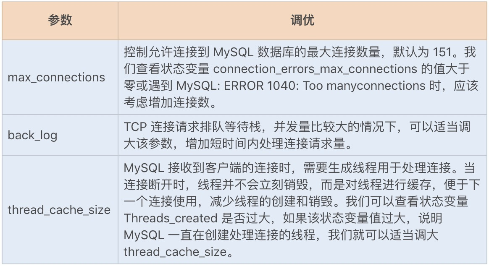

**思考题：**我们知道，InnoDB的IBP的内存大小是有限的，你知道InnoDB是如何将热点数据留在内存中，淘汰非热点数据的吗？

## 6.8 答疑课堂: MySQL中InnoDB的知识点串讲

模块六有关数据库调优的内容到本周也正式结束了，今天我们一起串下MySQL中InnoDB的知识点。InnoDB存储引擎作为我们最常用到的存储引擎之一，充分熟悉它的的实现和运行原理，有助于我们更好地创建和维护数据库表。

### 6.8.1 InnoDB体系架构

InnoDB主要包括了内存池、后台线程以及存储文件。内存池又是由多个内存块组成的，主要包括缓存磁盘数据、redo log缓冲等；后台线程则包括了Master Thread、IO Thread以及Purge Thread等；由InnoDB存储引擎实现的表的存储结构文件一般包括表结构文件（.frm）、共享表空间文件（ibdata1）、独占表空间文件（ibd）以及日志文件（redo文件等）等。

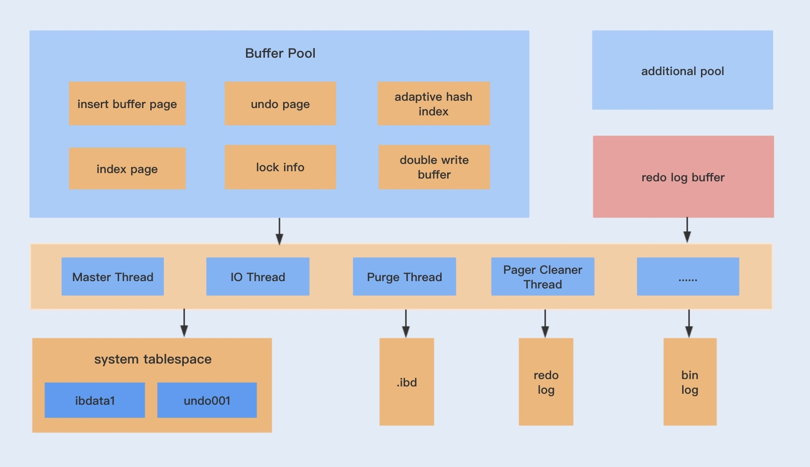

#### 1. 内存池

我们知道，如果客户端从数据库中读取数据是直接从磁盘读取的话，无疑会带来一定的性能瓶颈，缓冲池的作用就是提高整个数据库的读写性能。客户端读取数据时，如果数据存在于缓冲池中，客户端就会直接读取缓冲池中的数据，否则再去磁盘中读取；对于数据库中的修改数据，首先是修改在缓冲池中的数据，然后再通过Master Thread线程刷新到磁盘上。

理论上来说，缓冲池的内存越大越好。我们在[第38讲](https://time.geekbang.org/column/article/120160)中详细讲过了缓冲池的大小配置方式以及调优。缓冲池中不仅缓存索引页和数据页，还包括了undo页，插入缓存、自适应哈希索引以及InnoDB的锁信息等等。

InnoDB允许多个缓冲池实例，从而减少数据库内部资源的竞争，增强数据库的并发处理能力，[第38讲](https://time.geekbang.org/column/article/120160)还讲到了缓冲池实例的配置以及调优。InnoDB存储引擎会先将重做日志信息放入到缓冲区中，然后再刷新到重做日志文件中。

#### 2. 后台线程

Master Thread 主要负责将缓冲池中的数据异步刷新到磁盘中，除此之外还包括插入缓存、undo页的回收等，IO Thread是负责读写IO的线程，而Purge Thread主要用于回收事务已经提交了的undo log，Pager Cleaner Thread是新引入的一个用于协助Master Thread刷新脏页到磁盘的线程，它可以减轻Master Thread的工作压力，减少阻塞。

#### 3. 存储文件

在MySQL中建立一张表都会生成一个.frm文件，该文件是用来保存每个表的元数据信息的，主要包含表结构定义。在InnoDB中，存储数据都是按表空间进行存放的，默认为共享表空间，存储的文件即为共享表空间文件（ibdata1）。若设置了参数innodb\_file\_per\_table为1，则会将存储的数据、索引等信息单独存储在一个独占表空间，因此也会产生一个独占表空间文件（ibd）。如果你对共享表空间和独占表空间的理解还不够透彻，接下来我会详解。而日志文件则主要是重做日志文件，主要记录事务产生的重做日志，保证事务的一致性。

### 6.8.2 InnoDB逻辑存储结构

InnoDB逻辑存储结构分为表空间（Tablespace）、段(Segment)、区(Extent)、页Page)以及行(row)。

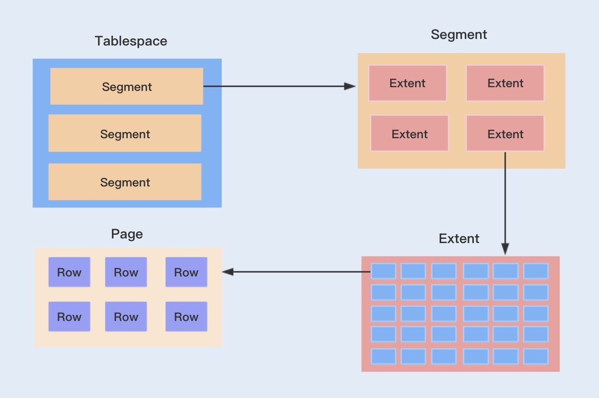

#### 1. 表空间（Tablespace）

InnoDB提供了两种表空间存储数据的方式，一种是共享表空间，一种是独占表空间。 InnoDB 默认会将其所有的表数据存储在一个共享表空间中，即ibdata1。我们可以通过设置innodb\_file\_per\_table参数为1（1代表独占方式）开启独占表空间模式。开启之后，每个表都有自己独立的表空间物理文件，所有的数据以及索引都会存储在该文件中，这样方便备份以及恢复数据。

#### 2. 段(Segment)

表空间是由各个段组成的，段一般分为数据段、索引段和回滚段等。我们知道，InnoDB默认是基于B +树实现的数据存储。这里的索引段则是指的B +树的非叶子节点，而数据段则是B +树的叶子节点。而回滚段则指的是回滚数据，之前我们在讲事务隔离的时候就介绍到了MVCC利用了回滚段实现了多版本查询数据。

#### 3. 区(Extent) / 页（Page）

区是表空间的单元结构，每个区的大小为1MB。而页是组成区的最小单元，页也是InnoDB存储引擎磁盘管理的最小单元，每个页的大小默认为16KB。为了保证页的连续性，InnoDB存储引擎每次从磁盘申请4-5个区。

#### 4. 行（Row）

InnoDB存储引擎是面向行的（row-oriented)，也就是说数据是按行进行存放的，每个页存放的行记录也是有硬性定义的，最多允许存放16KB/2-200行，即7992行记录。

### 6.8.3 InnoDB事务之redo log工作原理

InnoDB是一个事务性的存储引擎，而InnoDB的事务实现是基于事务日志redo log和undo log实现的。redo log是重做日志，提供再写入操作，实现事务的持久性；undo log是回滚日志，提供回滚操作，保证事务的一致性。redo log又包括了内存中的日志缓冲（redo log buffer）以及保存在磁盘的重做日志文件（redo log file），前者存储在内存中，容易丢失，后者持久化在磁盘中，不会丢失。

InnoDB的更新操作采用的是Write Ahead Log策略，即先写日志，再写入磁盘。当一条记录更新时，InnoDB会先把记录写入到redo log buffer中，并更新内存数据。我们可以通过参数innodb\_flush\_log\_at\_trx\_commit自定义commit时，如何将redo log buffer中的日志刷新到redo log file中。

在这里，我们需要注意的是InnoDB的redo log的大小是固定的，分别有多个日志文件采用循环方式组成一个循环闭环，当写到结尾时，会回到开头循环写日志。我们可以通过参数innodb\_log\_files\_in\_group和innodb\_log\_file\_size配置日志文件数量和每个日志文件的大小。

Buffer Pool中更新的数据未刷新到磁盘中，该内存页我们称之为脏页。最终脏页的数据会刷新到磁盘中，将磁盘中的数据覆盖，这个过程与redo log不一定有关系。只有当redo log日志满了的情况下，才会主动触发脏页刷新到磁盘，而脏页不仅只有redo log日志满了的情况才会刷新到磁盘，以下几种情况同样会触发脏页的刷新：

* 系统内存不足时，需要将一部分数据页淘汰掉，如果淘汰的是脏页，需要先将脏页同步到磁盘；
* MySQL认为空闲的时间，这种情况没有性能问题；
* MySQL正常关闭之前，会把所有的脏页刷入到磁盘，这种情况也没有性能问题。

在生产环境中，如果我们开启了慢SQL监控，你会发现偶尔会出现一些用时稍长的SQL。这是因为脏页在刷新到磁盘时可能会给数据库带来性能开销，导致数据库操作抖动。

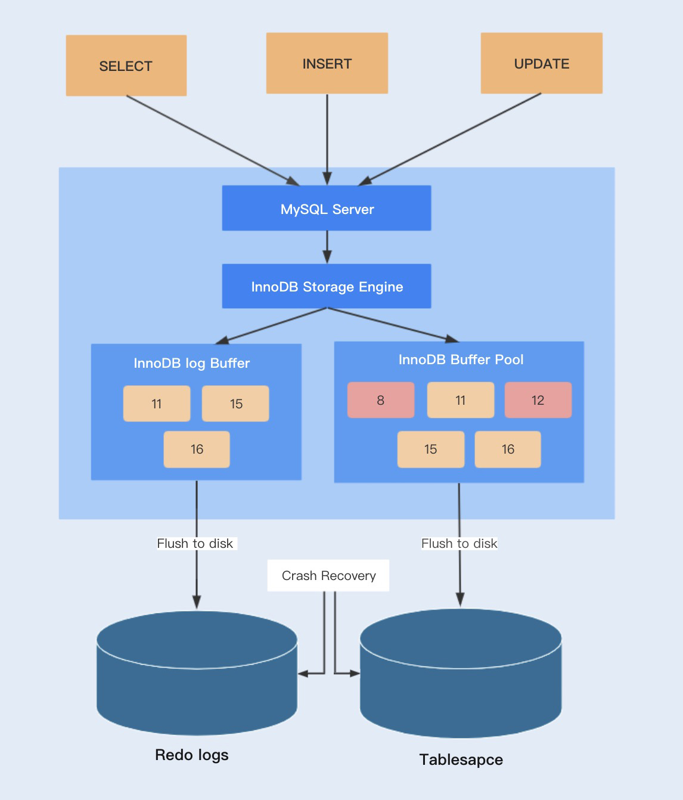

### 6.8.4 LRU淘汰策略

以上我们了解了InnoDB的更新和插入操作的具体实现原理，接下来我们再来了解下读的实现和优化方式。

InnoDB存储引擎是基于集合索引实现的数据存储，也就是除了索引列以及主键是存储在B +树之外，其它列数据也存储在B + 树的叶子节点中。而这里的索引页和数据页都会缓存在缓冲池中，在查询数据时，只要在缓冲池中存在该数据，InnoDB就不用每次都去磁盘中读取页，从而提高数据库的查询性能。

虽然缓冲池是一个很大的内存区域，但由于存放了各种类型的数据，加上存储数据量之大，缓冲池无法将所有的数据都存储在其中。因此，缓冲池需要通过LRU算法将最近且经常查询的数据缓存在其中，而不常查询的数据就淘汰出去。InnoDB对LRU做了一些优化，我们熟悉的LRU算法通常是将最近查询的数据放到LRU列表的首部，而InnoDB则是将数据放在一个midpoint位置，通常这个midpoint为列表长度的5/8。

这种策略主要是为了避免一些不常查询的操作突然将热点数据淘汰出去，而热点数据被再次查询时，需要再次从磁盘中获取，从而影响数据库的查询性能。如果我们的热点数据比较多，我们可以通过调整midpoint值来增加热点数据的存储量，从而降低热点数据的淘汰率。

### 6.8.5 总结

以上InnoDB的实现和运行原理到这里就介绍完了。回顾模块六，前三讲我主要介绍了数据库操作的性能优化，包括SQL语句、事务以及索引的优化，接下来我又讲到了数据库表优化，包括表设计、分表分库的实现等等，最后我还介绍了一些数据库参数的调优。总的来讲，作为开发工程师，我们应该掌握数据库几个大的知识点，然后再深入到数据库内部实现的细节，这样才能避免经常写出一些具有性能问题的SQL，培养调优数据库性能的能力。


# 七、实战演练场

## 7.1 如何设计更优的分布式锁


从这一讲开始，我们就正式进入最后一个模块的学习了，综合性实战的内容来自我亲身经历过的一些案例，其中用到的知识点会相对综合，现在是时候跟我一起调动下前面所学了！去年双十一，我们的游戏商城也搞了一波活动，那时候我就发现在数据库操作日志中，出现最多的一个异常就是Interrupted Exception了，几乎所有的异常都是来自一个校验订单幂等性的SQL。


因为校验订单幂等性是提交订单业务中第一个操作数据库的，所以幂等性校验也就承受了比较大的请求量，再加上我们还是基于一个数据库表来实现幂等性校验的，所以出现了一些请求事务超时，事务被中断的情况。其实基于数据库实现的幂等性校验就是一种分布式锁的实现。那什么是分布式锁呢，它又是用来解决哪些问题的呢？在JVM中，在多线程并发的情况下，我们可以使用同步锁或Lock锁，保证在同一时间内，只能有一个线程修改共享变量或执行代码块。但现在我们的服务基本都是基于分布式集群来实现部署的，对于一些共享资源，例如我们之前讨论过的库存，在分布式环境下使用Java锁的方式就失去作用了。


这时，我们就需要实现分布式锁来保证共享资源的原子性。除此之外，分布式锁也经常用来避免分布式中的不同节点执行重复性的工作，例如一个定时发短信的任务，在分布式集群中，我们只需要保证一个服务节点发送短信即可，一定要避免多个节点重复发送短信给同一个用户。因为数据库实现一个分布式锁比较简单易懂，直接基于数据库实现就行了，不需要再引入第三方中间件，所以这是很多分布式业务实现分布式锁的首选。但是数据库实现的分布式锁在一定程度上，存在性能瓶颈。 接下来我们一起了解下如何使用数据库实现分布式锁，其性能瓶颈到底在哪，有没有其它实现方式可以优化分布式锁。


### 7.1.1 数据库实现分布式锁

首先，我们应该创建一个锁表，通过创建和查询数据来保证一个数据的原子性：

```
CREATE TABLE `order`  (
  `id` int(11) NOT NULL AUTO_INCREMENT,
  `order_no` int(11) DEFAULT NULL,
  `pay_money` decimal(10, 2) DEFAULT NULL,
  `status` int(4) DEFAULT NULL,
  `create_date` datetime(0) DEFAULT NULL,
  `delete_flag` int(4) DEFAULT NULL,
  PRIMARY KEY (`id`) USING BTREE,
  INDEX `idx_status`(`status`) USING BTREE,
  INDEX `idx_order`(`order_no`) USING BTREE
) ENGINE = InnoDB
```

其次，如果是校验订单的幂等性，就要先查询该记录是否存在数据库中，查询的时候要防止幻读，如果不存在，就插入到数据库，否则，放弃操作。

```
select id from `order` where `order_no`= 'xxxx' for update
```

最后注意下，除了查询时防止幻读，我们还需要保证查询和插入是在同一个事务中，因此我们需要申明事务，具体的实现代码如下：

```
	@Transactional
	public int addOrderRecord(Order order) {
		if(orderDao.selectOrderRecord(order)==null){
               int result = orderDao.addOrderRecord(order);
              if(result>0){
                      return 1;
              }
         }
		return 0;
	}
```

到这，我们订单幂等性校验的分布式锁就实现了。我想你应该能发现为什么这种方式会存在性能瓶颈了。我们在[第34讲](https://time.geekbang.org/column/article/116369)中讲过，在RR事务级别，select的for update操作是基于间隙锁gap lock实现的，这是一种悲观锁的实现方式，所以存在阻塞问题。因此在高并发情况下，当有大量的请求进来时，大部分的请求都会进行排队等待。为了保证数据库的稳定性，事务的超时时间往往又设置得很小，所以就会出现大量事务被中断的情况。


除了阻塞等待之外，因为订单没有删除操作，所以这张锁表的数据将会逐渐累积，我们需要设置另外一个线程，隔一段时间就去删除该表中的过期订单，这就增加了业务的复杂度。除了这种幂等性校验的分布式锁，有一些单纯基于数据库实现的分布式锁代码块或对象，是需要在锁释放时，删除或修改数据的。如果在获取锁之后，锁一直没有获得释放，即数据没有被删除或修改，这将会引发死锁问题。


### 7.1.2 Zookeeper实现分布式锁

除了数据库实现分布式锁的方式以外，我们还可以基于Zookeeper实现。Zookeeper是一种提供“分布式服务协调“的中心化服务，正是Zookeeper的以下两个特性，分布式应用程序才可以基于它实现分布式锁功能。


**顺序临时节点：**Zookeeper提供一个多层级的节点命名空间（节点称为Znode），每个节点都用一个以斜杠（/）分隔的路径来表示，而且每个节点都有父节点（根节点除外），非常类似于文件系统。


节点类型可以分为持久节点（PERSISTENT ）、临时节点（EPHEMERAL），每个节点还能被标记为有序性（SEQUENTIAL），一旦节点被标记为有序性，那么整个节点就具有顺序自增的特点。一般我们可以组合这几类节点来创建我们所需要的节点，例如，创建一个持久节点作为父节点，在父节点下面创建临时节点，并标记该临时节点为有序性。


**Watch机制：**Zookeeper还提供了另外一个重要的特性，Watcher（事件监听器）。ZooKeeper允许用户在指定节点上注册一些Watcher，并且在一些特定事件触发的时候，ZooKeeper服务端会将事件通知给用户。


我们熟悉了Zookeeper的这两个特性之后，就可以看看Zookeeper是如何实现分布式锁的了。首先，我们需要建立一个父节点，节点类型为持久节点（PERSISTENT） ，每当需要访问共享资源时，就会在父节点下建立相应的顺序子节点，节点类型为临时节点（EPHEMERAL），且标记为有序性（SEQUENTIAL），并且以临时节点名称+父节点名称+顺序号组成特定的名字。在建立子节点后，对父节点下面的所有以临时节点名称name开头的子节点进行排序，判断刚刚建立的子节点顺序号是否是最小的节点，如果是最小节点，则获得锁。如果不是最小节点，则阻塞等待锁，并且获得该节点的上一顺序节点，为其注册监听事件，等待节点对应的操作获得锁。当调用完共享资源后，删除该节点，关闭zk，进而可以触发监听事件，释放该锁。


以上实现的分布式锁是严格按照顺序访问的并发锁。一般我们还可以直接引用Curator框架来实现Zookeeper分布式锁，代码如下：

```
InterProcessMutex lock = new InterProcessMutex(client, lockPath);
if ( lock.acquire(maxWait, waitUnit) ) 
{
    try 
    {
        // do some work inside of the critical section here
    }
    finally
    {
        lock.release();
    }
}
```

Zookeeper实现的分布式锁，例如相对数据库实现，有很多优点。Zookeeper是集群实现，可以避免单点问题，且能保证每次操作都可以有效地释放锁，这是因为一旦应用服务挂掉了，临时节点会因为session连接断开而自动删除掉。由于频繁地创建和删除结点，加上大量的Watch事件，对Zookeeper集群来说，压力非常大。且从性能上来说，其与接下来我要讲的Redis实现的分布式锁相比，还是存在一定的差距。


### 7.1.3 Redis实现分布式锁

相对于前两种实现方式，基于Redis实现的分布式锁是最为复杂的，但性能是最佳的。大部分开发人员利用Redis实现分布式锁的方式，都是使用SETNX+EXPIRE组合来实现，在Redis 2.6.12版本之前，具体实现代码如下：

```
public static boolean tryGetDistributedLock(Jedis jedis, String lockKey, String requestId, int expireTime) {

    Long result = jedis.setnx(lockKey, requestId);//设置锁
    if (result == 1) {//获取锁成功
        // 若在这里程序突然崩溃，则无法设置过期时间，将发生死锁
        jedis.expire(lockKey, expireTime);//通过过期时间删除锁
        return true;
    }
    return false;
}
```

这种方式实现的分布式锁，是通过setnx()方法设置锁，如果lockKey存在，则返回失败，否则返回成功。设置成功之后，为了能在完成同步代码之后成功释放锁，方法中还需要使用expire()方法给lockKey值设置一个过期时间，确认key值删除，避免出现锁无法释放，导致下一个线程无法获取到锁，即死锁问题。如果程序在设置过期时间之前、设置锁之后出现崩溃，此时如果lockKey没有设置过期时间，将会出现死锁问题。


在 Redis 2.6.12版本后SETNX增加了过期时间参数：

```
    private static final String LOCK_SUCCESS = "OK";
    private static final String SET_IF_NOT_EXIST = "NX";
    private static final String SET_WITH_EXPIRE_TIME = "PX";

    /**
     * 尝试获取分布式锁
     * @param jedis Redis客户端
     * @param lockKey 锁
     * @param requestId 请求标识
     * @param expireTime 超期时间
     * @return 是否获取成功
     */
    public static boolean tryGetDistributedLock(Jedis jedis, String lockKey, String requestId, int expireTime) {

        String result = jedis.set(lockKey, requestId, SET_IF_NOT_EXIST, SET_WITH_EXPIRE_TIME, expireTime);

        if (LOCK_SUCCESS.equals(result)) {
            return true;
        }
        return false;

    }
```

我们也可以通过Lua脚本来实现锁的设置和过期时间的原子性，再通过jedis.eval()方法运行该脚本：

```
    // 加锁脚本
    private static final String SCRIPT_LOCK = "if redis.call('setnx', KEYS[1], ARGV[1]) == 1 then redis.call('pexpire', KEYS[1], ARGV[2]) return 1 else return 0 end";
    // 解锁脚本
    private static final String SCRIPT_UNLOCK = "if redis.call('get', KEYS[1]) == ARGV[1] then return redis.call('del', KEYS[1]) else return 0 end";
```

虽然SETNX方法保证了设置锁和过期时间的原子性，但如果我们设置的过期时间比较短，而执行业务时间比较长，就会存在锁代码块失效的问题。我们需要将过期时间设置得足够长，来保证以上问题不会出现。这个方案是目前最优的分布式锁方案，但如果是在Redis集群环境下，依然存在问题。由于Redis集群数据同步到各个节点时是异步的，如果在Master节点获取到锁后，在没有同步到其它节点时，Master节点崩溃了，此时新的Master节点依然可以获取锁，所以多个应用服务可以同时获取到锁。


### 7.1.4 Redlock算法

Redisson由Redis官方推出，它是一个在Redis的基础上实现的Java驻内存数据网格（In-Memory Data Grid）。它不仅提供了一系列的分布式的Java常用对象，还提供了许多分布式服务。Redisson是基于netty通信框架实现的，所以支持非阻塞通信，性能相对于我们熟悉的Jedis会好一些。


Redisson中实现了Redis分布式锁，且支持单点模式和集群模式。在集群模式下，Redisson使用了Redlock算法，避免在Master节点崩溃切换到另外一个Master时，多个应用同时获得锁。我们可以通过一个应用服务获取分布式锁的流程，了解下Redlock算法的实现：


在不同的节点上使用单个实例获取锁的方式去获得锁，且每次获取锁都有超时时间，如果请求超时，则认为该节点不可用。当应用服务成功获取锁的Redis节点超过半数（N/2+1，N为节点数)时，并且获取锁消耗的实际时间不超过锁的过期时间，则获取锁成功。一旦获取锁成功，就会重新计算释放锁的时间，该时间是由原来释放锁的时间减去获取锁所消耗的时间；而如果获取锁失败，客户端依然会释放获取锁成功的节点。


具体的代码实现如下：

1.首先引入jar包：

```
<dependency>
      <groupId>org.redisson</groupId>
      <artifactId>redisson</artifactId>
      <version>3.8.2</version>
</dependency>
```

2.实现Redisson的配置文件：

```
@Bean
public RedissonClient redissonClient() {
    Config config = new Config();
    config.useClusterServers()
            .setScanInterval(2000) // 集群状态扫描间隔时间，单位是毫秒
            .addNodeAddress("redis://127.0.0.1:7000).setPassword("1")
            .addNodeAddress("redis://127.0.0.1:7001").setPassword("1")
            .addNodeAddress("redis://127.0.0.1:7002")
            .setPassword("1");
    return Redisson.create(config);
}
```

3.获取锁操作：

```
long waitTimeout = 10;
long leaseTime = 1;
RLock lock1 = redissonClient1.getLock("lock1");
RLock lock2 = redissonClient2.getLock("lock2");
RLock lock3 = redissonClient3.getLock("lock3");

RedissonRedLock redLock = new RedissonRedLock(lock1, lock2, lock3);
// 同时加锁：lock1 lock2 lock3
// 红锁在大部分节点上加锁成功就算成功，且设置总超时时间以及单个节点超时时间
redLock.trylock(waitTimeout,leaseTime,TimeUnit.SECONDS);
...
redLock.unlock();
```

### 7.1.5 总结

实现分布式锁的方式有很多，有最简单的数据库实现，还有Zookeeper多节点实现和缓存实现。我们可以分别对这三种实现方式进行性能压测，可以发现在同样的服务器配置下，Redis的性能是最好的，Zookeeper次之，数据库最差。从实现方式和可靠性来说，Zookeeper的实现方式简单，且基于分布式集群，可以避免单点问题，具有比较高的可靠性。因此，在对业务性能要求不是特别高的场景中，我建议使用Zookeeper实现的分布式锁。


思考题

我们知道Redis分布式锁在集群环境下会出现不同应用服务同时获得锁的可能，而Redisson中的Redlock算法很好地解决了这个问题。那Redisson实现的分布式锁是不是就一定不会出现同时获得锁的可能呢？


## 7.2 电商系统的分布式事务调优

今天的分享也是从案例开始。我们团队曾经遇到过一个非常严重的线上事故，在一次DBA完成单台数据库线上补丁后，系统偶尔会出现异常报警，我们的开发工程师很快就定位到了数据库异常问题。


具体情况是这样的，当玩家购买道具之后，扣除通宝时出现了异常。这种异常在正常情况下发生之后，应该是整个购买操作都需要撤销，然而这次异常的严重性就是在于玩家购买道具成功后，没有扣除通宝。究其原因是由于购买的道具更新的是游戏数据库，而通宝是在用户账户中心数据库，在一次购买道具时，存在同时操作两个数据库的情况，属于一种分布式事务。而我们的工程师在完成玩家获得道具和扣除余额的操作时，没有做到事务的一致性，即在扣除通宝失败时，应该回滚已经购买的游戏道具。


**从这个案例中，我想你应该意识到了分布式事务的重要性。**如今，大部分公司的服务基本都实现了微服务化，首先是业务需求，为了解耦业务；其次是为了减少业务与业务之间的相互影响。电商系统亦是如此，大部分公司的电商系统都是分为了不同服务模块，例如商品模块、订单模块、库存模块等等。事实上，分解服务是一把双刃剑，可以带来一些开发、性能以及运维上的优势，但同时也会增加业务开发的逻辑复杂度。其中最为突出的就是分布式事务了。通常，存在分布式事务的服务架构部署有以下两种：同服务不同数据库，不同服务不同数据库。我们以商城为例，用图示说明下这两种部署：


通常，我们都是基于第二种架构部署实现的，那我们应该如何实现在这种服务架构下，有关订单提交业务的分布式事务呢？


### 7.2.1 分布式事务解决方案

我们讲过，在单个数据库的情况下，数据事务操作具有ACID四个特性，但如果在一个事务中操作多个数据库，则无法使用数据库事务来保证一致性。也就是说，当两个数据库操作数据时，可能存在一个数据库操作成功，而另一个数据库操作失败的情况，我们无法通过单个数据库事务来回滚两个数据操作。


而分布式事务就是为了解决在同一个事务下，不同节点的数据库操作数据不一致的问题。在一个事务操作请求多个服务或多个数据库节点时，要么所有请求成功，要么所有请求都失败回滚回去。通常，分布式事务的实现有多种方式，例如XA协议实现的二阶提交（2PC）、三阶提交(3PC)，以及TCC补偿性事务。在了解2PC和3PC之前，我们有必要先来了解下XA协议。XA协议是由X/Open组织提出的一个分布式事务处理规范，目前MySQL中只有InnoDB存储引擎支持XA协议。


### 7.2.2  XA规范

在XA规范之前，存在着一个DTP模型，该模型规范了分布式事务的模型设计。DTP规范中主要包含了AP、RM、TM三个部分，其中AP是应用程序，是事务发起和结束的地方；RM是资源管理器，主要负责管理每个数据库的连接数据源；TM是事务管理器，负责事务的全局管理，包括事务的生命周期管理和资源的分配协调等。


XA则规范了TM与RM之间的通信接口，在TM与多个RM之间形成一个双向通信桥梁，从而在多个数据库资源下保证ACID四个特性。这里强调一下，JTA是基于XA规范实现的一套Java事务编程接口，是一种两阶段提交事务。我们可以通过[源码](https://github.com/nickliuchao/jta)简单了解下JTA实现的多数据源事务提交。


### 7.2.3 XA规范实现的分布式事务属于二阶提交事务，顾名思义就是通过两个阶段来实现事务的提交。


在第一阶段，应用程序向事务管理器（TM）发起事务请求，而事务管理器则会分别向参与的各个资源管理器（RM）发送事务预处理请求（Prepare），此时这些资源管理器会打开本地数据库事务，然后开始执行数据库事务，但执行完成后并不会立刻提交事务，而是向事务管理器返回已就绪（Ready）或未就绪（Not Ready）状态。如果各个参与节点都返回状态了，就会进入第二阶段。


到了第二阶段，如果资源管理器返回的都是就绪状态，事务管理器则会向各个资源管理器发送提交（Commit）通知，资源管理器则会完成本地数据库的事务提交，最终返回提交结果给事务管理器。


在第二阶段中，如果任意资源管理器返回了未就绪状态，此时事务管理器会向所有资源管理器发送事务回滚（Rollback）通知，此时各个资源管理器就会回滚本地数据库事务，释放资源，并返回结果通知。


但事实上，二阶事务提交也存在一些缺陷。


- 第一，在整个流程中，我们会发现各个资源管理器节点存在阻塞，只有当所有的节点都准备完成之后，事务管理器才会发出进行全局事务提交的通知，这个过程如果很长，则会有很多节点长时间占用资源，从而影响整个节点的性能。一旦资源管理器挂了，就会出现一直阻塞等待的情况。类似问题，我们可以通过设置事务超时时间来解决。
- 第二，仍然存在数据不一致的可能性，例如，在最后通知提交全局事务时，由于网络故障，部分节点有可能收不到通知，由于这部分节点没有提交事务，就会导致数据不一致的情况出现。


**而三阶事务（3PC）的出现就是为了减少此类问题的发生。**3PC把2PC的准备阶段分为了准备阶段和预处理阶段，在第一阶段只是询问各个资源节点是否可以执行事务，而在第二阶段，所有的节点反馈可以执行事务，才开始执行事务操作，最后在第三阶段执行提交或回滚操作。并且在事务管理器和资源管理器中都引入了超时机制，如果在第三阶段，资源节点一直无法收到来自资源管理器的提交或回滚请求，它就会在超时之后，继续提交事务。


所以3PC可以通过超时机制，避免管理器挂掉所造成的长时间阻塞问题，但其实这样还是无法解决在最后提交全局事务时，由于网络故障无法通知到一些节点的问题，特别是回滚通知，这样会导致事务等待超时从而默认提交。


### 7.2.4 事务补偿机制（TCC）

以上这种基于XA规范实现的事务提交，由于阻塞等性能问题，有着比较明显的低性能、低吞吐的特性。所以在抢购活动中使用该事务，很难满足系统的并发性能。除了性能问题，JTA只能解决同一服务下操作多数据源的分布式事务问题，换到微服务架构下，可能存在同一个事务操作，分别在不同服务上连接数据源，提交数据库操作。


而TCC正是为了解决以上问题而出现的一种分布式事务解决方案。TCC采用最终一致性的方式实现了一种柔性分布式事务，与XA规范实现的二阶事务不同的是，TCC的实现是基于服务层实现的一种二阶事务提交。TCC分为三个阶段，即Try、Confirm、Cancel三个阶段。


- Try阶段：主要尝试执行业务，执行各个服务中的Try方法，主要包括预留操作；
- Confirm阶段：确认Try中的各个方法执行成功，然后通过TM调用各个服务的Confirm方法，这个阶段是提交阶段；
- Cancel阶段：当在Try阶段发现其中一个Try方法失败，例如预留资源失败、代码异常等，则会触发TM调用各个服务的Cancel方法，对全局事务进行回滚，取消执行业务。

以上执行只是保证Try阶段执行时成功或失败的提交和回滚操作，你肯定会想到，如果在Confirm和Cancel阶段出现异常情况，那TCC该如何处理呢？此时TCC会不停地重试调用失败的Confirm或Cancel方法，直到成功为止。但TCC补偿性事务也有比较明显的缺点，那就是对业务的侵入性非常大。


首先，我们需要在业务设计的时候考虑预留资源；然后，我们需要编写大量业务性代码，例如Try、Confirm、Cancel方法；最后，我们还需要为每个方法考虑幂等性。这种事务的实现和维护成本非常高，但综合来看，这种实现是目前大家最常用的分布式事务解决方案。


### 7.2.5 业务无侵入方案——Seata(Fescar)

Seata是阿里去年开源的一套分布式事务解决方案，开源一年多已经有一万多star了，可见受欢迎程度非常之高。Seata的基础建模和DTP模型类似，只不过前者是将事务管理器分得更细了，抽出一个事务协调器（Transaction Coordinator 简称TC），主要维护全局事务的运行状态，负责协调并驱动全局事务的提交或回滚。而TM则负责开启一个全局事务，并最终发起全局提交或全局回滚的决议。如下图所示：


按照[Github](https://github.com/seata/seata)中的说明介绍，整个事务流程为：

- TM 向 TC 申请开启一个全局事务，全局事务创建成功并生成一个全局唯一的 XID；
- XID 在微服务调用链路的上下文中传播；
- RM 向 TC 注册分支事务，将其纳入 XID 对应全局事务的管辖；
- TM 向 TC 发起针对 XID 的全局提交或回滚决议；
- TC 调度 XID 下管辖的全部分支事务完成提交或回滚请求。

Seata与其它分布式最大的区别在于，它在第一提交阶段就已经将各个事务操作commit了。Seata认为在一个正常的业务下，各个服务提交事务的大概率是成功的，这种事务提交操作可以节约两个阶段持有锁的时间，从而提高整体的执行效率。那如果在第一阶段就已经提交了事务，那我们还谈何回滚呢？


**Seata将RM提升到了服务层，通过JDBC数据源代理解析SQL，把业务数据在更新前后的数据镜像组织成回滚日志，利用本地事务的 ACID 特性，将业务数据的更新和回滚日志的写入在同一个本地事务中提交。如果TC决议要全局回滚，会通知RM进行回滚操作，通过XID找到对应的回滚日志记录，通过回滚记录生成反向更新SQL，进行更新回滚操作。** 

以上我们可以保证一个事务的原子性和一致性，但隔离性如何保证呢？Seata设计通过事务协调器维护的全局写排它锁，来保证事务间的写隔离，而读写隔离级别则默认为未提交读的隔离级别。


### 7.2.6 JTA使用例子

Java Transaction API（JTA）提供了一种允许Java应用程序在分布式环境中管理事务的标准接口。通过JTA，开发者可以确保一系列操作要么全部成功，要么全部失败。这在处理涉及数据库、消息队列或其他资源的分布式事务时尤其有用。

下面是一个示例，演示如何在Java中使用JTA管理一个涉及订单处理的事务。假设我们有两个数据库操作：一个用于插入订单记录，另一个用于更新库存记录。我们希望确保这两个操作要么都成功要么都失败。

- 依赖

首先，确保项目中包含了所需的JTA依赖。例如，可以通过Maven引入`javax.transaction`:

```xml
<dependency>
    <groupId>javax.transaction</groupId>
    <artifactId>javax.transaction-api</artifactId>
    <version>1.3</version>
</dependency>
```

- 示例代码

以下是一个使用JTA管理事务的示例代码：

```java
import javax.naming.InitialContext;
import javax.transaction.UserTransaction;
import java.sql.Connection;
import java.sql.DriverManager;
import java.sql.PreparedStatement;
import java.sql.SQLException;

public class OrderService {
    private static final String DB_URL = "jdbc:mysql://localhost:3306/mydatabase";
    private static final String DB_USER = "root";
    private static final String DB_PASSWORD = "password";

    public static void main(String[] args) {
        UserTransaction userTransaction = null;
        Connection connection1 = null;
        Connection connection2 = null;

        try {
            // 获取UserTransaction
            InitialContext ctx = new InitialContext();
            userTransaction = (UserTransaction) ctx.lookup("java:comp/UserTransaction");

            // 启动事务
            userTransaction.begin();

            // 获取数据库连接
            connection1 = DriverManager.getConnection(DB_URL, DB_USER, DB_PASSWORD);
            connection2 = DriverManager.getConnection(DB_URL, DB_USER, DB_PASSWORD);

            // 执行订单插入操作
            String insertOrderSql = "INSERT INTO orders (order_id, product_id, quantity) VALUES (?, ?, ?)";
            try (PreparedStatement insertOrderStmt = connection1.prepareStatement(insertOrderSql)) {
                insertOrderStmt.setInt(1, 1);
                insertOrderStmt.setInt(2, 101);
                insertOrderStmt.setInt(3, 2);
                insertOrderStmt.executeUpdate();
            }

            // 执行库存更新操作
            String updateStockSql = "UPDATE stock SET quantity = quantity - ? WHERE product_id = ?";
            try (PreparedStatement updateStockStmt = connection2.prepareStatement(updateStockSql)) {
                updateStockStmt.setInt(1, 2);
                updateStockStmt.setInt(2, 101);
                updateStockStmt.executeUpdate();
            }

            // 提交事务
            userTransaction.commit();
            System.out.println("Order and stock updates committed successfully!");

        } catch (Exception e) {
            e.printStackTrace();
            try {
                if (userTransaction != null) {
                    // 回滚事务
                    userTransaction.rollback();
                    System.out.println("Transaction rolled back due to error.");
                }
            } catch (Exception rollbackEx) {
                rollbackEx.printStackTrace();
            }
        } finally {
            try {
                if (connection1 != null) {
                    connection1.close();
                }
                if (connection2 != null) {
                    connection2.close();
                }
            } catch (SQLException e) {
                e.printStackTrace();
            }
        }
    }
}
```

说获取`UserTransaction`**：使用`InitialContext`查找JTA的`UserTransaction`对象。

2. **开始事务**：调用`userTransaction.begin()`开始一个新的事务。
3. **数据库操作**：执行订单插入和库存更新的SQL操作。
4. **提交事务**：在所有操作成功后，调用`userTransaction.commit()`提交事务。
5. **回滚事务**：如果出现异常，调用`userTransaction.rollback()`回滚事务，确保部分完成的操作不会生效。
6. **关闭资源**：最终确保数据库连接关闭，以释放资源。

请注意，上述示例是假设在应用服务器中运行，该应用服务器支持JTA。如果在单独的Java SE环境中运行，可能需要使用其他方式配置JTA实现。

### 7.3.7 TCC使用例子

TCC（Try-Confirm-Cancel）是分布式系统中常用的事务机制之一，在Java中实现TCC通常涉及多个服务的协调。下面是一个简单的例子，展示了如何使用TCC模式进行事务管理。

假设我们有两个微服务，一个用于订单服务（Order Service），另一个用于库存服务（Inventory Service）。目标是在下订单时，保证订单的创建与库存的扣减是一个原子操作。

#### 1. Order Service

**OrderService.java**

```
public class OrderService {

    private InventoryService inventoryService;

    public OrderService(InventoryService inventoryService) {
        this.inventoryService = inventoryService;
    }

    // Try step: Reserve inventory for the order
    public boolean tryCreateOrder(Order order) {
        boolean inventoryReserved = inventoryService.reserveInventory(order.getProductId(), order.getQuantity());
        if (inventoryReserved) {
            // Save order in 'pending' state
            saveOrder(order, "PENDING");
            return true;
        }
        return false;
    }

    // Confirm step: Confirm the order and inventory reservation
    public void confirmCreateOrder(Order order) {
        // Update order status to 'CONFIRMED'
        updateOrderStatus(order.getOrderId(), "CONFIRMED");
        inventoryService.confirmInventory(order.getProductId(), order.getQuantity());
    }

    // Cancel step: Rollback the order and inventory reservation
    public void cancelCreateOrder(Order order) {
        // Update order status to 'CANCELLED'
        updateOrderStatus(order.getOrderId(), "CANCELLED");
        inventoryService.releaseInventory(order.getProductId(), order.getQuantity());
    }

    private void saveOrder(Order order, String status) {
        // Implementation for saving order
    }

    private void updateOrderStatus(String orderId, String status) {
        // Implementation for updating order status
    }
}
```

#### 2. Inventory Service

**InventoryService.java**

```
public class InventoryService {

    // Try step: Reserve inventory
    public boolean reserveInventory(String productId, int quantity) {
        // Check inventory and mark as reserved
        // Return true if successful
    }

    // Confirm step: Reduce inventory
    public void confirmInventory(String productId, int quantity) {
        // Reduce the quantity from inventory
    }

    // Cancel step: Release the reserved inventory
    public void releaseInventory(String productId, int quantity) {
        // Add the reserved quantity back to inventory
    }
}
```

#### 3. Main Logic

**Main.java**

```
public class Main {
    public static void main(String[] args) {
        InventoryService inventoryService = new InventoryService();
        OrderService orderService = new OrderService(inventoryService);

        Order order = new Order("orderId1", "productId1", 3);

        boolean trySuccess = orderService.tryCreateOrder(order);
        if (trySuccess) {
            // Business logic might happen here

            // Assuming business logic succeeded
            boolean businessLogicSuccess = true;

            if (businessLogicSuccess) {
                orderService.confirmCreateOrder(order);
            } else {
                orderService.cancelCreateOrder(order);
            }
        } else {
            System.out.println("Failed to reserve inventory.");
        }
    }
}

class Order {
    private String orderId;
    private String productId;
    private int quantity;

    // Constructor, getters, and setters
    public Order(String orderId, String productId, int quantity) {
        this.orderId = orderId;
        this.productId = productId;
        this.quantity = quantity;
    }

    public String getOrderId() {
        return orderId;
    }

    public String getProductId() {
        return productId;
    }

    public int getQuantity() {
        return quantity;
    }
}
```

这个简单的示例展示了如何在Java中使用TCC模式处理分布式事务。关键在于三个步骤：Try、Confirm 和 Cancel。`tryCreateOrder`方法试图保留库存并创建一个处于“等待”状态的订单。根据业务逻辑的成功与否，我们选择调用 `confirmCreateOrder` 或 `cancelCreateOrder` 方法来确认或取消事务。

### 7.2.6 总结

在同服务多数据源操作不同数据库的情况下，我们可以使用基于XA规范实现的分布式事务，在Spring中有成熟的JTA框架实现了XA规范的二阶事务提交。事实上，二阶事务除了性能方面存在严重的阻塞问题之外，还有可能导致数据不一致，我们应该慎重考虑使用这种二阶事务提交。


在跨服务的分布式事务下，我们可以考虑基于TCC实现的分布式事务，常用的中间件有TCC-Transaction。TCC也是基于二阶事务提交原理实现的，但TCC的二阶事务提交是提到了服务层实现。TCC方式虽然提高了分布式事务的整体性能，但也给业务层带来了非常大的工作量，对应用服务的侵入性非常强，但这是大多数公司目前所采用的分布式事务解决方案。


Seata是一种高效的分布式事务解决方案，设计初衷就是解决分布式带来的性能问题以及侵入性问题。但目前Seata的稳定性有待验证，例如，在TC通知RM开始提交事务后，TC与RM的连接断开了，或者RM与数据库的连接断开了，都不能保证事务的一致性。


Seata在第一阶段已经提交了事务，那如果在第二阶段发生了异常要回滚到Before快照前，别的线程若是更新了数据，且业务走完了，那么恢复的这个快照不就是脏数据了吗？但事实上，Seata是不会出现这种情况的，你知道它是怎么做到的吗？
