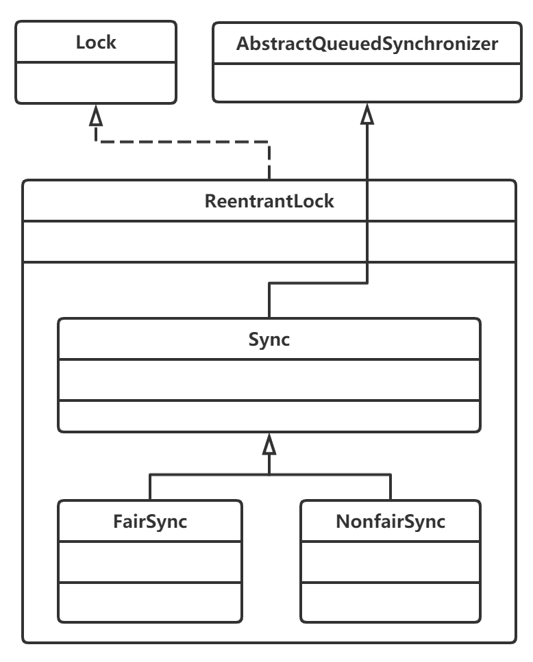
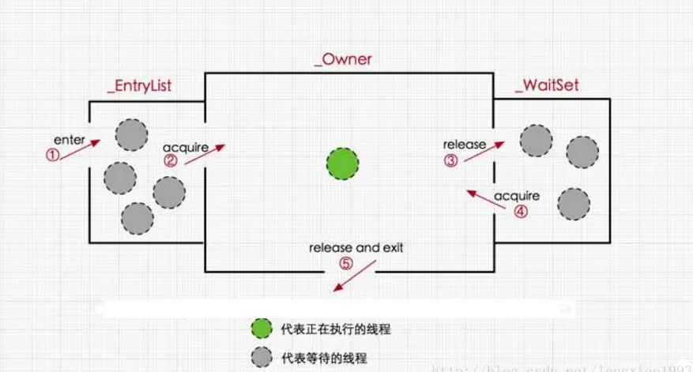
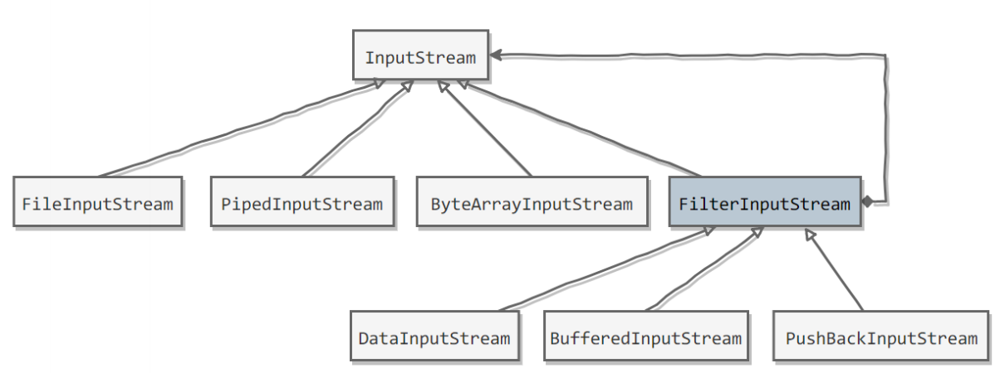
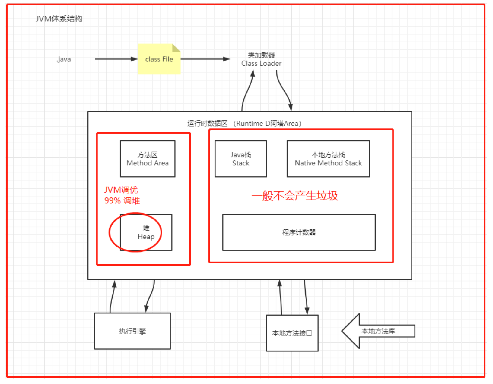
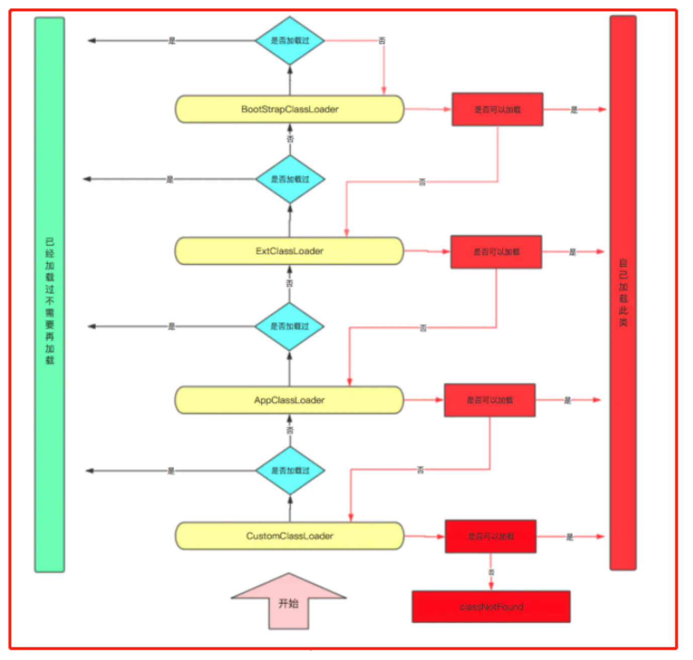
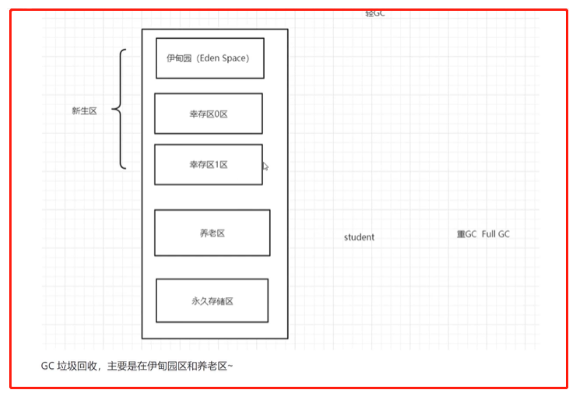
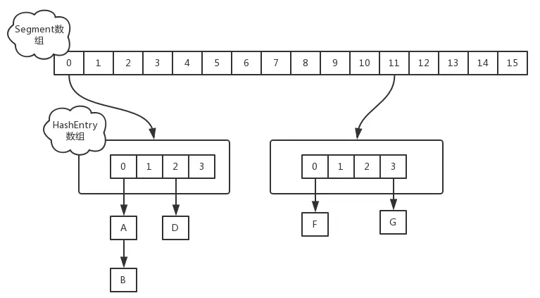
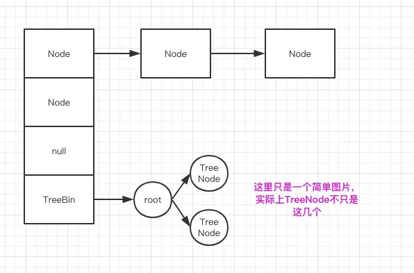

# Java

[TOC]

# 一、基本语法

## 1.1 基础知识

## 1.1.1 Java 版本

> https://zh.wikipedia.org/zh-cn/Java%E7%89%88%E6%9C%AC%E6%AD%B7%E5%8F%B2

## 1.2 常用类型

### 1.2.1 List

```java
ArrayList<String> list = new ArrayList<>();
list.add("Apple");
list.add("Banana");
list.add("Cherry");
String element = list.get(1); // 获取索引为1的元素，即 "Banana"
list.set(0, "Orange"); // 将索引为0的元素修改为 "Orange"
list.remove(2); // 删除索引为2的元素，即 "Cherry"
int size = list.size();
for (String item : list) {
    System.out.println(item);
}
boolean contains = list.contains("Apple");
list.clear();

```

#### ArrayList

```java
 DEFAULT_CAPACITY = 10
```

- 负载因子

- 扩容方法

  ```java
  int newCapacity = ArraysSupport.newLength(oldCapacity,
          minCapacity - oldCapacity, /* minimum growth */
          oldCapacity >> 1 
  ```

### 

### 1.2.2 Stack 

```java
Stack<Integer> stack = new Stack<>();
stack.push(1);
stack.push(2);
stack.push(3);
int topElement = stack.pop(); // 移除并返回栈顶元素
int topElement = stack.peek(); // 查看栈顶元素但不移除
boolean isEmpty = stack.isEmpty(); // 检查栈是否为空
```

### 1.2.3 队列

- 普通队列

  - ```java
    Queue<Integer> queue = new LinkedList<>();
    queue.offer(1);
    queue.offer(2);
    queue.offer(3);
    int frontElement = queue.poll(); // 移除并返回队列头部的元素
    int frontElement = queue.peek(); // 查看队列头部的元素但不移除
    boolean isEmpty = queue.isEmpty(); // 检查队列是否为空
    ```

  

- 双端队列

  - ```java
    Deque<Integer> deque = new LinkedList<>();
    deque.addFirst(1);
    deque.offerFirst(2);
    
    Deque<Integer> deque = new LinkedList<>();
    deque.addLast(3);
    deque.offerLast(4);
    
    int frontElement = deque.removeFirst(); // 从队头移除并返回元素
    int rearElement = deque.removeLast(); // 从队尾移除并返回元素
    int frontElement = deque.getFirst(); // 查看队头元素但不移除
    int rearElement = deque.getLast(); // 查看队尾元素但不移除
    boolean isEmpty = deque.isEmpty(); // 检查双端队列是否为空
    ```

- 优先级队列

  - ```java
    import java.util.PriorityQueue;
    
    public class PriorityQueueExample {
        public static void main(String[] args) {
            // 创建一个优先队列，按自然顺序排序
            PriorityQueue<Integer> minHeap = new PriorityQueue<>();
    
            // 添加元素到队列
            minHeap.offer(10);
            minHeap.offer(5);
            minHeap.offer(8);
            minHeap.offer(1);
    
            // 输出队列中的元素（按照升序排列）
            System.out.println("升序排列的元素：");
            while (!minHeap.isEmpty()) {
                System.out.println(minHeap.poll());
            }
    
            // 创建一个使用比较器来确定优先级的优先队列（降序排列）
            PriorityQueue<Integer> maxHeap = new PriorityQueue<>((a, b) -> b - a);
    
            // 添加元素到队列
            maxHeap.offer(10);
            maxHeap.offer(5);
            maxHeap.offer(8);
            maxHeap.offer(1);
    
            // 输出队列中的元素（按照降序排列）
            System.out.println("降序排列的元素：");
            while (!maxHeap.isEmpty()) {
                System.out.println(maxHeap.poll());
            }
        }
    }
    
    ```


### 1.2.4 Map

#### 基本操作

```java
Map<String, Integer> myMap = new HashMap<>();
myMap.put("Alice", 25);
myMap.put("Bob", 30);
myMap.put("Charlie", 28);

int age = myMap.get("Alice"); // 获取键 "Alice" 对应的值
// mpMap.getOrDefault(i, default)
boolean containsBob = myMap.containsKey("Bob");
boolean containsAge28 = myMap.containsValue(28);

// 遍历键或值： 通过迭代 Map 可以遍历它的键或值。
for (String name : myMap.keySet()) {
    System.out.println("Name: " + name);
}
for (int age : myMap.values()) {
    System.out.println("Age: " + age);
}
for (Map.Entry<String, Integer> entry : myMap.entrySet()) {
    String name = entry.getKey();
    int age = entry.getValue();
    System.out.println(name + " is " + age + " years old.");
}
myMap.remove("Charlie"); // 删除键 "Charlie" 对应的键值对
Set<String> keys = myMap.keySet();
Collection<Integer> values = myMap.values();

```

#### TreeMap ceiling&floor

```java
TreeMap<Integer, String> treeMap = new TreeMap<>();
treeMap.put(1, "One");
treeMap.put(3, "Three");
treeMap.put(5, "Five");

Integer ceilingResult = treeMap.ceilingKey(2); // 结果是3
Integer ceilingResult2 = treeMap.ceilingKey(4); // 结果是5


TreeMap<Integer, String> treeMap = new TreeMap<>();
treeMap.put(1, "One");
treeMap.put(3, "Three");
treeMap.put(5, "Five");

Integer floorResult = treeMap.floorKey(4); // 结果是3
Integer floorResult2 = treeMap.floorKey(0); // 结果是null，因为没有小于0的键

```

#### TreeMap 自定义排序

```java
TreeMap<Person, String> people = new TreeMap<>(new AgeComparator<Person>(){
  @Override
    public int compare(Person person1, Person person2) {
        return person1.getAge() - person2.getAge();
    }
});
        people.put(new Person("Alice", 30), "Engineer");
        people.put(new Person("Bob", 25), "Designer");
        people.put(new Person("Charlie", 35), "Manager");

        for (Person person : people.keySet()) {
            System.out.println(person + " - " + people.get(person));
        }
```


### 1.2.3 Set

#### 基本操作

```java
Set<String> set = new HashSet<>(); // 使用 HashSet
Set<Integer> linkedHashSet = new LinkedHashSet<>(); // 使用 LinkedHashSet，保持插入顺序
Set<String> treeSet = new TreeSet<>(); // 使用 TreeSet，元素有序且可排序

set.add("apple");
set.add("banana");
set.add("cherry");

set.remove("banana");
boolean contains = set.contains("apple");
int size = set.size();

for (String item : set) {
    System.out.println(item);
}

set.clear();
String[] array = set.toArray(new String[0]);


Iterator<String> iterator = set.iterator();
while (iterator.hasNext()) {
    String item = iterator.next();
    System.out.println(item);
}

boolean isEmpty = set.isEmpty();

```

#### TreeSet ceiling & floor

```java
//一些函数
import java.util.TreeSet;

public class TreeSetExample {
    public static void main(String[] args) {
        TreeSet<Integer> treeSet = new TreeSet<>();
        treeSet.add(1);
        treeSet.add(3);
        treeSet.add(5);
        treeSet.add(7);

        Integer ceilingResult = treeSet.ceiling(4); // 返回大于或等于4的最小元素，即 5
        Integer floorResult = treeSet.floor(4);     // 返回小于或等于4的最大元素，即 3

        System.out.println("Ceiling: " + ceilingResult);
        System.out.println("Floor: " + floorResult);
    }
}
```

#### TreeSet 自定义排序

```java
TreeSet<Person> people = new TreeSet<>(new Comparator<Person>() {
       @Override
       public int compare(Person person1, Person person2) {
                return person1.getAge() - person2.getAge();
            }
        });
        people.add(new Person("Alice", 30));
        people.add(new Person("Bob", 25));
        people.add(new Person("Charlie", 35));

        for (Person person : people) {
            System.out.println(person);
        }
}
```


### 1.2.4 Vector-建议多线程

```java
Vector<String> vector = new Vector<>();
vector.add("Apple");
vector.add("Banana");
vector.add("Cherry");
String element = vector.get(1); // 获取索引为1的元素，即 "Banana"
vector.set(0, "Orange"); // 将索引为0的元素修改为 "Orange"
vector.remove(2); // 删除索引为2的元素，即 "Cherry"
int size = vector.size();
for (String item : vector) {
    System.out.println(item);
}
boolean contains = vector.contains("Apple");
vector.clear();
```


## 1.3. 常用函数

### 1.3.1 逆转函数

- ```java
  String str = "Hello, World!";
  StringBuilder reversedStr = new StringBuilder(str).reverse();
  ```

- ```java
  List<Integer> list = new ArrayList<>();
  list.add(1);
  list.add(2);
  list.add(3);
  
  Collections.reverse(list);
  ```

### 1.3.2 排序函数

#### Collections 排序

> java.util.Collections中的静态方法的Collection.sort()主要是针对集合框架中的动态数组，链表，树，哈希表等（ ArrayList、LinkedList、HashSet、LinkedHashSet、HashMap、LinkedHashMap ）进行排序。

```java
Collections.sort(s,new new Comparator <student>(){
        public int compare(student p1,student p2){
            if (p1.getGrade()>p2.getGrade())
                return 1;
            else if (p1.getGrade()<p2.getGrade())
                return -1;
            else
                return 0;
        }
    }
);
```


#### Arrays 排序

```java
Arrays.sort(s,new new Comparator <student>(){
        public int compare(student p1,student p2){
            if (p1.getGrade()>p2.getGrade())
                return 1;
            else if (p1.getGrade()<p2.getGrade())
                return -1;
            else
                return 0;
        }
    }
);
```


### 1.3.3 类型转换

- ```java
  String str = "123";
  int num = Integer.parseInt(str);
  
  String str = "3.14";
  double num = Double.parseDouble(str);
  
  int num = 123;
  String str = Integer.toString(num);
  String str2 = String.valueOf(num);
  
  double num = 3.14;
  String str = Double.toString(num);
  
  String str = "Hello";
  char[] charArray = str.toCharArray();
  
  char[] charArray = {'H', 'e', 'l', 'l', 'o'};
  String str = new String(charArray);
  
  String str = "true";
  boolean bool = Boolean.parseBoolean(str);
  
  boolean bool = true;
  String str = Boolean.toString(bool);
  
  StringBuilder stringBuilder = new StringBuilder("Hello, ");
  stringBuilder.append("world!");
  String result = stringBuilder.toString();
  
  ```


## 1.3 JAVA 7

### 1.3.1 try-with-resources

`try-with-resources` 是 Java 7 引入的一个特性，用于简化资源管理的代码编写，并确保在代码块结束时自动关闭资源。这个特性可以自动关闭实现了 `AutoCloseable` 接口的资源，比如文件流、网络连接等，无需手动编写 `finally` 块来释放资源。

**原理**：

`try-with-resources` 使用了 Java 中的自动关闭资源的机制，通过在 `try` 关键字后面的括号中声明资源，这些资源会在代码块执行结束后自动关闭。在 `try` 块结束时，会调用资源的 `close()` 方法来释放资源。

**代码实现**：

下面是一个简单的示例，演示如何使用 `try-with-resources` 来自动关闭文件流：

```java
import java.io.BufferedReader;
import java.io.FileReader;
import java.io.IOException;

public class TryWithResourcesExample {
    public static void main(String[] args) {
        String filePath = "example.txt";

        try (BufferedReader reader = new BufferedReader(new FileReader(filePath))) {
            String line;
            while ((line = reader.readLine()) != null) {
                System.out.println(line);
            }
        } catch (IOException e) {
            e.printStackTrace();
        }
    }
}
```

在上面的代码中，我们使用 `try-with-resources` 语句来创建一个 `BufferedReader` 对象，并读取文件内容。在 `try` 块结束时，会自动调用 `BufferedReader` 对象的 `close()` 方法来关闭文件流。

使用 `try-with-resources` 可以减少代码量，提高代码的可读性，同时确保资源的及时释放，避免资源泄漏的问题。

### 1.3.2 动态实现

动态实现是指在运行时动态地生成类或接口的实现。在Java中，动态实现可以通过以下几种方式实现：

1. **反射（Reflection）**：Java的反射机制允许程序在运行时检查、访问和修改类、方法、字段等信息。通过反射，可以动态地创建类的实例、调用方法、获取和设置字段的值，从而实现动态实现的功能。

2. **动态代理（Dynamic Proxy）**：Java提供了动态代理机制，可以在运行时动态地创建代理类，代理类可以代理一个或多个接口，实现对被代理对象的方法调用进行拦截和增强。动态代理常用于AOP（面向切面编程）等场景。

3. **字节码操作（Bytecode Manipulation）**：通过字节码操作库（比如ASM、CGLIB等），程序可以在运行时直接操作Java字节码，实现对类的动态修改和生成。这种方式通常用于一些高级框架和工具的实现。

4. **动态生成类（Dynamic Class Generation）**：程序可以使用Java字节码生成库（如Javaassist、ASM等）在运行时动态地生成类和对象。通过这种方式，程序可以根据需要动态生成类、方法、字段等，实现动态实现的功能。

动态实现在Java中被广泛应用于各种场景，比如框架开发、AOP编程、ORM（对象关系映射）工具、RPC（远程过程调用）框枋等。通过动态实现，程序可以实现更灵活、更动态的功能，提高代码的可扩展性和可维护性。

---

一个最简单的动态代理实现如下：

```java
import java.lang.reflect.InvocationHandler;
import java.lang.reflect.Method;
import java.lang.reflect.Proxy;

public class Main {
    public static void main(String[] args) {
        InvocationHandler handler = new InvocationHandler() {
            @Override
            public Object invoke(Object proxy, Method method, Object[] args) throws Throwable {
                System.out.println(method);
                if (method.getName().equals("morning")) {
                    System.out.println("Good morning, " + args[0]);
                }
                return null;
            }
        };
        Hello hello = (Hello) Proxy.newProxyInstance(
            Hello.class.getClassLoader(), // 传入ClassLoader
            new Class[] { Hello.class }, // 传入要实现的接口
            handler); // 传入处理调用方法的InvocationHandler
        hello.morning("Bob");
    }
}

interface Hello {
    void morning(String name);
}
```

 在运行期动态创建一个`interface`实例的方法如下：

1. 定义一个`InvocationHandler`实例，它负责实现接口的方法调用；

2. 通过`Proxy.newProxyInstance`创建`interface`

   实例，它需要3个参数：

   1. 使用的`ClassLoader`，通常就是接口类的`ClassLoader`；
   2. 需要实现的接口数组，至少需要传入一个接口进去；
   3. 用来处理接口方法调用的`InvocationHandler`实例。

3. 将返回的`Object`强制转型为接口。

动态代理实际上是JVM在运行期动态创建class字节码并加载的过程，它并没有什么黑魔法，把上面的动态代理改写为静态实现类大概长这样：

```
public class HelloDynamicProxy implements Hello {
    InvocationHandler handler;
    public HelloDynamicProxy(InvocationHandler handler) {
        this.handler = handler;
    }
    public void morning(String name) {
        handler.invoke(
           this,
           Hello.class.getMethod("morning", String.class),
           new Object[] { name });
    }
}
```

其实就是JVM帮我们自动编写了一个上述类（不需要源码，可以直接生成字节码），并不存在可以直接实例化接口的黑魔法。

## 1.4 JAVA 8 特性


- 接口的默认方法。
- Lambda 表达式。
- 函数式接口。
- 方法和构造函数引用。
- Lamda 表达式作用域。
- 内置函数式接口。
- Optional。
- Streams(流)。
- ParallelStreams(并行流)。
- Maps。
- DateAPI(日期相关 API)。
- Annotations(注解)。

### 1.4.1 函数式编程

> 在Java世界里面，面向对象还是主流思想，对于习惯了面向对象编程的开发者来说，抽象的概念并不陌生。面向对象编程是对数据进行抽象，而函数式编程是对行为进行抽象。现实世界中，数据和行为并存，程序也是如此，因此这两种编程方式我们都得学。
>
> 这种新的抽象方式还有其他好处。很多人不总是在编写性能优先的代码，对于这些人来说，函数式编程带来的好处尤为明显。程序员能编写出更容易阅读的代码——这种代码更多地表达了业务逻辑，而不是从机制上如何实现。易读的代码也易于维护、更可靠、更不容易出错。
>
> 在写回调函数和事件处理器时，程序员不必再纠缠于匿名内部类的冗繁和可读性，函数式编程让事件处理系统变得更加简单。能将函数方便地传递也让编写惰性代码变得容易，只有在真正需要的时候，才初始化变量的值。
>
> https://pdai.tech/md/java/java8/java8-stream.html

面向对象编程是对数据进行抽象；函数式编程是对行为进行抽象。

核心思想: 使用不可变值和函数，函数对一个值进行处理，映射成另一个值。

对核心类库的改进主要包括集合类的API和新引入的流Stream。流使程序员可以站在更高的抽象层次上对集合进行操作。

#### lambda表达式

- lambda表达式仅能放入如下代码: 预定义使用了 @Functional 注释的函数式接口，自带一个抽象函数的方法，或者SAM(Single Abstract Method 单个抽象方法)类型。这些称为lambda表达式的目标类型，可以用作返回类型，或lambda目标代码的参数。例如，若一个方法接收Runnable、Comparable或者 Callable 接口，都有单个抽象方法，可以传入lambda表达式。类似的，如果一个方法接受声明于 java.util.function 包内的接口，例如 Predicate、Function、Consumer 或 Supplier，那么可以向其传lambda表达式。
- lambda表达式内可以使用`方法引用`，仅当该方法不修改lambda表达式提供的参数。本例中的lambda表达式可以换为方法引用，因为这仅是一个参数相同的简单方法调用。

```java
list.forEach(n -> System.out.println(n)); 
list.forEach(System.out::println);  // 使用方法引用
```

然而，若对参数有任何修改，则不能使用方法引用，而需键入完整地lambda表达式，如下所示:

```java
list.forEach((String s) -> System.out.println("*" + s + "*"));
```

事实上，可以省略这里的lambda参数的类型声明，编译器可以从列表的类属性推测出来。

- lambda内部可以使用静态、非静态和局部变量，这称为lambda内的变量捕获。
- Lambda表达式在Java中又称为闭包或匿名函数，所以如果有同事把它叫闭包的时候，不用惊讶。
- Lambda方法在编译器内部被翻译成私有方法，并派发 invokedynamic 字节码指令来进行调用。可以使用JDK中的 javap 工具来反编译class文件。使用 javap -p 或 javap -c -v 命令来看一看lambda表达式生成的字节码。大致应该长这样:

```java
private static java.lang.Object lambda$0(java.lang.String);
```

- lambda表达式有个限制，那就是只能引用 final 或 final 局部变量，这就是说不能在lambda内部修改定义在域外的变量。

```java
List<Integer> primes = Arrays.asList(new Integer[]{2, 3,5,7});
int factor = 2;
primes.forEach(element -> { factor++; });
```

Compile time error : "local variables referenced from a lambda expression must be final or effectively final" 另外，只是访问它而不作修改是可以的，如下所示:

```java
List<Integer> primes = Arrays.asList(new Integer[]{2, 3,5,7});
int factor = 2;
primes.forEach(element -> { System.out.println(factor*element); });
```

#### 匿名类

在 Java 中，可以使用匿名内部类来实现接口或继承抽象类，并且在创建对象的同时定义其方法或属性。下面是一个简单的例子，展示如何使用匿名内部类：

```java
public class AnonymousInnerClassExample {

    interface MyInterface {
        void myMethod();
    }

    public static void main(String[] args) {
        // 创建一个实现 MyInterface 接口的匿名内部类对象
        MyInterface myInterface = new MyInterface() {
            @Override
            public void myMethod() {
                System.out.println("This is a method in the anonymous inner class");
            }
        };

        // 调用匿名内部类对象的方法
        myInterface.myMethod();
    }
}
```

在这个例子中，我们定义了一个接口 `MyInterface`，其中包含一个抽象方法 `myMethod`。在 `main` 方法中，我们创建了一个实现了 `MyInterface` 接口的匿名内部类对象，并重写了 `myMethod` 方法的实现。然后我们调用了这个匿名内部类对象的方法。

通过匿名内部类，我们可以在不单独定义一个类的情况下实现接口或继承抽象类，使代码更加简洁和紧凑。

#### 匿名类简写

```java
new Thread( () -> System.out.println("In Java8, Lambda expression rocks !!") ).start();

// 用法
(params) -> expression
(params) -> statement
(params) -> { statements }
```

#### Functional Interface

##### @FunctionInterface

```java
/**
 * An informative annotation type used to indicate that an interface
 * type declaration is intended to be a <i>functional interface</i> as
 * defined by the Java Language Specification.
 *
 * Conceptually, a functional interface has exactly one abstract
 * method.  Since {@linkplain java.lang.reflect.Method#isDefault()
 * default methods} have an implementation, they are not abstract.  If
 * an interface declares an abstract method overriding one of the
 * public methods of {@code java.lang.Object}, that also does
 * <em>not</em> count toward the interface's abstract method count
 * since any implementation of the interface will have an
 * implementation from {@code java.lang.Object} or elsewhere.
 *
 * <p>Note that instances of functional interfaces can be created with
 * lambda expressions, method references, or constructor references.
 *
 * <p>If a type is annotated with this annotation type, compilers are
 * required to generate an error message unless:
 *
 * <ul>
 * <li> The type is an interface type and not an annotation type, enum, or class.
 * <li> The annotated type satisfies the requirements of a functional interface.
 * </ul>
 *
 * <p>However, the compiler will treat any interface meeting the
 * definition of a functional interface as a functional interface
 * regardless of whether or not a {@code FunctionalInterface}
 * annotation is present on the interface declaration.
 *
 * @jls 4.3.2. The Class Object
 * @jls 9.8 Functional Interfaces
 * @jls 9.4.3 Interface Method Body
 * @since 1.8
 */
@Documented
@Retention(RetentionPolicy.RUNTIME)
@Target(ElementType.TYPE)
public @interface FunctionalInterface{}
```

- interface做注解的注解类型，被定义成java语言规范
- 一个被它注解的接口只能有一个抽象方法，有两种例外
- 第一是接口允许有实现的方法，这种实现的方法是用default关键字来标记的(java反射中java.lang.reflect.Method#isDefault()方法用来判断是否是default方法)
- 第二如果声明的方法和java.lang.Object中的某个方法一样，它可以不当做未实现的方法，不违背这个原则: 一个被它注解的接口只能有一个抽象方法, 比如: `java public interface Comparator<T> { int compare(T o1, T o2); boolean equals(Object obj); } `
- 如果一个类型被这个注解修饰，那么编译器会要求这个类型必须满足如下条件:
  - 这个类型必须是一个interface，而不是其他的注解类型、枚举enum或者类class
  - 这个类型必须满足function interface的所有要求，如你个包含两个抽象方法的接口增加这个注解，会有编译错误。
- 编译器会自动把满足function interface要求的接口自动识别为function interface，所以你才不需要对上面示例中的 ITest接口增加@FunctionInterface注解。


##### **自定义函数接口**

```java
@FunctionalInterface
public interface IMyInterface {
    void study();
}

package com.isea.java;
public class TestIMyInterface {
    public static void main(String[] args) {
        IMyInterface iMyInterface = () -> System.out.println("I like study");
        iMyInterface.study();
    }
}
```

##### **内置四大函数接口**

- 消费型接口: Consumer< T> void accept(T t)有参数，无返回值的抽象方法；

> 比如: map.forEach(BiConsumer<A, T>)

```java
Consumer<Person> greeter = (p) -> System.out.println("Hello, " + p.firstName);
greeter.accept(new Person("Luke", "Skywalker"));
```

- 供给型接口: Supplier < T> T get() 无参有返回值的抽象方法；

> 以stream().collect(Collector<? super T, A, R> collector)为例:

比如:

```java
Supplier<Person> personSupplier = Person::new;
personSupplier.get();   // new Person
```

再如:

```java
// 调用方法
<R, A> R collect(Collector<? super T, A, R> collector)

// Collectors.toSet
public static <T>
	Collector<T, ?, Set<T>> toSet() {
    	return new CollectorImpl<>((Supplier<Set<T>>) HashSet::new, Set::add,
                               (left, right) -> { left.addAll(right); return left; },
                               CH_UNORDERED_ID);
}

// CollectorImpl
private final Supplier<A> supplier;
private final BiConsumer<A, T> accumulator;
private final BinaryOperator<A> combiner;
private final Function<A, R> finisher;
private final Set<Characteristics> characteristics;

CollectorImpl(Supplier<A> supplier,
              BiConsumer<A, T> accumulator,
              BinaryOperator<A> combiner,
              Function<A,R> finisher,
              Set<Characteristics> characteristics) {
    this.supplier = supplier;
    this.accumulator = accumulator;
    this.combiner = combiner;
    this.finisher = finisher;
    this.characteristics = characteristics;
}

CollectorImpl(Supplier<A> supplier,
              BiConsumer<A, T> accumulator,
              BinaryOperator<A> combiner,
              Set<Characteristics> characteristics) {
    this(supplier, accumulator, combiner, castingIdentity(), characteristics);
}

// collect()方法实现
public final <R, A> R collect(Collector<? super P_OUT, A, R> collector) {
    A container;
    if (isParallel()
            && (collector.characteristics().contains(Collector.Characteristics.CONCURRENT))
            && (!isOrdered() || collector.characteristics().contains(Collector.Characteristics.UNORDERED))) {
        container = collector.supplier().get();
        BiConsumer<A, ? super P_OUT> accumulator = collector.accumulator();
        forEach(u -> accumulator.accept(container, u));
    }
    else {
        container = evaluate(ReduceOps.makeRef(collector));
    }
    return collector.characteristics().contains(Collector.Characteristics.IDENTITY_FINISH)
           ? (R) container
           : collector.finisher().apply(container);
}
```

- 断定型接口: Predicate<T> boolean test(T t):有参，但是返回值类型是固定的boolean

> 比如: steam().filter()中参数就是Predicate

```java
Predicate<String> predicate = (s) -> s.length() > 0;

predicate.test("foo");              // true
predicate.negate().test("foo");     // false

Predicate<Boolean> nonNull = Objects::nonNull;
Predicate<Boolean> isNull = Objects::isNull;

Predicate<String> isEmpty = String::isEmpty;
Predicate<String> isNotEmpty = isEmpty.negate();
```

- 函数型接口: Function<T,R> R apply(T t)有参有返回值的抽象方法；

> 比如: steam().map() 中参数就是Function<? super T, ? extends R>；reduce()中参数BinaryOperator<T> (ps: BinaryOperator<T> extends BiFunction<T,T,T>)

```java
Function<String, Integer> toInteger = Integer::valueOf;
Function<String, String> backToString = toInteger.andThen(String::valueOf);

backToString.apply("123");     // "123"
```


### 1.4.2 Stream

Java中的Stream是Java 8引入的一个新的抽象概念，它提供了一种更便利和高效的处理集合数据的方式。Stream可以让我们以一种类似于SQL查询的方式对集合数据进行操作，包括过滤、映射、排序、归约等。

以下是Java中Stream的一些常见用法：

1. 创建Stream：
   - 从集合创建：`List<String> list = Arrays.asList("a", "b", "c"); Stream<String> stream = list.stream();`
   - 从数组创建：`String[] array = {"a", "b", "c"}; Stream<String> stream = Arrays.stream(array);`
   - 使用Stream.of创建：`Stream<String> stream = Stream.of("a", "b", "c");`

2. 中间操作：
   - 过滤：`stream.filter(s -> s.startsWith("a"))`
   - 映射：`stream.map(String::toUpperCase)`
   - 排序：`stream.sorted()`
   - 去重：`stream.distinct()`
   - 截断：`stream.limit(5)`
   - 跳过：`stream.skip(3)`

3. 终端操作：
   - 收集到集合：`List<String> resultList = stream.collect(Collectors.toList())`
   - 转换为数组：`String[] array = stream.toArray(String[]::new)`
   - 匹配：`boolean anyMatch = stream.anyMatch(s -> s.startsWith("a"))`
   - 计数：`long count = stream.count()`
   - 最大值：`Optional<String> max = stream.max(Comparator.naturalOrder())`

4. 并行Stream：
   - 通过`parallelStream()`方法可以将普通Stream转换为并行Stream，以便在多核处理器上并行执行操作。

Java中的Stream提供了丰富的API，并且可以与Lambda表达式和方法引用等特性结合使用，可以让代码更加简洁和易读。使用Stream可以帮助我们更方便地对集合数据进行处理，并且利用并行Stream可以提高处理速度。

- **数字平方排序（倒叙）输出&&字符串转 map 输出**

```java
import java.util.List;
import java.util.Arrays;
import java.util.Map;
import java.util.HashMap;
import java.util.stream.Collectors;
class Main {
    public static void main(String[] args) {
        List<Integer> numbers = Arrays.asList(3, 2, 2, 3, 7, 3, 5);
        // 获取对应的平方数
//        List<Integer> squaresList = numbers.stream().map( i -> i*i).distinct().collect(Collectors.toList());
        List<Integer> squaresList = numbers.stream()
                .map(i -> i * i)
                .sorted((x, y) -> y - x)
                .collect(Collectors.toList());
//        squaresList.forEach(System.out::println);
        squaresList.forEach(num -> {
            num++;
            System.out.println(num);
        });

        List<String> strList = Arrays.asList("a", "ba", "bb", "abc", "cbb", "bba", "cab");
        Map<Integer, String> strMap = new HashMap<Integer, String>();

        strMap = strList.stream()
                .collect( Collectors.toMap( str -> strList.indexOf(str), str -> str ) );
        
        strMap.forEach((key, value) -> {
            System.out.println(key+"::"+value);
        });

    }
}
```

#### 分类

**惰性求值方法**

```java
lists.stream().filter(f -> f.getName().equals("p1"))
```

如上示例，这行代码并未做什么实际性的工作，filter只是**描述**了Stream，**没有产生新的集合**。

如果是多个条件组合，可以通过代码块{}

**及早求值方法**

```java
List<Person> list2 = lists.stream().filter(f -> f.getName().equals("p1")).collect(Collectors.toList());
```

如上示例，collect最终会从Stream产生新值，拥有终止操作。

理想方式是形成一个惰性求值的链，最后用一个及早求值的操作返回想要的结果。与建造者模式相似，建造者模式先是使用一系列操作设置属性和配置，最后调用build方法，创建对象。

#### stream & parallelStream

每个Stream都有两种模式: 顺序执行和并行执行。

顺序流:

```java
List <Person> people = list.getStream.collect(Collectors.toList());
```

并行流:

```java
List <Person> people = list.getStream.parallel().collect(Collectors.toList());
```

顾名思义，当使用顺序方式去遍历时，每个item读完后再读下一个item。而使用并行去遍历时，数组会被分成多个段，其中每一个都在不同的线程中处理，然后将结果一起输出。

#### parallelStream原理:

```java
List originalList = someData;
split1 = originalList(0, mid);//将数据分小部分
split2 = originalList(mid,end);
new Runnable(split1.process());//小部分执行操作
new Runnable(split2.process());
List revisedList = split1 + split2;//将结果合并
```

大家对hadoop有稍微了解就知道，里面的 MapReduce 本身就是用于并行处理大数据集的软件框架，其 处理大数据的核心思想就是大而化小，分配到不同机器去运行map，最终通过reduce将所有机器的结果结合起来得到一个最终结果，与MapReduce不同，Stream则是利用多核技术可将大数据通过多核并行处理，而MapReduce则可以分布式的。

---

**具体用法如下：**

**forEach**

```java
// forEach
List features = Arrays.asList("Lambdas", "Default Method", "Stream API", "Date and Time API");
features.forEach(n -> System.out.println(n));
 
// 使用Java 8的方法引用更方便，方法引用由::双冒号操作符标示，
features.forEach(System.out::println);
```

**方法引用**

*构造引用*

```java
// Supplier<Student> s = () -> new Student();
Supplier<Student> s = Student::new;
```

*对象::实例方法* Lambda表达式的(形参列表)与实例方法的(实参列表)类型，个数是对应

```java
// set.forEach(t -> System.out.println(t));
set.forEach(System.out::println);
```

*类名::静态方法*

```java
// Stream<Double> stream = Stream.generate(() -> Math.random());
Stream<Double> stream = Stream.generate(Math::random);
```

*类名::实例方法*

```java
//  TreeSet<String> set = new TreeSet<>((s1,s2) -> s1.compareTo(s2));
/*  这里如果使用第一句话，编译器会有提示: Can be replaced with Comparator.naturalOrder，这句话告诉我们
  String已经重写了compareTo()方法，在这里写是多此一举，这里为什么这么写，是因为为了体现下面
  这句编译器的提示: Lambda can be replaced with method reference。好了，下面的这句就是改写成方法引用之后: 
*/
TreeSet<String> set = new TreeSet<>(String::compareTo);
```

**Filter** & Predicate

常规用法

```java
public static void main(args[]){
    List languages = Arrays.asList("Java", "Scala", "C++", "Haskell", "Lisp");
 
    System.out.println("Languages which starts with J :");
    filter(languages, (str)->str.startsWith("J"));
 
    System.out.println("Languages which ends with a ");
    filter(languages, (str)->str.endsWith("a"));
 
    System.out.println("Print all languages :");
    filter(languages, (str)->true);
 
    System.out.println("Print no language : ");
    filter(languages, (str)->false);
 
    System.out.println("Print language whose length greater than 4:");
    filter(languages, (str)->str.length() > 4);
}
 
public static void filter(List names, Predicate condition) {
    names.stream().filter((name) -> (condition.test(name))).forEach((name) -> {
        System.out.println(name + " ");
    });
}
```

多个Predicate组合filter

```java
// 可以用and()、or()和xor()逻辑函数来合并Predicate，
// 例如要找到所有以J开始，长度为四个字母的名字，你可以合并两个Predicate并传入
Predicate<String> startsWithJ = (n) -> n.startsWith("J");
Predicate<String> fourLetterLong = (n) -> n.length() == 4;
names.stream()
    .filter(startsWithJ.and(fourLetterLong))
    .forEach((n) -> System.out.print("nName, which starts with 'J' and four letter long is : " + n));
```

**Map&Reduce**

map将集合类(例如列表)元素进行转换的。还有一个 reduce() 函数可以将所有值合并成一个

```java
List costBeforeTax = Arrays.asList(100, 200, 300, 400, 500);
double bill = costBeforeTax.stream().map((cost) -> cost + .12*cost).reduce((sum, cost) -> sum + cost).get();
System.out.println("Total : " + bill);
```

**Collectors**

```java
// 将字符串换成大写并用逗号链接起来
List<String> G7 = Arrays.asList("USA", "Japan", "France", "Germany", "Italy", "U.K.","Canada");
String G7Countries = G7.stream().map(x -> x.toUpperCase()).collect(Collectors.joining(", "));
System.out.println(G7Countries);
```

- Collectors.joining(", ")
- Collectors.toList()
- Collectors.toSet() ，生成set集合
- Collectors.toMap(MemberModel::getUid, Function.identity())
- Collectors.toMap(ImageModel::getAid, o -> IMAGE_ADDRESS_PREFIX + o.getUrl())

**flatMap**

将多个Stream连接成一个Stream

```java
List<Integer> result= Stream.of(Arrays.asList(1,3),Arrays.asList(5,6)).flatMap(a->a.stream()).collect(Collectors.toList());
```

结果: [1, 3, 5, 6]

**distinct**

去重

```java
List<LikeDO> likeDOs=new ArrayList<LikeDO>();
List<Long> likeTidList = likeDOs.stream().map(LikeDO::getTid)
                .distinct().collect(Collectors.toList());
```

**count**

计总数

```java
int countOfAdult=persons.stream()
                       .filter(p -> p.getAge() > 18)
                       .map(person -> new Adult(person))
                       .count();
```

**Match**

```java
boolean anyStartsWithA =
    stringCollection
        .stream()
        .anyMatch((s) -> s.startsWith("a"));

System.out.println(anyStartsWithA);      // true

boolean allStartsWithA =
    stringCollection
        .stream()
        .allMatch((s) -> s.startsWith("a"));

System.out.println(allStartsWithA);      // false

boolean noneStartsWithZ =
    stringCollection
        .stream()
        .noneMatch((s) -> s.startsWith("z"));

System.out.println(noneStartsWithZ);      // true
```

**min,max,summaryStatistics**

最小值，最大值

```java
List<Person> lists = new ArrayList<Person>();
lists.add(new Person(1L, "p1"));
lists.add(new Person(2L, "p2"));
lists.add(new Person(3L, "p3"));
lists.add(new Person(4L, "p4"));
Person a = lists.stream().max(Comparator.comparing(t -> t.getId())).get();
System.out.println(a.getId());
```

如果比较器涉及多个条件，比较复杂，可以定制

```java
 Person a = lists.stream().min(new Comparator<Person>() {

      @Override
      public int compare(Person o1, Person o2) {
           if (o1.getId() > o2.getId()) return -1;
           if (o1.getId() < o2.getId()) return 1;
           return 0;
       }
 }).get();
```

summaryStatistics

```java
//获取数字的个数、最小值、最大值、总和以及平均值
List<Integer> primes = Arrays.asList(2, 3, 5, 7, 11, 13, 17, 19, 23, 29);
IntSummaryStatistics stats = primes.stream().mapToInt((x) -> x).summaryStatistics();
System.out.println("Highest prime number in List : " + stats.getMax());
System.out.println("Lowest prime number in List : " + stats.getMin());
System.out.println("Sum of all prime numbers : " + stats.getSum());
System.out.println("Average of all prime numbers : " + stats.getAverage());
```

**peek**

可以使用peek方法，peek方法可只包含一个空的方法体，只要能设置断点即可，但有些IDE不允许空，可以如下文示例，简单写一个打印逻辑。

注意，调试完后要删掉。

```java
List<Person> lists = new ArrayList<Person>();
lists.add(new Person(1L, "p1"));
lists.add(new Person(2L, "p2"));
lists.add(new Person(3L, "p3"));
lists.add(new Person(4L, "p4"));
System.out.println(lists);

List<Person> list2 = lists.stream()
				 .filter(f -> f.getName().startsWith("p"))
                .peek(t -> {
                    System.out.println(t.getName());
                })
                .collect(Collectors.toList());
System.out.println(list2);
```

#### 一些例子

- 输出 年龄>25的女程序员中名字排名前3位的姓名

```java
javaProgrammers.stream()
          .filter((p) -> (p.getAge() > 25))
          .filter((p) -> ("female".equals(p.getGender())))
          .sorted((p, p2) -> (p.getFirstName().compareTo(p2.getFirstName())))
          .limit(3)
          //.forEach(e -> e.setSalary(e.getSalary() / 100 * 5 + e.getSalary()))//涨工资
          .forEach((p) -> System.out.printf("%s %s; ", p.getFirstName(), p.getLastName()));
```

- 工资最高的 Java programmer

```java
Person person = javaProgrammers
          .stream()
          .max((p, p2) -> (p.getSalary() - p2.getSalary()))
          .get()
```

- 将 Java programmers 的 first name 存放到 TreeSet

```java
TreeSet<String> javaDevLastName = javaProgrammers
          .stream()
          .map(Person::getLastName)
          .collect(toCollection(TreeSet::new))
```

- 计算付给 Java programmers 的所有money

```java
int totalSalary = javaProgrammers
          .parallelStream()
          .mapToInt(p -> p.getSalary())
          .sum();
```

- Comparator多属性排序: 先按名字不分大小写排，再按GID倒序排，最后按年龄正序排

```java
public static void main(String[] args) {
	List<Person> personList = getTestList();
	personList.sort(Comparator.comparing(Person::getName, String.CASE_INSENSITIVE_ORDER)
			.thenComparing(Person::getGid, (a, b) -> b.compareTo(a))
			.thenComparingInt(Person::getAge));
	personList.stream().forEach(System.out::println);
}

public static List<Person> getTestList() {
	return Lists.newArrayList(new Person("dai", "301", 10), new Person("dai", "303", 10),
			new Person("dai", "303", 8), new Person("dai", "303", 6), new Person("dai", "303", 11),
			new Person("dai", "302", 9), new Person("zhang", "302", 9), new Person("zhang", "301", 9),
			new Person("Li", "301", 8));
}

// 输出结果
// Person [name=dai, gid=303, age=6]
// Person [name=dai, gid=303, age=8]
// Person [name=dai, gid=303, age=10]
// Person [name=dai, gid=303, age=11]
// Person [name=dai, gid=302, age=9]
// Person [name=dai, gid=301, age=10]
// Person [name=Li, gid=301, age=8]
// Person [name=zhang, gid=302, age=9]
// Person [name=zhang, gid=301, age=9]
```

- 处理字符串

两个新的方法可在字符串类上使用: join和chars。第一个方法使用指定的分隔符，将任何数量的字符串连接为一个字符串。

```java
String.join(":", "foobar", "foo", "bar");
// => foobar:foo:bar
```

第二个方法chars从字符串所有字符创建数据流，所以你可以在这些字符上使用流式操作。

```java
"foobar:foo:bar"
    .chars()
    .distinct()
    .mapToObj(c -> String.valueOf((char)c))
    .sorted()
    .collect(Collectors.joining());
// => :abfor
```

不仅仅是字符串，正则表达式模式串也能受益于数据流。我们可以分割任何模式串，并创建数据流来处理它们，而不是将字符串分割为单个字符的数据流，像下面这样:

```java
Pattern.compile(":")
    .splitAsStream("foobar:foo:bar")
    .filter(s -> s.contains("bar"))
    .sorted()
    .collect(Collectors.joining(":"));
// => bar:foobar
```

此外，正则模式串可以转换为谓词。这些谓词可以像下面那样用于过滤字符串流:

```java
Pattern pattern = Pattern.compile(".*@gmail\\.com");
Stream.of("bob@gmail.com", "alice@hotmail.com")
    .filter(pattern.asPredicate())
    .count();
// => 1
```

上面的模式串接受任何以@gmail.com结尾的字符串，并且之后用作Java8的Predicate来过滤电子邮件地址流。

- Local Cache实现

```java
public class TestLocalCache {

	private static ConcurrentHashMap<Integer, Long> cache = new ConcurrentHashMap<>();

	static long fibonacci(int i) {
		if (i == 0)
			return i;

		if (i == 1)
			return 1;

		return cache.computeIfAbsent(i, (key) -> {
			System.out.println("Slow calculation of " + key);

			return fibonacci(i - 2) + fibonacci(i - 1);
		});
	}
	
	public static void main(String[] args) {
		// warm up
		for (int i = 0; i < 101; i++)
	        System.out.println(
	            "f(" + i + ") = " + fibonacci(i));
		
		// read -> cal
		long current = System.currentTimeMillis();
		System.out.println(fibonacci(100));
		System.out.println(System.currentTimeMillis()-current);
	}
}
```

- 集合--》取元素的一个属性--》去重---》组装成List--》返回

```java
List<LikeDO> likeDOs=new ArrayList<LikeDO>();
List<Long> likeTidList = likeDOs.stream().map(LikeDO::getTid)
                .distinct().collect(Collectors.toList());
```

- 集合--》按表达式过滤--》遍历、每个元系处理--》放入预先定义的集合中

```java
  Map<String, StkProduct> newStockName2Product = Maps.newConcurrentMap();
        stockProducts.stream().filter(stkProduct -> stkProduct.enabled).forEach(stkProduct -> {
            String newName = BCConvert.bj2qj(StringUtils.replace(stkProduct.name, " ", ""));
            newStockName2Product.put(newName, stkProduct);
        });
 Set<String> qjStockNames;
 qjStockNames.stream().filter(name -> !acAutomaton.getKey2link().containsKey(name)).forEach(name -> {
            String value = "";
            StkProduct stkProduct = stockNameQj2Product.get(name);
            if (stkProduct != null) {
                value = stkProduct.name;
            }
            acAutomaton.getKey2link().put(name, value);
        });
```

- 集合--》map

```java
List<ImageModel> imageModelList = null;
Map<Long, String> imagesMap = null;
imagesMap = imageModelList.stream().collect(Collectors.toMap(ImageModel::getAid, o -> IMAGE_ADDRESS_PREFIX + o.getUrl()));
              
             

Map<String, String> kvMap = postDetailCacheList.stream().collect(Collectors.toMap((detailCache) ->
                getBbsSimplePostKey(detailCache.getTid()), JSON::toJSONString));


Map<Long, Long> pidToTid；
List<String> pidKeyList = pidToTid.entrySet().stream().map((o) -> getKeyBbsReplyPid(o.getValue(), o.getKey())).collect(Collectors.toList());
```

- DO模型---》Model模型

```java
List<AdDO> adDOList;
adDOList.stream().map(adDo -> convertAdModel(adDo))
                .collect(Collectors.toList());
```

- phones 是一个List<String>，将相同的元素分组、归类

```java
List<String> phones=new ArrayList<String>();
        phones.add("a");
        phones.add("b");
        phones.add("a");
        phones.add("a");
        phones.add("c");
        phones.add("b");
        Map<String, List<String>> phoneClassify = phones.stream().collect(Collectors.groupingBy(item -> item));
        System.out.println(phoneClassify);
返回结果: 
{a=[a, a, a], b=[b, b], c=[c]}
```


### 1.4.3 Optional

在 Java 中，`Optional` 是一个容器对象，可以包含或者不包含一个非空值。它可以帮助我们避免对空指针异常的处理，并提供了一种优雅的方式来处理可能为 null 的值。下面是 `Optional` 的一些常用函数用法：

1. **创建 Optional 对象**：
```java
Optional<String> optionalValue = Optional.of("Hello"); // 创建一个包含非空值的 Optional 对象
Optional<String> emptyOptional = Optional.empty(); // 创建一个空的 Optional 对象
Optional<String> nullableOptional = Optional.ofNullable(null); // 创建一个可能为 null 的 Optional 对象
```

2. **判断是否包含值**：
```java
optionalValue.isPresent(); // 返回 true，因为 optionalValue 包含一个值
emptyOptional.isPresent(); // 返回 false，因为 emptyOptional 不包含值
```

3. **获取值**：
```java
String value = optionalValue.get(); // 获取 optionalValue 中的值，如果值为空会抛出 NoSuchElementException
```

4. **如果值存在则执行操作**：
```java
optionalValue.ifPresent(val -> System.out.println("Value is: " + val)); // 如果值存在，则执行指定操作
```

5. **如果值为空则返回默认值**：
```java
String result = emptyOptional.orElse("Default Value"); // 如果 emptyOptional 为空，则返回指定的默认值
```

6. **如果值为空则执行操作**：
```java
emptyOptional.orElseGet(() -> "Default Value"); // 如果 emptyOptional 为空，则执行指定的 Supplier 操作来获取值
```

7. **如果值为空则抛出异常**：
```java
emptyOptional.orElseThrow(() -> new RuntimeException("Value is not present")); // 如果 emptyOptional 为空，则抛出指定异常
```

8. **转换值**：
```java
Optional<Integer> length = optionalValue.map(String::length); // 将 String 类型的值映射为其长度
```

9. **过滤值**：
```java
Optional<String> filteredValue = optionalValue.filter(val -> val.length() > 5); // 过滤出长度大于 5 的值
```

10. **扁平化处理**：
```java
Optional<String> flatMappedValue = optionalValue.flatMap(val -> Optional.of(val.toUpperCase())); // 扁平化处理，将值转换为大写
```

11. **自定义操作**：
```java
String result = optionalValue.orElseGet(() -> {
    // 自定义操作，如果值为空则执行这里的逻辑
    return "Custom Default Value";
});
```

`Optional` 提供了一种更加安全和优雅的方式来处理可能为 null 的值，避免了繁琐的空指针异常处理。通过合理使用 `Optional`，可以提高代码的可读性和健壮性。

## 1.5 JAVA 9

## 1.6 注解

### 常见注解

- **@Override 标记重写**
  @Override 来自 java.lang 包，源代码如下：

```java
@Target(ElementType.METHOD)
@Retention(RetentionPolicy.SOURCE)
public @interface Override {
}
```

我们看到了两个词 METHOD 和 SOURCE。再结合一些资料可以知道： METHOD 表示 @Override 注解用于修饰方法，并且 SOURCE 表示 @Override 只保留在源代码阶段，编译以后，在字节码文件里是没有 @Override 注解的。读者可以使用 IDEA 提供的反编译工具，或者 Java 的反编译命令 javap 把 .class 文件打开看看。


- **@Deprecated 标记过时**
  被 @Deprecated 标记的「目标」，表示「过时」「不推荐使用」的意思。java.util.Date 里面就有大量被标注了 @Deprecated 的方法。IDEA 工具会把这些被 @Deprecated 标注的方法画上横线，告诉我们这些方法不推荐使用。如果我们用到了这个方法，这个时候应该去看看源代码，一般都会有注释（解释被弃用的原因）和推荐使用的新的方法（或类等其它目标）。点开源码看一下：

```java
@Documented
@Retention(RetentionPolicy.RUNTIME)
@Target(value={CONSTRUCTOR, FIELD, LOCAL_VARIABLE, METHOD, PACKAGE, MODULE, PARAMETER, TYPE})
public @interface Deprecated {
  String since() default "";
  boolean forRemoval() default false;
}
```
我们可以知道 Deprecated 可以修饰在构造函数 CONSTRUCTOR 、属性 FIELD、局部变量 LOCAL_VARIABLE、方法 METHOD、包 PACKAGE、模块 MODULE（JDK9 推出的新特性）, PARAMETER（参数）、 TYPE （类）；
@Retention(RetentionPolicy.RUNTIME) 表示注解 @Deprecated 保留到程序运行的时候；
注解的属性就是注解携带的额外信息，实现个性化配置。注解里面可以定义一些附加信息，就是这里的 since() 和 forRemoval() （它们是 JDK9 的时候出现的）。注意：虽然它们带上了括号，但实际上应该把 since() 看成属性 since ，而不是方法。同理 forRemoval() 表示 Deprecated 可以携带一个属性 forRemoval。这两个属性后面都有一个 default ， default 后面跟上的是默认值。这里读者朋友们应该能够猜出来它们如何使用，我们就不再赘述了。

- **@SuppressWarnings 抑制编译警告**
  这个注解使用得很少。就像有的人有强迫症，看到自己的微信图标上面的消息数量，想把它点掉一样。除了让自己看得顺眼以外，没有实质上的作用。

- **@FunctionalInterface 声明函数式接口**
  注解 @FunctionalInterface 标注接口上，表示这是一个「函数式接口」（「函数式接口」以后我们再深入了解）。枚举类 ElementType 里没有单独表示接口的值（对象）。JDK8 开始出现的注解，源代码：

```java
@Documented
@Retention(RetentionPolicy.RUNTIME)
@Target(ElementType.TYPE)
public @interface FunctionalInterface {}
```

标注了@FunctionalInterface 的接口只能包含一个未实现的方法，该接口可以有多个默认方法，也可以有多个静态方法。


### 元注解

上面出现的修饰注解的注解有：@Retention、@Target、@Documented ，就是修饰注解的注解，也叫「元注解」。另外还有 @Inherited、@Repeatable。

- @Retention 表示注解保留到什么时候；

- @Target 表示注解可以标注在什么地方；

- @Documented 表示在使用 javadoc 生成文档的时候，被修饰的注解会被记录下来。

- @Inherited 表示被修饰的类的注解的子类也继承了该注解。SpringBoot 的启动类上使用的注解 @SpringBootApplication 就是被 @Inherited 修饰的；

- @Repeatable 表示重复注解，相同的注解可以重复修饰目标，这是一个语法糖，是 Java8 的新特性。用于注解的属性是数组的时候，此时配置可能会很长，可读性不好。

  - 例如：Swagger3 提供的注解 io.swagger.v3.oas.annotations.Parameters ，源码：

  - ```java
    @Target({ElementType.METHOD, ElementType.ANNOTATION_TYPE})
    @Retention(RetentionPolicy.RUNTIME)
    @Inherited
    public @interface Parameters {
        Parameter[] value() default {};
    }
    ```

  - 使用这个注解的时候是这样的：

  - ```java
    @Parameters({@Parameter(name = "curPage", description = "当前第几页", required = true), @Parameter(name = "pageSize", description = "每页多少条数据", required = true)})
    @Operation(summary = "分页查询文章数")
    @GetMapping("/list")
    public Result<Page<Article>> list(int curPage, int pageSize) {
        return Result.success(articleService.selectPage(curPage, pageSize));
    }
    ```

  - @Parameters 这一行很长，语法看起来比较复杂。所以注解 @Parameter 就被设计成重复注解，它这样使用：

  - ```java
    @Parameter(name = "curPage", description = "当前第几页", required = true)
    @Parameter(name = "pageSize", description = "每页多少条数据", required = true)
    @Operation(summary = "分页查询文章数")
    @GetMapping("/list")
    public Result<Page<Article>> list(int curPage, int pageSize) {
        return Result.success(articleService.selectPage(curPage, pageSize));
    }
    ```

  - 看起来结构会清楚一些。大家可以点开源码看一下，io.swagger.v3.oas.annotations.Parameter 就被 @Repeatable 修饰。

  - ```java
    package io.swagger.v3.oas.annotations;
    
    @Target({PARAMETER, METHOD, FIELD, ANNOTATION_TYPE})
    @Retention(RetentionPolicy.RUNTIME)
    @Repeatable(Parameters.class)
    @Inherited
    public @interface Parameter {
        // 省略
    }
    ```

### 自定义注解

使用反射解析自定义注解
说明：下面给出的代码只是为了说明如何使用反射读取注解信息，代码并没有实际意义。

```java
package cn.leetcode;


import java.lang.annotation.Documented;
import java.lang.annotation.ElementType;
import java.lang.annotation.Retention;
import java.lang.annotation.RetentionPolicy;
import java.lang.annotation.Target;

@Documented
@Target({ElementType.TYPE, ElementType.METHOD, ElementType.PARAMETER})
@Retention(value = RetentionPolicy.RUNTIME)
public @interface LCAnnotation {
String name();

String info();

LeetcodeLevelEnum level();
}
```


「注解」这个特殊的类使用关键字 @interface 修饰，注解的命名与 Java 类的命名规则相同，前面加上 @ 号。大家可以查看编译好的文件，注解文件编译以后是 .class 文件，因此我们说注解是一个特殊的类。注意：注解 @LCAnnotation 被元注解 @Retention(value = RetentionPolicy.RUNTIME) 修饰，说明注解 @LCAnnotation 保留到程序运行时。

创建类，并在类上使用注解

```java
package cn.leetcode;

@LCAnnotation(name = "中等", info = "常见、常考", level = LeetcodeLevelEnum.MEDIUM)
public class Question {
private String name;

private String description;
// get、set、构造方法、toString 方法省略 
}
```


枚举类:

```java
package cn.leetcode;

public enum LeetcodeLevelEnum {
EASY, MEDIUM, HARD;
}
```

解析自定义注解
说明：注解是程序的标注，要想获得注解信息，必须先获得被注解标注的程序对象。Java 的反射机制就提供了这样的功能，通过 Class 对象可以获得标记在类上的注解信息。

```java
package cn.leetcode;

import java.lang.annotation.Annotation;

public class AnnotationExample {
public static void main(String[] args) throws Exception {
    Class<?> clazz = Class.forName("cn.leetcode.Question");
    // 获取当前类标记的所有注解
    Annotation[] annotations = clazz.getAnnotations();
    System.out.println("有多少个注解 => " + annotations.length);
    System.out.println("读取注解的信息 => ");
    for (Annotation annotation : annotations) {
        // 判断是否是指定的注解
        if (clazz.isAnnotationPresent(LCAnnotation.class)) {
            LCAnnotation lcAnnotation = (LCAnnotation) annotation;
            String name = lcAnnotation.name();
            System.out.println(name);

            String info = lcAnnotation.info();
            System.out.println(info);

            LeetcodeLevelEnum level = lcAnnotation.level();
            System.out.println(level);
        }
    }
}
```

# 二、JAVA 并发

> 参考资料如下：
>
> http://concurrent.redspider.group/

## 2.1 多线程基础


## 2.2 多线程的实现

### 2.2.1 Thread 抽象类

> 通过继承Thread类来创建并启动线程的步骤如下：
>
> 1. 定义Thread类的子类，并重写该类的run()方法，该run()方法将作为线程执行体。
> 2. 创建Thread子类的实例，即创建了线程对象。
> 3. 调用线程对象的start()方法来启动该线程。

Thread类常用静态方法：

```java
currentThread()：返回当前正在执行的线程；
interrupted()：返回当前执行的线程是否已经被中断；
sleep(long millis)：使当前执行的线程睡眠多少毫秒数；
yield()：使当前执行的线程自愿暂时放弃对处理器的使用权并允许其他线程执行；
```

Thread类常用实例方法：

```java
getId()：返回该线程的id；
getName()：返回该线程的名字；
getPriority()：返回该线程的优先级；
interrupt()：使该线程中断；
isInterrupted()：返回该线程是否被中断；
isAlive()：返回该线程是否处于活动状态；
isDaemon()：返回该线程是否是守护线程；
setDaemon(boolean on)：将该线程标记为守护线程或用户线程，如果不标记默认是非守护线程；
setName(String name)：设置该线程的名字；
setPriority(int newPriority)：改变该线程的优先级；
join()：等待该线程终止；
join(long millis)：等待该线程终止,至多等待多少毫秒数。
```

### 2.2.2 Runnable 接口 

通过实现Runnable接口来创建并启动线程的步骤如下：

1. 定义Runnable接口的实现类，并实现该接口的run()方法，该run()方法将作为线程执行体。
2. 创建Runnable实现类的实例，并将其作为Thread的target来创建Thread对象，Thread对象为线程对象。
3. 调用线程对象的start()方法来启动该线程。

### 2.2.3 Callable 接口

通过实现Callable接口来创建并启动线程的步骤如下：

1. 创建Callable接口的实现类，并实现call()方法，该call()方法将作为线程执行体，且该call()方法有返回值。然后再创建Callable实现类的实例。
2. 使用FutureTask类来包装Callable对象，该FutureTask对象封装了该Callable对象的call()方法的返回值。
3. 使用FutureTask对象作为Thread对象的target创建并启动新线程。
4. 调用FutureTask对象的get()方法来获得子线程执行结束后的返回值。

```java
class MyTask implements Callable<Integer> {  
    private int upperBounds;  
      
    public MyTask(int upperBounds) {  
        this.upperBounds = upperBounds;  
    }  
      
    @Override  
    public Integer call() throws Exception {  
        int sum = 0;   
        for(int i = 1; i <= upperBounds; i++) {  
            sum += i;  
        }  
        return sum;  
    }  
      
}  
public class Test {  
    public static void main(String[] args) throws Exception {  
        List<Future<Integer>> list = new ArrayList<>();  
        ExecutorService service = Executors.newFixedThreadPool(10);  
        for(int i = 0; i < 10; i++) {  
            list.add(service.submit(new MyTask((int) (Math.random() * 100))));  
        }  
          
        int sum = 0;  
        for(Future<Integer> future : list) {  
            while(!future.isDone()) ;  
            sum += future.get();  
        }            
        System.out.println(sum);  
    }  
}  
```


### 2.2.4 Future 接口

当使用 `Future` 时，通常包括以下几个步骤：

1. **创建线程池**：首先，需要创建一个线程池，用于执行异步任务。可以使用 `Executors` 工厂类来创建不同类型的线程池，如 `newFixedThreadPool`、`newCachedThreadPool` 等。

2. **提交任务**：将需要执行的任务封装成 `Callable` 或 `Runnable` 对象，并通过线程池的 `submit` 方法提交任务。`submit` 方法会返回一个 `Future` 对象，用于获取任务执行结果。

3. **执行其他任务**：可以继续执行其他任务，而不必等待异步任务的执行结果。这是 `Future` 的一个重要特性，允许主线程在等待异步任务完成的同时执行其他操作。

4. **获取任务结果**：当需要获取异步任务的执行结果时，可以调用 `Future` 对象的 `get` 方法。这个方法会阻塞当前线程，直到任务执行完成并返回结果。可以选择传入超时参数，避免无限期地等待任务完成。

5. **关闭线程池**：当不再需要执行任务时，应该及时关闭线程池，释放资源。可以调用线程池的 `shutdown` 方法来关闭线程池。

---

**代码示例**：

```java
import java.util.concurrent.*;

public class Main {
    public static void main(String[] args) throws InterruptedException, ExecutionException {
        // 创建一个线程池
        ExecutorService executor = Executors.newCachedThreadPool();

        // 提交一个 Callable 任务给线程池，得到一个 Future 对象
        Future<Integer> future = executor.submit(new Callable<Integer>() {
            @Override
            public Integer call() throws Exception {
                // 模拟一个耗时的计算任务
                Thread.sleep(1000);
                return 42; // 返回计算结果
            }
        });

        // 可以继续执行其他任务，这里假设在等待计算结果的过程中可以做一些其他操作
        System.out.println("Do something else while waiting for the result...");

        // 阻塞等待任务执行结果
        int result = future.get(); // 这里会阻塞直到任务执行完成并返回结果
        System.out.println("Result: " + result);

        // 关闭线程池
        executor.shutdown();
    }
}
```

在这个示例中，我们首先创建了一个线程池，并且通过 `executor.submit(Callable)` 方法提交了一个 `Callable` 任务给线程池。这个方法会返回一个 `Future` 对象，通过这个对象可以获取任务执行的结果。然后我们可以继续执行其他任务，而不必等待计算结果。最后，我们调用 `future.get()` 方法来获取任务执行的结果，这个方法会阻塞直到任务执行完成并返回结果。

### 2.2.5 **FutureTask**类

使用 `FutureTask` 可以方便地执行异步任务并获取任务执行结果。以下是使用 `FutureTask` 的一般步骤：

1. **创建任务**：首先，创建一个 `Callable` 或 `Runnable` 对象，表示需要执行的异步任务。

2. **创建 FutureTask 对象**：使用任务对象创建一个 `FutureTask` 对象，将任务对象作为参数传入构造函数。

3. **提交任务**：将 `FutureTask` 对象提交给线程池执行，或者在单独的线程中执行。可以使用 `ExecutorService` 的 `submit()` 方法提交任务，也可以使用 `Thread` 类的 `start()` 方法启动任务线程。

4. **获取任务结果**：可以调用 `FutureTask` 的 `get()` 方法来获取任务执行结果。这个方法会阻塞当前线程，直到任务执行完成并返回结果。可以选择传入超时参数，避免无限期地等待任务完成。

5. **处理任务完成后的操作**：如果需要在任务完成后执行特定的操作，可以重写 `done()` 方法。这个方法会在任务执行完成后自动被调用，可以在其中进行一些清理操作或者通知其他线程。

下面是一个示例代码，演示了如何使用 `FutureTask`：

```java
import java.util.concurrent.*;

public class Main {
    public static void main(String[] args) throws InterruptedException, ExecutionException {
        // 创建一个 Callable 对象表示异步任务
        Callable<Integer> task = () -> {
            // 模拟一个耗时的计算任务
            Thread.sleep(1000);
            return 42; // 返回计算结果
        };

        // 创建 FutureTask 对象，并将任务对象作为参数传入构造函数
        FutureTask<Integer> futureTask = new FutureTask<>(task);

        // 提交 FutureTask 对象给线程池执行
        ExecutorService executor = Executors.newCachedThreadPool();
        executor.submit(futureTask);

        // 可以继续执行其他任务，这里假设在等待计算结果的过程中可以做一些其他操作
        System.out.println("Do something else while waiting for the result...");

        // 获取任务执行结果
        int result = futureTask.get(); // 这里会阻塞直到任务执行完成并返回结果
        System.out.println("Result: " + result);

        // 关闭线程池
        executor.shutdown();
    }
}
```

在这个示例中，我们创建了一个 `Callable` 对象表示异步任务，然后将它传入 `FutureTask` 的构造函数创建了一个 `FutureTask` 对象。接着，我们将 `FutureTask` 对象提交给线程池执行，然后可以继续执行其他任务。最后，我们调用 `futureTask.get()` 方法获取任务执行结果。

## 2.3 线程池

### 2.3.1 Executor

> Executor 管理多个异步任务的执⾏，⽽⽆需程序员显式地管理线程的⽣命周期。这⾥的异步是指多个任务的执⾏互不⼲扰，不需要进⾏同步操作。

**主要有如下三种Executor**

- CachedThreadPool：⼀个任务创建⼀个线程；

- FixedThreadPool：所有任务只能使⽤固定⼤⼩的线程；

- SingleThreadExecutor：相当于⼤⼩为 1 的 FixedThreadPool。

**代码示例**

```java
public static void main(String[] args) {
  ExecutorService executorService = Executors.newCachedThreadPool();
  for (int i = 0; i < 5; i++) {
    executorService.execute(new MyRunnable());
  }
  executorService.shutdown();
}
```

### 2.3.2 CachedThreadPool

`CachedThreadPool` 是 Java 中 `ExecutorService` 接口的一个实现类，它提供了一个基于线程池的执行器，用于执行异步任务。

`CachedThreadPool` 的特点如下：

1. **动态线程池大小**：`CachedThreadPool` 允许线程数量根据需要动态增长或收缩。如果有新任务提交，而当前线程数少于核心线程数，则会创建新线程。如果当前线程池中的线程都处于空闲状态，并且等待新任务超过指定的时间（默认为 60 秒），则会停止这些空闲线程并且移除它们，从而避免资源浪费。

2. **无界队列**：`CachedThreadPool` 使用一个无界队列来保存待执行的任务。这意味着如果提交的任务数量远远超过线程池的最大线程数，那么线程池会持续地创建新线程来处理这些任务，直到达到系统资源限制。

由于其动态调整线程池大小的特性，`CachedThreadPool` 适合执行大量的短期异步任务，例如处理短暂且频繁的 I/O 操作，或者是需要大量并发处理的任务。

以下是一个简单的示例，演示了如何使用 `CachedThreadPool`：

```java
import java.util.concurrent.ExecutorService;
import java.util.concurrent.Executors;

public class Main {
    public static void main(String[] args) {
        // 创建一个 CachedThreadPool
        ExecutorService executor = Executors.newCachedThreadPool();

        // 提交任务给 CachedThreadPool 执行
        for (int i = 0; i < 10; i++) {
            final int taskNumber = i;
            executor.execute(() -> {
                System.out.println("Task " + taskNumber + " executed by thread: " + Thread.currentThread().getName());
            });
        }

        // 关闭线程池
        executor.shutdown();
    }
}
```

在这个示例中，我们使用 `Executors.newCachedThreadPool()` 方法创建了一个 `CachedThreadPool` 实例。然后我们提交了 10 个任务给线程池执行，每个任务都会打印执行线程的名称。最后，我们调用 `shutdown()` 方法关闭线程池。

### 2.3.5 线程池参数

线程池在 Java 中通常由 `ThreadPoolExecutor` 类来实现，其构造函数提供了一些参数来配置线程池的行为。主要参数包括：

1. **corePoolSize（核心线程数）**：线程池中始终保持活动的线程数量，即使它们处于空闲状态也会保持存活。如果任务数量超过了核心线程数，线程池会根据需要创建新的线程。

2. **maximumPoolSize（最大线程数）**：线程池中允许存在的最大线程数量。当任务队列满了且线程池中的线程数达到最大线程数时，新提交的任务会被拒绝。

3. **keepAliveTime（线程空闲超时时间）**：线程池中的线程在空闲超过该时间后会被终止并从线程池中移除，直到线程池中的线程数量等于核心线程数。

4. **unit（时间单位）**：用于指定 keepAliveTime 的时间单位。

5. **workQueue（任务队列）**：用于保存等待执行的任务。可以是一个有界队列或者无界队列。

6. **threadFactory（线程工厂）**：用于创建新线程的工厂。

7. **handler（拒绝策略）**：用于处理任务队列满了且线程池中的线程数达到最大线程数时的情况。常见的拒绝策略包括抛出异常、丢弃任务、丢弃最旧的任务等。

这些参数可以根据实际需求来进行配置，以控制线程池的大小、行为和性能。

---

工作队列（workQueue）是线程池中用来存储等待被执行的任务的数据结构。当线程池中的线程数量达到上限并且工作队列已满时，新提交的任务将会被放入工作队列中等待执行。工作队列的作用是缓解任务提交与任务执行之间的压力，提高系统的吞吐量和性能。

阿里巴巴推荐的线程池拒绝策略有以下几种：
1. ThreadPoolExecutor.AbortPolicy：丢弃任务并抛出 RejectedExecutionException 异常（默认拒绝策略）。
2. ThreadPoolExecutor.DiscardPolicy：丢弃任务，但是不抛出异常。
3. ThreadPoolExecutor.DiscardOldestPolicy：丢弃队列中最前面的任务，然后重新提交被拒绝的任务。
4. ThreadPoolExecutor.CallerRunsPolicy：由调用线程（提交任务的线程）处理该任务。

根据具体的业务场景和需求，可以选择适合的拒绝策略来处理线程池无法执行的任务。

---

工作队列和核心线程数在线程池中起着不同的作用：

1. **工作队列**（Work Queue）：
   - 工作队列用于存储等待被执行的任务。
   - 当线程池中的线程数达到核心线程数（corePoolSize）上限且有新的任务提交时，新的任务会被放入工作队列中等待执行。
   - 工作队列可以帮助缓解任务提交与任务执行之间的压力，提高系统的吞吐量和性能。
   - 不同的工作队列类型（如有界队列、无界队列、同步移交队列等）会影响线程池的行为和性能。

2. **核心线程数**（Core Pool Size）：
   - 核心线程数是线程池中保持活动状态的线程数量，即使这些线程处于空闲状态也会保持存活。
   - 当有任务提交时，线程池会优先使用核心线程来处理任务。
   - 如果核心线程数未达到上限，新的任务会创建新的核心线程来处理。
   - 当任务量大于核心线程数并且工作队列已满时，线程池会根据最大线程数（maximumPoolSize）来动态扩展线程池的线程数量。

总结来说，工作队列用于存储等待执行的任务，而核心线程数是线程池中保持活动状态的线程数量，用于处理任务。在线程池中，这两个因素共同决定了任务的执行方式和线程的数量。

---

在线程池中，工作队列是用于存储等待被执行的任务的数据结构。不同类型的工作队列对任务的存储和执行方式有不同的影响。以下是常见的工作队列类型及其特点：

1. **有界队列（Bounded Queue）**：
   - 有界队列有固定的容量，当队列已满时，新的任务会被拒绝或触发拒绝策略。
   - 常见的有界队列包括 ArrayBlockingQueue 和 LinkedBlockingQueue（带有界限）。

2. **无界队列（Unbounded Queue）**：
   - 无界队列没有固定的容量限制，可以存储任意数量的任务。
   - 当任务提交速度大于任务执行速度时，可能会导致内存溢出。
   - 常见的无界队列包括 LinkedBlockingQueue（不带界限）。

3. **同步移交队列（Synchronous Queue）**：
   - 同步移交队列不存储任务，每个插入操作必须等待一个对应的移除操作，反之亦然。
   - 当任务提交时，必须有线程立即接收并处理，否则任务会被拒绝或触发拒绝策略。
   - 常见的同步移交队列为 SynchronousQueue。

4. **优先级队列（Priority Queue）**：
   - 优先级队列根据任务的优先级来决定执行顺序，优先级高的任务会被优先执行。
   - 常见的优先级队列为 PriorityBlockingQueue。

5. **延迟队列（Delayed Queue）**：
   - 延迟队列中的任务会在一定延迟时间之后才能被取出并执行。
   - 常见的延迟队列为 DelayQueue。

不同类型的工作队列适用于不同的场景，选择合适的工作队列类型可以提高线程池的性能和效率。在使用线程池时，根据任务的特性和需求选择适合的工作队列类型是很重要的。

### 2.3.6 **中断**

调⽤ Executor 的 shutdown() ⽅法会等待线程都执⾏完毕之后再关闭，但是如果调⽤的是shutdownNow() ⽅法，则相当于调⽤每个线程的 interrupt() ⽅法。

**中断代码示例**

```java
public static void main(String[] args) {
        ExecutorService executorService = Executors.newCachedThreadPool();
        executorService.execute(() -> {
            try {
                Thread.sleep(2000);
                System.out.println("Thread run");
            } catch (InterruptedException e) {
                e.printStackTrace();
            }
        });
        executorService.shutdownNow();
        System.out.println("Main run");
    }
```

如果只想中断 Executor 中的⼀个线程，可以通过使⽤ submit() ⽅法来提交⼀个线程，它会返回⼀个Future<?> 对象，通过调⽤该对象的 cancel(true) ⽅法就可以中断线程。

```java
Future<?> future = executorService.submit(() -> {
 // ..
});
future.cancel(true);
```


## 2.4 线程同步

### 2.4.1 synchronized

> 采用synchronized修饰符实现的同步机制叫做互斥锁机制，它所获得的锁叫做互斥锁。每个对象都有一个monitor(锁标记)，当线程拥有这个锁标记时才能访问这个资源，没有锁标记便进入锁池。任何一个对象系统都会为其创建一个互斥锁，这个锁是为了分配给线程的，防止打断原子操作。每个对象的锁只能分配给一个线程，因此叫做互斥锁。
>
> 参考资料：
>
> https://www.cnblogs.com/aspirant/p/11470858.html


- 内存的可见性
  - 加锁（synchronized同步）的功能不仅仅局限于互斥行为，同时还存在另外一个重要的方面：内存可见性。我们不仅希望防止某个线程正在使用对象状态而另一个线程在同时修改该状态，而且还希望确保当一个线程修改了对象状态后，其他线程能够看到该变化。而线程的同步恰恰也能够实现这一点。
- **同步机制获取互斥锁的一些说明**：
  1. 如果同一个方法内同时有两个或更多线程，则每个线程有自己的局部变量拷贝。
  2. 类的每个实例都有自己的对象级别锁。当一个线程访问实例对象中的synchronized同步代码块或同步方法时，该线程便获取了该实例的对象级别锁，其他线程这时如果要访问synchronized同步代码块或同步方法，便需要阻塞等待，直到前面的线程从同步代码块或方法中退出，释放掉了该对象级别锁。
  3. 访问同一个类的不同实例对象中的同步代码块，不存在阻塞等待获取对象锁的问题，因为它们获取的是各自实例的对象级别锁，相互之间没有影响。
  4. 持有一个对象级别锁不会阻止该线程被交换出来，也不会阻塞其他线程访问同一示例对象中的非synchronized代码。当一个线程A持有一个对象级别锁（即进入了synchronized修饰的代码块或方法中）时，线程也有可能被交换出去，此时线程B有可能获取执行该对象中代码的时间，但它只能执行非同步代码（没有用synchronized修饰），当执行到同步代码时，便会被阻塞，此时可能线程规划器又让A线程运行，A线程继续持有对象级别锁，当A线程退出同步代码时（即释放了对象级别锁），如果B线程此时再运行，便会获得该对象级别锁，从而执行synchronized中的代码。
  5. 持有对象级别锁的线程会让其他线程阻塞在所有的synchronized代码外。例如，在一个类中有三个synchronized方法a，b，c，当线程A正在执行一个实例对象M中的方法a时，它便获得了该对象级别锁，那么其他的线程在执行同一实例对象（即对象M）中的代码时，便会在所有的synchronized方法处阻塞，即在方法a，b，c处都要被阻塞，等线程A释放掉对象级别锁时，其他的线程才可以去执行方法a，b或者c中的代码，从而获得该对象级别锁。
  6. 使用synchronized（obj）同步语句块，可以获取指定对象上的对象级别锁。obj为对象的引用，如果获取了obj对象上的对象级别锁，在并发访问obj对象时时，便会在其synchronized代码处阻塞等待，直到获取到该obj对象的对象级别锁。当obj为this时，便是获取当前对象的对象级别锁。
  7. 类级别锁被特定类的所有示例共享，它用于控制对static成员变量以及static方法的并发访问。具体用法与对象级别锁相似。
  8. 互斥是实现同步的一种手段，临界区、互斥量和信号量都是主要的互斥实现方式。synchronized关键字经过编译后，会在同步块的前后分别形成monitorenter和monitorexit这两个字节码指令。根据虚拟机规范的要求，在执行monitorenter指令时，首先要尝试获取对象的锁，如果获得了锁，把锁的计数器加1，相应地，在执行monitorexit指令时会将锁计数器减1，当计数器为0时，锁便被释放了。由于synchronized同步块对同一个线程是可重入的，因此一个线程可以多次获得同一个对象的互斥锁，同样，要释放相应次数的该互斥锁，才能最终释放掉该锁。
- 作用对象丰富
  - 同步实例
    - 同步成员变量
    - 同步代码块
    - 同步方法
  - 同步类
    - 同步类
    - 同步静态成员变量
    - 同步静态方法

### 2.4.2 ReentrantLock 锁



**代码示例**

```java
public class LockExample {
    private Lock lock = new ReentrantLock();

    public void func() {
        lock.lock();
        try {
            for (int i = 0; i < 10; i++) {
                System.out.print(i + " ");
            }
        } finally {
            lock.unlock(); // 确保释放锁，从⽽避免发⽣死锁。
        }
    }

    public static void main(String[] args) {
        LockExample lockExample = new LockExample();
        ExecutorService executorService = Executors.newCachedThreadPool();
        executorService.execute(() -> lockExample.func());
        executorService.execute(() -> lockExample.func());
    }
}
```

**运行结果**

```java
0 1 2 3 4 5 6 7 8 9 0 1 2 3 4 5 6 7 8 9 
```


**ReentrantLock和synchronized的比较**

1. **锁的实现** 

synchronized 是 JVM 实现的，⽽ ReentrantLock 是 JDK 实现的。

2. **性能** 

新版本 Java 对 synchronized 进⾏了很多优化，例如⾃旋锁等，synchronized 与 ReentrantLock ⼤致相同。

3. **等待可中断** 

   - `ReentrantLock` 提供了 `lockInterruptibly()` 方法，允许线程在等待锁时被中断。

   - `synchronized` 不支持线程中断，一旦进入同步代码块，只有等待获取锁的线程自己主动退出或者获取锁才能继续执行。

4. **公平锁** 

   - 公平锁是指多个线程在等待同⼀个锁时，必须按照申请锁的时间顺序来依次获得锁。

   - synchronized 中的锁是⾮公平的，ReentrantLock 默认情况下也是⾮公平的，但是也可以是公平的。

5. **锁绑定多个条件** 

⼀个 ReentrantLock 可以同时绑定多个 Condition 对象。

6. **灵活性**：
   - `ReentrantLock` 提供了更多的扩展功能，例如可以获取锁的状态、条件变量、公平锁和非公平锁等。
   - `synchronized` 是 Java 语言内置的关键字，提供了更简单直接的方式来进行同步操作，但功能相对较少。

**使⽤选择**

- 除⾮需要使⽤ ReentrantLock 的⾼级功能，否则优先使⽤ synchronized。这是因为 synchronized 是JVM 实现的⼀种锁机制，JVM 原⽣地⽀持它，⽽ ReentrantLock 不是所有的 JDK 版本都⽀持。并且使⽤ synchronized 不⽤担⼼没有释放锁⽽导致死锁问题，因为 JVM 会确保锁的释放


### 2.4.3 BlockingQueue-生产者消费者模式

`BlockingQueue` 是 Java 并发包中提供的一个接口，用于实现生产者-消费者模式中的数据传输。它是一个支持线程安全的队列，提供了阻塞操作的方法，当队列满时，插入操作会被阻塞；当队列空时，移除操作会被阻塞。

`BlockingQueue` 接口继承自 `Queue` 接口，提供了以下常用方法：

- `put(E e)`：将指定元素添加到队列中，如果队列满了则阻塞等待。
- `take()`：移除并返回队列头部的元素，如果队列为空则阻塞等待。
- `offer(E e)`：将指定元素添加到队列中，如果队列满了则返回 false，不阻塞。
- `poll()`：移除并返回队列头部的元素，如果队列为空则返回 null，不阻塞。
- `peek()`：返回队列头部的元素但不移除，如果队列为空则返回 null。

常见的实现类有：
- `ArrayBlockingQueue`：基于数组实现的有界阻塞队列。
- `LinkedBlockingQueue`：基于链表实现的可选有界阻塞队列。
- `PriorityBlockingQueue`：支持优先级排序的无界阻塞队列。
- `DelayQueue`：延迟队列，用于存放具有延迟时间的元素。

`BlockingQueue` 可以很好地用于解决生产者-消费者问题，生产者线程向队列中添加元素，消费者线程从队列中取出元素，从而实现了线程之间的解耦和协作。

**代码示例**

```java
package Java_test;

import java.util.concurrent.ArrayBlockingQueue;
import java.util.concurrent.BlockingQueue;

class Producer implements Runnable {
    private BlockingQueue<Integer> buffer;
    private int data = 0;

    public Producer(BlockingQueue<Integer> buffer) {
        this.buffer = buffer;
    }

    @Override
    public void run() {
        try {
            while (true) {
                buffer.put(produce());
                Thread.sleep(1000); // 模拟生产过程
            }
        } catch (InterruptedException e) {
            Thread.currentThread().interrupt();
        }
    }

    private int produce() {
        System.out.println("Producing: " + data);
        return data++;
    }
}

class Consumer implements Runnable {
    private BlockingQueue<Integer> buffer;

    public Consumer(BlockingQueue<Integer> buffer) {
        this.buffer = buffer;
    }

    @Override
    public void run() {
        try {
            while (true) {
                consume(buffer.take());
            }
        } catch (InterruptedException e) {
            Thread.currentThread().interrupt();
        }
    }

    private void consume(int data) {
        System.out.println("Consuming: " + data);
    }
}

public class PorducerAndConsumer {
    public static void main(String[] args) {
        BlockingQueue<Integer> buffer = new ArrayBlockingQueue<>(10); // 缓冲区大小为10

        Thread producerThread = new Thread(new Producer(buffer));
        Thread consumerThread = new Thread(new Consumer(buffer));

        producerThread.start();
        consumerThread.start();

        try {
            Thread.sleep(5000); // 运行5秒后停止
            producerThread.interrupt();
            consumerThread.interrupt();
            producerThread.join();
            consumerThread.join();
        } catch (InterruptedException e) {
            Thread.currentThread().interrupt();
        }
    }
}

```

**运行结果**

```java
Producing: 0
Consuming: 0
Producing: 1
Consuming: 1
Producing: 2
Consuming: 2
Producing: 3
Consuming: 3
Producing: 4
Consuming: 4
```


### 2.4.4 ThreadLocal

`ThreadLocal` 是 Java 中的一个线程本地变量工具类，它提供了一种线程级别的数据隔离机制，使得每个线程都可以拥有自己独立的变量副本，避免了线程间共享变量带来的线程安全问题。具体来说，`ThreadLocal` 允许你创建的变量在每个线程中都有其自己的副本，每个线程都可以独立地修改自己的副本，而不会影响到其他线程。

`ThreadLocal` 主要用于解决线程范围内的数据共享问题，例如在多线程环境下实现用户身份认证、数据库连接管理、线程池任务分配等场景下，可以使用 `ThreadLocal` 来保存每个线程的相关数据，避免了使用全局变量或者在方法间传递参数的方式，使得代码更加简洁清晰。

`ThreadLocal` 的常用方法包括：

- `set(T value)`：设置当前线程的局部变量值。
- `get()`：获取当前线程的局部变量值。
- `remove()`：移除当前线程的局部变量值。

使用 `ThreadLocal` 时需要注意以下几点：

1. 内存泄漏：由于 `ThreadLocal` 中使用了 `ThreadLocalMap` 来保存每个线程的局部变量值，如果没有及时清理，会导致内存泄漏问题。因此，使用完毕后应该调用 `remove()` 方法进行清理。
2. 线程安全：虽然 `ThreadLocal` 可以解决多线程环境下的数据共享问题，但并不是线程安全的，需要开发者自行保证线程安全性。
3. 初始化：如果需要对 `ThreadLocal` 变量进行初始化，可以通过重写 `initialValue()` 方法或者使用 `withInitial()` 方法来实现。

总的来说，`ThreadLocal` 是一种非常实用的工具类，可以简化多线程编程中的数据共享问题，但在使用时需要注意内存泄漏和线程安全性等问题。

---

以下是一个使用 `ThreadLocal` 的简单示例，展示了如何在多线程环境下保存和获取线程局部变量：

```java
public class ThreadLocalExample {

    // 创建一个 ThreadLocal 变量，用于保存线程局部变量
    private static ThreadLocal<Integer> threadLocal = ThreadLocal.withInitial(() -> 0);

    public static void main(String[] args) {
        // 创建两个线程并启动
        Thread t1 = new Thread(() -> {
            // 设置线程局部变量的值
            threadLocal.set(1);
            // 打印线程局部变量的值
            System.out.println("Thread 1 - Local variable: " + threadLocal.get());
        });

        Thread t2 = new Thread(() -> {
            // 设置线程局部变量的值
            threadLocal.set(2);
            // 打印线程局部变量的值
            System.out.println("Thread 2 - Local variable: " + threadLocal.get());
        });

        t1.start();
        t2.start();
    }
}
```

在这个示例中，我们创建了一个 `ThreadLocal` 变量 `threadLocal`，并使用 `withInitial()` 方法设置了初始值为 0。然后创建了两个线程 `t1` 和 `t2`，每个线程都设置了 `threadLocal` 的值，并打印了它的值。由于 `threadLocal` 是线程局部变量，因此每个线程都可以独立地修改和访问它，不会相互影响。

### 2.4.5 volatile 关键词

> **说明：**
>
> 在JDK1.2之前，Java的类型模型实现总是从主存(即共享内存)读取变量，是不需要进行特别的注意的。而随着JVM的成熟和优化，现在在多线程环境下volatile关键字的使用变的非常重要。在当前的Java内存模型下，线程可以把变量保存在本地内存(比如机器的寄存器)中，而不是直接在主存中进行读写。这就可能造成一个线程在主存中修改了一个变量的值，而另一个线程还在继续使用它在寄存器中的变量值的拷贝，造成数据的不一致。
>
> 要解决这个问题，就需要把变量声明为volatile，这就指示JVM，这个变量是不稳定的，每次使用它都到主存中进行读取。一般来说，多任务环境下，各任务间共享的变量都应该加volatile修饰符。volatile修饰的成员变量在每次被线程访问时，都强迫从共享内存中重读该成员变量的值。而且，当成员变量发生变化时，强迫线程将变化值回写到共享内存。这样在任何时刻，两个不同的线程总是看到某个成员变量的同一个值。
>
> volatile是一种稍弱的同步机制，在访问volatile变量时不会执行加锁操作，也就不会执行线程阻塞，因此volatilei变量是一种比synchronized关键字更轻量级的同步机制。使用建议：在两个或者更多的线程需要访问的成员变量上使用volatile。当要访问的变量已在synchronized代码块中，或者为常量时，或者为常量时，没必要使用volatile。

**注意点**

1. volatile变量是一种稍弱的同步机制在访问volatile变量时不会执行加锁操作，因此也就不会使执行线程阻塞，因此volatile变量是一种比synchronized关键字更轻量级的同步机制。
2. 从内存可见性的角度看，写入volatile变量相当于退出同步代码块，而读取volatile变量相当于进入同步代码块。
3. 在代码中如果过度依赖volatile变量来控制状态的可见性，通常会比使用锁的代码更脆弱，也更难以理解。仅当volatile变量能简化代码的实现以及对同步策略的验证时，才应该使用它。一般来说，用同步机制会更安全些。
4. 加锁机制（即同步机制）既可以确保可见性又可以确保原子性，而volatile变量只能确保可见性，原因是声明为volatile的简单变量如果当前值与该变量以前的值相关，那么volatile关键字不起作用，也就是说如下的表达式都不是原子操作：“count++”、“count = count+1”。

**当且仅当满足以下所有条件时，才应该使用volatile变量：**

1. 对变量的写入操作不依赖变量的当前值，或者你能确保只有单个线程更新变量的值。
2. 该变量没有包含在具有其他变量的不变式中。

**总结**

在需要同步的时候，第一选择应该是synchronized关键字，这是最安全的方式，尝试其他任何方式都是有风险的。尤其在、jdK1.5之后，对synchronized同步机制做了很多优化，如：自适应的自旋锁、锁粗化、锁消除、轻量级锁等，使得它的性能明显有了很大的提升。

### 2.4.6 可重入锁

> 当某个线程请求一个由其他线程持有的锁时，发出请求的线程就会阻塞。然而，由于内置锁是可重入的，因此如果摸个线程试图获得一个已经由它自己持有的锁，那么这个请求就会成功。“重入”意味着获取锁的操作的粒度是“线程”，而不是调用。重入的一种实现方法是，为每个锁关联一个获取计数值和一个所有者线程。当计数值为0时，这个锁就被认为是没有被任何线程所持有，当线程请求一个未被持有的锁时，JVM将记下锁的持有者，并且将获取计数值置为1，如果同一个线程再次获取这个锁，计数值将递增，而当线程退出同步代码块时，计数器会相应地递减。当计数值为0时，这个锁将被释放。

**代码示例如下：**

```java
public class Father  
{  
    public synchronized void doSomething(){  
        ......  
    }  
}  
  
public class Child extends Father  
{  
    public synchronized void doSomething(){  
        ......  
        super.doSomething();  
    }  
}  
```

**解释：**

- 子类覆写了父类的同步方法，然后调用父类中的方法，此时如果没有可重入的锁，那么这段代码件产生死锁。
- 由于Father和Child中的doSomething方法都是synchronized方法，因此每个doSomething方法在执行前都会获取Child对象实例上的锁。如果内置锁不是可重入的，那么在调用super.doSomething时将无法获得该Child对象上的互斥锁，因为这个锁已经被持有，从而线程会永远阻塞下去，一直在等待一个永远也无法获取的锁。重入则避免了这种死锁情况的发生。


###   2.4.7 wait/notify/notifyAll

- wait
  - 该方法用来将当前线程置入休眠状态，直到接到通知或被中断为止。在调用wait()之前，线程必须要获得该对象的对象级别锁，即只能在同步方法或同步块中调用wait()方法。进入wait()方法后，当前线程释放锁。在从wait()返回前，线程与其他线程竞争重新获得锁。如果调用wait()时，没有持有适当的锁，则抛出IllegalMonitorStateException，它是RuntimeException的一个子类，因此，不需要try-catch结构。
- notify
  - 该方法也要在同步方法或同步块中调用，即在调用前，线程也必须要获得该对象的对象级别锁，如果调用notify()时没有持有适当的锁，也会抛出IllegalMonitorStateException。
  - 该方法用来通知那些可能等待该对象的对象锁的其他线程。如果有多个线程等待，则线程规划器任意挑选出其中一个wait()状态的线程来发出通知，并使它等待获取该对象的对象锁（notify后，当前线程不会马上释放该对象锁，wait所在的线程并不能马上获取该对象锁，要等到程序退出synchronized代码块后，当前线程才会释放锁，wait所在的线程也才可以获取该对象锁），但不惊动其他同样在等待被该对象notify的线程们。当第一个获得了该对象锁的wait线程运行完毕以后，它会释放掉该对象锁，此时如果该对象没有再次使用notify语句，则即便该对象已经空闲，其他wait状态等待的线程由于没有得到该对象的通知，会继续阻塞在wait状态，直到这个对象发出一个notify或notifyAll。这里需要注意：它们等待的是被notify或notifyAll，而不是锁。这与下面的notifyAll()方法执行后的情况不同。
- notifyAll()
  - notifyAll使所有原来在该对象上wait的线程统统退出wait的状态（即全部被唤醒，不再等待notify或notifyAll，但由于此时还没有获取到该对象锁，因此还不能继续往下执行），变成等待获取该对象上的锁，一旦该对象锁被释放（notifyAll线程退出调用了notifyAll的synchronized代码块的时候），他们就会去竞争。如果其中一个线程获得了该对象锁，它就会继续往下执行，在它退出synchronized代码块，释放锁后，其他的已经被唤醒的线程将会继续竞争获取该锁，一直进行下去，直到所有被唤醒的线程都执行完毕。

---

`wait()`、`notify()` 和 `notifyAll()` 是 Java 中用于线程间通信的方法，它们通常用于协调多个线程之间的操作。这些方法都是定义在 `Object` 类中，因此所有对象都可以调用这些方法。

- `wait()`: 当线程调用 `wait()` 方法时，它会进入等待状态，并释放持有的对象锁，直到其他线程调用相同对象上的 `notify()` 或 `notifyAll()` 方法唤醒它。如果调用 `wait()` 方法时没有持有对象锁，则会抛出 `IllegalMonitorStateException` 异常。
- `notify()`: 当线程调用 `notify()` 方法时，它会唤醒在相同对象上调用 `wait()` 方法进入等待状态的一个线程。如果有多个线程在等待，它们中的一个将被随机选择唤醒。如果没有线程在等待，`notify()` 方法不会产生任何影响。
- `notifyAll()`: 当线程调用 `notifyAll()` 方法时，它会唤醒在相同对象上调用 `wait()` 方法进入等待状态的所有线程。如果没有线程在等待，`notifyAll()` 方法不会产生任何影响。

下面是一个简单的示例，演示了如何使用 `wait()`、`notify()` 和 `notifyAll()` 方法进行线程间的通信：

```java
public class WaitNotifyExample {

    public static void main(String[] args) {
        final Object lock = new Object(); // 创建一个对象作为锁

        // 等待线程
        Thread waiter = new Thread(() -> {
            synchronized (lock) {
                System.out.println("等待线程开始等待...");
                try {
                    lock.wait(); // 等待
                } catch (InterruptedException e) {
                    e.printStackTrace();
                }
                System.out.println("等待线程被唤醒...");
            }
        });

        // 唤醒线程
        Thread notifier = new Thread(() -> {
            try {
                Thread.sleep(1000); // 等待一段时间
            } catch (InterruptedException e) {
                e.printStackTrace();
            }
            synchronized (lock) {
                System.out.println("唤醒线程开始唤醒等待线程...");
                // lock.notify(); // 唤醒等待线程
                lock.notifyAll(); // 唤醒所有等待线程
                System.out.println("唤醒线程完成唤醒操作...");
            }
        });

        // 启动线程
        waiter.start();
        notifier.start();
    }
}
```

在这个例子中，等待线程先获得了锁，然后调用 `wait()` 方法进入等待状态。在等待一段时间后，唤醒线程获取了相同的锁，并调用 `notify()` 或 `notifyAll()` 方法唤醒等待线程。当被唤醒的线程再次获得锁时，它将继续执行。

###  2.4.8 await/signal/signalAll

`await()`、`signal()` 和 `signalAll()` 是 `java.util.concurrent.locks.Condition` 接口中定义的方法，用于实现线程间的等待和通知机制。它们通常与 `ReentrantLock` 结合使用，以替代传统的 `wait()`、`notify()` 和 `notifyAll()` 方法。与 `wait()`、`notify()` 和 `notifyAll()` 相比，它们提供了更灵活、更安全的线程间通信方式。

1. **await()**：
   - `await()` 方法用于使当前线程等待，直到其他线程调用相同条件对象的 `signal()` 或 `signalAll()` 方法唤醒它，或者等待超时。
   - 当前线程在调用 `await()` 方法后会释放当前持有的锁，并进入等待状态。
   
2. **signal()**：
   - `signal()` 方法用于唤醒等待在相同条件对象上的一个线程（随机选择），使其从 `await()` 方法返回。
   - 调用 `signal()` 方法会通知等待在条件对象上的一个线程，使其继续执行。

3. **signalAll()**：
   - `signalAll()` 方法用于唤醒等待在相同条件对象上的所有线程，使它们从 `await()` 方法返回。
   - 调用 `signalAll()` 方法会通知所有等待在条件对象上的线程，使它们继续执行。

---

**代码示例**

```java
public class AwaitSignalExample {
    private Lock lock = new ReentrantLock();
    private Condition condition = lock.newCondition();
    public void before() {
        lock.lock();
        try {
            System.out.println("before");
            condition.signalAll();
        } finally {
            lock.unlock();
        }
    }
    public void after() {
        lock.lock();
        try {
            condition.await();
            System.out.println("after");
        } catch (InterruptedException e) {
            e.printStackTrace();
        } finally {
            lock.unlock();
        }
    }
    public static void main(String[] args) {
   		ExecutorService executorService = Executors.newCachedThreadPool();
 			AwaitSignalExample example = new AwaitSignalExample();
 			executorService.execute(() -> example.after());
 			executorService.execute(() -> example.before());
		}
}
```

**运行结果**

```java
before
after
```


## 2.5 java.util.concurrent（J.U.C）

### 2.5.1 **AQS**

AQS（AbstractQueuedSynchronizer）是Java中用于实现同步器的抽象基类。它提供了一种实现各种同步原语（如锁、信号量、倒计数器等）的框架，包括了一套FIFO队列来管理等待线程。AQS是Java并发包中许多同步工具的基础，包括ReentrantLock、Semaphore、CountDownLatch等。

AQS的核心思想是基于“共享”和“排他”两种不同的模式来管理资源。它提供了两种队列来分别处理这两种模式：

1. **独占模式**：适用于只有一个线程能够获得资源的情况，如ReentrantLock。在独占模式下，AQS维护了一个等待队列，当一个线程获取到锁时，其他线程会被阻塞并排队等待。

2. **共享模式**：适用于多个线程可以同时获得资源的情况，如Semaphore。在共享模式下，AQS也维护了一个等待队列，但多个线程可以同时获得资源，不一定要排队等待。

AQS的核心方法包括：

- `acquire`：尝试获取资源，如果获取不到，将当前线程排队等待。
- `release`：释放资源，唤醒等待队列中的线程。

AQS的内部实现主要基于一个双向链表，用于管理等待线程。当一个线程请求资源时，如果资源不可用，它会被封装为一个节点并加入到等待队列的队尾。当资源可用时，它会被唤醒。

AQS支持自定义同步器，即通过继承AQS并实现`tryAcquire`和`tryRelease`等方法来定义新的同步原语。这使得AQS非常灵活，可以满足各种同步需求。

总的来说，AQS是实现同步器的一个强大工具，它提供了一种通用的框架，简化了同步机制的实现，提高了并发性能，同时也是Java并发包中各种同步工具的基础。

### 2.5.2 ReentrantLock 锁

- [ReentrantLock](###2.4.2 ReentrantLock 锁)

### **2.5.3 CountDownLatch**

> ⽤来控制⼀个或者多个线程等待多个线程。维护了⼀个计数器 cnt，每次调⽤ countDown() ⽅法会让计数器的值减 1，减到 0 的时候，那些因为调⽤ await() ⽅法⽽在等待的线程就会被唤醒

**代码示例**

```java
public class CountdownLatchExample {
    public static void main(String[] args) throws InterruptedException {
        final int totalThread = 10;
        CountDownLatch countDownLatch = new CountDownLatch(totalThread);
        ExecutorService executorService = Executors.newCachedThreadPool();
        for (int i = 0; i < totalThread; i++) {
            executorService.execute(() -> {
                System.out.print("run..");
                countDownLatch.countDown();
            });
        }
        countDownLatch.await();
        System.out.println("end");
        executorService.shutdown();
    }
}
```

**运行结果**

```java
run..run..run..run..run..run..run..run..run..run..end
```


### 2.5.4 CyclicBarrier

>  ⽤来控制多个线程互相等待，只有当多个线程都到达时，这些线程才会继续执⾏。和 CountdownLatch 相似，都是通过维护计数器来实现的。线程执⾏ await() ⽅法之后计数器会减 1，并进⾏等待，直到计数器为 0，所有调⽤ await() ⽅法⽽在等待的线程才能继续执⾏。CyclicBarrier 和 CountdownLatch 的⼀个区别是，CyclicBarrier 的计数器通过调⽤ reset() ⽅法可以循环使⽤，所以它才叫做循环屏障。
>
> CyclicBarrier 有两个构造函数，其中 parties 指示计数器的初始值，barrierAction 在所有线程都到达屏障的时候会执⾏⼀次。

**代码示例**

```java
public class CyclicBarrierExample {
    public static void main(String[] args) {
        final int totalThread = 10;
        CyclicBarrier cyclicBarrier = new CyclicBarrier(totalThread);
        ExecutorService executorService = Executors.newCachedThreadPool();
        for (int i = 0; i < totalThread; i++) {
            executorService.execute(() -> {
                System.out.print("before..");
                try {
                    cyclicBarrier.await();
                } catch (InterruptedException | BrokenBarrierException e) {
                    e.printStackTrace();
                }
                System.out.print("after..");
            });
        }
        executorService.shutdown();
    }
}
```

**运行结果**

```java
before..before..before..before..before..before..before..before..before..before..after..after..after..after..after..after..after..after..after..after..
```


### 2.5.5 Semaphore

> Semaphore 类似于操作系统中的信号量，可以控制对互斥资源的访问线程数。以下代码模拟了对某个服务的并发请求，每次只能有 3 个客户端同时访问，请求总数为 10。

**代码示例**

```java
public class SemaphoreExample {
    public static void main(String[] args) {
        final int clientCount = 3;
        final int totalRequestCount = 10;
        Semaphore semaphore = new Semaphore(clientCount);
        ExecutorService executorService = Executors.newCachedThreadPool();
        for (int i = 0; i < totalRequestCount; i++) {
            executorService.execute(() -> {
                try {
                    semaphore.acquire();
                    System.out.print(semaphore.availablePermits() + " ");
                } catch (InterruptedException e) {
                    e.printStackTrace();
                } finally {
                    semaphore.release();
                }
            });
        }
        executorService.shutdown();
    }
}
```

**运行结果**

```java
2 1 2 2 2 2 2 1 2 2
```


### 2.5.6 ForkJoin

> 主要⽤于并⾏计算中，和 MapReduce 原理类似，都是把⼤的计算任务拆分成多个⼩任务并⾏计算。

**原理**

ForkJoinPool 实现了⼯作窃取算法来提⾼ CPU 的利⽤率。每个线程都维护了⼀个双端队列，⽤来存储需要执⾏的任务。⼯作窃取算法允许空闲的线程从其它线程的双端队列中窃取⼀个任务来执⾏。窃取的任务必须是最晚的任务，避免和队列所属线程发⽣竞争。例如Thread2 从 Thread1 的队列中拿出最晚的 Task1 任务，Thread1 会拿出 Task2 来执⾏，这样就避免发⽣竞争。但是如果队列中只有⼀个任务时还是会发⽣竞争。

`ForkJoin` 是 Java 并发包中用于实现分治任务并行处理的框架，主要用于解决计算密集型任务的并行化处理。它的核心思想是将大任务拆分成小任务，分配给不同的线程进行处理，然后将处理结果合并得到最终结果。`ForkJoin` 框架主要包含以下几个重要的组件：

1. **ForkJoinPool**：`ForkJoinPool` 是 `ForkJoin` 框架的线程池，用于管理并发执行的任务。它采用工作窃取（work-stealing）算法来提高任务的执行效率。

2. **RecursiveTask**：`RecursiveTask` 是用于返回结果的分治任务抽象类，它的 `compute()` 方法会返回一个泛型类型的结果。

3. **RecursiveAction**：`RecursiveAction` 是不返回结果的分治任务抽象类，通常用于执行一些没有返回值的操作。

`ForkJoin` 框架的基本使用步骤如下：

1. **定义任务类**：继承 `RecursiveTask` 或 `RecursiveAction`，实现 `compute()` 方法来定义任务的执行逻辑。

2. **创建任务对象**：根据实际业务需要创建 `RecursiveTask` 或 `RecursiveAction` 对象，并设置任务的起始和结束位置。

3. **创建线程池**：创建 `ForkJoinPool` 对象，并通过 `invoke()` 方法提交任务。

4. **等待任务执行完成**：使用 `join()` 方法等待任务执行完成，并获取最终的结果。


**代码示例**

```java
public class ForkJoinExample extends RecursiveTask<Integer> {
    private final int threshold = 5;
    private int first;
    private int last;

    public ForkJoinExample(int first, int last) {
        this.first = first;
        this.last = last;
    }

    @Override
    protected Integer compute() {
        int result = 0;
        if (last - first <= threshold) {
            // 任务⾜够⼩则直接计算
            for (int i = first; i <= last; i++) {
                result += i;
            }
        } else {
            // 拆分成⼩任务
            int middle = first + (last - first) / 2;
            ForkJoinExample leftTask = new ForkJoinExample(first, middle);
            ForkJoinExample rightTask = new ForkJoinExample(middle + 1,
                    last);
            leftTask.fork();
            rightTask.fork();
            result = leftTask.join() + rightTask.join();
        }
        return result;
    }


    public static void main(String[] args) throws ExecutionException,
            InterruptedException {
        ForkJoinExample example = new ForkJoinExample(1, 10000);
        ForkJoinPool forkJoinPool = new ForkJoinPool(); // 使用默认的构造函数
        Future result = forkJoinPool.submit(example);
        System.out.println(result.get());
    }
}
```

### 2.5.7 ConcurrentHashMap

`ConcurrentHashMap` 使用了 **CAS（Compare-And-Swap）** 操作来实现并发控制。CAS是一种无锁的原子操作，用于确保多个线程可以同时访问和修改`ConcurrentHashMap`的不同部分而不会导致数据不一致。

以下是`ConcurrentHashMap`中使用CAS的几个关键方面：

1. **桶（Buckets）**：`ConcurrentHashMap`内部采用了分段（Segment）的机制，每个分段包含一个桶数组，用于存储键值对。在每个桶中，CAS操作用于添加、删除和更新键值对，以确保并发线程可以安全地访问同一分段内的桶。

2. **分段锁（Segment Locks）**：`ConcurrentHashMap`使用了分段锁，每个分段上都有一个独立的锁。这意味着在修改同一个分段内的不同桶时，只有该分段上的锁会被占用，其他分段仍然可以并发地操作。这减少了锁的粒度，提高了并发性。

3. **CAS操作**：每次插入、删除或更新操作时，`ConcurrentHashMap`使用CAS操作来保证数据的一致性。CAS操作允许多个线程同时尝试修改同一个桶内的键值对，但只有一个线程会成功，其他线程需要重试或尝试其他桶。

4. **扩容**：当`ConcurrentHashMap`需要扩容时，CAS操作也用于安全地将桶数组的大小增加。这确保了在进行扩容时不会导致数据不一致。

总之，`ConcurrentHashMap`使用CAS操作以及分段锁等技术，以实现高效的并发控制。这使得它能够在多线程环境中提供高性能的并发访问，而不需要显式地使用锁。CAS操作允许多线程同时进行并发读写操作，只有在必要时才会阻塞或重试，从而提高了并发性。

### 2.5.8 Collections类封装集合实现多线程安全

> - public static Collection synchronizedCollention(Collection c)
>
> - public static List synchronizedList(list l)
>
> - public static Map synchronizedMap(Map m)
>
> - public static Set synchronizedSet(Set s)
>
> - public static SortedMap synchronizedSortedMap(SortedMap sm)
>
> - public static SortedSet synchronizedSortedSet(SortedSet ss)
>
>   
>
> 注意，ArrayList实例马上封装起来，不存在对未同步化ArrayList的直接引用（即直接封装匿名实例）。这是一种最安全的途径。如果另一个线程要直接引用ArrayList实例，它可以执行非同步修改。

下面给出一段多线程中安全遍历集合元素的示例。我们使用Iterator逐个扫描List中的元素，在多线程环境中，当遍历当前集合中的元素时，一般希望阻止其他线程添加或删除元素。安全遍历的实现方法如下：

```java
import java.util.*;  
  
public class SafeCollectionIteration extends Object {  
    public static void main(String[] args) {  
        //为了安全起见，仅使用同步列表的一个引用，这样可以确保控制了所有访问  
        //集合必须同步化，这里是一个List  
        List wordList = Collections.synchronizedList(new ArrayList());  
  
        //wordList中的add方法是同步方法，会获取wordList实例的对象锁  
        wordList.add("Iterators");  
        wordList.add("require");  
        wordList.add("special");  
        wordList.add("handling");  
  
        //获取wordList实例的对象锁，  
        //迭代时，阻塞其他线程调用add或remove等方法修改元素  
        synchronized ( wordList ) {  
            Iterator iter = wordList.iterator();  
            while ( iter.hasNext() ) {  
                String s = (String) iter.next();  
                System.out.println("found string: " + s + ", length=" + s.length());  
            }  
        }  
    }  
}  
```

## 2.6 锁机制优化

### 2.6.1 锁池和等待池

> 虽然java底层使用队列实现的,但是用池来描述会更容易理解,后面会看到
>
> 链接：https://juejin.cn/post/6844903876647190536

在Java中，每个对象都有两个池，锁(monitor)池和等待池

- 锁池:假设线程A已经拥有了某个对象的锁，而其它的线程想要调用这个对象的某个synchronized方法(或者synchronized块)，由于这些线程在进入对象的synchronized方法之前必须先获得该对象的锁的拥有权，但是该对象的锁目前正被线程A拥有，所以这些线程就进入了该对象的锁池中。
- 等待池:假设一个线程A调用了某个对象的wait()方法，线程A就会释放该对象的锁(因为wait()方法必须出现在synchronized中，这样自然在执行wait()方法之前线程A就已经拥有了该对象的锁)，同时线程A就进入到了该对象的等待池中。
   如果另外的一个线程调用了相同对象的notifyAll()方法，那么处于该对象的等待池中的线程就会全部进入该对象的锁池中，准备争夺锁的拥有权。如果另外的一个线程调用了相同对象的notify()方法，那么仅仅有一个处于该对象的等待池中的线程(随机)会进入该对象的锁池.




这些都是与锁有关的优化技术，用于提高多线程程序的性能和并发能力。以下是它们的简要介绍：

1. **自适应的自旋锁（Adaptive Spin Lock）**：
   自适应的自旋锁是一种在多核处理器上进行性能优化的技术。在使用自旋锁时，线程会尝试获取锁，如果锁已经被其他线程持有，它会以自旋的方式等待锁释放。自适应的自旋锁能够根据当前线程竞争锁的情况动态调整自旋等待的时间，以提高性能。

2. **锁粗化（Lock Coarsening）**：
   锁粗化是一种将多个连续的加锁、解锁操作合并为一个锁操作的优化技术。当 JVM 发现一段代码中存在连续的加锁、解锁操作时，会将它们合并为一个更大的临界区，以减少加锁、解锁的次数，提高性能。

3. **锁消除（Lock Elimination）**：
   锁消除是一种在即时编译器中进行的优化技术，用于消除对不必要同步的操作。当编译器分析代码时发现某些对象只在单线程中访问，或者在同步块中对象的引用不会被逃逸到其他线程，就会将这些同步操作消除掉，以提高程序的执行效率。

4. **轻量级锁（Lightweight Lock）**：
   轻量级锁是一种针对多线程并发访问同步块的优化技术。当线程尝试获取锁时，首先会尝试通过CAS（Compare and Swap）操作来获取锁，如果成功则直接进入临界区执行；如果失败，则说明有其他线程持有了锁，此时会尝试自旋等待一段时间。如果自旋等待超时或者自旋次数达到一定阈值，那么锁升级为重量级锁（即使用操作系统提供的互斥量来实现），从而确保多个线程之间的同步安全。

## 2.7 线程

### 2.7.1 线程状态

Java 线程的状态有以下几种：

1. **新建（New）**：当线程对象被创建但还没有调用 `start()` 方法时，线程处于新建状态。
2. **可运行（Runnable）**：线程对象调用了 `start()` 方法之后，线程进入可运行状态。此时，线程可以被线程调度器选中执行，也可能处于等待执行的状态。
3. **运行（Running）**：线程被线程调度器选中执行，处于运行状态。此时，线程正在执行任务代码。
4. **阻塞（Blocked）**：线程因为某些原因放弃了 CPU 使用权，暂时停止执行，进入阻塞状态。常见的情况包括等待某个资源、等待 I/O 操作完成等。
5. **等待（Waiting）**：线程进入等待状态，等待其他线程发出通知或中断。
6. **超时等待（Timed Waiting）**：线程进入等待状态，并指定了等待的时间，在等待一定时间后自动返回。
7. **终止（Terminated）**：线程执行完任务代码后，或者因为异常而提前退出，线程处于终止状态。

Java 线程在不同状态之间的切换通常会通过线程调度器来实现。

Java 中常见的线程队列有：

1. **就绪队列（Ready Queue）**：存放处于可运行状态的线程，等待被线程调度器选中执行。
2. **阻塞队列（Blocked Queue）**：存放因为某些原因而暂时停止执行的线程，等待被唤醒或者条件满足后重新进入就绪队列。
3. **等待队列（Waiting Queue）**：存放因为调用了 `wait()`、`sleep()` 或者 `join()` 方法而进入等待状态的线程，等待其他线程的通知或者等待指定的时间后重新进入就绪队列。
4. **线程池队列（Thread Pool Queue）**：存放线程池中等待执行的任务，等待线程池中的工作线程取出执行。

这些队列在 Java 线程的管理和调度中起着重要的作用，有助于实现多线程的协作和资源共享。

### 2.7.2 守护线程和用户线程

> Java中有两类线程：User Thread(用户线程)、Daemon Thread(守护线程)
>
> - 用户线程即运行在前台的线程，而守护线程是运行在后台的线程。 守护线程作用是为其他前台线程的运行提供便利服务，而且仅在普通、非守护线程仍然运行时才需要，比如垃圾回收线程就是一个守护线程。当JVM检测仅剩一个守护线程，而用户线程都已经退出运行时，JVM就会退出，因为如果没有了用户线程，也就没有继续运行程序的必要了。如果有非守护线程仍然活着，JVM就不会退出
> - 守护线程并非只有虚拟机内部提供，用户在编写程序时也可以自己设置守护线程。用户可以用Thread的setDaemon(true)方法设置当前线程为守护线程。
> - 虽然守护线程可能非常有用，但必须小心确保其它所有非守护线程消亡时，不会由于它的终止而产生任何危害。因为你不可能知道在所有的用户线程退出运行前，守护线程是否已经完成了预期的服务任务。一旦所有的用户线程退出了，虚拟机也就退出运行了。因此，不要再守护线程中执行业务逻辑操作(比如对数据的读写等)。


**注意点**

- setDaemon(true)必须在调用线程的start()方法之前设置，否则会跑出IllegalThreadStateException异常。
- 在守护线程中产生的新线程也是守护线程
- 不要认为所有的应用都可以分配守护线程来进行服务，比如读写操作或者计算逻辑。


### 2.7.3 线程阻塞

**线程可以阻塞于四种状态**

1. 当线程执行Thread.sleep()时，它一直阻塞到指定的毫秒时间之后，或者阻塞被另一个线程打断
2. 当线程碰到一条wait()语句时，它会一直阻塞到接到通知(notify())、被中断或经过了指定毫秒 时间为止(若指定了超时值的话)
3. 线程阻塞与不同的I/O的方式有多种。常见的一种方式是InputStream的read()方法，该方法一直阻塞到从流中读取一个字节的数据为止，它可以无限阻塞，因此不能指定超时时间
4. 线程也可以阻塞等待获取某个对象锁的排它性访问权限(即等待获得synchronized语句必须的锁时阻塞)

并非所有的阻塞状态都是可中断的，以上阻塞状态的前两种可以被中断，后两种不会对中断做出反应。


### 2.7.4 **中断阻塞线程**

- 当一个线程处于阻塞状态（如等待、休眠、阻塞）时，如果它被中断，通常会抛出 `InterruptedException` 异常。线程的对象锁不会因为线程被中断而自动释放。

- 线程中断并不会自动释放对象锁，因为在大多数情况下，线程只是处于等待状态，希望能够继续执行。如果线程在等待状态被中断，它会收到 `InterruptedException` 异常，然后可以根据需要执行一些清理工作并决定是否继续等待或退出。如果线程拥有某个对象的锁，并且在同步代码块中等待，那么线程不会释放该对象的锁。
- 当一个阻塞线程被中断后，它会从阻塞状态返回到可运行状态（Runnable状态），但它的中断状态会被设置为true。这意味着线程被中断，但并不是立即终止或停止运行。线程将在适当的时机继续执行，但可以根据中断状态的设置来决定是否继续执行或执行其他操作。

### 2.7.6 中断线程

#### 使用interrupt()中断线程

当一个线程运行时，另一个线程可以调用对应的Thread对象的interrupt()方法来中断它，该方法只是在目标线程中设置一个标志，表示它已经被中断，并立即返回。这里需要注意的是，如果只是单纯的调用interrupt()方法，线程并没有实际被中断，会继续往下执行。

```java

public class SleepInterrupt extends Object implements Runnable{

	@Override
	public void run() {
		
		try {
			System.out.println("in run() - about to sleep for 20 seconds");
			Thread.sleep(20000);
			System.out.println("in run() - woke up");
		} catch (InterruptedException e) {
			System.out.println("in run() - interrupted while sleeping");
			//处理完中断异常后，返回到run()方法入口
			//如果没有return,线程不会实际被中断，它会继续打印下面的信息
			return;
		}
		System.out.println("in run() - leaving normally");
	}
	
	public static void main(String[] args) {
		SleepInterrupt si = new SleepInterrupt();
		Thread t = new Thread(si);
		t.start();
		//住线程休眠2秒，从而确保刚才启动的线程有机会执行一段时间
		try {
			Thread.sleep(2000);
		} catch (InterruptedException e) {
			e.printStackTrace();
		}
		System.out.println("in main() - interrupting other thread"); 
		//中断线程t
		t.interrupt();
		System.out.println("in main() - leaving");
	}

}

```

**运行结果如下**

```java
in run() - about to sleep for 20 seconds
in main() - interrupting other thread
in main() - leaving
in run() - interrupted while sleeping
```


#### 待决中断

> 在上面的例子中，sleep()方法的实现检查到休眠线程被中断，它会相当友好地终止线程，并抛出InterruptedException异常。另外一种情况，如果线程在调用sleep()方法前被中断，那么该中断称为待决中断，它会在刚调用sleep()方法时，立即抛出InterruptedException异常。

**代码示例**

```java
public class PendingInterrupt extends Object{

    public static void main(String[] args) {
        //如果输入了参数，则在main线程中中断当前线程（即main线程）
//        if(args.length > 0){
            Thread.currentThread().interrupt();
//        }
        //获取当前时间
        long startTime = System.currentTimeMillis();
        try {
            Thread.sleep(2000);
            System.out.println("was NOT interrupted");
        } catch (InterruptedException e) {
            System.out.println("was interrupted");
        }
        //计算中间代码执行的时间
        System.out.println("elapsedTime=" + (System.currentTimeMillis() - startTime));
    }
}

```

**输出**

```java
was interrupted
elapsedTime=0
```

这种模式下，main线程中断它自身。除了将中断标志（它是Thread的内部标志）设置为true外，没有其他任何影响。线程被中断了，但main线程仍然运行，main线程继续监视实时时钟，并进入try块，一旦调用sleep()方法，它就会注意到待决中断的存在，并抛出InterruptException。于是执行跳转到catch块，并打印出线程被中断的信息。最后，计算并打印出时间差。


####  isInterrupted()方法判断中断状态

> 可以在Thread对象上调用isInterrupted()方法来检查任何线程的中断状态。这里需要注意：线程一旦被中断，isInterrupted()方法便会返回true，而一旦sleep()方法抛出异常，它将清空中断标志，此时isInterrupted()方法将返回false。

**代码示例**

```java

public class InterruptCheck extends Object{
	
	public static void main(String[] args) {
		Thread t = Thread.currentThread();
		System.out.println("Point A: t.isInterrupted()=" + t.isInterrupted());  
        //待决中断，中断自身  
        t.interrupt();  
        System.out.println("Point B: t.isInterrupted()=" + t.isInterrupted());  
        System.out.println("Point C: t.isInterrupted()=" + t.isInterrupted());  
	
        try {
			Thread.sleep(2000);
			System.out.println("was NOT interrupted");  
		} catch (InterruptedException e) {
			System.out.println("was interrupted");  
		}
        //跑出异常后，会清除中断标志，这里会返回false
        System.out.println("Point D: t.isInterrupted()=" + t.isInterrupted());
	}

}
```

**运行结果**

```java
Point A: t.isInterrupted()=false
Point B: t.isInterrupted()=true
Point C: t.isInterrupted()=true
was interrupted
Point D: t.isInterrupted()=false
```


####  Thread.interrupted()方法判断中断状态

> 可以使用Thread.interrupted()方法来检查当前线程的中断状态（并隐式重置为false）。又由于它是静态方法，因此不能在特定的线程上使用，而只能报告调用它的线程的中断状态，如果线程被中断，而且中断状态尚不清楚，那么，这个方法返回true。与isInterrupted()不同，它将自动重置中断状态为false，第二次调用Thread.interrupted()方法，总是返回false，除非中断了线程。

**代码示例**

```java

public class InterruptReset extends Object{
	
	public static void main(String[] args) {
		System.out.println(  
	            "Point X: Thread.interrupted()=" + Thread.interrupted());  
	        Thread.currentThread().interrupt();  
	        System.out.println(  
	            "Point Y: Thread.interrupted()=" + Thread.interrupted());  
	        System.out.println(  
	            "Point Z: Thread.interrupted()=" + Thread.interrupted());  
	}

}
```

**运行结果**

```java
Point X: Thread.interrupted()=false
Point Y: Thread.interrupted()=true
Point Z: Thread.interrupted()=false
```

### 2.7.7 yield

> - `yield` 是一个静态方法，用于告诉当前线程让出 CPU 时间片，允许其他具有相同优先级的线程运行。
> - 如果没有其他线程处于就绪状态，那么 `yield` 方法没有任何效果。

**代码示例**

```java
public class YieldExample {
    public static void main(String[] args) {
        Thread thread1 = new Thread(new MyRunnable(), "Thread 1");
        Thread thread2 = new Thread(new MyRunnable(), "Thread 2");
        
        thread1.start();
        thread2.start();
    }
}

class MyRunnable implements Runnable {
    @Override
    public void run() {
        for (int i = 0; i < 5; i++) {
            System.out.println(Thread.currentThread().getName() + " is running");
            Thread.yield(); // 让出CPU时间片
        }
    }
}
```

**运行结果**

```java
Thread 1 is running
Thread 2 is running
Thread 1 is running
Thread 2 is running
Thread 1 is running
Thread 2 is running
Thread 1 is running
Thread 2 is running
Thread 1 is running
Thread 2 is running
```

### 2.7.8 join

> - `join` 方法用于等待一个线程完成其执行，然后再继续当前线程的执行。
>
> - 调用 `join` 方法的线程会被阻塞，直到被等待的线程执行完成。
>
> - yield vs jion
>
>   - `yield` 不会使当前线程进入等待状态。它只是通知调度器可以选择其他线程执行，但当前线程仍然处于就绪状态，可能随时会再次执行。
>
>   - `join` 会导致主线程进入等待状态，直到指定的线程执行完成才会继续执行。

**代码示例**

```java
public class JoinExample {
    public static void main(String[] args) {
        Thread thread1 = new Thread(new Worker(), "Worker 1");
        Thread thread2 = new Thread(new Worker(), "Worker 2");
        
        thread1.start();
        thread2.start();
        
        try {
            thread1.join(); // 等待Worker 1执行完成
            thread2.join(); // 等待Worker 2执行完成
        } catch (InterruptedException e) {
            Thread.currentThread().interrupt();
        }
        System.out.println("All workers have completed.");
    }
}

class Worker implements Runnable {
    @Override
    public void run() {
        System.out.println(Thread.currentThread().getName() + " is working.");
        try {
            Thread.sleep(1000); // 模拟工作
        } catch (InterruptedException e) {
            Thread.currentThread().interrupt();
        }
    }
}

```

**运行结果**

```java
Worker 1 is working.
Worker 2 is working.
All workers have completed.

```

## 2.3 RQs

1. RQ1: wait() vs sleep()

   - sleep()方法是线程类（Thread）的静态方法，导致此线程暂停执行指定时间，将执行机会给其他线程，但是监控状态依然保持，到时后会自动恢复（线程回到就绪（ready）状态），因为调用sleep 不会释放对象锁。

   - wait()是Object 类的方法，对此对象调用wait()方法导致本线程放弃对象锁(线程暂停执行)，进入等待此对象的等待锁定池，只有针对此对象发出notify 方法（或notifyAll）后本线程才进入对象锁定池准备获得对象锁进入就绪状态。
   - **对象锁定池（Object Monitor Pool）**：
     - **等待锁定池（Wait Set）**：这是一个主要的部分，用于管理等待获取对象锁的线程，这些线程会在调用对象的 `wait()` 方法后进入等待状态。
     - **拥有对象锁的线程（Owner）**：这是当前拥有对象锁的线程，即执行对象的 `synchronized` 方法或块的线程。只有一个线程可以拥有对象的锁。
     - **阻塞队列（Entry Set）**：这是一个线程队列，存储了请求获取对象锁但还未获取锁的线程。这些线程在等待队列中等待机会来争夺对象锁。


2. RQ2: run() vs start()
   - run()方法被称为线程执行体，它的方法体代表了线程需要完成的任务，而start()方法用来启动线程。调用start()方法启动线程时，系统会把该run()方法当成线程执行体来处理。但如果直接调用线程对象的run()方法，则run()方法立即就会被执行，而且在run()方法返回之前其他线程无法并发执行。也就是说，如果直接调用线程对象的run()方法，系统把线程对象当成一个普通对象，而run()方法也是一个普通方法，而不是线程执行体。

3. Thread vs Runnable 实现Runnable接口相比继承Thread类有如下优势
   - 可以避免由于Java的单继承特性而带来的局限
   - 增强程序的健壮性，代码能够被多个线程共享，代码与数据是独立的
   - 适合多个相同程序的线程区处理同一资源的情况

# 三、JAVA IO

> JDK的I/O包中就主要使用到了两种设计模式：Adatper模式和Decorator模式
>
> **NIO包有哪些结构？分别起到的作用？**
>
> **NIO针对什么情景会比IO有更好的优化？**
>
> **OKIO底层实现**

## 3.1 常见IO方法

- BIO：Block IO 同步阻塞式 IO，就是我们平常使用的传统 IO，它的特点是模式简单使用方便，并发处理能力低。
- NIO：Non IO 同步非阻塞 IO，是传统 IO 的升级，客户端和服务器端通过 Channel（通道）通讯，实现了多路复用。
- AIO：Asynchronous IO 是 NIO 的升级，也叫 NIO2，实现了异步非堵塞 IO ，异步 IO 的操作基于事件和回调机制。
  

| 类型    | 输入流                               | 输出流                               | 说明                                                         |
| ------- | ------------------------------------ | ------------------------------------ | ------------------------------------------------------------ |
| **BIO** | `InputStream`                        | `OutputStream`                       | 传统的同步阻塞IO模型，阻塞线程直到IO操作完成。               |
|         | `FileInputStream`                    | `FileOutputStream`                   |                                                              |
|         | `FilterInputStream`                  | `FilterOutputStream`                 |                                                              |
|         | `ObjectInputStream`                  | `ObjectOutputStream`                 |                                                              |
|         | `PipedInputStream`                   | `PipedOutputStream`                  |                                                              |
|         | `DataInputStream`                    | `DataOutputStream`                   |                                                              |
|         | `ByteArrayInputStream`               | `ByteArrayOutputStream`              |                                                              |
|         | `BufferedInputStream`                | `BufferedOutputStream`               |                                                              |
| **AIO** | -                                    | -                                    | Java标准库中没有直接支持AIO的IO类。                          |
| **NIO** | `ReadableByteChannel`、`FileChannel` | `WritableByteChannel`、`FileChannel` | 引入了通道和缓冲区的概念，支持非阻塞IO操作，适用于高并发场景。 |
|         | `SocketChannel`                      | `SocketChannel`                      |                                                              |
|         | `DatagramChannel`                    | `DatagramChannel`                    |                                                              |


Java 的 I/O ⼤概可以分成以下⼏类：

- 磁盘操作：File
- 字节操作：InputStream 和 OutputStream
- 字符操作：Reader 和 Writer
- 对象操作：Serializable
- ⽹络操作：Socket
- 新的输⼊/输出：NIO

## 3.2 字节IO



**装饰者模式**

Java I/O 使⽤了装饰者模式来实现。以 InputStream 为例

- InputStream 是抽象组件；
- FileInputStream 是 InputStream 的⼦类，属于具体组件，提供了字节流的输⼊操作；FilterInputStream 属于抽象装饰者，装饰者⽤于装饰组件，为组件提供额外的功能。
- BufferedInputStream 为 FileInputStream 提供缓存的功能。

实例化⼀个具有缓存功能的字节流对象时，只需要在 FileInputStream 对象上再套⼀层BufferedInputStream 对象即可。

```java
FileInputStream fileInputStream = new FileInputStream(filePath);
BufferedInputStream bufferedInputStream = new
BufferedInputStream(fileInputStream);
```


DataInputStream 装饰者提供了对更多数据类型进⾏输⼊的操作，⽐如 int、double 等基本类型。

## 3.3 NIO

Java NIO(New IO)是一个可以替代标准Java IO API的IO API(从Java1.4开始)，Java NIO提供了与标准IO不同的IO工作方式。

> Java NIO 主要提供了以下特性：
>
> 1. **Buffer 缓冲区**：NIO 引入了缓冲区的概念，数据通过缓冲区进行传输，使得处理效率更高。
>2. **通道（Channel）**：通道是双向的，可读可写，可以从通道读取数据，也可以写入数据到通道。
> 3. **非阻塞 I/O**：NIO 提供了非阻塞的 I/O 操作，使得一个线程可以管理多个通道。
> 4. **选择器（Selector）**：选择器是用于监控多个通道的可读、可写、连接等事件，帮助实现高效的多路复用。

### 3.3.1 Channel和Buffer

> 基本上，所有的IO和NIO都从一个Channel开始。Channel有点像流。数据可以从Channel读到Buffer中，也可以从Buffer写到Channel中

- Channel

  - Java NIO的通道类似流，但又有些不同：

    - 既可以从通道中读取数据，又可以写数据到通道。但流的读写通常是单向的。
    - 通道可以异步的读写。
    - 通道的数据总是要先读到一个Buffer，或者总要从一个Buffer中写入。

  - Channel的实现类

    - FileChannel 从文件中读取数据
    - DataChannel 能通过UDP读写网络中的数据
    - SocketChannel 能通过TCP读写网络中的数据
    - ServerSocketChannel 可以监听新进来的TCP连接，像Web服务器那样。对每一个新进来的连接都会创建一个SocketChannel

  - 代码示例:

    ```java
    RandomAccessFile aFile = new RandomAccessFile("./nio-data.txt", "rw");
            FileChannel inChannel = aFile.getChannel();
            ByteBuffer buf = ByteBuffer.allocate(48);
            int bytesRead = inChannel.read(buf);
            while (bytesRead != -1) {
                System.out.println("Read " + bytesRead);
                buf.flip();
                while(buf.hasRemaining()){
                    System.out.print((char) buf.get());
                }
                buf.clear();
                bytesRead = inChannel.read(buf);
            }
            aFile.close();
    ```

    

- Buffer

  - Buffer读写数据的步骤
    - 写入数据到Buffer
    - 调用flip()方法，切换读写模式
    - 从Buffer中读取数据
    - 调用clear()方法或者compact()方法
  - Buffer的实现
    - ByteBuffer
    - CharBuffer
    - DoubleBuffer
    - FloatBuffer
    - IntBuffer
    - LongBuffer
    - ShortBuffer
    - MappedByteBuffer

### 3.3.2 Selector

> Java NIO引入了选择器的概念，选择器用于监听多个通道的事件(比如：连接打开，数据到达)。因此，单个的线程可以监听多个数据通道。
>
> Selector允许单线程处理多个Channel。如果你的应用打开了多个连接(通道)，但每一个连接的流量都很低，使用Selector就会很方便。

要使用Selector，得向Selector注册Channel，然后调用它的select()方法。这个方法会一直阻塞到某个注册的通道有事件就绪。一旦这个方法返回，线程就可以处理这些事件，事件的例子有如新连接进来，数据接送等。

## 3.4 IO相关设计模式

I/O（输入/输出）操作通常体现了"装饰器模式"和"策略模式"这两种设计模式。

1. **装饰器模式（Decorator Pattern）**：I/O流是典型的装饰器模式的应用。在Java中，`InputStream`、`OutputStream`、`Reader`和`Writer`等类实现了装饰器模式。这种模式允许你将不同的装饰器组合在一起，以在运行时动态扩展对象的功能。例如，你可以通过`BufferedReader`和`BufferedWriter`来提高I/O性能，通过`DataInputStream`和`DataOutputStream`来处理基本数据类型。

   这允许你在不改变现有类的情况下，通过包装它们来增加新功能。这在处理I/O流时非常有用，因为它允许你以透明的方式在输入和输出数据之间添加缓冲、加密、压缩等功能。

2. **策略模式（Strategy Pattern）**：I/O操作通常需要根据不同的需求（如读取文件、网络通信等）选择不同的策略。Java I/O使用策略模式，其中`InputStream`和`OutputStream`作为抽象策略，而具体的I/O类（如`FileInputStream`、`SocketInputStream`等）充当策略的实现。

   这使得应用程序可以在运行时选择不同的策略，而无需修改其核心代码。例如，你可以使用不同的I/O类来实现文件读取、网络传输等操作，这些类之间的接口和交互都是一致的，从而使得代码更具可扩展性和可维护性。

总之，I/O操作在Java中的设计体现了装饰器模式的能力来动态添加功能，以及策略模式的能力来在运行时选择不同的策略，以满足各种不同的I/O需求。这两种设计模式有助于使Java的I/O操作更加灵活和可扩展。

## 3.5 微服务

### RPC VS REST

**RPC（Remote Procedure Call）** 和 **HTTP（Hypertext Transfer Protocol）** 的区别：

1. **语义差异**:
   - RPC主要用于远程函数调用，提供了一种更高级别的抽象，允许客户端调用远程服务器上的函数。这意味着RPC支持更复杂的方法调用和参数传递。
   - HTTP是一种通用的应用层协议，通常用于传输超文本和网页，但也可以用于API调用。HTTP通常使用标准的GET、POST、PUT、DELETE等方法，具有更限定的语义。

2. **数据传输格式**:
   - RPC通常使用二进制协议，如Protocol Buffers或MessagePack，这些协议可以提供更高效的数据传输。
   - HTTP使用文本协议，通常使用JSON或XML来编码数据。

3. **性能差异**:
   - 由于RPC通常使用二进制协议和更紧凑的数据格式，它在数据传输时通常比HTTP更高效。
   - HTTP协议有更多的开销，因为它需要在请求和响应中包含头部信息。

4. **通信方式**:
   - RPC调用可以采用同步（阻塞）或异步方式。这使得客户端可以继续执行其他任务，而无需等待远程调用完成。
   - HTTP请求通常是同步的，客户端需要等待响应。

5. **适用场景**:
   - RPC更适用于需要远程方法调用的分布式系统，特别是在微服务架构中广泛使用。
   - HTTP更适用于传输超文本和API调用，通常用于Web应用程序和浏览器之间的通信。

总之，RPC和HTTP是不同的通信协议，它们在语义、性能、数据传输格式和适用场景上都有所不同。选择使用哪种协议通常取决于具体的应用需求和架构。在实际开发中，可以根据需求选择RPC框架、RESTful API或其他通信方式。

在RPC调用中，客户端通常像调用本地函数一样调用远程服务器上的函数，然后客户端代理将调用的参数序列化并通过网络发送给服务器，服务器代理接收请求，执行相应的函数，将结果序列化并返回给客户端，客户端代理反序列化响应并返回结果给调用方。这使得开发者可以更方便地在不同机器上的程序之间共享功能，而无需手动构建复杂的通信协议。

常见的RPC框架包括gRPC、Apache Thrift、Java RMI等，它们提供了强大的远程调用能力，通常支持多种编程语言。开发者可以使用这些框架来快速构建分布式系统。


# 四、JAVA JVM

## 4.1 JVM 体系结构



## 4.2 类加载机制

- 说明：当某个类加载器需要加载某个.class文件时，它首先把这个任务委托给他的上级类加载器，递归这个操作，如果上级的类加载器没有加载，自己才会去加载这个类。

- 作用：

  1. 防止重复加载同一个.class。通过委托去向上面问一问，加载过了，就不用再加载一遍。保证数据安全。

  2. 保证核心.class不能被篡改。通过委托方式，不会去篡改核心.class，即使篡改也不会去加载，即使加载也不会是同一个.class对象了。不同的加载器加载同一个.class也不是同一个Class对象。这样保证了Class执行安全。

- 类加载器类别：（由上至下）

  - BootstrapClassLoader（启动类加载器）-> ExtClassLoader （标准扩展类加载器）-> AppClassLoader（系统类加载器）->CustomClassLoader（用户自定义类加载器）

- 流程图（理解，向上委托，向下加载）

  


## 4.3 native关键字

1、一个native方法就是一个Java调用非Java代码的接口。一个native方法是指该方法的实现由非Java语言实现，比如用C或C++实现。

2、在定义一个native方法时，并不提供实现体（比较像定义一个Java Interface），因为其实现体是由非Java语言在外面实现的。主要是因为JAVA无法对操作系统底层进行操作，但是可以通过JNI(java native interface java本地方法接口)调用其他语言来实现底层的访问。

举例：Thread类中的start() 方法中调用一个start0()的native方法。


## 4.4 存储结构

### 方法区

1. 放了些什么：每个类的结构信息（字段、方法数据、普通方法、构造方法），运行时常量池，静态变量内容。（这是规范，不同虚拟机的实现是不同的 最典型的就是永久代PermGen space和元空间Metaspace）实例变量在堆内存中，和方法区无关。

2. 绝对不是用来放方法的

3. 这块区域所有线程共享，存在垃圾回收。


### 栈

每个线程都有自己的栈，栈中的数据都是以栈帧的格式存在；在这个线程上正在执行的每一个方法都各自对应一个栈帧；栈帧是一个内存区块，是一个数据集维系着方法执行过程中的各种数据信息

- 栈：8大基本类型+对象引用+实例的方法

栈是运行时的单位，Java 虚拟机栈，线程私有，生命周期和线程一致。描述的是 Java 方法执行的内存模型：每个方法在执行时都会创建一个栈帧(Stack Frame)用于存储局部变量表、操作数栈、动态链接、方法出口等信息。每一个方法从调用直至执行结束，就对应着一个栈帧从虚拟机栈中入栈到出栈的过程。（方法头开始入栈，结束出栈，方法里面调用别的方法 新的方法就会把旧的压在底下，最上面永远是正在执行的方法，也对应先入后出。）

- 局部变量表：存放了编译期可知的各种基本类型(boolean、byte、char、short、int、float、long、double)、对象引用(reference 类型)和 returnAddress 类型(指向了一条字节码指令的地址)


### 堆

Heap，一个jvm只有一个堆内存，堆内存的大小是可以调节的

类加载器读取了类文件后，一般会把类、方法、常量、变量，保存我们所有引用类型的真实对象。

（下图为jdk8之前的，jdk8以后永久存储区的名字改为“元空间”）





永久区：这个区域常驻内存的。用来存放JDK自身携带的class对象，interface元数据，储存的是java运行时的一些环境或类信息，这个区域不存在垃圾回收，关闭VM虚拟机就会释放这个区域的内存


Jdk1.6之前：永久代，常量池在方法区

Jdk1.7：永久代，慢慢退化，去永久代，常量池在堆中

Jdk1.8之后：无永久代，常量池在元空间


### OOM

发生**OOM**内存溢出，解决方法

A、 尝试扩大堆内存看结果

B、 分析内存，看一下哪个地方出现问题（专业工具）

**1**、内存溢出：（**Out Of Memory—-OOM**）

系统已经不能再分配出你所需要的空间，比如系统现在只有1G的空间，但是你偏偏要2个G空间，这就叫内存溢出

例子：一个盘子用尽各种方法只能装4个果子，你装了5个，结果掉倒地上不能吃了。这就是溢出。比方说栈，栈满时再做进栈必定产生空间

溢出，叫上溢，栈空时再做退栈也产生空间溢出，称为下溢。就是分配的内存不足以放下数据项序列,称为内存溢出。说白了就是我承受不了

那么多，那就报错。

**2**、内存泄漏： **(Memory Leak)**

强引用所指向的对象不会被回收，可能导致内存泄漏，虚拟机宁愿抛出OOM也不会去回收他指向的对象，意思就是你用资源的时候为他开辟了一段空间，当你用完时忘记释放资源了，这时内存还被占用着，一次没关系，但是内存泄漏次数多了就会导致内存溢出

**3**、**JProfiler**工具分析**OOM**原因：

分析Dump内存文件，快速定位内存泄漏

获得堆中的数据

获得大的对象


## 4.5 JVM 调优

对JVM内存的系统级的调优主要的目的是减少GC的频率和Full GC的次数。

JVM性能调优方法和步骤：

1.监控GC的状态；

2.生成堆的dump文件；

3.分析dump文件；

4.分析结果，判断是否需要优化；

5.调整GC类型和内存分配；

6.不断的分析和调整


# 五、常见面试问题

## 5.1 数据类型

### 5.1.1 Stringbuiler 和stringbuffer的区别

`StringBuilder` 和 `StringBuffer` 都是用来处理字符串的可变对象，主要区别在于它们的线程安全性和性能特点。

1. **线程安全性**：
   - `StringBuilder`：`StringBuilder` 是非线程安全的，不支持多线程并发访问。如果多个线程同时访问一个 `StringBuilder` 对象，且其中有线程修改了字符串内容，可能会导致数据不一致的情况。
   - `StringBuffer`：`StringBuffer` 是线程安全的，支持多线程并发访问。`StringBuffer` 中的所有公共方法都是同步的，内部使用了同步锁来保证线程安全，因此可以安全地在多个线程中使用。

2. **性能特点**：
   - `StringBuilder`：由于不需要考虑线程安全性，`StringBuilder` 的性能通常比 `StringBuffer` 更好。在单线程环境下，推荐使用 `StringBuilder`。
   - `StringBuffer`：由于需要进行同步操作，`StringBuffer` 的性能相对较差。在多线程环境下，如果需要保证线程安全性，可以使用 `StringBuffer`。

综上所述，如果在单线程环境下操作字符串，并且不需要考虑线程安全性，推荐使用 `StringBuilder`；如果在多线程环境下操作字符串，或者需要保证线程安全性，可以使用 `StringBuffer`。


### 5.1.2 HashTable、HashMap、ConcurrentHashMap的区别

> https://blog.csdn.net/xuhuaabc/article/details/91475761?ops_request_misc=%257B%2522request%255Fid%2522%253A%2522171048824816800182143078%2522%252C%2522scm%2522%253A%252220140713.130102334..%2522%257D&request_id=171048824816800182143078&biz_id=0&utm_medium=distribute.pc_search_result.none-task-blog-2~all~top_positive~default-1-91475761-null-null.142^v99^pc_search_result_base5&utm_term=hashtable%E5%92%8Chashmap%E7%9A%84%E5%8C%BA%E5%88%AB&spm=1018.2226.3001.4187

HashMap、Hashtable和ConcurrentHashMap是Java中常用的键值对存储容器，它们之间的主要区别包括以下几点：

1. **线程安全性**：
   - HashMap是非线程安全的，不支持多线程并发操作。在多线程环境下，需要额外的同步处理。
   - Hashtable是线程安全的，所有的方法都是同步的，但性能相对较低。
   - ConcurrentHashMap是线程安全的，采用了分段锁（Segment）的机制，不同的Segment上的操作可以并发进行，提高了并发性能。

2. **null值**：
   - HashMap允许键和值都为null。
   - Hashtable不允许键和值为null，插入null键或null值会抛出NullPointerException异常。
   - ConcurrentHashMap允许null键和null值。

3. **迭代器**：
   - HashMap的迭代器是fail-fast的。
   - Hashtable的迭代器是fail-safe的。
   - ConcurrentHashMap的迭代器是弱一致性的，允许在迭代过程中对容器进行修改。

4. **扩容机制**：
   - HashMap在扩容时会扩大为原来的两倍。
   - Hashtable在扩容时会扩大为原来的两倍加一。
   - ConcurrentHashMap也是在扩容时会扩大为原来的两倍。

5. **性能**：
   - HashMap通常性能较好，适合在单线程环境下使用。
   - Hashtable在多线程环境下提供了线程安全的操作，但性能相对较低。
   - ConcurrentHashMap在高并发情况下性能较好，适合在多线程环境下使用。

综上所述，根据具体的需求和场景选择合适的键值对存储容器是很重要的。HashMap适合在单线程环境下使用，Hashtable适合在多线程环境下但性能较低，ConcurrentHashMap适合在高并发环境下使用。

### 5.1.3 HashMap 的扩容机制是怎样的？

HashMap 的扩容机制是为了保持 HashMap 中的负载因子（load factor）在一个可接受的范围内，以保证 HashMap 的性能。当 HashMap 中的元素数量达到负载因子乘以容量时，就会触发扩容操作。

HashMap 的扩容机制主要包括以下几个步骤：

1. **计算新容量**：当 HashMap 中的元素数量达到负载因子乘以当前容量时，会触发扩容操作。HashMap 会计算新的容量，通常是当前容量的两倍。

2. **创建新数组**：HashMap 会创建一个新的数组，其容量为计算得到的新容量。

3. **重新哈希**：HashMap 会遍历当前数组中的每个元素，将其重新计算哈希值，并放入新的数组中的对应位置。这个过程称为重新哈希。

4. **替换原数组**：重新哈希完成后，HashMap 会将原数组替换为新的数组，从而完成扩容操作。

5. **注意事项**：
   - 扩容操作可能会比较耗时，因为需要重新计算哈希值并重新插入元素。
   - 扩容后，HashMap 中的元素会重新分布到新的数组中，可能会导致原本的哈希冲突情况发生变化。

通过扩容操作，HashMap 能够保持较低的负载因子，从而减少哈希冲突的概率，提高查询、插入和删除操作的性能。因此，在使用 HashMap 时，需要根据实际情况选择合适的初始容量和负载因子，以及避免频繁的扩容操作，以提高 HashMap 的性能。

### 5.1.4 ConcurrentHashMap 的存储结构是怎样的？

> https://juejin.cn/post/6844904018729254926

- Java7 中 ConcurrnetHashMap 使用的分段锁，也就是每一个 Segment 上同时只有一个线程可以操作，每一个 Segment 都是一个类似 HashMap 数组的结构，它可以扩容，它的冲突会转化为链表。但是 Segment 的个数一但初始化就不能改变，默认 Segment 的个数是 16 个。Segment 是 ReentrantLock 重入锁，在 ConcurrentHashMap 中扮演锁的角色；HashEntry 则用于存储键值对数据。




Java8 中的 ConcurrnetHashMap 使用的 Synchronized 锁加 CAS 的机制。结构也由 Java7 中的 Segment 数组+ HashEntry 数组+链表进化成了 Node 数组+链表/红黑树，Node 是类似于一个 HashEntry 的结构。它的冲突再达到一定大小时会转化成红黑树，在冲突小于一定数量时又退回链表。



## 5.2 并发

### 5.2.1 什么情况线程会进入 WAITING 状态？

一个线程在等待另一个线程执行一个（唤醒）动作时，该线程进入Waiting状态。进入这个状态后不能自动唤醒，必须等待另一个线程调用notify方法或者notifyAll方法时才能够被唤醒。

- 调用Object对象的wait方法，但没有指定超时值。
- 调用Thread对象的join方法，但没有指定超时值。
- 调用LockSupport对象的park方法。


### 5.2.2 简述多进程开发中 join 和 daemon 的区别？

> join：当子线程调用join时，主线程会被阻塞，当子线程结束后，主线程才能继续执行。 daemon：当子进程被设置为守护进程时，主进程结束，不管子进程是否执行完毕，都会随着主进程的结束而结束。

在多进程开发中，`join` 和 `daemon` 是两个常用的概念，它们的区别如下：

1. **join**：
   - `join` 是指一个进程等待另一个进程结束后再继续执行的操作。
   - 在多进程开发中，通常通过调用子进程的 `join` 方法来等待子进程执行完毕后再继续执行主进程。
   - `join` 方法会阻塞当前进程，直到被等待的进程执行完毕才会继续执行。

2. **daemon**：
   - `daemon` 是指在后台运行的进程，通常不受用户直接控制，常用于执行一些系统级任务或服务。
   - 在多进程开发中，可以将某个进程设置为 `daemon` 进程，使其在后台默默运行，不会影响主要的业务逻辑。
   - `daemon` 进程通常会在启动时脱离终端控制，并且会在后台持续运行，直到系统关闭或手动终止。

总结来说，`join` 是用于等待其他进程执行完毕后再继续执行的操作，而 `daemon` 是指在后台默默运行的进程，不受用户直接控制。在多进程开发中，这两个概念经常用于控制进程的执行顺序和运行方式。


### 5.2.3 异步和同步、阻塞和非阻塞之间的区别？

- 在计算机编程中，同步和异步、阻塞和非阻塞是两组相关但不同的概念，它们之间的区别如下：

  1. **同步 (Synchronous) 和异步 (Asynchronous)**：
     - **同步**：指的是一个任务的执行需要等待另一个任务的完成，整个过程是顺序执行的，即发起请求后必须等待响应返回后才能继续执行后续操作。
     - **异步**：指的是一个任务的执行不需要等待另一个任务的完成，可以继续执行其他操作，当被调用的任务完成后，通过回调、状态或通知的方式来获取结果。

  2. **阻塞 (Blocking) 和非阻塞 (Non-blocking)**：
     - **阻塞**：指的是调用方发起请求后，线程会被挂起等待结果返回，期间无法执行其他操作，直到结果返回后才能继续执行。
     - **非阻塞**：指的是调用方发起请求后，线程不会被挂起，可以继续执行其他操作，定时检查结果是否返回，直到结果返回后才处理结果。

  综上所述，同步和异步关注的是任务之间的执行顺序和通信方式，而阻塞和非阻塞关注的是线程在等待结果时的状态。在实际编程中，可以根据具体需求选择合适的方式来处理任务，以提高系统的效率和性能。


### 5.2.4 为什么要分内核态和用户态?

分内核态和用户态是为了实现操作系统的安全性和稳定性。

在计算机系统中，内核是操作系统的核心部分，负责管理系统资源、调度任务、处理中断等关键功能。用户态则是应用程序运行的环境，应用程序只能通过系统调用等方式请求内核提供的服务。

分内核态和用户态的主要目的是为了实现以下几点：
1. **安全性**：内核态拥有更高的权限，可以直接访问系统资源和硬件设备，为了防止应用程序直接操作系统资源造成系统崩溃或数据损坏，将内核态和用户态进行分离是必要的。
2. **稳定性**：内核态负责系统的核心功能，需要保证其稳定性和可靠性。通过将用户程序和内核程序分开，可以避免用户程序的错误影响到内核的稳定性。
3. **性能**：内核态和用户态的切换会引入一定的开销，但通过合理的切换机制和优化，可以提高系统的性能和响应速度。

因此，分内核态和用户态是为了实现操作系统的安全、稳定和高性能运行。

> 正因为如此，Intel就发明了 ring0-ring3这些访问控制级别来保护硬件资源，ring。的就是 我们所说的内核级别，要想使用硬件资源就必须获取相应的权限(设置PSW寄存器，这个操 作只能由操作系统设置)。操作系统对内核级别的指令进行封装，统一管理硬件资源，然后向 用户程序提供系统服务，用户程序进行系统调用后，操作系统执行一系列的检查验证，确保这 次调用是安全的，再进行相应的资源访问操作。
>

### 5.2.5 一个对象的两个方法加 synchronized，一个线程进去 sleep，另一个线程可以进入到另一个方法吗

在Java中，如果一个对象的两个方法都使用了`synchronized`关键字进行同步，那么当一个线程进入了一个方法并持有对象的锁时，其他线程就无法同时进入这个对象的其他被`synchronized`修饰的方法。这是因为`synchronized`关键字是基于对象级别的锁。

在下面的示例代码中，假设有一个包含两个`synchronized`方法的类`MyClass`，一个线程在调用`method1`时进入了睡眠状态，另一个线程尝试调用`method2`，那么第二个线程无法进入`method2`，因为第一个线程持有了对象的锁。

```java
public class MyClass {
    public synchronized void method1() {
        System.out.println("Thread 1 entering method1");
        try {
            Thread.sleep(5000); // 线程1进入睡眠状态
        } catch (InterruptedException e) {
            e.printStackTrace();
        }
    }

    public synchronized void method2() {
        System.out.println("Thread 2 entering method2");
    }

    public static void main(String[] args) {
        MyClass obj = new MyClass();

        Thread thread1 = new Thread(() -> {
            obj.method1();
        });

        Thread thread2 = new Thread(() -> {
            obj.method2();
        });

        thread1.start();
        thread2.start();
    }
}
```

在上面的示例中，当`Thread 1`调用`method1`并进入睡眠状态时，`Thread 2`尝试调用`method2`，但由于`method1`和`method2`都使用了`synchronized`关键字进行同步，所以`Thread 2`无法进入`method2`直到`Thread 1`释放对象的锁。

### 5.2.6 线程池大小如何设置？

- CPU 密集型任务 (N+1)：这种任务消耗的主要是 CPU 资源，可以将线程数设置为 N（CPU核心数）+1，比 CPU 核心数多出来的一个线程是为了防止线程偶发的缺页中断，或者其它原因导致的任务暂停而带来的影响。一旦任务暂停，CPU 就会处于空闲状态，而在这种情况下多出来的一个线程就可以充分利用 CPU 的空闲时间。
- I/O 密集型任务 (2N)：这种任务应用起来，系统会用大部分的时间来处理 I/O 交互，而线程在处理 I/O 的时间段内不会占用 CPU 来处理，这时就可以将 CPU 交出给其它线程使用。因此在 I/O 密集型任务的应用中，我们可以多配置一些线程，具体的计算方法是 2N

### 5.2.6 线程池参数有哪些？

- corePoolSize 核心线程大小。

- maximumPoolSize 线程池最大线程数量。

- keepAliveTime 空闲线程存活时间。

- unit 空间线程存活时间单位。

- workQueue 工作队列。

- threadFactory 线程工厂。

- handler 拒绝策略。

  

### 5.2.7 线程池拒绝策略有哪些？

- ThreadPoolExecutor.AbortPolicy：丢弃任务并抛出 RejectedExecutionException 异常（默认拒绝策略）。
- ThreadPoolExecutor.DiscardPolicy：丢弃任务，但是不抛出异常。
- ThreadPoolExecutor.DiscardOldestPolicy：丢弃队列最前面的任务，然后重新提交被拒绝的任务。
- ThreadPoolExecutor.CallerRunsPolicy：由调用线程（提交任务的线程）处理该任务。


### 5.2.8 threadPoolExecutor 线程池，corePoolSize=5，maximumPoolSize=10，queueCapacity=10，有 20 个耗时任务交给这个线程池执行，线程池会如何执行这 20 个任务？


- 如果当前线程数 < corePoolSize，如果是则创建新的线程执行该任务。
- 如果当前线程数 >= corePoolSize，则将任务存入 BlockingQueue。
- 如果阻塞队列已满，且当前线程数 < maximumPoolSize，则新建线程执行该任务。
- 如果阻塞队列已满，且当前线程数 >= maximumPoolSize，则抛出异常。

---

根据给定的线程池参数，corePoolSize=5，maximumPoolSize=10，queueCapacity=10，有20个耗时任务交给这个线程池执行，线程池会按照以下方式执行这20个任务：

1. 前5个任务会立即被线程池中的5个核心线程处理，这些任务会被立即执行。

2. 接下来的10个任务会被放入工作队列（queueCapacity=10）中等待执行，因为工作队列大小为10，所以这10个任务会被全部放入队列中。

3. 当队列已满时，剩下的5个任务会触发线程池的最大线程数扩展机制，此时线程池会创建新的线程来处理这5个任务，直到达到最大线程数（maximumPoolSize=10）为止。

4. 如果20个任务都还没有被处理完，且队列已满且线程数已达到最大线程数，此时根据线程池的拒绝策略来处理剩余的任务。根据默认的拒绝策略（AbortPolicy），线程池会抛出RejectedExecutionException异常，表示拒绝执行剩余的任务。

因此，在这个情况下，前15个任务会被分配给线程池中的核心线程和工作队列来处理，剩下的5个任务会触发线程池的最大线程数扩展机制，如果还有任务无法处理，则根据拒绝策略来处理。


### 5.2.9 Java8 新特性有哪些了解?

- 接口的默认方法。
- Lambda 表达式。
- 函数式接口。
- 方法和构造函数引用。
- Lamda 表达式作用域。
- 内置函数式接口。
- Optional。
- Streams(流)。
- ParallelStreams(并行流)。
- Maps。
- DateAPI(日期相关 API)。
- Annotations(注解)。


## 5.3 JVM

### 5.3.1 GC root有哪些

在Java中，GC（Garbage Collection）Roots是指一组对象，它们被认为是存活的对象，不会被垃圾回收器回收。GC Roots主要包括以下几种类型：

1. **虚拟机栈中引用的对象**：虚拟机栈中保存着每个线程的栈帧，栈帧中包含了局部变量表。如果局部变量表中引用了对象，这些对象被认为是GC Roots。

2. **方法区中静态变量引用的对象**：方法区存储了类的信息、常量、静态变量等。如果静态变量引用了对象，这些对象被认为是GC Roots。

3. **方法区中常量引用的对象**：方法区中的常量池保存了字符串常量、类名、方法名等信息。如果常量池中引用了对象，这些对象被认为是GC Roots。

4. **本地方法栈中JNI（Java Native Interface）引用的对象**：JNI是Java调用本地方法的接口，本地方法中引用的对象被认为是GC Roots。

5. **活动线程**：正在执行的线程被认为是GC Roots，因为它们持有虚拟机栈中的引用。

6. **JNI引用的全局变量**：JNI中使用的全局变量引用的对象被认为是GC Roots。

这些GC Roots对象被认为是存活的对象，它们可以直接或间接引用其他对象，形成对象之间的引用链。垃圾回收器通过扫描GC Roots对象，找到所有可达的对象，将不可达的对象标记为垃圾并进行回收。GC Roots的存在保证了内存中的对象之间的引用关系，防止出现内存泄漏和不可达对象无法被回收的情况。


### 5.3.2 栈会溢出吗？什么时候溢出？方法区会溢出吗？

- 栈是线程私有的，它的生命周期与线程相同，每个方法在执行的时候都会创建一个栈帧，用来存储局部变量表，操作数栈，动态链接，方法出口等信息。局部变量表又包含基本数据类型，对象引用类型。
- 如果线程请求的栈深度大于虚拟机所允许的最大深度，将抛出 StackOverflowError 异常，方法递归调用产生这种结果。如果Java虚拟机栈可以动态扩展，并且扩展的动作已经尝试过，但是无法申请到足够的内存去完成扩展，或者在新建立线程的时候没有足够的内存去创建对应的虚拟机栈，那么Java虚拟机将抛出一个OutOfMemory异常。(线程启动过多)。
- 方法区会发生溢出。方法区用于存放 Class 的相关信息，如类名、访问修饰符、常量池、字段描述、方法描述等，如果动态生成大量的 Class 文件，也会产生内存溢出。常见的场景还有：大量 JSP 或动态产生 JSP 文件的应用（JSP 第一次运行时需要编译为 java 类）、基于 OSGi 的应用（即使是同一个类文件，被不同的类加载器加载也会视为不同的类）


### 5.3.3 哪些情况下的对象会被垃圾回收机制处理掉？

利用可达性分析算法，虚拟机会将一些对象定义为 GCRoots，从 GCRoots 出发沿着引用链向下寻找，如果某个对象不能通过 GCRoots 寻找到，虚拟机就认为该对象可以被回收掉。

- 哪些对象可以被看做是 GCRoots 呢？
  1）虚拟机栈（栈帧中的本地变量表）中引用的对象；
  2）方法区中的类静态属性引用的对象，常量引用的对象；
  3）本地方法栈中 JNI(Native 方法）引用的对象；

- 对象不可达，一定会被垃圾收集器回收么？
  即使不可达，对象也不一定会被垃圾收集器回收

  1）先判断对象是否有必要执行 finalize() 方法，对象必须重写 finalize() 方法且没有被运行过。

  2）若有必要执行，会把对象放到一个队列中，JVM 会开一个线程去回收它们，这是对象最后一次可以逃逸清理的机会。

---

垃圾回收机制主要处理以下情况下的对象：
1. **不再被引用的对象**：当一个对象没有任何引用指向它时，即没有任何变量指向该对象，这个对象就成为垃圾对象，会被垃圾回收机制处理掉。
2. **循环引用的对象**：如果一组对象之间相互引用形成了循环，即使这组对象互相引用，但与程序的根对象之间没有引用链，这些对象也会被当作垃圾对象处理。
3. **弱引用、软引用、虚引用对象**：当对象只有弱引用、软引用或虚引用指向时，垃圾回收机制可能会回收这些对象，根据引用的强度来决定对象的生命周期。
4. **过期的对象**：某些对象可能会根据一定的规则被标记为过期对象，例如缓存中的对象超过一定时间没有被访问就可以被回收。
5. **堆内存不足时**：当堆内存不足时，垃圾回收机制会根据不同的算法来回收一些不再被使用的对象，以释放内存空间。

总的来说，垃圾回收机制主要处理那些不再被程序使用的对象，以释放内存空间并提高程序的性能和效率。通过自动回收这些不再需要的对象，垃圾回收机制可以减少内存泄漏和提高内存利用率。

---

`finalize()` 方法是Java中的一个方法，定义在`Object`类中，用于在对象被垃圾收集器回收之前执行一些清理操作。当一个对象即将被回收时，垃圾收集器会首先调用该对象的`finalize()`方法，然后再将其回收。

在对象的生命周期中，`finalize()` 方法可以被重写，以实现一些清理操作，比如关闭文件、释放资源、断开网络连接等。开发人员可以在`finalize()`方法中编写需要在对象被回收前执行的清理代码。

需要注意的是，虽然`finalize()`方法提供了一种机制来执行清理操作，但它并不保证一定会被及时执行，也不建议过度依赖它。因为垃圾收集器的回收行为是不确定的，`finalize()`方法的执行时机也是不确定的，可能会导致一些不可预测的问题。

从Java 9 开始，`finalize()`方法被标记为`@Deprecated`，意味着不建议继续使用它。推荐使用更可靠的资源管理方式，比如使用`try-with-resources`语句来确保资源的及时释放。

---

`try-with-resources` 是 Java 7 引入的一个特性，用于简化资源管理的代码编写，并确保在代码块结束时自动关闭资源。这个特性可以自动关闭实现了 `AutoCloseable` 接口的资源，比如文件流、网络连接等，无需手动编写 `finally` 块来释放资源。

**原理**：

`try-with-resources` 使用了 Java 中的自动关闭资源的机制，通过在 `try` 关键字后面的括号中声明资源，这些资源会在代码块执行结束后自动关闭。在 `try` 块结束时，会调用资源的 `close()` 方法来释放资源。

**代码实现**：

下面是一个简单的示例，演示如何使用 `try-with-resources` 来自动关闭文件流：

```java
import java.io.BufferedReader;
import java.io.FileReader;
import java.io.IOException;

public class TryWithResourcesExample {
    public static void main(String[] args) {
        String filePath = "example.txt";

        try (BufferedReader reader = new BufferedReader(new FileReader(filePath))) {
            String line;
            while ((line = reader.readLine()) != null) {
                System.out.println(line);
            }
        } catch (IOException e) {
            e.printStackTrace();
        }
    }
}
```

在上面的代码中，我们使用 `try-with-resources` 语句来创建一个 `BufferedReader` 对象，并读取文件内容。在 `try` 块结束时，会自动调用 `BufferedReader` 对象的 `close()` 方法来关闭文件流。

使用 `try-with-resources` 可以减少代码量，提高代码的可读性，同时确保资源的及时释放，避免资源泄漏的问题。


### 5.3.4  G1 收集器有哪些特点？

- G1 的全称是 Garbage-First，意为垃圾优先，哪一块的垃圾最多就优先清理它。
- G1 GC 最主要的设计目标是：将 STW 停顿的时间和分布，变成可预期且可配置的。被视为 JDK1.7 中 HotSpot 虚拟机的一个重要进化特征。它具备一下特点：
- 并行与并发：G1 能充分利用 CPU、多核环境下的硬件优势，使用多个 CPU（CPU 或者 CPU 核心）来缩短 Stop-The-World 停顿时间。部分其他收集器原本需要停顿 Java 线程执行的 GC 动作，G1 收集器仍然可以通过并发的方式让 java 程序继续执行。
- 分代收集：虽然 G1 可以不需要其他收集器配合就能独立管理整个 GC 堆，但是还是保留了分代的概念。
- 空间整合：与 CMS 的“标记-清理”算法不同，G1 从整体来看是基于“标记-整理”算法实现的收集器；从局部上来看是基于“标记-复制”算法实现的。
- 可预测的停顿：这是 G1 相对于 CMS 的另一个大优势，降低停顿时间是 G1 和 CMS 共同的关注点，但 G1 除了追求低停顿外，还能建立可预测的停顿时间模型，能让使用者明确指定在一个长度为 M 毫秒的时间片段内。G1 收集器在后台维护了一个优先列表，每次根据允许的收集时间，优先选择回收价值最大的 Region（这也就是它的名字 Garbage-First 的由来）

### 5.3.5 有哪些手段来排查 OOM 的问题？

- 增加两个参数
  -  -XX:+HeapDumpOnOutOfMemoryError
  - -XX:HeapDumpPath=/tmp/heapdump.hprof，当 OOM 发生时自动 dump 堆内存信息到指定目录。

- 同时 jstat 查看监控 JVM 的内存和 GC 情况，先观察问题大概出在什么区域。
- 使用 MAT 工具载入到 dump 文件，分析大对象的占用情况，比如 HashMap 做缓存未清理，时间长了就会内存溢出，可以把改为弱引用

---

排查 OutOfMemoryError（OOM）问题是一个常见的任务，以下是一些常用的手段来排查 OOM 问题：

1. **查看堆内存使用情况**：通过监控工具（如VisualVM、JConsole、JMC等）来查看应用程序的堆内存使用情况，包括堆内存大小、已使用内存、垃圾回收情况等。

2. **查看堆内存快照**：通过工具（如MAT、YourKit等）获取堆内存快照，分析哪些对象占用了大量内存，是否存在内存泄漏。

3. **分析代码逻辑**：检查代码中是否存在内存泄漏的情况，比如未关闭资源、静态集合持有大量对象、缓存对象过多等。

4. **查看日志**：查看应用程序的日志文件，寻找是否有内存相关的异常信息或警告。

5. **调整 JVM 参数**：根据应用程序的需求和性能表现，调整 JVM 参数，如堆内存大小、GC 算法、GC 垃圾回收器等。

6. **分析 GC 日志**：通过启用 GC 日志并分析日志内容，了解垃圾回收的情况和频率，是否存在频繁的 Full GC 情况。

7. **使用内存分析工具**：结合内存分析工具（如Eclipse Memory Analyzer、VisualVM、MAT等）来分析内存使用情况，找出内存占用较高的对象和代码路径。

8. **代码 Review**：进行代码审查，检查是否存在不当的内存使用方式或者设计问题。

通过以上手段的结合使用，可以帮助定位并解决应用程序中的 OutOfMemoryError 问题。

## 5.4 IO

### 5.4.1 如何将一个 Java 对象序列化到文件里？

要将一个 Java 对象序列化到文件里，可以按照以下步骤进行操作：

1. **让对象实现 Serializable 接口**：首先，确保要序列化的 Java 对象的类实现了 Serializable 接口。Serializable 接口是一个标记接口，没有需要实现的方法，只是用来标识该类可以被序列化。

2. **创建 ObjectOutputStream**：使用 ObjectOutputStream 类来将对象序列化到文件里。首先创建一个 FileOutputStream 对象来表示要写入的文件，然后再创建一个 ObjectOutputStream 对象，将其连接到 FileOutputStream 对象上。

3. **将对象写入文件**：使用 ObjectOutputStream 的 writeObject() 方法将对象写入文件。这个方法会将对象序列化并写入到文件中。

4. **关闭流**：在写入完对象后，记得关闭 ObjectOutputStream 和 FileOutputStream 对象，释放资源。

下面是一个简单的示例代码，演示如何将一个 Java 对象序列化到文件里：

```java
import java.io.FileOutputStream;
import java.io.ObjectOutputStream;
import java.io.Serializable;

// 实现 Serializable 接口
class Person implements Serializable {
    String name;
    int age;

    public Person(String name, int age) {
        this.name = name;
        this.age = age;
    }
}

public class SerializationExample {
    public static void main(String[] args) {
        Person person = new Person("Alice", 30);

        try {
            // 创建文件输出流
            FileOutputStream fileOut = new FileOutputStream("person.ser");
            // 创建对象输出流
            ObjectOutputStream out = new ObjectOutputStream(fileOut);
            // 将对象序列化到文件
            out.writeObject(person);
            // 关闭流
            out.close();
            fileOut.close();
            System.out.println("Person object serialized successfully.");
        } catch (Exception e) {
            e.printStackTrace();
        }
    }
}
```

运行以上代码后，会在项目目录下生成一个名为 `person.ser` 的文件，里面存储了序列化后的 Person 对象。


## 5.5 其他


### 5.5.1 说一下泛型原理，并举例说明

> 泛型就是将类型变成参数传入，使得可以使用的类型多样化，从而实现解耦。Java 泛型是在 Java1.5 以后出现的，为保持对以前版本的兼容，使用了擦除的方法实现泛型。擦除是指在一定程度无视类型参数 T，直接从 T 所在的类开始向上 T 的父类去擦除，如调用泛型方法，传入类型参数 T 进入方法内部，若没在声明时做类似 publicTmethodName(TextendsFathert){}， Java 就进行了向上类型的擦除，直接把参数t当做 Object 类来处理，而不是传进去的 T。即在有泛型的任何类和方法内部，它都无法知道自己的泛型参数，擦除和转型都是在边界上发生，即传进去的参在进入类或方法时被擦除掉，但传出来的时候又被转成了我们设置的 T。在泛型类或方法内，任何涉及到具体类型（即擦除后的类型的子类）操作都不能进行，如 newT()，或者 T.play()（play 为某子类的方法而不是擦除后的类的方法）。

在 Java 中，泛型是在编译时期进行类型检查，确保类型的一致性，同时在运行时会进行类型擦除，将泛型类型转换为原始类型。泛型的原理是通过类型参数化来实现对不同数据类型的通用操作，从而提高代码的重用性和安全性。在 Java 中，泛型是一种编程范式，允许在编写类、接口和方法时使用类型参数，使得这些类、接口和方法可以操作各种类型的数据，而不必在每次使用时指定具体的数据类型。泛型的原理可以简单概括为以下几点：

1. **类型参数化**：在定义类、接口或方法时，可以使用类型参数来表示一个或多个未知的数据类型。这些类型参数可以在类或方法的声明中使用，用于指定类的成员变量、方法参数、返回类型等的数据类型。

2. **类型擦除**：在 Java 中，泛型是通过擦除机制实现的。在编译时，泛型类型会被擦除为原始类型，即将类型参数擦除为其上界或 Object 类型。这样可以确保在运行时不会出现类型不一致的情况。

3. **类型检查**：在编译时，编译器会对泛型代码进行类型检查，确保类型的一致性。这样可以避免在运行时出现类型转换异常，提高代码的稳定性和安全性。

4. **通用性和灵活性**：通过泛型，可以编写更通用、灵活的代码，能够适用于不同类型的数据，减少重复代码的编写，提高代码的可维护性和可读性。

总的来说，泛型的原理是通过类型参数化和类型擦除来实现对不同数据类型的通用操作，从而提高代码的灵活性和安全性。在使用泛型时，需要注意类型的一致性和类型检查，以确保代码的正确性。

举例来说，假设我们有一个泛型类 `Box`，可以存储任意类型的数据：

```java
public class Box<T> {
    private T value;

    public T getValue() {
        return value;
    }

    public void setValue(T value) {
        this.value = value;
    }
}
```

在使用该泛型类时，可以指定具体的数据类型，比如整数、字符串等：

```java
public class GenericsExample {
    public static void main(String[] args) {
        // 创建一个存储整数的 Box 对象
        Box<Integer> intBox = new Box<>();
        intBox.setValue(10);
        System.out.println("Integer value: " + intBox.getValue());

        // 创建一个存储字符串的 Box 对象
        Box<String> strBox = new Box<>();
        strBox.setValue("Hello, Generics!");
        System.out.println("String value: " + strBox.getValue());
    }
}
```

在上面的例子中，通过泛型类 `Box`，我们可以在不同情况下存储不同类型的数据，而且在编译时会进行类型检查，确保类型的一致性。这就是泛型的原理和作用。

### 5.5.2 泛型占位符

在 Java 中，泛型占位符（Type Parameter）有以下几种：

1. **单个大写字母**：通常使用单个大写字母作为泛型占位符，比如 `T`、`E`、`K`、`V` 等。这些泛型占位符通常用于表示任意类型，可以在类、接口、方法中使用。

2. **有界泛型**：在泛型中可以使用有界泛型占位符，即通过 extends 关键字指定泛型类型的上界。例如，`<T extends Number>` 表示泛型类型 `T` 必须是 `Number` 类型或其子类。

3. **通配符**：通配符也是一种泛型占位符，用于表示未知类型。在 Java 中，通配符有两种形式：`?` 和 `? extends Type`。其中，`?` 表示任意类型，而 `? extends Type` 表示类型必须是 `Type` 类型或其子类。

区别：

1. **单个大写字母**：通常用于表示任意类型，可以在类、接口、方法中灵活使用。这种泛型占位符没有限制，可以表示任何类型。

2. **有界泛型**：通过 extends 关键字指定泛型类型的上界，限制了泛型类型的范围，使得泛型类型必须是指定的类型或其子类。有界泛型提供了类型安全性，避免了类型转换错误。

3. **通配符**：通配符用于表示未知类型，可以适用于更广泛的情况。`?` 表示任意类型，而 `? extends Type` 表示类型必须是指定类型或其子类。通配符通常用于方法参数、泛型类的实例化等场景。

总的来说，单个大写字母的泛型占位符用于表示任意类型，有界泛型用于限定泛型类型的范围，而通配符则更加灵活，可以适用于更广泛的情况。根据具体的需求和场景，选择合适的泛型占位符进行使用。

### 5.5.3  静态代理和动态代理的区别，什么场景使用？

> 动态代理：https://www.liaoxuefeng.com/wiki/1252599548343744/1264804593397984

代理是一种常用的设计模式，目的是：为其他对象提供一个代理以控制对某个对象的访问，将两个类的关系解耦。代理类和委托类都要实现相同的接口，因为代理真正调用的是委托类的方法。区别：

- 静态代理：由程序员创建或是由特定工具生成，在代码编译时就确定了被代理的类是哪一个是静态代理。静态代理通常只代理一个类；
- 动态代理：在代码运行期间，运用反射机制动态创建生成。动态代理代理的是一个接口下的多个实现类；
  实现步骤：
  a.实现 InvocationHandler 接口创建自己的调用处理器；
  b.给 Proxy 类提供 ClassLoader 和代理接口类型数组创建动态代理类；
  c.利用反射机制得到动态代理类的构造函数；
  d.利用动态代理类的构造函数创建动态代理类对象；
  使用场景：Retrofit 中直接调用接口的方法；Spring 的 AOP 机制；


### 5.5.4 谈谈你对解析与分派的认识

解析与分派是编程语言中常见的概念，用于描述程序在运行时根据具体的对象类型或方法参数类型来确定应该执行的代码块或方法的过程。下面我将分别介绍解析与分派的概念和作用：

**解析**（Resolution）：

解析是指在程序运行时确定调用的具体方法或属性的过程。在静态语言中，解析通常发生在编译阶段，根据变量的声明类型或表达式的类型来确定调用的方法或属性。而在动态语言中，解析通常发生在运行时，根据对象的实际类型来确定调用的方法或属性。

**分派**（Dispatch）：

分派是指根据解析的结果将方法调用分派到正确的实现上的过程。在面向对象编程中，分派通常分为静态分派和动态分派两种：

- **静态分派**：也称为重载分派，发生在编译时，根据方法的参数类型或个数来确定调用的方法。重载方法的选择是在编译时完成的。
- **动态分派**：也称为重写分派，发生在运行时，根据对象的实际类型来确定调用的方法。重写方法的选择是在运行时完成的。

**解析与分派的作用**：

- **灵活性**：动态解析和分派使得程序可以根据运行时的实际情况来确定调用的方法或属性，从而实现更灵活的功能。
- **多态**：解析和分派是实现多态的基础，允许程序根据对象的实际类型来调用相应的方法，实现多态性。
- **可扩展性**：通过解析与分派，程序可以更容易地扩展和修改代码，而不需要修改调用处的代码。

总的来说，解析与分派是编程语言中非常重要的概念，它们使得程序可以根据对象的实际类型来动态地确定调用的方法或属性，从而实现多态性、灵活性和可扩展性。


### 5.5.5 Spring AOP原理

aop 底层是采用动态代理机制实现的：接口+实现类
- 如果要代理的对象，实现了某个接口，那么 SpringAOP 会使用 JDKProxy ，去创建代理对象。
- 没有实现接口的对象，就无法使用JDKProxy去进行代理了，这时候 SpringAOP 会使用 Cglib 生成一个被代理对象的子类来作为代理

---

Spring AOP（面向切面编程）是 Spring 框架提供的一个重要特性，用于实现横切关注点的功能，例如日志记录、事务管理、安全检查等。Spring AOP 的底层原理主要涉及以下几个关键概念：

1. **代理模式**：Spring AOP 使用代理模式来实现横切逻辑。当一个 Bean 被 AOP 代理时，Spring 会创建一个代理对象来包装原始 Bean，并在代理对象中添加横切逻辑。这样，当调用代理对象的方法时，会先执行横切逻辑，然后再调用原始 Bean 的方法。

2. **切点（Pointcut）**：切点定义了在哪些连接点（Join Point）上应用横切逻辑。连接点可以是方法调用、方法执行、异常处理等。切点通过表达式或注解来定义，指定了需要拦截的方法或类。

3. **通知（Advice）**：通知是横切逻辑的具体实现，包括前置通知（Before Advice）、后置通知（After Advice）、返回通知（After Returning Advice）、异常通知（After Throwing Advice）和环绕通知（Around Advice）。通知定义了在连接点执行前、后或出现异常时需要执行的逻辑。

4. **切面（Aspect）**：切面是切点和通知的组合，定义了在哪些连接点上应用哪些通知。切面将切点和通知组织在一起，实现了横切关注点的功能。

5. **织入（Weaving）**：织入是将切面应用到目标对象并创建代理对象的过程。织入可以在编译期、类加载期、运行期进行，Spring AOP 主要使用运行期织入，即在运行时动态创建代理对象并将切面织入到目标对象中。

总的来说，Spring AOP 的底层原理是基于代理模式实现的，通过切点、通知、切面和织入等概念来实现横切关注点的功能。通过在特定的连接点上应用通知，实现了横切逻辑的模块化和重用，提高了代码的可维护性和可扩展性。

---

假设我们有一个简单的应用程序，其中有一个 `Calculator` 接口和一个实现类 `CalculatorImpl`，其中包含了四则运算方法。我们希望在每次调用这些方法时记录日志，这就是一个很好的 AOP 的应用场景。

1. **切点（Pointcut）**：我们可以定义一个切点来指定在哪些方法上应用日志记录的逻辑。在这个例子中，我们可以定义一个切点来匹配 `Calculator` 接口中的所有方法。

2. **通知（Advice）**：我们可以编写一个通知来实现日志记录的逻辑。在这个例子中，我们可以编写一个前置通知（Before Advice），在调用方法之前记录日志。

3. **切面（Aspect）**：切面是切点和通知的组合。在这个例子中，我们可以创建一个切面，将切点和通知组织在一起，定义了在 `Calculator` 接口的方法上应用日志记录的逻辑。

下面是一个简单的示例代码来说明这些概念：

```java
// 切点：匹配 Calculator 接口中的所有方法
@Pointcut("execution(* com.example.Calculator.*(..))")
public void loggingPointcut() {}

// 通知：前置通知，在调用方法之前记录日志
@Before("loggingPointcut()")
public void beforeMethod(JoinPoint joinPoint) {
    String methodName = joinPoint.getSignature().getName();
    System.out.println("Before calling method: " + methodName);
}

// 切面：将切点和通知组织在一起
@Aspect
@Component
public class LoggingAspect {

    @Before("execution(* com.example.Calculator.*(..))")
    public void beforeMethod(JoinPoint joinPoint) {
        String methodName = joinPoint.getSignature().getName();
        System.out.println("Before calling method: " + methodName);
    }
}

// Calculator 接口
public interface Calculator {
    int add(int a, int b);
    int subtract(int a, int b);
    int multiply(int a, int b);
    int divide(int a, int b);
}

// CalculatorImpl 实现类
@Component
public class CalculatorImpl implements Calculator {
    @Override
    public int add(int a, int b) {
        return a + b;
    }

    @Override
    public int subtract(int a, int b) {
        return a - b;
    }

    @Override
    public int multiply(int a, int b) {
        return a * b;
    }

    @Override
    public int divide(int a, int b) {
        return a / b;
    }
}
```

在这个示例中，我们定义了一个切点来匹配 `Calculator` 接口中的所有方法，编写了一个前置通知来记录日志，在切面中将切点和通知组织在一起。通过 AOP，我们可以在不修改原始代码的情况下，实现日志记录的功能。


### 5.5.6 Lambda 表达式和匿名内部类有什么区别？

Lambda 表达式和匿名内部类都是 Java 中实现接口的方式。它们的区别在于：

Lambda 表达式使用更简洁的语法，可以直接将代码块作为参数传递给函数式接口，而匿名内部类需要使用更冗长的语法来实现接口；
生成的字节码：Lambda 表达式会生成更少的字节码，因此可以更快地执行，而匿名内部类会生成更多的字节码，因此可能会导致性能问题；
访问外部变量：Lambda 表达式可以访问它所在方法的局部变量，但是这些变量需要声明为final或等效于final的变量。而匿名内部类可以访问所在方法的局部变量，但是这些变量必须声明为 final。

