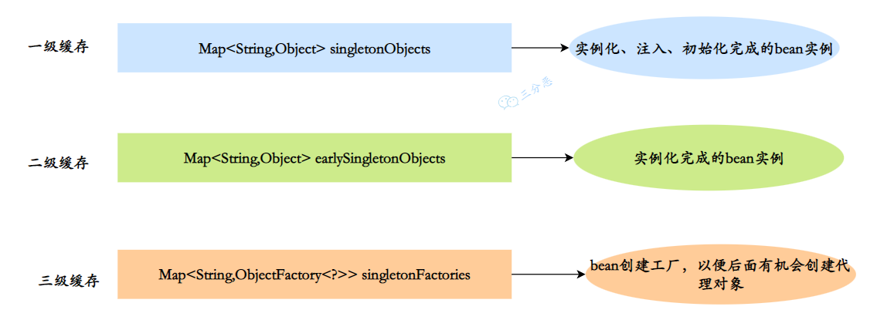
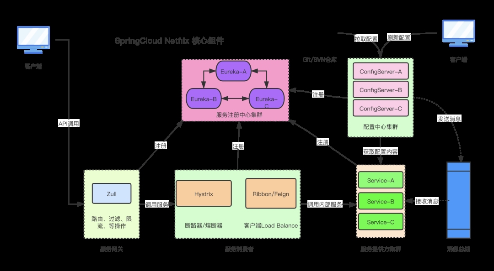

# Java Framework

[TOC]

# 一、Mybatis

## 1.1 简介

- MyBATIS是一种data mapper，处于类和数据表之间的中间层；把SQL语句的参数（parameter）和返回结果（result）映射至类
- 更好地分离数据库和对象模型的设计，这样就相对减少了两者间的耦合
- 半自动化框架的ORM，需要开发人员掌握SQL语句的编写。不同的数据库要重新修改SQL，因此MyBatis的数据库移植性不好

## 1.2 整体架构


## 1.3 MyBatis vs Hibernate

- Hibernate 优势
  - DAO 层开发比较简单
  - 对对象的维护和缓存较
  - 数据库移植性好（MyBatis在不同的数据库需要写不同 SQL）
  - 有更好的二级缓存机制，可以使用第三方缓存
- Mybatis优势
  - 可以进行更为细致的 SQL 优化，可以减少查询字段
  - MyBatis 容易掌握，而 Hibernate 门槛较高

## 1.4 代码示例

> 核心jar包
>
> ```java
>    mybatis-3.2.2.jar 核心jar 
> mysql-connector-java-5.1.10-bin.jar 数据库访问 
> asm-3.3.1.jar 增强类 
> cglib-2.2.2.jar 动态代理 
> commons-logging-1.1.1.jar 通用日志 
> javassist-3.17.1-GA.jar java助手 
> log4j-1.2.17.jar 日志 
> slf4j-api-1.7.5.jar 日志 
> slf4j-log4j12-1.7.5.jar 日志
> ```

- 数据库表：Person

  ```sql
  CREATE TABLE PERSON( 
  	PER_ID INT NOT NULL, 
  	PER_FIRST_NAME VARCHAR (40) NOT NULL, 
  	PER_LAST_NAME VARCHAR (40) NOT NULL, 
  	PER_BIRTH_DATE DATETIME , 
  	PER_WEIGHT_KG FLOAT NOT NULL, 
  	PER_HEIGHT_M FLOAT NOT NULL, 
  	PRIMARY KEY (PER_ID) 
  ) 
  ```
  
- Java Bean：Person类

  ```java
                                         /*Person.java */
  package examples.domain; 
  public class Person { 
  	private int id; 
  	private String firstName;   private String lastName; 
  	private Date birthDate; 
  	private double weightInKilograms; 
  	private double heightInMeters; 
  	public int getId () { 
  		return id; 
  	} 
  	public void setId (int id) { 
  		this.id = id; 
  	} 
  	…
  } 
  
  ```

- 映射文件：Person.xml 

  ```xml
                                       Person.xml 
  <?xml version="1.0" encoding="UTF-8" ?>
  <!DOCTYPE mapper
  PUBLIC "-//mybatis.org//DTD Mapper 3.0//EN"
  "http://mybatis.org/dtd/mybatis-3-mapper.dtd"> 
  <mapper namespace="cn.mybatis.mapper.Person"> 
        <select id="getPerson" resultType="examples.domain.Person"> 
  	SELECT PER_ID as id, 
  	PER_FIRST_NAME as firstName, 
  	PER_LAST_NAME as lastName, 
  	PER_BIRTH_DATE as birthDate, 
  	PER_WEIGHT_KG as weightInKilograms, 
  	PER_HEIGHT_M as heightInMeters 
  	FROM PERSON 
  	WHERE PER_ID = #{value} 
       </select> 
  </mapper> 
  
  ```

- 配置文件：SqlMapConfig.xml 配置文件也可以是.properties 

  ```xml
                                     SqlMapConfig.xml 
  <environments default="development">
          <environment id="development">
            <transactionManager type="JDBC" > 
            <dataSource type="UNPOOLED"> 
  	<property name="JDBC.Driver" value="com.mysql.jdbc.Driver"/> 
  	<property name="JDBC.ConnectionURL"
                                     value="jdbc:mysql://localhost:3306/mybatisdb"/> 
  	<property name="JDBC.Username" value="root"/> 
  	<property name="JDBC.Password" value=""/> 
           </dataSource> 
  </environment> </environments> 
  <mappers>
  <mappers>
  <mapper resource="cn/mybatis/mapper/Person.xml" />
  <!-- 批量加载mapper
        指定包名，mybatis自动扫描包下边所有mapper接口进行加载
        需将类名和mapper.xml映射文件名称保持一致，且在同一目录中-->
  <package name="cn.mybatis.mapper"/> 
  </mappers>
  
  </configuration> 
  
  
  
  可配置一些额外的属性，大致如下：
  <settings 
  	cacheModelsEnabled ="true"  <!--是否启用缓存机制-- >   
     	lazyLoadingEnabled="true"  <!-- 是否启用延迟加载机制 -->   
    	 enhancementEnabled="true"  <!-- 是否启用字节码增强机制 -->   
    	 errorTracingEnabled="true"  <!-- 是否启用错误处理机制 -->   
     	 maxRequests="32"  <!-- 同时执行SQL语句的最大线程数 -->   
    	 maxSessions="10"  <!-- 最大Session数 -->   
     	 maxTransactions="5"  <!-- 最大并发事务数 -->   
     	useStatementNamespaces="true"/>  <!-- 是否启用名称空间 --> 
  /> 
  
  ```

- 测试代码：MyBatisTest

  ```java
  public static void main(String[] args) {
          try {
              InputStream config = Resources
                      .getResourceAsStream("SqlMapconfig.xml");
              SqlSessionFactory ssf = new SqlSessionFactoryBuilder().build(config);
              SqlSession ss = ssf.openSession();
  // 操作CRUD，第一个参数：指定statement，规则：命名空间+“.”+statementId 
  // 第二个参数：指定传入sql的参数：这里是用户id 
              Person p = ss.selectOne(
                      "com.mybatis.mapper.Person.getPerson", 1);
              System.out.println(mu);
              ss.close();
          } catch (IOException e) {e.printStackTrace();}
      }
  }
  
  ```

- 接口映射器更方便

  ```java
  import examples.domain.Person
  
  public interface PersonDao { 
        public Person getPerson(Integer id); 
        ……
  }
  
  
  
  public static void main(String[] args) {
          try {
              InputStream config = Resources
                      .getResourceAsStream("SqlMapconfig.xml");
              SqlSessionFactory ssf = new SqlSessionFactoryBuilder().build(config);
              SqlSession ss = ssf.openSession();
              PersonDao personDao = ss.getMapper(PersonDao.class);
              Person p = personDao.getPerson(1);
              System.out.println(mu);
              ss.close();
          } catch (IOException e) {e.printStackTrace();}
      }
  }
  
  ```

- CRUD:通常可以进行select\insert\delete\update\statement 

- ```xml
                                       Person.xml 
                                                                
  <mapper namespace="Person"> 
        <select id="getPerson" resultType="examples.domain.Person"> 
  	SELECT PER_ID as id, 
  	PER_FIRST_NAME as firstName, 
  	PER_LAST_NAME as lastName, 
  	PER_BIRTH_DATE as birthDate, 
  	PER_WEIGHT_KG as weightInKilograms, 
  	PER_HEIGHT_M as heightInMeters 
  	FROM PERSON 
  	WHERE PER_ID = #{value} 
       </select> 
  </mapper> 
  
  
                                               Person.xml 
   
  <mapper namespace="Person"> 
        <insert id="insertPerson" parameterType="examples.domain.Person"
             useGeneratedKeys="true" keyProperty="id"> <!--主键自动递增-->
  	INSERT INTO 
  	PERSON (PER_ID, PER_FIRST_NAME, PER_LAST_NAME, 
  	PER_BIRTH_DATE, PER_WEIGHT_KG, PER_HEIGHT_M) 
  	VALUES (#{id}, #{firstName}, #{lastName}, 
  		#{birthDate}, #{weightInKilograms}, #{heightInMeters}) 
       </insert > 
  </mapper> 
  
  
                                               Person.xml 
   
  <mapper namespace="Person"> 
        <update id="updatePerson" parameterType="examples.domain.Person"> 
  	UPDATE PERSON 
  	SET PER_FIRST_NAME = #{firstName}, 
  	PER_LAST_NAME = #{lastName}, 
  	PER_BIRTH_DATE = #{birthDate}, 
  	PER_WEIGHT_KG = #{weightInKilograms}, 
  	PER_HEIGHT_M = #{heightInMeters} 
  	WHERE PER_ID = #{id} 
       </update> 
  </mapper> 
  
  
                                          Person.xml 
   
  <mapper namespace="Person"> 
        <delete id="deletePerson" parameterType="examples.domain.Person"> 
  	DELETE PERSON 
  	WHERE PER_ID = #{id} 
        </delete> 
  </mapper> 
  
  <mapper namespace="Product"> 
        <statement id=”insertTestProduct” > 
              insert into PRODUCT (PRD_ID, PRD_DESCRIPTION) 
                         values (1, “Shih Tzu”) 
        </statement>
  </mapper> 
  
  ```

- 联合查询

  ```xml
  <resultMap id=”get-product-result” class=”com.ibatis.example.Product”> 
  <result property=”id” column=”PRD_ID”/> 
  <result property=”description” column=”PRD_DESCRIPTION”/> 
  <result property=”category.id” column=”CAT_ID” /> 
  <result property=”category.description” column=”CAT_DESCRIPTION” /> 
  </resultMap> 
  <statement id=”getProduct” parameterType=”int” 
                                         resultMap=”get-product-result”> 
          select * 
          from PRODUCT, CATEGORY 
          where PRD_CAT_ID=CAT_ID 
          and PRD_ID = #{value} 
  </statement> 
  
  
  <resultMap id="resultUserArticleList" type="Article">
          <id property="id" column="aid" />
          <result property="title" column="title" />
          <result property="content" column="content" />
          <association property="user" javaType="User">
              <id property="id" column="id" />
              <result property="userName" column="userName" />
              <result property="userAddress" column="userAddress" />       </association>        
      </resultMap>
  < select id="getUserArticles" parameterType="int" resultMap="resultUserArticleList">
       select user.id,user.userName,user.userAddress,article.id aid,article.title,article.content from user,article
                where user.id=article.userid and user.id=#{id}   </select>
  
  ```

# 二、Spring

## 2.1 Spring 简介

### 2.1.1 Spring是什么

一句话概括：**Spring 是一个轻量级、非入侵式的控制反转 (IoC) 和面向切面 (AOP) 的框架。**

- **IOC 和 DI 的支持**

Spring 的核心就是一个大的工厂容器，可以维护所有对象的创建和依赖关系，Spring 工厂用于生成 Bean，并且管理 Bean 的生命周期，实现**高内聚低耦合**的设计理念。

- **AOP 编程的支持**

Spring 提供了**面向切面编程**，可以方便的实现对程序进行权限拦截、运行监控等切面功能。

- **声明式事务的支持**

支持通过配置就来完成对事务的管理，而不需要通过硬编码的方式，以前重复的一些事务提交、回滚的 JDBC 代码，都可以不用自己写了。

- **快捷测试的支持**

Spring 对 Junit 提供支持，可以通过**注解**快捷地测试 Spring 程序。

- **快速集成功能**

方便集成各种优秀框架，Spring 不排斥各种优秀的开源框架，其内部提供了对各种优秀框架（如：Struts、Hibernate、MyBatis、Quartz 等）的直接支持。

- 复杂 API 模板封装

Spring 对 JavaEE 开发中非常难用的一些 API（JDBC、JavaMail、远程调用等）都提供了模板化的封装，这些封装 API 的提供使得应用难度大大降低。


### 2.1.2 spring有哪些模块


最主要的七大模块：

1. **Spring Core**：Spring 核心，它是框架最基础的部分，提供 IOC 和依赖注入 DI 特性。
2. **Spring Context**：Spring 上下文容器，它是 BeanFactory 功能加强的一个子接口。
3. **Spring Web**：它提供 Web 应用开发的支持。
4. **Spring MVC**：它针对 Web 应用中 MVC 思想的实现。
5. **Spring DAO**：提供对 JDBC 抽象层，简化了 JDBC 编码，同时，编码更具有健壮性。
6. **Spring ORM**：它支持用于流行的 ORM 框架的整合，比如：Spring + Hibernate、Spring + MyBatis、Spring + JDO 的整合等。
7. **Spring AOP**：即面向切面编程，它提供了与 AOP 联盟兼容的编程实现。

### 2.1.3 SpringMVC

#### 2.1.3.1 Spring MVC 的核心组件

1. **DispatcherServlet**：前置控制器，是整个流程控制的**核心**，控制其他组件的执行，进行统一调度，降低组件之间的耦合性，相当于总指挥。
2. **Handler**：处理器，完成具体的业务逻辑，相当于 Servlet 或 Action。
3. **HandlerMapping**：DispatcherServlet 接收到请求之后，通过 HandlerMapping 将不同的请求映射到不同的 Handler。
4. **HandlerInterceptor**：处理器拦截器，是一个接口，如果需要完成一些拦截处理，可以实现该接口。
5. **HandlerExecutionChain**：处理器执行链，包括两部分内容：Handler 和 HandlerInterceptor（系统会有一个默认的 HandlerInterceptor，如果需要额外设置拦截，可以添加拦截器）。
6. **HandlerAdapter**：处理器适配器，Handler 执行业务方法之前，需要进行一系列的操作，包括表单数据的验证、数据类型的转换、将表单数据封装到 JavaBean 等，这些操作都是由 HandlerApater 来完成，开发者只需将注意力集中业务逻辑的处理上，DispatcherServlet 通过 HandlerAdapter 执行不同的 Handler。
7. **ModelAndView**：装载了模型数据和视图信息，作为 Handler 的处理结果，返回给 DispatcherServlet。
8. **ViewResolver**：视图解析器，DispatcheServlet 通过它将逻辑视图解析为物理视图，最终将渲染结果响应给客户端。

---

#### 2.1.3.2 Spring MVC 的工作流程

一图胜千言：


①**发起请求**：客户端通过 HTTP 协议向服务器发起请求。

②**前端控制器**：这个请求会先到前端控制器 DispatcherServlet，它是整个流程的入口点，负责接收请求并将其分发给相应的处理器。

③**处理器映射**：DispatcherServlet 调用 HandlerMapping 来确定哪个 Controller 应该处理这个请求。通常会根据请求的 URL 来确定。

④**处理器适配器**：一旦找到目标 Controller，DispatcherServlet 会使用 HandlerAdapter 来调用 Controller 的处理方法。

⑤**执行处理器**：Controller 处理请求，处理完后返回一个 ModelAndView 对象，其中包含模型数据和逻辑视图名。

⑥**视图解析器**：DispatcherServlet 接收到 ModelAndView 后，会使用 ViewResolver 来解析视图名称，找到具体的视图页面。

⑦**渲染视图**：视图使用模型数据渲染页面，生成最终的页面内容。

⑧**响应结果**：DispatcherServlet 将视图结果返回给客户端。

**Spring MVC** 虽然整体流程复杂，但是实际开发中很简单，大部分的组件不需要我们开发人员创建和管理，真正需要处理的只有 **Controller** 、**View** 、**Model**。在前后端分离的情况下，步骤 ⑥、⑦、⑧ 会略有不同，后端通常只需要处理数据，并将 JSON 格式的数据返回给前端就可以了，而不是返回完整的视图页面。

---

#### 2.1.3.3 SpringMVC Restful 接口流程

PS:这是一道全新的八股，毕竟 ModelAndView 这种方式应该没人用了吧？现在都是前后端分离接口，八股也该更新换代了。

我们都知道 Restful 接口，响应格式是 json，这就用到了一个常用注解：**@ResponseBody**

```java
    @GetMapping("/user")
    @ResponseBody
    public User user(){
        return new User(1,"张三");
    }
```

加入了这个注解后，整体的流程上和使用 ModelAndView 大体上相同，但是细节上有一些不同：

Spring MVC Restful请求响应示意图

1. 客户端向服务端发送一次请求，这个请求会先到前端控制器 DispatcherServlet

2. DispatcherServlet 接收到请求后会调用 HandlerMapping 处理器映射器。由此得知，该请求该由哪个 Controller 来处理

3. DispatcherServlet 调用 HandlerAdapter 处理器适配器，告诉处理器适配器应该要去执行哪个 Controller

4. Controller 被封装成了 ServletInvocableHandlerMethod，HandlerAdapter 处理器适配器去执行 invokeAndHandle 方法，完成对 Controller 的请求处理

5. HandlerAdapter 执行完对 Controller 的请求，会调用 HandlerMethodReturnValueHandler 去处理返回值，主要的过程：

   5.1. 调用 RequestResponseBodyMethodProcessor，创建 ServletServerHttpResponse（Spring 对原生 ServerHttpResponse 的封装）实例

   5.2.使用 HttpMessageConverter 的 write 方法，将返回值写入 ServletServerHttpResponse 的 OutputStream 输出流中

   5.3.在写入的过程中，会使用 JsonGenerator（默认使用 Jackson 框架）对返回值进行 Json 序列化

6. 执行完请求后，返回的 ModealAndView 为 null，ServletServerHttpResponse 里也已经写入了响应，所以不用关心 View 的处理

## 2.2 Spring 有哪些常用注解


### 2.2.1 Web

- @Controller：组合注解（组合了@Component 注解），应用在 MVC 层（控制层）。
- @RestController：该注解为一个组合注解，相当于@Controller 和@ResponseBody 的组合，注解在类上，意味着，该 Controller 的所有方法都默认加上了@ResponseBody。
- @RequestMapping：用于映射 Web 请求，包括访问路径和参数。如果是 Restful 风格接口，还可以根据请求类型使用不同的注解：
  - @GetMapping
  - @PostMapping
  - @PutMapping
  - @DeleteMapping
- @ResponseBody：支持将返回值放在 response 内，而不是一个页面，通常用户返回 json 数据。
- @RequestBody：允许 request 的参数在 request 体中，而不是在直接连接在地址后面。
- @PathVariable：用于接收路径参数，比如 `@RequestMapping(“/hello/{name}”)`申明的路径，将注解放在参数中前，即可获取该值，通常作为 Restful 的接口实现方法。

### 2.2.2 容器

- @Component：表示一个带注释的类是一个“组件”，成为 Spring 管理的 Bean。当使用基于注解的配置和类路径扫描时，这些类被视为自动检测的候选对象。同时@Component 还是一个元注解。
- @Service：组合注解（组合了@Component 注解），应用在 service 层（业务逻辑层）。
- @Repository：组合注解（组合了@Component 注解），应用在 dao 层（数据访问层）。
- @Autowired：Spring 提供的工具（由 Spring 的依赖注入工具（BeanPostProcessor、BeanFactoryPostProcessor）自动注入）。
- @Qualifier：该注解通常跟 @Autowired 一起使用，当想对注入的过程做更多的控制，@Qualifier 可帮助配置，比如两个以上相同类型的 Bean 时 Spring 无法抉择，用到此注解
- @Configuration：声明当前类是一个配置类（相当于一个 Spring 配置的 xml 文件）
- @Value：可用在字段，构造器参数跟方法参数，指定一个默认值，支持 `#{} 跟 \${}` 两个方式。一般将 SpringbBoot 中的 application.properties 配置的属性值赋值给变量。
- @Bean：注解在方法上，声明当前方法的返回值为一个 Bean。返回的 Bean 对应的类中可以定义 init()方法和 destroy()方法，然后在`@Bean(initMethod=”init”,destroyMethod=”destroy”)`定义，在构造之后执行 init，在销毁之前执行 destroy。
- @Scope:定义我们采用什么模式去创建 Bean（方法上，得有@Bean） 其设置类型包括：Singleton 、Prototype、Request 、 Session、GlobalSession。

#### @Order

在 Spring 框架中，`@Order` 注解可以用于多个组件，以控制它们的执行顺序。以下是几个常见的使用场景：

1. **Filter**

如前所述，`@Order` 可以用于自定义的 Filter 类，用于控制多个过滤器的执行顺序。

```java
import org.springframework.core.annotation.Order;

@Order(1)
public class MyFilterA implements Filter {
    // ...
}

@Order(2)
public class MyFilterB implements Filter {
    // ...
}
```

2. **Interceptor**

在 Spring MVC 中，`@Order` 可以用于自定义的拦截器（`HandlerInterceptor`），以定义多个拦截器的执行顺序。

```java
import org.springframework.core.annotation.Order;
import org.springframework.web.servlet.HandlerInterceptor;

@Order(1)
public class MyInterceptorA implements HandlerInterceptor {
    // ...
}

@Order(2)
public class MyInterceptorB implements HandlerInterceptor {
    // ...
}
```

3. **Aspect**

在 AOP（面向切面编程）中，`@Order` 可以用于定义多个切面的执行顺序，特别是在使用 Spring AOP 时。

```java
import org.springframework.core.annotation.Order;
import org.aspectj.lang.annotation.Aspect;

@Aspect
@Order(1)
public class MyAspectA {
    // ...
}

@Aspect
@Order(2)
public class MyAspectB {
    // ...
}
```

4. **@Configuration Class**

在 Spring 中，`@Order` 也可以应用于配置类（`@Configuration`）。这通常用于确保不同的配置类按照特定的顺序进行处理。

```java
import org.springframework.context.annotation.Configuration;
import org.springframework.core.annotation.Order;

@Order(1)
@Configuration
public class FirstConfig {
    // ...
}

@Order(2)
@Configuration
public class SecondConfig {
    // ...
}
```


#### 2.2.2.1 @Autowired 的实现原理

实现@Autowired 的关键是：**AutowiredAnnotationBeanPostProcessor**

在 Bean 的初始化阶段，会通过 Bean 后置处理器来进行一些前置和后置的处理。

实现@Autowired 的功能，也是通过后置处理器来完成的。这个后置处理器就是 AutowiredAnnotationBeanPostProcessor。

- Spring 在创建 bean 的过程中，最终会调用到 doCreateBean()方法，在 doCreateBean()方法中会调用 populateBean()方法，来为 bean 进行属性填充，完成自动装配等工作。
- 在 populateBean()方法中一共调用了两次后置处理器，第一次是为了判断是否需要属性填充，如果不需要进行属性填充，那么就会直接进行 return，如果需要进行属性填充，那么方法就会继续向下执行，后面会进行第二次后置处理器的调用，这个时候，就会调用到 AutowiredAnnotationBeanPostProcessor 的 postProcessPropertyValues()方法，在该方法中就会进行@Autowired 注解的解析，然后实现自动装配。

```java
/**
* 属性赋值
**/
protected void populateBean(String beanName, RootBeanDefinition mbd, @Nullable BeanWrapper bw) {
          //…………
          if (hasInstAwareBpps) {
              if (pvs == null) {
                  pvs = mbd.getPropertyValues();
              }

              PropertyValues pvsToUse;
              for(Iterator var9 = this.getBeanPostProcessorCache().instantiationAware.iterator(); var9.hasNext(); pvs = pvsToUse) {
                  InstantiationAwareBeanPostProcessor bp = (InstantiationAwareBeanPostProcessor)var9.next();
                  pvsToUse = bp.postProcessProperties((PropertyValues)pvs, bw.getWrappedInstance(), beanName);
                  if (pvsToUse == null) {
                      if (filteredPds == null) {
                          filteredPds = this.filterPropertyDescriptorsForDependencyCheck(bw, mbd.allowCaching);
                      }
                      //执行后处理器，填充属性，完成自动装配
                      //调用InstantiationAwareBeanPostProcessor的postProcessPropertyValues()方法
                      pvsToUse = bp.postProcessPropertyValues((PropertyValues)pvs, filteredPds, bw.getWrappedInstance(), beanName);
                      if (pvsToUse == null) {
                          return;
                      }
                  }
              }
          }
         //…………
  }
```

- postProcessorPropertyValues()方法的源码如下，在该方法中，会先调用 findAutowiringMetadata()方法解析出 bean 中带有@Autowired 注解、@Inject 和@Value 注解的属性和方法。然后调用 metadata.inject()方法，进行属性填充。

```java
  public PropertyValues postProcessProperties(PropertyValues pvs, Object bean, String beanName) {
      //@Autowired注解、@Inject和@Value注解的属性和方法
      InjectionMetadata metadata = this.findAutowiringMetadata(beanName, bean.getClass(), pvs);

      try {
          //属性填充
          metadata.inject(bean, beanName, pvs);
          return pvs;
      } catch (BeanCreationException var6) {
          throw var6;
      } catch (Throwable var7) {
          throw new BeanCreationException(beanName, "Injection of autowired dependencies failed", var7);
      }
  }
```

## 

### 2.2.3 AOP

- @Aspect:声明一个切面（类上） 使用@After、@Before、@Around 定义建言（advice），可直接将拦截规则（切点）作为参数。
  - `@After` ：在方法执行之后执行（方法上）。
  - `@Before`： 在方法执行之前执行（方法上）。
  - `@Around`： 在方法执行之前与之后执行（方法上）。
  - `@PointCut`： 声明切点 在 java 配置类中使用@EnableAspectJAutoProxy 注解开启 Spring 对 AspectJ 代理的支持（类上）。
  - `@AfterReturning`：在没有异常时方法返回后执行。
  - `@AfterThrowing`：在方法抛出异常后执行。

```java
import org.aspectj.lang.JoinPoint;
import org.aspectj.lang.annotation.After;
import org.aspectj.lang.annotation.AfterReturning;
import org.aspectj.lang.annotation.AfterThrowing;
import org.aspectj.lang.annotation.Aspect;
import org.aspectj.lang.annotation.Before;
import org.aspectj.lang.annotation.Pointcut;
import org.slf4j.Logger;
import org.slf4j.LoggerFactory;
import org.springframework.stereotype.Component;

@Aspect
@Component
public class LoggingAspect {

    private static final Logger logger = LoggerFactory.getLogger(LoggingAspect.class);

    // 1. 定义切点
    @Pointcut("execution(* com.example.service.*.*(..))")
    public void serviceMethods() {}

    // 2. Before advice
    @Before("serviceMethods()")
    public void logBefore(JoinPoint joinPoint) {
        logger.info("Before executing: " + joinPoint.getSignature());
    }

    // 3. After advice
    @After("serviceMethods()")
    public void logAfter(JoinPoint joinPoint) {
        logger.info("After executing: " + joinPoint.getSignature());
    }

    // 4. AfterReturning advice
    @AfterReturning(pointcut = "serviceMethods()", returning = "result")
    public void logAfterReturning(JoinPoint joinPoint, Object result) {
        logger.info("Method returned: " + result);
    }

    // 5. AfterThrowing advice
    @AfterThrowing(pointcut = "serviceMethods()", throwing = "exception")
    public void logAfterThrowing(JoinPoint joinPoint, Throwable exception) {
        logger.error("Exception in method: " + joinPoint.getSignature() + " with cause: " + exception.getMessage());
    }

    // 6. Around advice (示例)
    @Around("serviceMethods()")
    public Object logAround(ProceedingJoinPoint joinPoint) throws Throwable {
        logger.info("Around before executing: " + joinPoint.getSignature());
        Object result = joinPoint.proceed(); // 执行目标方法
        logger.info("Around after executing: " + joinPoint.getSignature());
        return result;
    }
}
```


### 2.2.4 事务

- @Transactional：在要开启事务的方法上使用@Transactional 注解，即可声明式开启事务。

## 2.3 Spring 中的设计模式

Spring 框架中广泛使用了不同类型的设计模式，下面我们来看看到底有哪些设计模式?


1. **工厂模式** : Spring 容器本质是一个大工厂，使用工厂模式通过 BeanFactory、ApplicationContext 创建 bean 对象。
2. **代理模式** : Spring AOP 功能功能就是通过代理模式来实现的，分为动态代理和静态代理。
3. **单例模式** : Spring 中的 Bean 默认都是单例的，这样有利于容器对 Bean 的管理。
4. **模板模式** : Spring 中 JdbcTemplate、RestTemplate 等以 Template 结尾的对数据库、网络等等进行操作的模板类，就使用到了模板模式。
5. **观察者模式**: Spring 事件驱动模型就是观察者模式很经典的一个应用。
6. **适配器模式** :Spring AOP 的增强或通知 (Advice) 使用到了适配器模式、Spring MVC 中也是用到了适配器模式适配 Controller。
7. **策略模式**：Spring 中有一个 Resource 接口，它的不同实现类，会根据不同的策略去访问资源。

## 2.4 IOC & AOP

### 2.4.1 IOC是什么

IOC（Inversion of Control）是一种设计思想，而不是一个特定的设计模式。它代表了一种控制反转的概念，也叫做依赖注入（Dependency Injection），它将应用程序的控制权从应用程序代码中反转到容器或框架中，实现了松耦合的设计。

虽然IOC本身不是一个特定的设计模式，但它通常与其他设计模式一起使用，以实现更好的代码组织和可维护性。以下是与IOC相关的一些设计模式：

1. **工厂模式**：工厂模式是IOC的一种具体实现方式。在工厂模式中，应用程序不直接实例化对象，而是通过工厂类创建和返回对象。这降低了直接对象创建的控制权，实现了IOC。

2. **依赖注入**：依赖注入是IOC的具体应用，它允许将依赖关系（如其他对象或数值）注入到对象中，而不是在对象内部硬编码依赖。这提高了代码的可测试性和可维护性。

3. **单例模式**：单例模式是一种常见的与IOC结合使用的设计模式。在IOC容器中，单例模式确保某些类的唯一实例被管理和共享。

4. **观察者模式**：观察者模式也与IOC关联紧密，它用于实现发布-订阅模型，其中观察者对象订阅主题对象的事件。IOC容器通常使用观察者模式来通知Bean状态的变化。

总之，虽然IOC本身不是一个设计模式，但它影响了应用程序的设计和架构，使得应用程序更加灵活、可扩展和易于维护。在实际应用中，IOC通常与其他设计模式结合使用，以实现更好的软件工程实践。

### 2.4.2 依赖注入的方法

Spring 支持**构造方法注入**、**属性注入**、**工厂方法注入**,其中工厂方法注入，又可以分为**静态工厂方法注入**和**非静态工厂方法注入**。

- **构造方法注入**

  通过调用类的构造方法，将接口实现类通过构造方法变量传入

  ```java
   public CatDaoImpl(String message){
     this. message = message;
   }
  ```

  ```java
  <bean id="CatDaoImpl" class="com.CatDaoImpl">
    <constructor-arg value=" message "></constructor-arg>
  </bean>
  ```

- **属性注入**

  通过 Setter 方法完成调用类所需依赖的注入

  ```java
   public class Id {
      private int id;
  
      public int getId() { return id; }
  
      public void setId(int id) { this.id = id; }
  }
  ```

  ```java
  <bean id="id" class="com.id ">
    <property name="id" value="123"></property>
  </bean>
  ```

- **工厂方法注入**

  - **静态工厂注入**

    静态工厂顾名思义，就是通过调用静态工厂的方法来获取自己需要的对象，为了让 Spring 管理所有对象，我们不能直接通过"工程类.静态方法()"来获取对象，而是依然通过 Spring 注入的形式获取：

    ```java
    public class DaoFactory { //静态工厂
    
       public static final FactoryDao getStaticFactoryDaoImpl(){
          return new StaticFacotryDaoImpl();
       }
    }
    
    public class SpringAction {
    
     //注入对象
     private FactoryDao staticFactoryDao;
    
     //注入对象的 set 方法
     public void setStaticFactoryDao(FactoryDao staticFactoryDao) {
         this.staticFactoryDao = staticFactoryDao;
     }
    
    }
    ```

    ```java
    //factory-method="getStaticFactoryDaoImpl"指定调用哪个工厂方法
     <bean name="springAction" class=" SpringAction" >
       <!--使用静态工厂的方法注入对象,对应下面的配置文件-->
       <property name="staticFactoryDao" ref="staticFactoryDao"></property>
     </bean>
    
     <!--此处获取对象的方式是从工厂类中获取静态方法-->
    <bean name="staticFactoryDao" class="DaoFactory"
      factory-method="getStaticFactoryDaoImpl"></bean>
    ```

  - **非静态工厂注入**

    非静态工厂，也叫实例工厂，意思是工厂方法不是静态的，所以我们需要首先 new 一个工厂实例，再调用普通的实例方法。

    ```java
    //非静态工厂
    public class DaoFactory {
       public FactoryDao getFactoryDaoImpl(){
         return new FactoryDaoImpl();
       }
     }
    
    public class SpringAction {
      //注入对象
      private FactoryDao factoryDao;
    
      public void setFactoryDao(FactoryDao factoryDao) {
        this.factoryDao = factoryDao;
      }
    }
    ```

    ```java
     <bean name="springAction" class="SpringAction">
       <!--使用非静态工厂的方法注入对象,对应下面的配置文件-->
       <property name="factoryDao" ref="factoryDao"></property>
     </bean>
    
     <!--此处获取对象的方式是从工厂类中获取实例方法-->
     <bean name="daoFactory" class="com.DaoFactory"></bean>
    
    <bean name="factoryDao" factory-bean="daoFactory" factory-method="getFactoryDaoImpl"></bean>
    ```


### 2.4.3 AOP 概念

AOP（面向切面编程）通常体现了以下设计模式：

1. **装饰器模式（Decorator Pattern）**：AOP可以被视为一种装饰器模式的扩展，其中切面（Aspect）类可以被动态织入到现有对象的方法中，以增加功能。这与装饰器模式类似，但装饰器模式通常用于对象级别的功能增强，而AOP更广泛地用于跨多个对象和方法的功能增强。

2. **策略模式（Strategy Pattern）**：AOP中的切面类本质上是一种策略模式的实现。它定义了在方法执行的不同点上执行的操作，这些操作可以视为策略，而具体方法的调用则是上下文，根据不同的切面策略执行不同的操作。

3. **观察者模式（Observer Pattern）**：AOP中的切面类可以被视为观察者，它们观察方法的执行，并在方法的不同点上触发相应的操作。这是一种观察者模式的变种，用于实现横切关注点的解耦。

总之，AOP在许多方面体现了装饰器、策略和观察者等设计模式的特征，以实现横切关注点的模块化和可维护性。这种模式的主要目标是将与核心业务逻辑无关的横切关注点（如日志、事务管理、安全性）从核心业务逻辑中分离出来，从而提高代码的可读性和可维护性。

---

AOP，也就是 Aspect-oriented Programming，译为面向切面编程。

简单点说，就是把一些业务逻辑中的相同代码抽取到一个独立的模块中，让业务逻辑更加清爽。


举个例子，假如我们现在需要在业务代码开始前进行参数校验，在结束后打印日志，该怎么办呢？

我们可以把`日志记录`和`数据校验`这两个功能抽取出来，形成一个切面，然后在业务代码中引入这个切面，这样就可以实现业务逻辑和通用逻辑的分离。


业务代码不再关心这些通用逻辑，只需要关心自己的业务实现，这样就实现了业务逻辑和通用逻辑的分离。

我们来回顾一下 Java 语言的执行过程：


AOP 的核心其实就是**动态代理**，可以使用 JDK 的动态代理，也可以使用 CGLIB 代理，主要应用于一些具有横切性质的系统级服务，如日志收集、事务管理、安全检查、缓存、对象池管理等。

> 可以继续追问：**AOP 有哪些核心概念？**

- **切面**（Aspect）：类是对物体特征的抽象，切面就是对横切关注点的抽象
- **连接点**（Join Point）：被拦截到的点，因为 Spring 只支持方法类型的连接点，所以在 Spring 中，连接点指的是被拦截到的方法，实际上连接点还可以是字段或者构造方法
- **切点**（Pointcut）：对连接点进行拦截的定位
- **通知**（Advice）：指拦截到连接点之后要执行的代码，也可以称作**增强**
- **目标对象** （Target）：代理的目标对象
- **引介**（introduction）：一种特殊的增强，可以动态地为类添加一些属性和方法
- **织入**（Weabing）：织入是将增强添加到目标类的具体连接点上的过程。可以分为 3 种类型的织入：

①编译期织入：切面在目标类编译时被织入。

②类加载期织入：切面在目标类加载到 JVM 时被织入。需要特殊的类加载器，它可以在目标类被引入应用之前增强该目标类的字节码。

③运行期织入：切面在应用运行的某个时刻被织入。一般情况下，在织入切面时，AOP 容器会为目标对象动态地创建一个代理对象。Spring AOP 就是以这种方式织入切面。Spring 采用运行期织入，而 AspectJ 采用编译期织入和类加载器织入。**多个切面的情况下，可以通过 @Order 指定先后顺序，数字越小，优先级越高。**


AOP 一般有 **5 种**环绕方式：

- 前置通知 (@Before)
- 返回通知 (@AfterReturning)
- 异常通知 (@AfterThrowing)
- 后置通知 (@After)
- 环绕通知 (@Around)


---

总结回答一下：AOP，也就是面向切面编程，是一种编程范式，旨在提高代码的模块化。比如说可以将日志记录、事务管理等分离出来，来提高代码的可重用性。

AOP 的核心概念包括切面（Aspect）、连接点（Join Point）、通知（Advice）、切点（Pointcut）和织入（Weaving）等。

① 像日志打印、事务管理等都可以抽离为切面，可以声明在类的方法上。

② 在 Spring AOP 中，连接点总是表示方法的执行。

③ Spring AOP 支持五种类型的通知：前置通知、后置通知、环绕通知、异常通知、最终通知等。

④ 在 AOP 中，切点用于指定我们想要在哪些连接点上执行通知的规则。

⑤ 织入是指将切面应用到目标对象并创建新的代理对象的过程。Spring AOP 默认在运行时通过动态代理方式实现织入。

像 `@Transactional` 注解，就是一个典型的 AOP 应用，它就是通过 AOP 来实现事务管理的。我们只需要在方法上添加 `@Transactional` 注解，Spring 就会在方法执行前后添加事务管理的逻辑。


### 2.4.4 AOP使用

这里给出一个小例子，SpringBoot 项目中，利用 AOP 打印接口的入参和出参日志，以及执行时间，还是比较快捷的。

- 引入依赖：引入 AOP 依赖

  ```java
          <dependency>
              <groupId>org.springframework.boot</groupId>
              <artifactId>spring-boot-starter-aop</artifactId>
          </dependency>
  ```

- 自定义注解：自定义一个注解作为切点

  ```java
  @Retention(RetentionPolicy.RUNTIME)
  @Target({ElementType.METHOD})
  @Documented
  public @interface WebLog {
  }
  ```

- 配置 AOP 切面：

  - @Aspect：标识切面
  - @Pointcut：设置切点，这里以自定义注解为切点，定义切点有很多其它种方式，自定义注解是比较常用的一种。
  - @Before：在切点之前织入，打印了一些入参信息
  - @Around：环绕切点，打印返回参数和接口执行时间

  ```java
  @Aspect
  @Component
  public class WebLogAspect {
  
      private final static Logger logger         = LoggerFactory.getLogger(WebLogAspect.class);
  
      /**
       * 以自定义 @WebLog 注解为切点
       **/
      @Pointcut("@annotation(cn.fighter3.spring.aop_demo.WebLog)")
      public void webLog() {}
  
      /**
       * 在切点之前织入
       */
      @Before("webLog()")
      public void doBefore(JoinPoint joinPoint) throws Throwable {
          // 开始打印请求日志
          ServletRequestAttributes attributes = (ServletRequestAttributes) RequestContextHolder.getRequestAttributes();
          HttpServletRequest request = attributes.getRequest();
          // 打印请求相关参数
          logger.info("========================================== Start ==========================================");
          // 打印请求 url
          logger.info("URL            : {}", request.getRequestURL().toString());
          // 打印 Http method
          logger.info("HTTP Method    : {}", request.getMethod());
          // 打印调用 controller 的全路径以及执行方法
          logger.info("Class Method   : {}.{}", joinPoint.getSignature().getDeclaringTypeName(), joinPoint.getSignature().getName());
          // 打印请求的 IP
          logger.info("IP             : {}", request.getRemoteAddr());
          // 打印请求入参
          logger.info("Request Args   : {}",new ObjectMapper().writeValueAsString(joinPoint.getArgs()));
      }
  
      /**
       * 在切点之后织入
       * @throws Throwable
       */
      @After("webLog()")
      public void doAfter() throws Throwable {
          // 结束后打个分隔线，方便查看
          logger.info("=========================================== End ===========================================");
      }
  
      /**
       * 环绕
       */
      @Around("webLog()")
      public Object doAround(ProceedingJoinPoint proceedingJoinPoint) throws Throwable {
          //开始时间
          long startTime = System.currentTimeMillis();
          Object result = proceedingJoinPoint.proceed();
          // 打印出参
          logger.info("Response Args  : {}", new ObjectMapper().writeValueAsString(result));
          // 执行耗时
          logger.info("Time-Consuming : {} ms", System.currentTimeMillis() - startTime);
          return result;
      }
  
  }
  ```

- 使用：只需要在接口上加上自定义注解

  ```java
      @GetMapping("/hello")
      @WebLog(desc = "这是一个欢迎接口")
      public String hello(String name){
          return "Hello "+name;
      }
  ```

### 2.4.5  JDK 动态代理和 CGLIB 代理

Spring 的 AOP 是通过[动态代理open in new window](https://mp.weixin.qq.com/s/aZtfwik0weJN5JzYc-JxYg)来实现的，动态代理主要有两种方式 JDK 动态代理和 Cglib 动态代理，这两种动态代理的使用和原理有些不同。

**JDK 动态代理**

1. **Interface**：对于 JDK 动态代理，目标类需要实现一个 Interface。
2. **InvocationHandler**：InvocationHandler 是一个接口，可以通过实现这个接口，定义横切逻辑，再通过反射机制（invoke）调用目标类的代码，在次过程，可能包装逻辑，对目标方法进行前置后置处理。
3. **Proxy**：Proxy 利用 InvocationHandler 动态创建一个符合目标类实现的接口的实例，生成目标类的代理对象。

**CgLib 动态代理**

1. 使用 JDK 创建代理有一大限制，它只能为接口创建代理实例，而 CgLib 动态代理就没有这个限制。
2. CgLib 动态代理是使用字节码处理框架 **ASM**，其原理是通过字节码技术为一个类创建子类，并在子类中采用方法拦截的技术拦截所有父类方法的调用，顺势织入横切逻辑。
3. **CgLib** 创建的动态代理对象性能比 JDK 创建的动态代理对象的性能高不少，但是 CGLib 在创建代理对象时所花费的时间却比 JDK 多得多，所以对于单例的对象，因为无需频繁创建对象，用 CGLib 合适，反之，使用 JDK 方式要更为合适一些。同时，由于 CGLib 由于是采用动态创建子类的方法，对于 final 方法，无法进行代理。

---

#### 2.4.5.1 **JDK 动态代理实现**


- 接口

  ```java
  public interface ISolver {
      void solve();
  }
  ```

- 目标类:需要实现对应接口

  ```java
  public class Solver implements ISolver {
      @Override
      public void solve() {
          System.out.println("疯狂掉头发解决问题……");
      }
  }
  ```

- 态代理工厂:ProxyFactory，直接用反射方式生成一个目标对象的代理对象，这里用了一个匿名内部类方式重写 InvocationHandler 方法，实现接口重写也差不多

  ```java
  public class ProxyFactory {
  
      // 维护一个目标对象
      private Object target;
  
      public ProxyFactory(Object target) {
          this.target = target;
      }
  
      // 为目标对象生成代理对象
      public Object getProxyInstance() {
          return Proxy.newProxyInstance(target.getClass().getClassLoader(), target.getClass().getInterfaces(),
                  new InvocationHandler() {
                      @Override
                      public Object invoke(Object proxy, Method method, Object[] args) throws Throwable {
                          System.out.println("请问有什么可以帮到您？");
  
                          // 调用目标对象方法
                          Object returnValue = method.invoke(target, args);
  
                          System.out.println("问题已经解决啦！");
                          return null;
                      }
                  });
      }
  }
  ```

- 客户端：Client，生成一个代理对象实例，通过代理对象调用目标对象方法

  ```java
  public class Client {
      public static void main(String[] args) {
          //目标对象:程序员
          ISolver developer = new Solver();
          //代理：客服小姐姐
          ISolver csProxy = (ISolver) new ProxyFactory(developer).getProxyInstance();
          //目标方法：解决问题
          csProxy.solve();
      }
  }
  ```

---

#### **Cglib 动态代理实现**


- 目标类：Solver，这里目标类不用再实现接口。

  ```java
  public class Solver {
  
      public void solve() {
          System.out.println("疯狂掉头发解决问题……");
      }
  }
  ```

- 动态代理工厂：

  ```java
  public class ProxyFactory implements MethodInterceptor {
  
     //维护一个目标对象
      private Object target;
  
      public ProxyFactory(Object target) {
          this.target = target;
      }
  
      //为目标对象生成代理对象
      public Object getProxyInstance() {
          //工具类
          Enhancer en = new Enhancer();
          //设置父类
          en.setSuperclass(target.getClass());
          //设置回调函数
          en.setCallback(this);
          //创建子类对象代理
          return en.create();
      }
  
      @Override
      public Object intercept(Object obj, Method method, Object[] args, MethodProxy proxy) throws Throwable {
          System.out.println("请问有什么可以帮到您？");
          // 执行目标对象的方法
          Object returnValue = method.invoke(target, args);
          System.out.println("问题已经解决啦！");
          return null;
      }
  
  }
  ```

- 客户端：Client

  ```java
  public class Client {
      public static void main(String[] args) {
          //目标对象:程序员
          Solver developer = new Solver();
          //代理：客服小姐姐
          Solver csProxy = (Solver) new ProxyFactory(developer).getProxyInstance();
          //目标方法：解决问题
          csProxy.solve();
      }
  }
  ```

### 2.4.6 Spring AOP 和 AspectJ AOP 区别

**Spring AOP**

Spring AOP 属于`运行时增强`，主要具有如下特点：

1. 基于动态代理来实现，默认如果使用接口的，用 JDK 提供的动态代理实现，如果是方法则使用 CGLIB 实现
2. Spring AOP 需要依赖 IOC 容器来管理，并且只能作用于 Spring 容器，使用纯 Java 代码实现
3. 在性能上，由于 Spring AOP 是基于**动态代理**来实现的，在容器启动时需要生成代理实例，在方法调用上也会增加栈的深度，使得 Spring AOP 的性能不如 AspectJ 的那么好。
4. Spring AOP 致力于解决企业级开发中最普遍的 AOP(方法织入)。

**AspectJ**

AspectJ 是一个易用的功能强大的 AOP 框架，属于`编译时增强`， 可以单独使用，也可以整合到其它框架中，是 AOP 编程的完全解决方案。AspectJ 需要用到单独的编译器 ajc。

AspectJ 属于**静态织入**，通过修改代码来实现，在实际运行之前就完成了织入，所以说它生成的类是没有额外运行时开销的，一般有如下几个织入的时机：

1. 编译期织入（Compile-time weaving）：如类 A 使用 AspectJ 添加了一个属性，类 B 引用了它，这个场景就需要编译期的时候就进行织入，否则没法编译类 B。
2. 编译后织入（Post-compile weaving）：也就是已经生成了 .class 文件，或已经打成 jar 包了，这种情况我们需要增强处理的话，就要用到编译后织入。
3. 类加载后织入（Load-time weaving）：指的是在加载类的时候进行织入，要实现这个时期的织入，有几种常见的方法


## 2.5 BeanFactory 和 ApplicantContext

- BeanFactory（Bean 工厂）是 Spring 框架的基础设施，面向 Spring 本身。
- ApplicantContext（应用上下文）建立在 BeanFactoty 基础上，面向使用 Spring 框架的开发者。

### 2.5.1 BeanFactory 接口

BeanFactory 是类的通用工厂，可以创建并管理各种类的对象。

Spring 为 BeanFactory 提供了很多种实现，最常用的是 XmlBeanFactory，但在 Spring 3.2 中已被废弃，建议使用 XmlBeanDefinitionReader、DefaultListableBeanFactory、ApplicationContext 接口。ApplicationContext 由 BeanFactory 派生而来，提供了更多面向实际应用的功能。可以这么说，使用 BeanFactory 就是手动档，使用 ApplicationContext 就是自动档。


BeanFactory 接口位于类结构树的顶端，它最主要的方法就是 getBean(String var1)，这个方法从容器中返回特定名称的 Bean。

BeanFactory 的功能通过其它的接口得到了不断的扩展，比如 AbstractAutowireCapableBeanFactory 定义了将容器中的 Bean 按照某种规则（比如按名字匹配、按类型匹配等）进行自动装配的方法。

### 2.5.2 ApplicationContext 接口

ApplicationContext 由 BeanFactory 派生而来，提供了更多面向实际应用的功能。可以这么说，使用 BeanFactory 就是手动档，使用 ApplicationContext 就是自动档。


ApplicationContext 继承了 HierachicalBeanFactory 和 ListableBeanFactory 接口，在此基础上，还通过其他的接口扩展了 BeanFactory 的功能，包括：

- Bean instantiation/wiring
- Bean 的实例化/串联
- 自动的 BeanPostProcessor 注册
- 自动的 BeanFactoryPostProcessor 注册
- 方便的 MessageSource 访问（i18n）
- ApplicationEvent 的发布与 BeanFactory 懒加载的方式不同，它是预加载，所以，每一个 bean 都在 ApplicationContext 启动之后实例化

这是 ApplicationContext 的使用例子：

```java
public class HelloWorldApp{
   public static void main(String[] args) {
      ApplicationContext context=new ClassPathXmlApplicationContext("beans.xml");
      HelloWorld obj = (HelloWorld) context.getBean("helloWorld");
      obj.getMessage();
   }
}
```

ApplicationContext 包含 BeanFactory 的所有特性，通常推荐使用前者。

## 2.6 🌟spring容器

### 2.6.1 启动阶段

Spring 的 IOC 容器工作的过程，其实可以划分为两个阶段：**容器启动阶段**和**Bean 实例化阶段**。

其中容器启动阶段主要做的工作是加载和解析配置文件，保存到对应的 Bean 定义中。


容器启动开始，首先会通过某种途径加载 Congiguration MetaData，在大部分情况下，容器需要依赖某些工具类（BeanDefinitionReader）对加载的 Congiguration MetaData 进行解析和分析，并将分析后的信息组为相应的 BeanDefinition。


最后把这些保存了 Bean 定义必要信息的 BeanDefinition，注册到相应的 BeanDefinitionRegistry，这样容器启动就完成了。


### 2.6.2 spring容器的生命周期 

Spring容器的生命周期是指整个Spring应用程序上下文的生命周期。Spring容器的生命周期包括以下主要阶段：

- **实例化（Instantiation）**：在启动应用程序时，Spring容器会实例化并初始化容器，加载配置文件，创建BeanFactory等。
- **配置（Configuration）**：容器配置阶段，从XML文件、Java配置类或其他配置源中读取Bean定义。
- **初始化（Initialization）**：容器初始化阶段，初始化Bean实例并进行依赖注入。
- **运行（Runtime）**：在容器初始化后，应用程序可以从容器中检索和使用Bean。
- **销毁（Destruction）**：应用程序关闭时，Spring容器会销毁所有Bean，释放资源，执行销毁回调方法。

### 2.6.3 spring bean的生命周期

> https://javabetter.cn/sidebar/sanfene/spring.html#_9-%E8%83%BD%E8%AF%B4%E4%B8%80%E4%B8%8B-spring-bean-%E7%94%9F%E5%91%BD%E5%91%A8%E6%9C%9F%E5%90%97

**Spring Bean的生命周期**： Spring Bean的生命周期是指单个Bean实例的生命周期，它是Spring容器生命周期的一部分。Bean的生命周期包括以下主要阶段：

- **实例化（Instantiation）**：在容器初始化时，Bean的实例被创建，这通常包括调用构造函数。
- **属性注入（Property Injection）**：容器为Bean注入属性值，如依赖项、配置属性等。
- **自定义初始化方法（Custom Initialization Method）**：如果Bean定义了初始化方法，容器会在属性注入后调用它。
- **Bean可用（Bean Usable）**：Bean实例已被完全初始化，可以在应用程序中使用。
- **自定义销毁方法（Custom Destruction Method）**：如果Bean定义了销毁方法，容器在Bean销毁之前会调用它。
- **销毁（Destruction）**：容器销毁Bean实例，释放资源。

在Bean的生命周期中，你可以使用Spring提供的初始化方法和销毁方法，或者使用注解（如`@PostConstruct`和`@PreDestroy`）来自定义Bean的初始化和销毁过程。这允许你在Bean的生命周期各个阶段执行自定义逻辑。

---

在 Spring 中，基本容器 BeanFactory 和扩展容器 ApplicationContext 的实例化时机不太一样，BeanFactory 采用的是延迟初始化的方式，也就是只有在第一次 getBean()的时候，才会实例化 Bean；ApplicationContext 启动之后会实例化所有的 Bean 定义。

Spring IOC 中 Bean 的生命周期大致分为四个阶段：**实例化**（Instantiation）、**属性赋值**（Populate）、**初始化**（Initialization）、**销毁**（Destruction）。


我们再来看一个稍微详细一些的过程：

- **实例化**：第 1 步，实例化一个 Bean 对象
- **属性赋值**：第 2 步，为 Bean 设置相关属性和依赖
- **初始化**：初始化的阶段的步骤比较多，5、6 步是真正的初始化，第 3、4 步为在初始化前执行，第 7 步在初始化后执行，初始化完成之后，Bean 就可以被使用了
- **销毁**：第 8~10 步，第 8 步其实也可以算到销毁阶段，但不是真正意义上的销毁，而是先在使用前注册了销毁的相关调用接口，为了后面第 9、10 步真正销毁 Bean 时再执行相应的方法


---

- 定义一个`PersonBean`类，实现`DisposableBean`,`InitializingBean`, `BeanFactoryAware`, `BeanNameAware`这 4 个接口，同时还有自定义的`init-method`和`destroy-method`。

```java
public class PersonBean implements InitializingBean, BeanFactoryAware, BeanNameAware, DisposableBean {

    /**
     * 身份证号
     */
    private Integer no;

    /**
     * 姓名
     */
    private String name;

    public PersonBean() {
        System.out.println("1.调用构造方法：我出生了！");
    }

    public Integer getNo() {
        return no;
    }

    public void setNo(Integer no) {
        this.no = no;
    }

    public String getName() {
        return name;
    }

    public void setName(String name) {
        this.name = name;
        System.out.println("2.设置属性：我的名字叫"+name);
    }

    @Override
    public void setBeanName(String s) {
        System.out.println("3.调用BeanNameAware#setBeanName方法:我要上学了，起了个学名");
    }

    @Override
    public void setBeanFactory(BeanFactory beanFactory) throws BeansException {
        System.out.println("4.调用BeanFactoryAware#setBeanFactory方法：选好学校了");
    }

    @Override
    public void afterPropertiesSet() throws Exception {
        System.out.println("6.InitializingBean#afterPropertiesSet方法：入学登记");
    }

    public void init() {
        System.out.println("7.自定义init方法：努力上学ing");
    }

    @Override
    public void destroy() throws Exception {
        System.out.println("9.DisposableBean#destroy方法：平淡的一生落幕了");
    }

    public void destroyMethod() {
        System.out.println("10.自定义destroy方法:睡了，别想叫醒我");
    }

    public void work(){
        System.out.println("Bean使用中：工作，只有对社会没有用的人才放假。。");
    }

}
```

- 定义一个`MyBeanPostProcessor`实现`BeanPostProcessor`接口。

```java
public class MyBeanPostProcessor implements BeanPostProcessor {

    @Override
    public Object postProcessBeforeInitialization(Object bean, String beanName) throws BeansException {
        System.out.println("5.BeanPostProcessor.postProcessBeforeInitialization方法：到学校报名啦");
        return bean;
    }

    @Override
    public Object postProcessAfterInitialization(Object bean, String beanName) throws BeansException {
        System.out.println("8.BeanPostProcessor#postProcessAfterInitialization方法：终于毕业，拿到毕业证啦！");
        return bean;
    }
}
```

- 配置文件，指定`init-method`和`destroy-method`属性

```java
<?xml version="1.0" encoding="UTF-8"?>
<beans xmlns="http://www.springframework.org/schema/beans"
       xmlns:xsi="http://www.w3.org/2001/XMLSchema-instance"
       xsi:schemaLocation="http://www.springframework.org/schema/beans http://www.springframework.org/schema/beans/spring-beans.xsd">

    <bean name="myBeanPostProcessor" class="cn.fighter3.spring.life.MyBeanPostProcessor" />
    <bean name="personBean" class="cn.fighter3.spring.life.PersonBean"
          init-method="init" destroy-method="destroyMethod">
        <property name="idNo" value= "80669865"/>
        <property name="name" value="张铁钢" />
    </bean>

</beans>
```

- 测试

```java
public class Main {

    public static void main(String[] args) {
        ApplicationContext context = new ClassPathXmlApplicationContext("spring-config.xml");
        PersonBean personBean = (PersonBean) context.getBean("personBean");
        personBean.work();
        ((ClassPathXmlApplicationContext) context).destroy();
    }
}
```

- 运行结果：

```java
1.调用构造方法：我出生了！
2.设置属性：我的名字叫张铁钢
3.调用BeanNameAware#setBeanName方法:我要上学了，起了个学名
4.调用BeanFactoryAware#setBeanFactory方法：选好学校了
5.BeanPostProcessor#postProcessBeforeInitialization方法：到学校报名啦
6.InitializingBean#afterPropertiesSet方法：入学登记
7.自定义init方法：努力上学ing
8.BeanPostProcessor#postProcessAfterInitialization方法：终于毕业，拿到毕业证啦！
Bean使用中：工作，只有对社会没有用的人才放假。。
9.DisposableBean#destroy方法：平淡的一生落幕了
10.自定义destroy方法:睡了，别想叫醒我
```

关于源码，Bean 创建过程可以查看`AbstractBeanFactory#doGetBean`方法，在这个方法里可以看到 Bean 的实例化，赋值、初始化的过程，至于最终的销毁，可以看看`ConfigurableApplicationContext#close()`。


### 2.6.4 Bean 定义和依赖定义有哪些方式

有三种方式：**直接编码方式**、**配置文件方式**、**注解方式**。


Bean依赖配置方式

- 直接编码方式：我们一般接触不到直接编码的方式，但其实其它的方式最终都要通过直接编码来实现。
- 配置文件方式：通过 xml、propreties 类型的配置文件，配置相应的依赖关系，Spring 读取配置文件，完成依赖关系的注入。
- 注解方式：注解方式应该是我们用的最多的一种方式了，在相应的地方使用注解修饰，Spring 会扫描注解，完成依赖关系的注入。

### 2.6.5 Spring 中的 Bean 的作用域

Spring 的 Bean 主要支持五种作用域：

- **singleton** : 在 Spring 容器仅存在一个 Bean 实例，Bean 以单实例的方式存在，是 Bean 默认的作用域。
- **prototype** : 每次从容器重调用 Bean 时，都会返回一个新的实例。

以下三个作用域于只在 Web 应用中适用：

- **request** : 每一次 HTTP 请求都会产生一个新的 Bean，该 Bean 仅在当前 HTTP Request 内有效。
- **session** : 同一个 HTTP Session 共享一个 Bean，不同的 HTTP Session 使用不同的 Bean。
- **globalSession**：同一个全局 Session 共享一个 Bean，只用于基于 Protlet 的 Web 应用，Spring5 中已经不存在了。

### 2.6.6 Spring 中的单例 Bean 的线程安全问题

首先结论在这：Spring 中的单例 Bean**不是线程安全的**。

因为单例 Bean，是全局只有一个 Bean，所有线程共享。如果说单例 Bean，是一个无状态的，也就是线程中的操作不会对 Bean 中的成员变量执行**查询**以外的操作，那么这个单例 Bean 是线程安全的。比如 Spring mvc 的 Controller、Service、Dao 等，这些 Bean 大多是无状态的，只关注于方法本身。假如这个 Bean 是有状态的，也就是会对 Bean 中的成员变量进行写操作，那么可能就存在线程安全的问题。


> **单例 Bean 线程安全问题怎么解决呢？**

常见的有这么些解决办法：

1. 将 Bean 定义为多例

   这样每一个线程请求过来都会创建一个新的 Bean，但是这样容器就不好管理 Bean，不能这么办。

2. 在 Bean 对象中尽量避免定义可变的成员变量

   削足适履了属于是，也不能这么干。

3. 将 Bean 中的成员变量保存在 ThreadLocal 中 ⭐

   我们知道 ThredLoca 能保证多线程下变量的隔离，可以在类中定义一个 ThreadLocal 成员变量，将需要的可变成员变量保存在 ThreadLocal 里，这是推荐的一种方式。

### 2.6.7 Spring 自动装配的方式

> **什么是自动装配？**

Spring IOC 容器知道所有 Bean 的配置信息，此外，通过 Java 反射机制还可以获知实现类的结构信息，如构造方法的结构、属性等信息。掌握所有 Bean 的这些信息后，Spring IOC 容器就可以按照某种规则对容器中的 Bean 进行自动装配，而无须通过显式的方式进行依赖配置。

Spring 提供的这种方式，可以按照某些规则进行 Bean 的自动装配，`<bean>`元素提供了一个指定自动装配类型的属性：`autowire="<自动装配类型>"`

> **Spring 提供了哪几种自动装配类型？**

Spring 提供了 4 种自动装配类型：

- **byName**：根据名称进行自动匹配，假设 Boss 又一个名为 car 的属性，如果容器中刚好有一个名为 car 的 bean，Spring 就会自动将其装配给 Boss 的 car 属性
- **byType**：根据类型进行自动匹配，假设 Boss 有一个 Car 类型的属性，如果容器中刚好有一个 Car 类型的 Bean，Spring 就会自动将其装配给 Boss 这个属性
- **constructor**：与 byType 类似， 只不过它是针对构造函数注入而言的。如果 Boss 有一个构造函数，构造函数包含一个 Car 类型的入参，如果容器中有一个 Car 类型的 Bean，则 Spring 将自动把这个 Bean 作为 Boss 构造函数的入参；如果容器中没有找到和构造函数入参匹配类型的 Bean，则 Spring 将抛出异常。
- **autodetect**：根据 Bean 的自省机制决定采用 byType 还是 constructor 进行自动装配，如果 Bean 提供了默认的构造函数，则采用 byType，否则采用 constructor。

### 2.6.8 bean的循环依赖

#### 2.6.8.1 什么是循环依赖


只有单例的 Bean 才存在循环依赖的情况，**原型**(Prototype)情况下，Spring 会直接抛出异常。原因很简单，AB 循环依赖，A 实例化的时候，发现依赖 B，创建 B 实例，创建 B 的时候发现需要 A，创建 A1 实例……无限套娃，直接把系统干垮。

> **Spring 可以解决哪些情况的循环依赖？**

Spring 不支持基于构造器注入的循环依赖，但是假如 AB 循环依赖，如果一个是构造器注入，一个是 setter 注入呢？


第四种可以而第五种不可以的原因是 Spring 在创建 Bean 时默认会根据自然排序进行创建，所以 A 会先于 B 进行创建。

所以简单总结，当循环依赖的实例都采用 setter 方法注入的时候，Spring 可以支持，都采用构造器注入的时候，不支持，构造器注入和 setter 注入同时存在的时候，看天。

---

#### 2.6.8.2 解决循环依赖

> PS：其实正确答案是开发人员做好设计，别让 Bean 循环依赖，但是没办法，面试官不想听这个。

我们都知道，单例 Bean 初始化完成，要经历三步：


Bean初始化步骤注入就发生在第二步，**属性赋值**，结合这个过程，Spring 通过**三级缓存**解决了循环依赖：

1. 一级缓存 : `Map<String,Object>` **singletonObjects**，单例池，用于保存实例化、属性赋值（注入）、初始化完成的 bean 实例
2. 二级缓存 : `Map<String,Object>` **earlySingletonObjects**，早期曝光对象，用于保存实例化完成的 bean 实例
3. 三级缓存 : `Map<String,ObjectFactory<?>>` **singletonFactories**，早期曝光对象工厂，用于保存 bean 创建工厂，以便于后面扩展有机会创建代理对象。



我们来看一下三级缓存解决循环依赖的过程：当 A、B 两个类发生循环依赖时


**A 实例的初始化过程：**

- 创建 A 实例，实例化的时候把 A 对象⼯⼚放⼊三级缓存，表示 A 开始实例化了，虽然我这个对象还不完整，但是先曝光出来让大家知道


- A 注⼊属性时，发现依赖 B，此时 B 还没有被创建出来，所以去实例化 B

- 同样，B 注⼊属性时发现依赖 A，它就会从缓存里找 A 对象。依次从⼀级到三级缓存查询 A，从三级缓存通过对象⼯⼚拿到 A，发现 A 虽然不太完善，但是存在，把 A 放⼊⼆级缓存，同时删除三级缓存中的 A，此时，B 已经实例化并且初始化完成，把 B 放入⼀级缓存。


- 接着 A 继续属性赋值，顺利从⼀级缓存拿到实例化且初始化完成的 B 对象，A 对象创建也完成，删除⼆级缓存中的 A，同时把 A 放⼊⼀级缓存
- 最后，⼀级缓存中保存着实例化、初始化都完成的 A、B 对象


所以，我们就知道为什么 Spring 能解决 setter 注入的循环依赖了，因为实例化和属性赋值是分开的，所以里面有操作的空间。如果都是构造器注入的化，那么都得在实例化这一步完成注入，所以自然是无法支持了

---

#### 2.6.8.3 三级缓存VS⼆级

不行，主要是为了**⽣成代理对象**。如果是没有代理的情况下，使用二级缓存解决循环依赖也是 OK 的。但是如果存在代理，三级没有问题，二级就不行了。

因为三级缓存中放的是⽣成具体对象的匿名内部类，获取 Object 的时候，它可以⽣成代理对象，也可以返回普通对象。使⽤三级缓存主要是为了保证不管什么时候使⽤的都是⼀个对象。

假设只有⼆级缓存的情况，往⼆级缓存中放的显示⼀个普通的 Bean 对象，Bean 初始化过程中，通过 BeanPostProcessor 去⽣成代理对象之后，覆盖掉⼆级缓存中的普通 Bean 对象，那么可能就导致取到的 Bean 对象不一致了。


### 2.6.9 bean创建顺序

在 Spring 中，Bean 的创建顺序可以通过多种方式来控制和限定。以下是一些常用的方法：

#### 1. 使用 `@DependsOn` 注解

使用 `@DependsOn` 注解可以声明一个 Bean 依赖于另一个 Bean。这意味着在被依赖的 Bean 初始化之前，依赖者 Bean 不会被创建。

```java
import org.springframework.beans.factory.annotation.Autowired;
import org.springframework.beans.factory.annotation.DependsOn;
import org.springframework.stereotype.Component;

@Component
public class BeanA {
    // BeanB 需要在 BeanA 创建之前被创建
    @DependsOn("beanB")
    public BeanA() {
        System.out.println("BeanA created");
    }
}

@Component
public class BeanB {
    public BeanB() {
        System.out.println("BeanB created");
    }
}
```

在这个例子中，首先会创建 `BeanB`，然后创建 `BeanA`。

#### 2. 构造函数依赖注入

如果一个 Bean 通过构造函数依赖注入另一个 Bean，Spring 将确保先创建被依赖的 Bean。

```java
import org.springframework.beans.factory.annotation.Autowired;
import org.springframework.stereotype.Component;

@Component
public class BeanA {
    private final BeanB beanB;

    @Autowired
    public BeanA(BeanB beanB) {
        this.beanB = beanB;
        System.out.println("BeanA created with BeanB");
    }
}

@Component
public class BeanB {
    public BeanB() {
        System.out.println("BeanB created");
    }
}
```

在这个例子中，`BeanA` 的构造函数依赖 `BeanB`，因此 `BeanB` 将在 `BeanA` 之前创建。

#### 3. `@PostConstruct` 注解

可以使用 `@PostConstruct` 注解在 Bean 初始化之后执行特定的方法。虽然这并不控制创建顺序，但可以在依赖 Bean 初始化之后执行某些逻辑。

```java
import javax.annotation.PostConstruct;
import org.springframework.stereotype.Component;

@Component
public class BeanA {

    @PostConstruct
    public void init() {
        System.out.println("BeanA initialized");
    }
}
```

#### 4. 使用 `@Order` 注解

`@Order` 注解用于控制 Bean 的执行顺序，特别在使用 `@Configuration` 类中的多个 `@Bean` 时。

```java
import org.springframework.context.annotation.Bean;
import org.springframework.context.annotation.Configuration;
import org.springframework.core.annotation.Order;

@Configuration
public class AppConfig {

    @Bean
    @Order(1)
    public BeanA beanA() {
        return new BeanA();
    }

    @Bean
    @Order(2)
    public BeanB beanB() {
        return new BeanB();
    }
}
```

#### 5. `ApplicationContextInitializer`

你也可以实现 `ApplicationContextInitializer` 来在上下文启动时控制 Bean 的创建顺序：

```java
import org.springframework.context.ApplicationContextInitializer;
import org.springframework.context.ConfigurableApplicationContext;

public class MyInitializer implements ApplicationContextInitializer<ConfigurableApplicationContext> {
    @Override
    public void initialize(ConfigurableApplicationContext applicationContext) {
        // 在这里可以控制 Bean 的加载
    }
}
```

#### 6. Profile 和配置文件

可以使用 Spring Profiles 来区分不同环境下的 Bean 创建。根据不同的环境条件选择性地创建 Bean。


## 2.7 Spring事务

### 2.7.1 事务分类

Spring框架实现事务的方式主要包括编程式事务管理和声明式事务管理。Spring事务管理建立在底层的事务抽象之上，它支持多种不同的事务管理器和事务传播行为，以满足不同应用场景的需求。

1. **编程式事务管理**：编程式事务管理使用 **TransactionTemplate**，需要显式执行事务。编程式事务管理是通过编写代码显式地管理事务的提交和回滚。Spring提供了`PlatformTransactionManager`接口作为事务管理器的抽象。开发人员可以使用这些事务管理器（如`DataSourceTransactionManager`、`HibernateTransactionManager`等）编写代码以开启、提交和回滚事务。

   示例代码（基于编程式事务管理的Spring事务管理方式）：

   ```java
   TransactionDefinition def = new DefaultTransactionDefinition();
   TransactionStatus status = transactionManager.getTransaction(def);

   try {
       // 执行业务逻辑
       // ...
       transactionManager.commit(status);
   } catch (Exception e) {
       transactionManager.rollback(status);
   }
   ```

2. **声明式事务管理**：声明式事务管理是通过在配置中声明事务的属性来管理事务。Spring提供了`@Transactional`注解，可以应用到方法或类上，以指示哪些方法需要进行事务管理。Spring AOP会自动处理事务的开启、提交和回滚。

   示例代码（基于声明式事务管理的Spring事务管理方式）：

   ```java
   @Service
   public class MyService {
       @Autowired
       private MyRepository repository;
   
       @Transactional
       public void performBusinessOperation() {
           // 执行业务逻辑
           // ...
       }
   }
   ```

Spring框架提供了不同的事务管理器（如JDBC、Hibernate、JPA、JTA等）来适应不同的数据访问技术。开发人员可以根据应用的需要选择合适的事务管理器。Spring的事务管理还支持不同的事务传播行为，如REQUIRED、REQUIRES_NEW、NESTED等，以定义方法之间的事务关系。这些特性使得Spring事务管理非常强大和灵活，适用于各种不同的应用场景。


### 2.7.2 Spring 的事务隔离级别

Spring 的接口 TransactionDefinition 中定义了表示隔离级别的常量，当然其实主要还是对应数据库的事务隔离级别：

1. ISOLATION_DEFAULT：使用后端数据库默认的隔离界别，MySQL 默认可重复读，Oracle 默认读已提交。
2. ISOLATION_READ_UNCOMMITTED：读未提交
3. ISOLATION_READ_COMMITTED：读已提交
4. ISOLATION_REPEATABLE_READ：可重复读
5. ISOLATION_SERIALIZABLE：串行化

### 2.7.3 Spring 的事务传播机制？

Spring 事务的传播机制说的是，当多个事务同时存在的时候——一般指的是多个事务方法相互调用时，Spring 如何处理这些事务的行为。事务传播机制是使用简单的 ThreadLocal 实现的，所以，如果调用的方法是在新线程调用的，事务传播实际上是会失效的。


Spring 默认的事务传播行为是 PROPAFATION_REQUIRED，它适合绝大多数情况，如果多个 ServiceX#methodX()都工作在事务环境下（均被 Spring 事务增强），且程序中存在调用链 `Service1#method1()->Service2#method2()->Service3#method3()`，那么这 3 个服务类的三个方法通过 Spring 的事务传播机制都工作在同一个事务中。

- `Propagation.REQUIRED`：如果当前存在事务，则加入该事务；如果当前没有事务，则新建一个事务。这也是默认的传播行为。
- `Propagation.REQUIRES_NEW`：总是新建一个事务，如果当前存在事务，则将当前事务挂起。
- `Propagation.MANDATORY`：必须在一个现有事务中运行，如果当前没有事务，则抛出异常。
- `Propagation.SUPPORTS`：如果当前存在事务，则加入该事务；如果当前没有事务，则以非事务方式运行。
- `Propagation.NOT_SUPPORTED`：总是以非事务方式运行，如果当前存在事务，则将当前事务挂起。
- `Propagation.NEVER`：总是以非事务方式运行，如果当前存在事务，则抛出异常。
- `Propagation.NESTED`：如果当前存在事务，则在嵌套事务中执行；如果当前没有事务，则新建一个事务。

### 2.7.4 声明式事务实现原理

通过 AOP/动态代理。

- **在 Bean 初始化阶段创建代理对象**：Spring 容器在初始化每个单例 bean 的时候，会遍历容器中的所有 BeanPostProcessor 实现类，并执行其 postProcessAfterInitialization 方法，在执行 AbstractAutoProxyCreator 类的 postProcessAfterInitialization 方法时会遍历容器中所有的切面，查找与当前实例化 bean 匹配的切面，这里会获取事务属性切面，查找@Transactional 注解及其属性值，然后根据得到的切面创建一个代理对象，默认是使用 JDK 动态代理创建代理，如果目标类是接口，则使用 JDK 动态代理，否则使用 Cglib。
- **在执行目标方法时进行事务增强操作**：当通过代理对象调用 Bean 方法的时候，会触发对应的 AOP 增强拦截器，声明式事务是一种环绕增强，对应接口为`MethodInterceptor`，事务增强对该接口的实现为`TransactionInterceptor`，类图如下：


事务拦截器`TransactionInterceptor`在`invoke`方法中，通过调用父类`TransactionAspectSupport`的`invokeWithinTransaction`方法进行事务处理，包括开启事务、事务提交、异常回滚。

### 2.7.5 声明式事务在哪些情况下会失效


声明式事务的几种失效的情况

**1、@Transactional 应用在非 public 修饰的方法上**

如果 Transactional 注解应用在非 public 修饰的方法上，Transactional 将会失效。

是因为在 Spring AOP 代理时，TransactionInterceptor （事务拦截器）在目标方法执行前后进行拦截，DynamicAdvisedInterceptor（CglibAopProxy 的内部类）的 intercept 方法 或 JdkDynamicAopProxy 的 invoke 方法会间接调用 AbstractFallbackTransactionAttributeSource 的 **computeTransactionAttribute**方法，获取 Transactional 注解的事务配置信息。

```java
protected TransactionAttribute computeTransactionAttribute(Method method,
    Class<?> targetClass) {
        // Don't allow no-public methods as required.
        if (allowPublicMethodsOnly() && !Modifier.isPublic(method.getModifiers())) {
        return null;
}
```

此方法会检查目标方法的修饰符是否为 public，不是 public 则不会获取@Transactional 的属性配置信息。

**2、@Transactional 注解属性 propagation 设置错误**

- TransactionDefinition.PROPAGATION_SUPPORTS：如果当前存在事务，则加入该事务；如果当前没有事务，则以非事务的方式继续运行。
- TransactionDefinition.PROPAGATION_NOT_SUPPORTED：以非事务方式运行，如果当前存在事务，则把当前事务挂起。
- TransactionDefinition.PROPAGATION_NEVER：以非事务方式运行，如果当前存在事务，则抛出异常。

**3、@Transactional 注解属性 rollbackFor 设置错误**

rollbackFor 可以指定能够触发事务回滚的异常类型。Spring 默认抛出了未检查 unchecked 异常（继承自 RuntimeException 的异常）或者 Error 才回滚事务，其他异常不会触发回滚事务。


Spring默认支持的异常回滚

```java
// 希望自定义的异常可以进行回滚
@Transactional(propagation= Propagation.REQUIRED,rollbackFor= MyException.class
```

若在目标方法中抛出的异常是 rollbackFor 指定的异常的子类，事务同样会回滚。

**4、同一个类中方法调用，导致@Transactional 失效**

开发中避免不了会对同一个类里面的方法调用，比如有一个类 Test，它的一个方法 A，A 再调用本类的方法 B（不论方法 B 是用 public 还是 private 修饰），但方法 A 没有声明注解事务，而 B 方法有。则外部调用方法 A 之后，方法 B 的事务是不会起作用的。这也是经常犯错误的一个地方。

那为啥会出现这种情况？其实这还是由于使用 Spring AOP 代理造成的，因为只有当事务方法被当前类以外的代码调用时，才会由 Spring 生成的代理对象来管理。

```java
 //@Transactional
     @GetMapping("/test")
     private Integer A() throws Exception {
         CityInfoDict cityInfoDict = new CityInfoDict();
         cityInfoDict.setCityName("2");
         /**
          * B 插入字段为 3的数据
          */
         this.insertB();
        /**
         * A 插入字段为 2的数据
         */
        int insert = cityInfoDictMapper.insert(cityInfoDict);
        return insert;
    }

    @Transactional()
    public Integer insertB() throws Exception {
        CityInfoDict cityInfoDict = new CityInfoDict();
        cityInfoDict.setCityName("3");
        cityInfoDict.setParentCityId(3);

        return cityInfoDictMapper.insert(cityInfoDict);
    }
```

这种情况是最常见的一种@Transactional 注解失效场景

```java
@Transactional
private Integer A() throws Exception {
    int insert = 0;
    try {
        CityInfoDict cityInfoDict = new CityInfoDict();
        cityInfoDict.setCityName("2");
        cityInfoDict.setParentCityId(2);
        /**
         * A 插入字段为 2的数据
         */
        insert = cityInfoDictMapper.insert(cityInfoDict);
        /**
         * B 插入字段为 3的数据
        */
        b.insertB();
    } catch (Exception e) {
        e.printStackTrace();
    }
}
```

如果 B 方法内部抛了异常，而 A 方法此时 try catch 了 B 方法的异常，那这个事务就不能正常回滚了，会抛出异常：

```java
org.springframework.transaction.UnexpectedRollbackException: Transaction rolled back because it has been marked as rollback-only
```

## 2.8 Filter和Interceptor

- filter过滤器依赖于servlet容器，而interceptor依赖于spring容器
- filter是基于函数回调实现的，interceptor是基于Java反射机制实现的
- filter是实现javax.servlet.Filter，该接口由servlet规范定义，使用过滤器（filter）需要依赖于servlet容器，如Tomcat容器。而interceptor是实现org.springframework.web.servlet.HandlerInterceptor接口，由spring框架提供且由spring容器管理，不依赖servlet容器，依赖spring容器。
- filter（过滤器）是在请求到达servlet之前进行预处理。interceptor（拦截器）是在请求到达servlet之后在进入action（controller）之前进行预处理，在action（controller）处理完返回视图前再处理，待action（controller）返回视图后进行最终处理。
- filter可以过滤被web容器管理的几乎所有资源请求（JSP、Servlet、静态资源等），interceptor只能对action（SpringMVC里的controller）进行拦截处理。


### 2.8.1 Filter


- **定义**：Filter 是一个接口，定义了四个方法：`init()`、`doFilter()`、`destroy()` 和 `setFilterConfig()`。其中，`doFilter()` 方法是用于实际处理请求和响应的核心方法。
- **生命周期**：
  1. **init(FilterConfig filterConfig)**: Filter 被实例化后，调用此方法进行初始化。
  2. **doFilter(ServletRequest request, ServletResponse response, FilterChain chain)**: 过滤器执行时被调用。在此方法中，您可以执行需要的操作，然后调用 `chain.doFilter(request, response)` 继续将请求传递给下一个过滤器或目标资源。
  3. **destroy()**: 在 Filter 被销毁之前调用，用于释放资源。

- 过滤器的使用场景

  - **权限检查**：对每个请求进行身份验证和授权。

  - **日志记录**：记录请求和响应的数据，如请求时间、用户 IP 等。

  - **性能监控**：计算请求的处理时间，为性能分析提供支持。

  - **数据修改**：对请求数据进行校验或转换，或对响应数据进行修改。

  - **跨域处理**：处理 CORS（跨域资源共享）相关的请求头。

- 注意事项

  - **Filter 不应涉及业务逻辑**：过滤器主要应处理跨切关注点，如日志和安全控制，而业务逻辑应放在 Servlets 或 Controllers 中。

  - **Filter 的调用顺序**：在 web.xml 中定义的多个 Filter 按照在配置文件中出现的顺序进行调用；在 Spring 中，可以通过设置 FilterRegistrationBean 的顺序来控制。

  - **性能影响**：过多的 Filter 或复杂的过滤逻辑可能会影响请求的处理性能，需谨慎设计。

---

代码示例

```java
import javax.servlet.*;
import java.io.IOException;

@Order(1)  // FilterA 的优先级
public class FilterA implements Filter {
    @Override
    public void init(FilterConfig filterConfig) {
        System.out.println("FilterA initialized");
    }

    @Override
    public void doFilter(ServletRequest request, ServletResponse response, FilterChain chain) throws IOException, ServletException {
        System.out.println("FilterA before chain");
        chain.doFilter(request, response); // 继续调用下一个 Filter
        System.out.println("FilterA after chain");
    }

    @Override
    public void destroy() {
        System.out.println("FilterA destroyed");
    }
}

@Order(2)  // FilterB 的优先级
public class FilterB implements Filter {
    @Override
    public void init(FilterConfig filterConfig) {
        System.out.println("FilterB initialized");
    }

    @Override
    public void doFilter(ServletRequest request, ServletResponse response, FilterChain chain) throws IOException, ServletException {
        System.out.println("FilterB before chain");
        chain.doFilter(request, response); // 继续调用下一个 Filter
        System.out.println("FilterB after chain");
    }

    @Override
    public void destroy() {
        System.out.println("FilterB destroyed");
    }
}
import org.springframework.context.annotation.Bean;
import org.springframework.context.annotation.Configuration;

@Configuration
public class FilterConfig {

    @Bean
    public FilterA filterA() {
        return new FilterA();
    }

    @Bean
    public FilterB filterB() {
        return new FilterB();
    }
}
```


### 2.8.2 Zuul-Filter


Zuul 是 Netflix 开源的一个边缘服务解决方案，主要用于提供动态路由、监控、弹性、负载均衡等功能。**Zuul Filter** 是其核心部分之一，允许开发者在请求路径的不同阶段插入自定义的处理逻辑，以扩展或修改请求和响应的处理流程。

- 过滤器类型

  - **Pre Filter**：

    - 在请求被路由到目标服务之前执行。

    - 常用于身份验证、请求日志记录、请求修改等操作。

    - 例如：检查用户的权限，拒绝未授权的请求。

  - **Route Filter**：

    - 在请求被路由到具体的后端服务时执行。

    - 主要用于处理请求的转发。

    - 例如：根据某种条件选择不同的后端服务进行路由。

  - **Post Filter**：

    - 在请求被后端服务处理完成后、响应返回给客户端之前执行。

    - 常用于记录日志、修改响应等功能。

    - 例如：记录请求处理时间，或对返回的数据进行包装。

  - **Error Filter**：在请求处理过程中发生错误时执行。

    - 常用于对错误进行统一处理和返回，保证响应的一致性。

    - 例如：返回自定义的错误信息给客户端。

- 过滤器的生命周期

  - **filterType()**：返回过滤器的类型，决定该过滤器在请求处理过程中的执行时机。

  - **filterOrder()**：返回过滤器的执行顺序，数值越小表示优先级越高。

  - **shouldFilter()**：返回一个布尔值，决定该过滤器是否应该被执行。可以添加逻辑来动态判断。

  - **run()**：执行过滤器的主要逻辑。在这里，可以实现具体的请求处理和响应修改的功能。

- Filter的加载所需要的主要类在Zuul-Core包下，这里简单介绍一下

  - ZuulServlet 负责Zuul初始化以及Filter的执行
  - ZuulRunner 负责将用户请求的javax.servlet.http.HttpServletRequest包装成com.netflix.zuul.http.HttpServletRequestWrapper。并封装ZuulProcessor的方法，以对外部类提供访问方式
  - ZuulProcessor 负责Filter的具体执行
  - ZuulLoader 负责加载过滤器到当前过滤器链中

- 使用场景

  - 
    XSS过滤，可以利用Pre过滤器预先处理数据，防止不安全数据到下游服务。
  - 接口权限过滤，同样是采用Pre过滤器验证当前用户是否拥有访问权限。
  - 灰度发布，可以采用Route过滤器自定义路由规则

#### 2.8.2.1 Zuul默认过滤器

在Spring Cloud Zuul中，为了让api网关组件可以被更方便的使用，它在http请求生命周期的各个阶段默认实现了一批核心过滤器，它们会在api网关服务启动的时候被自动加载和启动。我们可以在源码中查看和了解它们，它们定义与spring-cloud-netflix-core模块的
org.springframework.cloud.netflix.zuul.filters包下。在默认启动的过滤器中包含三种不同生命周期的过滤器，这些过滤器都非常重要，可以帮组我们理解zuul对外部请求处理的过程，以及帮助我们在此基础上扩展过滤器去完成自身系统需要的功能。

 

##### Pre过滤器

- ServletDetectionFilter：它的执行顺序为-3，是最先被执行的过滤器。该过滤器总是会被执行，主要用来检测当前请求是通过Spring的DispatcherServlet处理运行的，还是通过ZuulServlet来处理运行的。它的检测结果会以布尔类型保存在当前请求上下文的isDispatcherServletRequest参数中，这样后续的过滤器中，我们就可以通过RequestUtils.isDispatcherServletRequest()和RequestUtils.isZuulServletRequest()方法来判断请求处理的源头，以实现后续不同的处理机制。一般情况下，发送到api网关的外部请求都会被Spring的DispatcherServlet处理，除了通过/zuul/\*路径访问的请求会绕过DispatcherServlet（比如之前我们说的大文件上传），被ZuulServlet处理，主要用来应对大文件上传的情况。另外，对于ZuulServlet的访问路径/zuul/\*，我们可以通过zuul.servletPath参数进行修改。

​    [](https://www.cnblogs.com/images/cnblogs_com/pettyfer/1418344/o_f1.png)

- Servlet30WrapperFilter：它的执行顺序为-2，是第二个执行的过滤器，目前的实现会对所有请求生效，主要为了将原始的HttpServletRequest包装成Servlet30RequestWrapper对象。

​    [](https://www.cnblogs.com/images/cnblogs_com/pettyfer/1418344/o_f2.png)


FormBodyWrapperFilter：它的执行顺序为-1，是第三个执行的过滤器。该过滤器仅对两类请求生效，第一类是Context-Type为application/x-www-form-urlencoded的请求，第二类是Context-Type为multipart/form-data并且是由String的DispatcherServlet处理的请求（用到了ServletDetectionFilter的处理结果）。而该过滤器的主要目的是将符合要求的请求体包装成FormBodyRequestWrapper对象。

[](https://www.cnblogs.com/images/cnblogs_com/pettyfer/1418344/o_f3.png)

- DebugFilter：

  它的执行顺序为1，是第四个执行的过滤器，该过滤器会根据配置参数zuul.debug.request和请求中的debug参数来决定是否执行过滤器中的操作。而它的具体操作内容是将当前请求上下文中的debugRouting和debugRequest参数设置为true。由于在同一个请求的不同生命周期都可以访问到这二个值，所以我们在后续的各个过滤器中可以利用这二个值来定义一些debug信息，这样当线上环境出现问题的时候，可以通过参数的方式来激活这些debug信息以帮助分析问题，另外，对于请求参数中的debug参数，我们可以通过zuul.debug.parameter来进行自定义。

  

  

- PreDecorationFilter：执行顺序是5，是pre阶段最后被执行的过滤器，该过滤器会判断当前请求上下文中是否存在forward.do和serviceId参数，如果都不存在，那么它就会执行具体过滤器的操作（如果有一个存在的话，说明当前请求已经被处理过了，因为这二个信息就是根据当前请求的路由信息加载进来的）。而当它的具体操作内容就是为当前请求做一些预处理，比如说，进行路由规则的匹配，在请求上下文中设置该请求的基本信息以及将路由匹配结果等一些设置信息等，这些信息将是后续过滤器进行处理的重要依据，我们可以通过RequestContext.getCurrentContext()来访问这些信息。另外，我们还可以在该实现中找到对HTTP头请求进行处理的逻辑，其中包含了一些耳熟能详的头域，比如X-Forwarded-Host,X-Forwarded-Port。另外，对于这些头域是通过zuul.addProxyHeaders参数进行控制的，而这个参数默认值是true，所以zuul在请求跳转时默认会为请求增加X-Forwarded-*头域，包括X-Forwarded-Host,X-Forwarded-Port，X-Forwarded-For，X-Forwarded-Prefix,X-Forwarded-Proto。也可以通过设置zuul.addProxyHeaders=false关闭对这些头域的添加动作。

##### Route过滤器

- RibbonRoutingFilter:它的执行顺序为10，是route阶段的第一个执行的过滤器。该过滤器只对请求上下文中存在serviceId参数的请求进行处理，即只对通过serviceId配置路由规则的请求生效。而该过滤器的执行逻辑就是面向服务路由的核心，它通过使用ribbon和hystrix来向服务实例发起请求，并将服务实例的请求结果返回。这里摘选一部分源码，SERVICE_ID_KEY等参数则是在PreDecorationFilter中预处理

​    [](https://images.cnblogs.com/cnblogs_com/pettyfer/1418344/o_QQ截图20190313145929.png)

​    [](https://www.cnblogs.com/images/cnblogs_com/pettyfer/1418344/o_QQ截图20190313150108.png)

- SimpleHostRoutingFilter：它的执行顺序为100，是route阶段的第二个执行的过滤器。该过滤器只对请求上下文存在routeHost参数的请求进行处理，即只对通过url配置路由规则的请求生效。而该过滤器的执行逻辑就是直接向routeHost参数的物理地址发起请求，从源码中我们可以知道该请求是直接通过httpclient包实现的，而没有使用Hystrix命令进行包装，所以这类请求并没有线程隔离和断路器的保护。

​    [](https://www.cnblogs.com/images/cnblogs_com/pettyfer/1418344/o_f5.png)

- SendForwardFilter：它的执行顺序是500，是route阶段第三个执行的过滤器。该过滤器只对请求上下文中存在的forward.do参数进行处理请求，即用来处理路由规则中的forward本地跳转装配。

​    [](https://www.cnblogs.com/images/cnblogs_com/pettyfer/1418344/o_f6.png)

 

##### Post过滤器

- SendErrorFilter：它的执行顺序是0，是post阶段的第一个执行的过滤器。该过滤器仅在请求上下文中包含error.status_code参数（由之前执行的过滤器设置的错误编码）并且还没有被该过滤器处理过的时候执行。而该过滤器的具体逻辑就是利用上下文中的错误信息来组成一个forward到api网关/error错误端点的请求来产生错误响应。

​    [](https://www.cnblogs.com/images/cnblogs_com/pettyfer/1418344/o_f7.png)[
](https://www.cnblogs.com/pettyfer/p/$image6.png)

- SendResponseFilter：它的执行顺序为1000，是post阶段最后执行的过滤器，该过滤器会检查请求上下文中是否包含请求响应相关的头信息，响应数据流或是响应体，只有在包含它们其中一个的时候执行处理逻辑。而该过滤器的处理逻辑就是利用上下文的响应信息来组织需要发送回客户端的响应内容。

### 2.8.3 Interceptor


**拦截器**（Interceptor）是 Spring MVC 中的重要组件，用于在处理 HTTP 请求与响应的过程中，对请求的执行进行拦截和处理。拦截器可以对请求进行预处理、目标方法执行前后的处理、以及响应的后处理，通常用于实现日志记录、权限检查等功能。

- 主要特性
  - **生命周期**：拦截器可以在请求到达 Controller 之前执行代码，并且在 Controller 处理完毕后返回响应之前进行后续处理。
  - **灵活性**：拦截器可以对特定的 URL 路径进行配置，使其仅对某些请求生效。
  - **多个拦截器**：可以定义多个拦截器，并按顺序执行它们，操作连续的请求和响应处理。

- 主要方法：拦截器通常需要实现 `HandlerInterceptor` 接口，该接口包含以下三个方法：
  - **`preHandle(HttpServletRequest request, HttpServletResponse response, Object handler)`**：
    - 在 Controller 执行前调用。返回 `true` 时表示继续执行下一个拦截器或目标方法，返回 `false` 时表示请求被终止。
  - **`postHandle(HttpServletRequest request, HttpServletResponse response, Object handler, ModelAndView modelAndView)`**：
    - 在 Controller 执行后调用，但在视图渲染之前。可以用于修改返回的 ModelAndView。
  - **`afterCompletion(HttpServletRequest request, HttpServletResponse response, Object handler, Exception ex)`**：
    - 在整个请求完成后调用，主要用于进行资源清理工作。比如关闭数据库连接等。
- 应用场景
  - **日志记录**：记录请求和响应信息。
  - **权限检查**：在请求进入 Controller 之前进行身份验证和授权。
  - **性能监控**：监控请求的处理时间，返回结果等，并进行性能分析。
  - **请求参数校验**：对请求参数进行预处理和校验。

- 总结
  - 拦截器是处理请求的强大工具，可以在请求与响应的生命周期中执行额外的处理逻辑。通过实现 `HandlerInterceptor` 接口，开发者可以轻松增加多种功能，如日志、权限控制、性能监控等。灵活配置的特性使得拦截器在 Spring MVC 中广泛应用，是实现企业级 Web 应用程序的一个重要工具。

---

**使用示例**

下面是一个简单的自定义拦截器的示例，演示如何记录每个请求的日志。

1. 创建拦截器

```java
import org.springframework.stereotype.Component;
import org.springframework.web.servlet.HandlerInterceptor;

import javax.servlet.http.HttpServletRequest;
import javax.servlet.http.HttpServletResponse;

@Component
public class LoggingInterceptor implements HandlerInterceptor {

    @Override
    public boolean preHandle(HttpServletRequest request, HttpServletResponse response, Object handler) throws Exception {
        System.out.println("Incoming request: " + request.getRequestURI());
        return true; // 继续执行后续的处理
    }

    @Override
    public void postHandle(HttpServletRequest request, HttpServletResponse response, Object handler, ModelAndView modelAndView) throws Exception {
        System.out.println("Response status: " + response.getStatus());
        // 可以对 modelAndView 进行进一步处理
    }

    @Override
    public void afterCompletion(HttpServletRequest request, HttpServletResponse response, Object handler, Exception ex) throws Exception {
        System.out.println("Request completed");
        // 进行资源清理等
    }
}
```

2. 注册拦截器

您需要在 Spring 的配置中注册拦截器，以确保它能够拦截请求。

```java
import org.springframework.beans.factory.annotation.Autowired;
import org.springframework.context.annotation.Configuration;
import org.springframework.web.servlet.config.annotation.InterceptorRegistry;
import org.springframework.web.servlet.config.annotation.WebMvcConfigurer;

@Configuration
public class WebConfig implements WebMvcConfigurer {

    @Autowired
    private LoggingInterceptor loggingInterceptor;

    @Override
    public void addInterceptors(InterceptorRegistry registry) {
        registry.addInterceptor(loggingInterceptor)
                .addPathPatterns("/api/**") // 只拦截以 "/api/" 开头的请求
                .excludePathPatterns("/api/public/**"); // 排除特定路径
    }
}
```


## 2.9 自定义注解


# 三、SpringBoot

>  笔记: https://www.yuque.com/leifengyang/springboot3
>  代码: https://gitee.com/leifengyang/spring-boot-3

## 3.1 SpringBoot3核心特性

SpringBoot 帮我们简单、快速地创建一个独立的、生产级别的 Spring 应用大多数 SpringBoot 应用只需要编写少量配置即可快速整合 Spring 平台以及第三方技术

特性：

- 快速创建独立 Spring 应用
  - SSM：导包、写配置、启动运行
- 直接嵌入Tomcat, Jetty or Undertow (无需部署 war 包) 【Servlet容器】
  -  linux java tomcat mysql: war 放到 tomcat 的webapps下
  -  jar: java环境; java -jar
- 重点：提供可选的starter，简化应用整合
  - 场景启动器（starter）：web、json、邮件、oss（对象存储）、异步、定时任务、缓存…..
  - 以前：导包一堆，控制好版本。
  - 现在：为每一种场景准备了一个依赖： web-starter, mybatis-starter
  - 无代码生成、无xml
- 总结：简化开发，简化配置，简化整合，简化部署，简化监控，简化运维。

## 3.2 SpringBoot 原理

### 3.2.1 自动配置原理

SpringBoot 开启自动配置的注解是`@EnableAutoConfiguration` ，启动类上的注解`@SpringBootApplication`是一个复合注解，包含了@EnableAutoConfiguration：


- `EnableAutoConfiguration` 只是一个简单的注解，自动装配核心功能的实现实际是通过 `AutoConfigurationImportSelector`类

  ```java
  @AutoConfigurationPackage //将main同级的包下的所有组件注册到容器中
  @Import({AutoConfigurationImportSelector.class}) //加载自动装配类 xxxAutoconfiguration
  public @interface EnableAutoConfiguration {
      String ENABLED_OVERRIDE_PROPERTY = "spring.boot.enableautoconfiguration";
  
      Class<?>[] exclude() default {};
  
      String[] excludeName() default {};
  }
  ```

- `AutoConfigurationImportSelector`实现了`ImportSelector`接口，这个接口的作用就是收集需要导入的配置类，配合`@Import(）`就可以将相应的类导入到 Spring 容器中

- 获取注入类的方法是 selectImports()，它实际调用的是`getAutoConfigurationEntry`，这个方法是获取自动装配类的关键，主要流程可以分为这么几步：

  1. 获取注解的属性，用于后面的排除
  2. **获取所有需要自动装配的配置类的路径**：这一步是最关键的，从 META-INF/spring.factories 获取自动配置类的路径
  3. 去掉重复的配置类和需要排除的重复类，把需要自动加载的配置类的路径存储起来

```java
    protected AutoConfigurationImportSelector.AutoConfigurationEntry getAutoConfigurationEntry(AnnotationMetadata annotationMetadata) {
        if (!this.isEnabled(annotationMetadata)) {
            return EMPTY_ENTRY;
        } else {
            //1.获取到注解的属性
            AnnotationAttributes attributes = this.getAttributes(annotationMetadata);
            //2.获取需要自动装配的所有配置类，读取META-INF/spring.factories，获取自动配置类路径
            List<String> configurations = this.getCandidateConfigurations(annotationMetadata, attributes);
            //3.1.移除重复的配置
            configurations = this.removeDuplicates(configurations);
            //3.2.处理需要排除的配置
            Set<String> exclusions = this.getExclusions(annotationMetadata, attributes);
            this.checkExcludedClasses(configurations, exclusions);
            configurations.removeAll(exclusions);
            configurations = this.getConfigurationClassFilter().filter(configurations);
            this.fireAutoConfigurationImportEvents(configurations, exclusions);
            return new AutoConfigurationImportSelector.AutoConfigurationEntry(configurations, exclusions);
        }
    }
```

### 3.2.2 自定义一个 SpringBoot Srarter

知道了自动配置原理，创建一个自定义 SpringBoot Starter 也很简单。

- 创建一个项目，命名为 demo-spring-boot-starter，引入 SpringBoot 相关依赖

```java
<dependency>
    <groupId>org.springframework.boot</groupId>
    <artifactId>spring-boot-starter</artifactId>
</dependency>
<dependency>
    <groupId>org.springframework.boot</groupId>
    <artifactId>spring-boot-configuration-processor</artifactId>
    <optional>true</optional>
</dependency>
```

- 编写配置文件

这里定义了属性配置的前缀

```java
@ConfigurationProperties(prefix = "hello")
public class HelloProperties {
    private String name;
    //省略getter、setter
}
```

- 自动装配

创建自动配置类 HelloPropertiesConfigure

```java
@Configuration
@EnableConfigurationProperties(HelloProperties.class)
public class HelloPropertiesConfigure {
}
```

- 配置自动类

在`/resources/META-INF/spring.factories`文件中添加自动配置类路径

```java
org.springframework.boot.autoconfigure.EnableAutoConfiguration=\
  cn.fighter3.demo.starter.configure.HelloPropertiesConfigure
```

- 测试

  - 创建一个工程，引入自定义 starter 依赖

    ```java
            <dependency>
                <groupId>cn.fighter3</groupId>
                <artifactId>demo-spring-boot-starter</artifactId>
                <version>0.0.1-SNAPSHOT</version>
            </dependency>
    ```

  - 在配置文件里添加配置

    ```text
    hello.name=张三
    ```

  - 测试类

    ```java
    @RunWith(SpringRunner.class)
    @SpringBootTest
    public class HelloTest {
        @Autowired
        HelloProperties helloProperties;
    
        @Test
        public void hello(){
            System.out.println("你好，"+helloProperties.getName());
        }
    }
    ```

- 运行结果


至此，随手写的一个自定义 SpringBoot-Starter 就完成了，虽然比较简单，但是完成了主要的自动装配的能力

### 3.2.3 Springboot 启动原理

SpringApplication 这个类主要做了以下四件事情：

1. 推断应用的类型是普通的项目还是 Web 项目
2. 查找并加载所有可用初始化器 ， 设置到 initializers 属性中
3. 找出所有的应用程序监听器，设置到 listeners 属性中
4. 推断并设置 main 方法的定义类，找到运行的主类

SpringBoot 启动大致流程如下 ：


##  SpringBoot3场景实战

###  Docker快速入门

###  NoSOL

接口文档
远程调用
消息服务
Web安全
可观测性
 AOT

## 响应式编程全套

 Reactor核心
Spring-WebFlux(响应式Web)

Spring Data R2DBC（响应式数据库）
Spring Data Reactive Redis（响应式NoSQL） 

Spring Security Reactive（响应式安全）


## 3.3 常用注解

### SpingBoot 也有定时任务？是什么注解？

在 SpringBoot 中使用定时任务主要有两种不同的方式，一个就是使用 Spring 中的 @Scheduled 注解，另一个则是使用第三方框架 Quartz。

- 使用 Spring 中的 @Scheduled 的方式主要通过 @Scheduled 注解来实现。
- 使用 Quartz ，则按照 Quartz 的方式，定义 Job 和 Trigger 即可。


# 四、Spring Cloud

## 4.1 微服务介绍

SpringCloud 是 Spring 官方推出的微服务治理框架。

Spring Cloud Netfilx核心组件-来源参考[2]

> **什么是微服务？**

1. 2014 年 **Martin Fowler** 提出的一种新的架构形式。微服务架构是一种**架构模式**，提倡将单一应用程序划分成一组小的服务，服务之间相互协调，互相配合，为用户提供最终价值。每个服务运行在其独立的进程中，服务与服务之间采用轻量级的通信机制(如 HTTP 或 Dubbo)互相协作，每个服务都围绕着具体的业务进行构建，并且能够被独立的部署到生产环境中，另外，应尽量避免统一的，集中式的服务管理机制，对具体的一个服务而言，应根据业务上下文，选择合适的语言、工具(如 Maven)对其进行构建。
2. 微服务化的核心就是将传统的一站式应用，根据业务拆分成一个一个的服务，彻底地去耦合，每一个微服务提供单个业务功能的服务，一个服务做一件事情，从技术角度看就是一种小而独立的处理过程，类似进程的概念，能够自行单独启动或销毁，拥有自己独立的数据库。

> **微服务架构主要要解决哪些问题？**

1. 服务很多，客户端怎么访问，如何提供对外网关?
2. 这么多服务，服务之间如何通信? HTTP 还是 RPC?
3. 这么多服务，如何治理? 服务的注册和发现。
4. 服务挂了怎么办？熔断机制。

> **有哪些主流微服务框架？**

1. Spring Cloud Netflix
2. Spring Cloud Alibaba
3. SpringBoot + Dubbo + ZooKeeper

> **SpringCloud 有哪些核心组件？**


