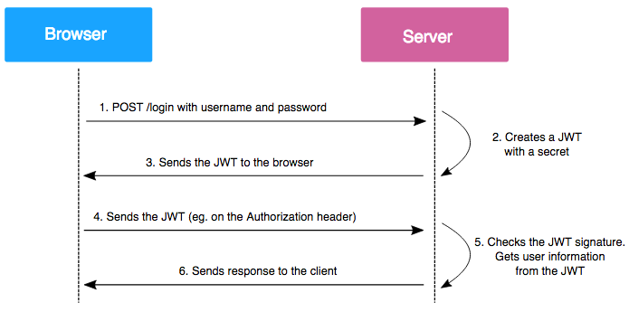

# 前言

# JWT

数字签名与 JSON Web Token (JWT) 的结合是现代 Web 应用程序中身份验证和信息交换的重要组成部分。JWT 是一种开放标准（RFC 7519），用于在各方之间以 JSON 对象安全地传递信息。它通常用于身份验证和信息交换，结合数字签名可以确保信息的完整性和真实性。

## 1. **JWT 的结构**

JWT 由三部分组成，分别用点（`.`）分隔：

1. **头部（Header）**：
   - 通常包含令牌的类型（JWT）和所使用的签名算法（如 HMAC SHA256 或 RSA）。

   ```json
   {
     "alg": "HS256",
     "typ": "JWT"
   }
   ```

2. **有效载荷（Payload）**：
   - 包含声明（claims），即要传递的信息。声明可以是注册声明（如 `iss`、`exp`、`sub` 等），也可以是自定义声明。

   ```json
   {
     "sub": "1234567890",
     "name": "John Doe",
     "admin": true
   }
   ```

3. **签名（Signature）**：
   - 使用头部中指定的算法和密钥对头部和有效载荷进行签名，以确保信息的完整性和真实性。

   ```plaintext
   HMACSHA256(
     base64UrlEncode(header) + "." +
     base64UrlEncode(payload),
     secret)
   ```

## 2. **数字签名在 JWT 中的作用**

- **身份验证**：JWT 的签名部分确保了令牌的发送者是可信的。只有持有私钥的发送者才能生成有效的 JWT。
  
- **信息完整性**：接收者可以使用公钥（在非对称加密中）或共享密钥（在对称加密中）验证签名，确保有效载荷未被篡改。

- **不可否认性**：发送者无法否认已发送的 JWT，因为只有他们才能生成有效的签名。

## 3. **工作流程**

1. **用户登录**：
   - 用户提供凭据（如用户名和密码）进行身份验证。

2. **生成 JWT**：
   - 服务器验证用户凭据后，生成 JWT，包含用户信息和其他声明，并使用私钥对其进行签名。

3. **返回 JWT**：
   - 服务器将生成的 JWT 返回给用户。

4. **使用 JWT**：
   - 用户在后续请求中将 JWT 作为 Bearer Token 发送给服务器。

5. **验证 JWT**：
   - 服务器接收到 JWT 后，使用公钥或共享密钥验证签名，确保 JWT 的有效性和完整性。

## 4. **优点**

- **无状态**：JWT 是自包含的，服务器不需要存储会话信息，减少了服务器的负担。
- **跨域支持**：JWT 可以在不同的域之间安全地传递信息，适合微服务架构。
- **灵活性**：可以在有效载荷中包含自定义声明，满足不同应用的需求。

## 5. 伪代码示例
下面是一个使用 JWT 进行身份验证的伪代码示例，展示了从用户登录到生成和验证 JWT 的整个过程。这个示例将涵盖用户登录、JWT 生成、JWT 使用和验证的步骤。

```java
// 伪代码示例：使用 JWT 进行身份验证

// 1. 用户登录
function login(username, password):
    // 验证用户凭据
    user = findUserByUsername(username)
    if user is null:
        return "用户不存在"
    
    if not verifyPassword(user, password):
        return "密码错误"
    
    // 2. 生成 JWT
    token = generateJWT(user.id, user.role) // 生成 JWT，包含用户 ID 和角色
    return token

// 3. 生成 JWT 函数
function generateJWT(userId, userRole):
    header = {
        "alg": "HS256",
        "typ": "JWT"
    }
    
    payload = {
        "sub": userId,          // 用户 ID
        "role": userRole,       // 用户角色
        "exp": currentTime() + 3600 // 过期时间（1小时）
    }
    
    // 对头部和有效载荷进行编码
    encodedHeader = base64UrlEncode(header)
    encodedPayload = base64UrlEncode(payload)
    
    // 生成签名
    signature = HMACSHA256(encodedHeader + "." + encodedPayload, secretKey)
    
    // 返回完整的 JWT
    return encodedHeader + "." + encodedPayload + "." + signature

// 4. 使用 JWT 进行请求
function protectedResourceRequest(token):
    // 验证 JWT
    if not verifyJWT(token):
        return "无效的令牌"
    
    // 处理请求
    return "访问受保护的资源"

// 5. 验证 JWT 函数
function verifyJWT(token):
    parts = token.split(".")
    if length(parts) != 3:
        return false // JWT 格式不正确
    
    encodedHeader = parts[0]
    encodedPayload = parts[1]
    signature = parts[2]
    
    // 重新生成签名
    expectedSignature = HMACSHA256(encodedHeader + "." + encodedPayload, secretKey)
    
    // 验证签名
    if signature != expectedSignature:
        return false // 签名不匹配
    
    // 解码有效载荷
    payload = base64UrlDecode(encodedPayload)
    
    // 检查过期时间
    if payload.exp < currentTime():
        return false // 令牌已过期
    
    return true // 验证成功

// 6. 主程序
function main():
    // 用户登录
    token = login("username", "password")
    if token is not null:
        print("登录成功，JWT:", token)
        
        // 使用 JWT 访问受保护的资源
        response = protectedResourceRequest(token)
        print(response)
    else:
        print("登录失败")
```

**说明**

1. **用户登录**：用户提供用户名和密码，系统验证凭据。如果验证成功，生成 JWT。

2. **生成 JWT**：`generateJWT` 函数创建 JWT，包括头部、有效载荷和签名。有效载荷中包含用户 ID、角色和过期时间。

3. **使用 JWT**：在访问受保护的资源时，用户将 JWT 作为请求的一部分发送。

4. **验证 JWT**：`verifyJWT` 函数检查 JWT 的格式、签名和过期时间。如果所有检查都通过，返回有效的状态。

5. **主程序**：模拟用户登录和访问受保护资源的过程。


## 6. 项目实践中的使用

## 7. **总结**

结合数字签名和 JWT，您可以实现安全、可靠的身份验证和信息交换。数字签名确保了 JWT 的真实性和完整性，而 JWT 提供了一种轻量级的方式来传递身份和权限信息。这种结合在现代 Web 应用程序、API 认证和微服务架构中得到了广泛应用。

# Spring Security

# ACL-Filter

