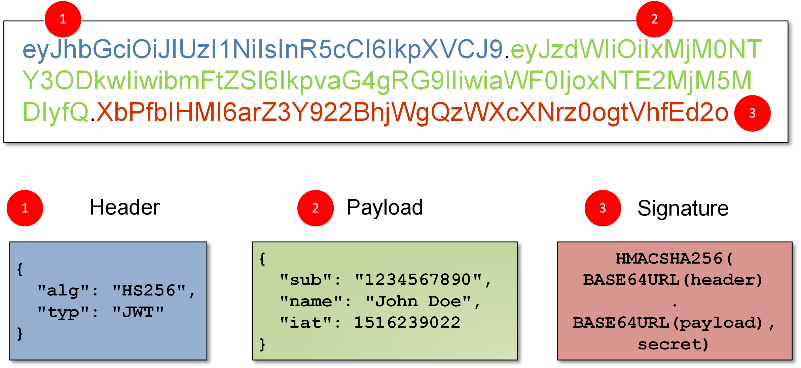

# 前言

# JWT

数字签名与 JSON Web Token (JWT) 的结合是现代 Web 应用程序中身份验证和信息交换的重要组成部分。JWT 是一种开放标准（RFC 7519），用于在各方之间以 JSON 对象安全地传递信息。它通常用于身份验证和信息交换，结合数字签名可以确保信息的完整性和真实性。

## 1. **JWT 的结构**

JWT 由三部分组成，分别用点（`.`）分隔：

1. **头部（Header）**：
   - 通常包含令牌的类型（JWT）和所使用的签名算法（如 HMAC SHA256 或 RSA）。

   ```json
   {
     "alg": "HS256",
     "typ": "JWT"
   }
   ```

2. **有效载荷（Payload）**：
   - 包含声明（claims），即要传递的信息。声明可以是注册声明（如 `iss`、`exp`、`sub` 等），也可以是自定义声明。

   ```json
   {
     "sub": "1234567890",
     "name": "John Doe",
     "admin": true
   }
   ```

3. **签名（Signature）**：
   - 使用头部中指定的算法和密钥对头部和有效载荷进行签名，以确保信息的完整性和真实性。

   ```plaintext
   HMACSHA256(
     base64UrlEncode(header) + "." +
     base64UrlEncode(payload),
     secret)
   ```

## 2. **数字签名在 JWT 中的作用**

- **身份验证**：JWT 的签名部分确保了令牌的发送者是可信的。只有持有私钥的发送者才能生成有效的 JWT。
  
- **信息完整性**：接收者可以使用公钥（在非对称加密中）或共享密钥（在对称加密中）验证签名，确保有效载荷未被篡改。

- **不可否认性**：发送者无法否认已发送的 JWT，因为只有他们才能生成有效的签名。

### 3. **工作流程**

1. **用户登录**：
   - 用户提供凭据（如用户名和密码）进行身份验证。

2. **生成 JWT**：
   - 服务器验证用户凭据后，生成 JWT，包含用户信息和其他声明，并使用私钥对其进行签名。

3. **返回 JWT**：
   - 服务器将生成的 JWT 返回给用户。

4. **使用 JWT**：
   - 用户在后续请求中将 JWT 作为 Bearer Token 发送给服务器。

5. **验证 JWT**：
   - 服务器接收到 JWT 后，使用公钥或共享密钥验证签名，确保 JWT 的有效性和完整性。

## 4. **优点**

- **无状态**：JWT 是自包含的，服务器不需要存储会话信息，减少了服务器的负担。
- **跨域支持**：JWT 可以在不同的域之间安全地传递信息，适合微服务架构。
- **灵活性**：可以在有效载荷中包含自定义声明，满足不同应用的需求。

## 5. **总结**

结合数字签名和 JWT，您可以实现安全、可靠的身份验证和信息交换。数字签名确保了 JWT 的真实性和完整性，而 JWT 提供了一种轻量级的方式来传递身份和权限信息。这种结合在现代 Web 应用程序、API 认证和微服务架构中得到了广泛应用。

# Spring Security

# ACL-Filter

