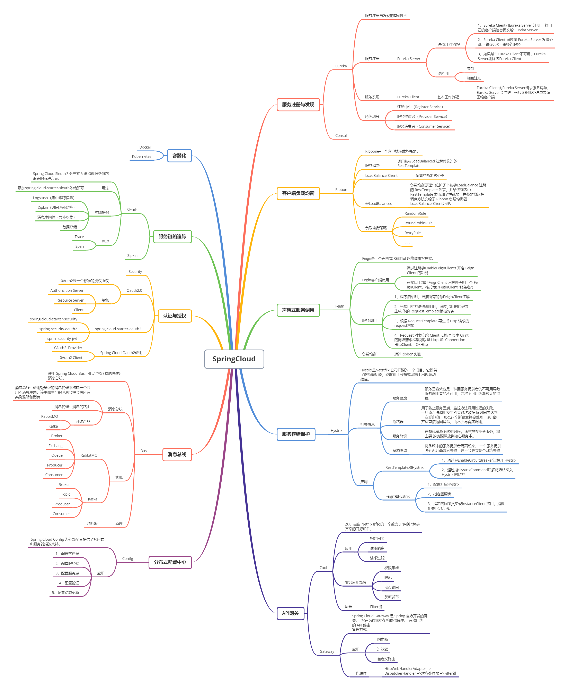

[TOC]

# 一、Spring Cloud

## 1.1 微服务介绍

SpringCloud 是 Spring 官方推出的微服务治理框架。

Spring Cloud Netfilx核心组件-来源参考[2]

> **什么是微服务？**

1. 2014 年 **Martin Fowler** 提出的一种新的架构形式。微服务架构是一种**架构模式**，提倡将单一应用程序划分成一组小的服务，服务之间相互协调，互相配合，为用户提供最终价值。每个服务运行在其独立的进程中，服务与服务之间采用轻量级的通信机制(如 HTTP 或 Dubbo)互相协作，每个服务都围绕着具体的业务进行构建，并且能够被独立的部署到生产环境中，另外，应尽量避免统一的，集中式的服务管理机制，对具体的一个服务而言，应根据业务上下文，选择合适的语言、工具(如 Maven)对其进行构建。
2. 微服务化的核心就是将传统的一站式应用，根据业务拆分成一个一个的服务，彻底地去耦合，每一个微服务提供单个业务功能的服务，一个服务做一件事情，从技术角度看就是一种小而独立的处理过程，类似进程的概念，能够自行单独启动或销毁，拥有自己独立的数据库。

> **微服务架构主要要解决哪些问题？**

1. 服务很多，客户端怎么访问，如何提供对外网关?
2. 这么多服务，服务之间如何通信? HTTP 还是 RPC?
3. 这么多服务，如何治理? 服务的注册和发现。
4. 服务挂了怎么办？熔断机制。

> **有哪些主流微服务框架？**

1. Spring Cloud Netflix
2. Spring Cloud Alibaba
3. SpringBoot + Dubbo + ZooKeeper

> **SpringCloud 有哪些核心组件？**

