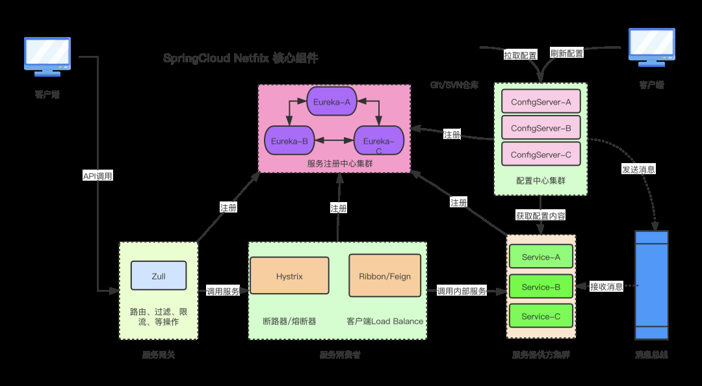
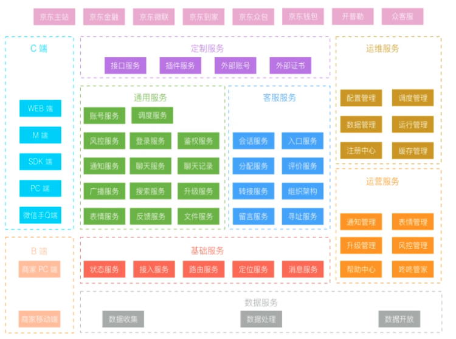
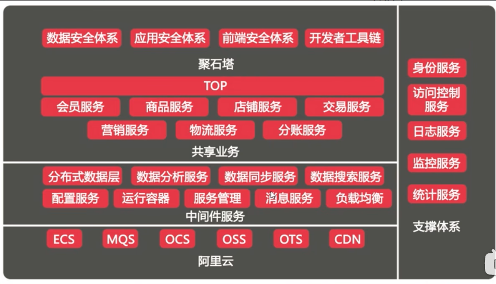

[TOC]

# 一、Spring Cloud

## 1.1 微服务介绍

SpringCloud 是 Spring 官方推出的微服务治理框架。

Spring Cloud Netfilx核心组件-来源参考[2]

> **什么是微服务？**

1. 2014 年 **Martin Fowler** 提出的一种新的架构形式。微服务架构是一种**架构模式**，提倡将单一应用程序划分成一组小的服务，服务之间相互协调，互相配合，为用户提供最终价值。每个服务运行在其独立的进程中，服务与服务之间采用轻量级的通信机制(如 HTTP 或 Dubbo)互相协作，每个服务都围绕着具体的业务进行构建，并且能够被独立的部署到生产环境中，另外，应尽量避免统一的，集中式的服务管理机制，对具体的一个服务而言，应根据业务上下文，选择合适的语言、工具(如 Maven)对其进行构建。
2. 微服务化的核心就是将传统的一站式应用，根据业务拆分成一个一个的服务，彻底地去耦合，每一个微服务提供单个业务功能的服务，一个服务做一件事情，从技术角度看就是一种小而独立的处理过程，类似进程的概念，能够自行单独启动或销毁，拥有自己独立的数据库。

> **微服务架构主要要解决哪些问题？**

1. 服务很多，客户端怎么访问，如何提供对外网关?
2. 这么多服务，服务之间如何通信? HTTP 还是 RPC?
3. 这么多服务，如何治理? 服务的注册和发现。
4. 服务挂了怎么办？熔断机制。

> **有哪些主流微服务框架？**

1. Spring Cloud Netflix
2. Spring Cloud Alibaba
3. SpringBoot + Dubbo + ZooKeeper

> **SpringCloud 有哪些核心组件？**

## 1.2 微服务架构例子

### 1.2.1 京东微服务架构

### 1.2.2 阿里微服务架构

## 1.3 微服务核心组件

- **通用微服务架构**

- **传统核心组件**

## 1.4 Spring Cloud 版本

### 1.4.1 版本介绍与选择

> https://github.com/spring-cloud/spring-cloud-release/wiki

### 1.4.2 组件的更替

# 二、项目实践

> 微服务模块构建流程
>
> 1. 建module
> 2. 改POM
> 3. 写YML
> 4. 主启动
> 5. 业务类

## 2.1 spring cloud-alibaba-atguigu-1

### 一些问题

#### packaging pom/jar/war

> https://zhuanlan.zhihu.com/p/72515456

#### Dependencies vs dependencyManagement

Maven使用dependencyManagement 元素来提供了一种管理依赖版本号的方式。通常会在一个组织或者项目的最顶层的父POM 中看到dependencyManagement 元素。使用pom.xml 中的dependencyManagement元素能让所有在子项目中引用一个依赖而不用显式的列出版本号。Maven会沿着父子层次向上走,直到找到一个拥有dependencyManagement元素的项目,然后它就会使用这个 dependencyManagement 元素中指定的版本号。

这样做的好处就是：如果有多个子项目都引用同一样依赖，则可以避免在每个使用的子项目里都声明一个版本号，这样当想升级或切换到另一个版本时，只需要在顶层父容器里更新，而不需要一个一个子项目的修改；另外如果某个子项目需要另外的一个版本，只需要声明version就可。dependencyManagement里只是声明依赖,并不实现引入,因此子项目需要显示的声明需要用的依赖。如果不在子项目中声明依赖,是不会从父项目中继承下来的；只有在子项目中写了该依赖项,并且没有指定具体版本,才会从父项目中继承该项,并且version和scope都读取自父pom;如果子项目中指定了版本号，那么会使用子项目中指定的jar版本。

#### pom : type / scope

> https://blog.51cto.com/knifeedge/5273943
