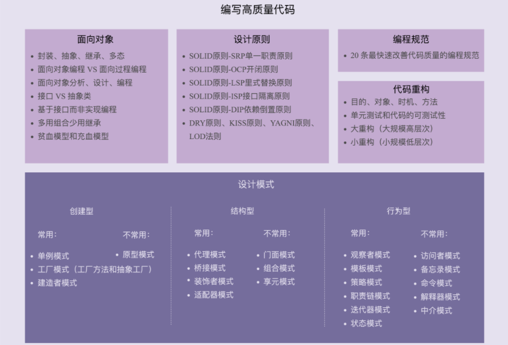

# 一、设计模式学习导读
> 最常用的评价标准有哪几个？

## 1.1 从哪些维度评判代码质量的好坏？如何具备写出高质量代码的能力？
### 1.可维护性（maintainability）
我们首先来看，什么是代码的“可维护性”？所谓的“维护代码”到底包含哪些具体工作？
落实到编码开发，所谓的“维护”无外乎就是修改bug、修改老的代码、添加新的代码之类的工作。所谓“代码易维护”就是指，在不破坏原有代码设计、不引入新的bug的情况下，能够快速地修改或者添加代码。所谓“代码不易维护”就是指，修改或者添加代码需要冒着极大的引入新bug的风险，并且需要花费很长的时间才能完成。
我们知道，对于一个项目来说，维护代码的时间远远大于编写代码的时间。工程师大部分的时间可能都是花在修修bug、改改老的功能逻辑、添加一些新的功能逻辑之类的工作上。所以，代码的可维护性就显得格外重要。
维护、易维护、不易维护这三个概念不难理解。不过，对于实际的软件开发来说，更重要的是搞清楚，如何来判断代码可维护性的好坏。

实际上，可维护性也是一个很难量化、偏向对代码整体的评价标准，它有点类似之前提到的“好”“坏”“优雅”之类的笼统评价。代码的可维护性是由很多因素协同作用的结果。代码的可读性好、简洁、可扩展性好，就会使得代码易维护；相反，就会使得代码不易维护。更细化地讲，如果代码分层清晰、模块化好、高内聚低耦合、遵从基于接口而非实现编程的设计原则等等，那就可能意味着代码易维护。除此之外，代码的易维护性还跟项目代码量的多少、业务的复杂程度、利用到的技术的复杂程度、文档是否全面、团队成员的开发水平等诸多因素有关。
所以，从正面去分析一个代码是否易维护稍微有点难度。不过，我们可以从侧面上给出一个比较主观但又比较准确的感受。如果bug容易修复，修改、添加功能能够轻松完成，那我们就可以主观地认为代码对我们来说易维护。相反，如果修改一个bug，修改、添加一个功能，需要花费很长的时间，那我们就可以主观地认为代码对我们来说不易维护。

你可能会说，这样的评价方式也太主观了吧？没错，是否易维护本来就是针对维护的人来说的。不同水平的人对于同一份代码的维护能力并不是相同的。对于同样一个系统，熟悉它的资深工程师会觉得代码的可维护性还不错，而一些新人因为不熟悉代码，修改bug、修改添加代码要花费很长的时间，就有可能会觉得代码的可维护性不那么好。这实际上也印证了我们之前的观点：代码质量的评价有很强的主观性。

---

### 2.可读性（readability）
软件设计大师Martin Fowler曾经说过：“Any fool can write code that a computer can understand. Good programmers write code that humans can understand.”翻译成中文就是：“任何傻瓜都会编写计算机能理解的代码。好的程序员能够编写人能够理解的代码。”Google内部甚至专门有个认证就叫作Readability。只有拿到这个认证的工程师，才有资格在code review的时候，批准别人提交代码。可见代码的可读性有多重要，毕竟，代码被阅读的次数远远超过被编写和执行的次数。

我个人认为，代码的可读性应该是评价代码质量最重要的指标之一。我们在编写代码的时候，时刻要考虑到代码是否易读、易理解。除此之外，代码的可读性在非常大程度上会影响代码的可维护性。毕竟，不管是修改bug，还是修改添加功能代码，我们首先要做的事情就是读懂代码。代码读不大懂，就很有可能因为考虑不周全，而引入新的bug。

既然可读性如此重要，那我们又该如何评价一段代码的可读性呢？我们需要看代码是否符合编码规范、命名是否达意、注释是否详尽、函数是否长短合适、模块划分是否清晰、是否符合高内聚低耦合等等。你应该也能感觉到，从正面上，我们很难给出一个覆盖所有评价指标的列表。这也是我们无法量化可读性的原因。实际上，code review是一个很好的测验代码可读性的手段。如果你的同事可以轻松地读懂你写的代码，那说明你的代码可读性很好；如果同事在读你的代码时，有很多疑问，那就说明你的代码可读性有待提高了。

---

### 3.可扩展性（extensibility）
可扩展性也是一个评价代码质量非常重要的标准。它表示我们的代码应对未来需求变化的能力。跟可读性一样，代码是否易扩展也很大程度上决定代码是否易维护。那到底什么是代码的可扩展性呢？

代码的可扩展性表示，我们在不修改或少量修改原有代码的情况下，通过扩展的方式添加新的功能代码。说直白点就是，代码预留了一些功能扩展点，你可以把新功能代码，直接插到扩展点上，而不需要因为要添加一个功能而大动干戈，改动大量的原始代码。关于代码的扩展性，在后面讲到“对修改关闭，对扩展开放”这条设计原则的时候，我会来详细讲解，今天我们只需要知道，代码的可扩展性是评价代码质量非常重要的标准就可以了。

---

### 4.灵活性（flexibility）
灵活性也是描述代码质量的一个常用词汇。比如我们经常会听到这样的描述：“代码写得很灵活”。那这里的“灵活”该如何理解呢？尽管有很多人用这个词汇来描述代码的质量。但实际上，灵活性是一个挺抽象的评价标准，要给灵活性下个定义也是挺难的。不过，我们可以想一下，什么情况下我们才会说代码写得好灵活呢？我这里罗列了几个场景，希望能引发你自己对什么是灵活性的思考。
- 当我们添加一个新的功能代码的时候，原有的代码已经预留好了扩展点，我们不需要修改原有的代码，只要在扩展点上添加新的代码即可。这个时候，我们除了可以说代码易扩展，还可以说代码写得好灵活。
- 当我们要实现一个功能的时候，发现原有代码中，已经抽象出了很多底层可以复用的模块、类等代码，我们可以拿来直接使用。这个时候，我们除了可以说代码易复用之外，还可以说代码写得好灵活。
- 当我们使用某组接口的时候，如果这组接口可以应对各种使用场景，满足各种不同的需求，我们除了可以说接口易用之外，还可以说这个接口设计得好灵活或者代码写得好灵活。
从刚刚举的场景来看，如果一段代码易扩展、易复用或者易用，我们都可以称这段代码写得比较灵活。所以，灵活这个词的含义非常宽泛，很多场景下都可以使用。

---

### 5.简洁性（simplicity）
有一条非常著名的设计原则，你一定听过，那就是KISS原则：“Keep It Simple，Stupid”。这个原则说的意思就是，尽量保持代码简单。代码简单、逻辑清晰，也就意味着易读、易维护。我们在编写代码的时候，往往也会把简单、清晰放到首位。

不过，很多编程经验不足的程序员会觉得，简单的代码没有技术含量，喜欢在项目中引入一些复杂的设计模式，觉得这样才能体现自己的技术水平。实际上，思从深而行从简，真正的高手能云淡风轻地用最简单的方法解决最复杂的问题。这也是一个编程老手跟编程新手的本质区别之一。除此之外，虽然我们都能认识到，代码要尽量写得简洁，符合KISS原则，但怎么样的代码才算足够简洁？不是每个人都能很准确地判断出来这一点。所以，在后面的章节中，当我们讲到KISS原则的时候，我会通过具体的代码实例，详细给你解释，“为什么KISS原则看似非常简单、好理解，但实际上用好并不容易”。今天，我们就暂且不展开详细讲解了。

---

### 6.可复用性（reusability）
代码的可复用性可以简单地理解为，尽量减少重复代码的编写，复用已有的代码。在后面的很多章节中，我们都会经常提到“可复用性”这一代码评价标准。比如，当讲到面向对象特性的时候，我们会讲到继承、多态存在的目的之一，就是为了提高代码的可复用性；当讲到设计原则的时候，我们会讲到单一职责原则也跟代码的可复用性相关；当讲到重构技巧的时候，我们会讲到解耦、高内聚、模块化等都能提高代码的可复用性。可见，可复用性也是一个非常重要的代码评价标准，是很多设计原则、思想、模式等所要达到的最终效果。实际上，代码可复用性跟DRY（Don’t Repeat Yourself）这条设计原则的关系挺紧密的，所以，在后面的章节中，当我们讲到DRY设计原则的时候，我还会讲更多代码复用相关的知识，比如，“有哪些编程方法可以提高代码的复用性”等。

---

### 7.可测试性（testability）
相对于前面六个评价标准，代码的可测试性是一个相对较少被提及，但又非常重要的代码质量评价标准。代码可测试性的好坏，能从侧面上非常准确地反应代码质量的好坏。代码的可测试性差，比较难写单元测试，那基本上就能说明代码设计得有问题。关于代码的可测试性，我们在重构那一部分，会花两节课的时间来详细讲解。现在，你暂时只需要知道，代码的可测试性非常重要就可以了。

---

## 1.2 如何才能写出高质量的代码？
我相信每个工程师都想写出高质量的代码，不想一直写没有成长、被人吐槽的烂代码。那如何才能写出高质量的代码呢？针对什么是高质量的代码，我们刚刚讲到了七个最常用、最重要的评价指标。所以，问如何写出高质量的代码，也就等同于在问，如何写出易维护、易读、易扩展、灵活、简洁、可复用、可测试的代码。

要写出满足这些评价标准的高质量代码，我们需要掌握一些更加细化、更加能落地的编程方法论，包括面向对象设计思想、设计原则、设计模式、编码规范、重构技巧等。而所有这些编程方法论的最终目的都是为了编写出高质量的代码。比如，面向对象中的继承、多态能让我们写出可复用的代码；编码规范能让我们写出可读性好的代码；设计原则中的单一职责、DRY、基于接口而非实现、里式替换原则等，可以让我们写出可复用、灵活、可读性好、易扩展、易维护的代码；设计模式可以让我们写出易扩展的代码；持续重构可以时刻保持代码的可维护性等等。具体这些编程方法论是如何提高代码的可维护性、可读性、可扩展性等等的呢？我们在后面的课程中慢慢来学习。

## 1.3 面向对象、设计原则、设计模式、编程规范、重构，这五者有何关系？
### 面向对象
现在，主流的编程范式或者是编程风格有三种，它们分别是面向过程、面向对象和函数式编程。面向对象这种编程风格又是这其中最主流的。现在比较流行的编程语言大部分都是面向对象编程语言。大部分项目也都是基于面向对象编程风格开发的。面向对象编程因为其具有丰富的特性（封装、抽象、继承、多态），可以实现很多复杂的设计思路，是很多设计原则、设计模式编码实现的基础。所以，在专栏的最开始，我们会详细地讲解面向对象编程的相关的知识，为学习后面的内容做铺垫。对于这部分内容，你需要掌握下面这7个大的知识点。
- 面向对象的四大特性：封装、抽象、继承、多态
- 面向对象编程与面向过程编程的区别和联系
- 面向对象分析、面向对象设计、面向对象编程
- 接口和抽象类的区别以及各自的应用场景
- 基于接口而非实现编程的设计思想
- 多用组合少用继承的设计思想
- 面向过程的贫血模型和面向对象的充血模型

---

### 设计原则
设计原则是指导我们代码设计的一些经验总结。设计原则这块儿的知识有一个非常大的特点，那就是这些原则听起来都比较抽象，定义描述都比较模糊，不同的人会有不同的解读。所以，如果单纯地去记忆定义，对于编程、设计能力的提高，意义并不大。对于每一种设计原则，我们需要掌握它的设计初衷，能解决哪些编程问题，有哪些应用场景。只有这样，我们才能在项目中灵活恰当地应用这些原则。对于这一部分内容，你需要透彻理解并且掌握，如何应用下面这样几个常用的设计原则。
- SOLID原则-SRP单一职责原则
- SOLID原则-OCP开闭原则
- SOLID原则-LSP里式替换原则
- SOLID原则-ISP接口隔离原则
- SOLID原则-DIP依赖倒置原则
- DRY原则、KISS原则、YAGNI原则、LOD法则

### 设计模式
设计模式是针对软件开发中经常遇到的一些设计问题，总结出来的一套解决方案或者设计思路。大部分设计模式要解决的都是代码的可扩展性问题。设计模式相对于设计原则来说，没有那么抽象，而且大部分都不难理解，代码实现也并不复杂。这一块的学习难点是了解它们都能解决哪些问题，掌握典型的应用场景，并且懂得不过度应用。

经典的设计模式有23种。随着编程语言的演进，一些设计模式（比如Singleton）也随之过时，甚至成了反模式，一些则被内置在编程语言中（比如Iterator），另外还有一些新的模式诞生（比如Monostate）。在专栏中，我们会重点讲解23种经典的设计模式。它们又可以分为三大类：创建型、结构型、行为型。对于这23种设计模式的学习，我们要有侧重点，因为有些模式是比较常用的，有些模式是很少被用到的。对于常用的设计模式，我们要花多点时间理解掌握。对于不常用的设计模式，我们只需要稍微了解即可。我按照类型和是否常用，对专栏中讲到的这些设计模式，进行了简单的分类，具体如下所示。

1.创建型

常用的有：单例模式、工厂模式（工厂方法和抽象工厂）、建造者模式。
不常用的有：原型模式。

2.结构型

常用的有：代理模式、桥接模式、装饰者模式、适配器模式。
不常用的有：门面模式、组合模式、享元模式。

3.行为型

常用的有：观察者模式、模板模式、策略模式、职责链模式、迭代器模式、状态模式。
不常用的有：访问者模式、备忘录模式、命令模式、解释器模式、中介模式。

### 编程规范
编程规范主要解决的是代码的可读性问题。编码规范相对于设计原则、设计模式，更加具体、更加偏重代码细节。即便你可能对设计原则不熟悉、对设计模式不了解，但你最起码要掌握基本的编码规范，比如，如何给变量、类、函数命名，如何写代码注释，函数不宜过长、参数不能过多等等。

对于编码规范，考虑到很多书籍已经讲得很好了（比如《重构》《代码大全》《代码整洁之道》等）。而且，每条编码规范都非常简单、非常明确，比较偏向于记忆，你只要照着来做可以。它不像设计原则，需要融入很多个人的理解和思考。所以，在这个专栏中，我并没有花太多的篇幅来讲解所有的编码规范，而是总结了我认为的最能改善代码质量的20条规范。如果你暂时没有时间去看那些经典的书籍，看我这些就够了。

除此之外，专栏并没有将编码规范单独作为一个模块来讲解，而是跟重构放到了一起。之所以这样做，那是因为我把重构分为大重构和小重构两种类型，而小重构利用的知识基本上就是编码规范。

除了编码规范，我们还会介绍一些代码的坏味道，让你知道什么样的代码是不符合规范的，应该如何优化。参照编码规范，你可以写出可读性好的代码；参照代码的坏味道，你可以找出代码存在的可读性问题。

### 代码重构
在软件开发中，只要软件在不停地迭代，就没有一劳永逸的设计。随着需求的变化，代码的不停堆砌，原有的设计必定会存在这样那样的问题。针对这些问题，我们就需要进行代码重构。重构是软件开发中非常重要的一个环节。持续重构是保持代码质量不下降的有效手段，能有效避免代码腐化到无可救药的地步。
而重构的工具就是我们前面罗列的那些面向对象设计思想、设计原则、设计模式、编码规范。实际上，设计思想、设计原则、设计模式一个最重要的应用场景就是在重构的时候。我们前面讲过，虽然使用设计模式可以提高代码的可扩展性，但过度不恰当地使用，也会增加代码的复杂度，影响代码的可读性。在开发初期，除非特别必须，我们一定不要过度设计，应用复杂的设计模式。而是当代码出现问题的时候，我们再针对问题，应用原则和模式进行重构。这样就能有效避免前期的过度设计。
对于重构这部分内容，你需要掌握以下几个知识点：
- 重构的目的（why）、对象（what）、时机（when）、方法（how）；
- 保证重构不出错的技术手段：单元测试和代码的可测试性；
- 两种不同规模的重构：大重构（大规模高层次）和小重构（小规模低层次）。

希望你学完这部分内容之后，不仅仅是掌握一些重构技巧、套路，更重要的是建立持续重构意识，把重构当作开发的一部分，融入到日常的开发中。

### 五者之间的联系
关于面向对象、设计原则、设计模式、编程规范和代码重构，这五者的关系我们前面稍微提到了一些，我这里再总结梳理一下。
- 面向对象编程因为其具有丰富的特性（封装、抽象、继承、多态），可以实现很多复杂的设计思路，是很多设计原则、设计模式等编码实现的基础。
- 设计原则是指导我们代码设计的一些经验总结，对于某些场景下，是否应该应用某种设计模式，具有指导意义。比如，“开闭原则”是很多设计模式（策略、模板等）的指导原则。
- 设计模式是针对软件开发中经常遇到的一些设计问题，总结出来的一套解决方案或者设计思路。应用设计模式的主要目的是提高代码的可扩展性。从抽象程度上来讲，设计原则比设计模式更抽象。设计模式更加具体、更加可执行。
- 编程规范主要解决的是代码的可读性问题。编码规范相对于设计原则、设计模式，更加具体、更加偏重代码细节、更加能落地。持续的小重构依赖的理论基础主要就是编程规范。
- 重构作为保持代码质量不下降的有效手段，利用的就是面向对象、设计原则、设计模式、编码规范这些理论。
实际上，面向对象、设计原则、设计模式、编程规范、代码重构，这五者都是保持或者提高代码质量的方法论，本质上都是服务于编写高质量代码这一件事的。当我们追本逐源，看清这个本质之后，很多事情怎么做就清楚了，很多选择怎么选也清楚了。比如，在某个场景下，该不该用这个设计模式，那就看能不能提高代码的可扩展性；要不要重构，那就看重代码是否存在可读、可维护问题等。



---

# 二、设计原则与思想：面向对象

## 2.1  **理论一：当谈论面向对象的时候，我们到底在谈论什么？**

考虑到各个水平层次的同学，并且保证专栏内容的系统性、全面性，我会循序渐进地讲解跟设计模式相关的所有内容。所以，专栏正文的第一个模块，我会讲一些设计原则、设计思想，比如，面向对象设计思想、经典设计原则以及重构相关的知识，为之后学习设计模式做铺垫。

在第一个模块中，我们又首先会讲到面向对象相关的理论知识。提到面向对象，我相信很多人都不陌生，随口都可以说出面向对象的四大特性：封装、抽象、继承、多态。实际上，面向对象这个概念包含的内容还不止这些。所以，今天我打算花一节课的时间，先大概跟你聊一下，当我们谈论面向对象的时候，经常会谈到的一些概念和知识点，为学习后面的几节更加细化的内容做一个铺垫。

特别说明一下，对于今天讲到的概念和知识点，大部分我都是点到为止，并没有展开详细讲解。如果你看了之后，对某个概念和知识点还不是很清楚，那也没有关系。在后面的几节课中，我会花更多的篇幅，对今天讲到的每个概念和知识点，结合具体的例子，一一做详细的讲解。

### 2.1.1 什么是面向对象编程和面向对象编程语言？

面向对象编程的英文缩写是OOP，全称是Object Oriented Programming。对应地，面向对象编程语言的英文缩写是OOPL，全称是Object Oriented Programming Language。

面向对象编程中有两个非常重要、非常基础的概念，那就是类（class）和对象（object）。这两个概念最早出现在1960年，在Simula这种编程语言中第一次使用。而面向对象编程这个概念第一次被使用是在Smalltalk这种编程语言中。Smalltalk被认为是第一个真正意义上的面向对象编程语言。

1980年左右，C++的出现，带动了面向对象编程的流行，也使得面向对象编程被越来越多的人认可。直到今天，如果不按照严格的定义来说，大部分编程语言都是面向对象编程语言，比如Java、C++、Go、Python、C#、Ruby、JavaScript、Objective-C、Scala、PHP、Perl等等。除此之外，大部分程序员在开发项目的时候，都是基于面向对象编程语言进行的面向对象编程。

以上是面向对象编程的大概发展历史。在刚刚的描述中，我着重提到了两个概念，面向对象编程和面向对象编程语言。那究竟什么是面向对象编程？什么语言才算是面向对象编程语言呢？如果非得给出一个定义的话，我觉得可以用下面两句话来概括。

- 面向对象编程是一种编程范式或编程风格。它以类或对象作为组织代码的基本单元，并将封装、抽象、继承、多态四个特性，作为代码设计和实现的基石 。
- 面向对象编程语言是支持类或对象的语法机制，并有现成的语法机制，能方便地实现面向对象编程四大特性（封装、抽象、继承、多态）的编程语言。

一般来讲， 面向对象编程都是通过使用面向对象编程语言来进行的，但是，不用面向对象编程语言，我们照样可以进行面向对象编程。反过来讲，即便我们使用面向对象编程语言，写出来的代码也不一定是面向对象编程风格的，也有可能是面向过程编程风格的。这里听起来是不是有点绕？不过没关系，我们在后面的第7节课中，会详细讲解这个问题。

除此之外，从定义中，我们还可以发现，理解面向对象编程及面向对象编程语言两个概念，其中最关键的一点就是理解面向对象编程的四大特性。这四大特性分别是：封装、抽象、继承、多态。不过，关于面向对象编程的特性，也有另外一种说法，那就是只包含三大特性：封装、继承、多态，不包含抽象。为什么会有这种分歧呢？抽象为什么可以排除在面向对象编程特性之外呢？关于这个问题，在下一节课详细讲解这四大特性的时候，我还会再拿出来说一下。不过，话说回来，实际上，我们没必要纠结到底是四大特性还是三大特性，关键还是理解每种特性讲的是什么内容、存在的意义以及能解决什么问题。

而且，在技术圈里，封装、抽象、继承、多态也并不是固定地被叫作“四大特性”（features），也有人称它们为面向对象编程的四大概念（concepts）、四大基石（cornerstones）、四大基础（fundamentals）、四大支柱（pillars）等等。你也发现了吧，叫法挺混乱的。不过，叫什么并不重要。我们只需要知道，这是前人进行面向对象编程过程中总结出来的、能让我们更容易地实现各种设计思路的几个编程套路，这就够了。在之后的课程讲解中，我统一把它们叫作“四大特性”。

### 2.1.2 如何判定某编程语言是否是面向对象编程语言？

如果你足够细心，你可能已经留意到，在我刚刚的讲解中，我提到，“如果不按照严格的定义来说，大部分编程语言都是面向对象编程语言”。为什么要加上“如果不按照严格的定义”这个前提呢？那是因为，如果按照刚刚我们给出的严格的面向对象编程语言的定义，前面提到的有些编程语言，并不是严格意义上的面向对象编程语言，比如JavaScript，它不支持封装和继承特性，按照严格的定义，它不算是面向对象编程语言，但在某种意义上，它又可以算得上是一种面向对象编程语言。我为什么这么说呢？到底该如何判断一个编程语言是否是面向对象编程语言呢？

还记得我们前面给出的面向对象编程及面向对象编程语言的定义吗？如果忘记了，你可以先翻到上面回顾一下。不过，我必须坦诚告诉你，那个定义是我自己给出的。实际上，对于什么是面向对象编程、什么是面向对象编程语言，并没有一个官方的、统一的定义。而且，从1960年，也就是60年前面向对象编程诞生开始，这两个概念就在不停地演化，所以，也无法给出一个明确的定义，也没有必要给出一个明确定义。

实际上，面向对象编程从字面上，按照最简单、最原始的方式来理解，就是将对象或类作为代码组织的基本单元，来进行编程的一种编程范式或者编程风格，并不一定需要封装、抽象、继承、多态这四大特性的支持。但是，在进行面向对象编程的过程中，人们不停地总结发现，有了这四大特性，我们就能更容易地实现各种面向对象的代码设计思路。

比如，我们在面向对象编程的过程中，经常会遇到is-a这种类关系（比如狗是一种动物），而继承这个特性就能很好地支持这种is-a的代码设计思路，并且解决代码复用的问题，所以，继承就成了面向对象编程的四大特性之一。但是随着编程语言的不断迭代、演化，人们发现继承这种特性容易造成层次不清、代码混乱，所以，很多编程语言在设计的时候就开始摒弃继承特性，比如Go语言。但是，我们并不能因为它摒弃了继承特性，就一刀切地认为它不是面向对象编程语言了。

实际上，我个人觉得，只要某种编程语言支持类或对象的语法概念，并且以此作为组织代码的基本单元，那就可以被粗略地认为它就是面向对象编程语言了。至于是否有现成的语法机制，完全地支持了面向对象编程的四大特性、是否对四大特性有所取舍和优化，可以不作为判定的标准。基于此，我们才有了前面的说法，**按照严格的定义，很多语言都不能算得上面向对象编程语言，但按照不严格的定义来讲，现在流行的大部分编程语言都是面向对象编程语言。**

所以，多说一句，关于这个问题，我们一定不要过于学院派，非要给面向对象编程、面向对象编程语言下个死定义，非得对某种语言是否是面向对象编程语言争个一清二白，这样做意义不大。

### 2.1.3 什么是面向对象分析和面向对象设计？

前面我们讲了面向对象编程（OOP），实际上，跟面向对象编程经常放到一块儿来讲的还有另外两个概念，那就是面向对象分析（OOA）和面向对象设计（OOD）。面向对象分析英文缩写是OOA，全称是Object Oriented Analysis；面向对象设计的英文缩写是OOD，全称是Object Oriented Design。OOA、OOD、OOP三个连在一起就是面向对象分析、设计、编程（实现），正好是面向对象软件开发要经历的三个阶段。

关于什么是面向对象编程，我们前面已经讲过了。我们现在再来讲一下，什么是面向对象分析和设计。这两个概念相对来说要简单一些。面向对象分析与设计中的“分析”和“设计”这两个词，我们完全可以从字面上去理解，不需要过度解读，简单类比软件开发中的需求分析、系统设计即可。不过，你可能会说，那为啥前面还加了个修饰词“面向对象”呢？有什么特殊的意义吗？

之所以在前面加“面向对象”这几个字，是因为我们是围绕着对象或类来做需求分析和设计的。分析和设计两个阶段最终的产出是类的设计，包括程序被拆解为哪些类，每个类有哪些属性方法，类与类之间如何交互等等。它们比其他的分析和设计更加具体、更加落地、更加贴近编码，更能够顺利地过渡到面向对象编程环节。这也是面向对象分析和设计，与其他分析和设计最大的不同点。

看到这里，你可能会问，那面向对象分析、设计、编程到底都负责做哪些工作呢？简单点讲，面向对象分析就是要搞清楚做什么，面向对象设计就是要搞清楚怎么做，面向对象编程就是将分析和设计的的结果翻译成代码的过程。今天，我们只是简单介绍一下概念，不展开详细讲解。在后面的面向对象实战环节中，我会用两节课的时间，通过一个实际例子，详细讲解如何进行面向对象分析、设计和编程。

### 2.1.4 什么是UML？我们是否需要UML？

讲到面向对象分析、设计、编程，我们就不得不提到另外一个概念，那就是UML（Unified Model Language），统一建模语言。很多讲解面向对象或设计模式的书籍，常用它来画图表达面向对象或设计模式的设计思路。

实际上，UML是一种非常复杂的东西。它不仅仅包含我们常提到类图，还有用例图、顺序图、活动图、状态图、组件图等。在我看来，即便仅仅使用类图，学习成本也是很高的。就单说类之间的关系，UML就定义了很多种，比如泛化、实现、关联、聚合、组合、依赖等。

要想完全掌握，并且熟练运用这些类之间的关系，来画UML类图，肯定要花很多的学习精力。而且，UML作为一种沟通工具，即便你能完全按照UML规范来画类图，可对于不熟悉的人来说，看懂的成本也还是很高的。

所以，从我的开发经验来说，UML在互联网公司的项目开发中，用处可能并不大。为了文档化软件设计或者方便讨论软件设计，大部分情况下，我们随手画个不那么规范的草图，能够达意，方便沟通就够了，而完全按照UML规范来将草图标准化，所付出的代价是不值得的。

所以，我这里特别说明一下，专栏中的很多类图我并没有完全遵守UML的规范标准。为了兼顾图的表达能力和你的学习成本，我对UML类图规范做了简化，并配上了详细的文字解释，力图让你一眼就能看懂，而非适得其反，让图加重你的学习成本。毕竟，我们的专栏并不是一个讲方法论的教程，专栏中的所有类图，本质是让你更清晰地理解设计。

### 2.1.5 重点回顾

今天的内容讲完了，我们来一起总结回顾一下，你需要重点掌握的几个概念和知识点。

**1.什么是面向对象编程？**

面向对象编程是一种编程范式或编程风格。它以类或对象作为组织代码的基本单元，并将封装、抽象、继承、多态四个特性，作为代码设计和实现的基石 。

**2.什么是面向对象编程语言？**

面向对象编程语言是支持类或对象的语法机制，并有现成的语法机制，能方便地实现面向对象编程四大特性（封装、抽象、继承、多态）的编程语言。

**3.如何判定一个编程语言是否是面向对象编程语言？**

如果按照严格的的定义，需要有现成的语法支持类、对象、四大特性才能叫作面向对象编程语言。如果放宽要求的话，只要某种编程语言支持类、对象语法机制，那基本上就可以说这种编程语言是面向对象编程语言了，不一定非得要求具有所有的四大特性。

**4.面向对象编程和面向对象编程语言之间有何关系？**

面向对象编程一般使用面向对象编程语言来进行，但是，不用面向对象编程语言，我们照样可以进行面向对象编程。反过来讲，即便我们使用面向对象编程语言，写出来的代码也不一定是面向对象编程风格的，也有可能是面向过程编程风格的。

**5.什么是面向对象分析和面向对象设计？**

简单点讲，面向对象分析就是要搞清楚做什么，面向对象设计就是要搞清楚怎么做。两个阶段最终的产出是类的设计，包括程序被拆解为哪些类，每个类有哪些属性方法、类与类之间如何交互等等。

 **课堂讨论**

1. 在文章中，我讲到UML的学习成本很高，沟通成本也不低，不推荐在面向对象分析、设计的过程中使用，对此你有何看法？
2. 有关面向对象的概念和知识点，除了我们今天讲到的，你还能想到其他哪些吗？


## 2.2 **理论二：封装、抽象、继承、多态分别可以解决哪些编程问题？**

上一节课，我简单介绍了面向对象的一些基本概念和知识点，比如，什么是面向对象编程，什么是面向对象编程语言等等。其中，我们还提到，理解面向对象编程及面向对象编程语言的关键就是理解其四大特性：封装、抽象、继承、多态。不过，对于这四大特性，光知道它们的定义是不够的，我们还要知道每个特性存在的意义和目的，以及它们能解决哪些编程问题。所以，今天我就花一节课的时间，针对每种特性，结合实际的代码，带你将这些问题搞清楚。

这里我要强调一下，对于这四大特性，尽管大部分面向对象编程语言都提供了相应的语法机制来支持，但不同的编程语言实现这四大特性的语法机制可能会有所不同。所以，今天，我们在讲解四大特性的时候，并不与具体某种编程语言的特定语法相挂钩，同时，也希望你不要局限在你自己熟悉的编程语言的语法思维框架里。

### 2.2.1 封装（Encapsulation）

首先，我们来看封装特性。封装也叫作信息隐藏或者数据访问保护。类通过暴露有限的访问接口，授权外部仅能通过类提供的方式（或者叫函数）来访问内部信息或者数据。这句话怎么理解呢？我们通过一个简单的例子来解释一下。

下面这段代码是金融系统中一个简化版的虚拟钱包的代码实现。在金融系统中，我们会给每个用户创建一个虚拟钱包，用来记录用户在我们的系统中的虚拟货币量。对于虚拟钱包的业务背景，这里你只需要简单了解一下即可。在面向对象的实战篇中，我们会有单独两节课，利用OOP的设计思想来详细介绍虚拟钱包的设计实现。

```
public class Wallet {
  private String id;
  private long createTime;
  private BigDecimal balance;
  private long balanceLastModifiedTime;
  // ...省略其他属性...

  public Wallet() {java
     this.id = IdGenerator.getInstance().generate();
     this.createTime = System.currentTimeMillis();
     this.balance = BigDecimal.ZERO;
     this.balanceLastModifiedTime = System.currentTimeMillis();
  }

  // 注意：下面对get方法做了代码折叠，是为了减少代码所占文章的篇幅
  public String getId() { return this.id; }
  public long getCreateTime() { return this.createTime; }
  public BigDecimal getBalance() { return this.balance; }
  public long getBalanceLastModifiedTime() { return this.balanceLastModifiedTime;  }

  public void increaseBalance(BigDecimal increasedAmount) {
    if (increasedAmount.compareTo(BigDecimal.ZERO) < 0) {
      throw new InvalidAmountException("...");
    }
    this.balance.add(increasedAmount);
    this.balanceLastModifiedTime = System.currentTimeMillis();
  }

  public void decreaseBalance(BigDecimal decreasedAmount) {
    if (decreasedAmount.compareTo(BigDecimal.ZERO) < 0) {
      throw new InvalidAmountException("...");
    }
    if (decreasedAmount.compareTo(this.balance) > 0) {
      throw new InsufficientAmountException("...");
    }
    this.balance.subtract(decreasedAmount);
    this.balanceLastModifiedTime = System.currentTimeMillis();
  }
}
```

从代码中，我们可以发现，Wallet类主要有四个属性（也可以叫作成员变量），也就是我们前面定义中提到的信息或者数据。其中，id表示钱包的唯一编号，createTime表示钱包创建的时间，balance表示钱包中的余额，balanceLastModifiedTime表示上次钱包余额变更的时间。

我们参照封装特性，对钱包的这四个属性的访问方式进行了限制。调用者只允许通过下面这六个方法来访问或者修改钱包里的数据。

- String getId()
- long getCreateTime()
- BigDecimal getBalance()
- long getBalanceLastModifiedTime()
- void increaseBalance(BigDecimal increasedAmount)
- void decreaseBalance(BigDecimal decreasedAmount)

之所以这样设计，是因为从业务的角度来说，id、createTime在创建钱包的时候就确定好了，之后不应该再被改动，所以，我们并没有在Wallet类中，暴露id、createTime这两个属性的任何修改方法，比如set方法。而且，这两个属性的初始化设置，对于Wallet类的调用者来说，也应该是透明的，所以，我们在Wallet类的构造函数内部将其初始化设置好，而不是通过构造函数的参数来外部赋值。

对于钱包余额balance这个属性，从业务的角度来说，只能增或者减，不会被重新设置。所以，我们在Wallet类中，只暴露了increaseBalance()和decreaseBalance()方法，并没有暴露set方法。对于balanceLastModifiedTime这个属性，它完全是跟balance这个属性的修改操作绑定在一起的。只有在balance修改的时候，这个属性才会被修改。所以，我们把balanceLastModifiedTime这个属性的修改操作完全封装在了increaseBalance()和decreaseBalance()两个方法中，不对外暴露任何修改这个属性的方法和业务细节。这样也可以保证balance和balanceLastModifiedTime两个数据的一致性。

对于封装这个特性，我们需要编程语言本身提供一定的语法机制来支持。这个语法机制就是**访问权限控制。**例子中的private、public等关键字就是Java语言中的访问权限控制语法。private关键字修饰的属性只能类本身访问，可以保护其不被类之外的代码直接访问。如果Java语言没有提供访问权限控制语法，所有的属性默认都是public的，那任意外部代码都可以通过类似wallet.id=123;这样的方式直接访问、修改属性，也就没办法达到隐藏信息和保护数据的目的了，也就无法支持封装特性了。

**封装特性的定义讲完了，我们再来看一下，封装的意义是什么？它能解决什么编程问题？**

如果我们对类中属性的访问不做限制，那任何代码都可以访问、修改类中的属性，虽然这样看起来更加灵活，但从另一方面来说，过度灵活也意味着不可控，属性可以随意被以各种奇葩的方式修改，而且修改逻辑可能散落在代码中的各个角落，势必影响代码的可读性、可维护性。比如某个同事在不了解业务逻辑的情况下，在某段代码中“偷偷地”重设了wallet中的balanceLastModifiedTime属性，这就会导致balance和balanceLastModifiedTime两个数据不一致。

除此之外，类仅仅通过有限的方法暴露必要的操作，也能提高类的易用性。如果我们把类属性都暴露给类的调用者，调用者想要正确地操作这些属性，就势必要对业务细节有足够的了解。而这对于调用者来说也是一种负担。相反，如果我们将属性封装起来，暴露少许的几个必要的方法给调用者使用，调用者就不需要了解太多背后的业务细节，用错的概率就减少很多。这就好比，如果一个冰箱有很多按钮，你就要研究很长时间，还不一定能操作正确。相反，如果只有几个必要的按钮，比如开、停、调节温度，你一眼就能知道该如何来操作，而且操作出错的概率也会降低很多。

### 2.2.2 抽象（Abstraction）

讲完了封装特性，我们再来看抽象特性。 封装主要讲的是如何隐藏信息、保护数据，而抽象讲的是如何隐藏方法的具体实现，让调用者只需要关心方法提供了哪些功能，并不需要知道这些功能是如何实现的。

在面向对象编程中，我们常借助编程语言提供的接口类（比如Java中的interface关键字语法）或者抽象类（比如Java中的abstract关键字语法）这两种语法机制，来实现抽象这一特性。

这里我稍微说明一下，在专栏中，我们把编程语言提供的接口语法叫作“接口类”而不是“接口”。之所以这么做，是因为“接口”这个词太泛化，可以指好多概念，比如API接口等，所以，我们用“接口类”特指编程语言提供的接口语法。

对于抽象这个特性，我举一个例子来进一步解释一下。

```
public interface IPictureStorage {
  void savePicture(Picture picture);
  Image getPicture(String pictureId);
  void deletePicture(String pictureId);
  void modifyMetaInfo(String pictureId, PictureMetaInfo metaInfo);
}

public class PictureStorage implements IPictureStorage {
  // ...省略其他属性...
  @Override
  public void savePicture(Picture picture) { ... }
  @Override
  public Image getPicture(String pictureId) { ... }
  @Override
  public void deletePicture(String pictureId) { ... }
  @Override
  public void modifyMetaInfo(String pictureId, PictureMetaInfo metaInfo) { ... }
}
```

在上面的这段代码中，我们利用Java中的interface接口语法来实现抽象特性。调用者在使用图片存储功能的时候，只需要了解IPictureStorage这个接口类暴露了哪些方法就可以了，不需要去查看PictureStorage类里的具体实现逻辑。

实际上，抽象这个特性是非常容易实现的，并不需要非得依靠接口类或者抽象类这些特殊语法机制来支持。换句话说，并不是说一定要为实现类（PictureStorage）抽象出接口类（IPictureStorage），才叫作抽象。即便不编写IPictureStorage接口类，单纯的PictureStorage类本身就满足抽象特性。

之所以这么说，那是因为，类的方法是通过编程语言中的“函数”这一语法机制来实现的。通过函数包裹具体的实现逻辑，这本身就是一种抽象。调用者在使用函数的时候，并不需要去研究函数内部的实现逻辑，只需要通过函数的命名、注释或者文档，了解其提供了什么功能，就可以直接使用了。比如，我们在使用C语言的malloc()函数的时候，并不需要了解它的底层代码是怎么实现的。

除此之外，在上一节课中，我们还提到，抽象有时候会被排除在面向对象的四大特性之外，当时我卖了一个关子，现在我就来解释一下为什么。

抽象这个概念是一个非常通用的设计思想，并不单单用在面向对象编程中，也可以用来指导架构设计等。而且这个特性也并不需要编程语言提供特殊的语法机制来支持，只需要提供“函数”这一非常基础的语法机制，就可以实现抽象特性、所以，它没有很强的“特异性”，有时候并不被看作面向对象编程的特性之一。

**抽象特性的定义讲完了，我们再来看一下，抽象的意义是什么？它能解决什么编程问题？**

实际上，如果上升一个思考层面的话，抽象及其前面讲到的封装都是人类处理复杂性的有效手段。在面对复杂系统的时候，人脑能承受的信息复杂程度是有限的，所以我们必须忽略掉一些非关键性的实现细节。而抽象作为一种只关注功能点不关注实现的设计思路，正好帮我们的大脑过滤掉许多非必要的信息。

除此之外，抽象作为一个非常宽泛的设计思想，在代码设计中，起到非常重要的指导作用。很多设计原则都体现了抽象这种设计思想，比如基于接口而非实现编程、开闭原则（对扩展开放、对修改关闭）、代码解耦（降低代码的耦合性）等。我们在讲到后面的内容的时候，会具体来解释。

换一个角度来考虑，我们在定义（或者叫命名）类的方法的时候，也要有抽象思维，不要在方法定义中，暴露太多的实现细节，以保证在某个时间点需要改变方法的实现逻辑的时候，不用去修改其定义。举个简单例子，比如getAliyunPictureUrl()就不是一个具有抽象思维的命名，因为某一天如果我们不再把图片存储在阿里云上，而是存储在私有云上，那这个命名也要随之被修改。相反，如果我们定义一个比较抽象的函数，比如叫作getPictureUrl()，那即便内部存储方式修改了，我们也不需要修改命名。

### 2.2.3 继承（Inheritance）

学习完了封装和抽象两个特性，我们再来看继承特性。如果你熟悉的是类似Java、C++这样的面向对象的编程语言，那你对继承这一特性，应该不陌生了。继承是用来表示类之间的is-a关系，比如猫是一种哺乳动物。从继承关系上来讲，继承可以分为两种模式，单继承和多继承。单继承表示一个子类只继承一个父类，多继承表示一个子类可以继承多个父类，比如猫既是哺乳动物，又是爬行动物。

为了实现继承这个特性，编程语言需要提供特殊的语法机制来支持，比如Java使用extends关键字来实现继承，C++使用冒号（class B : public A），Python使用parentheses ()，Ruby使用<。不过，有些编程语言只支持单继承，不支持多重继承，比如Java、PHP、C#、Ruby等，而有些编程语言既支持单重继承，也支持多重继承，比如C++、Python、Perl等。

为什么有些语言支持多重继承，有些语言不支持呢？这个问题留给你自己去研究，你可以针对你熟悉的编程语言，在留言区写一写具体的原因。

**继承特性的定义讲完了，我们再来看，继承存在的意义是什么？它能解决什么编程问题？**

继承最大的一个好处就是代码复用。假如两个类有一些相同的属性和方法，我们就可以将这些相同的部分，抽取到父类中，让两个子类继承父类。这样，两个子类就可以重用父类中的代码，避免代码重复写多遍。不过，这一点也并不是继承所独有的，我们也可以通过其他方式来解决这个代码复用的问题，比如利用组合关系而不是继承关系。

如果我们再上升一个思维层面，去思考继承这一特性，可以这么理解：我们代码中有一个猫类，有一个哺乳动物类。猫属于哺乳动物，从人类认知的角度上来说，是一种is-a关系。我们通过继承来关联两个类，反应真实世界中的这种关系，非常符合人类的认知，而且，从设计的角度来说，也有一种结构美感。

继承的概念很好理解，也很容易使用。不过，过度使用继承，继承层次过深过复杂，就会导致代码可读性、可维护性变差。为了了解一个类的功能，我们不仅需要查看这个类的代码，还需要按照继承关系一层一层地往上查看“父类、父类的父类……”的代码。还有，子类和父类高度耦合，修改父类的代码，会直接影响到子类。

所以，继承这个特性也是一个非常有争议的特性。很多人觉得继承是一种反模式。我们应该尽量少用，甚至不用。关于这个问题，在后面讲到“多用组合少用继承”这种设计思想的时候，我会非常详细地再讲解，这里暂时就不展开讲解了。

### 2.2.4 多态（Polymorphism）

学习完了封装、抽象、继承之后，我们再来看面向对象编程的最后一个特性，多态。多态是指，子类可以替换父类，在实际的代码运行过程中，调用子类的方法实现。对于多态这种特性，纯文字解释不好理解，我们还是看一个具体的例子。

```
public class DynamicArray {
  private static final int DEFAULT_CAPACITY = 10;
  protected int size = 0;
  protected int capacity = DEFAULT_CAPACITY;
  protected Integer[] elements = new Integer[DEFAULT_CAPACITY];
  
  public int size() { return this.size; }
  public Integer get(int index) { return elements[index];}
  //...省略n多方法...
  
  public void add(Integer e) {
    ensureCapacity();
    elements[size++] = e;
  }
  
  protected void ensureCapacity() {
    //...如果数组满了就扩容...代码省略...
  }
}

public class SortedDynamicArray extends DynamicArray {
  @Override
  public void add(Integer e) {
    ensureCapacity();
    int i;
    for (i = size-1; i>=0; --i) { //保证数组中的数据有序
      if (elements[i] > e) {
        elements[i+1] = elements[i];
      } else {
        break;
      }
    }
    elements[i+1] = e;
    ++size;
  }
}

public class Example {
  public static void test(DynamicArray dynamicArray) {
    dynamicArray.add(5);
    dynamicArray.add(1);
    dynamicArray.add(3);
    for (int i = 0; i < dynamicArray.size(); ++i) {
      System.out.println(dynamicArray.get(i));
    }
  }
  
  public static void main(String args[]) {
    DynamicArray dynamicArray = new SortedDynamicArray();
    test(dynamicArray); // 打印结果：1、3、5
  }
}
```

多态这种特性也需要编程语言提供特殊的语法机制来实现。在上面的例子中，我们用到了三个语法机制来实现多态。

- 第一个语法机制是编程语言要支持父类对象可以引用子类对象，也就是可以将SortedDynamicArray传递给DynamicArray。
- 第二个语法机制是编程语言要支持继承，也就是SortedDynamicArray继承了DynamicArray，才能将SortedDyamicArray传递给DynamicArray。
- 第三个语法机制是编程语言要支持子类可以重写（override）父类中的方法，也就是SortedDyamicArray重写了DynamicArray中的add()方法。

通过这三种语法机制配合在一起，我们就实现了在test()方法中，子类SortedDyamicArray替换父类DynamicArray，执行子类SortedDyamicArray的add()方法，也就是实现了多态特性。

对于多态特性的实现方式，除了利用“继承加方法重写”这种实现方式之外，我们还有其他两种比较常见的的实现方式，一个是利用接口类语法，另一个是利用duck-typing语法。不过，并不是每种编程语言都支持接口类或者duck-typing这两种语法机制，比如C++就不支持接口类语法，而duck-typing只有一些动态语言才支持，比如Python、JavaScript等。

**接下来，我们先来看如何利用接口类来实现多态特性。**我们还是先来看一段代码。

```
public interface Iterator {
  boolean hasNext();
  String next();
  String remove();
}

public class Array implements Iterator {
  private String[] data;
  
  public boolean hasNext() { ... }
  public String next() { ... }
  public String remove() { ... }
  //...省略其他方法...
}

public class LinkedList implements Iterator {
  private LinkedListNode head;
  
  public boolean hasNext() { ... }
  public String next() { ... }
  public String remove() { ... }
  //...省略其他方法... 
}

public class Demo {
  private static void print(Iterator iterator) {
    while (iterator.hasNext()) {
      System.out.println(iterator.next());
    }
  }
  
  public static void main(String[] args) {
    Iterator arrayIterator = new Array();
    print(arrayIterator);
    
    Iterator linkedListIterator = new LinkedList();
    print(linkedListIterator);
  }
}
```

在这段代码中，Iterator是一个接口类，定义了一个可以遍历集合数据的迭代器。Array和LinkedList都实现了接口类Iterator。我们通过传递不同类型的实现类（Array、LinkedList）到print(Iterator iterator)函数中，支持动态的调用不同的next()、hasNext()实现。

具体点讲就是，当我们往print(Iterator iterator)函数传递Array类型的对象的时候，print(Iterator iterator)函数就会调用Array的next()、hasNext()的实现逻辑；当我们往print(Iterator iterator)函数传递LinkedList类型的对象的时候，print(Iterator iterator)函数就会调用LinkedList的next()、hasNext()的实现逻辑。

**刚刚讲的是用接口类来实现多态特性。现在，我们再来看下，如何用duck-typing来实现多态特性。**我们还是先来看一段代码。这是一段Python代码。

```
class Logger:
    def record(self):
        print(“I write a log into file.”)
        
class DB:
    def record(self):
        print(“I insert data into db. ”)
        
def test(recorder):
    recorder.record()

def demo():
    logger = Logger()
    db = DB()
    test(logger)
    test(db)
```

从这段代码中，我们发现，duck-typing实现多态的方式非常灵活。Logger和DB两个类没有任何关系，既不是继承关系，也不是接口和实现的关系，但是只要它们都有定义了record()方法，就可以被传递到test()方法中，在实际运行的时候，执行对应的record()方法。

也就是说，只要两个类具有相同的方法，就可以实现多态，并不要求两个类之间有任何关系，这就是所谓的duck-typing，是一些动态语言所特有的语法机制。而像Java这样的静态语言，通过继承实现多态特性，必须要求两个类之间有继承关系，通过接口实现多态特性，类必须实现对应的接口。

**多态特性讲完了，我们再来看，多态特性存在的意义是什么？它能解决什么编程问题？**

多态特性能提高代码的可扩展性和复用性。为什么这么说呢？我们回过头去看讲解多态特性的时候，举的第二个代码实例（Iterator的例子）。

在那个例子中，我们利用多态的特性，仅用一个print()函数就可以实现遍历打印不同类型（Array、LinkedList）集合的数据。当再增加一种要遍历打印的类型的时候，比如HashMap，我们只需让HashMap实现Iterator接口，重新实现自己的hasNext()、next()等方法就可以了，完全不需要改动print()函数的代码。所以说，多态提高了代码的可扩展性。

如果我们不使用多态特性，我们就无法将不同的集合类型（Array、LinkedList）传递给相同的函数（print(Iterator iterator)函数）。我们需要针对每种要遍历打印的集合，分别实现不同的print()函数，比如针对Array，我们要实现print(Array array)函数，针对LinkedList，我们要实现print(LinkedList linkedList)函数。而利用多态特性，我们只需要实现一个print()函数的打印逻辑，就能应对各种集合数据的打印操作，这显然提高了代码的复用性。

除此之外，多态也是很多设计模式、设计原则、编程技巧的代码实现基础，比如策略模式、基于接口而非实现编程、依赖倒置原则、里式替换原则、利用多态去掉冗长的if-else语句等等。关于这点，在学习后面的章节中，你慢慢会有更深的体会。

### 2.2.5 重点回顾

今天的内容就讲完了，我们来一起总结回顾一下，你需要重点掌握的几个知识点。

**1.关于封装特性**

封装也叫作信息隐藏或者数据访问保护。类通过暴露有限的访问接口，授权外部仅能通过类提供的方式来访问内部信息或者数据。它需要编程语言提供权限访问控制语法来支持，例如Java中的private、protected、public关键字。封装特性存在的意义，一方面是保护数据不被随意修改，提高代码的可维护性；另一方面是仅暴露有限的必要接口，提高类的易用性。

**2.关于抽象特性**

封装主要讲如何隐藏信息、保护数据，那抽象就是讲如何隐藏方法的具体实现，让使用者只需要关心方法提供了哪些功能，不需要知道这些功能是如何实现的。抽象可以通过接口类或者抽象类来实现，但也并不需要特殊的语法机制来支持。抽象存在的意义，一方面是提高代码的可扩展性、维护性，修改实现不需要改变定义，减少代码的改动范围；另一方面，它也是处理复杂系统的有效手段，能有效地过滤掉不必要关注的信息。

**3.关于继承特性**

继承是用来表示类之间的is-a关系，分为两种模式：单继承和多继承。单继承表示一个子类只继承一个父类，多继承表示一个子类可以继承多个父类。为了实现继承这个特性，编程语言需要提供特殊的语法机制来支持。继承主要是用来解决代码复用的问题。

**4.关于多态特性**

多态是指子类可以替换父类，在实际的代码运行过程中，调用子类的方法实现。多态这种特性也需要编程语言提供特殊的语法机制来实现，比如继承、接口类、duck-typing。多态可以提高代码的扩展性和复用性，是很多设计模式、设计原则、编程技巧的代码实现基础。


**课堂讨论**

1. 你熟悉的编程语言是否支持多重继承？如果不支持，请说一下为什么不支持。如果支持，请说一下它是如何避免多重继承的副作用的。
2. 你熟悉的编程语言对于四大特性是否都有现成的语法支持？对于支持的特性，是通过什么语法机制实现的？对于不支持的特性，又是基于什么原因做的取舍？


## 2.3 **理论三：面向对象相比面向过程有哪些优势？面向过程真的过时了吗？**

在上两节课中，我们讲了面向对象这种现在非常流行的编程范式，或者说编程风格。实际上，除了面向对象之外，被大家熟知的编程范式还有另外两种，面向过程编程和函数式编程。面向过程这种编程范式随着面向对象的出现，已经慢慢退出了舞台，而函数式编程目前还没有被广泛接受。

在专栏中，我不会对函数式编程做讲解，但我会花两节课的时间，讲一下面向过程这种编程范式。你可能会问，既然面向对象已经成为主流的编程范式，而面向过程已经不那么推荐使用，那为什么又要浪费时间讲它呢？

那是因为在过往的工作中，我发现很多人搞不清楚面向对象和面向过程的区别，总以为使用面向对象编程语言来做开发，就是在进行面向对象编程了。而实际上，他们只是在用面向对象编程语言，编写面向过程风格的代码而已，并没有发挥面向对象编程的优势。这就相当于手握一把屠龙刀，却只是把它当作一把普通的刀剑来用，相当可惜。

所以，我打算详细对比一下面向过程和面向对象这两种编程范式，带你一块搞清楚下面这几个问题（前三个问题我今天讲解，后三个问题我放到下一节课中讲解）：

1. 什么是面向过程编程与面向过程编程语言？
2. 面向对象编程相比面向过程编程有哪些优势？
3. 为什么说面向对象编程语言比面向过程编程语言更高级？
4. 有哪些看似是面向对象实际是面向过程风格的代码？
5. 在面向对象编程中，为什么容易写出面向过程风格的代码？
6. 面向过程编程和面向过程编程语言就真的无用武之地了吗？

话不多说，带着这几个问题，我们就正式开始今天的学习吧！

### 2.3.1 什么是面向过程编程与面向过程编程语言？

如果你是一名比较资深的程序员，最开始学习编程的时候，接触的是Basic、Pascal、C等面向过程的编程语言，那你对这两个概念肯定不陌生。但如果你是新生代的程序员，一开始学编程的时候，接触的就是面向对象编程语言，那你对这两个概念可能会比较不熟悉。所以，在对比面向对象与面向过程优劣之前，我们先把面向过程编程和面向过程编程语言这两个概念搞清楚。

实际上，我们可以对比着面向对象编程和面向对象编程语言这两个概念，来理解面向过程编程和面向过程编程语言。还记得我们之前是如何定义面向对象编程和面向对象编程语言的吗？让我们一块再来回顾一下。

- 面向对象编程是一种编程范式或编程风格。它以类或对象作为组织代码的基本单元，并将封装、抽象、继承、多态四个特性，作为代码设计和实现的基石 。
- 面向对象编程语言是支持类或对象的语法机制，并有现成的语法机制，能方便地实现面向对象编程四大特性（封装、抽象、继承、多态）的编程语言。

类比面向对象编程与面向对象编程语言的定义，对于面向过程编程和面向过程编程语言这两个概念，我给出下面这样的定义。

- 面向过程编程也是一种编程范式或编程风格。它以过程（可以理解为方法、函数、操作）作为组织代码的基本单元，以数据（可以理解为成员变量、属性）与方法相分离为最主要的特点。面向过程风格是一种流程化的编程风格，通过拼接一组顺序执行的方法来操作数据完成一项功能。
- 面向过程编程语言首先是一种编程语言。它最大的特点是不支持类和对象两个语法概念，不支持丰富的面向对象编程特性（比如继承、多态、封装），仅支持面向过程编程。

不过，这里我必须声明一下，就像我们在之前讲到的，面向对象编程和面向对象编程语言并没有官方的定义一样，这里我给出的面向过程编程和面向过程编程语言的定义，也并不是严格的官方定义。之所以要给出这样的定义，只是为了跟面向对象编程及面向对象编程语言做个对比，以方便你理解它们的区别。

定义不是很严格，也比较抽象，所以，我再用一个例子进一步解释一下。假设我们有一个记录了用户信息的文本文件users.txt，每行文本的格式是name&age&gender（比如，小王&28&男）。我们希望写一个程序，从users.txt文件中逐行读取用户信息，然后格式化成name\tage\tgender（其中，\t是分隔符）这种文本格式，并且按照age从小到大排序之后，重新写入到另一个文本文件formatted_users.txt中。针对这样一个小程序的开发，我们一块来看看，用面向过程和面向对象两种编程风格，编写出来的代码有什么不同。

首先，我们先来看，用面向过程这种编程风格写出来的代码是什么样子的。注意，下面的代码是用C语言这种面向过程的编程语言来编写的。

```java
struct User {
  char name[64];
  int age;
  char gender[16];
};

struct User parse_to_user(char* text) {
  // 将text(“小王&28&男”)解析成结构体struct User
}

char* format_to_text(struct User user) {
  // 将结构体struct User格式化成文本（"小王\t28\t男"）
}

void sort_users_by_age(struct User users[]) {
  // 按照年龄从小到大排序users
}

void format_user_file(char* origin_file_path, char* new_file_path) {
  // open files...
  struct User users[1024]; // 假设最大1024个用户
  int count = 0;
  while(1) { // read until the file is empty
    struct User user = parse_to_user(line);
    users[count++] = user;
  }
  
  sort_users_by_age(users);
  
  for (int i = 0; i < count; ++i) {
    char* formatted_user_text = format_to_text(users[i]);
    // write to new file...
  }
  // close files...
}

int main(char** args, int argv) {
  format_user_file("/home/zheng/user.txt", "/home/zheng/formatted_users.txt");
}
```

然后，我们再来看，用面向对象这种编程风格写出来的代码是什么样子的。注意，下面的代码是用Java这种面向对象的编程语言来编写的。

```java
 public class User {
  private String name;
  private int age;
  private String gender;
  
  public User(String name, int age, String gender) {
    this.name = name;
    this.age = age;
    this.gender = gender;
  }
  
  public static User praseFrom(String userInfoText) {
    // 将text(“小王&28&男”)解析成类User
  }
  
  public String formatToText() {
    // 将类User格式化成文本（"小王\t28\t男"）
  }
}

public class UserFileFormatter {
  public void format(String userFile, String formattedUserFile) {
    // Open files...
    List users = new ArrayList<>();
    while (1) { // read until file is empty 
      // read from file into userText...
      User user = User.parseFrom(userText);
      users.add(user);
    }
    // sort users by age...
    for (int i = 0; i < users.size(); ++i) {
      String formattedUserText = user.formatToText();
      // write to new file...
    }
    // close files...
  }
}

public class MainApplication {
  public static void main(String[] args) {
    UserFileFormatter userFileFormatter = new UserFileFormatter();
    userFileFormatter.format("/home/zheng/users.txt", "/home/zheng/formatted_users.txt");
  }
}
```

从上面的代码中，我们可以看出，面向过程和面向对象最基本的区别就是，代码的组织方式不同。面向过程风格的代码被组织成了一组方法集合及其数据结构（struct User），方法和数据结构的定义是分开的。面向对象风格的代码被组织成一组类，方法和数据结构被绑定一起，定义在类中。

看完这个例子之后，你可能会说，面向对象编程和面向过程编程，两种风格的区别就这么一点吗？当然不是，对于这两种编程风格的更多区别，我们继续往下看。

### 2.3.2 面向对象编程相比面向过程编程有哪些优势？

刚刚我们介绍了面向过程编程及面向过程编程语言的定义，并跟面向对象编程及面向对象编程语言做了一个简单对比。接下来，我们再来看一下，为什么面向对象编程晚于面向过程编程出现，却能取而代之，成为现在主流的编程范式？面向对象编程跟面向过程编程比起来，到底有哪些优势？

#### 1.OOP更加能够应对大规模复杂程序的开发

看了刚刚举的那个格式化文本文件的例子，你可能会有这样的疑问，两种编程风格实现的代码貌似差不多啊，顶多就是代码的组织方式有点区别，没有感觉到面向对象编程有什么明显的优势呀！你的感觉没错。之所以有这种感觉，主要原因是这个例子程序比较简单、不够复杂。

对于简单程序的开发来说，不管是用面向过程编程风格，还是用面向对象编程风格，差别确实不会很大，甚至有的时候，面向过程的编程风格反倒更有优势。因为需求足够简单，整个程序的处理流程只有一条主线，很容易被划分成顺序执行的几个步骤，然后逐句翻译成代码，这就非常适合采用面向过程这种面条式的编程风格来实现。

但对于大规模复杂程序的开发来说，整个程序的处理流程错综复杂，并非只有一条主线。如果把整个程序的处理流程画出来的话，会是一个网状结构。如果我们再用面向过程编程这种流程化、线性的思维方式，去翻译这个网状结构，去思考如何把程序拆解为一组顺序执行的方法，就会比较吃力。这个时候，面向对象的编程风格的优势就比较明显了。

面向对象编程是以类为思考对象。在进行面向对象编程的时候，我们并不是一上来就去思考，如何将复杂的流程拆解为一个一个方法，而是采用曲线救国的策略，先去思考如何给业务建模，如何将需求翻译为类，如何给类之间建立交互关系，而完成这些工作完全不需要考虑错综复杂的处理流程。当我们有了类的设计之后，然后再像搭积木一样，按照处理流程，将类组装起来形成整个程序。这种开发模式、思考问题的方式，能让我们在应对复杂程序开发的时候，思路更加清晰。

除此之外，面向对象编程还提供了一种更加清晰的、更加模块化的代码组织方式。比如，我们开发一个电商交易系统，业务逻辑复杂，代码量很大，可能要定义数百个函数、数百个数据结构，那如何分门别类地组织这些函数和数据结构，才能不至于看起来比较凌乱呢？类就是一种非常好的组织这些函数和数据结构的方式，是一种将代码模块化的有效手段。

你可能会说，像C语言这种面向过程的编程语言，我们也可以按照功能的不同，把函数和数据结构放到不同的文件里，以达到给函数和数据结构分类的目的，照样可以实现代码的模块化。你说得没错。只不过面向对象编程本身提供了类的概念，强制你做这件事情，而面向过程编程并不强求。这也算是面向对象编程相对于面向过程编程的一个微创新吧。

实际上，利用面向过程的编程语言照样可以写出面向对象风格的代码，只不过可能会比用面向对象编程语言来写面向对象风格的代码，付出的代价要高一些。而且，面向过程编程和面向对象编程并非完全对立的。很多软件开发中，尽管利用的是面向过程的编程语言，也都有借鉴面向对象编程的一些优点。

#### 2.OOP风格的代码更易复用、易扩展、易维护

在刚刚的那个例子中，因为代码比较简单，所以只用到到了类、对象这两个最基本的面向对象概念，并没有用到更加高级的四大特性，封装、抽象、继承、多态。因此，面向对象编程的优势其实并没有发挥出来。

面向过程编程是一种非常简单的编程风格，并没有像面向对象编程那样提供丰富的特性。而面向对象编程提供的封装、抽象、继承、多态这些特性，能极大地满足复杂的编程需求，能方便我们写出更易复用、易扩展、易维护的代码。为什么这么说呢？还记得我们在上一节课中讲到的封装、抽象、继承、多态存在的意义吗？我们再来简单回顾一下。

首先，我们先来看下封装特性。封装特性是面向对象编程相比于面向过程编程的一个最基本的区别，因为它基于的是面向对象编程中最基本的类的概念。面向对象编程通过类这种组织代码的方式，将数据和方法绑定在一起，通过访问权限控制，只允许外部调用者通过类暴露的有限方法访问数据，而不会像面向过程编程那样，数据可以被任意方法随意修改。因此，面向对象编程提供的封装特性更有利于提高代码的易维护性。

其次，我们再来看下抽象特性。我们知道，函数本身就是一种抽象，它隐藏了具体的实现。我们在使用函数的时候，只需要了解函数具有什么功能，而不需要了解它是怎么实现的。从这一点上，不管面向过程编程还是是面向对象编程，都支持抽象特性。不过，面向对象编程还提供了其他抽象特性的实现方式。这些实现方式是面向过程编程所不具备的，比如基于接口实现的抽象。基于接口的抽象，可以让我们在不改变原有实现的情况下，轻松替换新的实现逻辑，提高了代码的可扩展性。

再次，我们来看下继承特性。继承特性是面向对象编程相比于面向过程编程所特有的两个特性之一（另一个是多态）。如果两个类有一些相同的属性和方法，我们就可以将这些相同的代码，抽取到父类中，让两个子类继承父类。这样两个子类也就可以重用父类中的代码，避免了代码重复写多遍，提高了代码的复用性。

最后，我们来看下多态特性。基于这个特性，我们在需要修改一个功能实现的时候，可以通过实现一个新的子类的方式，在子类中重写原来的功能逻辑，用子类替换父类。在实际的代码运行过程中，调用子类新的功能逻辑，而不是在原有代码上做修改。这就遵从了“对修改关闭、对扩展开放”的设计原则，提高代码的扩展性。除此之外，利用多态特性，不同的类对象可以传递给相同的方法，执行不同的代码逻辑，提高了代码的复用性。

所以说，基于这四大特性，利用面向对象编程，我们可以更轻松地写出易复用、易扩展、易维护的代码。当然，我们不能说，利用面向过程风格就不可以写出易复用、易扩展、易维护的代码，但没有四大特性的帮助，付出的代价可能就要高一些。

#### 3.OOP语言更加人性化、更加高级、更加智能

人类最开始跟机器打交道是通过0、1这样的二进制指令，然后是汇编语言，再之后才出现了高级编程语言。在高级编程语言中，面向过程编程语言又早于面向对象编程语言出现。之所以先出现面向过程编程语言，那是因为跟机器交互的方式，从二进制指令、汇编语言到面向过程编程语言，是一个非常自然的过渡，都是一种流程化的、面条式的编程风格，用一组指令顺序操作数据，来完成一项任务。

从指令到汇编再到面向过程编程语言，跟机器打交道的方式在不停地演进，从中我们很容易发现这样一条规律，那就是编程语言越来越人性化，让人跟机器打交道越来越容易。笼统点讲，就是编程语言越来越高级。实际上，在面向过程编程语言之后，面向对象编程语言的出现，也顺应了这样的发展规律，也就是说，面向对象编程语言比面向过程编程语言更加高级！

跟二进制指令、汇编语言、面向过程编程语言相比，面向对象编程语言的编程套路、思考问题的方式，是完全不一样的。前三者是一种计算机思维方式，而面向对象是一种人类的思维方式。我们在用前面三种语言编程的时候，我们是在思考，如何设计一组指令，告诉机器去执行这组指令，操作某些数据，帮我们完成某个任务。而在进行面向对象编程时候，我们是在思考，如何给业务建模，如何将真实的世界映射为类或者对象，这让我们更加能聚焦到业务本身，而不是思考如何跟机器打交道。可以这么说，越高级的编程语言离机器越“远”，离我们人类越“近”，越“智能”。

这里多聊几句，顺着刚刚这个编程语言的发展规律来想，如果一种新的突破性的编程语言出现，那它肯定是更加“智能”的。大胆想象一下，使用这种编程语言，我们可以无需对计算机知识有任何了解，无需像现在这样一行一行地敲很多代码，只需要把需求文档写清楚，就能自动生成我们想要的软件了。

### 2.3.3 重点回顾

今天的内容就讲完了，我们来一起总结回顾一下，你需要重点掌握的几个知识点。

**1.什么是面向过程编程？什么是面向过程编程语言？**

实际上，面向过程编程和面向过程编程语言并没有严格的官方定义。理解这两个概念最好的方式是跟面向对象编程和面向对象编程语言进行对比。相较于面向对象编程以类为组织代码的基本单元，面向过程编程则是以过程（或方法）作为组织代码的基本单元。它最主要的特点就是数据和方法相分离。相较于面向对象编程语言，面向过程编程语言最大的特点就是不支持丰富的面向对象编程特性，比如继承、多态、封装。

**2.面向对象编程相比面向过程编程有哪些优势？**

面向对象编程相比起面向过程编程的优势主要有三个。

- 对于大规模复杂程序的开发，程序的处理流程并非单一的一条主线，而是错综复杂的网状结构。面向对象编程比起面向过程编程，更能应对这种复杂类型的程序开发。
- 面向对象编程相比面向过程编程，具有更加丰富的特性（封装、抽象、继承、多态）。利用这些特性编写出来的代码，更加易扩展、易复用、易维护。
- 从编程语言跟机器打交道的方式的演进规律中，我们可以总结出：面向对象编程语言比起面向过程编程语言，更加人性化、更加高级、更加智能。


**课堂讨论**

在文章中我讲到，面向对象编程比面向过程编程，更加容易应对大规模复杂程序的开发。但像Unix、Linux这些复杂的系统，也都是基于C语言这种面向过程的编程语言开发的，你怎么看待这个现象？这跟我之前的讲解相矛盾吗？


# 三、设计原则与思想：设计原则


# 四、设计原则与思想：规范和重构


# 五、设计原则与思想：总结


# 六、设计模式与范式：创建型


## 6.4 **工厂模式（上）：我为什么说没事不要随便用工厂模式创建对象？**

上几节课我们讲了单例模式，今天我们再来讲另外一个比较常用的创建型模式：工厂模式（Factory Design Pattern）。

一般情况下，工厂模式分为三种更加细分的类型：简单工厂、工厂方法和抽象工厂。不过，在GoF的《设计模式》一书中，它将简单工厂模式看作是工厂方法模式的一种特例，所以工厂模式只被分成了工厂方法和抽象工厂两类。实际上，前面一种分类方法更加常见，所以，在今天的讲解中，我们沿用第一种分类方法。

在这三种细分的工厂模式中，简单工厂、工厂方法原理比较简单，在实际的项目中也比较常用。而抽象工厂的原理稍微复杂点，在实际的项目中相对也不常用。所以，我们今天讲解的重点是前两种工厂模式。对于抽象工厂，你稍微了解一下即可。

除此之外，我们讲解的重点也不是原理和实现，因为这些都很简单，重点还是带你搞清楚应用场景：什么时候该用工厂模式？相对于直接new来创建对象，用工厂模式来创建究竟有什么好处呢？

话不多说，让我们正式开始今天的学习吧！

### 6.4.1 简单工厂（Simple Factory）

首先，我们来看，什么是简单工厂模式。我们通过一个例子来解释一下。

在下面这段代码中，我们根据配置文件的后缀（json、xml、yaml、properties），选择不同的解析器（JsonRuleConfigParser、XmlRuleConfigParser……），将存储在文件中的配置解析成内存对象RuleConfig。

```java
public class RuleConfigSource {
  public RuleConfig load(String ruleConfigFilePath) {
    String ruleConfigFileExtension = getFileExtension(ruleConfigFilePath);
    IRuleConfigParser parser = null;
    if ("json".equalsIgnoreCase(ruleConfigFileExtension)) {
      parser = new JsonRuleConfigParser();
    } else if ("xml".equalsIgnoreCase(ruleConfigFileExtension)) {
      parser = new XmlRuleConfigParser();
    } else if ("yaml".equalsIgnoreCase(ruleConfigFileExtension)) {
      parser = new YamlRuleConfigParser();
    } else if ("properties".equalsIgnoreCase(ruleConfigFileExtension)) {
      parser = new PropertiesRuleConfigParser();
    } else {
      throw new InvalidRuleConfigException(
             "Rule config file format is not supported: " + ruleConfigFilePath);
    }

    String configText = "";
    //从ruleConfigFilePath文件中读取配置文本到configText中
    RuleConfig ruleConfig = parser.parse(configText);
    return ruleConfig;
  }

  private String getFileExtension(String filePath) {
    //...解析文件名获取扩展名，比如rule.json，返回json
    return "json";
  }
}
```

在“规范和重构”那一部分中，我们有讲到，为了让代码逻辑更加清晰，可读性更好，我们要善于将功能独立的代码块封装成函数。按照这个设计思路，我们可以将代码中涉及parser创建的部分逻辑剥离出来，抽象成createParser()函数。重构之后的代码如下所示：

```java
  public RuleConfig load(String ruleConfigFilePath) {
    String ruleConfigFileExtension = getFileExtension(ruleConfigFilePath);
    IRuleConfigParser parser = createParser(ruleConfigFileExtension);
    if (parser == null) {
      throw new InvalidRuleConfigException(
              "Rule config file format is not supported: " + ruleConfigFilePath);
    }

    String configText = "";
    //从ruleConfigFilePath文件中读取配置文本到configText中
    RuleConfig ruleConfig = parser.parse(configText);
    return ruleConfig;
  }

  private String getFileExtension(String filePath) {
    //...解析文件名获取扩展名，比如rule.json，返回json
    return "json";
  }

  private IRuleConfigParser createParser(String configFormat) {
    IRuleConfigParser parser = null;
    if ("json".equalsIgnoreCase(configFormat)) {
      parser = new JsonRuleConfigParser();
    } else if ("xml".equalsIgnoreCase(configFormat)) {
      parser = new XmlRuleConfigParser();
    } else if ("yaml".equalsIgnoreCase(configFormat)) {
      parser = new YamlRuleConfigParser();
    } else if ("properties".equalsIgnoreCase(configFormat)) {
      parser = new PropertiesRuleConfigParser();
    }
    return parser;
  }
}
```

为了让类的职责更加单一、代码更加清晰，我们还可以进一步将createParser()函数剥离到一个独立的类中，让这个类只负责对象的创建。而这个类就是我们现在要讲的简单工厂模式类。具体的代码如下所示：

```java
public class RuleConfigSource {
  public RuleConfig load(String ruleConfigFilePath) {
    String ruleConfigFileExtension = getFileExtension(ruleConfigFilePath);
    IRuleConfigParser parser = RuleConfigParserFactory.createParser(ruleConfigFileExtension);
    if (parser == null) {
      throw new InvalidRuleConfigException(
              "Rule config file format is not supported: " + ruleConfigFilePath);
    }

    String configText = "";
    //从ruleConfigFilePath文件中读取配置文本到configText中
    RuleConfig ruleConfig = parser.parse(configText);
    return ruleConfig;
  }

  private String getFileExtension(String filePath) {
    //...解析文件名获取扩展名，比如rule.json，返回json
    return "json";
  }
}

public class RuleConfigParserFactory {
  public static IRuleConfigParser createParser(String configFormat) {
    IRuleConfigParser parser = null;
    if ("json".equalsIgnoreCase(configFormat)) {
      parser = new JsonRuleConfigParser();
    } else if ("xml".equalsIgnoreCase(configFormat)) {
      parser = new XmlRuleConfigParser();
    } else if ("yaml".equalsIgnoreCase(configFormat)) {
      parser = new YamlRuleConfigParser();
    } else if ("properties".equalsIgnoreCase(configFormat)) {
      parser = new PropertiesRuleConfigParser();
    }
    return parser;
  }
}
```

大部分工厂类都是以“Factory”这个单词结尾的，但也不是必须的，比如Java中的DateFormat、Calender。除此之外，工厂类中创建对象的方法一般都是create开头，比如代码中的createParser()，但有的也命名为getInstance()、createInstance()、newInstance()，有的甚至命名为valueOf()（比如Java String类的valueOf()函数）等等，这个我们根据具体的场景和习惯来命名就好。

在上面的代码实现中，我们每次调用RuleConfigParserFactory的createParser()的时候，都要创建一个新的parser。实际上，如果parser可以复用，为了节省内存和对象创建的时间，我们可以将parser事先创建好缓存起来。当调用createParser()函数的时候，我们从缓存中取出parser对象直接使用。

这有点类似单例模式和简单工厂模式的结合，具体的代码实现如下所示。在接下来的讲解中，我们把上一种实现方法叫作简单工厂模式的第一种实现方法，把下面这种实现方法叫作简单工厂模式的第二种实现方法。

```java
public class RuleConfigParserFactory {
  private static final Map<String, RuleConfigParser> cachedParsers = new HashMap<>();

  static {
    cachedParsers.put("json", new JsonRuleConfigParser());
    cachedParsers.put("xml", new XmlRuleConfigParser());
    cachedParsers.put("yaml", new YamlRuleConfigParser());
    cachedParsers.put("properties", new PropertiesRuleConfigParser());
  }

  public static IRuleConfigParser createParser(String configFormat) {
    if (configFormat == null || configFormat.isEmpty()) {
      return null;//返回null还是IllegalArgumentException全凭你自己说了算
    }
    IRuleConfigParser parser = cachedParsers.get(configFormat.toLowerCase());
    return parser;
  }
}
```

对于上面两种简单工厂模式的实现方法，如果我们要添加新的parser，那势必要改动到RuleConfigParserFactory的代码，那这是不是违反开闭原则呢？实际上，如果不是需要频繁地添加新的parser，只是偶尔修改一下RuleConfigParserFactory代码，稍微不符合开闭原则，也是完全可以接受的。

除此之外，在RuleConfigParserFactory的第一种代码实现中，有一组if分支判断逻辑，是不是应该用多态或其他设计模式来替代呢？实际上，如果if分支并不是很多，代码中有if分支也是完全可以接受的。应用多态或设计模式来替代if分支判断逻辑，也并不是没有任何缺点的，它虽然提高了代码的扩展性，更加符合开闭原则，但也增加了类的个数，牺牲了代码的可读性。关于这一点，我们在后面章节中会详细讲到。

总结一下，尽管简单工厂模式的代码实现中，有多处if分支判断逻辑，违背开闭原则，但权衡扩展性和可读性，这样的代码实现在大多数情况下（比如，不需要频繁地添加parser，也没有太多的parser）是没有问题的。

### 6.4.2 工厂方法（Factory Method）

如果我们非得要将if分支逻辑去掉，那该怎么办呢？比较经典处理方法就是利用多态。按照多态的实现思路，对上面的代码进行重构。重构之后的代码如下所示：

```java
public interface IRuleConfigParserFactory {
  IRuleConfigParser createParser();
}

public class JsonRuleConfigParserFactory implements IRuleConfigParserFactory {
  @Override
  public IRuleConfigParser createParser() {
    return new JsonRuleConfigParser();
  }
}

public class XmlRuleConfigParserFactory implements IRuleConfigParserFactory {
  @Override
  public IRuleConfigParser createParser() {
    return new XmlRuleConfigParser();
  }
}

public class YamlRuleConfigParserFactory implements IRuleConfigParserFactory {
  @Override
  public IRuleConfigParser createParser() {
    return new YamlRuleConfigParser();
  }
}

public class PropertiesRuleConfigParserFactory implements IRuleConfigParserFactory {
  @Override
  public IRuleConfigParser createParser() {
    return new PropertiesRuleConfigParser();
  }
}
```

实际上，这就是工厂方法模式的典型代码实现。这样当我们新增一种parser的时候，只需要新增一个实现了IRuleConfigParserFactory接口的Factory类即可。所以，**工厂方法模式比起简单工厂模式更加符合开闭原则。**

从上面的工厂方法的实现来看，一切都很完美，但是实际上存在挺大的问题。问题存在于这些工厂类的使用上。接下来，我们看一下，如何用这些工厂类来实现RuleConfigSource的load()函数。具体的代码如下所示：

```java
public class RuleConfigSource {
  public RuleConfig load(String ruleConfigFilePath) {
    String ruleConfigFileExtension = getFileExtension(ruleConfigFilePath);

    IRuleConfigParserFactory parserFactory = null;
    if ("json".equalsIgnoreCase(ruleConfigFileExtension)) {
      parserFactory = new JsonRuleConfigParserFactory();
    } else if ("xml".equalsIgnoreCase(ruleConfigFileExtension)) {
      parserFactory = new XmlRuleConfigParserFactory();
    } else if ("yaml".equalsIgnoreCase(ruleConfigFileExtension)) {
      parserFactory = new YamlRuleConfigParserFactory();
    } else if ("properties".equalsIgnoreCase(ruleConfigFileExtension)) {
      parserFactory = new PropertiesRuleConfigParserFactory();
    } else {
      throw new InvalidRuleConfigException("Rule config file format is not supported: " + ruleConfigFilePath);
    }
    IRuleConfigParser parser = parserFactory.createParser();

    String configText = "";
    //从ruleConfigFilePath文件中读取配置文本到configText中
    RuleConfig ruleConfig = parser.parse(configText);
    return ruleConfig;
  }

  private String getFileExtension(String filePath) {
    //...解析文件名获取扩展名，比如rule.json，返回json
    return "json";
  }
}
```

从上面的代码实现来看，工厂类对象的创建逻辑又耦合进了load()函数中，跟我们最初的代码版本非常相似，引入工厂方法非但没有解决问题，反倒让设计变得更加复杂了。那怎么来解决这个问题呢？

**我们可以为工厂类再创建一个简单工厂，也就是工厂的工厂，用来创建工厂类对象。**这段话听起来有点绕，我把代码实现出来了，你一看就能明白了。其中，RuleConfigParserFactoryMap类是创建工厂对象的工厂类，getParserFactory()返回的是缓存好的单例工厂对象。

```java
public class RuleConfigSource {
  public RuleConfig load(String ruleConfigFilePath) {
    String ruleConfigFileExtension = getFileExtension(ruleConfigFilePath);

    IRuleConfigParserFactory parserFactory = RuleConfigParserFactoryMap.getParserFactory(ruleConfigFileExtension);
    if (parserFactory == null) {
      throw new InvalidRuleConfigException("Rule config file format is not supported: " + ruleConfigFilePath);
    }
    IRuleConfigParser parser = parserFactory.createParser();

    String configText = "";
    //从ruleConfigFilePath文件中读取配置文本到configText中
    RuleConfig ruleConfig = parser.parse(configText);
    return ruleConfig;
  }

  private String getFileExtension(String filePath) {
    //...解析文件名获取扩展名，比如rule.json，返回json
    return "json";
  }
}

//因为工厂类只包含方法，不包含成员变量，完全可以复用，
//不需要每次都创建新的工厂类对象，所以，简单工厂模式的第二种实现思路更加合适。
public class RuleConfigParserFactoryMap { //工厂的工厂
  private static final Map<String, IRuleConfigParserFactory> cachedFactories = new HashMap<>();

  static {
    cachedFactories.put("json", new JsonRuleConfigParserFactory());
    cachedFactories.put("xml", new XmlRuleConfigParserFactory());
    cachedFactories.put("yaml", new YamlRuleConfigParserFactory());
    cachedFactories.put("properties", new PropertiesRuleConfigParserFactory());
  }

  public static IRuleConfigParserFactory getParserFactory(String type) {
    if (type == null || type.isEmpty()) {
      return null;
    }
    IRuleConfigParserFactory parserFactory = cachedFactories.get(type.toLowerCase());
    return parserFactory;
  }
}
```

当我们需要添加新的规则配置解析器的时候，我们只需要创建新的parser类和parser factory类，并且在RuleConfigParserFactoryMap类中，将新的parser factory对象添加到cachedFactories中即可。代码的改动非常少，基本上符合开闭原则。

实际上，对于规则配置文件解析这个应用场景来说，工厂模式需要额外创建诸多Factory类，也会增加代码的复杂性，而且，每个Factory类只是做简单的new操作，功能非常单薄（只有一行代码），也没必要设计成独立的类，所以，在这个应用场景下，简单工厂模式简单好用，比工厂方法模式更加合适。

**那什么时候该用工厂方法模式，而非简单工厂模式呢？**

我们前面提到，之所以将某个代码块剥离出来，独立为函数或者类，原因是这个代码块的逻辑过于复杂，剥离之后能让代码更加清晰，更加可读、可维护。但是，如果代码块本身并不复杂，就几行代码而已，我们完全没必要将它拆分成单独的函数或者类。

基于这个设计思想，当对象的创建逻辑比较复杂，不只是简单的new一下就可以，而是要组合其他类对象，做各种初始化操作的时候，我们推荐使用工厂方法模式，将复杂的创建逻辑拆分到多个工厂类中，让每个工厂类都不至于过于复杂。而使用简单工厂模式，将所有的创建逻辑都放到一个工厂类中，会导致这个工厂类变得很复杂。

除此之外，在某些场景下，如果对象不可复用，那工厂类每次都要返回不同的对象。如果我们使用简单工厂模式来实现，就只能选择第一种包含if分支逻辑的实现方式。如果我们还想避免烦人的if-else分支逻辑，这个时候，我们就推荐使用工厂方法模式。

### 6.4.3 抽象工厂（Abstract Factory）

讲完了简单工厂、工厂方法，我们再来看抽象工厂模式。抽象工厂模式的应用场景比较特殊，没有前两种常用，所以不是我们本节课学习的重点，你简单了解一下就可以了。

在简单工厂和工厂方法中，类只有一种分类方式。比如，在规则配置解析那个例子中，解析器类只会根据配置文件格式（Json、Xml、Yaml……）来分类。但是，如果类有两种分类方式，比如，我们既可以按照配置文件格式来分类，也可以按照解析的对象（Rule规则配置还是System系统配置）来分类，那就会对应下面这8个parser类。

```java
针对规则配置的解析器：基于接口IRuleConfigParser
JsonRuleConfigParser
XmlRuleConfigParser
YamlRuleConfigParser
PropertiesRuleConfigParser

针对系统配置的解析器：基于接口ISystemConfigParser
JsonSystemConfigParser
XmlSystemConfigParser
YamlSystemConfigParser
PropertiesSystemConfigParser
```

针对这种特殊的场景，如果还是继续用工厂方法来实现的话，我们要针对每个parser都编写一个工厂类，也就是要编写8个工厂类。如果我们未来还需要增加针对业务配置的解析器（比如IBizConfigParser），那就要再对应地增加4个工厂类。而我们知道，过多的类也会让系统难维护。这个问题该怎么解决呢？

抽象工厂就是针对这种非常特殊的场景而诞生的。我们可以让一个工厂负责创建多个不同类型的对象（IRuleConfigParser、ISystemConfigParser等），而不是只创建一种parser对象。这样就可以有效地减少工厂类的个数。具体的代码实现如下所示：

```java
public interface IConfigParserFactory {
  IRuleConfigParser createRuleParser();
  ISystemConfigParser createSystemParser();
  //此处可以扩展新的parser类型，比如IBizConfigParser
}

public class JsonConfigParserFactory implements IConfigParserFactory {
  @Override
  public IRuleConfigParser createRuleParser() {
    return new JsonRuleConfigParser();
  }

  @Override
  public ISystemConfigParser createSystemParser() {
    return new JsonSystemConfigParser();
  }
}

public class XmlConfigParserFactory implements IConfigParserFactory {
  @Override
  public IRuleConfigParser createRuleParser() {
    return new XmlRuleConfigParser();
  }

  @Override
  public ISystemConfigParser createSystemParser() {
    return new XmlSystemConfigParser();
  }
}

// 省略YamlConfigParserFactory和PropertiesConfigParserFactory代码
```

### 6.4.4 重点回顾

好了，今天的内容到此就讲完了。我们来一块总结回顾一下，你需要重点掌握的内容。

在今天讲的三种工厂模式中，简单工厂和工厂方法比较常用，抽象工厂的应用场景比较特殊，所以很少用到，不是我们学习的重点。所以，下面我重点对前两种工厂模式的应用场景进行总结。

当创建逻辑比较复杂，是一个“大工程”的时候，我们就考虑使用工厂模式，封装对象的创建过程，将对象的创建和使用相分离。何为创建逻辑比较复杂呢？我总结了下面两种情况。

- 第一种情况：类似规则配置解析的例子，代码中存在if-else分支判断，动态地根据不同的类型创建不同的对象。针对这种情况，我们就考虑使用工厂模式，将这一大坨if-else创建对象的代码抽离出来，放到工厂类中。
- 还有一种情况，尽管我们不需要根据不同的类型创建不同的对象，但是，单个对象本身的创建过程比较复杂，比如前面提到的要组合其他类对象，做各种初始化操作。在这种情况下，我们也可以考虑使用工厂模式，将对象的创建过程封装到工厂类中。

对于第一种情况，当每个对象的创建逻辑都比较简单的时候，我推荐使用简单工厂模式，将多个对象的创建逻辑放到一个工厂类中。当每个对象的创建逻辑都比较复杂的时候，为了避免设计一个过于庞大的简单工厂类，我推荐使用工厂方法模式，将创建逻辑拆分得更细，每个对象的创建逻辑独立到各自的工厂类中。同理，对于第二种情况，因为单个对象本身的创建逻辑就比较复杂，所以，我建议使用工厂方法模式。

除了刚刚提到的这几种情况之外，如果创建对象的逻辑并不复杂，那我们就直接通过new来创建对象就可以了，不需要使用工厂模式。

现在，我们上升一个思维层面来看工厂模式，它的作用无外乎下面这四个。这也是判断要不要使用工厂模式的最本质的参考标准。

- 封装变化：创建逻辑有可能变化，封装成工厂类之后，创建逻辑的变更对调用者透明。
- 代码复用：_x0008_创建代码抽离到独立的工厂类之后可以复用。
- 隔离复杂性：封装复杂的创建逻辑，调用者无需了解如何创建对象。
- 控制复杂度：将创建代码抽离出来，让原本的函数或类职责更单一，代码更简洁。


**课堂讨论**

1. 工厂模式是一种非常常用的设计模式，在很多开源项目、工具类中到处可见，比如Java中的Calendar、DateFormat类。除此之外，你还知道哪些用工厂模式实现类？可以留言说一说它们为什么要设计成工厂模式类？
2. 实际上，简单工厂模式还叫作静态工厂方法模式（Static Factory Method Pattern）。之所以叫静态工厂方法模式，是因为其中创建对象的方法是静态的。那为什么要设置成静态的呢？设置成静态的，在使用的时候，是否会影响到代码的可测试性呢？


## 6.5 **工厂模式（下）：如何设计实现一个Dependency Injection框架？**

在上一节课我们讲到，当创建对象是一个“大工程”的时候，我们一般会选择使用工厂模式，来封装对象复杂的创建过程，将对象的创建和使用分离，让代码更加清晰。那何为“大工程”呢？上一节课中我们讲了两种情况，一种是创建过程涉及复杂的if-else分支判断，另一种是对象创建需要组装多个其他类对象或者需要复杂的初始化过程。

今天，我们再来讲一个创建对象的“大工程”，依赖注入框架，或者叫依赖注入容器（Dependency Injection Container），简称DI容器。在今天的讲解中，我会带你一块搞清楚这样几个问题：DI容器跟我们讲的工厂模式又有何区别和联系？DI容器的核心功能有哪些，以及如何实现一个简单的DI容器？

话不多说，让我们正式开始今天的学习吧！

### 6.5.1 工厂模式和DI容器有何区别？

实际上，DI容器底层最基本的设计思路就是基于工厂模式的。DI容器相当于一个大的工厂类，负责在程序启动的时候，根据配置（要创建哪些类对象，每个类对象的创建需要依赖哪些其他类对象）事先创建好对象。当应用程序需要使用某个类对象的时候，直接从容器中获取即可。正是因为它持有一堆对象，所以这个框架才被称为“容器”。

DI容器相对于我们上节课讲的工厂模式的例子来说，它处理的是更大的对象创建工程。上节课讲的工厂模式中，一个工厂类只负责某个类对象或者某一组相关类对象（继承自同一抽象类或者接口的子类）的创建，而DI容器负责的是整个应用中所有类对象的创建。

除此之外，DI容器负责的事情要比单纯的工厂模式要多。比如，它还包括配置的解析、对象生命周期的管理。接下来，我们就详细讲讲，一个简单的DI容器应该包含哪些核心功能。

### 6.5.2 DI容器的核心功能有哪些？

总结一下，一个简单的DI容器的核心功能一般有三个：配置解析、对象创建和对象生命周期管理。

**首先，我们来看配置解析。**

在上节课讲的工厂模式中，工厂类要创建哪个类对象是事先确定好的，并且是写死在工厂类代码中的。作为一个通用的框架来说，框架代码跟应用代码应该是高度解耦的，DI容器事先并不知道应用会创建哪些对象，不可能把某个应用要创建的对象写死在框架代码中。所以，我们需要通过一种形式，让应用告知DI容器要创建哪些对象。这种形式就是我们要讲的配置。

我们将需要由DI容器来创建的类对象和创建类对象的必要信息（使用哪个构造函数以及对应的构造函数参数都是什么等等），放到配置文件中。容器读取配置文件，根据配置文件提供的信息来创建对象。

下面是一个典型的Spring容器的配置文件。Spring容器读取这个配置文件，解析出要创建的两个对象：rateLimiter和redisCounter，并且得到两者的依赖关系：rateLimiter依赖redisCounter。

```
public class RateLimiter {
  private RedisCounter redisCounter;
  public RateLimiter(RedisCounter redisCounter) {
    this.redisCounter = redisCounter;
  }
  public void test() {
    System.out.println("Hello World!");
  }
  //...
}

public class RedisCounter {
  private String ipAddress;
  private int port;
  public RedisCounter(String ipAddress, int port) {
    this.ipAddress = ipAddress;
    this.port = port;
  }
  //...
}

配置文件beans.xml：
<beans>
   <bean id="rateLimiter" class="com.xzg.RateLimiter">
      <constructor-arg ref="redisCounter"/>
   </bean>
 
   <bean id="redisCounter" class="com.xzg.redisCounter">
     <constructor-arg type="String" value="127.0.0.1">
     <constructor-arg type="int" value=1234>
   </bean>
</beans>
```

**其次，我们再来看对象创建。**

在DI容器中，如果我们给每个类都对应创建一个工厂类，那项目中类的个数会成倍增加，这会增加代码的维护成本。要解决这个问题并不难。我们只需要将所有类对象的创建都放到一个工厂类中完成就可以了，比如BeansFactory。

你可能会说，如果要创建的类对象非常多，BeansFactory中的代码会不会线性膨胀（代码量跟创建对象的个数成正比）呢？实际上并不会。待会讲到DI容器的具体实现的时候，我们会讲“反射”这种机制，它能在程序运行的过程中，动态地加载类、创建对象，不需要事先在代码中写死要创建哪些对象。所以，不管是创建一个对象还是十个对象，BeansFactory工厂类代码都是一样的。

**最后，我们来看对象的生命周期管理。**

上一节课我们讲到，简单工厂模式有两种实现方式，一种是每次都返回新创建的对象，另一种是每次都返回同一个事先创建好的对象，也就是所谓的单例对象。在Spring框架中，我们可以通过配置scope属性，来区分这两种不同类型的对象。scope=prototype表示返回新创建的对象，scope=singleton表示返回单例对象。

除此之外，我们还可以配置对象是否支持懒加载。如果lazy-init=true，对象在真正被使用到的时候（比如：BeansFactory.getBean(“userService”)）才被被创建；如果lazy-init=false，对象在应用启动的时候就事先创建好。

不仅如此，我们还可以配置对象的init-method和destroy-method方法，比如init-method=loadProperties()，destroy-method=updateConfigFile()。DI容器在创建好对象之后，会主动调用init-method属性指定的方法来初始化对象。在对象被最终销毁之前，DI容器会主动调用destroy-method属性指定的方法来做一些清理工作，比如释放数据库连接池、关闭文件。

### 6.5.3 如何实现一个简单的DI容器？

实际上，用Java语言来实现一个简单的DI容器，核心逻辑只需要包括这样两个部分：配置文件解析、根据配置文件通过“反射”语法来创建对象。

#### 1.最小原型设计

因为我们主要是讲解设计模式，所以，在今天的讲解中，我们只实现一个DI容器的最小原型。像Spring框架这样的DI容器，它支持的配置格式非常灵活和复杂。为了简化代码实现，重点讲解原理，在最小原型中，我们只支持下面配置文件中涉及的配置语法。

```
配置文件beans.xml
<beans>
   <bean id="rateLimiter" class="com.xzg.RateLimiter">
      <constructor-arg ref="redisCounter"/>
   </bean>
 
   <bean id="redisCounter" class="com.xzg.redisCounter" scope="singleton" lazy-init="true">
     <constructor-arg type="String" value="127.0.0.1">
     <constructor-arg type="int" value=1234>
   </bean>
</bean
```

最小原型的使用方式跟Spring框架非常类似，示例代码如下所示：

```
public class Demo {
  public static void main(String[] args) {
    ApplicationContext applicationContext = new ClassPathXmlApplicationContext(
            "beans.xml");
    RateLimiter rateLimiter = (RateLimiter) applicationContext.getBean("rateLimiter");
    rateLimiter.test();
    //...
  }
}
```

#### 2.提供执行入口

前面我们讲到，面向对象设计的最后一步是：组装类并提供执行入口。在这里，执行入口就是一组暴露给外部使用的接口和类。

通过刚刚的最小原型使用示例代码，我们可以看出，执行入口主要包含两部分：ApplicationContext和ClassPathXmlApplicationContext。其中，ApplicationContext是接口，ClassPathXmlApplicationContext是接口的实现类。两个类具体实现如下所示：

```
public interface ApplicationContext {
  Object getBean(String beanId);
}

public class ClassPathXmlApplicationContext implements ApplicationContext {
  private BeansFactory beansFactory;
  private BeanConfigParser beanConfigParser;

  public ClassPathXmlApplicationContext(String configLocation) {
    this.beansFactory = new BeansFactory();
    this.beanConfigParser = new XmlBeanConfigParser();
    loadBeanDefinitions(configLocation);
  }

  private void loadBeanDefinitions(String configLocation) {
    InputStream in = null;
    try {
      in = this.getClass().getResourceAsStream("/" + configLocation);
      if (in == null) {
        throw new RuntimeException("Can not find config file: " + configLocation);
      }
      List<BeanDefinition> beanDefinitions = beanConfigParser.parse(in);
      beansFactory.addBeanDefinitions(beanDefinitions);
    } finally {
      if (in != null) {
        try {
          in.close();
        } catch (IOException e) {
          // TODO: log error
        }
      }
    }
  }

  @Override
  public Object getBean(String beanId) {
    return beansFactory.getBean(beanId);
  }
}
```

从上面的代码中，我们可以看出，ClassPathXmlApplicationContext负责组装BeansFactory和BeanConfigParser两个类，串联执行流程：从classpath中加载XML格式的配置文件，通过BeanConfigParser解析为统一的BeanDefinition格式，然后，BeansFactory根据BeanDefinition来创建对象。

#### 3.配置文件解析

配置文件解析主要包含BeanConfigParser接口和XmlBeanConfigParser实现类，负责将配置文件解析为BeanDefinition结构，以便BeansFactory根据这个结构来创建对象。

配置文件的解析比较繁琐，不涉及我们专栏要讲的理论知识，不是我们讲解的重点，所以这里我只给出两个类的大致设计思路，并未给出具体的实现代码。如果感兴趣的话，你可以自行补充完整。具体的代码框架如下所示：

```
public interface BeanConfigParser {
  List<BeanDefinition> parse(InputStream inputStream);
  List<BeanDefinition> parse(String configContent);
}

public class XmlBeanConfigParser implements BeanConfigParser {

  @Override
  public List<BeanDefinition> parse(InputStream inputStream) {
    String content = null;
    // TODO:...
    return parse(content);
  }

  @Override
  public List<BeanDefinition> parse(String configContent) {
    List<BeanDefinition> beanDefinitions = new ArrayList<>();
    // TODO:...
    return beanDefinitions;
  }

}

public class BeanDefinition {
  private String id;
  private String className;
  private List<ConstructorArg> constructorArgs = new ArrayList<>();
  private Scope scope = Scope.SINGLETON;
  private boolean lazyInit = false;
  // 省略必要的getter/setter/constructors
 
  public boolean isSingleton() {
    return scope.equals(Scope.SINGLETON);
  }


  public static enum Scope {
    SINGLETON,
    PROTOTYPE
  }
  
  public static class ConstructorArg {
    private boolean isRef;
    private Class type;
    private Object arg;
    // 省略必要的getter/setter/constructors
  }
}
```

#### 4.核心工厂类设计

最后，我们来看，BeansFactory是如何设计和实现的。这也是我们这个DI容器最核心的一个类了。它负责根据从配置文件解析得到的BeanDefinition来创建对象。

如果对象的scope属性是singleton，那对象创建之后会缓存在singletonObjects这样一个map中，下次再请求此对象的时候，直接从map中取出返回，不需要重新创建。如果对象的scope属性是prototype，那每次请求对象，BeansFactory都会创建一个新的对象返回。

实际上，BeansFactory创建对象用到的主要技术点就是Java中的反射语法：一种动态加载类和创建对象的机制。我们知道，JVM在启动的时候会根据代码自动地加载类、创建对象。至于都要加载哪些类、创建哪些对象，这些都是在代码中写死的，或者说提前写好的。但是，如果某个对象的创建并不是写死在代码中，而是放到配置文件中，我们需要在程序运行期间，动态地根据配置文件来加载类、创建对象，那这部分工作就没法让JVM帮我们自动完成了，我们需要利用Java提供的反射语法自己去编写代码。

搞清楚了反射的原理，BeansFactory的代码就不难看懂了。具体代码实现如下所示：

```
public class BeansFactory {
  private ConcurrentHashMap<String, Object> singletonObjects = new ConcurrentHashMap<>();
  private ConcurrentHashMap<String, BeanDefinition> beanDefinitions = new ConcurrentHashMap<>();

  public void addBeanDefinitions(List<BeanDefinition> beanDefinitionList) {
    for (BeanDefinition beanDefinition : beanDefinitionList) {
      this.beanDefinitions.putIfAbsent(beanDefinition.getId(), beanDefinition);
    }

    for (BeanDefinition beanDefinition : beanDefinitionList) {
      if (beanDefinition.isLazyInit() == false && beanDefinition.isSingleton()) {
        createBean(beanDefinition);
      }
    }
  }

  public Object getBean(String beanId) {
    BeanDefinition beanDefinition = beanDefinitions.get(beanId);
    if (beanDefinition == null) {
      throw new NoSuchBeanDefinitionException("Bean is not defined: " + beanId);
    }
    return createBean(beanDefinition);
  }

  @VisibleForTesting
  protected Object createBean(BeanDefinition beanDefinition) {
    if (beanDefinition.isSingleton() && singletonObjects.contains(beanDefinition.getId())) {
      return singletonObjects.get(beanDefinition.getId());
    }

    Object bean = null;
    try {
      Class beanClass = Class.forName(beanDefinition.getClassName());
      List<BeanDefinition.ConstructorArg> args = beanDefinition.getConstructorArgs();
      if (args.isEmpty()) {
        bean = beanClass.newInstance();
      } else {
        Class[] argClasses = new Class[args.size()];
        Object[] argObjects = new Object[args.size()];
        for (int i = 0; i < args.size(); ++i) {
          BeanDefinition.ConstructorArg arg = args.get(i);
          if (!arg.getIsRef()) {
            argClasses[i] = arg.getType();
            argObjects[i] = arg.getArg();
          } else {
            BeanDefinition refBeanDefinition = beanDefinitions.get(arg.getArg());
            if (refBeanDefinition == null) {
              throw new NoSuchBeanDefinitionException("Bean is not defined: " + arg.getArg());
            }
            argClasses[i] = Class.forName(refBeanDefinition.getClassName());
            argObjects[i] = createBean(refBeanDefinition);
          }
        }
        bean = beanClass.getConstructor(argClasses).newInstance(argObjects);
      }
    } catch (ClassNotFoundException | IllegalAccessException
            | InstantiationException | NoSuchMethodException | InvocationTargetException e) {
      throw new BeanCreationFailureException("", e);
    }

    if (bean != null && beanDefinition.isSingleton()) {
      singletonObjects.putIfAbsent(beanDefinition.getId(), bean);
      return singletonObjects.get(beanDefinition.getId());
    }
    return bean;
  }
}
```

### 6.5.4 重点回顾

好了，今天的内容到此就讲完了。我们来一块总结回顾一下，你需要重点掌握的内容。

DI容器在一些软件开发中已经成为了标配，比如Spring IOC、Google Guice。但是，大部分人可能只是把它当作一个黑盒子来使用，并未真正去了解它的底层是如何实现的。当然，如果只是做一些简单的小项目，简单会用就足够了，但是，如果我们面对的是非常复杂的系统，当系统出现问题的时候，对底层原理的掌握程度，决定了我们排查问题的能力，直接影响到我们排查问题的效率。

今天，我们讲解了一个简单的DI容器的实现原理，其核心逻辑主要包括：配置文件解析，以及根据配置文件通过“反射”语法来创建对象。其中，创建对象的过程就应用到了我们在学的工厂模式。对象创建、组装、管理完全有DI容器来负责，跟具体业务代码解耦，让程序员聚焦在业务代码的开发上。


**课堂讨论**

BeansFactory类中的createBean()函数是一个递归函数。当构造函数的参数是ref类型时，会递归地创建ref属性指向的对象。如果我们在配置文件中错误地配置了对象之间的依赖关系，导致存在循环依赖，那BeansFactory的createBean()函数是否会出现堆栈溢出？又该如何解决这个问题呢？


## 八、设计模式与范式：行为行

### 8.5 策略模式（上）：如何避免冗长的if-else/switch分支判断代码？

上两节课中，我们学习了模板模式。模板模式主要起到代码复用和扩展的作用。除此之外，我们还讲到了回调，它跟模板模式的作用类似，但使用起来更加灵活。它们之间的主要区别在于代码实现，模板模式基于继承来实现，回调基于组合来实现。

今天，我们开始学习另外一种行为型模式，策略模式。在实际的项目开发中，这个模式也比较常用。最常见的应用场景是，利用它来避免冗长的if-else或switch分支判断。不过，它的作用还不止如此。它也可以像模板模式那样，提供框架的扩展点等等。

对于策略模式，我们分两节课来讲解。今天，我们讲解策略模式的原理和实现，以及如何用它来避免分支判断逻辑。下一节课，我会通过一个具体的例子，来详细讲解策略模式的应用场景以及真正的设计意图。

话不多说，让我们正式开始今天的学习吧！

#### 8.5.1 策略模式的原理与实现

策略模式，英文全称是Strategy Design Pattern。在GoF的《设计模式》一书中，它是这样定义的：

Define a family of algorithms, encapsulate each one, and make them interchangeable. Strategy lets the algorithm vary independently from clients that use it.

翻译成中文就是：定义一族算法类，将每个算法分别封装起来，让它们可以互相替换。策略模式可以使算法的变化独立于使用它们的客户端（这里的客户端代指使用算法的代码）。

我们知道，工厂模式是解耦对象的创建和使用，观察者模式是解耦观察者和被观察者。策略模式跟两者类似，也能起到解耦的作用，不过，它解耦的是策略的定义、创建、使用这三部分。接下来，我就详细讲讲一个完整的策略模式应该包含的这三个部分。

#### 8.5.2 策略的定义

策略类的定义比较简单，包含一个策略接口和一组实现这个接口的策略类。因为所有的策略类都实现相同的接口，所以，客户端代码基于接口而非实现编程，可以灵活地替换不同的策略。示例代码如下所示：

```
public interface Strategy {
  void algorithmInterface();
}

public class ConcreteStrategyA implements Strategy {
  @Override
  public void  algorithmInterface() {
    //具体的算法...
  }
}

public class ConcreteStrategyB implements Strategy {
  @Override
  public void  algorithmInterface() {
    //具体的算法...
  }
}
```

#### 8.5.3 策略的创建

因为策略模式会包含一组策略，在使用它们的时候，一般会通过类型（type）来判断创建哪个策略来使用。为了封装创建逻辑，我们需要对客户端代码屏蔽创建细节。我们可以把根据type创建策略的逻辑抽离出来，放到工厂类中。示例代码如下所示：

```
public class StrategyFactory {
  private static final Map<String, Strategy> strategies = new HashMap<>();

  static {
    strategies.put("A", new ConcreteStrategyA());
    strategies.put("B", new ConcreteStrategyB());
  }

  public static Strategy getStrategy(String type) {
    if (type == null || type.isEmpty()) {
      throw new IllegalArgumentException("type should not be empty.");
    }
    return strategies.get(type);
  }
}
```

一般来讲，如果策略类是无状态的，不包含成员变量，只是纯粹的算法实现，这样的策略对象是可以被共享使用的，不需要在每次调用getStrategy()的时候，都创建一个新的策略对象。针对这种情况，我们可以使用上面这种工厂类的实现方式，事先创建好每个策略对象，缓存到工厂类中，用的时候直接返回。

相反，如果策略类是有状态的，根据业务场景的需要，我们希望每次从工厂方法中，获得的都是新创建的策略对象，而不是缓存好可共享的策略对象，那我们就需要按照如下方式来实现策略工厂类。

```
public class StrategyFactory {
  public static Strategy getStrategy(String type) {
    if (type == null || type.isEmpty()) {
      throw new IllegalArgumentException("type should not be empty.");
    }

    if (type.equals("A")) {
      return new ConcreteStrategyA();
    } else if (type.equals("B")) {
      return new ConcreteStrategyB();
    }

    return null;
  }
}
```

#### 8.5.4 策略的使用

刚刚讲了策略的定义和创建，现在，我们再来看一下，策略的使用。

我们知道，策略模式包含一组可选策略，客户端代码一般如何确定使用哪个策略呢？最常见的是运行时动态确定使用哪种策略，这也是策略模式最典型的应用场景。

这里的“运行时动态”指的是，我们事先并不知道会使用哪个策略，而是在程序运行期间，根据配置、用户输入、计算结果等这些不确定因素，动态决定使用哪种策略。接下来，我们通过一个例子来解释一下。

```
// 策略接口：EvictionStrategy
// 策略类：LruEvictionStrategy、FifoEvictionStrategy、LfuEvictionStrategy...
// 策略工厂：EvictionStrategyFactory

public class UserCache {
  private Map<String, User> cacheData = new HashMap<>();
  private EvictionStrategy eviction;

  public UserCache(EvictionStrategy eviction) {
    this.eviction = eviction;
  }

  //...
}

// 运行时动态确定，根据配置文件的配置决定使用哪种策略
public class Application {
  public static void main(String[] args) throws Exception {
    EvictionStrategy evictionStrategy = null;
    Properties props = new Properties();
    props.load(new FileInputStream("./config.properties"));
    String type = props.getProperty("eviction_type");
    evictionStrategy = EvictionStrategyFactory.getEvictionStrategy(type);
    UserCache userCache = new UserCache(evictionStrategy);
    //...
  }
}

// 非运行时动态确定，在代码中指定使用哪种策略
public class Application {
  public static void main(String[] args) {
    //...
    EvictionStrategy evictionStrategy = new LruEvictionStrategy();
    UserCache userCache = new UserCache(evictionStrategy);
    //...
  }
}
```

从上面的代码中，我们也可以看出，“非运行时动态确定”，也就是第二个Application中的使用方式，并不能发挥策略模式的优势。在这种应用场景下，策略模式实际上退化成了“面向对象的多态特性”或“基于接口而非实现编程原则”。

#### 8.5.5 如何利用策略模式避免分支判断？

实际上，能够移除分支判断逻辑的模式不仅仅有策略模式，后面我们要讲的状态模式也可以。对于使用哪种模式，具体还要看应用场景来定。 策略模式适用于根据不同类型的动态，决定使用哪种策略这样一种应用场景。

我们先通过一个例子来看下，if-else或switch-case分支判断逻辑是如何产生的。具体的代码如下所示。在这个例子中，我们没有使用策略模式，而是将策略的定义、创建、使用直接耦合在一起。

```
public class OrderService {
  public double discount(Order order) {
    double discount = 0.0;
    OrderType type = order.getType();
    if (type.equals(OrderType.NORMAL)) { // 普通订单
      //...省略折扣计算算法代码
    } else if (type.equals(OrderType.GROUPON)) { // 团购订单
      //...省略折扣计算算法代码
    } else if (type.equals(OrderType.PROMOTION)) { // 促销订单
      //...省略折扣计算算法代码
    }
    return discount;
  }
}
```

如何来移除掉分支判断逻辑呢？那策略模式就派上用场了。我们使用策略模式对上面的代码重构，将不同类型订单的打折策略设计成策略类，并由工厂类来负责创建策略对象。具体的代码如下所示：

```
// 策略的定义
public interface DiscountStrategy {
  double calDiscount(Order order);
}
// 省略NormalDiscountStrategy、GrouponDiscountStrategy、PromotionDiscountStrategy类代码...

// 策略的创建
public class DiscountStrategyFactory {
  private static final Map<OrderType, DiscountStrategy> strategies = new HashMap<>();

  static {
    strategies.put(OrderType.NORMAL, new NormalDiscountStrategy());
    strategies.put(OrderType.GROUPON, new GrouponDiscountStrategy());
    strategies.put(OrderType.PROMOTION, new PromotionDiscountStrategy());
  }

  public static DiscountStrategy getDiscountStrategy(OrderType type) {
    return strategies.get(type);
  }
}

// 策略的使用
public class OrderService {
  public double discount(Order order) {
    OrderType type = order.getType();
    DiscountStrategy discountStrategy = DiscountStrategyFactory.getDiscountStrategy(type);
    return discountStrategy.calDiscount(order);
  }
}
```

重构之后的代码就没有了if-else分支判断语句了。实际上，这得益于策略工厂类。在工厂类中，我们用Map来缓存策略，根据type直接从Map中获取对应的策略，从而避免if-else分支判断逻辑。等后面讲到使用状态模式来避免分支判断逻辑的时候，你会发现，它们使用的是同样的套路。本质上都是借助“查表法”，根据type查表（代码中的strategies就是表）替代根据type分支判断。

但是，如果业务场景需要每次都创建不同的策略对象，我们就要用另外一种工厂类的实现方式了。具体的代码如下所示：

```
public class DiscountStrategyFactory {
  public static DiscountStrategy getDiscountStrategy(OrderType type) {
    if (type == null) {
      throw new IllegalArgumentException("Type should not be null.");
    }
    if (type.equals(OrderType.NORMAL)) {
      return new NormalDiscountStrategy();
    } else if (type.equals(OrderType.GROUPON)) {
      return new GrouponDiscountStrategy();
    } else if (type.equals(OrderType.PROMOTION)) {
      return new PromotionDiscountStrategy();
    }
    return null;
  }
}
```

这种实现方式相当于把原来的if-else分支逻辑，从OrderService类中转移到了工厂类中，实际上并没有真正将它移除。关于这个问题如何解决，我今天先暂时卖个关子。你可以在留言区说说你的想法，我在下一节课中再讲解。

#### 8.5.6 重点回顾

好了，今天的内容到此就讲完了。我们一块来总结回顾一下，你需要重点掌握的内容。

策略模式定义一族算法类，将每个算法分别封装起来，让它们可以互相替换。策略模式可以使算法的变化独立于使用它们的客户端（这里的客户端代指使用算法的代码）。

策略模式用来解耦策略的定义、创建、使用。实际上，一个完整的策略模式就是由这三个部分组成的。

- 策略类的定义比较简单，包含一个策略接口和一组实现这个接口的策略类。
- 策略的创建由工厂类来完成，封装策略创建的细节。
- 策略模式包含一组策略可选，客户端代码如何选择使用哪个策略，有两种确定方法：编译时静态确定和运行时动态确定。其中，“运行时动态确定”才是策略模式最典型的应用场景。

除此之外，我们还可以通过策略模式来移除if-else分支判断。实际上，这得益于策略工厂类，更本质上点讲，是借助“查表法”，根据type查表替代根据type分支判断。

#### 8.5.7 课堂讨论

今天我们讲到，在策略工厂类中，如果每次都要返回新的策略对象，我们还是需要在工厂类中编写if-else分支判断逻辑，那这个问题该如何解决呢？
