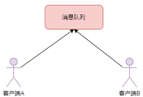

# MQ

## 目录

[TOC]

## 参考资料

- [秒懂消息队列MQ，万字总结带你全面了解消息队列MQ](https://developer.aliyun.com/article/953777)

# 一、消息队列概述

消息队列（Message Queue，简称MQ）指保存消息的一个容器，其实本质就是一个保存数据的队列。消息中间件是指利用高效可靠的消息传递机制进行与平台无关的数据交流，并基于数据通信来进行分布式系统的构建。

消息中间件是分布式系统中重要的组件，主要解决应用解耦，异步消息，流量削峰等问题，实现高性能，高可用，可伸缩和最终一致性的系统架构。目前使用较多的消息队列有ActiveMQ，RabbitMQ，ZeroMQ，Kafka，MetaMQ，RocketMQ等。


# 二、消息队列应用场景

## 2.1 异步处理

异步处理，就是将一些非核心的业务流程以异步并行的方式执行，从而减少请求响应时间，提高系统吞吐量。


以下单为例，用户下单后需要生成订单、赠送活动积分、赠送红包、发送下单成功通知等一系列业务处理。假设三个业务节点每个使用100毫秒钟，不考虑网络等其他开销，则串行方式的时间是400毫秒，并行的时间只需要200毫秒。这样就大大提高了系统的吞吐量。


## 2.2 应用解耦

应用解耦，顾名思义就是解除应用系统之间的耦合依赖。通过消息队列，使得每个应用系统不必受其他系统影响，可以更独立自主。

以电商系统为例，用户下单后，订单系统需要通知积分系统。一般的做法是：订单系统直接调用积分系统的接口。这就使得应用系统间的耦合特别紧密。如果积分系统无法访问，则积分处理失败，从而导致订单失败。


加入消息队列之后，用户下单后，订单系统完成下单业务后，将消息写入消息队列，返回用户订单下单成功。积分系统通过订阅下单消息的方式获取下单通知消息，从而进行积分操作。实现订单系统与库存系统的应用解耦。如果，在下单时积分系统系统异常，也不影响用户正常下单，因为下单后，订单系统写入消息队列就不再关心其他的后续操作。


## 2.3 流量削峰

流量削峰也是消息队列中的常用场景，一般在秒杀或团抢活动中使用广泛。

以秒杀活动为例，一般会因为流量过大，导致流量暴增，应用挂掉。为解决这个问题，一般需要在应用前端加入消息队列，秒杀业务处理系统根据消息队列中的请求信息，再做后续处理。


如上图所示，服务器接收到用户的请求后，首先写入消息队列，秒杀业务处理系统根据消息队列中的请求信息，做后续业务处理。假如消息队列长度超过最大数量，则直接抛弃用户请求或跳转到错误页面。


## 2.4 消息通讯

消息通讯是指应用间的数据通信。消息队列一般都内置了高效的通信机制，因此也可以用在纯的消息通讯。比如实现点对点消息队列，或者聊天室等点对点通讯。



以上实际是消息队列的两种消息模式，点对点或发布订阅模式。


# 三、消息队列选择

目前使用较多的消息队列有ActiveMQ，RabbitMQ，Kafka，RocketMQ等。面对这么多的中消息队列中间件，如何选择适合我们自身业务的消息中间件呢？

## 3.1 衡量标准

虽然这些消息队列在功能和特性方面各有优劣，但我们在选型时要有基本衡量标准：

1. 首先，是开源。开源意味着，如果有一天你使用的消息队列遇到了一个影响你系统业务的Bug，至少还有机会通过修改源代码来迅速修复或规避这个Bug，解决你的系统的问题，而不是等待开发者发布的下一个版本来解决。

2. 其次，是社区活跃度。这个产品必须是近年来比较流行并且有一定社区活跃度的产品。我们知道，开源产品越流行 Bug 越少，因为大部分遇到的 Bug，其他人早就遇到并且修复了。而且在使用过程中遇到的问题，也比较容易在网上搜索到类似的问题并快速找到解决方案。同时，流行开源产品一般与周边生态系统会有一个比较好的集成和兼容。

3. 最后，作为一款及格的消息队列，必须具备的几个特性包括：

   - 消息的可靠传递：确保不丢消息；

   - 支持集群：确保不会因为某个节点宕机导致服务不可用，当然也不能丢消息；

   - 性能：具备足够好的性能，能满足绝大多数场景的性能要求。


## 3.2 选型对比

接下来我们一起看一下有哪些符合上面这些条件，可供选择的开源消息队列产品。以下是关于各个消息队列中间件的选型对比：

| 特性       | Kafka                                                        | RocketMQ                                                     | RabbitMQ                                                     | ActiveMQ                                                     |
| ---------- | ------------------------------------------------------------ | ------------------------------------------------------------ | ------------------------------------------------------------ | ------------------------------------------------------------ |
| 单机吞吐量 | 10万级                                                       | 10万级                                                       | 万级                                                         | 10万级                                                       |
| 开发语言   | Scala                                                        | Java                                                         | Erlang                                                       | Java                                                         |
| 高可用     | 分布式                                                       | 分布式                                                       | 主从                                                         | 分布式                                                       |
| 消息延迟   | ms级                                                         | ms级                                                         | us级                                                         | ms级                                                         |
| 消息丢失   | 理论上不会丢失                                               | 理论上不会丢失                                               | 低                                                           | 低                                                           |
| 消费模式   | 拉取                                                         | 推拉                                                         | 推拉                                                         |                                                              |
| 持久化     |                                                              | 文件                                                         | 内存，文件                                                   | 内存，文件，数据库                                           |
| 支持协议   | 自定义协议                                                   | 自定义协议                                                   | AMQP，XMPP, SMTP,STOMP                                       | AMQP,MQTT,OpenWire,STOMP                                     |
| 社区活跃度 | 高                                                           | 中                                                           | 高                                                           | 高                                                           |
| 管理界面   |                                                              | web console                                                  | 好                                                           | 一般                                                         |
| 部署难度   | 中                                                           |                                                              | 低                                                           |                                                              |
| 部署方式   | 独立                                                         | 独立                                                         | 独立                                                         | 独立，嵌入                                                   |
| 成熟度     | 成熟                                                         | 比较成熟                                                     | 成熟                                                         | 成熟                                                         |
| 综合评价   | 优点：拥有强大的性能及吞吐量，兼容性很好。     缺点：由于支持消息堆积，导致延迟比较高。 | 优点：性能好，稳定可靠，有活跃的中文社区，特点响应快。     缺点：兼容性较差，但随着影响力的扩大，该问题会有改善。 | 优点：产品成熟，容易部署和使用，拥有灵活的路由配置。     缺点：性能和吞吐量较差，不易进行二次开发。 | 优点：产品成熟，支持协议多，支持多种语言的客户端。     缺点：社区不活跃，存在消息丢失的可能。 |

以上四种消息队列都有各自的优劣势，需要根据现有系统的情况，选择最适合的消息队列。

总结起来，电商、金融等对事务性要求很高的，可以考虑RocketMQ；技术挑战不是特别高，用 RabbitMQ 是不错的选择；如果是大数据领域的实时计算、日志采集等场景可以考虑 Kafka。

## 3.3 Rabbitmq

### 3.3.1 Rabbitmq延迟队列

Rabbitmq本身是没有延迟队列的，只能通过Rabbitmq本身队列的特性来实现，想要Rabbitmq实现延迟队列，需要使用Rabbitmq的死信交换机（Exchange）和消息的存活时间TTL（Time To Live）

#### 死信交换机

一个消息在满足如下条件下，会进死信交换机，记住这里是交换机而不是队列，一个交换机可以对应很多队列。

1. 一个消息被Consumer拒收了，并且reject方法的参数里requeue是false。也就是说不会被再次放在队列里，被其他消费者使用。
2. 上面的消息的TTL到了，消息过期了。
3. 队列的长度限制满了。排在前面的消息会被丢弃或者扔到死信路由上。

==死信交换机就是普通的交换机==，只是因为我们把过期的消息扔进去，所以叫死信交换机，并不是说死信交换机是某种特定的交换机

#### 消息TTL（消息存活时间）

消息的TTL就是消息的存活时间。RabbitMQ可以对队列和消息分别设置TTL。对队列设置就是队列没有消费者连着的保留时间，也可以对每一个单独的消息做单独的设置。超过了这个时间，我们认为这个消息就死了，称之为死信。如果队列设置了，消息也设置了，那么会取小的。所以一个消息如果被路由到不同的队列中，这个消息死亡的时间有可能不一样（不同的队列设置）。这里单讲单个消息的TTL，因为它才是实现延迟任务的关键。

```
byte[] messageBodyBytes = "Hello, world!".getBytes();
AMQP.BasicProperties properties = new AMQP.BasicProperties();
properties.setExpiration("60000");
channel.basicPublish("my-exchange", "queue-key", properties, messageBodyBytes);
```

可以通过设置消息的expiration字段或者x-message-ttl属性来设置时间，两者是一样的效果。只是expiration字段是字符串参数，所以要写个int类型的字符串：
当上面的消息扔到队列中后，过了60秒，如果没有被消费，它就死了。不会被消费者消费到。这个消息后面的，没有“死掉”的消息对顶上来，被消费者消费。死信在队列中并不会被删除和释放，它会被统计到队列的消息数中去

#### 处理流程图


### 创建交换机（Exchanges）和队列（Queues）

#### 创建死信交换机

.jpeg)

如图所示，就是创建一个普通的交换机，这里为了方便区分，把交换机的名字取为：delay

#### 创建自动过期消息队列

这个队列的主要作用是让消息定时过期的，比如我们需要2小时候关闭订单，我们就需要把消息放进这个队列里面，把消息过期时间设置为2小时

.jpeg)

创建一个一个名为delay_queue1的自动过期的队列，当然图片上面的参数并不会让消息自动过期，因为我们并没有设置x-message-ttl参数，如果整个队列的消息有消息都是相同的，可以设置，这里为了灵活，所以并没有设置，另外两个参数x-dead-letter-exchange代表消息过期后，消息要进入的交换机，这里配置的是delay，也就是死信交换机，x-dead-letter-routing-key是配置消息过期后，进入死信交换机的routing-key,跟发送消息的routing-key一个道理，根据这个key将消息放入不同的队列

#### 创建消息处理队列

这个队列才是真正处理消息的队列，所有进入这个队列的消息都会被处理

.jpeg)

消息队列的名字为delay_queue2

#### 消息队列绑定到交换机

进入交换机详情页面，将创建的2个队列（delay_queue1和delay_queue2）绑定到交换机上面

.jpeg)

自动过期消息队列的routing key 设置为delay

绑定delay_queue2

.jpeg)

delay_queue2 的key要设置为创建自动过期的队列的x-dead-letter-routing-key参数，这样当消息过期的时候就可以自动把消息放入delay_queue2这个队列中了

绑定后的管理页面如下图：

.jpeg)

当然这个绑定也可以使用代码来实现，只是为了直观表现，所以本文使用的管理平台来操作

#### 发送消息

```
String msg = "hello word";
MessageProperties messageProperties = new MessageProperties();
        messageProperties.setExpiration("6000");
        messageProperties.setCorrelationId(UUID.randomUUID().toString().getBytes());
        Message message = new Message(msg.getBytes(), messageProperties);
        rabbitTemplate.convertAndSend("delay", "delay",message);
```

主要的代码就是

```
messageProperties.setExpiration("6000");
```

设置了让消息6秒后过期

注意：因为要让消息自动过期，所以一定不能设置delay_queue1的监听，不能让这个队列里面的消息被接受到，否则消息一旦被消费，就不存在过期了

#### 接收消息

接收消息配置好delay_queue2的监听就好了

```
package wang.raye.rabbitmq.demo1;

import org.springframework.amqp.core.AcknowledgeMode;
import org.springframework.amqp.core.Binding;
import org.springframework.amqp.core.BindingBuilder;
import org.springframework.amqp.core.DirectExchange;
import org.springframework.amqp.core.Message;
import org.springframework.amqp.core.Queue;
import org.springframework.amqp.rabbit.connection.CachingConnectionFactory;
import org.springframework.amqp.rabbit.connection.ConnectionFactory;
import org.springframework.amqp.rabbit.core.ChannelAwareMessageListener;
import org.springframework.amqp.rabbit.listener.SimpleMessageListenerContainer;
import org.springframework.beans.factory.annotation.Autowired;
import org.springframework.context.annotation.Bean;
import org.springframework.context.annotation.Configuration;

@Configuration
public class DelayQueue {
    /** 消息交换机的名字*/
    public static final String EXCHANGE = "delay";
    /** 队列key1*/
    public static final String ROUTINGKEY1 = "delay";
    /** 队列key2*/
    public static final String ROUTINGKEY2 = "delay_key";

    /**
     * 配置链接信息
     * @return
     */
    @Bean
    public ConnectionFactory connectionFactory() {
        CachingConnectionFactory connectionFactory = new CachingConnectionFactory("120.76.237.8",5672);

        connectionFactory.setUsername("kberp");
        connectionFactory.setPassword("kberp");
        connectionFactory.setVirtualHost("/");
        connectionFactory.setPublisherConfirms(true); // 必须要设置
        return connectionFactory;
    }

    /**  
     * 配置消息交换机
     * 针对消费者配置  
        FanoutExchange: 将消息分发到所有的绑定队列，无routingkey的概念  
        HeadersExchange ：通过添加属性key-value匹配  
        DirectExchange:按照routingkey分发到指定队列  
        TopicExchange:多关键字匹配  
     */  
    @Bean  
    public DirectExchange defaultExchange() {  
        return new DirectExchange(EXCHANGE, true, false);
    } 

    /**
     * 配置消息队列2
     * 针对消费者配置  
     * @return
     */
    @Bean
    public Queue queue() {  
       return new Queue("delay_queue2", true); //队列持久  

    }
    /**
     * 将消息队列2与交换机绑定
     * 针对消费者配置  
     * @return
     */
    @Bean  
    @Autowired
    public Binding binding() {  
        return BindingBuilder.bind(queue()).to(defaultExchange()).with(DelayQueue.ROUTINGKEY2);  
    } 

    /**
     * 接受消息的监听，这个监听会接受消息队列1的消息
     * 针对消费者配置  
     * @return
     */
    @Bean  
    @Autowired
    public SimpleMessageListenerContainer messageContainer2(ConnectionFactory connectionFactory) {  
        SimpleMessageListenerContainer container = new SimpleMessageListenerContainer(connectionFactory());  
        container.setQueues(queue());  
        container.setExposeListenerChannel(true);  
        container.setMaxConcurrentConsumers(1);  
        container.setConcurrentConsumers(1);  
        container.setAcknowledgeMode(AcknowledgeMode.MANUAL); //设置确认模式手工确认  
        container.setMessageListener(new ChannelAwareMessageListener() {

            public void onMessage(Message message, com.rabbitmq.client.Channel channel) throws Exception {
                byte[] body = message.getBody();  
                System.out.println("delay_queue2 收到消息 : " + new String(body));  
                channel.basicAck(message.getMessageProperties().getDeliveryTag(), false); //确认消息成功消费  

            }  

        });  
        return container;  
    }  

}
```

在消息监听中处理需要定时处理的任务就好了，因为Rabbitmq能发送消息，所以可以把任务特征码发过来，比如关闭订单就把订单id发过来，这样就避免了需要查询一下那些订单需要关闭而加重MySQL负担了，毕竟一旦订单量大的话，查询本身也是一件很费IO的事情

#### 总结

基于Rabbitmq实现定时任务，就是将消息设置一个过期时间，放入一个没有读取的队列中，让消息过期后自动转入另外一个队列中，监控这个队列消息的监听处来处理定时任务具体的操作

# 四、Java代码调用MQ

## 4.1 RabbitMQ

### 4.1.2 创建生产者

首先把核心生产者的代码编写好，生产者由基本的消息发送和监听组成：

```
@Component
public class RabbitOrderSender {
    private static Logger logger = LoggerFactory.getLogger(RabbitOrderSender.class);

    @Autowired
    private RabbitTemplate rabbitTemplate;

    @Autowired
    private MessageLogMapper messageLogMapper;

    /**
     * Broker应答后，会调用该方法区获取应答结果
     */
    final RabbitTemplate.ConfirmCallback confirmCallback = new RabbitTemplate.ConfirmCallback() {
        @Override
        public void confirm(CorrelationData correlationData, boolean ack, String cause) {
            logger.info("correlationData："+correlationData);
            String messageId = correlationData.getId();
            logger.info("消息确认返回值："+ack);
            if (ack){
                //如果返回成功，则进行更新
                messageLogMapper.changeMessageLogStatus(messageId, Constans.ORDER_SEND_SUCCESS,new Date());
            }else {
                //失败进行操作：根据具体失败原因选择重试或补偿等手段
                logger.error("异常处理,返回结果："+cause);
            }
        }
    };

    /**
     * 发送消息方法调用: 构建自定义对象消息
     * @param order
     * @throws Exception
     */
    public synchronized void  sendOrder(OrderInfo order) throws Exception {
        // 通过实现 ConfirmCallback 接口，消息发送到 Broker 后触发回调，确认消息是否到达 Broker 服务器，也就是只确认是否正确到达 Exchange 中
        rabbitTemplate.setConfirmCallback(confirmCallback);
        //消息唯一ID
        CorrelationData correlationData = new CorrelationData(order.getMessageId());
        rabbitTemplate.convertAndSend("order.exchange", "order.message", order, correlationData);
    }
}
```

上面的消息发送示例代码和之前的没什么区别，只是增加了confirmCallback应答结果回调。通过实现ConfirmCallback接口，消息发送到Broker后触发回调，确认消息是否到达Broker服务器。因此，ConfirmCallback只能确认消息是否正确到达交换机中。


### 4.1.2 消息重发定时任务

实现消息重发的定时任务，示例代码如下：

```
@Component
public class RetryMessageTasker {
    private static Logger logger = LoggerFactory.getLogger(RetryMessageTasker.class);
    @Autowired
    private RabbitOrderSender rabbitOrderSender;

    @Autowired
    private MessageLogMapper messageLogMapper;

    /**
     * 定时任务
     */
    @Scheduled(initialDelay = 5000, fixedDelay = 10000)
    public void reSend(){
        logger.info("-----------定时任务开始-----------");
        //抽取消息状态为0且已经超时的消息集合
        List<MessageLog> list = messageLogMapper.query4StatusAndTimeoutMessage();
        list.forEach(messageLog -> {
            //投递三次以上的消息
            if(messageLog.getTryCount() >= 3){
                //更新失败的消息
                messageLogMapper.changeMessageLogStatus(messageLog.getMessageId(), Constans.ORDER_SEND_FAILURE, new Date());
            } else {
                // 重试投递消息，将重试次数递增
                messageLogMapper.update4ReSend(messageLog.getMessageId(),  new Date());
                OrderInfo reSendOrder = JsonUtil.jsonToObject(messageLog.getMessage(), OrderInfo.class);
                try {
                    rabbitOrderSender.sendOrder(reSendOrder);
                } catch (Exception e) {
                    e.printStackTrace();
                    logger.error("-----------异常处理-----------");
                }
            }
        });
    }
}
```

在上面的定时任务程序中，每10秒钟提取状态为0且已经超时的消息，重发这些消息，如果发送次数已经在3次以上，则认定为发送失败。


### 4.1.3 创建消费者

创建消费者程序负责接收处理消息，处理成功后发送消息确认。示例代码如下：

```
@Component
public class OrderReceiver {
    /**
     * @RabbitListener 消息监听，可配置交换机、队列、路由key
     * 该注解会创建队列和交互机 并建立绑定关系
     * @RabbitHandler 标识此方法如果有消息过来，消费者要调用这个方法
     * @Payload 消息体
     * @Headers 消息头
     * @param order
     */
    @RabbitListener(bindings = @QueueBinding(
            value = @Queue(value = "order.queue",declare = "true"),
            exchange = @Exchange(name = "order.exchange",declare = "true",type = "topic"),
            key = "order.message"
    ))
    @RabbitHandler
    public void onOrderMessage(@Payload Order order, @Headers Map<String,Object> headers,
                               Channel channel) throws Exception{
        //消费者操作
        try {
            System.out.println("------收到消息，开始消费------");
            System.out.println("订单ID："+order.getId());

            Long deliveryTag = (Long)headers.get(AmqpHeaders.DELIVERY_TAG);
            //现在是手动确认消息 ACK
            channel.basicAck(deliveryTag,false);
        } finally {
           channel.close();
        }
    }
}
```

消息处理程序和一般的接收者类似，都是通过@RabbitListener注解监听消息队列。不同的是，发送程序处理成功后，通过channel.basicAck(deliveryTag,false)发送消息确认ACK。


### 4. 运行测试

创建单元测试程序。创建一个生成订单的测试方法，测试代码如下：

```
@RunWith(SpringRunner.class)
@SpringBootTest
public class MqApplicationTests {
    @Autowired
    private OrderService orderService;

    /**
     * 测试订单创建
     */
    @Test
    public void createOrder(){
        OrderInfo order = new OrderInfo();
        order.setId("201901236");
        order.setName("测试订单6");
        order.setMessageId(System.currentTimeMillis() + "$" + UUID.randomUUID().toString());
        try {
            orderService.createOrder(order);
        } catch (Exception e) {
            e.printStackTrace();
        }
    }

}
```

启动消费者程序，启动成功之后，运行createOrder创建订单测试方法。结果表明发送成功并且入库正确，业务表和消息记录表均有数据且status状态=1，表示成功。

如果消费者程序处理失败或者超时，未返回ack确认；则生产者的定时程序会重新投递消息。直到三次投递均失败。


# 五、MQ面试问题

## 5.1 实现消息的100%可靠性发送

### 5.1.1 什么是实现消息的100%可靠性发送

在使用消息队列时，因为生产者和消费者不直接交互，所以面临下面几个问题：

1）要把消息添加到队列中，怎么保证消息成功添加？

2）如何保证消息发送出去时一定会被消费者正常消费？

3）消费者正常消费了，生产者或者队列如何知道消费者已经成功消费了消息？

要解决前面这些问题，就要保证消息的可靠性发送，实现消息的100%可靠性发送。

实现消息的100%可靠性发送在消息队列系统中是一个重要的概念。消息队列是一种常用的通信模式，用于在分布式系统中异步传输消息。实现消息的100%可靠性发送意味着确保消息在发送到消息队列后，能够被可靠地传递到目标消费者，不会丢失、不会重复、不会失序，并且能够被消费者正确处理。

### 5.1.2 RabbitMQ技术实现方案

RabbitMQ为我们提供了解决方案，下面以常见的创建订单业务为例进行介绍，假设订单创建成功后需要发送短信通知用户。实现消息的100%可靠性发送需要以下条件：

1）完成订单业务处理后，生产者发送一条消息到消息队列，同时记录这条操作日志（发送中）。

2）消费者收到消息后处理进行；

3）消费者处理成功后给消息队列发送ack应答；

4）消息队列收到ack应答后，给生成者的Confirm Listener发送确认；

5）生产者对消息日志表进行操作，修改之前的日志状态（发送成功）；

6）在消费端返回应答的过程中，可能发生网络异常，导致生产者未收到应答消息，因此需要一个定时任务去提取其状态为“发送中”并已经超时的消息集合；

7）使用定时任务判断为消息事先设置的最大重发次数，大于最大重发次数就判断消息发送失败，更新日志记录状态为发送失败。

具体流程如下图所示


## 5.2 怎么保证消息没有重复消费/如何保证幂等性

幂等性：就是用户对于同一操作发起的一次请求或者多次请求的结果是一致的，不会因为多次点击而产生了副作用

- **问题出现原因：**我们先来了解一下产生消息重复消费的原因，对于MQ的使用，有三个角色：生产者、[MQ](http://mp.weixin.qq.com/s?__biz=MzAwNjQwNzU2NQ==&mid=2650357391&idx=1&sn=98a68099613a0f3d22b1f75c90f27f27&chksm=83004a6db477c37b1cd81500be3e7a474475780d70c760804119dc841362d88bb375c47d4d70&scene=21#wechat_redirect)、消费者，那么消息的重复这三者会出现：

  - 生产者：生产者可能会推送重复的数据到MQ中，有可能controller接口重复提交了两次，也可能是重试机制导致的

  - MQ：假设网络出现了波动，消费者消费完一条消息后，发送ack时，MQ还没来得及接受，突然挂了，导致MQ以为消费者还未消费该条消息，MQ回复后会再次推送了这条消息，导致出现重复消费。

  - 消费者：消费者接收到消息后，正准备发送ack到MQ，突然消费者挂了，还没得及发送ack，这时MQ以为消费者还没消费该消息，消费者重启后，MQ再次推送该条消息。

- **解决方案**：在正常情况下，生产者是客户，我们很难避免出现用户重复点击的情况，而MQ是允许存在多条一样的消息，但消费者是不允许出现消费两条一样的数据，所以幂等性一般是在消费端实现的：

  - 状态判断：消费者把消费消息记录到redis中，再次消费时先到redis判断是否存在该数据，存在则表示消费过，直接丢弃

  - 业务判断：消费完数据后，都是需要插入到数据库中，使用数据库的唯一约束防止重复消费。插入数据库前先查询是否存在该数据，存在则直接丢弃消息，这种方式是比较简单粗暴地解决问题


### 5.3 消息丢失的情况

消息丢失属于比较常见的问题。一般有生产端丢失、MQ服务丢失、消费端丢失等三种情况。针对各种情况应对方式也不一样。

1.生产端丢失的解决方案主要有

- 开启confirm模式，生产者收到MQ发回的confirm确认之后，再进行消息删除，否则消息重推。
- 生产者端消息保存的数据库，由后台定时程序异步推送，收到confirm确认则认为成功，否则消息重推，重推多次均未成功，则认为发送失败。

2.MQ服务丢失则主要是开启消息持久化，让消息及时保存到磁盘。

3.消费端消息丢失则关闭自动ack确认，消息消费成功后手动发送ack确认。消息消费失败，则重新消费。


### 5.4 消息的传输顺序性

**解决思路**：在生产端发布消息时，每次法发布消息都把上一条消息的ID记录到消息体中，消费者接收到消息时，做如下操作

- 先根据上一条Id去检查是否存在上一条消息还没被消费，如果不存在(消费后去掉id)，则正常进行，正常操作
- 如果存在，则根据id到数据库检查是否被消费，如果被消费，则正常操作
- 如果还没被消费，则休眠一定时间(比如30ms)，再重新检查，如被消费，则正常操作
- 如果还没被消费，则抛出异常

###  

### 5.5 怎么解决消息积压问题?

所谓的消息积压，就是生成者生成消息太快，而消费者处理消息太慢，从而导致消费端消息积压在MQ中无法处理的问题。遇到这种消息积压的情况，可以根据消息重要程度，分为两种情况处理：

- 如果消息可以被丢弃，那么直接丢弃就好了
- 一般情况下，消息是不可以被丢弃的，那么这样需要考虑策略了，我们可以把原来的消费端重新当做生产端，重新部署一MQ，在后面增加消费端，这样形成另一条生产-消息-消费的线路


## 5.6 讲下 Kafka、RabbitMQ、RocketMQ 之间的区别是什么？

- 性能
  消息中间件的性能主要衡量吞吐量，Kafka 的吞吐量比 RabbitMQ 要高出 1~2 个数量级，RabbitMQ 的单机 QPS 在万级别，Kafka 的单机 QPS 能够达到百万级别。RocketMQ 单机写入 TPS 单实例约 7 万条/秒，单机部署 3 个Broker，可以跑到最高 12 万条/秒，消息大小 10 个字节，Kafka 如果开启幂等、事务等功能，性能也会有所降低。
- 数据可靠性
  Kafka 与 RabbitMQ 都具备多副本机制，数据可靠性较高。RocketMQ 支持异步实时刷盘，同步刷盘，同步 Replication，异步 Replication。服务可用性 Kafka 采用集群部署，分区与多副本的设计，使得单节点宕机对服务无影响，且支持消息容量的线性提升。RabbitMQ 支持集群部署，集群节点数量有多种规格。RocketMQ 是分布式架构，可用性高。
- 功能
  Kafka 与 RabbitMQ 都是比较主流的两款消息中间件，具备消息传递的基本功能，但在一些特殊的功能方面存在差异，RocketMQ 在阿里集团内部有大量的应用在使用。

