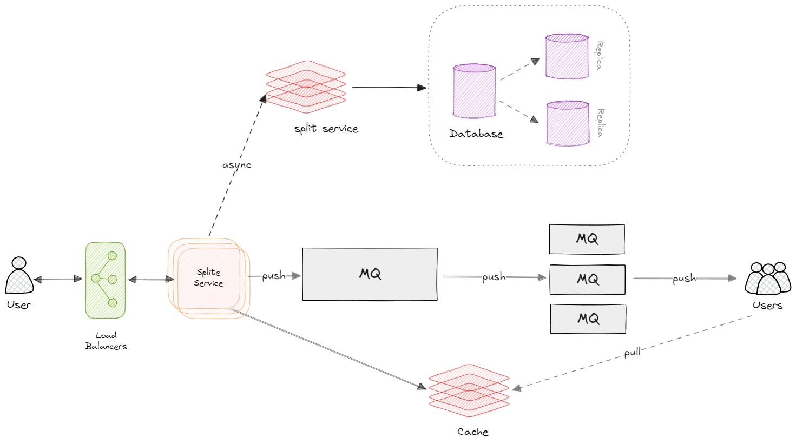
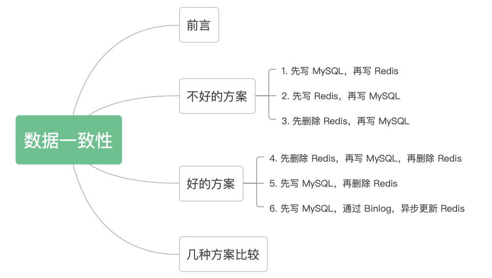

# 前言

> 本文用于25年秋招后端开发岗位的复习
> 核心问题是对本人有用的问题

**每个面经的结构：问题概览+核心问题解析**

[TOC]
# 一、个人面经
> 本章梳理2024.08开始的面试问答
> 本人自身的面试经验
> 按照时间顺序进行整理

## 1.1 快手-一面

1. 用例平台项目：如何衡量用例的生成效果
2. 用例平台项目：在实际使用过程中的效果
3. 用例平台项目：用例生成做了哪些优化
4. 缓存框架项目：做了什么事情
5. 慢SQL优化项目：怎么做的，效果怎么样
6. 慢SQL优化项目：举个例子
7. redis的map底层怎么实现的
8. redis的跳表是什么
9. 介绍一下布隆过滤器
10. 介绍一下Java的异常机制
11. try-catch-finally的执行原理，如果catch里面提前return会怎么样？如果finally里面return会怎么样

**算法题：**
...中等题...忘了...
可能是和优先级队列相关的

## 1.2 百度-移动生态数据部门-后端开发-一面

1. 用例平台项目：如何衡量用例的生成效果
2. 用例平台项目：在实际使用过程中的效果
3. 用例平台项目：用例生成做了哪些优化
4. 缓存框架项目：做了什么事情
5. 缓存框架项目：如何保证本地缓存和redis缓存的一致性
6. 缓存框架项目：在实际中使用的效果
7. 智能工作流项目：做了什么事情
8. 智能工作流项目：在实际线上的效果
9. **依赖冲突的根本原因是什么**

**算法题：**
给一个长整数范围[A,B],求A,B这些数字之间，‘1’在每个数字里出现的次数的总和

## 1.3 美团-核心到店部门-大模型后台开发-一面
1. 项目问答
2. JAVA异常
3. 介绍一个集合类-MAP

**算法题：**
K个升序链表的合并

## 1.4 快手-快手游戏-服务端开发-一面
1. 为什么要三次握手
2. https的过程
3. JAVA SPRING IOC和AOP
4. AOP代理是怎么实现的
5. 介绍一些有哪些设计模式
6. JAVA异常&try catch return
7. 单例模式-饿汉和懒汉的优缺点
8. 介绍一下序列化和反序列化
9. 如何阻止序列化
…

**算法题：**
删除字符串非法括号使得合法

## 1.5 拼多多-多多买菜-服务端开发-一面
1. 论文项目
2. 用例平台项目
3. 缓存框架项目

**算法题：**
拼单买汉堡（5人最多折5元）

## 1.6 字节跳动-本地生活-后端开发-一面
1. hash冲突怎么解决
2. **一致性哈希是什么**
3. mysql的幻读和脏读是怎么解决的
4. 一个复合索引的例子题目（A,B）：1. A 2. B 3. A,B，这三个句子哪些走索引，哪些不走
5. 项目内慢SQL怎么优化的，举个例子
6. MYSQL什么时候不走索引，怎么解决
7. TCP/UDP的区别
8. **设计一下抖音的粉丝系统逻辑**
9. **如何处理明星红人拥有大量粉丝的场景下发视频让所有粉丝收到**

**算法题：**
买股票，每天只能买或者卖，求最大利润

---
**一致性哈希**

一致性哈希（Consistent Hashing）是一种分布式系统中的哈希算法，主要用于解决分布式缓存、分布式存储等场景下的数据分布和负载均衡问题。它的核心思想是将数据和节点映射到一个环形空间中，从而实现数据的均匀分布和节点的动态扩展。

一致性哈希的基本原理如下：

- 哈希环：将整个哈希空间（通常是一个大整数范围）组织成一个环。例如，假设哈希函数的输出范围是0到2^32-1，那么可以将这些值排列成一个环。
- 节点映射：将每个节点（如缓存服务器）通过哈希函数映射到哈希环上的某个点。例如，节点A的哈希值是100，节点B的哈希值是300。
- 数据映射：将每个数据项（如缓存键）通过相同的哈希函数映射到哈希环上的某个点。例如，数据项X的哈希值是200。
- 数据存储：数据项存储在顺时针方向上第一个大于或等于其哈希值的节点上。例如，数据项X的哈希值是200，它将存储在节点B上，因为节点B的哈希值是300。
- 节点扩展和收缩：当添加或移除节点时，只需要重新分配受影响的部分数据，而不是所有数据。例如，添加一个新节点C，其哈希值是250，那么只需要将哈希值在200到250之间的数据项从节点B迁移到节点C。
- 在实际应用中，numberOfReplicas 的选择需要根据具体的场景和需求来确定：
  - 较小的 numberOfReplicas：如果物理节点数量较多，数据分布已经比较均匀，可以选择较小的 numberOfReplicas，以减少哈希计算的开销
  - 较大的 numberOfReplicas：如果物理节点数量较少，数据分布不均匀，可以选择较大的 numberOfReplicas，以提高数据分布的均匀性和负载均衡效果。
---
**设计一下抖音的粉丝系统逻辑**

> 核心目标
- 高效存储和查询：支持高并发的关注和取消关注操作，快速查询用户的关注列表和粉丝列表。
- 扩展性：系统能够随着用户数量的增长进行水平扩展。
- 一致性：确保数据的一致性，避免关注关系和粉丝关系的不一致。
- 高可用性：系统能够在部分组件故障时继续运行。

> 数据模型的设计
- 用户表（User Table）

| 字段名       | 数据类型 | 描述           |
|--------------|----------|----------------|
| user_id      | INT      | 用户ID（主键） |
| username     | VARCHAR  | 用户名         |
| profile_info | TEXT     | 用户信息（如头像、简介等） |

- 关注关系表（Follow Table）

| 字段名         | 数据类型 | 描述               |
|----------------|----------|--------------------|
| follower_id    | INT      | 关注者的用户ID     |
| followee_id    | INT      | 被关注者的用户ID   |
| follow_time    | DATETIME | 关注时间           |

- 粉丝关系表（Follower Table）

| 字段名         | 数据类型 | 描述               |
|----------------|----------|--------------------|
| followee_id    | INT      | 被关注者的用户ID   |
| follower_id    | INT      | 关注者的用户ID     |
| follow_time    | DATETIME | 关注时间           |


> 数据存储
 1. 关系型数据库
    - **用户表**、**关注关系表**和**粉丝关系表**存储在关系型数据库中（如MySQL、PostgreSQL）。
    - **优点**：支持复杂查询和事务。
    - **缺点**：在高并发和大规模数据下可能存在性能瓶颈。

2. NoSQL数据库
   - 使用NoSQL数据库（如Redis、Cassandra）存储关注关系和粉丝关系的缓存。
   - **优点**：高并发、低延迟、水平扩展性好。
   - **缺点**：不支持复杂查询和事务。

> 缓存设计
- 使用Redis缓存热门用户的关注关系和粉丝关系，减少数据库查询压力。
- **缓存策略**：LRU（Least Recently Used）、TTL（Time To Live）等。

> 数据分片和分区

- 对用户数据进行分片和分区，确保数据均匀分布，避免单点瓶颈。
- 可以根据用户ID进行哈希分片，或者使用一致性哈希算法。

> 高并发和高可用

- 使用负载均衡（如Nginx、HAProxy）分发请求，确保系统高可用。
- 数据库主从复制和读写分离，提升读写性能。
- 使用消息队列（如Kafka、RabbitMQ）处理异步任务，减少系统压力。

> 数据一致性

- 使用分布式事务（如两阶段提交、TCC）确保数据一致性。
- 使用最终一致性模型，允许短暂的不一致，最终达到一致性。

> 安全性

- 用户数据加密存储，保护用户隐私。
- 使用OAuth2.0进行用户认证和授权。
- 防止SQL注入、XSS攻击等常见安全漏洞。

> API设计

- 设计RESTful API，提供关注、取消关注、获取关注列表、获取粉丝列表等功能。
- 使用分页、限流等技术，确保API高效和安全。

> 日志和监控

- 实时监控系统性能和健康状态，及时发现和处理问题。
- 记录用户操作日志，便于问题排查和数据分析。

> 业务逻辑

1. 关注操作
   1. **检查用户是否已关注目标用户**。
   2. **更新关注关系表和粉丝关系表**。
   3. **更新缓存**。

2. 取消关注操作
   1. **检查用户是否已关注目标用户**。
   2. **删除关注关系表和粉丝关系表中的记录**。
   3. **更新缓存**。

3. 获取关注列表
   1. **从缓存中获取关注列表**。
   2. **如果缓存未命中，从数据库中查询并更新缓存**。

4. 获取粉丝列表
   1. **从缓存中获取粉丝列表**。
   2. **如果缓存未命中，从数据库中查询并更新缓存**。

---

**如何处理明星红人拥有大量粉丝的场景下发视频让所有粉丝收到**


## 1.7 拼多多-多多买菜-服务端开发-二面
1. 介绍用例平台的项目
2. 重点要介绍XMIND导入解析功能是怎么保持可靠的，加入一个用户多次请求上传，如何处理幂等性
3. 如何生成哈希，基于用户和文件名
4. 如何解决一个用户上传同一个文件的幂等性问题
5. 如何处理并发，一个用户上传文件后，哪个机器来处理
6. redis如何实现分布式锁
7. redis集群怎么保证同一条消息被一个redis机器消费
8. 如何生成一致性hash
9. 如何将一条消息生成hash后被某一个机器消费
10. **如果redis集群增长一个机器或者减少一个机器，怎么保证新的消息重新哈希后被消费**
**算法题**
英文版：把一颗二叉树，为每个节点新增一个NEXT属性，要求该属性指向该节点早层次遍历中的下一个节点
要求：空间复杂度必须为常量

---
**如果redis集群增长一个机器或者减少一个机器，怎么保证新的消息重新哈希后被消费**

为了防止用户在短时间内重复发起解析请求，我们可以基于用户ID和文件名生成一个唯一的哈希值，并将其存储在Redis集群中，值为对应的时间戳。每次用户请求时，先从Redis中获取该哈希值对应的时间戳，并判断是否在10秒以内，如果是则跳过后续操作，否则开始解析。为了确保同一个哈希值的键被同一个Redis节点处理，我们可以使用哈希值对Redis集群的总节点数取模，从而将键分配到特定的节点上。这种方法能够在一定程度上确保同一个键总是被同一个Redis节点处理，从而避免了数据不一致的问题。

当Redis集群增加或删除节点时，为了保证数据的可靠性和重新分配哈希值，我们可以使用一致性哈希（Consistent Hashing）算法。该算法能够在节点数量变化时，最小化重新分配的键数量，从而减少数据迁移的开销。具体来说，一致性哈希将所有的键和节点映射到一个虚拟的环上，当有新的节点加入或现有节点离开时，只需要重新分配环上相邻的一小部分键，而不是所有的键。通过一致性哈希，新的键分配和旧键的重新分配都能在较小的范围内进行调整，确保系统的高可用性和数据的一致性。此外，可以使用Redis的集群管理工具（如Redis Cluster）来自动处理节点的增加和删除，进一步简化运维工作。

## 1.8 得物-java开发-一面
1. 自我介绍
2. 介绍用例平台项目
3. 如何生成比较准的用例
4. Xmind解析功能和市场上现有的导入解析功能区别是什么
5. 介绍一下设计模式中的策略模式和代理模式

**算法题**
使用非递归形式实现中序遍历

# 二、阿里Java岗
## 2.1 凌珂-阿里淘天java二面
>作者：凌珂
链接：https://www.nowcoder.com/interview/center?anchor=companyExp&checked=company&jumpFrom=%E6%9C%AA%E7%99%BB%E5%BD%95%E9%A6%96%E9%A1%B5
来源：牛客网

1. 工作中与同事发生冲突时如何解决？
2. 如何使用HashMap？
3. 如何快速开发一个类似淘宝的应用？
4. 平时如何学习深度学习？
5. 对计算机科学的理解，如何喜欢上计算机的？
6. 为什么选择读研，为什么选择出国读研？
7. 如果你是CTO，如何管理团队？
8. 为什么当初选择Golang而不是Java？
9. **协程适合IO密集型还是计算密集型任务？**
10. **设计一个朋友圈功能，从简单到复杂，如何设计数据库表？**
11. **用户量增加后如何处理？**
12. URL从按下回车到页面渲染的整个流程？
13. Redis和MySQL数据不一致如何解决？
14. **详细介绍B+树。**
15. 介绍自己的优势。
16. 如果现在不会Java，如何保证入职后快速上手？

---

- **协程适合IO密集型还是计算密集型任务？**
- **设计一个朋友圈功能，从简单到复杂，如何设计数据库表？**
- **用户量增加后如何处理？**  
- **详细介绍B+树？**

**协程适合IO密集型还是计算密集型任务？**

协程更适合IO密集型任务。协程是一种轻量级的线程，它们在执行IO操作时可以挂起自己，让出CPU资源给其他协程，从而提高系统的并发性能。对于IO密集型任务，协程可以有效地减少线程切换的开销，提高资源利用率和响应速度。而对于计算密集型任务，协程的优势不明显，因为计算密集型任务主要消耗CPU资源，协程的调度机制并不能显著提升性能。

**设计一个朋友圈功能，从简单到复杂，如何设计数据库表？**
- **简单设计**

1. **用户表（User）**
   ```sql
   CREATE TABLE User (
       user_id INT PRIMARY KEY,
       username VARCHAR(50),
       password VARCHAR(50),
       created_at TIMESTAMP
   );
   ```

2. **朋友圈表（Post）**
   ```sql
   CREATE TABLE Post (
       post_id INT PRIMARY KEY,
       user_id INT,
       content TEXT,
       created_at TIMESTAMP,
       FOREIGN KEY (user_id) REFERENCES User(user_id)
   );
   ```

**复杂设计**

1. **用户表（User）**
   ```sql
   CREATE TABLE User (
       user_id INT PRIMARY KEY,
       username VARCHAR(50),
       password VARCHAR(50),
       profile_picture VARCHAR(255),
       bio TEXT,
       created_at TIMESTAMP
   );
   ```

2. **朋友圈表（Post）**
   ```sql
   CREATE TABLE Post (
       post_id INT PRIMARY KEY,
       user_id INT,
       content TEXT,
       image_url VARCHAR(255),
       created_at TIMESTAMP,
       FOREIGN KEY (user_id) REFERENCES User(user_id)
   );
   ```

3. **评论表（Comment）**
   ```sql
   CREATE TABLE Comment (
       comment_id INT PRIMARY KEY,
       post_id INT,
       user_id INT,
       content TEXT,
       created_at TIMESTAMP,
       FOREIGN KEY (post_id) REFERENCES Post(post_id),
       FOREIGN KEY (user_id) REFERENCES User(user_id)
   );
   ```

4. **点赞表（Like）**
   ```sql
   CREATE TABLE Like (
       like_id INT PRIMARY KEY,
       post_id INT,
       user_id INT,
       created_at TIMESTAMP,
       FOREIGN KEY (post_id) REFERENCES Post(post_id),
       FOREIGN KEY (user_id) REFERENCES User(user_id)
   );
   ```

5. **好友关系表（Friendship）**
   ```sql
   CREATE TABLE Friendship (
       user_id INT,
       friend_id INT,
       created_at TIMESTAMP,
       PRIMARY KEY (user_id, friend_id),
       FOREIGN KEY (user_id) REFERENCES User(user_id),
       FOREIGN KEY (friend_id) REFERENCES User(user_id)
   );
   ```

**用户量增加后如何处理**

1. **数据库分片和分区**：将数据库拆分成多个部分，分布在不同的服务器上，以减轻单个数据库的负载。
2. **缓存**：使用缓存系统（如Redis、Memcached）来存储频繁访问的数据，减少数据库的查询压力。
3. **负载均衡**：使用负载均衡器（如Nginx、HAProxy）将请求分发到多个服务器，均衡负载。
4. **垂直和水平扩展**：垂直扩展通过增加单个服务器的硬件资源（如CPU、内存），水平扩展通过增加更多的服务器来处理请求。
5. **异步处理**：将一些耗时的操作（如发送邮件、生成报告）放到后台异步处理，减少前端响应时间。
6. **优化查询**：通过优化SQL查询、添加索引等方式，提高数据库查询效率。

**详细介绍B+树**

B+树是一种自平衡的树数据结构，广泛应用于数据库和文件系统中。它是一种多路搜索树，具有以下特点：

1. **节点结构**：B+树的每个节点可以有多个子节点和多个键值。内部节点只存储键值和子节点指针，叶子节点存储实际数据和键值。
2. **平衡性**：B+树是自平衡的，所有叶子节点在同一层，树的高度保持在一个较低的水平，保证了查询、插入、删除操作的时间复杂度为O(log n)。
3. **顺序访问**：B+树的叶子节点通过指针相连，形成一个有序链表，方便顺序访问和范围查询。
4. **高效的磁盘读写**：B+树的节点大小通常与磁盘块大小相匹配，减少了磁盘I/O操作，提高了读写效率。

**B+树的操作**

1. **查找**：从根节点开始，逐层向下查找，直到找到目标键值或到达叶子节点。
2. **插入**：找到合适的叶子节点插入键值，如果节点满了，则进行分裂，分裂后的中间键值上升到父节点，可能引起父节点的分裂，递归进行。
3. **删除**：找到目标键值所在的叶子节点，删除键值，如果节点的键值数少于最小值，则进行合并或借用操作，可能引起父节点的调整，递归进行。

B+树通过其平衡性和高效的顺序访问特性，成为数据库索引和文件系统中常用的数据结构。

## 2.2 KingHaiYang-阿里橙狮体育JAVA实习一面
> 作者：KingHaiYang
链接：https://www.nowcoder.com/interview/center?anchor=companyExp&checked=company&jumpFrom=%E6%9C%AA%E7%99%BB%E5%BD%95%E9%A6%96%E9%A1%B5
来源：牛客网

1. 自我介绍
2. 线程的几种状态：（1）.新建（new）  （2）.就绪（runnable）（3）.运行（running）（4）.阻塞（block）1）等待阻塞 2）同步阻塞3）其他阻塞  （5）.死亡（dead）
3. 创建线程的方式3种：继承Thread类，实现Runable接口，实现Callable接口
4. ThreadLocal的理解：线程的变量副本，每个线程隔离
5. 线程池的核心参数有哪些：corePoolSize 线程池核心线程大小、maximumPoolSize 线程池最大线程数量、keepAliveTime 空闲线程存活时间、unit 空闲线程存活时间单位、workQueue 工作队列、threadFactory 线程工厂、handler 拒绝策略
6. MySQL索引的类型有哪些：主键、普通、全文、空间、唯一、前缀、组合
7. MySQL索引的存储结构有哪些：b树，b+树，二叉查找树，平衡二叉树
8. 覆盖索引和回表的理解
9. SQL执行计划主要看哪些信息
10. SQL优化：主键顺序插入
11. 为什么主键顺序插入会提高效率
12. **select count(*) 和 select count(id)的区别**
13. where后有两个条件，两个条件都分别创建了索引，优先使用哪个索引进行查询：哪个索引区分度大，筛选更快就使用哪个
14. Redis了解哪些
15. redis的穿透、击穿
16. **redis是单线程的，为什么还快呢**：（1）.redis是基于内存的，内存的读写速度非常快；（2）.redis是单线程的，省去了很多上下文切换线程的时间；（3）.redis使用多路复用技术，可以处理并发的连接。非阻塞IO 内部实现采用epoll，采用了epoll+自己实现的简单的事件框架。epoll中的读、写、关闭、连接都转化成了事件，然后利用epoll的多路复用特性，绝不在io上浪费一点时间。
17. 项目中你觉得做的最好的点
18. **如何保证redis和MySQL的数据一致性**
19. 使用redis的需要注意哪些：控制key的长度、避免存储bigkey、value的大小也要关注、string的大小控制在10kb以下，list、hash、set、zset也要控制、合理的选择数据类型、把redis尽可能的当成缓存使用、避免集中过期key等
20. 空间换时间，项目中的体现
21. 实现中两个项目上个项目和后边的项目在做的过程中有什么不一样的体会、
22. 消息队列的理解
23. 设计模式用过哪些
24. 反问：问的答得如何（前半部分基础达标了，后边深入原理的地方需要加强）

---
**select count(*) 和 select count(id)的区别**
- SELECT COUNT(*):
  - 计算表中所有行的数量，包括所有列的值。
  - 不会忽略任何行，即使某些行的所有列都是 NULL，它们也会被计入总数。
  - 在大多数数据库中，通常是最优化的，因为它只需计算行数。

- SELECT COUNT(id): 
  - 计算 id 列中非 NULL 的行数。
  - 只会计数 id 列中非 NULL 的行，NULL 值的行不会被计入总数。
  - 可能会稍慢，因为它需要检查 id 列的值。

---
**redis是单线程的，为什么还快呢**

Redis 是单线程的，但它仍然非常快，主要原因包括：
- 内存存储: Redis 将数据存储在内存中，内存的读写速度远快于磁盘。
- 高效的数据结构: Redis 使用高效的数据结构（如哈希、列表、集合等），这些数据结构经过优化，能够快速执行常见操作。
- 事件驱动模型: Redis 使用事件驱动的 I/O 模型，能够高效地处理多个客户端的请求。
- 避免上下文切换: 单线程避免了多线程中的上下文切换开销，减少了锁竞争和同步的复杂性。
- 简单的命令: Redis 的命令设计简单，执行速度快，且大多数操作都是 O(1) 的复杂度。

---

**如何保证redis和MySQL的数据一致性**


---
**全文索引**
1. 全文索引的基本概念
文本数据: 全文索引通常用于存储和检索大量的文本数据，例如文章、评论、博客、产品描述等。
分词: 在创建全文索引时，文本数据会被分解成一个个单独的词（或称为“词项”），并为每个词项建立索引。这一过程称为分词（Tokenization）。
倒排索引: 全文索引通常使用倒排索引（Inverted Index）结构，记录每个词项出现在哪些文档中，从而加速搜索。
2. 全文索引的特点
支持复杂查询: 全文索引支持多种查询方式，包括：
模糊查询: 查找与给定词项相似的词。
短语查询: 查找包含特定短语的文档。
布尔查询: 使用 AND、OR、NOT 等逻辑运算符组合多个查询条件。
自然语言处理: 一些数据库系统的全文索引支持自然语言处理功能，如词干提取（Stemming）、同义词处理等。
性能优化: 全文索引可以显著提高文本搜索的性能，尤其是在处理大规模文本数据时。
3. 全文索引的实现
不同的数据库系统对全文索引的实现方式有所不同。以下是一些常见数据库系统的全文索引实现：

- MySQL:
  - MySQL 提供了 FULLTEXT 索引类型，可以在 MyISAM 和 InnoDB 存储引擎中使用。
  - 使用 MATCH ... AGAINST 语法进行全文搜索。
  - 支持自然语言模式和布尔模式的搜索。
- PostgreSQL:
  - PostgreSQL 提供了强大的全文搜索功能，使用 tsvector 和 tsquery 数据类型。
  - 支持多种文本搜索配置，可以处理不同语言的文本。
- Elasticsearch:
  - Elasticsearch 是一个基于 Lucene 的搜索引擎，专门用于全文搜索。
  - 提供了丰富的查询 DSL（Domain Specific Language），支持复杂的搜索需求。

4. 使用全文索引的注意事项
索引大小: 全文索引通常会占用较大的存储空间，尤其是在处理大量文本数据时。
更新性能: 在频繁更新的场景中，维护全文索引的性能可能会受到影响，因为每次更新都需要重新构建索引。
查询复杂性: 尽管全文索引支持复杂查询，但在设计查询时需要考虑性能和可读性。

## 2.3 fluke#0703-阿里JAVA一面
> 作者：fluke#0703
> 链接：https://www.nowcoder.com/interview/center?anchor=companyExp&checked=company&jumpFrom=%E6%9C%AA%E7%99%BB%E5%BD%95%E9%A6%96%E9%A1%B5
> 来源：牛客网


1. 整数和浮点数的存储，有何差别？
2. 数据量过大的情况下，怎么处理？分库分表的设计规范是什么？分区分表后一个数据怎么知道它要存储在哪个表？
3. 分布式锁的使用场景？为什么要使用？如果没有多个服务区是不需要使用到分布式锁来实现锁吧？可以使用普通的锁。
4. OSI七层模型。HTTP在哪层，TCP在哪层，UDP和TCP的差别。
5. MyBatis和MySQL的区别是什么？是同一个东西吗？
6. **MyBatis的作用是什么？为什么要使用它？**
7. **介绍volatile关键字，为什么要使用它？它的作用？**
8. 为什么要用Redis？内存资源很宝贵，为什么不能直接访问数据库表？
9. 讲解一下什么是线程和进程。线程、进程和协程的区别。
10. 讲一下你对锁的理解。
11. 介绍MySQL的索引，有哪些索引？
12. 什么是事务？
13. **MySQL的隔离级别。是如何实现四个隔离级别的？**
14. **什么是序列化和反序列化？为什么要序列化？**
15. B+树和B树的区别。为什么使用B+树作为索引？
16. **并发事务下会发生什么问题？**（只答了数据覆盖，忘记数据错误）
17. 前端如何和后端连接通信？怎么知道请求是访问后端这个程序的。后端通过什么连接到数据库？

---

**MyBatis的作用是什么？为什么要使用它？**

**作用**:
MyBatis 是一个持久层框架，主要用于简化 Java 应用程序与数据库之间的交互。它通过 XML 或注解的方式将 SQL 语句与 Java 对象进行映射，提供了对数据库操作的封装。

**为什么要使用它**:
- **简化数据库操作**: MyBatis 使得开发者可以使用简单的 SQL 语句进行数据库操作，而不需要编写复杂的 JDBC 代码。
- **灵活性**: 开发者可以直接编写 SQL 语句，灵活性高，适合复杂查询。
- **支持动态 SQL**: MyBatis 提供了动态 SQL 的支持，可以根据条件生成不同的 SQL 语句。
- **易于集成**: MyBatis 可以与 Spring 等框架无缝集成，方便管理事务和依赖注入。
- **良好的性能**: MyBatis 通过使用缓存机制（如一级缓存和二级缓存）来提高性能。

---

**介绍volatile关键字，为什么要使用它？它的作用？**

**介绍**:
`volatile` 是 Java 中的一个关键字，用于修饰变量。它的作用是确保变量在多线程环境中的可见性。

**为什么要使用它**:
- **可见性**: 当一个线程修改了被 `volatile` 修饰的变量，其他线程能够立即看到这个修改，而不需要通过其他方式（如锁）来同步。
- **防止指令重排序**: `volatile` 关键字可以防止 JVM 对代码进行指令重排序，确保在读取 `volatile` 变量之前，所有对该变量的写入操作都已经完成。

**作用**:
- 确保多线程环境下的变量可见性。
- 防止指令重排序，保证代码执行的顺序性。

---

**MySQL的隔离级别。是如何实现四个隔离级别的？**

MySQL 支持四种事务隔离级别，分别是：

1. **读未提交（Read Uncommitted）**:
   - 允许一个事务读取另一个事务未提交的数据。
   - 实现方式: 不使用任何锁，可能导致脏读。

2. **读已提交（Read Committed）**:
   - 只允许一个事务读取已提交的数据。
   - 实现方式: 使用共享锁（S锁）来防止脏读，但允许不可重复读。

3. **可重复读（Repeatable Read）**:
   - 确保在同一事务中多次读取同一数据的结果是相同的。
   - 实现方式: 使用行级锁和多版本并发控制（MVCC），防止脏读和不可重复读，但可能会导致幻读。

4. **串行化（Serializable）**:
   - 最严格的隔离级别，强制事务串行执行。
   - 实现方式: 在读取数据时加排他锁（X锁），防止其他事务对数据的访问。

---
**什么是序列化和反序列化？为什么要序列化？**

**序列化**:
序列化是将对象的状态转换为字节流的过程，以便于存储或通过网络传输。

**反序列化**:
反序列化是将字节流转换回对象的过程。

**为什么要序列化**:
- **持久化**: 将对象的状态保存到文件或数据库中，以便在需要时恢复。
- **网络传输**: 在分布式系统中，通过网络传输对象的状态。
- **缓存**: 将对象序列化后存储在缓存中，以提高性能。

**序列化的原理**:
序列化的基本原理是将对象的属性和状态转换为一种可以存储或传输的格式。这个过程通常涉及以下几个步骤：

- 对象的状态: 序列化过程中，只有对象的状态（即属性值）会被转换为字节流，而对象的方法不会被序列化。
- 类型信息: 在序列化过程中，通常会包含对象的类型信息，以便在反序列化时能够正确地重建对象。
- 递归序列化: 如果对象的属性是其他对象，序列化过程会递归地序列化这些对象，直到所有相关对象都被转换为字节流。
---

**并发事务下会发生什么问题？**

在并发事务中，可能会发生以下问题：

1. **脏读（Dirty Read）**:
   - 一个事务读取了另一个事务未提交的数据，导致读取到不一致的数据。

2. **不可重复读（Non-repeatable Read）**:
   - 一个事务在读取数据后，另一个事务修改了该数据，导致前一个事务再次读取时得到不同的结果。

3. **幻读（Phantom Read）**:
   - 一个事务在读取数据时，另一个事务插入了新数据，导致前一个事务在再次查询时看到不同的结果。

4. **死锁（Deadlock）**:
   - 两个或多个事务相互等待对方释放锁，导致所有事务都无法继续执行。

这些问题通常通过设置适当的事务隔离级别、使用锁机制和其他并发控制技术来解决。


## 2.4 bolt*0209-阿里巴巴Java岗位一面面经
> 作者：bolt*0209
> 链接：https://www.nowcoder.com/interview/center?anchor=companyExp&checked=company&jumpFrom=%E6%9C%AA%E7%99%BB%E5%BD%95%E9%A6%96%E9%A1%B5
> 来源：牛客网

1. Java集合类ArrayList初始化时数组的默认长度是多少？
2. ArrayList扩容时扩容多少倍？扩容后是用原来的数组还是新的数组？
3. ArrayList是一个线程安全的集合类吗？
4. 判断一个集合类是否为线程安全的机制是什么？
5. 说一下Fail-Fast机制，结合源码说一下（如果可以的话）。
6. ArrayList和LinkedList的使用场景。
7. 说一下HashMap的底层数据结构。
8. 说一下HashMap的存储逻辑（put()函数）。
9. HashMap存储元素时key完全一样该怎么处理？
10. HashMap的默认长度是多少？扩容是扩成几倍？
11. 若两个key的hashcode值相同但equals不同，也就是说它们会插入到同一个桶里，新添加的节点是插入到已有元素的前面还是后面？
12. 为什么JDK 1.7是头插法，JDK 1.8是尾插法？
13. JDK 1.8的HashMap是否线程安全？
14. 既然HashMap不是线程安全的类，有啥办法解决这个问题？
15. ConcurrentHashMap和HashMap的区别？为什么ConcurrentHashMap会线程安全？
16. ConcurrentHashMap虽然是线程安全的，但它也存在什么问题？
17. 了解TreeMap吗？TreeMap最大的特点是什么？为什么已经有了HashMap了还要有TreeMap类？
18. 说一下红黑树的特点。

---
Java集合类ArrayList初始化时数组的默认长度是多少？
ArrayList扩容时扩容多少倍，为什么？扩容后是用原来的数组还是新的数组？
判断一个集合类是否为线程安全的机制是什么？
说一下Fail-Fast机制，结合源码说一下（如果可以的话）
说一下HashMap的存储逻辑（put()函数）。
HashMap的默认长度是多少？扩容是扩成几倍？为什么
为什么JDK 1.7是头插法，JDK 1.8是尾插法？
ConcurrentHashMap和HashMap的区别？为什么ConcurrentHashMap会线程安全？
ConcurrentHashMap虽然是线程安全的，但它也存在什么问题？
TreeMap最大的特点是什么？为什么已经有了HashMap了还要有TreeMap类？

---

**Java集合类ArrayList初始化时数组的默认长度是多少？**  

`ArrayList` 在初始化时的默认容量是 **10**。这意味着当你创建一个没有指定初始容量的 `ArrayList` 时，它会创建一个长度为 10 的数组来存储元素。  

---

**ArrayList扩容时扩容多少倍，为什么？扩容后是用原来的数组还是新的数组？**  
- **扩容倍数**: 当 `ArrayList` 需要扩容时，它会将原数组的大小增加 **1.5 倍**。具体来说，新的容量是 `oldCapacity + (oldCapacity >> 1)`，即原容量加上原容量的一半。  
  - 减少频繁扩容: 如果每次扩容都只增加固定的数量，随着元素数量的增加，扩容的次数会增多，导致性能下降。1.5 倍的扩容可以减少扩容的频率，从而提高性能。
  - 内存利用率: 1.5 倍的扩容策略可以在一定程度上避免内存浪费。过大的扩容可能会导致内存的浪费，而过小的扩容则可能导致频繁的扩容操作。
  - 动态调整: 1.5 倍的扩容使得 ArrayList 能够根据实际使用情况动态调整容量，适应不同的使用场景。
- **原因**: 这种扩容策略旨在平衡内存使用和性能，避免频繁的扩容操作。  
- **数组的使用**: 扩容后，`ArrayList` 会创建一个新的数组，并将原数组中的元素复制到新数组中。原数组会被垃圾回收。  
---

**判断一个集合类是否为线程安全的机制是什么？**  
判断一个集合类是否为线程安全的机制主要是看它是否提供了同步机制。线程安全的集合类通常会使用以下几种方式来实现：  
- **内部同步**: 例如，`Vector` 和 `Hashtable` 是线程安全的，因为它们的方法是同步的（使用 `synchronized` 关键字）。  
- **外部同步**: `Collections.synchronizedList()` 等方法可以将非线程安全的集合包装成线程安全的集合。  
- **无状态设计**: 一些集合类（如 `ConcurrentHashMap`）通过无锁设计或分段锁等机制来实现线程安全。  
- 
---

**说一下Fail-Fast机制，结合源码说一下（如果可以的话）**  
**Fail-Fast机制**是指在多线程环境中，如果一个线程在遍历集合时，另一个线程对该集合进行了结构上的修改（如添加或删除元素），那么遍历线程会立即抛出 `ConcurrentModificationException`。  
**源码示例**: 在 `ArrayList` 的 `iterator()` 方法中，`modCount` 变量用于记录集合的修改次数。每次修改集合时，`modCount` 会增加。迭代器在遍历时会检查 `modCount` 是否与迭代器创建时的 `expectedModCount` 相等。  
```java
public class ArrayList<E> extends AbstractList<E> implements List<E>, RandomAccess, Cloneable, Serializable {
    private transient int modCount = 0; // 记录修改次数

    public Iterator<E> iterator() {
        return new Itr();
    }

    private class Itr implements Iterator<E> {
        private int expectedModCount = modCount; // 记录创建时的modCount

        public boolean hasNext() {
            checkForComodification(); // 检查是否有结构修改
            // ...
        }

        final void checkForComodification() {
            if (modCount != expectedModCount)
                throw new ConcurrentModificationException();
        }
    }
}
```  

---

**Hashtable和ConcurrentMap的区别**

- 性能:Hashtable 在高并发情况下性能较差，因为它对每个操作都加锁，导致线程之间的竞争。ConcurrentMap 通过更细粒度的锁控制（如分段锁）来提高并发性能，允许多个线程同时访问不同的段。
- null 值:Hashtable 允许存储 null 键和 null 值。ConcurrentMap 不允许使用 null 作为键或值，这样可以避免在多线程环境中出现 NullPointerException。

---

**说一下HashMap的存储逻辑（put()函数）。**  
`HashMap` 的 `put()` 方法的存储逻辑如下：  
1. **计算哈希值**: 根据键的 `hashCode()` 计算哈希值，并通过哈希函数将其映射到数组的索引位置。  
2. **检查桶**: 如果该索引位置为空，则直接将键值对放入该位置。如果该位置已经有元素（可能是链表或红黑树），则需要进行冲突处理。  
3. **冲突处理**:  
   - 如果是链表，遍历链表检查是否有相同的键。如果有，则更新值；如果没有，则将新的键值对添加到链表的末尾。  
   - 如果链表的长度超过阈值（默认为 8），则将链表转换为红黑树以提高性能。  
4. **扩容**: 如果当前元素数量超过负载因子（默认为 0.75）与当前容量的乘积，则进行扩容。  
---

**HashMap的默认长度是多少？扩容是扩成几倍？为什么？**  
- **默认长度**: `HashMap` 的默认初始容量是 **16**。  
- **扩容倍数**: 扩容时，容量会翻倍（即扩展为原来的 2 倍）。  
- **原因**: 这种设计是为了保持哈希表的性能，减少冲突的可能性。扩容后，哈希表的负载因子会降低，从而提高查找效率。  
---

**为什么JDK 1.7是头插法，JDK 1.8是尾插法？**  
- JDK 1.7 的实现（头插法）
  - 在 JDK 1.7 中，当发生哈希冲突时，新插入的元素会被添加到链表的头部。这种方式称为头插法。
  - 头插法的优点是插入操作简单且速度快，因为只需将新节点的指针指向当前的头节点，然后更新头节点的指针。
  - 但是，头插法的缺点是会导致链表的顺序与插入顺序相反，这可能会影响遍历的顺序。
- JDK 1.8 的实现（尾插法）
  - 在 JDK 1.8 中，HashMap 的实现改为使用尾插法，即新插入的元素会被添加到链表的尾部。
  - 尾插法的优点是保持了插入顺序，这在某些情况下可能更有利于遍历。
  - 此外，JDK 1.8 还引入了红黑树的机制，当链表长度超过一定阈值（默认为 8）时，会将链表转换为红黑树，以提高查找效率。
---

**ConcurrentHashMap和HashMap的区别？为什么ConcurrentHashMap会线程安全？**  
- **区别**:  
  - `HashMap` 是非线程安全的，多个线程同时访问时可能导致数据不一致。  
  - `ConcurrentHashMap` 是线程安全的，采用分段锁（Segment Locking）机制，允许多个线程并发访问不同的段。  
- **线程安全的原因**:  
  - `ConcurrentHashMap` 将整个哈希表分为多个段（默认是 16 个），每个段都有自己的锁。这样，多个线程可以同时访问不同的段，从而提高并发性能。  
  - 在 JDK 8 及之后的版本中，`ConcurrentHashMap` 还使用了 CAS（Compare-And-Swap）操作来实现更细粒度的锁控制。  
---

**ConcurrentHashMap虽然是线程安全的，但它也存在什么问题？**  
- **性能问题**: 虽然 `ConcurrentHashMap` 提供了线程安全，但在高并发情况下，某些操作（如 `put` 和 `remove`）可能会导致性能下降，尤其是在大量线程同时访问同一段时。  
- **不支持 null 键或值**: `ConcurrentHashMap` 不允许使用 `null` 作为键或值，这与 `HashMap` 不同。  
- **遍历时的弱一致性**: 在遍历 `ConcurrentHashMap` 时，可能会看到在遍历过程中其他线程对集合的修改，但不会抛出异常。这种弱一致性可能导致遍历结果不完全。  
---

**TreeMap最大的特点是什么？为什么已经有了HashMap了还要有TreeMap类？**  
- **特点**:  
  - `TreeMap` 是基于红黑树实现的有序映射，能够根据键的自然顺序或自定义比较器进行排序。  
  - `TreeMap` 提供了按顺序访问元素的能力，支持范围查询和子映射等操作。  
- **为什么需要 TreeMap**:  
  - `HashMap` 是无序的，无法保证元素的顺序。而 `TreeMap` 提供了有序的键值对存储，适合需要排序或范围查询的场景。  
  - `TreeMap` 还支持一些额外的操作，如获取小于或大于某个键的元素，这在某些应用场景中非常有用。  
  - 比如：任务调度

---


## 2.5 fluke#0703-+
阿里Java一面
> 作者：fluke#0703
> 链接：https://www.nowcoder.com/interview/center?anchor=companyExp&checked=company&jumpFrom=%E6%9C%AA%E7%99%BB%E5%BD%95%E9%A6%96%E9%A1%B5
> 来源：牛客网

计算机网络
HTTP不是无状态协议吗？请解释一下什么是无状态。
能说一说TCP连接建立的过程吗？
如果服务器断电了怎么办？为什么会自动断开？
谁来识别断开，应用层还是传输层？
TCP如何识别断开？没发数据能够识别吗？
项目相关
WebSocket如何实现听单接单催单的？
HTTP和WebSocket有什么关系，为什么要通过HTTP转换来切换协议，而不是直接使用WebSocket协议？
什么场景需要客户端主动获取数据，什么时候要被动获取？
面试官扫了一眼我的项目，问这个外卖项目是用Java写的吗？
为什么使用Redis消息队列来异步秒杀？
异步的时候生成的订单没写进去，断电了怎么办？
为什么这样能够把响应速度降低？
你觉得淘宝或者天猫付款之后，写入操作是同步还是异步的？
数据结构与算法
讲一下快速排序的原理。
有一个整数数组，正常情况下为从0到n，长度为n+1。假设把其中一个元素拿掉，长度变为n，如何找到缺失的数？注意不是排好序的。
提醒一下，可以使用数学的方法。

## 2.6 易德明-阿里Java四面
> 作者：易德明
> 链接：https://www.nowcoder.com/interview/center?anchor=companyExp&checked=company&jumpFrom=%E6%9C%AA%E7%99%BB%E5%BD%95%E9%A6%96%E9%A1%B5
> 来源：牛客网

自我介绍
讲解JDK中的集合
描述ArrayList的底层实现及其与LinkedList的区别和使用场景
解释HashMap的底层结构及其hash过程
比较TreeMap和HashMap的区别及其使用场景
为什么要使用Redis？
Redis是否支持事务？
Redis的过期淘汰策略
如何确定瓶颈是否是带宽问题？
常用的Linux指令有哪些？
还知道哪些缓存中间件？
如何保证Redis和MySQL的数据一致性？
追问：这些方式有什么问题？
什么是死锁？如何解决死锁？
什么是线程安全？
如何在实际中判断是否会出现线程安全问题？
原子类的底层实现是怎样的？
CAS（Compare-And-Swap）有什么问题？
Bean是线程安全的吗？Spring采取了哪些线程安全措施？
为什么要使用Spring？
详细讲解Spring的IOC和AOP
解释RPC框架的组成部分
既然有心跳机制，客户端和服务器是长连接的吗？
如果是长连接，每次都会去Zookeeper中进行服务发现吗？
讲解序列化
还知道哪些市面上的RPC框架？
是否看过Dubbo的源码？
你认为你做的RPC在哪些方面比Dubbo更好？
了解设计模式吗？
JDK中体现了哪些设计模式？
能否抽象地讲解装饰器模式？
有没有参与过开源项目？
有没有利用所学知识实际解决过什么问题？
有没有自己写过脚本？
平时喜欢做什么？
有没有参加过马拉松比赛？
觉得最有成就感的事情是什么？


## 2.7 空雷-阿里大淘宝技术二三面
> 作者：空雷
链接：https://www.nowcoder.com/interview/center?anchor=companyExp&checked=company&jumpFrom=%E6%9C%AA%E7%99%BB%E5%BD%95%E9%A6%96%E9%A1%B5
来源：牛客网

自我介绍
介绍项目：主要是算法项目，并进行了深入追问。
为什么选择Django框架来做博客系统？
职业规划
为什么不选择留在上一家实习的公司工作？
如何在大文件中找出出现频率最高的前100个内容？
TCP和HTTP的联系
线程和协程的概念，这两个是不是越多越好？
介绍一下Java的锁机制
TCP瞬断瞬连会有什么影响？
博客系统如何处理限流？（计数器、漏桶、令牌桶）
Java虚拟机的作用有哪些？
对Java并发的了解
自我感觉笔试做得怎么样？阿里的笔试和其他公司的有什么不同？
力扣刷题情况
项目相关问题
用户上传视频审核，如何做到实时让用户感知到？（写进缓存）
上传视频用什么协议？TCP还是UDP？HTTP协议基于TCP做了哪些封装？（HTTP包头）
如何设计一个HTTP服务器？
了解Redis分布式锁吗？写过吗？（没有）
数据结构：了解TreeMap吗？红黑树和哈希表的特点？
如何设计博客项目的数据表？
如何判断用户之间相互的点赞情况，如何加一张表来优化？
线程场景题：synchronized(线程)线程.wait()能否让线程暂停？（答案：不能）
建立网络连接是有上限的吗？取决于什么？（文件描述符、内存、端口）
线程池设置多少个线程比较合适？如何判断是CPU密集型还是IO密集型？
用过Linux吗？CPU top命令中的load参数是什么意思？
Java空对象引用占多少内存？（4或8字节）

## 2.8 求offer的社畜很想吃卤蛋-京东零售后端开发-一面
> 作者：求offer的社畜很想吃卤蛋
链接：https://www.nowcoder.com/interview/center?anchor=companyExp&checked=company&jumpFrom=%E6%9C%AA%E7%99%BB%E5%BD%95%E9%A6%96%E9%A1%B5
来源：牛客网

- 介绍实习、涉及aop、redis锁、元数据等等
- 介绍aop的底层原理，动态代理的区别
- 介绍多个aop的执行顺序，前置、后置，优先级别
- 说一下对于Spring了解比较多的或者比较深的一些点
- 解释一下什么叫控制反转，他的好处
- 介绍 spring 的bean的一些创建方式
- 再说一下bean的初始化过程
- Spring MVC的处理过程
- 执行过程中可能遇到过一个叫 HandleAdapter的个处理器适配器。说一下这个适配器它在这个过程中起什么作用
- 平时有用到线程池去做开发吗
- 线程池的一些核心参数
- 给线程池提交一个任务，它内部的一个处理过程是什么样的
- 线程池一般的拒绝策略
- 线程池的异步。了解过 future task 吗？ 
- 对于futuretask，还有一些带回调的future。然后这些 future，如果线程池没有处理完，主线程去 get 的时候可能会进行阻塞，你能把它内部阻塞的一个机制能说一下吗
- 对于定时线程池，底层是怎么做的呢？因为它是周期性的会去执行这个任务，它这种机制内部是怎么做。
- 在开发者的时候，可能我们的任务要产生任务b，然后任务 a 的往下执行可能要依赖任务 b 的结果。那如果说我把这两个任务都扔给线程池的话，它会出现什么样的问题
- 它们的一个互相等待的是什么资源
- 线程池内部，它其实每个线程都是一个worker，你能说这个 worker 他去执行任务的一个逻辑是什么样的？每根线程它都有一个 run 方法，run 里面的内部底层执行逻辑是什么样的？
- thread local是干什么用呢？它对于数据的存储还有读和写是怎么做的？
- threadlocal的 k 和 v 它分别放的是什么数据

问自己有哪些熟悉的部分？
答：java并发、mysql、redis，于是开始问数据库

- MySQL 数据库的索引结构是什么样的
- 聚簇索引和辅助索引的区别是什么
- 现在要查表 t ，它上面有五个列，目前有一个 a 的普通索引，select * from t where A ='xxx'，基于这个 SQL 场景结合它的索引情况，把这个 SQL 的一个执行过程说一下
-  a 这个索引和聚簇索引，在sql执行时索引的一个使用情况是什么样的
- 如果select * 换成select  a 的话，用的这个索引的一个什么特性
- using index 刚才说是用的覆盖索引，那 using index condition 它使用了什么样的一个特性
- 事务四大特性，分别说下，然后它实现的原理是什么样的
- mysql并发的问题都有哪些
- 第一类丢失更新 和 第二类丢失更新 的区别,分别什么场景会产生这样的问题
- 举个例子，说明一下这两个覆盖产生的一个场景
- MVCC 在 RC 和 RR 这种隔离级别下面，产生ReadView的区别
- 再来一个场景题，比如要去删数据， delete * from t where a = 'xxx'， a 是普通索引，基于这个 SQL 场景，能把在 RC 下面和 RR 下面，把它们加锁的一个区别说一下？ 
- RR情况下，对辅助索引和聚簇索引它分别加什么样的锁
- RC 情况下的话它会加什么锁
- 在华为和上家公司他们用的 SOA 的一些框架都是啥

反问：
- 介绍一下部门的业务和所做的一些大致的内容

## 2.9 速来offer-拼多多服务端-一二三面

> 作者：速来offer
链接：https://www.nowcoder.com/feed/main/detail/2dc01a8ea546422292a8de660e0670b9?sourceSSR=enterprise
来源：牛客网

一面：8.17   
一面先问了项目，然后就开始手搓。基本上我项目里有啥就让我手写啥
（1）手写个B+树
（2）手写个线程池
（3）手写个状态机解析过程
（4）手写个shared_ptr实现过程
（5）事务隔离级别
八股部分主要围绕着你手写的东西展开，如线程池中的使用的智能指针啥的。
最后一个算法题：链表排序，但是只能涉及到指针的移动，不能移动元素。
全程大概70分钟
二面：8.24
（1）链表堆排序
（2）HTTPS和HTTP的区别
（3）HTTPS的数据传输过程
（4）内存泄露如何解决
（5）HTTP1.0和HTTP1.1的区别
（6）乐观锁与悲观锁的区别
（7）互斥锁与自旋锁的区别
（6）联合索引注意事项
（7）B+树索引结构优点
（8）覆盖索引
全程大概40分钟
三面：8.28
（1）20分钟聊天，了解职业规划，实习经历
（2）实现一个平均数和中位数的计算，题目比较简单，但是时间复杂度较高，最后让降时间复杂度，没降下去
（3）八股部分主要围绕IO多路复用展开，由这个点向外扩展，问的很深。
（4）最后介绍部门，问对哪个感兴趣。

## 2.10 little_lucky_lucky-拼多多服务端一二面
> 作者：little_lucky_lucky
链接：https://www.nowcoder.com/feed/main/detail/10cc98c4230a49d29b63c65c81a03d2f?sourceSSR=enterprise
来源：牛客网

一面（45min）8:17 18:00

1. 面试官自我介绍。（说我电脑有杂音，听不清楚。一定要调好自己的电脑）
2. 代码题：十个子进程并发执行，父进程等待所有子进程结束状态之后，在返回结果。（30min）
3. 基础知识：
  a. 你在编写Java代码的过程中遇到的死锁问题是什么样的
  b. 线程池的执行流程，你能描述一下吗
  c. string，stringbuilder， stringbuffer的区别，你能说一下吗
  d. finally语句什么时候一定执行，什么时候不执行
  e. Java创建对象的四种方式
  f. 说一说你了解的排序算法的原理，以及它们的复杂度
    ⅰ. 有没有使用额外内存的排序算法
  g. 说一说数据库MyISAM和Innodb的区别
  h. 索引失效的几种情况
  i. 模糊匹配中like的通配符，你知道几个
  j. 你在使用Java连接数据库的时候，遇到过什么问题
  k. jvm调优策略你知道吗（回答不知道，就没继续问了）
4. 反问

------------------------
二面（1h）8.24 13:00

一、项目
介绍一下自己最近的项目，谈一下项目的流程：
用户是怎么登录的，主键是什么，用户名这一字段建索引了吗，为什么没有建立索引？（难道不应该建立索引吗，答因为用户量比较小，用不着建索引，浪费空间）
用户密码是怎么保存的，用户的状态如何保存呢？
你说你实现了图片的上传，HTTP是超文本传输协议，只能传输二进制文本，你是怎么传输图片的（base64将图片转换成二进制）。base64是自己写的转换处理吗（不是）那你调用了什么工具进行的转换？
二、八股
ArrayList和LinkedList都是读取100000000个对象，那个比较快？哪个占用内存比较多。（面试官想的是从体系结构角度来回答，考的是局部性原理）。
三、代码
将一个ip转换成一个int32位整数；写了一段代码，面试官好像没用过String的工具类，不是很熟悉，然后搜了一下才知道确实有这个用法，第一次写有思路，但是代码写的有点复杂，面试官要求能不能改一下。然后写了一个位运算的代码，死活调不通；然后就是面试官和我一起debug（笑）。最后找到问题了，原因是移位运算的优先级问题。真的是蠢死我了；
四、反问
我：面试官，咱们周六还上班吗（因为是周六进行的面试，我脑子一抽，就问了，笑鼠了）
面试官：（笑）当然是加班了，加班面试，你想来吗？
