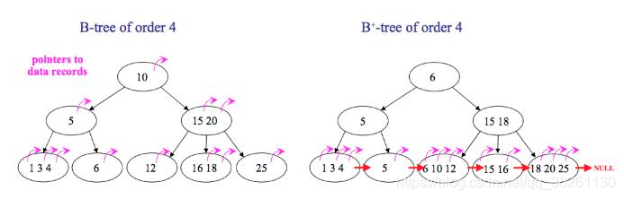

# 数据库原理

[TOC]

# 一、索引

## 1. 回表查询

回表查询是数据库术语，通常与数据库中的索引有关。回表查询指的是当数据库引擎使用索引来定位数据行的位置，但还需要进一步访问基础表（通常是主表）以获取完整的数据行的操作。这通常发生在以下情况下：

1. **索引不包含所需的数据**：数据库索引通常只包含数据表中的部分字段或列。当你查询的字段不在索引中时，数据库引擎需要进行回表查询以检索缺失的字段。

2. **覆盖索引**：在某些情况下，可以创建覆盖索引，这种索引包含了查询所需的所有字段，无需进行回表查询。覆盖索引可以显著提高查询性能。

3. **存储引擎的工作方式**：不同的数据库存储引擎在处理索引和数据表之间的关系时，具有不同的工作方式。例如，某些存储引擎可能会使用主键索引来避免回表查询。

回表查询可能会降低数据库查询的性能，因为它需要额外的磁盘 I/O 操作和内存访问。为了减少回表查询的发生，通常会使用合适的索引和覆盖索引来满足查询需求，从而避免访问主表。

在数据库性能优化过程中，了解何时会发生回表查询以及如何避免它对查询性能有帮助。通过优化查询和索引的设计，可以减少回表查询的次数，提高数据库性能。

## 2. 覆盖索引

覆盖索引（Covering Index）是一种数据库索引，它包含了查询所需的所有字段，从而在执行查询时无需访问实际的数据表，从而减少磁盘 I/O 和内存开销。覆盖索引的主要目的是提高查询性能，因为它可以加速数据检索并减少回表查询的需要。

通常，数据库的索引仅包含索引列的值以及指向数据表中实际数据行的指针。当你查询包含在索引中的列时，数据库引擎首先使用索引来定位到相关的数据行，然后使用这些数据行的指针访问实际数据。这两个步骤（索引查找和回表查询）可能会导致性能开销。

覆盖索引的好处在于，它不仅包括索引列的值，还包含了查询所需的其他字段的值。这意味着在执行查询时，数据库可以直接使用覆盖索引来获取所有所需的数据，而无需访问实际的数据表。这减少了磁盘 I/O 操作和内存访问，从而提高了查询性能。

覆盖索引通常用于以下情况：

1. **选择性查询**：当你查询的列包含在索引中，而查询条件选择性很高时，使用覆盖索引可以显著提高查询性能。

2. **覆盖查询**：当查询仅需要从索引中获取数据而无需访问数据表时，覆盖索引非常有用。这对于需要快速获取摘要信息或计数数据的查询很有帮助。

3. **范围查询**：覆盖索引可以用于范围查询，包括区间查询或排序操作，以减少排序的开销。

使用覆盖索引要根据具体的查询需求和数据表结构来决定。合理设计覆盖索引可以大大提高数据库查询性能，但也需要权衡索引的大小和维护成本。


**创建覆盖索引**

要创建覆盖索引，你需要在数据库表上建立一个包含了你查询所需的所有字段的索引。下面是创建覆盖索引的一般步骤：

1. **选择需要的字段**：首先，确定你的查询需要哪些字段。这些字段通常是查询条件和选择的字段，以及你想要覆盖的字段。

2. **创建索引**：使用数据库管理系统的工具或SQL命令创建索引。在创建索引时，确保包含在索引中的字段覆盖了你在步骤1中选择的字段。

    ```sql
    CREATE INDEX covering_index_name ON your_table (column1, column2, ...);
    ```

    在上面的SQL语句中，`covering_index_name` 是你为索引命名的名称，`your_table` 是你的数据表，`column1`, `column2`, ... 是你选择的字段列表。

3. **测试覆盖索引**：在创建索引后，运行你的查询以确保它使用了新的覆盖索引。你可以使用数据库的查询执行计划（EXPLAIN）来检查索引的使用情况。

4. **性能监测和优化**：监测查询性能以确保覆盖索引的使用带来了性能提升。如果发现性能问题，可以考虑调整索引或添加其他索引以满足查询需求。

需要注意的是，覆盖索引可能会占用更多的磁盘空间，因为它包含了更多的字段数据。因此，在创建覆盖索引时，要权衡性能提升和存储成本。此外，数据库管理系统的实现可能有所不同，因此具体的语法和选项可能会因DBMS而异。因此，请查阅你使用的数据库管理系统的文档以获取更具体的信息和建议。

## 3. 索引

索引是一种数据存储结构，对表中一列或多列进行排序以快速定位获取数据。就像一本书的目录就是一个索引，如果想在一本书中找到某个主题，一般会先找到对应页码。在mysql中，存储引擎用类似的方法使用索引，先在索引中找到对应值，然后根据匹配的索引记录找到对应的行。



### 3.1 B树

大多数存储引擎都支持B树索引。B树通常意味着所有的值都是按顺序存储的，并且每一个叶子到根的距离相同。B树索引能够加快访问数据的速度，因为存储引擎不再需要进行全表扫描来获取数据。下图就是一颗简单的B数。

### 3.2 B+树

B+树是B树的升级版。B+树和B树的区别是：

1. B树的节点(根节点/父节点/中间节点/叶子节点)中没有重复元素，B+树有。
2. B树的中间节点会存储数据指针信息，而B+树只有叶子节点才存储。
3. B+树的每个叶子节点有一个指针指向下一个节点，把所有的叶子节点串在了一起。

**B+树比起B树的优点：**

1. 由于中间节点不存指针，同样大小的磁盘页可以容纳更多的节点元素，树的高度就小。（数据量相同的情况下，B+树比B树更加“矮胖”），查找起来就更快。
2. B+树每次查找都必须到叶子节点才能获取数据，而B树不一定，B树可以在非叶子节点上获取数据。因此B+树查找的时间更稳定。
3. B+树的每一个叶子节点都有指向下一个叶子节点的指针，方便范围查询和全表查询：只需要从第一个叶子节点开始顺着指针一直扫描下去即可，而B树则要对树做中序遍历。

## 4. 聚集索引和辅助索引

> https://blog.nowcoder.net/n/7f25b076b05540e8bf5112b6c8a15a4e?from=nowcoder_improve


## 5. 主键、候选键、外键、内键

当设计数据库时，我们使用不同类型的键来定义数据表之间的关系、确保数据的完整性，并提高数据的检索效率。下面是常见的数据库键的介绍：

1. **主键（Primary Key）：**
   - 主键是用于唯一标识表中每一条记录的一列或一组列。主键的值在表中必须是唯一的，并且不能为 NULL。
   - 每张表只能有一个主键，主键可以是一个单独的列或多个列的组合。
   - 主键通常用于确保数据的唯一性和提高数据的检索效率。
2. **候选键（Candidate Key）：**
   - 候选键是能够唯一标识表中每一条记录的一列或一组列，与主键类似。但是，一张表可以有多个候选键，但最终只能选择一个作为主键。
   - 候选键的属性组合中的每一个属性都是必需的，并且能够唯一标识实体。
3. **外键（Foreign Key）：**
   - 外键是用来建立表之间关联关系的键，它指向另一张表的主键或唯一键。
   - 外键在一个表中创建时，指定了一个列或列组合，该列或列组合的值必须是另一张表的主键或唯一键的值，用来确保数据的引用完整性。
   - 外键用于实现表之间的关联、约束和引用，通常用于表示实体之间的关系。
4. **唯一键（Unique Key）：**
   - 唯一键是确保表中数据唯一性的键，与主键类似，但是允许存在 NULL 值。
   - 与主键不同的是，一张表可以有多个唯一键，而且唯一键可以包含 NULL 值。
5. **复合键（Composite Key）：**
   - 复合键是由多个列组成的键，用于唯一标识表中的每一条记录。复合键的组合值必须是唯一的。
   - 与主键类似，复合键也可以用于唯一标识记录，但是它可以包含多个列。
6. **超键**
   - 是数据库中的一个概念，它是一个能够唯一标识关系模式（表）中的元组（行）的属性集合。超键是一种广义的概念，包括了候选键、主键以及其他能够唯一标识元组的属性集合。

这些键在设计数据库时非常重要，可以确保数据的完整性和一致性，以及实现表之间的关联和约束。选择合适的键类型取决于具体的业务需求和设计目标。

## 6. 索引的底层实现原理和优化

B+树，经过优化的B+树

主要是在所有的叶子结点中增加了指向下一个叶子节点的指针，因此InnoDB建议为大部分表使用默认自增的主键作为主索引。

## 7. 索引建立原则


# 二、保障机制

## 1. Undo Log & Redo Log

MySQL的Undo Log（回滚日志）和Redo Log（重做日志）是两种日志，它们在数据库管理系统中扮演着不同的角色，用于确保事务的原子性、一致性、隔离性和持久性（ACID属性）。

1. **Undo Log（回滚日志）**：
   - Undo Log是MySQL中用于实现事务的回滚操作的日志。每个事务开始时，系统都会为它分配一块Undo Log，用于记录该事务所做的更改。
   - 当事务执行过程中出现错误，或者用户执行了ROLLBACK语句，系统可以使用Undo Log来将数据恢复到事务开始前的状态。
   - MySQL的InnoDB存储引擎中，Undo Log通常以"undo tablespace"的形式存储在磁盘上。

2. **Redo Log（重做日志）**：
   - Redo Log是MySQL中用于保证事务的持久性的日志。它记录了每个事务所做的修改，包括对数据页的修改等。
   - Redo Log的主要作用是在数据库崩溃后，用于恢复数据的一致性。通过重放Redo Log中的操作，MySQL可以将数据还原到最后一次提交的状态，确保数据不会丢失。
   - Redo Log通常存储在内存中，但也会定期刷入磁盘以确保持久性。

如何使用这些日志：
- 通常，数据库管理员无需直接操作Undo Log和Redo Log，MySQL内部会自动处理它们。你只需要编写SQL事务，MySQL会自动记录相应的日志。
- 如果需要执行回滚操作，可以使用`ROLLBACK`语句。MySQL会自动查找相应的Undo Log来执行回滚。
- 对于Redo Log，它通常无需手动操作，因为它主要用于数据库恢复。你只需确保数据库的持久性配置正确。

总之，Undo Log和Redo Log是MySQL内部的机制，用于确保事务的一致性和持久性。数据库管理员和应用程序开发者通常不需要直接操作这些日志，而是通过编写SQL事务来与数据库交互。

## 2. Transaction事务

数据库的事务机制是数据库管理系统（DBMS）确保数据库操作的一致性和可靠性的重要机制之一。事务是一组数据库操作（如插入、更新、删除等），它们作为一个不可分割的单位被执行，要么全部成功执行，要么全部失败回滚，从而保证了数据库的完整性和一致性。以下是数据库事务机制的主要特点和关键概念：

1. **ACID 特性：**
   - **原子性（Atomicity）：** 事务是一个不可分割的操作单元，要么全部执行成功（提交），要么全部失败（回滚），保证了数据库的一致性。
   - **一致性（Consistency）：** 事务执行前后数据库的状态必须是一致的，即满足数据库的约束和规则，确保数据的完整性和有效性。
   - **隔离性（Isolation）：** 多个事务并发执行时，各自的操作相互隔离，不会相互影响，防止了并发事务导致的数据不一致问题。
   - **持久性（Durability）：** 一旦事务提交成功，其对数据库的修改将永久保存在数据库中，即使系统崩溃也不会丢失。

2. **事务的基本操作：**
   - **开始事务（BEGIN 或 START TRANSACTION）：** 明确指示事务的开始。
   - **提交事务（COMMIT）：** 提交事务并将其改变永久保存到数据库中。
   - **回滚事务（ROLLBACK）：** 放弃事务中的所有更改，并将数据库恢复到事务开始之前的状态。

3. **并发控制：**
   - 并发事务可能导致多个事务同时访问和修改相同的数据，可能产生读取脏数据、丢失更新、不可重复读等问题。数据库采用并发控制机制来解决这些问题，包括锁机制、多版本并发控制（MVCC）等。

4. **事务的隔离级别：**
   - 数据库提供了不同的事务隔离级别，如读未提交、读已提交、可重复读和串行化等级别，用于控制事务之间的隔离程度和并发度。

通过事务机制，数据库管理系统可以确保数据的一致性和完整性，有效地处理并发操作，从而保证了数据库操作的可靠性和稳定性。

## 3. 事务隔离级别

> https://zhuanlan.zhihu.com/p/117476959

**隔离级别要解决的问题如下：**

- **脏读**
  - 脏读指的是读到了其他事务未提交的数据，未提交意味着这些数据可能会回滚，也就是可能最终不会存到数据库中，也就是不存在的数据。读到了并一定最终存在的数据，这就是脏读。

- **不可重复读**
  - 对比可重复读，不可重复读指的是在同一事务内，不同的时刻读到的同一批数据可能是不一样的，可能会受到其他事务的影响，比如其他事务改了这批数据并提交了。通常针对数据**更新（UPDATE）**操作。
- **幻读**
  - 幻读是针对数据**插入（INSERT）**操作来说的。假设事务A对某些行的内容作了更改，但是还未提交，此时事务B插入了与事务A更改前的记录相同的记录行，并且在事务A提交之前先提交了，而这时，在事务A中查询，会发现好像刚刚的更改对于某些数据未起作用，但其实是事务B刚插入进来的，让用户感觉很魔幻，感觉出现了幻觉，这就叫幻读。

**隔离级别对应的解决问题：**

| 隔离级别 | 脏读   | 不可重复读 | 幻读   |
| :------- | :----- | :--------- | :----- |
| 读未提交 | 可能   | 可能       | 可能   |
| 读提交   | 不可能 | 可能       | 可能   |
| 可重复读 | 不可能 | 不可能     | 可能   |
| 串行化   | 不可能 | 不可能     | 不可能 |

**隔离级别的使用代码：**

1. **读未提交（Read Uncommitted）：**
   - 隔离级别最低，允许脏读。
   - 代码示例：
     ```sql
     SET SESSION TRANSACTION ISOLATION LEVEL READ UNCOMMITTED;
     START TRANSACTION;
     -- 执行事务操作
     COMMIT;
     ```

2. **读已提交（Read Committed）：**
   - 允许读取已提交的数据，避免了脏读。
   - 代码示例：
     ```sql
     SET SESSION TRANSACTION ISOLATION LEVEL READ COMMITTED;
     START TRANSACTION;
     -- 执行事务操作
     COMMIT;
     ```

3. **可重复读（Repeatable Read）：**
   - 保证在同一个事务中多次读取同一数据时结果保持一致，避免了不可重复读。
   - 代码示例：
     ```sql
     SET SESSION TRANSACTION ISOLATION LEVEL REPEATABLE READ;
     START TRANSACTION;
     -- 执行事务操作
     COMMIT;
     ```

4. **串行化（Serializable）：**
   - 最高的隔离级别，事务之间完全隔离，每个事务按顺序执行。
   - 代码示例：
     ```sql
     SET SESSION TRANSACTION ISOLATION LEVEL SERIALIZABLE;
     START TRANSACTION;
     -- 执行事务操作
     COMMIT;
     ```

在代码示例中，首先使用 `SET SESSION TRANSACTION ISOLATION LEVEL` 设置事务隔离级别，然后使用 `START TRANSACTION` 开始事务，在事务中执行相应的操作，最后使用 `COMMIT` 提交事务。

## 4. MVCC


## 5. 快照隔离


## 6. 完整性约束包括哪些

完整性约束是数据库中用于确保数据的完整性和一致性的规则。主要的完整性约束包括以下几种：

1. **实体完整性约束（Entity Integrity Constraint）：**
   - 实体完整性约束用于确保每个表中的每一行都具有一个唯一的标识，通常是通过主键来实现的。
   - 主键约束要求主键列中的值是唯一的，并且不能为 NULL。

2. **参照完整性约束（Referential Integrity Constraint）：**
   - 参照完整性约束用于确保两个表之间的关系的一致性。
   - 外键约束是实现参照完整性的主要方式，它确保了在一个表中的外键值必须在另一个表的主键或唯一键中存在，或者为 NULL。

3. **域完整性约束（Domain Integrity Constraint）：**
   - 域完整性约束用于确保表中的某些列或属性满足特定的条件或约束。
   - 例如，可以使用 CHECK 约束来限制某列中的值必须满足特定的条件，如范围、格式或枚举值等。

4. **用户定义的完整性约束（User-defined Integrity Constraint）：**
   - 用户可以定义自己的完整性约束，以确保数据库中的数据满足特定的业务规则或要求。
   - 这些约束可以通过触发器（Triggers）或存储过程（Stored Procedures）来实现。

通过这些完整性约束，可以确保数据库中的数据完整性和一致性，防止不符合规则的数据被插入或更新到数据库中。与表有关的约束：包括列约束(NOT NULL（非空约束）)和表约束(PRIMARY KEY、foreign key、check、UNIQUE) 。

## 7. 什么是锁

> 数据库是一个多用户使用的共享资源。当多个用户并发地存取数据时，在数据库中就会产生多个事务同时存取同一数据的情况。若对并发操作不加控制就可能会读取和存储不正确的数据，破坏数据库的一致性。加锁是实现数据库并发控制的一个非常重要的技术。当事务在对某个数据对象进行操作前，先向系统发出请求，对其加锁。加锁后事务就对该数据对象有了一定的控制，在该事务释放锁之前，其他的事务不能对此数据对象进行更新操作。基本锁类型：锁包括行级锁和表级锁

在数据库中，锁是用于控制对数据库资源（如表、行、页等）并发访问的机制。它可以防止多个并发事务同时对同一资源进行修改，从而确保数据的一致性和完整性。锁可以分为不同的类型，主要包括以下几种：

1. **共享锁（Shared Lock）：**
   - 共享锁允许多个事务同时读取一个资源，但不允许有任何事务修改它。
   - 典型应用场景是读取操作，多个读取操作可以同时进行，但写操作会阻塞其他事务的读写操作。

2. **排他锁（Exclusive Lock）：**
   - 排他锁只允许一个事务独占一个资源，其他事务既不能读取也不能修改该资源。
   - 典型应用场景是写操作，当一个事务对资源进行修改时，会独占资源并阻塞其他事务的读写操作。

3. **行级锁（Row-Level Lock）：**
   - 行级锁是对表中的单行数据进行锁定，只影响指定行的访问操作。
   - 行级锁可以防止多个事务同时修改同一行数据，提高了并发性能。

4. **表级锁（Table-Level Lock）：**
   - 表级锁是对整个表进行锁定，会影响整个表的访问操作。
   - 表级锁通常用于对整个表进行读写操作时，会阻塞其他事务对该表的访问。

5. **页级锁（Page-Level Lock）：**
   - 页级锁是对表中的一页数据进行锁定，介于行级锁和表级锁之间。
   - 页级锁通常用于对大规模数据的批量处理操作，可以提高并发性能。

通过使用不同类型的锁，数据库管理系统可以灵活控制并发访问，确保数据的一致性和完整性，同时提高数据库的并发性能。

## 8、视图

> https://worktile.com/kb/p/25554

**视图（View）：** 视图是一个虚拟的表，它不存储实际的数据，而是根据一个或多个基本表的查询结果动态生成的结果集。视图可以将数据库中的数据以不同的视角呈现给用户，用户可以像查询基本表一样查询视图，但实际上操作的是视图所对应的查询结果。视图可以用来简化复杂的查询、隐藏底层数据结构、提供安全性等。


视图和基本表在某些方面的消耗是相似的，但在其他方面可能会有所不同。

**共同点：**
1. **存储空间消耗：** 视图本身不存储数据，它只是对基本表的查询结果进行了封装。因此，从存储空间的角度来看，视图不会占用额外的存储空间，与基本表相比，它们的存储空间消耗是一样的。
2. **查询性能：** 在执行查询操作时，视图的查询性能可能会受到基本表的影响，因为视图的查询结果是基于基本表的数据计算得到的。如果视图的查询涉及到复杂的计算或大量的数据，那么查询性能可能会受到影响。

**不同点：**
1. **更新性能：** 当对视图进行更新操作时，实际上是对基本表进行的操作，因此更新性能受到基本表的影响。如果视图涉及多个基本表，更新操作可能涉及到多个表的更新，导致性能下降。
2. **维护成本：** 视图的维护成本通常较低，因为视图可以简化复杂的查询，提高代码的可读性和维护性。但是，如果视图的定义发生变化或者基本表的结构发生变化，需要相应地更新视图的定义，这可能会增加维护成本。
3. **权限管理：** 视图可以用来限制用户对数据库的访问权限，通过授予或者撤销对视图的访问权限，可以控制用户对底层数据的访问范围。相比之下，基本表的权限管理可能会更加复杂，因为需要考虑到对表中每一列的权限管理。

综上所述，虽然视图和基本表在某些方面的消耗是相似的，但在更新性能、维护成本和权限管理等方面可能会有所不同。选择使用视图还是基本表应该根据具体的业务需求和性能要求来决定。

# 三、标准

## 1. 非标准字符串类型

> TINYTEXT
> TEXT
> MEDIUMTEXT
> LONGTEXT

非标准字符串类型指的是一些在 SQL 标准中未明确定义或未广泛支持的字符串类型。这些类型可能在特定的数据库系统中有特定的实现或扩展。一些常见的非标准字符串类型包括：

1. **JSON 类型：** JSON（JavaScript Object Notation）是一种轻量级的数据交换格式，用于存储和表示结构化数据。一些数据库系统提供了特定的 JSON 类型或 JSON 相关的函数和操作，用于存储和处理 JSON 数据。

2. **UUID 类型：** UUID（Universally Unique Identifier）是一种唯一标识符，通常用于在分布式系统中唯一标识实体或对象。一些数据库系统提供了特定的 UUID 类型或 UUID 相关的函数和操作，用于生成和存储 UUID。

3. **IP 地址类型：** 一些数据库系统提供了特定的 IP 地址类型或 IP 相关的函数和操作，用于存储和处理 IP 地址。

4. **非固定长度字符串类型：** 除了标准的 VARCHAR 类型之外，一些数据库系统可能提供了非固定长度的字符串类型，如 TEXT 类型。这些类型通常用于存储大量的文本数据，但其行为和性能可能会与标准的字符串类型有所不同。

这些非标准字符串类型通常是特定数据库系统的扩展或功能，使用它们可以为特定的应用场景提供更好的支持和性能。但需要注意的是，它们可能会导致应用程序在不同数据库系统之间的不可移植性。

# 四、优化

## 1. 实践中如何优化MySQL

> 详细可以查看 阿里P8架构师谈：MySQL慢查询优化、索引优化、以及表等优化总结

1. SQL语句及索引的优化

2. 数据库表结构的优化

3. 系统配置的优化

4. 硬件的优化

## 2. SQL语句优化

1. Where子句中：where表之间的连接必须写在其他Where条件之前，那些可以过滤掉最大数量记录的条件必须写在Where子句的末尾.HAVING最后。

2. 用EXISTS替代IN、用NOT EXISTS替代NOT IN。

3. 避免在索引列上使用计算

4. 避免在索引列上使用IS NULL和IS NOT NULL

5. 对查询进行优化，应尽量避免全表扫描，首先应考虑在 where 及 order by 涉及的列上建立索引。

6. 应尽量避免在 where 子句中对字段进行 null 值判断，否则将导致引擎放弃使用索引而进行全表扫描

7. 应尽量避免在 where 子句中对字段进行表达式操作，这将导致引擎放弃使用索引而进行全表扫描

## 3. 索引优化


## 4. 数据库表结构优化


## 5. 系统配置优化


## 6. MySQL 慢查询优化


## 7. 定期备份和恢复策略：优化


## 2. 优化数据库的方法

- 选取最适用的字段属性，尽可能减少定义字段宽度，尽量把字段设置NOTNULL，例如’省份’、’性别’最好适用ENUM
- 使用连接(JOIN)来代替子查询
- 适用联合(UNION)来代替手动创建的临时表
- 事务处理
- 锁定表、优化事务处理
- 适用外键，优化锁定表
- 建立索引
- 优化查询语句

## 29. 锁的优化策略

1. 读写分离

2. 分段加锁

3. 减少锁持有的时间

4. 多个线程尽量以相同的顺序去获取资源

不能将锁的粒度过于细化，不然可能会出现线程的加锁和释放次数过多，反而效率不如一次加一把大锁。

# 五、Mysql 常见知识点

## 1. Mysql join

MySQL中有几种常见的join类型，包括：

1. 内连接（INNER JOIN）：内连接是最常见的连接类型，它返回两个表中符合连接条件的行。如果两个表中的行在连接条件上匹配，那么这些行就会被返回。
2. 左连接（LEFT JOIN）：左连接返回左表中所有的行，以及右表中与左表中行匹配的行。如果右表中没有匹配的行，则返回NULL值。
3. 右连接（RIGHT JOIN）：右连接返回右表中所有的行，以及左表中与右表中行匹配的行。如果左表中没有匹配的行，则返回NULL值。
4. 全连接（FULL JOIN）：全连接返回左表和右表中所有的行，如果某个表中没有匹配的行，则返回NULL值。
5. 自连接（SELF JOIN）：自连接是指将表与自身进行连接，通常用于比较表中的不同行之间的数据。

**默认JOIN是INNER JOIN**


## 2. Mysql is null

**为什么是IS NULL, 而不是"= NULL"?**

- Tip: SQL的保留字中，很多都被归类为谓词一类，例如>,<>,= 等比较谓词，以及BETWEEN, LIKE, IN, IS NULL等。总结，谓词是一种特殊的函数，返回值是真值。(前面提到的诶个谓词，返回值都是true, false, unknown,SQL是三值逻辑，所以有三种真值）因为查询结果只会包含WHERE子句里的判断结果为true的行！不包含判断结果为false和unknown的行。且不仅是等号，对NULL使用其他比较谓词（比如> NULL），结果也都是unknown。
- 重点理解：NULL不是值，所以不能对其使用谓词，如果使用谓词，结果是unknown。
  可以认为它只是一个没有值的标记,而比较谓词只适用于比较值。因此对非值的NULL使用比较谓词是没有意义的

**如何理解IS NULL?是两个单词？IS空格NULL?**

- "NULL值" 和 "列的值为NULL"这个说法是错误的。NULL不属于关系型数据库中的某种类型。
- 我们为什么会误认为NULL是一个值？可能因为混淆了别的语言，在一些语言中NULL是一个常量。还有个重要原因是IS NULL是两个单词，所以我以前也把IS当作谓词，比如IS-A,所以误认为NULL是一个值。特别是SQL里有IS TRUE, IS FALSE。在讲解SQL标准的书里提醒人那么样，我们应该把IS NULL看作一个谓词，如果可以IS_NULL或许更合适。

**三值逻辑运算。**

- unknown小写，是第三个真值。与作为NULL的一种UNKNOWN(未知)是不同的东西。小写是明确的布尔类型的真值，后者大写的既不是值也不是变量。
- 为了对比不同：看x=x的情况。
  - unknown = unknown -> true
  - UNKNOWN = UNKNOWN ->unknown


## 3. Mysql 聚合函数用法

MySQL 中的 AVG() 函数用于计算数值列的平均值。它将数值列中的所有值相加，然后除以行的数量来计算平均值。除了 AVG() 函数，MySQL 还提供了许多其他的聚合函数，如 SUM()、COUNT()、MIN() 和 MAX() 等，用于对数据进行聚合计算。

下面是一些常用聚合函数的简要介绍：

1. **AVG()：** 计算数值列的平均值。

   - avg（条件）相当于sum（if（条件，1，0））/count(全体)
   - **进阶：**sum（if（条件，N，0））/count(全体) 可用 N*avg（条件）代替

   ```sql
   SELECT AVG(column_name) FROM table_name;
   ```

2. **SUM()：** 计算数值列的总和。

   ```sql
   SELECT SUM(column_name) FROM table_name;
   ```

3. **COUNT()：** 计算行数或非 NULL 值的数量。

   ```sql
   SELECT COUNT(column_name) FROM table_name;
   ```

4. **MIN()：** 返回数值列的最小值。

   ```sql
   SELECT MIN(column_name) FROM table_name;
   ```

5. **MAX()：** 返回数值列的最大值。

   ```sql
   SELECT MAX(column_name) FROM table_name;
   ```

这些函数都可以在 SELECT 语句中使用，并且可以与 WHERE 子句一起使用以进行筛选。

这些聚合函数的原理是在数据库内部对数据进行迭代处理。当执行聚合函数时，数据库引擎会扫描符合条件的行，并对相应的列进行计算。例如，当执行 AVG() 函数时，数据库会先计算出数值列的总和和行数，然后将总和除以行数来得到平均值。因此，聚合函数的性能通常取决于数据量的大小和索引的使用情况。在处理大量数据时，合理使用索引可以提高查询的性能。

## 4. Mysql中有哪几种锁

1. 表级锁：开销小，加锁快；不会出现死锁；锁定粒度大，发生锁冲突的概率最高，并发度最低。
2. 行级锁：开销大，加锁慢；会出现死锁；锁定粒度最小，发生锁冲突的概率最低，并发度也最高。
3. 页面锁：开销和加锁时间界于表锁和行锁之间；会出现死锁；锁定粒度界于表锁和行锁之间，并发度一般。

| 锁类型                                     | 介绍                                                         | 代码                                                         |
| ------------------------------------------ | :----------------------------------------------------------- | ------------------------------------------------------------ |
| **共享锁（Shared Lock）**                  | 共享锁允许多个事务同时读取同一资源，但不允许写操作。多个事务可以同时持有共享锁，不会相互阻塞。 | SELECT * FROM table_name LOCK IN SHARE MODE;                 |
| **排他锁（Exclusive Lock）**               | 排他锁只允许一个事务对资源进行写操作，并且其他事务不能对该资源进行读或写操作。排他锁会阻塞其他事务的读写操作。 | SELECT * FROM table_name FOR UPDATE;                         |
| **行级锁（Row-level Lock）**               | 锁定表中的单独行，允许其他事务同时访问表中的其他行。         | BEGIN;<br/>SELECT * FROM table_name WHERE id = 1 FOR UPDATE;<br/>-- 执行一些更新操作<br/>COMMIT; |
| **表级锁（Table-level Lock）**             | 锁定整个表，阻止其他事务对表进行读写操作。                   | -- 锁定整个表<br/>LOCK TABLES table_name WRITE;<br/><br/>-- 在锁定的表上执行一些写操作<br/>INSERT INTO table_name (column1, column2) VALUES (value1, value2);<br/>UPDATE table_name SET column_name = 'new_value' WHERE condition;<br/>DELETE FROM table_name WHERE condition;<br/><br/>-- 解锁表<br/>UNLOCK TABLES; |
| **意向共享锁（Intention Shared Lock）**    | 用于表示事务准备对一个表中的某些行进行共享锁定。             |                                                              |
| **意向排他锁（Intention Exclusive Lock）** | 用于表示事务准备对一个表中的某些行进行排他锁定。             |                                                              |


## 5. Mysql中有哪些不同的表类型

> 早期：BDB、HEAP、ISAM、MERGE、MyISAM、InnoDB以及Gemeni这7种Mysql表类型

在 MySQL 中，常见的表类型包括以下几种：

1. **MyISAM：** 这是 MySQL 的默认表类型，在早期版本中被广泛使用。它的特点是快速、高效，适合于读操作频繁、写操作较少的场景。但是，MyISAM 不支持事务、不支持外键约束，也不支持行级锁。

2. **InnoDB：** 这是 MySQL 的另一种常见的表类型，也是现在推荐使用的默认表类型。InnoDB 支持事务、外键约束，提供了更高的并发性和可靠性，同时支持行级锁，适合于高并发的 OLTP（联机事务处理）场景。

3. **MEMORY（或 HEAP）：** 这种表类型将数据存储在内存中，而不是磁盘上。因此，它的访问速度非常快，适合于临时表、缓存表等需要快速访问的场景。但是，由于数据存储在内存中，因此内存表的大小受到内存限制的限制，并且在 MySQL 重启时数据会丢失。

4. **ARCHIVE：** 这种表类型用于存储大量历史数据，适合于数据归档和存储。它使用压缩算法存储数据，因此占用的存储空间较小，但对数据的访问速度较慢。ARCHIVE 表不支持索引，也不支持事务。

5. **CSV：** 这种表类型将数据存储在 CSV 文件中，适合于数据导入导出、数据交换等场景。CSV 表支持事务，但不支持索引。

6. **BLACKHOLE：** 这种表类型用于复制数据到另一个 MySQL 实例，它接收写入操作但不存储任何数据，只是将写入操作传递给另一个 MySQL 实例。

7. **Federated：** 这种表类型允许在本地 MySQL 实例中访问远程 MySQL 实例中的数据，可以通过 SQL 查询操作远程表的数据。

## 6. MyISAM和InnoDB的区别

MyISAM 和 InnoDB 是 MySQL 中两种常见的表引擎，它们在功能、性能和适用场景上有一些不同：

1. **事务支持：**
   - MyISAM：不支持事务。MyISAM 表不具备事务功能，因此无法实现数据的原子性、一致性、隔离性和持久性（ACID 特性）。
   - InnoDB：支持事务。InnoDB 是一个事务安全的存储引擎，支持事务的提交、回滚、隔离和锁定，可以实现数据的 ACID 特性。

2. **外键约束：**
   - MyISAM：不支持外键约束。MyISAM 表不支持外键，无法定义外键约束来维护表之间的引用完整性。
   - InnoDB：支持外键约束。InnoDB 表支持定义外键约束，可以确保表之间的引用完整性，实现数据的关联和一致性。

3. **行级锁：**
   - MyISAM：不支持行级锁。MyISAM 表只支持表级锁，因此在并发访问时可能出现较多的锁冲突，影响性能。
   - InnoDB：支持行级锁。InnoDB 表支持行级锁，可以在事务级别锁定行，提高了并发访问的性能和并发控制的粒度。

4. **崩溃恢复：**
   - MyISAM：不支持崩溃恢复。MyISAM 表在崩溃或意外关机后可能会损坏数据，并且不提供自动恢复功能。
   - InnoDB：支持崩溃恢复。InnoDB 表支持事务日志和回滚段，可以保证数据的一致性和持久性，并提供崩溃恢复机制。

5. **索引结构：**
   - MyISAM：使用 B+ 树索引结构。MyISAM 表使用 B+ 树索引结构，适合于读操作频繁的场景。
   - InnoDB：使用聚簇索引和辅助索引。InnoDB 表的主键索引是聚簇索引，辅助索引也使用 B+ 树结构，适合于读写混合的 OLTP 场景。

总的来说，如果你的应用需要事务支持、外键约束、行级锁和崩溃恢复功能，那么应该选择 InnoDB 表引擎。而如果你的应用只需要简单的读写操作，对事务和外键约束没有要求，并且对性能要求较高，可以考虑使用 MyISAM 表引擎。


## 7. CHAR和VARCHAR的区别

CHAR 和 VARCHAR 是两种常见的字符数据类型，它们在数据库中用于存储文本数据，但有一些区别：

1. **存储方式：**
   - **CHAR：** CHAR 是固定长度的字符类型，它始终占用固定数量的存储空间，无论实际存储的数据长度是多少。如果存储的字符串长度小于指定的长度，则在字符串末尾填充空格以达到指定长度。
   - **VARCHAR：** VARCHAR 是可变长度的字符类型，它只占用实际存储的数据长度加上一个额外的长度字节。因此，VARCHAR 存储的数据长度可以根据实际数据长度动态变化。
2. **存储空间：**
   - **CHAR：** CHAR 类型的存储空间是固定的，与定义的长度相同。例如，如果定义一个长度为 10 的 CHAR 字段，那么无论存储的数据长度是多少，都会占用 10 个字节的存储空间。
   - **VARCHAR：** VARCHAR 类型的存储空间取决于实际存储的数据长度。例如，如果存储的数据长度是 5，那么只会占用 5 个字节的存储空间，再加上一个额外的长度字节。
3. **性能和存储效率：**
   - **CHAR：** 由于 CHAR 类型是固定长度的，它的存取速度通常比 VARCHAR 类型更快。但是，如果存储的数据长度较短，那么会浪费一定的存储空间。
   - **VARCHAR：** VARCHAR 类型可以根据实际存储的数据长度动态调整存储空间，因此在存储长度变化较大的数据时比较节省存储空间。但是，由于需要额外的长度字节来存储数据长度信息，可能会略微降低存取速度。
   - 在使用 WHERE 子句进行数据检索时，对于 CHAR 类型的列，数据库引擎可以更快地定位到存储的位置，因为它们具有固定的长度，所以可以直接计算出偏移量。而对于 VARCHAR 类型的列，数据库引擎需要额外的长度信息来计算存储的位置，因此可能会稍微降低检索速度。

综上所述，CHAR 和 VARCHAR 在存储方式、存储空间和性能方面有所不同，根据实际需求选择合适的数据类型。如果存储的数据长度固定且较长，可以考虑使用 CHAR 类型；如果存储的数据长度变化较大或者需要节省存储空间，可以考虑使用 VARCHAR 类型。


## 8. myisamchk是用来做什么的

> 它用来压缩MyISAM表，这减少了磁盘或内存使用

`myisamchk` 是 MySQL 数据库中用于检查、维护和修复 MyISAM 存储引擎表的命令行工具。

MyISAM 是 MySQL 中的一种常用的存储引擎，它以表格形式存储数据，并且支持全文索引等功能。`myisamchk` 提供了一些功能，用于对 MyISAM 表进行检查和修复，以确保数据的完整性和稳定性。主要的用途包括：

1. **检查表格：** `myisamchk` 可以对 MyISAM 表进行检查，查找可能存在的错误、损坏或不一致的数据，并生成报告。
2. **修复表格：** 在检查过程中发现了错误或损坏的情况下，`myisamchk` 可以尝试修复表格，恢复数据的完整性。
3. **优化表格：** `myisamchk` 可以对表格进行优化，包括重建索引、压缩表格、释放未使用的空间等操作，以提高表格的性能和效率。
4. **备份和恢复：** 可以使用 `myisamchk` 对表格进行备份和恢复操作，以防止数据丢失或损坏。

总的来说，`myisamchk` 是一个用于维护 MyISAM 表格的实用工具，可以帮助管理员检查、修复和优化表格，保证数据的完整性和可靠性。


**以下是一些常用的用法示例：**

1. **检查表格：**
   ```bash
   myisamchk /path/to/your/table.MYI
   ```
   这将对指定的 MyISAM 表格进行检查，并输出检查结果。

2. **修复表格：**
   ```bash
   myisamchk --recover /path/to/your/table.MYI
   ```
   这将尝试修复指定的 MyISAM 表格。如果检查到损坏，它会尝试自动修复。

3. **优化表格：**
   ```bash
   myisamchk --optimize /path/to/your/table.MYI
   ```
   这将对指定的 MyISAM 表格进行优化操作，包括重建索引和压缩表格。

4. **备份表格：**
   ```bash
   myisamchk --backup /path/to/your/table.MYI
   ```
   这将对指定的 MyISAM 表格进行备份操作，将原始数据备份到一个 `.BAK` 文件中。

注意替换 `/path/to/your/table.MYI` 为你实际的表格文件路径。在执行 `myisamchk` 命令时，通常需要停止 MySQL 服务，以确保在操作期间表格没有被其他进程锁定。

## 9. MyISAM Static和MyISAM Dynamic区别

> 在MyISAM Static上的所有字段有固定宽度。动态MyISAM表将具有像TEXT，BLOB等字段，以适应不同长度的数据类型。MyISAM Static在受损情况下更容易恢复。

MyISAM Static 和 MyISAM Dynamic 是 MyISAM 存储引擎的两种不同的编译方式，它们在存储表格数据和索引方面有所不同。

1. **MyISAM Static：**
   - 在 MyISAM Static 编译方式下，表格的行格式是固定的，每一行都有相同的长度。
   - 表格的数据和索引都是以静态格式存储的，即每一行都占用固定大小的存储空间，不会根据实际数据的大小动态调整。
   - 这种方式在数据长度固定、数据更新不频繁的情况下，可以提高存取速度和空间利用率。

2. **MyISAM Dynamic：**
   - 在 MyISAM Dynamic 编译方式下，表格的行格式是动态的，每一行的长度可以根据实际存储的数据长度动态调整。
   - 表格的数据和索引都是以动态格式存储的，即每一行的存储空间大小会根据实际数据的大小动态调整。
   - 这种方式在数据长度变化较大、数据更新频繁的情况下，可以降低存储空间的浪费和提高存取效率。

总的来说，MyISAM Static 和 MyISAM Dynamic 在表格数据和索引存储方面有所不同，选择合适的编译方式取决于实际的应用需求和数据特点。

## 10. 表的列定义为TIMESTAMP

> 每当行被更改时，时间戳字段将获取当前时间戳。

如果一个表的某一列被定义为 TIMESTAMP 类型，那么这列将用于存储日期和时间信息。具体来说，以下是发生的情况：

1. **存储日期和时间：** TIMESTAMP 类型用于存储日期和时间信息，包括年、月、日、时、分和秒。它可以存储从 1970 年 1 月 1 日 00:00:00 开始的时间戳至 2038 年 01 月 19 日 03:14:07。

2. **自动更新：** 可以为 TIMESTAMP 类型的列指定默认值为 CURRENT_TIMESTAMP，这样在插入新行时，如果没有提供该列的值，将会自动填充当前的日期和时间。也可以使用 ON UPDATE CURRENT_TIMESTAMP 来设置自动更新，这样在更新行时，如果该列被修改，将会自动更新为当前的日期和时间。

3. **时区转换：** TIMESTAMP 类型的值在存储时会转换为 UTC 时间（协调世界时），并在检索时根据连接的时区进行转换。这意味着存储的值不受时区影响，而在检索时可以根据用户所在的时区进行显示。

4. **自动填充：** 如果不提供 TIMESTAMP 类型列的值，它会自动填充当前的日期和时间。这在记录数据的创建时间或最后更新时间时非常有用。

总的来说，TIMESTAMP 类型的列用于存储日期和时间信息，并且可以自动填充和自动更新，以及根据时区进行转换显示。

## 11. 列设置为AUTO INCREMENT

**如果在表中达到最大值，会发生什么情况？**

它会停止递增，任何进一步的插入都将产生错误，因为密钥已被使用。

**怎样才能找出最后一次插入时分配了哪个自动增量？**

LAST_INSERT_ID将返回由Auto_increment分配的最后一个值，并且不需要指定表名称。

```sql
-- 插入新记录
INSERT INTO your_table (column1, column2, ...)
VALUES (value1, value2, ...);

-- 获取最后一次插入操作生成的自增 ID 值
SELECT LAST_INSERT_ID();
```


## 12. 怎么看到为表格定义的所有索引

索引是通过以下方式展示为表格定义的：

````sql
SHOW INDEX FROM <tablename>;
````

## 13. LIKE语法

`LIKE` 是 SQL 中用于模糊匹配的操作符，常用于在查询中搜索具有特定模式的文本。`LIKE` 语法通常与通配符结合使用，可以进行灵活的字符串匹配。以下是 `LIKE` 语法的基本形式：

```sql
SELECT column1, column2, ...
FROM table_name
WHERE column_name LIKE pattern;
```

在上面的语法中：

- `SELECT column1, column2, ...` 指定了要检索的列。
- `FROM table_name` 指定了要检索数据的表。
- `WHERE column_name LIKE pattern` 使用 `LIKE` 来筛选匹配特定模式的行。`column_name` 是要匹配的列名，`pattern` 是要匹配的模式。

`pattern` 是一个包含了通配符的字符串，常用的通配符包括：

- `%`：表示零个或多个字符。
- `_`：表示任意单个字符。
- `[]`：用于指定字符集合，比如 `[abc]` 表示匹配 `a`、`b` 或 `c` 中的任意一个字符。
- `[^]`：用于指定排除的字符集合，比如 `[^abc]` 表示排除 `a`、`b` 和 `c` 中的任意一个字符。

以下是一些示例：

- `LIKE 'apple%'`：匹配以 "apple" 开头的任意字符串。
- `LIKE '%orange'`：匹配以 "orange" 结尾的任意字符串。
- `LIKE '%banana%'`：匹配包含 "banana" 的任意位置的字符串。
- `LIKE '_erry'`：匹配以 "erry" 结尾的四个字符的字符串，其中第一个字符是任意字符。

总的来说，`LIKE` 语法是 SQL 中用于模糊匹配的重要操作符，可以根据特定模式进行灵活的字符串匹配。

## 14. Unix和Mysql时间戳之间进行转换

> UNIX_TIMESTAMP是从Mysql时间戳转换为Unix时间戳的命令
> FROM_UNIXTIME是从Unix时间戳转换为Mysql时间戳的命令

Unix 时间戳是指从协调世界时（UTC）1970 年 1 月 1 日 00:00:00 开始至今的秒数。在 Unix 系统中，通常用整数来表示 Unix 时间戳。MySQL 中也有类似的函数来处理日期和时间，你可以使用 `FROM_UNIXTIME()` 和 `UNIX_TIMESTAMP()` 函数来在 Unix 时间戳和 MySQL 日期时间之间进行转换。

以下是这两个函数的介绍：

1. **FROM_UNIXTIME()：**
   - 这个函数将 Unix 时间戳转换为 MySQL 的日期时间格式。
   - 语法：`FROM_UNIXTIME(unix_timestamp [, format])`
   - `unix_timestamp` 是 Unix 时间戳，可以是一个整数或一个数字表达式。
   - `format` 是可选参数，用于指定输出日期时间的格式，默认为 `%Y-%m-%d %H:%i:%s`。
   
   示例：
   ```sql
   SELECT FROM_UNIXTIME(1612395793);
   ```
   这将返回 Unix 时间戳 1612395793 对应的 MySQL 日期时间。

2. **UNIX_TIMESTAMP()：**
   - 这个函数将 MySQL 的日期时间转换为 Unix 时间戳。
   - 语法：`UNIX_TIMESTAMP([datetime])`
   - `datetime` 是 MySQL 的日期时间值，可以是一个日期时间类型的列或一个日期时间字面量。
   
   示例：
   ```sql
   SELECT UNIX_TIMESTAMP('2022-02-04 10:23:45');
   ```
   这将返回 MySQL 日期时间 '2022-02-04 10:23:45' 对应的 Unix 时间戳。

## 15. 列对比运算符是什么

> 在SELECT语句的列比较中使用=，<>，<=，<，> =，>，<<，>>，<=>，AND，OR或LIKE运算符。

列对比运算符用于比较两个表格或子查询的结果集，判断它们是否相等或不相等。以下是常见的列对比运算符：

1. **等于（=）：**
   - 等于运算符用于检查两个值是否相等。
   - 语法：`column1 = column2`

2. **不等于（<>或!=）：**
   - 不等于运算符用于检查两个值是否不相等。
   - 语法：`column1 <> column2` 或 `column1 != column2`

3. **大于（>）：**
   - 大于运算符用于检查一个值是否大于另一个值。
   - 语法：`column1 > column2`

4. **小于（<）：**
   - 小于运算符用于检查一个值是否小于另一个值。
   - 语法：`column1 < column2`

5. **大于等于（>=）：**
   - 大于等于运算符用于检查一个值是否大于或等于另一个值。
   - 语法：`column1 >= column2`

6. **小于等于（<=）：**
   - 小于等于运算符用于检查一个值是否小于或等于另一个值。
   - 语法：`column1 <= column2`

这些运算符可以用于任何类型的列，包括数字、字符串、日期等。在使用列对比运算符时，确保比较的列具有相同的数据类型，以避免不必要的类型转换错误。

## 16. BLOB和TEXT有什么区别

> BLOB是一个二进制对象，可以容纳可变数量的数据。TEXT是一个不区分大小写的BLOB。BLOB和TEXT类型之间的区别在于对TEXT值进行排序和比较时区分大小写，对TEXT值不区分大小写。

BLOB（Binary Large Object）和TEXT 是 MySQL 中用于存储大量数据的两种数据类型，它们的区别主要在于存储和处理的方式：

1. **BLOB（Binary Large Object）：**
   - BLOB 用于存储二进制数据，如图像、音频、视频等。
   - BLOB 类型的数据以二进制形式存储，不进行字符集排序或比较。它们不具有字符集（字符集和校对规则）并且不区分大小写。
   - BLOB 数据可存储的最大长度是 65,535 字节。

2. **TEXT：**
   - TEXT 用于存储文本数据，如文档、文章、日志等。
   - TEXT 类型的数据以字符形式存储，并且具有字符集（字符集和校对规则）。它们具有字符排序和比较规则，并且区分大小写。
   - TEXT 数据可存储的最大长度通常是 65,535 字节。

总的来说，BLOB 适用于存储二进制数据，而 TEXT 适用于存储文本数据。虽然它们的最大存储长度相同，但在存储和处理方式上有一些差异，因此需要根据实际需求选择合适的类型。

```
“具有字符集”指的是数据类型在存储文本数据时会考虑字符集（character set）的设置。字符集定义了一组字符以及它们在计算机中的表示方式，例如 ASCII、UTF-8、GBK 等。在数据库中，字符集的设置对于存储和处理文本数据非常重要。

具有字符集的数据类型，例如 VARCHAR、CHAR、TEXT 等，会在存储文本数据时使用指定的字符集。这意味着存储的文本数据会按照字符集中定义的规则进行编码和存储，以确保数据的正确性和一致性。

在 MySQL 中，可以为数据库、表格和列指定特定的字符集和校对规则。字符集和校对规则的选择取决于应用的语言和数据的特点，例如英文、中文、数字等。正确选择字符集和校对规则可以确保文本数据的存储和处理是正确的，并且在不同的环境中能够正确地显示和比较。
```


## 17. mysql_fetch_array和mysql_fetch_object的区别

> mysql_fetch_array – 将结果行作为关联数组或来自数据库的常规数组返回。
>
> mysql_fetch_object – 从数据库返回结果行作为对象。

`mysql_fetch_array` 和 `mysql_fetch_object` 是 PHP 中用于从 MySQL 查询结果集中获取数据的两个函数，它们的区别在于返回的数据结构不同：

1. **mysql_fetch_array：**
   - `mysql_fetch_array` 函数从查询结果集中获取下一行数据，并将其作为关联数组、数值数组或同时返回关联数组和数值数组的形式返回。
   - 可以通过传递 `MYSQL_ASSOC`、`MYSQL_NUM` 或 `MYSQL_BOTH` 参数来指定返回的数组类型。默认情况下，它返回一个关联数组。
   - 返回的数组的键名可以是列名或数字索引，具体取决于传递给函数的参数。

2. **mysql_fetch_object：**
   - `mysql_fetch_object` 函数从查询结果集中获取下一行数据，并将其作为对象返回。
   - 每个字段的值都作为对象的属性，可以通过对象属性名访问。
   - 返回的对象的属性名是列名，属性值是对应列的值。

总的来说，`mysql_fetch_array` 返回一个数组，可以选择返回关联数组、数值数组或同时返回两者，而 `mysql_fetch_object` 返回一个对象，其属性名对应列名，属性值是对应列的值。选择使用哪个函数取决于数据的处理方式和个人偏好。需要注意的是，`mysql_fetch_array` 和 `mysql_fetch_object` 函数已经在 PHP 7.0 中被废弃，推荐使用 mysqli 或 PDO 扩展进行数据库操作。

## 18. MyISAM表类型存储格式

具体来说，MyISAM 表的存储格式如下：

1. **`.MYD` 文件：**
   - `.MYD` 文件包含了 MyISAM 表的数据部分，即表中的实际数据记录。
   - 每个数据记录以定长或变长的格式存储，具体取决于表定义中各列的数据类型和属性。
   - 如果表包含了 TEXT 或 BLOB 类型的列，这些列的数据将存储在单独的文件中，而不是 `.MYD` 文件中。

2. **`.MYI` 文件：**
   - `.MYI` 文件包含了 MyISAM 表的索引部分，即用于加速数据检索的索引信息。
   - 索引文件包含了表中各个索引的 B-Tree 结构。
   - 每个索引对应一个 B-Tree，用于加速根据索引列进行数据检索和排序。

除了这些文件之外，还有一个 `.frm` 文件，用于存储表的结构定义，包括列名、数据类型、索引信息等。总的来说，MyISAM 表类型的存储格式包含了 `.MYD` 文件和 `.MYI` 文件，分别存储了数据和索引信息。`.frm` 文件存储了表的结构定义。

## 19. Mysql如何优化DISTINCT

**DISTINCT语法如下**：

DISTINCT在所有列上转换为GROUP BY，并与ORDER BY子句结合使用。

`DISTINCT` 关键字用于从查询结果中筛选出不同的值，即去除重复的行。它通常与 `SELECT` 语句一起使用，用于获取唯一的值。以下是 `DISTINCT` 的基本用法：

```sql
SELECT DISTINCT column1, column2, ...
FROM table_name;
```

其中：
- `column1, column2, ...` 是你希望获取唯一值的列名。
- `table_name` 是你要查询的表格名。

示例：
假设有一个名为 `students` 的表格，包含了学生的姓名和所在班级：

```sql
SELECT DISTINCT class
FROM students;
```

上述查询将返回不同的班级列表，去除了重复的班级信息。


**优化DISTINCT如下：**

要优化 MySQL 中的 DISTINCT 查询，可以考虑以下几种方法：

1. **索引优化：** 确保查询中涉及到的列都有合适的索引。如果 DISTINCT 查询涉及到的列已经建立了索引，MySQL 可以更快地执行去重操作。在表结构设计时，考虑使用覆盖索引（Covering Index）来覆盖查询中涉及到的所有列，以避免回表操作。

2. **避免使用大表：** 如果可能的话，尽量避免在大表上执行 DISTINCT 查询。大表中的去重操作会消耗大量的资源和时间。可以考虑对数据进行分片或者使用分区表来减少单表数据量。

3. **使用子查询：** 在某些情况下，使用子查询可以比直接在主查询中使用 DISTINCT 更高效。通过子查询先过滤出需要的数据集，然后在外层查询中进行 DISTINCT 操作，可以减少 DISTINCT 操作的数据量。

4. **考虑使用 GROUP BY：** 在某些情况下，使用 GROUP BY 可能比 DISTINCT 更有效。GROUP BY 旨在对数据进行分组汇总，而 DISTINCT 则是去除重复的行。根据实际情况选择适合的语法。

5. **综合考虑性能影响：** 在优化 DISTINCT 查询时，需要综合考虑查询的复杂度、数据量、索引、系统资源等因素，并进行合理的权衡。可以通过分析查询执行计划、使用 EXPLAIN 分析语句来找出性能瓶颈，并进行相应的优化。


## 20. 可以使用多少列创建索引

任何标准表最多可以创建16个索引列。

## 21. NOW和CURRENT_DATE有什么区别

`NOW()` 和 `CURRENT_DATE()` 是 MySQL 中用于获取当前日期和时间的两个函数，它们之间有以下区别：

1. **NOW()：**
   - `NOW()` 函数返回当前的日期和时间，包括年、月、日、时、分、秒。
   - 返回的值的格式为 `YYYY-MM-DD HH:MM:SS`，其中 `YYYY` 表示年份，`MM` 表示月份，`DD` 表示日期，`HH` 表示小时（24小时制），`MM` 表示分钟，`SS` 表示秒。
   - `NOW()` 返回的值包括了日期和时间的信息。

2. **CURRENT_DATE()：**
   - `CURRENT_DATE()` 函数返回当前的日期，不包括时间部分。
   - 返回的值的格式为 `YYYY-MM-DD`，其中 `YYYY` 表示年份，`MM` 表示月份，`DD` 表示日期。
   - `CURRENT_DATE()` 返回的值只包括日期信息，不包括时间信息。

因此，主要区别在于 `NOW()` 返回当前的日期和时间，而 `CURRENT_DATE()` 返回当前的日期。根据实际需要，选择合适的函数来获取日期或日期时间信息。

## 23. 什么是通用SQL函数

````
 CONCAT(A, B) – 连接两个字符串值以创建单个字符串输出。通常用于将两个或多个字段合并为一个字段。
 FORMAT(X, D)- 格式化数字X到D有效数字。
 CURRDATE(), CURRTIME()- 返回当前日期或时间。
 NOW() – 将当前日期和时间作为一个值返回。
 MONTH()，DAY()，YEAR()，WEEK()，WEEKDAY() – 从日期值中提取给定数据。
 HOUR()，MINUTE()，SECOND() – 从时间值中提取给定数据。
 DATEDIFF(A，B) – 确定两个日期之间的差异，通常用于计算年龄
 SUBTIMES(A，B) – 确定两次之间的差异。
 FROMDAYS(INT) – 将整数天数转换为日期值。
````

通用 SQL 函数是一组标准化的 SQL 函数，它们在几乎所有支持 SQL 的数据库系统中都具有相同的语法和功能。这些函数提供了一些常用的数据操作和转换功能，可以在 SQL 查询中广泛使用。一些常见的通用 SQL 函数包括：

1. **聚合函数：**
   - `SUM()`：计算某列的总和。
   - `AVG()`：计算某列的平均值。
   - `COUNT()`：计算某列或行的数量。
   - `MIN()`：找出某列的最小值。
   - `MAX()`：找出某列的最大值。

2. **字符串函数：**
   - `CONCAT()`：将多个字符串连接成一个字符串。
   - `SUBSTRING()` 或 `SUBSTR()`：提取字符串的子串。
   - `UPPER()` 或 `UCASE()`：将字符串转换为大写。
   - `LOWER()` 或 `LCASE()`：将字符串转换为小写。
   - `LENGTH()` 或 `LEN()`：返回字符串的长度。

3. **日期和时间函数：**
   - `NOW()`：返回当前的日期和时间。
   - `CURRENT_DATE()` 或 `CURDATE()`：返回当前日期。
   - `CURRENT_TIME()` 或 `CURTIME()`：返回当前时间。
   - `DATE_FORMAT()`：格式化日期和时间。
   - `DATE_ADD()` 和 `DATE_SUB()`：对日期进行加减操作。

4. **数学函数：**
   - `ABS()`：返回一个数的绝对值。
   - `ROUND()`：将一个数四舍五入到指定的小数位数。
   - `CEIL()` 或 `CEILING()`：向上取整。
   - `FLOOR()`：向下取整。

这些通用 SQL 函数可以在各种 SQL 查询中使用，无论是简单的查询还是复杂的数据操作，它们都为数据库开发人员提供了丰富的功能和灵活性。

## 24. MYSQL支持事务吗

>  在缺省模式下，MYSQL是autocommit模式的，所有的数据库更新操作都会即时提交，所以在缺省情况下，mysql是不支持事务的。但是如果你的MYSQL表类型是使用InnoDB Tables 或 BDB tables的话，你的MYSQL就可以使用事务处理,使用SETAUTOCOMMIT=0就可以使MYSQL允许在非autocommit模式，在非autocommit模式下，你必须使用COMMIT来提交你的更改，或者用ROLLBACK来回滚你的更改。

MySQL 使用以下关键字和语句来处理事务：

1. **`START TRANSACTION`：** 用于显式启动一个事务。

2. **`COMMIT`：** 用于提交事务。如果事务中的所有操作都成功，可以使用 `COMMIT` 来保存更改。

3. **`ROLLBACK`：** 用于回滚事务。如果在事务中发生错误或者需要取消之前的更改，可以使用 `ROLLBACK` 来撤销事务。

4. **`SAVEPOINT`：** 用于创建事务中的保存点。保存点允许在事务中的特定位置创建一个标记，以便稍后可以回滚到该点。

5. **`ROLLBACK TO`：** 用于将事务回滚到指定的保存点。

6. **`SET autocommit`：** 用于设置事务的自动提交属性。默认情况下，MySQL 是自动提交模式，每个语句都被视为一个事务并自动提交。通过设置 `autocommit` 属性，可以切换为显式事务模式。

示例：

```sql
-- 启动事务
START TRANSACTION;

-- 执行一系列操作
INSERT INTO table1 (column1, column2) VALUES ('value1', 'value2');
UPDATE table2 SET column3 = 'new_value' WHERE column4 = 'condition';

-- 提交事务
COMMIT;
```

如果在事务中的某个地方发生错误，可以使用 `ROLLBACK` 回滚事务，以取消之前的更改。事务提供了对数据库的安全操作，确保在复杂的业务逻辑中的一系列操作中，要么全部成功，要么全部失败。

---

**补充：**

`autocommit` 是 MySQL 中的一个会话级别的参数，用于控制事务的自动提交行为。当 `autocommit` 参数为打开时，每个单独的 SQL 语句都被视为一个独立的事务，并在执行后立即提交。这意味着每个 SQL 语句都将立即生效，而不需要显式地使用 `COMMIT` 来提交事务。

默认情况下，MySQL 的 `autocommit` 参数是开启的。这意味着在新建的会话中，每个 SQL 语句都会自动提交，除非显式地使用 `START TRANSACTION` 来启动一个事务，然后使用 `COMMIT` 或 `ROLLBACK` 来结束事务。

启用和禁用 `autocommit` 参数的方法如下：

- **启用 autocommit：**
  ```sql
  SET autocommit = 1;
  ```
  或者
  ```sql
  SET autocommit = ON;
  ```

- **禁用 autocommit：**
  ```sql
  SET autocommit = 0;
  ```
  或者
  ```sql
  SET autocommit = OFF;
  ```

通常情况下，如果不需要显式地控制事务，可以保持 `autocommit` 参数的默认设置，这样可以简化 SQL 操作。但在需要使用事务的情况下，可以将 `autocommit` 参数设置为禁用，然后使用 `START TRANSACTION` 和 `COMMIT` 或 `ROLLBACK` 来控制事务的提交和回滚。

## 25. MySql里记录货币用什么字段类型好

在 MySQL 中记录货币金额时，一般推荐使用 DECIMAL 数据类型。DECIMAL 数据类型用于存储固定精度的十进制数值，通常用于表示货币金额或其他精确数值。

DECIMAL 类型的语法如下：
```sql
DECIMAL(M, D)
```
其中，M 是数字的总位数，包括小数点前和小数点后的位数，而 D 是小数点后的位数。例如，DECIMAL(10, 2) 表示总共 10 位数，其中 2 位是小数位数，即最多有 8 位整数和 2 位小数。

使用 DECIMAL 数据类型有以下优点：
1. DECIMAL 数据类型提供了固定精度，确保在计算货币金额时不会出现舍入误差。
2. 可以根据需要定义合适的精度，以满足实际需求，例如 DECIMAL(10, 2) 可以表示最大值为 9999999.99 的金额。
3. DECIMAL 类型适用于财务和货币等需要高精度的场景。

因此，建议在 MySQL 中记录货币金额时使用 DECIMAL 数据类型，并根据业务需求选择合适的精度。


## 26. MySql有关权限的表都有哪几个

> Mysql服务器通过权限表来控制用户对数据库的访问，权限表存放在mysql数据库里，由mysql_install_db脚本初始化。这些权限表分别user，db，table_priv，columns_priv和host。

在 MySQL 中，权限相关的表主要包括以下几个：

1. **user 表：**
   存储 MySQL 用户的登录信息，包括用户名、密码以及相关的授权信息。

2. **db 表：**
   存储数据库级别的权限信息，包括用户对于不同数据库的权限。

3. **tables_priv 表：**
   存储表级别的权限信息，包括用户对于特定表的权限。

4. **columns_priv 表：**
   存储列级别的权限信息，包括用户对于特定列的权限。

5. **procs_priv 表：**
   存储存储过程和函数级别的权限信息，包括用户对于特定存储过程和函数的权限。

6. **proxies_priv 表：**
   存储代理用户的权限信息，用于 MySQL 复制功能。

这些表存储了 MySQL 中各种级别的权限信息，包括用户对于数据库、表、列、存储过程等不同对象的权限控制。通过这些表，可以管理和控制用户对于数据库系统的访问和操作权限。

## 27. 列的字符串类型可以是什么

````
 SET
 BLOB
 ENUM
 CHAR
 TEXT
````

在 MySQL 中，列的字符串类型可以是以下几种：

1. **CHAR：**
   CHAR 类型是固定长度的字符串类型，它需要指定字符串的最大长度。例如，`CHAR(10)` 表示包含 10 个字符的字符串，不足的部分会用空格填充。

2. **VARCHAR：**
   VARCHAR 类型是可变长度的字符串类型，它也需要指定字符串的最大长度。VARCHAR 类型的存储空间取决于实际存储的字符串长度，不会额外填充空格。

3. **TEXT：**
   TEXT 类型用于存储较大的文本数据，可以存储最大长度为 65,535 字节的字符串。TEXT 类型分为四种：TINYTEXT、TEXT、MEDIUMTEXT 和 LONGTEXT，分别支持不同的存储容量。

4. **BLOB：**
   BLOB 类型用于存储二进制数据，可以存储最大长度为 65,535 字节的二进制数据。BLOB 类型也分为四种：TINYBLOB、BLOB、MEDIUMBLOB 和 LONGBLOB，分别支持不同的存储容量。

5. **ENUM：**
   ENUM 类型用于存储枚举值，允许列举出一组预定义的字符串值。例如，`ENUM('A', 'B', 'C')` 表示该列只能存储 'A'、'B' 或 'C' 这三个值中的一个。

6. **SET：**
   SET 类型也用于存储一组预定义的字符串值，但与 ENUM 不同的是，SET 类型可以存储多个值。例如，`SET('A', 'B', 'C')` 表示该列可以存储 'A'、'B' 和 'C' 这三个值中的任意组合。

这些字符串类型可以根据实际需求选择，根据数据的特性和存储需求来确定使用哪种类型。

## 28. MySQL数据库作发布系统的存储，一天五万条以上的增量，预计运维三年,怎么优化？

1. 设计良好的数据库结构，允许部分数据冗余，尽量避免join查询，提高效率。
2. 选择合适的表字段数据类型和存储引擎，适当的添加索引。
3. mysql库主从读写分离。
4. 找规律分表，减少单表中的数据量提高查询速度。
5. 添加缓存机制，比如memcached，redis等。
6. 不经常改动的页面，生成静态页面。
7. 书写高效率的SQL。比如 SELECT * FROM TABEL 改为 SELECT field_1, field_2, field_3 FROM TABLE


## 29. 什么情况下设置了索引但无法使用 

虽然在数据库表中设置了索引，但在某些情况下可能无法使用索引。以下是一些常见的情况：

1. **函数或表达式的使用：**
   如果在查询条件中使用了函数、表达式或对列进行了操作，可能会导致无法使用索引。例如：
   ```sql
   SELECT * FROM my_table WHERE UPPER(name) = 'JOHN';
   ```
   这样的查询中，`UPPER(name)` 的使用可能导致索引失效。

2. **使用通配符开头：**
   在查询条件中使用通配符（如 `%`）开头的模糊查询可能无法使用索引。例如：
   ```sql
   SELECT * FROM my_table WHERE name LIKE '%John%';
   ```
   这样的查询可能需要进行全表扫描，而无法利用索引。

3. **OR 条件的使用：**
   对于包含多个条件的 OR 查询，如果其中一个条件无法使用索引，整个查询可能无法利用索引。例如：
   
   ```sql
   SELECT * FROM my_table WHERE age = 25 OR name = 'John';
   ```
   假设 `age` 列上有索引，而 `name` 列没有索引。数据库优化器在执行这个查询时，会考虑两种可能的执行计划：
   
   1. **利用索引的执行计划：** 如果数据库优化器选择利用索引，它可能会使用 `age` 列上的索引来快速定位满足 `age = 25` 条件的行。但是对于另一个条件 `name = 'John'`，由于 `name` 列没有索引，无法利用索引来快速定位，可能需要进行全表扫描来查找匹配的行。
   2. **不利用索引的执行计划：** 另一种可能是数据库优化器选择不使用索引，而是进行全表扫描。虽然对于 `name = 'John'` 条件无法利用索引，但对于 `age = 25` 条件也可以通过全表扫描来找到匹配的行。
   
   在这种情况下，如果数据库优化器估计全表扫描的成本比利用索引的成本更低（例如，表很小或者满足条件的行数较少），那么它可能会选择不使用索引的执行计划。因此，即使有一个条件可以利用索引，整个查询也可能选择不使用索引。
   
4. **数据类型不匹配：**
   如果在查询条件中使用了不同数据类型进行比较，可能会导致索引无法使用。例如：
   ```sql
   SELECT * FROM my_table WHERE id = '123';
   ```
   如果 `id` 是整数类型的列，但在查询条件中使用了字符串，可能无法使用索引。

5. **列上缺少统计信息：**
   数据库系统可能需要统计信息来确定是否使用索引。如果表的统计信息不准确或过时，可能导致查询计划选择不使用索引。

6. **小表的情况：**
   对于非常小的表，数据库优化器可能会选择全表扫描而不是使用索引，因为全表扫描可能更快。

在遇到无法使用索引的情况时，可以通过分析查询计划、优化查询条件、更新统计信息等方式来尝试解决问题。数据库系统的优化器会根据情况选择最优的执行计划，但了解上述情况可以帮助优化查询性能。

## 30. MySql各个引擎类型的索引底层实现

1. **InnoDB 引擎：**
   - InnoDB 引擎使用 B+ 树作为索引的底层数据结构。
   - 对于主键索引，数据记录直接存储在主键索引树上的叶子节点中。
   - 对于辅助索引（非主键索引），叶子节点中存储的是主键的值，通过主键值再次查找到对应的数据记录。
   - InnoDB 支持聚簇索引，即数据记录存储在主键索引的叶子节点中，因此主键索引是必须的。
2. **MyISAM 引擎：**
   - MyISAM 引擎使用 B+ 树作为索引的底层数据结构，类似于 InnoDB。
   - 对于主键索引和辅助索引，叶子节点中存储的是数据记录的地址（指针），而不是实际的数据记录。
   - MyISAM 不支持聚簇索引，因此可以在表中定义多个辅助索引而无需主键索引。
3. **MEMORY 引擎：**
   - MEMORY 引擎将表数据存储在内存中，因此索引也是基于内存的数据结构。
   - MEMORY 引擎使用哈希表来实现索引，对于每个索引列，都有一个哈希表来存储键值对。
   - 哈希表可以快速地进行查找操作，但不支持范围查询和排序等操作。
4. **NDB Cluster 引擎：**
   - NDB Cluster 引擎是 MySQL Cluster 的存储引擎，用于分布式存储和处理大规模数据。
   - NDB Cluster 引擎的索引实现类似于 InnoDB，使用 B+ 树作为底层数据结构，支持聚簇索引。
   - 与 InnoDB 不同的是，NDB Cluster 引擎的数据和索引存储在集群中的多个节点上，实现了高可用和容错性。


## 31. MySQL中索引/主键/唯一索引/联合索引的区别

在 MySQL 中，索引、主键、唯一索引和联合索引是用于优化数据库查询性能的重要工具。它们在读写操作中的影响如下：

1. **索引（Index）：**
   - 索引是一种特殊的数据结构，用于加速数据库的查询操作。
   - 通过索引，数据库系统可以快速定位符合查询条件的数据行，减少扫描整个表的成本。
   - 读操作：索引可以加速查询操作，提高读取数据的速度。
   - 写操作：在进行插入、更新和删除操作时，索引会增加数据操作的成本，因为数据库需要更新索引数据结构。

2. **主键（Primary Key）：**
   - 主键是一种特殊的索引，用于唯一标识表中的每一行数据。
   - 主键必须唯一且非空，用于确保表中的数据行唯一性。
   - 读操作：主键索引可快速定位唯一数据行，加速查询操作。
   - 写操作：主键索引的存在会稍微增加插入和更新操作的成本，因为数据库需要确保主键的唯一性。

3. **唯一索引（Unique Index）：**
   - 唯一索引也是一种特殊的索引，用于确保某一列或列组合的值在表中是唯一的。
   - 唯一索引可以包含空值，但在不同数据行中不能有重复值。
   - 读操作：唯一索引可加速查询操作，提高数据的读取效率。
   - 写操作：插入和更新操作时，数据库需要检查唯一索引的唯一性约束，因此会增加一定的写入成本。

4. **联合索引（Composite Index）：**
   - 联合索引是指在多个列上创建的复合索引，用于加速多列条件的查询操作。
   - 联合索引按照索引中列的顺序建立，查询时可根据索引的前缀匹配快速定位数据。
   - 读操作：联合索引可加速多列条件的查询操作，提高查询效率。
   - 写操作：在插入、更新和删除操作时，对于包含在联合索引中的列，数据库需要更新联合索引的数据结构，因此会增加写入操作的成本。

总的来说，索引、主键、唯一索引和联合索引在读操作中通常能够提高查询效率，加快数据的检索速度。然而，在写操作中，这些索引可能会增加数据操作的成本，因为数据库需要维护索引结构以确保数据的一致性和完整性。因此，在设计和使用索引时，需要权衡读写操作的性能需求，并选择合适的索引策略。


## 32. SQL注入漏洞产生的原因/如何防止

SQL 注入漏洞的产生主要是因为未经过滤或验证的用户输入直接拼接到 SQL 查询语句中，导致恶意用户可以通过构造特定的输入，改变 SQL 查询的语义，从而执行恶意操作或获取敏感信息。以下是 SQL 注入漏洞产生的主要原因：

1. **动态拼接 SQL 语句：**
   当应用程序将用户输入直接拼接到 SQL 查询语句中时，如果未对输入进行充分过滤或验证，恶意用户可以在输入中注入恶意 SQL 代码，从而执行非预期的数据库操作。

2. **缺乏参数化查询：**
   如果应用程序使用的是动态 SQL，而不是参数化查询，那么恶意用户可以通过构造特定的输入来改变 SQL 查询语义。

3. **错误的权限配置：**
   如果应用程序在数据库中使用了过高的权限，恶意用户可能会利用 SQL 注入漏洞获取敏感数据或执行危险操作。

为了防止 SQL 注入漏洞，可以采取以下措施：

1. **使用参数化查询：**
   推荐使用参数化查询（Prepared Statements）或存储过程来执行 SQL 查询，而不是将用户输入直接拼接到 SQL 查询语句中。

2. **输入过滤与验证：**
   对用户输入进行严格的过滤和验证，确保输入符合预期的格式和范围。可以使用白名单过滤输入，只允许合法的字符或格式通过。

3. **最小权限原则：**
   在数据库中使用最小权限原则，确保应用程序只能访问其需要的数据和功能，避免赋予过高的权限。

4. **错误信息处理：**
   在生产环境中，不要返回详细的错误信息给用户，以防止恶意用户利用错误信息获取敏感信息。错误信息应该记录在日志中，并提供给系统管理员进行分析。

5. **安全审计与漏洞扫描：**
   定期对应用程序进行安全审计和漏洞扫描，及时发现并修复潜在的 SQL 注入漏洞。

通过以上措施，可以有效地防止 SQL 注入漏洞的发生，提高应用程序的安全性。

## 33. 表字段类型优先级

> 整形>date,time>enum,char>varchar>blob,text

优先考虑数字类型，其次是日期或者二进制类型，最后是字符串类型，同级别得数据类型，应该优先选择占用空间小的数据类型


## 34. 解释MySQL外连接、内连接与自连接的区别

先说什么是交叉连接: 交叉连接又叫笛卡尔积，它是指不使用任何条件，直接将一个表的所有记录和另一个表中的所有记录一一匹配。

MySQL 中的连接（JOIN）操作用于将多个表中的数据联合起来进行查询。主要有外连接、内连接和自连接三种类型，它们的区别如下：

1. **内连接（INNER JOIN）：**
   - 内连接返回两个表中符合连接条件的交集部分。
   - 只返回满足连接条件的行，如果某个表的行在另一个表中没有匹配的行，则不会包含在结果中。
   - 使用 `INNER JOIN` 关键字来实现，或者直接使用 `JOIN`，默认情况下就是内连接。

2. **外连接（OUTER JOIN）：**
   - 外连接返回两个表中符合连接条件的所有行，以及没有匹配的行。
   - 分为左外连接（LEFT JOIN）、右外连接（RIGHT JOIN）和全外连接（FULL JOIN）。
   - 左外连接（LEFT JOIN）返回左表中的所有行，以及右表中与左表匹配的行。
   - 右外连接（RIGHT JOIN）返回右表中的所有行，以及左表中与右表匹配的行。
   - 全外连接（FULL JOIN）返回左表和右表中的所有行，如果某个表的行在另一个表中没有匹配的行，则用 NULL 值填充。
   - 使用 `LEFT JOIN`、`RIGHT JOIN` 或 `FULL JOIN` 关键字来实现。

3. **自连接（SELF JOIN）：**
   - 自连接是指连接同一个表的两个实例，它在表的列之间创建了一个虚拟的连接。
   - 通常用于需要在同一表中比较不同行之间的数据时。
   - 使用别名来区分同一张表的不同实例，在 `ON` 子句中指定连接条件。

简而言之，内连接返回两个表中匹配的行，外连接返回两个表中所有的行，而自连接则是将同一表中的不同行进行连接。这些连接操作可以帮助实现复杂的查询需求，并允许我们从多个表中获取所需的数据。

## 35. SQL语言包括哪几部分

SQL（Structured Query Language）语言包括以下几个部分：

1. **数据操作语言（DML，Data Manipulation Language）：**
   - 用于对数据库中的数据进行操作，包括增加、删除、修改和查询数据等操作。
   - 操作关键字：`SELECT`、`INSERT`、`UPDATE`、`DELETE`。

2. **数据定义语言（DDL，Data Definition Language）：**
   - 用于对数据库中的对象（如表、视图、索引等）进行定义和操作。
   - 操作关键字：`CREATE`、`ALTER`、`DROP`、`TRUNCATE`、`RENAME`。

3. **数据控制语言（DCL，Data Control Language）：**
   - 用于控制用户对数据库的访问权限和安全性。
   - 操作关键字：`GRANT`、`REVOKE`。

4. **数据查询语言（DQL，Data Query Language）：**
   - 用于从数据库中查询数据。
   - 操作关键字：`SELECT`。

5. **事务控制语言（TCL，Transaction Control Language）：**
   - 用于控制事务的提交、回滚和恢复。
   - 操作关键字：`COMMIT`、`ROLLBACK`、`SAVEPOINT`、`SET TRANSACTION`。

以上是 SQL 的主要部分及其操作关键字，每个部分都有不同的功能和用途，可以根据需要选择合适的语句来操作数据库。


## 36. 什么叫视图/游标是什么

视图（View）是一种虚拟的表，它是基于 SQL 查询结果生成的，具有和表相似的结构。视图并不存储实际的数据，而是根据查询语句动态生成的虚拟表，可以将复杂的查询逻辑封装为视图，方便用户进行查询操作。视图的主要作用包括：

1. 简化查询：通过将复杂的查询逻辑封装到视图中，用户可以直接对视图进行查询，而不必关心底层数据表的结构和查询方式。
2. 数据安全：通过视图可以对用户展示部分数据，并隐藏敏感数据，从而增强数据的安全性。
3. 数据独立性：视图可以提供数据结构的独立性，即使底层数据表结构发生变化，视图的结构可以保持不变。

游标（Cursor）是一种数据库操作机制，用于在 SQL 查询中对结果集进行逐行处理。游标可以将查询结果集中的每一行数据存储在内存中，然后通过游标指针逐行进行处理。游标通常用于在存储过程或触发器中对查询结果进行遍历和处理。游标的主要作用包括：

1. 逐行处理：游标可以对查询结果集中的每一行数据进行逐行处理，执行相应的操作。
2. 数据操作：游标可以实现对查询结果集中的数据进行检索、更新、删除等操作。
3. 结果集控制：游标可以控制查询结果集的遍历方向和范围，灵活地控制数据的访问。

需要注意的是，在一些数据库管理系统中，游标的使用可能会增加系统的开销和负担，应谨慎使用。46.什么是存储过程？用什么来调用？

存储过程是一个预编译的SQL语句，优点是允许模块化的设计，就是说只需创建一次，以后在该程序中就可以调用多次。如果某次操作需要执行多次SQL，使用存储过程比单纯SQL语句执行要快。可以用一个命令对象来调用存储过程。

---

**视图（View）的例子：**

假设有一个包含员工信息和部门信息的数据库，其中包括两个表：`employees` 和 `departments`。我们可以创建一个视图，将这两个表的信息整合起来，以便更方便地查询员工和部门的关联信息。

```sql
-- 创建视图
CREATE VIEW EmployeeDepartmentView AS
SELECT e.employee_id, e.employee_name, e.department_id, d.department_name
FROM employees e
JOIN departments d ON e.department_id = d.department_id;
```

创建了名为 `EmployeeDepartmentView` 的视图，它包含了员工的 ID、姓名、部门 ID 以及部门名称。现在，我们可以直接对这个视图进行查询：

```sql
-- 查询视图
SELECT * FROM EmployeeDepartmentView;
```

**游标（Cursor）的例子：**

假设有一个存储过程，用于逐行检查员工薪水是否满足某个条件，并进行相应的操作。

```sql
-- 创建存储过程
DELIMITER //
CREATE PROCEDURE CheckSalaryCondition()
BEGIN
    DECLARE done BOOLEAN DEFAULT FALSE;
    DECLARE employee_id INT;
    DECLARE employee_salary DECIMAL(10, 2);
    
    -- 声明游标
    DECLARE employee_cursor CURSOR FOR
        SELECT employee_id, salary FROM employees;
    
    -- 声明异常处理
    DECLARE CONTINUE HANDLER FOR NOT FOUND SET done = TRUE;

    -- 打开游标
    OPEN employee_cursor;

    -- 遍历游标
    read_loop: LOOP
        -- 获取游标数据
        FETCH employee_cursor INTO employee_id, employee_salary;
        
        -- 判断是否到达末尾
        IF done THEN
            LEAVE read_loop;
        END IF;

        -- 根据条件进行操作
        IF employee_salary > 50000 THEN
            -- 满足条件的处理操作，这里简化为输出
            SELECT CONCAT('Employee ', employee_id, ' salary exceeds 50000') AS Message;
        END IF;
    END LOOP;

    -- 关闭游标
    CLOSE employee_cursor;
END //
DELIMITER ;
```

在这个存储过程中，通过游标逐行获取员工的薪水信息，判断是否满足条件，然后进行相应的操作。这只是一个简化的例子，实际应用中可能会根据需要进行更复杂的逻辑和操作。

## 37. 如何通俗地理解三个范式  

- 第一范式：1NF是对属性的原子性约束，要求属性具有原子性，不可再分解；
- 第二范式：2NF是对记录的唯一性约束，要求记录有唯一标识，即实体的唯一性； 确保表中的每个非主键字段完全依赖于整个主键，而不是依赖于主键的一部分。
- 第三范式：3NF是对字段冗余性的约束，即任何字段不能由其他字段派生出来，它要求字段没有冗余。在满足第二范式的基础上，消除非主键字段之间的传递依赖。
- 范式化设计优缺点:
  - 优点:可以尽量得减少数据冗余，使得更新快，体积小
  - 缺点:对于查询需要多个表进行关联，减少写得效率增加读得效率，更难进行索引优化
- 反范式化:
  - 优点:可以减少表得关联，可以更好得进行索引优化
  - 缺点:数据冗余以及数据异常，数据得修改需要更多的成本

## 38. 什么是基本表/什么是视图

**基本表（Base Table）：**
基本表是数据库中最基本的数据存储单元，它是实际存储数据的表格结构。基本表中存储了特定实体的信息，例如在一个员工管理系统中，员工表就是一个基本表，存储了员工的姓名、工号、工资等信息。基本表的数据可以直接被查询、插入、更新或删除。

**视图（View）：**
视图是一个虚拟的表，它不存储实际的数据，而是根据一个或多个基本表的查询结果动态生成的结果集。视图可以将数据库中的数据以不同的视角呈现给用户，用户可以像查询基本表一样查询视图，但实际上操作的是视图所对应的查询结果。视图可以用来简化复杂的查询、隐藏底层数据结构、提供安全性等。

## 39. 试述视图的优点

1) 视图能够简化用户的操作  
2) 视图使用户能以多种角度看待同一数据
3) 视图为数据库提供了一定程度的逻辑独立性
4) 视图能够对机密数据提供安全保护。

## 40. NULL是什么意思

在 MySQL 中，NULL 表示一个值未知或不适用的情况。它不同于空字符串、零或任何其他值，而是表示缺少有效的值。当某个字段的值为 NULL 时，它表示该字段的值是未知的或者不适用的，即数据库中没有为该字段存储任何值。

NULL 具有以下特点：

1. **未知值：** NULL 表示缺少有效的值，因此它通常用于表示某个字段的值未知或不适用的情况。
2. **与空字符串的区别：** NULL 不同于空字符串，空字符串是一种有效的值，表示该字段确实包含了一个空字符串。
3. **与零的区别：** NULL 不同于零，零是一个有效的数值，表示该字段的值确实是零


## 41. 用什么限制字段只接受特定范围里的值

要确保表格里的字段只接受特定范围内的值，可以使用以下方法：

1. **枚举类型（ENUM）：** 枚举类型允许你定义一组允许的值列表，并将字段限制为这些值之一。例如，你可以将一个字段定义为 `ENUM('male', 'female')`，这样该字段就只能接受 'male' 或 'female' 两个值。

```sql
CREATE TABLE example (
    gender ENUM('male', 'female')
);
```

2. **外键约束（Foreign Key Constraint）：** 如果特定范围的值存在于另一个表中，你可以在当前表中创建一个外键约束，将字段限制为引用另一个表的特定列。这样就可以确保该字段只接受另一个表中存在的值。

```sql
CREATE TABLE example (
    category_id INT,
    FOREIGN KEY (category_id) REFERENCES categories(id)
);
```

3. **检查约束（Check Constraint）：** 检查约束允许你定义一个条件，只有满足该条件的值才能被插入到字段中。你可以使用 CHECK 约束来确保字段值在特定范围内。

```sql
CREATE TABLE example (
    age INT,
    CHECK (age BETWEEN 18 AND 65)
);
```

4. **触发器（Triggers）：** 触发器是一种在表上定义的特殊程序，可以在插入、更新或删除操作发生时自动执行。你可以编写一个触发器来检查插入或更新的值是否在特定范围内，并在不符合条件时阻止操作的执行。

这些方法可以单独使用，也可以结合使用，具体取决于你的需求和数据模型的设计。