# 数据库原理

## 目录

[TOC]

## 参考资料(部分)

- [阿里P8架构师分享数据库系列合集8篇：中间件+水平拆分+分库分表+NoSQL+MySQL等](https://zhuanlan.zhihu.com/p/51010198)
- 

# 一、索引

## 1. 回表查询

回表查询是数据库术语，通常与数据库中的索引有关。回表查询指的是当数据库引擎使用索引来定位数据行的位置，但还需要进一步访问基础表（通常是主表）以获取完整的数据行的操作。这通常发生在以下情况下：

1. **索引不包含所需的数据**：数据库索引通常只包含数据表中的部分字段或列。当你查询的字段不在索引中时，数据库引擎需要进行回表查询以检索缺失的字段。

2. **覆盖索引**：在某些情况下，可以创建覆盖索引，这种索引包含了查询所需的所有字段，无需进行回表查询。覆盖索引可以显著提高查询性能。

3. **存储引擎的工作方式**：不同的数据库存储引擎在处理索引和数据表之间的关系时，具有不同的工作方式。例如，某些存储引擎可能会使用主键索引来避免回表查询。

回表查询可能会降低数据库查询的性能，因为它需要额外的磁盘 I/O 操作和内存访问。为了减少回表查询的发生，通常会使用合适的索引和覆盖索引来满足查询需求，从而避免访问主表。

在数据库性能优化过程中，了解何时会发生回表查询以及如何避免它对查询性能有帮助。通过优化查询和索引的设计，可以减少回表查询的次数，提高数据库性能。

## 2. 覆盖索引

覆盖索引（Covering Index）是一种数据库索引，它包含了查询所需的所有字段，从而在执行查询时无需访问实际的数据表，从而减少磁盘 I/O 和内存开销。覆盖索引的主要目的是提高查询性能，因为它可以加速数据检索并减少回表查询的需要。

通常，数据库的索引仅包含索引列的值以及指向数据表中实际数据行的指针。当你查询包含在索引中的列时，数据库引擎首先使用索引来定位到相关的数据行，然后使用这些数据行的指针访问实际数据。这两个步骤（索引查找和回表查询）可能会导致性能开销。

覆盖索引的好处在于，它不仅包括索引列的值，还包含了查询所需的其他字段的值。这意味着在执行查询时，数据库可以直接使用覆盖索引来获取所有所需的数据，而无需访问实际的数据表。这减少了磁盘 I/O 操作和内存访问，从而提高了查询性能。

覆盖索引通常用于以下情况：

1. **选择性查询**：当你查询的列包含在索引中，而查询条件选择性很高时，使用覆盖索引可以显著提高查询性能。

2. **覆盖查询**：当查询仅需要从索引中获取数据而无需访问数据表时，覆盖索引非常有用。这对于需要快速获取摘要信息或计数数据的查询很有帮助。

3. **范围查询**：覆盖索引可以用于范围查询，包括区间查询或排序操作，以减少排序的开销。

使用覆盖索引要根据具体的查询需求和数据表结构来决定。合理设计覆盖索引可以大大提高数据库查询性能，但也需要权衡索引的大小和维护成本。


**创建覆盖索引**

要创建覆盖索引，你需要在数据库表上建立一个包含了你查询所需的所有字段的索引。下面是创建覆盖索引的一般步骤：

1. **选择需要的字段**：首先，确定你的查询需要哪些字段。这些字段通常是查询条件和选择的字段，以及你想要覆盖的字段。

2. **创建索引**：使用数据库管理系统的工具或SQL命令创建索引。在创建索引时，确保包含在索引中的字段覆盖了你在步骤1中选择的字段。

    ```sql
    CREATE INDEX covering_index_name ON your_table (column1, column2, ...);
    ```

    在上面的SQL语句中，`covering_index_name` 是你为索引命名的名称，`your_table` 是你的数据表，`column1`, `column2`, ... 是你选择的字段列表。

3. **测试覆盖索引**：在创建索引后，运行你的查询以确保它使用了新的覆盖索引。你可以使用数据库的查询执行计划（EXPLAIN）来检查索引的使用情况。

4. **性能监测和优化**：监测查询性能以确保覆盖索引的使用带来了性能提升。如果发现性能问题，可以考虑调整索引或添加其他索引以满足查询需求。

需要注意的是，覆盖索引可能会占用更多的磁盘空间，因为它包含了更多的字段数据。因此，在创建覆盖索引时，要权衡性能提升和存储成本。此外，数据库管理系统的实现可能有所不同，因此具体的语法和选项可能会因DBMS而异。因此，请查阅你使用的数据库管理系统的文档以获取更具体的信息和建议。

## 3. 索引

索引是一种数据存储结构，对表中一列或多列进行排序以快速定位获取数据。就像一本书的目录就是一个索引，如果想在一本书中找到某个主题，一般会先找到对应页码。在mysql中，存储引擎用类似的方法使用索引，先在索引中找到对应值，然后根据匹配的索引记录找到对应的行。


### 3.1 B树

大多数存储引擎都支持B树索引。B树通常意味着所有的值都是按顺序存储的，并且每一个叶子到根的距离相同。B树索引能够加快访问数据的速度，因为存储引擎不再需要进行全表扫描来获取数据。

### 3.2 B+树

B+树是B树的升级版。B+树和B树的区别是：

1. B树的节点(根节点/父节点/中间节点/叶子节点)中没有重复元素，B+树有。
2. B树的中间节点会存储数据指针信息，而B+树只有叶子节点才存储。
3. B+树的每个叶子节点有一个指针指向下一个节点，把所有的叶子节点串在了一起。

**B+树比起B树的优点：**

1. 由于中间节点不存指针，同样大小的磁盘页可以容纳更多的节点元素，树的高度就小。（数据量相同的情况下，B+树比B树更加“矮胖”），查找起来就更快。
2. B+树每次查找都必须到叶子节点才能获取数据，而B树不一定，B树可以在非叶子节点上获取数据。因此B+树查找的时间更稳定。
3. B+树的每一个叶子节点都有指向下一个叶子节点的指针，方便范围查询和全表查询：只需要从第一个叶子节点开始顺着指针一直扫描下去即可，而B树则要对树做中序遍历。

## 4. 聚集索引和辅助索引

> https://blog.nowcoder.net/n/7f25b076b05540e8bf5112b6c8a15a4e?from=nowcoder_improve

在数据库中，索引是一种数据结构，用于快速查找表中的数据。聚集索引和辅助索引是两种常见的索引类型，它们在数据库中的存储和使用方式有所不同。

1. **聚集索引（Clustered Index）：** 聚集索引是按照索引列的顺序重新组织表中的数据，并且表中的数据按照相应的索引列的顺序物理存储在磁盘上。换句话说，聚集索引实际上改变了表的物理排序顺序，使得数据行在磁盘上按照索引键的顺序进行存储。一个表只能有一个聚集索引，通常是主键索引。由于聚集索引决定了表中数据的物理存储顺序，因此对聚集索引的查询效率较高，但是插入、删除和更新操作可能会更加耗时，因为需要调整数据的物理存储位置。

2. **辅助索引（Non-clustered Index）：** 辅助索引是基于表的原始物理存储顺序建立的索引，它们与表的物理存储顺序无关。辅助索引中存储了索引列的值和指向对应数据行的指针（或者是行的逻辑标识），而实际的数据存储在表的数据页中。一个表可以有多个辅助索引。辅助索引可以加速查询操作，因为它们提供了快速定位到数据行的指针，但是查询辅助索引仍然需要在数据页中查找数据，因此辅助索引的查询效率通常比聚集索引稍低。

总的来说，聚集索引改变了表的物理存储顺序，提高了查询效率，但可能会增加插入、删除和更新操作的开销；而辅助索引不改变表的物理存储顺序，提供了快速定位到数据行的指针，但查询效率通常比聚集索引稍低。在实际使用中，根据具体的查询需求和数据操作模式来选择合适的索引策略。

---

聚集索引和辅助索引都是InnoDB存储引擎索引组织表的实现形式。

- 聚集索引：
  - 索引键为单一主键
  - 叶子节点存储：记录的所有列信息，包含整张表的行记录数据
  - 相当于按照表的主键构造一棵B+树。

- 辅助索引：
  - 索引键为非单一主键（除了聚集索引外，都是辅助索引）
  - 叶子节点存储：索引键值+主键值，不包含整张表的全部数据。

   查询辅助索引，在叶子节点获取索引键值+主键值后，判断是否满足查询所需列信息，不满足则需用刚获取的主键值，再查询聚集索引，获取该记录的全部信息，所以辅助索引又名为二级索引。

### 4.1 InnoDB逻辑存储结构

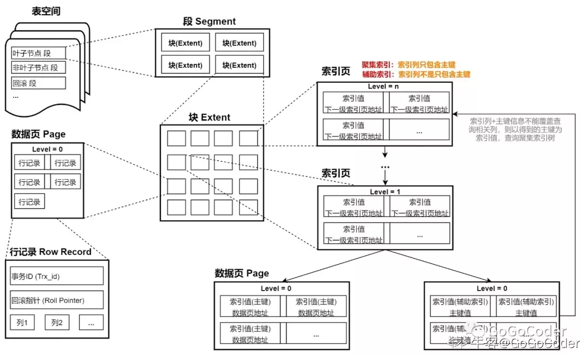

**结构说明：**

- **表空间：**InnoDB存储引擎的最高层，所有的数据都存放在表空间中。默认所有数据均存放在ibdata1共享表空间。如果启用了参数innodb_file_per_table,则每张表内的数据单独存放到一个表空间。

- **段：** 表空间由数据段组成，常见的段有数据段、索引段、回滚段等。InnoDB 对段的管理都是由引擎自身完成的，对DBA来说是透明的。因此，不需对其过多关心。

- **区：**区是由连续页组成的，且区大小一般固定为1MB。InnoDB存储引擎默认页大小为**16KB**，也即一个区为连续的64个页。由于压缩页的引入，页大小可以设置为2KB、4KB、8KB，但是区大小还是固定1MB，只是区内对应的页大小不同。

- **页：**页是InnoDB磁盘管理的最小单位。而且InnoDB存储引擎表是索引组织的，索引数据结构采用B+ 树，实际存储过程中，无论叶子节点还是非叶子节点都是对应磁盘中的一个页。（注：表如果没有设置主键索引，InnoDB会自动给表建立一个隐式主键，并为其添加聚集索引。）

  -  **叶子节点（Level=0）**

    - 聚集索引中存储**行记录所有列值**
    - 辅助索引中存储**索引列值**+**主键值**

  - 非叶子节点（Level>=1）

    - 聚集索引中存储主键值+(Level-1)索引所在页偏移地址
    - 辅助索引中存储索引列值+(Level-1)索引所在页偏移地址

  - Page Directory（页目录）：页中的Page Directory（页目录），存放了记录的相对位置，这些指向记录的指针称为Slot槽，槽倒序排列，同时一个槽中可能包含多条记录，所以这些槽构成稀疏目录。如下图，要在页内查询索引值为"c"的记录，首先在Page Directory 中进行[二分查找](https://blog.nowcoder.net/jump/super-jump/word?word=二分查找)定位c所在的粗略位置，然后在槽内进行顺序查找访问到索引值“c”的内容。
    注：页内还存在其他File Header、Page Header、Infimum、Supremum Records 等，详细请参考《MySql技术内幕》第二版4.4节

  - 

    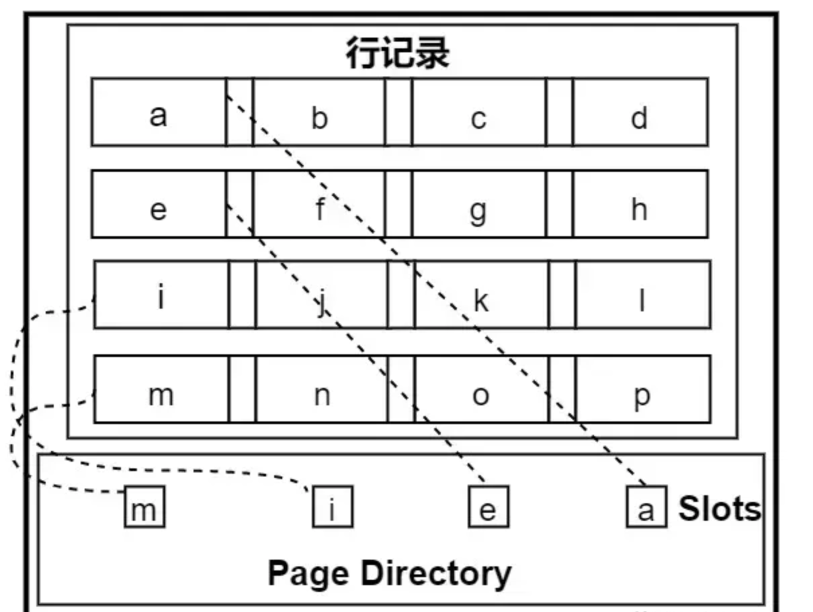

- **行：** InnoDB存储引擎是面向列的，数据是按照行进行存放的，除了用户插入的行记录相关列外，还会存放事务ID，回滚指针，这两个跟MVCC（多版本并发控制）相关联。

### 4.2 索引查询过程

**根据InnoDB逻辑存储结构图中右半侧可以出，带索引的查询请求，根据查询条件是否为单一主键区分为聚集索引查询和辅助索引查询，每个索引都有自己的索引ID，查询过程如下：**

1. 首先会获取索引ID，然后根据索引ID，遍历表空间中的索引页，先找到该索引Level最高的非叶子节点(页)
2. 在索引页中查询定位到下一级(Level-1)非叶子节点所在页地址，循环1,2步骤，最后到达Level=0的数据页。
3. 在Level=0的数据页中，聚集索引存储行记录的所有列值，选择查询语句相关的列返回结果即可。而辅助索引存储当前索引列值+主键值，如果存储的信息无法覆盖查询语句相关信息列，则需根据新得到的主键值，再通过聚集索引树重新查询。

**使用说明**：

  **1. 主键避免使用很长字段**：主键尽量避免使用很长字段。因为聚集索引中的非叶子节点主要为主键值，如果主键字段很大，节点(索引页)容纳主键个数会变少，增加树深，增加查询所需磁盘IO次数。  同样，也会使非聚簇索引的叶子节点数变多，间接增加辅助索引的树深，增加辅助索引查询的开销。

  **2、辅助索引列也尽量避免长字段**：原因同1。但是，如不可避免使用长字段，则可以根据最左前缀原则，在保证很好区分度的情况下，截取前n字节，建立索引。

  **3、注意索引区分度**：1、2均说明应当避免使用长字段，但是也不能盲目的缩小索引字段的长度，还要注意索引的区分度（0,1]，越趋近于1，该列做索引越有价值。如果区分度为0，查询退化为顺序查询，索引便成了累赘，而且还额外添加了查询索引表的过程，降低增删改的效率。 感兴趣可以了解InnoDB中的cardinality,代表区分度，但是该值并不是代表实时的区分度。

  **4、尽量减少回表次数（查完辅助索引，再查聚集索引）**：通过借助联合索引，增加索引列数，实现索引覆盖（索引列能够满足业务常用查询需求），进而尽量避免回表查询。

  **5、不要建立太多的索引**：增删改过程中也会更新索引表，因此，不必要的索引将会降低这些操作的执行时间，降低增删改的效率。

## 5. 主键、候选键、外键、内键

当设计数据库时，我们使用不同类型的键来定义数据表之间的关系、确保数据的完整性，并提高数据的检索效率。下面是常见的数据库键的介绍：

1. **主键（Primary Key）：**
   - 主键是用于唯一标识表中每一条记录的一列或一组列。主键的值在表中必须是唯一的，并且不能为 NULL。
   - 每张表只能有一个主键，主键可以是一个单独的列或多个列的组合。
   - 主键通常用于确保数据的唯一性和提高数据的检索效率。
2. **候选键（Candidate Key）：**
   - 候选键是能够唯一标识表中每一条记录的一列或一组列，与主键类似。但是，一张表可以有多个候选键，但最终只能选择一个作为主键。
   - 候选键的属性组合中的每一个属性都是必需的，并且能够唯一标识实体。
3. **外键（Foreign Key）：**
   - 外键是用来建立表之间关联关系的键，它指向另一张表的主键或唯一键。
   - 外键在一个表中创建时，指定了一个列或列组合，该列或列组合的值必须是另一张表的主键或唯一键的值，用来确保数据的引用完整性。
   - 外键用于实现表之间的关联、约束和引用，通常用于表示实体之间的关系。
4. **唯一键（Unique Key）：**
   - 唯一键是确保表中数据唯一性的键，与主键类似，但是允许存在 NULL 值。
   - 与主键不同的是，一张表可以有多个唯一键，而且唯一键可以包含 NULL 值。
5. **复合键（Composite Key）：**
   - 复合键是由多个列组成的键，用于唯一标识表中的每一条记录。复合键的组合值必须是唯一的。
   - 与主键类似，复合键也可以用于唯一标识记录，但是它可以包含多个列。
6. **超键**
   - 是数据库中的一个概念，它是一个能够唯一标识关系模式（表）中的元组（行）的属性集合。超键是一种广义的概念，包括了候选键、主键以及其他能够唯一标识元组的属性集合。

这些键在设计数据库时非常重要，可以确保数据的完整性和一致性，以及实现表之间的关联和约束。选择合适的键类型取决于具体的业务需求和设计目标。

## 6. 索引的底层实现原理和优化

B+树，经过优化的B+树

主要是在所有的叶子结点中增加了指向下一个叶子节点的指针，因此InnoDB建议为大部分表使用默认自增的主键作为主索引。

## 7. 索引建立原则


## 8. 索引区分度

索引区分度是指索引列上不同值的数量与表中总行数的比率。它衡量了索引的唯一性程度，也反映了索引在过滤数据时的效果。

- 高区分度的索引意味着索引列上的不同值较多，相对来说，每个索引值对应的数据行较少。这样的索引通常更具有选择性，能够更有效地过滤出满足查询条件的数据。高区分度的索引在提高查询性能和降低IO开销方面具有优势。
- 低区分度的索引则相反，索引列上的不同值较少，每个索引值对应的数据行较多。这种情况下，索引失去了很多过滤数据的效果，可能导致数据库引擎选择不使用索引，而是全表扫描，性能较差。

在选择创建索引时，考虑索引区分度是很重要的。一般来说，对于高区分度的列（如性别、状态等），创建索引是有益的；而对于低区分度的列（如是否启用、删除标志等），可能需要谨慎考虑是否创建索引。

可以通过以下公式计算索引的区分度：
$$
\text { 区分度 }=\frac{\text { 不同值的数量 }}{\text { 表中总行数 }}
$$
高区分度通常对查询性能有积极影响，但也需要考虑索引的维护成本和存储开销。

## 9. 全文索引

> https://zhuanlan.zhihu.com/p/35675553

全文索引是一种用于快速搜索文本数据的技术，其原理如下：

1. **分词（Tokenization）**：
   - 首先，文本数据需要被分词，即将文本按照一定的规则切分成一个个词语或者单词。这个过程通常称为分词或者词法分析。

2. **建立倒排索引（Inverted Index）**：
   - 建立一个倒排索引，也称为反向索引，它记录了每个词语（单词）在哪些文档中出现过。具体来说，对于每个词语，记录包含这个词语的文档列表或者位置信息。
   - 倒排索引可以加速根据关键词查找对应文档的过程，因为它允许根据词语快速定位到包含这个词语的文档。

3. **搜索处理（Search Processing）**：
   - 当用户发起搜索请求时，首先对搜索关键词进行分词处理，然后根据分词结果去倒排索引中查找相应的文档列表。
   - 对于每个搜索关键词，系统会找到包含这个关键词的文档列表，并将这些文档列表进行交集或并集操作，得到最终的搜索结果。

4. **评分和排序（Scoring and Ranking）**：
   - 对于搜索结果，系统可能会对每个文档进行评分，以确定其与搜索关键词的相关性。评分通常基于词语的权重、词语在文档中的位置等因素。
   - 最后，系统可能会根据评分对搜索结果进行排序，将相关性更高的文档排在前面展示给用户。

总的来说，全文索引利用了分词技术和倒排索引结构，通过将文本数据转换成易于搜索和处理的结构，实现了快速高效的文本搜索功能。

---

**创建表时创建全文索引**

```sql
解释create table fulltext_test (
    id int(11) NOT NULL AUTO_INCREMENT,
    content text NOT NULL,
    tag varchar(255),
    PRIMARY KEY (id),
    FULLTEXT KEY content_tag_fulltext(content,tag)  // 创建联合全文索引列
) ENGINE=MyISAM DEFAULT CHARSET=utf8;
```

**使用全文索引**

和常用的模糊匹配使用 like + % 不同，全文索引有自己的语法格式，使用 match 和 against 关键字，比如

```sql
select * from fulltext_test 
    where match(content,tag) against('xxx xxx');
```

**注意：** match() 函数中指定的列必须和全文索引中指定的列完全相同，否则就会报错，无法使用全文索引，这是因为全文索引不会记录关键字来自哪一列。如果想要对某一列使用全文索引，请单独为该列创建全文索引。


**最小搜索长度和最大搜索长度**

MySQL 中的全文索引，有两个变量，最小搜索长度和最大搜索长度，对于长度小于最小搜索长度和大于最大搜索长度的词语，都不会被索引。通俗点就是说，想对一个词语使用全文索引搜索，那么这个词语的长度必须在以上两个变量的区间内。

这两个的默认值可以使用以下命令查看

```sql
show variables like '%ft%';
```

可以看到这两个变量在 MyISAM 和 InnoDB 两种存储引擎下的变量名和默认值

```sql
解释// MyISAM
ft_min_word_len = 4;
ft_max_word_len = 84;

// InnoDB
innodb_ft_min_token_size = 3;
innodb_ft_max_token_size = 84;
```

可以看到最小搜索长度 MyISAM 引擎下默认是 4，InnoDB 引擎下是 3，也即，MySQL 的全文索引只会对长度大于等于 4 或者 3 的词语建立索引，而刚刚搜索的只有 *aaaa* 的长度大于等于 4。


**两种全文索引**

- 自然语言的全文索引

  - 默认情况下，或者使用 in natural language mode 修饰符时，match() 函数对文本集合执行自然语言搜索，上面的例子都是自然语言的全文索引。
  - 自然语言搜索引擎将计算每一个文档对象和查询的相关度。这里，相关度是基于匹配的关键词的个数，以及关键词在文档中出现的次数。在整个索引中出现次数越少的词语，匹配时的相关度就越高。相反，非常常见的单词将不会被搜索，如果一个词语的在超过 50% 的记录中都出现了，那么自然语言的搜索将不会搜索这类词语。上面提到的，测试表中必须有 4 条以上的记录，就是这个原因。
  - 这个机制也比较好理解，比如说，一个数据表存储的是一篇篇的文章，文章中的常见词、语气词等等，出现的肯定比较多，搜索这些词语就没什么意义了，需要搜索的是那些文章中有特殊意义的词，这样才能把文章区分开。

- 布尔全文索引

  - 在布尔搜索中，我们可以在查询中自定义某个被搜索的词语的相关性，当编写一个布尔搜索查询时，可以通过一些前缀修饰符来定制搜索。

  - MySQL 内置的修饰符，上面查询最小搜索长度时，搜索结果 ft_boolean*_*syntax 变量的值就是内置的修饰符，下面简单解释几个，更多修饰符的作用可以查手册

    - **+** 必须包含该词

    - **-** 必须不包含该词

    - **>** 提高该词的相关性，查询的结果靠前

    - **<** 降低该词的相关性，查询的结果靠后

    - **(\*)星号** 通配符，只能接在词后面

对于上面最小搜索长度提到的问题，可以使用布尔全文索引查询来解决

```sql
select * test where match(content) against('a*' in boolean mode);
```

## 10. Hash索引和B+树索引

索引的数据结构和具体存储引擎的实现有关，MySQL主要有两种结构：Hash索引和B+ Tree索引，我们使用的是InnoDB引擎，默认的是B+树。

**面试官：**为什么采用B+树呢，和Hash索引比较如何?

- Hash索引：Hash索引底层是哈希表，哈希表是以一种Key-Value存储数据的结构，所以多个数据在存储关系上是没有顺序的，也就没办法进行范围查询，必须要全表扫描。哈希索引只适用于等值查询的场景。
- B+树索引：B+树更适合外部存储。由于内结点不存放真正的数据(只是存放其子树的最大或最小的关键字，作为索引)，一个结点可以存储更多的关键字，每个结点能索引的范围更大更精确，也意味着B+树单次磁盘IO的信息量大于B树，I/O的次数相对减少。B+树也是更容易进行区间访问的，因为叶子节点维护了一个链表。

## 11. 联合索引

为什么建立联合索引?(区分度大的索引放在前面)

- 在一些场合使用联合索引是比较好的效果，比如我们可以建立一个(学校-班级-ID)的联合索引，这样会比建立三个索引效果好，但是如果我们只使用其中一个索引ID不会走联合索引，会导致全表扫描，所以要分业务情况。使用联合索引时需要注意顺序，尽量把区分度大的索引放在前面。

- 在联合索引使用中，如果想要命中索引需要按照建立索引时的字段顺序挨个使用，否则无法命中索引。联合索引中有个最左匹配原则，当我们建立联合索引(A，B，C)，实际上已经建立了(A)、(A，B)、(A，B，C)三个联合索引。比如我们上面说的(学校-班级-ID)联合索引，b+树是按照从左到右的顺序来建立搜索树的，b+树优先比较学校来确定下一步的搜索方向，如果还未达到条件则继续执行搜索。如果只有学校字段，班级字段缺失，只能找到这个学校的所有字段，然后再匹配相应ID的学生，此种情况无法用到联合索引。

---

联合索引（Composite Index）是指在数据库表中针对多个列创建的索引。它通过将多个列组合在一起建立索引，以提高查询效率。联合索引的创建可以使得在涉及到索引列的查询中加快数据检索速度，特别是对于涉及到联合索引中的多个列的查询条件的查询。

联合索引的创建语法与普通索引类似，只是需要在创建索引时指定多个列，例如：

```sql
CREATE INDEX index_name ON table_name (column1, column2, ...);
```

联合索引可以带来以下优点：

1. **加快数据检索速度**：联合索引可以加快根据多个列进行检索的速度，尤其是对于涉及到联合索引中的多个列的查询条件的查询。

2. **节约索引空间**：相对于创建多个单列索引，使用联合索引可以节约索引空间，减少存储消耗。

3. **减少索引维护开销**：维护一个联合索引比维护多个单列索引要更加高效。

但是，联合索引也有一些需要注意的地方：

1. **查询顺序要匹配**：查询时必须按照索引中列的顺序进行查询，否则索引无法发挥作用。

2. **更新代价较高**：当更新联合索引中的列时，会导致索引的更新代价较高，因为需要同时更新多个列的索引。

3. **选择合适的列顺序**：在创建联合索引时，需要根据实际查询情况选择合适的列顺序，以确保索引能够被有效利用。

# 二、保障机制

## 1. Undo Log & Redo Log

MySQL的Undo Log（回滚日志）和Redo Log（重做日志）是两种日志，它们在数据库管理系统中扮演着不同的角色，用于确保事务的原子性、一致性、隔离性和持久性（ACID属性）。

1. **Undo Log（回滚日志）**：
   - Undo Log是MySQL中用于实现事务的回滚操作的日志。每个事务开始时，系统都会为它分配一块Undo Log，用于记录该事务所做的更改。
   - 当事务执行过程中出现错误，或者用户执行了ROLLBACK语句，系统可以使用Undo Log来将数据恢复到事务开始前的状态。
   - MySQL的InnoDB存储引擎中，Undo Log通常以"undo tablespace"的形式存储在磁盘上。

2. **Redo Log（重做日志）**：
   - Redo Log是MySQL中用于保证事务的持久性的日志。它记录了每个事务所做的修改，包括对数据页的修改等。
   - Redo Log的主要作用是在数据库崩溃后，用于恢复数据的一致性。通过重放Redo Log中的操作，MySQL可以将数据还原到最后一次提交的状态，确保数据不会丢失。
   - Redo Log通常存储在内存中，但也会定期刷入磁盘以确保持久性。

如何使用这些日志：
- 通常，数据库管理员无需直接操作Undo Log和Redo Log，MySQL内部会自动处理它们。你只需要编写SQL事务，MySQL会自动记录相应的日志。
- 如果需要执行回滚操作，可以使用`ROLLBACK`语句。MySQL会自动查找相应的Undo Log来执行回滚。
- 对于Redo Log，它通常无需手动操作，因为它主要用于数据库恢复。你只需确保数据库的持久性配置正确。

总之，Undo Log和Redo Log是MySQL内部的机制，用于确保事务的一致性和持久性。数据库管理员和应用程序开发者通常不需要直接操作这些日志，而是通过编写SQL事务来与数据库交互。

---

在InnoDB中有个redo 日志是用来保证 MySQL 持久化功能的。MySql的操作是要写入到日志中 ，并不会直接刷新到硬盘上进行持久化。如果我们每一次的操作都要写入到硬盘中再更新，整个过程IO成本、查找成本都很高。

日志即起到一个中间转折的作用，当有一条记录需要更新的时候，InnoDB 引擎就会先把记录写到 redo log(粉板)里面，并更新内存，这个时候更新就算完成了。同时，InnoDB 引擎会在适当的时候，将这个操作记录更新到磁盘里面，而这个更新往往是在系统比较空闲的时候做。

## 2. Transaction事务

数据库的事务机制是数据库管理系统（DBMS）确保数据库操作的一致性和可靠性的重要机制之一。事务是一组数据库操作（如插入、更新、删除等），它们作为一个不可分割的单位被执行，要么全部成功执行，要么全部失败回滚，从而保证了数据库的完整性和一致性。以下是数据库事务机制的主要特点和关键概念：

1. **ACID 特性：**
   - **原子性（Atomicity）：** 事务是一个不可分割的操作单元，要么全部执行成功（提交），要么全部失败（回滚），保证了数据库的一致性。
   - **一致性（Consistency）：** 事务执行前后数据库的状态必须是一致的，即满足数据库的约束和规则，确保数据的完整性和有效性。
   - **隔离性（Isolation）：** 多个事务并发执行时，各自的操作相互隔离，不会相互影响，防止了并发事务导致的数据不一致问题。
   - **持久性（Durability）：** 一旦事务提交成功，其对数据库的修改将永久保存在数据库中，即使系统崩溃也不会丢失。

2. **事务的基本操作：**
   - **开始事务（BEGIN 或 START TRANSACTION）：** 明确指示事务的开始。
   - **提交事务（COMMIT）：** 提交事务并将其改变永久保存到数据库中。
   - **回滚事务（ROLLBACK）：** 放弃事务中的所有更改，并将数据库恢复到事务开始之前的状态。

3. **并发控制：**
   - 并发事务可能导致多个事务同时访问和修改相同的数据，可能产生读取脏数据、丢失更新、不可重复读等问题。数据库采用并发控制机制来解决这些问题，包括锁机制、多版本并发控制（MVCC）等。

4. **事务的隔离级别：**
   - 数据库提供了不同的事务隔离级别，如读未提交、读已提交、可重复读和串行化等级别，用于控制事务之间的隔离程度和并发度。

通过事务机制，数据库管理系统可以确保数据的一致性和完整性，有效地处理并发操作，从而保证了数据库操作的可靠性和稳定性。

---

需要注意的是，begin 命令并不代表事务的开始，事务开始于 begin 命令之后的第一条语句执行的时候。例如下面示例中，select * from xxx 才是事务的开始，

```mysql
begin;
select * from xxx; 
commit; -- 或者 rollback;
```

另外，通过以下语句可以查询当前有多少事务正在运行。

```mysql
select * from information_schema.innodb_trx;
```

## 3. 事务隔离级别

> https://zhuanlan.zhihu.com/p/117476959

**隔离级别要解决的问题如下：**

- **脏读**
  - 脏读指的是读到了其他事务未提交的数据，未提交意味着这些数据可能会回滚，也就是可能最终不会存到数据库中，也就是不存在的数据。读到了并一定最终存在的数据，这就是脏读。

- **不可重复读**
  - 对比可重复读，不可重复读指的是在同一事务内，不同的时刻读到的同一批数据可能是不一样的，可能会受到其他事务的影响，比如其他事务改了这批数据并提交了。通常针对数据**更新（UPDATE）**操作。
- **幻读**
  - 幻读是针对数据**插入（INSERT）**操作来说的。假设事务A对某些行的内容作了更改，但是还未提交，此时事务B插入了与事务A更改前的记录相同的记录行，并且在事务A提交之前先提交了，而这时，在事务A中查询，会发现好像刚刚的更改对于某些数据未起作用，但其实是事务B刚插入进来的，让用户感觉很魔幻，感觉出现了幻觉，这就叫幻读。

**隔离级别对应的解决问题：**

| 隔离级别 | 脏读   | 不可重复读 | 幻读   |
| :------- | :----- | :--------- | :----- |
| 读未提交 | 可能   | 可能       | 可能   |
| 读提交   | 不可能 | 可能       | 可能   |
| 可重复读 | 不可能 | 不可能     | 可能   |
| 串行化   | 不可能 | 不可能     | 不可能 |

**隔离级别的使用代码：**

1. **读未提交（Read Uncommitted）：**
   - 隔离级别最低，允许脏读。
   - 代码示例：
     ```sql
     SET SESSION TRANSACTION ISOLATION LEVEL READ UNCOMMITTED;
     START TRANSACTION;
     -- 执行事务操作
     COMMIT;
     ```

2. **读已提交（Read Committed）：**
   - 允许读取已提交的数据，避免了脏读。
   - 代码示例：
     ```sql
     SET SESSION TRANSACTION ISOLATION LEVEL READ COMMITTED;
     START TRANSACTION;
     -- 执行事务操作
     COMMIT;
     ```

3. **可重复读（Repeatable Read）：**
   - 保证在同一个事务中多次读取同一数据时结果保持一致，避免了不可重复读。
   - 代码示例：
     ```sql
     SET SESSION TRANSACTION ISOLATION LEVEL REPEATABLE READ;
     START TRANSACTION;
     -- 执行事务操作
     COMMIT;
     ```

4. **串行化（Serializable）：**
   - 最高的隔离级别，事务之间完全隔离，每个事务按顺序执行。
   - 代码示例：
     ```sql
     SET SESSION TRANSACTION ISOLATION LEVEL SERIALIZABLE;
     START TRANSACTION;
     -- 执行事务操作
     COMMIT;
     ```

在代码示例中，首先使用 `SET SESSION TRANSACTION ISOLATION LEVEL` 设置事务隔离级别，然后使用 `START TRANSACTION` 开始事务，在事务中执行相应的操作，最后使用 `COMMIT` 提交事务。

---

我们可以通过以下语句查看当前数据库的隔离级别，通过下面语句可以看出我使用的 MySQL 的隔离级别是 REPEATABLE-READ，也就是可重复读，这也是 MySQL 的默认级别。

```mysql
# 查看事务隔离级别 5.7.20 之后
show variables like 'transaction_isolation';
SELECT @@transaction_isolation

# 5.7.20 之后
SELECT @@tx_isolation
show variables like 'tx_isolation'

+---------------+-----------------+
| Variable_name | Value           |
+---------------+-----------------+
| tx_isolation  | REPEATABLE-READ |
+---------------+-----------------+
```

稍后，我们要修改数据库的隔离级别，所以先了解一下具体的修改方式。

修改隔离级别的语句是：set [作用域] transaction isolation level [事务隔离级别]，
SET [SESSION | GLOBAL] TRANSACTION ISOLATION LEVEL {READ UNCOMMITTED | READ COMMITTED | REPEATABLE READ | SERIALIZABLE}。

其中作用于可以是 SESSION 或者 GLOBAL，GLOBAL 是全局的，而 SESSION 只针对当前回话窗口。隔离级别是 {READ UNCOMMITTED | READ COMMITTED | REPEATABLE READ | SERIALIZABLE} 这四种，不区分大小写。


## 4. MVCC


## 5. 快照隔离


## 6. 完整性约束包括哪些

完整性约束是数据库中用于确保数据的完整性和一致性的规则。主要的完整性约束包括以下几种：

1. **实体完整性约束（Entity Integrity Constraint）：**
   - 实体完整性约束用于确保每个表中的每一行都具有一个唯一的标识，通常是通过主键来实现的。
   - 主键约束要求主键列中的值是唯一的，并且不能为 NULL。

2. **参照完整性约束（Referential Integrity Constraint）：**
   - 参照完整性约束用于确保两个表之间的关系的一致性。
   - 外键约束是实现参照完整性的主要方式，它确保了在一个表中的外键值必须在另一个表的主键或唯一键中存在，或者为 NULL。

3. **域完整性约束（Domain Integrity Constraint）：**
   - 域完整性约束用于确保表中的某些列或属性满足特定的条件或约束。
   - 例如，可以使用 CHECK 约束来限制某列中的值必须满足特定的条件，如范围、格式或枚举值等。

4. **用户定义的完整性约束（User-defined Integrity Constraint）：**
   - 用户可以定义自己的完整性约束，以确保数据库中的数据满足特定的业务规则或要求。
   - 这些约束可以通过触发器（Triggers）或存储过程（Stored Procedures）来实现。

通过这些完整性约束，可以确保数据库中的数据完整性和一致性，防止不符合规则的数据被插入或更新到数据库中。与表有关的约束：包括列约束(NOT NULL（非空约束）)和表约束(PRIMARY KEY、foreign key、check、UNIQUE) 。

## 7. 什么是锁

> 数据库是一个多用户使用的共享资源。当多个用户并发地存取数据时，在数据库中就会产生多个事务同时存取同一数据的情况。若对并发操作不加控制就可能会读取和存储不正确的数据，破坏数据库的一致性。加锁是实现数据库并发控制的一个非常重要的技术。当事务在对某个数据对象进行操作前，先向系统发出请求，对其加锁。加锁后事务就对该数据对象有了一定的控制，在该事务释放锁之前，其他的事务不能对此数据对象进行更新操作。基本锁类型：锁包括行级锁和表级锁

在数据库中，锁是用于控制对数据库资源（如表、行、页等）并发访问的机制。它可以防止多个并发事务同时对同一资源进行修改，从而确保数据的一致性和完整性。锁可以分为不同的类型，主要包括以下几种：

1. **共享锁（Shared Lock）：**
   - 共享锁允许多个事务同时读取一个资源，但不允许有任何事务修改它。
   - 典型应用场景是读取操作，多个读取操作可以同时进行，但写操作会阻塞其他事务的读写操作。

2. **排他锁（Exclusive Lock）：**
   - 排他锁只允许一个事务独占一个资源，其他事务既不能读取也不能修改该资源。
   - 典型应用场景是写操作，当一个事务对资源进行修改时，会独占资源并阻塞其他事务的读写操作。

3. **行级锁（Row-Level Lock）：**
   - 行级锁是对表中的单行数据进行锁定，只影响指定行的访问操作。
   - 行级锁可以防止多个事务同时修改同一行数据，提高了并发性能。

4. **表级锁（Table-Level Lock）：**
   - 表级锁是对整个表进行锁定，会影响整个表的访问操作。
   - 表级锁通常用于对整个表进行读写操作时，会阻塞其他事务对该表的访问。

5. **页级锁（Page-Level Lock）：**
   - 页级锁是对表中的一页数据进行锁定，介于行级锁和表级锁之间。
   - 页级锁通常用于对大规模数据的批量处理操作，可以提高并发性能。

通过使用不同类型的锁，数据库管理系统可以灵活控制并发访问，确保数据的一致性和完整性，同时提高数据库的并发性能。

## 8. 视图

> https://worktile.com/kb/p/25554

**视图（View）：** 视图是一个虚拟的表，它不存储实际的数据，而是根据一个或多个基本表的查询结果动态生成的结果集。视图可以将数据库中的数据以不同的视角呈现给用户，用户可以像查询基本表一样查询视图，但实际上操作的是视图所对应的查询结果。视图可以用来简化复杂的查询、隐藏底层数据结构、提供安全性等。


视图和基本表在某些方面的消耗是相似的，但在其他方面可能会有所不同。

**共同点：**
1. **存储空间消耗：** 视图本身不存储数据，它只是对基本表的查询结果进行了封装。因此，从存储空间的角度来看，视图不会占用额外的存储空间，与基本表相比，它们的存储空间消耗是一样的。
2. **查询性能：** 在执行查询操作时，视图的查询性能可能会受到基本表的影响，因为视图的查询结果是基于基本表的数据计算得到的。如果视图的查询涉及到复杂的计算或大量的数据，那么查询性能可能会受到影响。

**不同点：**
1. **更新性能：** 当对视图进行更新操作时，实际上是对基本表进行的操作，因此更新性能受到基本表的影响。如果视图涉及多个基本表，更新操作可能涉及到多个表的更新，导致性能下降。
2. **维护成本：** 视图的维护成本通常较低，因为视图可以简化复杂的查询，提高代码的可读性和维护性。但是，如果视图的定义发生变化或者基本表的结构发生变化，需要相应地更新视图的定义，这可能会增加维护成本。
3. **权限管理：** 视图可以用来限制用户对数据库的访问权限，通过授予或者撤销对视图的访问权限，可以控制用户对底层数据的访问范围。相比之下，基本表的权限管理可能会更加复杂，因为需要考虑到对表中每一列的权限管理。

综上所述，虽然视图和基本表在某些方面的消耗是相似的，但在更新性能、维护成本和权限管理等方面可能会有所不同。选择使用视图还是基本表应该根据具体的业务需求和性能要求来决定。

## 9. 乐观锁和悲观锁

- 悲观锁：即对于数据的处理持悲观态度，总认为会发生并发冲突，获取和修改数据时，别人会修改数据。所以在整个数据处理过程中，需要将数据锁定。悲观锁的实现，通常依靠数据库提供的锁机制实现，比如mysql的排他锁，select .... for update来实现悲观锁。
- 乐观锁：顾名思义，就是对数据的处理持乐观态度，乐观的认为数据一般情况下不会发生冲突，只有提交数据更新时，才会对数据是否冲突进行检测。如果发现冲突了，则返回错误信息给用户，让用户自已决定如何操作。乐观锁的实现不依靠数据库提供的锁机制，需要我们自已实现，实现方式一般是记录数据版本，一种是通过版本号，一种是通过时间戳。

> 给表加一个版本号或时间戳的字段，读取数据时，将版本号一同读出，数据更新时，将版本号加1。当我们提交数据更新时，判断当前的版本号与第一次读取出来的版本号是否相等。如果相等，则予以更新，否则认为数据过期，拒绝更新，让用户重新操作。


## 10. 可重复读和读已提交原理

为了解决不可重复读，或者为了实现可重复读，MySQL 采用了 MVVC (多版本并发控制) 的方式。

我们在数据库表中看到的一行记录可能实际上有多个版本，每个版本的记录除了有数据本身外，还要有一个表示版本的字段，记为 row trx_id，而这个字段就是使其产生的事务的 id，事务 ID 记为 transaction id，它在事务开始的时候向事务系统申请，按时间先后顺序递增。

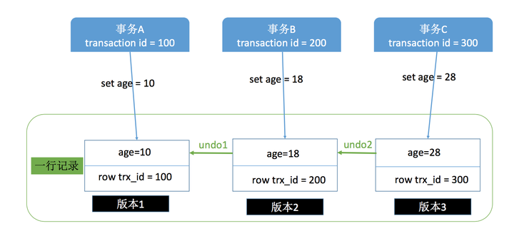

按照上面这张图理解，一行记录现在有 3 个版本，每一个版本都记录这使其产生的事务 ID，比如事务A的transaction id 是100，那么版本1的row trx_id 就是 100，同理版本2和版本3。

在上面介绍读提交和可重复读的时候都提到了一个词，叫做快照，学名叫做一致性视图，这也是可重复读和不可重复读的关键，可重复读是在事务开始的时候生成一个当前事务全局性的快照，而读提交则是每次执行语句的时候都重新生成一次快照。

对于一个快照来说，它能够读到那些版本数据，要遵循以下规则：

1. 当前事务内的更新，可以读到；
2. 版本未提交，不能读到；
3. 版本已提交，但是却在快照创建后提交的，不能读到；
4. 版本已提交，且是在快照创建前提交的，可以读到；

利用上面的规则，再返回去套用到读提交和可重复读的那两张图上就很清晰了。还是要强调，两者主要的区别就是在快照的创建上，可重复读仅在事务开始是创建一次，而读提交每次执行语句的时候都要重新创建一次。


## 11. **并发写问题**

存在这的情况，两个事务，对同一条数据做修改。最后结果应该是哪个事务的结果呢，肯定要是时间靠后的那个对不对。并且更新之前要先读数据，这里所说的读和上面说到的读不一样，更新之前的读叫做“当前读”，总是当前版本的数据，也就是多版本中最新一次提交的那版。

假设事务A执行 update 操作， update 的时候要对所修改的行加行锁，这个行锁会在提交之后才释放。而在事务A提交之前，事务B也想 update 这行数据，于是申请行锁，但是由于已经被事务A占有，事务B是申请不到的，此时，事务B就会一直处于等待状态，直到事务A提交，事务B才能继续执行，如果事务A的时间太长，那么事务B很有可能出现超时异常。如下图所示。

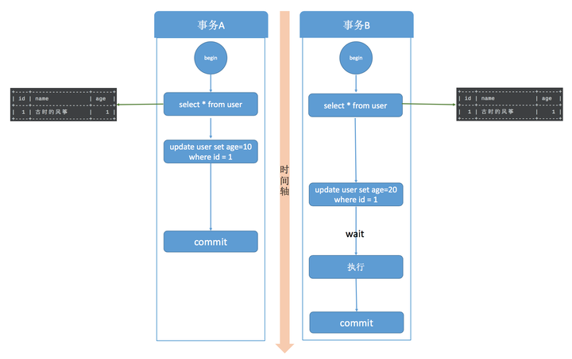

加锁的过程要分有索引和无索引两种情况，比如下面这条语句

```mysql
update user set age=11 where id = 1
```

id 是这张表的主键，是有索引的情况，那么 MySQL 直接就在索引数中找到了这行数据，然后干净利落的加上行锁就可以了。

而下面这条语句

```mysql
update user set age=11 where age=10
```

表中并没有为 age 字段设置索引，所以， MySQL 无法直接定位到这行数据。那怎么办呢，当然也不是加表锁了。MySQL 会为这张表中所有行加行锁，没错，是所有行。但是呢，在加上行锁后，MySQL 会进行一遍过滤，发现不满足的行就释放锁，最终只留下符合条件的行。虽然最终只为符合条件的行加了锁，但是这一锁一释放的过程对性能也是影响极大的。所以，如果是大表的话，建议合理设计索引，如果真的出现这种情况，那很难保证并发度。

## 13. 解决幻读

上面介绍可重复读的时候，那张图里标示着出现幻读的地方实际上在 MySQL 中并不会出现，MySQL 已经在可重复读隔离级别下解决了幻读的问题。

前面刚说了并发写问题的解决方式就是行锁，而解决幻读用的也是锁，叫做间隙锁，MySQL 把行锁和间隙锁合并在一起，解决了并发写和幻读的问题，这个锁叫做 Next-Key锁。

假设现在表中有两条记录，并且 age 字段已经添加了索引，两条记录 age 的值分别为 10 和 30。

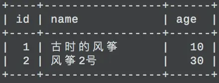

此时，在数据库中会为索引维护一套B+树，用来快速定位行记录。B+索引树是有序的，所以会把这张表的索引分割成几个区间。

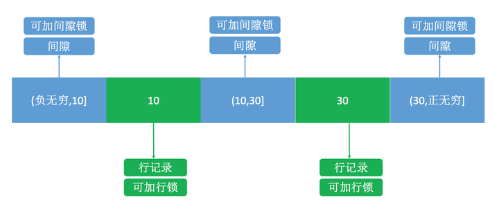

如图所示，分成了3 个区间，(负无穷,10]、(10,30]、(30,正无穷]，在这3个区间是可以加间隙锁的。

之后，我用下面的两个事务演示一下加锁过程。

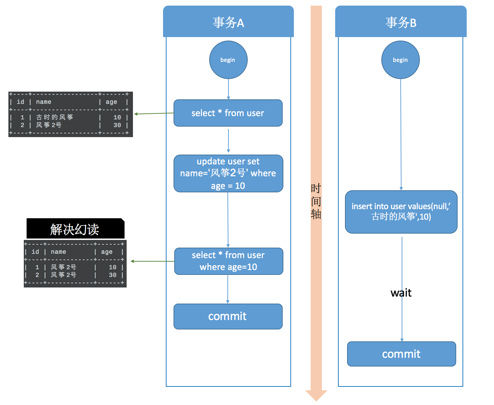

在事务A提交之前，事务B的插入操作只能等待，这就是间隙锁起得作用。当事务A执行`update user set name='风筝2号’ where age = 10;` 的时候，由于条件 where age = 10 ，数据库不仅在 age =10 的行上添加了行锁，而且在这条记录的两边，也就是(负无穷,10]、(10,30]这两个区间加了间隙锁，从而导致事务B插入操作无法完成，只能等待事务A提交。不仅插入 age = 10 的记录需要等待事务A提交，age<10、10<age<30 的记录页无法完成，而大于等于30的记录则不受影响，这足以解决幻读问题了。

这是有索引的情况，如果 age 不是索引列，那么数据库会为整个表加上间隙锁。所以，如果是没有索引的话，不管 age 是否大于等于30，都要等待事务A提交才可以成功插入。

# 三、标准

## 1. 非标准字符串类型

> TINYTEXT
> TEXT
> MEDIUMTEXT
> LONGTEXT

非标准字符串类型指的是一些在 SQL 标准中未明确定义或未广泛支持的字符串类型。这些类型可能在特定的数据库系统中有特定的实现或扩展。一些常见的非标准字符串类型包括：

1. **JSON 类型：** JSON（JavaScript Object Notation）是一种轻量级的数据交换格式，用于存储和表示结构化数据。一些数据库系统提供了特定的 JSON 类型或 JSON 相关的函数和操作，用于存储和处理 JSON 数据。

2. **UUID 类型：** UUID（Universally Unique Identifier）是一种唯一标识符，通常用于在分布式系统中唯一标识实体或对象。一些数据库系统提供了特定的 UUID 类型或 UUID 相关的函数和操作，用于生成和存储 UUID。

3. **IP 地址类型：** 一些数据库系统提供了特定的 IP 地址类型或 IP 相关的函数和操作，用于存储和处理 IP 地址。

4. **非固定长度字符串类型：** 除了标准的 VARCHAR 类型之外，一些数据库系统可能提供了非固定长度的字符串类型，如 TEXT 类型。这些类型通常用于存储大量的文本数据，但其行为和性能可能会与标准的字符串类型有所不同。

这些非标准字符串类型通常是特定数据库系统的扩展或功能，使用它们可以为特定的应用场景提供更好的支持和性能。但需要注意的是，它们可能会导致应用程序在不同数据库系统之间的不可移植性。

# 四、优化

## 1. 实践中如何优化MySQL

> 详细可以查看 阿里P8架构师谈：MySQL慢查询优化、索引优化、以及表等优化总结

1. SQL语句及索引的优化

2. 数据库表结构的优化

3. 系统配置的优化

4. 硬件的优化

## 2. SQL语句优化

1. Where子句中：where表之间的连接必须写在其他Where条件之前，那些可以过滤掉最大数量记录的条件必须写在Where子句的末尾.HAVING最后。

2. 用EXISTS替代IN、用NOT EXISTS替代NOT IN。

3. 避免在索引列上使用计算

4. 避免在索引列上使用IS NULL和IS NOT NULL

5. 对查询进行优化，应尽量避免全表扫描，首先应考虑在 where 及 order by 涉及的列上建立索引。

6. 应尽量避免在 where 子句中对字段进行 null 值判断，否则将导致引擎放弃使用索引而进行全表扫描

7. 应尽量避免在 where 子句中对字段进行表达式操作，这将导致引擎放弃使用索引而进行全表扫描

## 3. 索引优化

索引优化是数据库性能优化的关键之一，以下是关于索引优化的一些常见说法和补充内容：

1. 对于含有NULL值的列，索引的效率会受到影响，因此最好不要在含有NULL值的列上设置索引。对于复合索引，如果其中有列含有NULL值，该索引在使用时也不会生效。

2. 尽量使用短索引，可以通过指定前缀长度来减少索引占用的空间和提高查询效率。这对于文本类型的列尤其重要。

3. 经常在WHERE子句中使用的列应该设置索引，这样可以加快查找速度。特别是针对经常用于过滤数据的列，如日期、状态等。

4. 对于涉及多个列的WHERE或ORDER BY子句，应该建立复合索引，以覆盖所有涉及的列，从而提高查询效率。

5. LIKE语句中以%或者'-'开头的模式不会使用索引，而以%结尾的模式会使用索引。因此，在设计索引时要考虑到查询模式的特点。

6. 尽量避免在列上进行运算、函数操作和表达式操作，因为这样会使索引失效，降低查询效率。

7. 避免使用NOT IN和<>等操作符，因为这些操作符在处理大数据量时效率较低，可以考虑使用其他方式替代，如使用LEFT JOIN和IS NULL进行优化。

---

尽量避免在SQL查询中使用`NOT IN`和`<>`（不等于）等操作符，因为这些操作符在处理大数据量时可能会导致性能下降。具体来说，这些操作符会导致数据库引擎执行全表扫描或者全索引扫描，而这种扫描操作会消耗大量的系统资源和时间。举例来说，假设有一个表格包含大量的数据，而我们需要查询出不在某个特定范围内的数据，比如排除某些ID值的记录。如果我们使用`NOT IN`操作符来进行查询，数据库引擎可能会执行一个全表扫描，遍历整个表格来找到不在特定范围内的记录，这样的查询效率会很低。同样地，使用`<>`（不等于）操作符也会导致类似的问题，因为它也需要进行全表扫描或全索引扫描来找到不等于特定值的记录。为了避免这种性能下降，可以考虑使用其他查询方式替代，比如使用`LEFT JOIN`或者`IS NULL`来优化查询。这些替代方法通常能够更有效地利用索引或者执行更高效的查询计划，从而提高查询效率。因此，在设计SQL查询时，尽量避免使用`NOT IN`和`<>`操作符，而是考虑使用其他查询方式来达到相同的目的，并且更好地利用索引和查询计划。

## 4. 数据库表结构优化

- 表的字段尽可能用NOT NULL
- 字段长度固定的表查询会更快
- 把数据库的大表按时间或一些标志分成小表
- 将表拆分

数据表拆分：主要就是垂直拆分和水平拆分。

水平切分:将记录散列到不同的表中，各表的结构完全相同，每次从分表中查询, 提高效率。

垂直切分:将表中大字段单独拆分到另外一张表, 形成一对一的关系。

## 5. 系统配置优化


## 6. MySQL 慢查询优化

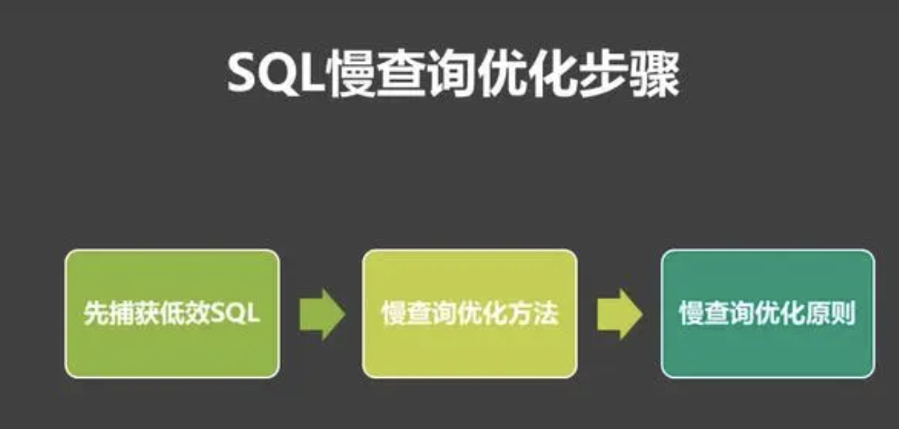

### 6.1 如何捕获低效sql

1）slow_query_log

这个参数设置为ON，可以捕获执行时间超过一定数值的SQL语句。

2）ong_query_time

当SQL语句执行时间超过此数值时，就会被记录到日志中，建议设置为1或者更短。

3）slow_query_log_file

记录日志的文件名。

4）log_queries_not_using_indexes

这个参数设置为ON，可以捕获到所有未使用索引的SQL语句，尽管这个SQL语句有可能执行得挺快。

### 6.2 慢查询优化的基本步骤

1)先运行看看是否真的很慢，注意设置SQL_NO_CACHE

2)where条件单表查，锁定最小返回记录表。这句话的意思是把查询语句的where都应用到表中返回的记录数最小的表开始查起，单表每个字段分别查询，看哪个字段的区分度最高

3)explain查看执行计划，是否与1预期一致（从锁定记录较少的表开始查询）

4)order by limit 形式的sql语句让排序的表优先查

5)了解业务方使用场景

6)加索引时参照建索引的几大原则

7)观察结果，不符合预期继续从1开始分析

### 6.3 优化原则

- 查询时，能不要* 就不用 *，尽量写全字段名
- 大部分情况连接效率远大于子查询
- 多使用explain和profile分析查询语句
- 查看慢查询日志，找出执行时间长的sql语句优化
- 多表连接时，尽量小表驱动大表，即小表 join 大表
- 在千万级分页时使用limit
- 对于经常使用的查询，可以开启缓存

---

假设有两个表：`orders` 和 `customers`，其中 `orders` 表记录了订单信息，`customers` 表记录了顾客信息。

假设 `orders` 表是大表，包含了大量的订单记录，而 `customers` 表是小表，包含了顾客的基本信息。

现在我们需要查询某个顾客的订单信息，可以使用以下 SQL 查询语句：

```
sqlCopy code
SELECT *
FROM customers c
JOIN orders o ON c.customer_id = o.customer_id
WHERE c.customer_id = 123;
```

在这个查询中，我们首先根据 `customers` 表中 `customer_id` 的索引找到了对应顾客的信息，然后再根据这些顾客的 `customer_id` 去 `orders` 表中查询相应的订单信息。这样做的话，`customers` 表就成为了驱动表，而 `orders` 表则根据 `customers` 表中的结果进行匹配，从而提高了查询性能。

## 7. 定期备份和恢复策略：优化


## 8. 优化数据库的方法

- 选取最适用的字段属性，尽可能减少定义字段宽度，尽量把字段设置NOTNULL，例如’省份’、’性别’最好适用ENUM
- 使用连接(JOIN)来代替子查询
- 适用联合(UNION)来代替手动创建的临时表
- 事务处理
- 锁定表、优化事务处理
- 适用外键，优化锁定表
- 建立索引
- 优化查询语句

## 9. 锁的优化策略

1. 读写分离

2. 分段加锁

3. 减少锁持有的时间

4. 多个线程尽量以相同的顺序去获取资源

不能将锁的粒度过于细化，不然可能会出现线程的加锁和释放次数过多，反而效率不如一次加一把大锁。

## 10. 数据库连接池

数据库连接池是一种用于管理数据库连接的技术，旨在提高应用程序与数据库之间的性能和效率。它通过预先创建并维护一定数量的数据库连接，并将它们存放在一个连接池中，以便应用程序需要时可以从中获取连接，而不需要每次都创建新的连接。

数据库连接池通常包含以下几个关键组件：

1. 连接池管理器（Connection Pool Manager）：负责管理连接池的创建、销毁、维护以及提供连接的接口。
2. 连接池（Connection Pool）：存放预先创建的数据库连接的容器，连接池的大小通常根据应用程序的需求进行配置。
3. 连接对象（Connection Object）：表示与数据库之间的连接，包含与数据库通信所需的所有信息。
4. 连接池状态监控（Connection Pool Status Monitoring）：用于监控连接池的状态和性能指标，以便及时调整连接池的大小或进行其他优化。

数据库连接池的工作原理通常包括以下几个步骤：

1. 初始化连接池：在应用程序启动时，创建一定数量的数据库连接，并将它们存放在连接池中。
2. 连接池管理：连接池管理器根据应用程序的需求，动态调整连接池的大小，确保连接池中始终有足够的可用连接。
3. 获取连接：应用程序需要与数据库交互时，通过连接池管理器从连接池中获取一个可用的数据库连接。
4. 使用连接：应用程序使用获取到的数据库连接执行数据库操作，如查询、更新等。
5. 释放连接：应用程序完成数据库操作后，将数据库连接释放回连接池，以便其他线程可以重复利用。

数据库连接池的优点包括：

- 提高性能：减少了每次连接数据库时创建和销毁连接的开销，提高了数据库操作的效率。
- 资源管理：通过限制连接池的大小，有效管理了与数据库的连接数，防止了资源浪费和系统崩溃。
- 连接复用：连接池可以重复利用已经创建的连接，避免了频繁创建新连接的开销。

总之，数据库连接池是一种重要的数据库优化技术，能够显著提高应用程序与数据库之间的性能和效率。

---

数据库一个连接多久，每次都要释放吗?(言外之意就是数据库的池化思想。)


数据库连接是一种有限的昂贵的资源，对数据库连接的管理能影响到整个应用程序的伸缩性和健壮性，数据库连接池正式针对这个问题提出来的。数据库连接池负责分配、管理和释放数据库连接，它允许应用程序重复使用一个现有的数据库连接，而不是重新建立一个。(数据库连接池思想和线程池思想一样)常用的三种连接池：

- C3p0连接池：开源的JDBC连接池，实现了数据源和JNDI绑定，支持JDBC3规范和JDBC2的标准扩展。目前使用它的开源项目有Hibernate、Spring等。单线程，性能较差，适用于小型系统，代码600KB左右。
- Dbcp连接池：由Apache开发的一个Java数据库连接池项目， Tomcat使用的连接池组件就是DBCP。预先将数据库连接放在内存中，应用程序需要建立数据库连接时直接到连接池中申请一个就行，用完再放回。单线程，并发量低，性能不好，适用于小型系统。
- Druid连接池：Druid不仅是一个数据库连接池，还包含一个ProxyDriver、一系列内置的JDBC组件库、一个SQL Parser。


## 11. MySQL 数据库的 CPU 使用率飙升

当 MySQL 数据库的 CPU 使用率飙升到 500% 时，这通常意味着数据库正面临着严重的负载问题，需要进行及时的处理以恢复正常运行。以下是可能的处理方法：

1. **识别高负载的原因**：
   - 使用系统监控工具（如top、htop等）查看具体哪些进程或查询导致了 CPU 使用率的飙升。
   - 分析 MySQL 的慢查询日志（slow query log），找出执行时间长的查询，并进行优化。

2. **优化查询性能**：
   - 优化慢查询，使用合适的索引、优化查询语句等方式提高查询性能。
   - 确保数据库中的查询语句都是经过优化的，并且没有存在潜在的性能问题。

3. **增加硬件资源**：
   - 考虑增加服务器的 CPU、内存等硬件资源，以提高系统的处理能力。
   - 如果可能，将数据库迁移到性能更好的服务器或者增加数据库实例以分担负载。

4. **调整数据库配置**：
   - 调整 MySQL 的配置参数，如增大缓冲池、调整连接数、调整查询缓存等，以优化数据库性能。
   - 可以考虑使用数据库连接池来有效管理数据库连接，减少连接数的波动。

5. **监控和报警**：
   - 设置监控系统，实时监控数据库的性能指标，如 CPU 使用率、内存占用等，并设置报警机制。
   - 及时发现负载问题，并采取相应的措施来应对和处理。

6. **数据库集群**：
   - 考虑将数据库部署为集群架构，通过水平扩展来分散负载，提高系统的稳定性和性能。

7. **数据库优化**：
   - 定期进行数据库维护和优化，如索引重建、表优化、统计信息更新等，保持数据库的良好状态。

综上所述，处理 MySQL 数据库 CPU 使用率飙升到 500% 的问题需要综合考虑硬件资源、数据库配置、查询优化等多方面因素，及时识别问题并采取相应的措施来解决。


## 12. 数据一致性和减少数据同步延时

MySQL 通过主从复制（Master-Slave Replication）来实现数据复制，保证了数据一致性和减少数据同步延时的方式如下：

1. **使用事务复制**：
   - 在主服务器上执行的每个事务都会被记录在二进制日志（binary log）中，并在从服务器上重放，确保了数据的一致性。
   - 确保在主服务器上的事务是原子性的，从而避免了在从服务器上的数据不一致。

2. **设置复制格式**：
   - MySQL 提供了多种复制格式，包括基于语句的复制、基于行的复制和混合格式。
   - 对于事务性应用，推荐使用基于行的复制（Row-based Replication），因为它可以确保数据一致性，并且更加稳定。

3. **保持主从服务器同步**：
   - 主从服务器之间的数据同步是一个持续的过程，MySQL 会自动将主服务器上的更新操作同步到从服务器上。
   - 确保主从服务器之间的网络连接稳定，并且主服务器的负载不会过高，以避免同步延时。

4. **合理配置主从服务器**：
   - 配置主从服务器时，确保主服务器的性能足够强大，可以处理高负载的写操作。
   - 同时，从服务器的配置也要足够强大，以保证能够及时处理从主服务器同步过来的数据。

5. **监控和调优**：
   - 定期监控主从服务器的同步状态和延时情况，及时发现并解决同步延时的问题。
   - 根据实际情况进行调优，包括调整复制线程数、调整复制缓冲区大小等参数，以提高同步效率。

6. **避免长事务**：
   - 长时间运行的事务会导致主服务器上的二进制日志文件过大，从而增加从服务器同步的时间和延时。
   - 尽量避免长事务的发生，或者将长事务拆分为多个较短的事务，以减少同步延时。

综上所述，通过合理配置、持续监控和调优，以及避免长事务等方式，可以有效地保证 MySQL 主从复制过程中的数据一致性，并减少数据同步延时。

# 五、Mysql 常见知识点

## 1. Mysql join

MySQL中有几种常见的join类型，包括：

1. 内连接（INNER JOIN）：内连接是最常见的连接类型，它返回两个表中符合连接条件的行。如果两个表中的行在连接条件上匹配，那么这些行就会被返回。
2. 左连接（LEFT JOIN）：左连接返回左表中所有的行，以及右表中与左表中行匹配的行。如果右表中没有匹配的行，则返回NULL值。
3. 右连接（RIGHT JOIN）：右连接返回右表中所有的行，以及左表中与右表中行匹配的行。如果左表中没有匹配的行，则返回NULL值。
4. 全连接（FULL JOIN）：全连接返回左表和右表中所有的行，如果某个表中没有匹配的行，则返回NULL值。
5. 自连接（SELF JOIN）：自连接是指将表与自身进行连接，通常用于比较表中的不同行之间的数据。

**默认JOIN是INNER JOIN**


## 2. Mysql is null

**为什么是IS NULL, 而不是"= NULL"?**

- Tip: SQL的保留字中，很多都被归类为谓词一类，例如>,<>,= 等比较谓词，以及BETWEEN, LIKE, IN, IS NULL等。总结，谓词是一种特殊的函数，返回值是真值。(前面提到的诶个谓词，返回值都是true, false, unknown,SQL是三值逻辑，所以有三种真值）因为查询结果只会包含WHERE子句里的判断结果为true的行！不包含判断结果为false和unknown的行。且不仅是等号，对NULL使用其他比较谓词（比如> NULL），结果也都是unknown。
- 重点理解：NULL不是值，所以不能对其使用谓词，如果使用谓词，结果是unknown。
  可以认为它只是一个没有值的标记,而比较谓词只适用于比较值。因此对非值的NULL使用比较谓词是没有意义的

**如何理解IS NULL?是两个单词？IS空格NULL?**

- "NULL值" 和 "列的值为NULL"这个说法是错误的。NULL不属于关系型数据库中的某种类型。
- 我们为什么会误认为NULL是一个值？可能因为混淆了别的语言，在一些语言中NULL是一个常量。还有个重要原因是IS NULL是两个单词，所以我以前也把IS当作谓词，比如IS-A,所以误认为NULL是一个值。特别是SQL里有IS TRUE, IS FALSE。在讲解SQL标准的书里提醒人那么样，我们应该把IS NULL看作一个谓词，如果可以IS_NULL或许更合适。

**三值逻辑运算。**

- unknown小写，是第三个真值。与作为NULL的一种UNKNOWN(未知)是不同的东西。小写是明确的布尔类型的真值，后者大写的既不是值也不是变量。
- 为了对比不同：看x=x的情况。
  - unknown = unknown -> true
  - UNKNOWN = UNKNOWN ->unknown


## 3. Mysql 聚合函数用法

MySQL 中的 AVG() 函数用于计算数值列的平均值。它将数值列中的所有值相加，然后除以行的数量来计算平均值。除了 AVG() 函数，MySQL 还提供了许多其他的聚合函数，如 SUM()、COUNT()、MIN() 和 MAX() 等，用于对数据进行聚合计算。

下面是一些常用聚合函数的简要介绍：

1. **AVG()：** 计算数值列的平均值。

   - avg（条件）相当于sum（if（条件，1，0））/count(全体)
   - **进阶：**sum（if（条件，N，0））/count(全体) 可用 N*avg（条件）代替

   ```sql
   SELECT AVG(column_name) FROM table_name;
   ```

2. **SUM()：** 计算数值列的总和。

   ```sql
   SELECT SUM(column_name) FROM table_name;
   ```

3. **COUNT()：** 计算行数或非 NULL 值的数量。

   ```sql
   SELECT COUNT(column_name) FROM table_name;
   ```

4. **MIN()：** 返回数值列的最小值。

   ```sql
   SELECT MIN(column_name) FROM table_name;
   ```

5. **MAX()：** 返回数值列的最大值。

   ```sql
   SELECT MAX(column_name) FROM table_name;
   ```

这些函数都可以在 SELECT 语句中使用，并且可以与 WHERE 子句一起使用以进行筛选。

这些聚合函数的原理是在数据库内部对数据进行迭代处理。当执行聚合函数时，数据库引擎会扫描符合条件的行，并对相应的列进行计算。例如，当执行 AVG() 函数时，数据库会先计算出数值列的总和和行数，然后将总和除以行数来得到平均值。因此，聚合函数的性能通常取决于数据量的大小和索引的使用情况。在处理大量数据时，合理使用索引可以提高查询的性能。

## 4. Mysql中有哪几种锁

1. 表级锁：开销小，加锁快；不会出现死锁；锁定粒度大，发生锁冲突的概率最高，并发度最低。
2. 行级锁：开销大，加锁慢；会出现死锁；锁定粒度最小，发生锁冲突的概率最低，并发度也最高。
3. 页面锁：开销和加锁时间界于表锁和行锁之间；会出现死锁；锁定粒度界于表锁和行锁之间，并发度一般。

| 锁类型                                     | 介绍                                                         | 代码                                                         |
| ------------------------------------------ | :----------------------------------------------------------- | ------------------------------------------------------------ |
| **共享锁（Shared Lock）**                  | 共享锁允许多个事务同时读取同一资源，但不允许写操作。多个事务可以同时持有共享锁，不会相互阻塞。 | SELECT * FROM table_name LOCK IN SHARE MODE;                 |
| **排他锁（Exclusive Lock）**               | 排他锁只允许一个事务对资源进行写操作，并且其他事务不能对该资源进行读或写操作。排他锁会阻塞其他事务的读写操作。 | SELECT * FROM table_name FOR UPDATE;                         |
| **行级锁（Row-level Lock）**               | 锁定表中的单独行，允许其他事务同时访问表中的其他行。         | BEGIN;<br/>SELECT * FROM table_name WHERE id = 1 FOR UPDATE;<br/>-- 执行一些更新操作<br/>COMMIT; |
| **表级锁（Table-level Lock）**             | 锁定整个表，阻止其他事务对表进行读写操作。                   | -- 锁定整个表<br/>LOCK TABLES table_name WRITE;<br/><br/>-- 在锁定的表上执行一些写操作<br/>INSERT INTO table_name (column1, column2) VALUES (value1, value2);<br/>UPDATE table_name SET column_name = 'new_value' WHERE condition;<br/>DELETE FROM table_name WHERE condition;<br/><br/>-- 解锁表<br/>UNLOCK TABLES; |
| **意向共享锁（Intention Shared Lock）**    | 用于表示事务准备对一个表中的某些行进行共享锁定。             |                                                              |
| **意向排他锁（Intention Exclusive Lock）** | 用于表示事务准备对一个表中的某些行进行排他锁定。             |                                                              |


## 5. Mysql中有哪些不同的表类型

> 早期：BDB、HEAP、ISAM、MERGE、MyISAM、InnoDB以及Gemeni这7种Mysql表类型

在 MySQL 中，常见的表类型包括以下几种：

1. **MyISAM：** 这是 MySQL 的默认表类型，在早期版本中被广泛使用。它的特点是快速、高效，适合于读操作频繁、写操作较少的场景。但是，MyISAM 不支持事务、不支持外键约束，也不支持行级锁。

2. **InnoDB：** 这是 MySQL 的另一种常见的表类型，也是现在推荐使用的默认表类型。InnoDB 支持事务、外键约束，提供了更高的并发性和可靠性，同时支持行级锁，适合于高并发的 OLTP（联机事务处理）场景。

3. **MEMORY（或 HEAP）：** 这种表类型将数据存储在内存中，而不是磁盘上。因此，它的访问速度非常快，适合于临时表、缓存表等需要快速访问的场景。但是，由于数据存储在内存中，因此内存表的大小受到内存限制的限制，并且在 MySQL 重启时数据会丢失。

4. **ARCHIVE：** 这种表类型用于存储大量历史数据，适合于数据归档和存储。它使用压缩算法存储数据，因此占用的存储空间较小，但对数据的访问速度较慢。ARCHIVE 表不支持索引，也不支持事务。

5. **CSV：** 这种表类型将数据存储在 CSV 文件中，适合于数据导入导出、数据交换等场景。CSV 表支持事务，但不支持索引。

6. **BLACKHOLE：** 这种表类型用于复制数据到另一个 MySQL 实例，它接收写入操作但不存储任何数据，只是将写入操作传递给另一个 MySQL 实例。

7. **Federated：** 这种表类型允许在本地 MySQL 实例中访问远程 MySQL 实例中的数据，可以通过 SQL 查询操作远程表的数据。

## 6. MyISAM和InnoDB的区别

> - InnoDB 支持外键，而 MyISAM 不支持。对一个包含外键的 InnoDB 表转为 MYISAM 会失败;
> - InnoDB 是聚集索引，MyISAM 是非聚集索引。

MyISAM 和 InnoDB 是 MySQL 中两种常见的表引擎，它们在功能、性能和适用场景上有一些不同：

1. **事务支持：**
   - MyISAM：不支持事务。MyISAM 表不具备事务功能，因此无法实现数据的原子性、一致性、隔离性和持久性（ACID 特性）。
   - InnoDB：支持事务。InnoDB 是一个事务安全的存储引擎，支持事务的提交、回滚、隔离和锁定，可以实现数据的 ACID 特性。

2. **外键约束：**
   - MyISAM：不支持外键约束。MyISAM 表不支持外键，无法定义外键约束来维护表之间的引用完整性。
   - InnoDB：支持外键约束。InnoDB 表支持定义外键约束，可以确保表之间的引用完整性，实现数据的关联和一致性。

3. **行级锁：**
   - MyISAM：不支持行级锁。MyISAM 表只支持表级锁，因此在并发访问时可能出现较多的锁冲突，影响性能。
   - InnoDB：支持行级锁。InnoDB 表支持行级锁，可以在事务级别锁定行，提高了并发访问的性能和并发控制的粒度。

4. **崩溃恢复：**
   - MyISAM：不支持崩溃恢复。MyISAM 表在崩溃或意外关机后可能会损坏数据，并且不提供自动恢复功能。
   - InnoDB：支持崩溃恢复。InnoDB 表支持事务日志和回滚段，可以保证数据的一致性和持久性，并提供崩溃恢复机制。

5. **索引结构：**
   - MyISAM：使用 B+ 树索引结构。MyISAM 表使用 B+ 树索引结构，适合于读操作频繁的场景。
   - InnoDB：使用聚簇索引和辅助索引。InnoDB 表的主键索引是聚簇索引，辅助索引也使用 B+ 树结构，适合于读写混合的 OLTP 场景。

总的来说，如果你的应用需要事务支持、外键约束、行级锁和崩溃恢复功能，那么应该选择 InnoDB 表引擎。而如果你的应用只需要简单的读写操作，对事务和外键约束没有要求，并且对性能要求较高，可以考虑使用 MyISAM 表引擎。

---

MyISAM 存储引擎不支持事务的主要原因是它的设计目标不同。MyISAM 存储引擎早期开发时主要用于提供较高的性能和简单的数据库操作。在 MyISAM 中，每个表的每个操作都是原子性的，但是不支持事务和回滚功能。

以下是几个导致 MyISAM 不支持事务的原因：

1. **表级锁定**：MyISAM 使用表级锁定来管理并发访问，这意味着当一个事务对表进行写操作时，其他事务无法同时对同一表进行写操作，这会导致并发性能下降。

2. **不支持回滚**：MyISAM 存储引擎不支持事务的回滚操作。如果在执行多个操作的过程中出现了错误，MyISAM 无法撤销已经执行的部分操作，导致数据不一致。

3. **不支持持久性**：MyISAM 存储引擎不提供持久性保证。如果在执行 UPDATE、DELETE 或 INSERT 操作时发生系统崩溃，可能会导致数据损坏或丢失。

相比之下，InnoDB 存储引擎支持事务和行级锁定，具有更高的并发性和可靠性。因此，如果需要事务支持、数据完整性和高并发性能，通常会选择使用 InnoDB 存储引擎。

---

在 MySQL 数据库中，InnoDB 和 MyISAM 是两种常见的存储引擎，它们在创建表后生成的文件有一些区别：

1. **InnoDB**：
   - InnoDB 存储引擎会为每个表创建一个 `.frm` 文件，用于存储表结构定义。
   - InnoDB 表数据和索引会存储在表空间文件中，通常是两个文件：`.ibd` 文件和 `.ibd` 文件。
   - `.ibd` 文件包含了表的数据和索引，而 `.ibd` 文件包含了事务日志、回滚日志等信息。
   - InnoDB 表的数据和索引是存储在独立的表空间文件中的，这种设计有利于并发访问和事务处理，同时支持行级锁和事务的 ACID 特性。

2. **MyISAM**：
   - MyISAM 存储引擎会为每个表创建一个 `.frm` 文件，用于存储表结构定义。
   - MyISAM 表的数据和索引会分别存储在两个文件中，一个是 `.MYD` 文件用于存储表数据，另一个是 `.MYI` 文件用于存储表索引。
   - MyISAM 表的数据和索引是分开存储的，这种设计在某些情况下可能会提供更好的性能，但不支持事务和行级锁。

总的来说，InnoDB 存储引擎创建表后会生成 `.frm` 文件和表空间文件（`.ibd` 文件和 `.ibd` 文件），支持事务和行级锁；而 MyISAM 存储引擎创建表后会生成 `.frm` 文件、`.MYD` 文件和 `.MYI` 文件，适用于读密集型的场景，但不支持事务和行级锁。根据具体的需求和场景，选择合适的存储引擎来创建表。

---

MySQL中的.ibd文件是InnoDB存储引擎用来存储表数据和索引的物理文件。每个使用InnoDB存储引擎的表，如果启用了独立表空间（每表一个文件），则会有一个对应的.ibd文件来存储该表的所有数据和所有的索引结构。具体来说，.ibd文件包含以下内容：

- 表的数据行记录。
- 表的所有索引，包括主键索引和其他辅助索引。
- 用于实现多版本并发控制（MVCC）的信息，这是InnoDB为了支持事务处理和高并发场景而采用的技术。

在InnoDB中，表可以被组织为不同的表空间类型：

- 系统表空间：所有表共享一个大的表空间文件（ibdata1等）。
- 独立表空间：每个表及其索引分别存储在各自的.ibd文件中。

管理.ibd文件的方法可能包括：

- 备份与恢复：直接复制.ibd文件作为备份的一种方式，但在恢复时需要注意一致性问题，通常建议使用数据库级的备份和恢复方法。
- 表空间操作：如收缩表空间、优化表碎片等高级管理任务。
- 文件系统级别的权限管理：确保MySQL服务器有足够的读写权限来访问这些文件。
  需要注意的是，在进行任何涉及.ibd文件的操作时，应当确保数据库服务已停止或者相关表处于只读状态，以防止数据不一致或损坏。同时，直接操作.ibd文件而不通过MySQL服务器API可能会导致数据丢失或不可预测的行为。


## 7. CHAR和VARCHAR的区别

CHAR 和 VARCHAR 是两种常见的字符数据类型，它们在数据库中用于存储文本数据，但有一些区别：

1. **存储方式：**
   - **CHAR：** CHAR 是固定长度的字符类型，它始终占用固定数量的存储空间，无论实际存储的数据长度是多少。如果存储的字符串长度小于指定的长度，则在字符串末尾填充空格以达到指定长度。
   - **VARCHAR：** VARCHAR 是可变长度的字符类型，它只占用实际存储的数据长度加上一个额外的长度字节。因此，VARCHAR 存储的数据长度可以根据实际数据长度动态变化。
2. **存储空间：**
   - **CHAR：** CHAR 类型的存储空间是固定的，与定义的长度相同。例如，如果定义一个长度为 10 的 CHAR 字段，那么无论存储的数据长度是多少，都会占用 10 个字节的存储空间。
   - **VARCHAR：** VARCHAR 类型的存储空间取决于实际存储的数据长度。例如，如果存储的数据长度是 5，那么只会占用 5 个字节的存储空间，再加上一个额外的长度字节。
3. **性能和存储效率：**
   - **CHAR：** 由于 CHAR 类型是固定长度的，它的存取速度通常比 VARCHAR 类型更快。但是，如果存储的数据长度较短，那么会浪费一定的存储空间。
   - **VARCHAR：** VARCHAR 类型可以根据实际存储的数据长度动态调整存储空间，因此在存储长度变化较大的数据时比较节省存储空间。但是，由于需要额外的长度字节来存储数据长度信息，可能会略微降低存取速度。
   - 在使用 WHERE 子句进行数据检索时，对于 CHAR 类型的列，数据库引擎可以更快地定位到存储的位置，因为它们具有固定的长度，所以可以直接计算出偏移量。而对于 VARCHAR 类型的列，数据库引擎需要额外的长度信息来计算存储的位置，因此可能会稍微降低检索速度。

综上所述，CHAR 和 VARCHAR 在存储方式、存储空间和性能方面有所不同，根据实际需求选择合适的数据类型。如果存储的数据长度固定且较长，可以考虑使用 CHAR 类型；如果存储的数据长度变化较大或者需要节省存储空间，可以考虑使用 VARCHAR 类型。


## 8. myisamchk是用来做什么的

> 它用来压缩MyISAM表，这减少了磁盘或内存使用

`myisamchk` 是 MySQL 数据库中用于检查、维护和修复 MyISAM 存储引擎表的命令行工具。

MyISAM 是 MySQL 中的一种常用的存储引擎，它以表格形式存储数据，并且支持全文索引等功能。`myisamchk` 提供了一些功能，用于对 MyISAM 表进行检查和修复，以确保数据的完整性和稳定性。主要的用途包括：

1. **检查表格：** `myisamchk` 可以对 MyISAM 表进行检查，查找可能存在的错误、损坏或不一致的数据，并生成报告。
2. **修复表格：** 在检查过程中发现了错误或损坏的情况下，`myisamchk` 可以尝试修复表格，恢复数据的完整性。
3. **优化表格：** `myisamchk` 可以对表格进行优化，包括重建索引、压缩表格、释放未使用的空间等操作，以提高表格的性能和效率。
4. **备份和恢复：** 可以使用 `myisamchk` 对表格进行备份和恢复操作，以防止数据丢失或损坏。

总的来说，`myisamchk` 是一个用于维护 MyISAM 表格的实用工具，可以帮助管理员检查、修复和优化表格，保证数据的完整性和可靠性。


**以下是一些常用的用法示例：**

1. **检查表格：**
   ```bash
   myisamchk /path/to/your/table.MYI
   ```
   这将对指定的 MyISAM 表格进行检查，并输出检查结果。

2. **修复表格：**
   ```bash
   myisamchk --recover /path/to/your/table.MYI
   ```
   这将尝试修复指定的 MyISAM 表格。如果检查到损坏，它会尝试自动修复。

3. **优化表格：**
   ```bash
   myisamchk --optimize /path/to/your/table.MYI
   ```
   这将对指定的 MyISAM 表格进行优化操作，包括重建索引和压缩表格。

4. **备份表格：**
   ```bash
   myisamchk --backup /path/to/your/table.MYI
   ```
   这将对指定的 MyISAM 表格进行备份操作，将原始数据备份到一个 `.BAK` 文件中。

注意替换 `/path/to/your/table.MYI` 为你实际的表格文件路径。在执行 `myisamchk` 命令时，通常需要停止 MySQL 服务，以确保在操作期间表格没有被其他进程锁定。

## 9. MyISAM Static和MyISAM Dynamic区别

> 在MyISAM Static上的所有字段有固定宽度。动态MyISAM表将具有像TEXT，BLOB等字段，以适应不同长度的数据类型。MyISAM Static在受损情况下更容易恢复。

MyISAM Static 和 MyISAM Dynamic 是 MyISAM 存储引擎的两种不同的编译方式，它们在存储表格数据和索引方面有所不同。

1. **MyISAM Static：**
   - 在 MyISAM Static 编译方式下，表格的行格式是固定的，每一行都有相同的长度。
   - 表格的数据和索引都是以静态格式存储的，即每一行都占用固定大小的存储空间，不会根据实际数据的大小动态调整。
   - 这种方式在数据长度固定、数据更新不频繁的情况下，可以提高存取速度和空间利用率。

2. **MyISAM Dynamic：**
   - 在 MyISAM Dynamic 编译方式下，表格的行格式是动态的，每一行的长度可以根据实际存储的数据长度动态调整。
   - 表格的数据和索引都是以动态格式存储的，即每一行的存储空间大小会根据实际数据的大小动态调整。
   - 这种方式在数据长度变化较大、数据更新频繁的情况下，可以降低存储空间的浪费和提高存取效率。

总的来说，MyISAM Static 和 MyISAM Dynamic 在表格数据和索引存储方面有所不同，选择合适的编译方式取决于实际的应用需求和数据特点。

## 10. 表的列定义为TIMESTAMP

> 每当行被更改时，时间戳字段将获取当前时间戳。

如果一个表的某一列被定义为 TIMESTAMP 类型，那么这列将用于存储日期和时间信息。具体来说，以下是发生的情况：

1. **存储日期和时间：** TIMESTAMP 类型用于存储日期和时间信息，包括年、月、日、时、分和秒。它可以存储从 1970 年 1 月 1 日 00:00:00 开始的时间戳至 2038 年 01 月 19 日 03:14:07。

2. **自动更新：** 可以为 TIMESTAMP 类型的列指定默认值为 CURRENT_TIMESTAMP，这样在插入新行时，如果没有提供该列的值，将会自动填充当前的日期和时间。也可以使用 ON UPDATE CURRENT_TIMESTAMP 来设置自动更新，这样在更新行时，如果该列被修改，将会自动更新为当前的日期和时间。

3. **时区转换：** TIMESTAMP 类型的值在存储时会转换为 UTC 时间（协调世界时），并在检索时根据连接的时区进行转换。这意味着存储的值不受时区影响，而在检索时可以根据用户所在的时区进行显示。

4. **自动填充：** 如果不提供 TIMESTAMP 类型列的值，它会自动填充当前的日期和时间。这在记录数据的创建时间或最后更新时间时非常有用。

总的来说，TIMESTAMP 类型的列用于存储日期和时间信息，并且可以自动填充和自动更新，以及根据时区进行转换显示。

## 11. 列设置为AUTO INCREMENT

**如果在表中达到最大值，会发生什么情况？**

它会停止递增，任何进一步的插入都将产生错误，因为密钥已被使用。

**怎样才能找出最后一次插入时分配了哪个自动增量？**

LAST_INSERT_ID将返回由Auto_increment分配的最后一个值，并且不需要指定表名称。

```sql
-- 插入新记录
INSERT INTO your_table (column1, column2, ...)
VALUES (value1, value2, ...);

-- 获取最后一次插入操作生成的自增 ID 值
SELECT LAST_INSERT_ID();
```


## 12. 怎么看到为表格定义的所有索引

索引是通过以下方式展示为表格定义的：

````sql
SHOW INDEX FROM <tablename>;
````

## 13. LIKE语法

`LIKE` 是 SQL 中用于模糊匹配的操作符，常用于在查询中搜索具有特定模式的文本。`LIKE` 语法通常与通配符结合使用，可以进行灵活的字符串匹配。以下是 `LIKE` 语法的基本形式：

```sql
SELECT column1, column2, ...
FROM table_name
WHERE column_name LIKE pattern;
```

在上面的语法中：

- `SELECT column1, column2, ...` 指定了要检索的列。
- `FROM table_name` 指定了要检索数据的表。
- `WHERE column_name LIKE pattern` 使用 `LIKE` 来筛选匹配特定模式的行。`column_name` 是要匹配的列名，`pattern` 是要匹配的模式。

`pattern` 是一个包含了通配符的字符串，常用的通配符包括：

- `%`：表示零个或多个字符。
- `_`：表示任意单个字符。
- `[]`：用于指定字符集合，比如 `[abc]` 表示匹配 `a`、`b` 或 `c` 中的任意一个字符。
- `[^]`：用于指定排除的字符集合，比如 `[^abc]` 表示排除 `a`、`b` 和 `c` 中的任意一个字符。

以下是一些示例：

- `LIKE 'apple%'`：匹配以 "apple" 开头的任意字符串。
- `LIKE '%orange'`：匹配以 "orange" 结尾的任意字符串。
- `LIKE '%banana%'`：匹配包含 "banana" 的任意位置的字符串。
- `LIKE '_erry'`：匹配以 "erry" 结尾的四个字符的字符串，其中第一个字符是任意字符。

总的来说，`LIKE` 语法是 SQL 中用于模糊匹配的重要操作符，可以根据特定模式进行灵活的字符串匹配。

## 14. Unix和Mysql时间戳之间进行转换

> UNIX_TIMESTAMP是从Mysql时间戳转换为Unix时间戳的命令
> FROM_UNIXTIME是从Unix时间戳转换为Mysql时间戳的命令

Unix 时间戳是指从协调世界时（UTC）1970 年 1 月 1 日 00:00:00 开始至今的秒数。在 Unix 系统中，通常用整数来表示 Unix 时间戳。MySQL 中也有类似的函数来处理日期和时间，你可以使用 `FROM_UNIXTIME()` 和 `UNIX_TIMESTAMP()` 函数来在 Unix 时间戳和 MySQL 日期时间之间进行转换。

以下是这两个函数的介绍：

1. **FROM_UNIXTIME()：**
   - 这个函数将 Unix 时间戳转换为 MySQL 的日期时间格式。
   - 语法：`FROM_UNIXTIME(unix_timestamp [, format])`
   - `unix_timestamp` 是 Unix 时间戳，可以是一个整数或一个数字表达式。
   - `format` 是可选参数，用于指定输出日期时间的格式，默认为 `%Y-%m-%d %H:%i:%s`。
   
   示例：
   ```sql
   SELECT FROM_UNIXTIME(1612395793);
   ```
   这将返回 Unix 时间戳 1612395793 对应的 MySQL 日期时间。

2. **UNIX_TIMESTAMP()：**
   - 这个函数将 MySQL 的日期时间转换为 Unix 时间戳。
   - 语法：`UNIX_TIMESTAMP([datetime])`
   - `datetime` 是 MySQL 的日期时间值，可以是一个日期时间类型的列或一个日期时间字面量。
   
   示例：
   ```sql
   SELECT UNIX_TIMESTAMP('2022-02-04 10:23:45');
   ```
   这将返回 MySQL 日期时间 '2022-02-04 10:23:45' 对应的 Unix 时间戳。

## 15. 列对比运算符是什么

> 在SELECT语句的列比较中使用=，<>，<=，<，> =，>，<<，>>，<=>，AND，OR或LIKE运算符。

列对比运算符用于比较两个表格或子查询的结果集，判断它们是否相等或不相等。以下是常见的列对比运算符：

1. **等于（=）：**
   - 等于运算符用于检查两个值是否相等。
   - 语法：`column1 = column2`

2. **不等于（<>或!=）：**
   - 不等于运算符用于检查两个值是否不相等。
   - 语法：`column1 <> column2` 或 `column1 != column2`

3. **大于（>）：**
   - 大于运算符用于检查一个值是否大于另一个值。
   - 语法：`column1 > column2`

4. **小于（<）：**
   - 小于运算符用于检查一个值是否小于另一个值。
   - 语法：`column1 < column2`

5. **大于等于（>=）：**
   - 大于等于运算符用于检查一个值是否大于或等于另一个值。
   - 语法：`column1 >= column2`

6. **小于等于（<=）：**
   - 小于等于运算符用于检查一个值是否小于或等于另一个值。
   - 语法：`column1 <= column2`

这些运算符可以用于任何类型的列，包括数字、字符串、日期等。在使用列对比运算符时，确保比较的列具有相同的数据类型，以避免不必要的类型转换错误。

## 16. BLOB和TEXT有什么区别

> BLOB是一个二进制对象，可以容纳可变数量的数据。TEXT是一个不区分大小写的BLOB。BLOB和TEXT类型之间的区别在于对TEXT值进行排序和比较时区分大小写，对TEXT值不区分大小写。

BLOB（Binary Large Object）和TEXT 是 MySQL 中用于存储大量数据的两种数据类型，它们的区别主要在于存储和处理的方式：

1. **BLOB（Binary Large Object）：**
   - BLOB 用于存储二进制数据，如图像、音频、视频等。
   - BLOB 类型的数据以二进制形式存储，不进行字符集排序或比较。它们不具有字符集（字符集和校对规则）并且不区分大小写。
   - BLOB 数据可存储的最大长度是 65,535 字节。

2. **TEXT：**
   - TEXT 用于存储文本数据，如文档、文章、日志等。
   - TEXT 类型的数据以字符形式存储，并且具有字符集（字符集和校对规则）。它们具有字符排序和比较规则，并且区分大小写。
   - TEXT 数据可存储的最大长度通常是 65,535 字节。

总的来说，BLOB 适用于存储二进制数据，而 TEXT 适用于存储文本数据。虽然它们的最大存储长度相同，但在存储和处理方式上有一些差异，因此需要根据实际需求选择合适的类型。

```
“具有字符集”指的是数据类型在存储文本数据时会考虑字符集（character set）的设置。字符集定义了一组字符以及它们在计算机中的表示方式，例如 ASCII、UTF-8、GBK 等。在数据库中，字符集的设置对于存储和处理文本数据非常重要。

具有字符集的数据类型，例如 VARCHAR、CHAR、TEXT 等，会在存储文本数据时使用指定的字符集。这意味着存储的文本数据会按照字符集中定义的规则进行编码和存储，以确保数据的正确性和一致性。

在 MySQL 中，可以为数据库、表格和列指定特定的字符集和校对规则。字符集和校对规则的选择取决于应用的语言和数据的特点，例如英文、中文、数字等。正确选择字符集和校对规则可以确保文本数据的存储和处理是正确的，并且在不同的环境中能够正确地显示和比较。
```


## 17. mysql_fetch_array和mysql_fetch_object的区别

> mysql_fetch_array – 将结果行作为关联数组或来自数据库的常规数组返回。
>
> mysql_fetch_object – 从数据库返回结果行作为对象。

`mysql_fetch_array` 和 `mysql_fetch_object` 是 PHP 中用于从 MySQL 查询结果集中获取数据的两个函数，它们的区别在于返回的数据结构不同：

1. **mysql_fetch_array：**
   - `mysql_fetch_array` 函数从查询结果集中获取下一行数据，并将其作为关联数组、数值数组或同时返回关联数组和数值数组的形式返回。
   - 可以通过传递 `MYSQL_ASSOC`、`MYSQL_NUM` 或 `MYSQL_BOTH` 参数来指定返回的数组类型。默认情况下，它返回一个关联数组。
   - 返回的数组的键名可以是列名或数字索引，具体取决于传递给函数的参数。

2. **mysql_fetch_object：**
   - `mysql_fetch_object` 函数从查询结果集中获取下一行数据，并将其作为对象返回。
   - 每个字段的值都作为对象的属性，可以通过对象属性名访问。
   - 返回的对象的属性名是列名，属性值是对应列的值。

总的来说，`mysql_fetch_array` 返回一个数组，可以选择返回关联数组、数值数组或同时返回两者，而 `mysql_fetch_object` 返回一个对象，其属性名对应列名，属性值是对应列的值。选择使用哪个函数取决于数据的处理方式和个人偏好。需要注意的是，`mysql_fetch_array` 和 `mysql_fetch_object` 函数已经在 PHP 7.0 中被废弃，推荐使用 mysqli 或 PDO 扩展进行数据库操作。

## 18. MyISAM表类型存储格式

具体来说，MyISAM 表的存储格式如下：

1. **`.MYD` 文件：**
   - `.MYD` 文件包含了 MyISAM 表的数据部分，即表中的实际数据记录。
   - 每个数据记录以定长或变长的格式存储，具体取决于表定义中各列的数据类型和属性。
   - 如果表包含了 TEXT 或 BLOB 类型的列，这些列的数据将存储在单独的文件中，而不是 `.MYD` 文件中。

2. **`.MYI` 文件：**
   - `.MYI` 文件包含了 MyISAM 表的索引部分，即用于加速数据检索的索引信息。
   - 索引文件包含了表中各个索引的 B-Tree 结构。
   - 每个索引对应一个 B-Tree，用于加速根据索引列进行数据检索和排序。

除了这些文件之外，还有一个 `.frm` 文件，用于存储表的结构定义，包括列名、数据类型、索引信息等。总的来说，MyISAM 表类型的存储格式包含了 `.MYD` 文件和 `.MYI` 文件，分别存储了数据和索引信息。`.frm` 文件存储了表的结构定义。

## 19. Mysql如何优化DISTINCT

**DISTINCT语法如下**：

DISTINCT在所有列上转换为GROUP BY，并与ORDER BY子句结合使用。

`DISTINCT` 关键字用于从查询结果中筛选出不同的值，即去除重复的行。它通常与 `SELECT` 语句一起使用，用于获取唯一的值。以下是 `DISTINCT` 的基本用法：

```sql
SELECT DISTINCT column1, column2, ...
FROM table_name;
```

其中：
- `column1, column2, ...` 是你希望获取唯一值的列名。
- `table_name` 是你要查询的表格名。

示例：
假设有一个名为 `students` 的表格，包含了学生的姓名和所在班级：

```sql
SELECT DISTINCT class
FROM students;
```

上述查询将返回不同的班级列表，去除了重复的班级信息。


**优化DISTINCT如下：**

要优化 MySQL 中的 DISTINCT 查询，可以考虑以下几种方法：

1. **索引优化：** 确保查询中涉及到的列都有合适的索引。如果 DISTINCT 查询涉及到的列已经建立了索引，MySQL 可以更快地执行去重操作。在表结构设计时，考虑使用覆盖索引（Covering Index）来覆盖查询中涉及到的所有列，以避免回表操作。

2. **避免使用大表：** 如果可能的话，尽量避免在大表上执行 DISTINCT 查询。大表中的去重操作会消耗大量的资源和时间。可以考虑对数据进行分片或者使用分区表来减少单表数据量。

3. **使用子查询：** 在某些情况下，使用子查询可以比直接在主查询中使用 DISTINCT 更高效。通过子查询先过滤出需要的数据集，然后在外层查询中进行 DISTINCT 操作，可以减少 DISTINCT 操作的数据量。

4. **考虑使用 GROUP BY：** 在某些情况下，使用 GROUP BY 可能比 DISTINCT 更有效。GROUP BY 旨在对数据进行分组汇总，而 DISTINCT 则是去除重复的行。根据实际情况选择适合的语法。

5. **综合考虑性能影响：** 在优化 DISTINCT 查询时，需要综合考虑查询的复杂度、数据量、索引、系统资源等因素，并进行合理的权衡。可以通过分析查询执行计划、使用 EXPLAIN 分析语句来找出性能瓶颈，并进行相应的优化。


## 20. 可以使用多少列创建索引

任何标准表最多可以创建16个索引列。

## 21. NOW和CURRENT_DATE有什么区别

`NOW()` 和 `CURRENT_DATE()` 是 MySQL 中用于获取当前日期和时间的两个函数，它们之间有以下区别：

1. **NOW()：**
   - `NOW()` 函数返回当前的日期和时间，包括年、月、日、时、分、秒。
   - 返回的值的格式为 `YYYY-MM-DD HH:MM:SS`，其中 `YYYY` 表示年份，`MM` 表示月份，`DD` 表示日期，`HH` 表示小时（24小时制），`MM` 表示分钟，`SS` 表示秒。
   - `NOW()` 返回的值包括了日期和时间的信息。

2. **CURRENT_DATE()：**
   - `CURRENT_DATE()` 函数返回当前的日期，不包括时间部分。
   - 返回的值的格式为 `YYYY-MM-DD`，其中 `YYYY` 表示年份，`MM` 表示月份，`DD` 表示日期。
   - `CURRENT_DATE()` 返回的值只包括日期信息，不包括时间信息。

因此，主要区别在于 `NOW()` 返回当前的日期和时间，而 `CURRENT_DATE()` 返回当前的日期。根据实际需要，选择合适的函数来获取日期或日期时间信息。

## 23. 什么是通用SQL函数

````
 CONCAT(A, B) – 连接两个字符串值以创建单个字符串输出。通常用于将两个或多个字段合并为一个字段。
 FORMAT(X, D)- 格式化数字X到D有效数字。
 CURRDATE(), CURRTIME()- 返回当前日期或时间。
 NOW() – 将当前日期和时间作为一个值返回。
 MONTH()，DAY()，YEAR()，WEEK()，WEEKDAY() – 从日期值中提取给定数据。
 HOUR()，MINUTE()，SECOND() – 从时间值中提取给定数据。
 DATEDIFF(A，B) – 确定两个日期之间的差异，通常用于计算年龄
 SUBTIMES(A，B) – 确定两次之间的差异。
 FROMDAYS(INT) – 将整数天数转换为日期值。
````

通用 SQL 函数是一组标准化的 SQL 函数，它们在几乎所有支持 SQL 的数据库系统中都具有相同的语法和功能。这些函数提供了一些常用的数据操作和转换功能，可以在 SQL 查询中广泛使用。一些常见的通用 SQL 函数包括：

1. **聚合函数：**
   - `SUM()`：计算某列的总和。
   - `AVG()`：计算某列的平均值。
   - `COUNT()`：计算某列或行的数量。
   - `MIN()`：找出某列的最小值。
   - `MAX()`：找出某列的最大值。

2. **字符串函数：**
   - `CONCAT()`：将多个字符串连接成一个字符串。
   - `SUBSTRING()` 或 `SUBSTR()`：提取字符串的子串。
   - `UPPER()` 或 `UCASE()`：将字符串转换为大写。
   - `LOWER()` 或 `LCASE()`：将字符串转换为小写。
   - `LENGTH()` 或 `LEN()`：返回字符串的长度。

3. **日期和时间函数：**
   - `NOW()`：返回当前的日期和时间。
   - `CURRENT_DATE()` 或 `CURDATE()`：返回当前日期。
   - `CURRENT_TIME()` 或 `CURTIME()`：返回当前时间。
   - `DATE_FORMAT()`：格式化日期和时间。
   - `DATE_ADD()` 和 `DATE_SUB()`：对日期进行加减操作。

4. **数学函数：**
   - `ABS()`：返回一个数的绝对值。
   - `ROUND()`：将一个数四舍五入到指定的小数位数。
   - `CEIL()` 或 `CEILING()`：向上取整。
   - `FLOOR()`：向下取整。

这些通用 SQL 函数可以在各种 SQL 查询中使用，无论是简单的查询还是复杂的数据操作，它们都为数据库开发人员提供了丰富的功能和灵活性。

## 24. MYSQL支持事务吗

>  在缺省模式下，MYSQL是autocommit模式的，所有的数据库更新操作都会即时提交，所以在缺省情况下，mysql是不支持事务的。但是如果你的MYSQL表类型是使用InnoDB Tables 或 BDB tables的话，你的MYSQL就可以使用事务处理,使用SETAUTOCOMMIT=0就可以使MYSQL允许在非autocommit模式，在非autocommit模式下，你必须使用COMMIT来提交你的更改，或者用ROLLBACK来回滚你的更改。

MySQL 使用以下关键字和语句来处理事务：

1. **`START TRANSACTION`：** 用于显式启动一个事务。

2. **`COMMIT`：** 用于提交事务。如果事务中的所有操作都成功，可以使用 `COMMIT` 来保存更改。

3. **`ROLLBACK`：** 用于回滚事务。如果在事务中发生错误或者需要取消之前的更改，可以使用 `ROLLBACK` 来撤销事务。

4. **`SAVEPOINT`：** 用于创建事务中的保存点。保存点允许在事务中的特定位置创建一个标记，以便稍后可以回滚到该点。

5. **`ROLLBACK TO`：** 用于将事务回滚到指定的保存点。

6. **`SET autocommit`：** 用于设置事务的自动提交属性。默认情况下，MySQL 是自动提交模式，每个语句都被视为一个事务并自动提交。通过设置 `autocommit` 属性，可以切换为显式事务模式。

示例：

```sql
-- 启动事务
START TRANSACTION;

-- 执行一系列操作
INSERT INTO table1 (column1, column2) VALUES ('value1', 'value2');
UPDATE table2 SET column3 = 'new_value' WHERE column4 = 'condition';

-- 提交事务
COMMIT;
```

如果在事务中的某个地方发生错误，可以使用 `ROLLBACK` 回滚事务，以取消之前的更改。事务提供了对数据库的安全操作，确保在复杂的业务逻辑中的一系列操作中，要么全部成功，要么全部失败。

---

**补充：**

`autocommit` 是 MySQL 中的一个会话级别的参数，用于控制事务的自动提交行为。当 `autocommit` 参数为打开时，每个单独的 SQL 语句都被视为一个独立的事务，并在执行后立即提交。这意味着每个 SQL 语句都将立即生效，而不需要显式地使用 `COMMIT` 来提交事务。

默认情况下，MySQL 的 `autocommit` 参数是开启的。这意味着在新建的会话中，每个 SQL 语句都会自动提交，除非显式地使用 `START TRANSACTION` 来启动一个事务，然后使用 `COMMIT` 或 `ROLLBACK` 来结束事务。

启用和禁用 `autocommit` 参数的方法如下：

- **启用 autocommit：**
  ```sql
  SET autocommit = 1;
  ```
  或者
  ```sql
  SET autocommit = ON;
  ```

- **禁用 autocommit：**
  ```sql
  SET autocommit = 0;
  ```
  或者
  ```sql
  SET autocommit = OFF;
  ```

通常情况下，如果不需要显式地控制事务，可以保持 `autocommit` 参数的默认设置，这样可以简化 SQL 操作。但在需要使用事务的情况下，可以将 `autocommit` 参数设置为禁用，然后使用 `START TRANSACTION` 和 `COMMIT` 或 `ROLLBACK` 来控制事务的提交和回滚。

## 25. MySql里记录货币用什么字段类型好

在 MySQL 中记录货币金额时，一般推荐使用 DECIMAL 数据类型。DECIMAL 数据类型用于存储固定精度的十进制数值，通常用于表示货币金额或其他精确数值。

DECIMAL 类型的语法如下：
```sql
DECIMAL(M, D)
```
其中，M 是数字的总位数，包括小数点前和小数点后的位数，而 D 是小数点后的位数。例如，DECIMAL(10, 2) 表示总共 10 位数，其中 2 位是小数位数，即最多有 8 位整数和 2 位小数。

使用 DECIMAL 数据类型有以下优点：
1. DECIMAL 数据类型提供了固定精度，确保在计算货币金额时不会出现舍入误差。
2. 可以根据需要定义合适的精度，以满足实际需求，例如 DECIMAL(10, 2) 可以表示最大值为 9999999.99 的金额。
3. DECIMAL 类型适用于财务和货币等需要高精度的场景。

因此，建议在 MySQL 中记录货币金额时使用 DECIMAL 数据类型，并根据业务需求选择合适的精度。


## 26. MySql有关权限的表都有哪几个

> Mysql服务器通过权限表来控制用户对数据库的访问，权限表存放在mysql数据库里，由mysql_install_db脚本初始化。这些权限表分别user，db，table_priv，columns_priv和host。

在 MySQL 中，权限相关的表主要包括以下几个：

1. **user 表：**
   存储 MySQL 用户的登录信息，包括用户名、密码以及相关的授权信息。

2. **db 表：**
   存储数据库级别的权限信息，包括用户对于不同数据库的权限。

3. **tables_priv 表：**
   存储表级别的权限信息，包括用户对于特定表的权限。

4. **columns_priv 表：**
   存储列级别的权限信息，包括用户对于特定列的权限。

5. **procs_priv 表：**
   存储存储过程和函数级别的权限信息，包括用户对于特定存储过程和函数的权限。

6. **proxies_priv 表：**
   存储代理用户的权限信息，用于 MySQL 复制功能。

这些表存储了 MySQL 中各种级别的权限信息，包括用户对于数据库、表、列、存储过程等不同对象的权限控制。通过这些表，可以管理和控制用户对于数据库系统的访问和操作权限。

## 27. 列的字符串类型可以是什么

````
 SET
 BLOB
 ENUM
 CHAR
 TEXT
````

在 MySQL 中，列的字符串类型可以是以下几种：

1. **CHAR：**
   CHAR 类型是固定长度的字符串类型，它需要指定字符串的最大长度。例如，`CHAR(10)` 表示包含 10 个字符的字符串，不足的部分会用空格填充。

2. **VARCHAR：**
   VARCHAR 类型是可变长度的字符串类型，它也需要指定字符串的最大长度。VARCHAR 类型的存储空间取决于实际存储的字符串长度，不会额外填充空格。

3. **TEXT：**
   TEXT 类型用于存储较大的文本数据，可以存储最大长度为 65,535 字节的字符串。TEXT 类型分为四种：TINYTEXT、TEXT、MEDIUMTEXT 和 LONGTEXT，分别支持不同的存储容量。

4. **BLOB：**
   BLOB 类型用于存储二进制数据，可以存储最大长度为 65,535 字节的二进制数据。BLOB 类型也分为四种：TINYBLOB、BLOB、MEDIUMBLOB 和 LONGBLOB，分别支持不同的存储容量。

5. **ENUM：**
   ENUM 类型用于存储枚举值，允许列举出一组预定义的字符串值。例如，`ENUM('A', 'B', 'C')` 表示该列只能存储 'A'、'B' 或 'C' 这三个值中的一个。

6. **SET：**
   SET 类型也用于存储一组预定义的字符串值，但与 ENUM 不同的是，SET 类型可以存储多个值。例如，`SET('A', 'B', 'C')` 表示该列可以存储 'A'、'B' 和 'C' 这三个值中的任意组合。

这些字符串类型可以根据实际需求选择，根据数据的特性和存储需求来确定使用哪种类型。

## 28. MySQL数据库作发布系统的存储，一天五万条以上的增量，预计运维三年,怎么优化？

1. 设计良好的数据库结构，允许部分数据冗余，尽量避免join查询，提高效率。
2. 选择合适的表字段数据类型和存储引擎，适当的添加索引。
3. mysql库主从读写分离。
4. 找规律分表，减少单表中的数据量提高查询速度。
5. 添加缓存机制，比如memcached，redis等。
6. 不经常改动的页面，生成静态页面。
7. 书写高效率的SQL。比如 SELECT * FROM TABEL 改为 SELECT field_1, field_2, field_3 FROM TABLE


## 29. 什么情况下设置了索引但无法使用 

虽然在数据库表中设置了索引，但在某些情况下可能无法使用索引。以下是一些常见的情况：

1. **函数或表达式的使用：**
   如果在查询条件中使用了函数、表达式或对列进行了操作，可能会导致无法使用索引。例如：
   ```sql
   SELECT * FROM my_table WHERE UPPER(name) = 'JOHN';
   ```
   这样的查询中，`UPPER(name)` 的使用可能导致索引失效。

2. **使用通配符开头：**
   在查询条件中使用通配符（如 `%`）开头的模糊查询可能无法使用索引。例如：
   ```sql
   SELECT * FROM my_table WHERE name LIKE '%John%';
   ```
   这样的查询可能需要进行全表扫描，而无法利用索引。

3. **OR 条件的使用：**
   对于包含多个条件的 OR 查询，如果其中一个条件无法使用索引，整个查询可能无法利用索引。例如：
   
   ```sql
   SELECT * FROM my_table WHERE age = 25 OR name = 'John';
   ```
   假设 `age` 列上有索引，而 `name` 列没有索引。数据库优化器在执行这个查询时，会考虑两种可能的执行计划：
   
   1. **利用索引的执行计划：** 如果数据库优化器选择利用索引，它可能会使用 `age` 列上的索引来快速定位满足 `age = 25` 条件的行。但是对于另一个条件 `name = 'John'`，由于 `name` 列没有索引，无法利用索引来快速定位，可能需要进行全表扫描来查找匹配的行。
   2. **不利用索引的执行计划：** 另一种可能是数据库优化器选择不使用索引，而是进行全表扫描。虽然对于 `name = 'John'` 条件无法利用索引，但对于 `age = 25` 条件也可以通过全表扫描来找到匹配的行。
   
   在这种情况下，如果数据库优化器估计全表扫描的成本比利用索引的成本更低（例如，表很小或者满足条件的行数较少），那么它可能会选择不使用索引的执行计划。因此，即使有一个条件可以利用索引，整个查询也可能选择不使用索引。
   
4. **数据类型不匹配：**
   如果在查询条件中使用了不同数据类型进行比较，可能会导致索引无法使用。例如：
   ```sql
   SELECT * FROM my_table WHERE id = '123';
   ```
   如果 `id` 是整数类型的列，但在查询条件中使用了字符串，可能无法使用索引。

5. **列上缺少统计信息：**
   数据库系统可能需要统计信息来确定是否使用索引。如果表的统计信息不准确或过时，可能导致查询计划选择不使用索引。

6. **小表的情况：**
   对于非常小的表，数据库优化器可能会选择全表扫描而不是使用索引，因为全表扫描可能更快。

在遇到无法使用索引的情况时，可以通过分析查询计划、优化查询条件、更新统计信息等方式来尝试解决问题。数据库系统的优化器会根据情况选择最优的执行计划，但了解上述情况可以帮助优化查询性能。

---

例子1

KEY a（a,b,c）联合索引

```
(1)    select * from myTest  where a=3 and b=5 and c=4;   ----  abc顺序
abc三个索引都在where条件里面用到了，而且都发挥了作用


(2)    select * from myTest  where  c=4 and b=6 and a=3;
where里面的条件顺序在查询之前会被mysql自动优化，效果跟上一句一样


(3)    select * from myTest  where a=3 and c=7;
a用到索引，b没有用，所以c是没有用到索引效果的


(4)    select * from myTest  where a=3 and b>7 and c=3;     ---- b范围值，断点，阻塞了c的索引
a用到了，b也用到了，c没有用到，这个地方b是范围值，也算断点，只不过自身用到了索引


(5)    select * from myTest  where b=3 and c=4;   --- 联合索引必须按照顺序使用，并且需要全部使用
因为a索引没有使用，所以这里 bc都没有用上索引效果


(6)    select * from myTest  where a>4 and b=7 and c=9;
a用到了  b没有使用，c没有使用


(7)    select * from myTest  where a=3 order by b;
a用到了索引，b在结果排序中也用到了索引的效果，a下面任意一段的b是排好序的


(8)    select * from myTest  where a=3 order by c;
a用到了索引，但是这个地方c没有发挥排序效果，因为中间断点了，使用 explain 可以看到 filesort


(9)    select * from mytable where b=3 order by a;
b没有用到索引，排序中a也没有发挥索引效果
```

---

例子2

> https://juejin.cn/post/7031712626581356574

## 30. MySql各个引擎类型的索引底层实现

1. **InnoDB 引擎：**
   - InnoDB 引擎使用 B+ 树作为索引的底层数据结构。
   - 对于主键索引，数据记录直接存储在主键索引树上的叶子节点中。
   - 对于辅助索引（非主键索引），叶子节点中存储的是主键的值，通过主键值再次查找到对应的数据记录。
   - InnoDB 支持聚簇索引，即数据记录存储在主键索引的叶子节点中，因此主键索引是必须的。
2. **MyISAM 引擎：**
   - MyISAM 引擎使用 B+ 树作为索引的底层数据结构，类似于 InnoDB。
   - 对于主键索引和辅助索引，叶子节点中存储的是数据记录的地址（指针），而不是实际的数据记录。
   - MyISAM 不支持聚簇索引，因此可以在表中定义多个辅助索引而无需主键索引。
3. **MEMORY 引擎：**
   - MEMORY 引擎将表数据存储在内存中，因此索引也是基于内存的数据结构。
   - MEMORY 引擎使用哈希表来实现索引，对于每个索引列，都有一个哈希表来存储键值对。
   - 哈希表可以快速地进行查找操作，但不支持范围查询和排序等操作。
4. **NDB Cluster 引擎：**
   - NDB Cluster 引擎是 MySQL Cluster 的存储引擎，用于分布式存储和处理大规模数据。
   - NDB Cluster 引擎的索引实现类似于 InnoDB，使用 B+ 树作为底层数据结构，支持聚簇索引。
   - 与 InnoDB 不同的是，NDB Cluster 引擎的数据和索引存储在集群中的多个节点上，实现了高可用和容错性。


## 31. MySQL中索引/主键/唯一索引/联合索引的区别

在 MySQL 中，索引、主键、唯一索引和联合索引是用于优化数据库查询性能的重要工具。它们在读写操作中的影响如下：

1. **索引（Index）：**
   - 索引是一种特殊的数据结构，用于加速数据库的查询操作。
   - 通过索引，数据库系统可以快速定位符合查询条件的数据行，减少扫描整个表的成本。
   - 读操作：索引可以加速查询操作，提高读取数据的速度。
   - 写操作：在进行插入、更新和删除操作时，索引会增加数据操作的成本，因为数据库需要更新索引数据结构。

2. **主键（Primary Key）：**
   - 主键是一种特殊的索引，用于唯一标识表中的每一行数据。
   - 主键必须唯一且非空，用于确保表中的数据行唯一性。
   - 读操作：主键索引可快速定位唯一数据行，加速查询操作。
   - 写操作：主键索引的存在会稍微增加插入和更新操作的成本，因为数据库需要确保主键的唯一性。

3. **唯一索引（Unique Index）：**
   - 唯一索引也是一种特殊的索引，用于确保某一列或列组合的值在表中是唯一的。
   - 唯一索引可以包含空值，但在不同数据行中不能有重复值。
   - 读操作：唯一索引可加速查询操作，提高数据的读取效率。
   - 写操作：插入和更新操作时，数据库需要检查唯一索引的唯一性约束，因此会增加一定的写入成本。

4. **联合索引（Composite Index）：**
   - 联合索引是指在多个列上创建的复合索引，用于加速多列条件的查询操作。
   - 联合索引按照索引中列的顺序建立，查询时可根据索引的前缀匹配快速定位数据。
   - 读操作：联合索引可加速多列条件的查询操作，提高查询效率。
   - 写操作：在插入、更新和删除操作时，对于包含在联合索引中的列，数据库需要更新联合索引的数据结构，因此会增加写入操作的成本。

总的来说，索引、主键、唯一索引和联合索引在读操作中通常能够提高查询效率，加快数据的检索速度。然而，在写操作中，这些索引可能会增加数据操作的成本，因为数据库需要维护索引结构以确保数据的一致性和完整性。因此，在设计和使用索引时，需要权衡读写操作的性能需求，并选择合适的索引策略。


## 32. SQL注入漏洞产生的原因/如何防止

SQL 注入漏洞的产生主要是因为未经过滤或验证的用户输入直接拼接到 SQL 查询语句中，导致恶意用户可以通过构造特定的输入，改变 SQL 查询的语义，从而执行恶意操作或获取敏感信息。以下是 SQL 注入漏洞产生的主要原因：

1. **动态拼接 SQL 语句：**
   当应用程序将用户输入直接拼接到 SQL 查询语句中时，如果未对输入进行充分过滤或验证，恶意用户可以在输入中注入恶意 SQL 代码，从而执行非预期的数据库操作。

2. **缺乏参数化查询：**
   如果应用程序使用的是动态 SQL，而不是参数化查询，那么恶意用户可以通过构造特定的输入来改变 SQL 查询语义。

3. **错误的权限配置：**
   如果应用程序在数据库中使用了过高的权限，恶意用户可能会利用 SQL 注入漏洞获取敏感数据或执行危险操作。

为了防止 SQL 注入漏洞，可以采取以下措施：

1. **使用参数化查询：**
   推荐使用参数化查询（Prepared Statements）或存储过程来执行 SQL 查询，而不是将用户输入直接拼接到 SQL 查询语句中。

2. **输入过滤与验证：**
   对用户输入进行严格的过滤和验证，确保输入符合预期的格式和范围。可以使用白名单过滤输入，只允许合法的字符或格式通过。

3. **最小权限原则：**
   在数据库中使用最小权限原则，确保应用程序只能访问其需要的数据和功能，避免赋予过高的权限。

4. **错误信息处理：**
   在生产环境中，不要返回详细的错误信息给用户，以防止恶意用户利用错误信息获取敏感信息。错误信息应该记录在日志中，并提供给系统管理员进行分析。

5. **安全审计与漏洞扫描：**
   定期对应用程序进行安全审计和漏洞扫描，及时发现并修复潜在的 SQL 注入漏洞。

通过以上措施，可以有效地防止 SQL 注入漏洞的发生，提高应用程序的安全性。

## 33. 表字段类型优先级

> 整形>date,time>enum,char>varchar>blob,text

优先考虑数字类型，其次是日期或者二进制类型，最后是字符串类型，同级别得数据类型，应该优先选择占用空间小的数据类型


## 34. 解释MySQL外连接、内连接与自连接的区别

先说什么是交叉连接: 交叉连接又叫笛卡尔积，它是指不使用任何条件，直接将一个表的所有记录和另一个表中的所有记录一一匹配。

MySQL 中的连接（JOIN）操作用于将多个表中的数据联合起来进行查询。主要有外连接、内连接和自连接三种类型，它们的区别如下：

1. **内连接（INNER JOIN）：**
   - 内连接返回两个表中符合连接条件的交集部分。
   - 只返回满足连接条件的行，如果某个表的行在另一个表中没有匹配的行，则不会包含在结果中。
   - 使用 `INNER JOIN` 关键字来实现，或者直接使用 `JOIN`，默认情况下就是内连接。

2. **外连接（OUTER JOIN）：**
   - 外连接返回两个表中符合连接条件的所有行，以及没有匹配的行。
   - 分为左外连接（LEFT JOIN）、右外连接（RIGHT JOIN）和全外连接（FULL JOIN）。
   - 左外连接（LEFT JOIN）返回左表中的所有行，以及右表中与左表匹配的行。
   - 右外连接（RIGHT JOIN）返回右表中的所有行，以及左表中与右表匹配的行。
   - 全外连接（FULL JOIN）返回左表和右表中的所有行，如果某个表的行在另一个表中没有匹配的行，则用 NULL 值填充。
   - 使用 `LEFT JOIN`、`RIGHT JOIN` 或 `FULL JOIN` 关键字来实现。

3. **自连接（SELF JOIN）：**
   - 自连接是指连接同一个表的两个实例，它在表的列之间创建了一个虚拟的连接。
   - 通常用于需要在同一表中比较不同行之间的数据时。
   - 使用别名来区分同一张表的不同实例，在 `ON` 子句中指定连接条件。

简而言之，内连接返回两个表中匹配的行，外连接返回两个表中所有的行，而自连接则是将同一表中的不同行进行连接。这些连接操作可以帮助实现复杂的查询需求，并允许我们从多个表中获取所需的数据。

## 35. SQL语言包括哪几部分

SQL（Structured Query Language）语言包括以下几个部分：

1. **数据操作语言（DML，Data Manipulation Language）：**
   - 用于对数据库中的数据进行操作，包括增加、删除、修改和查询数据等操作。
   - 操作关键字：`SELECT`、`INSERT`、`UPDATE`、`DELETE`。

2. **数据定义语言（DDL，Data Definition Language）：**
   - 用于对数据库中的对象（如表、视图、索引等）进行定义和操作。
   - 操作关键字：`CREATE`、`ALTER`、`DROP`、`TRUNCATE`、`RENAME`。

3. **数据控制语言（DCL，Data Control Language）：**
   - 用于控制用户对数据库的访问权限和安全性。
   - 操作关键字：`GRANT`、`REVOKE`。

4. **数据查询语言（DQL，Data Query Language）：**
   - 用于从数据库中查询数据。
   - 操作关键字：`SELECT`。

5. **事务控制语言（TCL，Transaction Control Language）：**
   - 用于控制事务的提交、回滚和恢复。
   - 操作关键字：`COMMIT`、`ROLLBACK`、`SAVEPOINT`、`SET TRANSACTION`。

以上是 SQL 的主要部分及其操作关键字，每个部分都有不同的功能和用途，可以根据需要选择合适的语句来操作数据库。


## 36. 什么叫视图/游标是什么

视图（View）是一种虚拟的表，它是基于 SQL 查询结果生成的，具有和表相似的结构。视图并不存储实际的数据，而是根据查询语句动态生成的虚拟表，可以将复杂的查询逻辑封装为视图，方便用户进行查询操作。视图的主要作用包括：

1. 简化查询：通过将复杂的查询逻辑封装到视图中，用户可以直接对视图进行查询，而不必关心底层数据表的结构和查询方式。
2. 数据安全：通过视图可以对用户展示部分数据，并隐藏敏感数据，从而增强数据的安全性。
3. 数据独立性：视图可以提供数据结构的独立性，即使底层数据表结构发生变化，视图的结构可以保持不变。

游标（Cursor）是一种数据库操作机制，用于在 SQL 查询中对结果集进行逐行处理。游标可以将查询结果集中的每一行数据存储在内存中，然后通过游标指针逐行进行处理。游标通常用于在存储过程或触发器中对查询结果进行遍历和处理。游标的主要作用包括：

1. 逐行处理：游标可以对查询结果集中的每一行数据进行逐行处理，执行相应的操作。
2. 数据操作：游标可以实现对查询结果集中的数据进行检索、更新、删除等操作。
3. 结果集控制：游标可以控制查询结果集的遍历方向和范围，灵活地控制数据的访问。

需要注意的是，在一些数据库管理系统中，游标的使用可能会增加系统的开销和负担，应谨慎使用。46.什么是存储过程？用什么来调用？

存储过程是一个预编译的SQL语句，优点是允许模块化的设计，就是说只需创建一次，以后在该程序中就可以调用多次。如果某次操作需要执行多次SQL，使用存储过程比单纯SQL语句执行要快。可以用一个命令对象来调用存储过程。

---

**视图（View）的例子：**

假设有一个包含员工信息和部门信息的数据库，其中包括两个表：`employees` 和 `departments`。我们可以创建一个视图，将这两个表的信息整合起来，以便更方便地查询员工和部门的关联信息。

```sql
-- 创建视图
CREATE VIEW EmployeeDepartmentView AS
SELECT e.employee_id, e.employee_name, e.department_id, d.department_name
FROM employees e
JOIN departments d ON e.department_id = d.department_id;
```

创建了名为 `EmployeeDepartmentView` 的视图，它包含了员工的 ID、姓名、部门 ID 以及部门名称。现在，我们可以直接对这个视图进行查询：

```sql
-- 查询视图
SELECT * FROM EmployeeDepartmentView;
```

**游标（Cursor）的例子：**

假设有一个存储过程，用于逐行检查员工薪水是否满足某个条件，并进行相应的操作。

```sql
-- 创建存储过程
DELIMITER //
CREATE PROCEDURE CheckSalaryCondition()
BEGIN
    DECLARE done BOOLEAN DEFAULT FALSE;
    DECLARE employee_id INT;
    DECLARE employee_salary DECIMAL(10, 2);
    
    -- 声明游标
    DECLARE employee_cursor CURSOR FOR
        SELECT employee_id, salary FROM employees;
    
    -- 声明异常处理
    DECLARE CONTINUE HANDLER FOR NOT FOUND SET done = TRUE;

    -- 打开游标
    OPEN employee_cursor;

    -- 遍历游标
    read_loop: LOOP
        -- 获取游标数据
        FETCH employee_cursor INTO employee_id, employee_salary;
        
        -- 判断是否到达末尾
        IF done THEN
            LEAVE read_loop;
        END IF;

        -- 根据条件进行操作
        IF employee_salary > 50000 THEN
            -- 满足条件的处理操作，这里简化为输出
            SELECT CONCAT('Employee ', employee_id, ' salary exceeds 50000') AS Message;
        END IF;
    END LOOP;

    -- 关闭游标
    CLOSE employee_cursor;
END //
DELIMITER ;
```

在这个存储过程中，通过游标逐行获取员工的薪水信息，判断是否满足条件，然后进行相应的操作。这只是一个简化的例子，实际应用中可能会根据需要进行更复杂的逻辑和操作。

## 37. 如何通俗地理解三个范式  

- 第一范式：1NF是对属性的原子性约束，要求属性具有原子性，不可再分解；
- 第二范式：2NF是对记录的唯一性约束，要求记录有唯一标识，即实体的唯一性； 确保表中的每个非主键字段完全依赖于整个主键，而不是依赖于主键的一部分。
- 第三范式：3NF是对字段冗余性的约束，即任何字段不能由其他字段派生出来，它要求字段没有冗余。在满足第二范式的基础上，消除非主键字段之间的传递依赖。
- 范式化设计优缺点:
  - 优点:可以尽量得减少数据冗余，使得更新快，体积小
  - 缺点:对于查询需要多个表进行关联，减少写得效率增加读得效率，更难进行索引优化
- 反范式化:
  - 优点:可以减少表得关联，可以更好得进行索引优化
  - 缺点:数据冗余以及数据异常，数据得修改需要更多的成本

## 38. 什么是基本表/什么是视图

**基本表（Base Table）：**
基本表是数据库中最基本的数据存储单元，它是实际存储数据的表格结构。基本表中存储了特定实体的信息，例如在一个员工管理系统中，员工表就是一个基本表，存储了员工的姓名、工号、工资等信息。基本表的数据可以直接被查询、插入、更新或删除。

**视图（View）：**
视图是一个虚拟的表，它不存储实际的数据，而是根据一个或多个基本表的查询结果动态生成的结果集。视图可以将数据库中的数据以不同的视角呈现给用户，用户可以像查询基本表一样查询视图，但实际上操作的是视图所对应的查询结果。视图可以用来简化复杂的查询、隐藏底层数据结构、提供安全性等。

## 39. 试述视图的优点

1) 视图能够简化用户的操作  
2) 视图使用户能以多种角度看待同一数据
3) 视图为数据库提供了一定程度的逻辑独立性
4) 视图能够对机密数据提供安全保护。

## 40. NULL是什么意思

在 MySQL 中，NULL 表示一个值未知或不适用的情况。它不同于空字符串、零或任何其他值，而是表示缺少有效的值。当某个字段的值为 NULL 时，它表示该字段的值是未知的或者不适用的，即数据库中没有为该字段存储任何值。

NULL 具有以下特点：

1. **未知值：** NULL 表示缺少有效的值，因此它通常用于表示某个字段的值未知或不适用的情况。
2. **与空字符串的区别：** NULL 不同于空字符串，空字符串是一种有效的值，表示该字段确实包含了一个空字符串。
3. **与零的区别：** NULL 不同于零，零是一个有效的数值，表示该字段的值确实是零


## 41. 用什么限制字段只接受特定范围里的值

要确保表格里的字段只接受特定范围内的值，可以使用以下方法：

1. **枚举类型（ENUM）：** 枚举类型允许你定义一组允许的值列表，并将字段限制为这些值之一。例如，你可以将一个字段定义为 `ENUM('male', 'female')`，这样该字段就只能接受 'male' 或 'female' 两个值。

```sql
CREATE TABLE example (
    gender ENUM('male', 'female')
);
```

2. **外键约束（Foreign Key Constraint）：** 如果特定范围的值存在于另一个表中，你可以在当前表中创建一个外键约束，将字段限制为引用另一个表的特定列。这样就可以确保该字段只接受另一个表中存在的值。

```sql
CREATE TABLE example (
    category_id INT,
    FOREIGN KEY (category_id) REFERENCES categories(id)
);
```

3. **检查约束（Check Constraint）：** 检查约束允许你定义一个条件，只有满足该条件的值才能被插入到字段中。你可以使用 CHECK 约束来确保字段值在特定范围内。

```sql
CREATE TABLE example (
    age INT,
    CHECK (age BETWEEN 18 AND 65)
);
```

4. **触发器（Triggers）：** 触发器是一种在表上定义的特殊程序，可以在插入、更新或删除操作发生时自动执行。你可以编写一个触发器来检查插入或更新的值是否在特定范围内，并在不符合条件时阻止操作的执行。

这些方法可以单独使用，也可以结合使用，具体取决于你的需求和数据模型的设计。


## 42. MySQL索引-索引匹配规则

> https://juejin.cn/post/7031712626581356574

- 等值匹配

执行下面的语句：SELECT * FROM student_scope where class_name= '1班' AND student_name ='小明' AND subject_nane  ='英语';这样的语句，因为WHERE条件里的几个字段的名称和顺序跟建立的联合索引一模一样，此时就会等值匹配，从索引页依次往下查找，会定位到：1+小明+英语（id=100）这条数据，然后根据id 从聚簇索引中回表查询提取所有的字段信息。

- 最左侧列匹配

例如联合索引：KEY（class_name，student_name ，subject_nane  ），不一定在where条件中都要写3个字段来才会走索引查询，只要根据最左侧的部分字段来查询也要走索引，下面的3条SQL都会走索引：

```sql
sql
复制代码SELECT * FROM student_scope where class_name= '1班' AND student_name ='小明' AND subject_nane  ='英语';
SELECT * FROM student_scope where class_name= '1班' AND student_name ='小明';
SELECT * FROM student_scope where class_name= '1班' ;
```

会根据建立的索引采取最左侧来匹配，当执行下面的SQL，class_name字段会走索引，subject_name 就不会走索引。

```sql
sql
复制代码SELECT * FROM student_scope where class_name= '1班' AND subject_nane  ='英语';
```

又如下面的语句，完全就不会走索引

```sql
sql
复制代码SELECT * FROM student_scope where student_name ='小明' AND subject_nane  ='英语';
SELECT * FROM student_scope where subject_nane  ='英语';
```

- 最左前缀匹配原则

在SQL查询的时候，我们经常会根据LIKE语法来查询，比如查询班级为1开头的数据，也可以用到索引，因为你的联合索引的B+树里，都是按照class_name排序的，所以你要是给出class_name的确定的最左前缀就是1，然后在后面给一个模糊匹配符号，那也是可以基于索引来查找。

```sql
sql
复制代码SELECT * FROM student_scope where class_name like '1%';
```

但是执行以班结尾的数据就不会走到索引，因为不知道左侧前缀是多少，无法基于排序来查找。

```sql
sql
复制代码SELECT * FROM student_scope where class_name like '%班';
```

- 范围查找规则

如果SQL查询的字段基于某个索引列采取范围查询，例如下面的SQL，也会走索引。

```sql
sql
复制代码SELECT * FROM student_scope where class_name >= '1班' AND class_name <'10班';
sql
复制代码但是当第一个字段是范围查询的时候，后面的第二个字段是没法走索引，例如下面的SQL,class_name 会走索引，后面的student_name 不会走索引。
sql
复制代码SELECT * FROM student_scope where class_name >= '1班' AND class_name <'10班' AND student_name ='小明';
SELECT * FROM student_scope where class_name >= '1班' AND class_name <'10班' AND student_name >= '小明';
```

- 等值匹配+范围匹配规则

如果要使用下面的SQL进行查询的时候，此时class_name 会走索引，精准定位到一波数据，接下来这波被命中的数据，是按照student_name排序而来，这时候student_name >= '小明'也会基于索引来查找，但是后面的student_name <'王五'就不能用索引。

```sql
sql
复制代码SELECT * FROM student_scope where class_name = '1班' AND student_name >= '小明' AND student_name <'王五';
```

一般写SQL语句，都是用联合索引的最左侧的多个字段来进行等值匹配+范围搜索，或者是基于最左侧的部分字段来进行最左前缀模糊匹配，或者基于最左侧字段来进行范围搜索，这就要写符合规则的SQL语句，才能用上建立好的联合索引。

- 排序如何使用索引

当我们的SQL 语句需要使用ORDER BY语句进行排序的时候，似乎应该是通过索引快速筛选出来一波数据，接着把数据放入内存，或者放在一个临时磁盘文件里，然后通过排序算法按照ORDER BY后面的字段进行排序，然后把排序好的数据返回，当排序的数据量比较大的时候，就不能够用内存进行排序，就会基于磁盘文件来排序（filesort），这样的话就比较慢。 因为建立的联合索引是按照一定的顺序已经排序好的，如果order by 后面的排序字段能够命中联合索引的时候，就会走索引，例如下面的排序SQL就会走索引

```sql
sql
复制代码SELECT * FROM student_scope ORDER BY class_name ASC,student_name ASC,subject_nane  ASC LIMIT 10;
SELECT * FROM student_scope ORDER BY class_name DESC,student_name DESC,subject_nane DESC LIMIT 10;
```

在排序的时候尽量按照查询的联合索引去进行order by排序，这样就可以直接使用联合索引树里的数据有序性到索引数里直接按照字段的顺序获取所需要的数据。但是也有一定的限制，因为联合索引里的字段值在索引树里都是从小到大依次排列的 ，所以在ORDER BY里要不然就是每个字段后面什么都不加，直接就是ORDER BY xx1,xx2,xx3，要不然就都加DESC降序排列，就是ORDER BY xx1 DESC,xx2 DESC,xx3 DESC。 当ORDER BY 排序字段既有升序，又有降序，那么是没法走索引进行排序，例如下面的SQL语句没法走索引

```sql
sql
复制代码SELECT * FROM student_scope ORDER BY class_name DESC,student_name ASC,subject_nane DESC LIMIT 10;
```

- 分组如何使用索引

GROUP BY 语句使用索引的时候跟ORDER BY排序使用索引的规则一样，对于group by后的字段，最好也是按照联合索引里的最左侧的字段开始，按顺序排列开来，这样的话，就可以完美的运用上索引来直接提取一组一组的数据，然后针对每一组的数据执行聚合函数就可以。


## 43. exists 和 in 的区别

> https://www.jianshu.com/p/f212527d76ff

**IN()语句内部工作原理**

IN()只执行一次，它查出B表中的所有id字段并缓存起来。之后，检查A表的id是否与B表中的id相等，如果相等则将A表的记录加入结果集中，直到遍历完A表的所有记录。
 它的查询过程类似于以下过程：


```csharp
List resultSet={};
Array A=(select * from A);
Array B=(select id from B);

for(int i=0;i<A.length;i++) {
  for(int j=0;j<B.length;j++) {
      if(A[i].id==B[j].id) {
        resultSet.add(A[i]);
        break;
      }
  }
}
return resultSet;
```

可以看出，当B表数据较大时不适合使用in()，因为它会B表数据全部遍历一次

- 例1：A表有10000条记录，B表有1000000条记录，那么最多有可能遍历10000*1000000次，效率很差。
- 例2：A表有10000条记录，B表有100条记录，那么最多有可能遍历10000*100次，遍历次数大大减少，效率大大提升。

结论：IN()适合B表比A表数据小的情况

---

**EXISTS()语句内部工作原理**

exists()会执行A.length次，它并不缓存exists()结果集，因为exists()结果集的内容并不重要，重要的是其内查询语句的结果集空或者非空，空则返回false，非空则返回true。
 它的查询过程类似于以下过程：


```csharp
List resultSet={};
Array A=(select * from A);

for(int i=0;i<A.length;i++) {
   if(exists(A[i].id) {  //执行select 1 from B where B.id=A.id是否有记录返回
       resultSet.add(A[i]);
   }
}
return resultSet;
```

当B表比A表数据大时适合使用exists()，因为它没有那么多遍历操作，只需要再执行一次查询就行。

- 例1：A表有10000条记录，B表有1000000条记录，那么exists()会执行10000次去判断A表中的id是否与B表中的id相等。
- 例2：A表有10000条记录，B表有100000000条记录，那么exists()还是执行10000次，因为它只执行A.length次，可见B表数据越多，越适合exists()发挥效果。
- 例3：A表有10000条记录，B表有100条记录，那么exists()还是执行10000次，还不如使用in()遍历10000*100次，因为in()是在内存里遍历比较，而exists()需要查询数据库，我们都知道查询数据库所消耗的性能更高，而内存比较很快。

结论：EXISTS()适合B表比A表数据大的情况

---

**使用情况分析**

当A表数据与B表数据一样大时，in与exists效率差不多，可任选一个使用。

在插入记录前，需要检查这条记录是否已经存在，只有当记录不存在时才执行插入操作，可以通过使用 EXISTS 条件句防止插入重复记录。


```csharp
insert into A (name,age) select name,age from B where not exists (select 1 from A where A.id=B.id);
```

EXISTS与IN的使用效率的问题，通常情况下采用exists要比in效率高，因为IN不走索引。但要看实际情况具体使用：

- IN适合于外表大而内表小的情况；
- EXISTS适合于外表小而内表大的情况。

---

**not in 和 not exists**

如果查询语句使用 `not in`，那么内外表都进行全表扫描，没有用到索引；

而 `not exists` 的子查询依然能用到表上的索引。所以无论那个表大，用 `not exists` 都比`not in` 要快。


## 44. count的用法

在数据库 SQL 中，COUNT 函数用于统计指定列或行的数量。它可以用于不同的场景，包括统计表中的记录数、计算满足特定条件的记录数等。下面是 COUNT 函数的常见用法：

1. **统计表中的记录数**：
   ```sql
   SELECT COUNT(*) FROM table_name;
   ```
   这将返回表中所有记录的数量。

2. **统计特定列的非空值数量**：
   ```sql
   SELECT COUNT(column_name) FROM table_name;
   ```
   这将返回特定列中非空值的数量。

3. **统计满足特定条件的记录数**：
   ```sql
   SELECT COUNT(*) FROM table_name WHERE condition;
   ```
   这将返回满足指定条件的记录数。

4. **与其他聚合函数一起使用**：
   COUNT 函数可以与其他聚合函数一起使用，例如 SUM、AVG、MIN、MAX 等，用于进行更复杂的统计计算。

在使用 COUNT 函数时，需要注意以下几点：

- COUNT 函数返回的结果始终是一个整数。
- 如果 COUNT(*) 用于计算表中的记录数，即使表中存在 NULL 值，也会将其包括在内。
- COUNT(column_name) 仅统计指定列中的非空值数量，不计算 NULL 值。
- 在进行条件统计时，应该在 WHERE 子句中指定条件以过滤需要统计的记录。


---

```sql
count (表达式）--分组里非空记录数
count (表达式）--分组里非空记录数
count(*)--所有记录
count(1)--所有记录
count(case job = 'CLERK' then 2 end )--CLERK 人数
count(comm)--有奖金的人数
count(distinct job)--distinct(去重），共有多少种工作
```


---

**Count 做的优化哪些**

这里的介绍要区分不同的执行引擎，MySQL中比较常用的执行引擎就是InnoDB和MyISAM。我们知道MyISAM不支持事务，表级锁，而InnoDB支持事务，支持行级锁。

因为MyISAM是表级锁，所以在一张表上的操作是串行执行的。所以，MyISAM做了一个简单的优化，那就是它可以把表的总行数单独记录下来，如果从一张表中使用count(*)进行查询的时候，可以直接返回这个记录下来的数值就可以了，当然，前提是不能有where条件。为什么MyISAM可以这样做呢?因为它是表级锁，不会有并发的数据库修改记录的行为，查询的行数是准确的。

对于InnoDB则不适合这种缓存操作了，它是支持事务和行级锁，表的行数可能会被并发修改，那么缓存记录下来的行数就不准确了，那么InnoDB则不可避免的要进行扫表了。于是从mysql8.0.13开始，select count(*) 在扫表的过程中做了一些优化，前提是查询语句中不包含where或group by等条件。我们的目的只是为了统计总行数，并不关心查到的具体值，所以可以选择一个成本较低的索引进行，节省时间。而且InnoDB中索引分为聚簇索引(主键索引)和非聚簇索引(非主键索引)，聚簇索引的叶子节点中保存的是整行记录，而非聚簇索引的叶子节点中保存的是该行记录的主键的值。所以，相比之下，非聚簇索引要比聚簇索引小很多，所以MySQL会优先选择最小的非聚簇索引来扫表。所以，当我们建表的时候，除了主键索引以外，创建一个非主键索引还是有必要的。


## 45. explain的用法

> https://blog.csdn.net/weixin_46539792/article/details/112749249

`EXPLAIN` 是 MySQL 中用来分析查询执行计划的关键字。通过 `EXPLAIN` 可以查看 MySQL 是如何执行查询的，以及查询语句中涉及到的索引情况、表的访问顺序等重要信息。以下是 `EXPLAIN` 的基本用法：

```sql
EXPLAIN SELECT * FROM table_name WHERE condition;
```

`EXPLAIN` 关键字后跟着待分析的查询语句。执行该语句后，MySQL 会返回一张表，表中的每一行表示查询执行计划中的一步操作，包括了以下关键信息：

- `id`：表示查询中每个操作步骤的标识符，通常是一个数字，可以用来确定查询中每个步骤的执行顺序。
- `select_type`：表示查询类型，例如简单查询、联合查询、子查询等。
- `table`：表示涉及的表名。
- `type`：表示访问类型，通常包括了 `ALL`、`index`、`range`、`ref` 等，分别表示全表扫描、索引扫描、范围扫描、使用引用等。
- `possible_keys`：表示查询中可能使用到的索引。
- `key`：表示实际使用到的索引。
- `key_len`：表示使用到的索引的长度。
- `ref`：表示使用到的索引的具体引用。
- `rows`：表示查询中扫描到的行数。
- `Extra`：表示额外的信息，例如是否使用了临时表、是否使用了文件排序等。

通过分析 `EXPLAIN` 的输出，可以帮助优化查询语句，选择合适的索引，减少查询的执行时间。

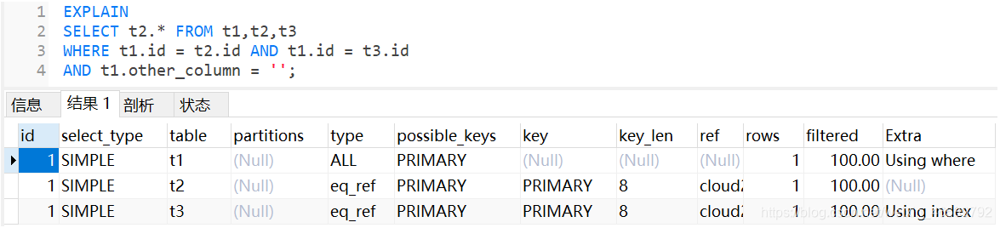


## 46. MySQL 执行架构

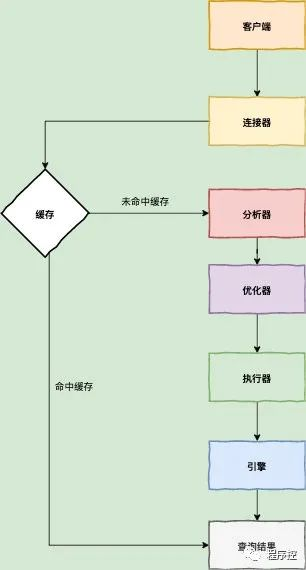

客户端会先通过连接器连接，然后查询缓存中是否有我们想要的数据，即是否缓存命中。命中则直接返回数据，否则进入分析器和优化器，分析Sql语句和优化Sql语句，然后执行器选择相应的引擎执行。 

## 47. 联合查询

联合查询（UNION）是 SQL 中用于合并两个或多个 SELECT 语句的结果集的操作符。UNION ALL 也是类似的操作符，但不会去除重复行。下面是对联合查询和联合查询相关面试题的介绍：


联合查询（UNION）：

- **基本语法**：`SELECT column1, column2, ... FROM table1 UNION SELECT column1, column2, ... FROM table2;`
- **作用**：合并两个或多个 SELECT 查询的结果集，并去除重复行。
- **特点**：
  - UNION 会对结果进行排序和去重操作，消耗更多的资源。
  - UNION 会将重复的行合并为一行，只保留一份。
  - 结果集中的列数、数据类型和顺序必须相同。


联合查询（UNION ALL）：

- **基本语法**：`SELECT column1, column2, ... FROM table1 UNION ALL SELECT column1, column2, ... FROM table2;`
- **作用**：合并两个或多个 SELECT 查询的结果集，不去除重复行。
- **特点**：
  - UNION ALL 不会对结果进行排序和去重操作，性能相对于 UNION 更高。
  - 结果集中的列数、数据类型和顺序必须相同。


面试题示例：

1. **联合查询与联合查询之间的区别是什么？**
   - 联合查询（UNION）会对结果进行排序和去重操作，合并两个或多个查询的结果集，并去除重复行。
   - 联合查询（UNION ALL）也会合并两个或多个查询的结果集，但不会进行排序和去重操作，保留所有的行，包括重复行。

2. **在 SQL 中，如何处理两个查询的结果集中存在重复行的情况？**
   - 使用联合查询时，如果希望去除重复行，可以使用 UNION 操作符；
   - 如果希望保留所有行，包括重复行，可以使用 UNION ALL 操作符。
   
3. **联合查询是否会对结果进行排序？**
   - 联合查询（UNION）会对结果进行排序，以保证结果中的行是唯一的。
   - 联合查询（UNION ALL）不会对结果进行排序。

4. **什么时候使用 UNION，什么时候使用 UNION ALL？**
   - 使用 UNION 当希望合并两个或多个查询的结果集，并且希望去除重复行时。
   - 使用 UNION ALL 当希望合并两个或多个查询的结果集，不需要去除重复行时，或者需要提高性能时。

5. **如果两个 SELECT 语句的结果集列不一致，可以进行 UNION 操作吗？**
   - 不可以。在进行 UNION 操作时，两个 SELECT 查询的结果集的列数、数据类型和顺序必须相同，否则会导致语法错误。


## 48. 数据库删除操作中的 delete、drop、 truncate 区别在哪

- 当不再需要该表时可以用 drop 来删除表;
- 当仍要保留该表，但要删除所有记录时， 用 truncate 来删除表中记录。
- 当要删除部分记录时（一般来说有 WHERE 子句约束） 用 delete 来删除表中部分记录。


在数据库中，`DELETE`、`DROP` 和 `TRUNCATE` 是用于删除数据或对象的操作，它们有不同的用途和效果。下面是它们的区别：

1. **DELETE**：
   - `DELETE` 用于从表中删除行。它是一种 DML（Data Manipulation Language）语句，用于删除满足指定条件的行。
   - `DELETE` 操作是逐行进行的，它会生成事务日志，可以撤销和恢复删除操作，同时也会触发相关的触发器（如果有）。
   - `DELETE` 不会释放表空间，被删除的行只是被标记为已删除，实际数据仍然存在。

2. **DROP**：
   - `DROP` 用于删除数据库中的对象，如表、索引、视图等。它是一种 DDL（Data Definition Language）语句。
   - `DROP` 操作会彻底删除对象及其相关的数据，包括所有的数据和元数据，不可恢复。
   - `DROP` 操作会释放对象所占用的空间，并且会立即生效，不会触发触发器。

3. **TRUNCATE**：
   - `TRUNCATE` 用于删除表中的所有数据。它是一种 DDL 语句。
   - `TRUNCATE` 操作会删除表中的所有行，但保留表的结构定义、约束和索引等，相当于将表清空。
   - `TRUNCATE` 操作比 `DELETE` 操作更快，因为它不是逐行进行的，而是直接删除整个表的数据。它也不会触发触发器。
   - `TRUNCATE` 操作会释放表空间，但是不能回滚操作，一旦执行，数据将不可恢复。

**总结**：

- `DELETE` 用于删除表中的行，是一种 DML 操作，逐行进行，可以撤销和恢复。
- `DROP` 用于删除数据库中的对象，彻底删除，不可恢复，释放空间，是一种 DDL 操作。
- `TRUNCATE` 用于删除表中的所有数据，保留表结构，速度快，释放空间，是一种 DDL 操作。


## 49. MySQL语句执行顺序

在 MySQL 中，当 SQL 语句中包含 JOIN 操作和聚合函数时，一般的执行顺序如下：

1. **FROM**：指定要查询的数据表，并进行连接操作（JOIN）。
2. **JOIN**：根据连接条件将多个表的数据进行合并。
3. **WHERE**：对连接后的数据进行筛选，只返回符合条件的数据。
4. 格式化函数会在group之前执行，如DATE_FORMAT()函数
5. **GROUP BY**：按指定列对数据进行分组。
6. 聚合函数
7. **HAVING**：对分组后的数据进行筛选。
8. **SELECT**：选择要查询的列，可以包括聚合函数。
9. **ORDER BY**：对结果集进行排序。
10. **LIMIT**：限制返回结果的行数。

需要注意的是，聚合函数通常会在 SELECT 子句中使用，用于对分组后的数据进行统计计算，如 SUM、AVG、COUNT 等。这些聚合函数会在 GROUP BY 子句之后执行，而 HAVING 子句则用于对聚合后的结果进行筛选。

总体来说，SQL 语句的执行顺序是根据语句中的关键字顺序来决定的，但在实际执行中，数据库系统会根据查询优化器的规则来决定最优的执行计划，以提高查询性能。

# 六、数据库中间件

> https://zhuanlan.zhihu.com/p/51010198
>
> https://cloud.tencent.com/developer/article/1496200

数据库中间件作为应用程序和数据库之间的代理,充当一个缓冲层,使得应用程序可以通过中间件来访问数据库，而不必直接与数据库通信。

## 1. 什么需要数据库中间件

传统的架构模式就是 应用连接数据库直接对数据进行访问，这种架构特点就是简单方便。

但是随着目前数据量不断的增大我们就遇到了问题:

1. 单个表数据量太大
2. 单个库数据量太大
3. 单台数据量服务器压力很大
4. 读写速度遇到瓶颈

当面临以上问题时，我们会想到的第一种解决方式就是 向上扩展(scale up) 简单来说就是不断增加硬件性能。这种方式只能暂时解决问题，当业务量不断增长时还是解决不了问题。特别是淘宝，facebook，youtube这种业务成线性，甚至指数级上升的情况。

此时我们不得不依赖于第二种方式： 水平扩展 ，除了增加应用服务器外，还会涉及到数据库的垂直以及分库分表，数据库读写分离等，这个时候就需要用到数据库中间件。


## 2. 数据库中间件的功能

### 通用的数据库中间件会支持多种数据库的协议

连接数据库中间件用的是标准的数据库协议如jdbc，而数据库中间件在与各种数据库通讯时用的是各数据库的协议。这样在应用程序中就可以透明化的使用数据库，减少开发成本，与适配数据库所带来开发成本，如图：

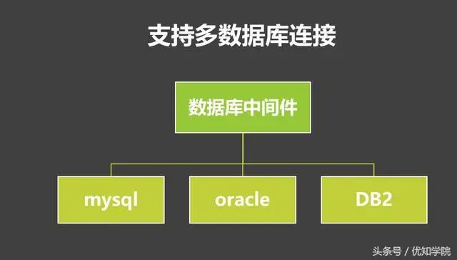


### 读写分离

#### 定义

随着业务的不断发展，用户数量和并发量不断上升。这时如果仅靠单个数据库实例来支撑所有访问压力,几乎是在 自寻死路 。以产品库为例，可能库中包含了几万种商品，并且每天新增几十种，而产品库每天的访问了可能有几亿甚至几十亿次。数据库读的压力太大，单台mysql实例扛不住，此时大部分 Mysql DBA 就会将数据库设置成 读写分离状态 。也就是一个 Master 节点(主库)对应多个 Salve 节点(从库)。可以将slave节点的数据理解为master节点数据的全量备份。


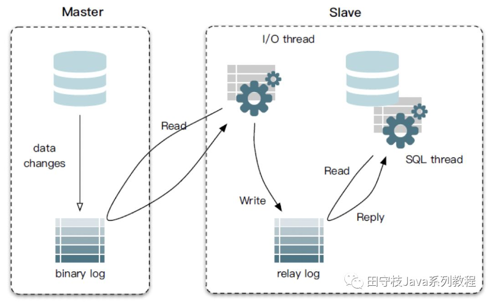

- master节点接收用户的写请求，并写入到本地二进制文件(binary log)中。slave通过一个I/O线程与Master建立连接，发送binlog dump指令。Master会将binlog数据推送给slave，slave将接收到的binlog保存到本地的中继日志(relay log)中，最后，slave通过另一个线程SQL thread应用本地的relay log，将数据同步到slave库中。

- 关于mysql主从复制，内部包含很多细节。例如binlog 格式分为statement、row和mixed，binlog同步方式又可以划分为：异步、半同步和同步。复制可以基于binlogFile+position，也可以基于GTID。通常，这些都是DBA负责维护的，业务RD无感知。在DBA将mysql配置成主从复制集群的背景下，开发同学所需要做的工作是：当更新数据时，应用将数据写入master主库，主库将数据同步给多个slave从库。当查询数据时，应用选择某个slave节点读取数据。

#### 读写分离的优点

- 这样通过配置多个slave节点，可以有效的避免过大的访问量对单个库造成的压力。

#### 读写分离的挑战

-  对于DBA而言，多了很多集群运维工作:例如集群搭建、主从切换、从库扩容、缩容等。例如master配置了多个slave节点，如果其中某个slave节点挂了，那么之后的读请求，我们应用将其转发到正常工作的slave节点上。另外，如果新增了slave节点，应用也应该感知到，可以将读请求转发到新的slave节点上。

- 对于开发人员而言

  - 基本读写分离功能：对sql类型进行判断，如果是select等读请求，就走从库，如果是insert、update、delete等写请求，就走主库。

  - 主从数据同步延迟问题：因为数据是从master节点通过网络同步给多个slave节点，因此必然存在延迟。因此有可能出现我们在master节点中已经插入了数据，但是从slave节点却读取不到的问题。对于一些强一致性的业务场景，要求插入后必须能读取到，因此对于这种情况，我们需要提供一种方式，让读请求也可以走主库，而主库上的数据必然是最新的。

  - 事务问题：如果一个事务中同时包含了读请求(如select)和写请求(如insert)，如果读请求走从库，写请求走主库，由于跨了多个库，那么本地事务已经无法控制，属于[分布式事务](https://cloud.tencent.com/product/dtf?from_column=20065&from=20065)的范畴。而分布式事务非常复杂且效率较低。因此对于读写分离，目前主流的做法是，事务中的所有sql统一都走主库，由于只涉及到一个库，本地事务就可以搞定。

  - 感知集群信息变更：如果访问的数据库集群信息变更了，例如主从切换了，写流量就要到新的主库上；又例如增加了从库数量，流量需要可以打到新的从库上；又或者某个从库延迟或者失败率比较高，应该将这个从库进行隔离，读流量尽量打到正常的从库上 


### 分库分表

#### 定义

经过垂直分区后的 Master/Salve 模式完全可以承受住难以想象的高并发访问操作，但是否可以永远 高枕无忧 了？答案是否定的，一旦业务表中的数据量大了，从维护和性能角度来看，无论是任何的 CRUD 操作，对于数据库而言都是一件极其耗费资源的事情。即便设置了索引， 仍然无法掩盖因为数据量过大从而导致的数据库性能下降的事实 ，因此这个时候 Mysql DBA 或许就该对数据库进行 水平分区 （sharding，即分库分表 ）。经过水平分区设置后的业务表，必然能够将原本一张表维护的海量数据分配给 N 个子表进行存储和维护。

水平分表从具体实现上又可以分为3种：只分表、只分库、分库分表，下图展示了这三种情况：

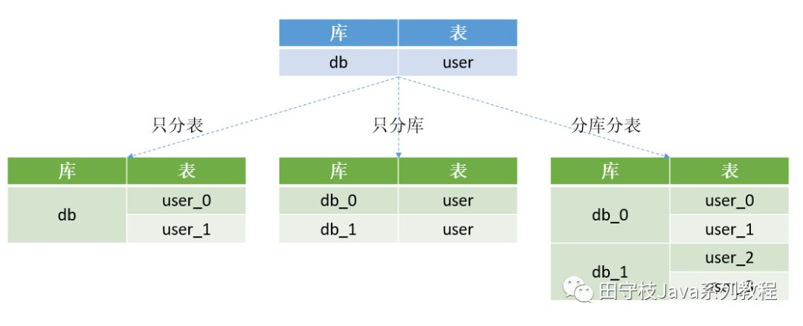

- 只分表：

将db库中的user表拆分为2个分表，user_0和user_1，这两个表还位于同一个库中。适用场景：如果库中的多个表中只有某张表或者少数表数据量过大，那么只需要针对这些表进行拆分，其他表保持不变。

- 只分库：

将db库拆分为db_0和db_1两个库，同时在db_0和db_1库中各自新建一个user表，db_0.user表和db_1.user表中各自只存原来的db.user表中的部分数据。

- 分库分表：

将db库拆分为db_0和db_1两个库，db_0中包含user_0、user_1两个分表，db_1中包含user_2、user_3两个分表。下图演示了在分库分表的情况下，数据是如何拆分的：假设db库的user表中原来有4000W条数据，现在将db库拆分为2个分库db_0和db_1，user表拆分为user_0、user_1、user_2、user_3四个分表，每个分表存储1000W条数据。


#### 分库分表的好处

如果说读写分离实现了数据库读能力的水平扩展，那么分库分表就是实现了写能力的水平扩展。 

- 存储能力的水平扩展

在读写分离的情况下，每个集群中的master和slave基本上数据是完全一致的，从存储能力来说，在存在海量数据的情况下，可能由于磁盘空间的限制，无法存储所有的数据。而在分库分表的情况下，我们可以搭建多个mysql主从复制集群，每个集群只存储部分分片的数据，实现存储能力的水平扩展。

- 写能力的水平扩展

在读写分离的情况下，由于每个集群只有一个master，所有的写操作压力都集中在这一个节点上，在写入并发非常高的情况下，这里会成为整个系统的瓶颈。

而在分库分表的情况下，每个分片所属的集群都有一个master节点，都可以执行写入操作，实现写能力的水平扩展。此外减小建立索引开销，降低写操作的锁操作耗时等，都会带来很多显然的好处。 

#### 分库分表的挑战

分库分表的挑战主要体现在4个方面：基本的数据库增删改功能，分布式id，分布式事务，动态扩容，下面逐一进行讲述。 


**挑战1：基本的数据库增删改功能**   

对于开发人员而言，虽然分库分表的，但是其还是希望能和单库单表那样的去操作数据库。例如我们要批量插入四条用户记录，并且希望根据用户的id字段，确定这条记录插入哪个库的哪张表。例如1号记录插入user1表，2号记录插入user2表，3号记录插入user3表，4号记录插入user0表，以此类推。sql如下所示：

```javascript
这样的sql明显是无法执行的，因为我们已经对库和表进行了拆分,这种sql语法只能操作mysql的单个库和单个表。所以必须将sql改成4条如下所示，然后分别到每个库上去执行。
```

具体流程可以用下图进行描述：

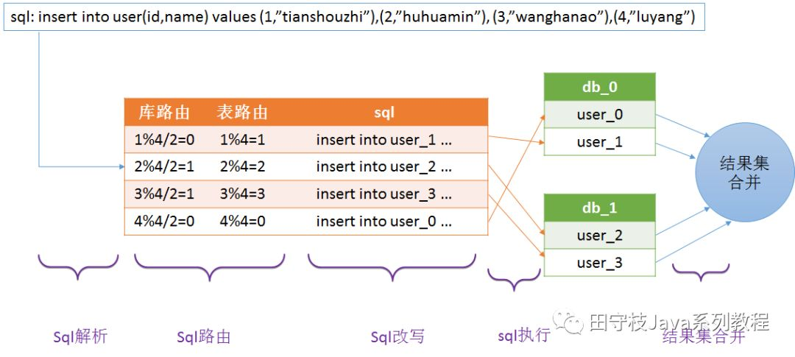

解释如下：

- sql解析：首先对sql进行解析，得到需要插入的四条记录的id字段的值分别为1,2,3,4
- sql路由：sql路由包括库路由和表路由。库路由用于确定这条记录应该插入哪个库，表路由用于确定这条记录应该插入哪个表。
- sql改写：因为一条记录只能插入到一个库中，而上述批量插入的语法将会在 每个库中都插入四条记录，明显是不合适的，因此需要对sql进行改写，每个库只插入一条记录。
- sql执行：一条sql经过改写后变成了多条sql，为了提升效率应该并发的到不同的库上去执行，而不是按照顺序逐一执行
- 结果集合并：每个sql执行之后，都会有一个执行结果，我们需要对分库分表的结果集进行合并，从而得到一个完整的结果。


**挑战2：分布式id**

在分库分表后，我们不能再使用mysql的自增主键。因为在插入记录的时候，不同的库生成的记录的自增id可能会出现冲突。因此需要有一个全局的id生成器。目前分布式id有很多中方案，其中一个比较轻量级的方案是twitter的snowflake算法。

**挑战3：分布式事务**

分布式事务是分库分表绕不过去的一个坎，因为涉及到了同时更新多个分片数据。例如上面的批量插入记录到四个不同的库，如何保证要么同时成功，要么同时失败。关于分布式事务，mysql支持XA事务，但是效率较低。柔性事务是目前比较主流的方案，柔性事务包括：最大努力通知型、可靠消息最终一致性方案以及TCC两阶段提交。但是无论XA事务还是柔性事务，实现起来都是非常复杂的。

**挑战4：动态扩容**

动态扩容指的是增加分库分表的数量。例如原来的user表拆分到2个库的四张表上。现在我们希望将分库的数量变为4个，分表的数量变为8个。这种情况下一般要伴随着数据迁移。例如在4张表的情况下，id为7的记录，7%4=3，因此这条记录位于user3这张表上。但是现在分表的数量变为了8个，而7%8=0，而user0这张表上根本就没有id=7的这条记录，因此如果不进行数据迁移的话，就会出现记录找不到的情况。


#### SQL解析

用户执行只是一条sql，并传入相关参数。数据库中间件内部需要通过sql解析器，对sql进行解析。可以将sql解析，类比为xml解析，xml解析的最终结果是得到一个document对象，而sql解析最终得到一个抽象语法树(AST)。通过这个语法树，我们可以很简单的获取到sql的一些执行，例如当前执行的sql类型，查询了那些字段，数据库表名，where条件，sql的参数等一系列信息。通常来说，对于sql解析，内部需要经过词法(lex)解析和语法(Syntax)解析两个阶段，最终得到一个语法树。 

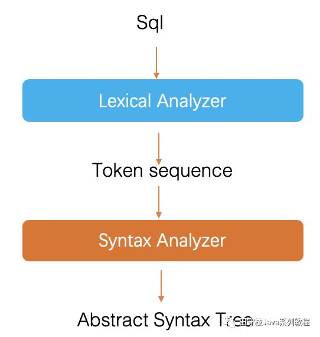


SQL解析器的内部实现原理对业务同学是屏蔽的，业务同学也感知不到。一些数据库中间件采用了第三方开源的sql解析器，也有一些自研sql解析器。例如mycat、zebra采用的都是druid解析器，shard-jdbc一开始也用的是druid解析器，后面自研了解析器。目前较为流行的sql解析器包括：

- FoundationDB SQL Parser
- Jsqlparser
- Druid SQL Parser

​        其中，其中Fdbparser和jsqlparser都是基于javacc实现的。

mycat团队曾经做过一个性能测试，druid解析器的解析性能通常能达到基于javacc生成的sql解析器10~20倍。本人也进行过类似的测试，得出的结论基本一致。如何对比不同的sql解析器的好坏呢？主要是考虑以下两点：

- 解析性能：druid最好。

- druid采用的是预测分析法，它只需要从字符的第一个到最后一个遍历一遍，就同时完成了词法解析和语法解析，语法树也已经构造完成。


数据库方言：druid支持的最多。

- SQL-92、SQL-99等都是标准SQL，mysql/oracle/pg/sqlserver/odps等都是方言，sql-parser需要针对不同的方言进行特别处理。Druid的sql parser是目前支持各种数据语法最完备的SQL Parser。

- 注：这里说的仅仅是基于Java实现的SQL解析器，druid是比较好的。大部分同学可能知道druid是一个为监控而生的连接池，事实上，druid另一大特性，就是它的SQL解析器。很多开源的数据库中间件，例如zebra、sharding-jdbc等，都使用了druid解析器。(sharding-jdbc后来自研了解析器)。虽然SQL解析是druid的一大亮点，不过github上也因为SQL解析的bug，收到了不少issue

#### SQL路由

路由规则是分库分表的基础，其规定了数据应该按照怎样的规则路由到不同的分库分表中。对于一个数据库中间件来说，通常是支持用户自定义任何路由规则的。路由规则本质上是一个脚本表达式，数据库中间件通过内置的脚本引擎对表达式进行计算，确定最终要操作哪些分库、分表。常见的路由规则包括哈希取模，按照日期等。

下图展示了user表进行分库分表后(2个分库，每个分库2个分表)，并如何根据id进行路由的规则： 

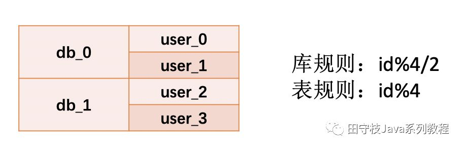

路由分则分为：

- 库规则：用于确定到哪一个分库
- 表规则：用于确定到哪一个分表

在上例中，我们使用id来作为计算分表、分表，因此把id字段就称之为路由字段，或者分区字段。

需要注意的是，不管执行的是INSERT、UPDATE、DELETE、SELECT语句，SQL中都应该包含这个路由字段。否则，对于插入语句来说，就不知道插入到哪个分库或者分表；对于UPDATE、DELETE、SELECT语句而言，则更为严重，因为不知道操作哪个分库分表，意味着必须要对所有分表都进行操作。SELECT聚合所有分表的内容，极容易内存溢出，UPDATE、DELETE更新、删除所有的记录，非常容易误更新、删除数据。因此，一些数据库中间件，对于SQL可能有一些限制，例如UPDATE、DELETE必须要带上分区字段，或者指定过滤条件。


#### SQL改写

前面已经介绍过，如一个批量插入语句，如果记录要插入到不同的分库分表中，那么就需要对SQL进行改写。 例如，将以下SQL

```javascript
insert into user(id,name) values (1,”tianshouzhi”),(2,”huhuamin”), (3,”wanghanao”),(4,”luyang”)
```

改写为：

```javascript
insert into user_1(id,name) values (1,”tianshouzhi”)insert into user_2(id,name) values (2,”huhuamin”)insert into user_3(id,name) values (3,”wanghanao”)insert into user_0(id,name) values  (4,”luyang”)
```

这里只是一个简单的案例，通常对于INSERT、UPDATE、DELETE等，改写相对简单。比较复杂的是SELECT语句的改写，对于一些复杂的SELECT语句，改写过程中会进行一些优化，例如将子查询改成JOIN，过滤条件下推等。因为SQL改写很复杂，所以很多数据库中间件并不支持复杂的SQL(通常有一个支持的SQL)，只能支持一些简单的OLTP场景。

当然也有一些数据库中间件，不满足于只支持OLTP，在迈向OLAP的方向上进行了更多的努力。例如阿里的TDDL、蚂蚁的Zdal、大众点评的zebra，都引入了apache calcite，尝试对复杂的查询SQL(例如嵌套子查询，join等)进行支持，通过过滤条件下推，流式读取，并结合RBO(基于规则的优化)、CBO(基于代价的优化)来对一些简单的OLAP场景进行支持。

#### SQL执行

当经过SQL改写阶段后，会产生多个SQL，需要到不同的分片上去执行，通常我们会使用一个线程池，将每个SQL包装成一个任务，提交到线程池里面并发的去执行，以提升效率。

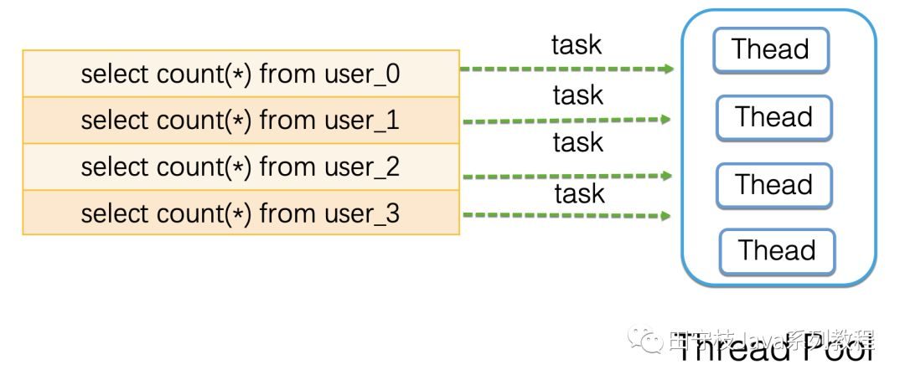

这些执行的SQL中，如果有一个失败，则整体失败，返回异常给业务代码。 

#### 结果集合并

结果集合并，是数据库中间件的一大难点，需要case by case的分析，主要是考虑实现的复杂度，以及执行的效率问题，对于一些复杂的SQL，可能并不支持。例如：

对于查询条件：大部分中间件都支持=、IN作为查询条件，且可以作为分区字段。但是对于NIT IN、BETWEEN…AND、LIKE,NOT LIKE等，只能作为普通的查询条件，因为根据这些条件，无法记录到底是在哪个分库或者分表，只能全表扫描。

聚合函数：大部分中间件都支持MAX、MIN、COUNT、SUM，但是对于AVG可能只是部分支持。另外，如果是函数嵌套、分组(GROUP BY)聚合，可能也有一些数据库中间件不支持。

子查询：分为FROM部分的子查询和WHERE部分的子查询。大部分中对于子查询的支持都是非常有限，例如语法上兼容，但是无法识别子查询中的分区字段，或者要求子查询的表名必须与外部查询表名相同，又或者只能支持一级嵌套子查询。

JOIN：对于JOIN的支持通常很复杂，如果做不到过滤条件下推和流式读取，在中间件层面，基本无法对JOIN进行支持，因为不可能把两个表的所有分表，全部拿到内存中来进行JOIN，内存早就崩了。当然也有一些取巧的办法，一个是Binding Table，另外一个是小表广播(见后文)。

分页排序：通常中间件都是支持ORDER BY和LIMIT的。但是在分库分表的情况下，分页的效率较低。例如对于limit 100，10 ORDER BY id。表示按照id排序，从第100个位置开始取10条记录。那么，大部分数据库中间件实际上是要从每个分表都查询110(100+10)条记录，拿到内存中进行重新排序，然后取出10条。假设有10个分表，那么实际上要查询1100条记录，而最终只过滤出了10记录。因此，在分页的情况下，通常建议使用"where id > ? limit 10”的方式来进行查询，应用记住每次查询的最大的记录id。之后查询时，每个分表只需要从这个id之后，取10条记录即可，而不是取offset + rows条记录。 

关于JOIN的特属说明：

- **Binding Table：**

适用于两个表之间存在关联关系，路由规则相同。例如，有user表和user_account表，由于user_account与user表强关联，我们可以将这两个表的路由规则设置为完全一样，那么对于某个特定用户的信息，其所在的user分表和user_account分表必然唯一同一个分库下，后缀名相同的分表中。在join时，某一个分库内的join，就可以拿到这个用户以及账号的完整信息，而不需要进行跨库join，这样就不需要把用户的数据库拿到内存中来进行join。 

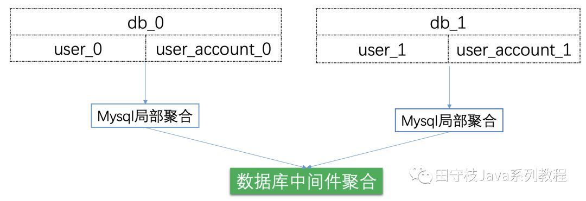

- **小表广播：**

小表广播通常是某一个表的数据量比较少， 例如部门表department。另外一个表数据量比较大，例如user。此时user需要进行分库分表，但是department不需要进行分库分表。为了达到JOIN的目的，我们可以将 department表在每个分库内都实时同步一份完整的数据。这样，在JOIN的时候，数据库中间件只需要将分库JOIN的结果进行简单合并即可。

下图演示了小表广播的流程，用户在更新department表时，总是更新分库db0的department表，同步组件将变更信息同步到其他分库中。 

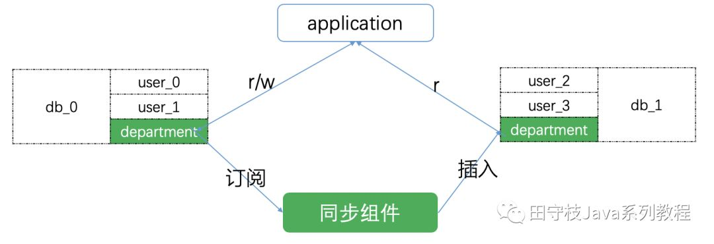

#### 二级索引

通常情况下，分库分表的时候，分区字段只有一个。例如对于用户表user，按照user_id字段进行分区，那么之后查询某个用户的信息，只能根据user_id作为分区字段。使用其他字段，则需要扫描所有分表，效率很低。但是又有根据其他字段查询某个用户信息的需求，例如根据手机号phone_id。

此时，我们可以将按照user_id插入的数据，进行一份全量拷贝。通过同步组件，重新按照phone_id插入到另一个分库分表集群中，这个集群就成为二级索引，或者叫辅维度同步。此后，对于根据user_id的操作，就在原来的分库分表集群中进行操作；根据phone_id的操作，就到二级索引集群中去进行操作。需要注意的是，对于更新操作，只能操作原集群，二级索引集群只能执行查询操作。原集群的增量数据变更信息，实时的通过同步组件，同步到二级索引集群中。 

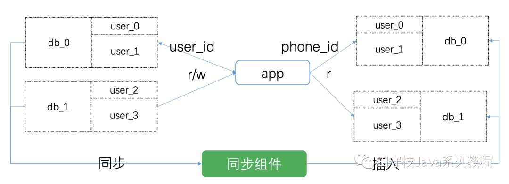

## 3. 设计方案

典型的数据库中间件设计方案有2种：proxy、smart-client。下图演示了这两种方案的架构：

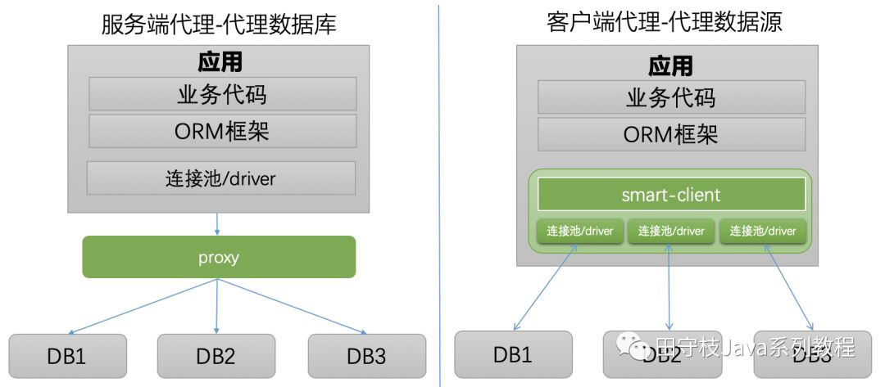

可以看到不论是proxy还是smart-client，底层都操作了多个数据库实例。不论是分库分表，还是读写分离，都是在数据库中间件层面对业务开发同学进行屏蔽。

### proxy模式

我们独立部署一个代理服务，这个代理服务背后管理多个数据库实例。而在应用中，我们通过一个普通的数据源(c3p0、druid、dbcp等)与代理服务器建立连接，所有的sql操作语句都是发送给这个代理，由这个代理去操作底层数据库，得到结果并返回给应用。在这种方案下，分库分表和读写分离的逻辑对开发人员是完全透明的。

- 优点：
  - 多语言支持。也就是说，不论你用的php、java或是其他语言，都可以支持。以mysql数据库为例，如果proxy本身实现了mysql的通信协议，那么你可以就将其看成一个mysql 服务器。mysql官方团队为不同语言提供了不同的客户端却动，如java语言的mysql-connector-java，python语言的mysql-connector-python等等。因此不同语言的开发者都可以使用mysql官方提供的对应的驱动来与这个代理服务器建通信。
  - 学不需要进行太多代码改造，既可以完成接入。

- 缺点：
  - 实现复杂。因为proxy需要实现被代理的数据库server端的通信协议，实现难度较大。通常我们看到一些proxy模式的数据库中间件，实际上只能代理某一种数据库，如mysql。几乎没有数据库中间件，可以同时代理多种数据库(sqlserver、PostgreSQL、Oracle)。
  - proxy本身需要保证高可用。由于应用本来是直接访问数据库，现在改成了访问proxy，意味着proxy必须保证高可用。否则，数据库没有宕机，proxy挂了，导致数据库无法正常访问，就尴尬了。 
  - 租户隔离。可能有多个应用访问proxy代理的底层数据库，必然会对proxy自身的内存、网络、cpu等产生资源竞争，proxy需要需要具备隔离的能力。

### smart-client模式

业务代码需要进行一些改造，引入支持读写分离或者分库分表的功能的sdk，这个就是我们的smart-client。通常smart-client是在连接池或者driver的基础上进行了一层封装，smart-client内部与不同的库建立连接。应用程序产生的sql交给smart-client进行处理，其内部对sql进行必要的操作，例如在读写分离情况下，选择走从库还是主库；在分库分表的情况下，进行sql解析、sql改写等操作，然后路由到不同的分库，将得到的结果进行合并，返回给应用。

- 优点：

  - 实现简单。proxy需要实现数据库的服务端协议，但是smart-client不需要实现客户端通信协议。原因在于，大多数据数据库厂商已经针对不同的语言提供了相应的数据库驱动driver，例如mysql针对java语言提供了mysql-connector-java驱动，针对python提供了mysql-connector-python驱动，客户端的通信协议已经在driver层面做过了。因此smart-client模式的中间件，通常只需要在此基础上进行封装即可。

  - 天然去中心化。smart-client的方式，由于本身以sdk的方式，被应用直接引入，随着应用部署到不同的节点上，且直连数据库，中间不需要有代理层。因此相较于proxy而言，除了网络资源之外，基本上不存在任何其他资源的竞争，也不需要考虑高可用的问题。只要应用的节点没有全部宕机，就可以访问数据库。(这里的高可用是相比proxy而言，数据库本身的高可用还是需要保证的)

- 缺点：

  - 通常仅支持某一种语言。例如tddl、zebra、sharding-jdbc都是使用java语言开发，因此对于使用其他语言的用户，就无法使用这些中间件。如果其他语言要使用，那么就要开发多语言客户端。

  - 版本升级困难。因为应用使用数据源代理就是引入一个jar包的依赖，在有多个应用都对某个版本的jar包产生依赖时，一旦这个版本有bug，所有的应用都需要升级。而数据库代理升级则相对容易，因为服务是单独部署的，只要升级这个代理服务器，所有连接到这个代理的应用自然也就相当于都升级了。

## 4. 业界产品

> https://www.cnblogs.com/wzh2010/p/16098579.html

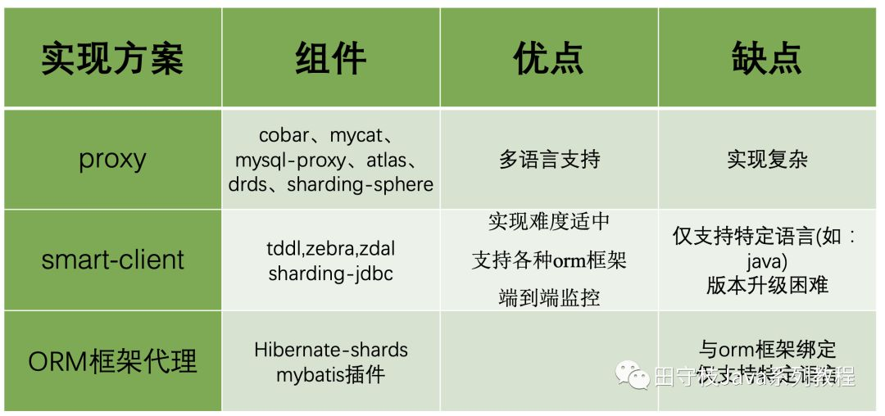


## 5. 强制走主库

有的时候，对于一些强一致性的场景，需要写入后，必须能读取到数据。由于主从同步存在延迟，可能会出现主库写入，而从库查不到的情况。这次时候，我们需要使用强制走主库的功能。具体实现上有2种方案：hint 或API

### hint

就是开发人员在sql上做一些特殊的标记，数据库中间件识别到这个标记，就知道这个sql需要走主库，如： 

```javascript
/*master*/select * from table_xx
```

这里的/*master*/就是一个hint，表示需要走主库。不同的数据库中间件强制走主库的hint可能不同，例如zebra的hint为/*zebra:w+*/，hint到底是什么样是无所谓的，其作用仅仅就是一个标记而已。之所以将hint写在/*…*/中，是因为这是标准的sql注释语法。即使数据库中间件未能识别这个hint，也不会导致sql语法错误。

### api

主要是通过代码的方式来添加sql走主库的标识，hint通常只能加在某个sql上。如果我们希望多个sql同时都走主库，也不希望加hint，则可以通过api的方式，其内部主要利用语言的thread local线程上下文特性，如：

```java
ForceMasterHelper.forceMaster()   
//…执行多条
sqlForceMasterHelper.clear()
```

在api标识范围内执行的sql，都会走主库。具体API到底应该是什么样，如何使用，也是由相应的数据库中间件来决定的。

特别的，对于一些特殊的sql，例如 select last_insert_id；或者select @@identity等，这类sql总是需要走主库。这些sql是要获得最后一个插入记录的id，插入操作只可能发生在主库上。


## 6. 从库路由策略

通常在一个集群中，只会有一个master，但是有多个slave。当判断是一个读请求时，如何判断选择哪个slave呢？

一些简单的选择策略包括：

- 随机选择(random)
- 按照权重进行选择(weight)
- 轮训(round-robin)等

特别的，对于一些跨IDC(数据中心)部署的数据库集群，通常需要有就近路由的策略，如下图： 

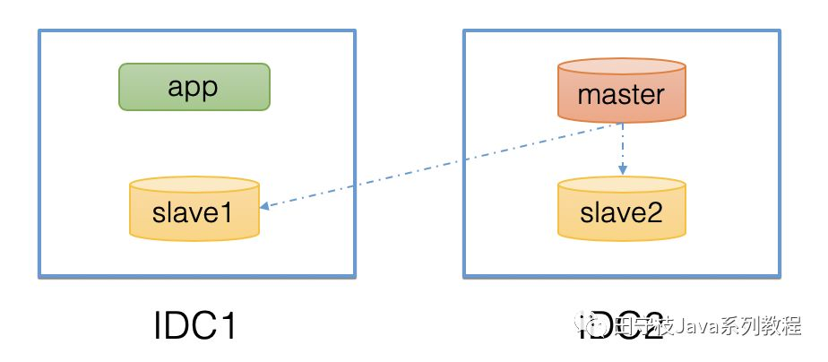

图中，在IDC2部署了一个master，在IDC1和IDC2各部署了一个slave，应用app部署在IDC1。显然当app接收到一个查询请求时，应该优先查询与其位于同一个数据中心的slave1，而不是跨数据中心去查询slave2，这就是就近路由的概念。

当然一个数据中心内，可能会部署多个slave，也需要进行选择，因此就近路由通常和一些基本的路由策略结合使用。另外，对于就近路由，通常也会有一个层级，例如同机房、同中心、同区域、跨区域等。 


## 7. HA、Scalable相关

数据库中间件除了需要具备上述提到的读写分离功能来访问底层的数据库集群。也需要一套支持高可用、动态扩展的体系：

- 从HA的角度来说，例如主库宕机了，那么应该从从库选择一个作为新的主库。开源的MHA可以帮助我们完成这个事；然而，MHA只能在主库宕机的情况下，完成主从切换，对于仅仅是一个从库宕机的情况下，MHA通常是无能为力的。因此，通常都会在MHA进行改造，使其支持更多的HA能力要求。
- 从Scalable角度来说，例如读qps实在太高，需要加一些从库，来分担读流量。

事实上，无论是HA，还是Scalable，对于数据库中间件(不论是proxy或者smart-client)来说，只是配置信息发生了变更。 因此，通常我们会将所有的配置变更信息写到一个[配置中心](https://cloud.tencent.com/product/tse?from_column=20065&from=20065)，然后监听这个配置的变更，例如主从切换，只需要把最新的主从信息设置到配置中心；增加从库，把新从库ip、port等信息放到配置中心。数据库中间件通过对这些配置信息变更进行监听，当配置发生变更时，实时的应用最新的配置信息即可。

因此，一个简化的数据库中间件的高可用架构通常如下所示： 

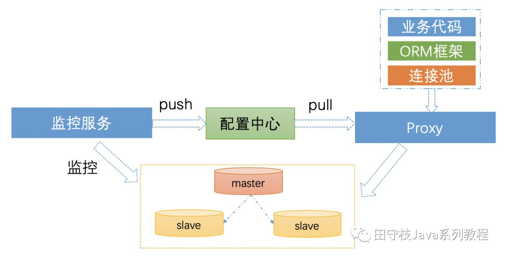


监控服务对集群进行监控，当发生变更时，将变更的信息push到配置中心中，数据库中间件(proxy或smart-client)接收到配置变更，应用最新的配置。而整个过程，对于业务代码基本是无感知的。

对于配置中心的选择，有很多，例如百度的disconf、阿里的diamond、点评开源的lion、携程开源的apollo等，也可以使用etcd、consul。通常如果没有历史包袱的话，建议使用携程开源的apollo。

特别需要注意的一点是，通常监控服务监控到集群信息变更，推送到配置中心，再到数据库中间件，必然存在一些延迟。对于一些场景，例如主从切换，没有办法做到彻底的业务无感知。当然，对于多个从库中，某个从库宕机的情况下，是可以做到业务无感知的。例如，某个从库失败，数据库中间件，自动从其他正常的从库进行重试。

另外，上图中的HA方案强依赖于配置中心，如果某个数据库集群上建立了很多库，这个集群发生变更时，将会存在大量的配置信息需要推送。又或者，如果数据库集群是多机房部署的，在某个机房整体宕机的情况下(例如光纤被挖断了，或者机房宕机演练)，也会存在大量的配置信息需要推送。如果配置中心，推送有延迟，业务会有非常明显的感知。

因此，通常我们会在客户端进行一些轻量级的HA保障。例如，根据数据库返回异常的sqlstate和vendor code，判断异常的严重级别，确定数据库实例能否正常提供服务，如果不能正常提供服务，则自动将其进行隔离，并启动异步线程进行检测数据库实例是否恢复。

最后，很多数据库中间件，也会提供一些限流和降级的功能，计算sql的唯一标识(有些称之为sql指纹)，对于一些烂sql，导致数据库压力变大的情况，可以实时的进行拦截，直接抛出异常，不让这些sql打到后端数据库上去。


## 8. 分布式id生成器

在分库分表的情况下，数据库的自增主键已经无法使用。所以要使用一个分布式的id生成器。分布式事务id生成器要满足以下条件：唯一、趋势递增(减少落库时的索引开销)、高性能、高可用。

目前主流的分布式id生成方案都有第三方组件依赖，如：

- 基于zk
- 基于mysql
- 基于缓存

twitter的snowflake算法是一个完全去中心化的分布式id算法，但是限制workid最多能有1024，也就是说，应用规模不能超过1024。虽然可以进行细微的调整，但是总是有数量的限制。 

另外，美团之前在github开源了一个leaf组件，是用于生成分布式id的，感兴趣的读者可以研究一下。

这里提出一种支持动态扩容的去中心化分布式id生成方案，此方案的优势，除了保证唯一、趋势递增，没有第三方依赖，支持存储的动态扩容之外，还具有以下优势：

- 支持按照时间范围查询，或者 时间范围+ip查询，可以直接走主键索引；
- 每秒的最大序列id就是某个ip的qps等

```javascript
 12位日期+10位IP+6位序列ID+4位数据库扩展位
```

复制

其中：

12位日期：格式为yyMMddHHmmss，意味着本方案的id生成策略可以使用到2099年，把时间部分前置，从而保证趋势递增。

10位ip：利用ip to decimal算法将12位的ip转为10进制数字。通过ip地址，来保证全局唯一。如果ip地址被回收重复利用了，也不用担心id的唯一性，因为日期部分还在变化。

6位序列id：意味着每秒最多支持生成100百万个id(0~999999)。不足6位前置补0，如000123。

4位数据库扩展位：为了实现不迁移数据的情况下，实现动态扩容，其中2位表示DB，2位表示TB，最多可扩容到10000张表。假设每张表存储1000万数据，则总共可以支持存储1000亿条数据。 

关于数据库扩展位实现动态扩容图解：

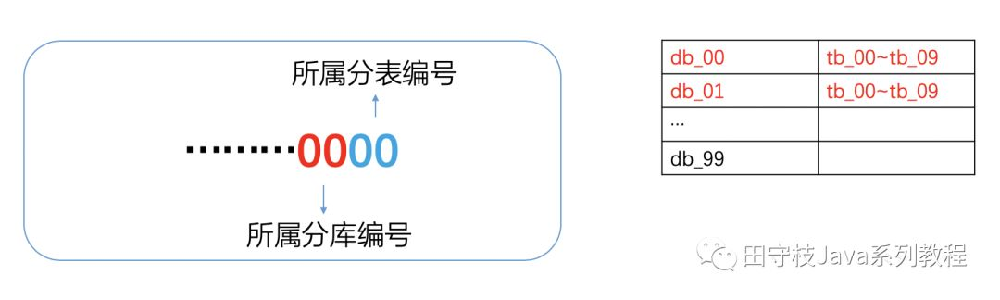


首先明确一点，路由策略始终根据数据库最后四位，确定某一条记录要到哪个分库的哪个分表中。例如xxxx0001，意味着这条记录肯定是在00分库的01分表上。接着，就要在id的生成策略上做文章。

- 假设初始状态为两个分库db_00,db_01，每个分库里面有10张分表，tb_00~tb_09。此时，业务要保证生成id的时候，始终保证db的两位在00~01之间，tb的两位始终在00~09之间。路由策略根据这些id，可以找到正确的分库分表。

- 现在需要扩容到10个分库，每个分表10个分表。那么DBA首先将新增的分库：db_02~db_09创建好，每个分库里面再创建10个分表：tb_01~tb_09。业务同学在此基础上，将id生成策略改成：db的两位在00~09之间，tb的两位规则维持不变(只是分库数变了，每个分库的分表数没变)。而由于路由从策略是根据最后四位确定到哪个分库，哪个分表，当这些新的分库分表扩展位id出现时，自然可以插入到新的分库分表中。也就实现了动态扩容，而无需迁移数据。

当然，新的分库分表中，一开始数据是没有数据的，所以数据是不均匀的，可以调整id扩展位中db和tb生成某个值的概率，使得落到新的分库分表中的概率相对大一点点(不宜太大)，等到数据均匀后，再重新调整成完全随机。

此方案的核心思想是，预分配未来的可能使用到的最大资源数量。通常，100个分库，每个分库100张分表，能满足绝大部分应用的数据存储。如果100个分库都在不同的mysql实例上，假设每个mysql实例都是4T的磁盘，那么可以存储400T的数据，基本上可以满足绝大部分业务的需求。

当然，这个方案不完美。如果超过这个值，这种方案可能就不可行了。然而，通常一个技术方案，可以保证在5~10年之间不需要在架构上做变动，应该就算的上一个好方案了。如果你追求的是完美的方案，可能类似于TIDB这种可以实现自动扩容的数据库产品更适合，不过目前来说，TIDB等类似产品还是无法取代传统的[关系型数据库](https://cloud.tencent.com/product/cdb-overview?from_column=20065&from=20065)的。说不定等到5~10年后，这些产品更成熟了，你再迁移过去也不迟。

## 分布式事务

在分库分表的情况下，由于操作多个分库，此时就涉及到分布式事务。例如执行一个批量插入SQL，如果记录要插入到不同的分库中，就无法保证一致性。因此，通常情况下，数据库中间件，只会保证单个分库的事务，也就是说，业务方在创建一个事务的时候，必须要保证事务中的所有操作，必须最终都在一个分库中执行。

事实上，在微服务的架构下，事务的问题更加复杂，如下图

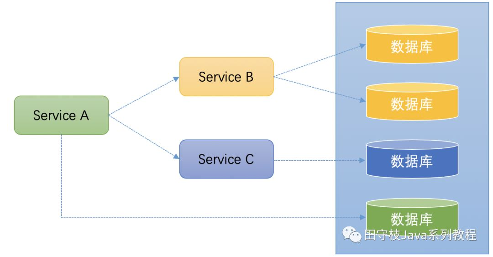

Service A在执行某个操作时，需要操作数据库，同时调用Service B和Service C，Service B底层操作的数据库是分库分表的，Service C也要操作数据库。

这种场景下，保证事务的一致性就非常麻烦。一些常用的一致性算法如：paxios协议、raft协议也无法解决这个问题，因为这些协议都是资源层面的一致性。在微服务架构下，已经将事务的一致性上升到了业务的层面。

如果仅仅考虑分库分表，一些同学可能会想到XA，但是性能很差，对数据库的版本也有要求，例如必须使用mysql 5.7，官方还建议将事务隔离级别设置为串行化，这是无法容忍的。

由于分布式事务的应用场景，并不是仅仅分库分表，因此通常都是会有一个专门的团队来做分布式事务，并不一定是数据库中间件团队来做。例如，sharding-jdbc就使用了华为开源的一套微服务架构解决方案service comb中的saga组件，来实现分布式事务最终一致性。阿里也有类似的组件，在内部叫TXC，在阿里云上叫GTS，最近开源到了GitHub上叫fescar（Fast & Easy Commit And Rollback)。蚂蚁金服也有类似的组件，叫DTX，支持FMT模式和TCC模式。其中FMT模式就类似于TXC。

总体来说，实际上TCC更能满足业务的需求，虽然接入更加复杂。关于fescar，最近比较火，这是java写的，具体可以参考：https://github.com/alibaba/fescar。 