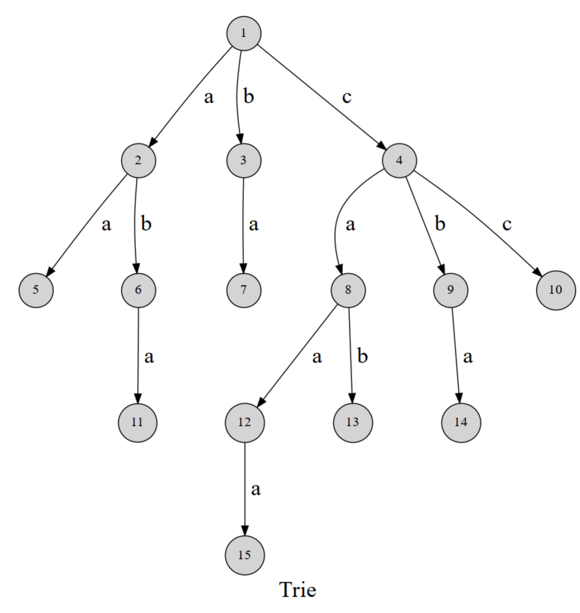
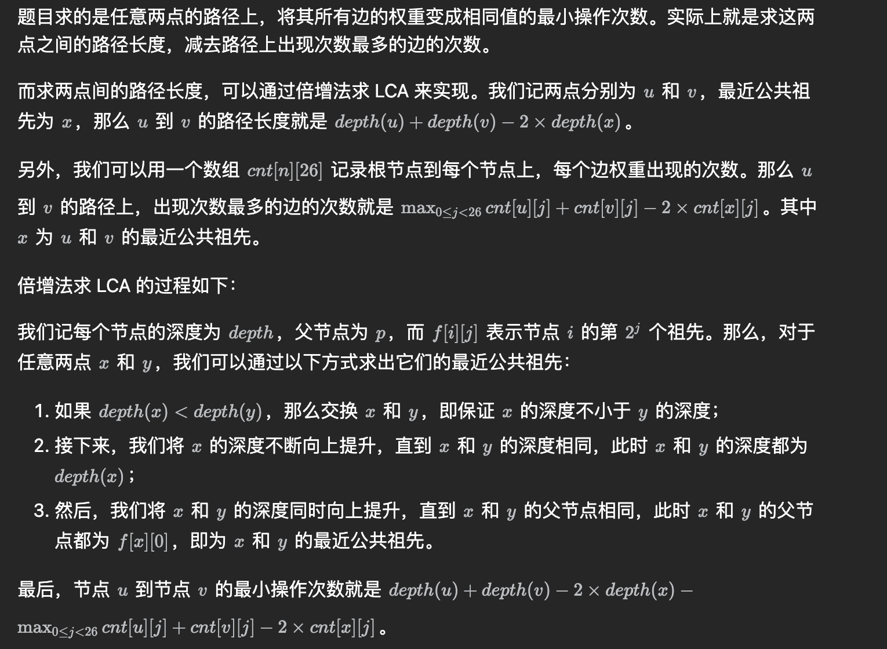

# Algorithm

> 开始于2023年年末，仅用于个人刷算法题的笔记。

[TOC]

# 零、背景
## 0.1 参考资料
- [LeetCode 101](https://github.com/pigeonwx/pigeonwx.github.io/blob/e420c5b7fd09f757260613cb85add5a956e3f038/docs/%E7%AE%97%E6%B3%95/LeetCode%20101%20-%20A%20LeetCode%20Grinding%20Guide%20(C%2B%2B%20Version).pdf)

##  0.2 基本数学

### 0.2.1 最大公约数

```java
public int gcd(int x, int y){
        if(x>y){
            return gcd(y,x);
        }
        while(y%x!=0){
            int t=y%x;
            y=x;
            x=t;
        }
        return x;
    }
```


# 一、常用工具

## 1.1 Stack 

```java
Stack<Integer> stack = new Stack<>();
stack.push(1);
stack.push(2);
stack.push(3);
int topElement = stack.pop(); // 移除并返回栈顶元素
int topElement = stack.peek(); // 查看栈顶元素但不移除
boolean isEmpty = stack.isEmpty(); // 检查栈是否为空
```

## 1.2 队列

### 1.2.1 普通队列

- ```java
  Queue<Integer> queue = new LinkedList<>();
  queue.offer(1);
  queue.offer(2);
  queue.offer(3);
  int frontElement = queue.poll(); // 移除并返回队列头部的元素
  int frontElement = queue.peek(); // 查看队列头部的元素但不移除
  boolean isEmpty = queue.isEmpty(); // 检查队列是否为空
  ```


### 1.2.2 双端队列

- ```java
  Deque<Integer> deque = new LinkedList<>();
  deque.addFirst(1);
  deque.offerFirst(2);
  
  Deque<Integer> deque = new LinkedList<>();
  deque.addLast(3);
  deque.offerLast(4);
  
  int frontElement = deque.removeFirst(); // 从队头移除并返回元素
  int rearElement = deque.removeLast(); // 从队尾移除并返回元素
  int frontElement = deque.getFirst(); // 查看队头元素但不移除
  int rearElement = deque.getLast(); // 查看队尾元素但不移除
  boolean isEmpty = deque.isEmpty(); // 检查双端队列是否为空
  ```

### 1.2.3 优先级队列

- ```java
  import java.util.PriorityQueue;
  
  public class PriorityQueueExample {
      public static void main(String[] args) {
          // 创建一个优先队列，按自然顺序排序
          PriorityQueue<Integer> minHeap = new PriorityQueue<>();
  
          // 添加元素到队列
          minHeap.offer(10);
          minHeap.offer(5);
          minHeap.offer(8);
          minHeap.offer(1);
  
          // 输出队列中的元素（按照升序排列）
          System.out.println("升序排列的元素：");
          while (!minHeap.isEmpty()) {
              System.out.println(minHeap.poll());
          }
  
          // 创建一个使用比较器来确定优先级的优先队列（降序排列）
          PriorityQueue<Integer> maxHeap = new PriorityQueue<>((a, b) -> b - a);
  
          // 添加元素到队列
          maxHeap.offer(10);
          maxHeap.offer(5);
          maxHeap.offer(8);
          maxHeap.offer(1);
  
          // 输出队列中的元素（按照降序排列）
          System.out.println("降序排列的元素：");
          while (!maxHeap.isEmpty()) {
              System.out.println(maxHeap.poll());
          }
      }
  }
  
  ```


## 1.3 Map

### 1.3.1 基本操作

```java
Map<String, Integer> myMap = new HashMap<>();
myMap.put("Alice", 25);
myMap.put("Bob", 30);
myMap.put("Charlie", 28);

int age = myMap.get("Alice"); // 获取键 "Alice" 对应的值
// mpMap.getOrDefault(i, default)
boolean containsBob = myMap.containsKey("Bob");
boolean containsAge28 = myMap.containsValue(28);

// 遍历键或值： 通过迭代 Map 可以遍历它的键或值。
for (String name : myMap.keySet()) {
    System.out.println("Name: " + name);
}
for (int age : myMap.values()) {
    System.out.println("Age: " + age);
}
for (Map.Entry<String, Integer> entry : myMap.entrySet()) {
    String name = entry.getKey();
    int age = entry.getValue();
    System.out.println(name + " is " + age + " years old.");
}
myMap.remove("Charlie"); // 删除键 "Charlie" 对应的键值对
Set<String> keys = myMap.keySet();
Collection<Integer> values = myMap.values();

```

 ### 1.3.2 Pair

```java
import javafx.util.Pair;
public class PairExample {
    public static void main(String[] args) {
        Pair<String, Integer> pair = new Pair<>("Alice", 25);
        String name = pair.getKey();
        int age = pair.getValue();
        System.out.println(name + " is " + age + " years old.");
    }
}

```


### 1.3.3 TreeMap ceiling&floor

```java
TreeMap<Integer, String> treeMap = new TreeMap<>();
treeMap.put(1, "One");
treeMap.put(3, "Three");
treeMap.put(5, "Five");

Integer ceilingResult = treeMap.ceilingKey(2); // 结果是3
Integer ceilingResult2 = treeMap.ceilingKey(4); // 结果是5


TreeMap<Integer, String> treeMap = new TreeMap<>();
treeMap.put(1, "One");
treeMap.put(3, "Three");
treeMap.put(5, "Five");

Integer floorResult = treeMap.floorKey(4); // 结果是3
Integer floorResult2 = treeMap.floorKey(0); // 结果是null，因为没有小于0的键

```

### 1.3.4 TreeMap 自定义排序

```java
TreeMap<Person, String> people = new TreeMap<>(new AgeComparator<Person>(){
  @Override
    public int compare(Person person1, Person person2) {
        return person1.getAge() - person2.getAge();
    }
});
        people.put(new Person("Alice", 30), "Engineer");
        people.put(new Person("Bob", 25), "Designer");
        people.put(new Person("Charlie", 35), "Manager");

        for (Person person : people.keySet()) {
            System.out.println(person + " - " + people.get(person));
        }
```


## 1.4 Set

### 1.4.1 基本操作

```java
Set<String> set = new HashSet<>(); // 使用 HashSet
Set<Integer> linkedHashSet = new LinkedHashSet<>(); // 使用 LinkedHashSet，保持插入顺序
Set<String> treeSet = new TreeSet<>(); // 使用 TreeSet，元素有序且可排序

set.add("apple");
set.add("banana");
set.add("cherry");

set.remove("banana");
boolean contains = set.contains("apple");
int size = set.size();

for (String item : set) {
    System.out.println(item);
}

set.clear();
String[] array = set.toArray(new String[0]);


Iterator<String> iterator = set.iterator();
while (iterator.hasNext()) {
    String item = iterator.next();
    System.out.println(item);
}

boolean isEmpty = set.isEmpty();

```

### 1.4.2 TreeSet ceiling & floor

```java
//一些函数
import java.util.TreeSet;

public class TreeSetExample {
    public static void main(String[] args) {
        TreeSet<Integer> treeSet = new TreeSet<>();
        treeSet.add(1);
        treeSet.add(3);
        treeSet.add(5);
        treeSet.add(7);

        Integer ceilingResult = treeSet.ceiling(4); // 返回大于或等于4的最小元素，即 5
        Integer floorResult = treeSet.floor(4);     // 返回小于或等于4的最大元素，即 3

        System.out.println("Ceiling: " + ceilingResult);
        System.out.println("Floor: " + floorResult);
    }
}
```

### 1.4.3 TreeSet 自定义排序

```java
TreeSet<Person> people = new TreeSet<>(new Comparator<Person>() {
       @Override
       public int compare(Person person1, Person person2) {
                return person1.getAge() - person2.getAge();
            }
        });
        people.add(new Person("Alice", 30));
        people.add(new Person("Bob", 25));
        people.add(new Person("Charlie", 35));

        for (Person person : people) {
            System.out.println(person);
        }
}
```


## 1.5 Vector-建议多线程

```java
Vector<String> vector = new Vector<>();
vector.add("Apple");
vector.add("Banana");
vector.add("Cherry");
String element = vector.get(1); // 获取索引为1的元素，即 "Banana"
vector.set(0, "Orange"); // 将索引为0的元素修改为 "Orange"
vector.remove(2); // 删除索引为2的元素，即 "Cherry"
int size = vector.size();
for (String item : vector) {
    System.out.println(item);
}
boolean contains = vector.contains("Apple");
vector.clear();

```

## 1.6 List

```java
ArrayList<String> list = new ArrayList<>();
list.add("Apple");
list.add("Banana");
list.add("Cherry");
String element = list.get(1); // 获取索引为1的元素，即 "Banana"
list.set(0, "Orange"); // 将索引为0的元素修改为 "Orange"
list.remove(2); // 删除索引为2的元素，即 "Cherry"
int size = list.size();
for (String item : list) {
    System.out.println(item);
}
boolean contains = list.contains("Apple");
list.clear();

```

## 1.7 Stream

Java中的Stream是Java 8引入的一个新的抽象概念，它提供了一种更便利和高效的处理集合数据的方式。Stream可以让我们以一种类似于SQL查询的方式对集合数据进行操作，包括过滤、映射、排序、归约等。

以下是Java中Stream的一些常见用法：

1. 创建Stream：
   - 从集合创建：`List<String> list = Arrays.asList("a", "b", "c"); Stream<String> stream = list.stream();`
   - 从数组创建：`String[] array = {"a", "b", "c"}; Stream<String> stream = Arrays.stream(array);`
   - 使用Stream.of创建：`Stream<String> stream = Stream.of("a", "b", "c");`

2. 中间操作：
   - 过滤：`stream.filter(s -> s.startsWith("a"))`
   - 映射：`stream.map(String::toUpperCase)`
   - 排序：`stream.sorted()`
   - 去重：`stream.distinct()`
   - 截断：`stream.limit(5)`
   - 跳过：`stream.skip(3)`

3. 终端操作：
   - 收集到集合：`List<String> resultList = stream.collect(Collectors.toList())`
   - 转换为数组：`String[] array = stream.toArray(String[]::new)`
   - 匹配：`boolean anyMatch = stream.anyMatch(s -> s.startsWith("a"))`
   - 计数：`long count = stream.count()`
   - 最大值：`Optional<String> max = stream.max(Comparator.naturalOrder())`

4. 并行Stream：
   - 通过`parallelStream()`方法可以将普通Stream转换为并行Stream，以便在多核处理器上并行执行操作。

Java中的Stream提供了丰富的API，并且可以与Lambda表达式和方法引用等特性结合使用，可以让代码更加简洁和易读。使用Stream可以帮助我们更方便地对集合数据进行处理，并且利用并行Stream可以提高处理速度。

- **数字平方排序（倒叙）输出&&字符串转 map 输出**

```java
import java.util.List;
import java.util.Arrays;
import java.util.Map;
import java.util.HashMap;
import java.util.stream.Collectors;
class Main {
    public static void main(String[] args) {
        List<Integer> numbers = Arrays.asList(3, 2, 2, 3, 7, 3, 5);
        // 获取对应的平方数
//        List<Integer> squaresList = numbers.stream().map( i -> i*i).distinct().collect(Collectors.toList());
        List<Integer> squaresList = numbers.stream()
                .map(i -> i * i)
                .sorted((x, y) -> y - x)
                .collect(Collectors.toList());
//        squaresList.forEach(System.out::println);
        squaresList.forEach(num -> {
            num++;
            System.out.println(num);
        });

        List<String> strList = Arrays.asList("a", "ba", "bb", "abc", "cbb", "bba", "cab");
        Map<Integer, String> strMap = new HashMap<Integer, String>();

        strMap = strList.stream()
                .collect( Collectors.toMap( str -> strList.indexOf(str), str -> str ) );
        
        strMap.forEach((key, value) -> {
            System.out.println(key+"::"+value);
        });

    }
}
```


## 1.8 数组

在Java中，数组是一组具有相同数据类型的元素的集合。以下是一些Java数组的相关操作以及多维数组的初始化方法：

### Java数组的相关操作：

1. **声明数组：** 声明数组需要指定数组的类型和数组的名称，如 `int[] numbers;` 或 `String[] names;`。
   
2. **创建数组：** 使用 `new` 关键字创建数组，并指定数组的长度，如 `numbers = new int[5];` 或 `names = new String[10];`。

3. **初始化数组：** 可以在声明数组的同时进行初始化，或者在创建数组后进行初始化。

   ```java
   int[] numbers = {1, 2, 3, 4, 5};
   String[] names = new String[]{"Alice", "Bob", "Charlie"};
   ```

4. **访问数组元素：** 使用索引访问数组元素，索引从0开始。

   ```java
   int firstNumber = numbers[0];
   String secondName = names[1];
   ```

5. **修改数组元素：** 使用索引修改数组元素的值。

   ```java
   numbers[0] = 10;
   names[1] = "Bill";
   ```

6. **遍历数组：** 使用循环结构遍历数组中的所有元素。

   ```java
   for (int i = 0; i < numbers.length; i++) {
       System.out.println(numbers[i]);
   }
   
   for (String name : names) {
       System.out.println(name);
   }
   ```

### 多维数组的初始化：

多维数组是数组的数组。Java中多维数组的初始化可以分为两种方式：

1. **静态初始化：** 在声明多维数组时进行初始化。

   ```java
   int[][] matrix = {{1, 2, 3}, {4, 5, 6}, {7, 8, 9}};
   ```

2. **动态初始化：** 先声明多维数组，然后在之后进行初始化。

   ```java
   int[][] matrix = new int[3][3];
   matrix[0][0] = 1;
   matrix[0][1] = 2;
   // 其他元素类似
   ```

以上是Java数组的基本操作和多维数组的初始化方法。通过这些操作，可以方便地创建和操作数组。

## 1.9 String

在Java中，String类是用来表示字符串的，提供了丰富的方法来操作字符串。以下是一些常用的String类的相关函数和用法：

1. **length()：** 返回字符串的长度。

   ```java
   String str = "Hello";
   int length = str.length(); // length = 5
   ```

2. **charAt(int index)：** 返回指定索引处的字符。

   ```java
   char ch = str.charAt(0); // ch = 'H'
   ```

3. **substring(int beginIndex) 和 substring(int beginIndex, int endIndex)：** 返回从指定索引开始到字符串末尾的子字符串，或者返回从指定索引开始到指定索引结束的子字符串。

   ```java
   String sub1 = str.substring(1);    // sub1 = "ello"
   String sub2 = str.substring(1, 3); // sub2 = "el"
   ```

4. **indexOf(String str) 和 indexOf(String str, int fromIndex)：** 返回指定字符串在当前字符串中第一次出现的位置，或者从指定位置开始搜索指定字符串第一次出现的位置。

   ```java
   int index1 = str.indexOf("l");      // index1 = 2
   int index2 = str.indexOf("l", 3);   // index2 = 3
   ```

5. **toUpperCase() 和 toLowerCase()：** 将字符串转换为全大写或全小写。

   ```java
   String upperCase = str.toUpperCase(); // upperCase = "HELLO"
   String lowerCase = str.toLowerCase(); // lowerCase = "hello"
   ```

6. **trim()：** 去除字符串前后的空格。

   ```java
   String trimmed = "   Hello   ".trim(); // trimmed = "Hello"
   ```

7. **equals(Object obj) 和 equalsIgnoreCase(String anotherString)：** 判断两个字符串是否相等，或者忽略大小写判断两个字符串是否相等。

   ```java
   boolean isEqual = str.equals("Hello");            // isEqual = true
   boolean isIgnoreCaseEqual = str.equalsIgnoreCase("hello"); // isIgnoreCaseEqual = true
   ```

8. **startsWith(String prefix) 和 endsWith(String suffix)：** 判断字符串是否以指定前缀开头或以指定后缀结尾。

   ```java
   boolean startsWith = str.startsWith("He");   // startsWith = true
   boolean endsWith = str.endsWith("lo");       // endsWith = true
   ```

9. **split(String regex)：** 将字符串根据指定的正则表达式分割成字符串数组。

   ```java
   String[] parts = str.split("l"); // parts = {"He", "", "o"}
   ```

10. **replace(char oldChar, char newChar) 和 replace(CharSequence target, CharSequence replacement)：** 替换字符串中的字符或者字符串。

    ```java
    String replaced1 = str.replace('l', 'L');                    // replaced1 = "HeLLo"
    String replaced2 = str.replace("ll", "LL");                   // replaced2 = "HeLLo"
    ```

这些是String类的一些常用方法，能够帮助你对字符串进行各种操作。

# 二、常用函数

## 2.1 逆转函数

- ```java
  String str = "Hello, World!";
  StringBuilder reversedStr = new StringBuilder(str).reverse();
  ```

- ```java
  List<Integer> list = new ArrayList<>();
  list.add(1);
  list.add(2);
  list.add(3);
  
  Collections.reverse(list);
  ```

## 2.2 排序函数

### 2.2.1 Collections 排序

> java.util.Collections中的静态方法的Collection.sort()主要是针对集合框架中的动态数组，链表，树，哈希表等（ ArrayList、LinkedList、HashSet、LinkedHashSet、HashMap、LinkedHashMap ）进行排序。

```java
Collections.sort(s, new Comparator <student>(){
        public int compare(student p1,student p2){
            if (p1.getGrade()>p2.getGrade())
                return 1;
            else if (p1.getGrade()<p2.getGrade())
                return -1;
            else
                return 0;
        }
    }
);
```


### 2.2.2 Arrays 排序

```java
Arrays.sort(s, new Comparator <student>(){
        public int compare(student p1,student p2){
            if (p1.getGrade()>p2.getGrade())
                return 1;
            else if (p1.getGrade()<p2.getGrade())
                return -1;
            else
                return 0;
        }
    }
);
```


## 2.3 类型转换

- ```java
  String str = "123";
  int num = Integer.parseInt(str);
  
  String str = "3.14";
  double num = Double.parseDouble(str);
  
  int num = 123;
  String str = Integer.toString(num);
  String str2 = String.valueOf(num);
  
  double num = 3.14;
  String str = Double.toString(num);
  
  String str = "Hello";
  char[] charArray = str.toCharArray();
  
  char[] charArray = {'H', 'e', 'l', 'l', 'o'};
  String str = new String(charArray);
  
  String str = "true";
  boolean bool = Boolean.parseBoolean(str);
  
  boolean bool = true;
  String str = Boolean.toString(bool);
  
  StringBuilder stringBuilder = new StringBuilder("Hello, ");
  stringBuilder.append("world!");
  String result = stringBuilder.toString();
  
  ```

## 2.4 二分查找

- 找第一个满足x条件的二分查找
  
  ```java
  //A[]为递增序列，x 为欲查询的数，函数返回第一个大于 × 的元素的位置
  //二分上下界为左闭右闭的[left, right],传入的初值为[0,n]
   int upper_bound(int A[], int left, int right, int x){
   		int mid;
   		//mid为 left 和 right 的中点
  		 while (left < right) ( //对[left,right]来说, left==right意味着找到唯一位置
         if(A[mid] > x){
           mid = (left + right) / 2;
          //取中点
          //中间的数大于 ×
          right = mid;
          //往左子区间[left，mid]查找
        else { //中间的数小于等于 ×
          left = mid + 1;
          //往右子区间[mid+1, right]查找
        }
         return left;
    }
  ```


## 2.5 fill函数

在Java中，常见的填充（fill）操作包括使用数组工具类 `Arrays` 中的 `fill` 方法和集合框架中的 `Collections` 类中的 `fill` 方法。

1. **使用 `Arrays.fill` 方法填充数组**：
   
   ```java
   int[] array = new int[5];
   Arrays.fill(array, 10); // 将数组中的所有元素填充为 10
   ```
   
2. **使用 `Collections.fill` 方法填充集合**：
   ```java
   List<String> list = new ArrayList<>();
   list.add("A");
   list.add("B");
   list.add("C");
   Collections.fill(list, "X"); // 将集合中的所有元素填充为 "X"
   ```

这些 `fill` 方法可以帮助我们快速填充数组或集合中的元素，提高代码的简洁性和可读性。需要注意的是，填充操作会将数组或集合中原有的元素都替换为指定的值，因此在使用时要确保填充操作不会影响到原有的数据。

# 三、常用算法

## 3.1 最短路径

### 3.1.1 Dijkstra

> 以邻接矩阵为例

**代码示例**

```java
import java.util.Arrays;

public class DijkstraAlgorithm {
    private static final int V = 6; // 图中节点的数量

    // 辅助函数，用于查找距离数组中最小值的索引
    private int minDistance(int[] dist, boolean[] visited) {
        int min = Integer.MAX_VALUE;
        int minIndex = -1;

        for (int v = 0; v < V; v++) {
            if (!visited[v] && dist[v] < min) {
                min = dist[v];
                minIndex = v;
            }
        }

        return minIndex;
    }

    // 打印最短路径
    private void printSolution(int[] dist) {
        System.out.println("节点\t最短距离");
        for (int i = 0; i < V; i++) {
            System.out.println(i + "\t" + dist[i]);
        }
    }

    // 使用Dijkstra算法找到从起始节点到所有其他节点的最短路径
    public void dijkstra(int[][] graph, int src) {
        int[] dist = new int[V]; // 存储最短距离
        boolean[] visited = new boolean[V]; // 记录节点是否已被访问

        // 初始化距离数组
        Arrays.fill(dist, Integer.MAX_VALUE);
        dist[src] = 0;

        for (int count = 0; count < V - 1; count++) {
            int u = minDistance(dist, visited);
            visited[u] = true;

            for (int v = 0; v < V; v++) {
                if (!visited[v] && graph[u][v] != 0 && dist[u] != Integer.MAX_VALUE && dist[u] + graph[u][v] < dist[v]) {
                    dist[v] = dist[u] + graph[u][v];
                }
            }
        }

        // 打印最短路径
        printSolution(dist);
    }

    public static void main(String[] args) {
        int[][] graph = {
            {0, 1, 4, 0, 0, 0},
            {1, 0, 4, 2, 7, 0},
            {4, 4, 0, 3, 5, 0},
            {0, 2, 3, 0, 4, 6},
            {0, 7, 5, 4, 0, 7},
            {0, 0, 0, 6, 7, 0}
        };

        DijkstraAlgorithm dijkstra = new DijkstraAlgorithm();
        dijkstra.dijkstra(graph, 0);
    }
}

```

### 3.1.2 Floyd

> 以邻接表为例

**代码示例**

```java
public class FloydWarshallAlgorithm {
    private static final int V = 4; // 图中节点的数量

    // 打印最短路径矩阵
    private void printSolution(int[][] dist) {
        System.out.println("最短路径矩阵:");
        for (int i = 0; i < V; i++) {
            for (int j = 0; j < V; j++) {
                if (dist[i][j] == Integer.MAX_VALUE) {
                    System.out.print("INF\t");
                } else {
                    System.out.print(dist[i][j] + "\t");
                }
            }
            System.out.println();
        }
    }

    // 使用Floyd-Warshall算法查找最短路径
    public void floydWarshall(int[][] graph) {
        int[][] dist = new int[V][V];

        // 初始化最短路径矩阵
        for (int i = 0; i < V; i++) {
            for (int j = 0; j < V; j++) {
                dist[i][j] = graph[i][j];
            }
        }

        // 逐一考虑每个中间节点
        for (int k = 0; k < V; k++) {
            for (int i = 0; i < V; i++) {
                for (int j = 0; j < V; j++) {
                    if (dist[i][k] != Integer.MAX_VALUE && dist[k][j] != Integer.MAX_VALUE && dist[i][k] + dist[k][j] < dist[i][j]) {
                        dist[i][j] = dist[i][k] + dist[k][j];
                    }
                }
            }
        }

        // 打印最短路径矩阵
        printSolution(dist);
    }

    public static void main(String[] args) {
        int[][] graph = {
            {0, 5, Integer.MAX_VALUE, 10},
            {Integer.MAX_VALUE, 0, 3, Integer.MAX_VALUE},
            {Integer.MAX_VALUE, Integer.MAX_VALUE, 0, 1},
            {Integer.MAX_VALUE, Integer.MAX_VALUE, Integer.MAX_VALUE, 0}
        };

        FloydWarshallAlgorithm floydWarshall = new FloydWarshallAlgorithm();
        floydWarshall.floydWarshall(graph);
    }
}

```


## 3.2 动态规划

### 3.2.1 最长公共子序列

> 给定两个字符串（或数字序列）A 和 B，求一个字符串，使得这个字符串是 A 和 B 的最长公共部分(子序列可以不连续)。

```java
int lenA = strlen(A + 1); 
//由于读入时下标从 1 开始，因此读取长度也从+1 开始
int lenBstrlen(B + 1);
//边界
for (int i = 0; i <= lenA; i++) {
  dp[i][0] = 0;
}
for (int j=0; j <= lenB; j++){
  dp[0] [j] = 0;
}
//状态转移方程
for (int i = 1; i <= lenA; i++) {
  for(int j = 1; j <= lenB; j++) {
    if (A[i] == B[j]){
      dp[i][j] = dp[i-1][j-1] + 1;
    } else {
      dp[i][j] = max (dp[i - 1][j], dp[i][ j- 1]);
    }
  }
  //dp[lenA] [lenB]是答案
  return dp[lenA] [lenB]

```

### 3.2.2 最长回文子串

> 给出一个字符串 S，求 S 的最长回文子串的长度。

```java
//边界
 for (int i = 0; i < len; i++){
 		dp[i][i] = 1;
 		if (i < len - 1) {
 			if(S[i] == S[i + 1]) {
 				dp [i] [i + 1] = 1;
				ans =2; //初始化时注意当前最长回文子串长度
       }
      }
 }
     //状态转移方程
for(int L = 3; L <= len; L++) { //枚举子串的长度
 		for (int i =0; i+L-1< len; i++) //枚举子串的起始端点
 			int j=i+L-1; //子串的右端点
 			if(S[i] == S[j] && dp[i + 1][ j- 1] == 1) {
 				dp[i] [j] =1;
				ans= L; //更新最长回文子串长度
      }
 		}
}
   
```


### 3.2.3 01背包问题

> 有 n 件物品，每件物品的重量为 w[i]，价值为 c[i]。现有一个容量为 V 的背包，问如何
> 选取物品放入背包，使得背包内物品的总价值最大。其中每种物品都只有1 件。

``` java
 for(int i=1;i<=n;i++){
 		for(int v=V;v>= w[i];v--){
      //可以减少空间复杂度，逆序枚举v  dp [v]=max (dp[v],dp[v-w[i]]+c[i]);
      dp[i][v]=max (dp[i-1][v],dp[i-1][v-w[i]]+c[i]);
   }
 }
```


### 3.2.4完全背包问题

> 有 n 种物品，每种物品的单件重量为 w[i]，价值为 c[i]。现有一个容量为 V 的背包，问
> 如何选取物品放入背包,使得背包内物品的总价值最大。其中每种物品都有无穷件。

```java
 for(int i=1;i<=n;i++){
 			for(int v= w[i];v<= V;v++){ 
        dp[i][v]=max (dp[i-1][v],dp[i][v-w[i]]+c[i]);
        //可以简化，正向枚举 dp[v]=max (dp[v], dp[v-w [i]]+c[i]);
 			}
 }
	
```


## 3.3 排序算法-手写实现

### 3.3.1 快速排序

- 挖坑法

```c++
int partion(int A[], int low, int high) {
    int temp = A[low];
    int l = low, h = high;
    while (l < h) {
        while (l < h && temp <= A[h]) {
            h--;
        }
        A[l] = A[h];
        while (l < h && temp >= A[l]) {
            l++;
        }
        A[h] = A[l];
    }
    A[l] = temp;
    return l;
}

void quick_Sort(int A[], int low, int high) {
    if (low < high) {
        int pos = partion(A, low, high);
        quick_Sort(A, low, pos - 1);
        quick_Sort(A, pos + 1, high);
    }
}
```

- 交换法

```java
int partion(int A[], int low, int high) {
    int pivot = A[low];
    int l = low, h = high;
  	int temp;
    while (l < h) {
        while (l < h && pivot <= A[h]) {
            h--;
        }
        while (l < h && pivot >= A[l]) {
            l++;
        }
       if (l < h) {
            temp = A[l];
            A[l] = A[h];
            A[h] = temp;
        }
    }
    A[low] = A[l];
    A[l]=pivot;
    return l;
}

void quick_Sort(int A[], int low, int high) {
    if (low < high) {
        int pos = partion(A, low, high);
        quick_Sort(A, low, pos - 1);
        quick_Sort(A, pos + 1, high);
    }
}
```


### 3.3.2 桶排序

```java
public static void bucketSort(int[] array) {
    int max = Arrays.stream(array).max().getAsInt();
    int min = Arrays.stream(array).min().getAsInt();
    int bucketSize = 5;
    int bucketCount = (max - min) / bucketSize + 1;
    ArrayList<ArrayList<Integer>> buckets = new ArrayList<>(bucketCount);
    for (int i = 0; i < bucketCount; i++) {
        buckets.add(new ArrayList<>());
    }

    for (int value : array) {
        int bucketIndex = (value - min) / bucketSize;
        buckets.get(bucketIndex).add(value);
    }

    for (ArrayList<Integer> bucket : buckets) {
        Collections.sort(bucket);
    }

    int index = 0;
    for (ArrayList<Integer> bucket : buckets) {
        for (int value : bucket) {
            array[index++] = value;
        }
    }
}

public static void main(String[] args) {
    int[] array = {29, 25, 3, 49, 9, 37, 21, 43};
    bucketSort(array);
    System.out.println(Arrays.toString(array));
}
```

### 3.3.3 堆排序

```java
import java.util.Arrays;

public class HeapSort {

    public static void heapSort(int[] arr) {
        int n = arr.length;

        // 构建最大堆（Heapify）
        for (int i = n / 2 - 1; i >= 0; i--) {
            heapify(arr, n, i);
        }

        // 从最大堆中一个一个取出元素，放入已排序区间
        for (int i = n - 1; i > 0; i--) {
            // 将堆顶元素（最大值）与当前未排序部分的最后一个元素交换
            int temp = arr[0];
            arr[0] = arr[i];
            arr[i] = temp;

            // 对剩余未排序部分重新构建最大堆
            heapify(arr, i, 0);
        }
    }

    // 将数组转换为最大堆
    private static void heapify(int[] arr, int n, int i) {
        int largest = i; // 初始化父节点为最大值
        int left = 2 * i + 1; // 左子节点索引
        int right = 2 * i + 2; // 右子节点索引

        // 如果左子节点大于父节点，则将左子节点索引赋值给最大值索引
        if (left < n && arr[left] > arr[largest]) {
            largest = left;
        }

        // 如果右子节点大于父节点，则将右子节点索引赋值给最大值索引
        if (right < n && arr[right] > arr[largest]) {
            largest = right;
        }

        // 如果最大值索引不等于父节点索引，则交换父节点与最大值
        if (largest != i) {
            int temp = arr[i];
            arr[i] = arr[largest];
            arr[largest] = temp;

            // 继续递归调用，直到子树满足最大堆性质
            heapify(arr, n, largest);
        }
    }

    public static void main(String[] args) {
        int[] arr = {12, 11, 13, 5, 6, 7};
        System.out.println("Original array: " + Arrays.toString(arr));

        heapSort(arr);

        System.out.println("Sorted array using Heap Sort: " + Arrays.toString(arr));
    }
}
```

在这个堆排序实现中，我们首先构建一个最大堆，然后将堆顶元素（最大值）与当前未排序部分的最后一个元素交换，再对剩余未排序部分重新构建最大堆。重复这个过程，直到所有元素都已排序。堆排序的时间复杂度为 O(nlogn)，空间复杂度为 O(1)。

# 四、奇思妙想

## 4.1 GospersHack

- 从小到大n个二进制位里面挑选k个1

```java
void GospersHack(int k, int n)
{
    int set = (1 << k) - 1;
    int limit = (1 << n);
    while (set < limit)
    {
        DoStuff(set);

        // Gosper's hack:
        int c = set & - set;
        int r = set + c;
        set = (((r ^ set) >> 2) / c) | r;
    }
}
```


## 4.2 单调栈

**定义：**单调栈是一种特殊的数据结构，它的特点是栈中的元素保持一种单调性，可以是单调递增或单调递减。单调栈常被用于解决下一个更大元素/更小元素等问题。

**举个例子：**一个常见的问题是求解数组中每个元素的下一个更大元素。给定一个数组，要求找出数组中每个元素右边第一个比它大的元素。如果不存在就输出-1。这个问题就可以用单调栈来解决。具体的Java代码如下：

```java
public int[] nextGreaterElement(int[] nums) {
    int[] res = new int[nums.length];
    Deque<Integer> stack = new ArrayDeque<>();
    for (int i = nums.length - 1; i >= 0; i--) {
        while (!stack.isEmpty() && stack.peek() <= nums[i]) {
            stack.pop();
        }
        res[i] = stack.isEmpty() ? -1 : stack.peek();
        stack.push(nums[i]);
    }
    return res;
}
```

这个代码中，我们从右向左遍历数组，并维护一个单调递减的栈。对于每个元素，当栈不为空且栈顶元素小于或等于当前元素时，就将栈顶元素出栈，这样就保证了栈顶元素总是当前元素的下一个更大元素。然后，将当前元素入栈。最后，如果栈为空，说明当前元素没有下一个更大元素，结果就是-1，否则结果就是栈顶元素。通过单调栈，我们可以在O(n)的时间复杂度内解决这个问题，比暴力解法的O(n^2)要快很多。


## 4.3 字典树




**参考代码如下：**

```java
class TrieNode {
    private TrieNode[] children;
    private boolean isEndOfWord;

    public TrieNode() {
        this.children = new TrieNode[26];
        this.isEndOfWord = false;
    }

    public void insert(String word) {
        TrieNode node = this;
        for (char c : word.toCharArray()) {
            int index = c - 'a';
            if (node.children[index] == null) {
                node.children[index] = new TrieNode();
            }
            node = node.children[index];
        }
        node.isEndOfWord = true;
    }

    public boolean search(String word) {
        TrieNode node = this;
        for (char c : word.toCharArray()) {
            int index = c - 'a';
            if (node.children[index] == null) {
                return false;
            }
            node = node.children[index];
        }
        return node.isEndOfWord;
    }

    public boolean startsWith(String prefix) {
        TrieNode node = this;
        for (char c : prefix.toCharArray()) {
            int index = c - 'a';
            if (node.children[index] == null) {
                return false;
            }
            node = node.children[index];
        }
        return true;
    }
}

public class Trie {
    private TrieNode root;

    public Trie() {
        this.root = new TrieNode();
    }

    public void insert(String word) {
        root.insert(word);
    }

    public boolean search(String word) {
        return root.search(word);
    }

    public boolean startsWith(String prefix) {
        return root.startsWith(prefix);
    }
}

```


## 4.4 LCA倍增法



```java
class Solution {
   public int[] minOperationsQueries(int n, int[][] edges, int[][] queries) {
       int m = 32 - Integer.numberOfLeadingZeros(n);

       // 建图
       List<int[]>[] g = new List[n];
       Arrays.setAll(g, i -> new ArrayList<>()); // 初始化图
       int[][] f = new int[n][m]; // 倍增结点数组
       int[] p = new int[n]; // 父结点数组
       int[][] cnt = new int[n][0]; // 记录结点到根结点的边权出现次数
       int[] depth = new int[n]; // 记录结点深度
       for (var e : edges) {
           int u = e[0], v = e[1], w = e[2] - 1;
           g[u].add(new int[] {v, w});
           g[v].add(new int[] {u, w});
       }
       cnt[0] = new int[26];

       // 层次遍历初始化各变量
       Deque<Integer> q = new ArrayDeque<>();
       q.offer(0);
       while (!q.isEmpty()) {
           int i = q.poll();
           f[i][0] = p[i]; // 从结点 i 走 i^0 步（f[i][0]）到达 i 的父结点（p[i]）
           for (int j = 1; j < m; ++j) {
               f[i][j] = f[f[i][j - 1]][j - 1]; // 完成 f[i][j] 的初始化
           }
           for (var nxt : g[i]) { // 遍历结点 i 的相邻结点
               int j = nxt[0], w = nxt[1];
               if (j != p[i]) { // 不遍历结点 i 的父结点，即只遍历结点 i 的子结点
                   p[j] = i; // 完成 p[j] 的初始化，即结点 j 的父结点指向结点 i 
                   cnt[j] = cnt[i].clone(); // 结点 j 到根结点的边权计数在父结点 i 到根结点的边权计数基础上计算，因此先克隆一份
                   cnt[j][w]++; // 当前遍历到的边 (i, j) 的权重计数计入cnt数组，即从结点 j 到根结点所有边的权重计数
                   depth[j] = depth[i] + 1; // 初始化 depth 深度数组
                   q.offer(j);
               }
           }
       }
       int k = queries.length;
       int[] ans = new int[k];
       for (int i = 0; i < k; ++i) {
           int u = queries[i][0], v = queries[i][1];
           int x = u, y = v;
           if (depth[x] < depth[y]) { // 如果 x 比 y 浅则交换 x, y 保证 x 的深度大于等于 y
               int t = x;
               x = y;
               y = t;
           }

           // 重点 1，根据 f 数组先将 x 走到与 y 同层
           for (int j = m - 1; j >= 0; --j) { // 先尽可能走最大的一步，即 2^j 步，如果超过了 y 的层数，就不走这一步，尝试 2^(j-1) 步。
               if (depth[x] - depth[y] >= (1 << j)) { // 如果 x 与 y 的深度差大于等于 这一步（ 2^j ），那就走这一步，将最近的公共祖先结点 x 更新。
                   x = f[x][j];
               }
           }

           // 重点 2, 将已是同层的 x, y 继续向上走更新 x, y 直到 x, y 的公共祖先相同
           for (int j = m - 1; j >= 0; --j) { // 还是先尽可能走最大的一步
               if (f[x][j] != f[y][j]) { // 如果走这一步还不是公共祖先，就走这一步
                   x = f[x][j]; // 更新 x, y
                   y = f[y][j];
               }
           }

           // 如果重点 1 的循环已经得到了 x, y 不仅同层而且就是相同的结点，那么 x 就是最近的公共祖先
           // 否则会执行重点 2 里的if语句，这样更新后的 x, y 是不相同的，而是 x, y 的父结点是相同的。（可以画图试试看），此时会执行以下if语句，让 x 再走一步到 x, y 的父结点，也就是最近公共祖先。
           if (x != y) { // 
               x = p[x];
           }
           int mx = 0;
           for (int j = 0; j < 26; ++j) { // 得到从 u, v 到公共祖先 x 的边权众数。
               mx = Math.max(mx, cnt[u][j] + cnt[v][j] - 2 * cnt[x][j]);
           }
           ans[i] = depth[u] + depth[v] - 2 * depth[x] - mx; // u 到 v 的路径长度减去边权众数就是需要更改权重的边数，即得到第 i 个查询的答案
       }
       return ans;
   }
}
```


## 4.5 置数求和

> 求一个数的二进制中有几个1 (分治思想)
>
> https://blog.csdn.net/m0_52440465/article/details/134668845?spm=1001.2101.3001.6650.3&utm_medium=distribute.pc_relevant.none-task-blog-2%7Edefault%7EYuanLiJiHua%7EPosition-3-134668845-blog-115082504.235%5Ev42%5Epc_relevant_anti_vip&depth_1-utm_source=distribute.pc_relevant.none-task-blog-2%7Edefault%7EYuanLiJiHua%7EPosition-3-134668845-blog-115082504.235%5Ev42%5Epc_relevant_anti_vip

```java
  static int bitCount(int x) {
        x = (x & 0b01010101010101010101010101010101) + ((x >> 1) & 0b01010101010101010101010101010101);
        x = (x & 0b00110011001100110011001100110011) + ((x >> 2) & 0b00110011001100110011001100110011);
        x = (x & 0b00001111000011110000111100001111) + ((x >> 4) & 0b00001111000011110000111100001111);
        x = (x & 0b00000000111111110000000011111111) + ((x >> 8) & 0b00000000111111110000000011111111);
        x = (x & 0b00000000000000001111111111111111) + ((x >> 16) & 0b00000000000000001111111111111111);
        return x;
    }
```

## 4.6 贝祖法解决水壶问题

> 裴蜀定理（或贝祖定理）得名于法国数学家艾蒂安·裴蜀，说明了对任何整数a、b和它们的[最大公约数](https://baike.baidu.com/item/最大公约数/869308?fromModule=lemma_inlink)d，关于未知数x和y的线性[不定方程](https://baike.baidu.com/item/不定方程/6815217?fromModule=lemma_inlink)（称为裴蜀等式）：若a,b是整数,且[gcd](https://baike.baidu.com/item/gcd/24166657?fromModule=lemma_inlink)(a,b)=d，那么对于任意的整数x,y,ax+by都一定是d的倍数，特别地，一定存在整数x,y，使ax+by=d成立。

**题目：**

有两个水壶，容量分别为 `jug1Capacity` 和 `jug2Capacity` 升。水的供应是无限的。确定是否有可能使用这两个壶准确得到 `targetCapacity` 升。如果可以得到 `targetCapacity` 升水，最后请用以上水壶中的一或两个来盛放取得的 `targetCapacity` 升水。你可以：

- 装满任意一个水壶
- 清空任意一个水壶
- 从一个水壶向另外一个水壶倒水，直到装满或者倒空

**解法：**

我们认为，每次操作只会让桶里的水总量增加 x，增加 y，减少 x，或者减少 y。你可能认为这有问题：如果往一个不满的桶里放水，或者把它排空呢？那变化量不就不是 x 或者 y 了吗？接下来我们来解释这一点：

- 首先要清楚，在题目所给的操作下，两个桶不可能同时有水且不满。因为观察所有题目中的操作，操作的结果都至少有一个桶是空的或者满的；
- 其次，对一个不满的桶加水是没有意义的。因为如果另一个桶是空的，那么这个操作的结果等价于直接从初始状态给这个桶加满水；而如果另一个桶是满的，那么这个操作的结果等价于从初始状态分别给两个桶加满；
- 再次，把一个不满的桶里面的水倒掉是没有意义的。因为如果另一个桶是空的，那么这个操作的结果等价于回到初始状态；而如果另一个桶是满的，那么这个操作的结果等价于从初始状态直接给另一个桶倒满。

因此，我们可以认为每次操作只会给水的总量带来 x 或者 y 的变化量。因此我们的目标可以改写成：找到一对整数 a,b，使得ax+by=z


## 4.7 维护异或值


## 4.8 Boyer-Moore 投票算法

Boyer-Moore 投票算法是一种用于寻找数组中出现次数超过一半的主要元素的算法。该算法由Robert S. Boyer 和 J Strother Moore 于 1981 年首次提出。它的思想是通过抵消不同的元素来找到出现次数超过一半的主要元素。

算法步骤如下：
1. 初始化两个变量：候选主要元素和候选元素计数器。开始时候选主要元素为空，计数器为0。
2. 遍历数组，对于数组中的每个元素：
   - 如果候选主要元素为空，则将当前元素作为候选主要元素，并将计数器设置为1。
   - 如果当前元素与候选主要元素相同，则将计数器加1。
   - 如果当前元素与候选主要元素不同，则将计数器减1。
3. 在遍历完成后，候选主要元素即为最终结果。

该算法的关键在于其特殊的投票机制：不同元素之间的抵消。由于主要元素出现的次数超过数组长度的一半，所以抵消过程中主要元素的计数总是会大于其他非主要元素的计数，最终剩下的候选主要元素即为真正的主要元素。

Boyer-Moore 算法的时间复杂度为 O(n)，空间复杂度为 O(1)，因此是一种高效的寻找主要元素的算法。

```java
class Solution {
    public int majorityElement(int[] nums) {
        int count = 0;
        Integer candidate = null;

        for (int num : nums) {
            if (count == 0) {
                candidate = num;
            }
            count += (num == candidate) ? 1 : -1;
        }

        return candidate;
    }
}
```

