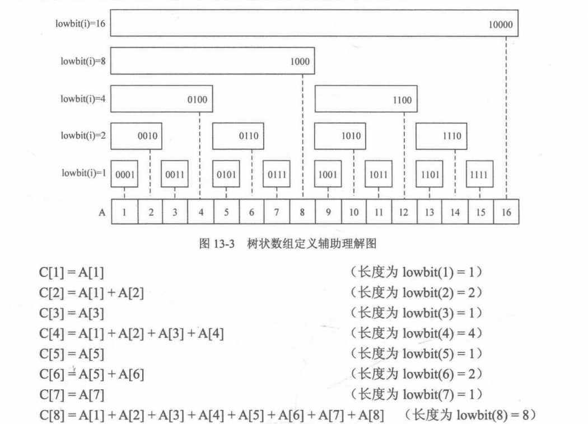
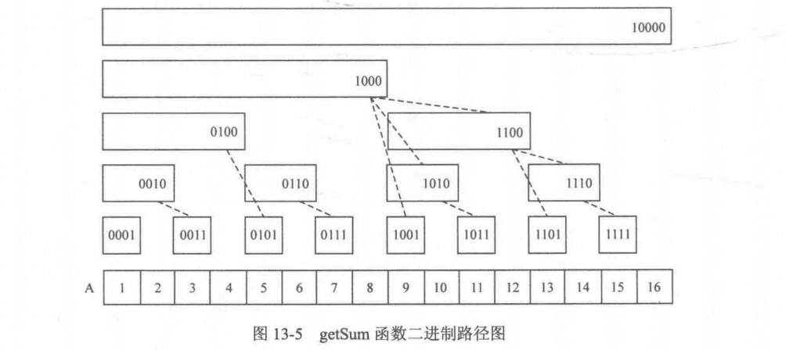
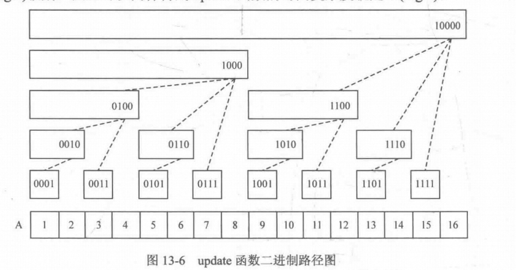

# Algorithm

> 开始于2023年年末，仅用于个人刷算法题的笔记。

[toc]

# 零、背景

## 0.1 参考资料

- [LeetCode 101](https://github.com/pigeonwx/pigeonwx.github.io/blob/e420c5b7fd09f757260613cb85add5a956e3f038/docs/%E7%AE%97%E6%B3%95/LeetCode%20101%20-%20A%20LeetCode%20Grinding%20Guide%20(C%2B%2B%20Version).pdf)

## 0.2 基本数学

### 0.2.1 最大公约数

```java
public int gcd(int x, int y){
        if(x>y){
            return gcd(y,x);
        }
        while(y%x!=0){
            int t=y%x;
            y=x;
            x=t;
        }
        return x;
    }
```

# 一、常用工具

## 1.1 Stack

```java
Stack<Integer> stack = new Stack<>();
stack.push(1);
stack.push(2);
stack.push(3);
int topElement = stack.pop(); // 移除并返回栈顶元素
int topElement = stack.peek(); // 查看栈顶元素但不移除
boolean isEmpty = stack.isEmpty(); // 检查栈是否为空
```

## 1.2 队列

### 1.2.1 普通队列

- ```java
  Queue<Integer> queue = new LinkedList<>();
  queue.offer(1);
  queue.offer(2);
  queue.offer(3);
  int frontElement = queue.poll(); // 移除并返回队列头部的元素
  int frontElement = queue.peek(); // 查看队列头部的元素但不移除
  boolean isEmpty = queue.isEmpty(); // 检查队列是否为空
  ```

### 1.2.2 双端队列

- ```java
  Deque<Integer> deque = new LinkedList<>();
  deque.addFirst(1);
  deque.offerFirst(2);
  
  Deque<Integer> deque = new LinkedList<>();
  deque.addLast(3);
  deque.offerLast(4);
  
  int frontElement = deque.removeFirst(); // 从队头移除并返回元素
  int rearElement = deque.removeLast(); // 从队尾移除并返回元素
  int frontElement = deque.getFirst(); // 查看队头元素但不移除
  int rearElement = deque.getLast(); // 查看队尾元素但不移除
  boolean isEmpty = deque.isEmpty(); // 检查双端队列是否为空
  ```

### 1.2.3 优先级队列

- ```java
  import java.util.PriorityQueue;
  
  public class PriorityQueueExample {
      public static void main(String[] args) {
          // 创建一个优先队列，按自然顺序排序
          PriorityQueue<Integer> minHeap = new PriorityQueue<>();
  
          // 添加元素到队列
          minHeap.offer(10);
          minHeap.offer(5);
          minHeap.offer(8);
          minHeap.offer(1);
  
          // 输出队列中的元素（按照升序排列）
          System.out.println("升序排列的元素：");
          while (!minHeap.isEmpty()) {
              System.out.println(minHeap.poll());
          }
  
          // 创建一个使用比较器来确定优先级的优先队列（降序排列）
          PriorityQueue<Integer> maxHeap = new PriorityQueue<>((a, b) -> b - a);
  
          // 添加元素到队列
          maxHeap.offer(10);
          maxHeap.offer(5);
          maxHeap.offer(8);
          maxHeap.offer(1);
  
          // 输出队列中的元素（按照降序排列）
          System.out.println("降序排列的元素：");
          while (!maxHeap.isEmpty()) {
              System.out.println(maxHeap.poll());
          }
      }
  }
  
  ```

---

在 Java 中，`PriorityQueue` 是一个基于优先级堆的无界优先级队列。它是一个队列，其中元素按照其自然顺序或者通过提供的 `Comparator` 接口进行排序。下面是 `PriorityQueue` 的基本用法：

1. **创建一个 PriorityQueue**：

```java
PriorityQueue<Integer> pq = new PriorityQueue<>();
```

2. **添加元素**：

```java
pq.offer(5); // 添加元素到队列中
pq.offer(3);
pq.offer(8);
```

3. **访问队首元素**：

```java
int peekElement = pq.peek(); // 返回队首元素，但不移除
```

4. **移除队首元素**：

```java
int pollElement = pq.poll(); // 返回并移除队首元素
```

5. **遍历 PriorityQueue**：

```java
while (!pq.isEmpty()) {
    System.out.println(pq.poll());
}
```

6. **自定义 Comparator**：

```java
PriorityQueue<Integer> pq = new PriorityQueue<>((a, b) -> b - a); // 使用自定义比较器，实现最大堆
```

7. **使用自定义对象**：
   如果要在 `PriorityQueue` 中存储自定义对象，需要确保自定义对象实现了 `Comparable` 接口或者提供了相应的 `Comparator`。

```java
class Person implements Comparable<Person> {
    String name;
    int age;

    public Person(String name, int age) {
        this.name = name;
        this.age = age;
    }

    @Override
    public int compareTo(Person other) {
        return this.age - other.age;
    }
}

PriorityQueue<Person> personQueue = new PriorityQueue<>();
personQueue.offer(new Person("Alice", 25));
personQueue.offer(new Person("Bob", 30));
```

`PriorityQueue` 的底层实现是基于堆结构，因此插入和删除元素的时间复杂度为 O(log n)，获取队首元素的时间复杂度为 O(1)。通过合理使用 `PriorityQueue`，可以轻松实现按照优先级排序的数据结构。

## 1.3 Map

### 1.3.1 基本操作

```java
Map<String, Integer> myMap = new HashMap<>();
myMap.put("Alice", 25);
myMap.put("Bob", 30);
myMap.put("Charlie", 28);

int age = myMap.get("Alice"); // 获取键 "Alice" 对应的值
// mpMap.getOrDefault(i, default)
boolean containsBob = myMap.containsKey("Bob");
boolean containsAge28 = myMap.containsValue(28);

// 遍历键或值： 通过迭代 Map 可以遍历它的键或值。
for (String name : myMap.keySet()) {
    System.out.println("Name: " + name);
}
for (int age : myMap.values()) {
    System.out.println("Age: " + age);
}
for (Map.Entry<String, Integer> entry : myMap.entrySet()) {
    String name = entry.getKey();
    int age = entry.getValue();
    System.out.println(name + " is " + age + " years old.");
}
myMap.remove("Charlie"); // 删除键 "Charlie" 对应的键值对
Set<String> keys = myMap.keySet();
Collection<Integer> values = myMap.values();

```

### 1.3.2 Pair

```java
import javafx.util.Pair;
public class PairExample {
    public static void main(String[] args) {
        Pair<String, Integer> pair = new Pair<>("Alice", 25);
        String name = pair.getKey();
        int age = pair.getValue();
        System.out.println(name + " is " + age + " years old.");
    }
}

```

### 1.3.3 TreeMap ceiling&floor

```java
TreeMap<Integer, String> treeMap = new TreeMap<>();
treeMap.put(1, "One");
treeMap.put(3, "Three");
treeMap.put(5, "Five");

Integer ceilingResult = treeMap.ceilingKey(2); // 结果是3
Integer ceilingResult2 = treeMap.ceilingKey(4); // 结果是5


TreeMap<Integer, String> treeMap = new TreeMap<>();
treeMap.put(1, "One");
treeMap.put(3, "Three");
treeMap.put(5, "Five");

Integer floorResult = treeMap.floorKey(4); // 结果是3
Integer floorResult2 = treeMap.floorKey(0); // 结果是null，因为没有小于0的键

```

### 1.3.4 TreeMap 自定义排序

```java
TreeMap<Person, String> people = new TreeMap<>(new AgeComparator<Person>(){
  @Override
    public int compare(Person person1, Person person2) {
        return person1.getAge() - person2.getAge();
    }
});
        people.put(new Person("Alice", 30), "Engineer");
        people.put(new Person("Bob", 25), "Designer");
        people.put(new Person("Charlie", 35), "Manager");

        for (Person person : people.keySet()) {
            System.out.println(person + " - " + people.get(person));
        }
```

## 1.4 Set

### 1.4.1 基本操作

```java
Set<String> set = new HashSet<>(); // 使用 HashSet
Set<Integer> linkedHashSet = new LinkedHashSet<>(); // 使用 LinkedHashSet，保持插入顺序
Set<String> treeSet = new TreeSet<>(); // 使用 TreeSet，元素有序且可排序

set.add("apple");
set.add("banana");
set.add("cherry");

set.remove("banana");
boolean contains = set.contains("apple");
int size = set.size();

for (String item : set) {
    System.out.println(item);
}

set.clear();
String[] array = set.toArray(new String[0]);


Iterator<String> iterator = set.iterator();
while (iterator.hasNext()) {
    String item = iterator.next();
    System.out.println(item);
}

boolean isEmpty = set.isEmpty();

```

### 1.4.2 TreeSet ceiling & floor

```java
//一些函数
import java.util.TreeSet;

public class TreeSetExample {
    public static void main(String[] args) {
        TreeSet<Integer> treeSet = new TreeSet<>();
        treeSet.add(1);
        treeSet.add(3);
        treeSet.add(5);
        treeSet.add(7);

        Integer ceilingResult = treeSet.ceiling(4); // 返回大于或等于4的最小元素，即 5
        Integer floorResult = treeSet.floor(4);     // 返回小于或等于4的最大元素，即 3

        System.out.println("Ceiling: " + ceilingResult);
        System.out.println("Floor: " + floorResult);
    }
}
```

### 1.4.3 TreeSet 自定义排序

```java
TreeSet<Person> people = new TreeSet<>(new Comparator<Person>() {
       @Override
       public int compare(Person person1, Person person2) {
                return person1.getAge() - person2.getAge();
            }
        });
        people.add(new Person("Alice", 30));
        people.add(new Person("Bob", 25));
        people.add(new Person("Charlie", 35));

        for (Person person : people) {
            System.out.println(person);
        }
}
```

## 1.5 Vector-建议多线程

```java
Vector<String> vector = new Vector<>();
vector.add("Apple");
vector.add("Banana");
vector.add("Cherry");
String element = vector.get(1); // 获取索引为1的元素，即 "Banana"
vector.set(0, "Orange"); // 将索引为0的元素修改为 "Orange"
vector.remove(2); // 删除索引为2的元素，即 "Cherry"
int size = vector.size();
for (String item : vector) {
    System.out.println(item);
}
boolean contains = vector.contains("Apple");
vector.clear();

```

## 1.6 List

```java
ArrayList<String> list = new ArrayList<>();
list.add("Apple");
list.add("Banana");
list.add("Cherry");
String element = list.get(1); // 获取索引为1的元素，即 "Banana"
list.set(0, "Orange"); // 将索引为0的元素修改为 "Orange"
list.remove(2); // 删除索引为2的元素，即 "Cherry"
int size = list.size();
for (String item : list) {
    System.out.println(item);
}
boolean contains = list.contains("Apple");
list.clear();

```

## 1.7 Stream

Java中的Stream是Java 8引入的一个新的抽象概念，它提供了一种更便利和高效的处理集合数据的方式。Stream可以让我们以一种类似于SQL查询的方式对集合数据进行操作，包括过滤、映射、排序、归约等。

以下是Java中Stream的一些常见用法：

1. 创建Stream：

   - 从集合创建：`List<String> list = Arrays.asList("a", "b", "c"); Stream<String> stream = list.stream();`
   - 从数组创建：`String[] array = {"a", "b", "c"}; Stream<String> stream = Arrays.stream(array);`
   - 使用Stream.of创建：`Stream<String> stream = Stream.of("a", "b", "c");`
2. 中间操作：

   - 过滤：`stream.filter(s -> s.startsWith("a"))`
   - 映射：`stream.map(String::toUpperCase)`
   - 排序：`stream.sorted()`
   - 去重：`stream.distinct()`
   - 截断：`stream.limit(5)`
   - 跳过：`stream.skip(3)`
3. 终端操作：

   - 收集到集合：`List<String> resultList = stream.collect(Collectors.toList())`
   - 转换为数组：`String[] array = stream.toArray(String[]::new)`
   - 匹配：`boolean anyMatch = stream.anyMatch(s -> s.startsWith("a"))`
   - 计数：`long count = stream.count()`
   - 最大值：`Optional<String> max = stream.max(Comparator.naturalOrder())`
4. 并行Stream：

   - 通过`parallelStream()`方法可以将普通Stream转换为并行Stream，以便在多核处理器上并行执行操作。

Java中的Stream提供了丰富的API，并且可以与Lambda表达式和方法引用等特性结合使用，可以让代码更加简洁和易读。使用Stream可以帮助我们更方便地对集合数据进行处理，并且利用并行Stream可以提高处理速度。

- **数字平方排序（倒叙）输出&&字符串转 map 输出**

```java
import java.util.List;
import java.util.Arrays;
import java.util.Map;
import java.util.HashMap;
import java.util.stream.Collectors;
class Main {
    public static void main(String[] args) {
        List<Integer> numbers = Arrays.asList(3, 2, 2, 3, 7, 3, 5);
        // 获取对应的平方数
//        List<Integer> squaresList = numbers.stream().map( i -> i*i).distinct().collect(Collectors.toList());
        List<Integer> squaresList = numbers.stream()
                .map(i -> i * i)
                .sorted((x, y) -> y - x)
                .collect(Collectors.toList());
//        squaresList.forEach(System.out::println);
        squaresList.forEach(num -> {
            num++;
            System.out.println(num);
        });

        List<String> strList = Arrays.asList("a", "ba", "bb", "abc", "cbb", "bba", "cab");
        Map<Integer, String> strMap = new HashMap<Integer, String>();

        strMap = strList.stream()
                .collect( Collectors.toMap( str -> strList.indexOf(str), str -> str ) );
  
        strMap.forEach((key, value) -> {
            System.out.println(key+"::"+value);
        });

    }
}
```

## 1.8 数组

在Java中，数组是一组具有相同数据类型的元素的集合。以下是一些Java数组的相关操作以及多维数组的初始化方法：

### Java数组的相关操作：

1. **声明数组：** 声明数组需要指定数组的类型和数组的名称，如 `int[] numbers;` 或 `String[] names;`。
2. **创建数组：** 使用 `new` 关键字创建数组，并指定数组的长度，如 `numbers = new int[5];` 或 `names = new String[10];`。
3. **初始化数组：** 可以在声明数组的同时进行初始化，或者在创建数组后进行初始化。

   ```java
   int[] numbers = {1, 2, 3, 4, 5};
   String[] names = new String[]{"Alice", "Bob", "Charlie"};
   ```
4. **访问数组元素：** 使用索引访问数组元素，索引从0开始。

   ```java
   int firstNumber = numbers[0];
   String secondName = names[1];
   ```
5. **修改数组元素：** 使用索引修改数组元素的值。

   ```java
   numbers[0] = 10;
   names[1] = "Bill";
   ```
6. **遍历数组：** 使用循环结构遍历数组中的所有元素。

   ```java
   for (int i = 0; i < numbers.length; i++) {
       System.out.println(numbers[i]);
   }
   
   for (String name : names) {
       System.out.println(name);
   }
   ```

### 多维数组的初始化：

多维数组是数组的数组。Java中多维数组的初始化可以分为两种方式：

1. **静态初始化：** 在声明多维数组时进行初始化。

   ```java
   int[][] matrix = {{1, 2, 3}, {4, 5, 6}, {7, 8, 9}};
   ```
2. **动态初始化：** 先声明多维数组，然后在之后进行初始化。

   ```java
   int[][] matrix = new int[3][3];
   matrix[0][0] = 1;
   matrix[0][1] = 2;
   // 其他元素类似
   ```

以上是Java数组的基本操作和多维数组的初始化方法。通过这些操作，可以方便地创建和操作数组。

## 1.9 String

在Java中，String类是用来表示字符串的，提供了丰富的方法来操作字符串。以下是一些常用的String类的相关函数和用法：

1. **length()：** 返回字符串的长度。

   ```java
   String str = "Hello";
   int length = str.length(); // length = 5
   ```
2. **charAt(int index)：** 返回指定索引处的字符。

   ```java
   char ch = str.charAt(0); // ch = 'H'
   ```
3. **substring(int beginIndex) 和 substring(int beginIndex, int endIndex)：** 返回从指定索引开始到字符串末尾的子字符串，或者返回从指定索引开始到指定索引结束的子字符串。

   ```java
   String sub1 = str.substring(1);    // sub1 = "ello"
   String sub2 = str.substring(1, 3); // sub2 = "el"
   ```
4. **indexOf(String str) 和 indexOf(String str, int fromIndex)：** 返回指定字符串在当前字符串中第一次出现的位置，或者从指定位置开始搜索指定字符串第一次出现的位置。

   ```java
   int index1 = str.indexOf("l");      // index1 = 2
   int index2 = str.indexOf("l", 3);   // index2 = 3
   ```
5. **toUpperCase() 和 toLowerCase()：** 将字符串转换为全大写或全小写。

   ```java
   String upperCase = str.toUpperCase(); // upperCase = "HELLO"
   String lowerCase = str.toLowerCase(); // lowerCase = "hello"
   ```
6. **trim()：** 去除字符串前后的空格。

   ```java
   String trimmed = "   Hello   ".trim(); // trimmed = "Hello"
   ```
7. **equals(Object obj) 和 equalsIgnoreCase(String anotherString)：** 判断两个字符串是否相等，或者忽略大小写判断两个字符串是否相等。

   ```java
   boolean isEqual = str.equals("Hello");            // isEqual = true
   boolean isIgnoreCaseEqual = str.equalsIgnoreCase("hello"); // isIgnoreCaseEqual = true
   ```
8. **startsWith(String prefix) 和 endsWith(String suffix)：** 判断字符串是否以指定前缀开头或以指定后缀结尾。

   ```java
   boolean startsWith = str.startsWith("He");   // startsWith = true
   boolean endsWith = str.endsWith("lo");       // endsWith = true
   ```
9. **split(String regex)：** 将字符串根据指定的正则表达式分割成字符串数组。

   ```java
   String[] parts = str.split("l"); // parts = {"He", "", "o"}
   ```
10. **replace(char oldChar, char newChar) 和 replace(CharSequence target, CharSequence replacement)：** 替换字符串中的字符或者字符串。

    ```java
    String replaced1 = str.replace('l', 'L');                    // replaced1 = "HeLLo"
    String replaced2 = str.replace("ll", "LL");                   // replaced2 = "HeLLo"
    ```

这些是String类的一些常用方法，能够帮助你对字符串进行各种操作。

# 二、常用函数

## 2.1 逆转函数

- ```java
  String str = "Hello, World!";
  StringBuilder reversedStr = new StringBuilder(str).reverse();
  ```
- ```java
  List<Integer> list = new ArrayList<>();
  list.add(1);
  list.add(2);
  list.add(3);
  
  Collections.reverse(list);
  ```

## 2.2 排序函数

### 2.2.1 Collections 排序

> java.util.Collections中的静态方法的Collection.sort()主要是针对集合框架中的动态数组，链表，树，哈希表等（ ArrayList、LinkedList、HashSet、LinkedHashSet、HashMap、LinkedHashMap ）进行排序。

```java
Collections.sort(s, new Comparator <student>(){
        public int compare(student p1,student p2){
            if (p1.getGrade()>p2.getGrade())
                return 1;
            else if (p1.getGrade()<p2.getGrade())
                return -1;
            else
                return 0;
        }
    }
);
```

### 2.2.2 Arrays 排序

```java
Arrays.sort(s, new Comparator <student>(){
        public int compare(student p1,student p2){
            if (p1.getGrade()>p2.getGrade())
                return 1;
            else if (p1.getGrade()<p2.getGrade())
                return -1;
            else
                return 0;
        }
    }
);
```

## 2.3 类型转换

- ```java
  String str = "123";
  int num = Integer.parseInt(str);
  
  String str = "3.14";
  double num = Double.parseDouble(str);
  
  int num = 123;
  String str = Integer.toString(num);
  String str2 = String.valueOf(num);
  
  double num = 3.14;
  String str = Double.toString(num);
  
  String str = "Hello";
  char[] charArray = str.toCharArray();
  
  char[] charArray = {'H', 'e', 'l', 'l', 'o'};
  String str = new String(charArray);
  
  String str = "true";
  boolean bool = Boolean.parseBoolean(str);
  
  boolean bool = true;
  String str = Boolean.toString(bool);
  
  StringBuilder stringBuilder = new StringBuilder("Hello, ");
  stringBuilder.append("world!");
  String result = stringBuilder.toString();
  
  ```

## 2.4 二分查找

- 找第一个满足x条件的二分查找

  ```java
  //A[]为递增序列，x 为欲查询的数，函数返回第一个大于 × 的元素的位置
  //二分上下界为左闭右闭的[left, right],传入的初值为[0,n]
   int upper_bound(int A[], int left, int right, int x){
   		int mid;
   		//mid为 left 和 right 的中点
  		 while (left < right) ( //对[left,right]来说, left==right意味着找到唯一位置
         if(A[mid] > x){
           mid = (left + right) / 2;
          //取中点
          //中间的数大于 ×
          right = mid;
          //往左子区间[left，mid]查找
        else { //中间的数小于等于 ×
          left = mid + 1;
          //往右子区间[mid+1, right]查找
        }
         return left;
    }
  ```

## 2.5 fill函数

在Java中，常见的填充（fill）操作包括使用数组工具类 `Arrays` 中的 `fill` 方法和集合框架中的 `Collections` 类中的 `fill` 方法。

1. **使用 `Arrays.fill` 方法填充数组**：

   ```java
   int[] array = new int[5];
   Arrays.fill(array, 10); // 将数组中的所有元素填充为 10
   ```
2. **使用 `Collections.fill` 方法填充集合**：

   ```java
   List<String> list = new ArrayList<>();
   list.add("A");
   list.add("B");
   list.add("C");
   Collections.fill(list, "X"); // 将集合中的所有元素填充为 "X"
   ```

这些 `fill` 方法可以帮助我们快速填充数组或集合中的元素，提高代码的简洁性和可读性。需要注意的是，填充操作会将数组或集合中原有的元素都替换为指定的值，因此在使用时要确保填充操作不会影响到原有的数据。

# 三、常用算法

## 3.1 最短路径

### 3.1.1 Dijkstra

> 以邻接矩阵为例

**代码示例**

```java
import java.util.Arrays;

public class DijkstraAlgorithm {
    private static final int V = 6; // 图中节点的数量

    // 辅助函数，用于查找距离数组中最小值的索引
    private int minDistance(int[] dist, boolean[] visited) {
        int min = Integer.MAX_VALUE;
        int minIndex = -1;

        for (int v = 0; v < V; v++) {
            if (!visited[v] && dist[v] < min) {
                min = dist[v];
                minIndex = v;
            }
        }

        return minIndex;
    }

    // 打印最短路径
    private void printSolution(int[] dist) {
        System.out.println("节点\t最短距离");
        for (int i = 0; i < V; i++) {
            System.out.println(i + "\t" + dist[i]);
        }
    }

    // 使用Dijkstra算法找到从起始节点到所有其他节点的最短路径
    public void dijkstra(int[][] graph, int src) {
        int[] dist = new int[V]; // 存储最短距离
        boolean[] visited = new boolean[V]; // 记录节点是否已被访问

        // 初始化距离数组
        Arrays.fill(dist, Integer.MAX_VALUE);
        dist[src] = 0;

        for (int count = 0; count < V - 1; count++) {
            int u = minDistance(dist, visited);
            visited[u] = true;

            for (int v = 0; v < V; v++) {
                if (!visited[v] && graph[u][v] != 0 && dist[u] != Integer.MAX_VALUE && dist[u] + graph[u][v] < dist[v]) {
                    dist[v] = dist[u] + graph[u][v];
                }
            }
        }

        // 打印最短路径
        printSolution(dist);
    }

    public static void main(String[] args) {
        int[][] graph = {
            {0, 1, 4, 0, 0, 0},
            {1, 0, 4, 2, 7, 0},
            {4, 4, 0, 3, 5, 0},
            {0, 2, 3, 0, 4, 6},
            {0, 7, 5, 4, 0, 7},
            {0, 0, 0, 6, 7, 0}
        };

        DijkstraAlgorithm dijkstra = new DijkstraAlgorithm();
        dijkstra.dijkstra(graph, 0);
    }
}

```

### 3.1.2 Floyd

> 以邻接表为例

**代码示例**

```java
public class FloydWarshallAlgorithm {
    private static final int V = 4; // 图中节点的数量

    // 打印最短路径矩阵
    private void printSolution(int[][] dist) {
        System.out.println("最短路径矩阵:");
        for (int i = 0; i < V; i++) {
            for (int j = 0; j < V; j++) {
                if (dist[i][j] == Integer.MAX_VALUE) {
                    System.out.print("INF\t");
                } else {
                    System.out.print(dist[i][j] + "\t");
                }
            }
            System.out.println();
        }
    }

    // 使用Floyd-Warshall算法查找最短路径
    public void floydWarshall(int[][] graph) {
        int[][] dist = new int[V][V];

        // 初始化最短路径矩阵
        for (int i = 0; i < V; i++) {
            for (int j = 0; j < V; j++) {
                dist[i][j] = graph[i][j];
            }
        }

        // 逐一考虑每个中间节点
        for (int k = 0; k < V; k++) {
            for (int i = 0; i < V; i++) {
                for (int j = 0; j < V; j++) {
                    if (dist[i][k] != Integer.MAX_VALUE && dist[k][j] != Integer.MAX_VALUE && dist[i][k] + dist[k][j] < dist[i][j]) {
                        dist[i][j] = dist[i][k] + dist[k][j];
                    }
                }
            }
        }

        // 打印最短路径矩阵
        printSolution(dist);
    }

    public static void main(String[] args) {
        int[][] graph = {
            {0, 5, Integer.MAX_VALUE, 10},
            {Integer.MAX_VALUE, 0, 3, Integer.MAX_VALUE},
            {Integer.MAX_VALUE, Integer.MAX_VALUE, 0, 1},
            {Integer.MAX_VALUE, Integer.MAX_VALUE, Integer.MAX_VALUE, 0}
        };

        FloydWarshallAlgorithm floydWarshall = new FloydWarshallAlgorithm();
        floydWarshall.floydWarshall(graph);
    }
}

```

### 3.1.3 Bellman-Ford算法

```java
class Graph {
    int V, E;
    Edge edge[];
 
    class Edge {
        int src, dest, weight;
        Edge() {
            src = dest = weight = 0;
        }
    };
 
    Graph(int v, int e) {
        V = v;
        E = e;
        edge = new Edge[e];
        for (int i=0; i<e; ++i)
            edge[i] = new Edge();
    }
 
    void BellmanFord(Graph graph, int src) {
        int V = graph.V, E = graph.E;
        int dist[] = new int[V];
 
        for (int i=0; i<V; ++i)
            dist[i] = Integer.MAX_VALUE;
        dist[src] = 0;
 
        for (int i=1; i<V; ++i) {
            for (int j=0; j<E; ++j) {
                int u = graph.edge[j].src;
                int v = graph.edge[j].dest;
                int weight = graph.edge[j].weight;
                if (dist[u] != Integer.MAX_VALUE && dist[u] + weight < dist[v])
                    dist[v] = dist[u] + weight;
            }
        }
 
        for (int j=0; j<E; ++j) {
            int u = graph.edge[j].src;
            int v = graph.edge[j].dest;
            int weight = graph.edge[j].weight;
            if (dist[u] != Integer.MAX_VALUE && dist[u] + weight < dist[v])
                System.out.println("Graph contains negative weight cycle");
        }
 
        printArr(dist, V);
    }
 
    void printArr(int dist[], int V) {
        System.out.println("Vertex Distance from Source");
        for (int i=0; i<V; ++i)
            System.out.println(i + "\t\t" + dist[i]);
    }
}
```

### 3.1.4 SPFA算法

```java
class Graph {
    int V, E;
    List<List<Pair<Integer, Integer>>> adj;
 
    Graph(int v, int e) {
        V = v;
        E = e;
        adj = new ArrayList<>(V);
        for (int i = 0; i < V; i++)
            adj.add(new ArrayList<>());
    }
 
    void addEdge(int u, int v, int w) {
        adj.get(u).add(new Pair<>(v, w));
    }
 
    void SPFA(int src) {
        int dist[] = new int[V];
        Arrays.fill(dist, Integer.MAX_VALUE);
        dist[src] = 0;
 
        Queue<Integer> queue = new LinkedList<>();
        boolean inQueue[] = new boolean[V];
        queue.add(src);
        inQueue[src] = true;
 
        while (!queue.isEmpty()) {
            int u = queue.poll();
            inQueue[u] = false;
 
            for (Pair<Integer, Integer> neighbor : adj.get(u)) {
                int v = neighbor.getKey();
                int w = neighbor.getValue();
 
                if (dist[u] + w < dist[v]) {
                    dist[v] = dist[u] + w;
                    if (!inQueue[v]) {
                        queue.add(v);
                        inQueue[v] = true;
                    }
                }
            }
        }
 
        printArr(dist, V);
    }
 
    void printArr(int dist[], int V) {
        System.out.println("Vertex Distance from Source");
        for (int i = 0; i < V; ++i)
            System.out.println(i + "\t\t" + dist[i]);
    }
}
```

## 3.2 动态规划

### 3.2.1 最长公共子序列

> 给定两个字符串（或数字序列）A 和 B，求一个字符串，使得这个字符串是 A 和 B 的最长公共部分(子序列可以不连续)。

```java
int lenA = strlen(A + 1); 
//由于读入时下标从 1 开始，因此读取长度也从+1 开始
int lenBstrlen(B + 1);
//边界
for (int i = 0; i <= lenA; i++) {
  dp[i][0] = 0;
}
for (int j=0; j <= lenB; j++){
  dp[0] [j] = 0;
}
//状态转移方程
for (int i = 1; i <= lenA; i++) {
  for(int j = 1; j <= lenB; j++) {
    if (A[i] == B[j]){
      dp[i][j] = dp[i-1][j-1] + 1;
    } else {
      dp[i][j] = max (dp[i - 1][j], dp[i][ j- 1]);
    }
  }
  //dp[lenA] [lenB]是答案
  return dp[lenA] [lenB]

```

### 3.2.2 最长回文子串

> 给出一个字符串 S，求 S 的最长回文子串的长度。

```java
//边界
 for (int i = 0; i < len; i++){
 		dp[i][i] = 1;
 		if (i < len - 1) {
 			if(S[i] == S[i + 1]) {
 				dp [i] [i + 1] = 1;
				ans =2; //初始化时注意当前最长回文子串长度
       }
      }
 }
     //状态转移方程
for(int L = 3; L <= len; L++) { //枚举子串的长度
 		for (int i =0; i+L-1< len; i++) //枚举子串的起始端点
 			int j=i+L-1; //子串的右端点
 			if(S[i] == S[j] && dp[i + 1][ j- 1] == 1) {
 				dp[i] [j] =1;
				ans= L; //更新最长回文子串长度
      }
 		}
}
   
```

### 3.2.3 01背包问题

> 有 n 件物品，每件物品的重量为 w[i]，价值为 c[i]。现有一个容量为 V 的背包，问如何
> 选取物品放入背包，使得背包内物品的总价值最大。其中每种物品都只有1 件。

```java
 for(int i=1;i<=n;i++){
 		for(int v=V;v>= w[i];v--){
      //可以减少空间复杂度，逆序枚举v  dp [v]=max (dp[v],dp[v-w[i]]+c[i]);
      dp[i][v]=max (dp[i-1][v],dp[i-1][v-w[i]]+c[i]);
   }
 }
```

### 3.2.4 完全背包问题

> 有 n 种物品，每种物品的单件重量为 w[i]，价值为 c[i]。现有一个容量为 V 的背包，问
> 如何选取物品放入背包,使得背包内物品的总价值最大。其中每种物品都有无穷件。

```java
 for(int i=1;i<=n;i++){
 			for(int v= w[i];v<= V;v++){ 
        dp[i][v]=max (dp[i-1][v],dp[i][v-w[i]]+c[i]);
        //可以简化，正向枚举 dp[v]=max (dp[v], dp[v-w [i]]+c[i]);
 			}
 }
```


### 3.2.5 🌟多维背包问题

**多重背包问题：**

有 \( N \) 种物品和一个容量是 \( V \) 的背包。 

- 第 i 种物品最多有 \( s[i] \) 件，每件体积是 \( c[i] \)，价值是 \( v[i] \)。 

求解将哪些物品装入背包，可使得物品的总体积不超过背包容量，且价值总和最大。 其实就是在 0-1 背包问题的基础上，在每种物品的个数不为 1 时，增加了每种物品可以选择多次的特点（但不至于无限次，只能用到多次）。 所以我们在 0-1 背包的基础上进行分析。 

----

**状态转移方程 & 时间复杂度分析** 

既然每件物品有选择数量上的限制，这意味着选择的数量 \( k \) 需要满足 (0<=k<=s[i])。 能够很自然的分析出状态转移方程：
$$
f[i][C]=\max (f[i-1][C-k * v[i]]+k * w[i]), 0<=k * v[i]<=C, 0<=k<=s[i]
$$
将 \( s[i] \) 按照限制条件展开讨论，这时的算法复杂度应该是 \( O(N\*C\*C) \)。

---

#### 多重背包问题一般解法

可以基于 0-1 背包问题的一维 dp 解法，增加一个循环，从 0 开始遍历 `s[i]`。

**时间复杂度：**
$$
O\left(\sum N * C * C\right)
$$


```java
import java.util.Scanner;
class Main {
    public static void main(String[] arg) {
        Scanner sc = new Scanner(System.in); 
        int N = sc.nextInt(); 
        int C = sc.nextInt(); 
        int[] v = new int[N]; 
        int[] w = new int[N]; 
        int[] s = new int[N];
        for (int i = 0; i < N; i++){ 
            v[i] = sc.nextInt(); 
            w[i] = sc.nextInt(); 
            s[i] = sc.nextInt(); 
        }
        System.out.println(maxValue(N, C, s, v, w)); 
    }

    private static int maxValue(int N, int C, int[] s, int[] v, int[] w) {
        int[] dp = new int[C + 1];
        for (int i = 0; i < N; i++) {
            for (int j = C; j >= v[i]; j--) {
                for (int k = 0; k <= s[i] && j >= k * v[i]; k++) {
                    dp[j] = Math.max(dp[j], dp[j - k * v[i]] + k * w[i]);
                }
            }
        }
        return dp[C];
    }
}
```

---

#### **多重背包问题的「二进制优化」解法**

> 扁平化上面提到的k

**思路：**

我们现在采取的「扁平化」策略是直接展开，一个数量为 10 的物品等效于 [1, 1, 1, 1, 1, 1, 1, 1, 1, 1] 。这样并没有减少运算量，但是如果我们能将 10 变成小于 10 个数，那么这样的「扁平化」就是有意义的。

**时间复杂度：**
$$
O\left(\sum \log S[i] * C\right)
$$

```java
import java.util.*;
class Main {
    public static void main(String[] arg) {
        Scanner sc = new Scanner(System.in); 
        int N = sc.nextInt(); 
        int C = sc.nextInt(); 
        int[] v = new int[N]; 
        int[] w = new int[N]; 
        int[] s = new int[N];
        for (int i = 0; i < N; i++){ 
            v[i] = sc.nextInt(); 
            w[i] = sc.nextInt(); 
            s[i] = sc.nextInt(); 
        }
        System.out.println(maxValue(N, C, s, v, w)); 
    }

    private static int maxValue(int N, int C, int[] s, int[] v, int[] w) {
        // 扁平化
        List<Integer> worth = new ArrayList<>();
        List<Integer> volume = new ArrayList<>();
        // 我们希望每件物品都进行扁平化，所以首先遍历所有的物品
        for (int i = 0; i < N; i++) {
            // 获取每件物品的出现次数
            int val = s[i];
            // 进行扁平化：如果一件物品规定的使用次数为 7 次，我们将其扁平化为三件物品：1*重量&1*价值、2*重量&2*价值、4*重量&4*价值
            // 三件物品都不选对应了我们使用该物品 0 次的情况、只选择第一件扁平物品对应使用该物品 1 次的情况、只选择第二件扁平物品对应使用该物品 2 次的情况，只选择第一件和第二件扁平物品对应了使用该物品 3 次的情况 ... 
            for (int k = 1; k <= val; k *= 2) {
                val -= k;
                worth.add(w[i] * k);
                volume.add(v[i] * k);
          }   
            if (val > 0) {
                worth.add(w[i] * val);
                volume.add(v[i] * val);
            }
        }

        // 0-1 背包问题解决方案
        int[] dp = new int[C + 1];
        for (int i = 0; i < worth.size(); i++) {
            for (int j = C; j >= volume.get(i); j--) {
                dp[j] = Math.max(dp[j], dp[j - volume.get(i)] + worth.get(i));
            }
        }
        return dp[C];
    }
}
```

---

#### **多重背包问题的「单调队列」解法**

**思考：**

在「多重背包问题 I」的朴素解法中，我们是先循环物品（范围 0 ~ N-1），再循环容量（范围 0 ~ C），再循环每件物品可以选择的次数（范围 0 ~ s[i] ）。

**时间复杂度：**


```java
import java.util.*;
class Main {
    public static void main(String[] arg) {
        Scanner sc = new Scanner(System.in); 
        int N = sc.nextInt(); 
        int C = sc.nextInt(); 
        int[] v = new int[N]; 
        int[] w = new int[N]; 
        int[] s = new int[N];
        for (int i = 0; i < N; i++){ 
            v[i] = sc.nextInt(); 
            w[i] = sc.nextInt(); 
            s[i] = sc.nextInt(); 
        }
        System.out.println(maxValue(N, C, s, v, w)); 
    }

    private static int maxValue(int N, int C, int[] s, int[] v, int[] w) {
        int[] dp = new int[C + 1];
        int[] g = new int[C + 1]; // 辅助队列，记录的是上一次的结果
        int[] q = new int[C + 1]; // 主队列，记录的是本次的结果

        // 枚举物品
        for (int i = 0; i < N; i++) {
            int vi = v[i];
            int wi = w[i];
            int si = s[i];
            // 将上次算的结果存入辅助数组中
            g = dp.clone();

            // 枚举余数
            for (int j = 0; j < vi; j++) {
                int hh = 0, tt = -1;
                // 枚举同一余数情况下，有多少种方案。例如余数为 1 的情况下有：1、vi + 1、2 * vi + 1、3 * vi + 1 ...
                for (int k = j; k <= C; k+=vi) {
                    dp[k] = g[k];
                    if (hh <= tt && q[hh] < k - si * vi) hh++;
                    if (hh <= tt) dp[k] = Math.max(dp[k], g[q[hh]] + (k - q[hh]) / vi * wi);
                    while (hh <= tt && g[q[tt]] - (q[tt] - j) / vi * wi <= g[k] - (k - j) / vi * wi) tt--;
                    q[++tt] = k;
                }
            }
        }
        return dp[C];
    }
}
```


### 3.2.6 混合背包问题

混合背包问题 ：其实就是 0-1 背包、完全背包 和 多重背包 的混合版本。仍然是给定物品数量 N 和背包容量 C。第 i 件物品的体积是 v[i]，价值是 w[i]，可用数量为 s[i]。当 s[i] 为 -1 代表是该物品只能用一次；当 s[i] 为 0 代表该物品可以使用无限次；当 s[i] 为任意正整数则代表可用 s[i] 次。求解将哪些物品装入背包可使这些物品的费用总和不超过背包容量，且价值总和最大。

**s[i] 的几种状态就对应了 0-1 背包、完全背包 和 多重背包。**

我们知道 0-1 背包问题将当前容量 j 从大到小遍历，而完全背包则是将当前容量 j 从小到大遍历，多重背包可以用过「二进制优化」彻底转移成 0-1 背包问题。它们的状态转移方程都一样，所以我们只需要根据第 i 个物品是 0-1 背包物品还是完全背包问题，选择不同的遍历顺序即可。

```java
import java.util.*;
class Main {
    public static void main(String[] arg) {
        Scanner sc = new Scanner(System.in); 
        int N = sc.nextInt(); 
        int C = sc.nextInt(); 
        int[] v = new int[N]; 
        int[] w = new int[N]; 
        int[] s = new int[N];
        for (int i = 0; i < N; i++){ 
            v[i] = sc.nextInt(); 
            w[i] = sc.nextInt(); 
            s[i] = sc.nextInt(); 
        }
        System.out.println(maxValue(N, C, s, v, w)); 
    }

    private static int maxValue(int N, int C, int[] s, int[] v, int[] w) {
        List<Integer> worth = new ArrayList<>();
        List<Integer> volume = new ArrayList<>();
        for (int i = 0; i < N; i++) {
            int type = s[i];
            if (type > 0) { // 将多重背包问题转换为 0-1 背包问题
                for (int k = 1; k <= type; k *= 2) {
                    type -= k;
                    worth.add(w[i] * k);
                    volume.add(v[i] * k);
                }
                if (type > 0) {
                    worth.add(w[i] * type);
                    volume.add(v[i] * type);
                }
            } else if (type == -1) {
                worth.add(w[i]);
                volume.add(v[i]);
            } else { // 对于完全背包，将 worth 翻转，用作标记
                worth.add(-w[i]);
                volume.add(v[i]);
            }
        }

        int[] dp = new int[C + 1];
        for (int i = 0; i < worth.size(); i++) {
            int wor = worth.get(i);
            int vol = volume.get(i);
            if (wor < 0) { // 完全背包问题
                for (int j = vol; j <= C; j++) {
                    dp[j] = Math.max(dp[j], dp[j - vol] - wor); // 将 worth 重新翻转为正整数
                }
            } else { // “原 0-1 背包物品” 或 “由多重背包转移过来的 0-1 背包问题”
                for (int j = C; j >= vol; j--) {
                    dp[j] = Math.max(dp[j], dp[j - vol] + wor);
                }
            }
        }
        return dp[C];
    }
}
```


### 3.2.7 多维背包问题

多维背包问题 ：有 N 件物品和一个容量是 V 的背包，背包能承受的最大重量是 M。每件物品只能用一次，第 i 件物品的体积是 v[i]，重量是 m[i]，价值是 w[i]。求解将哪些物品装入背包可使这些物品的重量和体积总和都不超过限制，且价值总和最大。


上面所说的背包问题都只有“体积”这么一个限制条件，而多维背包问题是指物品同时会有多个限制条件，如该例的重量。但由于每件物品都只能用一次，其实本质还是一个 0-1 背包问题，只是做法在从前基础上（维度表示体积）增加一维（一个维度代表体积，一个维度代表重量）。相应的（完整）状态转移方程也很好得出：
$$
f[i][C][M]=\max (f[i-1][C][M], f[i-1][C-v[i]][M-m[i]]+w[i])
$$

```java
import java.util.*;
class Main {
    public static void main(String[] arg) {
        Scanner sc = new Scanner(System.in);
        int N = sc.nextInt();
        int V = sc.nextInt();
        int M = sc.nextInt();
        int[] v = new int[N];
        int[] m = new int[N];
        int[] w = new int[N];
        for (int i = 0; i < N; i++) {
            v[i] = sc.nextInt();
            m[i] = sc.nextInt();
            w[i] = sc.nextInt();
        }
        System.out.println(maxValue(N, V, M, v, m, w));
    }

    private static int maxValue(int N, int C, int M, int[] v, int[] m, int[] w) {
        int[][] dp = new int[C + 1][M + 1];
        for (int i = 0; i < N; i++) {
            for (int j = C; j >= v[i]; j--) {
                for (int k = M; k >= m[i]; k--) {
                    dp[j][k] = Math.max(dp[j][k], dp[j - v[i]][k - m[i]] + w[i]);
                }
            }
        }
        return dp[C][M];
    }
}
```


## 3.3 排序算法-手写实现

### 3.3.1 快速排序

- 挖坑法

```c++
int partion(int A[], int low, int high) {
    int temp = A[low];
    int l = low, h = high;
    while (l < h) {
        while (l < h && temp <= A[h]) {
            h--;
        }
        A[l] = A[h];
        while (l < h && temp >= A[l]) {
            l++;
        }
        A[h] = A[l];
    }
    A[l] = temp;
    return l;
}

void quick_Sort(int A[], int low, int high) {
    if (low < high) {
        int pos = partion(A, low, high);
        quick_Sort(A, low, pos - 1);
        quick_Sort(A, pos + 1, high);
    }
}
```

- 交换法

```java
int partion(int A[], int low, int high) {
    int pivot = A[low];
    int l = low, h = high;
  	int temp;
    while (l < h) {
        while (l < h && pivot <= A[h]) {
            h--;
        }
        while (l < h && pivot >= A[l]) {
            l++;
        }
       if (l < h) {
            temp = A[l];
            A[l] = A[h];
            A[h] = temp;
        }
    }
    A[low] = A[l];
    A[l]=pivot;
    return l;
}

void quick_Sort(int A[], int low, int high) {
    if (low < high) {
        int pos = partion(A, low, high);
        quick_Sort(A, low, pos - 1);
        quick_Sort(A, pos + 1, high);
    }
}
```

### 3.3.2 桶排序

```java
public static void bucketSort(int[] array) {
    int max = Arrays.stream(array).max().getAsInt();
    int min = Arrays.stream(array).min().getAsInt();
    int bucketSize = 5;
    int bucketCount = (max - min) / bucketSize + 1;
    ArrayList<ArrayList<Integer>> buckets = new ArrayList<>(bucketCount);
    for (int i = 0; i < bucketCount; i++) {
        buckets.add(new ArrayList<>());
    }

    for (int value : array) {
        int bucketIndex = (value - min) / bucketSize;
        buckets.get(bucketIndex).add(value);
    }

    for (ArrayList<Integer> bucket : buckets) {
        Collections.sort(bucket);
    }

    int index = 0;
    for (ArrayList<Integer> bucket : buckets) {
        for (int value : bucket) {
            array[index++] = value;
        }
    }
}

public static void main(String[] args) {
    int[] array = {29, 25, 3, 49, 9, 37, 21, 43};
    bucketSort(array);
    System.out.println(Arrays.toString(array));
}
```

### 3.3.3 堆排序

```java
import java.util.Arrays;

public class HeapSort {

    public static void heapSort(int[] arr) {
        int n = arr.length;

        // 构建最大堆（Heapify）
        for (int i = n / 2 - 1; i >= 0; i--) {
            heapify(arr, n, i);
        }

        // 从最大堆中一个一个取出元素，放入已排序区间
        for (int i = n - 1; i > 0; i--) {
            // 将堆顶元素（最大值）与当前未排序部分的最后一个元素交换
            int temp = arr[0];
            arr[0] = arr[i];
            arr[i] = temp;

            // 对剩余未排序部分重新构建最大堆
            heapify(arr, i, 0);
        }
    }

    // 将数组转换为最大堆
    private static void heapify(int[] arr, int n, int i) {
        int largest = i; // 初始化父节点为最大值
        int left = 2 * i + 1; // 左子节点索引
        int right = 2 * i + 2; // 右子节点索引

        // 如果左子节点大于父节点，则将左子节点索引赋值给最大值索引
        if (left < n && arr[left] > arr[largest]) {
            largest = left;
        }

        // 如果右子节点大于父节点，则将右子节点索引赋值给最大值索引
        if (right < n && arr[right] > arr[largest]) {
            largest = right;
        }

        // 如果最大值索引不等于父节点索引，则交换父节点与最大值
        if (largest != i) {
            int temp = arr[i];
            arr[i] = arr[largest];
            arr[largest] = temp;

            // 继续递归调用，直到子树满足最大堆性质
            heapify(arr, n, largest);
        }
    }

    public static void main(String[] args) {
        int[] arr = {12, 11, 13, 5, 6, 7};
        System.out.println("Original array: " + Arrays.toString(arr));

        heapSort(arr);

        System.out.println("Sorted array using Heap Sort: " + Arrays.toString(arr));
    }
}
```

在这个堆排序实现中，我们首先构建一个最大堆，然后将堆顶元素（最大值）与当前未排序部分的最后一个元素交换，再对剩余未排序部分重新构建最大堆。重复这个过程，直到所有元素都已排序。堆排序的时间复杂度为 O(nlogn)，空间复杂度为 O(1)。

## 3.4 树的遍历-非递归实现

### 3.4.1 前序遍历（Pre-order Traversal）

前序遍历的顺序是：访问根节点 -> 前序遍历左子树 -> 前序遍历右子树。

```java
import java.util.ArrayList;
import java.util.List;
import java.util.Stack;

class TreeNode {
    int value;
    TreeNode left;
    TreeNode right;

    TreeNode(int value) {
        this.value = value;
        this.left = null;
        this.right = null;
    }
}

public class BinaryTree {
    public List<Integer> preOrderTraversal(TreeNode root) {
        List<Integer> result = new ArrayList<>();
        if (root == null) {
            return result;
        }

        Stack<TreeNode> stack = new Stack<>();
        stack.push(root);

        while (!stack.isEmpty()) {
            TreeNode node = stack.pop();
            result.add(node.value);

            // 先右后左入栈，确保左子树先被访问
            if (node.right != null) {
                stack.push(node.right);
            }
            if (node.left != null) {
                stack.push(node.left);
            }
        }

        return result;
    }
}
```

### 3.4.2 中序遍历（In-order Traversal）

中序遍历的顺序是：中序遍历左子树 -> 访问根节点 -> 中序遍历右子树。

```java
public List<Integer> inOrderTraversal(TreeNode root) {
    List<Integer> result = new ArrayList<>();
    Stack<TreeNode> stack = new Stack<>();
    TreeNode current = root;

    while (!stack.isEmpty() || current != null) {
        // 先遍历到最左边的节点
        while (current != null) {
            stack.push(current);
            current = current.left;
        }

        // 当前节点为空，说明左子树遍历完了
        current = stack.pop();
        result.add(current.value);

        // 遍历右子树
        current = current.right;
    }

    return result;
}
```

### 3. 后序遍历（Post-order Traversal）

后序遍历的顺序是：后序遍历左子树 -> 后序遍历右子树 -> 访问根节点。

```java
public List<Integer> postOrderTraversal(TreeNode root) {
    List<Integer> result = new ArrayList<>();
    Stack<TreeNode> stack = new Stack<>();
    TreeNode lastVisitedNode = null;
    TreeNode current = root;

    while (!stack.isEmpty() || current != null) {
        // 先遍历到最左边的节点
        while (current != null) {
            stack.push(current);
            current = current.left;
        }

        // 查看栈顶元素
        TreeNode peekNode = stack.peek();

        // 如果右子树为空或已经访问过，访问根节点
        if (peekNode.right == null || peekNode.right == lastVisitedNode) {
            result.add(peekNode.value);
            lastVisitedNode = stack.pop();
        } else {
            // 如果右子树存在且未被访问，遍历右子树
            current = peekNode.right;
        }
    }

    return result;
}
```


# 四、奇思妙想

## 4.1 GospersHack

- 从小到大n个二进制位里面挑选k个1

```java
void GospersHack(int k, int n)
{
    int set = (1 << k) - 1;
    int limit = (1 << n);
    while (set < limit)
    {
        DoStuff(set);

        // Gosper's hack:
        int c = set & - set;
        int r = set + c;
        set = (((r ^ set) >> 2) / c) | r;
    }
}
```

## 4.2 单调栈

**定义：**单调栈是一种特殊的数据结构，它的特点是栈中的元素保持一种单调性，可以是单调递增或单调递减。单调栈常被用于解决下一个更大元素/更小元素等问题。

**举个例子：**一个常见的问题是求解数组中每个元素的下一个更大元素。给定一个数组，要求找出数组中每个元素右边第一个比它大的元素。如果不存在就输出-1。这个问题就可以用单调栈来解决。具体的Java代码如下：

```java
public int[] nextGreaterElement(int[] nums) {
    int[] res = new int[nums.length];
    Deque<Integer> stack = new ArrayDeque<>();
    for (int i = nums.length - 1; i >= 0; i--) {
        while (!stack.isEmpty() && stack.peek() <= nums[i]) {
            stack.pop();
        }
        res[i] = stack.isEmpty() ? -1 : stack.peek();
        stack.push(nums[i]);
    }
    return res;
}
```

这个代码中，我们从右向左遍历数组，并维护一个单调递减的栈。对于每个元素，当栈不为空且栈顶元素小于或等于当前元素时，就将栈顶元素出栈，这样就保证了栈顶元素总是当前元素的下一个更大元素。然后，将当前元素入栈。最后，如果栈为空，说明当前元素没有下一个更大元素，结果就是-1，否则结果就是栈顶元素。通过单调栈，我们可以在O(n)的时间复杂度内解决这个问题，比暴力解法的O(n^2)要快很多。

## 4.3 字典树


**参考代码如下：**

```java
class TrieNode {
    private TrieNode[] children;
    private boolean isEndOfWord;

    public TrieNode() {
        this.children = new TrieNode[26];
        this.isEndOfWord = false;
    }

    public void insert(String word) {
        TrieNode node = this;
        for (char c : word.toCharArray()) {
            int index = c - 'a';
            if (node.children[index] == null) {
                node.children[index] = new TrieNode();
            }
            node = node.children[index];
        }
        node.isEndOfWord = true;
    }

    public boolean search(String word) {
        TrieNode node = this;
        for (char c : word.toCharArray()) {
            int index = c - 'a';
            if (node.children[index] == null) {
                return false;
            }
            node = node.children[index];
        }
        return node.isEndOfWord;
    }

    public boolean startsWith(String prefix) {
        TrieNode node = this;
        for (char c : prefix.toCharArray()) {
            int index = c - 'a';
            if (node.children[index] == null) {
                return false;
            }
            node = node.children[index];
        }
        return true;
    }
}

public class Trie {
    private TrieNode root;

    public Trie() {
        this.root = new TrieNode();
    }

    public void insert(String word) {
        root.insert(word);
    }

    public boolean search(String word) {
        return root.search(word);
    }

    public boolean startsWith(String prefix) {
        return root.startsWith(prefix);
    }
}

```

## 4.4 LCA倍增法


```java
class Solution {
   public int[] minOperationsQueries(int n, int[][] edges, int[][] queries) {
       int m = 32 - Integer.numberOfLeadingZeros(n);

       // 建图
       List<int[]>[] g = new List[n];
       Arrays.setAll(g, i -> new ArrayList<>()); // 初始化图
       int[][] f = new int[n][m]; // 倍增结点数组
       int[] p = new int[n]; // 父结点数组
       int[][] cnt = new int[n][0]; // 记录结点到根结点的边权出现次数
       int[] depth = new int[n]; // 记录结点深度
       for (var e : edges) {
           int u = e[0], v = e[1], w = e[2] - 1;
           g[u].add(new int[] {v, w});
           g[v].add(new int[] {u, w});
       }
       cnt[0] = new int[26];

       // 层次遍历初始化各变量
       Deque<Integer> q = new ArrayDeque<>();
       q.offer(0);
       while (!q.isEmpty()) {
           int i = q.poll();
           f[i][0] = p[i]; // 从结点 i 走 i^0 步（f[i][0]）到达 i 的父结点（p[i]）
           for (int j = 1; j < m; ++j) {
               f[i][j] = f[f[i][j - 1]][j - 1]; // 完成 f[i][j] 的初始化
           }
           for (var nxt : g[i]) { // 遍历结点 i 的相邻结点
               int j = nxt[0], w = nxt[1];
               if (j != p[i]) { // 不遍历结点 i 的父结点，即只遍历结点 i 的子结点
                   p[j] = i; // 完成 p[j] 的初始化，即结点 j 的父结点指向结点 i 
                   cnt[j] = cnt[i].clone(); // 结点 j 到根结点的边权计数在父结点 i 到根结点的边权计数基础上计算，因此先克隆一份
                   cnt[j][w]++; // 当前遍历到的边 (i, j) 的权重计数计入cnt数组，即从结点 j 到根结点所有边的权重计数
                   depth[j] = depth[i] + 1; // 初始化 depth 深度数组
                   q.offer(j);
               }
           }
       }
       int k = queries.length;
       int[] ans = new int[k];
       for (int i = 0; i < k; ++i) {
           int u = queries[i][0], v = queries[i][1];
           int x = u, y = v;
           if (depth[x] < depth[y]) { // 如果 x 比 y 浅则交换 x, y 保证 x 的深度大于等于 y
               int t = x;
               x = y;
               y = t;
           }

           // 重点 1，根据 f 数组先将 x 走到与 y 同层
           for (int j = m - 1; j >= 0; --j) { // 先尽可能走最大的一步，即 2^j 步，如果超过了 y 的层数，就不走这一步，尝试 2^(j-1) 步。
               if (depth[x] - depth[y] >= (1 << j)) { // 如果 x 与 y 的深度差大于等于 这一步（ 2^j ），那就走这一步，将最近的公共祖先结点 x 更新。
                   x = f[x][j];
               }
           }

           // 重点 2, 将已是同层的 x, y 继续向上走更新 x, y 直到 x, y 的公共祖先相同
           for (int j = m - 1; j >= 0; --j) { // 还是先尽可能走最大的一步
               if (f[x][j] != f[y][j]) { // 如果走这一步还不是公共祖先，就走这一步
                   x = f[x][j]; // 更新 x, y
                   y = f[y][j];
               }
           }

           // 如果重点 1 的循环已经得到了 x, y 不仅同层而且就是相同的结点，那么 x 就是最近的公共祖先
           // 否则会执行重点 2 里的if语句，这样更新后的 x, y 是不相同的，而是 x, y 的父结点是相同的。（可以画图试试看），此时会执行以下if语句，让 x 再走一步到 x, y 的父结点，也就是最近公共祖先。
           if (x != y) { // 
               x = p[x];
           }
           int mx = 0;
           for (int j = 0; j < 26; ++j) { // 得到从 u, v 到公共祖先 x 的边权众数。
               mx = Math.max(mx, cnt[u][j] + cnt[v][j] - 2 * cnt[x][j]);
           }
           ans[i] = depth[u] + depth[v] - 2 * depth[x] - mx; // u 到 v 的路径长度减去边权众数就是需要更改权重的边数，即得到第 i 个查询的答案
       }
       return ans;
   }
}
```

## 4.5 置数求和

> 求一个数的二进制中有几个1 (分治思想)
>
> https://blog.csdn.net/m0_52440465/article/details/134668845?spm=1001.2101.3001.6650.3&utm_medium=distribute.pc_relevant.none-task-blog-2%7Edefault%7EYuanLiJiHua%7EPosition-3-134668845-blog-115082504.235%5Ev42%5Epc_relevant_anti_vip&depth_1-utm_source=distribute.pc_relevant.none-task-blog-2%7Edefault%7EYuanLiJiHua%7EPosition-3-134668845-blog-115082504.235%5Ev42%5Epc_relevant_anti_vip

```java
  static int bitCount(int x) {
        x = (x & 0b01010101010101010101010101010101) + ((x >> 1) & 0b01010101010101010101010101010101);
        x = (x & 0b00110011001100110011001100110011) + ((x >> 2) & 0b00110011001100110011001100110011);
        x = (x & 0b00001111000011110000111100001111) + ((x >> 4) & 0b00001111000011110000111100001111);
        x = (x & 0b00000000111111110000000011111111) + ((x >> 8) & 0b00000000111111110000000011111111);
        x = (x & 0b00000000000000001111111111111111) + ((x >> 16) & 0b00000000000000001111111111111111);
        return x;
    }
```

## 4.6 贝祖法解决水壶问题

> 裴蜀定理（或贝祖定理）得名于法国数学家艾蒂安·裴蜀，说明了对任何整数a、b和它们的[最大公约数](https://baike.baidu.com/item/最大公约数/869308?fromModule=lemma_inlink)d，关于未知数x和y的线性[不定方程](https://baike.baidu.com/item/不定方程/6815217?fromModule=lemma_inlink)（称为裴蜀等式）：若a,b是整数,且[gcd](https://baike.baidu.com/item/gcd/24166657?fromModule=lemma_inlink)(a,b)=d，那么对于任意的整数x,y,ax+by都一定是d的倍数，特别地，一定存在整数x,y，使ax+by=d成立。

**题目：**

有两个水壶，容量分别为 `jug1Capacity` 和 `jug2Capacity` 升。水的供应是无限的。确定是否有可能使用这两个壶准确得到 `targetCapacity` 升。如果可以得到 `targetCapacity` 升水，最后请用以上水壶中的一或两个来盛放取得的 `targetCapacity` 升水。你可以：

- 装满任意一个水壶
- 清空任意一个水壶
- 从一个水壶向另外一个水壶倒水，直到装满或者倒空

**解法：**

我们认为，每次操作只会让桶里的水总量增加 x，增加 y，减少 x，或者减少 y。你可能认为这有问题：如果往一个不满的桶里放水，或者把它排空呢？那变化量不就不是 x 或者 y 了吗？接下来我们来解释这一点：

- 首先要清楚，在题目所给的操作下，两个桶不可能同时有水且不满。因为观察所有题目中的操作，操作的结果都至少有一个桶是空的或者满的；
- 其次，对一个不满的桶加水是没有意义的。因为如果另一个桶是空的，那么这个操作的结果等价于直接从初始状态给这个桶加满水；而如果另一个桶是满的，那么这个操作的结果等价于从初始状态分别给两个桶加满；
- 再次，把一个不满的桶里面的水倒掉是没有意义的。因为如果另一个桶是空的，那么这个操作的结果等价于回到初始状态；而如果另一个桶是满的，那么这个操作的结果等价于从初始状态直接给另一个桶倒满。

因此，我们可以认为每次操作只会给水的总量带来 x 或者 y 的变化量。因此我们的目标可以改写成：找到一对整数 a,b，使得ax+by=z

## 4.7 维护异或值

## 4.8 Boyer-Moore 投票算法

Boyer-Moore 投票算法是一种用于寻找数组中出现次数超过一半的主要元素的算法。该算法由Robert S. Boyer 和 J Strother Moore 于 1981 年首次提出。它的思想是通过抵消不同的元素来找到出现次数超过一半的主要元素。

算法步骤如下：

1. 初始化两个变量：候选主要元素和候选元素计数器。开始时候选主要元素为空，计数器为0。
2. 遍历数组，对于数组中的每个元素：
   - 如果候选主要元素为空，则将当前元素作为候选主要元素，并将计数器设置为1。
   - 如果当前元素与候选主要元素相同，则将计数器加1。
   - 如果当前元素与候选主要元素不同，则将计数器减1。
3. 在遍历完成后，候选主要元素即为最终结果。

该算法的关键在于其特殊的投票机制：不同元素之间的抵消。由于主要元素出现的次数超过数组长度的一半，所以抵消过程中主要元素的计数总是会大于其他非主要元素的计数，最终剩下的候选主要元素即为真正的主要元素。

Boyer-Moore 算法的时间复杂度为 O(n)，空间复杂度为 O(1)，因此是一种高效的寻找主要元素的算法。

```java
class Solution {
    public int majorityElement(int[] nums) {
        int count = 0;
        Integer candidate = null;

        for (int num : nums) {
            if (count == 0) {
                candidate = num;
            }
            count += (num == candidate) ? 1 : -1;
        }

        return candidate;
    }
}
```

## 4.9 旋转矩阵

> 题目样例：https://leetcode.cn/problems/rotate-image/description/?envType=study-plan-v2&envId=2024-spring-sprint-100

首先，需要理解基础的对称操作，对于 nxn 的矩阵 matrix，各种对称的转移式如下：

```
上下对称：matrix[i][j] -> matrix[n-i-1][j]，（列不变）
左右对称：matrix[i][j] -> matrix[i][n-j-1]，（行不变）
主对角线对称：matrix[i][j] -> matrix[j][i]，（行列互换）
副对角线对称：matrix[i][j] -> matrix[n-j-1][n-i-1] （行列均变，且互换）
```

那么，对于顺时针 90° 旋转，即本题，先写出转移式：
matrix\[i][j] -> matrix\[j][n-i-1]，
可以观察到，我们希望原来的列j不变，且要交换行列位置。
因此可以分解为：上下对称 + 主对角线对称 或者 主对角线对称 + 左右对称，
注意分解顺序是不能换的。

对于顺时针 180° 旋转，可视为两次顺时针 90° 旋转：

```
顺时针 90° + 顺时针 90° 
= 上下对称 + 主对角线对称 + 主对角线对称 + 左右对称
= 上下对称 + 左右对称 （主对角线对称抵消）
```

这里也可根据顺时针 180° 的转移式：
matrix\[i][j] -> matrix\[n-i-1][n-j-1]，
分解为 主对角线对称 + 副对角线对称。

再往后，顺时针 270°，这个可以分解为：

```
顺时针 180° + 顺时针 90° 
= 左右对称 + 上下对称 + 上下对称 + 主对角线对称
= 左右对称 + 主对角线对称 （上下对称抵消）
```

最后，顺时针 360° 即原图。

对于逆时针也是同样的道理，比如逆时针 90° 旋转，转移式为：
matrix\[i][j] -> matrix\[n-j-1][i]，
可以观察到，我们希望原来的行i不变，且要交换行列位置。
因此可以分解为：左右对称 + 主对角线对称 或者 主对角线对称 + 上下对称。

## 4.10 树状数组(BIT)

> lowbit定义： lowbit(x)=x&(-x)
>
> lowbit含义: 1. 等价于取x二进制最右边的1和它右边的0 。 2. 也可以理解为能整除x的最大2的幂次

树状数组(Binary Indexed Tree, BIT)。它其实仍然是一个数组,并且与sum数组类似,是一个用来记录和的数组，只不过它存放的不是前i个整数之和，而是在i号位之前（含i号位,下同) lowbit(i)个整数之和。如图13-2所示,数组A是原始数组,有A[1]~ A[16]共16个元素;数组 C 是树状数组，其中 C[i]存放数组 A 中i 号位之前 lowbit(i)个元素之和(读者可以结合图 13-3 理解，但请不要陷入二进制过深，本节将尽可能减少二进制的出现，希望能使树状数组的讲解更清晰）。显然，C[i]的覆盖长度是 lowbit（i）（也可以理解成管辖范围），它是 2 的幂次，即 1、2、4、8 等。需要注意的是，树状数组仍旧是一个平坦的数组，画成树形是为了让存储的元素更容易观察。读者可以尝试在大脑中想象sum数组的覆盖长度的图进行对比。



此处强调,树状数组的定义非常重要,特别是"CI]的覆盖长度是lowbit(i)”这点;另外,树状数组的下标必须从1开始,请读者务必注意。接下来思考一下,在这样的定义下,怎样解决下面两个问题，也就是本节一开始提出的问题：

1. 设计函数 getSum(x)，返回前 x个数之和 A[1]+…+A[x]。
2. 设计函数update(x,v),实现将第x个数加上一个数v的功能,即A[x] +=v

先来看第一个问题，即如何设计函数getSum(x)，返回前 x个数之和。不妨先看个例子。假设想要查询A[1]+ +A[14],那么从树状数组的定义出发,它实际是什么东西呢?回到图,很容易发现A[1]+…+A[14]=C[8]+C[12]+C[14]。又比如要查询A[1]+ A[11],从图中同样可以得到A[1] +…+A[11]=C[8] +C[10] +C[11]。那么怎样知道A[1]+…+A[x]对应的是树状数组中的哪些项呢?事实上这很简单。
记SUM(1,x)=A[1]+…+A[x],由于C[x]的覆盖长度是lowbit(x),因此 C[x]=A[x-lowbit(x)+1]...+A[x]
于是马上可以得到
`SUM(1,x)=A[1]+...+A[x]=A[1]+...+A[x-lowbit(x)]+A[x-lowbit(x)+1]+..+A[x]=SUM(1,x-lowbit(x))+C[x]`
这样就把 SUM(1,x)转换为 SUM(1,x-lowbit(x))了，读者可以结合图进行理解。

接着就能很容易写出getsum函数了:

```c++
//getSum 函数返回前 x 个整数之和
int getsum(int x) {
int sum = 0;
  for(int i = x; i > 0; i -=lowbit(i)) {
    sum += c[i];
    return sum;//返回和
  }
}
```

显然，由于lowbit(i)的作用是定位i的二进制中最右边的1，因此i=i-lowbit(i)事实上是不断把i的二进制中最右边的1置为0的过程。所以getSum函数的for循环执行次数为x的二进制中1的个数,也就是说, getSum函数的时间复杂度为O(logN)。从另一个角度理解,结合图 13-2 和图 13-3 就会发现， getSum 函数的过程实际上是在沿着一条不断左上的路径行进（可以想一想 getSum(14)跟 getSum(11)的过程），如图 13-5 所示（再次强调，不要过深陷入图中的二进制,因为这与理解getSum函数没有关系)。于是由于“树”高是O(logN)级别,因此可以同样得到getSum函数的时间复杂度就是O(logN)。另外,如果要求数组下标在区间 [x, y]内的数之和,即A[x]+A[x+1]+ +A[y],可以转换成getSum(y)-getSum(x-1)来解决，这是一个很重要的技巧。



接着来看第二个问题,即如何设计函数update(x, v),实现将第x个数加上一个数v的功能。回到图 13-2 上，来看两个例子。假如要让 A[6]加上一个数 v，那么就要寻找树状数组 C中能覆盖了A[6]的元素,让它们都加上v。也就是说,如果要让A[6]加上v,实际上是要让C[6]、 C[8]、C[16]都加上v。同样,如果要将A[9]加上一个数v,实际上就是要让C[9]、C[10]、C[12]、 C[16]都加上v。于是问题又来了--想要给A[x]加上v时，怎样去寻找树状数组中的对应项呢？在上一段中已经说过,要让A[x]加上v,就是要寻找树状数组C中能覆盖A[x]的那些元素,让它们都加上v。而从图 13-2中直观地看,只需要总是寻找离当前的“矩形” C[x]最近的“矩形”C[y]，使得 C[y]能够覆盖 C[x]即可。例如要让 A[5]加上 v，就从 C[5]开始找起：离C[5]最近的能覆盖C[5]的“矩形”是C[6]，离C[6]最近的能覆盖C[6]的“矩形”是C[8]，而离C[8]最近的能覆盖C[8]的“矩形”是C[16]，于是只要把C[5]、 C[6]、C[8]、C[16]都加上v 即可。那么，如何找到距离当前的 C[x]最近的能覆盖 C[x]的 C[y]呢？首先，可以得到一个显然的结论: lowbit(y)必须大于lowbit(x) (不然怎么覆盖呢……)。于是问题等价于求一个尽可能 小的整数 a，使得 lowbit(x+a)> lowbit(x)。显然，由于 lowbit(x)是取 x 的二进制最右边的 1 的 位置,因此如果lowbit(a) < lowbit(x), lowbit(x + a)就会小于lowbit(x)。为此lowbit(a)必须不小于lowbit(x)。接着发现，当 a 取 lowbit(x)时，由于x 和a 的二进制最右边的1 的位置相同，因此x+a会在这个1的位置上产生进位,使得进位过程中的所有连续的1变成0,直到把它们左边第一个0置为1 时结束。于是 lowbit(x + a)>lowbit(x)显然成立，最小的a 就是lowbit(x)。于是 update 函数的做法就很明确了，只要让 x 不断加上 lowbit(x)，并让每步的 C[x]都加上v,直到x超过给定的数据范围为止(因为在不给定数据范围的情况下,更新操作是无上限的)。代码如下:

```c++
//update 函数将第x个整数加上v
void update (int x, int v)
for(int i = x; i <=N; i += lowbit (i)) {
  //注意 i 必须能取到N
  //让 c[i]加上v，然后让 c[i+lowbit（i）]加上 v
  c[i] += v;
}
```

显然，这个过程是从右至左不断定位x的二进制最右边的1左边的0的过程，因此update函数的时间复杂度为 O(logN）。同样的，从另一个角度理解，结合图 13-2 和图 13-3 会发现，update 函数的过程实际上是在沿着一条不断右上的路径行进，如图 13-6 所示。于是由于“树”高是 O(logN）级别，因此可以同样得到 update 函数的时间复杂度就是 O(logN）.



---


**结合实际案例说明树状数组的作用**

- 问题是这样的:给定一个有N个正整数的序列A (N<10^5, A[i]<10^5),对序列中的每个数,求出序列中它左边比它小的数的个数。例如对序列{2,5,1,3,4), A[1]等于2,在A[1]左边比A[1]小的数有0个; A[2]等于5,在A[2]左边比A[2]小的数有1个,即2; A[3]等于1,因此在A[3]左边比A[3]小的数有0个; A[4]等于3,因此在A[4]左边比A[4]小的数有2个,即2、1: A[5]等于4，在A[5]左边比A[5]小的数有3个，即2、1、3。
- 先来看使用hash数组的做法,其中hash[x]记录整数x当前出现的次数。接着,从左到右遍历序列A,假设当前访问的是A[i],那么就令hash[A[i]]加1,表示当前整数A[i]的出现次数增加了一次;同时,序列中在A[i]左边比A[i]小的数的个数等于hash[1] + hash[2] +... +hash[A[i]-1],这个和需要输出。但是很显然,这两个工作可以通过树状数组的update(A[i], 1)和 getSum(A[i]-1)来解决。使用树状数组时，不必真的建一个 hash 数组，因为它只存在于解法的逻辑中，并不需要真的用到，只需用一个树状数组来代替它即可。代码如下:
- ```cpp
   #include <cstdio>
   #include <cstring>
   const int maxn = 100010;
   #define lowbit(i) ((i)&(-i))
  //lowbit写成宏定义的形式,注意括号
   int c[maxn];
  //树状数组
  //update 函数将第 x 个整数加上v
  void update (int x, int v) {
   for (int i = x; i < maxn; i += lowbit (i) ) {
     //让 c[i]加上 v，然后让 c[i+lowbit（i）]加上 v
     //i<maxn 或者 i<=n 都可以
     c[i] += v;
    }
  }
  //getSum 函数返回前 x个整数之和
  int getSum(int x) {
     int sum = 0;//记录和
     for (int i = x; i > 0; i -= lowbit(i)) {
       sum += c[i];
       //注意是 i>0 而不是 i>=0
       return sum;
      }
  }
  int main (){
    int n, x;
    memset (c, 0, sizeof (c));
    scanf ("%d", &n);
    for (int i = 0; i < n; i++) {
      scanf ("%d", &x);//输入序列元素
      update (x, 1);//× 的出现次数加 1
      printf("%d\n", getSum(x -1));//查询当前小于x的数的个数
     }
     return 0;
  }
  ```


## 4.11 BitSet

`BitSet` 是 Java 中一个非常实用的类，专门用于处理一组位（boolean 值）。它在集合操作和位操作方面提供了高效的支持。以下是 `BitSet` 的一些主要特性、方法以及用法示例。

**主要特性**

1. **动态大小**：`BitSet` 可以根据需要扩展，当你设置一个超出当前大小的位时，它会自动调整大小。
2. **高效存储**：通过位操作，`BitSet` 节省了内存，可以高效地存储大量的布尔值。
3. **集合运算**：支持与其他 `BitSet` 实例进行位运算（如与、或、异或、取反等），非常适合用于集合操作。

**常用方法**

- `set(int bitIndex)`：设置指定索引的位为 `true`。
- `set(int bitIndex, boolean value)`：根据指定值设置索引的位。
- `clear(int bitIndex)`：将指定索引的位设置为 `false`。
- `flip(int bitIndex)`：反转指定索引的位。
- `get(int bitIndex)`：返回指定索引的位值。
- `length()`：返回 `BitSet` 中当前最高的位索引 + 1。
- `cardinality()`：返回设置为 `true` 的位的数量。
- `and(BitSet set)`：与另一个 `BitSet` 做与操作。
- `or(BitSet set)`：与另一个 `BitSet` 做或操作。
- `xor(BitSet set)`：与另一个 `BitSet` 做异或操作。

**示例代码**

下面是一个示例，演示如何使用 `BitSet` 进行基本操作和集合运算：

```java
import java.util.BitSet;

public class BitSetExample {
    public static void main(String[] args) {
        // 创建 BitSet 实例
        BitSet bitSet1 = new BitSet();
        BitSet bitSet2 = new BitSet();

        // 设置一些位
        bitSet1.set(0);   // 设置第 0 位为 true
        bitSet1.set(2);   // 设置第 2 位为 true
        bitSet1.set(4);   // 设置第 4 位为 true

        bitSet2.set(1);   // 设置第 1 位为 true
        bitSet2.set(2);   // 设置第 2 位为 true
        bitSet2.set(3);   // 设置第 3 位为 true

        // 显示 BitSet 内容
        System.out.println("BitSet1: " + bitSet1);
        System.out.println("BitSet2: " + bitSet2);

        // 与运算
        BitSet andResult = (BitSet) bitSet1.clone();
        andResult.and(bitSet2);
        System.out.println("AND Result: " + andResult);

        // 或运算
        BitSet orResult = (BitSet) bitSet1.clone();
        orResult.or(bitSet2);
        System.out.println("OR Result: " + orResult);

        // 异或运算
        BitSet xorResult = (BitSet) bitSet1.clone();
        xorResult.xor(bitSet2);
        System.out.println("XOR Result: " + xorResult);

        // 反转某个位
        bitSet1.flip(2); // 反转第 2 位
        System.out.println("After flip BitSet1: " + bitSet1);

        // 获取设置为 true 的位数
        System.out.println("Cardinality of BitSet1: " + bitSet1.cardinality());
    }
}
```


**输出示例**

```java
BitSet1: {0, 2, 4}
BitSet2: {1, 2, 3}
AND Result: {2}
OR Result: {0, 1, 2, 3, 4}
XOR Result: {0, 1, 3, 4}
After flip BitSet1: {0, 4}
Cardinality of BitSet1: 2
```

**应用场景**

- **状态管理**：表示一组状态，如用户权限（可以用位表示是否勾选了某些权限）。
- **集合操作**：如交并补运算等。
- **压缩存储**：在处理大型布尔数组时节省空间。
- **特征表示**：在机器学习中用来表示特征的存在与否。

以上是 Java 中 `BitSet` 的使用介绍，具有很高的灵活性和功能性，适用于多种场景。


## 4.12 SkipList跳表

跳表（Skip List）是一种用于高速查找的随机化数据结构，支持动态插入和删除。它由多层链表构成，其中每一层都是对下一层的子集，允许以较高的效率进行搜索。

下面是一个基本的 Java 实现的跳表程序，支持插入、搜索和删除操作：

```java
import java.util.Random;

class Node {
    int value;
    Node[] forward; 

    public Node(int value, int level) {
        this.value = value;
        this.forward = new Node[level + 1]; 
    }
}

class SkipList {
    private static final double P = 0.5; 
    private Node header; 
    private int maxLevel; 
    private int currentLevel; 
    private Random random; 

    public SkipList(int maxLevel) {
        this.maxLevel = maxLevel;
        this.currentLevel = 0;
        this.header = new Node(-1, maxLevel); 
        this.random = new Random();
    }

    private int randomLevel() {
        int level = 0;
        while (level < maxLevel && random.nextDouble() < P) {
            level++;
        }
        return level;
    }

    public void insert(int value) {
        Node[] update = new Node[maxLevel + 1];
        Node current = header;

        for (int i = currentLevel; i >= 0; i--) {
            while (current.forward[i] != null && current.forward[i].value < value) {
                current = current.forward[i];
            }
            update[i] = current;
        }

        current = current.forward[0];

        if (current == null || current.value != value) {
            int newLevel = randomLevel();

            if (newLevel > currentLevel) {
                for (int i = currentLevel + 1; i <= newLevel; i++) {
                    update[i] = header; 
                }
                currentLevel = newLevel; 
            }

            Node newNode = new Node(value, newLevel);
            for (int i = 0; i <= newLevel; i++) {
                newNode.forward[i] = update[i].forward[i];
                update[i].forward[i] = newNode; 
            }
        }
    }

    public boolean search(int value) {
        Node current = header;
        for (int i = currentLevel; i >= 0; i--) {
            while (current.forward[i] != null && current.forward[i].value < value) {
                current = current.forward[i];
            }
        }
        current = current.forward[0];

        return current != null && current.value == value; 
    }

    public boolean delete(int value) {
        Node[] update = new Node[maxLevel + 1];
        Node current = header;

        for (int i = currentLevel; i >= 0; i--) {
            while (current.forward[i] != null && current.forward[i].value < value) {
                current = current.forward[i];
            }
            update[i] = current;
        }

        current = current.forward[0];

        if (current != null && current.value == value) {
            for (int i = 0; i <= currentLevel; i++) {
                if (update[i].forward[i] != current) {
                    break;
                }
                update[i].forward[i] = current.forward[i];
            }

            while (currentLevel > 0 && header.forward[currentLevel] == null) {
                currentLevel--;
            }
            return true;
        }
        return false;
    }

    public void printList() {
        System.out.println("Skip List:");
        for (int i = 0; i <= currentLevel; i++) {
            Node node = header.forward[i];
            System.out.print("Level " + i + ": ");
            while (node != null) {
                System.out.print(node.value + " ");
                node = node.forward[i];
            }
            System.out.println();
        }
    }

    public static void main(String[] args) {
        SkipList skipList = new SkipList(3);

        skipList.insert(3);
        skipList.insert(6);
        skipList.insert(7);
        skipList.insert(9);
        skipList.insert(12);
        skipList.insert(19);
        skipList.insert(17);

        skipList.printList();

        System.out.println("Search for 7: " + skipList.search(7));
        System.out.println("Delete 3: " + skipList.delete(3));
        skipList.printList();
    }
}
```

**功能解释:**

1. **Node** 类：表示跳表中的一个节点，包含值和指向下一个节点的引用数组。
2. **SkipList** 类：主要的跳表实现，提供插入、搜索和删除的方法。
3. **随机级别生成**：通过 `randomLevel()` 方法产生一个随机的层级，决定新插入节点的高度。
4. **插入、搜索、删除**：分别实现对应的功能。
5. **打印跳表**：`printList()` 方法用于打印跳表的每一层。

你可以直接运行这个程序，观察跳表的行为并测试其功能！


## 4.13 KMP算法

```java
package com.algo;

public class KMP {
    public static void getNext(char[] s, int[] next) {
        int len = s.length;
        int j = -1;
        next[0] = -1;
        for (int i = 1; i < len; i++) {
            while (j != -1 && s[j + 1] != s[i]) {
                j = next[j];
            }
            if (s[i] == s[j + 1]) {
                j++;
            }
            next[i] = j;
        }
    }

    public static boolean kmp(char[] text, char[] pattern) {
        int n = text.length;
        int m = pattern.length;
        int[] next = new int[n];
        getNext(text, next);
        int j = -1;
        for (int i = 0; i < n; i++) {
            while (j != -1 && pattern[j + 1] != text[i]) {
                j = next[j];
            }
            if (pattern[j + 1] == text[i]) {
                j++;
            }
            if (j == m - 1) {
                return true;
            }
        }
        return false;
    }

    public static void main(String[] args) {
        char[] text = "ababababc".toCharArray();
        char[] pattern = "ababc".toCharArray();
        System.out.println(kmp(text, pattern));
    }

}
```


## 4.14 快速幂

快速幂（Exponentiation by Squaring）是一种高效的算法，用于计算整数的幂（即 a^b*），在较高性能需求的应用场景中被广泛使用，如加密算法、数值计算等。快速幂在减少计算次数方面表现突出，可以将时间复杂度从 O(b)降低到 O(log⁡b)

快速幂的核心思想在于：

- 将指数 b 用二进制表示。
- 根据指数的奇偶性，将幂次分解成较小的子问题递归求解。

具体表达如下：

1. 如果 b 是偶数，即 b=2k，那么 a^b=(a^2)^k。
2. 如果 b 是奇数，即 b=2k+1，那么 a^b=a⋅(a^2)k。

通过这种方式，可以将幂次计算逐步减少规模，使得计算量显著降低。

```java
public class FastPower {

    // 计算 base^exponent
    public static long fastPowRecursive(long base, long exponent) {
        if (exponent == 0) {
            return 1;  // 任何数的 0 次方等于 1
        }
        long half = fastPowRecursive(base, exponent / 2);
        if (exponent % 2 == 0) {
            return half * half;
        } else {
            return half * half * base;
        }
    }

    public static void main(String[] args) {
        System.out.println(fastPowRecursive(2, 10)); // 输出：1024
        System.out.println(fastPowRecursive(3, 5));  // 输出：243
    }
}
```

## 4.15 差分数组

差分（Difference）在数据结构和算法中是一种常用的技术，主要用于高效地处理区间更新和查询问题。差分的基本思想是通过维护一个差分数组来简化对原数组的更新操作，从而提高效率。以下是差分在数据结构算法中的一些主要应用和相关概念。

1. 差分数组的基本概念
差分数组是一个辅助数组，用于记录相邻元素之间的差值。给定一个数组 A，其差分数组 D 定义为：

D[i] = A[i] - A[i-1] (对于 i > 0)
D[0] = A[0]
通过差分数组，可以在 O(1) 的时间内对原数组的某个区间进行加法更新。

2. 区间更新
假设我们需要对数组 A 的某个区间 [l, r] 进行加上一个值 x 的操作。使用差分数组可以将这个操作转化为以下步骤：

在差分数组 D 中进行更新：

D[l] += x （从 l 开始加上 x）
D[r + 1] -= x （在 r + 1 位置减去 x，以结束这个区间的影响）
最后，通过对差分数组进行前缀和计算，可以得到更新后的原数组 A。

3. 区间查询
在使用差分数组进行区间更新后，查询某个位置的值也变得高效。通过维护一个前缀和数组，可以在 O(1) 的时间内查询任意位置的值。

---

这是 LeetCode 上的「1109. 航班预订统计」，难度为「中等」。

Tag : 「区间求和问题」、「差分」、「线段树」

这里有  个航班，它们分别从  到  进行编号。

有一份航班预订表 bookings，表中第 [start,end,seat] 条预订记录  意味着在从  start到end  （包含start  和  end）的 每个航班 上预订了 seat 个座位。

请你返回一个数组 answer，其中 answer[i] 是航班 i 上预订的座位总数。
```java
class Solution {
    public int[] corpFlightBookings(int[][] bs, int n) {
        int[] c = new int[n + 1];
        for (int[] bo : bs) {
            int l = bo[0] - 1, r = bo[1] - 1, v = bo[2];
            c[l] += v;
            c[r + 1] -= v;
        }
        int[] ans = new int[n];
        ans[0] = c[0];
        for (int i = 1; i < n; i++) {
            ans[i] = ans[i - 1] + c[i];
        }
        return ans;
    }
}
```


## 4.16 1324模式

给你一个长度为 `n` 下标从 **0** 开始的整数数组 `nums` ，它包含 `1` 到 `n` 的所有数字，请你返回上升四元组的数目。

如果一个四元组 `(i, j, k, l)` 满足以下条件，我们称它是上升的：

- `0 <= i < j < k < l < n` 且
- `nums[i] < nums[k] < nums[j] < nums[l]` 。


---

枚举 1324 模式中的 3 和 2，也就是 j 和 k 这两个中间的下标。

枚举 3 和 2，那么 4 和 1 有多少个？

1324 模式中的 4 的个数：在 k 右侧的比 x=nums[j] 大的元素个数，记作 great\[k][x]。
1324 模式中的 1 的个数：在 j 左侧的比 x=nums[k] 小的元素个数，记作 less\[j][x]。
对于固定的 j 和 k，也就是固定 1324 模式中的 3 和 2，然后把 1 的个数和 4 的个数相乘（乘法原理），即

less\[j][nums[k]]⋅great\[k][nums[j]]
加到答案中。

```java
class Solution {
    public long countQuadruplets(int[] nums) {
        int n = nums.length;
        int[][] great = new int[n][n + 1];
        for (int k = n - 2; k >= 2; k--) {
            great[k] = great[k + 1].clone();
            for (int x = 1; x < nums[k + 1]; x++) {
                great[k][x]++;
            }
        }

        long ans = 0;
        int[] less = new int[n + 1];
        for (int j = 1; j < n - 2; j++) {
            for (int x = nums[j - 1] + 1; x <= n; x++) {
                less[x]++;
            }
            for (int k = j + 1; k < n - 1; k++) {
                if (nums[j] > nums[k]) {
                    ans += less[nums[k]] * great[k][nums[j]];
                }
            }
        }
        return ans;
    }
}
```


