# 浙江大学机考算法

[TOC]

# 机考流程

> 复试100 = 80面试+20机考
>
> 10-20 个满分+10-20个0分
>
> 及格60 -机考 0 = 60/0.8=75（面试至少75）
>
> 总共3小时：建议第一遍过完4个题目（1小时内）  
>
> 紫金港考｜软院+计算机学院 ｜OJ = PAT + 排名 + 题目通过率
>
> 题型：30+25+25+20 ，中文，特点：应用性比较强（题目比较长，要提取关键信息）

- 小技巧1：看通过率判别哪个相对简单
- 小技巧2：测一下结果（下策）

- https://pintia.cn/problem-sets/994805260223102976/exam/problems/type/7 
- https://pintia.cn/problem-sets/994805342720868352/exam/problems/type/7 

# 一、链表


# 二、树

## 2.1 树的构造

### 2.1.1 静态实现

```c++
// 定义树节点
struct TreeNode {
    int data;
    int left;
    int right;
};

TreeNode tree[10];
```

### 2.1.2 动态实现

```c++
struct TreeNode {
    int data;
    TreeNode* left;
    TreeNode* right;
};
```


## 2.2 树的遍历

### 2.2.1 基本代码

- 先序遍历
- 中序遍历
- 后序遍历
- 层序遍历

```c++
#include <iostream>
#include <queue>

struct TreeNode {
    int val;
    TreeNode* left;
    TreeNode* right;
    TreeNode(int x) : val(x), left(nullptr), right(nullptr) {}
};

// 前序遍历
void preorderTraversal(TreeNode* root) {
    if (root == nullptr) {
        return;
    }
    std::cout << root->val << " ";
    preorderTraversal(root->left);
    preorderTraversal(root->right);
}

// 中序遍历
void inorderTraversal(TreeNode* root) {
    if (root == nullptr) {
        return;
    }
    inorderTraversal(root->left);
    std::cout << root->val << " ";
    inorderTraversal(root->right);
}

// 后序遍历
void postorderTraversal(TreeNode* root) {
    if (root == nullptr) {
        return;
    }
    postorderTraversal(root->left);
    postorderTraversal(root->right);
    std::cout << root->val << " ";
}

// 层序遍历
void levelOrderTraversal(TreeNode* root) {
    if (root == nullptr) {
        return;
    }
    
    std::queue<TreeNode*> q;
    q.push(root);
    
    while (!q.empty()) {
        TreeNode* current = q.front();
        q.pop();
        std::cout << current->val << " ";
        if (current->left) {
            q.push(current->left);
        }
        if (current->right) {
            q.push(current->right);
        }
    }
}

int main() {
    TreeNode* root = new TreeNode(1);
    root->left = new TreeNode(2);
    root->right = new TreeNode(3);
    root->left->left = new TreeNode(4);
    root->left->right = new TreeNode(5);
    
    std::cout << "Preorder traversal: ";
    preorderTraversal(root);
    std::cout << std::endl;
    
    std::cout << "Inorder traversal: ";
    inorderTraversal(root);
    std::cout << std::endl;
    
    std::cout << "Postorder traversal: ";
    postorderTraversal(root);
    std::cout << std::endl;
    
    std::cout << "Level order traversal: ";
    levelOrderTraversal(root);
    std::cout << std::endl;
    
    return 0;
}

```


### 2.2.2 算法题目

> PAT
>
> codeup
>
> 力扣

PAT A1020 

PAT A1053  Path of Equal Weight

PAT A1043  Is it a Binary Search Tree


> 1. 先听后做
>
> 2. 先做后听

[94 二叉树中序遍历-E](https://leetcode.cn/problems/binary-tree-inorder-traversal/description/?envType=study-plan-v2&envId=top-100-liked)

[104 二叉树的最大深度-E](https://leetcode.cn/problems/maximum-depth-of-binary-tree/description/?envType=study-plan-v2&envId=top-100-liked)

[226 翻转二叉树-E](https://leetcode.cn/problems/invert-binary-tree/description/?envType=study-plan-v2&envId=top-100-liked)

[101 对称二叉树-E](https://leetcode.cn/problems/symmetric-tree/description/?envType=study-plan-v2&envId=top-100-liked)

[543 二叉树的直径-E](https://leetcode.cn/problems/diameter-of-binary-tree/description/?envType=study-plan-v2&envId=top-100-liked)

[102 二叉树的层序遍历-M](https://leetcode.cn/problems/binary-tree-level-order-traversal/description/?envType=study-plan-v2&envId=top-100-liked)

[108 将有序数组转为二叉搜索树-E](https://leetcode.cn/problems/convert-sorted-array-to-binary-search-tree/description/?envType=study-plan-v2&envId=top-100-liked)

[98 验证二叉搜索树-M](https://leetcode.cn/problems/validate-binary-search-tree/description/?envType=study-plan-v2&envId=top-100-liked)

[230 二叉搜索树中的第K小元素-M](https://leetcode.cn/problems/kth-smallest-element-in-a-bst/description/?envType=study-plan-v2&envId=top-100-liked)

[199 二叉树的右视图-M](https://leetcode.cn/problems/binary-tree-right-side-view/description/?envType=study-plan-v2&envId=top-100-liked)

[114 二叉树展开为链表-M](https://leetcode.cn/problems/flatten-binary-tree-to-linked-list/description/?envType=study-plan-v2&envId=top-100-liked)

[105 从前序与中序遍历序列构造二叉树-M](https://leetcode.cn/problems/construct-binary-tree-from-preorder-and-inorder-traversal/description/?envType=study-plan-v2&envId=top-100-liked)

[437 路径总和3-M](https://leetcode.cn/problems/path-sum-iii/description/?envType=study-plan-v2&envId=top-100-liked)

[236 二叉树的最近公共祖先-M](https://leetcode.cn/problems/lowest-common-ancestor-of-a-binary-tree/description/?envType=study-plan-v2&envId=top-100-liked)

[124 二叉树中的最大路径和-M](https://leetcode.cn/problems/binary-tree-maximum-path-sum/description/?envType=study-plan-v2&envId=top-100-liked)


## 2.3 平衡二叉树

- 平衡因子

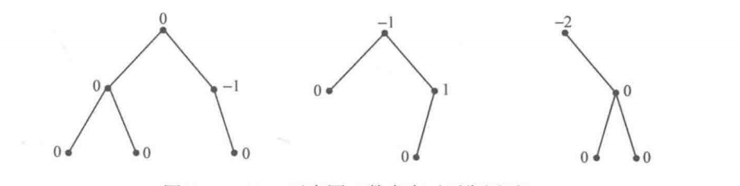

- 左旋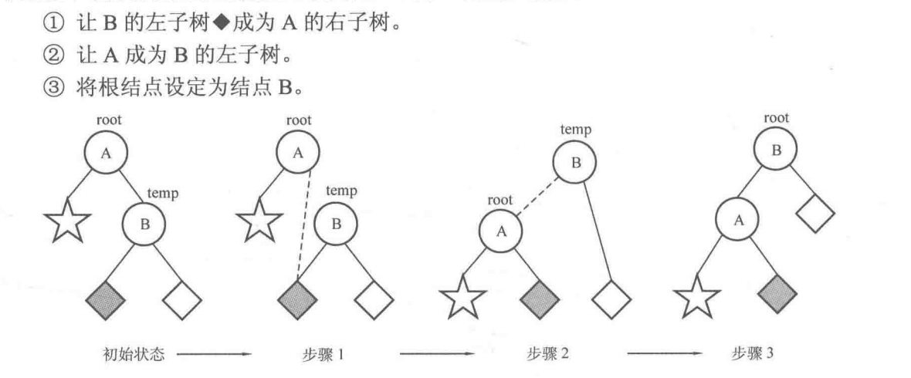
- 右旋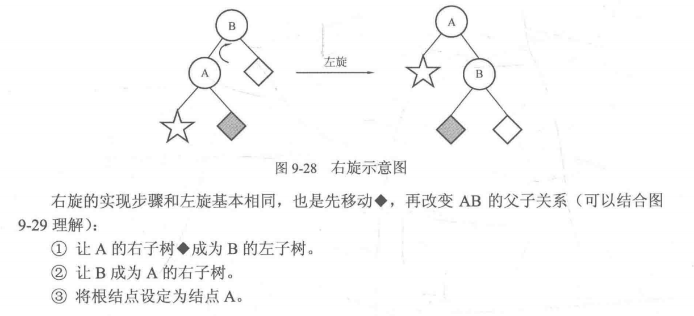

- LL 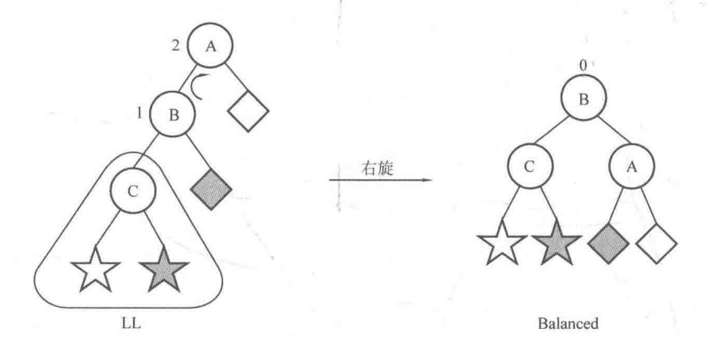
- LR 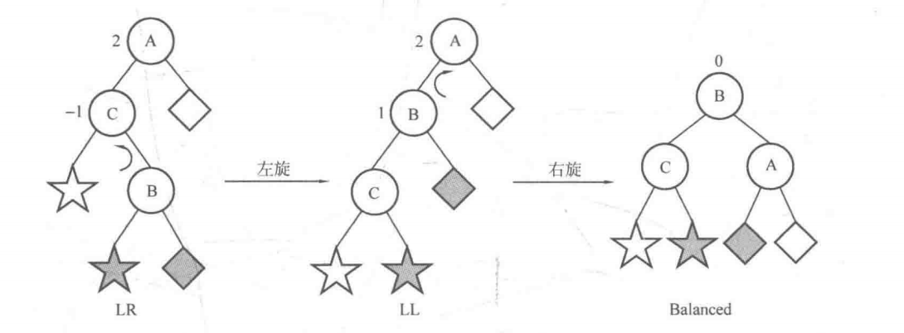

- RR 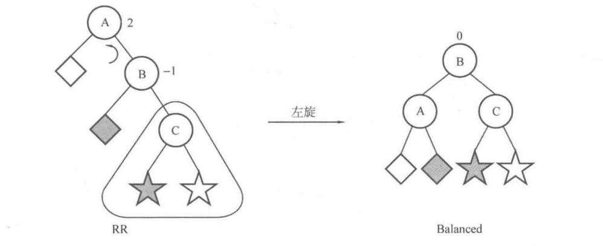
- RL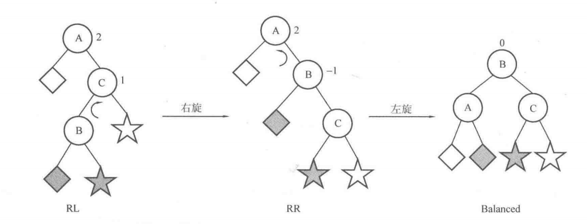

### 2.3.1 基本代码

```c++
//
// Created by 项建航 on 2024/3/11.
//
#include "tree.h"
#include <stdio.h>
#include <math.h>
#include <algorithm>

using namespace std;
struct Node {
    int value;
    int height;//当前节点的子树高度(包括当前节点)
    Node *lchild, *rchild;
};

Node *newNode(int v) {
    Node *node = new Node;
    node->value = v;
    node->height = 1;
    node->lchild = NULL;
    node->rchild = NULL;
}

//获取以 root 为根结点的子树的当前 height
int getHeight(Node *root) {
    if (root == NULL) return 0;
    else return root->height;
}

//计算结点 root 的平衡因子
int getBalanceFactor(Node *root) {
    return getHeight(root->lchild) - getHeight(root->rchild);
}

//更新结点 root 的 height
void updateHeight(Node *root) {
    //max(左孩子的 height，右孩子的 height） + 1
    root->height = max(getHeight(root->lchild), getHeight(root->rchild)) + 1;
}

//左旋（Left Rotation)
void L(Node *& root) {
    Node *temp = root->rchild;
    root->rchild = temp->lchild;
    temp->lchild = root;
    updateHeight(root);
    updateHeight(temp);
    root = temp;
}

//右旋（Right Rotation)
void R(Node *&root) {
    Node *temp = root->lchild;
    root->lchild = temp->rchild;
    temp->rchild = root;
    updateHeight(root);
    updateHeight(temp);
    root = temp;
}

void insert(Node *&root, int v) {
    if (root == NULL) {
        root = newNode(v);
        return;
    }
    if (v < root->value) {
        insert(root->lchild, v);
        updateHeight(root);
        if (getBalanceFactor(root) == 2) {
            if (getBalanceFactor(root->lchild) == 1) { //LL型
                R(root);
            } else if (getBalanceFactor(root->lchild) == -1){
                //LR 型
                L(root->lchild);
            		R(root);
            }
        }
    } else {
        insert(root->rchild, v);
        updateHeight(root);
        if (getBalanceFactor(root) == -2) {
            if (getBalanceFactor(root->rchild) == -1) {
                //RR 型
                L(root);
            } else if (getBalanceFactor(root->rchild) == 1) {
                //RL 型
                R(root->rchild);
                L(root);
            }
        }
    }
}

//AVL 树的建立
Node *Create(int data[], int n) {
    Node *root = NULL;
    for (int i = 0; i < n; i++) {
        insert(root, data[i]); //将 data[0]~data[n-1]插入 AVL 树中
    }
    return root;
}
```


### 2.3.2 算法题目

[110 平衡二叉树-E](https://leetcode.cn/problems/balanced-binary-tree/description/)

[LCR 176 判断是否为平衡二叉树-E](https://leetcode.cn/problems/ping-heng-er-cha-shu-lcof/description/)

[1382 将二叉搜索树变平衡-M](https://leetcode.cn/problems/balance-a-binary-search-tree/description/)


## 2.4 并查集

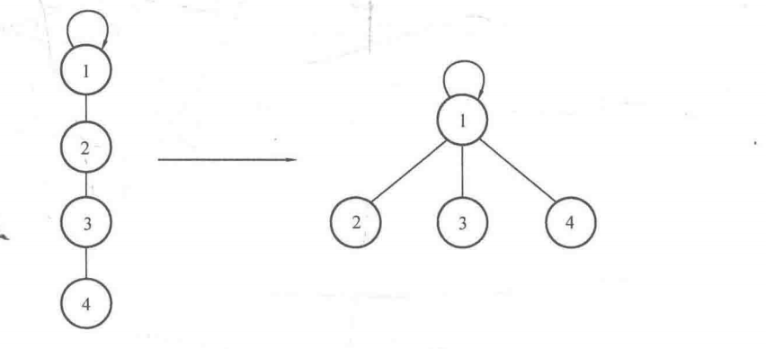

### 2.4.1 **基本代码**

```c++
#include <iostream>
#include <string>
#include <vector>
#include <set>
#include <queue>
#include <sstream>

using namespace std;
const int N = 10;
int father[N];
//findFather 函数返回元素 × 所在集合的根结点
int findFather_Iter(int x) {
    while (x != father[x]) { //如果不是根结点，继续循环
        x = father[x]; //获得自己的父亲结点
    }
    return x;
}

int findFather_recur(int x) {
    if (x == father[x]) return x; //如果找到根结点，则返回根结点编号 x
    else return findFather_recur(father[x]); //否则，递归判断 x 的父亲结点是否是根结点
}

void Union(int a, int b) {
    int faA = findFather_Iter(a);//查找 a 的根结点，记为 faA
    int faB = findFather_Iter(b);//查找 b 的根结点，记为 faB
    if (faA != faB) {
        //如果不属于同一个集合
        father[faA] = faB; //合并它们
    }
}
int findFather_zip(int x){
    int f=x;
    while (f != father[f]) { //如果不是根结点，继续循环
        f = father[f]; //获得自己的父亲结点
    }
    while(x!=father[x]){
        int z=x;
        father[x]=f;
      	x=z;
    }
    return f;
}
int main() {
    //初始化
    for (int i = 1; i <= N; i++) {
        father[i] = i; //令father[i]为-1也可,此处以father[i] = i为例
    }
    return 0;
}

```


### 2.4.2 算法题目

[2092 找出知晓所有秘密的专家-H](https://leetcode.cn/problems/find-all-people-with-secret/description/)

[765 情侣牵手-H](https://leetcode.cn/problems/couples-holding-hands/description/)


## 2.5 堆

### 2.5.1 基本代码

```c++
//
// Created by 项建航 on 2024/3/11.
//
#include "tree.h"
#include <stdio.h>
#include <math.h>
#include <algorithm>

using namespace std;
struct Node {
    int value;
};

const int maxn = 100;
int heap[maxn];
// index from 1. ----> for root i :   l= 2*i.   r =2*i+1
// index from 0. ----> for root i :   l= 2*i+1.   r =2*i+2
// 最大堆
void downAdjust(int low, int high) {
    int i = low, j = i * 2;
    while (j <= high) {
        if (j + 1 <= high && heap[j + 1] > heap[j])
            j = j + 1;
        if (heap[j] > heap[i]) {
            swap(heap[j], heap[i]);// t = h[j] , h[j]=h[i],h[i]=t;
            i = j;
            j = i * 2;
        } else {
            break;
        }
    }
}

//最大堆
void upAdjust(int low, int high) {
    int i = high, j = i / 2;
    while (j >= low) {
        if (heap[j] < heap[i]) {
            swap(heap[j], heap[i]);
            i = j;
            j = i / 2;
        } else {
            break;
        }
    }
}

```

### 2.5.2 优先级队列实现最小堆-STL

```c++
#include <iostream>
#include <queue>
using namespace std;
struct Node{
  int x, y;
  Node( int a= 0, int b= 0 ):
  x(a), y(b) {}
};
bool operator >( Node a, Node b ){
  //返回true，a的优先级大于b
  //x大的排在队前部；x相同时，y大的排在队前部
  if( a.x== b.x ) return a.y> b.y;
  return a.x> b.x; 
}
int main(){
  //priority_queue<Node,vector<Node> > q;
  priority_queue<Node,vector<Node>,greater<Node> > q;
  for( int i= 0; i< 10; ++i )
    q.push( Node( rand(), rand() ) );
  while( !q.empty() ){
    cout << q.top().x << ' ' << q.top().y << endl;
    q.pop();
  }
  return 0;
}

```

### 2.5.3 算法题目

[347 前K个高频元素-M](https://leetcode.cn/problems/top-k-frequent-elements/description/)

[378 有序矩阵中第K小的元素-M](https://leetcode.cn/problems/kth-smallest-element-in-a-sorted-matrix/description/)

[23 合并k个升序链表-H](https://leetcode.cn/problems/merge-k-sorted-lists/description/)

[215 数组中的第K个最大元素-M](https://leetcode.cn/problems/kth-largest-element-in-an-array/description/)

[239 滑动窗口最大值-H](https://leetcode.cn/problems/sliding-window-maximum/description/)


## 2.6 哈夫曼编码

### 2.6.1 基本代码

```c++
//
// Created by 项建航 on 2024/3/11.
//
#include "tree.h"
#include <stdio.h>
#include <math.h>
#include <algorithm>

using namespace std;

#include <queue>

using namespace std;
//代表小顶堆的优先队列 <
priority_queue<long long, vector<long long>, greater<long long>> q;

int main() {
    int n;
    long long temp, x, y, ans = 0;
    scanf("%d", &n);
    for (int i = 0; i < n; i++) {
        scanf("%lld", &temp);
    }
    q.push(temp);
    while (q.size() > 1) {
        x = q.top();
        q.pop();
        y = q.top();
        q.pop();
        q.push(x + y);
        ans += x + y;
    }
    printf("%ld\n", ans);
    return 0;
}
```


# 三、图


## 3.1 图的构造

### 3.1.1 邻接矩阵

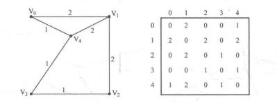

### 3.1.2 邻接表

```c++
struct Node{
  int v;
  int w;
};
vector<Node>Adj[N];
```


## 3.2 DFS

### 3.2.1 基本代码

```c++
#include <string>
#include <vector>

using namespace std;
const int MAXN = 10;
vector<int> Adj[MAXN];
int n;
bool vis[MAXN] = {false};

void DFS(int u, int depth) {
    vis[u] = true;
    for (int i = 0; i < Adj[u].size(); i++) {
        int v = Adj[u][i];
        if (vis[v] == false) {
            DFS(v, depth + 1);
        }
    }
    return;
}

//遍历图G
void DFSTravel() {
    for (int u = 0; u < n; ++u) {
        if (vis[u] == false) {
            DFS(u, 1);
        }
    }
}

int main() {

    return 0;
}

```


### 3.2.2 算法题目

**建议看一下：[dfs、回溯专题刷题总结](https://leetcode.cn/circle/discuss/sZEj8D/)**


 [PAT A1034 Head of a Gang](https://pintia.cn/problem-sets/994805342720868352/exam/problems/994805456881434624?type=7&page=0)

[112 路径总和-E](https://leetcode.cn/problems/path-sum/description/)

[111 二叉树最小深度-E](https://leetcode.cn/problems/minimum-depth-of-binary-tree/description/)

[463 岛屿周长-E](https://leetcode.cn/problems/island-perimeter/description/)

[787 K站中转内最便宜的航班-M](https://leetcode.cn/problems/cheapest-flights-within-k-stops/description/)

[310 最小高度树-M](https://leetcode.cn/problems/minimum-height-trees/description/)

[200 岛屿数量-M](https://leetcode.cn/problems/number-of-islands/description/)

[124 二叉树中的最大路径和-H](https://leetcode.cn/problems/binary-tree-maximum-path-sum/description/)


## 3.3 BFS

### 3.3.1 基本代码

```c++
#include <string>
#include <vector>
#include <queue>
using namespace std;
const int MAXN = 10;
vector<int> Adj[MAXN];
int n;
//记录是否进队
bool vis[MAXN] = {false};

void BFS(int u){
    queue<int> q;
    q.push(u);
    vis[u]=true;
    while(!q.empty()){
        int u=q.front();
        q.pop();
        for(int i=0;i<Adj[u].size();i++){
            int v=Adj[u][i];
            if(vis[v]==false){
                q.push(v);
                vis[q]==true;
            }
        }
    }
}
void BFSTravel(){
    for (int u = 0; u < n; ++u) {
        if(vis[u]== false){
            BFS(u);
        }
    }
}
int main() {

    return 0;
}

```


### 3.3.2 算法题目

推荐看一下：[代码随想录图论开更！广度优先搜索理论基础](https://leetcode.cn/circle/discuss/V3FulB/)

 [PAT A1076 Forwards on Weibo]

[417 太平洋大西洋水流问题-M](https://leetcode.cn/problems/pacific-atlantic-water-flow/description/)

[130 被围绕的区域-M](https://leetcode.cn/problems/surrounded-regions/description/)

[199 二叉树的右视图-M](https://leetcode.cn/problems/binary-tree-right-side-view/description/)


## 3.4 最短路径

### 3.4.1 Dijkstra


```c++
#include <iostream>
#include <vector>
#include <climits>

using namespace std;

#define V 6

int minDistance(vector<int>& dist, vector<bool>& visited) {
    int minDist = INT_MAX, minIndex;

    for (int i = 0; i < V; ++i) {
        if (!visited[i] && dist[i] < minDist) {
            minDist = dist[i];
            minIndex = i;
        }
    }

    return minIndex;
}

void dijkstra(vector<vector<int>>& graph, int src) {
    vector<int> dist(V, INT_MAX);
    vector<bool> visited(V, false);

    dist[src] = 0;

    for (int count = 0; count < V - 1; ++count) {
        int u = minDistance(dist, visited);
        visited[u] = true;

        for (int v = 0; v < V; ++v) {
            if (!visited[v] && graph[u][v] && dist[u] != INT_MAX && dist[u] + graph[u][v] < dist[v]) {
                
              dist[v] = dist[u] + graph[u][v];
            }
        }
    }

    cout << "Vertex \t Distance from Source" << endl;
    for (int i = 0; i < V; ++i) {
        cout << i << " \t\t " << dist[i] << endl;
    }
}

int main() {
    vector<vector<int>> graph = {
        {0, 4, 0, 0, 0, 0},
        {4, 0, 8, 0, 0, 0},
        {0, 8, 0, 7, 0, 4},
        {0, 0, 7, 0, 9, 14},
        {0, 0, 0, 9, 0, 10},
        {0, 0, 4, 14, 10, 0}
    };

    dijkstra(graph, 0);

    return 0;
}

```


### 3.4.2 Floyd

```c++
#include <iostream>
#include <vector>
#include <climits>

using namespace std;

#define V 4

void printPath(vector<vector<int>>& next, int u, int v) {
    if (next[u][v] == -1) {
        cout << "No path from " << u << " to " << v << endl;
        return;
    }

    cout << "Path from " << u << " to " << v << ": " << u << " ";
    while (u != v) {
        u = next[u][v];
        cout << u << " ";
    }
    cout << endl;
}

void floyd(vector<vector<int>>& graph) {
    vector<vector<int>> dist = graph;
    vector<vector<int>> next(V, vector<int>(V, -1));

    for (int k = 0; k < V; ++k) {
        for (int i = 0; i < V; ++i) {
            for (int j = 0; j < V; ++j) {
                if (dist[i][k] != INT_MAX && dist[k][j] != INT_MAX && dist[i][k] + dist[k][j] < dist[i][j]) {
                    dist[i][j] = dist[i][k] + dist[k][j];
                    next[i][j] = k;
                }
            }
        }
    }

    cout << "Shortest path matrix:" << endl;
    for (int i = 0; i < V; ++i) {
        for (int j = 0; j < V; ++j) {
            cout << dist[i][j] << " ";
        }
        cout << endl;
    }

    cout << endl;

    for (int i = 0; i < V; ++i) {
        for (int j = 0; j < V; ++j) {
            if (i != j) {
                printPath(next, i, j);
            }
        }
    }
}

int main() {
    vector<vector<int>> graph = {
        {0, 5, INT_MAX, 10},
        {INT_MAX, 0, 3, INT_MAX},
        {INT_MAX, INT_MAX, 0, 1},
        {INT_MAX, INT_MAX, INT_MAX, 0}
    };

    floyd(graph);

    return 0;
}

```


### 3.4.3 Bellman-Ford 算法-不重要

```c++
#include <iostream>
#include <vector>
#include <climits>

using namespace std;

struct Edge {
    int src, dest, weight;
};

void bellmanFord(vector<Edge>& edges, int V, int E, int src) {
    vector<int> dist(V, INT_MAX);
    dist[src] = 0;

    for (int i = 1; i < V; ++i) {
        for (int j = 0; j < E; ++j) {
            int u = edges[j].src;
            int v = edges[j].dest;
            int weight = edges[j].weight;
            if (dist[u] != INT_MAX && dist[u] + weight < dist[v]) {
                dist[v] = dist[u] + weight;
            }
        }
    }

    for (int i = 0; i < E; ++i) {
        int u = edges[i].src;
        int v = edges[i].dest;
        int weight = edges[i].weight;
        if (dist[u] != INT_MAX && dist[u] + weight < dist[v]) {
            cout << "Graph contains negative weight cycle" << endl;
            return;
        }
    }

    cout << "Vertex \t Distance from Source" << endl;
    for (int i = 0; i < V; ++i) {
        cout << i << " \t\t " << dist[i] << endl;
    }
}

int main() {
    int V = 5;
    int E = 8;
    vector<Edge> edges = {
        {0, 1, -1},
        {0, 2, 4},
        {1, 2, 3},
        {1, 3, 2},
        {1, 4, 2},
        {3, 2, 5},
        {3, 1, 1},
        {4, 3, -3}
    };

    bellmanFord(edges, V, E, 0);

    return 0;
}

```


### 3.4.4 SPFA 算法-不重要

可以改进下面算法，记录每个节点的入队次数，超过n-1次说明有负数环

```c++
#include <iostream>
#include <vector>
#include <queue>
#include <climits>

using namespace std;

struct Edge {
    int dest, weight;
};

void spfa(vector<vector<Edge>>& graph, int V, int src) {
    vector<int> dist(V, INT_MAX);
    vector<bool> inQueue(V, false);

    dist[src] = 0;
    queue<int> q;
    q.push(src);
    inQueue[src] = true;

    while (!q.empty()) {
        int u = q.front();
        q.pop();
        inQueue[u] = false;

        for (const Edge& edge : graph[u]) {
            int v = edge.dest;
            int weight = edge.weight;

            if (dist[u] != INT_MAX && dist[u] + weight < dist[v]) {
                dist[v] = dist[u] + weight;
                if (!inQueue[v]) {
                    q.push(v);
                    inQueue[v] = true;
                }
            }
        }
    }

    cout << "Vertex \t Distance from Source" << endl;
    for (int i = 0; i < V; ++i) {
        cout << i << " \t\t " << dist[i] << endl;
    }
}

int main() {
    int V = 5;
    vector<vector<Edge>> graph(V);

    graph[0].push_back({1, -1});
    graph[0].push_back({2, 4});
    graph[1].push_back({2, 3});
    graph[1].push_back({3, 2});
    graph[1].push_back({4, 2});
    graph[3].push_back({2, 5});
    graph[3].push_back({1, 1});
    graph[4].push_back({3, -3});

    spfa(graph, V, 0);

    return 0;
}

```


### 3.4.5 算法题目

 [PAT A1003 Emergency](https://pintia.cn/problem-sets/994805342720868352/exam/problems/994805523835109376?type=7&page=0)

 [PAT A1030 Travel Plan](https://pintia.cn/problem-sets/994805342720868352/exam/problems/994805464397627392?type=7&page=0)


力扣最短路径相关题目和题解：https://github.com/SharingSource/LogicStack-LeetCode/wiki

## 3.5 最小生成树

### 3.5.1 Prim

```c++
#include <iostream>
#include <vector>
#include <queue>
#include <climits>

using namespace std;

#define V 5

int minKey(vector<int>& key, vector<bool>& mstSet) {
    int min = INT_MAX, min_index;

    for (int v = 0; v < V; ++v) {
        if (!mstSet[v] && key[v] < min) {
            min = key[v];
            min_index = v;
        }
    }

    return min_index;
}

void printMST(vector<int>& parent, vector<vector<int>>& graph) {
    cout << "Edge \t Weight" << endl;
    for (int i = 1; i < V; ++i) {
        cout << parent[i] << " - " << i << "\t" << graph[i][parent[i]] << endl;
    }
}

void primMST(vector<vector<int>>& graph) {
    vector<int> parent(V);
    vector<int> key(V, INT_MAX);
    vector<bool> mstSet(V, false);

    key[0] = 0;
    parent[0] = -1;

    for (int count = 0; count < V - 1; ++count) {
        int u = minKey(key, mstSet);
        mstSet[u] = true;

        for (int v = 0; v < V; ++v) {
            if (graph[u][v] && !mstSet[v] && graph[u][v] < key[v]) {
                parent[v] = u;
                key[v] = graph[u][v];
            }
        }
    }

    printMST(parent, graph);
}

int main() {
    vector<vector<int>> graph = {
        {0, 2, 0, 6, 0},
        {2, 0, 3, 8, 5},
        {0, 3, 0, 0, 7},
        {6, 8, 0, 0, 9},
        {0, 5, 7, 9, 0}
    };

    primMST(graph);

    return 0;
}

```

或者如下写法

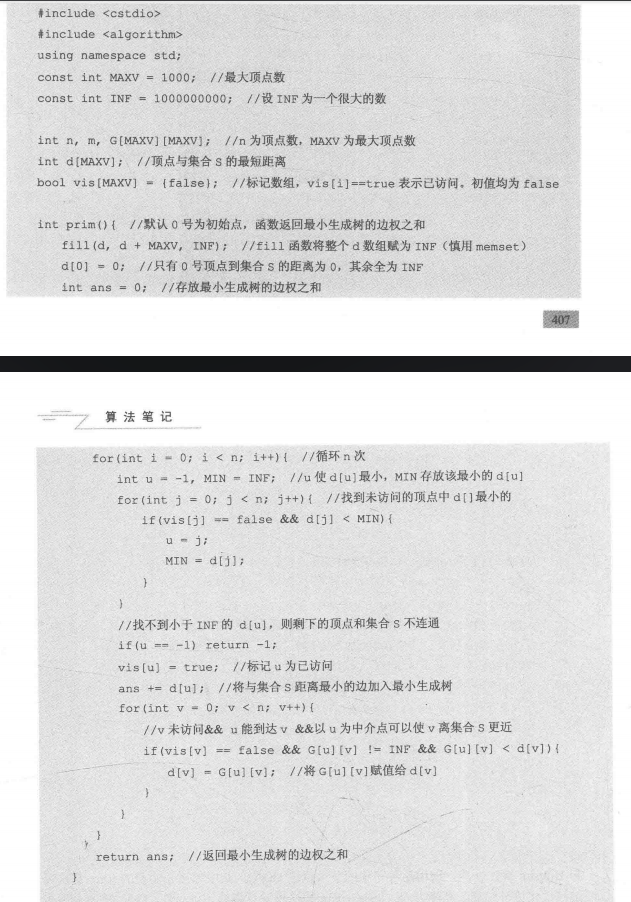

### 3.5.2 Kruskal

```c++
#include <iostream>
#include <vector>
#include <algorithm>

using namespace std;

struct Edge {
    int src, dest, weight;
};

struct Graph {
    int V, E;
    vector<Edge> edges;
};

struct DisjointSet {
    vector<int> parent, rank;

    DisjointSet(int n) {
        parent.resize(n);
        rank.resize(n, 0);

        for (int i = 0; i < n; ++i) {
            parent[i] = i;
        }
    }

    int find(int u) {
        if (u != parent[u]) {
            parent[u] = find(parent[u]);
        }
        return parent[u];
    }

    void merge(int x, int y) {
        x = find(x);
        y = find(y);

        if (rank[x] > rank[y]) {
            parent[y] = x;
        } else {
            parent[x] = y;
            if (rank[x] == rank[y]) {
                rank[y]++;
            }
        }
    }
};

bool compareEdges(Edge a, Edge b) {
    return a.weight < b.weight;
}

void kruskalMST(Graph& graph) {
    vector<Edge> result;
    DisjointSet ds(graph.V);

    sort(graph.edges.begin(), graph.edges.end(), compareEdges);

    for (Edge edge : graph.edges) {
        int x = ds.find(edge.src);
        int y = ds.find(edge.dest);

        if (x != y) {
            result.push_back(edge);
            ds.merge(x, y);
        }
    }

    cout << "Edge \t Weight" << endl;
    for (Edge edge : result) {
        cout << edge.src << " - " << edge.dest << "\t" << edge.weight << endl;
    }
}

int main() {
    Graph graph;
    graph.V = 4;
    graph.E = 5;
    graph.edges = {
        {0, 1, 10},
        {0, 2, 6},
        {0, 3, 5},
        {1, 3, 15},
        {2, 3, 4}
    };

    kruskalMST(graph);

    return 0;
}

```

或者如下写法

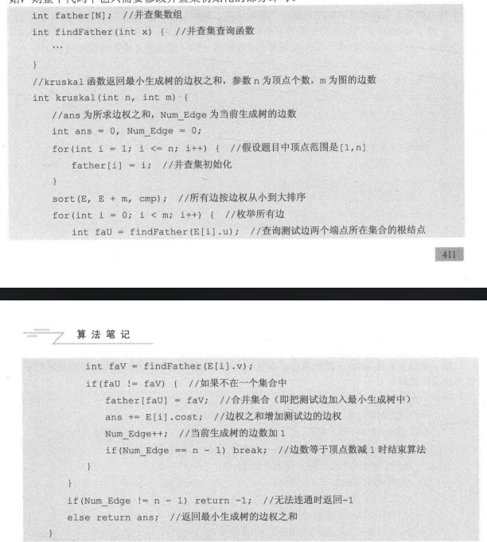

### 3.5.3 算法题目

力扣最小生成树相关题目和解答：https://github.com/SharingSource/LogicStack-LeetCode/wiki/%E6%9C%80%E5%B0%8F%E7%94%9F%E6%88%90%E6%A0%91

# 四、动态规划

## 4.1 最长公共子序列

> 给定两个字符串（或数字序列）A 和 B，求一个字符串，使得这个字符串是 A 和 B 的最长公共部分(子序列可以不连续)。
>
> A= "3124567"
>
> B="13568"
>
> Dp(i)(j)=A(0,i) & B(0,j) ======> dp(lenA)(lenB) = 
>
> 1. A[lenA]=B[lenB] ===> dp(lenA)(lenB)=dp(lenA-1)dp(lenB-1)+1 
> 2. A[lenA]!=B[lenB] ====> dp(lenA)(lenB)=max( dp(lenA-1)(lenB), dp(lenA)(lenB-1) )

```java
int lenA = strlen(A + 1); 
//由于读入时下标从 1 开始，因此读取长度也从+1 开始
int lenBstrlen(B + 1);
//边界
for (int i = 0; i <= lenA; i++) {
  dp[i][0] = 0;
}
for (int j=0; j <= lenB; j++){
  dp[0] [j] = 0;
}
//状态转移方程
for (int i = 1; i <= lenA; i++) {
  for(int j = 1; j <= lenB; j++) {
    if (A[i] == B[j]){
      dp[i][j] = dp[i-1][j-1] + 1;
    } else {
      dp[i][j] = max (dp[i - 1][j], dp[i][ j- 1]);
    }
  }
  //dp[lenA] [lenB]是答案
  return dp[lenA] [lenB]
```

## 4.2 最长回文子串

> 给出一个字符串 S，求 S 的最长回文子串的长度。
>
> S="123abccba123"
>
> Dp(i)(j)===== i.    j.     =0,1
>
> Dp(i)(j)=  (S(i)==S(j)&&dp(i+1)(j-1))

```java
//边界
 for (int i = 0; i < len; i++){
 		dp[i][i] = 1;
 		if (i < len - 1) {
 			if(S[i] == S[i + 1]) {
 				dp [i] [i + 1] = 1;
				ans =2; //初始化时注意当前最长回文子串长度
       }
      }
 }
     //状态转移方程
for(int L = 3; L <= len; L++) { //枚举子串的长度
 		for (int i =0; i+L-1< len; i++) //枚举子串的起始端点
 			int j=i+L-1; //子串的右端点
 			if(S[i] == S[j] && dp[i + 1][ j- 1] == 1) {
 				dp[i] [j] =1;
				ans= L; //更新最长回文子串长度
      }
 		}
}
   
```


## 4.3 01背包问题

> 有 n 件物品，每件物品的重量为 w[i]，价值为 c[i]。现有一个容量为 V 的背包，问如何
> 选取物品放入背包，使得背包内物品的总价值最大。其中每种物品都只有1 件。
>
> Dp(i)(v) = 物品从0-i ,  容量v 
>
> Dp(n)(V)=DP(n-1)(V)  , DP(n-1)(V-v[n])+c[n]

``` java
 for(int i=1;i<=n;i++){
 		for(int v=V;v>= w[i];v--){
      //可以减少空间复杂度，逆序枚举v  dp [v]=max (dp[v],dp[v-w[i]]+c[i]);
      dp[i][v]=max (dp[i-1][v],dp[i-1][v-w[i]]+c[i]);
   }
 }
```


## 4.4 完全背包问题

> 有 n 种物品，每种物品的单件重量为 w[i]，价值为 c[i]。现有一个容量为 V 的背包，问
> 如何选取物品放入背包,使得背包内物品的总价值最大。其中每种物品都有无穷件。
>
> Dp(i)(v) = 物品从0-i ,  容量v 
>
> Dp(n)(V)=DP(n-1)(V)  , DP(n)(V-w[n])+c[n]

```java
for(int i=1;i<=n;i++){
    for(int v= w[i];v<= V;v++){ 
      dp[i][v]=max (dp[i-1][v],dp[i][v-w[i]]+c[i]);
      //可以简化，正向枚举 dp[v]=max (dp[v], dp[v-w [i]]+c[i]);
    }
}
```

## 4.5 算法题目

### 4.5.1 线性DP

> https://github.com/SharingSource/LogicStack-LeetCode/wiki/%E7%BA%BF%E6%80%A7-DP

[119 杨辉三角 2-E](https://leetcode.cn/problems/pascals-triangle-ii/description/)

[198 打家劫舍-M](https://leetcode.cn/problems/house-robber/description/)

[213 打家劫舍2-M](https://leetcode.cn/problems/house-robber-ii/description/)

[688 骑士再棋盘上的概率-M](https://leetcode.cn/problems/knight-probability-in-chessboard/description/)

[45 跳跃游戏 2-M](https://leetcode.cn/problems/jump-game-ii/description/)

[978 最长湍流字数组-M](https://leetcode.cn/problems/longest-turbulent-subarray/description/)

### 4.5.2 背包DP

> https://github.com/SharingSource/LogicStack-LeetCode/wiki/%E8%83%8C%E5%8C%85-DP

[279 完全平方数-M](https://leetcode.cn/problems/perfect-squares/description/)

[322 零钱兑换-M](https://leetcode.cn/problems/coin-change/description/)

### 4.5.3 序列DP

> https://github.com/SharingSource/LogicStack-LeetCode/wiki/%E5%BA%8F%E5%88%97-DP

[139 单词拆分-M](https://leetcode.cn/problems/word-break/description/)

[334 递增的三元子序列-M](https://leetcode.cn/problems/increasing-triplet-subsequence/description/)


# 五、补充

## 5.1 二分

```C++
//A[]为递增序列，x 为欲查询的数，函数返回第一个大于 × 的元素的位置
//二分上下界为左闭右闭的[left, right],传入的初值为[0,n]
 int upper_bound(int A[], int left, int right, int x){
 		int mid;
 		//mid为 left 和 right 的中点
		 while (left < right) ( //对[left,right]来说, left==right意味着找到唯一位置
       mid = (left + right) / 2;
       if(A[mid] > x){
        //取中点
        //中间的数大于 ×
        right = mid;
        //往左子区间[left，mid]查找
      else { //中间的数小于等于 ×
        left = mid + 1;
        //往右子区间[mid+1, right]查找
      }
       return left;
  }
```


## 5.2 快排

- 挖坑法 1 2 3 4 5 6 7

```c++
int partion(int A[], int low, int high) {
    int temp = A[low];
    int l = low, h = high;
    while (l < h) {
        while (l < h && temp <= A[h]) {
            h--;
        }
        A[l] = A[h];
        while (l < h && temp >= A[l]) {
            l++;
        }
        A[h] = A[l];
    }
    A[l] = temp;
    return l;
}

void quick_Sort(int A[], int low, int high) {
    if (low < high) {
        int pos = partion(A, low, high);
        quick_Sort(A, low, pos - 1);
        quick_Sort(A, pos + 1, high);
    }
}
```

- 交换法

```java
int partion(int A[], int low, int high) {
    int pivot = A[low];
    int l = low, h = high;
  	int temp;
    while (l < h) {
        while (l < h && pivot <= A[h]) {
            h--;
        }
        while (l < h && pivot >= A[l]) {
            l++;
        }
       if (l < h) {
            temp = A[l];
            A[l] = A[h];
            A[h] = temp;
        }
    }
    A[low] = A[l];
    A[l]=pivot;
    return l;
}

void quick_Sort(int A[], int low, int high) {
    if (low < high) {
        int pos = partion(A, low, high);
        quick_Sort(A, low, pos - 1);
        quick_Sort(A, pos + 1, high);
    }
}
```


## 5.3 大数和

算法笔记里面的大数和加分

"123456789"

"999999999"

```c++
s1="123456789";
s2="999999999";
i=s1.len-1;
j=s2.len-1;
s3= ""; ---->index=0
int carry=0;
while(i>==0&&j>=0){
  s3[index++]=(s1[i]+s1[j]+carry)%10;
  carry=s1[i]+s1[j]/10;
}
// 逆转s3
...
```


## 5.4 2022年机考题


