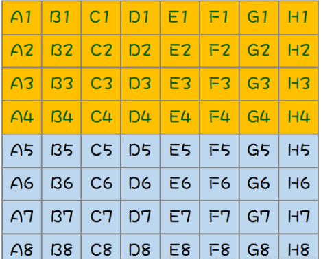
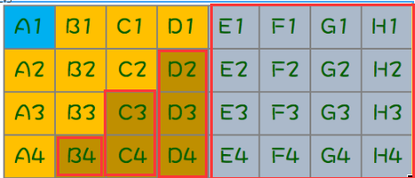

# 脑筋急转弯

# 一、高频面试题

## 1. 64匹马，8个赛道，找出跑得最快的4匹马

> https://blog.csdn.net/qq_42415326/article/details/104767463?spm=1001.2101.3001.6650.1&utm_medium=distribute.pc_relevant.none-task-blog-2%7Edefault%7ECTRLIST%7ERate-1-104767463-blog-80787928.235%5Ev43%5Epc_blog_bottom_relevance_base6&depth_1-utm_source=distribute.pc_relevant.none-task-blog-2%7Edefault%7ECTRLIST%7ERate-1-104767463-blog-80787928.235%5Ev43%5Epc_blog_bottom_relevance_base6&utm_relevant_index=2

**答案：最好10场，其次11场**

**求解过程：**

1. 第一步（前8场），64匹马分成 8组，每组8匹，淘汰每组的后四名（8场）

   

2. 第二步（第9场），取每组第一名进行一次比赛，然后淘汰最后四名所在组的所有马、第四名所在组后三匹、第三名所在组的后两匹以及第二名所在组的最后一匹（1场），最终剩余下图中的蓝色A1（总冠军）以及深黄色区域（9匹）角逐总亚军，总季军，总第四名，如下图：

   

3. 第三步（第10场），只要从上面的10匹马中找出跑得最快的三匹马就可以了，选择第二步中前三名所在的剩余马 8 匹（下图中红色框框）进行比赛（1场），可能出现两种情况：
   1. 若B1的名次为 3 或者 4，那么本次比赛的前三名就是总亚军，总季军，总第四名（最好10场选出最终结果）
   2. 若B1的名次为 1或者 2，那么还需要进行一场比赛
