# 设计模式

> 引言：为什么要学设计模式
>
> 笔者：设计模式在后端开发中发挥着十分重要的作用，写好一个业务代码并不困难，但是如何写好一个高效实用和优雅的代码有时候是更重要的。

# 一、基本设计原则

## 1.1 SOLID五大原则

- 单一职责原则(Single Responsibility Principle, SRP)

  - 类的职责要单一，不能将太多的职责放在一个类中

  - 当客户端需要该对象的某一个职责时，不得不将其他不需要的职责全都包含进来，从而造成冗余代码或代码的浪费。同时，当需要修改一个职责的代码时，往往容易导致另一个职责出现问题。因此单一职责原则的核心就是控制类的粒度大小、将对象解耦、提高其内聚性，使得一个类/接口/方法只负责一项职责或职能。

- 开闭原则(Open-Closed Principle, OCP)

  - 软件实体对扩展是开放的，但对修改是关闭的，即在不修改一个软件实体的基础上去扩展其功能

  - 当应用的需求改变时，在不修改软件实体的源代码或者二进制代码的前提下，可以扩展模块的功能（通常通过继承），使其满足新的需求。

- 里氏代换原则(Liskov Substitution Principle, LSP)
  - 在软件系统中，一个可以接受基类对象的地方必然可以接受一个子类对象
  - 子类可以扩展父类的功能，但不能改变父类原有的功能。里氏替换原则是继承复用的基础，它反映了基类与子类之间的关系，是对开闭原则的补充，是对实现抽象化的具体步骤的规范。它是动作正确性的保证。即类的扩展不会给已有的系统引入新的错误，降低了代码出错的可能性。

- 接口隔离原则(Interface Segregation Principle, ISP)

  - 使用多个专门的接口来取代一个统一的接口

  - 接口隔离原则和单一职责都是为了提高类的内聚性、降低它们之间的耦合性，体现了封装的思想，但两者是不同的：单一职责原则注重的是职责，而接口隔离原则注重的是对接口依赖的隔离。单一职责原则主要是约束类，它针对的是程序中的实现和细节；接口隔离原则主要约束接口，主要针对抽象和程序整体框架的构建。

- 依赖倒转原则(Dependency Inversion Principle, DIP)

  - 要针对抽象层编程，而不要针对具体类编程

  - 由于在软件设计中，细节具有多变性，而抽象层则相对稳定，因此以抽象为基础搭建起来的架构要比以细节为基础搭建起来的架构要稳定得多。这里的抽象指的是接口或者抽象类，而细节是指具体的实现类。依赖倒置原则可以降低类间的耦合性，提高系统的稳定性，减少并行开发引起的风险，提高代码的可读性和可维护性。

## 1.2 其它原则

- 合成复用原则(Composite Reuse Principle, CRP)
  - 在系统中应该尽量多使用组合和聚合关联关系，尽量少使用甚至不使用继承关系

- 迪米特法则(Law of Demeter, LoD)
  - 一个软件实体对其他实体的引用越少越好，或者说如果两个类不必彼此直接通信，那么这两个类就不应当发生直接的相互作用，而是通过引入一个第三者发生间接交互

# 二、UML

## 2.1 面向对象三大特征

- 封装：隐藏内部实现，保护内部信息，提供一种公共的访问方式

- 继承：实现复用，归纳共性

- 多态：对象在不同的时刻可以表现出不同的状态


## 2.2 类图关系

### 2.2.1 关联关系

- 普通关联

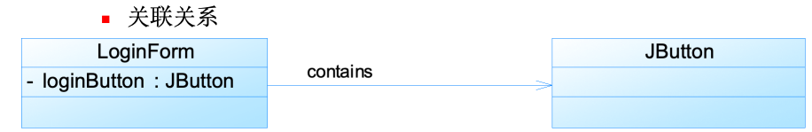

- 多重关联

  | **表示方式** | **多重性说明**                                              |
  | ------------ | ----------------------------------------------------------- |
  | 1..1         | 表示另一个类的一个对象只与一个该类对象有关系                |
  | 0..*         | 表示另一个类的一个对象与零个或多个该类对象有关系            |
  | 1..*         | 表示另一个类的一个对象与一个或多个该类对象有关系            |
  | 0..1         | 表示另一个类的一个对象没有或只与一个该类对象有关系          |
  | m..n         | 表示另一个类的一个对象与最少m、最多n个该类对象有关系 (m<=n) |

  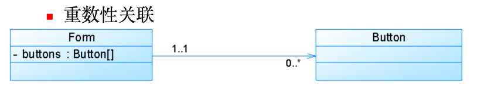

### 2.2.2 聚合关系

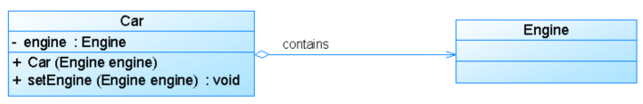

### 2.2.3 组合关系


### 2.2.4 依赖关系

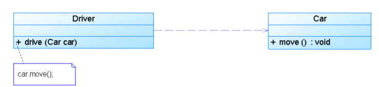

### 2.2.5 泛化关系

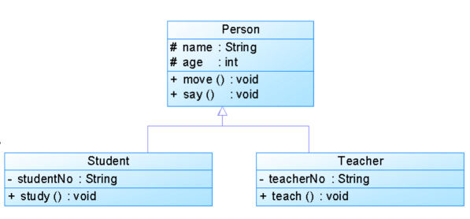

### 2.2.6 实现关系

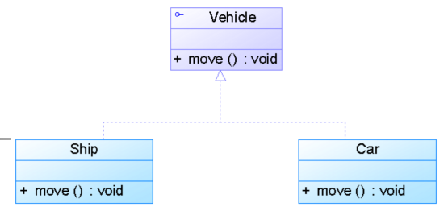

# 三、设计模式

## 3.1 创建型

### 3.1.1 单例模式

- 通用结构类图

  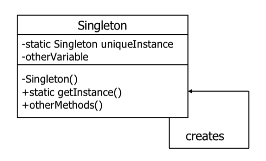

- 懒汉式单例类

```java
Public class LazySingleton

{

  private static LazySingleton uniqueInstance;

  //其他成员变量声明

  private LazySingleton() {…}

  public static LazySingleton getInstance()

  {

    if (uniqueInstance==null)

      uniqueInstance=new LazySingleton();

    return uniqueInstance;

  }

  //其他成员方法声明

}

//类LazySingleton只在第一次被引用时才实例化，静态加载该类并不会将他自己实例化。
```

- 处理多线程

  - 获取对象的方法加一个synchronized

  - Double-Checked Locking模式

```java
public class DCLSingleton{

  Private volatile static DCLSingleton uniqueInstance;

  Private DCLSingleton(){}

  Public static DCLSingleton getInstance() {

    if (uniqueInstance==null) {

      synchronized (DCLSingleton.class){

        if (uniqueInstance == null) {

          uniqueInstance=new DCLSingleton();

        }

      }

    }

    return uniqueInstance;

  }

}
```

- 饿汉式单例类

```java
Public class EagerSingleton

{

  private static final EagerSingleton uniqueInstance =

    new EagerSingleton();

  private EagerSingleton() {…}

  public static EagerSingleton getInstance()

  {

    return uniqueInstance;

  }

}

//类EagerSingleton在加载时就马上将自己实例化。

//可以解决多线程的问题
```

- 饿汉式与懒汉式单例类比较

  - 饿汉式单例类在自己被加载时就将自己实例化。单从资源利用效率角度来讲，这个比懒汉式单例类稍差些。从速度和反应时间角度来讲，则比懒汉式单例类稍好些。

  - 懒汉式单例类在实例化时，必须处理好在多个线程同时首次引用此类时的访问限制问题，特别是当单例类作为资源控制器，在实例化时必然涉及资源初始化，而资源初始化很有可能耗费大量时间，这意味着出现多线程同时首次引用此类的机率变得较大，需要通过同步化机制进行控制。

- 单例模式

  - 由于单例模式中没有抽象层，因此单例类的扩展有很大的困难。

  - 单例类的职责过重，在一定程度上违背了“单一职责原则”。因为单例类既充当了工厂角色，提供了工厂方法，同时又充当了产品角色，包含一些业务方法，将产品的创建和产品的本身的功能融合到一起。

  - 滥用单例将带来一些负面问题，如为了节省资源将数据库连接池对象设计为单例类，可能会导致共享连接池对象的程序过多而出现连接池溢出；很多面向对象语言(如Java、C#)的运行环境都提供了自动垃圾回收的技术，如果实例化的对象长时间不被利用，系统会认为它是垃圾，会自动销毁并回收资源，下次利用时又将重新实例化，这将导致对象状态的丢失。

- 在以下情况下可以使用单例模式：

  - 系统只需要一个实例对象，如系统要求提供一个唯一的序列号生成器，或者需要考虑资源消耗太大而只允许创建一个对象。

  - 客户调用类的单个实例只允许使用一个公共访问点，除了该公共访问点，不能通过其他途径访问该实例。

  - 在一个系统中要求一个类只有一个实例时才应当使用单例模式。反过来，如果一个类可以有几个实例共存，就需要对单例模式进行改进，使之成为多例模式。

### 3.1.2 抽象工厂模式

- 抽象工厂模式

- 类图

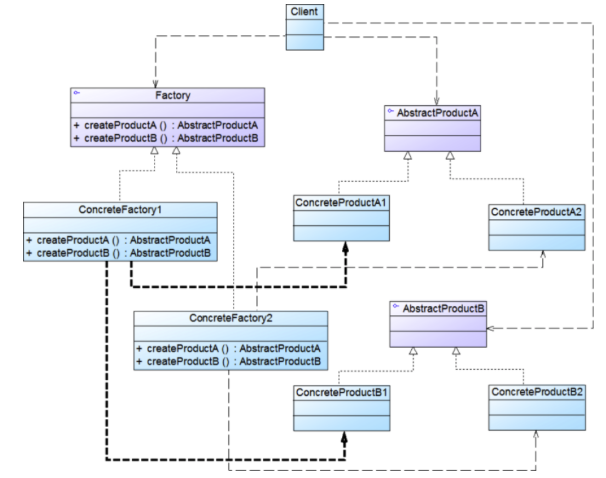


- 优点

  - 让用户代码与特定类Product的子类ConcretProduct的代码解耦。

  - 用户不必知道它所使用的对象是怎么创建的，只需要知道这些对象的用法即可。

- 适用场景

  - 希望让用户使用某些类，但不希望与这些类形成耦合（用new）。

  - 用户需要一个类的子类的实例，但不知道该类有哪些子类可用。

  - 经典范例：java迭代器

- 抽象工厂模式解决的问题

  - 当系统所提供的工厂所需生产的具体产品并不是一个简单的对象，而是多个位于不同产品等级结构中属于不同类型的具体产品时需要使用抽象工厂模式。

  - 抽象工厂模式是所有形式的工厂模式中最为抽象和最具一般性的一种形态。

  - 抽象工厂模式与工厂方法模式最大的区别在于，工厂方法模式针对的是一个产品等级结构，而抽象工厂模式则需要面对多个产品等级结构，一个工厂等级结构可以负责多个不同产品等级结构中的产品对象的创建 。当一个工厂等级结构可以创建出分属于不同产品等级结构的一个产品族中的所有对象时，抽象工厂模式比工厂方法模式更为简单、有效率。

---

抽象工厂模式（Abstract Factory Pattern）是一种创建型设计模式，它提供了一种创建一系列相关或相互依赖对象的接口，而无需指定它们具体的类。抽象工厂模式是工厂方法模式的扩展，它通过引入抽象工厂接口和具体工厂类的继承关系，使得工厂类的结构更加灵活。

在抽象工厂模式中，通常包括以下几个角色：

1. **抽象工厂接口（Abstract Factory Interface）**：抽象工厂接口定义了一系列用于创建产品对象的方法，每个方法对应一种类型的产品。

2. **具体工厂类（Concrete Factory Class）**：具体工厂类实现了抽象工厂接口，负责创建具体的产品对象。

3. **抽象产品接口（Abstract Product Interface）**：抽象产品接口定义了产品对象的通用接口，包含产品对象所具有的方法。

4. **具体产品类（Concrete Product Class）**：具体产品类是抽象产品接口的实现类，负责实现抽象产品接口中定义的方法。

抽象工厂模式的实现示例如下：

```java
// 抽象产品接口
interface ProductA {
    void operationA();
}

// 具体产品类A1
class ConcreteProductA1 implements ProductA {
    @Override
    public void operationA() {
        System.out.println("ConcreteProductA1 operationA");
    }
}

// 具体产品类A2
class ConcreteProductA2 implements ProductA {
    @Override
    public void operationA() {
        System.out.println("ConcreteProductA2 operationA");
    }
}

// 抽象产品接口
interface ProductB {
    void operationB();
}

// 具体产品类B1
class ConcreteProductB1 implements ProductB {
    @Override
    public void operationB() {
        System.out.println("ConcreteProductB1 operationB");
    }
}

// 具体产品类B2
class ConcreteProductB2 implements ProductB {
    @Override
    public void operationB() {
        System.out.println("ConcreteProductB2 operationB");
    }
}

// 抽象工厂接口
interface AbstractFactory {
    ProductA createProductA();
    ProductB createProductB();
}

// 具体工厂类1
class ConcreteFactory1 implements AbstractFactory {
    @Override
    public ProductA createProductA() {
        return new ConcreteProductA1();
    }

    @Override
    public ProductB createProductB() {
        return new ConcreteProductB1();
    }
}

// 具体工厂类2
class ConcreteFactory2 implements AbstractFactory {
    @Override
    public ProductA createProductA() {
        return new ConcreteProductA2();
    }

    @Override
    public ProductB createProductB() {
        return new ConcreteProductB2();
    }
}

// 客户端代码
public class Main {
    public static void main(String[] args) {
        // 创建具体工厂类1
        AbstractFactory factory1 = new ConcreteFactory1();
        // 通过具体工厂类1创建具体产品对象A1
        ProductA productA1 = factory1.createProductA();
        // 调用具体产品对象A1的方法
        productA1.operationA();
        // 通过具体工厂类1创建具体产品对象B1
        ProductB productB1 = factory1.createProductB();
        // 调用具体产品对象B1的方法
        productB1.operationB();

        // 创建具体工厂类2
        AbstractFactory factory2 = new ConcreteFactory2();
        // 通过具体工厂类2创建具体产品对象A2
        ProductA productA2 = factory2.createProductA();
        // 调用具体产品对象A2的方法
        productA2.operationA();
        // 通过具体工厂类2创建具体产品对象B2
        ProductB productB2 = factory2.createProductB();
        // 调用具体产品对象B2的方法
        productB2.operationB();
    }
}
```

在这个示例中，AbstractFactory是抽象工厂接口，定义了用于创建产品对象的方法。ConcreteFactory1和ConcreteFactory2是具体工厂类，分别实现了抽象工厂接口中的方法，负责创建具体的产品对象。ProductA和ProductB是抽象产品接口，定义了产品对象的通用接口，ConcreteProductA1、ConcreteProductA2、ConcreteProductB1和ConcreteProductB2是具体产品类，分别实现了抽象产品接口中定义的方法。客户端通过具体工厂类来创建具体产品对象，而不需要直接使用具体产品类，从而实现了客户端与具体产品类的解耦。

---

工厂模式在 Java 中有许多应用场景，其中一些主要的包括：

1. **标准库中的工厂方法**：Java 标准库中的很多类都使用了工厂方法模式，比如 `Calendar.getInstance()` 返回一个 Calendar 对象的实例，`Collections.emptyList()` 返回一个空的 List 实例等等。

2. **数据库驱动管理**：在 Java 中连接数据库时，通常会使用工厂模式创建数据库连接对象，比如 `DriverManager.getConnection()` 方法返回一个 Connection 对象，具体的数据库驱动实现由各个数据库厂商提供。

3. **GUI 框架**：在 Java 的图形用户界面 (GUI) 开发中，工厂模式被广泛应用。比如在 Swing 中，`JOptionPane.showInputDialog()` 方法返回一个用于输入对话框的 JDialog 实例。

4. **依赖注入框架**：许多 Java 的依赖注入框架，比如 Spring 框架，都使用工厂模式来管理和创建对象。Spring 中的 BeanFactory 和 ApplicationContext 接口就是典型的工厂模式的应用。

5. **单例模式的工厂**：在许多 Java 应用中，工厂模式常常与单例模式一起使用，确保只有一个工厂实例负责创建对象。这种模式可以提供全局唯一的访问点来获取实例化的对象，以便于统一管理和控制。

### 3.1.3 工厂方法模式

- 工厂方法模式

  - 在类中定义一个用于创建对象的接口方法，让其子类决定实例化哪一个类。通过这种做法，使得工厂方法的客户（工厂方法的使用者）不必了解具体应该实例化哪一个类。

- 类图 

  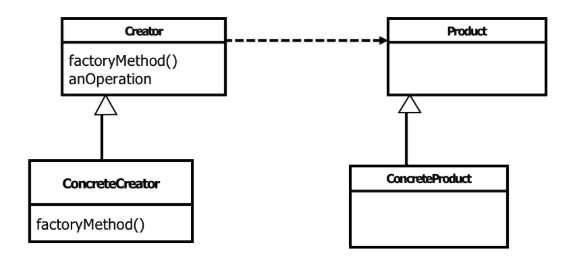

工厂方法模式（Factory Method Pattern）是一种创建型设计模式，它提供了一种将对象的创建委托给子类的方式，让子类决定实例化哪个类。工厂方法模式通过定义一个创建对象的接口，但是将具体对象的创建延迟到子类中实现，从而使得客户端代码与具体创建的类解耦。

---

在工厂方法模式中，通常包括以下几个角色：

1. **抽象产品类（Abstract Product）**：定义了产品对象的通用接口，所有具体产品类都要实现这个接口。

2. **具体产品类（Concrete Product）**：具体产品类是抽象产品类的实现类，负责实现抽象产品接口中定义的方法。

3. **抽象工厂类（Abstract Factory）**：抽象工厂类定义了一个抽象方法用于创建产品对象，这个方法可以是抽象的，也可以是具体的，它可以有参数，也可以没有参数，其实现由具体工厂类负责。

4. **具体工厂类（Concrete Factory）**：具体工厂类是抽象工厂类的实现类，负责创建具体的产品对象，实现了抽象工厂类中定义的创建产品的方法。

工厂方法模式的实现示例如下：

```java
// 抽象产品类
interface Product {
    void operation();
}

// 具体产品类A
class ConcreteProductA implements Product {
    @Override
    public void operation() {
        System.out.println("ConcreteProductA operation");
    }
}

// 具体产品类B
class ConcreteProductB implements Product {
    @Override
    public void operation() {
        System.out.println("ConcreteProductB operation");
    }
}

// 抽象工厂类
interface Factory {
    Product createProduct();
}

// 具体工厂类A
class ConcreteFactoryA implements Factory {
    @Override
    public Product createProduct() {
        return new ConcreteProductA();
    }
}

// 具体工厂类B
class ConcreteFactoryB implements Factory {
    @Override
    public Product createProduct() {
        return new ConcreteProductB();
    }
}

// 客户端代码
public class Main {
    public static void main(String[] args) {
        // 创建具体工厂类A
        Factory factoryA = new ConcreteFactoryA();
        // 通过具体工厂类A创建具体产品对象A
        Product productA = factoryA.createProduct();
        // 调用具体产品对象A的方法
        productA.operation();

        // 创建具体工厂类B
        Factory factoryB = new ConcreteFactoryB();
        // 通过具体工厂类B创建具体产品对象B
        Product productB = factoryB.createProduct();
        // 调用具体产品对象B的方法
        productB.operation();
    }
}
```

在这个示例中，Product是抽象产品类，定义了产品对象的通用接口。ConcreteProductA和ConcreteProductB是具体产品类，分别实现了抽象产品接口中定义的方法。Factory是抽象工厂类，定义了一个抽象方法用于创建产品对象。ConcreteFactoryA和ConcreteFactoryB是具体工厂类，分别实现了抽象工厂类中定义的创建产品的方法。客户端通过具体工厂类来创建具体产品对象，而不需要直接使用具体产品类，从而实现了客户端与具体产品类的解耦。

### 3.1.4 原型模式

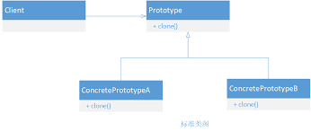

原型模式是一种创建型设计模式，它允许通过复制现有对象来创建新对象，而无需知道其具体类型。在 Java 中，原型模式通常通过实现 `Cloneable` 接口和重写 `clone()` 方法来实现。

原型模式是一种创建型设计模式，它的主要优点和缺点如下：

优点：
1. **减少对象的创建时间和资源消耗：** 当创建新对象的过程较为复杂或耗时时，原型模式可以通过复制现有对象来创建新对象，避免了耗时的初始化过程，从而提高了对象的创建效率。
2. **简化对象的创建过程：** 原型模式通过复制现有对象来创建新对象，无需了解对象的具体类型或内部实现细节，使得创建新对象的过程变得简单和灵活。
3. **动态添加和删除原型：** 在运行时可以动态地添加或删除原型对象，从而动态地改变系统的行为。

缺点：
1. **对克隆对象的内部结构复杂度要求较高：** 当克隆对象的内部结构比较复杂或包含引用类型成员变量时，需要确保这些引用对象也能正确地被克隆，否则可能会导致对象状态的不一致。
2. **需要实现Cloneable接口：** 在 Java 中，要使用原型模式，需要实现 `Cloneable` 接口，并重写 `clone()` 方法。如果忘记实现 `Cloneable` 接口或者忘记重写 `clone()` 方法，就无法使用原型模式。
3. **深拷贝与浅拷贝问题：** 默认的 `clone()` 方法是浅拷贝，即只复制了对象本身，而不复制其内部引用对象。如果需要实现深拷贝，即复制对象以及其所有引用对象，就需要对引用对象也进行复制处理，这增加了系统的复杂度。

总的来说，原型模式适用于创建对象成本较高或对象初始化过程复杂的情况，通过复制现有对象来创建新对象，可以提高系统的性能和灵活性。但是需要注意处理好对象之间的引用关系，以及克隆对象的一致性和完整性。

---

下面是原型模式在 Java 中的基本实现示例：

```java
// 定义一个可复制的原型接口
interface Prototype extends Cloneable {
    Prototype clone();
}

// 具体原型类
class ConcretePrototype implements Prototype {
    private String field;

    public ConcretePrototype(String field) {
        this.field = field;
    }

    // 重写clone()方法来实现对象的复制
    @Override
    public ConcretePrototype clone() {
        try {
            return (ConcretePrototype) super.clone();
        } catch (CloneNotSupportedException e) {
            e.printStackTrace();
            return null;
        }
    }

    public void setField(String field) {
        this.field = field;
    }

    public String getField() {
        return field;
    }
}

// 客户端代码
public class Main {
    public static void main(String[] args) {
        // 创建原型对象
        ConcretePrototype prototype = new ConcretePrototype("original");

        // 复制原型对象
        ConcretePrototype clonedPrototype = prototype.clone();

        // 修改复制后的对象的属性
        clonedPrototype.setField("cloned");

        // 输出原型对象和复制后的对象的属性值
        System.out.println("Original Prototype Field: " + prototype.getField());
        System.out.println("Cloned Prototype Field: " + clonedPrototype.getField());
    }
}
```

在这个示例中，`Prototype` 接口定义了一个 `clone()` 方法，用于复制对象。`ConcretePrototype` 类实现了 `Prototype` 接口，并重写了 `clone()` 方法，以便通过调用 `super.clone()` 来复制对象。客户端代码创建了一个原型对象 `prototype`，然后通过调用 `clone()` 方法复制了一个新对象 `clonedPrototype`，最后修改了 `clonedPrototype` 的属性值。

### 3.1.5 建造者模式

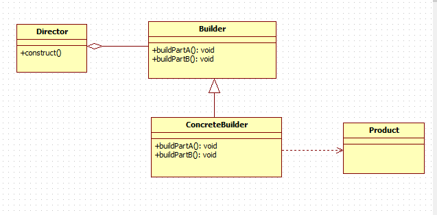

建造者模式是一种创建型设计模式，它的主要目的是将一个复杂对象的构建过程与其表示分离，使得同样的构建过程可以创建不同的表示。它允许客户端通过指定要构建的对象的类型和内容，而无需知道具体的构建细节。

在 Java 中，建造者模式通常由一个抽象建造者（Builder）接口和具体建造者（ConcreteBuilder）实现类组成，以及一个指导者（Director）类来协调建造过程。具体建造者类负责构建产品的各个部分，而指导者类则负责将具体建造者的对象组装成最终的产品。


**建造者模式的优点和缺点如下：**

- 优点：

  - **分离构建过程和表示：** 建造者模式将一个复杂对象的构建过程与其表示分离，使得构建过程独立于表示，使得同样的构建过程可以创建不同的表示。

  - **更好的封装性：** 建造者模式可以隐藏产品的内部表示和构建过程，使得客户端只需要关注产品的最终结果，而不必关心具体的构建过程。

  - **更好的扩展性：** 可以更灵活地添加或更改产品的构建过程，不影响客户端代码。

  - **更好的可读性：** 使用建造者模式可以使得代码更加清晰易懂，客户端通过方法名来了解具体构建过程，而无需关心具体的实现细节。

- 缺点：

  - **增加了系统的复杂度：** 建造者模式引入了多个角色（产品、抽象建造者、具体建造者、指导者），使得系统结构更加复杂。

  - **要求产品必须有共同的接口：** 如果产品之间差异很大，不易定义一个统一的接口，就无法使用建造者模式。

在 Java 中，建造者模式的应用非常广泛，其中一些典型的应用场景包括：

1. **StringBuilder 和 StringBuffer 类：** 它们通过 append 方法来动态地构建字符串，实现了类似建造者模式的功能。
2. **java.lang.StringJoiner 类：** 用于构建由分隔符分隔的字符串序列，也是通过 append 方法来动态构建字符串的。
3. **java.lang.ProcessBuilder 类：** 用于创建系统进程，它通过添加参数、环境变量等来构建一个进程实例，然后启动该进程。
4. **javax.swing.JOptionPane 类：** 用于创建弹出对话框，它通过添加消息、图标、按钮等来构建一个对话框实例，然后显示在界面上。

这些都是建造者模式在 Java 中的典型应用，它们都通过抽象建造者和具体建造者来分离构建过程和表示，使得构建过程更加灵活，并且隐藏了具体构建的细节，提高了代码的可维护性和可扩展性。

---

下面是建造者模式在 Java 中的基本实现示例：

```java
// 产品类
class Product {
    private String partA;
    private String partB;

    public void setPartA(String partA) {
        this.partA = partA;
    }

    public void setPartB(String partB) {
        this.partB = partB;
    }

    @Override
    public String toString() {
        return "Product{partA='" + partA + "', partB='" + partB + "'}";
    }
}

// 抽象建造者接口
interface Builder {
    void buildPartA();
    void buildPartB();
    Product getResult();
}

// 具体建造者类
class ConcreteBuilder implements Builder {
    private Product product;

    public ConcreteBuilder() {
        this.product = new Product();
    }

    @Override
    public void buildPartA() {
        product.setPartA("PartA");
    }

    @Override
    public void buildPartB() {
        product.setPartB("PartB");
    }

    @Override
    public Product getResult() {
        return product;
    }
}

// 指导者类
class Director {
    private Builder builder;

    public Director(Builder builder) {
        this.builder = builder;
    }

    public void construct() {
        builder.buildPartA();
        builder.buildPartB();
    }
}

// 客户端代码
public class Main {
    public static void main(String[] args) {
        Builder builder = new ConcreteBuilder();
        Director director = new Director(builder);

        director.construct();
        Product product = builder.getResult();
        System.out.println(product);
    }
}
```

在这个示例中，`Product` 类表示要构建的复杂对象，`Builder` 接口定义了构建产品的方法，`ConcreteBuilder` 类实现了具体的构建方法，而 `Director` 类负责调用具体建造者的方法来构建产品。最后，客户端代码创建了具体建造者对象，并通过指导者调用构建方法来构建产品。

### 3.1.7 EXT：简单工厂模式


简单工厂模式（Simple Factory Pattern）是一种创建型设计模式，它提供了一个简单的工厂类，用于根据不同的条件创建不同的对象。简单工厂模式将对象的创建过程从客户端代码中分离出来，使得客户端不需要知道具体的创建细节，只需通过工厂类来获取所需的对象。

在简单工厂模式中，通常包括以下几个角色：

1. **工厂类（Factory Class）**：工厂类负责根据客户端的需求创建具体的产品对象。客户端通过调用工厂类的静态方法来获取产品对象。

2. **抽象产品类（Abstract Product Class）**：抽象产品类定义了产品对象的通用接口，包含产品对象所具有的方法。

3. **具体产品类（Concrete Product Class）**：具体产品类是抽象产品类的实现类，负责实现抽象产品类中定义的方法。

简单工厂模式的实现示例如下：

```java
// 抽象产品类
interface Product {
    void operation();
}

// 具体产品类A
class ConcreteProductA implements Product {
    @Override
    public void operation() {
        System.out.println("ConcreteProductA operation");
    }
}

// 具体产品类B
class ConcreteProductB implements Product {
    @Override
    public void operation() {
        System.out.println("ConcreteProductB operation");
    }
}

// 简单工厂类
class SimpleFactory {
    public static Product createProduct(String type) {
        if ("A".equals(type)) {
            return new ConcreteProductA();
        } else if ("B".equals(type)) {
            return new ConcreteProductB();
        } else {
            throw new IllegalArgumentException("Unknown product type");
        }
    }
}

// 客户端代码
public class Main {
    public static void main(String[] args) {
        // 通过简单工厂创建具体产品对象A
        Product productA = SimpleFactory.createProduct("A");
        // 调用具体产品对象A的方法
        productA.operation();

        // 通过简单工厂创建具体产品对象B
        Product productB = SimpleFactory.createProduct("B");
        // 调用具体产品对象B的方法
        productB.operation();
    }
}
```

在这个示例中，SimpleFactory类是简单工厂类，负责根据客户端的需求创建具体的产品对象。客户端通过调用SimpleFactory的静态方法createProduct来获取产品对象，传入不同的参数来指定要创建的具体产品类型。根据不同的参数，SimpleFactory将创建并返回相应的具体产品对象。


## 3.2 结构型

### 3.2.1 代理模式

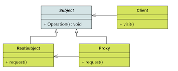

代理模式是一种结构型设计模式，它允许在某个对象的访问上提供一个代理或占位符，以控制对该对象的访问。代理模式可以用于实现对目标对象的访问控制、延迟加载、日志记录、性能监控、访问权限控制等需求。

在 Java 中，代理模式通常有静态代理和动态代理两种实现方式：

1. **静态代理：** 静态代理是通过手动编写代理类来实现的，代理类和被代理类实现了同样的接口或继承了同样的父类，代理类中持有被代理对象的引用，并在调用目标方法前后进行额外的处理。静态代理的缺点是需要为每个被代理类编写一个代理类，不够灵活，容易产生代码冗余。

2. **动态代理：** 动态代理是在运行时动态生成代理类的一种代理方式，不需要手动编写代理类，而是通过 Java 提供的动态代理机制来生成代理类。Java 中的动态代理主要依靠 `java.lang.reflect.Proxy` 类和 `java.lang.reflect.InvocationHandler` 接口实现。动态代理可以更加灵活地对目标对象进行代理，不需要为每个被代理类编写单独的代理类。

---

静态代理是通过手动编写代理类来实现的，代理类和被代理类实现了同样的接口或继承了同样的父类，代理类中持有被代理对象的引用，并在调用目标方法前后进行额外的处理。

下面是一个简单的静态代理示例代码：

```java
// 接口
interface Subject {
    void doSomething();
}

// 被代理类
class RealSubject implements Subject {
    @Override
    public void doSomething() {
        System.out.println("RealSubject is doing something.");
    }
}

// 代理类
class StaticProxy implements Subject {
    private Subject realSubject;

    public StaticProxy(Subject realSubject) {
        this.realSubject = realSubject;
    }

    @Override
    public void doSomething() {
        System.out.println("Before method invocation.");
        realSubject.doSomething(); // 调用被代理对象的方法
        System.out.println("After method invocation.");
    }
}

// 客户端代码
public class Main {
    public static void main(String[] args) {
        // 创建被代理对象
        Subject realSubject = new RealSubject();
        // 创建代理对象，并将被代理对象传入代理类构造方法
        Subject proxy = new StaticProxy(realSubject);
        // 调用代理对象的方法
        proxy.doSomething();
    }
}
```

在这个示例中，`StaticProxy` 类是代理类，它持有一个 `Subject` 接口类型的被代理对象的引用，并在调用被代理对象的方法前后分别输出日志。客户端代码创建被代理对象和代理对象，然后通过代理对象调用方法。

---

下面是在 Java 中使用动态代理的示例代码：

```java
import java.lang.reflect.InvocationHandler;
import java.lang.reflect.Method;
import java.lang.reflect.Proxy;

// 接口
interface Subject {
    void doSomething();
}

// 被代理类
class RealSubject implements Subject {
    @Override
    public void doSomething() {
        System.out.println("RealSubject is doing something.");
    }
}

// 代理处理器
class DynamicProxyHandler implements InvocationHandler {
    private Object target;

    public DynamicProxyHandler(Object target) {
        this.target = target;
    }

    @Override
    public Object invoke(Object proxy, Method method, Object[] args) throws Throwable {
        System.out.println("Before method invocation.");
        Object result = method.invoke(target, args);
        System.out.println("After method invocation.");
        return result;
    }
}

// 客户端代码
public class Main {
    public static void main(String[] args) {
        Subject realSubject = new RealSubject();
        InvocationHandler handler = new DynamicProxyHandler(realSubject);

        // 创建动态代理对象
        Subject proxy = (Subject) Proxy.newProxyInstance(
            realSubject.getClass().getClassLoader(),
            realSubject.getClass().getInterfaces(),
            handler
        );

        // 调用代理对象的方法
        proxy.doSomething();
    }
}
```

在这个示例中，`DynamicProxyHandler` 类实现了 `InvocationHandler` 接口，用于处理代理对象的方法调用。在客户端代码中，通过 `Proxy.newProxyInstance()` 方法动态生成代理对象，然后调用代理对象的方法即可。在方法调用前后，代理处理器会执行额外的逻辑。

### 3.2.2 适配器模式

- 定义：将一个类的接口转换成客户端所期望的另一种接口，从而使原本因接口不匹配而无法在一起工作的两个类能够在一起工作。

- 适配器模式的优点包括：

  1. **解耦性强：** 适配器模式可以将目标接口与被适配者类解耦，客户端只需要与目标接口交互，而不需要直接与被适配者类交互。
  2. **复用性好：** 可以复用现有的类，无需修改原有代码即可满足新的需求。
  3. **灵活性高：** 可以动态地适配不同的被适配者类，使得适配器具有较高的灵活性。

  适配器模式在 Java 中的应用非常广泛，例如在 Java 中的 I/O 流中，就使用了适配器模式来适配不同类型的输入输出设备。此外，在 Java 中的 GUI 编程中，也常常使用适配器模式来适配不同类型的事件处理器。

- 类图

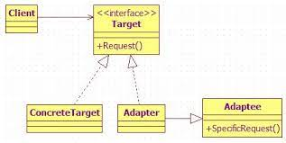

适配器模式是一种结构型设计模式，它允许将现有类的接口转换成客户端所期望的接口，从而使得原本由于接口不兼容而不能一起工作的类能够协同工作。

---

在 Java 中，适配器模式通常由适配器类（Adapter）实现，它实现了客户端所期望的目标接口，并且包含一个对现有类的引用，通过调用现有类的方法来完成目标接口的方法。

下面是适配器模式在 Java 中的基本实现示例：

```java
// 目标接口
interface Target {
    void request();
}

// 被适配的类
class Adaptee {
    public void specificRequest() {
        System.out.println("Adaptee specificRequest");
    }
}

// 适配器类
class Adapter implements Target {
    private Adaptee adaptee;

    public Adapter(Adaptee adaptee) {
        this.adaptee = adaptee;
    }

    @Override
    public void request() {
        adaptee.specificRequest();
    }
}

// 客户端代码
public class Main {
    public static void main(String[] args) {
        Adaptee adaptee = new Adaptee();
        Target adapter = new Adapter(adaptee);
        adapter.request();
    }
}
```

在这个示例中，`Target` 接口是客户端期望的接口，`Adaptee` 类是现有的、不兼容的类，`Adapter` 类则充当适配器，它实现了 `Target` 接口，并包含一个对 `Adaptee` 类的引用。当客户端调用 `Adapter` 的 `request()` 方法时，适配器会调用 `Adaptee` 的 `specificRequest()` 方法来完成客户端的请求。

- 典型范例：JDBC给出一个客户端通用的抽象接口，每一个具体数据库引擎（如SQL Server、Oracle、MySQL等）的JDBC驱动软件都是一个介于JDBC接口和数据库引擎接口之间的适配器软件。

- 双向适配器

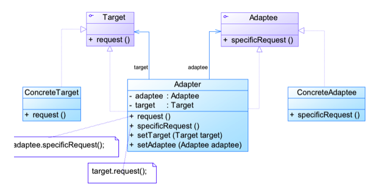

- 模式优缺点

  - 适配器模式的优点

  - 将目标类和适配者类解耦，通过引入一个适配器类来重用现有的适配者类，而无须修改原有代码。

  - 增加了类的透明性和复用性，将具体的实现封装在适配者类中，对于客户端类来说是透明的，而且提高了适配者的复用性。

  - 灵活性和扩展性都非常好，通过使用配置文件，可以很方便地更换适配器，也可以在不修改原有代码的基础上增加新的适配器类，完全符合“开闭原则”。

- 模式优缺点

  - 类适配器模式还具有如下优点：由于适配器类是适配者类的子类，因此可以在适配器类中置换一些适配者的方法，使得适配器的灵活性更强。

  - 类适配器模式的缺点如下：对于Java、C#等不支持多重继承的语言，一次最多只能适配一个适配者类，而且目标抽象类只能为抽象类，不能为具体类，其使用有一定的局限性，不能将一个适配者类和它的子类都适配到目标接口。

- 模式优缺点

  - 对象适配器模式还具有如下优点：一个对象适配器可以把多个不同的适配者适配到同一个目标，也就是说，同一个适配器可以把适配者类和它的子类都适配到目标接口。

  - 对象适配器模式的缺点如下：与类适配器模式相比，要想置换适配者类的方法就不容易。如果一定要置换掉适配者类的一个或多个方法，就只好先做一个适配者类的子类，将适配者类的方法置换掉，然后再把适配者类的子类当做真正的适配者进行适配，实现过程较为复杂。

### 3.2.3 桥接模式


### 3.2.4 装饰模式

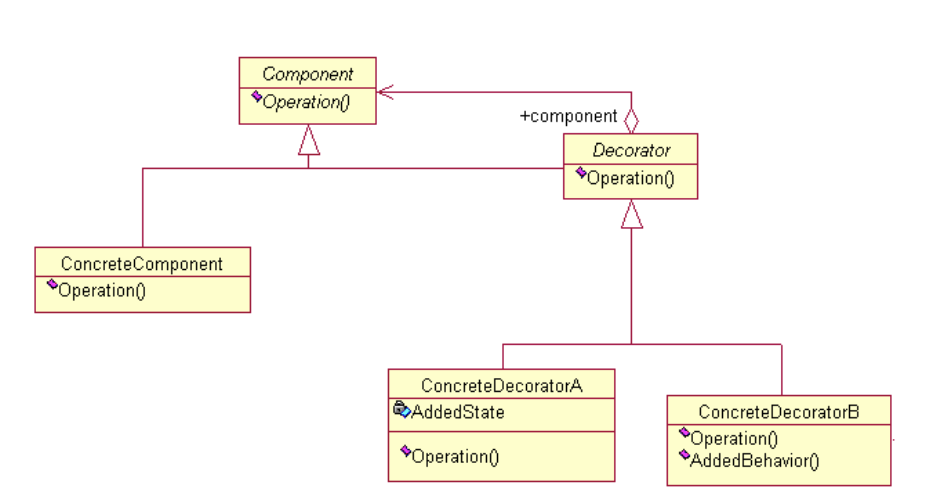

装饰者模式是一种结构型设计模式，用于动态地给对象添加额外的职责。在装饰者模式中，可以在不修改现有对象结构的情况下，通过将对象放入另一个包装对象中来增加新的功能。

在Java中，装饰者模式通常涉及以下几个角色：

1. **Component（组件）**：定义一个对象接口，可以给这些对象动态地添加职责。在Java中，通常是一个接口或抽象类，定义了具体组件和装饰者共同拥有的方法。

2. **ConcreteComponent（具体组件）**：实现了Component接口的具体对象，是被装饰的原始对象。

3. **Decorator（装饰者）**：继承自Component的抽象类，内部包含一个指向Component对象的引用，并且实现了Component接口。装饰者通常在其构造函数中接收一个Component对象，以便于在运行时动态地添加新的功能。

4. **ConcreteDecorator（具体装饰者）**：具体的装饰者类，通过扩展Decorator类来实现具体的装饰功能。它可以在原始对象的基础上添加一些新的行为或状态。

以下是一个简单的Java示例，演示了装饰者模式的用法：

```java
// 定义组件接口
interface Component {
    void operation();
}

// 具体组件类
class ConcreteComponent implements Component {
    @Override
    public void operation() {
        System.out.println("ConcreteComponent operation");
    }
}

// 装饰者抽象类
abstract class Decorator implements Component {
    protected Component component;

    public Decorator(Component component) {
        this.component = component;
    }

    @Override
    public void operation() {
        component.operation();
    }
}

// 具体装饰者类
class ConcreteDecorator extends Decorator {
    public ConcreteDecorator(Component component) {
        super(component);
    }

    @Override
    public void operation() {
        super.operation();
        addedBehavior();
    }

    private void addedBehavior() {
        System.out.println("Added behavior");
    }
}

public class Main {
    public static void main(String[] args) {
        // 创建具体组件对象
        Component component = new ConcreteComponent();

        // 使用具体装饰者对组件进行装饰
        Component decoratedComponent = new ConcreteDecorator(component);

        // 调用装饰后的对象的操作方法，会先执行原始对象的操作，然后再执行装饰者添加的行为
        decoratedComponent.operation();
    }
}
```

在这个示例中，ConcreteComponent表示具体的组件，ConcreteDecorator表示具体的装饰者，它们都实现了Component接口。Decorator是装饰者的抽象类，用于维护指向Component对象的引用，并且也实现了Component接口。ConcreteDecorator通过继承Decorator来实现具体的装饰功能，在调用operation()方法时，会先调用被装饰对象的operation()方法，然后再添加新的行为。

### 3.2.5 组合模式

### 3.2.6 外观模式

- 定义：门面模式为子系统提供一个统一的高层接口，供外部客户使用。这个高层接口就是子系统的门面。

- 类图 

  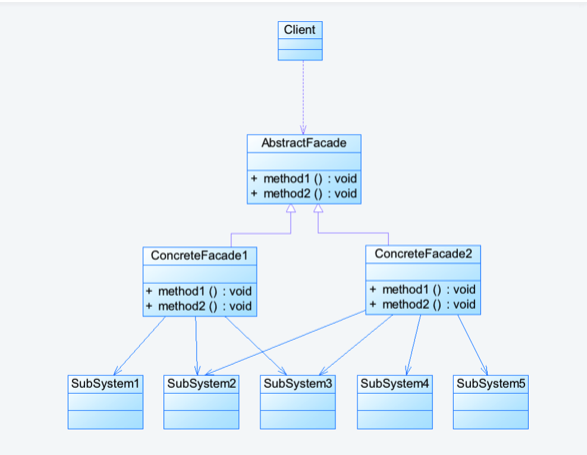

- 模式优缺点

- 优点

  - 对客户屏蔽子系统组件，减少了客户处理的对象数目并使得子系统使用起来更加容易。通过引入外观模式，客户代码将变得很简单，与之关联的对象也很少。

  - 实现了子系统与客户之间的松耦合关系，这使得子系统的组件变化不会影响到调用它的客户类，只需要调整外观类即可。

  - 降低了大型软件系统中的编译依赖性，并简化了系统在不同平台之间的移植过程，因为编译一个子系统一般不需要编译所有其他的子系统。一个子系统的修改对其他子系统没有任何影响，而且子系统内部变化也不会影响到外观对象。

  - 只是提供了一个访问子系统的统一入口，并不影响用户直接使用子系统类。

- 缺点

  - 不能很好地限制客户使用子系统类，如果对客户访问子系统类做太多的限制则减少了可变性和灵活性。

  - 在不引入抽象外观类的情况下，增加新的子系统可能需要修改外观类或客户端的源代码，违背了“开闭原则”。

在Java中，门面模式通常包含以下几个角色：

1. **Facade（门面）**：门面类是客户端与系统之间的接口，提供了一个简化的接口，隐藏了系统内部的复杂性。门面类知道如何调用系统的各个组件来完成特定的功能，并向客户端提供简单的方法来调用这些功能。

2. **Subsystem（子系统）**：子系统是实际执行工作的组件集合，它们负责完成系统的各个部分功能。子系统通常是由多个类或对象组成的复杂结构，客户端可以通过门面类来调用子系统的功能，而无需了解子系统的内部结构。

以下是一个简单的Java示例，演示了门面模式的用法：

```java
// 子系统A
class SubsystemA {
    public void operationA() {
        System.out.println("SubsystemA operation");
    }
}

// 子系统B
class SubsystemB {
    public void operationB() {
        System.out.println("SubsystemB operation");
    }
}

// 门面类
class Facade {
    private SubsystemA subsystemA;
    private SubsystemB subsystemB;

    public Facade() {
        this.subsystemA = new SubsystemA();
        this.subsystemB = new SubsystemB();
    }

    // 对外提供的简化接口，隐藏了系统的复杂性
    public void doSomething() {
        subsystemA.operationA();
        subsystemB.operationB();
    }
}

// 客户端代码
public class Main {
    public static void main(String[] args) {
        // 创建门面对象
        Facade facade = new Facade();

        // 客户端通过门面对象调用系统的功能
        facade.doSomething();
    }
}
```

在这个示例中，SubsystemA和SubsystemB表示系统的两个子系统，它们分别负责完成特定的功能。Facade是门面类，提供了一个简化的接口doSomething()，客户端可以通过这个方法来调用系统的功能。在doSomething()方法中，Facade通过调用SubsystemA和SubsystemB的方法来完成所需的功能，客户端无需了解系统内部的复杂结构。通过门面模式，客户端与系统之间实现了解耦，提高了系统的灵活性和可维护性。


### 3.2.7 享元模式

### 

## 3.3 行为型

### 3.3.1 模版方法模式

### 3.3.2 命令模式

### 3.3.3 迭代器模式

### 3.3.4 观察者模式

- 定义：对象间的一种一对多的依赖关系。当一方的对象改变状态时，所有的依赖者都会得到通知并被自动更新。

- 类图

  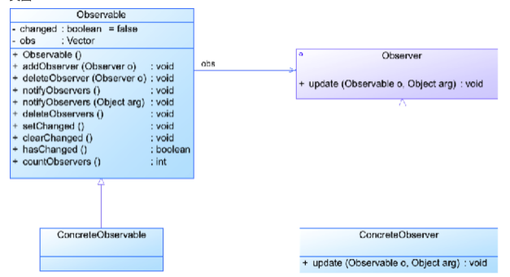

- 观察者模式的优点

  - 观察者模式可以实现表示层和数据逻辑层的分离，并定义了稳定的消息更新传递机制，抽象了更新接口，使得可以有各种各样不同的表示层作为具体观察者角色。

  - 观察者模式在观察目标和观察者之间建立一个抽象的耦合。

  - 观察者模式支持广播通信。

  - 观察者模式符合“开闭原则”的要求。

- 观察者模式的缺点

  - 如果一个观察目标对象有很多直接和间接的观察者的话，将所有的观察者都通知到会花费很多时间。

  - 如果在观察者和观察目标之间有循环依赖的话，观察目标会触发它们之间进行循环调用，可能导致系统崩溃。

  - 观察者模式没有相应的机制让观察者知道所观察的目标对象是怎么发生变化的，而仅仅只是知道观察目标发生了变化。

- 适用场合

  - 当一个抽象模型有两个方面，其中一个方面依赖于另一个方面时，将这两者封装在独立的对象中使他们可以独立的改变和复用。

  - 一个对象的改变需要同时改变其他对象，但不知道具体有多少其它对象需要改变。

  - 一个对象必须通知其他对象，而他又不能预先知道其它对象是谁。

### 3.3.5 中介者模式

### 3.3.6 备忘录模式

### 3.3.7 解释器模式

### 3.3.8 状态模式

### 3.3.9 策略模式

- 定义：定义一组算法，将每个封装为一个类，并且使得他们可以相互替换。该模式使得算法可以独立于使用它的客户变动。

- 类图

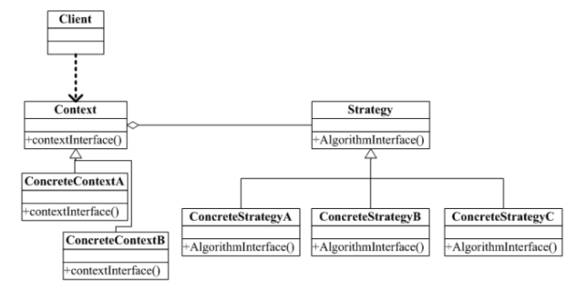

- 策略模式的优点

  - 策略模式提供了对“开闭原则”的完美支持，用户可以在不修改原有系统的基础上选择算法或行为，也可以灵活地增加新的算法或行为。

  - 策略模式提供了管理相关的算法族的办法。

  - 策略模式提供了可以替换继承关系的办法。

  - 使用策略模式可以避免使用多重条件转移语句。

- 策略模式的缺点

  - 客户端必须知道所有的策略类，并自行决定使用哪一个策略类。

  - 策略模式将造成产生很多策略类，可以通过使用享元模式在一定程度上减少对象的数量。

- 在以下情况下可以使用策略模式：

  - 如果在一个系统里面有许多类，它们之间的区别仅在于它们的行为，那么使用策略模式可以动态地让一个对象在许多行为中选择一种行为。

  - 一个系统需要动态地在几种算法中选择一种。

  - 如果一个对象有很多的行为，如果不用恰当的模式，这些行为就只好使用多重的条件选择语句来实现。

  - 不希望客户端知道复杂的、与算法相关的数据结构，在具体策略类中封装算法和相关的数据结构，提高算法的保密性与安全性。

### 3.3.10 责任链模式

### 3.3.11访问者模式
