# 设计模式

> 引言：为什么要学设计模式
>
> 笔者：设计模式在后端开发中发挥着十分重要的作用，写好一个业务代码并不困难，但是如何写好一个高效实用和优雅的代码有时候是更重要的。

## 一、基本设计原则

### 1.1 SOLID五大原则

- 单一职责原则(Single Responsibility Principle, SRP)

  - 类的职责要单一，不能将太多的职责放在一个类中

  - 当客户端需要该对象的某一个职责时，不得不将其他不需要的职责全都包含进来，从而造成冗余代码或代码的浪费。同时，当需要修改一个职责的代码时，往往容易导致另一个职责出现问题。因此单一职责原则的核心就是控制类的粒度大小、将对象解耦、提高其内聚性，使得一个类/接口/方法只负责一项职责或职能。

- 开闭原则(Open-Closed Principle, OCP)

  - 软件实体对扩展是开放的，但对修改是关闭的，即在不修改一个软件实体的基础上去扩展其功能

  - 当应用的需求改变时，在不修改软件实体的源代码或者二进制代码的前提下，可以扩展模块的功能（通常通过继承），使其满足新的需求。

- 里氏代换原则(Liskov Substitution Principle, LSP)
  - 在软件系统中，一个可以接受基类对象的地方必然可以接受一个子类对象
  - 子类可以扩展父类的功能，但不能改变父类原有的功能。里氏替换原则是继承复用的基础，它反映了基类与子类之间的关系，是对开闭原则的补充，是对实现抽象化的具体步骤的规范。它是动作正确性的保证。即类的扩展不会给已有的系统引入新的错误，降低了代码出错的可能性。

- 接口隔离原则(Interface Segregation Principle, ISP)

  - 使用多个专门的接口来取代一个统一的接口

  - 接口隔离原则和单一职责都是为了提高类的内聚性、降低它们之间的耦合性，体现了封装的思想，但两者是不同的：单一职责原则注重的是职责，而接口隔离原则注重的是对接口依赖的隔离。单一职责原则主要是约束类，它针对的是程序中的实现和细节；接口隔离原则主要约束接口，主要针对抽象和程序整体框架的构建。

- 依赖倒转原则(Dependency Inversion Principle, DIP)

  - 要针对抽象层编程，而不要针对具体类编程

  - 由于在软件设计中，细节具有多变性，而抽象层则相对稳定，因此以抽象为基础搭建起来的架构要比以细节为基础搭建起来的架构要稳定得多。这里的抽象指的是接口或者抽象类，而细节是指具体的实现类。依赖倒置原则可以降低类间的耦合性，提高系统的稳定性，减少并行开发引起的风险，提高代码的可读性和可维护性。

### 1.2 其它原则

- 合成复用原则(Composite Reuse Principle, CRP)
  - 在系统中应该尽量多使用组合和聚合关联关系，尽量少使用甚至不使用继承关系

- 迪米特法则(Law of Demeter, LoD)
  - 一个软件实体对其他实体的引用越少越好，或者说如果两个类不必彼此直接通信，那么这两个类就不应当发生直接的相互作用，而是通过引入一个第三者发生间接交互

## 二、UML

### 2.1 面向对象三大特征

- 封装：隐藏内部实现，保护内部信息，提供一种公共的访问方式

- 继承：实现复用，归纳共性

- 多态：对象在不同的时刻可以表现出不同的状态


### 2.2 类图关系

#### 2.2.1 关联关系

- 普通关联

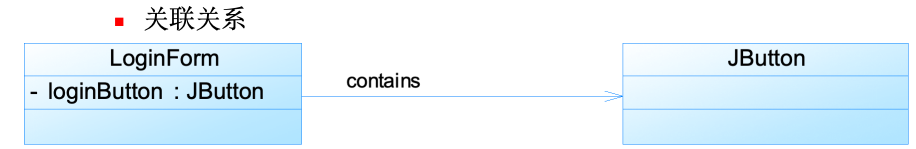

- 多重关联

  | **表示方式** | **多重性说明**                                              |
  | ------------ | ----------------------------------------------------------- |
  | 1..1         | 表示另一个类的一个对象只与一个该类对象有关系                |
  | 0..*         | 表示另一个类的一个对象与零个或多个该类对象有关系            |
  | 1..*         | 表示另一个类的一个对象与一个或多个该类对象有关系            |
  | 0..1         | 表示另一个类的一个对象没有或只与一个该类对象有关系          |
  | m..n         | 表示另一个类的一个对象与最少m、最多n个该类对象有关系 (m<=n) |

  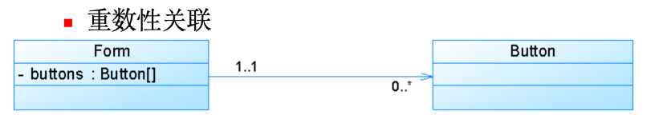

#### 2.2.2 聚合关系

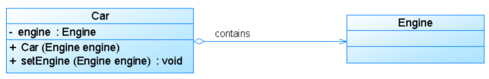

#### 2.2.3 组合关系

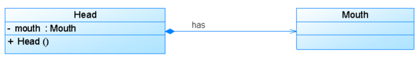


#### 2.2.4 依赖关系

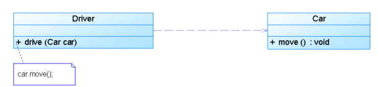

#### 2.2.5 泛化关系

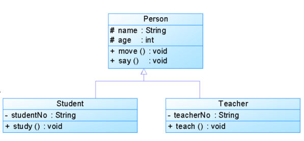

#### 2.2.6 实现关系

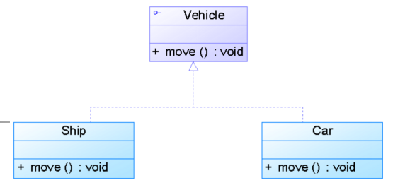

## 三、设计模式

### 3.1 创建型

#### 3.1.1

### 3.1 The Strategy Pattern（策略模式）

- 定义：定义一组算法，将每个封装为一个类，并且使得他们可以相互替换。该模式使得算法可以独立于使用它的客户变动。

- 类图

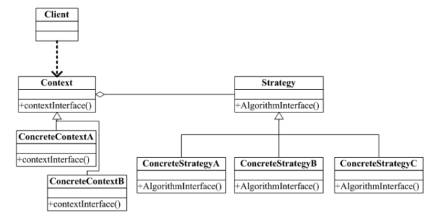

- 策略模式的优点

  - 策略模式提供了对“开闭原则”的完美支持，用户可以在不修改原有系统的基础上选择算法或行为，也可以灵活地增加新的算法或行为。

  - 策略模式提供了管理相关的算法族的办法。

  - 策略模式提供了可以替换继承关系的办法。

  - 使用策略模式可以避免使用多重条件转移语句。

- 策略模式的缺点

  - 客户端必须知道所有的策略类，并自行决定使用哪一个策略类。

  - 策略模式将造成产生很多策略类，可以通过使用享元模式在一定程度上减少对象的数量。

- 在以下情况下可以使用策略模式：

  - 如果在一个系统里面有许多类，它们之间的区别仅在于它们的行为，那么使用策略模式可以动态地让一个对象在许多行为中选择一种行为。

  - 一个系统需要动态地在几种算法中选择一种。

  - 如果一个对象有很多的行为，如果不用恰当的模式，这些行为就只好使用多重的条件选择语句来实现。

  - 不希望客户端知道复杂的、与算法相关的数据结构，在具体策略类中封装算法和相关的数据结构，提高算法的保密性与安全性。

### 3.2 The Observer Pattern（观察者模式）

- 定义：对象间的一种一对多的依赖关系。当一方的对象改变状态时，所有的依赖者都会得到通知并被自动更新。

- 类图

  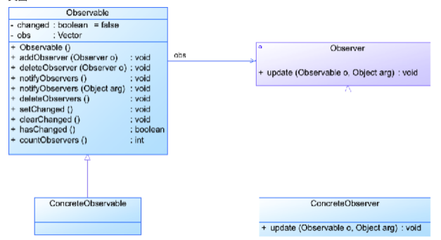

- 观察者模式的优点

  - 观察者模式可以实现表示层和数据逻辑层的分离，并定义了稳定的消息更新传递机制，抽象了更新接口，使得可以有各种各样不同的表示层作为具体观察者角色。

  - 观察者模式在观察目标和观察者之间建立一个抽象的耦合。

  - 观察者模式支持广播通信。

  - 观察者模式符合“开闭原则”的要求。

- 观察者模式的缺点

  - 如果一个观察目标对象有很多直接和间接的观察者的话，将所有的观察者都通知到会花费很多时间。

  - 如果在观察者和观察目标之间有循环依赖的话，观察目标会触发它们之间进行循环调用，可能导致系统崩溃。

  - 观察者模式没有相应的机制让观察者知道所观察的目标对象是怎么发生变化的，而仅仅只是知道观察目标发生了变化。

- 适用场合

  - 当一个抽象模型有两个方面，其中一个方面依赖于另一个方面时，将这两者封装在独立的对象中使他们可以独立的改变和复用。

  - 一个对象的改变需要同时改变其他对象，但不知道具体有多少其它对象需要改变。

  - 一个对象必须通知其他对象，而他又不能预先知道其它对象是谁。


### 3.3 The Factory Pattern（工厂模式）

- 抽象工厂模式

- 类图

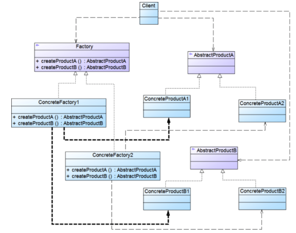

- 工厂方法模式
  - 在类中定义一个用于创建对象的接口方法，让其子类决定实例化哪一个类。通过这种做法，使得工厂方法的客户（工厂方法的使用者）不必了解具体应该实例化哪一个类。

- 类图 

  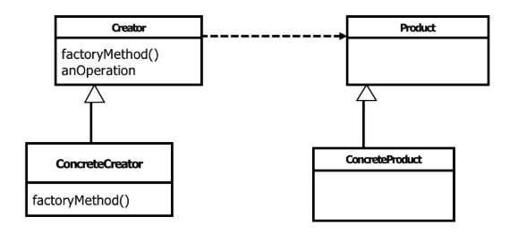

- 优点

  - 让用户代码与特定类Product的子类ConcretProduct的代码解耦。

  - 用户不必知道它所使用的对象是怎么创建的，只需要知道这些对象的用法即可。

- 适用场景

  - 希望让用户使用某些类，但不希望与这些类形成耦合（用new）。

  - 用户需要一个类的子类的实例，但不知道该类有哪些子类可用。

  - 经典范例：java迭代器

- 抽象工厂模式解决的问题

  - 当系统所提供的工厂所需生产的具体产品并不是一个简单的对象，而是多个位于不同产品等级结构中属于不同类型的具体产品时需要使用抽象工厂模式。

  - 抽象工厂模式是所有形式的工厂模式中最为抽象和最具一般性的一种形态。

  - 抽象工厂模式与工厂方法模式最大的区别在于，工厂方法模式针对的是一个产品等级结构，而抽象工厂模式则需要面对多个产品等级结构，一个工厂等级结构可以负责多个不同产品等级结构中的产品对象的创建 。当一个工厂等级结构可以创建出分属于不同产品等级结构的一个产品族中的所有对象时，抽象工厂模式比工厂方法模式更为简单、有效率。

### 3.4 The Singleton Pattern （单例模式）

- 通用结构类图

  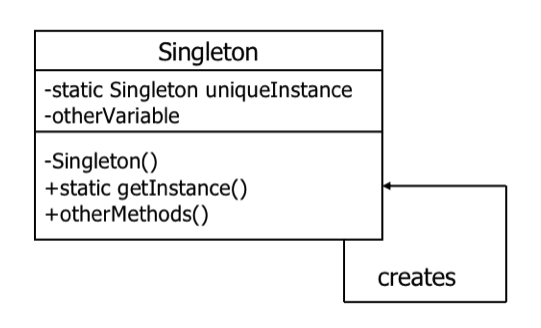

- 懒汉式单例类

```java
Public class LazySingleton

{

  private static LazySingleton uniqueInstance;

  //其他成员变量声明

  private LazySingleton() {…}

  public static LazySingleton getInstance()

  {

    if (uniqueInstance==null)

      uniqueInstance=new LazySingleton();

    return uniqueInstance;

  }

  //其他成员方法声明

}

//类LazySingleton只在第一次被引用时才实例化，静态加载该类并不会将他自己实例化。
```

- 处理多线程

  - 获取对象的方法加一个synchronized

  - Double-Checked Locking模式

```java
public class DCLSingleton{

  Private volatile static DCLSingleton uniqueInstance;

  Private DCLSingleton(){}

  Public static DCLSingleton getInstance() {

    if (uniqueInstance==null) {

      synchronized (DCLSingleton.class){

        if (uniqueInstance == null) {

          uniqueInstance=new DCLSingleton();

        }

      }

    }

    return uniqueInstance;

  }

}
```

- 饿汉式单例类

```java
Public class EagerSingleton

{

  private static final EagerSingleton uniqueInstance =

    new EagerSingleton();

  private EagerSingleton() {…}

  public static EagerSingleton getInstance()

  {

    return uniqueInstance;

  }

}

//类EagerSingleton在加载时就马上将自己实例化。

//可以解决多线程的问题
```

- 饿汉式与懒汉式单例类比较

  - 饿汉式单例类在自己被加载时就将自己实例化。单从资源利用效率角度来讲，这个比懒汉式单例类稍差些。从速度和反应时间角度来讲，则比懒汉式单例类稍好些。

  - 懒汉式单例类在实例化时，必须处理好在多个线程同时首次引用此类时的访问限制问题，特别是当单例类作为资源控制器，在实例化时必然涉及资源初始化，而资源初始化很有可能耗费大量时间，这意味着出现多线程同时首次引用此类的机率变得较大，需要通过同步化机制进行控制。

- 单例模式

  - 由于单例模式中没有抽象层，因此单例类的扩展有很大的困难。

  - 单例类的职责过重，在一定程度上违背了“单一职责原则”。因为单例类既充当了工厂角色，提供了工厂方法，同时又充当了产品角色，包含一些业务方法，将产品的创建和产品的本身的功能融合到一起。

  - 滥用单例将带来一些负面问题，如为了节省资源将数据库连接池对象设计为单例类，可能会导致共享连接池对象的程序过多而出现连接池溢出；很多面向对象语言(如Java、C#)的运行环境都提供了自动垃圾回收的技术，如果实例化的对象长时间不被利用，系统会认为它是垃圾，会自动销毁并回收资源，下次利用时又将重新实例化，这将导致对象状态的丢失。

- 在以下情况下可以使用单例模式：

  - 系统只需要一个实例对象，如系统要求提供一个唯一的序列号生成器，或者需要考虑资源消耗太大而只允许创建一个对象。

  - 客户调用类的单个实例只允许使用一个公共访问点，除了该公共访问点，不能通过其他途径访问该实例。

  - 在一个系统中要求一个类只有一个实例时才应当使用单例模式。反过来，如果一个类可以有几个实例共存，就需要对单例模式进行改进，使之成为多例模式。

### 3.5 The Adapter Pattern（适配器模式）

- 定义：将一个类的接口转换成客户端所期望的另一种接口，从而使原本因接口不匹配而无法在一起工作的两个类能够在一起工作。

- 类图

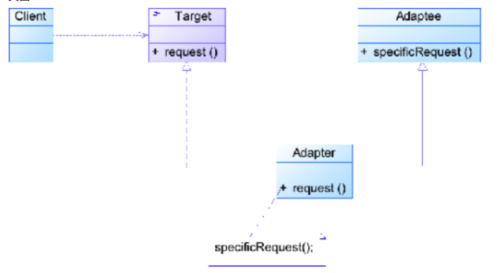

- 典型代码

```java
public class Adapter extends Adaptee implements Target

{

  public void request()

  {

    specificRequest();

  }

}
```


- 另一个写法

```java
public class Adapter extends Target

{

  private Adaptee adaptee;

  public Adapter(Adaptee adaptee)

  {

    this.adaptee=adaptee;

  }

  public void request()

  {

    adaptee.specificRequest();

  }

}
```

- 典型范例：JDBC给出一个客户端通用的抽象接口，每一个具体数据库引擎（如SQL Server、Oracle、MySQL等）的JDBC驱动软件都是一个介于JDBC接口和数据库引擎接口之间的适配器软件。

- 双向适配器

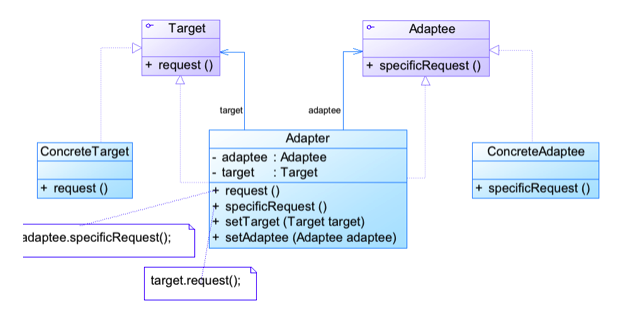

- 模式优缺点

  - 适配器模式的优点

  - 将目标类和适配者类解耦，通过引入一个适配器类来重用现有的适配者类，而无须修改原有代码。

  - 增加了类的透明性和复用性，将具体的实现封装在适配者类中，对于客户端类来说是透明的，而且提高了适配者的复用性。

  - 灵活性和扩展性都非常好，通过使用配置文件，可以很方便地更换适配器，也可以在不修改原有代码的基础上增加新的适配器类，完全符合“开闭原则”。

- 模式优缺点

  - 类适配器模式还具有如下优点：由于适配器类是适配者类的子类，因此可以在适配器类中置换一些适配者的方法，使得适配器的灵活性更强。

  - 类适配器模式的缺点如下：对于Java、C#等不支持多重继承的语言，一次最多只能适配一个适配者类，而且目标抽象类只能为抽象类，不能为具体类，其使用有一定的局限性，不能将一个适配者类和它的子类都适配到目标接口。

- 模式优缺点

  - 对象适配器模式还具有如下优点：一个对象适配器可以把多个不同的适配者适配到同一个目标，也就是说，同一个适配器可以把适配者类和它的子类都适配到目标接口。

  - 对象适配器模式的缺点如下：与类适配器模式相比，要想置换适配者类的方法就不容易。如果一定要置换掉适配者类的一个或多个方法，就只好先做一个适配者类的子类，将适配者类的方法置换掉，然后再把适配者类的子类当做真正的适配者进行适配，实现过程较为复杂。

### 3.6 The Facade Pattern 门面模式

- 定义：门面模式为子系统提供一个统一的高层接口，供外部客户使用。这个高层接口就是子系统的门面。

- 类图 

  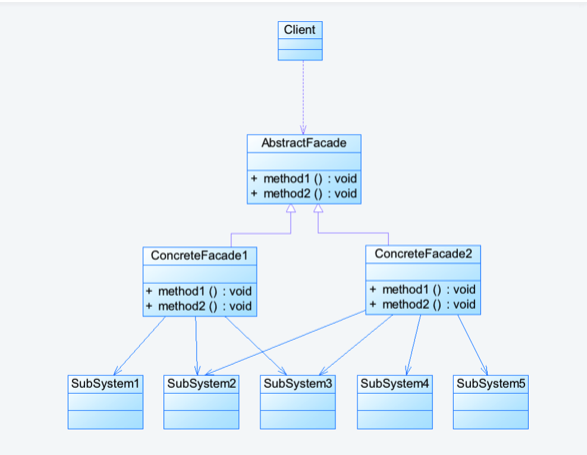

- 模式优缺点

- 优点

  - 对客户屏蔽子系统组件，减少了客户处理的对象数目并使得子系统使用起来更加容易。通过引入外观模式，客户代码将变得很简单，与之关联的对象也很少。

  - 实现了子系统与客户之间的松耦合关系，这使得子系统的组件变化不会影响到调用它的客户类，只需要调整外观类即可。

  - 降低了大型软件系统中的编译依赖性，并简化了系统在不同平台之间的移植过程，因为编译一个子系统一般不需要编译所有其他的子系统。一个子系统的修改对其他子系统没有任何影响，而且子系统内部变化也不会影响到外观对象。

  - 只是提供了一个访问子系统的统一入口，并不影响用户直接使用子系统类。

- 缺点

  - 不能很好地限制客户使用子系统类，如果对客户访问子系统类做太多的限制则减少了可变性和灵活性。

  - 在不引入抽象外观类的情况下，增加新的子系统可能需要修改外观类或客户端的源代码，违背了“开闭原则”。

### 

### 3.2 结构型

#### 3.2.1 代理模式


