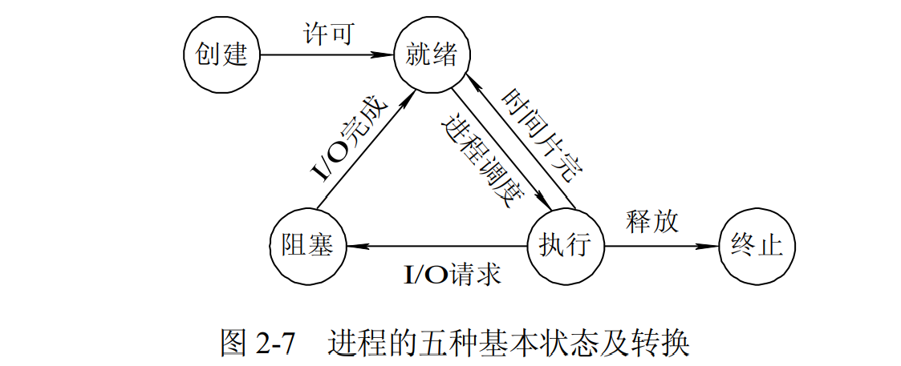
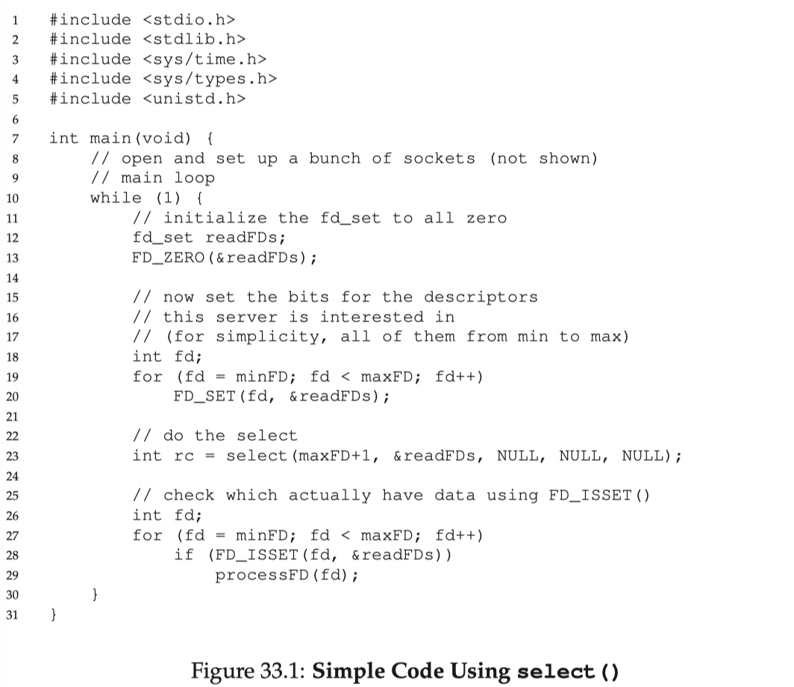
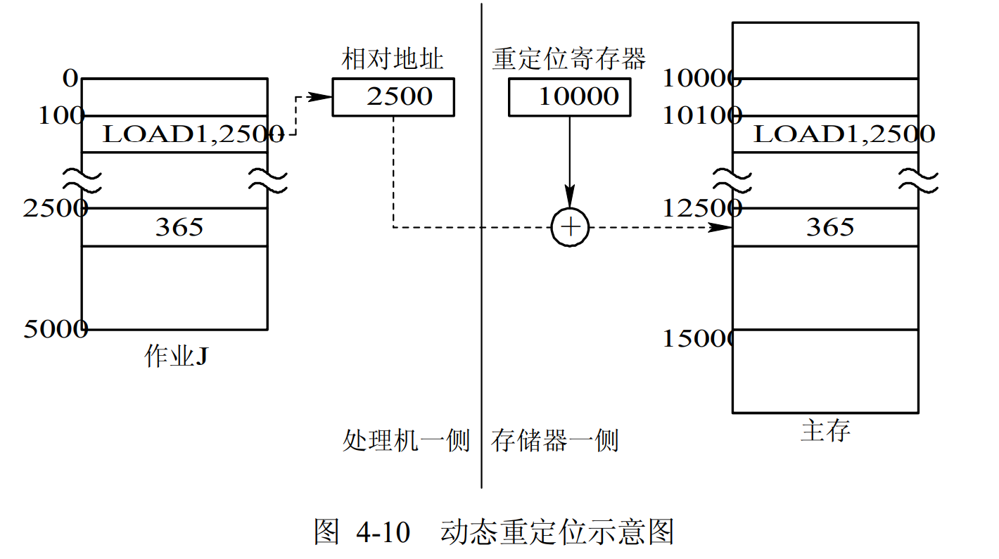

# 操作系统

[TOC]

* 进程和线程
    * [进程和线程有什么区别？](#进程和线程有什么区别)
    * [进程间通信有哪些方式？](#进程间通信有哪些方式)
    * [进程同步问题](#进程同步问题)
    * [进程有哪几种状态？](#进程有哪几种状态)
    * [进程调度策略有哪些？](#进程调度策略有哪些)
    * [什么是僵尸进程？](#什么是僵尸进程)
    * [线程同步有哪些方式？](#线程同步有哪些方式)
    * [什么是协程？](#什么是协程)
    * [进程的异常控制流：陷阱、中断、异常和信号](#进程的异常控制流：陷阱、中断、异常和信号)
    * [什么是IO多路复用？怎么实现？](#什么是IO多路复用怎么实现)
    * [什么是用户态和内核态？](#什么是用户态和内核态)
* 死锁
    * [什么是死锁？](#什么是死锁)
    * [死锁产生的必要条件？](#死锁产生的必要条件)
    * [死锁有哪些处理方法？](#死锁有哪些处理方法)
* 内存管理
    * [分页和分段有什么区别？](#分页和分段有什么区别)
    * [什么是虚拟内存？](#什么是虚拟内存)
    * [有哪些页面置换算法？](#有哪些页面置换算法)
    * [缓冲区溢出问题](#缓冲区溢出问题)
* [磁盘调度](#磁盘调度)
* [参考](#参考)

------

# 一、进程

## 1.1 进程和线程有什么区别？

- 进程（Process）是系统进行资源分配和调度的基本单位，线程（Thread）是CPU调度和分派的基本单位；
- 线程依赖于进程而存在，一个进程至少有一个线程；
- 进程有自己的独立地址空间，线程共享所属进程的地址空间；
- 进程是拥有系统资源的一个独立单位，而线程自己基本上不拥有系统资源，只拥有一点在运行中必不可少的资源(如程序计数器,一组寄存器和栈)，和其他线程共享本进程的相关资源如内存、I/O、cpu等；
- 在进程切换时，涉及到整个当前进程CPU环境的保存环境的设置以及新被调度运行的CPU环境的设置，而线程切换只需保存和设置少量的寄存器的内容，并不涉及存储器管理方面的操作，可见，进程切换的开销远大于线程切换的开销；
- 线程之间的通信更方便，同一进程下的线程共享全局变量等数据，而进程之间的通信需要以进程间通信(IPC)的方式进行；
- 多线程程序只要有一个线程崩溃，整个程序就崩溃了，但多进程程序中一个进程崩溃并不会对其它进程造成影响，因为进程有自己的独立地址空间，因此多进程更加健壮

进程操作代码实现，可以参考：[多进程 - 廖雪峰的官方网站](https://www.liaoxuefeng.com/wiki/1016959663602400/1017628290184064)

### 1.1.1 同一进程中的线程可以共享哪些数据？

- 进程代码段
- 进程的公有数据（全局变量、静态变量...）
- 进程打开的文件描述符
- 进程的当前目录
- 信号处理器/信号处理函数：对收到的信号的处理方式
- 进程ID与进程组ID
- 在同一进程中的线程可以共享以下类型的数据：
  1. **全局变量**：在进程中声明的全局变量可以被同一进程中的所有线程访问和修改。
  2. **静态变量**：静态变量的作用域也是整个进程，因此可以被同一进程中的所有线程共享。
  3. **堆内存**：通过动态内存分配函数（如malloc）分配的内存空间可以被同一进程中的所有线程访问。
  4. **文件描述符**：在打开文件时返回的文件描述符可以在同一进程的所有线程之间共享，允许它们对文件进行读写操作。
  5. **共享内存**：通过共享内存机制分配的内存区域可以被同一进程中的所有线程共享，这是一种特殊的内存共享方式。

### 1.1.2 线程独占哪些资源？

- 线程ID
- 一组寄存器的值
- 线程自身的栈（堆是共享的）
- 错误返回码：线程可能会产生不同的错误返回码，一个线程的错误返回码不应该被其它线程修改；
- 信号掩码/信号屏蔽字(Signal mask)：表示是否屏蔽/阻塞相应的信号（SIGKILL,SIGSTOP除外）

## 1.2 进程间通信有哪些方式？

### 1.2.1 通信方式

- 管道（Pipes）分为匿名管道和命名管道。匿名管道用于具有亲缘关系的进程（如父子进程）之间的通信，数据从一个进程写入管道，另一个进程从管道读取数据。命名管道可以用于没有亲缘关系的进程之间，命名管道在文件系统中有一个名字，进程可以通过这个名字进行通信。

- 消息队列（Message Queues）允许进程以消息的形式进行通信。消息被放入队列中，接收进程可以从队列中读取消息。消息队列可以支持优先级，允许高优先级的消息先被处理。

- 共享内存（Shared Memory）允许多个进程访问同一块内存区域。通过这种方式，进程可以快速地交换数据，因为它们不需要通过内核进行数据传输。为了避免数据竞争，通常需要使用信号量或其他同步机制来控制对共享内存的访问。

- 信号（Signals）是一种异步通信机制，用于通知进程发生了某种事件。进程可以发送信号给其他进程，接收进程可以通过信号处理程序来响应这些信号。信号通常用于处理异常情况或进程间的简单通知。

- 套接字（Sockets）是一种网络通信机制，可以用于同一台机器上的进程之间，也可以用于不同机器上的进程之间。套接字支持多种协议（如 TCP 和 UDP），并且可以在不同的计算机之间进行通信。

- 文件（Files）也是一种进程间通信的方式。进程可以通过读写文件来进行通信。一个进程可以将数据写入文件，另一个进程可以读取该文件。这种方式的效率较低，但在某些情况下仍然是有效的。

- 远程过程调用（RPC）是一种允许程序在不同计算机上执行过程的机制。通过 RPC，进程可以调用另一个进程的函数，就像调用本地函数一样。RPC 通常用于分布式系统中。

- 事件（Events）是一种用于进程间同步的机制。一个进程可以设置一个事件，另一个进程可以等待该事件的发生。这种方式通常用于协调多个进程的执行。

不同的进程间通信方式各有优缺点，选择合适的 IPC 机制取决于具体的应用场景、性能要求和复杂性。对于高效的数据交换，通常会选择共享内存；而对于简单的消息传递，消息队列或管道可能更为合适。


### 1.2.2 命名管道和无名管道区别

命名管道（Named Pipe）和无名管道（Unnamed Pipe）都是管道的类型，但它们之间有几个关键区别：

1. **命名**：
   - 无名管道没有明确的文件系统路径，只存在于内存中，通常用于有亲缘关系的进程之间的通信。
   - 命名管道有一个在文件系统中可见的路径名，允许不同进程之间进行通信，即使它们没有亲缘关系。

2. **持久性**：
   - 无名管道在创建时会自动消失，进程结束后管道也会销毁。
   - 命名管道是持久的，它们会一直存在于文件系统中，直到被显式删除。

3. **关联性**：
   - 无名管道通常用于父子进程之间或者在同一个进程中的不同线程之间进行通信。
   - 命名管道允许不相关的进程之间进行通信，只要它们能够访问同一个路径名。

4. **访问权限**：
   - 由于命名管道是文件系统中的一部分，因此可以像普通文件一样设置权限。
   - 无名管道没有文件系统路径，因此没有显式的访问权限设置。

总的来说，无名管道更适合简单的、有亲缘关系的进程之间的通信，而命名管道则更适合不相关的进程之间的通信，并且可以持久存在于文件系统中。

## 1.3 PCB和TCB

### 1.3.1 进程控制块（PCB）

1. 定义

进程控制块（PCB）是操作系统用来管理进程的重要数据结构。它包含有关进程的所有基本信息，以及操作系统在调度和切换进程时所需的状态和控制信息。


2. PCB 的主要组成部分

PCB 包含多个字段，具体如下：

- **进程标识信息**：
  - **进程ID（PID）**：唯一标识每个进程的标识符。
  - **父进程ID（PPID）**：指明该进程的父进程。

- **进程状态**：
  - 表示进程当前的状态，如：
    - **就绪（Ready）**
    - **运行（Running）**
    - **阻塞（Blocked）**
    - **终止（Terminated）**

- **程序计数器（Program Counter）**：
  - 保持了进程下一条要执行的指令的地址，以便在上下文切换时能恢复执行。

- **CPU寄存器状态**：
  - 包含所有 CPU 注册器的值（如累加器、通用寄存器等），以便在切换时能恢复进程。

- **内存管理信息**：
  - 包括地址空间结构、页面表、段表、段基址和界限等，说明进程使用的内存分配情况。

- **调度信息**：
  - 相关于调度算法和策略的信息，如优先级、调度队列指针、时间片等。

- **输入输出状态信息**：
  - 表示该进程所拥有的文件描述符和设备信息，记录与该进程相关的 I/O 设备及其状态。

- **进程特权级**：
  - 指出该进程的执行权限，用以保护系统及其他进程的安全。


3. PCB 的功能

- **进程管理**：操作系统通过 PCB 跟踪每个进程的状态和资源使用情况，确保系统能够有效管理多个并发进程。

- **上下文切换**：当 CPU 从一个进程切换到另一个进程时，操作系统会保存当前进程的 PCB 状态，并加载要运行的进程的 PCB 信息，以便恢复执行。

- **资源分配**：PCB 记录每个进程所拥有的资源，使得操作系统能够进行合理的资源分配和回收。

- **调度决策**：调度算法依赖于 PCB 中的调度信息来决定哪个进程应该获得 CPU 时间。


4. PCB 的实现

- **内存结构**：PCB 通常在内核的内存空间中创建，每个进程都有对应的 PCB，操作系统维护一个进程表（Process Table），其中存储所有进程的 PCB 列表。

- **性能考量**：由于 PCB 的大小相对较小，操作系统在切换进程时需要频繁操作，但其开销相比于线程和进程的上下文切换（例如保存和加载寄存器状态）是较小的。

---

**示例**

以下是一个简单的 PCB 的示例，用于说明它可能包含的信息：

```
+---------------------------------------+
| Process Control Block (PCB)          |
+---------------------------------------+
| PID:        1001                      |
| PPID:       1000                      |
| State:      Ready                     |
| PC:         0x00400000                |
| Registers:  {R1: 10, R2: 20, ...}     |
| Memory:     {Pages: [1, 2, 3]}        |
| Priority:   5                          |
| I/O Devices: {Disk, Network}           |
+---------------------------------------+
```

**总结**

进程控制块（PCB）是操作系统中一个非常重要的结构，它用于存储与特定进程相关的所有信息。其设计保证了操作系统能够有效地管理进程、执行上下文切换、实现资源分配，并进行调度。理解 PCB 的结构和功能对于掌握操作系统的进程管理非常重要。


### 1.3.2 TCB

1. 定义

线程控制块（TCB）是操作系统中管理线程的重要数据结构。它存储了与线程相关的信息，帮助操作系统有效进行线程调度和管理。


2. TCB 的主要组成部分

一个典型的 TCB 包含以下字段：

- **线程标识信息**：
  - **线程ID（TID）**：唯一标识每个线程的标识符。

- **线程状态**：
  - 指示线程的当前状态，如：
    - **就绪（Ready）**
    - **运行（Running）**
    - **阻塞（Blocked）**
    - **终止（Terminated）**

- **程序计数器（Program Counter）**：
  - 存储当前执行指令的地址，以便在上下文切换时能够恢复执行。

- **CPU寄存器状态**：
  - 保存当前线程的所有寄存器的状态（如累加器、通用寄存器等）。

- **线程运行栈**：
  - 每个线程都有自己的栈，用于存储局部变量、函数调用返回地址等信息。

- **调度信息**：
  - 线程的优先级、调度策略等。

- **同步信息**：
  - 与线程同步相关的信息，如锁、信号量等。


3. TCB 的功能

- **线程管理**：通过 TCB 跟踪每个线程的状态和资源使用情况。

- **上下文切换**：TCB 保存当前线程信息并加载要运行的线程的 TCB 信息。

- **资源分配**：记录每个线程所拥有的资源。

- **调度决策**：调度算法依赖于 TCB 中的调度信息。


4. TCB 的实现

- **内存结构**：TCB 通常在内核内存空间中创建，每个线程都有一个对应的 TCB。

---

**示例**

以下是一个简化的 TCB 数据结构示例，展示其可能包含的信息：

```c
struct TCB {
    int threadID;          // 线程ID
    char state;            // 线程状态 (R for Running, S for Ready, B for Blocked)
    void* programCounter;  // 程序计数器
    int registers[16];     // CPU寄存器状态
    void* stackPointer;     // 栈指针
    int priority;          // 线程优先级
    // 其它同步信息，比如锁、信号量等
};

// 示例：创建一个线程控制块
TCB myThread;
myThread.threadID = 1;
myThread.state = 'S'; // 就绪状态
myThread.programCounter = (void*)0x00400000; // 假设的地址
myThread.priority = 5; // 中等优先级
```

---

**上下文切换示例**

在线程调度中，执行上下文切换的基本步骤通常如下：

1. **保存当前线程的状态**：
   - 将当前线程的 TCB 中的寄存器状态（如程序计数器、通用寄存器等）保存，更新其状态为 “Blocked” 或 “Ready”。

2. **选择下一个线程**：
   - 根据调度算法选择下一个线程，并获取其 TCB。

3. **恢复下一个线程的状态**：
   - 从下一个线程的 TCB 中恢复寄存器状态，设置程序计数器指向下一个执行指令。

4. **切换到下一个线程**。

这些步骤在操作系统中是由调度程序自动完成的，为了实现公平、效率的多线程执行。


## 1.3 进程同步问题

> 进程的同步是目的，而进程间通信是实现进程同步的手段

### 1.3.1 管程 Monitor

> https://www.cnblogs.com/binarylei/p/12544002.html


管程将共享变量以及对这些共享变量的操作封装起来，形成一个具有一定接口的功能模块，这样只能通过管程提供的某个过程才能访问管程中的资源。进程只能互斥地使用管程，使用完之后必须释放管程并唤醒入口等待队列中的进程。

当一个进程试图进入管程时，在**入口等待队列**等待。若P进程唤醒了Q进程，则Q进程先执行，P在**紧急等待队列**中等待。（**HOARE管程**）

wait操作：执行wait操作的进程进入条件变量链末尾，唤醒紧急等待队列或者入口队列中的进程；signal操作：唤醒条件变量链中的进程，自己进入紧急等待队列，若条件变量链为空，则继续执行。（**HOARE管程**）

**MESA管程**：将HOARE中的signal换成了notify（或者broadcast通知所有满足条件的），进行通知而不是立马交换管程的使用权，在合适的时候，条件队列首位的进程可以进入，进入之前必须用while检查条件是否合适。优点：没有额外的进程切换

---

管程（Monitor）是一种用于编写并发程序的抽象概念，最早由荷兰计算机科学家 Edsger Dijkstra 在 1968 年提出。管程提供了一种结构化的方式来管理共享资源和同步并发访问。它通常由以下几个组成部分构成：

1. **共享数据结构**：管程包含一个或多个共享数据结构，这些数据结构被多个并发执行的进程或线程所共享。这些数据结构存储着程序所需的共享信息。

2. **内部互斥锁**：管程内部通常包含一种互斥机制，以确保在任何时刻只有一个线程可以进入管程并访问共享资源。这可以通过使用互斥锁或其他同步原语来实现。

3. **条件变量**：除了互斥锁之外，管程还通常包含一个或多个条件变量。条件变量用于实现线程之间的协调和通信。等待条件变量的线程会被阻塞，直到某个其他线程发出信号或广播来通知条件的变化。

4. **操作过程**：管程还定义了一组操作过程（或称为方法、函数等），这些操作过程用于对共享资源进行访问和修改。操作过程通常会在进入管程时获取互斥锁，然后在操作完成后释放互斥锁。它们也可以使用条件变量来实现等待和通知的功能。

使用管程的优点包括：

- **结构化编程**：管程提供了一种结构化的方法来管理共享资源和并发访问，使得编写并发程序更加清晰和易于理解。
- **简化同步**：管程封装了同步和互斥的细节，使得开发者不需要直接操作底层的同步原语，从而降低了编程复杂度。
- **抽象共享资源**：管程允许开发者将共享资源和相关的同步机制封装在一起，提供了一种高级的抽象，使得并发程序的设计更加模块化和可维护。

然而，管程的实现可能会引入性能开销和死锁等问题，因此在设计并发程序时需要谨慎考虑这些因素。

### 1.3.2 生产者-消费者问题


> 问题描述：使用一个缓冲区来存放数据，只有缓冲区没有满，生产者才可以写入数据；只有缓冲区不为空，消费者才可以读出数据

代码实现：
```c
// 伪代码描述 
// 定义信号量 full记录缓冲区物品数量 empty代表缓冲区空位数量 mutex为互斥量
semaphore full = 0, empty = n, mutex = 1;

// 生产者进程
void producer(){
  do{
    P(empty);
    P(mutex);
    // 生产者进行生产
    V(mutex);
    V(full);
  } while(1);
}

void consumer(){
  do{
    P(full);
    P(mutex);
    // 消费者进行消费
    V(mutex);
    V(empty);
  } while(1);
}

```
### 1.3.3 哲学家就餐问题


> 问题描述：有五位哲学家围绕着餐桌坐，每一位哲学家要么思考，要么吃饭。为了吃饭，哲学家必须拿起两双筷子（分别放于左右两端）不幸的是，筷子的数量和哲学家相等，所以每只筷子必须由两位哲学家共享。

代码实现：
```c
#define N 5  // number of philosopher
#define LEFT (i + N - 1)%N // number of i's left neighbors
#define RIGHT (i + 1)%N // number of i's right neighbors
#define THINKING 0
#define HUNGRY 1
#define EATING 2
typedef int semaphore;
int state[N]; // array to keep track of everyone's state
semaphore mutex = 1; // mutual exclusion of critical region
semaphore s[N]; 

void philosopher(int i) {
	while (TRUE) {
		think();
		take_forks(i);
		eat();
		put_forks(i);
	}
}

void take_forks(int i) {
	down(&mutex); // enter critical region
	state[i] = HUNGRY; // record that i is hungry
	test_forks(i); // try to acquire two forks
	up(&mutex); // exit critical region
	down(&s[i]); // block if forks are not acquired
}

void put_forks(int i) {
	down(&mutex); // enter critical region
	state[i] = THINKING; // record that has finished eating
	test_forks(LEFT); // see if left neighbor can now eat
	test_forks(RIGHT); // see if right neighbor can now eat
	up(&mutex); // exit critical region
}

void test_forks(int i) {
	if (state[i] == HUNGRY && state[LEFT] != EATING && state[RIGHT] != EATING) {
		state[i] = EATING;
		up(&s[i]);
	}
}
```


### 1.3.4 读者-写者问题

读者-写者问题是计算机科学中经典的同步问题之一，涉及到多个读取者和写入者同时访问共享资源的情况。问题的要求是确保在有多个读取者和写入者时，能够实现正确的并发访问，保证数据的一致性和完整性。

问题描述如下：
1. 多个读取者可以同时读取共享资源。
2. 写入者必须独占地进行写入，且当有写入者进行写入时，不允许其他读取者或写入者进行读取或写入操作。

下面是一个用 C++ 实现读者-写者问题的简单示例：

```cpp
#include <iostream>
#include <thread>
#include <mutex>
#include <condition_variable>

using namespace std;

mutex mtx;
condition_variable cv;
int readers = 0;
bool writing = false;

void reader(int id) {
    while (true) {
        unique_lock<mutex> lock(mtx);
        while (writing) {
            cv.wait(lock);
        }
        readers++;
        lock.unlock();
        
        // 读取共享资源
        cout << "Reader " << id << " is reading..." << endl;
        
        lock.lock();
        readers--;
        if (readers == 0) {
            cv.notify_all(); // 唤醒等待写入的线程
        }
    }
}

void writer(int id) {
    while (true) {
        unique_lock<mutex> lock(mtx);
        while (readers > 0 || writing) {
            cv.wait(lock);
        }
        writing = true;
        lock.unlock();
        
        // 写入共享资源
        cout << "Writer " << id << " is writing..." << endl;
        
        lock.lock();
        writing = false;
        cv.notify_all(); // 唤醒其他等待线程
    }
}

int main() {
    const int num_readers = 3;
    const int num_writers = 2;
    
    thread readers_threads[num_readers];
    thread writers_threads[num_writers];
    
    for (int i = 0; i < num_readers; ++i) {
        readers_threads[i] = thread(reader, i);
    }
    
    for (int i = 0; i < num_writers; ++i) {
        writers_threads[i] = thread(writer, i);
    }
    
    for (int i = 0; i < num_readers; ++i) {
        readers_threads[i].join();
    }
    
    for (int i = 0; i < num_writers; ++i) {
        writers_threads[i].join();
    }
    
    return 0;
}
```

在这个示例中，我们使用了互斥锁 `mtx` 和条件变量 `cv` 来实现对共享资源的同步。读取者和写入者通过互斥锁保护对共享资源的访问，并使用条件变量进行等待和唤醒。

### 1.3.5 临界区的概念

各个进程中对临界资源（互斥资源/共享变量，一次只能给一个进程使用）进行操作的程序片段


### 1.3.6 同步与互斥的概念？

- 同步：多个进程因为合作而使得进程的执行有一定的先后顺序。比如某个进程需要另一个进程提供的消息，获得消息之前进入阻塞态；
- 互斥：多个进程在同一时刻只有一个进程能进入临界区

### 1.3.7 并发、并行、异步的区别？


并发：在一个时间段中同时有多个程序在运行，但其实任一时刻，只有一个程序在CPU上运行，宏观上的并发是通过不断的切换实现的；

多线程：并发运行的一段代码。是实现异步的手段

并行（和串行相比）：在多CPU系统中，多个程序无论宏观还是微观上都是同时执行的

异步（和同步相比）：同步是顺序执行，异步是在等待某个资源的时候继续做自己的事

### 1.3.8 线程同步有哪些方式？

> 为什么需要线程同步：线程有时候会和其他线程共享一些资源，比如内存、数据库等。当多个线程同时读写同一份共享资源的时候，可能会发生冲突。因此需要线程的同步，多个线程按顺序访问资源。

- **互斥量** Mutex：互斥量是内核对象，只有拥有互斥对象的线程才有访问互斥资源的权限。因为互斥对象只有一个，所以可以保证互斥资源不会被多个线程同时访问；当前拥有互斥对象的线程处理完任务后必须将互斥对象交出，以便其他线程访问该资源；
- **信号量** Semaphore：信号量是内核对象，它允许同一时刻多个线程访问同一资源，但是需要控制同一时刻访问此资源的最大线程数量。信号量对象保存了**最大资源计数**和**当前可用资源计数**，每增加一个线程对共享资源的访问，当前可用资源计数就减1，只要当前可用资源计数大于0，就可以发出信号量信号，如果为0，则将线程放入一个队列中等待。线程处理完共享资源后，应在离开的同时通过```ReleaseSemaphore```函数将当前可用资源数加1。如果信号量的取值只能为0或1，那么信号量就成为了互斥量；
- **事件** Event：允许一个线程在处理完一个任务后，主动唤醒另外一个线程执行任务。事件分为手动重置事件和自动重置事件。手动重置事件被设置为激发状态后，会唤醒所有等待的线程，而且一直保持为激发状态，直到程序重新把它设置为未激发状态。自动重置事件被设置为激发状态后，会唤醒**一个**等待中的线程，然后自动恢复为未激发状态。
- **临界区** Critical Section：任意时刻只允许一个线程对临界资源进行访问。拥有临界区对象的线程可以访问该临界资源，其它试图访问该资源的线程将被挂起，直到临界区对象被释放。

### 1.3.9 互斥量和临界区有什么区别？


互斥量是可以命名的，可以用于不同进程之间的同步；而临界区只能用于同一进程中线程的同步。创建互斥量需要的资源更多，因此临界区的优势是速度快，节省资源。

## 1.4 进程有哪几种状态？



- 就绪状态：进程已获得除处理机以外的所需资源，等待分配处理机资源
- 运行状态：占用处理机资源运行，处于此状态的进程数小于等于CPU数
- 阻塞状态： 进程等待某种条件，在条件满足之前无法执行


## 1.5 进程调度策略有哪些？

1. **批处理系统**：

- 先来先服务 first-come first-serverd（FCFS）
  - 按照请求的顺序进行调度。非抢占式，开销小，无饥饿问题，响应时间不确定（可能很慢）；
  - 对短进程不利，对IO密集型进程不利。

- 最短作业优先 shortest job first（SJF）
  - 按估计运行时间最短的顺序进行调度。非抢占式，吞吐量高，开销可能较大，可能导致饥饿问题；
    - 对短进程提供好的响应时间，对长进程不利。

- 最短剩余时间优先 shortest remaining time next（SRTN）

  - 按剩余运行时间的顺序进行调度。(最短作业优先的抢占式版本)。吞吐量高，开销可能较大，提供好的响应时间；

  - 可能导致饥饿问题，对长进程不利。

- 最高响应比优先 Highest Response Ratio Next（HRRN）
  - 响应比 = 1+ 等待时间/处理时间。同时考虑了等待时间的长短和估计需要的执行时间长短，很好的平衡了长短进程。非抢占，吞吐量高，开销可能较大，提供好的响应时间，无饥饿问题。

2. **交互式系统**  

- 交互式系统有大量的用户交互操作，在该系统中调度算法的目标是快速地进行响应。

- 时间片轮转 Round Robin
  - 将所有就绪进程按 FCFS 的原则排成一个队列，用完时间片的进程排到队列最后。抢占式（时间片用完时），开销小，无饥饿问题，为短进程提供好的响应时间；若时间片小，进程切换频繁，吞吐量低；若时间片太长，实时性得不到保证。

- 优先级调度算法
  - 为每个进程分配一个优先级，按优先级进行调度。为了防止低优先级的进程永远等不到调度，可以随着时间的推移增加等待进程的优先级。

- 多级反馈队列调度算法 Multilevel Feedback Queue
  - 设置多个就绪队列1、2、3...，优先级递减，时间片递增。只有等到优先级更高的队列为空时才会调度当前队列中的进程。如果进程用完了当前队列的时间片还未执行完，则会被移到下一队列。抢占式（时间片用完时），开销可能较大，对IO型进程有利，可能会出现饥饿问题。

## 1.6 什么叫优先级反转？如何解决？

高优先级的进程等待被一个低优先级进程占用的资源时，就会出现优先级反转，即优先级较低的进程比优先级较高的进程先执行。此处详细解释优先级反转带来的问题：如果有一个中等优先级的进程将低优先级的进程抢占，那么此时低优先级的进程无法正常进行并在后续释放被占用的资源，导致高优先级的任务一直被挂起，直到中等优先级的进程完成后，低优先级的进程才可以继续并在后续释放占用的资源，最后高优先级的进程才可以执行。导致的问题就是高优先级的进程在中等优先级的进程调度之后。

解决方法：
- 优先级天花板(priority ceiling)：当任务申请某资源时，把该任务的优先级提升到可访问这个资源的所有任务中的最高优先级，这个优先级称为该资源的优先级天花板。简单易行。
- 优先级继承(priority inheritance)：当任务A申请共享资源S时，如果S正在被任务C使用，通过比较任务C与自身的优先级，如发现任务C的优先级小于自身的优先级，则将任务C的优先级提升到自身的优先级，任务C释放资源S后，再恢复任务C的原优先级。

## 1.7 什么是僵尸进程/什么是孤儿进程
一个子进程结束后，它的父进程并没有等待它（调用wait或者waitpid），那么这个子进程将成为一个僵尸进程。僵尸进程是一个已经死亡的进程，但是并没有真正被销毁。它已经放弃了几乎所有内存空间，没有任何可执行代码，也不能被调度，仅仅在进程表中保留一个位置，记载该进程的进程ID、终止状态以及资源利用信息(CPU时间，内存使用量等等)供父进程收集，除此之外，僵尸进程不再占有任何内存空间。这个僵尸进程可能会一直留在系统中直到系统重启。

危害：占用进程号，而系统所能使用的进程号是有限的；占用内存。

以下情况不会产生僵尸进程：
- 该进程的父进程先结束了。每个进程结束的时候，系统都会扫描是否存在子进程，如果有则用Init进程接管，成为该进程的父进程，并且会调用wait等待其结束。
- 父进程调用wait或者waitpid等待子进程结束（需要每隔一段时间查询子进程是否结束）。wait系统调用会使父进程暂停执行，直到它的一个子进程结束为止。waitpid则可以加入```WNOHANG```(wait-no-hang)选项，如果没有发现结束的子进程，就会立即返回，不会将调用waitpid的进程阻塞。同时，waitpid还可以选择是等待任一子进程（同wait），还是等待指定pid的子进程，还是等待同一进程组下的任一子进程，还是等待组ID等于pid的任一子进程；
- 子进程结束时，系统会产生```SIGCHLD```(signal-child)信号，可以注册一个信号处理函数，在该函数中调用waitpid，等待所有结束的子进程（注意：一般都需要循环调用waitpid，因为在信号处理函数开始执行之前，可能已经有多个子进程结束了，而信号处理函数只执行一次，所以要循环调用将所有结束的子进程回收）；也可以用```signal(SIGCLD, SIG_IGN)```(signal-ignore)通知内核，表示忽略```SIGCHLD```信号，那么子进程结束后，内核会进行回收。

---

一个父进程已经结束了，但是它的子进程还在运行，那么这些子进程将成为孤儿进程。孤儿进程会被Init（进程ID为1）接管，当这些孤儿进程结束时由Init完成状态收集工作。


## 1.8 进程切换流程

进程切换是操作系统在多任务环境下进行任务调度和管理时的重要操作，它涉及到保存和恢复进程的上下文信息，以便在不同进程之间进行切换。以下是进程切换的详细过程：

1. **当前进程被抢占**：
   - 当操作系统决定要切换到另一个进程时，当前正在运行的进程会被抢占，即被暂停执行。

2. **保存当前进程状态**：
   - 操作系统会保存当前进程的状态信息，包括程序计数器、寄存器状态、内存映射、栈指针等，通常保存在进程控制块（PCB）中。

3. **选择下一个进程**：
   - 操作系统会根据调度算法选择下一个要执行的进程，这可能是根据优先级、时间片轮转等策略进行选择。

4. **加载下一个进程**：
   - 操作系统会加载下一个进程的上下文信息，将其状态从PCB中还原到处理器的寄存器和内存中。

5. **更新进程控制块**：
   - 操作系统会更新当前进程和下一个进程的状态信息，包括更新运行时间、优先级等。

6. **切换到新进程**：
   - 处理器会开始执行新选择的进程，从其上次执行的位置开始执行，继续运行。

7. **恢复执行**：
   - 新进程恢复执行后，操作系统会继续监视进程的执行情况，进行下一次进程切换。

总的来说，进程切换是操作系统在多任务环境下进行任务调度和管理的重要操作，涉及保存和恢复进程的上下文信息、选择下一个进程、加载进程信息、切换到新进程等步骤。这些步骤确保了系统能够有效地进行多任务处理，提高系统资源的利用率和响应速度。


## 1.9 什么是协程？

协程是一种用户态的轻量级线程，协程的调度完全由用户控制。协程拥有自己的寄存器上下文和栈。协程调度切换时，将寄存器上下文和栈保存到其他地方，在切回来的时候，恢复先前保存的寄存器上下文和栈，直接操作栈则基本没有内核切换的开销，可以不加锁的访问全局变量，所以上下文的切换非常快。

> **提示** 协程不是进程也不是线程，而是一个特殊的函数。这个函数可以在某个地方被“挂起”,并且可以重新在挂起处外继续运行。所以说，协程与进程、线程相比并不是一个维度的概念。

一个进程可以包含多个线程，一个线程也可以包含多个协程。简单来说，在一个线程内可以有多个这样的特殊函数在运行，但是有一点必须明确的是：**一个线程中的多个协程的运行是串行的**。 如果是多核CPU,那多个进程或一个进程内的多个线程是可以并行运行的。但是在一个线程内协程 却绝对是串行的，无论CPU有多少个核毕竟协程虽然是一个特殊的函数，但仍然是一个函数。 一个线程内可以运行多个函数，但这些函数都是串行运行的。当一个协程运行时，其他协程必须被挂起。

### 1.9.1 协程与线程进行比较？

1. 一个线程可以拥有多个协程，一个进程也可以单独拥有多个协程，这样python中则能使用多核CPU。
2. 线程进程都是同步机制，而协程则是异步
3. 协程能保留上一次调用时的状态，每次过程重入时，就相当于进入上一次调用的状态


### 1.9.2 进程、线程、协程的对比

- 协程既不是进程也不是线程，协程仅是一个特殊的函数。协程、进程和线程不是一个维度的。
- 一个进程可以包含多个线程，一个线程可以包含多个协程。虽然一个线程内的多个协程可以切换但是这多个协程是串行执行的，某个时刻只能有一个线程在运行，没法利用CPU的多核能力。
- 协程与进程一样，也存在上下文切换问题。
- 进程的切换者是操作系统，切换时机是根据操作系统自己的切换策略来决定的，用户是无感的。进程的切换内容包括页全局目录、内核栈和硬件上下文，切换内容被保存在内存中。 进程切换过程采用的是“从用户态到内核态再到用户态”的方式，切换效率低。
- 线程的切换者是操作系统，切换时机是根据操作系统自己的切换策略来决定的，用户是无感的。线程的切换内容包括内核栈和硬件上下文。线程切换内容被保存在内核栈中。线程切换过程采用的是“从用户态到内核态再到用户态”的方式，切换效率中等。
- 协程的切换者是用户(编程者或应用程序),切换时机是用户自己的程序来决定的。协程的切换内容是硬件上下文，切换内存被保存在用自己的变量(用户栈或堆)中。协程的切换过程只有用户态(即没有陷入内核态),因此切换效率高。


## 1.10 进程的异常控制流：陷阱、中断、异常和信号

- 陷阱是**有意**造成的“异常”，是执行一条指令的结果。陷阱是同步的。陷阱的主要作用是实现**系统调用**。比如，进程可以执行 `syscall n` 指令向内核请求服务。当进程执行这条指令后，会中断当前的控制流，**陷入**到内核态，执行相应的系统调用。内核的处理程序在执行结束后，会将结果返回给进程，同时退回到用户态。进程此时继续执行**下一条指令**。

- 中断由处理器**外部**的**硬件**产生，不是执行某条指令的结果，也无法预测发生时机。由于中断独立于当前执行的程序，因此中断是异步事件。中断包括 I/O 设备发出的 I/O 中断、各种定时器引起的时钟中断、调试程序中设置的断点等引起的调试中断等。

- 异常是一种错误情况，是执行当前指令的结果，可能被错误处理程序修正，也可能直接终止应用程序。异常是同步的。这里特指因为执行当前指令而产生的**错误情况**，比如除法异常、缺页异常等。有些书上为了区分，也将这类“异常”称为**“故障”**。

- 信号是一种**更高层的**软件形式的异常，同样会中断进程的控制流，可以由进程进行处理。一个信号代表了一个消息。信号的作用是用来**通知进程**发生了某种系统事件。

>  更详细的可以参考：https://imageslr.github.io/2020/07/09/trap-interrupt-exception.html


## 1.11 什么是IO多路复用

> https://imageslr.com/2020/02/27/select-poll-epoll.html#%E4%B8%BA%E4%BB%80%E4%B9%88-io-%E5%A4%9A%E8%B7%AF%E5%A4%8D%E7%94%A8%E5%86%85%E9%83%A8%E9%9C%80%E8%A6%81%E4%BD%BF%E7%94%A8%E9%9D%9E%E9%98%BB%E5%A1%9E-io

IO多路复用（IO Multiplexing）是指单个进程/线程就可以同时处理多个IO请求。

实现原理：用户将想要监视的文件描述符（File Descriptor）添加到select/poll/epoll函数中，由内核监视，函数阻塞。一旦有文件描述符就绪（读就绪或写就绪），或者超时（设置timeout），函数就会返回，然后该进程可以进行相应的读/写操作。


阻塞 I/O，是指进程发起调用后，会被挂起（阻塞），直到收到数据再返回。如果调用一直不返回，进程就会一直被挂起。因此，当使用阻塞 I/O 时，需要使用**多线程**来处理多个文件描述符。多线程切换有一定的开销，因此引入非阻塞 I/O。非阻塞 I/O 不会将进程挂起，调用时会立即返回成功或错误，因此可以在**一个线程**里*轮询*多个文件描述符是否就绪。但是非阻塞 I/O 的缺点是：每次发起系统调用，只能检查**一个**文件描述符是否就绪。当文件描述符很多时，系统调用的成本很高。因此引入了 I/O 多路复用，可以**通过一次系统调用，检查多个文件描述符的状态**。这是 I/O 多路复用的主要优点，相比于非阻塞 I/O，在文件描述符较多的场景下，避免了频繁的用户态和内核态的切换，减少了系统调用的开销。

> I/O 多路复用相当于将「遍历所有文件描述符、通过非阻塞 I/O 查看其是否就绪」的过程从用户线程移到了内核中，由内核来负责轮询。

进程可以通过 select、poll、epoll 发起 I/O 多路复用的系统调用，这些系统调用都是同步阻塞的：**如果传入的多个文件描述符中，有描述符就绪，则返回就绪的描述符；否则如果所有文件描述符都未就绪，就阻塞调用进程，直到某个描述符就绪，或者阻塞时长超过设置的 timeout 后，再返回**。I/O 多路复用内部使用*非阻塞 I/O* 检查每个描述符的就绪状态。

如果 `timeout` 参数设为 NULL，会无限阻塞直到某个描述符就绪；如果 `timeout` 参数设为 0，会立即返回，不阻塞。

I/O 多路复用引入了一些额外的操作和开销，性能更差。但是好处是用户可以在一个线程内同时处理多个 I/O 请求。如果不采用 I/O 多路复用，则必须通过多线程的方式，每个线程处理一个 I/O 请求。后者线程切换也是有一定的开销的。

### 1.11.1 select

**函数签名与参数**

```c
int select(int nfds,
            fd_set *restrict readfds,
            fd_set *restrict writefds,
            fd_set *restrict errorfds,
            struct timeval *restrict timeout);
```

- `readfds`、`writefds`、`errorfds` 是三个文件描述符集合。`select` 会遍历每个集合的前 `nfds` 个描述符，分别找到可以读取、可以写入、发生错误的描述符，统称为“就绪”的描述符。然后用找到的子集替换参数中的对应集合，返回所有就绪描述符的总数。

- `timeout` 参数表示调用 `select` 时的阻塞时长。如果所有文件描述符都未就绪，就阻塞调用进程，直到某个描述符就绪，或者阻塞超过设置的 timeout 后，返回。如果 `timeout` 参数设为 NULL，会无限阻塞直到某个描述符就绪；如果 `timeout` 参数设为 0，会立即返回，不阻塞。

### 1.11.2 什么是文件描述符 fd

- 文件描述符（file descriptor）是一个非负整数，从 0 开始。进程使用文件描述符来标识一个打开的文件。系统为每一个进程维护了一个文件描述符表，表示该进程打开文件的记录表，而**文件描述符实际上就是这张表的索引**。当进程打开（`open`）或者新建（`create`）文件时，内核会在该进程的文件列表中新增一个表项，同时返回一个文件描述符 —— 也就是新增表项的下标。

- 一般来说，每个进程最多可以打开 64 个文件，`fd ∈ 0~63`。在不同系统上，最多允许打开的文件个数不同，Linux 2.4.22 强制规定最多不能超过 1,048,576。

- 每个进程默认都有 3 个文件描述符：0 (stdin)、1 (stdout)、2 (stderr)。

[这篇文章](https://github.com/labuladong/fucking-algorithm/blob/master/技术/linux进程.md)以图示的方式对文件描述符作了深入地讲解，可以进一步阅读。

### 1.11.3 socket 与 fd 的关系

socket 是 Unix 中的术语。socket 可以用于同一台主机的不同进程间的通信，也可以用于不同主机间的通信。一个 socket 包含地址、类型和通信协议等信息，通过 `socket()` 函数创建：

```c
int socket(int domain, int type, int protocol)
```

返回的就是这个 socket 对应的文件描述符 `fd`。操作系统将 socket 映射到进程的一个文件描述符上，进程就可以通过读写这个文件描述符来和远程主机通信。

可以这样理解：socket 是进程间通信规则的高层抽象，而 fd 提供的是底层的具体实现。socket 与 fd 是一一对应的。通过 socket 通信，实际上就是通过文件描述符 `fd` 读写文件。这也符合 Unix“一切皆文件”的哲学。

后面可以将 socket 和 fd 视为同义词。


### 1.11.4 fd_set 文件描述符集合

参数中的 `fd_set` 类型表示文件描述符的集合。

由于文件描述符 `fd` 是一个从 0 开始的无符号整数，所以可以使用 `fd_set` 的**二进制每一位**来表示一个文件描述符。某一位为 1，表示对应的文件描述符已就绪。比如比如设 `fd_set` 长度为 1 字节，则一个 `fd_set` 变量最大可以表示 8 个文件描述符。当 `select` 返回 `fd_set = 00010011` 时，表示文件描述符 `1`、`2`、`5` 已经就绪。

`fd_set` 的使用涉及以下几个 API：

```c
解释#include <sys/select.h>   
int FD_ZERO(int fd, fd_set *fdset);  // 将 fd_set 所有位置 0
int FD_CLR(int fd, fd_set *fdset);   // 将 fd_set 某一位置 0
int FD_SET(int fd, fd_set *fd_set);  // 将 fd_set 某一位置 1
int FD_ISSET(int fd, fd_set *fdset); // 检测 fd_set 某一位是否为 1
```

### 1.11.5 select 使用示例

下图的代码说明：

1. 先声明一个 `fd_set` 类型的变量 `readFDs`
2. 调用 `FD_ZERO`，将 `readFDs` 所有位置 0
3. 调用 `FD_SET`，将 `readFDs` 感兴趣的位置 1，表示要监听这几个文件描述符
4. 将 `readFDs` 传给 `select`，调用 `select`
5. `select` 会将 `readFDs` 中就绪的位置 1，未就绪的位置 0，返回就绪的文件描述符的数量
6. 当 `select` 返回后，调用 `FD_ISSET` 检测给定位是否为 1，表示对应文件描述符是否就绪

比如进程想监听 1、2、5 这三个文件描述符，就将 `readFDs` 设置为 `00010011`，然后调用 `select`。

如果 `fd=1`、`fd=2` 就绪，而 `fd=5` 未就绪，`select` 会将 `readFDs` 设置为 `00000011` 并返回 2。

如果每个文件描述符都未就绪，`select` 会阻塞 `timeout` 时长，再返回。这期间，如果 `readFDs` 监听的某个文件描述符上发生可读事件，则 `select` 会将对应位置 1，并立即返回。



### 1.11.6 select 的缺点

1. 性能开销大
   1. 调用 `select` 时会陷入内核，这时需要将参数中的 `fd_set` 从用户空间拷贝到内核空间
   2. 内核需要遍历传递进来的所有 `fd_set` 的每一位，不管它们是否就绪
2. 同时能够监听的文件描述符数量太少。受限于 `sizeof(fd_set)` 的大小，在编译内核时就确定了且无法更改。一般是 1024，不同的操作系统不相同

### 1.11.7 poll

poll 和 select 几乎没有区别。poll 在用户态通过**数组**方式**传递**文件描述符，在内核会转为**链表**方式**存储**，没有最大数量的限制.

poll 的函数签名如下：

```c
int poll(struct pollfd *fds, nfds_t nfds, int timeout);
```

其中 `fds` 是一个 `pollfd` 结构体类型的数组，调用 `poll()` 时必须通过 `nfds` 指出数组 `fds` 的大小，即文件描述符的数量。详细描述见 [manpage - poll(2)](https://man7.org/linux/man-pages/man2/poll.2.html)。

从性能开销上看，poll 和 select 的差别不大。

### 1.11.8 epoll

epoll 是对 select 和 poll 的改进，避免了“性能开销大”和“文件描述符数量少”两个缺点。

简而言之，epoll 有以下几个特点：

- 使用**红黑树**存储文件描述符集合
- 使用**队列**存储就绪的文件描述符
- 每个文件描述符只需在添加时传入一次；通过事件更改文件描述符状态

select、poll 模型都只使用一个函数，而 epoll 模型使用三个函数：`epoll_create`、`epoll_ctl` 和 `epoll_wait`。

#### epoll_create

```c
int epoll_create(int size);
```

`epoll_create` 会创建一个 `epoll` 实例，同时返回一个引用该实例的文件描述符。

返回的文件描述符仅仅指向对应的 `epoll` 实例，并不表示真实的磁盘文件节点。其他 API 如 `epoll_ctl`、`epoll_wait` 会使用这个文件描述符来操作相应的 `epoll` 实例。

当创建好 epoll 句柄后，它会占用一个 fd 值，在 linux 下查看 `/proc/进程id/fd/`，就能够看到这个 fd。所以在使用完 epoll 后，必须调用 `close(epfd)` 关闭对应的文件描述符，否则可能导致 fd 被耗尽。当指向同一个 `epoll` 实例的所有文件描述符都被关闭后，操作系统会销毁这个 `epoll` 实例。

`epoll` 实例内部存储：

- 监听列表：所有要监听的文件描述符，使用红黑树
- 就绪列表：所有就绪的文件描述符，使用链表

#### epoll_ctl

```c
int epoll_ctl(int epfd, int op, int fd, struct epoll_event *event);
```

`epoll_ctl` 会监听文件描述符 `fd` 上发生的 `event` 事件。

参数说明：

- `epfd` 即 `epoll_create` 返回的文件描述符，指向一个 `epoll` 实例
- `fd` 表示要监听的目标文件描述符
- `event` 表示要监听的事件（可读、可写、发送错误…）
- `op` 表示要对`fd`执行的操作，有以下几种：
  - `EPOLL_CTL_ADD`：为 `fd` 添加一个监听事件 `event`
  - `EPOLL_CTL_MOD`：Change the event event associated with the target file descriptor fd（`event` 是一个结构体变量，这相当于变量 `event` 本身没变，但是更改了其内部字段的值）
  - `EPOLL_CTL_DEL`：删除 `fd` 的所有监听事件，这种情况下 `event` 参数没用

返回值 0 或 -1，表示上述操作成功与否。

`epoll_ctl` 会将文件描述符 `fd` 添加到 `epoll` 实例的监听列表里，同时为 `fd` 设置一个回调函数，并监听事件 `event`。当 `fd` 上发生相应事件时，会调用回调函数，将 `fd` 添加到 `epoll` 实例的就绪队列上。

#### epoll_wait

```c
int epoll_wait(int epfd, struct epoll_event *events,
               int maxevents, int timeout);
```

这是 epoll 模型的主要函数，功能相当于 `select`。

参数说明：

- `epfd` 即 `epoll_create` 返回的文件描述符，指向一个 `epoll` 实例
- `events` 是一个数组，保存就绪状态的文件描述符，其空间由调用者负责申请
- `maxevents` 指定 `events` 的大小
- `timeout` 类似于 `select` 中的 timeout。如果没有文件描述符就绪，即就绪队列为空，则 `epoll_wait` 会阻塞 timeout 毫秒。如果 timeout 设为 -1，则 `epoll_wait` 会一直阻塞，直到有文件描述符就绪；如果 timeout 设为 0，则 `epoll_wait` 会立即返回

返回值表示 `events` 中存储的就绪描述符个数，最大不超过 `maxevents`。

### 1.11.9 epoll 的优点

一开始说，epoll 是对 select 和 poll 的改进，避免了“性能开销大”和“文件描述符数量少”两个缺点。

对于“文件描述符数量少”，select 使用整型数组存储文件描述符集合，而 epoll 使用红黑树存储，数量较大。

对于“性能开销大”，`epoll_ctl` 中为每个文件描述符指定了回调函数，并在就绪时将其加入到就绪列表，因此 epoll 不需要像 `select` 那样遍历检测每个文件描述符，只需要判断就绪列表是否为空即可。这样，在没有描述符就绪时，epoll 能更早地让出系统资源。

> 相当于时间复杂度从 O(n) 降为 O(1)

此外，每次调用 `select` 时都需要向内核拷贝所有要监听的描述符集合，而 epoll 对于每个描述符，只需要在 `epoll_ctl` 传递一次，之后 `epoll_wait` 不需要再次传递。这也大大提高了效率。

### 1.11.10水平触发、边缘触发

`select` 只支持水平触发，`epoll` 支持水平触发和边缘触发。

水平触发（LT，Level Trigger）：当文件描述符就绪时，会触发通知，如果用户程序没有一次性把数据读/写完，下次还会发出可读/可写信号进行通知。

边缘触发（ET，Edge Trigger）：仅当描述符从未就绪变为就绪时，通知一次，之后不会再通知。

区别：边缘触发效率更高，**减少了事件被重复触发的次数**，函数不会返回大量用户程序可能不需要的文件描述符。

> 水平触发、边缘触发的名称来源：数字电路当中的电位水平，高低电平切换瞬间的触发动作叫边缘触发，而处于高电平的触发动作叫做水平触发。

### 1.11.11 select/poll/epoll三者的区别


- ```select```：将文件描述符放入一个集合中，调用select时，将这个集合从用户空间拷贝到内核空间（缺点1：每次都要复制，**开销大**），由内核根据就绪状态修改该集合的内容。（缺点2）**集合大小有限制**，32位机默认是1024（64位：2048）；采用水平触发机制。select函数返回后，需要通过遍历这个集合，找到就绪的文件描述符（缺点3：**轮询的方式效率较低**），当文件描述符的数量增加时，效率会线性下降；
- ```poll```：和select几乎没有区别，区别在于文件描述符的存储方式不同，poll采用链表的方式存储，没有最大存储数量的限制；
- ```epoll```：通过内核和用户空间共享内存，避免了不断复制的问题；支持的同时连接数上限很高（1G左右的内存支持10W左右的连接数）；文件描述符就绪时，采用回调机制，避免了轮询（回调函数将就绪的描述符添加到一个链表中，执行epoll_wait时，返回这个链表）；支持水平触发和边缘触发，采用边缘触发机制时，只有活跃的描述符才会触发回调函数。

总结，区别主要在于：
- 一个线程/进程所能打开的最大连接数
- 文件描述符传递方式（是否复制）
- 水平触发 or 边缘触发
- 查询就绪的描述符时的效率（是否轮询）


### 1.11.12 什么时候使用select/poll

- 当连接数较多并且有很多的不活跃连接时，epoll的效率比其它两者高很多；

- 但是当连接数较少并且都十分活跃的情况下，由于epoll需要很多回调，因此性能可能低于其它两者。
  
  

### 1.11.13 什么是水平触发/边缘触发

- 水平触发（LT，Level Trigger）模式下，只要一个文件描述符就绪，就会触发通知，如果用户程序没有一次性把数据读写完，下次还会通知；
- 边缘触发（ET，Edge Trigger）模式下，当描述符从未就绪变为就绪时通知一次，之后不会再通知，直到再次从未就绪变为就绪（缓冲区从不可读/写变为可读/写）。
- 区别：边缘触发效率更高，减少了被重复触发的次数，函数不会返回大量用户程序可能不需要的文件描述符。
- 为什么边缘触发一定要用非阻塞（non-block）IO：避免由于一个描述符的阻塞读/阻塞写操作让处理其它描述符的任务出现饥饿状态。

### 1.11.14 为什么 I/O 多路复用内部需要使用非阻塞 I/O

I/O 多路复用**内部**会遍历集合中的每个文件描述符，判断其是否就绪：

```js
for fd in read_set
    if（ readable(fd) ) // 判断 fd 是否就绪
        count++
        FDSET(fd, &res_rset) // 将 fd 添加到就绪集合中
        break
...
return count
```

这里的 `readable(fd)` 就是一个非阻塞 I/O 调用。试想，如果这里使用阻塞 I/O，那么 `fd` 未就绪时，`select` 会阻塞在这个文件描述符上，无法检查下个文件描述符。注意：这里说的是 I/O 多路复用的内部实现，而不是说，使用 I/O 多路复用就必须使用非阻塞 I/O，见[为什么边缘触发必须使用非阻塞 I/O](https://imageslr.com/2020/02/27/select-poll-epoll.html#whynonblock)。

### 1.11.15 有哪些常见的IO模型？


- 同步阻塞IO（Blocking IO）：用户线程发起IO读/写操作之后，线程阻塞，直到可以开始处理数据；对CPU资源的利用率不够；
- 同步非阻塞IO（Non-blocking IO）：发起IO请求之后可以立即返回，如果没有就绪的数据，需要不断地发起IO请求直到数据就绪；不断重复请求消耗了大量的CPU资源；
- IO多路复用
- 异步IO（Asynchronous IO）：用户线程发出IO请求之后，继续执行，由内核进行数据的读取并放在用户指定的缓冲区内，在IO完成之后通知用户线程直接使用。


## 1.12 什么是用户态和内核态？

为了限制不同程序的访问能力，防止一些程序访问其它程序的内存数据，CPU划分了用户态和内核态两个权限等级。

- 用户态只能受限地访问内存，且不允许访问外围设备，没有占用CPU的能力，CPU资源可以被其它程序获取；
- 内核态可以访问内存所有数据以及外围设备，也可以进行程序的切换。

所有用户程序都运行在用户态，但有时需要进行一些内核态的操作，比如从硬盘或者键盘读数据，这时就需要进行系统调用，使用**陷阱指令**，CPU切换到内核态，执行相应的服务，再切换为用户态并返回系统调用的结果。

### 1.12.1 为什么要分用户态和内核态？
- 安全性：防止用户程序恶意或者不小心破坏系统/内存/硬件资源；
- 封装性：用户程序不需要实现更加底层的代码；
- 利于调度：如果多个用户程序都在等待键盘输入，这时就需要进行调度；统一交给操作系统调度更加方便。

### 1.12.2 如何从用户态切换到内核态？

- 系统调用：比如读取命令行输入。本质上还是通过中断实现
- 用户程序发生异常时：比如缺页异常
- 外围设备的中断：外围设备完成用户请求的操作之后，会向CPU发出中断信号，这时CPU会转去处理对应的中断处理程序

### 1.12.3 特权切换

特权级别的切换是通过处理器提供的特定指令和机制来实现的。在x86架构的处理器中，特权级别主要分为四个级别，分别是Ring 0（内核态）、Ring 1、Ring 2 和 Ring 3（用户态）。以下是特权级别切换的详细过程：

1. **中断/异常触发**：
   - 当发生中断、异常或系统调用等事件时，处理器会暂停当前程序的执行，并跳转到相应的中断处理程序。
  
2. **保存当前状态**：
   - 处理器会自动将当前程序的状态（包括程序计数器、寄存器状态等）保存到内存中的堆栈中，以便后续恢复。

3. **切换到特权级别**：
   - 处理器会根据中断或异常的类型，决定需要切换到哪个特权级别。通常是切换到内核态（Ring 0）。
   - 在x86架构中，使用特定的指令（如`INT`、`SYSENTER`）来触发特权级别的切换。

4. **执行中断处理程序**：
   - 一旦切换到内核态，处理器会开始执行相应的中断处理程序，处理中断或异常引起的事件。

5. **处理事件**：
   - 中断处理程序会根据中断或异常的类型进行相应的处理，可能包括分配资源、执行特权操作、处理中断等。

6. **恢复现场**：
   - 处理完事件后，中断处理程序会从保存的堆栈中恢复之前的程序状态，包括程序计数器、寄存器状态等。

7. **返回用户程序**：
   - 最后，中断处理程序会使用特定的指令（如`IRET`）将控制权返回到之前被中断的用户程序，使其继续执行。

总的来说，特权级别的切换是通过处理器提供的特定指令和机制来实现的，涉及保存和恢复程序状态、切换特权级别、执行中断处理程序等步骤。这些步骤确保了操作系统能够有效地管理系统资源和保护系统安全。

## 1.13 死锁

在两个或者多个并发进程中，每个进程持有某种资源而又等待其它进程释放它们现在保持着的资源，在未改变这种状态之前都不能向前推进，称这一组进程产生了死锁(deadlock)。

### 1.13.1 死锁产生的必要条件
- **互斥**：一个资源一次只能被一个进程使用；
- **占有并等待**：一个进程至少占有一个资源，并在等待另一个被其它进程占用的资源；
- **非抢占**：已经分配给一个进程的资源不能被强制性抢占，只能由进程完成任务之后自愿释放；
- **循环等待**：若干进程之间形成一种头尾相接的环形等待资源关系，该环路中的每个进程都在等待下一个进程所占有的资源。

### 1.13.2 死锁有哪些处理方法
- **鸵鸟策略**
  - 直接忽略死锁。因为解决死锁问题的代价很高，因此鸵鸟策略这种不采取任务措施的方案会获得更高的性能。当发生死锁时不会对用户造成多大影响，或发生死锁的概率很低，可以采用鸵鸟策略。
    

- **死锁预防**

  - 基本思想是破坏形成死锁的四个必要条件：破坏互斥条件：允许某些资源同时被多个进程访问。但是有些资源本身并不具有这种属性，因此这种方案实用性有限；

  - 破坏占有并等待条件：
      - 实行资源预先分配策略（当一个进程开始运行之前，必须一次性向系统申请它所需要的全部资源，否则不运行）；
      - 或者只允许进程在没有占用资源的时候才能申请资源（申请资源前先释放占有的资源）；
      - 缺点：很多时候无法预知一个进程所需的全部资源；同时，会降低资源利用率，降低系统的并发性；

  - 破坏非抢占条件：允许进程强行抢占被其它进程占有的资源。会降低系统性能；

  - 破坏循环等待条件：对所有资源统一编号，所有进程对资源的请求必须按照序号递增的顺序提出，即只有占有了编号较小的资源才能申请编号较大的资源。这样避免了占有大号资源的进程去申请小号资源。


- **死锁避免**

  - 动态地检测资源分配状态，以确保系统处于安全状态，只有处于安全状态时才会进行资源的分配。所谓安全状态是指：即使所有进程突然请求需要的所有资源，也能存在某种对进程的资源分配顺序，使得每一个进程运行完毕。

  - 银行家算法

- **死锁解除**:如何检测死锁：检测有向图是否存在环；或者使用类似死锁避免的检测算法。

  - 利用抢占：挂起某些进程，并抢占它的资源。但应防止某些进程被长时间挂起而处于饥饿状态；

  - 利用回滚：让某些进程回退到足以解除死锁的地步，进程回退时自愿释放资源。要求系统保持进程的历史信息，设置还原点；

  - 利用杀死进程：强制杀死某些进程直到死锁解除为止，可以按照优先级进行。


### 1.13.3 银行家算法

银行家算法是一种用于避免死锁的资源分配和进程调度算法，最初由 Edsger Dijkstra 提出。它通过预先分配资源来满足进程的最小需求，以避免进入不安全状态，从而避免发生死锁。下面是关于银行家算法的简要介绍和伪代码：

算法原理：

1. 每个进程在启动时申请所需的最大资源数，并在执行过程中请求资源。
2. 当进程请求资源时，系统会检查分配给该进程的资源是否满足其请求。
3. 如果分配后系统仍然处于安全状态（即不会导致死锁），则资源分配给该进程；否则，该进程必须等待，直到系统处于安全状态。

伪代码：

```java
// 初始化
Available: 各资源可用数量
Max: 各进程对各资源的最大需求矩阵
Allocation: 各进程已分配资源矩阵
Need: 各进程尚需资源矩阵

// 检查是否有足够资源分配给进程
function isSafeState(Available, Max, Allocation, Need, Finish):
    Work := Available
    Finish[i] := false for each process i
    while (exists an index i such that Finish[i] == false and Need[i] <= Work):
        Choose an index i such that Finish[i] == false and Need[i] <= Work
        Work := Work + Allocation[i]
        Finish[i] := true
    if (Finish[i] == false for any index i):
        return false // 系统处于不安全状态
    else:
        return true // 系统处于安全状态

// 处理进程请求资源
function resourceRequest(process, Request, Available, Allocation, Need):
    if (Request <= Need[process] and Request <= Available):
        // 尝试分配资源
        Available := Available - Request
        Allocation[process] := Allocation[process] + Request
        Need[process] := Need[process] - Request
        // 检查系统是否仍然处于安全状态
        if (isSafeState(Available, Max, Allocation, Need)):
            return true // 分配成功
        else:
            // 分配失败，回滚操作
            Available := Available + Request
            Allocation[process] := Allocation[process] - Request
            Need[process] := Need[process] + Request
            return false // 分配失败
    else:
        return false // 请求资源超过最大需求或资源不足
```

这段伪代码描述了银行家算法的基本思想和操作过程。它通过检查系统是否处于安全状态来决定是否分配资源给进程，从而避免进入不安全状态导致死锁的发生。

## 1.14 线程切换流程

线程切换是在多线程环境下进行任务调度和管理时的重要操作，与进程切换相比，线程切换的开销通常更小，因为线程共享同一进程的地址空间和资源。以下是线程切换的流程：

1. **当前线程被抢占**：
   - 当操作系统决定要切换到另一个线程时，当前正在运行的线程会被抢占，即被暂停执行。

2. **保存当前线程状态**：
   - 操作系统会保存当前线程的状态信息，包括程序计数器、寄存器状态、栈指针等，通常保存在线程控制块（TCB）中。

3. **选择下一个线程**：
   - 操作系统会根据调度算法选择下一个要执行的线程，这可能是根据优先级、时间片轮转等策略进行选择。

4. **加载下一个线程**：
   - 操作系统会加载下一个线程的上下文信息，将其状态从TCB中还原到处理器的寄存器和栈中。

5. **更新线程控制块**：
   - 操作系统会更新当前线程和下一个线程的状态信息，包括更新运行时间、优先级等。

6. **切换到新线程**：
   - 处理器会开始执行新选择的线程，从其上次执行的位置开始执行，继续运行。

7. **恢复执行**：
   - 新线程恢复执行后，操作系统会继续监视线程的执行情况，进行下一次线程切换。

总的来说，线程切换相对于进程切换具有更小的开销，因为线程之间共享资源，切换时无需切换地址空间。线程切换的流程与进程切换类似，涉及保存和恢复线程的上下文信息、选择下一个线程、加载线程信息、切换到新线程等步骤。这些步骤确保了系统能够有效地进行多线程处理，提高系统的并发性能和响应速度。

---

在操作系统中，每个进程都有自己独立的地址空间，包括代码段、数据段、堆、栈等。当进行进程切换时，需要切换到新进程的地址空间，即将新进程的内存映射表加载到内存管理单元中，以便新进程可以访问自己的内存空间。

在多线程环境下，所有线程都属于同一个进程，它们共享同一进程的地址空间。因此，在进行线程切换时，不需要切换地址空间，因为所有线程都可以访问相同的内存空间。线程切换只需要保存和恢复线程的上下文信息，包括寄存器状态、栈指针等，而无需切换内存映射表。

这种无需切换地址空间的特性使得线程切换比进程切换更加高效，因为省去了切换地址空间的开销。这也是线程比进程更轻量级的原因之一，适合用于并发编程和提高系统性能。

## 1.15 用户线程和系统线程

### 1.15.1 两种线程

- 内核级线程

内核级别线程当中，线程的所有工作都由内核实现，应用程序没有进行线程管理的代码，只有一个到内核级线程的编程接口。内核会为每个内核线程维护上下文信息，调度也在内核基于线程架构的基础上进行。

- 用户级线程

用户级线程跑在应用程序中，应用程序可以随意自行创建线程。通常来说，应用程序由单线程开始运行，然后在该线程上可以按需派生出其他的子用户线程。

### 1.15.2 关系

那么用户线程和内核线程之间有什么关系呢？

线程区别于进程的本质是，线程是CPU调度的基本单位，但是它不是资源的分配单位，换句话说，就是线程间共享进程分配的资源，线程间的资源是共享的，这也是为什么我们需要注意线程间的数据同步问题。

那么这样一来，内核线程和用户线程之间的关系，就回到了这个最核心的一个词：**调度**之上。

以JVM为例，我们在Java中可以在一定限度上使用Thread来新建线程，然后去执行我们的操作。它自然而然地，是跑在用户线程之上的。线程的执行，本质上就是CPU跑代码（取指、间址、访存、执行等等），CPU的调度就是线程间的切换。

早期的计算机系统中，不支持内核级线程，只支持用户级线程，而CPU的时间片切换是以进程为维度的，于是进程对于内核来说，只能看到进程本身。其控制不能细化到CPU执行本身，那么这样一来，如果某个用户线程上的操作阻塞了App中的一个用户线程，可能会导致整个进程都被阻塞。

后来，有了内核级别的线程，该线程由内核来完成控制，内核通过调度器对线程进行调度，将任务映射到多个处理器之上，进行执行。这样一来，应用内的多个线程能够再次映射到内核级别的线程上去执行。这样一来，操作系统对线程的管理就更加地灵活，同时，应用也不再需要自己去设计线程的调度算法。

结论就是，**用户线程的执行是依赖于内核线程的，用户线程在用户态创建，但是最终都需要映射到内核级别的线程之上去运行。**

### 1.15.3 内核模型映射关系

- 多对一模型

即多个用户线程映射到一个内核线程之上。

这就是上文所述的“早期计算机系统”中的情况，用户线程对内核不可见，是编写应用的程序员自己管理、调度的。效率高，但是一个线程被阻塞，其他的线程也被阻塞了，因为操作系统只能看得到这一个内核线程，既然你在做IO，那么自然不会在程序内做CPU轮转，只能阻塞掉一整个进程。

途中的用户线程123都被映射到内核线程1之上，但是一旦其中一个发起IO请求，系统就只能看到内核线程1发起了IO请求，应用将无法轮转另外两个线程的执行，直到CPU重新处于就绪状态。


- 一对一模型

即一个用户线程映射到一个内核线程之上。

不会出现“多对一模型”的问题，但是每创建一个用户线程，就需要创建一个内核线程与之对应，开销比较大。


- 多对多模型

即多个用户线程会映射到多个内核线程之上，并且，用户线程的数量 >= 内核线程的数量。

这种情况下，内核线程属于是一个服务多个了，但是一个进程之内的多个进程可以映射到不同的内核线程之上，我们可能将IO和主线程分开，主线程执行一些重要的任务，不会被阻塞；而子线程作为IO线程，一些耗时的操作放在子线程，即使被阻塞，那么对用户体验影响也比较小。（大多的具有用户界面的可视化交互App都是这么干的）

算是一种折中的方法，即保留了控制的灵活性，又节省了资源。但是在不同的局部也会出现二者的问题，例如进程A中的线程2和线程3一旦其一被阻塞，就会影响到另一个，这也意味着内核线程只能在进程间共享，不能跨进程共享，否则你的线程被其他进程阻塞了都不知道。

而具体的用户线程与系统线程的映射关系是由应用开发者决定的。


### 1.15.4 线程库

前文提到了用户级线程和内核级别线程的映射关系和映射模型，我们知道了：

- 用户级线程和内核级线程是对应的，用户级线程不会自己凭空跑起来，最终都会落到一个内核线程当中去执行。
- 用户线程的创建依赖于App开发者（Java中指JVM的开发者），而系统线程的创建依赖于内核，并且各自管理两种线程。

既然用户线程需要用到内核线程，那么对应的平台（操作系统）就必须为我们提供相关的操作库或者接口等等，来实现用户线程管理方式的设计和编写。

各自的平台都有各自的Api，比如Window下的Java，使用的线程库就是Win Api，Unix类的系统下，使用的就是PThread。

在JDK1.2版本中，Java自行开发了一套用户线程管理工具，名叫：绿色线程，实现方法我们不去细究，我们需要知道，它是用来做用户线程管理的一套方案即可，它解决的是用户线程和内核线程的映射。

> 绿色线程存在的问题，就是前面说到的，用户线程自行管理将无法被操作系统感知到，需要用户进行自行调度，无法更好地利用到当今CPU的多核心并行能力。

在JDK1.2之后，Java选择了更加稳定、方便的操作系统原生的内核级线程，直接通过系统调用，将线程的调度交还给了操作系统的内核，而不再去自己管理用户线程。这就是我们常说的，**Java线程会直接对应到系统线程之上**。

JVM自身会屏蔽掉操作系统带来的一些差异，为上层的字节码执行提供稳定的运行环境，但是操作系统本身的种种差异也会导致一些不同，JVM的线程映射到系统线程之后，具体的情况需要由操作系统的线程模型定义，一个Java线程被阻塞了，不一定内核线程就被阻塞了，因为很可能在一些其他的操作系统中，提供了1:1之外的内存映射关系，可能内核线程被内核调度走了去处理其他事情，所以，Java的内核状态并不一定能完全代表当前系统内核的状态。

### 1.15.5 线程池

这样一来，我们知道为什么会有线程池这东西的存在了，池化思想在计算机中非常常见，例如数据库的连接池、网络的连接池、AndroidRecyclerView的ViewHolder缓存池、Message的池化保存等等。本意是将不用的结构节省下来，而不是去新建一个。

但是，在Java中，线程的创建看似很简单，直接：`new Thread`即可创建，如果在Java层面上来看，只是一个对象的创建，它被分配在堆空间中，这似乎也不是特别耗费性能。但是抽丝剥茧地来看，一个Java线程对应一个系统级线程，最终JVM会去请求操作系统去创建对应的内核线程，这就非常影响性能了。

线程池所做的，就是一个管理 + 调度功能，在不需要是将线程缓存起来，在需要时进行任务下发执行，Thread本身是CPU调度的单位，而Runnable就是Thread执行的基本单位，我们将一个Runnable交给线程池，由线程池帮助我们执行，执行完后将线程存储起来，而不是被GC回收掉。


# 二、存储管理

## 2.1 存储管理方式

内存管理方式分为**连续分配管理**和**非连续分配管理**。连续分配管理分为单一连续分配、固定分区分配、动态分区分配以及动态重定位分区分配四种；非连续分配管理又叫离散分配方式，如果离散分配的基本单位是页Page，则称为分页存储管理方式；如果离散分配的基本单位是段Segment，则称为分段存储管理方式。

**连续分配管理方式**允许一个用户程序分配一个连续的内存空间。

- 单一连续分配：多用于单用户单任务的操作系统中，是一种简单的存储管理方式。单一连续分配中，会将存储空间分配为**系统区**和**用户区**。系统区存放系统进程，用户区存放用户进程，这样的管理可以避免用户进程影响到系统进程。这种分配方式中，比如0-a的地址空间存放系统区，那么a+1-n的地址空间都存放用户区。
- 固定分区分配：是一种最简单的可运行多道程序的存储管理方式。固定分区分配首先要**划分分区**，之后进行**内存分配**。
  - 内存分区分为分区大小相等和分区大小不等两种。分区大小相等的情况下，如果进程大小不相等容易造成内存浪费或者内存不够进程无法运行的问题，所以通常用于进程内存大小相等的情况中。分区大小不相等，就是根据常用的大小（较多的小分区，适量的中分区，少量的大分区）进行分区，这样就可以更好地利用内存空间，但是这样的方式需要维护一个分区使用表。
  - 内存分配要维护一张分区使用表，通常按照进程大小进行排序。每次在进行内存分配的时候，要查看哪些分区能够容纳该进程。


- 动态分区分配：根据进程的需要，动态地分配内存空间。这样的分配方式涉及到分区中的数据结构、分区分配算法以及分区的分配和回收操作三个问题。

  - 分区分配中的数据结构主要分为空闲分区表和空闲分区链两种。空闲分区表维护空闲分区的序号、空闲分区的起始地址以及空闲分区的大小数据。空闲分区链相当于一个双向链表，维护空闲分区；为了方便检索在分区尾部设置一个分区的状态位以及分区大小。
  - 分区分配算法主要有五种方法。
    - **首次适应算法（First Fit）**，利用空闲分区链实现，将空闲分区按照地址递增（注意与后面的最佳适应区分，这里按照的是地址递增）进行排序，然后根据进程的大小**从链首查找空闲分区链**，第一个能够适应的就分配。
    - **循环首次适应算法（Next Fit）**，不是每次都从链首开始查找，而是从上一次找到的空闲分区的下一个空闲分区开始查找，直到查找到一个能够使用的分区，之后动态地分配内存（会导致后续大空闲分区变少）。
    - **最佳适应算法（Best Fit）**，将空闲分区链按照大小进行排序，找到第一个适应的空闲分区即可（最大限度利用空闲分区）。
    - **最坏适应算法（Worst Fit）**，与最佳适应相反，排序之后每次挑选最大的分区使用，对中小作业有利，不易产生碎片。
    - **快速适应算法（Quick Fit）**，根据大小将空闲分区进行分类，维护多个空闲分区链；这样的好处是可以加快检索，相比一条链能够更快地检索目标进程。
  - 分区分配和回收：主要操作是内存的分配和内存的回收。内存分配中，若空闲分区内存大小-用户进程内存大小<=预设不可切分内存大小，则进行一次内存的分配；否则将剩余的内存空间放到空闲内存链中，继续下次的使用。内存回收，主要看是否和空闲分区相邻，如果相邻就直接合并；否则就建立新的表项，维护回收区的内存起始地址和大小。

- 动态重定位分区分配：在连续分配方式中，必须把系统进程或者用户进程装入一个连续的内存空间中。这个时候可能会因为程序的大小与分区的大小不一致的问题产生内存碎片。这个时候我们要想插入新的进程，即使碎片空间总和支持进程，也无法再分配空间，所以我们要把内存空间进行一个整理。

  

  - 整理内存地址，是将程序的内存地址整理成在物理上相邻的状态。程序使用的地址在分区装载之后仍然是相对地址，要想将相对地址转换为相邻物理地址，必然会影响到程序的执行。为了不影响程序的执行，需要在硬件上提供对程序的内存地址转换支持，于是引入重定位寄存器，用它来存放程序在内存中的起始地址。

    

**非连续分配管理方式**允许将一个程序分散地装入不相邻的内存分区。根据内存分区的大小分为分页式存储管理方式和分段式存储管理方式。

- 页存储：页存储首先需要将一个进程的**逻辑内存空间划分为多个内存大小相等的页**，然后将物理内存空间划分为相等的大小个数的物理块Block（页框Frame）。分配的时候将多个页面放入多个不相邻的物理块中。这样的划分之后，通常进程的最后一页存不满，会产生内存碎片——”页内碎片“。

  - 页面大小：页面大小的选定需要适当。如果过小，虽然可以减少页内碎片的产生，但是需要更大的页表，而且页面切换更频繁；如果太大就会产生较大的内存碎片。所以大小的选择应该适中，通常为2的整数次幂，范围为512B至8KB。

  - 页表：页表主要保存进程占用的页数，同时存储逻辑内存空间页到物理内存块的映射。

    

  - 地址转换：页表要存储地址映射，那么首先得有一个地址变换机构。基本地址变换机构，主要用来建立逻辑地址到物理内存空间地址的映射。传统系统中，主要使用寄存器来存放页表（寄存器速度快，有利于变换地址），那么每一个页表都需要寄存器来存放，成本过高。进程数量过多的情况下，首先将页表的**起始地址和页表长度**存放在PCB中，之后在进程运行的时候再将数据读取到PTR（Page-Table Register，页表寄存器）。读取数据的时候，地址转换机构会将相对地址转换为页号以及页内地址两部分，之后根据页号检索页表。检索之前会将页号和页表长度进行比较，如果页号大于或等于页表长度，则说明出现了访问越界，会出现越界中断。

    

  - 具有块表的地址转换机构：页表存放在内存中，那么将要先查页表，计算得出物理地址之后访问物理地址，是两次检索过程。

  - > 为了提高地址变换速度，可在地址变换机构中增设一个具有并行查寻能力的特殊高速冲寄存器，又称为“联想寄存器”(Associative Memory)，或称为“快表”。

    对于32位操作系统，使用两级页表结构式合适的；但是对于64位操作系统，建议采用多级页表。

- 段存储：使用段存储而不再使用页存储，第一个原因是提高内存的利用率，第二个原因是满足开发者在编程中的多种需求。主要是满足编程中的几个新的需求：**方便编程（简化逻辑地址访问方式）、信息共享（段式信息的逻辑单位）、信息保护（对信息的逻辑单位实现保护）、动态增长（分段更加满足动态增长的需求）、动态链接（链接装载使用段更符合需求）**。

  - 分段：作业的地址空间被划分为若干个段，每个段定义了一组逻辑信息。
  - 段表：为每个分段分配一个连续的分区，进程每个段可以离散地存放到不同分区中，所以也需要维护一张段表，使得进程能够查到逻辑地址对应的物理地址，这个表就是段映射表，简称段表。
  - 地址变换机构：为了实现逻辑地址到物理地址的映射，系统设置了一个段表寄存器，用于存放段表地址和段表长度，如果段号大于段表长度，则表示发生了越界访问，产生越界中断；若未越界，找出该段对应段表项的位置，读出内存中的起始地址；再检查段内地址是否超过段长，如果超过段长，发出越界中断；否则将基址与段内地址相加，得出内存的物理地址。
  - 分段和分页的主要区别：①页是信息的物理单位，段是信息的逻辑单位；②页的大小由系统决定，段的大小不固定；③分页作业地址空间是一维的，分段作业地址空间则是二维的。即页的地址空间可以用一个符号来标识，而段的地址空间不仅要知道段名还要知道段内地址。

- 段页存储：分页存储能提高内存利用率，分段存储能满足用户的更多需求。为了各取所长，产生了段页存储的管理方式。

  - 基本原理：段页存储，就是既分段也分页，先分段再分页。地址结构由段号、段内页号、页内地址三部分组成。
  - 地址变换过程：首先也需要准备一个段表寄存器，存放段表起始地址和段表长。首先将段号和段表长相比较是否越界；再利用段表起始地址和段表号来找到段表项在段表中的位置，从而得到页表地址；再之后使用段内页号来获取页表项的位置，找出物理块号，用物理块号和页内地址来构成物理地址。

### 2.1.1 分页和分段有什么区别

- 页式存储：用户空间划分为大小相等的部分称为页（page），内存空间划分为同样大小的区域称为页框，分配时以页为单位，按进程需要的页数分配，逻辑上相邻的页物理上不一定相邻；
- 段式存储：用户进程地址空间按照自身逻辑关系划分为若干个段（segment）（如代码段，数据段，堆栈段），内存空间被动态划分为长度不同的区域，分配时以段为单位，每段在内存中占据连续空间，各段可以不相邻；
- 段页式存储：用户进程先按段划分，段内再按页划分，内存划分和分配按页。

区别：
- 目的不同：分页的目的是管理内存，用于虚拟内存以获得更大的地址空间；分段的目的是满足用户的需要，使程序和数据可以被划分为逻辑上独立的地址空间；
- 大小不同：段的大小不固定，由其所完成的功能决定；页的大小固定，由系统决定；
- 地址空间维度不同：分段是二维地址空间（段号+段内偏移），分页是一维地址空间（每个进程一个页表/多级页表，通过一个逻辑地址就能找到对应的物理地址）；
- 分段便于信息的保护和共享；分页的共享收到限制；
- 碎片：分段没有内碎片，但会产生外碎片；分页没有外碎片，但会产生内碎片（一个页填不满）

### 2.1.2 什么是虚拟内存
每个程序都拥有自己的地址空间，这个地址空间被分成大小相等的页，这些页被映射到物理内存；但不需要所有的页都在物理内存中，当程序引用到不在物理内存中的页时，由操作系统将缺失的部分装入物理内存。这样，对于程序来说，逻辑上似乎有很大的内存空间，只是实际上有一部分是存储在磁盘上，因此叫做虚拟内存。

- 虚拟内存的优点是让程序可以获得更多的可用内存。

- 虚拟内存的实现方式、页表/多级页表、缺页中断、不同的页面淘汰算法：[答案](https://imageslr.github.io/2020/07/08/tech-interview.html#virtual-memory)。

### 2.1.3 如何进行地址空间到物理内存的映射？

**内存管理单元**（MMU）管理着逻辑地址和物理地址的转换，其中的页表（Page table）存储着页（逻辑地址）和页框（物理内存空间）的映射表，页表中还包含包含有效位（是在内存还是磁盘）、访问位（是否被访问过）、修改位（内存中是否被修改过）、保护位（只读还是可读写）。逻辑地址：页号+页内地址（偏移）；每个进程一个页表，放在内存，页表起始地址在PCB/寄存器中。


### 2.1.4 有哪些页面置换算法？

> https://www.cnblogs.com/wingsless/p/12295246.html

在程序运行过程中，如果要访问的页面不在内存中，就发生缺页中断从而将该页调入内存中。此时如果内存已无空闲空间，系统必须从内存中调出一个页面到磁盘中来腾出空间。页面置换算法的主要目标是使页面置换频率最低（也可以说缺页率最低）。

- **最佳页面置换算法**OPT（Optimal replacement algorithm）：置换以后不需要或者最远的将来才需要的页面，是一种理论上的算法，是最优策略；
- **先进先出**FIFO：置换在内存中驻留时间最长的页面。缺点：有可能将那些经常被访问的页面也被换出，从而使缺页率升高；
- **第二次机会算法**SCR：按FIFO选择某一页面，若其访问位为1，给第二次机会，并将访问位置0；
- **时钟算法** Clock：SCR中需要将页面在链表中移动（第二次机会的时候要将这个页面从链表头移到链表尾），时钟算法使用环形链表，再使用一个指针指向最老的页面，避免了移动页面的开销；
- **最近未使用算法**NRU（Not Recently Used）：检查访问位R、修改位M，优先置换R=M=0，其次是（R=0, M=1）；
- **最近最少使用算法**LRU（Least Recently Used）：置换出未使用时间最长的一页；实现方式：维护时间戳，或者维护一个所有页面的链表。当一个页面被访问时，将这个页面移到链表表头。这样就能保证链表表尾的页面是最近最久未访问的。
- **最不经常使用算法**LFU（Least Frequently Used）：置换出访问次数最少的页面


**局部性原理**


- 时间上：最近被访问的页在不久的将来还会被访问；
- 空间上：内存中被访问的页周围的页也很可能被访问。


### 2.1.5 什么是颠簸现象

颠簸本质上是指频繁的页调度行为。进程发生缺页中断时必须置换某一页。然而，其他所有的页都在使用，它置换一个页，但又立刻再次需要这个页。因此会不断产生缺页中断，导致整个系统的效率急剧下降，这种现象称为颠簸。内存颠簸的解决策略包括：

- 修改页面置换算法；
- 降低同时运行的程序的数量；
- 终止该进程或增加物理内存容量。

## 2.2 缓冲区溢出问题

- **什么是缓冲区溢出？**
  C 语言使用运行时栈来存储过程信息。每个函数的信息存储在一个栈帧中，包括寄存器、局部变量、参数、返回地址等。C 对于数组引用不进行任何边界检查，因此**对越界的数组元素的写操作会破坏存储在栈中的状态信息**，这种现象称为缓冲区溢出。缓冲区溢出会破坏程序运行，也可以被用来进行攻击计算机，如使用一个指向攻击代码的指针覆盖返回地址。

- **缓冲区溢出的防范方式**:防范缓冲区溢出攻击的机制有三种：随机化、栈保护和限制可执行代码区域。

  - 随机化：包括栈随机化（程序开始时在栈上分配一段随机大小的空间）和地址空间布局随机化（Address-Space Layout Randomization，ASLR，即每次运行时程序的不同部分，包括代码段、数据段、栈、堆等都会被加载到内存空间的不同区域），但只能增加攻击一个系统的难度，不能完全保证安全。

  - 栈保护：在每个函数的栈帧的局部变量和栈状态之间存储一个**随机产生的**特殊的值，称为金丝雀值（canary）。在恢复寄存器状态和函数返回之前，程序检测这个金丝雀值是否被改变了，如果是，那么程序异常终止。

  - 限制可执行代码区域：内存页的访问形式有三种：可读、可写、可执行，只有编译器产生的那部分代码所处的内存才是可执行的，其他页限制为只允许读和写。


更详细的可以参考：https://imageslr.github.io/2020/07/08/tech-interview.html#stackoverflow

## 2.3 磁盘调度
过程：磁头（找到对应的盘面）；磁道（一个盘面上的同心圆环，寻道时间）；扇区（旋转时间）。

为减小寻道时间的调度算法：

- 先来先服务
- 最短寻道时间优先
- 电梯算法：电梯总是保持一个方向运行，直到该方向没有请求为止，然后改变运行方向。


# 常见面试问题

## 计算机插上电源操作系统做了什么？

- 加电 – – – – 打开电源开关，给主板和内部风扇供电。
- 启动引导程序 – – – – CPU 开始执行存储在 ROMBIOS 中的指令。
- 开机自检 – – – – 计算机对系统的主要部件进行诊断测试。
- 加载操作系统 – – – – 计算机将操作系统文件从磁盘读到内存中。
- 检查配置文件，定制操作系统的运行环境 – – – – 读取配置文件，根据用户的设置对操作系统进行定制。
- 准备读取命令和数据 – – – – 计算机等待用户输入命令和数据。

