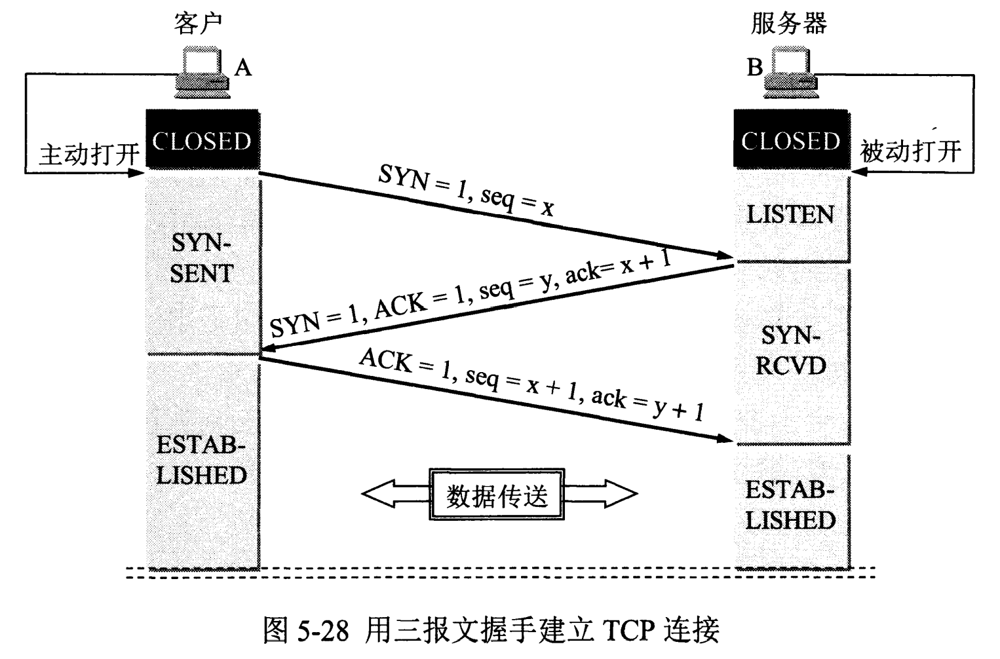
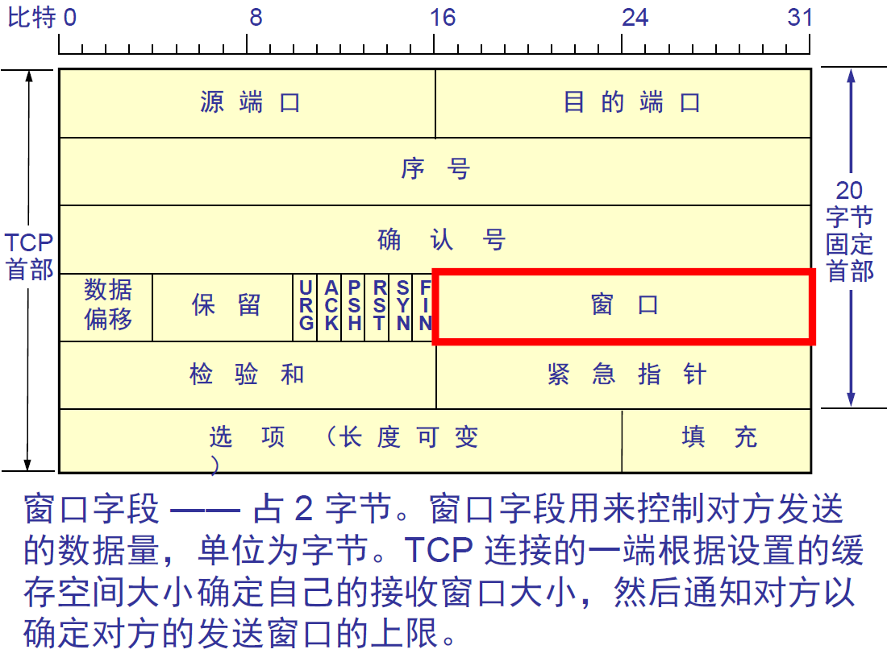
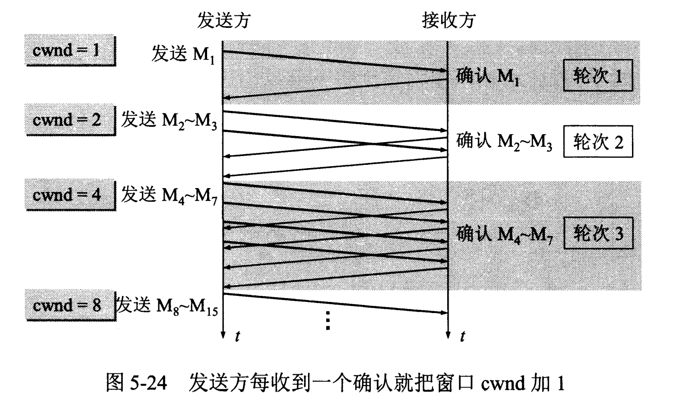

# 计算机网络

[TOC]

------

计算机网络通常采用分层的设计模型，最常见的是 OSI（开放系统互连）参考模型和 TCP/IP（传输控制协议/因特网协议）参考模型。下面是这两种模型的分层结构：

## **OSI 参考模型：**

1. **物理层（Physical Layer）：**
   - 协议：Ethernet、Fiber Channel、RS-232、RS-485

2. **数据链路层（Data Link Layer）：**
   - 协议：Ethernet、IEEE 802.11 (Wi-Fi)、PPP (Point-to-Point Protocol)、HDLC (High-Level Data Link Control)、Frame Relay

3. **网络层（Network Layer）：**
   - 协议：IP (Internet Protocol)、IPv4、IPv6、ICMP (Internet Control Message Protocol)、ARP (Address Resolution Protocol)、OSPF (Open Shortest Path First)、BGP (Border Gateway Protocol)

4. **传输层（Transport Layer）：**
   - 协议：TCP (Transmission Control Protocol)、UDP (User Datagram Protocol)、SCTP (Stream Control Transmission Protocol)

5. **会话层（Session Layer）：**
   - 协议：N/A (该层很少有专门的协议)

6. **表示层（Presentation Layer）：**
   - 协议：N/A (该层很少有专门的协议)

7. **应用层（Application Layer）：**
   - 协议：HTTP (Hypertext Transfer Protocol)、FTP (File Transfer Protocol)、SMTP (Simple Mail Transfer Protocol)、DNS (Domain Name System)、SSH (Secure Shell)、Telnet、SNMP (Simple Network Management Protocol)

## **TCP/IP 参考模型：**

1. **网络接口层（Network Interface Layer 或 Link Layer）：**
   - 协议：Ethernet、IEEE 802.11 (Wi-Fi)、PPP (Point-to-Point Protocol)、HDLC (High-Level Data Link Control)、Frame Relay

2. **网络层（Internet Layer）：**
   - 协议：IP (Internet Protocol)、IPv4、IPv6、ICMP (Internet Control Message Protocol)、ARP (Address Resolution Protocol)、OSPF (Open Shortest Path First)、BGP (Border Gateway Protocol)

3. **传输层（Transport Layer）：**
   - 协议：TCP (Transmission Control Protocol)、UDP (User Datagram Protocol)、SCTP (Stream Control Transmission Protocol)

4. **应用层（Application Layer）：**
   - 协议：HTTP (Hypertext Transfer Protocol)、FTP (File Transfer Protocol)、SMTP (Simple Mail Transfer Protocol)、DNS (Domain Name System)、SSH (Secure Shell)、Telnet、SNMP (Simple Network Management Protocol)

这些协议涵盖了计算机网络中各个层次的通信需求，可以满足不同的网络通信场景和应用需求。

# 数据链路层

## 大纲

2. 数据帧

- **帧结构**：包括帧头（Header）、帧数据（Payload）、帧尾（Trailer）的组成和作用。
- **MAC地址**：理解MAC地址的结构、作用和如何在网络中使用。

3. 介质访问控制（MAC）

- **CSMA/CD（Carrier Sense Multiple Access with Collision Detection）**：了解其工作原理，尤其是在以太网中的应用。
- **CSMA/CA（Carrier Sense Multiple Access with Collision Avoidance）**：主要在无线网络中的应用，理解其工作机制。

4. 错误检测与纠正

- **校验和（Checksum）**：简单理解其计算和使用场景。
- **循环冗余校验（CRC，Cyclic Redundancy Check）**：理解其生成多项式、计算方法和检错原理。
- **奇偶校验和汉明码**：以及其他常见的错误检测和纠正技术。

5. 流量控制与差错控制

- **滑动窗口协议**：了解其基本原理和工作机制，包括发送窗口和接收窗口的概念。
- **停止-等待协议**：简单理解该协议的基本操作和适用场景。

6. 局域网技术

- **以太网（Ethernet）**：理解基本的以太网协议、帧格式、交换机工作原理等。
- **无线局域网（WLAN）**：了解WLAN的基本架构、工作方式、以及与有线网络的区别。

7. 网络设备

- **交换机（Switch）**：理解交换机的工作原理、VLAN的概念和作用。
- **桥接器（Bridge）**：理解桥接器在网络中的作用及其工作方式。

8. 协议和标准

- **IEEE 802系列**：了解一些常见的IEEE 802标准（如802.3, 802.11），及其作用和应用场景。
- **PPP协议（Point-to-Point Protocol）**：基础的理解，尤其是其帧格式和工作机制。

9. 多路访问协议

- **TDMA（Time Division Multiple Access）**、 **FDMA（Frequency Division Multiple Access）**、 **CDMA（Code Division Multiple Access）**：了解这些多路访问技术的基本概念和应用。

10. 安全性

- **MAC地址过滤**：理解其基本原理及其在提高网络安全性中的应用。
- **链路层安全协议**：如EAP（Extensible Authentication Protocol）等。

11. 常见问题和优化策略

- **广播风暴**：理解广播风暴的成因和预防措施。
- **环路检测**：如生成树协议（STP）的作用和原理。

## 1. 交换机

交换机（Switch）是一种网络设备，用于在局域网（LAN）内部进行数据帧的转发和交换，它通常工作在 OSI 模型的数据链路层（第二层），负责实现数据链路层的功能，如数据帧的传输和转发。

以下是交换机的主要特点和功能：

1. **数据帧转发：** 交换机根据目标 MAC 地址来决定数据帧的传输路径，将数据帧从源节点传输到目的节点。相比于集线器（Hub）等设备，交换机能够实现针对性的数据帧转发，提高了网络的效率和带宽利用率。

2. **MAC 地址学习：** 交换机通过监听网络上的数据帧，学习每个设备的 MAC 地址，并将 MAC 地址与端口之间建立映射关系，以便后续数据帧的转发。

3. **广播和组播控制：** 交换机可以控制广播（Broadcast）和组播（Multicast）数据帧的传输范围，有效减少了广播风暴对网络性能的影响。

4. **虚拟局域网（VLAN）支持：** 交换机支持虚拟局域网（VLAN）的划分和管理，可以将不同的端口划分到不同的 VLAN 中，实现逻辑上的隔离和管理。

5. **链路聚合（Link Aggregation）：** 一些高级交换机支持链路聚合功能，可以将多个物理链路捆绑成一个逻辑链路，提高带宽和容错能力。

6. **安全功能：** 交换机通常具有一些安全功能，如端口安全、MAC 地址过滤、访问控制列表（ACL）等，用于保护网络免受未经授权的访问和攻击。

总的来说，交换机是局域网中至关重要的设备之一，它负责实现局域网内部的数据转发和交换，提供高效、可靠的局域网通信。

---

广播风暴（Broadcast Storm）一般发生在网络数据链路层，但它对网络传输层和整个网络性能也会产生严重影响。它是一种网络现象，当网络上大量的广播包不断传播，导致网络带宽被占满，设备资源耗尽，网络性能显著下降，甚至导致网络瘫痪。

**工作原理**

在以太网和其他使用广播通信的网络中，广播风暴通常由以下因素引起：

1. **环路（Loop）形成**：网络拓扑的配置错误，产生循环路径，广播包在这些路径中无限循环。
2. **设备故障**：某些网络设备（如交换机或路由器）的故障导致错误的广播包被不断重新发送。
3. **广播域过大**：一个广播域内的设备过多，广播包的数量超出网络可负荷的范围。

**影响**

广播风暴可能会导致以下后果：

- **网络带宽占满**：大多数带宽被广播包占据，正常的网络通信受到严重影响。
- **设备CPU高负荷**：处理大量广播包会导致网络设备的CPU占用率急剧上升，甚至可能导致设备奔溃。
- **网络瘫痪**：整个网络无法进行正常的通信，包括无法访问互联网，不能传输文件等。

**预防措施**

为了防止广播风暴，可以采取如下措施：

1. **使用生成树协议（STP）**：STP通过动态地关闭冗余路径来防止环路的形成。
2. **VLAN划分**：使用虚拟局域网（VLAN）来限制广播域的范围，减少广播包的传播范围。
3. **风暴控制和防护**：许多交换机和路由器提供广播风暴控制功能，可以限制每单位时间内广播包的数量。
4. **设备监控**：保持对网络设备的监控，提前发现并处理设备故障。
5. **定期网络评估和优化**：进行网络评估和优化，确保网络配置和拓扑的合理性。

## 2. 桥接器

桥接器（Bridge）是工作在OSI模型数据链路层（第2层）的一种网络设备，主要用于将两个或多个网络段连接在一起，使它们成为一个逻辑网络。桥接器能够根据MAC地址进行数据帧的过滤和转发，从而有效扩展和管理网络。以下是对桥接器的详细介绍。

**基本原理**

桥接器通过接收和理解数据链路层上的数据帧，使用以下两种主要功能来实现其目的：

1. **转发和过滤（Forwarding & Filtering）：**
   - 当桥接器接收一个数据帧时，会检查其目标MAC地址。
   - 然后，桥接器在其MAC地址表中查找目标地址的对应出接口（出口）。
   - 如果目标地址存在于MAC地址表中，桥接器就会将数据帧转发到对应的网络段，否则会进行广播。
   - 如果源和目的地址位于同一网络段，桥接器会丢弃该数据帧，以减少不必要的流量。
2. **MAC地址学习（Learning）：**
   - 桥接器会记录每个接收数据帧的源MAC地址及其对应的端口（进入接口），并将这些信息动态地存储在内部的MAC地址表中。
   - 这使得桥接器能够根据记录决定数据帧的转发路径，提升网络效率。

**类型**

1. **本地桥接器（Local Bridge）：**
   - 连接同一地理位置的多个网络段。
   - 例如，连接办公室内不同楼层或房间的以太网段。
2. **远程桥接器（Remote Bridge）：**
   - 使用广域网（WAN）技术将不同地理位置的网络段连接起来。
   - 常用于连接不同城市或地区的办公室网络。

**工作模式**

- **透明桥接（Transparent Bridging）：**
  - 常用于以太网络中，网络主机不需要知晓桥接器的存在。
  - 桥接器透明地接收和转发数据帧，学习和维护MAC地址表。
- **源路由桥接（Source Routing Bridge）：**
  - 常用于Token Ring网络。
  - 数据帧中包含了路径信息，桥接器根据帧中的源路由信息进行转发。

**功能与优点**

1. **隔离冲突域（Collision Domain）：**
   - 通过将网络分隔成多个冲突域，减少冲突，提升网络性能。
2. **提升网络扩展性和性能：**
   - 可以增加网络段的数量和覆盖范围。
   - 通过转发和过滤，减少不必要的流量，提升网络效率。
3. **简化网络管理：**
   - 动态学习和更新MAC地址表，使网络设定和维护更加自动化和灵活。

**局限性**

1. **广播流量控制有限：**
   - 桥接器无法隔离广播域，因此在大型网络中广播风暴仍然可能成为问题。
2. **规模和性能限制：**
   - 对于非常大规模的网络，MAC地址表管理的复杂性和性能瓶颈可能会成为限制因素。
3. **相比交换机功能单一：**
   - 现代交换机集成了更多的功能和更高的端口密度，已经逐渐取代了传统桥接器的地位。

**应用场景**

- **小型办公室或家庭网络：** 用于扩展和隔离不同楼层或房间的网络段。
- **企业网络：** 将不同部门的网络连接在一起，同时有效管理和优化网络性能。
- **工业和远程连接：** 使用远程桥接器将不同地点的局域网连接起来，实现广域网覆盖。

# 传输层

## 1. 三次握手 (three-way handshake)

- 第一次握手：Client将SYN置1，随机产生一个初始序列号seq发送给Server，进入SYN_SENT状态；
- 第二次握手：Server收到Client的SYN=1之后，知道客户端请求建立连接，将自己的SYN置1，ACK置1，产生一个acknowledge number=sequence number+1，并随机产生一个自己的初始序列号，发送给客户端；进入SYN_RCVD状态；
- 第三次握手：客户端检查acknowledge number是否为序列号+1，ACK是否为1，检查正确之后将自己的ACK置为1，产生一个acknowledge number=服务器发的序列号+1，发送给服务器；进入ESTABLISHED状态；服务器检查ACK为1和acknowledge number为序列号+1之后，也进入ESTABLISHED状态；完成三次握手，连接建立。

### 1. TCP建立连接可以两次握手吗

不可以。有两个原因：

- 首先，可能会出现**已失效的连接请求报文段又传到了服务器端**。
  - client 发出的第一个连接请求报文段并没有丢失，而是在某个网络结点长时间的滞留了，以致延误到连接释放以后的某个时间才到达 server。本来这是一个早已失效的报文段。但 server 收到此失效的连接请求报文段后，就误认为是 client 再次发出的一个新的连接请求。于是就向 client 发出确认报文段，同意建立连接。假设不采用 “三次握手”，那么只要 server 发出确认，新的连接就建立了。由于现在 client 并没有发出建立连接的请求，因此不会理睬 server 的确认，也不会向 server 发送数据。但 server 却以为新的运输连接已经建立，并一直等待 client 发来数据。这样，server 的很多资源就白白浪费掉了。采用 “三次握手” 的办法可以防止上述现象发生。例如刚才那种情况，client 不会向 server 的确认发出确认。server 由于收不到确认，就知道 client 并没有要求建立连接。

- 其次，两次握手无法保证Client正确接收第二次握手的报文（Server无法确认Client是否收到），也无法保证Client和Server之间成功互换初始序列号。
- 还有就是两次握手会给SYN flood攻击提供机会。

### 2. TCP建立连接可以采用四次握手吗

可以。但是会降低传输的效率。

- 四次握手是指：
  - 第二次握手：Server只发送ACK和acknowledge number；
  - 而Server的SYN和初始序列号在第三次握手时发送；
  - 原来协议中的第三次握手变为第四次握手。出于优化目的，四次握手中的二、三可以合并。

### 3. 第三次握手中，如果客户端的ACK未送达服务器，会怎样

- Server端：  
  - 由于Server没有收到ACK确认，因此会重发之前的SYN+ACK（默认重发五次，之后自动关闭连接进入CLOSED状态），Client收到后会重新传ACK给Server。
- Client端，两种情况：  
  - 在Server进行超时重发的过程中，如果Client向服务器发送数据，数据头部的ACK是为1的，所以服务器收到数据之后会读取 ACK number，进入 establish 状态  
  - 在Server进入CLOSED状态之后，如果Client向服务器发送数据，服务器会以RST包应答。
    1. **客户端收到服务器的 RST 包：** 当客户端向已经关闭的服务器发送数据时，服务器可能会发送一个 RST 包（复位包）作为响应。这个 RST 包告诉客户端，服务器已经关闭了连接，并且不再接受任何数据。
    2. **数据丢失或超时：** 如果服务器不发送 RST 包，客户端发送的数据可能会在网络中丢失，或者在一段时间后超时。在这种情况下，客户端可能会重新发送数据，直到达到最大重传次数或超时时间。

### 4. 如果已经建立了连接，但客户端出现了故障怎么办

服务器每收到一次客户端的请求后都会重新复位一个计时器，时间通常是设置为2小时，若两小时还没有收到客户端的任何数据，服务器就会发送一个探测报文段，以后每隔75秒钟发送一次。若一连发送10个探测报文仍然没反应，服务器就认为客户端出了故障，接着就关闭连接。

### 5. 初始序列号是什么

TCP连接的一方A，随机选择一个32位的序列号（Sequence Number）作为发送数据的初始序列号（Initial Sequence Number，ISN），比如为1000，以该序列号为原点，对要传送的数据进行编号：1001、1002...三次握手时，把这个初始序列号传送给另一方B，以便在传输数据时，B可以确认什么样的数据编号是合法的；同时在进行数据传输时，A还可以确认B收到的每一个字节，如果A收到了B的确认编号（acknowledge number）是2001，就说明编号为1001-2000的数据已经被B成功接受。

### 6. 什么是SYN攻击

> https://zhuanlan.zhihu.com/p/360479307

SYN 攻击（SYN Flood Attack）是一种常见的网络攻击方式，它利用 TCP 协议的三次握手过程中的漏洞来使目标系统资源耗尽或服务不可用。这种攻击通常是通过发送大量伪造的 TCP 连接请求（SYN 包）来实现的。

SYN 攻击的过程如下：

1. **建立连接：** 攻击者向目标系统发送大量的 TCP 连接请求（SYN 包），但在三次握手过程中不完全建立连接，即不发送最后的确认包（ACK）。

2. **资源耗尽：** 目标系统收到大量的未完成的连接请求后，会将这些请求加入到连接队列中，并为每个请求分配一定的系统资源（如内存和处理器时间）。由于每个未完成的连接请求都需要占用一定的资源，并且这些资源并不会立即释放，因此攻击者可以通过发送大量的请求来耗尽目标系统的资源，导致其无法响应正常的连接请求。

3. **服务不可用：** 当连接队列被填满或系统资源耗尽时，目标系统将无法处理新的连接请求，导致正常的用户无法访问该系统提供的服务，服务变得不可用或响应变得极其缓慢。

为了防止 SYN 攻击，可以采取以下一些措施：

- **过滤恶意流量：** 使用防火墙、入侵检测系统（IDS）等网络安全设备来检测和过滤恶意的 SYN 流量。
- **加强系统资源管理：** 对系统资源进行合理的管理和分配，以确保在遭受攻击时能够及时释放被占用的资源。
- **配置 SYN Cookie：** SYN Cookie 是一种用于防御 SYN 攻击的机制，它可以在服务端生成一个加密的 cookie，并将其发送给客户端。当客户端发送 SYN-ACK 时，服务端可以根据 SYN 包中的信息验证 cookie 的有效性，并决定是否接受连接。
- **使用 SYN Proxy：** SYN Proxy 是一种在防火墙或负载均衡设备上实现的机制，用于代理客户端和服务器之间的 TCP 连接请求。它可以在接收到 SYN 包时，先对其进行验证和过滤，然后再将合法的请求转发给目标服务器，从而减轻目标服务器的压力。

综上所述，SYN 攻击是一种常见的网络攻击方式，但通过合适的安全措施和防御机制，可以有效地减轻其对系统的影响。

### 7. 三次握手什么时候可以带数据

**TCP三次握手过程**

1. **第一次握手（SYN）:** 客户端发送一个SYN（同步标志）包到服务器，请求建立连接。
   - 这里，通常不携带数据，仅传递SYN标志。
2. **第二次握手（SYN-ACK）:** 服务器收到客户端的SYN包后，返回一个SYN-ACK包以响应客户端请求，并向客户端表示准备好建立连接。
   - 这个包也不携带数据，仅传递SYN和ACK标志。
3. **第三次握手（ACK）:** 客户端收到服务器的SYN-ACK包后，发送一个ACK包确认连接建立。
   - **在这一阶段，ACK包** 可以携带数据，这意味着确认的同时可以传递客户端的初始数据。

**为什么第三次握手可以携带数据？**

- **可靠传输保证**：在第三次握手之前，SYN和SYN-ACK包仅用于建立连接，并没有条件保证可靠传输。因此，最可靠的时机是在确认所有参与方都已具备接收和处理数据的能力之后，即第三次握手的ACK包。
- **减少往返时间（RTT）**：在第三次握手中携带数据可以使得连接建立和初始数据传输合并到一次通信中，减少整体往返时间，提升效率。

**示例**

假设客户端发送一个包含初始数据的ACK包：

1. 客户端发送 `SYN` 包。
2. 服务器收到 `SYN`，回复 `SYN-ACK` 包。
3. 客户端收到 `SYN-ACK`，发送一个带有 `ACK` 标志和初始数据的包。
4. 服务器收到带有 `ACK` 标志和初始数据的包，成功建立连接并处理数据。

**实际应用**

在实际 TCP 实现中，如部分优化具体实现的照片和视图，有些系统可能提前发送数据包，例如：

- **TFO（TCP Fast Open）**：通过在SYN包中嵌入数据，尝试加速首次连接并开始数据传输，也需要协议栈的额外支持。

**注意事项**

尽管第三次握手可以携带数据，但实际应用时需要考虑以下因素：

1. **安全性**：在三次握手阶段传输数据可能面临潜在的攻击风险，特别是 DDoS 攻击。
2. **兼容性**：某些协议实现可能不支持或不优化此行为，需要测试和确认实际网络环境的支持情况。

在 TCP 三次握手过程中，携带数据的过程仅在第三次握手（即客户端发送ACK包）时最为合理和规范，之前的SYN和SYN-ACK包通常不携带数据。通过此方式不仅确保了可靠传输的前提，还可以优化连接建立时间，提高通信效率。

## 2. 四次挥手

- 第一次挥手：Client将FIN置为1，发送一个序列号seq给Server；进入FIN_WAIT_1状态；
- 第二次挥手：Server收到FIN之后，发送一个ACK=1，acknowledge number=收到的序列号+1；进入CLOSE_WAIT状态。此时客户端已经没有要发送的数据了，但仍可以接受服务器发来的数据。
- 第三次挥手：Server将FIN置1，发送一个序列号给Client；进入LAST_ACK状态；
- 第四次挥手：Client收到服务器的FIN后，进入TIME_WAIT状态；接着将ACK置1，发送一个acknowledge number=序列号+1给服务器；服务器收到后，确认acknowledge number后，变为CLOSED状态，不再向客户端发送数据。客户端等待2*MSL（报文段最长寿命）时间后，也进入CLOSED状态。完成四次挥手。

### 1. CLOSE_WAIT状态意义是什么

因为服务器收到客户端断开连接的请求时，可能还有一些数据没有发完，这时先回复ACK，表示接收到了断开连接的请求。等到数据发完之后再发FIN，断开服务器到客户端的数据传送。

### 2. 如果第二次挥手时服务器的ACK没有送达客户端，会怎样

客户端没有收到ACK确认，会重新发送FIN请求。

### 3. TIME_WAIT状态的意义是什么

第四次挥手时，客户端发送给服务器的ACK有可能丢失，TIME_WAIT状态就是用来重发可能丢失的ACK报文。如果Server没有收到ACK，就会重发FIN，如果Client在2*MSL的时间内收到了FIN，就会重新发送ACK并再次等待2MSL，防止Server没有收到ACK而不断重发FIN。

MSL(Maximum Segment Lifetime)，指一个片段在网络中最大的存活时间，2MSL就是一个发送和一个回复所需的最大时间。如果直到2MSL，Client都没有再次收到FIN，那么Client推断ACK已经被成功接收，则结束TCP连接。

## 3. TCP如何实现流量控制

使用滑动窗口协议实现流量控制。防止发送方发送速率太快，接收方缓存区不够导致溢出。接收方会维护一个接收窗口 receiver window（窗口大小单位是字节），接受窗口的大小是根据自己的资源情况动态调整的，在返回ACK时将接受窗口大小放在TCP报文中的窗口字段告知发送方。发送窗口的大小不能超过接受窗口的大小，只有当发送方发送并收到确认之后，才能将发送窗口右移。发送窗口的上限为接受窗口和拥塞窗口中的较小值。接受窗口表明了接收方的接收能力，拥塞窗口表明了网络的传送能力。

## 4. 什么是零窗口

如果接收方没有能力接收数据，就会将接收窗口设置为0，这时发送方必须暂停发送数据，但是会启动一个持续计时器(persistence timer)，到期后发送一个大小为1字节的探测数据包，以查看接收窗口状态。如果接收方能够接收数据，就会在返回的报文中更新接收窗口大小，恢复数据传送。

## 5. TCP的拥塞控制是怎么实现的

拥塞控制主要由四个算法组成：**慢启动（Slow Start）、拥塞避免（Congestion voidance）、快重传 （Fast Retransmit）、快恢复（Fast Recovery）**

1. 慢启动：刚开始发送数据时，先把拥塞窗口（congestion window）设置为一个最大报文段MSS的数值，每收到一个新的确认报文之后，就把拥塞窗口加1个MSS。这样每经过一个传输轮次（或者说是每经过一个往返时间RTT），拥塞窗口的大小就会加倍

2. 拥塞避免：当拥塞窗口的大小达到慢开始门限(slow start threshold)时，开始执行拥塞避免算法，拥塞窗口大小不再指数增加，而是线性增加，即每经过一个传输轮次只增加1MSS.  
> 无论在慢开始阶段还是在拥塞避免阶段，只要发送方判断网络出现拥塞（其根据就是没有收到确认），就要把慢开始门限ssthresh设置为出现拥塞时的发送方窗口值的一半（但不能小于2）。然后把拥塞窗口cwnd重新设置为1，执行慢开始算法。**（这是不使用快重传的情况）**

3. 快重传：快重传要求接收方在收到一个失序的报文段后就立即发出**重复确认**（为的是使发送方及早知道有报文段没有到达对方）而不要等到自己发送数据时捎带确认。快重传算法规定，发送方只要一连收到三个重复确认就应当立即重传对方尚未收到的报文段，而不必继续等待设置的重传计时器时间到期。

4. 快恢复：当发送方连续收到三个重复确认时，就把慢开始门限减半，然后执行拥塞避免算法。不执行慢开始算法的原因：因为如果网络出现拥塞的话就不会收到好几个重复的确认，所以发送方认为现在网络可能没有出现拥塞。  也有的快重传是把开始时的拥塞窗口cwnd值再增大一点，即等于 ssthresh + 3*MSS 。这样做的理由是：既然发送方收到三个重复的确认，就表明有三个分组已经离开了网络。这三个分组不再消耗网络的资源而是停留在接收方的缓存中。可见现在网络中减少了三个分组。因此可以适当把拥塞窗口扩大些。

## 6. 拥塞控制和流量控制的区别

拥塞控制（Congestion Control）和流量控制（Flow Control）是两种不同的网络控制机制，它们的目标和实现方式有所不同。

1. **拥塞控制（Congestion Control）：**
   - **目标：** 拥塞控制旨在防止网络中发生拥塞，即避免网络中出现过多的数据包导致网络性能下降、丢包增加等问题。
   - **机制：** 拥塞控制通过调整发送方的数据传输速率来避免网络拥塞。常见的拥塞控制算法包括慢启动、拥塞避免、快重传和快恢复等。
   - **实现：** 拥塞控制是由发送方来实现的，发送方根据网络的拥塞程度动态调整发送的数据量和发送速率，以确保网络的稳定性和性能。

2. **流量控制（Flow Control）：**
   - **目标：** 流量控制旨在确保接收方能够有效地接收数据，避免因接收方处理能力不足而导致数据丢失或溢出。
   - **机制：** 流量控制通过调整发送方发送数据的速率来适应接收方的处理能力，以确保接收方能够及时处理数据并保持适当的缓冲区大小。
   - **实现：** 流量控制通常是由接收方来实现的，接收方通过发送窗口大小（Receive Window）来告知发送方自己的处理能力和缓冲区容量，发送方根据接收方发送的窗口大小来控制发送数据的速率。

总的来说，拥塞控制和流量控制都是为了优化网络性能和提高数据传输的可靠性，但它们的作用对象、目标和实现方式有所不同。拥塞控制是为了避免网络拥塞，主要由发送方来实现；而流量控制是为了适应接收方的处理能力，主要由接收方来实现。

## 7. TCP如何最大利用带宽

TCP速率受到三个因素影响

- 窗口：即滑动窗口大小，见[TCP如何实现流量控制？]
- 带宽：这里带宽是指单位时间内从发送端到接收端所能通过的“最高数据率”，是一种硬件限制。TCP发送端和接收端的数据传输数不可能超过两点间的带宽限制。发送端和接收端之间带宽取所通过线路的带宽最小值（如通过互联网连接）。
- RTT：即Round Trip Time，表示从发送端到接收端的一去一回需要的时间，TCP在数据传输过程中会对RTT进行采样（即对发送的数据包及其ACK的时间差进行测量，并根据测量值更新RTT值），TCP根据得到的RTT值更新RTO值，即Retransmission TimeOut，就是重传间隔，发送端对每个发出的数据包进行计时，如果在RTO时间内没有收到所发出的数据包的对应ACK，则任务数据包丢失，将重传数据。一般RTO值都比采样得到的RTT值要大。

**带宽时延乘积**：

带宽时延乘积=带宽*RTT，实际上等于发送端到接收端单向通道的数据容积的两倍，这里单向通道的数据容积可以这样来理解，单向通道看成是一条单行道马路，带宽就是马路的车道数，路上跑的汽车就是数据（不过这里所有汽车的速率都是一样的，且不会有人想超车，大家齐头并进），那么单向通道的数据容积就是这条单行道上摆满车，一共可以摆多少辆。带宽就是马路的车道数，带宽数乘以单向通道的数据容积就是路面上所能容纳的全部数据量。当路面上已经摆满的时候，就不能再往里面放了。

设滑动窗口大小为， 发送端和接收端的带宽为， RTT为。

前面已经说过了，TCP发送数据时受滑动窗口的限制，当TCP将滑动窗口中的数据都发出后，在收到第一个ACK之前，滑动窗口大小是0，不能再发送数据了，必须等待ACK包使滑动窗口移动。那么在理想情况下，ACK包应该在什么时候到达呢？显然，就是在数据发出后的RTT时间后，ACK包到达。这也就是说，现在在不考虑丢包和拥塞情况下，TCP在一个RTT时间内能发出的最大数据量为  ，所以不考虑带宽限制下，TCP能一个时刻能达到的最大速度是 。

现在再考虑带宽限制，前面说过当马路上摆满车的时候，就无法再往里放车了，同理，TCP发送端在  时间内，能往通道上放的最大数据量为  ，通过带宽时延乘积得到的容积限制为 。当  时，单向通道容积不构成瓶颈，速率的限制主要来源于窗口大小限制。而当  时，则就受到容积限制，即此时速率限制来源于带宽限制。

因此，TCP的最大速率为 })

在我们平时生活中使用的宽带网络，ADSL等环境下，因为带宽都比较小，从而  也比较小，再加上网络情况比较复杂，拥塞情况比较常见，所以这些网络环境下，TCP速率的主要限制因素在于带宽，丢包率等。长肥管道一般不太常见，多见于一些单位使用的专线网络，在这些网络中速率的主要限制因素就是窗口大小了，这也是传统TCP在这些网络环境中不能充分利用带宽的原因所在（因为传统TCP的窗口大小是用2字节表示的，所以最大只有65535（不考虑窗口扩大选项）），除了专线网络外，随着网络硬件技术的发展，万兆交换机的出现，局域网中也可能会出现带宽时延乘积较大的情况。

## 8. TCP与UDP的区别

1. TCP是面向连接的，UDP是无连接的；
   - UDP发送数据之前不需要建立连接
   
2. TCP是可靠的，UDP不可靠；
   - UDP接收方收到报文后，不需要给出任何确认
3. TCP只支持点对点通信，UDP支持一对一、一对多、多对一、多对多；
4. TCP是面向字节流的，UDP是面向报文的；
   - 面向字节流是指发送数据时以字节为单位，一个数据包可以拆分成若干组进行发送，而UDP一个报文只能一次发完。
5. TCP有拥塞控制机制，UDP没有。网络出现的拥塞不会使源主机的发送速率降低，这对某些实时应用是很重要的，比如媒体通信，游戏；
6. TCP首部开销（20字节）比UDP首部开销（8字节）要大
7. UDP 的主机不需要维持复杂的连接状态表

---

### 1. **什么时候选择TCP，什么时候选UDP**

对某些实时性要求比较高的情况，选择UDP，比如游戏，媒体通信，实时视频流（直播），即使出现传输错误也可以容忍；其它大部分情况下，HTTP都是用TCP，因为要求传输的内容可靠，不出现丢失

### 2. HTTP可以使用UDP吗

> HTTP不可以使用UDP，HTTP需要基于可靠的传输协议，而UDP不可靠

虽然 HTTP 协议通常基于 TCP 协议，但理论上是可以使用 UDP（User Datagram Protocol）作为传输层协议的。

使用 UDP 作为 HTTP 协议的传输层协议可能会带来一些挑战和限制，主要包括以下方面：

1. **可靠性：** UDP 是一种无连接、不可靠的传输协议，不提供数据包的可靠性和顺序性。这意味着在使用 UDP 作为 HTTP 传输协议时，必须通过应用层协议来处理丢失、重复和乱序的数据包，以确保数据的正确传输和顺序性。

2. **流量控制和拥塞控制：** UDP 不提供流量控制和拥塞控制机制，因此在高负载或拥塞情况下可能会导致数据丢失或严重延迟。

3. **性能影响：** 相较于 TCP，UDP 的传输速度可能更快，但在可靠性和顺序性方面会存在一定的风险。因此，在一些对数据可靠性和顺序性要求较高的场景下，可能会选择 TCP 而不是 UDP。

虽然理论上可以使用 UDP 作为 HTTP 的传输协议，但在实际应用中很少见，因为 TCP 提供了更好的数据可靠性和流控制机制，更适合 HTTP 协议的特性和应用场景。

---

**注：http 3.0 基于udp实现**

> https://zh.wikipedia.org/wiki/HTTP/3

目前为止，HTTP/3 还没有采用 UDP（User Datagram Protocol）作为传输层协议，而是使用了 QUIC（Quick UDP Internet Connections）协议。QUIC 是一种基于 UDP 的新型传输协议，由 Google 开发，旨在提高 Web 性能和安全性。

HTTP/3 使用 QUIC 协议作为传输层协议的主要优势包括：

1. **快速连接建立：** QUIC 具有零 RTT（Round-Trip Time）的连接建立特性，可以在建立连接时发送数据，减少了连接建立的延迟。

2. **多路复用：** QUIC 支持多路复用，可以在同一个连接上并行传输多个流，提高了网络利用率和效率。

3. **流量控制和拥塞控制：** QUIC 内置了流量控制和拥塞控制机制，可以自适应地调整发送和接收数据的速率，避免了网络拥塞和数据丢失。

4. **安全性：** QUIC 使用了加密来保护数据的安全性，提供了比 TCP 更好的安全性保障。

因此，虽然 HTTP/3 采用了基于 UDP 的传输协议，但并不是直接使用 UDP，而是使用了 QUIC 协议。QUIC 在许多方面都优于传统的 TCP 协议，为 Web 的性能和安全性提供了更好的支持。

### 3. 面向连接和无连接的区别

无连接的网络服务（数据报服务）-- 面向连接的网络服务（虚电路服务）

虚电路服务：首先建立连接，所有的数据包经过相同的路径，服务质量有较好的保证；

数据报服务：每个数据包含目的地址，数据路由相互独立（路径可能变化）；网络尽最大努力交付数据，但不保证不丢失、不保证先后顺序、不保证在时限内交付；网络发生拥塞时，可能会将一些分组丢弃；

## 9. 虚拟电路

在网络通信中，“VC”通常表示“Virtual Circuit”，即虚拟电路。虚拟电路是一种在网络中建立的逻辑连接，用于在源和目的地之间传输数据。与物理电路不同，虚拟电路是在网络中动态创建和维护的，而不是在物理链路上静态配置的。

在虚拟电路网络中，数据从源传输到目的地通过一系列逻辑连接，这些连接沿着预先分配的路径，经过一系列中间节点（例如路由器或交换机）。每个逻辑连接都有一个唯一的虚拟电路标识符（VC ID），用于在网络中标识数据包所属的虚拟电路。

虚拟电路网络的优点包括：
- 提供了较高的传输效率，因为数据沿着预定的路径传输，避免了路由选择的开销。
- 支持各种服务质量（QoS）需求，如带宽保证、延迟保证等。
- 允许实现较复杂的路由和流量管理策略。

常见的虚拟电路协议包括：
- ATM（Asynchronous Transfer Mode，异步传输模式）：一种基于虚拟电路的宽带数据通信技术。
- Frame Relay（帧中继）：一种用于在广域网（WAN）中建立虚拟电路的数据链路层协议。
- MPLS（Multiprotocol Label Switching，多协议标签交换）：一种用于在网络中建立虚拟电路的技术，通常用于提供分组转发服务。

## 10. TCP如何保证传输的可靠性

1. 数据包校验
2. 对失序数据包重新排序（TCP报文具有序列号）
3. 丢弃重复数据
4. 应答机制：接收方收到数据之后，会发送一个确认（通常延迟几分之一秒）；
5. 超时重发：发送方发出数据之后，启动一个定时器，超时未收到接收方的确认，则重新发送这个数据；
6. 流量控制：确保接收端能够接收发送方的数据而不会缓冲区溢出

## 11. 路由器

路由器（Router）是一种网络设备，用于在不同的网络之间转发数据包，并决定数据包的最佳传输路径。它通常工作在 OSI 模型的网络层（第三层），负责实现网络层的功能，如 IP 地址的转发和路由选择。

以下是路由器的主要特点和功能：

1. **数据包转发：** 路由器通过查看数据包中的目标 IP 地址，并根据预先配置的路由表来决定数据包的传输路径，将数据包从源节点传输到目的节点。

2. **路由选择：** 路由器通过动态路由协议（如 RIP、OSPF、BGP 等）或静态路由配置来学习网络拓扑信息，并根据路由选择算法选择最佳的传输路径。

3. **分割广播域：** 路由器在不同的网络之间分割广播域，防止广播风暴和不必要的广播流量影响整个网络。

4. **连接不同网络：** 路由器可以连接不同类型和不同技术的网络，如以太网、无线局域网、广域网等，实现不同网络之间的互联互通。

5. **网络地址转换（NAT）：** 一些路由器还可以实现网络地址转换（NAT）功能，将内部网络的私有 IP 地址转换为公共 IP 地址，以实现内部网络与外部互联网的通信。

6. **安全性功能：** 路由器通常具有防火墙、访问控制列表（ACL）等安全功能，用于保护网络免受网络攻击和非法访问。

总的来说，路由器是网络中至关重要的设备之一，它负责实现不同网络之间的数据通信和路由选择，是构建复杂网络架构的基础设备之一。

## 12. IP地址的分类

路由器仅根据网络号net-id来转发分组，当分组到达目的网络的路由器之后，再按照主机号host-id将分组交付给主机；同一网络上的所有主机的网络号相同。

## 13. 什么叫划分子网

从主机号host-id借用若干个比特作为子网号subnet-id；

子网掩码：网络号和子网号都为1，主机号为0；

数据报仍然先按照网络号找到目的网络，发送到路由器，路由器再按照网络号和子网号找到目的子网：将子网掩码与目标地址逐比特与操作，若结果为某个子网的网络地址，则送到该子网。

## 14. ARP协议 (Address Resolution Protocol)

**ARP协议完成了IP地址与物理地址的映射**。每一个主机都设有一个 ARP 高速缓存，里面有**所在的局域网**上的各主机和路由器的 IP 地址到硬件地址的映射表。当源主机要发送数据包到目的主机时，会先检查自己的ARP高速缓存中有没有目的主机的MAC地址，如果有，就直接将数据包发到这个MAC地址，如果没有，就向**所在的局域网**发起一个ARP请求的广播包（在发送自己的 ARP 请求时，同时会带上自己的 IP 地址到硬件地址的映射），收到请求的主机检查自己的IP地址和目的主机的IP地址是否一致，如果一致，则先保存源主机的映射到自己的ARP缓存，然后给源主机发送一个ARP响应数据包。源主机收到响应数据包之后，先添加目的主机的IP地址与MAC地址的映射，再进行数据传送。如果源主机一直没有收到响应，表示ARP查询失败。

如果所要找的主机和源主机不在同一个局域网上，那么就要通过 ARP 找到一个位于本局域网上的某个路由器的硬件地址，然后把分组发送给这个路由器，让这个路由器把分组转发给下一个网络。剩下的工作就由下一个网络来做。

## 15. 什么是NAT (Network Address Translation)

> 用于解决内网中的主机要和因特网上的主机通信。由NAT路由器将主机的本地IP地址转换为全球IP地址，分为静态转换（转换得到的全球IP地址固定不变）和动态NAT转换。

NAT（Network Address Translation，网络地址转换）是一种网络技术，用于将内部网络（私有网络）的 IP 地址转换为外部网络（公共网络）的 IP 地址，以实现内部网络与外部网络之间的通信。NAT 主要用于连接多台计算机共享单个公共 IP 地址的情况，例如家庭网络或企业内部网络。

NAT 的工作原理是在路由器或防火墙等设备上执行地址转换，主要包括以下几个步骤：

1. **地址转换：** 当内部网络中的计算机向外部网络发送数据时，NAT 设备会将源 IP 地址和端口号替换为公共 IP 地址和端口号，并将转换后的数据包发送到外部网络。这样，外部网络收到的数据包就会认为是来自 NAT 设备的，而不是内部网络中的具体计算机。

2. **端口映射：** NAT 设备会维护一个端口映射表，记录内部网络中每个计算机的私有 IP 地址和端口号与 NAT 设备的公共 IP 地址和端口号之间的对应关系。当外部网络向 NAT 设备发送数据时，NAT 设备会根据目标端口号将数据包转发给相应的内部计算机。

3. **状态跟踪：** NAT 设备会跟踪每个数据流的状态，包括源 IP 地址、目标 IP 地址、端口号等信息。这样可以确保返回的数据包能够正确地转发回内部网络中的计算机。

NAT 技术的主要优点包括：
- 节省公共 IP 地址资源：可以通过少量的公共 IP 地址支持大量的内部计算机。
- 增强网络安全性：对外部网络隐藏了内部网络的拓扑结构，提高了网络安全性。
- 简化网络配置：内部网络中的计算机无需拥有公共 IP 地址，减少了网络配置的复杂性。

总的来说，NAT 技术在现代网络中被广泛应用，是连接多个计算机共享单个公共 IP 地址的重要技术之一。

## 16. QUIC协议

> https://zh.wikipedia.org/wiki/QUIC
>
> https://www.cnblogs.com/harrypotterjackson/p/15977660.html

QUIC（Quick UDP Internet Connections）是一种实验性传输层网络协议，提供与TLS/SSL相当的安全性，同时具有更低的连接和传输延迟。QUIC基于UDP，因此拥有极佳的弱网性能，在丢包和网络延迟严重的情况下仍可提供可用的服务。QUIC在应用程序层面就能实现不同的拥塞控制算法，不需要操作系统和内核支持，这相比于传统的TCP协议，拥有了更好的改造灵活性，非常适合在TCP协议优化遇到瓶颈的业务。

- **QUIC所处的网络层次如下图所示:**

**Quic 相比现在广泛应用的 http2+tcp+tls 协议有如下优势：**
1、减少了 TCP 三次握手及 TLS 握手时间。
2、改进的拥塞控制。
3、避免队头阻塞的多路复用。
4、连接迁移。
5、前向安全。

# 应用层

## 1. HTTP各版本

- HTTP 0.9版本

  - HTTP协议的第一个版本，功能简单，**已弃用**
  - 仅支持纯文本数据的传输，虽然支持HTML，但是不支持图片插入
  - 仅支持GET请求方式，且不支持请求头
  - 无状态，短连接。没有对用户状态的管理；每次请求建立一个TCP连接，响应之后关闭TCP连接。

- HTTP 1.0版本

  - 支持POST、GET、HEAD三种方法
  - **支持长连接keep-alive**（但**默认还是使用短连接**：浏览器每一次请求建立一次TCP连接，请求处理完毕之后断开）。
  - 服务器不跟踪用户的行为也不记录用户过往请求。

- HTTP 1.1版本

  - 新增PUT、DELETE、CONNECT、TRACE、OPTIONS方法，是现今**使用最多**的版本。
  - 支持长连接，在一次TCP连接中可以发送多个请求或响应，且默认使用长连接。
  - 支持宽带优化、断点续传。请求的对象部分数据，可以不必发送整个对象；文件上传下载支持续传。
  - 因为长连接产生的问题：队头阻塞。长连接中，发送请求和响应都是串行化的，前面的消息会造成后面的消息也阻塞。解决方法是创建多个TCP连接，这样就可以基本保证了可用性，浏览器**默认的最大TCP连接数是6个**。

- HTTP 2.0版本

  - 二进制分帧，所有帧都是用二进制编码，节省了空间
  - 多路复用：HTTP 2.0中所有的连接都是持久化的。相比1.1版本可以不用维护更多的TCP连接，在处理并发请求的时候，可以将多个数据流中**互不依赖的帧**可以**乱序发送**，同时还支持**优先级**。接收方接收之后可以根据帧头部信息将帧组合起来。（解决了1.1版本中的队头阻塞问题）
  - 头部压缩：1.1版本每次传输都需要传输一份首部，2.0让双方各自缓存一份首部字段表，达到更快传输的目标。

- HTTP 3.0版本

  - 基于UDP的**QUIC多路复用**：在一个QUIC中可以并发发送多个HTTP请求Stream，且如果各个Stream互不依赖，那么就不会造成**使用TCP带来的队头阻塞问题**。这个问题源头上是因为TCP连接，TCP连接的性质决定了重传会影响队后的数据发送，所以干脆选用UDP来解决这个方案。
  - 0RRT建链：RRT表示Round-Trip Time，3.0可以实现0RRT建链。一般来说HTTPS协议要建立完整链接包括**TCP握手**和**TLS握手**，总计需要至少2-3个RTT，普通的HTTP协议也需要至少1个RTT才可以完成握手。基于UDP的QUIC协议可以在第一次发送包的时候直接发送业务数据。但是由于首次连接需要发送公钥数据，所以首次连接并不使用这一方法。

  

  > 参考文档：[图解 | 为什么HTTP3.0要弃用TCP协议，而改用UDP协议？_涛哥聊Python-CSDN博客]

## 2. HTTP和HTTPS有什么区别

1. 端口不同：HTTP使用的是80端口，HTTPS使用443端口；
2. HTTP（超文本传输协议）信息是明文传输，HTTPS运行在SSL(Secure Socket Layer)之上，添加了加密和认证机制，更加安全；
3. HTTPS由于加密解密会带来更大的CPU和内存开销；
4. HTTPS通信需要证书，一般需要向证书颁发机构（CA）购买

## 3. HTTPS的连接过程

1. 客户端向服务器发送请求，同时发送客户端支持的一套加密规则（包括对称加密、非对称加密、摘要算法）；
2. 服务器从中选出一组加密算法与HASH算法，并将自己的身份信息以证书的形式发回给浏览器。证书里面包含了网站地址，**加密公钥**（用于非对称加密），以及证书的颁发机构等信息（证书中的私钥只能用于服务器端进行解密）；
3. 客户端验证服务器的合法性，包括：证书是否过期，CA 是否可靠，发行者证书的公钥能否正确解开服务器证书的“发行者的数字签名”，服务器证书上的域名是否和服务器的实际域名相匹配；
   1. 如果证书受信任，或者用户接收了不受信任的证书，浏览器会生成一个**随机密钥**（用于对称算法），并用服务器提供的公钥加密（采用非对称算法对密钥加密）；使用Hash算法对握手消息进行**摘要**计算，并对摘要使用之前产生的密钥加密（对称算法）；将加密后的随机密钥和摘要一起发送给服务器；

4. 服务器使用自己的私钥解密，得到对称加密的密钥，用这个密钥解密出Hash摘要值，并验证握手消息是否一致；如果一致，服务器使用对称加密的密钥加密握手消息发给浏览器；
5. 浏览器解密并验证摘要，若一致，则握手结束。之后的数据传送都使用对称加密的密钥进行加密

总结：非对称加密算法用于在握手过程中加密生成的密码；对称加密算法用于对真正传输的数据进行加密；HASH算法用于验证数据的完整性。

## 4. 长连接和短连接的区别

长连接（Keep-Alive）和短连接是指客户端和服务器之间的网络连接的不同类型。

1. **长连接（Keep-Alive）：**
   - 长连接是指客户端与服务器之间建立的连接在一段时间内保持打开状态，可以用于多次请求和响应之间的通信。
   - 在长连接中，客户端发送一个请求后，服务器保持连接打开，直到一定的超时时间或达到一定的请求次数后才关闭连接。
   - 长连接适用于需要频繁通信、实时性要求高的场景，可以减少连接建立和断开的开销，提高通信效率。

2. **短连接：**
   - 短连接是指客户端与服务器之间建立的连接只用于一次请求和响应，请求完成后即立即关闭连接。
   - 在短连接中，每次请求都需要重新建立连接，完成后立即释放连接，连接状态不保持，下次请求需要重新建立连接。
   - 短连接适用于临时通信、单次数据传输的场景，每次请求之间的时间间隔较长或者请求量较少的情况。

总的来说，长连接和短连接的选择取决于具体的应用场景和需求。长连接适用于需要频繁通信、实时性要求高的场景，可以减少连接建立和断开的开销；而短连接适用于临时通信、单次数据传输的场景，每次请求之间的时间间隔较长或者请求量较少的情况。

## 5. 域名自动转为https

> 输入 www.baidu.com，怎么变成 https://www.baidu.com 的，怎么确定用HTTP还是HTTPS？
>
> [你访问的网站是如何自动切换到 HTTPS 的？](https://www.sohu.com/a/136637876_487516)

一种是原始的302跳转，服务器把所有的HTTP流量跳转到HTTPS。但这样有一个漏洞，就是中间人可能在第一次访问站点的时候就劫持。
解决方法是引入HSTS机制，用户浏览器在访问站点的时候强制使用HTTPS。

## 6. HTTPS连接的时候，怎么确定收到的包是服务器发来的

1. 验证域名、有效期等信息是否正确。证书上都有包含这些信息，比较容易完成验证；

2. 判断证书来源是否合法。每份签发证书都可以根据验证链查找到对应的根证书，操作系统、浏览器会在本地存储权威机构的根证书，利用本地根证书可以对对应机构签发证书完成来源验证；

3. 判断证书是否被篡改。需要与 CA 服务器进行校验；

4. 判断证书是否已吊销。通过CRL（Certificate Revocation List 证书注销列表）和 OCSP（Online Certificate Status Protocol 在线证书状态协议）实现，其中 OCSP 可用于第3步中以减少与 CA 服务器的交互，提高验证效率

---

在建立 HTTPS 连接时，确定收到的包是由服务器发来的主要依赖于 SSL/TLS 协议的握手过程和证书验证。

1. **SSL/TLS 握手：** 在建立 HTTPS 连接时，客户端和服务器之间会进行 SSL/TLS 握手过程，其中包括密钥协商、身份验证和加密参数的协商等步骤。在握手过程中，客户端和服务器会相互发送证书，并进行验证，以确保通信的安全性和真实性。

2. **证书验证：** 服务器在 SSL/TLS 握手过程中会向客户端发送其公钥证书，该证书包含了服务器的公钥以及相关的身份信息，如域名等。客户端会使用预先信任的证书颁发机构（CA）的根证书来验证服务器的证书是否合法和有效。如果证书验证通过，则客户端可以信任该服务器，建立安全连接。

综上所述，在 SSL/TLS 握手过程中，客户端会根据服务器发送的证书来验证服务器的身份和真实性，确保收到的包是由正确的服务器发送的。如果证书验证失败或者服务器发送的证书无效，则客户端会终止连接，防止建立不安全的连接。

## 7. 什么是对称加密、非对称加密

- 对称加密：加密和解密采用相同的密钥。如：DES、RC2、RC4
- 非对称加密：需要两个密钥：公钥和私钥。如果用公钥加密，需要用私钥才能解密。如：RSA
- 区别：对称加密速度更快，通常用于大量数据的加密；非对称加密安全性更高（不需要传送私钥）

## 8. 数字签名、报文摘要的原理

- 发送者A用私钥进行签名，接收者B用公钥验证签名。因为除A外没有人有私钥，所以B相信签名是来自A。A不可抵赖，B也不能伪造报文。
- 摘要算法:MD5、SHA

---

数字签名和报文摘要都是用于确保数据完整性和验证数据来源的技术，但它们的实现原理有所不同。

1. **数字签名：**
   - 数字签名是一种使用公钥加密技术来确保数据的完整性和身份验证的方法。它使用非对称加密算法，分为私钥签名和公钥验证两个步骤。
   - 在数字签名过程中，发送方使用私钥对数据进行签名，生成一个唯一的数字摘要。然后，接收方使用发送方的公钥对数字摘要进行验证，以确认数据的完整性和来源。
   - 如果接收方能够使用发送方的公钥成功解密数字签名，并且得到的摘要与接收到的数据相匹配，则可以确定数据未被篡改，并且是由发送方生成的。

2. **报文摘要：**
   - 报文摘要是一种使用哈希函数来生成数据摘要的方法。它是对原始数据进行单向哈希运算，生成一个固定长度的摘要值。
   - 报文摘要的生成过程是单向的，不可逆的，即无法通过摘要值反推出原始数据。
   - 接收方可以通过对接收到的数据进行相同的哈希运算，生成一个新的摘要值，然后将该摘要值与发送方发送的摘要值进行比对，以验证数据的完整性。

综上所述，数字签名使用了非对称加密技术，通过私钥签名和公钥验证的方式来确保数据的完整性和身份验证；而报文摘要则使用哈希函数来生成数据的唯一摘要值，通过比对摘要值来验证数据的完整性。

## 9. GET与POST的区别

GET 和 POST 是 HTTP 协议中的两种常用的请求方法，它们在 HTTP 协议的应用层中定义了不同的操作方式，具体区别如下：

1. **GET 方法：**
   - 通常用于从服务器获取数据。
   - 请求参数以 URL 参数的形式附加在请求的 URL 后面，例如 `http://example.com/path?param1=value1&param2=value2`。
   - 可以通过浏览器地址栏直接访问，或者在页面中使用超链接 `<a>` 标签指定。
   - 请求参数长度有限制，受浏览器和服务器配置的影响，通常在 2KB 到 8KB 之间。
   - 请求参数会被保存在浏览器历史记录、服务器日志中等地方，不适合传输敏感信息。

2. **POST 方法：**
   - 通常用于向服务器提交数据。
   - 请求参数以请求体（Request Body）的形式发送给服务器，与请求一起发送。
   - 可以提交较大量的数据，没有参数长度的限制。
   - 安全性较高，请求参数不会被保存在浏览器历史记录、服务器日志中等地方，适合传输敏感信息。
   - 通常通过表单提交（`<form>` 标签）或通过 JavaScript 发送 AJAX 请求来实现。

总的来说，GET 和 POST 的区别主要体现在数据传输方式和安全性上。GET 适用于获取数据，参数附加在 URL 中，安全性较低；而 POST 适用于提交数据，参数通过请求体发送，安全性较高。

---

**总结：**

1. GET是幂等的，即读取同一个资源，总是得到相同的数据，POST不是幂等的；
2. GET一般用于从服务器获取资源，而POST有可能改变服务器上的资源；
3. 请求形式上：GET请求的数据附在URL之后，在HTTP请求头中；POST请求的数据在请求体中；
4. 安全性：GET请求可被缓存、收藏、保留到历史记录，且其请求数据明文出现在URL中。POST的参数不会被保存，安全性相对较高；
5. GET只允许ASCII字符，POST对数据类型没有要求，也允许二进制数据；
6. GET的长度有限制（操作系统或者浏览器），而POST数据大小无限制

## 10. Session与Cookie的区别

> Session是服务器端保持状态的方案，Cookie是客户端保持状态的方案Cookie保存在客户端本地，客户端请求服务器时会将Cookie一起提交；Session保存在服务端，通过检索Sessionid查看状态。保存Sessionid的方式可以采用Cookie，如果禁用了Cookie，可以使用URL重写机制（把会话ID保存在URL中）。

Session和Cookie是用于在Web应用程序中跟踪用户状态的两种常见机制，它们有一些区别：

1. **存储位置：**
   - Cookie存储在客户端（浏览器）中，以文本文件的形式保存在用户的计算机上。
   - Session存储在服务器端，通常存储在服务器的内存中，也可以存储在数据库或文件系统中。

2. **内容：**
   - Cookie主要用于存储少量的文本数据，通常用于跟踪用户的身份、偏好设置等信息。
   - Session可以存储较大量的数据，通常用于存储用户的会话信息、购物车内容等。

3. **安全性：**
   - 由于Cookie存储在客户端，因此存在被篡改和窃取的风险，需要谨慎处理敏感信息。
   - Session存储在服务器端，相对安全，但仍然可能受到会话劫持和会话固定等攻击。

4. **生命周期：**
   - Cookie可以设置过期时间，可以是会话级的（关闭浏览器时失效）、持久性的（在一定时间内有效）。
   - Session通常在用户关闭浏览器或长时间不活动后失效，但可以通过配置来控制生命周期。

5. **处理方式：**
   - Cookie需要在客户端和服务器端之间进行传输，并由客户端存储和发送。
   - Session存储在服务器端，客户端只需保存Session ID，并将其发送给服务器。

总的来说，Cookie和Session都是用于跟踪用户状态的重要机制，各有优缺点，应根据具体情况选择合适的方式来管理用户状态。

## 11. 从输入网址到获得页面的过程 

1. 浏览器查询 DNS，获取域名对应的IP地址:具体过程包括浏览器搜索自身的DNS缓存、搜索操作系统的DNS缓存、读取本地的Host文件和向本地DNS服务器进行查询等。对于向本地DNS服务器进行查询，如果要查询的域名包含在本地配置区域资源中，则返回解析结果给客户机，完成域名解析(此解析具有权威性)；如果要查询的域名不由本地DNS服务器区域解析，但该服务器已缓存了此网址映射关系，则调用这个IP地址映射，完成域名解析（此解析不具有权威性）。如果本地域名服务器并未缓存该网址映射关系，那么将根据其设置发起递归查询或者迭代查询；
2. 浏览器获得域名对应的IP地址以后，浏览器向服务器请求建立链接，发起三次握手；
3. TCP/IP链接建立起来后，浏览器向服务器发送HTTP请求；
4. 服务器接收到这个请求，并根据路径参数映射到特定的请求处理器进行处理，并将处理结果及相应的视图返回给浏览器；
5. 浏览器解析并渲染视图，若遇到对js文件、css文件及图片等静态资源的引用，则重复上述步骤并向服务器请求这些资源；
6. 浏览器根据其请求到的资源、数据渲染页面，最终向用户呈现一个完整的页面。

## 12. HTTP请求有哪些常见状态码

1. HTTP请求的常见状态码包括：

   1. **1xx（信息）：** 服务器收到请求，需要请求者继续执行操作。
      - 100 Continue：服务器已收到请求的起始部分，客户端应继续请求。

   2. **2xx（成功）：** 请求已成功被服务器接收、理解、接受并处理。
      - 200 OK：请求成功，正常返回数据。
      - 201 Created：请求已成功，并且服务器创建了新的资源。
      - 204 No Content：服务器成功处理请求，但没有返回任何内容。

   3. **3xx（重定向）：** 需要客户端执行进一步的操作才能完成请求。
      - 301 Moved Permanently：资源已永久移动到新位置。
      - 302 Found：资源临时移动到新位置，临时重定向。
      - 304 Not Modified：资源未修改，客户端可以使用缓存的版本。

   4. **4xx（客户端错误）：** 请求包含错误语法或无法完成请求。
      - 400 Bad Request：请求包含语法错误，服务器无法理解。
      - 401 Unauthorized：请求未经授权，需要身份验证。
      - 404 Not Found：请求的资源不存在。

   5. **5xx（服务器错误）：** 服务器在处理请求时发生错误。
      - 500 Internal Server Error：服务器遇到了不可预期的错误。
      - 503 Service Unavailable：服务器暂时无法处理请求，通常是因为过载或维护。

   这些状态码帮助客户端了解请求的处理结果，根据不同的状态码采取相应的处理方式。

## 13. RIP (Routing Information Protocol, 距离矢量路由协议)

> https://www.zhihu.com/question/19645407
>
> RIP用UDP（RIP用到传输层），所以RIP是应用层的协议

每个路由器维护一张表，记录该路由器到其它网络的”跳数“，路由器到与其直接连接的网络的跳数是1，每多经过一个路由器跳数就加1；更新该表时和相邻路由器交换路由信息；路由器允许一个路径最多包含15个路由器，如果跳数为16，则不可达。交付数据报时优先选取距离最短的路径。

**优缺点**

- 实现简单，开销小
- 随着网络规模扩大开销也会增大；
- 最大距离为15，限制了网络的规模；
- 当网络出现故障时，要经过较长的时间才能将此信息传递到所有路由器

## 14. 计算机网络的常见端口和对应的服务

| 端口  | 服务                                       | 用途                                                       |
| ----- | ------------------------------------------ | ---------------------------------------------------------- |
| 21    | FTP (File Transfer Protocol)               | 在计算机之间传输文件的标准网络协议。                       |
| 22    | SSH (Secure Shell)                         | 提供加密的网络通信，用于远程登录服务器以及安全文件传输。   |
| 23    | Telnet                                     | 用于远程登录主机，以便在远程主机上执行操作。               |
| 25    | SMTP (Simple Mail Transfer Protocol)       | 在计算机之间传递电子邮件的协议。                           |
| 53    | DNS (Domain Name System)                   | 将域名转换为IP地址以及反向转换。                           |
| 67/68 | DHCP (Dynamic Host Configuration Protocol) | 动态分配IP地址和其他网络配置信息。                         |
| 80    | HTTP (HyperText Transfer Protocol)         | 传输超文本的应用层协议，是万维网数据通信的基础。           |
| 110   | POP3 (Post Office Protocol version 3)      | 从邮件服务器接收电子邮件的标准协议。                       |
| 143   | IMAP (Internet Message Access Protocol)    | 从邮件服务器接收和管理电子邮件的协议。                     |
| 443   | HTTPS (HTTP Secure)                        | 通过安全的TLS/SSL加密协议进行数据传输的HTTP协议。          |
| 3306  | MySQL                                      | 数据库MySQL的连接。                                        |
| 8080  | HTTP Proxy                                 | 充当HTTP请求的中间人，处理客户端的请求并将其转发到服务器。 |

## 15. HTTP 常用的请求方式

| 请求方法 | 区别                                       | 用途                                                         |
| -------- | ------------------------------------------ | ------------------------------------------------------------ |
| GET      | 用于获取指定资源，不会改变服务器状态       | 从服务器获取数据，常用于获取页面内容、图像、文件等。         |
| POST     | 用于向服务器提交数据，通常会改变服务器状态 | 向服务器提交数据，常用于提交表单、上传文件、创建资源等。     |
| PUT      | 用于创建或更新指定资源                     | 创建或更新指定的资源，客户端需要指定资源的位置和内容。       |
| DELETE   | 用于删除指定资源                           | 请求服务器删除指定的资源。                                   |
| PATCH    | 用于对资源进行部分更新                     | 请求服务器对指定的资源进行局部更新。                         |
| HEAD     | 与 GET 请求类似，但只返回响应头信息        | 获取资源的元数据，例如大小、类型、最后修改时间等，而不获取实际内容。 |
| OPTIONS  | 用于获取目标资源支持的通信选项             | 获取目标资源支持的 HTTP 方法、请求头、响应头等信息，通常用于跨域请求中的预检请求。 |

## 16. HTTP 如何实现长连接/在什么时候会超时

**如何设置长连接？**

通过在头部（请求和响应头）设置**Connection**字段指定为`keep-alive`，HTTP/1.0协议支持，但是是默认关闭的，从HTTP/1.1以后，连接默认都是长连接。

**在什么时候会超时呢？**

HTTP一般会有httpd守护进程，里面可以设置**keep-alive timeout**，当tcp连接闲置超过这个时间就会关闭，也可以在HTTP的header里面设置超时时间。TCP 的**keep-alive**包含三个参数，支持在系统内核的net.ipv4里面设置；当 TCP 连接之后，闲置了**tcp_keepalive_time**，则会发生侦测包，如果没有收到对方的ACK，那么会每隔 tcp_keepalive_intvl再发一次，直到发送了**tcp_keepalive_probes**，就会丢弃该连接。

## 17. 说说HTTP的状态码，301和302的区别

1. **301 Moved Permanently（永久重定向）**：
   - 含义：表示请求的资源已被永久移动到新的位置，并且将来所有对该资源的请求都应该使用新的 URI。
   - 用途：常用于网站结构调整、URL 重写等场景，搜索引擎会将原始 URL 中的权重传递给新的 URL。
   - 示例：当用户访问旧的 URL 时，服务器会返回 301 状态码以及新的 URL，浏览器会自动跳转到新的 URL。
2. **302 Found（临时重定向）**：
   - 含义：表示请求的资源已被临时移动到新的位置，但将来可能会恢复到原来的位置。
   - 用途：常用于临时性的重定向，不会影响搜索引擎对原始 URL 的权重处理。
   - 示例：当用户访问旧的 URL 时，服务器会返回 302 状态码以及新的 URL，浏览器会自动跳转到新的 URL。

总的来说，301 表示永久性重定向，搜索引擎会更新索引，将权重传递给新的 URL；而 302 表示临时性重定向，不会更新搜索引擎索引，原始 URL 的权重不会传递给新的 URL。

## 18. 说说什么是数字签名/什么是数字证书

数字证书是指在互联网通讯中标志通讯各方身份信息的一个数字认证，人们可以在网上用它来识别对方的身份。它的出现，是为了避免身份被篡改冒充的。比如Https的数字证书，就是为了避免公钥被中间人冒充篡改：

**数字证书构成**

- 公钥和个人等信息，经过Hash摘要算法加密，形成消息摘要；将消息摘要拿到拥有公信力的认证中心（CA），用它的私钥对消息摘要加密，形成**数字签名**。
- 公钥和个人信息、数字签名共同构成**数字证书**。

## 19. DNS域名解析过程

DNS（Domain Name System，域名系统）是一个用于将域名转换为 IP 地址的分布式数据库系统。当用户在浏览器中输入一个域名时，浏览器会先进行 DNS 解析，将域名解析为对应的 IP 地址，然后再向服务器发送请求。我们以访问网站 "www.example.com" 为例来说明 DNS 域名解析的过程：

1. **浏览器缓存**：
   用户打开浏览器并输入 "www.example.com"，浏览器首先检查自己的缓存，如果之前已经访问过该网站并且缓存尚未过期，浏览器将直接使用缓存中的 IP 地址进行访问。

2. **操作系统缓存**：
   如果在浏览器缓存中未找到对应的 IP 地址，浏览器会查询操作系统的 DNS 缓存，检查是否有与之前访问过的域名对应的 IP 地址。

3. **本地 hosts 文件**：
   如果在操作系统缓存中未找到对应的 IP 地址，系统会检查本地 hosts 文件，查找是否有 "www.example.com" 和对应的 IP 地址的映射关系。

4. **DNS 递归解析**：
   如果以上步骤都未能找到对应的 IP 地址，浏览器会向本地 DNS 服务器发起 DNS 查询请求，请求解析 "www.example.com"。

5. **根域名服务器**：
   本地 DNS 服务器向根域名服务器发送请求，获取顶级域名服务器（如 ".com"）的地址。

6. **顶级域名服务器**：
   根域名服务器返回顶级域名服务器的地址，本地 DNS 服务器向顶级域名服务器发送请求，获取 "example.com" 域名服务器的地址。

7. **权限域名服务器**：
   顶级域名服务器返回 "example.com" 域名服务器的地址，本地 DNS 服务器向权限域名服务器发送请求，获取 "www.example.com" 的 IP 地址记录。

8. **返回 IP 地址**：
   最终，权限域名服务器返回 "www.example.com" 的 IP 地址记录给本地 DNS 服务器，本地 DNS 服务器将其缓存并返回给浏览器。浏览器使用返回的 IP 地址向服务器发送请求，完成域名解析过程，访问网站 "www.example.com"。
